<!--
CO_OP_TRANSLATOR_METADATA:
{
  "original_hash": "5d259f6962464ad91e671083aa0398f4",
  "translation_date": "2025-10-22T15:35:48+00:00",
  "source_file": "7-bank-project/1-template-route/README.md",
  "language_code": "tl"
}
-->
# Gumawa ng Banking App Bahagi 1: HTML Templates at Routes sa isang Web App

Noong ginabayan ng Apollo 11's guidance computer ang paglalakbay patungong buwan noong 1969, kinakailangan nitong magpalit-palit ng iba't ibang programa nang hindi nire-restart ang buong sistema. Ang mga modernong web application ay gumagana sa parehong paraan – binabago ang nakikita mo nang hindi nire-reload ang lahat mula sa simula. Ito ang nagbibigay ng makinis at mabilis na karanasan na inaasahan ng mga gumagamit ngayon.

Hindi tulad ng tradisyunal na mga website na nire-reload ang buong pahina sa bawat interaksyon, ang mga modernong web app ay ina-update lamang ang mga bahagi na kailangang baguhin. Ang ganitong paraan, katulad ng kung paano nagpalit-palit ang mission control ng iba't ibang display habang pinapanatili ang tuloy-tuloy na komunikasyon, ang nagbibigay ng fluid na karanasan na inaasahan natin.

Narito ang mga dahilan kung bakit napakalaki ng pagkakaiba:

| Tradisyunal na Multi-Page Apps | Modernong Single-Page Apps |
|----------------------------|-------------------------|
| **Pag-navigate** | Buong page reload sa bawat screen | Instant na pagpapalit ng content |
| **Performance** | Mas mabagal dahil sa kumpletong pag-download ng HTML | Mas mabilis gamit ang partial updates |
| **User Experience** | Biglaang pag-flash ng pahina | Makinis, parang app na transitions |
| **Pagbabahagi ng Data** | Mahirap sa pagitan ng mga pahina | Madaling state management |
| **Pag-develop** | Maraming HTML files na kailangang i-maintain | Isang HTML na may dynamic templates |

**Pag-unawa sa ebolusyon:**
- **Tradisyunal na apps** ay nangangailangan ng server requests para sa bawat navigation action
- **Modernong SPAs** ay naglo-load nang isang beses at ina-update ang content dynamically gamit ang JavaScript
- **Inaasahan ng mga gumagamit** ngayon ang instant at seamless na interaksyon
- **Mga benepisyo sa performance** kabilang ang mas mababang bandwidth at mas mabilis na tugon

Sa leksyong ito, gagawa tayo ng banking app na may maraming screen na tuloy-tuloy ang daloy. Katulad ng kung paano ginagamit ng mga siyentipiko ang modular na mga instrumento na maaaring i-reconfigure para sa iba't ibang eksperimento, gagamit tayo ng HTML templates bilang reusable components na maaaring ipakita kung kinakailangan.

Magagamit mo ang HTML templates (mga reusable na blueprint para sa iba't ibang screen), JavaScript routing (ang sistema na nagpapalit-palit ng mga screen), at ang browser's history API (na nagpapanatili ng tamang paggana ng back button). Ang mga ito ay parehong mga pangunahing teknik na ginagamit ng mga framework tulad ng React, Vue, at Angular.

Sa dulo, magkakaroon ka ng gumaganang banking app na nagpapakita ng mga prinsipyo ng propesyonal na single-page application.

## Pre-Lecture Quiz

[Pre-lecture quiz](https://ff-quizzes.netlify.app/web/quiz/41)

### Mga Kailangan Mo

Kakailanganin natin ng lokal na web server para i-test ang ating banking app – huwag mag-alala, madali lang ito! Kung wala ka pang naka-set up, mag-install lang ng [Node.js](https://nodejs.org) at i-run ang `npx lite-server` mula sa iyong project folder. Ang handy na command na ito ay magpapagana ng lokal na server at awtomatikong bubuksan ang iyong app sa browser.

### Paghahanda

Sa iyong computer, gumawa ng folder na pinangalanang `bank` na may file na pinangalanang `index.html` sa loob nito. Magsisimula tayo mula sa HTML [boilerplate](https://en.wikipedia.org/wiki/Boilerplate_code):

```html
<!DOCTYPE html>
<html lang="en">
  <head>
    <meta charset="UTF-8">
    <meta name="viewport" content="width=device-width, initial-scale=1.0">
    <title>Bank App</title>
  </head>
  <body>
    <!-- This is where you'll work -->
  </body>
</html>
```

**Narito ang ibinibigay ng boilerplate na ito:**
- **Itinatag** ang HTML5 document structure na may tamang DOCTYPE declaration
- **Kinonfigura** ang character encoding bilang UTF-8 para sa suporta sa international text
- **Pinagana** ang responsive design gamit ang viewport meta tag para sa mobile compatibility
- **Nag-set** ng descriptive title na lumalabas sa browser tab
- **Gumawa** ng malinis na body section kung saan natin itatayo ang ating application

> 📁 **Preview ng Project Structure**
> 
> **Sa dulo ng leksyong ito, ang iyong proyekto ay magkakaroon ng:**
> ```
> bank/
> ├── index.html      <!-- Main HTML with templates -->
> ├── app.js          <!-- Routing and navigation logic -->
> └── style.css       <!-- (Optional for future lessons) -->
> ```
> 
> **Mga responsibilidad ng file:**
> - **index.html**: Naglalaman ng lahat ng templates at nagbibigay ng app structure
> - **app.js**: Nagha-handle ng routing, navigation, at template management
> - **Templates**: Nagde-define ng UI para sa login, dashboard, at iba pang screen

---

## HTML Templates

Ang templates ay nagso-solve ng pangunahing problema sa web development. Noong naimbento ni Gutenberg ang movable type printing noong 1440s, napagtanto niya na sa halip na mag-ukit ng buong pahina, maaari siyang gumawa ng reusable na mga letra at ayusin ang mga ito kung kinakailangan. Ang HTML templates ay gumagana sa parehong prinsipyo – sa halip na gumawa ng magkakahiwalay na HTML files para sa bawat screen, magde-define ka ng reusable na mga istruktura na maaaring ipakita kung kinakailangan.

Isipin ang templates bilang mga blueprint para sa iba't ibang bahagi ng iyong app. Katulad ng isang arkitekto na gumagawa ng isang blueprint at ginagamit ito nang maraming beses sa halip na muling iguhit ang magkaparehong mga kwarto, gagawa tayo ng templates nang isang beses at gagamitin ito kung kinakailangan. Itinatago ng browser ang mga templates na ito hanggang sa i-activate ng JavaScript.

Kung gusto mong gumawa ng maraming screen para sa isang web page, isang solusyon ay gumawa ng isang HTML file para sa bawat screen na gusto mong ipakita. Gayunpaman, ang solusyong ito ay may ilang abala:

- Kailangan mong i-reload ang buong HTML kapag nagpapalit ng screen, na maaaring mabagal.
- Mahirap magbahagi ng data sa pagitan ng iba't ibang screen.

Ang isa pang paraan ay magkaroon lamang ng isang HTML file, at mag-define ng maraming [HTML templates](https://developer.mozilla.org/docs/Web/HTML/Element/template) gamit ang `<template>` element. Ang template ay isang reusable na HTML block na hindi ipinapakita ng browser, at kailangang i-instantiate sa runtime gamit ang JavaScript.

### Gawin Natin Ito

Gagawa tayo ng bank app na may dalawang pangunahing screen: isang login page at isang dashboard. Una, magdagdag tayo ng placeholder element sa ating HTML body – dito lalabas ang lahat ng ating iba't ibang screen:

```html
<div id="app">Loading...</div>
```

**Pag-unawa sa placeholder na ito:**
- **Gumagawa** ng container na may ID na "app" kung saan ipapakita ang lahat ng screen
- **Nagpapakita** ng loading message hanggang sa ma-initialize ng JavaScript ang unang screen
- **Nagbibigay** ng isang mounting point para sa ating dynamic content
- **Nagpapadali** sa pag-target mula sa JavaScript gamit ang `document.getElementById()`

> 💡 **Pro Tip**: Dahil ang content ng element na ito ay papalitan, maaari tayong maglagay ng loading message o indicator na ipapakita habang naglo-load ang app.

Susunod, magdagdag tayo ng HTML template para sa login page. Sa ngayon, maglalagay lang tayo ng title at isang section na naglalaman ng link na gagamitin natin para sa navigation.

```html
<template id="login">
  <h1>Bank App</h1>
  <section>
    <a href="/dashboard">Login</a>
  </section>
</template>
```

**Pag-unawa sa login template na ito:**
- **Nagde-define** ng template na may unique identifier na "login" para sa JavaScript targeting
- **Naglalaman** ng main heading na nagtatakda ng branding ng app
- **Naglalaman** ng semantic `<section>` element para sa pag-group ng related content
- **Nagbibigay** ng navigation link na magro-route sa mga user papunta sa dashboard

Pagkatapos, magdagdag tayo ng isa pang HTML template para sa dashboard page. Ang page na ito ay maglalaman ng iba't ibang section:

- Isang header na may title at logout link
- Ang kasalukuyang balanse ng bank account
- Isang listahan ng mga transaksyon, na ipinapakita sa isang table

```html
<template id="dashboard">
  <header>
    <h1>Bank App</h1>
    <a href="/login">Logout</a>
  </header>
  <section>
    Balance: 100$
  </section>
  <section>
    <h2>Transactions</h2>
    <table>
      <thead>
        <tr>
          <th>Date</th>
          <th>Object</th>
          <th>Amount</th>
        </tr>
      </thead>
      <tbody></tbody>
    </table>
  </section>
</template>
```

**Pag-unawa sa bawat bahagi ng dashboard:**
- **Istruktura** ang page gamit ang semantic `<header>` element na naglalaman ng navigation
- **Ipinapakita** ang app title nang consistent sa mga screen para sa branding
- **Nagbibigay** ng logout link na magro-route pabalik sa login screen
- **Ipinapakita** ang kasalukuyang account balance sa isang dedikadong section
- **Inaayos** ang transaction data gamit ang maayos na istrukturang HTML table
- **Nagde-define** ng table headers para sa Date, Object, at Amount columns
- **Iniiwan** ang table body na walang laman para sa dynamic content injection sa hinaharap

> 💡 **Pro Tip**: Kapag gumagawa ng HTML templates, kung gusto mong makita kung ano ang magiging hitsura nito, maaari mong i-comment out ang `<template>` at `</template>` lines sa pamamagitan ng pag-enclose sa kanila gamit ang `<!-- -->`.

✅ Bakit sa tingin mo ginagamit natin ang `id` attributes sa templates? Maaari ba tayong gumamit ng iba tulad ng classes?

## Pagbibigay-buhay sa Templates gamit ang JavaScript

Ngayon kailangan nating gawing functional ang ating templates. Katulad ng kung paano ang isang 3D printer ay kumukuha ng digital blueprint at gumagawa ng physical object, ang JavaScript ay kumukuha ng ating hidden templates at gumagawa ng visible, interactive elements na maaaring makita at magamit ng mga user.

Ang proseso ay sumusunod sa tatlong consistent na hakbang na bumubuo sa pundasyon ng modernong web development. Kapag naintindihan mo ang pattern na ito, makikilala mo ito sa maraming frameworks at libraries.

Kung susubukan mo ang kasalukuyang HTML file sa browser, makikita mong natigil ito sa pagpapakita ng `Loading...`. Ito ay dahil kailangan nating magdagdag ng JavaScript code para i-instantiate at ipakita ang HTML templates.

Ang pag-instantiate ng template ay karaniwang ginagawa sa 3 hakbang:

1. Kunin ang template element sa DOM, halimbawa gamit ang [`document.getElementById`](https://developer.mozilla.org/docs/Web/API/Document/getElementById).
2. I-clone ang template element, gamit ang [`cloneNode`](https://developer.mozilla.org/docs/Web/API/Node/cloneNode).
3. I-attach ito sa DOM sa ilalim ng visible element, halimbawa gamit ang [`appendChild`](https://developer.mozilla.org/docs/Web/API/Node/appendChild).

```mermaid
flowchart TD
    A[🔍 Step 1: Find Template] --> B[📋 Step 2: Clone Template]
    B --> C[🔗 Step 3: Attach to DOM]
    
    A1["document.getElementById('login')"] --> A
    B1["template.content.cloneNode(true)"] --> B  
    C1["app.appendChild(view)"] --> C
    
    C --> D[👁️ Template Visible to User]
    
    style A fill:#e1f5fe
    style B fill:#f3e5f5
    style C fill:#e8f5e8
    style D fill:#fff3e0
```



**Visual breakdown ng proseso:**
- **Hakbang 1** hinahanap ang hidden template sa DOM structure
- **Hakbang 2** gumagawa ng working copy na maaaring ligtas na ma-modify
- **Hakbang 3** ini-insert ang copy sa visible page area
- **Resulta** ay isang functional screen na maaaring i-interact ng mga user

✅ Bakit kailangan nating i-clone ang template bago i-attach ito sa DOM? Ano sa tingin mo ang mangyayari kung hindi natin gagawin ang hakbang na ito?

### Gawain

Gumawa ng bagong file na pinangalanang `app.js` sa iyong project folder at i-import ang file na iyon sa `<head>` section ng iyong HTML:

```html
<script src="app.js" defer></script>
```

**Pag-unawa sa script import na ito:**
- **Nagli-link** ng JavaScript file sa ating HTML document
- **Gumagamit** ng `defer` attribute para matiyak na ang script ay tatakbo pagkatapos ma-parse ang HTML
- **Nagbibigay** ng access sa lahat ng DOM elements dahil fully loaded na ang mga ito bago mag-execute ang script
- **Sumusunod** sa modernong best practices para sa script loading at performance

Ngayon sa `app.js`, gagawa tayo ng bagong function na `updateRoute`:

```js
function updateRoute(templateId) {
  const template = document.getElementById(templateId);
  const view = template.content.cloneNode(true);
  const app = document.getElementById('app');
  app.innerHTML = '';
  app.appendChild(view);
}
```

**Hakbang-hakbang, narito ang nangyayari:**
- **Hinahanap** ang template element gamit ang unique ID nito
- **Gumagawa** ng deep copy ng template's content gamit ang `cloneNode(true)`
- **Hinahanap** ang app container kung saan ipapakita ang content
- **Nililinis** ang anumang existing content mula sa app container
- **Ini-insert** ang cloned template content sa visible DOM

Ngayon tawagin ang function na ito gamit ang isa sa mga template at tingnan ang resulta.

```js
updateRoute('login');
```

**Ano ang nagagawa ng function call na ito:**
- **Ina-activate** ang login template sa pamamagitan ng pag-pass ng ID nito bilang parameter
- **Ipinapakita** kung paano programmatically magpalit-palit sa iba't ibang app screens
- **Ipinapakita** ang login screen kapalit ng "Loading..." message

✅ Ano ang layunin ng code na ito `app.innerHTML = '';`? Ano ang mangyayari kung wala ito?

## Paglikha ng Routes

Ang routing ay tungkol sa pag-uugnay ng mga URL sa tamang content. Isipin kung paano ang mga unang telephone operators ay gumagamit ng switchboards para i-connect ang mga tawag – kinukuha nila ang incoming request at niruruta ito sa tamang destinasyon. Ang web routing ay gumagana sa parehong paraan, kinukuha ang URL request at tinutukoy kung aling content ang ipapakita.

Tradisyunal na hinahandle ito ng web servers sa pamamagitan ng pag-serve ng iba't ibang HTML files para sa iba't ibang URL. Dahil gumagawa tayo ng single-page app, kailangan nating i-handle ang routing gamit ang JavaScript. Ang ganitong paraan ay nagbibigay sa atin ng mas malaking kontrol sa user experience at performance.

```mermaid
flowchart LR
    A["🌐 URL Path<br/>/dashboard"] --> B["🗺️ Routes Object<br/>Lookup"]
    B --> C["🎯 Template ID<br/>'dashboard'"]
    C --> D["📄 Find Template<br/>getElementById"]
    D --> E["👁️ Display Screen<br/>Clone & Append"]
    
    F["📍 /login"] --> G["🎯 'login'"]
    H["📍 /unknown"] --> I["❌ Not Found"]
    I --> J["🔄 Redirect to /login"]
    
    style B fill:#e3f2fd
    style E fill:#e8f5e8
    style I fill:#ffebee
    style J fill:#fff3e0
```



**Pag-unawa sa routing flow:**
- **Pagbabago ng URL** ay nagti-trigger ng lookup sa ating routes configuration
- **Valid routes** ay nagma-map sa specific template IDs para sa rendering
- **Invalid routes** ay nagti-trigger ng fallback behavior para maiwasan ang broken states
- **Template rendering** ay sumusunod sa three-step process na natutunan natin

Kapag pinag-uusapan ang web app, tinatawag natin ang *Routing* bilang intensyon na i-map ang **URLs** sa specific screens na dapat ipakita. Sa isang website na may maraming HTML files, ito ay awtomatikong ginagawa dahil ang file paths ay reflected sa URL. Halimbawa, gamit ang mga file na ito sa iyong project folder:

```
mywebsite/index.html
mywebsite/login.html
mywebsite/admin/index.html
```

Kung gagawa ka ng web server na may `mywebsite` bilang root, ang URL mapping ay magiging:

```
https://site.com            --> mywebsite/index.html
https://site.com/login.html --> mywebsite/login.html
https://site.com/admin/     --> mywebsite/admin/index.html
```

Gayunpaman, para sa ating web app gumagamit tayo ng isang HTML file na naglalaman ng lahat ng screen kaya ang default behavior na ito ay hindi makakatulong sa atin. Kailangan nating manu-manong gawin ang map na ito at i-update ang displayed template gamit ang JavaScript.

### Gawain

Gagamit tayo ng simpleng object para mag-implement ng [map](https://en.wikipedia.org/wiki/Associative_array) sa pagitan ng URL paths at ng ating templates. Idagdag ang object na ito sa itaas ng iyong `app.js` file.

```js
const routes = {
  '/login': { templateId: 'login' },
  '/dashboard': { templateId: 'dashboard' },
};
```

**Pag-unawa sa routes configuration na ito:**
- **Nagde-define** ng mapping sa pagitan ng URL paths at template identifiers
- **Gumagamit** ng object syntax kung saan ang keys ay URL paths at ang values ay naglalaman ng template information
- **Nagbibigay** ng madaling lookup kung aling template ang ipapakita para sa anumang URL
- **Nagbibigay** ng scalable structure para sa pagdagdag ng bagong routes sa hinaharap

Ngayon i-modify natin nang kaunti ang `updateRoute` function. Sa halip na direktang i-pass ang `templateId` bilang argument, gusto nating kunin ito sa pamamagitan ng pagtingin muna sa kasalukuyang URL, at pagkatapos ay gamitin ang ating map para makuha ang corresponding template ID value. Maaari nating gamitin ang [`window.location.pathname`](https://developer.mozilla.org/docs/Web/API/Location/pathname) para makuha lamang ang path section mula sa URL.

```js
function updateRoute() {
  const path = window.location.pathname;
  const route = routes[path];

  const template = document.getElementById(route.templateId);
  const view = template.content.cloneNode(true);
  const app = document.getElementById('app');
  app.innerHTML = '';
  app.appendChild(view);
}
```

**Pag-unawa sa nangyayari dito:**
- **Kinukuha** ang kasalukuyang path mula sa browser's URL gamit ang `window.location.pathname`
- **Hinahanap** ang corresponding route configuration sa ating routes object
- **Kinukuha** ang template ID mula sa route configuration
- **Sumusunod** sa parehong template rendering process tulad ng dati
- **Gumagawa** ng dynamic system na tumutugon sa URL changes

Dito natin na-map ang routes na dineklara sa corresponding template. Maaari mong subukan kung gumagana ito nang tama sa pamamagitan ng manual na pagbabago ng URL sa iyong browser.
✅ Ano ang mangyayari kung maglagay ka ng hindi kilalang path sa URL? Paano natin ito masosolusyonan?

## Pagdaragdag ng Navigation

Kapag naitakda na ang routing, kailangan ng mga user ng paraan para mag-navigate sa app. Sa tradisyunal na mga website, nagre-reload ang buong pahina kapag nagki-click sa mga link, ngunit nais nating i-update ang URL at ang nilalaman nang hindi nagre-reload ng pahina. Nagbibigay ito ng mas maayos na karanasan na katulad ng kung paano nagbabago ang mga desktop application sa iba't ibang view.

Kailangan nating i-coordinate ang dalawang bagay: ang pag-update ng URL ng browser upang ma-bookmark ng mga user ang mga pahina at maibahagi ang mga link, at ang pagpapakita ng tamang nilalaman. Kapag naipatupad nang tama, nagkakaroon ng seamless navigation na inaasahan ng mga user mula sa mga modernong application.

> 🏗️ **Insight sa Arkitektura**: Mga Komponent ng Navigation System  
>
> **Ano ang iyong binubuo:**  
> - **🔄 Pamamahala ng URL**: Ina-update ang address bar ng browser nang hindi nagre-reload ng pahina  
> - **📋 Template System**: Dinamiko na nagpapalit ng nilalaman batay sa kasalukuyang ruta  
> - **📚 History Integration**: Pinapanatili ang functionality ng back/forward button ng browser  
> - **🛡️ Error Handling**: Maayos na fallback para sa mga invalid o nawawalang ruta  
>
> **Paano nagtutulungan ang mga komponent:**  
> - **Nakikinig** sa mga navigation event (clicks, pagbabago sa history)  
> - **Ina-update** ang URL gamit ang History API  
> - **Nagre-render** ng tamang template para sa bagong ruta  
> - **Pinapanatili** ang seamless na karanasan ng user sa buong proseso  

Ang susunod na hakbang para sa ating app ay ang pagdaragdag ng kakayahang mag-navigate sa pagitan ng mga pahina nang hindi kailangang manu-manong baguhin ang URL. Nangangahulugan ito ng dalawang bagay:

1. Pag-update ng kasalukuyang URL  
2. Pag-update ng ipinapakitang template batay sa bagong URL  

Naasikaso na natin ang pangalawang bahagi gamit ang `updateRoute` function, kaya kailangan nating alamin kung paano i-update ang kasalukuyang URL.

Kailangan nating gumamit ng JavaScript, partikular ang [`history.pushState`](https://developer.mozilla.org/docs/Web/API/History/pushState) na nagbibigay-daan upang i-update ang URL at lumikha ng bagong entry sa browsing history, nang hindi nire-reload ang HTML.

> ⚠️ **Mahalagang Paalala**: Bagama't ang HTML anchor element [`<a href>`](https://developer.mozilla.org/docs/Web/HTML/Element/a) ay maaaring gamitin nang mag-isa upang lumikha ng mga hyperlink sa iba't ibang URL, magre-reload ito ng HTML nang default. Kailangang pigilan ang ganitong behavior kapag nagha-handle ng routing gamit ang custom na JavaScript, gamit ang `preventDefault()` function sa click event.

### Gawain

Gumawa tayo ng bagong function na magagamit natin para mag-navigate sa ating app:

```js
function navigate(path) {
  window.history.pushState({}, path, path);
  updateRoute();
}
```
  
**Pag-unawa sa navigation function na ito:**  
- **Ina-update** ang URL ng browser sa bagong path gamit ang `history.pushState`  
- **Nagdaragdag** ng bagong entry sa history stack ng browser para sa tamang suporta sa back/forward button  
- **Nagti-trigger** ng `updateRoute()` function upang ipakita ang kaukulang template  
- **Pinapanatili** ang single-page app experience nang walang page reload  

Ang pamamaraang ito ay unang ina-update ang kasalukuyang URL batay sa ibinigay na path, pagkatapos ay ina-update ang template. Ang property na `window.location.origin` ay nagbabalik ng URL root, na nagbibigay-daan upang muling buuin ang kumpletong URL mula sa isang ibinigay na path.

Ngayon na mayroon na tayong function na ito, maaari na nating asikasuhin ang problema kapag ang isang path ay hindi tumutugma sa anumang tinukoy na ruta. Babaguhin natin ang `updateRoute` function sa pamamagitan ng pagdaragdag ng fallback sa isa sa mga umiiral na ruta kung hindi tayo makahanap ng tugma.

```js
function updateRoute() {
  const path = window.location.pathname;
  const route = routes[path];

  if (!route) {
    return navigate('/login');
  }

  const template = document.getElementById(route.templateId);
  const view = template.content.cloneNode(true);
  const app = document.getElementById('app');
  app.innerHTML = '';
  app.appendChild(view);
}
```
  
**Mga mahalagang punto na dapat tandaan:**  
- **Sinusuri** kung may ruta para sa kasalukuyang path  
- **Nagre-redirect** sa login page kapag na-access ang invalid na ruta  
- **Nagbibigay** ng fallback mechanism na pumipigil sa sirang navigation  
- **Tinitiyak** na palaging makikita ng mga user ang valid na screen, kahit na may maling URL  

Kung hindi mahanap ang ruta, ire-redirect na natin ngayon sa `login` page.

Ngayon, gumawa tayo ng function upang makuha ang URL kapag na-click ang isang link, at upang pigilan ang default na behavior ng browser sa link:

```js
function onLinkClick(event) {
  event.preventDefault();
  navigate(event.target.href);
}
```
  
**Pag-unawa sa click handler na ito:**  
- **Pinipigilan** ang default na behavior ng browser sa link gamit ang `preventDefault()`  
- **Kinukuha** ang destination URL mula sa clicked link element  
- **Tinatawag** ang custom navigate function sa halip na mag-reload ng pahina  
- **Pinapanatili** ang maayos na single-page application experience  

```html
<a href="/dashboard" onclick="onLinkClick(event)">Login</a>
...
<a href="/login" onclick="onLinkClick(event)">Logout</a>
```
  
**Ano ang nagagawa ng onclick binding na ito:**  
- **Kinokonekta** ang bawat link sa custom navigation system  
- **Ipinapasa** ang click event sa `onLinkClick` function para sa pagproseso  
- **Nagbibigay-daan** sa maayos na navigation nang walang page reload  
- **Pinapanatili** ang tamang URL structure na maaaring i-bookmark o i-share ng mga user  

Ang [`onclick`](https://developer.mozilla.org/docs/Web/API/GlobalEventHandlers/onclick) attribute ay nagbi-bind ng `click` event sa JavaScript code, dito ang tawag sa `navigate()` function.

Subukang i-click ang mga link na ito, dapat ay magagawa mo nang mag-navigate sa pagitan ng iba't ibang screen ng iyong app.

✅ Ang `history.pushState` method ay bahagi ng HTML5 standard at naipatupad sa [lahat ng modernong browser](https://caniuse.com/?search=pushState). Kung gumagawa ka ng web app para sa mas lumang browser, may trick na magagamit sa halip na ang API na ito: gamit ang [hash (`#`)](https://en.wikipedia.org/wiki/URI_fragment) bago ang path, maaari kang magpatupad ng routing na gumagana sa regular na anchor navigation at hindi nagre-reload ng pahina, dahil ang layunin nito ay lumikha ng internal links sa loob ng isang pahina.

## Paggawa ng Back at Forward Buttons

Ang back at forward buttons ay mahalaga sa web browsing, katulad ng kung paano maaaring suriin ng mga NASA mission controller ang mga nakaraang estado ng sistema sa mga space mission. Inaasahan ng mga user na gumagana ang mga button na ito, at kapag hindi, nasisira ang inaasahang browsing experience.

Ang ating single-page app ay nangangailangan ng karagdagang configuration upang suportahan ito. Pinapanatili ng browser ang history stack (na idinadagdag natin gamit ang `history.pushState`), ngunit kapag nag-navigate ang mga user sa history na ito, kailangang tumugon ang ating app sa pamamagitan ng pag-update ng ipinapakitang nilalaman nang naaayon.


  
**Mga mahalagang punto ng interaksyon:**  
- **Mga aksyon ng user** ang nagti-trigger ng navigation sa pamamagitan ng clicks o browser buttons  
- **Ina-intercept** ng app ang mga link click upang pigilan ang page reload  
- **History API** ang namamahala sa mga pagbabago sa URL at history stack ng browser  
- **Templates** ang nagbibigay ng content structure para sa bawat screen  
- **Event listeners** ang tinitiyak na tumutugon ang app sa lahat ng uri ng navigation  

Ang paggamit ng `history.pushState` ay lumilikha ng mga bagong entry sa navigation history ng browser. Maaari mong suriin ito sa pamamagitan ng pag-hold sa *back button* ng iyong browser, dapat itong magpakita ng ganito:


Kung susubukan mong i-click ang back button nang ilang beses, makikita mo na nagbabago ang kasalukuyang URL at na-update ang history, ngunit ang parehong template ang patuloy na ipinapakita.

Ito ay dahil hindi alam ng application na kailangan nating tawagan ang `updateRoute()` tuwing nagbabago ang history. Kung titingnan mo ang [`history.pushState` documentation](https://developer.mozilla.org/docs/Web/API/History/pushState), makikita mo na kapag nagbago ang state - ibig sabihin ay lumipat tayo sa ibang URL - ang [`popstate`](https://developer.mozilla.org/docs/Web/API/Window/popstate_event) event ay na-trigger. Gagamitin natin ito upang ayusin ang isyung iyon.

### Gawain

Upang matiyak na ang ipinapakitang template ay na-update kapag nagbago ang history ng browser, mag-a-attach tayo ng bagong function na tumatawag sa `updateRoute()`. Gagawin natin ito sa ibaba ng ating `app.js` file:

```js
window.onpopstate = () => updateRoute();
updateRoute();
```
  
**Pag-unawa sa history integration na ito:**  
- **Nakikinig** sa `popstate` events na nangyayari kapag nag-navigate ang mga user gamit ang browser buttons  
- **Gumagamit** ng arrow function para sa concise na syntax ng event handler  
- **Awtomatikong tumatawag** sa `updateRoute()` tuwing nagbabago ang history state  
- **Ini-initialize** ang app sa pamamagitan ng pagtawag sa `updateRoute()` kapag unang nag-load ang pahina  
- **Tinitiyak** na ang tamang template ang ipinapakita anuman ang paraan ng navigation ng mga user  

> 💡 **Pro Tip**: Gumamit tayo ng [arrow function](https://developer.mozilla.org/docs/Web/JavaScript/Reference/Functions/Arrow_functions) dito upang ideklara ang `popstate` event handler para sa conciseness, ngunit gagana rin ang regular na function.

Narito ang refresher video tungkol sa arrow functions:

[](https://youtube.com/watch?v=OP6eEbOj2sc "Arrow Functions")

> 🎥 I-click ang imahe sa itaas para sa video tungkol sa arrow functions.

Ngayon subukang gamitin ang back at forward buttons ng iyong browser, at suriin na ang ipinapakitang ruta ay tama nang na-update sa pagkakataong ito.

---

## Hamon ng GitHub Copilot Agent 🚀

Gamitin ang Agent mode upang kumpletuhin ang sumusunod na hamon:

**Deskripsyon:** Pagandahin ang banking app sa pamamagitan ng pag-implement ng error handling at isang 404 page template para sa mga invalid na ruta, upang mapabuti ang karanasan ng user kapag nag-navigate sa mga hindi umiiral na pahina.

**Prompt:** Gumawa ng bagong HTML template na may id na "not-found" na nagpapakita ng user-friendly na 404 error page na may styling. Pagkatapos, baguhin ang JavaScript routing logic upang ipakita ang template na ito kapag nag-navigate ang mga user sa invalid URLs, at magdagdag ng "Go Home" button na mag-navigate pabalik sa login page.

Alamin ang higit pa tungkol sa [agent mode](https://code.visualstudio.com/blogs/2025/02/24/introducing-copilot-agent-mode) dito.

## 🚀 Hamon

Magdagdag ng bagong template at ruta para sa isang pangatlong pahina na nagpapakita ng credits para sa app na ito.

**Mga layunin ng hamon:**  
- **Gumawa** ng bagong HTML template na may tamang content structure  
- **Magdagdag** ng bagong ruta sa iyong routes configuration object  
- **Isama** ang navigation links papunta at mula sa credits page  
- **Subukan** na gumagana nang tama ang lahat ng navigation gamit ang browser history  

## Post-Lecture Quiz

[Post-lecture quiz](https://ff-quizzes.netlify.app/web/quiz/42)

## Review at Pag-aaral sa Sarili

Ang routing ay isa sa mga nakakagulat na mahirap na bahagi ng web development, lalo na habang ang web ay lumilipat mula sa page refresh behaviors patungo sa Single Page Application page refreshes. Magbasa nang kaunti tungkol sa [kung paano hinahandle ng Azure Static Web App service](https://docs.microsoft.com/azure/static-web-apps/routes/?WT.mc_id=academic-77807-sagibbon) ang routing. Maaari mo bang ipaliwanag kung bakit ang ilan sa mga desisyon na inilarawan sa dokumentong iyon ay kinakailangan?

**Karagdagang mga mapagkukunan ng pag-aaral:**  
- **Alamin** kung paano ipinatutupad ng mga sikat na framework tulad ng React Router at Vue Router ang client-side routing  
- **Saliksikin** ang mga pagkakaiba sa pagitan ng hash-based routing at history API routing  
- **Pag-aralan** ang server-side rendering (SSR) at kung paano ito nakakaapekto sa routing strategies  
- **Imbestigahan** kung paano hinahandle ng Progressive Web Apps (PWAs) ang routing at navigation  

## Takdang-Aralin

[Pagandahin ang routing](assignment.md)

---

**Paunawa**:  
Ang dokumentong ito ay isinalin gamit ang AI translation service [Co-op Translator](https://github.com/Azure/co-op-translator). Bagamat sinisikap naming maging tumpak, mangyaring tandaan na ang mga awtomatikong pagsasalin ay maaaring maglaman ng mga pagkakamali o hindi pagkakatugma. Ang orihinal na dokumento sa kanyang katutubong wika ang dapat ituring na opisyal na sanggunian. Para sa mahalagang impormasyon, inirerekomenda ang propesyonal na pagsasalin ng tao. Hindi kami mananagot sa anumang hindi pagkakaunawaan o maling interpretasyon na dulot ng paggamit ng pagsasaling ito.