```mermaid
flowchart TD
    A[🔍 Step 1: Find Template] --> B[📋 Step 2: Clone Template]
    B --> C[🔗 Step 3: Attach to DOM]
    
    A1["document.getElementById('login')"] --> A
    B1["template.content.cloneNode(true)"] --> B  
    C1["app.appendChild(view)"] --> C
    
    C --> D[👁️ Template Visible to User]
    
    style A fill:#e1f5fe
    style B fill:#f3e5f5
    style C fill:#e8f5e8
    style D fill:#fff3e0
```

<!--
CO_OP_TRANSLATOR_METADATA:
{
  "original_hash": "351678bece18f07d9daa987a881fb062",
  "translation_date": "2025-11-03T14:00:15+00:00",
  "source_file": "7-bank-project/1-template-route/README.md",
  "language_code": "tl"
}
-->
# Gumawa ng Banking App Bahagi 1: HTML Templates at Routes sa isang Web App


Noong ginabayan ng Apollo 11 ang computer nito papunta sa buwan noong 1969, kailangan nitong magpalit-palit ng iba't ibang programa nang hindi nire-restart ang buong sistema. Ganito rin ang modernong web applications – binabago ang nakikita mo nang hindi nire-reload ang lahat mula sa simula. Ito ang nagbibigay ng smooth at responsive na karanasan na inaasahan ng mga user ngayon.

Hindi tulad ng tradisyunal na mga website na nire-reload ang buong pahina sa bawat interaksyon, ang modernong web apps ay ina-update lamang ang mga bahagi na kailangang baguhin. Ang ganitong paraan, katulad ng kung paano nagbabago ang mga display sa mission control habang patuloy ang komunikasyon, ang nagbibigay ng fluid na karanasan na inaasahan natin.

Narito ang mga dahilan kung bakit napakalaki ng pagkakaiba:

| Tradisyunal na Multi-Page Apps | Modernong Single-Page Apps |
|----------------------------|-------------------------|
| **Navigation** | Buong page reload sa bawat screen | Instant na pagpapalit ng content |
| **Performance** | Mas mabagal dahil sa kumpletong pag-download ng HTML | Mas mabilis gamit ang partial updates |
| **User Experience** | Biglaang pag-flash ng page | Smooth, parang app na transitions |
| **Data Sharing** | Mahirap sa pagitan ng mga pahina | Madaling state management |
| **Development** | Maraming HTML files na kailangang i-maintain | Isang HTML na may dynamic templates |

**Pag-unawa sa ebolusyon:**
- **Tradisyunal na apps** nangangailangan ng server requests sa bawat navigation action
- **Modernong SPAs** isang beses lang mag-load at ina-update ang content dynamically gamit ang JavaScript
- **User expectations** mas gusto ang instant at seamless na interaksyon
- **Performance benefits** mas kaunting bandwidth at mas mabilis na response

Sa leksyong ito, gagawa tayo ng banking app na may maraming screen na seamless ang daloy. Katulad ng mga siyentipiko na gumagamit ng modular na instrumento na maaaring i-reconfigure para sa iba't ibang eksperimento, gagamit tayo ng HTML templates bilang reusable components na maaaring ipakita kung kinakailangan.

Magtratrabaho ka gamit ang HTML templates (mga reusable na blueprint para sa iba't ibang screen), JavaScript routing (ang sistema na nagpapalit-palit ng screen), at ang browser's history API (na nagpapanatili ng functionality ng back button). Ang mga ito ay parehong fundamental techniques na ginagamit ng mga framework tulad ng React, Vue, at Angular.

Sa dulo, magkakaroon ka ng gumaganang banking app na nagpapakita ng mga prinsipyo ng propesyonal na single-page application.


## Pre-Lecture Quiz

[Pre-lecture quiz](https://ff-quizzes.netlify.app/web/quiz/41)

### Mga Kailangan Mo

Kailangan natin ng lokal na web server para ma-test ang banking app natin – huwag mag-alala, madali lang ito! Kung wala ka pang naka-set up, mag-install lang ng [Node.js](https://nodejs.org) at i-run ang `npx lite-server` mula sa project folder mo. Ang handy na command na ito ay magbubukas ng lokal na server at awtomatikong bubuksan ang app mo sa browser.

### Paghahanda

Sa iyong computer, gumawa ng folder na pinangalanang `bank` na may file na `index.html` sa loob nito. Magsisimula tayo mula sa HTML [boilerplate](https://en.wikipedia.org/wiki/Boilerplate_code):

```html
<!DOCTYPE html>
<html lang="en">
  <head>
    <meta charset="UTF-8">
    <meta name="viewport" content="width=device-width, initial-scale=1.0">
    <title>Bank App</title>
  </head>
  <body>
    <!-- This is where you'll work -->
  </body>
</html>
```

**Narito ang ibinibigay ng boilerplate na ito:**
- **Itinatag** ang HTML5 document structure na may tamang DOCTYPE declaration
- **Kinonfigure** ang character encoding bilang UTF-8 para sa international text support
- **Pinagana** ang responsive design gamit ang viewport meta tag para sa mobile compatibility
- **Nag-set** ng descriptive title na lumalabas sa browser tab
- **Gumawa** ng malinis na body section kung saan natin itatayo ang application

> 📁 **Preview ng Project Structure**
> 
> **Sa dulo ng leksyon na ito, ang iyong proyekto ay magkakaroon ng:**
> ```
> bank/
> ├── index.html      <!-- Main HTML with templates -->
> ├── app.js          <!-- Routing and navigation logic -->
> └── style.css       <!-- (Optional for future lessons) -->
> ```
> 
> **Mga responsibilidad ng file:**
> - **index.html**: Naglalaman ng lahat ng templates at nagbibigay ng app structure
> - **app.js**: Nagha-handle ng routing, navigation, at template management
> - **Templates**: Nagde-define ng UI para sa login, dashboard, at iba pang screen

---

## HTML Templates

Ang templates ay nagso-solve ng fundamental na problema sa web development. Noong naimbento ni Gutenberg ang movable type printing noong 1440s, napagtanto niya na sa halip na mag-ukit ng buong pahina, maaari siyang gumawa ng reusable na mga letra at ayusin ang mga ito kung kinakailangan. Ang HTML templates ay gumagana sa parehong prinsipyo – sa halip na gumawa ng magkakahiwalay na HTML files para sa bawat screen, magde-define ka ng reusable na mga istruktura na maaaring ipakita kung kinakailangan.

```mermaid
flowchart TD
    A["📋 Template Definition"] --> B["💬 Hidden in DOM"]
    B --> C["🔍 JavaScript Finds Template"]
    C --> D["📋 Clone Template Content"]
    D --> E["🔗 Attach to Visible DOM"]
    E --> F["👁️ User Sees Content"]
    
    G["Login Template"] --> A
    H["Dashboard Template"] --> A
    I["Future Templates"] --> A
    
    style A fill:#e3f2fd
    style D fill:#e8f5e8
    style F fill:#fff3e0
    style B fill:#f3e5f5
```



Isipin ang templates bilang blueprint para sa iba't ibang bahagi ng iyong app. Katulad ng isang arkitekto na gumagawa ng isang blueprint at ginagamit ito nang maraming beses sa halip na muling iguhit ang magkaparehong mga kwarto, gumagawa tayo ng templates nang isang beses at ini-instantiate ang mga ito kung kinakailangan. Itinatago ng browser ang mga templates na ito hanggang sa i-activate ito ng JavaScript.

Kung gusto mong gumawa ng maraming screen para sa isang web page, isang solusyon ay gumawa ng isang HTML file para sa bawat screen na gusto mong ipakita. Gayunpaman, ang solusyon na ito ay may ilang abala:

- Kailangan mong i-reload ang buong HTML kapag nagpapalit ng screen, na maaaring mabagal.
- Mahirap mag-share ng data sa pagitan ng iba't ibang screen.

Ang isa pang paraan ay magkaroon lamang ng isang HTML file, at mag-define ng maraming [HTML templates](https://developer.mozilla.org/docs/Web/HTML/Element/template) gamit ang `<template>` element. Ang template ay isang reusable na HTML block na hindi ipinapakita ng browser, at kailangang i-instantiate sa runtime gamit ang JavaScript.

### Gawin Natin

Gagawa tayo ng bank app na may dalawang pangunahing screen: isang login page at isang dashboard. Una, magdagdag tayo ng placeholder element sa HTML body natin – dito lalabas ang lahat ng iba't ibang screen natin:

```html
<div id="app">Loading...</div>
```

**Pag-unawa sa placeholder na ito:**
- **Gumagawa** ng container na may ID na "app" kung saan ipapakita ang lahat ng screen
- **Nagpapakita** ng loading message hanggang sa ma-initialize ng JavaScript ang unang screen
- **Nagbibigay** ng isang mounting point para sa dynamic content natin
- **Nagpapadali** ng targeting mula sa JavaScript gamit ang `document.getElementById()`

> 💡 **Pro Tip**: Dahil ang content ng element na ito ay mapapalitan, maaari tayong maglagay ng loading message o indicator na ipapakita habang naglo-load ang app.

Susunod, magdagdag tayo ng HTML template para sa login page. Sa ngayon, maglalagay lang tayo ng title at isang section na naglalaman ng link na gagamitin natin para sa navigation.

```html
<template id="login">
  <h1>Bank App</h1>
  <section>
    <a href="/dashboard">Login</a>
  </section>
</template>
```

**Pag-unawa sa login template na ito:**
- **Nagde-define** ng template na may unique identifier na "login" para sa JavaScript targeting
- **Naglalaman** ng main heading na nagtatakda ng branding ng app
- **Naglalaman** ng semantic `<section>` element para sa pag-group ng related content
- **Nagbibigay** ng navigation link na magro-route sa mga user papunta sa dashboard

Pagkatapos, magdagdag tayo ng isa pang HTML template para sa dashboard page. Ang page na ito ay maglalaman ng iba't ibang section:

- Isang header na may title at logout link
- Ang kasalukuyang balance ng bank account
- Isang listahan ng mga transactions, na ipinapakita sa isang table

```html
<template id="dashboard">
  <header>
    <h1>Bank App</h1>
    <a href="/login">Logout</a>
  </header>
  <section>
    Balance: 100$
  </section>
  <section>
    <h2>Transactions</h2>
    <table>
      <thead>
        <tr>
          <th>Date</th>
          <th>Object</th>
          <th>Amount</th>
        </tr>
      </thead>
      <tbody></tbody>
    </table>
  </section>
</template>
```

**Pag-unawa sa bawat bahagi ng dashboard:**
- **Istruktura** ang page gamit ang semantic `<header>` element na naglalaman ng navigation
- **Ipinapakita** ang app title nang consistent sa bawat screen para sa branding
- **Nagbibigay** ng logout link na magro-route pabalik sa login screen
- **Ipinapakita** ang kasalukuyang account balance sa isang dedicated section
- **Inaayos** ang transaction data gamit ang maayos na structured na HTML table
- **Nagde-define** ng table headers para sa Date, Object, at Amount columns
- **Iniiwan** ang table body na walang laman para sa dynamic content injection sa hinaharap

> 💡 **Pro Tip**: Kapag gumagawa ng HTML templates, kung gusto mong makita kung ano ang magiging hitsura nito, maaari mong i-comment out ang `<template>` at `</template>` lines sa pamamagitan ng pag-enclose sa kanila gamit ang `<!-- -->`.

### 🔄 **Pag-check ng Pedagogy**
**Pag-unawa sa Template System**: Bago mag-implement ng JavaScript, siguraduhing nauunawaan mo:
- ✅ Paano naiiba ang templates sa regular na HTML elements
- ✅ Bakit nananatiling nakatago ang templates hanggang sa i-activate ng JavaScript
- ✅ Ang kahalagahan ng semantic HTML structure sa templates
- ✅ Paano nagbibigay-daan ang templates sa reusable na UI components

**Quick Self-Test**: Ano ang mangyayari kung aalisin mo ang `<template>` tags sa paligid ng iyong HTML?
*Sagot: Ang content ay magiging visible agad at mawawala ang functionality ng template*

**Mga Benepisyo ng Arkitektura**: Ang templates ay nagbibigay ng:
- **Reusability**: Isang definition, maraming instances
- **Performance**: Walang redundant na HTML parsing
- **Maintainability**: Centralized na UI structure
- **Flexibility**: Dynamic na pagpapalit ng content

✅ Bakit sa tingin mo ginagamit natin ang `id` attributes sa templates? Maaari ba tayong gumamit ng iba tulad ng classes?

## Pagbibigay-buhay sa Templates gamit ang JavaScript

Ngayon kailangan nating gawing functional ang templates natin. Katulad ng kung paano ang isang 3D printer ay kumukuha ng digital blueprint at gumagawa ng physical object, ang JavaScript ay kumukuha ng nakatagong templates at gumagawa ng visible, interactive na elements na makikita at magagamit ng mga user.

Ang proseso ay sumusunod sa tatlong consistent na hakbang na bumubuo sa pundasyon ng modernong web development. Kapag naintindihan mo ang pattern na ito, makikilala mo ito sa maraming frameworks at libraries.

Kung susubukan mo ang kasalukuyang HTML file mo sa browser, makikita mong natigil ito sa pagpapakita ng `Loading...`. Ito ay dahil kailangan nating magdagdag ng JavaScript code para i-instantiate at ipakita ang HTML templates.

Ang pag-instantiate ng template ay karaniwang ginagawa sa 3 hakbang:

1. Kunin ang template element sa DOM, halimbawa gamit ang [`document.getElementById`](https://developer.mozilla.org/docs/Web/API/Document/getElementById).
2. I-clone ang template element, gamit ang [`cloneNode`](https://developer.mozilla.org/docs/Web/API/Node/cloneNode).
3. I-attach ito sa DOM sa ilalim ng visible na element, halimbawa gamit ang [`appendChild`](https://developer.mozilla.org/docs/Web/API/Node/appendChild).



**Visual na breakdown ng proseso:**
- **Hakbang 1** hinahanap ang nakatagong template sa DOM structure
- **Hakbang 2** gumagawa ng working copy na maaaring ligtas na ma-modify
- **Hakbang 3** ini-insert ang copy sa visible na bahagi ng page
- **Resulta** ay isang functional na screen na maaaring i-interact ng mga user

✅ Bakit kailangan nating i-clone ang template bago i-attach ito sa DOM? Ano sa tingin mo ang mangyayari kung laktawan natin ang hakbang na ito?

### Gawain

Gumawa ng bagong file na pinangalanang `app.js` sa project folder mo at i-import ang file na iyon sa `<head>` section ng iyong HTML:

```html
<script src="app.js" defer></script>
```

**Pag-unawa sa script import na ito:**
- **Nagli-link** ng JavaScript file sa HTML document natin
- **Gumagamit** ng `defer` attribute para masigurong ang script ay tatakbo pagkatapos ma-parse ang HTML
- **Nagbibigay** ng access sa lahat ng DOM elements dahil fully loaded na ang mga ito bago mag-execute ang script
- **Sumusunod** sa modernong best practices para sa script loading at performance

Ngayon sa `app.js`, gagawa tayo ng bagong function na `updateRoute`:

```js
function updateRoute(templateId) {
  const template = document.getElementById(templateId);
  const view = template.content.cloneNode(true);
  const app = document.getElementById('app');
  app.innerHTML = '';
  app.appendChild(view);
}
```

**Hakbang-hakbang, narito ang nangyayari:**
- **Hinahanap** ang template element gamit ang unique ID nito
- **Gumagawa** ng deep copy ng content ng template gamit ang `cloneNode(true)`
- **Hinahanap** ang app container kung saan ipapakita ang content
- **Nililinis** ang anumang existing content mula sa app container
- **Ini-insert** ang cloned template content sa visible na DOM

Ngayon tawagin ang function na ito gamit ang isa sa mga template at tingnan ang resulta.

```js
updateRoute('login');
```

**Ano ang na-accomplish ng function call na ito:**
- **Ina-activate** ang login template sa pamamagitan ng pagpasa ng ID nito bilang parameter
- **Ipinapakita** kung paano programmatically magpalit-palit ng iba't ibang screen ng app
- **Ipinapakita** ang login screen kapalit ng "Loading..." message

✅ Ano ang layunin ng code na ito `app.innerHTML = '';`? Ano ang mangyayari kung wala ito?

## Paglikha ng Routes

Ang routing ay tungkol sa pag-uugnay ng URLs sa tamang content. Isipin kung paano ginagamit ng mga operator ng telepono noong araw ang switchboards para i-connect ang mga tawag – kinukuha nila ang incoming request at iniuugnay ito sa tamang destinasyon. Ganito rin ang web routing, kinukuha ang URL request at tinutukoy kung aling content ang ipapakita.

```mermaid
flowchart LR
    A["🌐 URL Path<br/>/dashboard"] --> B["🗺️ Routes Object<br/>Lookup"]
    B --> C["🎯 Template ID<br/>'dashboard'"]
    C --> D["📌 Find Template<br/>getElementById"]
    D --> E["👁️ Display Screen<br/>Clone & Append"]
    
    F["📍 /login"] --> G["🎯 'login'"]
    H["📍 /unknown"] --> I["❌ Not Found"]
    I --> J["🔄 Redirect to /login"]
    
    style B fill:#e3f2fd
    style E fill:#e8f5e8
    style I fill:#ffebee
    style J fill:#fff3e0
```



Tradisyunal na hinahandle ito ng web servers sa pamamagitan ng pag-serve ng iba't ibang HTML files para sa iba't ibang URLs. Dahil gumagawa tayo ng single-page app, kailangan nating i-handle ang routing na ito gamit ang JavaScript. Ang ganitong paraan ay nagbibigay sa atin ng mas malaking kontrol sa user experience at performance.



```mermaid
flowchart LR
    A["🌐 URL Path<br/>/dashboard"] --> B["🗺️ Routes Object<br/>Lookup"]
    B --> C["🎯 Template ID<br/>'dashboard'"]
    C --> D["📄 Find Template<br/>getElementById"]
    D --> E["👁️ Display Screen<br/>Clone & Append"]
    
    F["📍 /login"] --> G["🎯 'login'"]
    H["📍 /unknown"] --> I["❌ Not Found"]
    I --> J["🔄 Redirect to /login"]
    
    style B fill:#e3f2fd
    style E fill:#e8f5e8
    style I fill:#ffebee
    style J fill:#fff3e0
```

**Pag-unawa sa routing flow:**
- **Pagbabago ng URL** nagti-trigger ng lookup sa routes configuration natin
- **Valid na routes** nagma-map sa specific template IDs para sa rendering
- **Invalid na routes** nagti-trigger ng fallback behavior para maiwasan ang broken states
- **Template rendering** sumusunod sa three-step process na natutunan natin

Kapag pinag-uusapan ang web app, tinatawag natin itong *Routing* na intensyon na i-map ang **URLs** sa specific screens na dapat ipakita. Sa isang website na may maraming HTML files, ito ay awtomatikong ginagawa dahil ang file paths ay reflected sa URL. Halimbawa, gamit ang mga file na ito sa project folder mo:

```
mywebsite/index.html
mywebsite/login.html
mywebsite/admin/index.html
```

Kung gagawa ka ng web server na may `mywebsite` bilang root, ang URL mapping ay magiging:

```
https://site.com            --> mywebsite/index.html
https://site.com/login.html --> mywebsite/login.html
https://site.com/admin/     --> mywebsite/admin/index.html
```

Gayunpaman, para sa web app natin na gumagamit ng isang HTML file na naglalaman ng lahat ng screen, ang default behavior na ito ay hindi makakatulong. Kailangan nating manu-manong gawin ang map na ito at i-update ang displayed template gamit ang JavaScript.

### Gawain

Gagamit tayo ng simpleng object para mag-implement ng [map](https://en.wikipedia.org/wiki/Associative_array) sa pagitan ng URL paths at ng templates natin. Idagdag ang object na ito sa itaas ng `app.js` file mo.

```js
const routes = {
  '/login': { templateId: 'login' },
  '/dashboard': { templateId: 'dashboard' },
};
```

**Pag-unawa sa routes configuration na ito:**
- **Nagde-define** ng mapping sa pagitan ng URL paths at template identifiers
- **Gumagamit** ng object syntax kung saan ang keys ay URL paths at ang values ay naglalaman ng template information
- **Nagbibigay-daan** sa madaling lookup kung aling template ang ipapakita para sa anumang URL
- **Nagbibigay** ng scalable na structure para sa pagdagdag ng bagong routes sa hinaharap
Ngayon, babaguhin natin nang kaunti ang `updateRoute` function. Sa halip na direktang ipasa ang `templateId` bilang argumento, gusto nating kunin ito sa pamamagitan ng pagtingin muna sa kasalukuyang URL, at pagkatapos ay gamitin ang ating mapa upang makuha ang kaukulang halaga ng template ID. Maaari nating gamitin ang [`window.location.pathname`](https://developer.mozilla.org/docs/Web/API/Location/pathname) upang makuha lamang ang bahagi ng path mula sa URL.

```js
function updateRoute() {
  const path = window.location.pathname;
  const route = routes[path];

  const template = document.getElementById(route.templateId);
  const view = template.content.cloneNode(true);
  const app = document.getElementById('app');
  app.innerHTML = '';
  app.appendChild(view);
}
```

**Pagpapaliwanag sa nangyayari dito:**
- **Kinukuha** ang kasalukuyang path mula sa URL ng browser gamit ang `window.location.pathname`
- **Hinahanap** ang kaukulang route configuration sa ating routes object
- **Kinukuha** ang template ID mula sa route configuration
- **Sinusundan** ang parehong proseso ng template rendering tulad ng dati
- **Lumilikha** ng dynamic na sistema na tumutugon sa mga pagbabago sa URL

Dito, inugnay natin ang mga routes na idineklara sa kaukulang template. Maaari mong subukan kung gumagana ito nang tama sa pamamagitan ng manu-manong pagbabago ng URL sa iyong browser.

✅ Ano ang mangyayari kung maglagay ka ng hindi kilalang path sa URL? Paano natin ito masosolusyunan?

## Pagdaragdag ng Navigation

Sa pagkakaroon ng routing, kailangan ng mga user ng paraan upang makapag-navigate sa app. Ang mga tradisyunal na website ay nagre-reload ng buong pahina kapag nagki-click ng mga link, ngunit gusto nating i-update ang URL at ang nilalaman nang hindi nire-reload ang pahina. Nagbibigay ito ng mas maayos na karanasan na katulad ng kung paano nagbabago ang mga view sa desktop applications.

Kailangan nating i-coordinate ang dalawang bagay: ang pag-update ng URL ng browser upang ma-bookmark ng mga user ang mga pahina at maibahagi ang mga link, at ang pagpapakita ng tamang nilalaman. Kapag na-implement nang tama, lumilikha ito ng seamless navigation na inaasahan ng mga user mula sa modernong applications.


### 🔄 **Pedagogical Check-in**
**Single-Page Application Architecture**: Suriin ang iyong pag-unawa sa buong sistema:
- ✅ Paano naiiba ang client-side routing sa tradisyunal na server-side routing?
- ✅ Bakit mahalaga ang History API para sa tamang SPA navigation?
- ✅ Paano nakakatulong ang templates sa dynamic na nilalaman nang walang page reloads?
- ✅ Ano ang papel ng event handling sa pag-intercept ng navigation?

**System Integration**: Ang iyong SPA ay nagpapakita ng:
- **Template Management**: Reusable UI components na may dynamic na nilalaman
- **Client-side Routing**: Pamamahala ng URL nang walang server requests
- **Event-driven Architecture**: Responsive na navigation at user interactions
- **Browser Integration**: Tamang history at suporta sa back/forward button
- **Performance Optimization**: Mabilis na transitions at nabawasang server load

**Professional Patterns**: Na-implement mo ang:
- **Model-View Separation**: Templates na hiwalay sa application logic
- **State Management**: URL state na synchronized sa ipinapakitang nilalaman
- **Progressive Enhancement**: JavaScript na nagpapahusay sa basic HTML functionality
- **User Experience**: Maayos, app-like navigation nang walang page refreshes

> � **Architecture Insight**: Mga Komponent ng Navigation System
>
> **Ang iyong binubuo:**
> - **🔄 Pamamahala ng URL**: Ina-update ang address bar ng browser nang walang page reloads
> - **📋 Template System**: Nagpapalit ng nilalaman nang dynamic batay sa kasalukuyang route  
> - **📚 History Integration**: Pinapanatili ang functionality ng back/forward button ng browser
> - **🛡️ Error Handling**: Maayos na fallback para sa mga invalid o nawawalang routes
>
> **Paano nagtutulungan ang mga komponent:**
> - **Nakikinig** sa mga navigation events (clicks, history changes)
> - **Ina-update** ang URL gamit ang History API
> - **Nagre-render** ng tamang template para sa bagong route
> - **Pinapanatili** ang seamless user experience sa kabuuan

Ang susunod na hakbang para sa ating app ay ang pagdaragdag ng kakayahang mag-navigate sa pagitan ng mga pahina nang hindi manu-manong binabago ang URL. Nangangahulugan ito ng dalawang bagay:

  1. Pag-update ng kasalukuyang URL
  2. Pag-update ng ipinapakitang template batay sa bagong URL

Naasikaso na natin ang pangalawang bahagi gamit ang `updateRoute` function, kaya kailangan nating alamin kung paano i-update ang kasalukuyang URL.

Kailangan nating gumamit ng JavaScript at partikular ang [`history.pushState`](https://developer.mozilla.org/docs/Web/API/History/pushState) na nagbibigay-daan upang i-update ang URL at lumikha ng bagong entry sa browsing history, nang hindi nire-reload ang HTML.

> ⚠️ **Important Note**: Bagama't ang HTML anchor element [`<a href>`](https://developer.mozilla.org/docs/Web/HTML/Element/a) ay maaaring gamitin nang mag-isa upang lumikha ng hyperlinks sa iba't ibang URL, magre-reload ito ng HTML ng browser bilang default. Kinakailangang pigilan ang behavior na ito kapag humahawak ng routing gamit ang custom na JavaScript, gamit ang preventDefault() function sa click event.

### Task

Gumawa tayo ng bagong function na magagamit natin upang mag-navigate sa ating app:

```js
function navigate(path) {
  window.history.pushState({}, path, path);
  updateRoute();
}
```

**Pag-unawa sa navigation function na ito:**
- **Ina-update** ang URL ng browser sa bagong path gamit ang `history.pushState`
- **Nagdaragdag** ng bagong entry sa history stack ng browser para sa tamang suporta sa back/forward button
- **Nagti-trigger** ng `updateRoute()` function upang ipakita ang kaukulang template
- **Pinapanatili** ang single-page app experience nang walang page reloads

Ang pamamaraang ito ay unang ina-update ang kasalukuyang URL batay sa ibinigay na path, pagkatapos ay ina-update ang template. Ang property na `window.location.origin` ay nagbabalik ng URL root, na nagbibigay-daan sa atin na muling buuin ang kumpletong URL mula sa ibinigay na path.

Ngayon na mayroon na tayong function na ito, maaari nating asikasuhin ang problema kapag ang isang path ay hindi tumutugma sa anumang naideklarang route. Babaguhin natin ang `updateRoute` function sa pamamagitan ng pagdaragdag ng fallback sa isa sa mga umiiral na route kung hindi tayo makahanap ng match.

```js
function updateRoute() {
  const path = window.location.pathname;
  const route = routes[path];

  if (!route) {
    return navigate('/login');
  }

  const template = document.getElementById(route.templateId);
  const view = template.content.cloneNode(true);
  const app = document.getElementById('app');
  app.innerHTML = '';
  app.appendChild(view);
}
```

**Mga mahalagang punto na dapat tandaan:**
- **Sinusuri** kung mayroong route para sa kasalukuyang path
- **Nagre-redirect** sa login page kapag na-access ang invalid route
- **Nagbibigay** ng fallback mechanism na pumipigil sa sirang navigation
- **Tinitiyak** na palaging makakakita ang mga user ng valid na screen, kahit na may maling URL

Kung hindi mahanap ang isang route, ire-redirect na natin ngayon sa `login` page.

Ngayon, gumawa tayo ng function upang makuha ang URL kapag na-click ang isang link, at upang pigilan ang default na behavior ng browser sa link:

```js
function onLinkClick(event) {
  event.preventDefault();
  navigate(event.target.href);
}
```

**Pagpapaliwanag sa click handler na ito:**
- **Pinipigilan** ang default na behavior ng browser sa link gamit ang `preventDefault()`
- **Kinukuha** ang destination URL mula sa clicked link element
- **Tinatawag** ang custom navigate function sa halip na i-reload ang page
- **Pinapanatili** ang maayos na single-page application experience

```html
<a href="/dashboard" onclick="onLinkClick(event)">Login</a>
...
<a href="/login" onclick="onLinkClick(event)">Logout</a>
```

**Ano ang nagagawa ng onclick binding na ito:**
- **Iniuugnay** ang bawat link sa ating custom navigation system
- **Ipinapasa** ang click event sa ating `onLinkClick` function para sa processing
- **Nagpapagana** ng maayos na navigation nang walang page reloads
- **Pinapanatili** ang tamang URL structure na maaaring i-bookmark o i-share ng mga user

Ang [`onclick`](https://developer.mozilla.org/docs/Web/API/GlobalEventHandlers/onclick) attribute ay nag-uugnay sa `click` event sa JavaScript code, dito ang tawag sa `navigate()` function.

Subukang i-click ang mga link na ito, dapat ay magawa mo nang mag-navigate sa pagitan ng iba't ibang screen ng iyong app.

✅ Ang `history.pushState` method ay bahagi ng HTML5 standard at na-implement sa [lahat ng modernong browser](https://caniuse.com/?search=pushState). Kung gumagawa ka ng web app para sa mas lumang browser, may trick na magagamit sa halip na API na ito: gamit ang [hash (`#`)](https://en.wikipedia.org/wiki/URI_fragment) bago ang path, maaari kang mag-implement ng routing na gumagana sa regular na anchor navigation at hindi nagre-reload ng page, dahil ang layunin nito ay lumikha ng internal links sa loob ng isang page.

## Paggawa ng Back at Forward Buttons

Ang back at forward buttons ay mahalaga sa web browsing, tulad ng kung paano maaaring suriin ng mga NASA mission controllers ang mga nakaraang estado ng sistema sa mga space missions. Inaasahan ng mga user na gumagana ang mga button na ito, at kapag hindi, nasisira ang inaasahang browsing experience.

Ang ating single-page app ay nangangailangan ng karagdagang configuration upang suportahan ito. Ang browser ay nag-maintain ng history stack (na idinadagdag natin gamit ang `history.pushState`), ngunit kapag nag-navigate ang mga user sa history na ito, kailangang tumugon ang ating app sa pamamagitan ng pag-update ng ipinapakitang nilalaman nang naaayon.


**Mga mahalagang interaction points:**
- **Mga aksyon ng user** ang nagti-trigger ng navigation sa pamamagitan ng clicks o browser buttons
- **Ina-intercept ng app** ang mga link clicks upang pigilan ang page reloads
- **History API** ang namamahala sa mga pagbabago sa URL at history stack ng browser
- **Templates** ang nagbibigay ng content structure para sa bawat screen
- **Event listeners** ang tinitiyak na tumutugon ang app sa lahat ng uri ng navigation

Ang paggamit ng `history.pushState` ay lumilikha ng mga bagong entry sa navigation history ng browser. Maaari mong suriin iyon sa pamamagitan ng pag-hold sa *back button* ng iyong browser, dapat itong magpakita ng ganito:


Kung susubukan mong mag-click sa back button nang ilang beses, makikita mo na nagbabago ang kasalukuyang URL at na-update ang history, ngunit ang parehong template ang patuloy na ipinapakita.

Ito ay dahil hindi alam ng application na kailangan nating tawagan ang `updateRoute()` tuwing nagbabago ang history. Kung titingnan mo ang [`history.pushState` documentation](https://developer.mozilla.org/docs/Web/API/History/pushState), makikita mo na kapag nagbago ang state - ibig sabihin, lumipat tayo sa ibang URL - ang [`popstate`](https://developer.mozilla.org/docs/Web/API/Window/popstate_event) event ay na-trigger. Gagamitin natin iyon upang ayusin ang isyung ito.

### Task

Upang matiyak na ang ipinapakitang template ay na-update kapag nagbago ang history ng browser, mag-a-attach tayo ng bagong function na tumatawag sa `updateRoute()`. Gagawin natin iyon sa ibaba ng ating `app.js` file:

```js
window.onpopstate = () => updateRoute();
updateRoute();
```

**Pag-unawa sa history integration na ito:**
- **Nakikinig** sa `popstate` events na nangyayari kapag nag-navigate ang mga user gamit ang browser buttons
- **Gumagamit** ng arrow function para sa concise na event handler syntax
- **Awtomatikong tumatawag** sa `updateRoute()` tuwing nagbabago ang history state
- **Ini-initialize** ang app sa pamamagitan ng pagtawag sa `updateRoute()` kapag unang nag-load ang page
- **Tinitiyak** na ang tamang template ang ipinapakita anuman ang paraan ng navigation ng mga user

> 💡 **Pro Tip**: Gumamit tayo ng [arrow function](https://developer.mozilla.org/docs/Web/JavaScript/Reference/Functions/Arrow_functions) dito upang ideklara ang `popstate` event handler para sa conciseness, ngunit ang regular na function ay gagana rin nang pareho.

Narito ang refresher video tungkol sa arrow functions:

[](https://youtube.com/watch?v=OP6eEbOj2sc "Arrow Functions")

> 🎥 I-click ang imahe sa itaas para sa video tungkol sa arrow functions.

Ngayon, subukang gamitin ang back at forward buttons ng iyong browser, at suriin na ang ipinapakitang route ay tama nang na-update sa pagkakataong ito.

### ⚡ **Ano ang Magagawa Mo sa Susunod na 5 Minuto**
- [ ] Subukan ang navigation ng iyong banking app gamit ang browser back/forward buttons
- [ ] Subukang manu-manong mag-type ng iba't ibang URL sa address bar upang subukan ang routing
- [ ] Buksan ang browser DevTools at suriin kung paano kinokopya ang templates sa DOM
- [ ] Mag-eksperimento sa pagdaragdag ng console.log statements upang subaybayan ang routing flow

### 🎯 **Ano ang Magagawa Mo sa Loob ng Isang Oras**
- [ ] Kumpletuhin ang post-lesson quiz at unawain ang mga konsepto ng SPA architecture
- [ ] Magdagdag ng CSS styling upang gawing propesyonal ang mga template ng iyong banking app
- [ ] I-implement ang 404 error page challenge na may tamang error handling
- [ ] Lumikha ng credits page challenge na may karagdagang routing functionality
- [ ] Magdagdag ng loading states at transitions sa pagitan ng mga template switches

### 📅 **Ang Iyong Week-Long SPA Development Journey**
- [ ] Kumpletuhin ang buong banking app na may forms, data management, at persistence
- [ ] Magdagdag ng advanced routing features tulad ng route parameters at nested routes
- [ ] I-implement ang navigation guards at authentication-based routing
- [ ] Lumikha ng reusable template components at isang component library
- [ ] Magdagdag ng animations at transitions para sa mas maayos na user experience
- [ ] I-deploy ang iyong SPA sa isang hosting platform at i-configure nang tama ang routing

### 🌟 **Ang Iyong Month-Long Frontend Architecture Mastery**
- [ ] Bumuo ng mga complex SPAs gamit ang modern frameworks tulad ng React, Vue, o Angular
- [ ] Matutunan ang advanced state management patterns at libraries
- [ ] Masterin ang build tools at development workflows para sa SPA development
- [ ] I-implement ang Progressive Web App features at offline functionality
- [ ] Pag-aralan ang mga teknik sa performance optimization para sa malalaking SPAs
- [ ] Mag-ambag sa mga open source SPA projects at ibahagi ang iyong kaalaman

## 🎯 Ang Iyong Single-Page Application Mastery Timeline


### 🛠️ Buod ng Iyong SPA Development Toolkit

Matapos makumpleto ang araling ito, na-master mo na ang:
- **Template Architecture**: Reusable HTML components na may dynamic na content rendering
- **Client-side Routing**: Pamamahala ng URL at navigation nang walang page reloads
- **Browser Integration**: Paggamit ng History API at suporta sa back/forward button
- **Event-driven Systems**: Pamamahala ng navigation at user interaction
- **DOM Manipulation**: Template cloning, content switching, at element management
- **Error Handling**: Maayos na fallback para sa mga invalid routes at nawawalang content
- **Performance Patterns**: Mabisang content loading at rendering strategies

**Mga Real-World Applications**: Ang iyong SPA development skills ay direktang naaangkop sa:
- **Modern Web Applications**: React, Vue, Angular, at iba pang framework development
- **Progressive Web Apps**: Offline-capable applications na may app-like experiences
- **Enterprise Dashboards**: Complex business applications na may maraming views
- **E-commerce Platforms**: Product catalogs, shopping carts, at checkout flows
- **Content Management**: Dynamic na content creation at editing interfaces
- **Mobile Development**: Hybrid apps gamit ang web technologies

**Mga Professional Skills na Nakuha**: Ngayon ay kaya mo na:
- **Magdisenyo** ng single-page applications na may tamang paghihiwalay ng mga aspeto
- **Ipatupad** ang mga client-side routing systems na kayang sumabay sa komplikasyon ng application
- **Mag-debug** ng mga komplikadong navigation flows gamit ang browser developer tools
- **I-optimize** ang performance ng application sa pamamagitan ng mahusay na pamamahala ng mga template
- **Magdisenyo** ng user experiences na parang natural at responsive

**Mga Konseptong Na-master sa Frontend Development**:
- **Component Architecture**: Mga reusable na UI patterns at template systems
- **State Synchronization**: Pamamahala ng URL state at browser history
- **Event-driven Programming**: Pag-handle ng user interaction at navigation
- **Performance Optimization**: Mahusay na DOM manipulation at content loading
- **User Experience Design**: Smooth transitions at intuitive navigation

**Susunod na Antas**: Handa ka nang tuklasin ang mga modernong frontend frameworks, advanced state management, o gumawa ng mga komplikadong enterprise applications!

🌟 **Achievement Unlocked**: Naitayo mo na ang pundasyon ng isang propesyonal na single-page application gamit ang mga modernong web architecture patterns!

---

## Hamon ng GitHub Copilot Agent 🚀

Gamitin ang Agent mode para tapusin ang sumusunod na hamon:

**Deskripsyon:** Pagandahin ang banking app sa pamamagitan ng pag-implement ng error handling at isang 404 page template para sa mga invalid routes, upang mapabuti ang user experience kapag nagna-navigate sa mga hindi umiiral na pahina.

**Prompt:** Gumawa ng bagong HTML template na may id na "not-found" na nagpapakita ng user-friendly na 404 error page na may styling. Pagkatapos, baguhin ang JavaScript routing logic upang ipakita ang template na ito kapag nagna-navigate ang mga user sa mga invalid URLs, at magdagdag ng "Go Home" button na bumabalik sa login page.

Alamin pa ang tungkol sa [agent mode](https://code.visualstudio.com/blogs/2025/02/24/introducing-copilot-agent-mode) dito.

## 🚀 Hamon

Magdagdag ng bagong template at ruta para sa isang pangatlong pahina na nagpapakita ng credits para sa app na ito.

**Mga Layunin ng Hamon**:
- **Gumawa** ng bagong HTML template na may angkop na content structure
- **Idagdag** ang bagong ruta sa iyong routes configuration object
- **Isama** ang mga navigation links papunta at mula sa credits page
- **Subukan** na gumagana nang tama ang lahat ng navigation gamit ang browser history

## Post-Lecture Quiz

[Post-lecture quiz](https://ff-quizzes.netlify.app/web/quiz/42)

## Review at Pag-aaral sa Sarili

Ang routing ay isa sa mga nakakagulat na mahirap na bahagi ng web development, lalo na habang ang web ay lumilipat mula sa page refresh behaviors patungo sa Single Page Application page refreshes. Magbasa nang kaunti tungkol sa [kung paano hinahandle ng Azure Static Web App service](https://docs.microsoft.com/azure/static-web-apps/routes/?WT.mc_id=academic-77807-sagibbon) ang routing. Kaya mo bang ipaliwanag kung bakit ang ilan sa mga desisyong inilalarawan sa dokumentong iyon ay kinakailangan?

**Karagdagang mga mapagkukunan sa pag-aaral**:
- **Tuklasin** kung paano ipinapatupad ng mga sikat na frameworks tulad ng React Router at Vue Router ang client-side routing
- **Saliksikin** ang mga pagkakaiba sa pagitan ng hash-based routing at history API routing
- **Alamin** ang tungkol sa server-side rendering (SSR) at kung paano ito nakakaapekto sa routing strategies
- **Siyasatin** kung paano hinahandle ng Progressive Web Apps (PWAs) ang routing at navigation

## Takdang-Aralin

[Pagandahin ang routing](assignment.md)

---

**Paunawa**:  
Ang dokumentong ito ay isinalin gamit ang AI translation service [Co-op Translator](https://github.com/Azure/co-op-translator). Bagamat sinisikap naming maging tumpak, mangyaring tandaan na ang mga awtomatikong pagsasalin ay maaaring maglaman ng mga pagkakamali o hindi pagkakatugma. Ang orihinal na dokumento sa kanyang katutubong wika ang dapat ituring na opisyal na sanggunian. Para sa mahalagang impormasyon, inirerekomenda ang propesyonal na pagsasalin ng tao. Hindi kami mananagot sa anumang hindi pagkakaunawaan o maling interpretasyon na dulot ng paggamit ng pagsasaling ito.