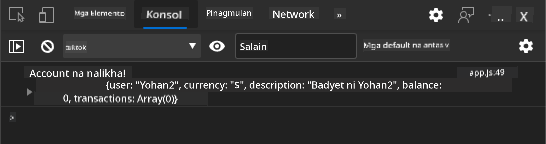
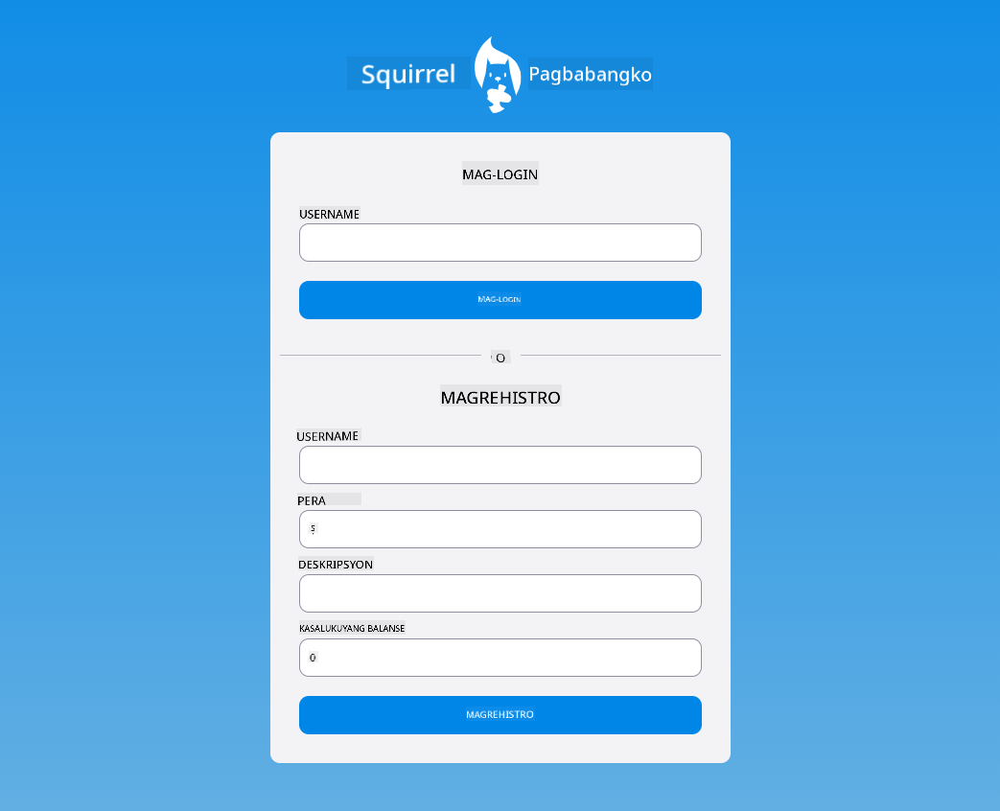

<!--
CO_OP_TRANSLATOR_METADATA:
{
  "original_hash": "b667b7d601e2ee19acb5aa9d102dc9f3",
  "translation_date": "2025-08-27T22:08:06+00:00",
  "source_file": "7-bank-project/2-forms/README.md",
  "language_code": "tl"
}
-->
# Gumawa ng Banking App Bahagi 2: Gumawa ng Login at Registration Form

## Pre-Lecture Quiz

[Pre-lecture quiz](https://ff-quizzes.netlify.app/web/quiz/43)

### Panimula

Sa halos lahat ng modernong web apps, maaari kang gumawa ng account para magkaroon ng sarili mong pribadong espasyo. Dahil maraming user ang maaaring mag-access ng web app nang sabay-sabay, kailangan mo ng mekanismo para maimbak ang personal na data ng bawat user nang hiwalay at piliin kung aling impormasyon ang ipapakita. Hindi natin tatalakayin kung paano pamahalaan ang [user identity nang ligtas](https://en.wikipedia.org/wiki/Authentication) dahil ito ay isang malawak na paksa, ngunit titiyakin natin na ang bawat user ay maaaring gumawa ng isa (o higit pa) na bank account sa ating app.

Sa bahaging ito, gagamit tayo ng HTML forms para magdagdag ng login at registration sa ating web app. Makikita natin kung paano ipadala ang data sa server API nang programmatically, at sa huli kung paano magtakda ng mga pangunahing panuntunan sa pag-validate ng user inputs.

### Kinakailangan

Kailangan mong matapos ang [HTML templates at routing](../1-template-route/README.md) ng web app para sa araling ito. Kailangan mo rin i-install ang [Node.js](https://nodejs.org) at [patakbuhin ang server API](../api/README.md) nang lokal para makapagpadala ng data sa paggawa ng mga account.

**Tandaan**
Magkakaroon ka ng dalawang terminal na tumatakbo nang sabay-sabay tulad ng nakalista sa ibaba:
1. Para sa pangunahing banking app na ginawa natin sa [HTML templates at routing](../1-template-route/README.md) na aralin.
2. Para sa [Bank APP server API](../api/README.md) na kakasetup lang natin.

Kailangan mong patakbuhin ang dalawang server para masundan ang natitirang bahagi ng aralin. Ang mga ito ay nakikinig sa magkaibang ports (port `3000` at port `5000`) kaya dapat gumana nang maayos ang lahat.

Maaari mong subukan kung tumatakbo nang maayos ang server sa pamamagitan ng pag-execute ng command na ito sa terminal:

```sh
curl http://localhost:5000/api
# -> should return "Bank API v1.0.0" as a result
```

---

## Form at mga kontrol

Ang `<form>` na elemento ay naglalaman ng isang seksyon ng HTML document kung saan maaaring mag-input at mag-submit ng data ang user gamit ang mga interactive na kontrol. Maraming uri ng user interface (UI) controls na maaaring gamitin sa loob ng form, ang pinaka-karaniwan ay ang `<input>` at `<button>` na mga elemento.

Maraming iba't ibang [uri](https://developer.mozilla.org/docs/Web/HTML/Element/input) ng `<input>`, halimbawa, para gumawa ng field kung saan maaaring ilagay ng user ang kanyang username, maaari mong gamitin:

```html
<input id="username" name="username" type="text">
```

Ang `name` na attribute ay gagamitin bilang property name kapag ang form data ay ipapadala. Ang `id` na attribute ay ginagamit para i-associate ang `<label>` sa form control.

> Tingnan ang buong listahan ng [`<input>` types](https://developer.mozilla.org/docs/Web/HTML/Element/input) at [iba pang form controls](https://developer.mozilla.org/docs/Learn/Forms/Other_form_controls) para magkaroon ng ideya sa lahat ng native UI elements na maaari mong gamitin sa paggawa ng iyong UI.

✅ Tandaan na ang `<input>` ay isang [empty element](https://developer.mozilla.org/docs/Glossary/Empty_element) kung saan *hindi* mo dapat magdagdag ng matching closing tag. Maaari mo namang gamitin ang self-closing `<input/>` notation, ngunit hindi ito kinakailangan.

Ang `<button>` na elemento sa loob ng form ay medyo espesyal. Kung hindi mo ispesipika ang `type` na attribute nito, awtomatiko nitong isusumite ang form data sa server kapag pinindot. Narito ang mga posibleng `type` values:

- `submit`: Ang default sa loob ng `<form>`, ang button ay nagti-trigger ng form submit action.
- `reset`: Ang button ay nire-reset ang lahat ng form controls sa kanilang initial values.
- `button`: Walang default na behavior kapag pinindot ang button. Maaari kang mag-assign ng custom actions dito gamit ang JavaScript.

### Gawain

Simulan natin sa pagdagdag ng form sa `login` template. Kailangan natin ng *username* field at isang *Login* button.

```html
<template id="login">
  <h1>Bank App</h1>
  <section>
    <h2>Login</h2>
    <form id="loginForm">
      <label for="username">Username</label>
      <input id="username" name="user" type="text">
      <button>Login</button>
    </form>
  </section>
</template>
```

Kung titingnan mo nang mas malapit, mapapansin mo na nagdagdag din tayo ng `<label>` na elemento dito. Ang `<label>` na mga elemento ay ginagamit para magdagdag ng pangalan sa UI controls, tulad ng ating username field. Ang mga label ay mahalaga para sa readability ng iyong mga form, ngunit may karagdagang benepisyo rin:

- Sa pamamagitan ng pag-associate ng label sa form control, nakakatulong ito sa mga user na gumagamit ng assistive technologies (tulad ng screen reader) para maunawaan kung anong data ang inaasahang ibigay.
- Maaari mong i-click ang label para direktang mag-focus sa associated input, na mas madaling maabot sa mga touch-screen na device.

> [Accessibility](https://developer.mozilla.org/docs/Learn/Accessibility/What_is_accessibility) sa web ay isang napakahalagang paksa na madalas na hindi napapansin. Salamat sa [semantic HTML elements](https://developer.mozilla.org/docs/Learn/Accessibility/HTML), hindi mahirap gumawa ng accessible na content kung gagamitin mo ito nang tama. Maaari kang [magbasa pa tungkol sa accessibility](https://developer.mozilla.org/docs/Web/Accessibility) para maiwasan ang mga karaniwang pagkakamali at maging isang responsableng developer.

Ngayon magdadagdag tayo ng pangalawang form para sa registration, sa ibaba lang ng nauna:

```html
<hr/>
<h2>Register</h2>
<form id="registerForm">
  <label for="user">Username</label>
  <input id="user" name="user" type="text">
  <label for="currency">Currency</label>
  <input id="currency" name="currency" type="text" value="$">
  <label for="description">Description</label>
  <input id="description" name="description" type="text">
  <label for="balance">Current balance</label>
  <input id="balance" name="balance" type="number" value="0">
  <button>Register</button>
</form>
```

Gamit ang `value` na attribute, maaari tayong magtakda ng default na halaga para sa isang input. Mapapansin mo rin na ang input para sa `balance` ay may `number` na uri. Mukha bang iba ito sa ibang inputs? Subukan itong i-interact.

✅ Maaari mo bang i-navigate at i-interact ang mga form gamit lamang ang keyboard? Paano mo ito gagawin?

## Pag-submit ng data sa server

Ngayon na mayroon na tayong functional na UI, ang susunod na hakbang ay ipadala ang data sa server. Subukan natin ang kasalukuyang code: ano ang mangyayari kapag pinindot mo ang *Login* o *Register* button?

Napansin mo ba ang pagbabago sa URL ng iyong browser?


Ang default na aksyon para sa `<form>` ay isubmit ang form sa kasalukuyang server URL gamit ang [GET method](https://www.w3.org/Protocols/rfc2616/rfc2616-sec9.html#sec9.3), na idinadagdag ang form data direkta sa URL. Gayunpaman, may ilang limitasyon ang pamamaraang ito:

- Ang data na ipinadala ay napakalimitado sa laki (mga 2000 characters).
- Ang data ay direktang nakikita sa URL (hindi maganda para sa mga password).
- Hindi ito gumagana sa file uploads.

Kaya maaari mo itong baguhin upang gamitin ang [POST method](https://www.w3.org/Protocols/rfc2616/rfc2616-sec9.html#sec9.5) na nagpapadala ng form data sa server sa body ng HTTP request, nang walang mga naunang limitasyon.

> Bagama't ang POST ang pinaka-karaniwang ginagamit na method para magpadala ng data, [sa ilang partikular na sitwasyon](https://www.w3.org/2001/tag/doc/whenToUseGet.html) mas mainam gamitin ang GET method, tulad ng sa pag-implement ng search field.

### Gawain

Magdagdag ng `action` at `method` properties sa registration form:

```html
<form id="registerForm" action="//localhost:5000/api/accounts" method="POST">
```

Ngayon subukan mag-register ng bagong account gamit ang iyong pangalan. Pagkatapos pindutin ang *Register* button, dapat kang makakita ng ganito:


Kung maayos ang lahat, sasagot ang server sa iyong request gamit ang [JSON](https://www.json.org/json-en.html) response na naglalaman ng account data na ginawa.

✅ Subukan mag-register ulit gamit ang parehong pangalan. Ano ang nangyayari?

## Pag-submit ng data nang hindi nire-reload ang page

Tulad ng napansin mo, may bahagyang isyu sa pamamaraang ginamit natin: kapag sinubmit ang form, lumalabas tayo sa app at ang browser ay nagre-redirect sa server URL. Sinusubukan nating iwasan ang lahat ng page reloads sa ating web app, dahil gumagawa tayo ng [Single-page application (SPA)](https://en.wikipedia.org/wiki/Single-page_application).

Para maipadala ang form data sa server nang hindi nire-reload ang page, kailangan nating gumamit ng JavaScript code. Sa halip na maglagay ng URL sa `action` property ng `<form>` na elemento, maaari kang gumamit ng anumang JavaScript code na may prefix na `javascript:` string para magsagawa ng custom na aksyon. Gamit ito, kailangan mong i-implement ang ilang mga gawain na dati ay awtomatikong ginagawa ng browser:

- Kunin ang form data.
- I-convert at i-encode ang form data sa angkop na format.
- Gumawa ng HTTP request at ipadala ito sa server.

### Gawain

Palitan ang `action` ng registration form ng:

```html
<form id="registerForm" action="javascript:register()">
```

Buksan ang `app.js` at magdagdag ng bagong function na tinatawag na `register`:

```js
function register() {
  const registerForm = document.getElementById('registerForm');
  const formData = new FormData(registerForm);
  const data = Object.fromEntries(formData);
  const jsonData = JSON.stringify(data);
}
```

Dito kinukuha natin ang form element gamit ang `getElementById()` at ginagamit ang [`FormData`](https://developer.mozilla.org/docs/Web/API/FormData) helper para kunin ang mga halaga mula sa form controls bilang isang set ng key/value pairs. Pagkatapos, kino-convert natin ang data sa regular na object gamit ang [`Object.fromEntries()`](https://developer.mozilla.org/docs/Web/JavaScript/Reference/Global_Objects/Object/fromEntries) at sa huli ay sine-serialize ang data sa [JSON](https://www.json.org/json-en.html), isang format na karaniwang ginagamit para sa pagpapalitan ng data sa web.

Ang data ay handa na para ipadala sa server. Gumawa ng bagong function na tinatawag na `createAccount`:

```js
async function createAccount(account) {
  try {
    const response = await fetch('//localhost:5000/api/accounts', {
      method: 'POST',
      headers: { 'Content-Type': 'application/json' },
      body: account
    });
    return await response.json();
  } catch (error) {
    return { error: error.message || 'Unknown error' };
  }
}
```

Ano ang ginagawa ng function na ito? Una, pansinin ang `async` keyword dito. Ibig sabihin nito na ang function ay naglalaman ng code na mag-e-execute [**asynchronously**](https://developer.mozilla.org/docs/Web/JavaScript/Reference/Statements/async_function). Kapag ginamit kasabay ng `await` keyword, pinapayagan nitong maghintay para sa asynchronous code na mag-execute - tulad ng paghihintay para sa server response dito - bago magpatuloy.

Narito ang isang mabilis na video tungkol sa paggamit ng `async/await`:

[](https://youtube.com/watch?v=YwmlRkrxvkk "Async at Await para sa pamamahala ng promises")

> 🎥 I-click ang imahe sa itaas para sa video tungkol sa async/await.

Ginagamit natin ang `fetch()` API para magpadala ng JSON data sa server. Ang method na ito ay tumatanggap ng 2 parameters:

- Ang URL ng server, kaya inilalagay natin dito ang `//localhost:5000/api/accounts`.
- Ang mga settings ng request. Dito natin itinatakda ang method sa `POST` at ibinibigay ang `body` para sa request. Dahil nagpapadala tayo ng JSON data sa server, kailangan din nating itakda ang `Content-Type` header sa `application/json` para malaman ng server kung paano i-interpret ang content.

Dahil ang server ay magre-respond sa request gamit ang JSON, maaari nating gamitin ang `await response.json()` para i-parse ang JSON content at ibalik ang resulting object. Tandaan na ang method na ito ay asynchronous, kaya ginagamit natin ang `await` keyword dito bago mag-return para tiyakin na ang anumang error sa panahon ng parsing ay mahuhuli rin.

Ngayon magdagdag ng ilang code sa `register` function para tawagin ang `createAccount()`:

```js
const result = await createAccount(jsonData);
```

Dahil ginagamit natin ang `await` keyword dito, kailangan nating idagdag ang `async` keyword bago ang register function:

```js
async function register() {
```

Sa wakas, magdagdag ng ilang logs para i-check ang resulta. Ang final na function ay dapat ganito:

```js
async function register() {
  const registerForm = document.getElementById('registerForm');
  const formData = new FormData(registerForm);
  const jsonData = JSON.stringify(Object.fromEntries(formData));
  const result = await createAccount(jsonData);

  if (result.error) {
    return console.log('An error occurred:', result.error);
  }

  console.log('Account created!', result);
}
```

Medyo mahaba pero narating natin! Kung bubuksan mo ang [browser developer tools](https://developer.mozilla.org/docs/Learn/Common_questions/What_are_browser_developer_tools), at subukang mag-register ng bagong account, hindi mo dapat makita ang anumang pagbabago sa web page ngunit may lalabas na mensahe sa console na nagkukumpirma na gumagana ang lahat.



✅ Sa tingin mo ba ang data ay ipinapadala sa server nang ligtas? Paano kung may makakaintercept ng request? Maaari kang magbasa tungkol sa [HTTPS](https://en.wikipedia.org/wiki/HTTPS) para malaman ang higit pa tungkol sa secure na komunikasyon ng data.

## Pag-validate ng data

Kung susubukan mong mag-register ng bagong account nang hindi nagse-set ng username, makikita mo na ang server ay nagbabalik ng error na may status code [400 (Bad Request)](https://developer.mozilla.org/docs/Web/HTTP/Status/400#:~:text=The%20HyperText%20Transfer%20Protocol%20(HTTP,%2C%20or%20deceptive%20request%20routing).).

Bago magpadala ng data sa server, magandang kasanayan ang [pag-validate ng form data](https://developer.mozilla.org/docs/Learn/Forms/Form_validation) para tiyakin na magpapadala ka ng valid na request. Ang HTML5 forms controls ay nagbibigay ng built-in validation gamit ang iba't ibang attributes:

- `required`: kailangang punan ang field kung hindi, hindi masusubmit ang form.
- `minlength` at `maxlength`: tumutukoy sa minimum at maximum na bilang ng characters sa text fields.
- `min` at `max`: tumutukoy sa minimum at maximum na halaga ng numerical field.
- `type`: tumutukoy sa uri ng data na inaasahan, tulad ng `number`, `email`, `file` o [iba pang built-in types](https://developer.mozilla.org/docs/Web/HTML/Element/input). Ang attribute na ito ay maaaring magbago rin ng visual rendering ng form control.
- `pattern`: nagbibigay-daan para magtakda ng [regular expression](https://developer.mozilla.org/docs/Web/JavaScript/Guide/Regular_Expressions) pattern para masuri kung ang ipinasok na data ay valid o hindi.
Tip: maaari mong i-customize ang hitsura ng iyong mga form controls depende kung valid o hindi gamit ang `:valid` at `:invalid` na CSS pseudo-classes.
### Gawain

Mayroong 2 kinakailangang field upang makagawa ng valid na bagong account: ang username at currency. Ang iba pang mga field ay opsyonal. I-update ang HTML ng form, gamit ang `required` na attribute at teksto sa label ng field upang:

```html
<label for="user">Username (required)</label>
<input id="user" name="user" type="text" required>
...
<label for="currency">Currency (required)</label>
<input id="currency" name="currency" type="text" value="$" required>
```

Bagamat ang partikular na server implementation na ito ay hindi nagtatakda ng tiyak na limitasyon sa maximum na haba ng mga field, palaging magandang kasanayan ang magtakda ng makatwirang limitasyon para sa anumang user text entry.

Magdagdag ng `maxlength` na attribute sa mga text field:

```html
<input id="user" name="user" type="text" maxlength="20" required>
...
<input id="currency" name="currency" type="text" value="$" maxlength="5" required>
...
<input id="description" name="description" type="text" maxlength="100">
```

Ngayon, kung pipindutin mo ang *Register* na button at may field na hindi sumusunod sa validation rule na ating itinakda, makikita mo ang ganito:


Ang validation na tulad nito na ginagawa *bago* magpadala ng anumang data sa server ay tinatawag na **client-side** validation. Ngunit tandaan na hindi palaging posible na gawin ang lahat ng pagsusuri nang hindi ipinapadala ang data. Halimbawa, hindi natin masusuri dito kung may account na umiiral gamit ang parehong username nang hindi nagpapadala ng request sa server. Ang karagdagang validation na ginagawa sa server ay tinatawag na **server-side** validation.

Karaniwang kailangang ipatupad ang pareho, at habang ang paggamit ng client-side validation ay nagpapabuti sa karanasan ng user sa pamamagitan ng pagbibigay ng instant na feedback, ang server-side validation ay mahalaga upang matiyak na ang user data na iyong pinoproseso ay maayos at ligtas.

---

## 🚀 Hamon

Magpakita ng error message sa HTML kung ang user ay umiiral na.

Narito ang isang halimbawa kung paano maaaring magmukha ang final login page pagkatapos ng kaunting pag-istilo:



## Post-Lecture Quiz

[Post-lecture quiz](https://ff-quizzes.netlify.app/web/quiz/44)

## Review & Pag-aaral sa Sarili

Ang mga developer ay naging napaka-malikhain sa kanilang mga pagsisikap sa paggawa ng form, lalo na sa mga validation strategy. Alamin ang iba't ibang daloy ng form sa pamamagitan ng pagtingin sa [CodePen](https://codepen.com); makakakita ka ba ng mga kawili-wili at nakaka-inspire na mga form?

## Takdang-Aralin

[Istiluhin ang iyong bank app](assignment.md)

---

**Paunawa**:  
Ang dokumentong ito ay isinalin gamit ang AI translation service na [Co-op Translator](https://github.com/Azure/co-op-translator). Bagama't sinisikap naming maging tumpak, tandaan na ang mga awtomatikong pagsasalin ay maaaring maglaman ng mga pagkakamali o hindi pagkakatugma. Ang orihinal na dokumento sa kanyang katutubong wika ang dapat ituring na opisyal na sanggunian. Para sa mahalagang impormasyon, inirerekomenda ang propesyonal na pagsasalin ng tao. Hindi kami mananagot sa anumang hindi pagkakaunawaan o maling interpretasyon na maaaring magmula sa paggamit ng pagsasaling ito.