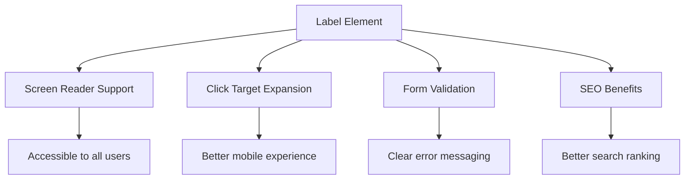
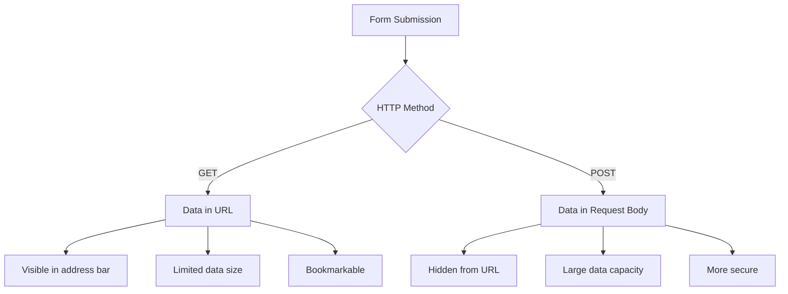
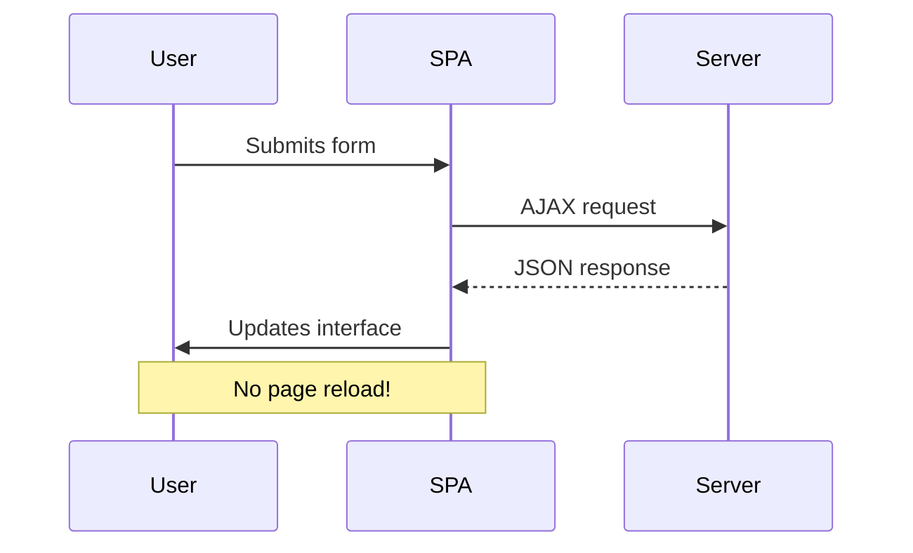
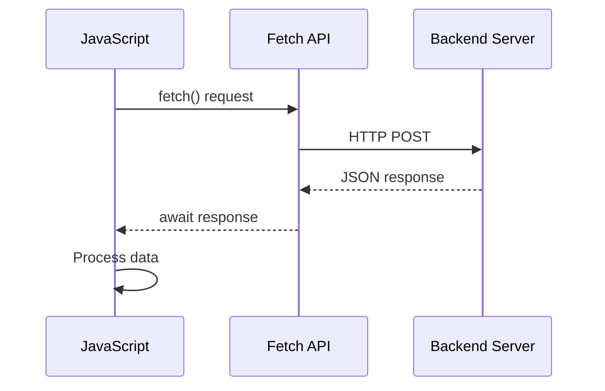
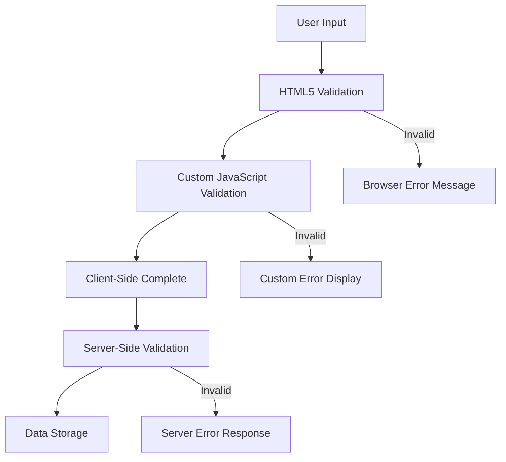
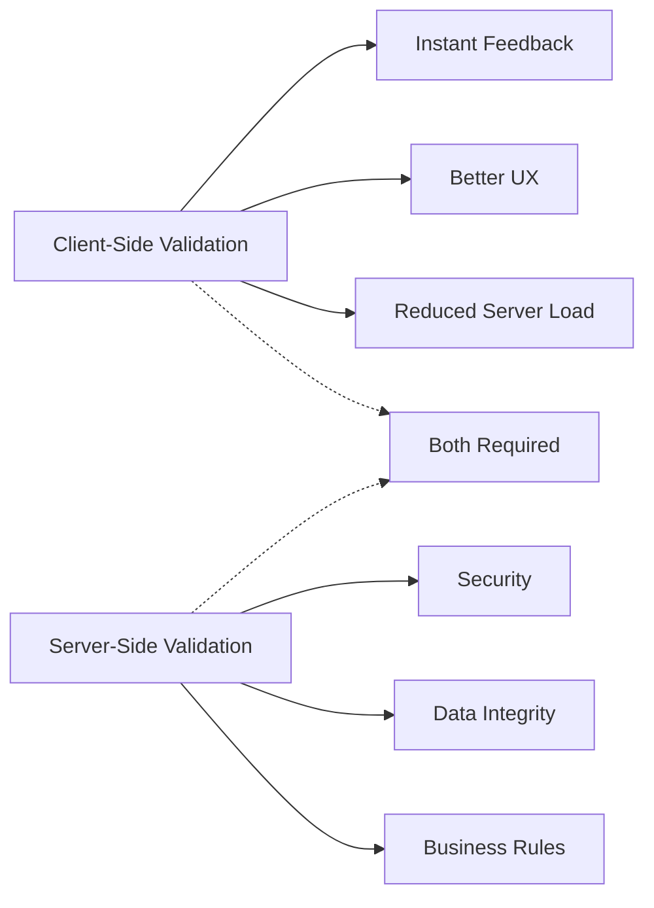

<!--
CO_OP_TRANSLATOR_METADATA:
{
  "original_hash": "b24f28fc46dd473aa9080f174182adde",
  "translation_date": "2025-10-22T15:36:46+00:00",
  "source_file": "7-bank-project/2-forms/README.md",
  "language_code": "tl"
}
-->
# Gumawa ng Banking App Bahagi 2: Gumawa ng Login at Registration Form

## Pre-Lecture Quiz

[Pre-lecture quiz](https://ff-quizzes.netlify.app/web/quiz/43)

Naranasan mo na bang mag-fill out ng form online at ma-reject ang email format mo? O kaya naman ay mawala ang lahat ng impormasyon mo pagkatapos mong mag-click ng submit? Lahat tayo ay nakaranas ng ganitong nakakainis na karanasan.

Ang mga form ay nagsisilbing tulay sa pagitan ng mga user at ng functionality ng iyong application. Tulad ng maingat na protocol na ginagamit ng mga air traffic controller para gabayan ang mga eroplano sa kanilang destinasyon, ang maayos na disenyo ng mga form ay nagbibigay ng malinaw na feedback at pumipigil sa mga mahal na pagkakamali. Ang mga hindi maayos na form, sa kabilang banda, ay maaaring magtulak sa mga user na umalis nang mas mabilis kaysa sa isang miscommunication sa abalang paliparan.

Sa araling ito, gagawin nating interactive ang iyong static banking app. Matututo kang gumawa ng mga form na nagva-validate ng user input, nakikipag-ugnayan sa mga server, at nagbibigay ng kapaki-pakinabang na feedback. Isipin mo ito bilang paggawa ng control interface na magpapahintulot sa mga user na mag-navigate sa mga feature ng iyong application.

Sa pagtatapos, magkakaroon ka ng kumpletong login at registration system na may validation na gagabay sa mga user patungo sa tagumpay sa halip na sa pagkabigo.

## Mga Kinakailangan

Bago tayo magsimula sa paggawa ng mga form, siguraduhin muna natin na maayos ang iyong setup. Ang araling ito ay magpapatuloy mula sa huling bahagi ng nakaraang aralin, kaya kung lumaktaw ka, maaaring gusto mong balikan muna ang mga pangunahing kaalaman.

### Kinakailangang Setup

| Komponent | Status | Deskripsyon |
|-----------|--------|-------------|
| [HTML Templates](../1-template-route/README.md) | ✅ Kinakailangan | Ang pangunahing istruktura ng banking app mo |
| [Node.js](https://nodejs.org) | ✅ Kinakailangan | JavaScript runtime para sa server |
| [Bank API Server](../api/README.md) | ✅ Kinakailangan | Backend service para sa data storage |

> 💡 **Tip sa Pag-develop**: Magpapatakbo ka ng dalawang magkahiwalay na server nang sabay – isa para sa iyong front-end banking app at isa pa para sa backend API. Ang setup na ito ay sumasalamin sa totoong mundo ng pag-develop kung saan ang mga frontend at backend service ay gumagana nang magkahiwalay.

### Konfigurasyon ng Server

**Ang iyong development environment ay maglalaman ng:**
- **Frontend server**: Nagse-serve sa iyong banking app (karaniwang port `3000`)
- **Backend API server**: Nagha-handle ng data storage at retrieval (port `5000`)
- **Parehong server** ay maaaring magpatakbo nang sabay-sabay nang walang conflict

**Pagsubok sa iyong API connection:**
```bash
curl http://localhost:5000/api
# Expected response: "Bank API v1.0.0"
```

**Kung makikita mo ang API version response, handa ka nang magpatuloy!**

---

## Pag-unawa sa HTML Forms at Controls

Ang HTML forms ang paraan kung paano nakikipag-ugnayan ang mga user sa iyong web application. Isipin mo ito bilang telegraph system na nag-uugnay sa mga malalayong lugar noong ika-19 na siglo – ito ang communication protocol sa pagitan ng intensyon ng user at tugon ng application. Kapag maayos ang disenyo, nahuhuli nito ang mga error, ginagabayan ang input formatting, at nagbibigay ng kapaki-pakinabang na mungkahi.

Ang mga modernong form ay mas sopistikado kaysa sa mga simpleng text inputs. Ang HTML5 ay nagpakilala ng mga specialized input types na awtomatikong nagha-handle ng email validation, number formatting, at date selection. Ang mga improvement na ito ay kapaki-pakinabang para sa accessibility at mobile user experiences.

### Mahahalagang Elemento ng Form

**Mga building blocks na kailangan ng bawat form:**

```html
<!-- Basic form structure -->
<form id="userForm" method="POST">
  <label for="username">Username</label>
  <input id="username" name="username" type="text" required>
  
  <button type="submit">Submit</button>
</form>
```

**Ang ginagawa ng code na ito:**
- **Gumagawa** ng form container na may natatanging identifier
- **Nagtatakda** ng HTTP method para sa data submission
- **Nag-a-associate** ng labels sa inputs para sa accessibility
- **Nagde-define** ng submit button para i-process ang form

### Mga Modernong Input Types at Attributes

| Input Type | Layunin | Halimbawa ng Paggamit |
|------------|---------|-----------------------|
| `text` | Pangkalahatang text input | `<input type="text" name="username">` |
| `email` | Email validation | `<input type="email" name="email">` |
| `password` | Nakatagong text entry | `<input type="password" name="password">` |
| `number` | Numeric input | `<input type="number" name="balance" min="0">` |
| `tel` | Mga numero ng telepono | `<input type="tel" name="phone">` |

> 💡 **Advantage ng Modern HTML5**: Ang paggamit ng specific input types ay nagbibigay ng automatic validation, angkop na mobile keyboards, at mas mahusay na accessibility support nang walang karagdagang JavaScript!

### Mga Uri ng Button at Kanilang Behavior

```html
<!-- Different button behaviors -->
<button type="submit">Save Data</button>     <!-- Submits the form -->
<button type="reset">Clear Form</button>    <!-- Resets all fields -->
<button type="button">Custom Action</button> <!-- No default behavior -->
```

**Ang ginagawa ng bawat uri ng button:**
- **Submit buttons**: Nagti-trigger ng form submission at nagpapadala ng data sa tinukoy na endpoint
- **Reset buttons**: Ibinabalik ang lahat ng form fields sa kanilang initial state
- **Regular buttons**: Walang default na behavior, nangangailangan ng custom na JavaScript para sa functionality

> ⚠️ **Mahalagang Paalala**: Ang `<input>` element ay self-closing at hindi nangangailangan ng closing tag. Ang modernong best practice ay isulat ang `<input>` nang walang slash.

### Paggawa ng Iyong Login Form

Ngayon, gagawa tayo ng praktikal na login form na nagpapakita ng mga modernong HTML form practices. Magsisimula tayo sa basic na istruktura at unti-unting i-enhance ito gamit ang accessibility features at validation.

```html
<template id="login">
  <h1>Bank App</h1>
  <section>
    <h2>Login</h2>
    <form id="loginForm" novalidate>
      <div class="form-group">
        <label for="username">Username</label>
        <input id="username" name="user" type="text" required 
               autocomplete="username" placeholder="Enter your username">
      </div>
      <button type="submit">Login</button>
    </form>
  </section>
</template>
```

**Pagbubuo ng nangyayari dito:**
- **Istruktura** ang form gamit ang semantic HTML5 elements
- **I-group** ang mga related na elemento gamit ang `div` containers na may meaningful classes
- **I-associate** ang labels sa inputs gamit ang `for` at `id` attributes
- **Magdagdag** ng modernong attributes tulad ng `autocomplete` at `placeholder` para sa mas mahusay na UX
- **Magdagdag** ng `novalidate` para i-handle ang validation gamit ang JavaScript sa halip na default ng browser

### Ang Kapangyarihan ng Tamang Labels

**Bakit mahalaga ang labels para sa modernong web development:**



**Ang nagagawa ng tamang labels:**
- **Nagpapahintulot** sa screen readers na malinaw na i-announce ang mga form fields
- **Pinalalawak** ang clickable area (ang pag-click sa label ay nagfo-focus sa input)
- **Pinapabuti** ang mobile usability gamit ang mas malalaking touch targets
- **Sumusuporta** sa form validation gamit ang meaningful error messages
- **Pinapahusay** ang SEO sa pamamagitan ng pagbibigay ng semantic na kahulugan sa mga form elements

> 🎯 **Layunin ng Accessibility**: Ang bawat form input ay dapat may kaugnay na label. Ang simpleng practice na ito ay ginagawang magagamit ang iyong mga form ng lahat, kabilang ang mga user na may kapansanan, at pinapabuti ang karanasan para sa lahat ng user.

### Paggawa ng Registration Form

Ang registration form ay nangangailangan ng mas detalyadong impormasyon para makagawa ng kumpletong user account. Gagawa tayo nito gamit ang mga modernong HTML5 features at pinahusay na accessibility.

```html
<hr/>
<h2>Register</h2>
<form id="registerForm" novalidate>
  <div class="form-group">
    <label for="user">Username</label>
    <input id="user" name="user" type="text" required 
           autocomplete="username" placeholder="Choose a username">
  </div>
  
  <div class="form-group">
    <label for="currency">Currency</label>
    <input id="currency" name="currency" type="text" value="$" 
           required maxlength="3" placeholder="USD, EUR, etc.">
  </div>
  
  <div class="form-group">
    <label for="description">Account Description</label>
    <input id="description" name="description" type="text" 
           maxlength="100" placeholder="Personal savings, checking, etc.">
  </div>
  
  <div class="form-group">
    <label for="balance">Starting Balance</label>
    <input id="balance" name="balance" type="number" value="0" 
           min="0" step="0.01" placeholder="0.00">
  </div>
  
  <button type="submit">Create Account</button>
</form>
```

**Sa itaas, ginawa natin ang:**
- **Inorganisa** ang bawat field sa container divs para sa mas magandang styling at layout
- **Nagdagdag** ng angkop na `autocomplete` attributes para sa browser autofill support
- **Naglagay** ng kapaki-pakinabang na placeholder text para gabayan ang user input
- **Nagtakda** ng mga sensible defaults gamit ang `value` attribute
- **Nag-apply** ng validation attributes tulad ng `required`, `maxlength`, at `min`
- **Gumamit** ng `type="number"` para sa balance field na may decimal support

### Pag-explore ng Input Types at Behavior

**Ang mga modernong input types ay nagbibigay ng mas pinahusay na functionality:**

| Feature | Benepisyo | Halimbawa |
|---------|-----------|----------|
| `type="number"` | Numeric keypad sa mobile | Mas madaling pagpasok ng balance |
| `step="0.01"` | Kontrol sa decimal precision | Pinapayagan ang cents sa currency |
| `autocomplete` | Browser autofill | Mas mabilis na pag-fill out ng form |
| `placeholder` | Contextual hints | Gabay sa inaasahan ng user |

> 🎯 **Hamon sa Accessibility**: Subukang mag-navigate sa mga form gamit lamang ang iyong keyboard! Gamitin ang `Tab` para lumipat sa pagitan ng mga field, `Space` para mag-check ng mga checkbox, at `Enter` para mag-submit. Ang karanasang ito ay makakatulong sa iyong maunawaan kung paano nakikipag-ugnayan ang mga screen reader users sa iyong mga form.

## Pag-unawa sa Mga Paraan ng Pag-submit ng Form

Kapag may nag-fill out ng iyong form at nag-click ng submit, kailangang mapunta ang data sa isang lugar – karaniwang sa isang server na maaaring mag-save nito. May ilang iba't ibang paraan kung paano ito mangyayari, at ang pag-alam kung alin ang gagamitin ay makakapagligtas sa iyo mula sa ilang sakit ng ulo sa hinaharap.

Tingnan natin kung ano ang talagang nangyayari kapag may nag-click ng submit button.

### Default na Behavior ng Form

Una, obserbahan natin kung ano ang nangyayari sa basic na form submission:

**Subukan ang iyong kasalukuyang mga form:**
1. I-click ang *Register* button sa iyong form
2. Obserbahan ang mga pagbabago sa address bar ng iyong browser
3. Pansinin kung paano nagre-reload ang page at lumalabas ang data sa URL


### Paghahambing ng HTTP Methods



**Pag-unawa sa mga pagkakaiba:**

| Method | Gamit | Lokasyon ng Data | Antas ng Seguridad | Limitasyon sa Laki |
|--------|-------|------------------|--------------------|--------------------|
| `GET` | Mga search query, filters | URL parameters | Mababa (visible) | ~2000 characters |
| `POST` | Mga user account, sensitibong data | Request body | Mas mataas (hidden) | Walang praktikal na limitasyon |

**Pag-unawa sa mga pangunahing pagkakaiba:**
- **GET**: Idinadagdag ang form data sa URL bilang query parameters (angkop para sa search operations)
- **POST**: Isinasama ang data sa request body (mahalaga para sa sensitibong impormasyon)
- **Limitasyon ng GET**: Mga size constraints, visible na data, persistent browser history
- **Mga Bentahe ng POST**: Malaking kapasidad ng data, proteksyon sa privacy, suporta sa file upload

> 💡 **Pinakamainam na Practice**: Gamitin ang `GET` para sa mga search forms at filters (data retrieval), gamitin ang `POST` para sa user registration, login, at data creation.

### Pag-configure ng Form Submission

I-configure natin ang iyong registration form para maayos na makipag-ugnayan sa backend API gamit ang POST method:

```html
<form id="registerForm" action="//localhost:5000/api/accounts" 
      method="POST" novalidate>
```

**Ang ginagawa ng configuration na ito:**
- **Itinuturo** ang form submission sa iyong API endpoint
- **Gumagamit** ng POST method para sa secure na data transmission
- **Naglalaman** ng `novalidate` para i-handle ang validation gamit ang JavaScript

### Pagsubok sa Form Submission

**Sundin ang mga hakbang na ito para subukan ang iyong form:**
1. **I-fill out** ang registration form gamit ang iyong impormasyon
2. **I-click** ang "Create Account" button
3. **Obserbahan** ang server response sa iyong browser


**Ang dapat mong makita:**
- **Nagre-redirect ang browser** sa API endpoint URL
- **JSON response** na naglalaman ng iyong bagong account data
- **Kumpirmasyon ng server** na matagumpay na nalikha ang account

> 🧪 **Panahon ng Eksperimento**: Subukang mag-register muli gamit ang parehong username. Anong response ang makukuha mo? Makakatulong ito sa iyong maunawaan kung paano hinahandle ng server ang duplicate na data at error conditions.

### Pag-unawa sa JSON Responses

**Kapag matagumpay na na-process ng server ang iyong form:**
```json
{
  "user": "john_doe",
  "currency": "$",
  "description": "Personal savings",
  "balance": 100,
  "id": "unique_account_id"
}
```

**Kinukumpirma ng response na ito:**
- **Gumagawa** ng bagong account gamit ang iyong tinukoy na data
- **Nag-a-assign** ng natatanging identifier para sa future reference
- **Nagbabalik** ng lahat ng impormasyon ng account para sa verification
- **Nagpapahiwatig** ng matagumpay na database storage

## Modernong Pag-handle ng Form gamit ang JavaScript

Ang tradisyunal na form submissions ay nagdudulot ng full page reloads, katulad ng kung paano ang mga maagang space missions ay nangangailangan ng complete system resets para sa course corrections. Ang approach na ito ay nakakaabala sa user experience at nawawala ang application state.

Ang JavaScript form handling ay gumagana tulad ng continuous guidance systems na ginagamit ng modernong spacecraft – gumagawa ng real-time adjustments nang hindi nawawala ang navigation context. Maaari nating i-intercept ang form submissions, magbigay ng agarang feedback, maayos na mag-handle ng errors, at i-update ang interface base sa server responses habang pinapanatili ang posisyon ng user sa application.

### Bakit Iwasan ang Page Reloads?



**Mga Benepisyo ng JavaScript form handling:**
- **Pinapanatili** ang application state at user context
- **Nagbibigay** ng instant feedback at loading indicators
- **Nagpapahintulot** ng dynamic error handling at validation
- **Lumilikha** ng smooth, app-like user experiences
- **Nagpapahintulot** ng conditional logic base sa server responses

### Paglipat mula Tradisyunal patungo sa Modernong Forms

**Mga hamon sa tradisyunal na approach:**
- **Nagre-redirect** sa mga user palayo sa iyong application
- **Nawawala** ang kasalukuyang application state at context
- **Nangangailangan** ng full page reloads para sa simpleng operations
- **Nagbibigay** ng limitadong kontrol sa user feedback

**Mga bentahe ng modernong JavaScript approach:**
- **Pinapanatili** ang mga user sa loob ng iyong application
- **Pinapanatili** ang lahat ng application state at data
- **Nagpapahintulot** ng real-time validation at feedback
- **Sumusuporta** sa progressive enhancement at accessibility

### Pag-implement ng JavaScript Form Handling

Palitan natin ang tradisyunal na form submission gamit ang modernong JavaScript event handling:

```html
<!-- Remove the action attribute and add event handling -->
<form id="registerForm" method="POST" novalidate>
```

**Idagdag ang registration logic sa iyong `app.js` file:**

```javascript
// Modern event-driven form handling
function register() {
  const registerForm = document.getElementById('registerForm');
  const formData = new FormData(registerForm);
  const data = Object.fromEntries(formData);
  const jsonData = JSON.stringify(data);
  
  console.log('Form data prepared:', data);
}

// Attach event listener when the page loads
document.addEventListener('DOMContentLoaded', () => {
  const registerForm = document.getElementById('registerForm');
  registerForm.addEventListener('submit', (event) => {
    event.preventDefault(); // Prevent default form submission
    register();
  });
});
```

**Pagbubuo ng nangyayari dito:**
- **Pinipigilan** ang default form submission gamit ang `event.preventDefault()`
- **Kinukuha** ang form element gamit ang modern DOM selection
- **Kinukuha** ang form data gamit ang makapangyarihang `FormData` API
- **Kinoconvert** ang FormData sa plain object gamit ang `Object.fromEntries()`
- **Sine-serialize** ang data sa JSON format para sa server communication
- **Nilolog** ang processed data para sa debugging at verification

### Pag-unawa sa FormData API

**Ang FormData API ay nagbibigay ng makapangyarihang form handling:**

```javascript
// Example of what FormData captures
const formData = new FormData(registerForm);

// FormData automatically captures:
// {
//   "user": "john_doe",
//   "currency": "$", 
//   "description": "Personal account",
//   "balance": "100"
// }
```

**Mga bentahe ng FormData API:**
- **Komprehensibong koleksyon**: Kinukuha ang lahat ng form elements kabilang ang text, files, at complex inputs
- **Type awareness**: Awtomatikong hinahandle ang iba't ibang input types nang walang custom coding
- **Efficiency**: Inaalis ang manual field collection gamit ang isang API call
- **Adaptability**: Pinapanatili ang functionality habang nagbabago ang form structure

### Paggawa ng Server Communication Function

Ngayon, gumawa tayo ng matibay na function para makipag-ugnayan sa iyong API server gamit ang modernong JavaScript patterns:

```javascript
async function createAccount(account) {
  try {
    const response = await fetch('//localhost:5000/api/accounts', {
      method: 'POST',
      headers: { 
        'Content-Type': 'application/json',
        'Accept': 'application/json'
      },
      body: account
    });
    
    // Check if the response was successful
    if (!response.ok) {
      throw new Error(`HTTP error! status: ${response.status}`);
    }
    
    return await response.json();
  } catch (error) {
    console.error('Account creation failed:', error);
    return { error: error.message || 'Network error occurred' };
  }
}
```

**Pag-unawa sa asynchronous JavaScript:**



**Ang nagagawa ng modernong implementasyon na ito:**
- **Gumagamit** ng `async/await` para sa mas nababasang asynchronous code
- **Naglalaman** ng tamang error handling gamit ang try/catch blocks
- **Sinusuri** ang response status bago i-process ang data
- **Nagtatakda** ng angkop na headers para sa JSON communication
- **Nagbibigay** ng detalyadong mensahe ng error para sa debugging
- **Nagbabalik** ng pare-parehong istruktura ng data para sa tagumpay at mga kaso ng error

### Ang Kapangyarihan ng Modernong Fetch API

**Mga bentahe ng Fetch API kumpara sa mga lumang pamamaraan:**

| Tampok | Benepisyo | Implementasyon |
|--------|-----------|----------------|
| Batay sa Promise | Malinis na async na code | `await fetch()` |
| Pag-customize ng request | Buong kontrol sa HTTP | Headers, methods, body |
| Paghawak ng response | Flexible na pag-parse ng data | `.json()`, `.text()`, `.blob()` |
| Paghawak ng error | Komprehensibong pag-catch ng error | Try/catch blocks |

> 🎥 **Matuto Pa**: [Async/Await Tutorial](https://youtube.com/watch?v=YwmlRkrxvkk) - Pag-unawa sa asynchronous na mga pattern ng JavaScript para sa modernong web development.

**Mga pangunahing konsepto para sa komunikasyon sa server:**
- **Async functions** nagbibigay-daan sa pag-pause ng execution para maghintay ng response mula sa server
- **Await keyword** ginagawang parang synchronous ang asynchronous na code
- **Fetch API** nagbibigay ng modernong, promise-based na HTTP requests
- **Paghawak ng error** tinitiyak na ang iyong app ay tumutugon nang maayos sa mga isyu sa network

### Pagtatapos ng Registration Function

Pagsamahin natin ang lahat gamit ang isang kumpleto, handa sa produksyon na registration function:

```javascript
async function register() {
  const registerForm = document.getElementById('registerForm');
  const submitButton = registerForm.querySelector('button[type="submit"]');
  
  try {
    // Show loading state
    submitButton.disabled = true;
    submitButton.textContent = 'Creating Account...';
    
    // Process form data
    const formData = new FormData(registerForm);
    const jsonData = JSON.stringify(Object.fromEntries(formData));
    
    // Send to server
    const result = await createAccount(jsonData);
    
    if (result.error) {
      console.error('Registration failed:', result.error);
      alert(`Registration failed: ${result.error}`);
      return;
    }
    
    console.log('Account created successfully!', result);
    alert(`Welcome, ${result.user}! Your account has been created.`);
    
    // Reset form after successful registration
    registerForm.reset();
    
  } catch (error) {
    console.error('Unexpected error:', error);
    alert('An unexpected error occurred. Please try again.');
  } finally {
    // Restore button state
    submitButton.disabled = false;
    submitButton.textContent = 'Create Account';
  }
}
```

**Ang pinahusay na implementasyon na ito ay naglalaman ng:**
- **Nagbibigay** ng visual na feedback habang nagsusumite ng form
- **Nagdi-disable** ng submit button upang maiwasan ang duplicate na submissions
- **Humahawak** ng parehong inaasahan at hindi inaasahang mga error nang maayos
- **Nagpapakita** ng user-friendly na mga mensahe ng tagumpay at error
- **Nagre-reset** ng form pagkatapos ng matagumpay na registration
- **Nagbabalik** ng UI state anuman ang resulta

### Pagsubok sa Iyong Implementasyon

**Buksan ang developer tools ng iyong browser at subukan ang registration:**

1. **Buksan** ang console ng browser (F12 → Console tab)
2. **Punan** ang registration form
3. **I-click** ang "Create Account"
4. **Obserbahan** ang mga mensahe sa console at feedback ng user


**Ano ang dapat mong makita:**
- **Loading state** lumalabas sa submit button
- **Console logs** nagpapakita ng detalyadong impormasyon tungkol sa proseso
- **Success message** lumalabas kapag matagumpay ang paglikha ng account
- **Form resets** awtomatikong pagkatapos ng matagumpay na pagsusumite

> 🔒 **Pagsasaalang-alang sa Seguridad**: Sa kasalukuyan, ang data ay dumadaan sa HTTP, na hindi ligtas para sa produksyon. Sa mga totoong aplikasyon, palaging gumamit ng HTTPS upang i-encrypt ang transmission ng data. Matuto pa tungkol sa [HTTPS security](https://en.wikipedia.org/wiki/HTTPS) at kung bakit mahalaga ito para sa proteksyon ng data ng user.

## Komprehensibong Pag-validate ng Form

Ang pag-validate ng form ay pumipigil sa nakakainis na karanasan ng pagdiskubre ng mga error pagkatapos ng pagsusumite. Tulad ng maraming redundant na sistema sa International Space Station, ang epektibong pag-validate ay gumagamit ng maraming layer ng safety checks.

Ang pinakamainam na diskarte ay pinagsasama ang browser-level validation para sa agarang feedback, JavaScript validation para sa pinahusay na karanasan ng user, at server-side validation para sa seguridad at integridad ng data. Ang redundancy na ito ay tinitiyak ang kasiyahan ng user at proteksyon ng sistema.

### Pag-unawa sa Validation Layers



**Multi-layer validation strategy:**
- **HTML5 validation**: Agarang browser-based na mga check
- **JavaScript validation**: Custom na lohika at karanasan ng user
- **Server validation**: Panghuling seguridad at mga check sa integridad ng data
- **Progressive enhancement**: Gumagana kahit naka-disable ang JavaScript

### HTML5 Validation Attributes

**Mga modernong validation tools na magagamit mo:**

| Attribute | Layunin | Halimbawa ng Paggamit | Ugali ng Browser |
|-----------|---------|-----------------------|------------------|
| `required` | Mga mandatory na field | `<input required>` | Pinipigilan ang walang laman na pagsusumite |
| `minlength`/`maxlength` | Mga limitasyon sa haba ng text | `<input maxlength="20">` | Nagpapatupad ng limitasyon sa karakter |
| `min`/`max` | Mga saklaw ng numero | `<input min="0" max="1000">` | Nagva-validate ng mga hangganan ng numero |
| `pattern` | Mga custom na regex rules | `<input pattern="[A-Za-z]+">` | Tumutugma sa mga partikular na format |
| `type` | Pag-validate ng uri ng data | `<input type="email">` | Pag-validate ng format na partikular sa uri ng data |

### CSS Validation Styling

**Lumikha ng visual na feedback para sa validation states:**

```css
/* Valid input styling */
input:valid {
  border-color: #28a745;
  background-color: #f8fff9;
}

/* Invalid input styling */
input:invalid {
  border-color: #dc3545;
  background-color: #fff5f5;
}

/* Focus states for better accessibility */
input:focus:valid {
  box-shadow: 0 0 0 0.2rem rgba(40, 167, 69, 0.25);
}

input:focus:invalid {
  box-shadow: 0 0 0 0.2rem rgba(220, 53, 69, 0.25);
}
```

**Ano ang nagagawa ng mga visual na cue na ito:**
- **Green borders**: Nagpapahiwatig ng matagumpay na validation, tulad ng green lights sa mission control
- **Red borders**: Nagpapakita ng mga error sa validation na nangangailangan ng atensyon
- **Focus highlights**: Nagbibigay ng malinaw na visual na konteksto para sa kasalukuyang lokasyon ng input
- **Consistent styling**: Nagtatatag ng predictable na mga pattern ng interface na maaaring matutunan ng mga user

> 💡 **Pro Tip**: Gamitin ang `:valid` at `:invalid` na CSS pseudo-classes upang magbigay ng agarang visual na feedback habang nagta-type ang mga user, na lumilikha ng isang responsive at helpful na interface.

### Pagpapatupad ng Komprehensibong Validation

Palakasin natin ang iyong registration form gamit ang matibay na validation na nagbibigay ng mahusay na karanasan ng user at kalidad ng data:

```html
<form id="registerForm" method="POST" novalidate>
  <div class="form-group">
    <label for="user">Username <span class="required">*</span></label>
    <input id="user" name="user" type="text" required 
           minlength="3" maxlength="20" 
           pattern="[a-zA-Z0-9_]+" 
           autocomplete="username"
           title="Username must be 3-20 characters, letters, numbers, and underscores only">
    <small class="form-text">Choose a unique username (3-20 characters)</small>
  </div>
  
  <div class="form-group">
    <label for="currency">Currency <span class="required">*</span></label>
    <input id="currency" name="currency" type="text" required 
           value="$" maxlength="3" 
           pattern="[A-Z$€£¥₹]+" 
           title="Enter a valid currency symbol or code">
    <small class="form-text">Currency symbol (e.g., $, €, £)</small>
  </div>
  
  <div class="form-group">
    <label for="description">Account Description</label>
    <input id="description" name="description" type="text" 
           maxlength="100" 
           placeholder="Personal savings, checking, etc.">
    <small class="form-text">Optional description (up to 100 characters)</small>
  </div>
  
  <div class="form-group">
    <label for="balance">Starting Balance</label>
    <input id="balance" name="balance" type="number" 
           value="0" min="0" step="0.01" 
           title="Enter a positive number for your starting balance">
    <small class="form-text">Initial account balance (minimum $0.00)</small>
  </div>
  
  <button type="submit">Create Account</button>
</form>
```

**Pag-unawa sa pinahusay na validation:**
- **Pinagsasama** ang mga indicator ng required field na may helpful na mga deskripsyon
- **Kasama** ang `pattern` attributes para sa format validation
- **Nagbibigay** ng `title` attributes para sa accessibility at tooltips
- **Nagdaragdag** ng helper text upang gabayan ang input ng user
- **Gumagamit** ng semantic HTML structure para sa mas mahusay na accessibility

### Advanced Validation Rules

**Ano ang nagagawa ng bawat validation rule:**

| Field | Validation Rules | Benepisyo sa User |
|-------|------------------|-------------------|
| Username | `required`, `minlength="3"`, `maxlength="20"`, `pattern="[a-zA-Z0-9_]+"` | Tinitiyak ang valid, unique na identifiers |
| Currency | `required`, `maxlength="3"`, `pattern="[A-Z$€£¥₹]+"` | Tumatanggap ng karaniwang mga simbolo ng currency |
| Balance | `min="0"`, `step="0.01"`, `type="number"` | Pinipigilan ang negatibong balanse |
| Description | `maxlength="100"` | Makatuwirang limitasyon sa haba |

### Pagsubok sa Validation Behavior

**Subukan ang mga validation scenario na ito:**
1. **Isumite** ang form na may mga walang laman na required fields
2. **Maglagay** ng username na mas maikli sa 3 karakter
3. **Subukan** ang mga special characters sa username field
4. **Mag-input** ng negatibong halaga ng balanse


**Ano ang iyong mapapansin:**
- **Ipinapakita ng browser** ang mga native na validation messages
- **Nagbabago ang styling** batay sa `:valid` at `:invalid` states
- **Pinipigilan ang pagsusumite ng form** hanggang sa maipasa ang lahat ng validations
- **Awtomatikong lumilipat ang focus** sa unang invalid na field

### Client-Side vs Server-Side Validation



**Bakit kailangan mo ng parehong layer:**
- **Client-side validation**: Nagbibigay ng agarang feedback at pinapabuti ang karanasan ng user
- **Server-side validation**: Tinitiyak ang seguridad at humahawak ng mga kumplikadong business rules
- **Pinagsamang diskarte**: Lumilikha ng matibay, user-friendly, at secure na mga aplikasyon
- **Progressive enhancement**: Gumagana kahit naka-disable ang JavaScript

> 🛡️ **Paalala sa Seguridad**: Huwag kailanman umasa sa client-side validation lamang! Maaaring i-bypass ng mga malisyosong user ang client-side checks, kaya't mahalaga ang server-side validation para sa seguridad at integridad ng data.

---

---

## Hamon ng GitHub Copilot Agent 🚀

Gamitin ang Agent mode upang tapusin ang sumusunod na hamon:

**Deskripsyon:** Pagandahin ang registration form gamit ang komprehensibong client-side validation at user feedback. Ang hamon na ito ay makakatulong sa iyo na magsanay sa pag-validate ng form, paghawak ng error, at pagpapabuti ng karanasan ng user gamit ang interactive na feedback.

**Prompt:** Gumawa ng kumpletong sistema ng validation para sa registration form na naglalaman ng: 1) Real-time na validation feedback para sa bawat field habang nagta-type ang user, 2) Custom na validation messages na lumalabas sa ibaba ng bawat input field, 3) Isang password confirmation field na may matching validation, 4) Mga visual na indicator (tulad ng green checkmarks para sa valid fields at red warnings para sa invalid), 5) Isang submit button na nagiging enabled lamang kapag naipasa ang lahat ng validations. Gumamit ng HTML5 validation attributes, CSS para sa pag-style ng validation states, at JavaScript para sa interactive na behavior.

Matuto pa tungkol sa [agent mode](https://code.visualstudio.com/blogs/2025/02/24/introducing-copilot-agent-mode) dito.

## 🚀 Hamon

Magpakita ng error message sa HTML kung ang user ay umiiral na.

Narito ang isang halimbawa ng kung ano ang maaaring hitsura ng final login page pagkatapos ng kaunting pag-style:


## Quiz Pagkatapos ng Leksyon

[Quiz pagkatapos ng leksyon](https://ff-quizzes.netlify.app/web/quiz/44)

## Review at Sariling Pag-aaral

Ang mga developer ay naging napaka-malikhain sa kanilang mga pagsisikap sa paggawa ng form, lalo na sa mga validation strategies. Alamin ang iba't ibang daloy ng form sa pamamagitan ng pagtingin sa [CodePen](https://codepen.com); makakahanap ka ba ng mga kawili-wili at nakaka-inspire na mga form?

## Takdang-Aralin

[Style your bank app](assignment.md)

---

**Paunawa**:  
Ang dokumentong ito ay isinalin gamit ang AI translation service [Co-op Translator](https://github.com/Azure/co-op-translator). Bagamat sinisikap naming maging tumpak, pakatandaan na ang mga awtomatikong pagsasalin ay maaaring maglaman ng mga pagkakamali o hindi eksaktong salin. Ang orihinal na dokumento sa kanyang katutubong wika ang dapat ituring na opisyal na pinagmulan. Para sa mahalagang impormasyon, inirerekomenda ang propesyonal na pagsasalin ng tao. Hindi kami mananagot sa anumang hindi pagkakaunawaan o maling interpretasyon na dulot ng paggamit ng pagsasaling ito.