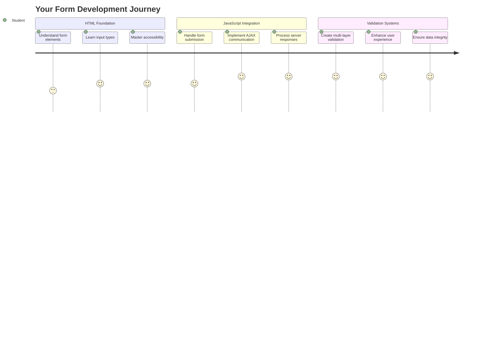
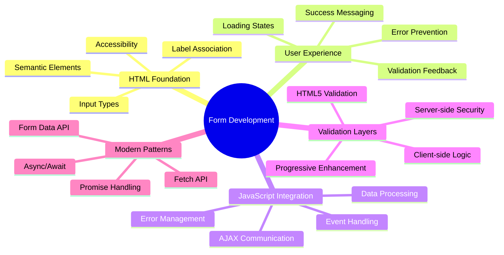
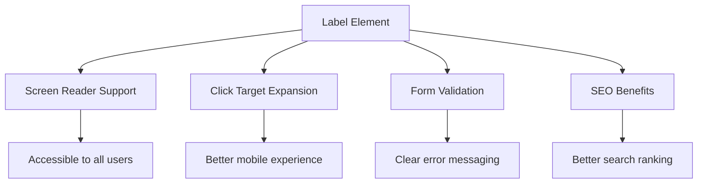
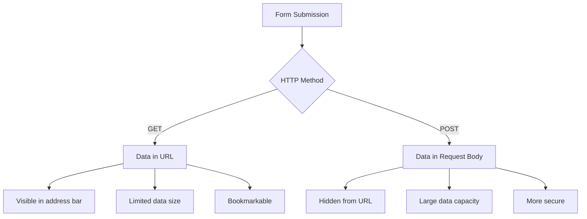
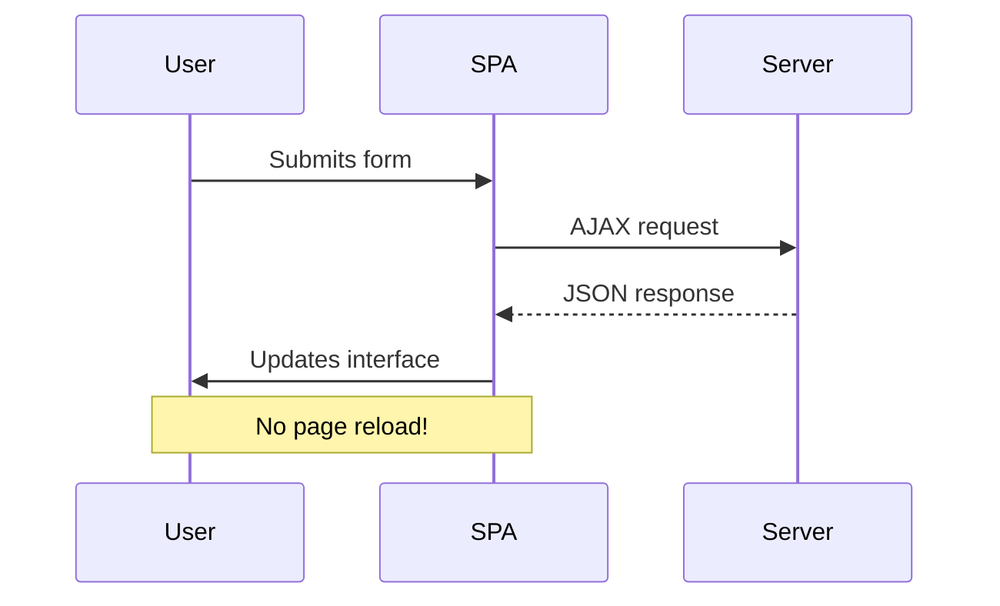
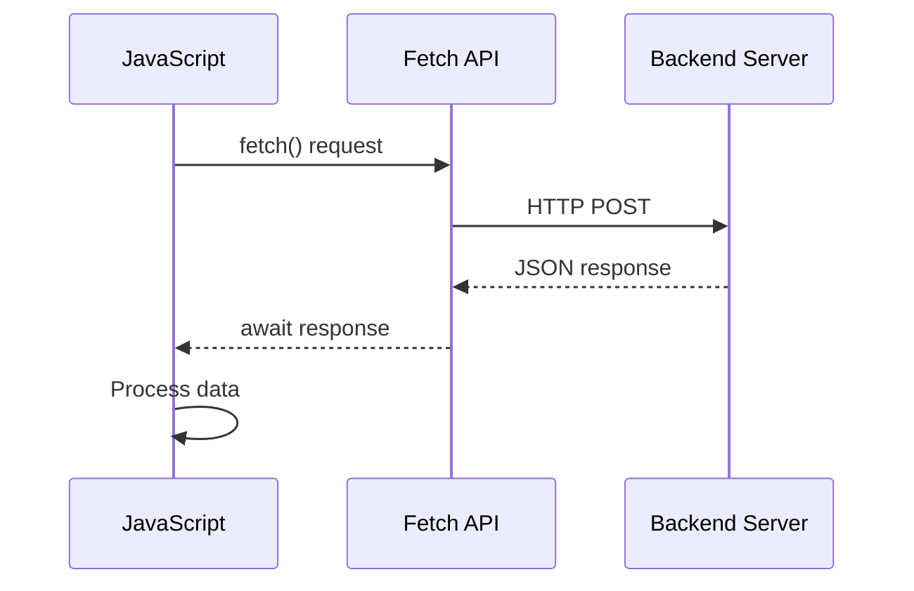
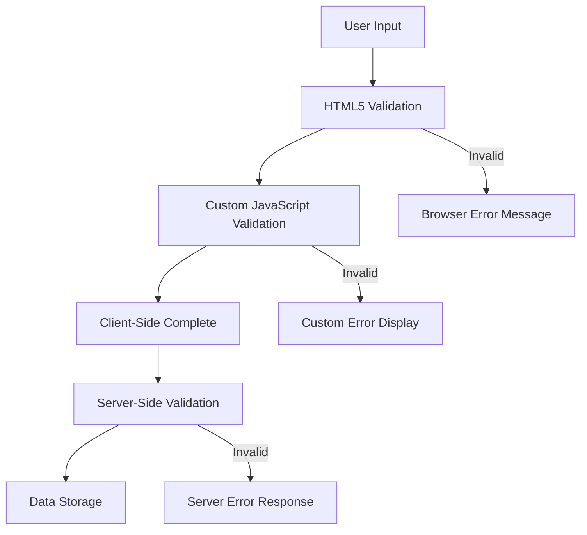
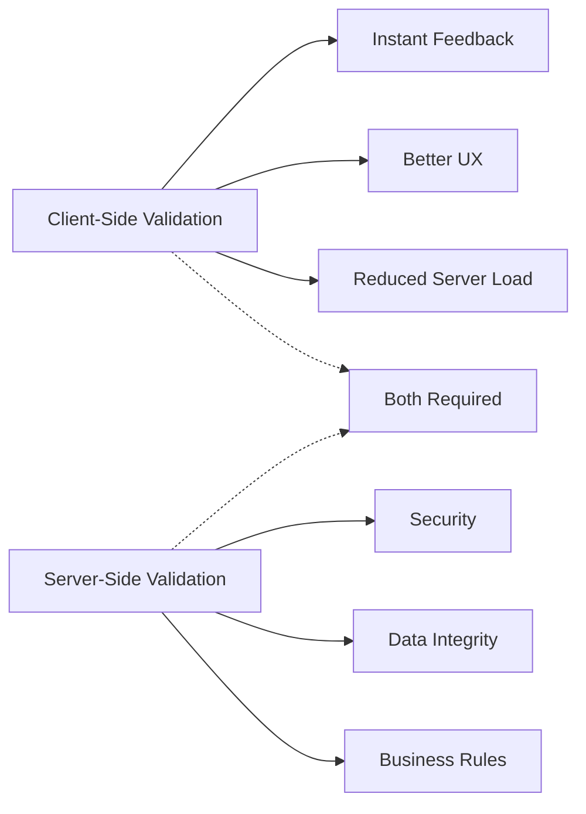
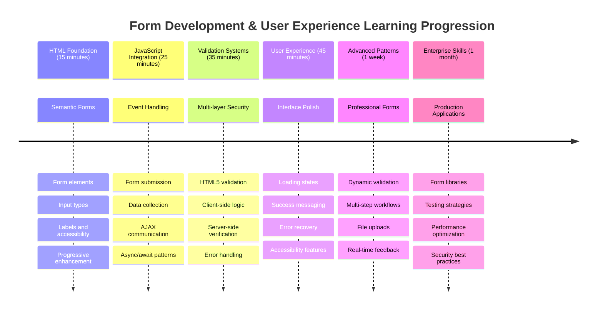

<!--
CO_OP_TRANSLATOR_METADATA:
{
  "original_hash": "7cbdbd132d39a2bb493e85bc2a9387cc",
  "translation_date": "2025-11-03T14:01:14+00:00",
  "source_file": "7-bank-project/2-forms/README.md",
  "language_code": "tl"
}
-->
# Gumawa ng Banking App Bahagi 2: Gumawa ng Login at Registration Form



## Pre-Lecture Quiz

[Pre-lecture quiz](https://ff-quizzes.netlify.app/web/quiz/43)

Naranasan mo na bang mag-fill out ng form online at ma-reject ang email format mo? O kaya naman ay nawala ang lahat ng impormasyon mo pagkatapos mong mag-submit? Lahat tayo ay nakaranas ng ganitong nakakainis na karanasan.

Ang mga form ay nagsisilbing tulay sa pagitan ng mga user at ng functionality ng iyong application. Tulad ng maingat na protocol na ginagamit ng mga air traffic controller para gabayan ang mga eroplano sa kanilang destinasyon, ang maayos na disenyo ng mga form ay nagbibigay ng malinaw na feedback at pumipigil sa mga mahal na pagkakamali. Ang mga hindi maayos na form, sa kabilang banda, ay maaaring magtaboy sa mga user nang mas mabilis kaysa sa isang miscommunication sa abalang paliparan.

Sa leksyong ito, gagawin nating interactive ang iyong static na banking app. Matututo kang gumawa ng mga form na nagva-validate ng user input, nakikipag-ugnayan sa mga server, at nagbibigay ng kapaki-pakinabang na feedback. Isipin mo ito bilang paggawa ng control interface na nagpapahintulot sa mga user na mag-navigate sa mga feature ng iyong application.

Sa dulo, magkakaroon ka ng kumpletong login at registration system na may validation na gagabay sa mga user patungo sa tagumpay sa halip na frustration.



## Mga Kinakailangan

Bago tayo magsimula sa paggawa ng mga form, siguraduhin muna natin na maayos ang iyong setup. Ang leksyong ito ay magpapatuloy mula sa huling bahagi, kaya kung lumaktaw ka, maaaring gusto mong balikan muna ang mga pangunahing kaalaman.

### Kinakailangang Setup

| Komponent | Status | Deskripsyon |
|-----------|--------|-------------|
| [HTML Templates](../1-template-route/README.md) | ✅ Kinakailangan | Ang pangunahing istruktura ng banking app mo |
| [Node.js](https://nodejs.org) | ✅ Kinakailangan | JavaScript runtime para sa server |
| [Bank API Server](../api/README.md) | ✅ Kinakailangan | Backend service para sa data storage |

> 💡 **Tip sa Pag-develop**: Magpapatakbo ka ng dalawang magkahiwalay na server nang sabay – isa para sa iyong front-end banking app at isa pa para sa backend API. Ang setup na ito ay sumasalamin sa totoong mundo ng pag-develop kung saan ang frontend at backend services ay gumagana nang magkahiwalay.

### Konfigurasyon ng Server

**Ang iyong development environment ay maglalaman ng:**
- **Frontend server**: Nagse-serve ng iyong banking app (karaniwang port `3000`)
- **Backend API server**: Nagha-handle ng data storage at retrieval (port `5000`)
- **Parehong server** ay maaaring tumakbo nang sabay nang walang conflict

**Pag-test ng iyong API connection:**
```bash
curl http://localhost:5000/api
# Expected response: "Bank API v1.0.0"
```

**Kung makikita mo ang API version response, handa ka nang magpatuloy!**

---

## Pag-unawa sa HTML Forms at Controls

Ang HTML forms ang paraan kung paano nakikipag-ugnayan ang mga user sa iyong web application. Isipin mo ito bilang telegraph system na nagkonekta sa mga malalayong lugar noong ika-19 na siglo – ito ang communication protocol sa pagitan ng intensyon ng user at ng tugon ng application. Kapag maingat na dinisenyo, nahuhuli nito ang mga error, ginagabayan ang input formatting, at nagbibigay ng kapaki-pakinabang na mungkahi.

Ang mga modernong form ay mas sopistikado kaysa sa mga basic na text inputs. Ang HTML5 ay nagpakilala ng mga specialized input types na awtomatikong nagha-handle ng email validation, number formatting, at date selection. Ang mga improvement na ito ay kapaki-pakinabang para sa accessibility at mobile user experiences.

### Mahahalagang Elemento ng Form

**Mga building blocks na kailangan ng bawat form:**

```html
<!-- Basic form structure -->
<form id="userForm" method="POST">
  <label for="username">Username</label>
  <input id="username" name="username" type="text" required>
  
  <button type="submit">Submit</button>
</form>
```

**Ang ginagawa ng code na ito:**
- **Gumagawa** ng form container na may natatanging identifier
- **Nagtatakda** ng HTTP method para sa data submission
- **Nag-a-associate** ng labels sa inputs para sa accessibility
- **Nagde-define** ng submit button para ma-process ang form

### Mga Modernong Input Types at Attributes

| Uri ng Input | Layunin | Halimbawa ng Paggamit |
|--------------|---------|-----------------------|
| `text` | General text input | `<input type="text" name="username">` |
| `email` | Email validation | `<input type="email" name="email">` |
| `password` | Hidden text entry | `<input type="password" name="password">` |
| `number` | Numeric input | `<input type="number" name="balance" min="0">` |
| `tel` | Mga numero ng telepono | `<input type="tel" name="phone">` |

> 💡 **Advantage ng Modern HTML5**: Ang paggamit ng specific input types ay nagbibigay ng automatic validation, tamang mobile keyboards, at mas mahusay na suporta sa accessibility nang walang karagdagang JavaScript!

### Mga Uri ng Button at Kanilang Gamit

```html
<!-- Different button behaviors -->
<button type="submit">Save Data</button>     <!-- Submits the form -->
<button type="reset">Clear Form</button>    <!-- Resets all fields -->
<button type="button">Custom Action</button> <!-- No default behavior -->
```

**Ang ginagawa ng bawat uri ng button:**
- **Submit buttons**: Nagti-trigger ng form submission at nagpapadala ng data sa specified endpoint
- **Reset buttons**: Ibinabalik ang lahat ng form fields sa kanilang initial state
- **Regular buttons**: Walang default na behavior, nangangailangan ng custom JavaScript para sa functionality

> ⚠️ **Mahalagang Paalala**: Ang `<input>` element ay self-closing at hindi nangangailangan ng closing tag. Ang modernong best practice ay isulat ang `<input>` nang walang slash.

### Paggawa ng Iyong Login Form

Ngayon, gagawa tayo ng praktikal na login form na nagpapakita ng mga modernong HTML form practices. Magsisimula tayo sa basic na istruktura at unti-unting pagagandahin ito gamit ang mga accessibility features at validation.

```html
<template id="login">
  <h1>Bank App</h1>
  <section>
    <h2>Login</h2>
    <form id="loginForm" novalidate>
      <div class="form-group">
        <label for="username">Username</label>
        <input id="username" name="user" type="text" required 
               autocomplete="username" placeholder="Enter your username">
      </div>
      <button type="submit">Login</button>
    </form>
  </section>
</template>
```

**Pagbubuo ng nangyayari dito:**
- **Binubuo** ang form gamit ang semantic HTML5 elements
- **Inaayos** ang mga related elements gamit ang `div` containers na may meaningful classes
- **Ina-associate** ang labels sa inputs gamit ang `for` at `id` attributes
- **Naglalagay** ng modernong attributes tulad ng `autocomplete` at `placeholder` para sa mas magandang UX
- **Nagdadagdag** ng `novalidate` para ma-handle ang validation gamit ang JavaScript sa halip na default ng browser

### Ang Kahalagahan ng Tamang Labels

**Bakit mahalaga ang labels sa modernong web development:**



**Ang nagagawa ng tamang labels:**
- **Nagpapahintulot** sa screen readers na malinaw na i-announce ang form fields
- **Pinalalawak** ang clickable area (ang pag-click sa label ay nagfo-focus sa input)
- **Pinapabuti** ang mobile usability gamit ang mas malaking touch targets
- **Sumusuporta** sa form validation gamit ang meaningful error messages
- **Pinapaganda** ang SEO sa pamamagitan ng pagbibigay ng semantic na kahulugan sa form elements

> 🎯 **Layunin ng Accessibility**: Ang bawat form input ay dapat may kaugnay na label. Ang simpleng practice na ito ay nagpapadali sa paggamit ng iyong forms para sa lahat, kabilang ang mga user na may kapansanan, at pinapaganda ang karanasan para sa lahat ng user.

### Paggawa ng Registration Form

Ang registration form ay nangangailangan ng mas detalyadong impormasyon para makagawa ng kumpletong user account. Gawin natin ito gamit ang mga modernong HTML5 features at mas pinahusay na accessibility.

```html
<hr/>
<h2>Register</h2>
<form id="registerForm" novalidate>
  <div class="form-group">
    <label for="user">Username</label>
    <input id="user" name="user" type="text" required 
           autocomplete="username" placeholder="Choose a username">
  </div>
  
  <div class="form-group">
    <label for="currency">Currency</label>
    <input id="currency" name="currency" type="text" value="$" 
           required maxlength="3" placeholder="USD, EUR, etc.">
  </div>
  
  <div class="form-group">
    <label for="description">Account Description</label>
    <input id="description" name="description" type="text" 
           maxlength="100" placeholder="Personal savings, checking, etc.">
  </div>
  
  <div class="form-group">
    <label for="balance">Starting Balance</label>
    <input id="balance" name="balance" type="number" value="0" 
           min="0" step="0.01" placeholder="0.00">
  </div>
  
  <button type="submit">Create Account</button>
</form>
```

**Sa itaas, ginawa natin ang:**
- **Pag-aayos** ng bawat field sa container divs para sa mas magandang styling at layout
- **Pagdaragdag** ng tamang `autocomplete` attributes para sa browser autofill support
- **Paglalagay** ng helpful placeholder text para gabayan ang user input
- **Pag-set** ng sensible defaults gamit ang `value` attribute
- **Pag-aapply** ng validation attributes tulad ng `required`, `maxlength`, at `min`
- **Paggamit** ng `type="number"` para sa balance field na may decimal support

### Pag-explore ng Input Types at Behavior

**Ang mga modernong input types ay nagbibigay ng mas pinahusay na functionality:**

| Feature | Benepisyo | Halimbawa |
|---------|-----------|----------|
| `type="number"` | Numeric keypad sa mobile | Mas madaling pagpasok ng balance |
| `step="0.01"` | Decimal precision control | Pinapayagan ang cents sa currency |
| `autocomplete` | Browser autofill | Mas mabilis na pag-fill ng form |
| `placeholder` | Contextual hints | Ginagabayan ang inaasahan ng user |

> 🎯 **Accessibility Challenge**: Subukang mag-navigate sa forms gamit lamang ang iyong keyboard! Gamitin ang `Tab` para lumipat sa pagitan ng fields, `Space` para mag-check ng boxes, at `Enter` para mag-submit. Ang karanasang ito ay makakatulong sa iyong maunawaan kung paano nakikipag-ugnayan ang mga screen reader users sa iyong forms.

### 🔄 **Pedagogical Check-in**
**Pag-unawa sa Pundasyon ng Form**: Bago mag-implement ng JavaScript, siguraduhing nauunawaan mo:
- ✅ Paano ang semantic HTML ay gumagawa ng accessible na form structures
- ✅ Bakit mahalaga ang input types para sa mobile keyboards at validation
- ✅ Ang relasyon sa pagitan ng labels at form controls
- ✅ Paano naaapektuhan ng form attributes ang default na behavior ng browser

**Mabilis na Self-Test**: Ano ang mangyayari kung mag-submit ka ng form nang walang JavaScript handling?
*Sagot: Ang browser ay gumagawa ng default submission, karaniwang nagre-redirect sa action URL*

**Benepisyo ng HTML5 Forms**: Ang mga modernong form ay nagbibigay ng:
- **Built-in Validation**: Automatic email at number format checking
- **Mobile Optimization**: Tamang keyboards para sa iba't ibang input types
- **Accessibility**: Suporta sa screen reader at keyboard navigation
- **Progressive Enhancement**: Gumagana kahit naka-disable ang JavaScript

## Pag-unawa sa Form Submission Methods

Kapag may nag-fill out ng iyong form at nag-click ng submit, kailangang mapunta ang data sa isang lugar – karaniwang sa isang server na maaaring mag-save nito. May ilang iba't ibang paraan kung paano ito mangyayari, at ang pag-alam kung alin ang gagamitin ay makakapagligtas sa iyo mula sa ilang sakit ng ulo sa hinaharap.

Tingnan natin kung ano ang talagang nangyayari kapag may nag-click ng submit button.

### Default na Behavior ng Form

Una, obserbahan natin kung ano ang nangyayari sa basic form submission:

**I-test ang iyong kasalukuyang forms:**
1. I-click ang *Register* button sa iyong form
2. Obserbahan ang mga pagbabago sa address bar ng iyong browser
3. Pansinin kung paano nagre-reload ang page at lumalabas ang data sa URL


### Paghahambing ng HTTP Methods



**Pag-unawa sa mga pagkakaiba:**

| Method | Gamit | Lokasyon ng Data | Antas ng Seguridad | Limitasyon sa Laki |
|--------|-------|------------------|--------------------|--------------------|
| `GET` | Mga search queries, filters | URL parameters | Mababa (visible) | ~2000 characters |
| `POST` | Mga user accounts, sensitibong data | Request body | Mas mataas (hidden) | Walang praktikal na limitasyon |

**Pag-unawa sa mga pangunahing pagkakaiba:**
- **GET**: Idinadagdag ang form data sa URL bilang query parameters (angkop para sa search operations)
- **POST**: Isinasama ang data sa request body (mahalaga para sa sensitibong impormasyon)
- **Limitasyon ng GET**: Mga size constraints, visible data, persistent browser history
- **Mga Bentahe ng POST**: Malaking kapasidad ng data, proteksyon sa privacy, suporta sa file upload

> 💡 **Best Practice**: Gamitin ang `GET` para sa mga search forms at filters (data retrieval), gamitin ang `POST` para sa user registration, login, at data creation.

### Pag-configure ng Form Submission

I-configure natin ang iyong registration form para maayos na makipag-ugnayan sa backend API gamit ang POST method:

```html
<form id="registerForm" action="//localhost:5000/api/accounts" 
      method="POST" novalidate>
```

**Ang ginagawa ng konfigurasyong ito:**
- **Dinidirekta** ang form submission sa iyong API endpoint
- **Gumagamit** ng POST method para sa secure na data transmission
- **Naglalagay** ng `novalidate` para ma-handle ang validation gamit ang JavaScript

### Pag-test ng Form Submission

**Sundin ang mga hakbang na ito para i-test ang iyong form:**
1. **I-fill out** ang registration form gamit ang iyong impormasyon
2. **I-click** ang "Create Account" button
3. **Obserbahan** ang server response sa iyong browser


**Ang dapat mong makita:**
- **Ang browser ay nagre-redirect** sa API endpoint URL
- **JSON response** na naglalaman ng bagong likhang account data
- **Kumpirmasyon ng server** na matagumpay na nalikha ang account

> 🧪 **Oras ng Eksperimento**: Subukang mag-register ulit gamit ang parehong username. Anong response ang makukuha mo? Makakatulong ito sa iyong maunawaan kung paano hinahandle ng server ang duplicate na data at error conditions.

### Pag-unawa sa JSON Responses

**Kapag matagumpay na na-process ng server ang iyong form:**
```json
{
  "user": "john_doe",
  "currency": "$",
  "description": "Personal savings",
  "balance": 100,
  "id": "unique_account_id"
}
```

**Kinukumpirma ng response na ito:**
- **Nilikha** ang bagong account gamit ang iyong tinukoy na data
- **Nag-assign** ng unique identifier para sa future reference
- **Ibinabalik** ang lahat ng impormasyon ng account para sa verification
- **Nagpapahiwatig** ng matagumpay na database storage

## Modernong Pag-handle ng Form gamit ang JavaScript

Ang tradisyunal na form submissions ay nagdudulot ng full page reloads, katulad ng kung paano ang mga maagang space missions ay nangangailangan ng complete system resets para sa course corrections. Ang approach na ito ay nakakaabala sa user experience at nawawala ang application state.

Ang JavaScript form handling ay gumagana tulad ng continuous guidance systems na ginagamit ng modernong spacecraft – gumagawa ng real-time adjustments nang hindi nawawala ang navigation context. Maaari nating i-intercept ang form submissions, magbigay ng agarang feedback, maayos na mag-handle ng errors, at i-update ang interface batay sa server responses habang pinapanatili ang posisyon ng user sa application.

### Bakit Iwasan ang Page Reloads?



**Mga Benepisyo ng JavaScript form handling:**
- **Pinapanatili** ang application state at user context
- **Nagbibigay** ng instant feedback at loading indicators
- **Nagpapahintulot** ng dynamic error handling at validation
- **Lumilikha** ng smooth, app-like user experiences
- **Nagpapahintulot** ng conditional logic batay sa server responses

### Paglipat mula Tradisyunal patungo sa Modernong Forms

**Mga hamon sa tradisyunal na approach:**
- **Nagre-redirect** sa mga user palayo sa iyong application
- **Nawawala** ang kasalukuyang application state at context
- **Nangangailangan** ng full page reloads para sa simpleng operations
- **Nagbibigay** ng limitadong kontrol sa user feedback

**Mga bentahe ng modernong JavaScript approach:**
- **Pinapanatili** ang mga user sa loob ng iyong application
- **Pinapanatili** ang lahat ng application state at data
- **Nagpapahintulot** ng real-time validation at feedback
- **Sumusuporta** sa progressive enhancement at accessibility

### Pag-implement ng JavaScript Form Handling

Palitan natin ang tradisyunal na form submission gamit ang modernong JavaScript event handling:

```html
<!-- Remove the action attribute and add event handling -->
<form id="registerForm" method="POST" novalidate>
```

**Idagdag ang registration logic sa iyong `app.js` file:**

```javascript
// Modern event-driven form handling
function register() {
  const registerForm = document.getElementById('registerForm');
  const formData = new FormData(registerForm);
  const data = Object.fromEntries(formData);
  const jsonData = JSON.stringify(data);
  
  console.log('Form data prepared:', data);
}

// Attach event listener when the page loads
document.addEventListener('DOMContentLoaded', () => {
  const registerForm = document.getElementById('registerForm');
  registerForm.addEventListener('submit', (event) => {
    event.preventDefault(); // Prevent default form submission
    register();
  });
});
```

**Pagbubuo ng nangyayari dito:**
- **Pinipigilan** ang default form submission gamit ang `event.preventDefault()`
- **Kinukuha** ang form element gamit ang modernong DOM selection
- **Kinukuha** ang form data gamit ang makapangyarihang `FormData` API
- **Kinoconvert** ang FormData sa plain object gamit ang `Object.fromEntries()`
- **Sinasalin** ang data sa JSON format para sa server communication
- **Nilolog** ang processed data para sa debugging at verification

### Pag-unawa sa FormData API

**Ang FormData API ay nagbibigay ng makapangyarihang form handling:**
```javascript
// Example of what FormData captures
const formData = new FormData(registerForm);

// FormData automatically captures:
// {
//   "user": "john_doe",
//   "currency": "$", 
//   "description": "Personal account",
//   "balance": "100"
// }
```

**Mga Bentahe ng FormData API:**
- **Komprehensibong koleksyon**: Kinukuha ang lahat ng elemento ng form kabilang ang text, mga file, at kumplikadong input
- **Pagkilala sa uri**: Awtomatikong pinangangasiwaan ang iba't ibang uri ng input nang walang custom na coding
- **Episyente**: Inaalis ang manu-manong koleksyon ng field gamit ang isang tawag sa API
- **Adaptabilidad**: Pinapanatili ang functionality habang nagbabago ang istruktura ng form

### Paglikha ng Function para sa Komunikasyon sa Server

Ngayon, gagawa tayo ng matibay na function para makipag-ugnayan sa iyong API server gamit ang modernong mga pattern ng JavaScript:

```javascript
async function createAccount(account) {
  try {
    const response = await fetch('//localhost:5000/api/accounts', {
      method: 'POST',
      headers: { 
        'Content-Type': 'application/json',
        'Accept': 'application/json'
      },
      body: account
    });
    
    // Check if the response was successful
    if (!response.ok) {
      throw new Error(`HTTP error! status: ${response.status}`);
    }
    
    return await response.json();
  } catch (error) {
    console.error('Account creation failed:', error);
    return { error: error.message || 'Network error occurred' };
  }
}
```

**Pag-unawa sa asynchronous na JavaScript:**



**Ano ang nagagawa ng modernong implementasyong ito:**
- **Gumagamit** ng `async/await` para sa mas nababasang asynchronous na code
- **Kasama** ang tamang paghawak ng error gamit ang try/catch blocks
- **Sinusuri** ang status ng response bago iproseso ang data
- **Nagse-set** ng tamang headers para sa JSON communication
- **Nagbibigay** ng detalyadong mga mensahe ng error para sa debugging
- **Nagbabalik** ng pare-parehong istruktura ng data para sa tagumpay at mga kaso ng error

### Ang Kapangyarihan ng Modernong Fetch API

**Mga bentahe ng Fetch API kumpara sa mga lumang pamamaraan:**

| Tampok | Benepisyo | Implementasyon |
|--------|-----------|----------------|
| Batay sa Promise | Malinis na async na code | `await fetch()` |
| Customisasyon ng Request | Buong kontrol sa HTTP | Headers, methods, body |
| Pagproseso ng Response | Flexible na pag-parse ng data | `.json()`, `.text()`, `.blob()` |
| Paghawak ng Error | Komprehensibong pagkuha ng error | Try/catch blocks |

> 🎥 **Matuto Pa**: [Async/Await Tutorial](https://youtube.com/watch?v=YwmlRkrxvkk) - Pag-unawa sa mga asynchronous na pattern ng JavaScript para sa modernong web development.

**Mga pangunahing konsepto para sa komunikasyon sa server:**
- **Async functions** na nagpapahintulot sa pag-pause ng execution para maghintay ng mga tugon mula sa server
- **Await keyword** na ginagawang parang synchronous ang asynchronous na code
- **Fetch API** na nagbibigay ng modernong, batay sa promise na HTTP requests
- **Paghawak ng Error** na tinitiyak na ang iyong app ay tumutugon nang maayos sa mga isyu sa network

### Pagtatapos ng Registration Function

Pagsamahin natin ang lahat gamit ang kumpleto, handa-sa-produksyon na registration function:

```javascript
async function register() {
  const registerForm = document.getElementById('registerForm');
  const submitButton = registerForm.querySelector('button[type="submit"]');
  
  try {
    // Show loading state
    submitButton.disabled = true;
    submitButton.textContent = 'Creating Account...';
    
    // Process form data
    const formData = new FormData(registerForm);
    const jsonData = JSON.stringify(Object.fromEntries(formData));
    
    // Send to server
    const result = await createAccount(jsonData);
    
    if (result.error) {
      console.error('Registration failed:', result.error);
      alert(`Registration failed: ${result.error}`);
      return;
    }
    
    console.log('Account created successfully!', result);
    alert(`Welcome, ${result.user}! Your account has been created.`);
    
    // Reset form after successful registration
    registerForm.reset();
    
  } catch (error) {
    console.error('Unexpected error:', error);
    alert('An unexpected error occurred. Please try again.');
  } finally {
    // Restore button state
    submitButton.disabled = false;
    submitButton.textContent = 'Create Account';
  }
}
```

**Kasama sa pinahusay na implementasyong ito:**
- **Nagbibigay** ng visual feedback habang nagsusumite ng form
- **Ine-enable** ang submit button para maiwasan ang duplicate na pagsusumite
- **Pinangangasiwaan** ang parehong inaasahan at hindi inaasahang mga error nang maayos
- **Nagpapakita** ng user-friendly na mga mensahe ng tagumpay at error
- **Nire-reset** ang form pagkatapos ng matagumpay na registration
- **Ibinabalik** ang estado ng UI anuman ang resulta

### Pagsubok sa Iyong Implementasyon

**Buksan ang developer tools ng iyong browser at subukan ang registration:**

1. **Buksan** ang console ng browser (F12 → Console tab)
2. **Punan** ang registration form
3. **I-click** ang "Create Account"
4. **Obserbahan** ang mga mensahe sa console at feedback ng user


**Ano ang dapat mong makita:**
- **Loading state** na lumalabas sa submit button
- **Console logs** na nagpapakita ng detalyadong impormasyon tungkol sa proseso
- **Success message** na lumalabas kapag matagumpay ang paglikha ng account
- **Form resets** na awtomatikong nangyayari pagkatapos ng matagumpay na pagsusumite

> 🔒 **Pagsasaalang-alang sa Seguridad**: Sa kasalukuyan, ang data ay naglalakbay sa HTTP, na hindi ligtas para sa produksyon. Sa mga tunay na aplikasyon, palaging gumamit ng HTTPS para i-encrypt ang transmission ng data. Matuto pa tungkol sa [HTTPS security](https://en.wikipedia.org/wiki/HTTPS) at kung bakit mahalaga ito para sa proteksyon ng data ng user.

### 🔄 **Pedagogical Check-in**
**Integrasyon ng Modernong JavaScript**: Suriin ang iyong pag-unawa sa asynchronous na paghawak ng form:
- ✅ Paano binabago ng `event.preventDefault()` ang default na pag-uugali ng form?
- ✅ Bakit mas episyente ang FormData API kaysa sa manu-manong koleksyon ng field?
- ✅ Paano pinapabuti ng async/await patterns ang readability ng code?
- ✅ Anong papel ang ginagampanan ng paghawak ng error sa karanasan ng user?

**Arkitektura ng Sistema**: Ang iyong paghawak ng form ay nagpapakita ng:
- **Event-Driven Programming**: Tumutugon ang mga form sa mga aksyon ng user nang walang page reloads
- **Asynchronous Communication**: Ang mga request sa server ay hindi humaharang sa user interface
- **Paghawak ng Error**: Maayos na pag-degrade kapag nabigo ang mga network request
- **Pamamahala ng Estado**: Ang mga update sa UI ay sumasalamin sa mga tugon ng server
- **Progressive Enhancement**: Gumagana ang base functionality, pinapahusay ng JavaScript

**Mga Propesyonal na Pattern**: Na-implement mo:
- **Single Responsibility**: Ang mga function ay may malinaw at nakatuong layunin
- **Error Boundaries**: Ang mga try/catch blocks ay pumipigil sa pag-crash ng application
- **Feedback ng User**: Mga loading states at mga mensahe ng tagumpay/error
- **Pagbabago ng Data**: FormData sa JSON para sa komunikasyon sa server

## Komprehensibong Pag-validate ng Form

Ang pag-validate ng form ay pumipigil sa nakakainis na karanasan ng pagtuklas ng mga error pagkatapos lamang ng pagsusumite. Tulad ng maraming redundant na sistema sa International Space Station, ang epektibong pag-validate ay gumagamit ng maraming layer ng mga safety check.

Ang pinakamainam na paraan ay pinagsasama ang pag-validate sa antas ng browser para sa agarang feedback, pag-validate sa JavaScript para sa pinahusay na karanasan ng user, at pag-validate sa server para sa seguridad at integridad ng data. Ang redundancy na ito ay tinitiyak ang parehong kasiyahan ng user at proteksyon ng sistema.

### Pag-unawa sa Mga Layer ng Pag-validate



**Multi-layer na diskarte sa pag-validate:**
- **Pag-validate ng HTML5**: Agarang mga check na batay sa browser
- **Pag-validate ng JavaScript**: Custom na lohika at karanasan ng user
- **Pag-validate ng Server**: Panghuling mga check para sa seguridad at integridad ng data
- **Progressive enhancement**: Gumagana kahit naka-disable ang JavaScript

### Mga HTML5 Validation Attributes

**Mga modernong tool sa pag-validate na magagamit mo:**

| Attribute | Layunin | Halimbawa ng Paggamit | Pag-uugali ng Browser |
|-----------|---------|-----------------------|-----------------------|
| `required` | Mga mandatory na field | `<input required>` | Pinipigilan ang walang laman na pagsusumite |
| `minlength`/`maxlength` | Mga limitasyon sa haba ng text | `<input maxlength="20">` | Nagpapatupad ng mga limitasyon sa karakter |
| `min`/`max` | Mga saklaw ng numero | `<input min="0" max="1000">` | Nagpapatunay ng mga hangganan ng numero |
| `pattern` | Mga custom na panuntunan sa regex | `<input pattern="[A-Za-z]+">` | Tumutugma sa mga partikular na format |
| `type` | Pag-validate ng uri ng data | `<input type="email">` | Pag-validate na partikular sa format |

### CSS Validation Styling

**Lumikha ng visual feedback para sa mga estado ng pag-validate:**

```css
/* Valid input styling */
input:valid {
  border-color: #28a745;
  background-color: #f8fff9;
}

/* Invalid input styling */
input:invalid {
  border-color: #dc3545;
  background-color: #fff5f5;
}

/* Focus states for better accessibility */
input:focus:valid {
  box-shadow: 0 0 0 0.2rem rgba(40, 167, 69, 0.25);
}

input:focus:invalid {
  box-shadow: 0 0 0 0.2rem rgba(220, 53, 69, 0.25);
}
```

**Ano ang nagagawa ng mga visual na palatandaan na ito:**
- **Mga berdeng border**: Nagpapahiwatig ng matagumpay na pag-validate, tulad ng berdeng ilaw sa mission control
- **Mga pulang border**: Nagpapahiwatig ng mga error sa pag-validate na nangangailangan ng atensyon
- **Mga highlight ng focus**: Nagbibigay ng malinaw na visual na konteksto para sa kasalukuyang lokasyon ng input
- **Pare-parehong estilo**: Nagtatatag ng predictable na mga pattern ng interface na maaaring matutunan ng mga user

> 💡 **Pro Tip**: Gamitin ang `:valid` at `:invalid` na mga pseudo-class ng CSS para magbigay ng agarang visual na feedback habang nagta-type ang mga user, na lumilikha ng isang tumutugon at kapaki-pakinabang na interface.

### Pagpapatupad ng Komprehensibong Pag-validate

Palakasin natin ang iyong registration form gamit ang matibay na pag-validate na nagbibigay ng mahusay na karanasan ng user at kalidad ng data:

```html
<form id="registerForm" method="POST" novalidate>
  <div class="form-group">
    <label for="user">Username <span class="required">*</span></label>
    <input id="user" name="user" type="text" required 
           minlength="3" maxlength="20" 
           pattern="[a-zA-Z0-9_]+" 
           autocomplete="username"
           title="Username must be 3-20 characters, letters, numbers, and underscores only">
    <small class="form-text">Choose a unique username (3-20 characters)</small>
  </div>
  
  <div class="form-group">
    <label for="currency">Currency <span class="required">*</span></label>
    <input id="currency" name="currency" type="text" required 
           value="$" maxlength="3" 
           pattern="[A-Z$€£¥₹]+" 
           title="Enter a valid currency symbol or code">
    <small class="form-text">Currency symbol (e.g., $, €, £)</small>
  </div>
  
  <div class="form-group">
    <label for="description">Account Description</label>
    <input id="description" name="description" type="text" 
           maxlength="100" 
           placeholder="Personal savings, checking, etc.">
    <small class="form-text">Optional description (up to 100 characters)</small>
  </div>
  
  <div class="form-group">
    <label for="balance">Starting Balance</label>
    <input id="balance" name="balance" type="number" 
           value="0" min="0" step="0.01" 
           title="Enter a positive number for your starting balance">
    <small class="form-text">Initial account balance (minimum $0.00)</small>
  </div>
  
  <button type="submit">Create Account</button>
</form>
```

**Pag-unawa sa pinahusay na pag-validate:**
- **Pinagsasama** ang mga indicator ng kinakailangang field na may kapaki-pakinabang na mga paglalarawan
- **Kasama** ang mga `pattern` na attribute para sa pag-validate ng format
- **Nagbibigay** ng mga `title` na attribute para sa accessibility at mga tooltip
- **Nagdaragdag** ng helper text para gabayan ang input ng user
- **Gumagamit** ng semantic na istruktura ng HTML para sa mas mahusay na accessibility

### Mga Advanced na Panuntunan sa Pag-validate

**Ano ang nagagawa ng bawat panuntunan sa pag-validate:**

| Field | Mga Panuntunan sa Pag-validate | Benepisyo ng User |
|-------|-------------------------------|-------------------|
| Username | `required`, `minlength="3"`, `maxlength="20"`, `pattern="[a-zA-Z0-9_]+"` | Tinitiyak ang wastong, natatanging mga identifier |
| Currency | `required`, `maxlength="3"`, `pattern="[A-Z$€£¥₹]+"` | Tumatanggap ng mga karaniwang simbolo ng pera |
| Balance | `min="0"`, `step="0.01"`, `type="number"` | Pinipigilan ang negatibong balanse |
| Description | `maxlength="100"` | Makatuwirang limitasyon sa haba |

### Pagsubok sa Pag-uugali ng Pag-validate

**Subukan ang mga senaryo ng pag-validate na ito:**
1. **Isumite** ang form na may mga walang laman na kinakailangang field
2. **Maglagay** ng username na mas maikli sa 3 karakter
3. **Subukan** ang mga espesyal na karakter sa field ng username
4. **Mag-input** ng negatibong halaga ng balanse


**Ano ang iyong mapapansin:**
- **Ipinapakita ng browser** ang mga native na mensahe ng pag-validate
- **Nagbabago ang estilo** batay sa mga estado ng `:valid` at `:invalid`
- **Ang pagsusumite ng form** ay pinipigilan hanggang sa maipasa ang lahat ng pag-validate
- **Awtomatikong lumilipat ang focus** sa unang invalid na field

### Pag-validate sa Client-Side vs Server-Side



**Bakit kailangan mo ng parehong layer:**
- **Pag-validate sa client-side**: Nagbibigay ng agarang feedback at pinapabuti ang karanasan ng user
- **Pag-validate sa server-side**: Tinitiyak ang seguridad at pinangangasiwaan ang mga kumplikadong panuntunan sa negosyo
- **Pinagsamang diskarte**: Lumilikha ng matibay, user-friendly, at secure na mga aplikasyon
- **Progressive enhancement**: Gumagana kahit naka-disable ang JavaScript

> 🛡️ **Paalala sa Seguridad**: Huwag kailanman umasa lamang sa pag-validate sa client-side! Maaaring i-bypass ng mga malisyosong user ang mga check sa client-side, kaya't mahalaga ang pag-validate sa server-side para sa seguridad at integridad ng data.

### ⚡ **Ano ang Magagawa Mo sa Susunod na 5 Minuto**
- [ ] Subukan ang iyong form gamit ang invalid na data para makita ang mga mensahe ng pag-validate
- [ ] Subukang isumite ang form na naka-disable ang JavaScript para makita ang pag-validate ng HTML5
- [ ] Buksan ang browser DevTools at suriin ang data ng form na ipinapadala sa server
- [ ] Mag-eksperimento sa iba't ibang uri ng input para makita ang mga pagbabago sa mobile keyboard

### 🎯 **Ano ang Magagawa Mo sa Loob ng Isang Oras**
- [ ] Kumpletuhin ang post-lesson quiz at unawain ang mga konsepto sa paghawak ng form
- [ ] Ipatupad ang hamon sa komprehensibong pag-validate na may real-time na feedback
- [ ] Magdagdag ng CSS styling para lumikha ng mga propesyonal na form
- [ ] Gumawa ng paghawak ng error para sa mga duplicate na username at mga error sa server
- [ ] Magdagdag ng mga field para sa kumpirmasyon ng password na may pag-validate ng pagkakatugma

### 📅 **Ang Iyong Lingguhang Paglalakbay sa Pag-master ng Form**
- [ ] Kumpletuhin ang buong banking app na may mga advanced na tampok ng form
- [ ] Ipatupad ang kakayahan sa pag-upload ng file para sa mga profile picture o dokumento
- [ ] Magdagdag ng mga multi-step na form na may mga progress indicator at pamamahala ng estado
- [ ] Gumawa ng mga dynamic na form na umaangkop batay sa mga seleksyon ng user
- [ ] Ipatupad ang autosave ng form at recovery para sa mas mahusay na karanasan ng user
- [ ] Magdagdag ng advanced na pag-validate tulad ng email verification at formatting ng numero ng telepono

### 🌟 **Ang Iyong Buwanang Pag-master sa Frontend Development**
- [ ] Bumuo ng mga kumplikadong aplikasyon ng form na may conditional logic at workflows
- [ ] Matutunan ang mga library ng form at mga framework para sa mabilis na pag-develop
- [ ] I-master ang mga alituntunin sa accessibility at mga prinsipyo ng inclusive na disenyo
- [ ] Ipatupad ang internationalization at localization para sa mga global na form
- [ ] Gumawa ng mga reusable na component ng form library at mga sistema ng disenyo
- [ ] Mag-ambag sa mga open source na proyekto ng form at magbahagi ng mga pinakamahusay na kasanayan

## 🎯 Ang Iyong Timeline sa Pag-master ng Form Development



### 🛠️ Buod ng Iyong Toolkit sa Pag-develop ng Form

Pagkatapos makumpleto ang araling ito, na-master mo na ang:
- **HTML5 Forms**: Semantic na istruktura, mga uri ng input, at mga tampok ng accessibility
- **Paghawak ng Form sa JavaScript**: Pamamahala ng event, koleksyon ng data, at komunikasyon ng AJAX
- **Arkitektura ng Pag-validate**: Multi-layer na pag-validate para sa seguridad at karanasan ng user
- **Asynchronous Programming**: Modernong fetch API at mga pattern ng async/await
- **Pamamahala ng Error**: Komprehensibong paghawak ng error at mga sistema ng feedback ng user
- **Disenyo ng Karanasan ng User**: Mga loading state, mga mensahe ng tagumpay, at pag-recover ng error
- **Progressive Enhancement**: Mga form na gumagana sa lahat ng browser at kakayahan

**Mga Aplikasyon sa Tunay na Mundo**: Ang iyong mga kasanayan sa pag-develop ng form ay direktang naaangkop sa:
- **E-commerce Applications**: Mga proseso ng checkout, pagrehistro ng account, at mga form ng pagbabayad
- **Enterprise Software**: Mga sistema ng pagpasok ng data, mga interface ng pag-uulat, at mga aplikasyon ng workflow
- **Content Management**: Mga platform ng pag-publish, user-generated content, at mga interface ng administrasyon
- **Financial Applications**: Mga interface ng banking, mga platform ng pamumuhunan, at mga sistema ng transaksyon
- **Healthcare Systems**: Mga portal ng pasyente, pag-schedule ng appointment, at mga form ng medikal na rekord
- **Educational Platforms**: Pagrehistro ng kurso, mga tool sa pagtatasa, at mga sistema ng pamamahala ng pag-aaral

**Mga Propesyonal na Kasanayan na Nakuha**: Ngayon ay kaya mo nang:
- **Magdisenyo** ng mga accessible na form na gumagana para sa lahat ng user kabilang ang mga may kapansanan
- **Magpatupad** ng secure na pag-validate ng form na pumipigil sa korapsyon ng data at mga kahinaan sa seguridad
- **Lumikha** ng mga tumutugon na user interface na nagbibigay ng malinaw na feedback at gabay
- **Mag-debug** ng mga kumplikadong interaksyon ng form gamit ang browser developer tools at network analysis
- **Mag-optimize** ng performance ng form sa pamamagitan ng episyenteng paghawak ng data at mga diskarte sa pag-validate

**Mga Konsepto sa Frontend Development na Na-master**:
- **Event-
**Prompt:** Gumawa ng kumpletong sistema ng pag-validate ng form para sa registration form na may kasamang: 1) Real-time na feedback sa pag-validate para sa bawat field habang nagta-type ang user, 2) Mga custom na mensahe ng pag-validate na lumalabas sa ibaba ng bawat input field, 3) Isang password confirmation field na may validation para sa pagkakatugma, 4) Mga visual na indikasyon (tulad ng berdeng checkmark para sa valid na mga field at pulang babala para sa mga hindi valid), 5) Isang submit button na magiging enabled lamang kapag pumasa ang lahat ng validation. Gumamit ng HTML5 validation attributes, CSS para sa pag-istilo ng validation states, at JavaScript para sa interactive na behavior.

Alamin pa ang tungkol sa [agent mode](https://code.visualstudio.com/blogs/2025/02/24/introducing-copilot-agent-mode) dito.

## 🚀 Hamon

Magpakita ng error message sa HTML kung ang user ay umiiral na.

Narito ang isang halimbawa ng kung ano ang magiging hitsura ng final login page pagkatapos ng kaunting pag-istilo:


## Post-Lecture Quiz

[Post-lecture quiz](https://ff-quizzes.netlify.app/web/quiz/44)

## Review & Pag-aaral sa Sarili

Ang mga developer ay naging napaka-malikhain sa kanilang mga pagsisikap sa paggawa ng form, lalo na sa mga estratehiya sa pag-validate. Alamin ang iba't ibang daloy ng form sa pamamagitan ng pagtingin sa [CodePen](https://codepen.com); makakakita ka ba ng mga kawili-wili at nakaka-inspire na mga form?

## Takdang-Aralin

[Istilo ang iyong bank app](assignment.md)

---

**Paunawa**:  
Ang dokumentong ito ay isinalin gamit ang AI translation service [Co-op Translator](https://github.com/Azure/co-op-translator). Bagamat sinisikap naming maging tumpak, mangyaring tandaan na ang mga awtomatikong pagsasalin ay maaaring maglaman ng mga pagkakamali o hindi pagkakatugma. Ang orihinal na dokumento sa kanyang katutubong wika ang dapat ituring na opisyal na sanggunian. Para sa mahalagang impormasyon, inirerekomenda ang propesyonal na pagsasalin ng tao. Hindi kami mananagot sa anumang hindi pagkakaunawaan o maling interpretasyon na dulot ng paggamit ng pagsasaling ito.