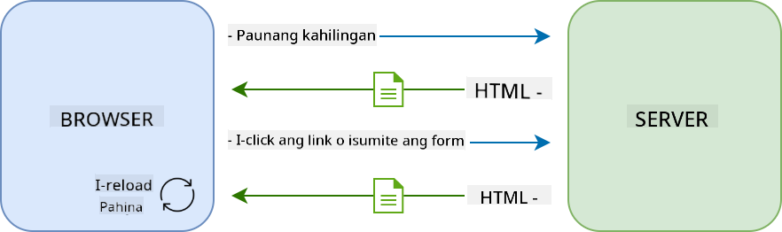
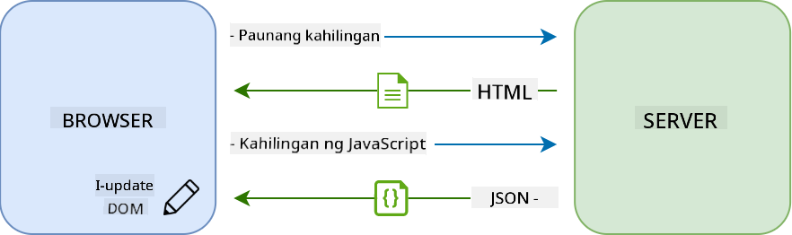

<!--
CO_OP_TRANSLATOR_METADATA:
{
  "original_hash": "431a0e773cfb4f7c13fa4358d01a7db0",
  "translation_date": "2025-10-20T21:07:30+00:00",
  "source_file": "7-bank-project/3-data/README.md",
  "language_code": "tl"
}
-->
# Gumawa ng Banking App Bahagi 3: Mga Paraan ng Pagkuha at Paggamit ng Data

## Pre-Lecture Quiz

[Pre-lecture quiz](https://ff-quizzes.netlify.app/web/quiz/45)

### Panimula

Sa pinakapuso ng bawat web application ay ang *data*. Ang data ay maaaring magkaroon ng iba't ibang anyo, ngunit ang pangunahing layunin nito ay palaging magpakita ng impormasyon sa user. Habang ang mga web app ay nagiging mas interactive at kumplikado, ang paraan ng pag-access at pakikisalamuha ng user sa impormasyon ay naging mahalagang bahagi ng web development.

Sa araling ito, makikita natin kung paano kumuha ng data mula sa server nang asynchronous, at gamitin ang data na ito upang magpakita ng impormasyon sa isang web page nang hindi nire-reload ang HTML.

### Paunang Kaalaman

Kailangan mong nakagawa na ng [Login at Registration Form](../2-forms/README.md) na bahagi ng web app para sa araling ito. Kailangan mo ring mag-install ng [Node.js](https://nodejs.org) at [patakbuhin ang server API](../api/README.md) nang lokal upang makuha ang data ng account.

Maaari mong subukan kung gumagana nang maayos ang server sa pamamagitan ng pag-execute ng command na ito sa terminal:

```sh
curl http://localhost:5000/api
# -> should return "Bank API v1.0.0" as a result
```

---

## AJAX at pagkuha ng data

Ang tradisyunal na mga website ay nag-a-update ng nilalaman na ipinapakita kapag ang user ay pumili ng link o nag-submit ng data gamit ang isang form, sa pamamagitan ng pag-reload ng buong HTML page. Sa tuwing kailangang mag-load ng bagong data, ang web server ay nagbabalik ng panibagong HTML page na kailangang iproseso ng browser, na nagiging sanhi ng pagkaantala sa kasalukuyang aksyon ng user at nililimitahan ang interaksyon sa panahon ng pag-reload. Ang workflow na ito ay tinatawag ding *Multi-Page Application* o *MPA*.



Nang magsimulang maging mas kumplikado at interactive ang mga web application, lumitaw ang isang bagong teknolohiya na tinatawag na [AJAX (Asynchronous JavaScript and XML)](https://en.wikipedia.org/wiki/Ajax_(programming)). Ang teknolohiyang ito ay nagbibigay-daan sa mga web app na magpadala at kumuha ng data mula sa server nang asynchronous gamit ang JavaScript, nang hindi kailangang i-reload ang HTML page, na nagreresulta sa mas mabilis na pag-update at mas maayos na interaksyon ng user. Kapag natanggap ang bagong data mula sa server, ang kasalukuyang HTML page ay maaari ring ma-update gamit ang JavaScript sa pamamagitan ng [DOM](https://developer.mozilla.org/docs/Web/API/Document_Object_Model) API. Sa paglipas ng panahon, ang approach na ito ay umunlad sa tinatawag na [*Single-Page Application* o *SPA*](https://en.wikipedia.org/wiki/Single-page_application).



Noong unang ipinakilala ang AJAX, ang tanging API na magagamit upang kumuha ng data nang asynchronous ay ang [`XMLHttpRequest`](https://developer.mozilla.org/docs/Web/API/XMLHttpRequest/Using_XMLHttpRequest). Ngunit ang mga modernong browser ngayon ay nagpatupad na rin ng mas maginhawa at mas makapangyarihang [`Fetch` API](https://developer.mozilla.org/docs/Web/API/Fetch_API), na gumagamit ng promises at mas angkop para sa pag-manipula ng JSON data.

> Bagamat sinusuportahan ng lahat ng modernong browser ang `Fetch API`, kung nais mong gumana ang iyong web application sa mga lumang browser, palaging magandang ideya na suriin muna ang [compatibility table sa caniuse.com](https://caniuse.com/fetch).

### Gawain

Sa [nakaraang aralin](../2-forms/README.md) ipinatupad natin ang registration form upang lumikha ng account. Ngayon, magdadagdag tayo ng code upang mag-login gamit ang umiiral na account, at kunin ang data nito. Buksan ang file na `app.js` at magdagdag ng bagong function na `login`:

```js
async function login() {
  const loginForm = document.getElementById('loginForm')
  const user = loginForm.user.value;
}
```

Dito nagsisimula tayo sa pagkuha ng form element gamit ang `getElementById()`, at pagkatapos ay kinukuha natin ang username mula sa input gamit ang `loginForm.user.value`. Ang bawat form control ay maaaring ma-access sa pamamagitan ng pangalan nito (na itinakda sa HTML gamit ang attribute na `name`) bilang property ng form.

Katulad ng ginawa natin para sa registration, gagawa tayo ng isa pang function upang magsagawa ng server request, ngunit sa pagkakataong ito para sa pagkuha ng data ng account:

```js
async function getAccount(user) {
  try {
    const response = await fetch('//localhost:5000/api/accounts/' + encodeURIComponent(user));
    return await response.json();
  } catch (error) {
    return { error: error.message || 'Unknown error' };
  }
}
```

Ginagamit natin ang `fetch` API upang mag-request ng data nang asynchronous mula sa server, ngunit sa pagkakataong ito hindi natin kailangan ng anumang extra parameters maliban sa URL na tatawagin, dahil nag-query lang tayo ng data. Sa default, ang `fetch` ay gumagawa ng [`GET`](https://developer.mozilla.org/docs/Web/HTTP/Methods/GET) HTTP request, na siyang hinahanap natin dito.

✅ Ang `encodeURIComponent()` ay isang function na nag-e-escape ng mga espesyal na karakter para sa URL. Anong mga problema ang maaaring mangyari kung hindi natin tatawagin ang function na ito at direktang gagamitin ang value ng `user` sa URL?

Ngayon ay i-update natin ang ating `login` function upang gamitin ang `getAccount`:

```js
async function login() {
  const loginForm = document.getElementById('loginForm')
  const user = loginForm.user.value;
  const data = await getAccount(user);

  if (data.error) {
    return console.log('loginError', data.error);
  }

  account = data;
  navigate('/dashboard');
}
```

Una, dahil ang `getAccount` ay isang asynchronous function, kailangan natin itong i-match sa keyword na `await` upang hintayin ang resulta ng server. Tulad ng anumang server request, kailangan din nating harapin ang mga kaso ng error. Sa ngayon, magdadagdag lang tayo ng log message upang ipakita ang error, at babalikan ito mamaya.

Pagkatapos, kailangan nating i-store ang data sa isang lugar upang magamit ito sa pag-display ng impormasyon sa dashboard. Dahil ang variable na `account` ay hindi pa umiiral, gagawa tayo ng global variable para dito sa itaas ng ating file:

```js
let account = null;
```

Pagkatapos ma-save ang user data sa isang variable, maaari na tayong mag-navigate mula sa *login* page patungo sa *dashboard* gamit ang `navigate()` function na mayroon na tayo.

Sa wakas, kailangan nating tawagin ang ating `login` function kapag na-submit ang login form, sa pamamagitan ng pag-modify sa HTML:

```html
<form id="loginForm" action="javascript:login()">
```

Subukan kung gumagana nang maayos ang lahat sa pamamagitan ng pag-register ng bagong account at pagsubok na mag-login gamit ang parehong account.

Bago magpatuloy sa susunod na bahagi, maaari rin nating kumpletuhin ang `register` function sa pamamagitan ng pagdaragdag nito sa ilalim ng function:

```js
account = result;
navigate('/dashboard');
```

✅ Alam mo ba na sa default, maaari mo lamang tawagin ang server APIs mula sa *parehong domain at port* kung saan mo tinitingnan ang web page? Ito ay mekanismo ng seguridad na ipinatutupad ng mga browser. Ngunit teka, ang ating web app ay tumatakbo sa `localhost:3000` samantalang ang server API ay tumatakbo sa `localhost:5000`, bakit ito gumagana? Sa pamamagitan ng paggamit ng teknolohiyang tinatawag na [Cross-Origin Resource Sharing (CORS)](https://developer.mozilla.org/docs/Web/HTTP/CORS), posible na magsagawa ng cross-origin HTTP requests kung ang server ay nagdadagdag ng mga espesyal na headers sa response, na nagpapahintulot ng mga exception para sa mga partikular na domain.

> Matuto pa tungkol sa APIs sa pamamagitan ng pagkuha ng [araling ito](https://docs.microsoft.com/learn/modules/use-apis-discover-museum-art/?WT.mc_id=academic-77807-sagibbon)

## I-update ang HTML upang magpakita ng data

Ngayon na mayroon na tayong user data, kailangan nating i-update ang umiiral na HTML upang ipakita ito. Alam na natin kung paano kunin ang isang elemento mula sa DOM gamit ang halimbawa `document.getElementById()`. Pagkatapos mong magkaroon ng base element, narito ang ilang mga API na maaari mong gamitin upang baguhin ito o magdagdag ng mga child elements dito:

- Gamit ang property na [`textContent`](https://developer.mozilla.org/docs/Web/API/Node/textContent) maaari mong baguhin ang text ng isang elemento. Tandaan na ang pagbabago sa value na ito ay nag-aalis ng lahat ng mga anak ng elemento (kung mayroon) at pinapalitan ito ng ibinigay na text. Dahil dito, ito rin ay isang epektibong paraan upang alisin ang lahat ng mga anak ng isang elemento sa pamamagitan ng pag-assign ng empty string `''` dito.

- Gamit ang [`document.createElement()`](https://developer.mozilla.org/docs/Web/API/Document/createElement) kasabay ng [`append()`](https://developer.mozilla.org/docs/Web/API/ParentNode/append) method maaari kang lumikha at mag-attach ng isa o higit pang bagong child elements.

✅ Gamit ang property na [`innerHTML`](https://developer.mozilla.org/docs/Web/API/Element/innerHTML) ng isang elemento, posible ring baguhin ang HTML contents nito, ngunit dapat itong iwasan dahil ito ay vulnerable sa [cross-site scripting (XSS)](https://developer.mozilla.org/docs/Glossary/Cross-site_scripting) attacks.

### Gawain

Bago magpatuloy sa dashboard screen, may isang bagay pa tayong dapat gawin sa *login* page. Sa kasalukuyan, kung susubukan mong mag-login gamit ang username na hindi umiiral, isang mensahe ang ipinapakita sa console ngunit para sa isang normal na user, walang nagbabago at hindi mo alam kung ano ang nangyayari.

Magdagdag tayo ng placeholder element sa login form kung saan maaari tayong magpakita ng error message kung kinakailangan. Isang magandang lugar ay bago ang login `<button>`:

```html
...
<div id="loginError"></div>
<button>Login</button>
...
```

Ang `<div>` element na ito ay walang laman, ibig sabihin walang ipapakita sa screen hanggang sa magdagdag tayo ng content dito. Binibigyan din natin ito ng `id` upang madali itong makuha gamit ang JavaScript.

Bumalik sa `app.js` file at gumawa ng bagong helper function na `updateElement`:

```js
function updateElement(id, text) {
  const element = document.getElementById(id);
  element.textContent = text;
}
```

Ang function na ito ay medyo simple: binigyan ng element *id* at *text*, ia-update nito ang text content ng DOM element na may katugmang `id`. Gamitin natin ang method na ito kapalit ng naunang error message sa `login` function:

```js
if (data.error) {
  return updateElement('loginError', data.error);
}
```

Ngayon, kung susubukan mong mag-login gamit ang invalid na account, makikita mo ang ganito:


Ngayon ay mayroon na tayong error text na lumalabas nang visual, ngunit kung susubukan mo ito gamit ang screen reader, mapapansin mong walang naia-announce. Para sa text na dinamikong idinagdag sa isang page na ma-announce ng screen readers, kailangan itong gumamit ng tinatawag na [Live Region](https://developer.mozilla.org/docs/Web/Accessibility/ARIA/ARIA_Live_Regions). Dito gagamit tayo ng isang partikular na uri ng live region na tinatawag na alert:

```html
<div id="loginError" role="alert"></div>
```

Ipatupad ang parehong behavior para sa mga error ng `register` function (huwag kalimutang i-update ang HTML).

## Magpakita ng impormasyon sa dashboard

Gamit ang parehong mga teknik na nakita natin, aalagaan din natin ang pagpapakita ng impormasyon ng account sa dashboard page.

Ganito ang hitsura ng isang account object na natanggap mula sa server:

```json
{
  "user": "test",
  "currency": "$",
  "description": "Test account",
  "balance": 75,
  "transactions": [
    { "id": "1", "date": "2020-10-01", "object": "Pocket money", "amount": 50 },
    { "id": "2", "date": "2020-10-03", "object": "Book", "amount": -10 },
    { "id": "3", "date": "2020-10-04", "object": "Sandwich", "amount": -5 }
  ],
}
```

> Tandaan: upang gawing mas madali ang iyong buhay, maaari mong gamitin ang pre-existing na `test` account na mayroon nang data.

### Gawain

Simulan natin sa pamamagitan ng pagpapalit ng seksyon ng "Balance" sa HTML upang magdagdag ng placeholder elements:

```html
<section>
  Balance: <span id="balance"></span><span id="currency"></span>
</section>
```

Magdagdag din tayo ng bagong seksyon sa ibaba upang ipakita ang account description:

```html
<h2 id="description"></h2>
```

✅ Dahil ang account description ay gumagana bilang pamagat para sa nilalaman sa ilalim nito, ito ay minarkahan nang semantically bilang heading. Matuto pa tungkol sa kung paano [heading structure](https://www.nomensa.com/blog/2017/how-structure-headings-web-accessibility) ay mahalaga para sa accessibility, at suriin nang kritikal ang page upang matukoy kung ano pa ang maaaring maging heading.

Susunod, gagawa tayo ng bagong function sa `app.js` upang punan ang placeholder:

```js
function updateDashboard() {
  if (!account) {
    return navigate('/login');
  }

  updateElement('description', account.description);
  updateElement('balance', account.balance.toFixed(2));
  updateElement('currency', account.currency);
}
```

Una, tinitiyak natin na mayroon tayong kinakailangang account data bago magpatuloy. Pagkatapos ay ginagamit natin ang `updateElement()` function na ginawa natin kanina upang i-update ang HTML.

> Upang gawing mas maganda ang display ng balance, ginagamit natin ang method [`toFixed(2)`](https://developer.mozilla.org/docs/Web/JavaScript/Reference/Global_Objects/Number/toFixed) upang pilitin ang pagpapakita ng value na may 2 digits pagkatapos ng decimal point.

Ngayon kailangan nating tawagin ang `updateDashboard()` function tuwing ang dashboard ay na-load. Kung natapos mo na ang [lesson 1 assignment](../1-template-route/assignment.md) ito ay dapat na straightforward, kung hindi maaari mong gamitin ang sumusunod na implementasyon.

Idagdag ang code na ito sa dulo ng `updateRoute()` function:

```js
if (typeof route.init === 'function') {
  route.init();
}
```

At i-update ang routes definition gamit:

```js
const routes = {
  '/login': { templateId: 'login' },
  '/dashboard': { templateId: 'dashboard', init: updateDashboard }
};
```

Sa pagbabagong ito, tuwing ang dashboard page ay ipinapakita, ang function na `updateDashboard()` ay tinatawag. Pagkatapos ng login, dapat mong makita ang account balance, currency, at description.

## Gumawa ng table rows nang dinamikong gamit ang HTML templates

Sa [unang aralin](../1-template-route/README.md) ginamit natin ang HTML templates kasabay ng [`appendChild()`](https://developer.mozilla.org/docs/Web/API/Node/appendChild) method upang ipatupad ang navigation sa ating app. Ang templates ay maaari ring mas maliit at magamit upang dinamikong punan ang mga repetitive na bahagi ng isang page.

Gagamit tayo ng katulad na approach upang ipakita ang listahan ng mga transactions sa HTML table.

### Gawain

Magdagdag ng bagong template sa HTML `<body>`:

```html
<template id="transaction">
  <tr>
    <td></td>
    <td></td>
    <td></td>
  </tr>
</template>
```

Ang template na ito ay kumakatawan sa isang single table row, na may 3 columns na nais nating punan: *date*, *object*, at *amount* ng isang transaction.

Pagkatapos, idagdag ang property na `id` sa `<tbody>` element ng table sa loob ng dashboard template upang mas madali itong mahanap gamit ang JavaScript:

```html
<tbody id="transactions"></tbody>
```

Handa na ang ating HTML, lumipat tayo sa JavaScript code at gumawa ng bagong function na `createTransactionRow`:

```js
function createTransactionRow(transaction) {
  const template = document.getElementById('transaction');
  const transactionRow = template.content.cloneNode(true);
  const tr = transactionRow.querySelector('tr');
  tr.children[0].textContent = transaction.date;
  tr.children[1].textContent = transaction.object;
  tr.children[2].textContent = transaction.amount.toFixed(2);
  return transactionRow;
}
```

Ang function na ito ay eksaktong ginagawa kung ano ang ipinahihiwatig ng pangalan nito: gamit ang template na ginawa natin kanina, ito ay lumilikha ng bagong table row at pinupunan ang nilalaman nito gamit ang transaction data. Gagamitin natin ito sa `updateDashboard()` function upang punan ang table:

```js
const transactionsRows = document.createDocumentFragment();
for (const transaction of account.transactions) {
  const transactionRow = createTransactionRow(transaction);
  transactionsRows.appendChild(transactionRow);
}
updateElement('transactions', transactionsRows);
```

Dito ginagamit natin ang method [`document.createDocumentFragment()`](https://developer.mozilla.org/docs/Web/API/Document/createDocumentFragment) na lumilikha ng bagong DOM fragment kung saan maaari tayong magtrabaho, bago ito tuluyang i-attach sa ating HTML table.

May isa pang bagay na kailangan nating gawin bago gumana ang code na ito, dahil ang ating `updateElement()` function ay kasalukuyang sumusuporta lamang sa text content. Baguhin natin nang kaunti ang code nito:

```js
function updateElement(id, textOrNode) {
  const element = document.getElementById(id);
  element.textContent = ''; // Removes all children
  element.append(textOrNode);
}
```

Ginagamit namin ang [`append()`](https://developer.mozilla.org/docs/Web/API/ParentNode/append) na pamamaraan dahil pinapayagan nitong magdagdag ng teksto o [DOM Nodes](https://developer.mozilla.org/docs/Web/API/Node) sa isang parent element, na perpekto para sa lahat ng aming mga pangangailangan.

Kung susubukan mong gamitin ang `test` na account para mag-login, makikita mo na ngayon ang listahan ng mga transaksyon sa dashboard 🎉.

---

## Hamon ng GitHub Copilot Agent 🚀

Gamitin ang Agent mode upang tapusin ang sumusunod na hamon:

**Deskripsyon:** Pagandahin ang banking app sa pamamagitan ng pag-implement ng tampok na paghahanap at pag-filter ng transaksyon na magpapahintulot sa mga user na maghanap ng partikular na transaksyon batay sa saklaw ng petsa, halaga, o deskripsyon.

**Prompt:** Gumawa ng functionality sa paghahanap para sa banking app na kinabibilangan ng: 1) Isang search form na may input fields para sa saklaw ng petsa (mula/hanggang), minimum/maximum na halaga, at mga keyword sa deskripsyon ng transaksyon, 2) Isang `filterTransactions()` na function na nagfi-filter sa account.transactions array batay sa mga pamantayan sa paghahanap, 3) I-update ang `updateDashboard()` na function upang ipakita ang mga na-filter na resulta, at 4) Magdagdag ng "Clear Filters" na button upang i-reset ang view. Gumamit ng modernong mga pamamaraan ng JavaScript array tulad ng `filter()` at i-handle ang mga edge cases para sa walang laman na pamantayan sa paghahanap.

## 🚀 Hamon

Magtulungan upang gawing mukhang tunay na banking app ang dashboard page. Kung na-style mo na ang iyong app, subukang gumamit ng [media queries](https://developer.mozilla.org/docs/Web/CSS/Media_Queries) upang lumikha ng [responsive design](https://developer.mozilla.org/docs/Web/Progressive_web_apps/Responsive/responsive_design_building_blocks) na maayos na gumagana sa parehong desktop at mobile devices.

Narito ang isang halimbawa ng styled dashboard page:


## Post-Lecture Quiz

[Post-lecture quiz](https://ff-quizzes.netlify.app/web/quiz/46)

## Takdang-Aralin

[Refactor at lagyan ng komento ang iyong code](assignment.md)

---

**Paunawa**:  
Ang dokumentong ito ay isinalin gamit ang AI translation service [Co-op Translator](https://github.com/Azure/co-op-translator). Bagamat sinisikap naming maging tumpak, mangyaring tandaan na ang mga awtomatikong pagsasalin ay maaaring maglaman ng mga pagkakamali o hindi pagkakatugma. Ang orihinal na dokumento sa kanyang katutubong wika ang dapat ituring na opisyal na sanggunian. Para sa mahalagang impormasyon, inirerekomenda ang propesyonal na pagsasalin ng tao. Hindi kami mananagot sa anumang hindi pagkakaunawaan o maling interpretasyon na dulot ng paggamit ng pagsasaling ito.