<!--
CO_OP_TRANSLATOR_METADATA:
{
  "original_hash": "86ee5069f27ea3151389d8687c95fac9",
  "translation_date": "2025-11-03T13:59:01+00:00",
  "source_file": "7-bank-project/3-data/README.md",
  "language_code": "tl"
}
-->
# Gumawa ng Banking App Bahagi 3: Mga Paraan ng Pagkuha at Paggamit ng Data

Isipin ang computer ng Enterprise sa Star Trek - kapag tinanong ni Captain Picard ang status ng barko, agad na lumalabas ang impormasyon nang hindi nagre-restart o nagre-rebuild ang buong interface. Ang seamless na daloy ng impormasyon na iyon ang eksaktong ginagawa natin dito gamit ang dynamic na pagkuha ng data.

Sa ngayon, ang iyong banking app ay parang isang naka-print na pahayagan - nagbibigay ng impormasyon pero static. Gagawin natin itong parang mission control sa NASA, kung saan tuloy-tuloy ang daloy ng data at nag-a-update nang real-time nang hindi naaabala ang workflow ng user.

Matututo kang makipag-ugnayan sa mga server nang asynchronous, mag-handle ng data na dumarating sa iba't ibang oras, at gawing makabuluhan ang raw na impormasyon para sa iyong mga user. Ito ang pagkakaiba ng demo sa production-ready na software.

## ⚡ Mga Magagawa Mo sa Susunod na 5 Minuto

**Mabilisang Landas para sa Abalang Developer**

```mermaid
flowchart LR
    A[⚡ 5 minutes] --> B[Set up API server]
    B --> C[Test fetch with curl]
    C --> D[Create login function]
    D --> E[See data in action]
```



- **Minuto 1-2**: I-start ang iyong API server (`cd api && npm start`) at i-test ang koneksyon
- **Minuto 3**: Gumawa ng basic na `getAccount()` function gamit ang fetch
- **Minuto 4**: I-wire up ang login form gamit ang `action="javascript:login()"`
- **Minuto 5**: I-test ang login at panoorin ang account data na lumabas sa console

**Mabilisang Test Commands**:
```bash
# Verify API is running
curl http://localhost:5000/api

# Test account data fetch
curl http://localhost:5000/api/accounts/test
```

**Bakit Mahalaga Ito**: Sa loob ng 5 minuto, makikita mo ang magic ng asynchronous data fetching na nagpapatakbo sa bawat modernong web application. Ito ang pundasyon na nagpaparamdam sa mga app na responsive at buhay.

## 🗺️ Ang Iyong Learning Journey sa Data-Driven Web Applications


**Destinasyon ng Iyong Paglalakbay**: Sa pagtatapos ng araling ito, maiintindihan mo kung paano kumukuha, nagpoproseso, at nagpapakita ng data ang mga modernong web application nang dynamic, na lumilikha ng seamless na karanasan para sa user na inaasahan sa mga propesyonal na aplikasyon.

## Pre-Lecture Quiz

[Pre-lecture quiz](https://ff-quizzes.netlify.app/web/quiz/45)

### Mga Kinakailangan

Bago sumabak sa pagkuha ng data, siguraduhing handa ka sa mga sumusunod na components:

- **Nakaraang Aralin**: Kumpletuhin ang [Login at Registration Form](../2-forms/README.md) - magtatayo tayo sa pundasyong ito
- **Local Server**: I-install ang [Node.js](https://nodejs.org) at [patakbuhin ang server API](../api/README.md) para magbigay ng account data
- **API Connection**: I-test ang koneksyon ng iyong server gamit ang command na ito:

```bash
curl http://localhost:5000/api
# Expected response: "Bank API v1.0.0"
```

Ang mabilisang test na ito ay nagsisiguro na ang lahat ng components ay maayos na nag-uusap:
- Pinapatunayan na ang Node.js ay maayos na tumatakbo sa iyong sistema
- Kinukumpirma na ang iyong API server ay aktibo at tumutugon
- Pinapatunayan na ang iyong app ay maabot ang server (parang pag-check ng radio contact bago ang isang misyon)

## 🧠 Overview ng Data Management Ecosystem


**Pangunahing Prinsipyo**: Ang mga modernong web application ay mga sistema ng data orchestration - pinagsasama-sama ang user interfaces, server APIs, at browser security models para makalikha ng seamless, responsive na karanasan.

---

## Pag-unawa sa Pagkuha ng Data sa Modernong Web Apps

Ang paraan ng pag-handle ng data ng mga web application ay lubos na nag-evolve sa nakalipas na dalawang dekada. Ang pag-unawa sa ebolusyong ito ay makakatulong sa iyo na ma-appreciate kung bakit ang mga modernong teknolohiya tulad ng AJAX at Fetch API ay napakalakas at kung bakit sila naging mahalagang tools para sa mga web developer.

Tuklasin natin kung paano gumagana ang mga tradisyunal na website kumpara sa mga dynamic, responsive na application na ginagawa natin ngayon.

### Tradisyunal na Multi-Page Applications (MPA)

Noong unang panahon ng web, bawat click ay parang pagpapalit ng channel sa lumang telebisyon - magbablanko ang screen, tapos dahan-dahang maglo-load ang bagong content. Ganito ang realidad ng mga unang web application, kung saan bawat interaction ay nangangahulugan ng ganap na pag-rebuild ng buong page mula sa simula.


**Bakit pakiramdam na clunky ang approach na ito:**
- Bawat click ay nangangahulugan ng pag-rebuild ng buong page mula sa simula
- Naiistorbo ang mga user sa gitna ng kanilang iniisip dahil sa mga nakakainis na page flashes
- Ang iyong internet connection ay nagtatrabaho nang sobra sa pag-download ng parehong header at footer nang paulit-ulit
- Ang mga app ay parang pag-click sa filing cabinet kaysa sa paggamit ng software

### Modernong Single-Page Applications (SPA)

Binago ng AJAX (Asynchronous JavaScript and XML) ang paradigm na ito nang buo. Tulad ng modular na disenyo ng International Space Station, kung saan maaaring palitan ng mga astronaut ang mga indibidwal na components nang hindi nire-rebuild ang buong istruktura, pinapayagan tayo ng AJAX na i-update ang mga partikular na bahagi ng webpage nang hindi nire-reload ang lahat. Kahit na binabanggit ng pangalan ang XML, kadalasan ay JSON ang ginagamit natin ngayon, pero nananatili ang pangunahing prinsipyo: i-update lang ang kailangang baguhin.


**Bakit mas maganda ang pakiramdam ng SPAs:**
- Ang mga bahagi lang na talagang nagbago ang na-update (matalino, di ba?)
- Wala nang nakakagulat na interruptions - nananatili ang mga user sa kanilang flow
- Mas kaunting data ang dumadaan sa wire kaya mas mabilis ang pag-load
- Lahat ay pakiramdam na snappy at responsive, tulad ng mga app sa iyong telepono

### Ang Ebolusyon sa Modernong Fetch API

Nagbibigay ang mga modernong browser ng [`Fetch` API](https://developer.mozilla.org/docs/Web/API/Fetch_API), na pumapalit sa mas lumang [`XMLHttpRequest`](https://developer.mozilla.org/docs/Web/API/XMLHttpRequest/Using_XMLHttpRequest). Tulad ng pagkakaiba ng paggamit ng telegraph at email, gumagamit ang Fetch API ng promises para sa mas malinis na asynchronous na code at natural na hinahandle ang JSON.

| Feature | XMLHttpRequest | Fetch API |
|---------|----------------|----------|
| **Syntax** | Kumplikadong callback-based | Malinis na promise-based |
| **JSON Handling** | Kinakailangang manual parsing | Built-in na `.json()` method |
| **Error Handling** | Limitadong impormasyon sa error | Komprehensibong detalye ng error |
| **Modern Support** | Legacy compatibility | ES6+ promises at async/await |

> 💡 **Browser Compatibility**: Magandang balita - gumagana ang Fetch API sa lahat ng modernong browser! Kung curious ka sa mga partikular na bersyon, [caniuse.com](https://caniuse.com/fetch) ang may kumpletong compatibility story.
> 
**Ang bottom line:**
- Gumagana nang mahusay sa Chrome, Firefox, Safari, at Edge (karamihan sa mga lugar kung nasaan ang iyong mga user)
- Ang Internet Explorer lang ang nangangailangan ng dagdag na tulong (at honestly, panahon na para bitawan ang IE)
- Perpektong nakahanda para sa eleganteng async/await patterns na gagamitin natin mamaya

### Pag-implement ng User Login at Pagkuha ng Data

Ngayon, i-implement natin ang login system na magta-transform sa iyong banking app mula sa static na display patungo sa functional na application. Tulad ng authentication protocols na ginagamit sa mga secure na pasilidad ng militar, i-verify natin ang user credentials at pagkatapos ay magbibigay ng access sa kanilang partikular na data.

Gagawin natin ito nang paunti-unti, simula sa basic authentication at pagkatapos ay idagdag ang data-fetching capabilities.

#### Hakbang 1: Gumawa ng Foundation ng Login Function

Buksan ang iyong `app.js` file at magdagdag ng bagong `login` function. Ito ang magha-handle ng proseso ng user authentication:

```javascript
async function login() {
  const loginForm = document.getElementById('loginForm');
  const user = loginForm.user.value;
}
```

**I-breakdown natin ito:**
- Ang `async` keyword? Sinasabi nito sa JavaScript "hey, maaaring maghintay ang function na ito para sa mga bagay"
- Kinukuha natin ang form mula sa page (walang fancy, hinahanap lang ito gamit ang ID nito)
- Pagkatapos, kinukuha natin ang anumang tinype ng user bilang kanilang username
- Narito ang isang neat na trick: maaari mong ma-access ang anumang form input gamit ang `name` attribute nito - walang kailangan na dagdag na getElementById calls!

> 💡 **Form Access Pattern**: Ang bawat form control ay maaaring ma-access gamit ang name (na itinakda sa HTML gamit ang `name` attribute) bilang property ng form element. Nagbibigay ito ng malinis, readable na paraan para makuha ang form data.

#### Hakbang 2: Gumawa ng Account Data Fetching Function

Susunod, gagawa tayo ng dedikadong function para kunin ang account data mula sa server. Sinusunod nito ang parehong pattern ng iyong registration function pero nakatuon sa pagkuha ng data:

```javascript
async function getAccount(user) {
  try {
    const response = await fetch('//localhost:5000/api/accounts/' + encodeURIComponent(user));
    return await response.json();
  } catch (error) {
    return { error: error.message || 'Unknown error' };
  }
}
```

**Narito ang nagagawa ng code na ito:**
- **Gumagamit** ng modernong `fetch` API para mag-request ng data nang asynchronous
- **Nagko-construct** ng GET request URL gamit ang username parameter
- **Nag-aapply** ng `encodeURIComponent()` para ligtas na ma-handle ang special characters sa URLs
- **Kinoconvert** ang response sa JSON format para sa madaling data manipulation
- **Nagha-handle** ng errors nang maayos sa pamamagitan ng pagbalik ng error object sa halip na mag-crash

> ⚠️ **Security Note**: Ang `encodeURIComponent()` function ay nagha-handle ng special characters sa URLs. Tulad ng encoding systems na ginagamit sa naval communications, sinisiguro nito na ang iyong mensahe ay darating nang eksakto sa intended na paraan, pinipigilan ang mga character tulad ng "#" o "&" na ma-misinterpret.
> 
**Bakit ito mahalaga:**
- Pinipigilan ang special characters na masira ang URLs
- Pinoprotektahan laban sa URL manipulation attacks
- Sinisiguro na ang iyong server ay makakatanggap ng intended na data
- Sumusunod sa secure coding practices

#### Pag-unawa sa HTTP GET Requests

Narito ang isang bagay na maaaring magulat ka: kapag ginamit mo ang `fetch` nang walang anumang extra options, awtomatikong gumagawa ito ng [`GET`](https://developer.mozilla.org/docs/Web/HTTP/Methods/GET) request. Perpekto ito para sa ginagawa natin - humihiling sa server "hey, maaari ko bang makita ang account data ng user na ito?"

Isipin ang GET requests na parang magalang na paghingi ng libro sa library - humihiling ka na makita ang isang bagay na umiiral na. Ang POST requests (na ginamit natin para sa registration) ay mas katulad ng pagsusumite ng bagong libro para idagdag sa koleksyon.

| GET Request | POST Request |
|-------------|-------------|
| **Layunin** | Kunin ang umiiral na data | Magpadala ng bagong data sa server |
| **Parameters** | Sa URL path/query string | Sa request body |
| **Caching** | Maaaring i-cache ng browsers | Hindi karaniwang naka-cache |
| **Security** | Nakikita sa URL/logs | Nakatago sa request body |


#### Hakbang 3: Pagsasama-sama ng Lahat

Ngayon para sa satisfying na bahagi - i-connect natin ang iyong account fetching function sa login process. Dito nagkakaroon ng click ang lahat:

```javascript
async function login() {
  const loginForm = document.getElementById('loginForm');
  const user = loginForm.user.value;
  const data = await getAccount(user);

  if (data.error) {
    return console.log('loginError', data.error);
  }

  account = data;
  navigate('/dashboard');
}
```

Ang function na ito ay sumusunod sa malinaw na sequence:
- Kunin ang username mula sa form input
- I-request ang account data ng user mula sa server
- I-handle ang anumang errors na mangyayari sa proseso
- I-store ang account data at mag-navigate sa dashboard kapag successful

> 🎯 **Async/Await Pattern**: Dahil ang `getAccount` ay isang asynchronous function, ginagamit natin ang `await` keyword para i-pause ang execution hanggang sa tumugon ang server. Pinipigilan nito ang code na magpatuloy nang undefined ang data.

#### Hakbang 4: Gumawa ng Tahanan para sa Iyong Data

Ang iyong app ay nangangailangan ng lugar para maalala ang impormasyon ng account kapag na-load na ito. Isipin ito na parang short-term memory ng iyong app - isang lugar para panatilihing handy ang data ng kasalukuyang user. Magdagdag ng linyang ito sa itaas ng iyong `app.js` file:

```javascript
// This holds the current user's account data
let account = null;
```

**Bakit natin ito kailangan:**
- Pinapanatili ang account data na accessible mula sa kahit saan sa iyong app
- Ang pagsisimula sa `null` ay nangangahulugang "wala pang naka-login"
- Na-update kapag may nag-login o nag-register nang matagumpay
- Kumilos bilang single source of truth - walang kalituhan kung sino ang naka-login

#### Hakbang 5: I-wire Up ang Iyong Form

Ngayon, i-connect natin ang iyong bagong login function sa iyong HTML form. I-update ang iyong form tag nang ganito:

```html
<form id="loginForm" action="javascript:login()">
  <!-- Your existing form inputs -->
</form>
```

**Ano ang ginagawa ng maliit na pagbabago na ito:**
- Pinipigilan ang form na gawin ang default nitong "i-reload ang buong page" na behavior
- Tumatawag sa iyong custom na JavaScript function sa halip
- Pinapanatili ang lahat na smooth at single-page-app-like
- Binibigyan ka ng kumpletong kontrol sa kung ano ang mangyayari kapag pinindot ng user ang "Login"

#### Hakbang 6: Pagandahin ang Iyong Registration Function

Para sa consistency, i-update ang iyong `register` function para rin mag-store ng account data at mag-navigate sa dashboard:

```javascript
// Add these lines at the end of your register function
account = result;
navigate('/dashboard');
```

**Ang enhancement na ito ay nagbibigay:**
- **Seamless** na transition mula sa registration patungo sa dashboard
- **Consistent** na user experience sa pagitan ng login at registration flows
- **Immediate** na access sa account data pagkatapos ng matagumpay na registration

#### Testing ng Iyong Implementation


**Panahon na para subukan ito:**
1. Gumawa ng bagong account para masigurado na gumagana ang lahat
2. Subukang mag-login gamit ang parehong credentials
3. Silipin ang console ng iyong browser (F12) kung may anumang tila mali
4. Siguraduhin na mapunta ka sa dashboard pagkatapos ng matagumpay na login

Kung may hindi gumagana, huwag mag-panic! Karamihan sa mga isyu ay simpleng ayusin tulad ng typos o pagkalimot na i-start ang API server.

#### Isang Mabilis na Salita Tungkol sa Cross-Origin Magic

Maaaring iniisip mo: "Paano nakikipag-usap ang aking web app sa API server na tumatakbo sa iba't ibang ports?" Magandang tanong! Ito ay tumutukoy sa isang bagay na bawat web developer ay natutuklasan kalaunan.

> 🔒 **Cross-Origin Security**: Ang mga browser ay nagpapatupad ng "same-origin policy" para pigilan ang hindi awtorisadong komunikasyon sa pagitan ng iba't ibang domain. Tulad ng checkpoint system sa Pentagon, tinitiyak nila na ang komunikasyon ay awtorisado bago payagan ang data transfer.
> 
**Sa ating setup:**
- Ang iyong web app ay tumatakbo sa `localhost:3000` (development server)
- Ang iyong API server ay tumatakbo sa `localhost:5000` (backend server)
- Ang API server ay naglalaman ng [CORS headers](https://developer.mozilla.org/docs/Web/HTTP/CORS) na tahasang nag-aawtorisa ng komunikasyon mula sa iyong web app

Ang configuration na ito ay sumasalamin sa real-world development kung saan ang frontend at backend applications ay karaniwang tumatakbo sa magkahiwalay na server.

> 📚 **Matuto Pa**: Tuklasin ang higit pa tungkol sa APIs at data fetching gamit ang komprehensibong [Microsoft Learn module tungkol sa APIs](https://docs.microsoft.com/learn/modules/use-apis-discover-museum-art/?WT.mc_id=academic-77807-sagibbon).

## Pagdadala ng Iyong Data sa Buhay sa HTML

Ngayon, gagawin nating visible sa mga user ang fetched data sa pamamagitan ng DOM manipulation. Tulad ng proseso ng pag-develop ng mga litrato sa darkroom, gagawin nating nakikita at interactive ang invisible na data.
Ang manipulasyon ng DOM ay isang teknik na nagbabago sa mga static na web page upang maging dynamic na aplikasyon na nag-a-update ng kanilang nilalaman batay sa interaksyon ng user at tugon ng server.

### Pagpili ng Tamang Tool para sa Trabaho

Kapag nag-a-update ng iyong HTML gamit ang JavaScript, may ilang opsyon kang magagamit. Isipin ang mga ito bilang iba't ibang kasangkapan sa toolbox - bawat isa ay perpekto para sa partikular na gawain:

| Pamamaraan | Magaling para sa | Kailan ito gagamitin | Antas ng Kaligtasan |
|------------|------------------|---------------------|---------------------|
| `textContent` | Ligtas na pagpapakita ng data ng user | Tuwing nagpapakita ng teksto | ✅ Napaka-ligtas |
| `createElement()` + `append()` | Pagbuo ng masalimuot na layout | Paglikha ng mga bagong seksyon/listahan | ✅ Napaka-ligtas |
| `innerHTML` | Pag-set ng nilalaman ng HTML | ⚠️ Iwasan hangga't maaari | ❌ Mapanganib |

#### Ang Ligtas na Paraan ng Pagpapakita ng Teksto: textContent

Ang [`textContent`](https://developer.mozilla.org/docs/Web/API/Node/textContent) property ay ang iyong pinakamagandang kaibigan kapag nagpapakita ng data ng user. Para itong bouncer ng iyong webpage - walang mapanganib na makakapasok:

```javascript
// The safe, reliable way to update text
const balanceElement = document.getElementById('balance');
balanceElement.textContent = account.balance;
```

**Mga Benepisyo ng textContent:**
- Itinuturing ang lahat bilang plain text (pinipigilan ang pag-execute ng script)
- Awtomatikong nililinis ang umiiral na nilalaman
- Epektibo para sa simpleng pag-update ng teksto
- Nagbibigay ng built-in na seguridad laban sa mapanganib na nilalaman

#### Paglikha ng Dynamic na HTML Elements

Para sa mas masalimuot na nilalaman, pagsamahin ang [`document.createElement()`](https://developer.mozilla.org/docs/Web/API/Document/createElement) sa [`append()`](https://developer.mozilla.org/docs/Web/API/ParentNode/append) method:

```javascript
// Safe way to create new elements
const transactionItem = document.createElement('div');
transactionItem.className = 'transaction-item';
transactionItem.textContent = `${transaction.date}: ${transaction.description}`;
container.append(transactionItem);
```

**Pag-unawa sa pamamaraang ito:**
- **Lumilikha** ng bagong DOM elements nang programmatically
- **Nagbibigay** ng buong kontrol sa mga attribute at nilalaman ng elemento
- **Nagpapahintulot** ng masalimuot, nested na istruktura ng elemento
- **Pinapanatili** ang seguridad sa pamamagitan ng paghihiwalay ng istruktura mula sa nilalaman

> ⚠️ **Pagsasaalang-alang sa Seguridad**: Bagama't ang [`innerHTML`](https://developer.mozilla.org/docs/Web/API/Element/innerHTML) ay madalas lumalabas sa mga tutorial, maaari itong mag-execute ng embedded scripts. Tulad ng mga protocol ng seguridad sa CERN na pumipigil sa hindi awtorisadong pag-execute ng code, ang paggamit ng `textContent` at `createElement` ay nagbibigay ng mas ligtas na alternatibo.
> 
**Mga Panganib ng innerHTML:**
- Nag-eexecute ng anumang `<script>` tags sa data ng user
- Mahina sa mga pag-atake ng code injection
- Lumilikha ng potensyal na mga kahinaan sa seguridad
- Ang mas ligtas na alternatibo na ginagamit natin ay nagbibigay ng katumbas na functionality

### Pagpapaganda ng Error Handling para sa User

Sa kasalukuyan, ang mga error sa pag-login ay lumalabas lamang sa browser console, na hindi nakikita ng mga user. Tulad ng pagkakaiba ng internal diagnostics ng piloto at ang sistema ng impormasyon para sa mga pasahero, kailangan nating iparating ang mahalagang impormasyon sa tamang channel.

Ang pag-implement ng mga nakikitang mensahe ng error ay nagbibigay sa mga user ng agarang feedback tungkol sa kung ano ang mali at kung paano ito maaayos.

#### Hakbang 1: Magdagdag ng Lugar para sa Mga Mensahe ng Error

Una, bigyan natin ng tahanan ang mga mensahe ng error sa iyong HTML. Idagdag ito bago ang iyong login button upang natural itong makita ng mga user:

```html
<!-- This is where error messages will appear -->
<div id="loginError" role="alert"></div>
<button>Login</button>
```

**Ano ang nangyayari dito:**
- Lumilikha tayo ng isang walang laman na container na nananatiling invisible hanggang kailanganin
- Nakaposisyon ito kung saan natural na tumitingin ang mga user pagkatapos mag-click ng "Login"
- Ang `role="alert"` ay isang magandang touch para sa screen readers - sinasabi nito sa assistive technology "hey, mahalaga ito!"
- Ang natatanging `id` ay nagbibigay sa ating JavaScript ng madaling target

#### Hakbang 2: Gumawa ng Handy Helper Function

Gumawa tayo ng maliit na utility function na maaaring mag-update ng teksto ng anumang elemento. Isa ito sa mga "isulat minsan, gamitin kahit saan" na function na makakatipid sa iyo ng oras:

```javascript
function updateElement(id, text) {
  const element = document.getElementById(id);
  element.textContent = text;
}
```

**Mga Benepisyo ng Function:**
- Simpleng interface na nangangailangan lamang ng element ID at text content
- Ligtas na hinahanap at ina-update ang mga DOM elements
- Reusable na pattern na nagpapabawas ng pag-uulit ng code
- Pinapanatili ang pare-parehong pag-update ng behavior sa buong aplikasyon

#### Hakbang 3: Ipakita ang Mga Error Kung Saan Makikita ng Mga User

Ngayon, palitan natin ang nakatagong console message ng isang bagay na talagang makikita ng mga user. I-update ang iyong login function:

```javascript
// Instead of just logging to console, show the user what's wrong
if (data.error) {
  return updateElement('loginError', data.error);
}
```

**Ang maliit na pagbabagong ito ay may malaking epekto:**
- Ang mga mensahe ng error ay lumalabas kung saan tumitingin ang mga user
- Wala nang misteryosong silent failures
- Ang mga user ay nakakakuha ng agarang, actionable na feedback
- Ang iyong app ay nagsisimulang magmukhang propesyonal at maayos

Ngayon, kapag sinubukan mong mag-login gamit ang invalid na account, makikita mo ang isang kapaki-pakinabang na mensahe ng error sa mismong pahina!


#### Hakbang 4: Pagiging Inclusive sa Accessibility

Narito ang isang cool na bagay tungkol sa `role="alert"` na idinagdag natin kanina - hindi lang ito dekorasyon! Ang maliit na attribute na ito ay lumilikha ng tinatawag na [Live Region](https://developer.mozilla.org/docs/Web/Accessibility/ARIA/ARIA_Live_Regions) na agad na ina-announce ang mga pagbabago sa screen readers:

```html
<div id="loginError" role="alert"></div>
```

**Bakit ito mahalaga:**
- Naririnig ng mga user ng screen reader ang mensahe ng error sa sandaling lumitaw ito
- Lahat ay nakakatanggap ng parehong mahalagang impormasyon, anuman ang paraan ng kanilang pag-navigate
- Isang simpleng paraan upang gawing mas accessible ang iyong app
- Ipinapakita na pinahahalagahan mo ang paglikha ng inclusive na karanasan

Ang maliliit na detalye tulad nito ang nagtatangi sa magagaling na developer mula sa mga dakilang developer!

### 🎯 Pedagogical Check-in: Mga Pattern ng Authentication

**Mag-pause at Mag-isip**: Katatapos mo lang mag-implement ng kumpletong authentication flow. Isa itong pundasyon sa web development.

**Mabilis na Pagsusuri sa Sarili**:
- Kaya mo bang ipaliwanag kung bakit natin ginagamit ang async/await para sa mga API calls?
- Ano ang mangyayari kung nakalimutan natin ang `encodeURIComponent()` function?
- Paano pinapabuti ng ating error handling ang karanasan ng user?

**Koneksyon sa Tunay na Mundo**: Ang mga pattern na natutunan mo dito (async data fetching, error handling, user feedback) ay ginagamit sa bawat pangunahing web application mula sa mga social media platform hanggang sa mga e-commerce site. Nagkakaroon ka ng mga kasanayan na pang-produksyon!

**Tanong ng Hamon**: Paano mo babaguhin ang sistemang ito ng authentication upang pamahalaan ang iba't ibang user roles (customer, admin, teller)? Isipin ang istruktura ng data at mga pagbabago sa UI na kinakailangan.

#### Hakbang 5: I-apply ang Parehong Pattern sa Registration

Para sa consistency, i-implement ang parehong error handling sa iyong registration form:

1. **Magdagdag** ng error display element sa iyong registration HTML:
```html
<div id="registerError" role="alert"></div>
```

2. **I-update** ang iyong register function upang gamitin ang parehong error display pattern:
```javascript
if (data.error) {
  return updateElement('registerError', data.error);
}
```

**Mga Benepisyo ng consistent na error handling:**
- **Nagbibigay** ng pare-parehong karanasan sa user sa lahat ng form
- **Nagpapababa** ng cognitive load sa pamamagitan ng paggamit ng pamilyar na pattern
- **Pinadadali** ang maintenance gamit ang reusable na code
- **Tinitiyak** ang pagsunod sa mga pamantayan ng accessibility sa buong app

## Paglikha ng Iyong Dynamic Dashboard

Ngayon, gagawin nating dynamic ang iyong static na dashboard upang magpakita ng totoong data ng account. Tulad ng pagkakaiba ng naka-print na flight schedule at ang live departure boards sa mga paliparan, lilipat tayo mula sa static na impormasyon patungo sa real-time, responsive na display.

Gamit ang mga teknik sa manipulasyon ng DOM na natutunan mo, gagawa tayo ng dashboard na awtomatikong nag-a-update gamit ang kasalukuyang impormasyon ng account.

### Pagkilala sa Iyong Data

Bago tayo magsimulang magtayo, silipin muna natin kung anong uri ng data ang ipinapadala ng iyong server pabalik. Kapag matagumpay na nag-login ang isang tao, narito ang kayamanan ng impormasyon na maaari mong gamitin:

```json
{
  "user": "test",
  "currency": "$",
  "description": "Test account",
  "balance": 75,
  "transactions": [
    { "id": "1", "date": "2020-10-01", "object": "Pocket money", "amount": 50 },
    { "id": "2", "date": "2020-10-03", "object": "Book", "amount": -10 },
    { "id": "3", "date": "2020-10-04", "object": "Sandwich", "amount": -5 }
  ]
}
```

**Ang istruktura ng data na ito ay nagbibigay:**
- **`user`**: Perpekto para sa pagpapersonalize ng karanasan ("Welcome back, Sarah!")
- **`currency`**: Tinitiyak na tama ang pagpapakita ng halaga ng pera
- **`description`**: Isang friendly na pangalan para sa account
- **`balance`**: Ang mahalagang kasalukuyang balanse
- **`transactions`**: Ang kumpletong kasaysayan ng transaksyon na may lahat ng detalye

Lahat ng kailangan mo upang makagawa ng propesyonal na banking dashboard!


> 💡 **Pro Tip**: Gusto mo bang makita agad ang iyong dashboard sa aksyon? Gamitin ang username na `test` kapag nag-login - ito ay may pre-loaded na sample data upang makita mo ang lahat ng gumagana nang hindi kinakailangang gumawa muna ng mga transaksyon.
> 
**Bakit kapaki-pakinabang ang test account:**
- May kasamang realistic na sample data na naka-load na
- Perpekto para makita kung paano ipinapakita ang mga transaksyon
- Magaling para sa pag-test ng mga feature ng dashboard
- Pinapadali ang pag-test nang hindi kinakailangang gumawa ng dummy data nang manu-mano

### Paglikha ng Dashboard Display Elements

Gawin natin ang iyong dashboard interface step by step, simula sa impormasyon ng account summary at pagkatapos ay magpatuloy sa mas masalimuot na mga feature tulad ng mga listahan ng transaksyon.

#### Hakbang 1: I-update ang Istruktura ng Iyong HTML

Una, palitan ang static na seksyon ng "Balance" ng mga dynamic na placeholder elements na maaaring punan ng iyong JavaScript:

```html
<section>
  Balance: <span id="balance"></span><span id="currency"></span>
</section>
```

Susunod, magdagdag ng seksyon para sa account description. Dahil ito ay nagsisilbing pamagat para sa nilalaman ng dashboard, gumamit ng semantic HTML:

```html
<h2 id="description"></h2>
```

**Pag-unawa sa istruktura ng HTML:**
- **Gumagamit** ng hiwalay na `<span>` elements para sa balanse at currency para sa indibidwal na kontrol
- **Nag-aapply** ng natatanging mga ID sa bawat elemento para sa JavaScript targeting
- **Sumusunod** sa semantic HTML sa pamamagitan ng paggamit ng `<h2>` para sa account description
- **Lumilikha** ng lohikal na hierarchy para sa screen readers at SEO

> ✅ **Insight sa Accessibility**: Ang account description ay nagsisilbing pamagat para sa nilalaman ng dashboard, kaya ito ay naka-markup nang semantically bilang heading. Alamin ang higit pa tungkol sa kung paano [heading structure](https://www.nomensa.com/blog/2017/how-structure-headings-web-accessibility) nakakaapekto sa accessibility. Maaari mo bang tukuyin ang iba pang mga elemento sa iyong pahina na maaaring makinabang mula sa mga heading tags?

#### Hakbang 2: Gumawa ng Dashboard Update Function

Ngayon, gumawa ng function na magpapakain sa iyong dashboard ng totoong data ng account:

```javascript
function updateDashboard() {
  if (!account) {
    return navigate('/login');
  }

  updateElement('description', account.description);
  updateElement('balance', account.balance.toFixed(2));
  updateElement('currency', account.currency);
}
```

**Step by step, narito ang ginagawa ng function na ito:**
- **Nagva-validate** na may umiiral na data ng account bago magpatuloy
- **Nagre-redirect** sa mga hindi authenticated na user pabalik sa login page
- **Ina-update** ang account description gamit ang reusable na `updateElement` function
- **Nagfo-format** ng balanse upang palaging magpakita ng dalawang decimal places
- **Ipinapakita** ang tamang currency symbol

> 💰 **Pag-format ng Pera**: Ang [`toFixed(2)`](https://developer.mozilla.org/docs/Web/JavaScript/Reference/Global_Objects/Number/toFixed) method ay napaka-kapaki-pakinabang! Tinitiyak nito na ang iyong balanse ay palaging mukhang totoong pera - "75.00" sa halip na "75" lang. Maa-appreciate ng iyong mga user ang pamilyar na format ng pera.

#### Hakbang 3: Tiyaking Nag-a-update ang Iyong Dashboard

Upang matiyak na ang iyong dashboard ay nagre-refresh gamit ang kasalukuyang data tuwing may bumibisita dito, kailangan nating i-hook ito sa iyong navigation system. Kung natapos mo ang [lesson 1 assignment](../1-template-route/assignment.md), dapat itong pamilyar. Kung hindi, huwag mag-alala - narito ang kailangan mo:

Idagdag ito sa dulo ng iyong `updateRoute()` function:

```javascript
if (typeof route.init === 'function') {
  route.init();
}
```

Pagkatapos, i-update ang iyong mga ruta upang isama ang dashboard initialization:

```javascript
const routes = {
  '/login': { templateId: 'login' },
  '/dashboard': { templateId: 'dashboard', init: updateDashboard }
};
```

**Ano ang ginagawa ng setup na ito:**
- Sinusuri kung ang isang ruta ay may espesyal na initialization code
- Awtomatikong pinapatakbo ang code na iyon kapag nag-load ang ruta
- Tinitiyak na ang iyong dashboard ay palaging nagpapakita ng sariwa, kasalukuyang data
- Pinapanatili ang malinis at organisadong routing logic

#### Pagsubok sa Iyong Dashboard

Pagkatapos i-implement ang mga pagbabagong ito, subukan ang iyong dashboard:

1. **Mag-login** gamit ang test account
2. **I-verify** na ikaw ay na-redirect sa dashboard
3. **Suriin** na ang account description, balanse, at currency ay tamang ipinapakita
4. **Subukang mag-log out at mag-log in muli** upang matiyak na nagre-refresh ang data nang maayos

Ang iyong dashboard ay dapat na nagpapakita na ngayon ng dynamic na impormasyon ng account na nag-a-update batay sa data ng user na naka-login!

## Pagbuo ng Smart Transaction Lists gamit ang Templates

Sa halip na manu-manong gumawa ng HTML para sa bawat transaksyon, gagamit tayo ng templates upang awtomatikong makabuo ng pare-parehong format. Tulad ng standardized components na ginagamit sa spacecraft manufacturing, tinitiyak ng templates na ang bawat transaction row ay sumusunod sa parehong istruktura at hitsura.

Ang teknik na ito ay epektibong nag-scale mula sa ilang transaksyon hanggang sa libu-libo, pinapanatili ang pare-parehong performance at presentation.


### Hakbang 1: Gumawa ng Transaction Template

Una, magdagdag ng reusable template para sa transaction rows sa iyong HTML `<body>`:

```html
<template id="transaction">
  <tr>
    <td></td>
    <td></td>
    <td></td>
  </tr>
</template>
```

**Pag-unawa sa HTML templates:**
- **Tinutukoy** ang istruktura para sa isang table row
- **Nanatiling** invisible hanggang ma-clone at mapunan gamit ang JavaScript
- **May kasamang** tatlong cells para sa petsa, description, at halaga
- **Nagbibigay** ng reusable na pattern para sa pare-parehong format

### Hakbang 2: Ihanda ang Iyong Table para sa Dynamic Content

Susunod, magdagdag ng `id` sa iyong table body upang madali itong ma-target ng JavaScript:

```html
<tbody id="transactions"></tbody>
```

**Ano ang nagagawa nito:**
- **Lumilikha** ng malinaw na target para sa pag-insert ng transaction rows
- **Ibinubukod** ang istruktura ng table mula sa dynamic na nilalaman
- **Nagpapahintulot** ng madaling pag-clear at pag-repopulate ng transaction data

### Hakbang 3: Bumuo ng Transaction Row Factory Function

Ngayon, gumawa ng function na nagta-transform ng transaction data sa HTML elements:

```javascript
function createTransactionRow(transaction) {
  const template = document.getElementById('transaction');
  const transactionRow = template.content.cloneNode(true);
  const tr = transactionRow.querySelector('tr');
  tr.children[0].textContent = transaction.date;
  tr.children[1].textContent = transaction.object;
  tr.children[2].textContent = transaction.amount.toFixed(2);
  return transactionRow;
}
```

**Pagbubuo ng factory function na ito:**
- **Kinukuha** ang template element gamit ang ID nito
- **Kinokopya** ang template content para sa ligtas na manipulasyon
- **Pinipili** ang table row sa loob ng cloned content
- **Pinupunan** ang bawat cell gamit ang transaction data
- **Nagfo-format** ng halaga upang magpakita ng tamang decimal places
- **Ibinabalik** ang kumpletong row na handa nang i-insert

### Hakbang 4: Epektibong Pagbuo ng Maramihang Transaction Rows

Idagdag ang code na ito sa iyong `updateDashboard()` function upang ipakita ang lahat ng transaksyon:

```javascript
const transactionsRows = document.createDocumentFragment();
for (const transaction of account.transactions) {
  const transactionRow = createTransactionRow(transaction);
  transactionsRows.appendChild(transactionRow);
}
updateElement('transactions', transactionsRows);
```

**Pag-unawa sa epektibong pamamaraang ito:**
- **Lumilikha** ng document fragment upang i-batch ang mga DOM operations
- **Iniikot** ang lahat ng transaksyon sa data ng account
- **Gumagawa** ng row para sa bawat transaksyon gamit ang factory function
- **Kinokolekta** ang lahat ng rows sa fragment bago idagdag sa DOM
- **Isinasagawa** ang isang DOM update sa halip na maramihang individual insertions
> ⚡ **Pag-optimize ng Performance**: Ang [`document.createDocumentFragment()`](https://developer.mozilla.org/docs/Web/API/Document/createDocumentFragment) ay parang proseso ng pag-assemble sa Boeing - ang mga bahagi ay inihahanda sa labas ng pangunahing linya, pagkatapos ay ini-install bilang isang kumpletong unit. Ang ganitong batching approach ay nagbabawas ng DOM reflows sa pamamagitan ng paggawa ng isang insertion sa halip na maraming indibidwal na operasyon.

### Hakbang 5: Pagbutihin ang Update Function para sa Halo-halong Nilalaman

Ang iyong `updateElement()` function ay kasalukuyang humahawak lamang ng text content. I-update ito upang gumana sa parehong text at DOM nodes:

```javascript
function updateElement(id, textOrNode) {
  const element = document.getElementById(id);
  element.textContent = ''; // Removes all children
  element.append(textOrNode);
}
```

**Mga pangunahing pagpapabuti sa update na ito:**
- **Nililinis** ang umiiral na nilalaman bago magdagdag ng bagong nilalaman
- **Tumatanggap** ng text strings o DOM nodes bilang mga parameter
- **Gumagamit** ng [`append()`](https://developer.mozilla.org/docs/Web/API/ParentNode/append) method para sa flexibility
- **Pinapanatili** ang backward compatibility sa umiiral na text-based na paggamit

### Subukan ang Iyong Dashboard

Panahon na para sa katotohanan! Tingnan ang iyong dynamic na dashboard sa aksyon:

1. Mag-login gamit ang `test` account (may sample data na handa nang gamitin)
2. Pumunta sa iyong dashboard
3. Tingnan kung lumalabas ang mga transaction rows na may tamang formatting
4. Siguraduhing maayos ang hitsura ng mga petsa, deskripsyon, at halaga

Kung gumagana ang lahat, makikita mo ang isang ganap na functional na transaction list sa iyong dashboard! 🎉

**Ano ang iyong naabot:**
- Nakagawa ng dashboard na kayang mag-scale sa anumang dami ng data
- Nakalikha ng reusable templates para sa consistent na formatting
- Naipatupad ang efficient na DOM manipulation techniques
- Nakabuo ng functionality na maihahambing sa production banking applications

Matagumpay mong na-transform ang isang static webpage sa isang dynamic na web application.

### 🎯 Pedagogical Check-in: Dynamic Content Generation

**Pag-unawa sa Arkitektura**: Naipatupad mo ang isang sopistikadong data-to-UI pipeline na kahalintulad ng mga pattern na ginagamit sa mga framework tulad ng React, Vue, at Angular.

**Mga Pangunahing Konseptong Natutunan**:
- **Template-based rendering**: Paglikha ng reusable UI components
- **Document fragments**: Pag-optimize ng DOM performance
- **Safe DOM manipulation**: Pag-iwas sa mga security vulnerabilities
- **Data transformation**: Pag-convert ng server data sa user interfaces

**Koneksyon sa Industriya**: Ang mga teknik na ito ang pundasyon ng modernong frontend frameworks. Ang virtual DOM ng React, template system ng Vue, at component architecture ng Angular ay nakabatay sa mga core concepts na ito.

**Tanong para sa Pagmumuni-muni**: Paano mo palalawakin ang sistemang ito upang hawakan ang real-time updates (tulad ng awtomatikong paglitaw ng mga bagong transaksyon)? Isaalang-alang ang WebSockets o Server-Sent Events.

---

## 📈 Timeline ng Iyong Mastery sa Data Management


**🎓 Milestone ng Pagtatapos**: Matagumpay kang nakabuo ng isang kumpletong data-driven web application gamit ang modernong JavaScript patterns. Ang mga kasanayang ito ay direktang naaangkop sa paggamit ng mga framework tulad ng React, Vue, o Angular.

**🔄 Mga Kakayahang Pang-next Level**:
- Handa nang tuklasin ang mga frontend frameworks na nakabatay sa mga konseptong ito
- Handa nang magpatupad ng real-time features gamit ang WebSockets
- May kakayahang bumuo ng Progressive Web Apps na may offline capabilities
- Naka-set ang pundasyon para matutunan ang advanced state management patterns

## Hamon ng GitHub Copilot Agent 🚀

Gamitin ang Agent mode upang kumpletuhin ang sumusunod na hamon:

**Deskripsyon:** Pagandahin ang banking app sa pamamagitan ng pag-implement ng transaction search at filter feature na nagpapahintulot sa mga user na maghanap ng partikular na transaksyon batay sa date range, halaga, o mga keyword sa deskripsyon.

**Prompt:** Gumawa ng search functionality para sa banking app na kinabibilangan ng: 1) Isang search form na may input fields para sa date range (mula/hanggang), minimum/maximum na halaga, at mga keyword sa transaction description, 2) Isang `filterTransactions()` function na nagfi-filter sa account.transactions array batay sa search criteria, 3) I-update ang `updateDashboard()` function upang ipakita ang mga filtered na resulta, at 4) Magdagdag ng "Clear Filters" button upang i-reset ang view. Gumamit ng modernong JavaScript array methods tulad ng `filter()` at hawakan ang mga edge cases para sa empty search criteria.

Alamin ang higit pa tungkol sa [agent mode](https://code.visualstudio.com/blogs/2025/02/24/introducing-copilot-agent-mode) dito.

## 🚀 Hamon

Handa ka na bang dalhin ang iyong banking app sa susunod na antas? Gawin natin itong mukhang at pakiramdam na parang isang bagay na talagang gusto mong gamitin. Narito ang ilang ideya upang magbigay inspirasyon sa iyong pagkamalikhain:

**Gawin itong maganda**: Magdagdag ng CSS styling upang gawing visually appealing ang iyong functional dashboard. Isipin ang malinis na linya, tamang spacing, at marahil ilang subtle animations.

**Gawin itong responsive**: Subukang gumamit ng [media queries](https://developer.mozilla.org/docs/Web/CSS/Media_Queries) upang lumikha ng [responsive design](https://developer.mozilla.org/docs/Web/Progressive_web_apps/Responsive/responsive_design_building_blocks) na mahusay gumagana sa mga phone, tablet, at desktop. Pasasalamatan ka ng iyong mga user!

**Magdagdag ng kaunting flair**: Isaalang-alang ang color-coding ng mga transaksyon (berde para sa kita, pula para sa gastos), pagdaragdag ng mga icon, o paglikha ng hover effects na nagpaparamdam na interactive ang interface.

Ganito ang maaaring hitsura ng isang polished na dashboard:


Huwag kang mag-alala kung hindi mo ito eksaktong ma-match - gamitin ito bilang inspirasyon at gawin itong sarili mo!

## Post-Lecture Quiz

[Post-lecture quiz](https://ff-quizzes.netlify.app/web/quiz/46)

## Assignment

[Refactor at i-comment ang iyong code](assignment.md)

---

**Paunawa**:  
Ang dokumentong ito ay isinalin gamit ang AI translation service na [Co-op Translator](https://github.com/Azure/co-op-translator). Bagamat sinisikap naming maging tumpak, mangyaring tandaan na ang mga awtomatikong pagsasalin ay maaaring maglaman ng mga pagkakamali o hindi pagkakatugma. Ang orihinal na dokumento sa kanyang katutubong wika ang dapat ituring na opisyal na sanggunian. Para sa mahalagang impormasyon, inirerekomenda ang propesyonal na pagsasalin ng tao. Hindi kami mananagot sa anumang hindi pagkakaunawaan o maling interpretasyon na dulot ng paggamit ng pagsasaling ito.