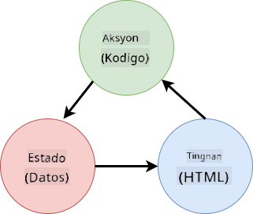

<!--
CO_OP_TRANSLATOR_METADATA:
{
  "original_hash": "923d32d2c405b709ef18e20d096f4200",
  "translation_date": "2025-10-20T21:06:58+00:00",
  "source_file": "7-bank-project/4-state-management/README.md",
  "language_code": "tl"
}
-->
# Gumawa ng Banking App Bahagi 4: Mga Konsepto ng Pamamahala ng Estado

## Pre-Lecture Quiz

[Pre-lecture quiz](https://ff-quizzes.netlify.app/web/quiz/47)

### Panimula

Habang lumalaki ang isang web application, nagiging hamon ang pagsubaybay sa lahat ng daloy ng data. Aling code ang kumukuha ng data, anong pahina ang gumagamit nito, saan at kailan ito kailangang i-update...madaling magresulta sa magulong code na mahirap panatilihin. Lalo na kung kailangan mong magbahagi ng data sa iba't ibang pahina ng iyong app, halimbawa ang data ng user. Ang konsepto ng *pamamahala ng estado* ay palaging umiiral sa lahat ng uri ng programa, ngunit habang patuloy na lumalaki ang mga web app sa pagiging kumplikado, ito ay naging mahalagang punto na dapat isaalang-alang sa panahon ng pag-develop.

Sa huling bahagi na ito, titingnan natin ang app na ginawa natin upang muling pag-isipan kung paano pinamamahalaan ang estado, na nagbibigay-daan sa suporta para sa pag-refresh ng browser sa anumang punto, at pagpapanatili ng data sa iba't ibang sesyon ng user.

### Paunang Kailangan

Kailangan mong tapusin ang bahagi ng [data fetching](../3-data/README.md) ng web app para sa araling ito. Kailangan mo ring i-install ang [Node.js](https://nodejs.org) at [patakbuhin ang server API](../api/README.md) nang lokal upang ma-manage ang data ng account.

Maaari mong subukan kung maayos na tumatakbo ang server sa pamamagitan ng pag-execute ng command na ito sa terminal:

```sh
curl http://localhost:5000/api
# -> should return "Bank API v1.0.0" as a result
```

---

## Muling pag-isipan ang pamamahala ng estado

Sa [nakaraang aralin](../3-data/README.md), ipinakilala namin ang pangunahing konsepto ng estado sa aming app gamit ang global na `account` variable na naglalaman ng bank data para sa kasalukuyang naka-log in na user. Gayunpaman, ang kasalukuyang implementasyon namin ay may ilang mga kakulangan. Subukan ang pag-refresh ng pahina kapag nasa dashboard ka. Ano ang nangyayari?

Mayroong 3 isyu sa kasalukuyang code:

- Ang estado ay hindi napapanatili, dahil ang pag-refresh ng browser ay ibabalik ka sa login page.
- Mayroong maraming mga function na nagbabago sa estado. Habang lumalaki ang app, maaari itong maging mahirap subaybayan ang mga pagbabago at madaling makalimutan ang pag-update ng isa.
- Ang estado ay hindi nalilinis, kaya kapag nag-click ka sa *Logout*, ang data ng account ay nananatili pa rin kahit na nasa login page ka na.

Maaari naming i-update ang aming code upang harapin ang mga isyung ito isa-isa, ngunit lilikha ito ng mas maraming pag-uulit ng code at gagawing mas kumplikado at mahirap panatilihin ang app. O maaari tayong mag-pause ng ilang minuto at muling pag-isipan ang aming estratehiya.

> Anong mga problema ang talagang sinusubukan nating lutasin dito?

Ang [pamamahala ng estado](https://en.wikipedia.org/wiki/State_management) ay tungkol sa paghahanap ng magandang paraan upang malutas ang dalawang partikular na problemang ito:

- Paano mapanatili ang daloy ng data sa isang app na madaling maunawaan?
- Paano mapanatili ang estado ng data na palaging naka-sync sa user interface (at vice versa)?

Kapag naayos mo na ang mga ito, ang anumang iba pang mga isyu na maaaring mayroon ka ay maaaring naayos na o naging mas madali nang ayusin. Maraming posibleng paraan para malutas ang mga problemang ito, ngunit gagamit tayo ng karaniwang solusyon na binubuo ng **pag-centralize ng data at mga paraan para baguhin ito**. Ang daloy ng data ay magiging ganito:



> Hindi natin tatalakayin dito ang bahagi kung saan ang data ay awtomatikong nagti-trigger ng pag-update ng view, dahil ito ay nauugnay sa mas advanced na mga konsepto ng [Reactive Programming](https://en.wikipedia.org/wiki/Reactive_programming). Ito ay isang magandang follow-up na paksa kung handa kang mag-dive ng mas malalim.

✅ Maraming mga library ang may iba't ibang mga approach sa pamamahala ng estado, ang [Redux](https://redux.js.org) ay isang popular na opsyon. Tingnan ang mga konsepto at pattern na ginagamit dahil madalas itong magandang paraan upang matutunan kung anong mga potensyal na isyu ang maaaring harapin sa malalaking web app at kung paano ito malulutas.

### Gawain

Magsisimula tayo sa kaunting refactoring. Palitan ang deklarasyon ng `account`:

```js
let account = null;
```

Gamit:

```js
let state = {
  account: null
};
```

Ang ideya ay *i-centralize* ang lahat ng data ng app sa isang solong state object. Sa ngayon, mayroon lamang tayong `account` sa estado kaya hindi ito masyadong nagbabago, ngunit ito ay lumilikha ng landas para sa mga ebolusyon.

Kailangan din nating i-update ang mga function na gumagamit nito. Sa mga function na `register()` at `login()`, palitan ang `account = ...` ng `state.account = ...`;

Sa itaas ng function na `updateDashboard()`, idagdag ang linyang ito:

```js
const account = state.account;
```

Ang refactoring na ito mismo ay hindi nagdala ng maraming pagpapabuti, ngunit ang ideya ay ilatag ang pundasyon para sa mga susunod na pagbabago.

## Subaybayan ang mga pagbabago sa data

Ngayon na nailagay na natin ang `state` object upang mag-imbak ng ating data, ang susunod na hakbang ay i-centralize ang mga update. Ang layunin ay gawing mas madali ang pagsubaybay sa anumang mga pagbabago at kung kailan ito nangyayari.

Upang maiwasan ang mga pagbabago na ginawa sa `state` object, magandang kasanayan din na isaalang-alang ito bilang [*immutable*](https://en.wikipedia.org/wiki/Immutable_object), ibig sabihin ay hindi ito maaaring baguhin. Nangangahulugan din ito na kailangan mong lumikha ng bagong state object kung gusto mong baguhin ang anumang bagay dito. Sa paggawa nito, bumubuo ka ng proteksyon laban sa mga posibleng hindi gustong [side effects](https://en.wikipedia.org/wiki/Side_effect_(computer_science)), at nagbubukas ng mga posibilidad para sa mga bagong feature sa iyong app tulad ng pag-implement ng undo/redo, habang ginagawang mas madali ang pag-debug. Halimbawa, maaari mong i-log ang bawat pagbabago na ginawa sa estado at panatilihin ang kasaysayan ng mga pagbabago upang maunawaan ang pinagmulan ng isang bug.

Sa JavaScript, maaari mong gamitin ang [`Object.freeze()`](https://developer.mozilla.org/docs/Web/JavaScript/Reference/Global_Objects/Object/freeze) upang lumikha ng isang immutable na bersyon ng isang object. Kung susubukan mong gumawa ng mga pagbabago sa isang immutable na object, isang exception ang itataas.

✅ Alam mo ba ang pagkakaiba sa pagitan ng isang *shallow* at isang *deep* immutable object? Maaari mong basahin ito [dito](https://developer.mozilla.org/docs/Web/JavaScript/Reference/Global_Objects/Object/freeze#What_is_shallow_freeze).

### Gawain

Gumawa tayo ng bagong `updateState()` function:

```js
function updateState(property, newData) {
  state = Object.freeze({
    ...state,
    [property]: newData
  });
}
```

Sa function na ito, gumagawa kami ng bagong state object at kinokopya ang data mula sa nakaraang estado gamit ang [*spread (`...`) operator*](https://developer.mozilla.org/docs/Web/JavaScript/Reference/Operators/Spread_syntax#Spread_in_object_literals). Pagkatapos ay pinapalitan namin ang isang partikular na property ng state object gamit ang [bracket notation](https://developer.mozilla.org/docs/Web/JavaScript/Guide/Working_with_Objects#Objects_and_properties) `[property]` para sa assignment. Sa wakas, nilalock namin ang object upang maiwasan ang mga pagbabago gamit ang `Object.freeze()`. Sa ngayon, mayroon lamang kaming `account` property na naka-imbak sa estado, ngunit sa approach na ito maaari kang magdagdag ng maraming property hangga't kailangan mo sa estado.

I-update din natin ang initialization ng `state` upang matiyak na ang initial state ay frozen din:

```js
let state = Object.freeze({
  account: null
});
```

Pagkatapos nito, i-update ang function na `register` sa pamamagitan ng pagpapalit ng `state.account = result;` assignment sa:

```js
updateState('account', result);
```

Gawin din ito sa function na `login`, palitan ang `state.account = data;` ng:

```js
updateState('account', data);
```

Ngayon ay gagamitin natin ang pagkakataon upang ayusin ang isyu ng data ng account na hindi nalilinis kapag ang user ay nag-click sa *Logout*.

Gumawa ng bagong function na `logout()`:

```js
function logout() {
  updateState('account', null);
  navigate('/login');
}
```

Sa `updateDashboard()`, palitan ang redirection na `return navigate('/login');` ng `return logout()`;

Subukang magrehistro ng bagong account, mag-logout, at mag-login muli upang suriin kung maayos pa rin ang lahat.

> Tip: maaari mong tingnan ang lahat ng mga pagbabago sa estado sa pamamagitan ng pagdaragdag ng `console.log(state)` sa ibaba ng `updateState()` at buksan ang console sa mga tool ng developer ng iyong browser.

## Panatilihin ang estado

Karamihan sa mga web app ay kailangang magpanatili ng data upang gumana nang maayos. Ang lahat ng kritikal na data ay karaniwang naka-imbak sa isang database at ina-access sa pamamagitan ng isang server API, tulad ng data ng user account sa aming kaso. Ngunit minsan, interesante rin na panatilihin ang ilang data sa client app na tumatakbo sa iyong browser, para sa mas magandang karanasan ng user o upang mapabuti ang performance ng pag-load.

Kapag gusto mong magpanatili ng data sa iyong browser, may ilang mahahalagang tanong na dapat mong itanong sa iyong sarili:

- *Sensitive ba ang data?* Dapat mong iwasan ang pag-iimbak ng anumang sensitibong data sa client, tulad ng mga password ng user.
- *Gaano katagal mo kailangang panatilihin ang data na ito?* Plano mo bang i-access ang data na ito para lamang sa kasalukuyang session o gusto mo itong i-store magpakailanman?

Maraming paraan ng pag-iimbak ng impormasyon sa loob ng isang web app, depende sa kung ano ang gusto mong makamit. Halimbawa, maaari mong gamitin ang mga URL upang mag-imbak ng query sa paghahanap, at gawing maibabahagi ito sa pagitan ng mga user. Maaari mo ring gamitin ang [HTTP cookies](https://developer.mozilla.org/docs/Web/HTTP/Cookies) kung ang data ay kailangang ibahagi sa server, tulad ng impormasyon sa [authentication](https://en.wikipedia.org/wiki/Authentication).

Isa pang opsyon ay ang paggamit ng isa sa maraming browser APIs para sa pag-iimbak ng data. Dalawa sa mga ito ang partikular na interesante:

- [`localStorage`](https://developer.mozilla.org/docs/Web/API/Window/localStorage): isang [Key/Value store](https://en.wikipedia.org/wiki/Key%E2%80%93value_database) na nagpapahintulot na magpanatili ng data na partikular sa kasalukuyang website sa iba't ibang session. Ang data na naka-save dito ay hindi kailanman nag-e-expire.
- [`sessionStorage`](https://developer.mozilla.org/docs/Web/API/Window/sessionStorage): ito ay gumagana nang katulad sa `localStorage` maliban na ang data na naka-imbak dito ay nabubura kapag natapos ang session (kapag isinara ang browser).

Tandaan na ang parehong mga API na ito ay nagpapahintulot lamang na mag-imbak ng [strings](https://developer.mozilla.org/docs/Web/JavaScript/Reference/Global_Objects/String). Kung gusto mong mag-imbak ng mga kumplikadong object, kailangan mong i-serialize ito sa [JSON](https://developer.mozilla.org/docs/Web/JavaScript/Reference/Global_Objects/JSON) format gamit ang [`JSON.stringify()`](https://developer.mozilla.org/docs/Web/JavaScript/Reference/Global_Objects/JSON/stringify).

✅ Kung gusto mong gumawa ng web app na hindi gumagana sa isang server, posible rin na gumawa ng database sa client gamit ang [`IndexedDB` API](https://developer.mozilla.org/docs/Web/API/IndexedDB_API). Ang API na ito ay nakalaan para sa mga advanced na use case o kung kailangan mong mag-imbak ng malaking dami ng data, dahil mas kumplikado itong gamitin.

### Gawain

Gusto naming manatiling naka-log in ang aming mga user hanggang sa sila mismo ang mag-click sa *Logout* button, kaya gagamit kami ng `localStorage` upang mag-imbak ng data ng account. Una, mag-define tayo ng key na gagamitin natin upang mag-imbak ng data.

```js
const storageKey = 'savedAccount';
```

Pagkatapos idagdag ang linyang ito sa dulo ng function na `updateState()`:

```js
localStorage.setItem(storageKey, JSON.stringify(state.account));
```

Sa ganito, ang data ng user account ay mapapanatili at palaging up-to-date dahil na-centralize na natin ang lahat ng mga update sa estado. Dito natin sinisimulan ang benepisyo ng lahat ng ating mga naunang refactor 🙂.

Dahil ang data ay na-save, kailangan din nating alagaan ang pag-restore nito kapag na-load ang app. Dahil magsisimula na tayong magkaroon ng mas maraming initialization code, maaaring magandang ideya na gumawa ng bagong `init` function, na kasama rin ang ating dating code sa ibaba ng `app.js`:

```js
function init() {
  const savedAccount = localStorage.getItem(storageKey);
  if (savedAccount) {
    updateState('account', JSON.parse(savedAccount));
  }

  // Our previous initialization code
  window.onpopstate = () => updateRoute();
  updateRoute();
}

init();
```

Dito natin kinukuha ang na-save na data, at kung mayroon, ina-update natin ang estado nang naaayon. Mahalagang gawin ito *bago* i-update ang route, dahil maaaring may code na umaasa sa estado sa panahon ng pag-update ng pahina.

Maaari rin nating gawing default page ng ating application ang *Dashboard* page, dahil ngayon ay pinapanatili na natin ang data ng account. Kung walang data na natagpuan, ang dashboard ang bahala sa pag-redirect sa *Login* page. Sa `updateRoute()`, palitan ang fallback na `return navigate('/login');` ng `return navigate('/dashboard');`.

Ngayon mag-login sa app at subukang i-refresh ang pahina. Dapat kang manatili sa dashboard. Sa update na ito, naayos na natin ang lahat ng ating mga paunang isyu...

## I-refresh ang data

...Ngunit maaaring nakagawa rin tayo ng bago. Oops!

Pumunta sa dashboard gamit ang `test` account, pagkatapos ay patakbuhin ang command na ito sa terminal upang gumawa ng bagong transaction:

```sh
curl --request POST \
     --header "Content-Type: application/json" \
     --data "{ \"date\": \"2020-07-24\", \"object\": \"Bought book\", \"amount\": -20 }" \
     http://localhost:5000/api/accounts/test/transactions
```

Subukang i-refresh ang iyong dashboard page sa browser ngayon. Ano ang nangyayari? Nakikita mo ba ang bagong transaction?

Ang estado ay pinapanatili nang walang hanggan salamat sa `localStorage`, ngunit nangangahulugan din ito na hindi ito kailanman na-update hanggang sa mag-log out ka sa app at mag-log in muli!

Ang isang posibleng estratehiya upang ayusin iyon ay ang i-reload ang data ng account tuwing na-load ang dashboard, upang maiwasan ang stall data.

### Gawain

Gumawa ng bagong function na `updateAccountData`:

```js
async function updateAccountData() {
  const account = state.account;
  if (!account) {
    return logout();
  }

  const data = await getAccount(account.user);
  if (data.error) {
    return logout();
  }

  updateState('account', data);
}
```

Ang method na ito ay nagche-check na kasalukuyan kang naka-log in pagkatapos ay i-reload ang data ng account mula sa server.

Gumawa ng isa pang function na tinatawag na `refresh`:

```js
async function refresh() {
  await updateAccountData();
  updateDashboard();
}
```

Ina-update ng function na ito ang data ng account, pagkatapos ay ina-update ang HTML ng dashboard page. Ito ang kailangan nating tawagin kapag na-load ang dashboard route. I-update ang route definition gamit:

```js
const routes = {
  '/login': { templateId: 'login' },
  '/dashboard': { templateId: 'dashboard', init: refresh }
};
```

Subukang i-reload ang dashboard ngayon, dapat nitong ipakita ang na-update na data ng account.

## Hamon ng GitHub Copilot Agent 🚀

Gamitin ang Agent mode upang makumpleto ang sumusunod na hamon:

**Paglalarawan:** Ipatupad ang isang komprehensibong sistema ng pamamahala ng estado na may undo/redo functionality para sa banking app. Ang hamon na ito ay makakatulong sa iyo na magsanay ng mga advanced na konsepto ng pamamahala ng estado kabilang ang pagsubaybay sa kasaysayan ng estado, immutable updates, at pag-synchronize ng user interface.
**Prompt:** Gumawa ng mas pinahusay na sistema ng pamamahala ng estado na may kasamang: 1) Isang array ng kasaysayan ng estado na nagtatala ng lahat ng nakaraang estado, 2) Mga function ng undo at redo na maaaring bumalik sa mga nakaraang estado, 3) Mga UI button para sa mga operasyon ng undo/redo sa dashboard, 4) Isang maximum na limitasyon ng kasaysayan na 10 estado upang maiwasan ang mga isyu sa memorya, at 5) Wastong paglilinis ng kasaysayan kapag nag-log out ang user. Siguraduhin na gumagana ang undo/redo functionality sa mga pagbabago sa balanse ng account at nananatili kahit na mag-refresh ang browser.

## 🚀 Hamon

Ngayon na nire-reload natin ang data ng account tuwing binubuksan ang dashboard, sa tingin mo ba kailangan pa nating i-save *lahat ng data ng account*?

Subukang magtulungan upang baguhin kung ano ang sine-save at niloload mula sa `localStorage` upang isama lamang ang mga talagang kinakailangan para gumana ang app.

## Quiz Pagkatapos ng Leksyon

[Quiz pagkatapos ng leksyon](https://ff-quizzes.netlify.app/web/quiz/48)

## Takdang-Aralin

[Ipapatupad ang "Add transaction" dialog](assignment.md)

Narito ang isang halimbawa ng resulta pagkatapos makumpleto ang takdang-aralin:


---

**Paunawa**:  
Ang dokumentong ito ay isinalin gamit ang AI translation service [Co-op Translator](https://github.com/Azure/co-op-translator). Bagamat sinisikap naming maging tumpak, mangyaring tandaan na ang mga awtomatikong pagsasalin ay maaaring maglaman ng mga pagkakamali o hindi eksaktong pagsasalin. Ang orihinal na dokumento sa kanyang katutubong wika ang dapat ituring na opisyal na pinagmulan. Para sa mahalagang impormasyon, inirerekomenda ang propesyonal na pagsasalin ng tao. Hindi kami mananagot sa anumang hindi pagkakaunawaan o maling interpretasyon na dulot ng paggamit ng pagsasaling ito.