<!--
CO_OP_TRANSLATOR_METADATA:
{
  "original_hash": "b807b09df716dc48a2b750835bf8e933",
  "translation_date": "2025-11-03T13:58:02+00:00",
  "source_file": "7-bank-project/4-state-management/README.md",
  "language_code": "tl"
}
-->
# Gumawa ng Banking App Bahagi 4: Mga Konsepto ng State Management

## ⚡ Ano ang Magagawa Mo sa Loob ng 5 Minuto

**Mabilisang Landas para sa Abalang Developer**

```mermaid
flowchart LR
    A[⚡ 5 minutes] --> B[Diagnose state issues]
    B --> C[Create central state object]
    C --> D[Add updateState function]
    D --> E[See immediate improvements]
```



- **Minuto 1**: Subukan ang kasalukuyang isyu sa estado - mag-login, i-refresh ang pahina, obserbahan ang pag-logout
- **Minuto 2**: Palitan ang `let account = null` ng `let state = { account: null }`
- **Minuto 3**: Gumawa ng simpleng `updateState()` na function para sa kontroladong pag-update
- **Minuto 4**: I-update ang isang function upang gamitin ang bagong pattern
- **Minuto 5**: Subukan ang mas pinahusay na predictability at kakayahan sa pag-debug

**Mabilisang Diagnostic Test**:
```javascript
// Before: Scattered state
let account = null; // Lost on refresh!

// After: Centralized state
let state = Object.freeze({ account: null }); // Controlled and trackable!
```

**Bakit Mahalaga Ito**: Sa loob ng 5 minuto, mararanasan mo ang pagbabago mula sa magulong state management patungo sa predictable at madaling i-debug na mga pattern. Ito ang pundasyon na nagpapadali sa pag-maintain ng mga kumplikadong aplikasyon.

## 🗺️ Ang Iyong Paglalakbay sa Pag-master ng State Management


**Destinasyon ng Iyong Paglalakbay**: Sa pagtatapos ng araling ito, makakabuo ka ng isang propesyonal na state management system na may kakayahang mag-handle ng persistence, pagiging sariwa ng data, at predictable na pag-update - mga parehong pattern na ginagamit sa mga production application.

## Pre-Lecture Quiz

[Pre-lecture quiz](https://ff-quizzes.netlify.app/web/quiz/47)

## Panimula

Ang state management ay parang navigation system sa Voyager spacecraft – kapag maayos ang lahat, halos hindi mo mapapansin na naroroon ito. Ngunit kapag nagkaproblema, ito ang nagiging pagkakaiba sa pagitan ng pag-abot sa interstellar space at pagkaligaw sa cosmic void. Sa web development, ang state ay kumakatawan sa lahat ng kailangang tandaan ng iyong aplikasyon: status ng user login, form data, history ng navigation, at mga pansamantalang estado ng interface.

Habang ang iyong banking app ay umunlad mula sa simpleng login form patungo sa mas sopistikadong aplikasyon, malamang na nakaranas ka ng ilang karaniwang hamon. I-refresh ang pahina at ang mga user ay biglang nalog-out. Isara ang browser at mawawala ang lahat ng progreso. Mag-debug ng problema at maghahanap ka sa maraming function na lahat ay nagmo-modify ng parehong data sa iba't ibang paraan.

Hindi ito palatandaan ng masamang pag-code – ito ay natural na growing pains na nangyayari kapag ang mga aplikasyon ay umabot sa isang tiyak na antas ng pagiging kumplikado. Ang bawat developer ay nakakaranas ng mga hamon na ito habang ang kanilang mga app ay nagta-transition mula sa "proof of concept" patungo sa "production ready."

Sa araling ito, magpapatupad tayo ng centralized state management system na magbabago sa iyong banking app upang maging maaasahan at propesyonal na aplikasyon. Matututo kang pamahalaan ang daloy ng data nang predictable, panatilihin ang mga session ng user nang naaangkop, at lumikha ng maayos na karanasan para sa user na kinakailangan ng mga modernong web application.

## Mga Kinakailangan

Bago sumabak sa mga konsepto ng state management, kailangang maayos ang iyong development environment at ang pundasyon ng iyong banking app. Ang araling ito ay direktang nakabatay sa mga konsepto at code mula sa mga nakaraang bahagi ng seryeng ito.

Siguraduhing handa ang mga sumusunod na bahagi bago magpatuloy:

**Kinakailangang Setup:**
- Kumpletuhin ang [aralin sa pagkuha ng data](../3-data/README.md) - dapat matagumpay na ma-load at maipakita ng iyong app ang data ng account
- I-install ang [Node.js](https://nodejs.org) sa iyong sistema para sa pagpapatakbo ng backend API
- I-start ang [server API](../api/README.md) nang lokal upang mag-handle ng mga operasyon sa data ng account

**Pag-test ng Iyong Environment:**

Siguraduhing gumagana nang maayos ang iyong API server sa pamamagitan ng pag-execute ng command na ito sa terminal:

```sh
curl http://localhost:5000/api
# -> should return "Bank API v1.0.0" as a result
```

**Ano ang ginagawa ng command na ito:**
- **Nagpapadala** ng GET request sa iyong lokal na API server
- **Sinusubukan** ang koneksyon at tinitiyak na tumutugon ang server
- **Nagbabalik** ng impormasyon ng bersyon ng API kung maayos ang lahat

## 🧠 Pangkalahatang-ideya ng State Management Architecture


**Pangunahing Prinsipyo**: Ang propesyonal na state management ay nagbabalanse ng predictability, persistence, at performance upang makalikha ng maaasahang karanasan para sa user na maaaring mag-scale mula sa simpleng interaksyon hanggang sa kumplikadong workflows ng aplikasyon.

---

## Pagsusuri sa Kasalukuyang Isyu sa Estado

Tulad ng isang Sherlock Holmes na nag-eeksamin ng crime scene, kailangan nating maunawaan kung ano ang nangyayari sa kasalukuyang implementasyon bago natin malutas ang misteryo ng nawawalang mga session ng user.

Magsagawa tayo ng simpleng eksperimento na magpapakita ng mga hamon sa state management:

**🧪 Subukan ang Diagnostic Test na Ito:**
1. Mag-login sa iyong banking app at mag-navigate sa dashboard
2. I-refresh ang browser page
3. Obserbahan kung ano ang nangyayari sa iyong login status

Kung ikaw ay na-redirect pabalik sa login screen, natuklasan mo ang klasikong problema sa state persistence. Ang ganitong behavior ay nangyayari dahil ang kasalukuyang implementasyon ay nag-i-store ng user data sa JavaScript variables na nare-reset sa bawat pag-load ng pahina.

**Mga Problema sa Kasalukuyang Implementasyon:**

Ang simpleng `account` variable mula sa ating [nakaraang aralin](../3-data/README.md) ay nagdudulot ng tatlong mahalagang isyu na nakakaapekto sa karanasan ng user at sa kakayahan ng code na ma-maintain:

| Problema | Teknikal na Dahilan | Epekto sa User |
|---------|--------|----------------|
| **Pagkawala ng Session** | Ang pag-refresh ng pahina ay naglilinis ng JavaScript variables | Kailangang mag-reauthenticate ng madalas ang mga user |
| **Kalat na Updates** | Maraming function ang direktang nagmo-modify ng estado | Nagiging mas mahirap ang pag-debug |
| **Hindi Kumpletong Cleanup** | Ang pag-logout ay hindi naglilinis ng lahat ng state references | Posibleng isyu sa seguridad at privacy |

**Ang Hamon sa Arkitektura:**

Tulad ng compartmentalized na disenyo ng Titanic na tila matibay hanggang sa sabay-sabay na pagbaha ng maraming compartments, ang pag-aayos ng mga isyung ito nang paisa-isa ay hindi sasapat upang matugunan ang pangunahing problema sa arkitektura. Kailangan natin ng komprehensibong solusyon sa state management.

> 💡 **Ano ang talagang sinusubukan nating makamit dito?**

Ang [state management](https://en.wikipedia.org/wiki/State_management) ay tungkol sa paglutas ng dalawang pangunahing palaisipan:

1. **Nasaan ang Aking Data?**: Paano matutukoy kung anong impormasyon ang mayroon tayo at saan ito nagmumula
2. **Pareho ba ang Nakikita ng Lahat?**: Paano masisigurado na ang nakikita ng mga user ay tumutugma sa aktwal na nangyayari

**Ang Ating Plano:**

Sa halip na maguluhan, gagawa tayo ng **centralized state management** system. Isipin ito na parang may isang organisadong tao na namamahala sa lahat ng mahahalagang bagay:


**Pag-unawa sa daloy ng data na ito:**
- **Pinagsasama-sama** ang lahat ng estado ng aplikasyon sa isang lokasyon
- **Inaayos** ang lahat ng pagbabago sa estado sa pamamagitan ng kontroladong mga function
- **Tinitiyak** na ang UI ay nananatiling naka-synchronize sa kasalukuyang estado
- **Nagbibigay** ng malinaw at predictable na pattern para sa pamamahala ng data

> 💡 **Insight ng Propesyonal**: Ang araling ito ay nakatuon sa mga pangunahing konsepto. Para sa mas kumplikadong aplikasyon, ang mga library tulad ng [Redux](https://redux.js.org) ay nagbibigay ng mas advanced na mga tampok sa state management. Ang pag-unawa sa mga pangunahing prinsipyong ito ay makakatulong sa iyo na ma-master ang anumang state management library.

> ⚠️ **Advanced na Paksa**: Hindi natin tatalakayin ang awtomatikong pag-update ng UI na na-trigger ng mga pagbabago sa estado, dahil ito ay may kinalaman sa mga konsepto ng [Reactive Programming](https://en.wikipedia.org/wiki/Reactive_programming). Isaalang-alang ito bilang isang mahusay na susunod na hakbang sa iyong pag-aaral!

### Gawain: I-centralize ang State Structure

Simulan natin ang pag-transform ng ating kalat na state management patungo sa centralized system. Ang unang hakbang na ito ay nagtatatag ng pundasyon para sa lahat ng mga pagpapabuti na susunod.

**Hakbang 1: Gumawa ng Central State Object**

Palitan ang simpleng deklarasyon ng `account`:

```js
let account = null;
```

Gamit ang structured state object:

```js
let state = {
  account: null
};
```

**Bakit mahalaga ang pagbabagong ito:**
- **Pinagsasama-sama** ang lahat ng data ng aplikasyon sa isang lokasyon
- **Inihahanda** ang istruktura para sa pagdaragdag ng higit pang mga property ng estado sa hinaharap
- **Lumilikha** ng malinaw na hangganan sa pagitan ng estado at iba pang mga variable
- **Nagtatatag** ng pattern na maaaring mag-scale habang lumalaki ang iyong app

**Hakbang 2: I-update ang Mga Pattern ng Access sa Estado**

I-update ang iyong mga function upang gamitin ang bagong istruktura ng estado:

**Sa mga function na `register()` at `login()`, palitan:**
```js
account = ...
```

Gamit:
```js
state.account = ...
```

**Sa function na `updateDashboard()`, idagdag ang linyang ito sa itaas:**
```js
const account = state.account;
```

**Ano ang nagagawa ng mga update na ito:**
- **Pinapanatili** ang kasalukuyang functionality habang pinapabuti ang istruktura
- **Inihahanda** ang iyong code para sa mas sopistikadong state management
- **Lumilikha** ng consistent na pattern para sa pag-access ng data ng estado
- **Nagtatatag** ng pundasyon para sa centralized state updates

> 💡 **Tandaan**: Ang refactoring na ito ay hindi agad na nag-aayos ng ating mga problema, ngunit ito ang lumilikha ng mahalagang pundasyon para sa mga makapangyarihang pagpapabuti na darating!

### 🎯 Pedagogical Check-in: Mga Prinsipyo ng Centralization

**Huminto at Magnilay**: Kakagawa mo lang ng pundasyon ng centralized state management. Ito ay isang mahalagang desisyon sa arkitektura.

**Mabilisang Pagsusuri sa Sarili**:
- Kaya mo bang ipaliwanag kung bakit mas maganda ang pag-centralize ng estado sa isang object kaysa sa kalat na mga variable?
- Ano ang mangyayari kung nakalimutan mong i-update ang isang function upang gamitin ang `state.account`?
- Paano naghahanda ang pattern na ito ng iyong code para sa mas advanced na mga tampok?

**Koneksyon sa Tunay na Mundo**: Ang pattern ng centralization na natutunan mo ay ang pundasyon ng mga modernong framework tulad ng Redux, Vuex, at React Context. Binubuo mo ang parehong arkitektural na pag-iisip na ginagamit sa mga pangunahing aplikasyon.

**Tanong ng Hamon**: Kung kailangan mong magdagdag ng user preferences (tema, wika) sa iyong app, saan mo ito idadagdag sa istruktura ng estado? Paano ito mag-scale?

## Pagpapatupad ng Kontroladong Pag-update ng Estado

Sa ating estado na naka-centralize, ang susunod na hakbang ay ang pagtatatag ng kontroladong mekanismo para sa mga pagbabago sa data. Ang approach na ito ay tinitiyak ang predictable na mga pagbabago sa estado at mas madaling pag-debug.

Ang pangunahing prinsipyo ay kahalintulad ng air traffic control: sa halip na payagan ang maraming function na mag-modify ng estado nang independyente, idadaan natin ang lahat ng pagbabago sa isang solong, kontroladong function. Ang pattern na ito ay nagbibigay ng malinaw na oversight kung kailan at paano nagaganap ang mga pagbabago sa data.

**Immutable State Management:**

Ituturing natin ang ating `state` object bilang [*immutable*](https://en.wikipedia.org/wiki/Immutable_object), ibig sabihin, hindi natin ito direktang imo-modify. Sa halip, ang bawat pagbabago ay lilikha ng bagong state object na may updated na data.

Bagama't maaaring mukhang hindi epektibo ang approach na ito kumpara sa direktang pag-modify, nagbibigay ito ng malaking benepisyo para sa debugging, testing, at pagpapanatili ng predictability ng aplikasyon.

**Mga Benepisyo ng Immutable State Management:**

| Benepisyo | Deskripsyon | Epekto |
|---------|-------------|--------|
| **Predictability** | Ang mga pagbabago ay nangyayari lamang sa pamamagitan ng kontroladong mga function | Mas madaling i-debug at i-test |
| **History Tracking** | Ang bawat pagbabago sa estado ay lumilikha ng bagong object | Nagbibigay-daan sa undo/redo functionality |
| **Side Effect Prevention** | Walang aksidenteng mga pagbabago | Pinipigilan ang mga misteryosong bug |
| **Performance Optimization** | Madaling matukoy kung kailan talagang nagbago ang estado | Nagbibigay-daan sa efficient na pag-update ng UI |

**JavaScript Immutability gamit ang `Object.freeze()`:**

Nagbibigay ang JavaScript ng [`Object.freeze()`](https://developer.mozilla.org/docs/Web/JavaScript/Reference/Global_Objects/Object/freeze) upang pigilan ang mga pagbabago sa object:

```js
const immutableState = Object.freeze({ account: userData });
// Any attempt to modify immutableState will throw an error
```

**Pag-unawa sa nangyayari dito:**
- **Pinipigilan** ang direktang property assignments o deletions
- **Nagba-throw** ng exceptions kung may pagtatangkang mag-modify
- **Tinitiyak** na ang mga pagbabago sa estado ay dapat dumaan sa kontroladong mga function
- **Lumilikha** ng malinaw na kontrata para sa kung paano maaaring ma-update ang estado

> 💡 **Malalim na Pagsisid**: Alamin ang pagkakaiba sa pagitan ng *shallow* at *deep* immutable objects sa [MDN documentation](https://developer.mozilla.org/docs/Web/JavaScript/Reference/Global_Objects/Object/freeze#What_is_shallow_freeze). Ang pag-unawa sa pagkakaibang ito ay mahalaga para sa mga kumplikadong istruktura ng estado.


### Gawain

Gumawa tayo ng bagong `updateState()` function:

```js
function updateState(property, newData) {
  state = Object.freeze({
    ...state,
    [property]: newData
  });
}
```

Sa function na ito, gumagawa tayo ng bagong state object at kinokopya ang data mula sa nakaraang estado gamit ang [*spread (`...`) operator*](https://developer.mozilla.org/docs/Web/JavaScript/Reference/Operators/Spread_syntax#Spread_in_object_literals). Pagkatapos, ina-override natin ang partikular na property ng state object gamit ang bagong data gamit ang [bracket notation](https://developer.mozilla.org/docs/Web/JavaScript/Guide/Working_with_Objects#Objects_and_properties) `[property]` para sa assignment. Sa huli, nilalock natin ang object upang pigilan ang mga pagbabago gamit ang `Object.freeze()`. Sa ngayon, mayroon lamang tayong `account` property na naka-store sa estado, ngunit sa approach na ito maaari kang magdagdag ng maraming properties sa estado kung kinakailangan.

I-update din natin ang `state` initialization upang matiyak na ang initial state ay frozen din:

```js
let state = Object.freeze({
  account: null
});
```

Pagkatapos nito, i-update ang `register` function sa pamamagitan ng pagpapalit ng `state.account = result;` assignment ng:

```js
updateState('account', result);
```

Gawin din ito sa `login` function, palitan ang `state.account = data;` ng:

```js
updateState('account', data);
```

Ngayon, samantalahin natin ang pagkakataon upang ayusin ang isyu ng hindi pag-clear ng account data kapag nag-click ang user sa *Logout*.

Gumawa ng bagong function na `logout()`:

```js
function logout() {
  updateState('account', null);
  navigate('/login');
}
```

Sa `updateDashboard()`, palitan ang redirection na `return navigate('/login');` ng `return logout();`;

Subukang magrehistro ng bagong account, mag-logout, at mag-login muli upang suriin kung gumagana pa rin nang maayos ang lahat.

> Tip: Maaari mong tingnan ang lahat ng pagbabago sa estado sa pamamagitan ng pagdaragdag ng `console.log(state)` sa ibaba ng `updateState()` at pagbukas ng console sa development tools ng iyong browser.

## Pagpapatupad ng Data Persistence

Ang isyu sa pagkawala ng session na natukoy natin kanina ay nangangailangan ng solusyon sa persistence na nagpapanatili ng estado ng user sa kabila ng mga session ng browser. Binabago nito ang ating aplikasyon mula sa pansamantalang karanasan patungo sa maaasahan at propesyonal na tool.

Isipin kung paano pinapanatili ng atomic clocks ang eksaktong oras kahit na may power outages sa pamamagitan ng pag-store ng critical state sa non-volatile memory. Sa parehong paraan, ang mga web application ay nangangailangan ng mga mekanismo ng persistent storage upang mapanatili ang mahalagang data ng user sa kabila ng mga session ng browser at pag-refresh ng pahina.

**Mga Strategic na Tanong para sa Data Persistence:**

Bago ipatupad ang persistence, isaalang-alang ang mga mahahalagang salik na ito:

| Tanong | Konteksto ng Banking App | Epekto ng Desisyon |
|----------|-------------------|----------------|
| **Gaano katagal dapat ito magtagal?** | Estado ng pag-login vs. pansamantalang UI preferences | Piliin ang tamang tagal ng imbakan |
| **Kailangan ba ito ng server?** | Authentication tokens vs. UI settings | Tukuyin ang mga pangangailangan sa pagbabahagi |

**Mga Opsyon sa Imbakan ng Browser:**

Nagbibigay ang mga modernong browser ng iba't ibang mekanismo ng imbakan, bawat isa ay idinisenyo para sa iba't ibang gamit:

**Pangunahing Storage APIs:**

1. **[`localStorage`](https://developer.mozilla.org/docs/Web/API/Window/localStorage)**: Permanenteng [Key/Value storage](https://en.wikipedia.org/wiki/Key%E2%80%93value_database)
   - **Nagpapanatili** ng data sa mga session ng browser nang walang hanggan  
   - **Nananatili** kahit i-restart ang browser o computer
   - **Nakatuon** sa partikular na domain ng website
   - **Perpekto** para sa mga preference ng user at estado ng pag-login

2. **[`sessionStorage`](https://developer.mozilla.org/docs/Web/API/Window/sessionStorage)**: Pansamantalang imbakan ng session
   - **Gumagana** nang katulad sa localStorage habang aktibo ang session
   - **Awtomatikong nabubura** kapag isinara ang tab ng browser
   - **Ideal** para sa pansamantalang data na hindi kailangang magtagal

3. **[HTTP Cookies](https://developer.mozilla.org/docs/Web/HTTP/Cookies)**: Imbakan na ibinabahagi sa server
   - **Awtomatikong** ipinapadala sa bawat kahilingan sa server
   - **Perpekto** para sa [authentication](https://en.wikipedia.org/wiki/Authentication) tokens
   - **May limitasyon** sa laki at maaaring makaapekto sa performance

**Pangangailangan sa Data Serialization:**

Ang `localStorage` at `sessionStorage` ay nag-iimbak lamang ng [strings](https://developer.mozilla.org/docs/Web/JavaScript/Reference/Global_Objects/String):

```js
// Convert objects to JSON strings for storage
const accountData = { user: 'john', balance: 150 };
localStorage.setItem('account', JSON.stringify(accountData));

// Parse JSON strings back to objects when retrieving
const savedAccount = JSON.parse(localStorage.getItem('account'));
```

**Pag-unawa sa serialization:**
- **Nagko-convert** ng mga JavaScript object sa JSON strings gamit ang [`JSON.stringify()`](https://developer.mozilla.org/docs/Web/JavaScript/Reference/Global_Objects/JSON/stringify)
- **Binubuo muli** ang mga object mula sa JSON gamit ang [`JSON.parse()`](https://developer.mozilla.org/docs/Web/JavaScript/Reference/Global_Objects/JSON/parse)
- **Awtomatikong humahawak** ng mga kumplikadong nested object at arrays
- **Hindi gumagana** sa mga function, undefined values, at circular references

> 💡 **Advanced Option**: Para sa mga kumplikadong offline na aplikasyon na may malalaking dataset, isaalang-alang ang [`IndexedDB` API](https://developer.mozilla.org/docs/Web/API/IndexedDB_API). Nagbibigay ito ng buong client-side database ngunit nangangailangan ng mas kumplikadong implementasyon.


### Gawain: Ipatupad ang localStorage Persistence

Ipatupad natin ang permanenteng imbakan upang manatiling naka-login ang mga user hanggang sa sila mismo ang mag-log out. Gagamitin natin ang `localStorage` upang mag-imbak ng data ng account sa mga session ng browser.

**Hakbang 1: Tukuyin ang Configuration ng Imbakan**

```js
const storageKey = 'savedAccount';
```

**Ano ang ibinibigay ng constant na ito:**
- **Lumilikha** ng pare-parehong identifier para sa ating nakaimbak na data
- **Pinipigilan** ang mga typo sa mga reference ng storage key
- **Ginagawang madali** ang pagbabago ng storage key kung kinakailangan
- **Sumusunod** sa pinakamahusay na kasanayan para sa maintainable code

**Hakbang 2: Magdagdag ng Awtomatikong Persistence**

Idagdag ang linyang ito sa dulo ng `updateState()` function:

```js
localStorage.setItem(storageKey, JSON.stringify(state.account));
```

**Pag-unawa sa nangyayari dito:**
- **Nagko-convert** ng account object sa JSON string para sa imbakan
- **Nag-iimbak** ng data gamit ang ating pare-parehong storage key
- **Awtomatikong isinasagawa** tuwing may pagbabago sa estado
- **Tinitiyak** na ang nakaimbak na data ay palaging naka-synchronize sa kasalukuyang estado

> 💡 **Benepisyo ng Arkitektura**: Dahil na-centralize natin ang lahat ng update ng estado sa `updateState()`, ang pagdaragdag ng persistence ay nangangailangan lamang ng isang linya ng code. Ipinapakita nito ang kapangyarihan ng magagandang desisyon sa arkitektura!

**Hakbang 3: Ibalik ang Estado sa Pag-load ng App**

Gumawa ng initialization function upang ibalik ang nakaimbak na data:

```js
function init() {
  const savedAccount = localStorage.getItem(storageKey);
  if (savedAccount) {
    updateState('account', JSON.parse(savedAccount));
  }

  // Our previous initialization code
  window.onpopstate = () => updateRoute();
  updateRoute();
}

init();
```

**Pag-unawa sa proseso ng initialization:**
- **Kinukuha** ang anumang dating nakaimbak na data ng account mula sa localStorage
- **Pinoproseso** ang JSON string pabalik sa JavaScript object
- **Ina-update** ang estado gamit ang ating kontroladong update function
- **Awtomatikong ibinabalik** ang session ng user sa pag-load ng pahina
- **Isinasagawa** bago ang mga update sa ruta upang matiyak na available ang estado

**Hakbang 4: I-optimize ang Default Route**

I-update ang default route upang samantalahin ang persistence:

Sa `updateRoute()`, palitan:
```js
// Replace: return navigate('/login');
return navigate('/dashboard');
```

**Bakit makatuwiran ang pagbabagong ito:**
- **Ginagamit** ang ating bagong persistence system nang epektibo
- **Pinapayagan** ang dashboard na humawak ng mga authentication check
- **Awtomatikong nagre-redirect** sa pag-login kung walang naka-save na session
- **Lumilikha** ng mas seamless na karanasan para sa user

**Pagsubok sa Iyong Implementasyon:**

1. Mag-login sa iyong banking app
2. I-refresh ang pahina ng browser
3. Tiyaking nananatili kang naka-login at nasa dashboard
4. Isara at muling buksan ang iyong browser
5. Bumalik sa iyong app at kumpirmahin na naka-login ka pa rin

🎉 **Achievement Unlocked**: Matagumpay mong naipatupad ang pamamahala ng permanenteng estado! Ang iyong app ay ngayon kumikilos tulad ng isang propesyonal na web application.

### 🎯 Pedagogical Check-in: Persistence Architecture

**Pag-unawa sa Arkitektura**: Naipatupad mo ang isang sopistikadong persistence layer na nagbabalanse ng karanasan ng user sa pagiging kumplikado ng pamamahala ng data.

**Mga Pangunahing Konsepto na Na-master**:
- **JSON Serialization**: Pagko-convert ng mga kumplikadong object sa mga string na maaaring iimbak
- **Awtomatikong Synchronization**: Ang mga pagbabago sa estado ay nagti-trigger ng permanenteng imbakan
- **Pagbawi ng Session**: Ang mga app ay maaaring ibalik ang konteksto ng user pagkatapos ng mga pagkaantala
- **Centralized Persistence**: Isang update function ang humahawak sa lahat ng imbakan

**Koneksyon sa Industriya**: Ang pattern ng persistence na ito ay mahalaga sa Progressive Web Apps (PWAs), offline-first applications, at modernong mobile web experiences. Nagtatayo ka ng mga kakayahan sa antas ng produksyon.

**Tanong para sa Pagmumuni-muni**: Paano mo babaguhin ang sistemang ito upang hawakan ang maraming account ng user sa parehong device? Isaalang-alang ang mga implikasyon sa privacy at seguridad.

## Pagbabalanse ng Persistence sa Kasariwaan ng Data

Ang ating persistence system ay matagumpay na nagpapanatili ng mga session ng user, ngunit nagdadala ng bagong hamon: ang pagiging luma ng data. Kapag maraming user o application ang nagbabago sa parehong data ng server, ang lokal na naka-cache na impormasyon ay nagiging lipas na.

Ang sitwasyong ito ay kahalintulad ng mga navigator ng Viking na umaasa sa parehong nakaimbak na mga chart ng bituin at kasalukuyang obserbasyon ng kalangitan. Ang mga chart ay nagbibigay ng konsistensya, ngunit kailangan ng mga navigator ang sariwang obserbasyon upang isaalang-alang ang mga nagbabagong kondisyon. Katulad nito, kailangan ng ating aplikasyon ang parehong permanenteng estado ng user at kasalukuyang data ng server.

**🧪 Pagtuklas sa Problema ng Kasariwaan ng Data:**

1. Mag-login sa dashboard gamit ang `test` account
2. Patakbuhin ang command na ito sa terminal upang gayahin ang isang transaksyon mula sa ibang pinagmulan:

```sh
curl --request POST \
     --header "Content-Type: application/json" \
     --data "{ \"date\": \"2020-07-24\", \"object\": \"Bought book\", \"amount\": -20 }" \
     http://localhost:5000/api/accounts/test/transactions
```

3. I-refresh ang iyong dashboard page sa browser
4. Obserbahan kung makikita mo ang bagong transaksyon

**Ano ang ipinapakita ng test na ito:**
- **Ipinapakita** kung paano maaaring maging "stale" (lipas) ang local storage
- **Ginagaya** ang mga totoong sitwasyon kung saan nagbabago ang data sa labas ng iyong app
- **Ibinubunyag** ang tensyon sa pagitan ng persistence at kasariwaan ng data

**Ang Hamon ng Kasariwaan ng Data:**

| Problema | Sanhi | Epekto sa User |
|----------|-------|----------------|
| **Lipas na Data** | Ang localStorage ay hindi awtomatikong nag-e-expire | Nakikita ng mga user ang lipas na impormasyon |
| **Pagbabago sa Server** | Binabago ng ibang apps/users ang parehong data | Hindi pare-parehong view sa iba't ibang platform |
| **Cache vs. Reality** | Ang lokal na cache ay hindi tumutugma sa estado ng server | Mahinang karanasan ng user at kalituhan |

**Estratehiya ng Solusyon:**

Magpapatupad tayo ng "refresh on load" pattern na nagbabalanse ng mga benepisyo ng persistence sa pangangailangan ng sariwang data. Ang approach na ito ay nagpapanatili ng maayos na karanasan ng user habang tinitiyak ang katumpakan ng data.


### Gawain: Ipatupad ang Sistema ng Pag-refresh ng Data

Gagawa tayo ng sistema na awtomatikong kumukuha ng sariwang data mula sa server habang pinapanatili ang mga benepisyo ng ating pamamahala ng permanenteng estado.

**Hakbang 1: Gumawa ng Account Data Updater**

```js
async function updateAccountData() {
  const account = state.account;
  if (!account) {
    return logout();
  }

  const data = await getAccount(account.user);
  if (data.error) {
    return logout();
  }

  updateState('account', data);
}
```

**Pag-unawa sa lohika ng function na ito:**
- **Sinusuri** kung may naka-login na user (may state.account)
- **Nagre-redirect** sa logout kung walang valid na session
- **Kumukuha** ng sariwang data ng account mula sa server gamit ang umiiral na `getAccount()` function
- **Maayos na humahawak** ng mga error sa server sa pamamagitan ng pag-log out ng mga invalid na session
- **Ina-update** ang estado gamit ang sariwang data sa pamamagitan ng ating kontroladong update system
- **Nagti-trigger** ng awtomatikong localStorage persistence sa pamamagitan ng `updateState()` function

**Hakbang 2: Gumawa ng Dashboard Refresh Handler**

```js
async function refresh() {
  await updateAccountData();
  updateDashboard();
}
```

**Ano ang nagagawa ng refresh function na ito:**
- **Inaayos** ang proseso ng pag-refresh ng data at pag-update ng UI
- **Naghihintay** na ma-load ang sariwang data bago i-update ang display
- **Tinitiyak** na ang dashboard ay nagpapakita ng pinakabagong impormasyon
- **Pinapanatili** ang malinis na paghihiwalay sa pagitan ng pamamahala ng data at pag-update ng UI

**Hakbang 3: Isama sa Route System**

I-update ang iyong route configuration upang awtomatikong mag-trigger ng refresh:

```js
const routes = {
  '/login': { templateId: 'login' },
  '/dashboard': { templateId: 'dashboard', init: refresh }
};
```

**Paano gumagana ang integration na ito:**
- **Isinasagawa** ang refresh function tuwing naglo-load ang dashboard route
- **Tinitiyak** na ang sariwang data ay palaging ipinapakita kapag nag-navigate ang mga user sa dashboard
- **Pinapanatili** ang umiiral na istruktura ng ruta habang idinaragdag ang kasariwaan ng data
- **Nagbibigay** ng pare-parehong pattern para sa route-specific initialization

**Pagsubok sa Iyong Sistema ng Pag-refresh ng Data:**

1. Mag-login sa iyong banking app
2. Patakbuhin ang curl command mula kanina upang lumikha ng bagong transaksyon
3. I-refresh ang iyong dashboard page o mag-navigate palayo at bumalik
4. Tiyaking lumilitaw agad ang bagong transaksyon

🎉 **Naabot ang Perpektong Balanse**: Ang iyong app ngayon ay pinagsasama ang maayos na karanasan ng permanenteng estado sa katumpakan ng sariwang data ng server!

## 📈 Timeline ng Iyong Mastery sa Pamamahala ng Estado


**🎓 Milestone ng Graduation**: Matagumpay mong naitayo ang isang kumpletong sistema ng pamamahala ng estado gamit ang parehong mga prinsipyo na nagpapatakbo sa Redux, Vuex, at iba pang mga propesyonal na library ng estado. Ang mga pattern na ito ay umaabot mula sa simpleng apps hanggang sa mga enterprise application.

**🔄 Mga Kakayahang Pang-next Level**:
- Handa nang ma-master ang mga framework ng pamamahala ng estado (Redux, Zustand, Pinia)
- Handa nang magpatupad ng mga real-time na feature gamit ang WebSockets
- May kakayahang bumuo ng offline-first Progressive Web Apps
- Naka-set na ang pundasyon para sa mga advanced na pattern tulad ng state machines at observers

## Hamon ng GitHub Copilot Agent 🚀

Gamitin ang Agent mode upang kumpletuhin ang sumusunod na hamon:

**Deskripsyon:** Ipatupad ang isang komprehensibong sistema ng pamamahala ng estado na may undo/redo functionality para sa banking app. Ang hamon na ito ay makakatulong sa iyo na magsanay ng mga advanced na konsepto ng pamamahala ng estado kabilang ang pagsubaybay sa kasaysayan ng estado, mga immutable na update, at synchronization ng user interface.

**Prompt:** Gumawa ng pinahusay na sistema ng pamamahala ng estado na kinabibilangan ng: 1) Isang array ng kasaysayan ng estado na sumusubaybay sa lahat ng nakaraang estado, 2) Mga undo at redo function na maaaring bumalik sa mga nakaraang estado, 3) Mga UI button para sa mga operasyon ng undo/redo sa dashboard, 4) Isang maximum na limitasyon ng kasaysayan na 10 estado upang maiwasan ang mga isyu sa memorya, at 5) Wastong paglilinis ng kasaysayan kapag nag-log out ang user. Tiyakin na gumagana ang undo/redo functionality sa mga pagbabago sa balanse ng account at nananatili sa mga pag-refresh ng browser.

Alamin ang higit pa tungkol sa [agent mode](https://code.visualstudio.com/blogs/2025/02/24/introducing-copilot-agent-mode) dito.

## 🚀 Hamon: Pag-optimize ng Imbakan

Ang iyong implementasyon ngayon ay humahawak sa mga session ng user, pag-refresh ng data, at pamamahala ng estado nang epektibo. Gayunpaman, isaalang-alang kung ang ating kasalukuyang approach ay optimal na nagbabalanse ng kahusayan sa imbakan at functionality.

Tulad ng mga chess masters na nagtatangi sa pagitan ng mahahalagang piraso at expendable pawns, ang epektibong pamamahala ng estado ay nangangailangan ng pagtukoy kung aling data ang kailangang magtagal kumpara sa kung alin ang dapat palaging sariwa mula sa server.

**Pagsusuri sa Pag-optimize:**

Suriin ang iyong kasalukuyang implementasyon ng localStorage at isaalang-alang ang mga estratehikong tanong na ito:
- Ano ang minimum na impormasyon na kinakailangan upang mapanatili ang authentication ng user?
- Aling data ang madalas magbago na ang lokal na caching ay nagbibigay ng kaunting benepisyo?
- Paano mapapabuti ng pag-optimize ng imbakan ang performance nang hindi nakakasira sa karanasan ng user?

**Estratehiya ng Implementasyon:**
- **Tukuyin** ang mahalagang data na kailangang magtagal (malamang na user identification lamang)
- **Baguhin** ang iyong implementasyon ng localStorage upang mag-imbak lamang ng kritikal na data ng session
- **Tiyakin** na ang sariwang data ay palaging na-load mula sa server sa mga pagbisita sa dashboard
- **Subukan** na ang iyong na-optimize na approach ay nagpapanatili ng parehong karanasan ng user

**Advanced na Pagsasaalang-alang:**
- **Ihambing** ang mga trade-off sa pagitan ng pag-iimbak ng buong data ng account vs. authentication tokens lamang
- **Idokumento** ang iyong mga desisyon at pangangatwiran para sa mga susunod na miyembro ng team

Ang hamon na ito ay makakatulong sa iyo na mag-isip tulad ng isang propesyonal na developer na isinasaalang-alang ang parehong karanasan ng user at kahusayan ng aplikasyon. Maglaan ng oras upang mag-eksperimento sa iba't ibang approach!

## Post-Lecture Quiz

[Post-lecture quiz](https://ff-quizzes.netlify.app/web/quiz/48)

## Assignment

[Implement "Add transaction" dialog](assignment.md)

Narito ang isang halimbawa ng resulta pagkatapos makumpleto ang assignment:


---

**Paunawa**:  
Ang dokumentong ito ay isinalin gamit ang AI translation service na [Co-op Translator](https://github.com/Azure/co-op-translator). Bagama't sinisikap naming maging tumpak, mangyaring tandaan na ang mga awtomatikong pagsasalin ay maaaring maglaman ng mga pagkakamali o hindi pagkakatugma. Ang orihinal na dokumento sa kanyang katutubong wika ang dapat ituring na mapagkakatiwalaang pinagmulan. Para sa mahalagang impormasyon, inirerekomenda ang propesyonal na pagsasalin ng tao. Hindi kami mananagot sa anumang hindi pagkakaunawaan o maling interpretasyon na dulot ng paggamit ng pagsasaling ito.