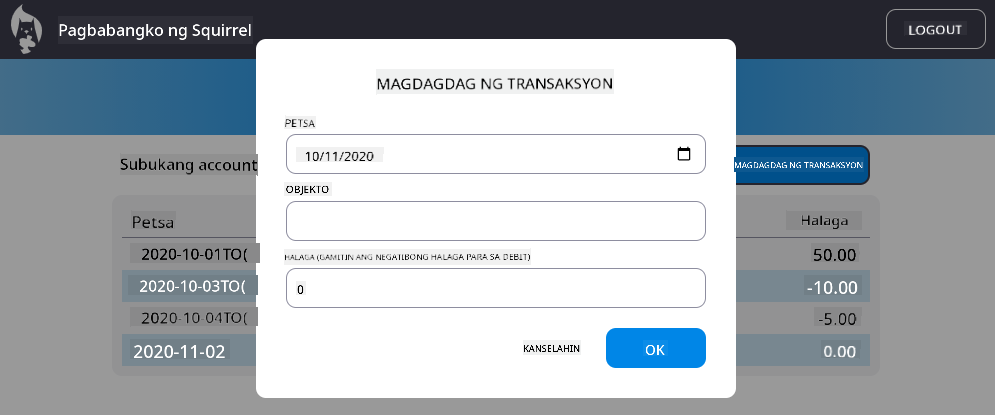

<!--
CO_OP_TRANSLATOR_METADATA:
{
  "original_hash": "50a7783473b39a2e0f133e271a102231",
  "translation_date": "2025-10-22T15:34:02+00:00",
  "source_file": "7-bank-project/4-state-management/assignment.md",
  "language_code": "tl"
}
-->
# Pagpapatupad ng "Magdagdag ng Transaksyon" na Dialog

## Pangkalahatang-ideya

Ang iyong banking app ay may maayos na state management at data persistence, ngunit kulang ito ng mahalagang tampok na kailangan ng mga tunay na banking app: ang kakayahan ng mga user na magdagdag ng kanilang sariling mga transaksyon. Sa assignment na ito, ipapatupad mo ang isang kumpletong "Magdagdag ng Transaksyon" na dialog na seamless na mag-iintegrate sa iyong kasalukuyang state management system.

Pinagsasama ng assignment na ito ang lahat ng natutunan mo sa apat na banking lessons: HTML templating, form handling, API integration, at state management.

## Mga Layunin sa Pagkatuto

Sa pagtatapos ng assignment na ito, ikaw ay:
- **Lilikha** ng user-friendly na dialog interface para sa pagpasok ng data
- **Magpapatupad** ng accessible na disenyo ng form na may suporta sa keyboard at screen reader
- **Mag-iintegrate** ng bagong tampok sa iyong kasalukuyang state management system
- **Magpapraktis** ng API communication at error handling
- **Mag-aaplay** ng modernong web development patterns sa isang tampok na pang-tunay na mundo

## Mga Instruksyon

### Hakbang 1: Button para sa "Magdagdag ng Transaksyon"

**Gumawa** ng button na "Magdagdag ng Transaksyon" sa iyong dashboard page na madaling makita at ma-access ng mga user.

**Mga Kinakailangan:**
- **Ilagay** ang button sa lohikal na lokasyon sa dashboard
- **Gumamit** ng malinaw, action-oriented na text para sa button
- **I-style** ang button upang tumugma sa iyong kasalukuyang UI design
- **Siguraduhin** na ang button ay accessible gamit ang keyboard

### Hakbang 2: Pagpapatupad ng Dialog

Pumili ng isa sa dalawang paraan para ipatupad ang iyong dialog:

**Opsyon A: Hiwalay na Pahina**
- **Gumawa** ng bagong HTML template para sa transaction form
- **Magdagdag** ng bagong ruta sa iyong routing system
- **Ipapatupad** ang navigation papunta at mula sa form page

**Opsyon B: Modal Dialog (Inirerekomenda)**
- **Gumamit** ng JavaScript upang ipakita/itago ang dialog nang hindi umaalis sa dashboard
- **Ipapatupad** gamit ang [`hidden` property](https://developer.mozilla.org/docs/Web/HTML/Global_attributes/hidden) o CSS classes
- **Gumawa** ng smooth na user experience na may tamang focus management

### Hakbang 3: Pagpapatupad ng Accessibility

**Siguraduhin** na ang iyong dialog ay sumusunod sa [accessibility standards para sa modal dialogs](https://developer.paciellogroup.com/blog/2018/06/the-current-state-of-modal-dialog-accessibility/):

**Keyboard Navigation:**
- **Suportahan** ang Escape key para isara ang dialog
- **I-trap** ang focus sa loob ng dialog kapag bukas
- **Ibalik** ang focus sa trigger button kapag isinara

**Suporta sa Screen Reader:**
- **Magdagdag** ng tamang ARIA labels at roles
- **I-anunsyo** ang pagbukas/pagsara ng dialog sa screen readers
- **Magbigay** ng malinaw na labels para sa form fields at error messages

### Hakbang 4: Paglikha ng Form

**Disenyo** ng HTML form na nangongolekta ng data ng transaksyon:

**Mga Kinakailangang Field:**
- **Petsa**: Kailan nangyari ang transaksyon
- **Deskripsyon**: Para saan ang transaksyon
- **Halaga**: Halaga ng transaksyon (positibo para sa kita, negatibo para sa gastos)

**Mga Tampok ng Form:**
- **I-validate** ang input ng user bago isumite
- **Magbigay** ng malinaw na error messages para sa invalid na data
- **Maglagay** ng helpful na placeholder text at labels
- **I-style** nang pare-pareho sa iyong kasalukuyang disenyo

### Hakbang 5: API Integration

**Ikonekta** ang iyong form sa backend API:

**Mga Hakbang sa Pagpapatupad:**
- **Suriin** ang [server API specifications](../api/README.md) para sa tamang endpoint at data format
- **Gumawa** ng JSON data mula sa iyong form inputs
- **Ipadala** ang data sa API gamit ang tamang error handling
- **Ipakita** ang success/failure messages sa user
- **I-handle** ang network errors nang maayos

### Hakbang 6: State Management Integration

**I-update** ang iyong dashboard gamit ang bagong transaksyon:

**Mga Kinakailangan sa Integrasyon:**
- **I-refresh** ang account data pagkatapos ng matagumpay na pagdagdag ng transaksyon
- **I-update** ang display ng dashboard nang hindi nangangailangan ng page reload
- **Siguraduhin** na ang bagong transaksyon ay agad na lumalabas
- **Panatilihin** ang tamang state consistency sa buong proseso

## Mga Teknikal na Detalye

**Mga Detalye ng API Endpoint:**
Tingnan ang [server API documentation](../api/README.md) para sa:
- Kinakailangang JSON format para sa transaction data
- HTTP method at endpoint URL
- Inaasahang response format
- Paghawak ng error response

**Inaasahang Resulta:**
Pagkatapos makumpleto ang assignment na ito, ang iyong banking app ay dapat magkaroon ng ganap na functional na "Magdagdag ng Transaksyon" na tampok na mukhang propesyonal at maayos ang pagganap:

## Pagsubok ng Iyong Pagpapatupad

**Functional Testing:**
1. **Siguraduhin** na ang "Magdagdag ng Transaksyon" na button ay malinaw na nakikita at accessible
2. **Subukan** na ang dialog ay nagbubukas at nagsasara nang maayos
3. **Kumpirmahin** na gumagana ang form validation para sa lahat ng kinakailangang field
4. **Suriin** na ang matagumpay na transaksyon ay agad na lumalabas sa dashboard
5. **Siguraduhin** na gumagana ang error handling para sa invalid na data at mga isyu sa network

**Accessibility Testing:**
1. **Mag-navigate** sa buong flow gamit lamang ang keyboard
2. **Subukan** gamit ang screen reader upang matiyak ang tamang mga anunsyo
3. **Kumpirmahin** na gumagana nang maayos ang focus management
4. **Suriin** na ang lahat ng form elements ay may tamang labels

## Rubric ng Pagsusuri

| Pamantayan | Napakahusay | Katanggap-tanggap | Kailangan ng Pagpapabuti |
| -------- | --------- | -------- | ----------------- |
| **Functionality** | Ang tampok na "Magdagdag ng Transaksyon" ay gumagana nang walang kapintasan na may mahusay na user experience at sumusunod sa lahat ng best practices mula sa mga lessons | Ang tampok na "Magdagdag ng Transaksyon" ay gumagana nang tama ngunit maaaring hindi sumusunod sa ilang best practices o may minor na usability issues | Ang tampok na "Magdagdag ng Transaksyon" ay bahagyang gumagana o may malalaking usability problems |
| **Code Quality** | Ang code ay maayos na naka-organize, sumusunod sa established patterns, may tamang error handling, at seamless na nag-iintegrate sa kasalukuyang state management | Ang code ay gumagana ngunit maaaring may ilang issues sa organization o hindi consistent sa patterns ng kasalukuyang codebase | Ang code ay may malalaking structural issues o hindi maayos na nag-iintegrate sa kasalukuyang patterns |
| **Accessibility** | Buong suporta sa keyboard navigation, screen reader compatibility, at sumusunod sa WCAG guidelines na may mahusay na focus management | Basic na accessibility features ang naipatupad ngunit maaaring kulang sa ilang keyboard navigation o screen reader features | Limitado o walang accessibility considerations na naipatupad |
| **User Experience** | Intuitive, polished na interface na may malinaw na feedback, smooth na interactions, at propesyonal na hitsura | Magandang user experience na may minor na areas para sa improvement sa feedback o visual design | Mahinang user experience na may nakakalitong interface o kakulangan sa user feedback |

## Mga Karagdagang Hamon (Opsyonal)

Kapag natapos mo na ang mga pangunahing kinakailangan, isaalang-alang ang mga enhancement na ito:

**Mga Pinahusay na Tampok:**
- **Magdagdag** ng mga kategorya ng transaksyon (pagkain, transportasyon, libangan, atbp.)
- **Ipapatupad** ang input validation na may real-time feedback
- **Gumawa** ng keyboard shortcuts para sa power users
- **Magdagdag** ng kakayahan sa pag-edit at pag-delete ng transaksyon

**Advanced Integration:**
- **Ipapatupad** ang undo functionality para sa mga kamakailang idinagdag na transaksyon
- **Magdagdag** ng bulk transaction import mula sa mga CSV file
- **Gumawa** ng kakayahan sa paghanap at pag-filter ng transaksyon
- **Ipapatupad** ang data export functionality

Ang mga opsyonal na tampok na ito ay makakatulong sa iyo na magpraktis ng mas advanced na web development concepts at lumikha ng mas kumpletong banking application!

---

**Paunawa**:  
Ang dokumentong ito ay isinalin gamit ang AI translation service na [Co-op Translator](https://github.com/Azure/co-op-translator). Bagamat sinisikap naming maging tumpak, pakatandaan na ang mga awtomatikong pagsasalin ay maaaring maglaman ng mga pagkakamali o hindi eksaktong impormasyon. Ang orihinal na dokumento sa kanyang katutubong wika ang dapat ituring na opisyal na pinagmulan. Para sa mahalagang impormasyon, inirerekomenda ang propesyonal na pagsasalin ng tao. Hindi kami mananagot sa anumang hindi pagkakaunawaan o maling interpretasyon na dulot ng paggamit ng pagsasaling ito.