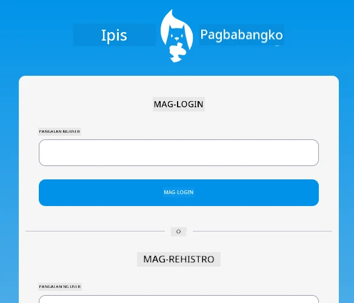
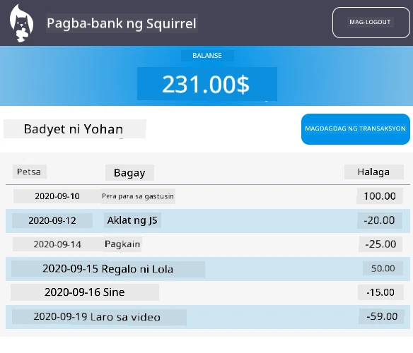

# :dollar: Gumawa ng Bangko

Sa proyektong ito, matututo kang gumawa ng isang kathang-isip na bangko. Kasama sa mga araling ito ang mga tagubilin kung paano mag-layout ng isang web app at magbigay ng mga ruta, gumawa ng mga form, pamahalaan ang estado, at kumuha ng data mula sa isang API kung saan maaari mong makuha ang datos ng bangko.

|  |  |
|--------------------------------|--------------------------------|

## Mga Aralin

1. [HTML Templates at Mga Ruta sa isang Web App](1-template-route/README.md)
2. [Gumawa ng Login at Registration Form](2-forms/README.md)
3. [Mga Paraan ng Pagkuha at Paggamit ng Data](3-data/README.md)
4. [Mga Konsepto ng Pamamahala ng Estado](4-state-management/README.md)

### Mga Kredito

Ang mga araling ito ay isinulat nang may :hearts: ni [Yohan Lasorsa](https://twitter.com/sinedied).

Kung interesado kang matutunan kung paano gumawa ng [server API](/7-bank-project/api/README.md) na ginamit sa mga araling ito, maaari mong sundan [ang serye ng mga video na ito](https://aka.ms/NodeBeginner) (lalo na ang mga video 17 hanggang 21).

Maaari mo ring tingnan ang [interactive Learn tutorial na ito](https://aka.ms/learn/express-api).

---

**Paunawa**:  
Ang dokumentong ito ay isinalin gamit ang AI translation service na [Co-op Translator](https://github.com/Azure/co-op-translator). Bagama't sinisikap naming maging tumpak, tandaan na ang mga awtomatikong pagsasalin ay maaaring maglaman ng mga pagkakamali o hindi pagkakatugma. Ang orihinal na dokumento sa kanyang katutubong wika ang dapat ituring na opisyal na sanggunian. Para sa mahalagang impormasyon, inirerekomenda ang propesyonal na pagsasalin ng tao. Hindi kami mananagot sa anumang hindi pagkakaunawaan o maling interpretasyon na dulot ng paggamit ng pagsasaling ito.