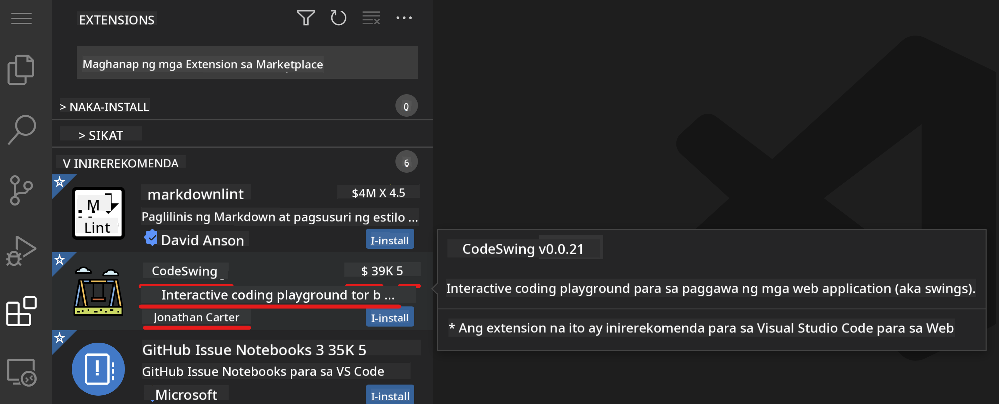

<!--
CO_OP_TRANSLATOR_METADATA:
{
  "original_hash": "1ba61d96a11309a2a6ea507496dcf7e5",
  "translation_date": "2025-08-28T15:50:59+00:00",
  "source_file": "8-code-editor/1-using-a-code-editor/README.md",
  "language_code": "tl"
}
-->
# Paggamit ng Code Editor

Tatalakayin sa araling ito ang mga pangunahing kaalaman sa paggamit ng [VSCode.dev](https://vscode.dev), isang web-based na code editor, upang makagawa ka ng mga pagbabago sa iyong code at makapag-ambag sa isang proyekto nang hindi kinakailangang mag-install ng kahit ano sa iyong computer.

## Mga Layunin sa Pagkatuto

Sa araling ito, matututunan mo kung paano:

- Gumamit ng code editor sa isang proyekto ng code
- Subaybayan ang mga pagbabago gamit ang version control
- I-customize ang editor para sa pag-develop

### Mga Kinakailangan

Bago magsimula, kailangan mong gumawa ng account sa [GitHub](https://github.com). Pumunta sa [GitHub](https://github.com/) at gumawa ng account kung wala ka pa.

### Panimula

Ang code editor ay isang mahalagang kasangkapan sa pagsusulat ng mga programa at pakikipagtulungan sa mga umiiral na coding project. Kapag naintindihan mo ang mga pangunahing kaalaman ng isang editor at kung paano gamitin ang mga tampok nito, magagamit mo ito sa pagsusulat ng code.

## Pagsisimula sa VSCode.dev

Ang [VSCode.dev](https://vscode.dev) ay isang code editor na nasa web. Hindi mo kailangang mag-install ng kahit ano upang magamit ito, katulad ng pagbubukas ng ibang website. Upang magsimula, buksan ang sumusunod na link: [https://vscode.dev](https://vscode.dev). Kung hindi ka naka-sign in sa [GitHub](https://github.com/), sundin ang mga prompt upang mag-sign in o gumawa ng bagong account at pagkatapos ay mag-sign in.

Kapag nag-load na ito, dapat itong magmukhang katulad ng larawang ito:


May tatlong pangunahing bahagi, mula kaliwa hanggang kanan:

1. Ang _activity bar_ na may kasamang ilang icon, tulad ng magnifying glass 🔎, gear ⚙️, at iba pa.
2. Ang pinalawak na activity bar na default sa _Explorer_, na tinatawag na _side bar_.
3. At ang code area sa kanan.

I-click ang bawat icon upang ipakita ang iba't ibang menu. Kapag tapos na, i-click ang _Explorer_ upang bumalik sa simula.

Kapag nagsimula kang gumawa o magbago ng code, mangyayari ito sa pinakamalaking bahagi sa kanan. Gagamitin mo rin ang bahaging ito upang makita ang umiiral na code, na gagawin mo sa susunod.

## Pagbukas ng GitHub Repository

Ang unang kailangan mong gawin ay buksan ang isang GitHub repository. May iba't ibang paraan upang buksan ang repository. Sa seksyong ito, makikita mo ang dalawang paraan upang buksan ang repository at makapagsimula sa paggawa ng mga pagbabago.

### 1. Gamit ang Editor

Gamitin ang editor mismo upang buksan ang isang remote repository. Kung pupunta ka sa [VSCode.dev](https://vscode.dev), makikita mo ang button na _"Open Remote Repository"_:


Maaari mo ring gamitin ang command palette. Ang command palette ay isang input box kung saan maaari kang mag-type ng anumang salita na bahagi ng isang command o aksyon upang mahanap ang tamang command na isasagawa. Gamitin ang menu sa kaliwang-itaas, pagkatapos ay piliin ang _View_, at pagkatapos ay piliin ang _Command Palette_, o gamitin ang sumusunod na keyboard shortcut: Ctrl-Shift-P (sa MacOS, Command-Shift-P).


Kapag nagbukas ang menu, i-type ang _open remote repository_, at pagkatapos ay piliin ang unang opsyon. Lalabas ang mga repository na bahagi ka o kamakailan mong binuksan. Maaari mo ring gamitin ang buong URL ng GitHub upang pumili ng isa. Gamitin ang sumusunod na URL at i-paste ito sa kahon:

```
https://github.com/microsoft/Web-Dev-For-Beginners
```

✅ Kapag matagumpay, makikita mo ang lahat ng file para sa repository na ito na naka-load sa text editor.

### 2. Gamit ang URL

Maaari mo ring gamitin ang isang URL nang direkta upang i-load ang repository. Halimbawa, ang buong URL para sa kasalukuyang repo ay [https://github.com/microsoft/Web-Dev-For-Beginners](https://github.com/microsoft/Web-Dev-For-Beginners), ngunit maaari mong palitan ang domain ng GitHub ng `VSCode.dev/github` at direktang i-load ang repository. Ang magiging URL ay [https://vscode.dev/github/microsoft/Web-Dev-For-Beginners](https://vscode.dev/github/microsoft/Web-Dev-For-Beginners).

## Pag-edit ng mga File

Kapag nabuksan mo na ang repository sa browser/vscode.dev, ang susunod na hakbang ay gumawa ng mga update o pagbabago sa proyekto.

### 1. Gumawa ng Bagong File

Maaari kang gumawa ng file sa loob ng umiiral na folder o sa root directory/folder. Upang gumawa ng bagong file, buksan ang lokasyon/directory kung saan mo gustong i-save ang file at piliin ang icon na _'New file ...'_ sa activity bar _(kaliwa)_, bigyan ito ng pangalan at pindutin ang enter.


### 2. I-edit at I-save ang File sa Repository

Ang paggamit ng vscode.dev ay kapaki-pakinabang kung nais mong gumawa ng mabilisang update sa iyong proyekto nang hindi kinakailangang mag-load ng anumang software sa lokal.

Upang i-update ang iyong code, i-click ang 'Explorer' icon, na matatagpuan din sa activity bar, upang makita ang mga file at folder sa repository. Piliin ang isang file upang buksan ito sa code area, gawin ang iyong mga pagbabago, at i-save.


Kapag tapos ka nang mag-update ng iyong proyekto, piliin ang _`source control`_ icon na naglalaman ng lahat ng bagong pagbabago na ginawa mo sa iyong repository.

Upang makita ang mga pagbabago na ginawa mo sa iyong proyekto, piliin ang file(s) sa `Changes` folder sa pinalawak na activity bar. Magbubukas ito ng 'Working Tree' upang makita mo ang mga pagbabago sa file. Ang pula ay nagpapakita ng tinanggal, habang ang berde ay nagpapahiwatig ng idinagdag.


Kung nasiyahan ka sa mga pagbabago, i-hover ang `Changes` folder at i-click ang `+` button upang i-stage ang mga pagbabago. Ang staging ay nangangahulugang paghahanda ng iyong mga pagbabago upang i-commit ang mga ito sa GitHub.

Kung hindi ka komportable sa ilang pagbabago at nais mong i-discard ang mga ito, i-hover ang `Changes` folder at piliin ang `undo` icon.

Pagkatapos, mag-type ng `commit message` _(Isang paglalarawan ng pagbabago na ginawa mo sa proyekto)_, i-click ang `check icon` upang i-commit at i-push ang iyong mga pagbabago.

Kapag tapos ka na sa iyong proyekto, piliin ang `hamburger menu icon` sa kaliwang-itaas upang bumalik sa repository sa github.com.


## Paggamit ng Extensions

Ang pag-install ng extensions sa VSCode ay nagbibigay-daan sa iyo na magdagdag ng mga bagong tampok at mga opsyon sa customized na development environment sa iyong editor upang mapabuti ang iyong workflow. Ang mga extension na ito ay tumutulong din sa iyo na magdagdag ng suporta para sa maraming programming language at karaniwang generic o language-based na extension.

Upang mag-browse sa listahan ng lahat ng available na extension, i-click ang _`Extensions icon`_ sa activity bar at simulang i-type ang pangalan ng extension sa text field na may label na _'Search Extensions in Marketplace'_.

Makikita mo ang listahan ng mga extension, bawat isa ay naglalaman ng **pangalan ng extension, pangalan ng publisher, isang pangungusap na paglalarawan, bilang ng downloads**, at **star rating**.



Maaari mo ring tingnan ang lahat ng na-install na extension sa pamamagitan ng pag-expand ng _`Installed folder`_, mga sikat na extension na ginagamit ng karamihan ng mga developer sa _`Popular folder`_, at mga inirerekomendang extension para sa iyo batay sa mga user sa parehong workspace o sa mga kamakailang binuksang file sa _`recommended folder`_.


### 1. Mag-install ng Extensions

Upang mag-install ng extension, i-type ang pangalan ng extension sa search field at i-click ito upang makita ang karagdagang impormasyon tungkol sa extension sa code area kapag lumitaw ito sa pinalawak na activity bar.

Maaari mong i-click ang _blue install button_ sa pinalawak na activity bar upang i-install o gamitin ang install button na lumalabas sa code area kapag pinili mo ang extension upang mag-load ng karagdagang impormasyon.


### 2. I-customize ang Extensions

Pagkatapos mag-install ng extension, maaaring kailanganin mong baguhin ang pag-uugali nito at i-customize ito batay sa iyong mga kagustuhan. Upang gawin ito, piliin ang Extensions icon, at sa pagkakataong ito, lalabas ang iyong extension sa _Installed folder_, i-click ang _**Gear icon**_ at mag-navigate sa _Extensions Setting_.


### 3. Pamahalaan ang Extensions

Pagkatapos mag-install at gumamit ng extension, nag-aalok ang vscode.dev ng mga opsyon upang pamahalaan ang iyong extension batay sa iba't ibang pangangailangan. Halimbawa, maaari mong piliing:

- **I-disable:** _(Pansamantalang i-disable ang extension kapag hindi mo ito kailangan ngunit ayaw mo itong ganap na i-uninstall)_

    Piliin ang na-install na extension sa pinalawak na activity bar > i-click ang Gear icon > piliin ang 'Disable' o 'Disable (Workspace)' **O** Buksan ang extension sa code area at i-click ang blue Disable button.

- **I-uninstall:** Piliin ang na-install na extension sa pinalawak na activity bar > i-click ang Gear icon > piliin ang 'Uninstall' **O** Buksan ang extension sa code area at i-click ang blue Uninstall button.

---

## Takdang-Aralin

[Maglikha ng resume website gamit ang vscode.dev](https://github.com/microsoft/Web-Dev-For-Beginners/blob/main/8-code-editor/1-using-a-code-editor/assignment.md)

## Review at Pag-aaral sa Sarili

Magbasa pa tungkol sa [VSCode.dev](https://code.visualstudio.com/docs/editor/vscode-web?WT.mc_id=academic-0000-alfredodeza) at iba pang mga tampok nito.

---

**Paunawa**:  
Ang dokumentong ito ay isinalin gamit ang AI translation service na [Co-op Translator](https://github.com/Azure/co-op-translator). Bagama't sinisikap naming maging tumpak, tandaan na ang mga awtomatikong pagsasalin ay maaaring maglaman ng mga pagkakamali o hindi pagkakatugma. Ang orihinal na dokumento sa kanyang katutubong wika ang dapat ituring na opisyal na sanggunian. Para sa mahalagang impormasyon, inirerekomenda ang propesyonal na pagsasalin ng tao. Hindi kami mananagot sa anumang hindi pagkakaunawaan o maling interpretasyon na maaaring magmula sa paggamit ng pagsasaling ito.