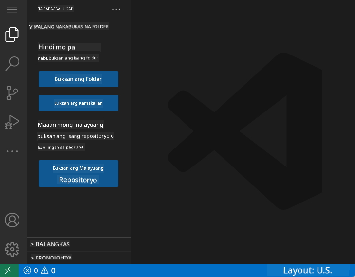
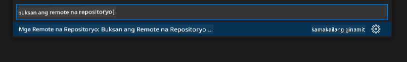
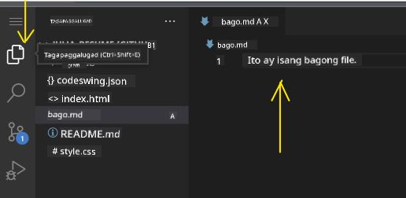
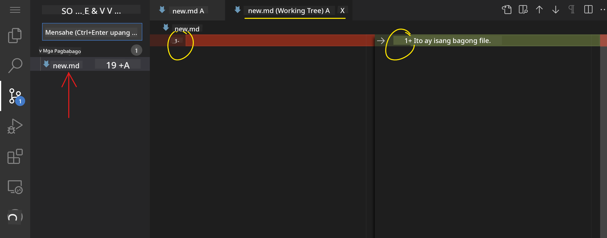
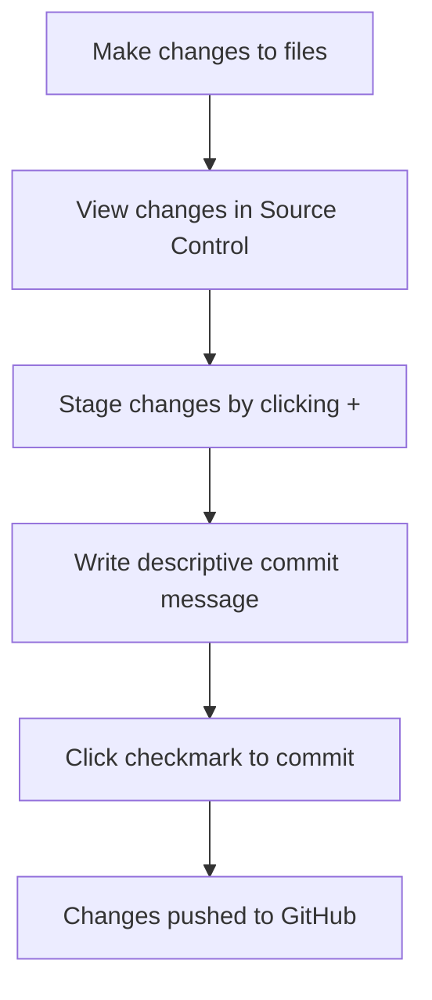
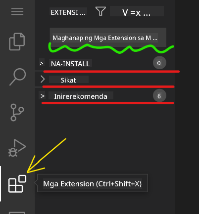
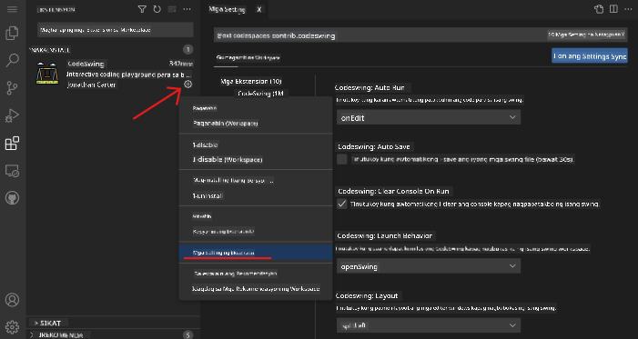

<!--
CO_OP_TRANSLATOR_METADATA:
{
  "original_hash": "cfd4a15974168ca426d50c67682ab9d4",
  "translation_date": "2025-10-22T15:19:20+00:00",
  "source_file": "8-code-editor/1-using-a-code-editor/README.md",
  "language_code": "tl"
}
-->
# Paggamit ng Code Editor: Pag-master sa VSCode.dev

Naalala mo ba sa *The Matrix* kung paano kailangang kumonekta ni Neo sa isang malaking computer terminal para ma-access ang digital na mundo? Ang mga kasalukuyang web development tools ay kabaligtaran – napakalakas na kakayahan na maaring ma-access kahit saan. Ang VSCode.dev ay isang browser-based na code editor na nagdadala ng mga propesyonal na development tools sa anumang device na may internet connection.

Katulad ng kung paano ginawang accessible ng printing press ang mga libro sa lahat, hindi lang sa mga tagasulat sa monasteryo, ang VSCode.dev ay nagde-demokratize ng coding. Maaari kang magtrabaho sa mga proyekto mula sa library computer, school lab, o kahit saan basta may browser access. Walang kailangang i-install, walang limitasyon na "kailangan ko ng specific setup".

Sa pagtatapos ng araling ito, maiintindihan mo kung paano mag-navigate sa VSCode.dev, magbukas ng mga GitHub repository direkta sa iyong browser, at gumamit ng Git para sa version control – mga kasanayan na araw-araw na ginagamit ng mga propesyonal na developer.

## Ano ang Matututunan Mo

Pagkatapos nating talakayin ito, magagawa mo ang mga sumusunod:

- Mag-navigate sa VSCode.dev na parang pangalawang tahanan mo – mahanap ang lahat ng kailangan mo nang hindi naliligaw
- Magbukas ng anumang GitHub repository sa iyong browser at magsimulang mag-edit agad (medyo magical ito!)
- Gumamit ng Git para subaybayan ang iyong mga pagbabago at i-save ang iyong progreso tulad ng isang pro
- Palakasin ang iyong editor gamit ang mga extension na nagpapabilis at nagpapasaya sa coding
- Gumawa at mag-organize ng mga file ng proyekto nang may kumpiyansa

## Ano ang Kailangan Mo

Ang mga kinakailangan ay simple:

- Isang libreng [GitHub account](https://github.com) (gagabayan ka namin sa paggawa nito kung kinakailangan)
- Basic na kaalaman sa web browsers
- Ang GitHub Basics lesson ay nagbibigay ng kapaki-pakinabang na background, bagama't hindi ito mahalaga

> 💡 **Baguhan sa GitHub?** Ang paggawa ng account ay libre at tumatagal lamang ng ilang minuto. Katulad ng kung paano nagbibigay ang library card ng access sa mga libro sa buong mundo, ang GitHub account ay nagbubukas ng pintuan sa mga code repository sa internet.

## Bakit Mahalaga ang Web-Based Code Editors

Bago ang internet, ang mga siyentipiko sa iba't ibang unibersidad ay hindi madaling makapagbahagi ng pananaliksik. Pagkatapos ay dumating ang ARPANET noong 1960s, na nagkonekta ng mga computer sa malalayong lugar. Ang mga web-based code editor ay sumusunod sa parehong prinsipyo – ginagawa ang mga makapangyarihang tools na accessible kahit saan ka man o anuman ang iyong device.

Ang code editor ay nagsisilbing workspace mo sa pag-develop, kung saan ka nagsusulat, nag-e-edit, at nag-oorganize ng mga code file. Hindi tulad ng simpleng text editors, ang mga propesyonal na code editor ay nagbibigay ng syntax highlighting, error detection, at project management features.

Ang VSCode.dev ay nagdadala ng mga kakayahang ito sa iyong browser:

**Mga benepisyo ng web-based editing:**

| Feature | Deskripsyon | Praktikal na Benepisyo |
|---------|-------------|----------|
| **Platform Independence** | Tumatakbo sa anumang device na may browser | Seamless na trabaho mula sa iba't ibang computer |
| **No Installation Required** | Ma-access sa pamamagitan ng web URL | Walang problema sa software installation |
| **Automatic Updates** | Laging tumatakbo sa pinakabagong bersyon | Ma-access ang mga bagong feature nang walang manual updates |
| **Repository Integration** | Direktang koneksyon sa GitHub | Mag-edit ng code nang walang local file management |

**Praktikal na implikasyon:**
- Patuloy na trabaho sa iba't ibang environment
- Konsistent na interface anuman ang operating system
- Agarang kakayahan sa pakikipagtulungan
- Nabawasang pangangailangan sa local storage

## Pag-explore sa VSCode.dev

Katulad ng laboratoryo ni Marie Curie na may mga sopistikadong kagamitan sa isang simpleng espasyo, ang VSCode.dev ay naglalaman ng mga propesyonal na development tools sa isang browser interface. Ang web application na ito ay nagbibigay ng parehong core functionality tulad ng desktop code editors.

Simulan sa pamamagitan ng pagpunta sa [vscode.dev](https://vscode.dev) sa iyong browser. Ang interface ay naglo-load nang walang downloads o system installations – isang direktang aplikasyon ng cloud computing principles.

### Pagkonekta sa Iyong GitHub Account

Katulad ng kung paano ikinonekta ng telepono ni Alexander Graham Bell ang mga malalayong lokasyon, ang pag-link ng iyong GitHub account ay nag-uugnay sa VSCode.dev sa iyong mga code repository. Kapag sinabihan na mag-sign in gamit ang GitHub, inirerekomenda ang pagtanggap sa koneksyon na ito.

**Ang GitHub integration ay nagbibigay ng:**
- Direktang access sa iyong mga repository sa loob ng editor
- Synchronized na settings at extensions sa iba't ibang device
- Streamlined na workflow sa pag-save sa GitHub
- Personalized na development environment

### Pagkilala sa Iyong Bagong Workspace

Kapag na-load na ang lahat, makikita mo ang isang malinis na workspace na dinisenyo para panatilihin kang nakatuon sa mahalaga – ang iyong code!

**Narito ang tour sa iyong bagong lugar:**
- **Activity Bar** (ang strip sa kaliwa): Ang iyong pangunahing navigation na may Explorer 📁, Search 🔍, Source Control 🌿, Extensions 🧩, at Settings ⚙️
- **Sidebar** (ang panel sa tabi nito): Nagbabago upang ipakita ang kaugnay na impormasyon batay sa iyong napili
- **Editor Area** (ang malaking espasyo sa gitna): Dito nangyayari ang magic – ang iyong pangunahing coding area

**Maglaan ng sandali para mag-explore:**
- Mag-click sa mga icon ng Activity Bar at tingnan kung ano ang ginagawa ng bawat isa
- Pansinin kung paano nag-a-update ang sidebar upang magpakita ng iba't ibang impormasyon – medyo cool, di ba?
- Ang Explorer view (📁) ay marahil kung saan ka magtatagal, kaya magpakomportable dito

## Pagbubukas ng GitHub Repositories

Bago ang internet, kailangang pisikal na maglakbay ang mga mananaliksik sa mga library para ma-access ang mga dokumento. Ang mga GitHub repository ay gumagana nang katulad – mga koleksyon ng code na nakaimbak nang malayuan. Ang VSCode.dev ay inaalis ang tradisyunal na hakbang ng pag-download ng mga repository sa iyong local machine bago mag-edit.

Ang kakayahang ito ay nagbibigay ng agarang access sa anumang public repository para sa pagtingin, pag-edit, o pag-contribute. Narito ang dalawang paraan para magbukas ng mga repository:

### Paraan 1: Ang Point-and-Click na Paraan

Perpekto ito kapag nagsisimula ka sa VSCode.dev at nais magbukas ng isang partikular na repository. Simple at friendly para sa mga baguhan:

**Narito kung paano ito gawin:**

1. Pumunta sa [vscode.dev](https://vscode.dev) kung hindi ka pa naroon
2. Hanapin ang "Open Remote Repository" button sa welcome screen at i-click ito

   

3. I-paste ang anumang GitHub repository URL (subukan ito: `https://github.com/microsoft/Web-Dev-For-Beginners`)
4. Pindutin ang Enter at panoorin ang magic!

**Pro tip - Shortcut ng Command Palette:**

Gusto mo bang magmukhang coding wizard? Subukan ang keyboard shortcut na Ctrl+Shift+P (o Cmd+Shift+P sa Mac) para buksan ang Command Palette:

**Ang Command Palette ay parang search engine para sa lahat ng magagawa mo:**
- I-type ang "open remote" at hahanapin nito ang repository opener para sa iyo
- Naaalala nito ang mga repository na binuksan mo kamakailan (sobrang handy!)
- Kapag nasanay ka na dito, parang coding sa bilis ng kidlat
- Para itong bersyon ng VSCode.dev ng "Hey Siri, pero para sa coding"

### Paraan 2: Teknik ng Pag-modify ng URL

Katulad ng kung paano gumagamit ang HTTP at HTTPS ng iba't ibang protocol habang pinapanatili ang parehong istruktura ng domain, ang VSCode.dev ay gumagamit ng URL pattern na sumasalamin sa addressing system ng GitHub. Anumang GitHub repository URL ay maaaring i-modify upang direktang mabuksan sa VSCode.dev.

**Pattern ng URL transformation:**

| Uri ng Repository | GitHub URL | VSCode.dev URL |
|----------------|---------------------|----------------|
| **Public Repository** | `github.com/microsoft/Web-Dev-For-Beginners` | `vscode.dev/github/microsoft/Web-Dev-For-Beginners` |
| **Personal Project** | `github.com/your-username/my-project` | `vscode.dev/github/your-username/my-project` |
| **Anumang Accessible Repo** | `github.com/their-username/awesome-repo` | `vscode.dev/github/their-username/awesome-repo` |

**Pagpapatupad:**
- Palitan ang `github.com` ng `vscode.dev/github`
- Panatilihin ang lahat ng iba pang bahagi ng URL na hindi nagbabago
- Gumagana sa anumang publicly accessible repository
- Nagbibigay ng agarang access sa pag-edit

> 💡 **Tip na magbabago ng buhay**: I-bookmark ang VSCode.dev na bersyon ng iyong mga paboritong repository. Mayroon akong mga bookmark tulad ng "Edit My Portfolio" at "Fix Documentation" na direktang nagdadala sa akin sa editing mode!

**Aling paraan ang dapat mong gamitin?**
- **Ang paraan ng interface**: Maganda kapag nag-e-explore ka o hindi mo matandaan ang eksaktong pangalan ng repository
- **Ang trick sa URL**: Perpekto para sa mabilisang access kapag alam mo nang eksakto kung saan ka pupunta

## Paggawa gamit ang Mga File at Proyekto

Ngayon na nabuksan mo na ang isang repository, simulan na natin ang paggawa! Ang VSCode.dev ay nagbibigay sa iyo ng lahat ng kailangan mo para gumawa, mag-edit, at mag-organize ng iyong mga code file. Isipin ito bilang iyong digital workshop – bawat tool ay nasa tamang lugar.

Tuklasin natin ang mga pang-araw-araw na gawain na bumubuo sa karamihan ng iyong coding workflow.

### Paggawa ng Bagong File

Katulad ng pag-aayos ng mga blueprint sa opisina ng isang arkitekto, ang paggawa ng file sa VSCode.dev ay sumusunod sa isang structured na approach. Sinusuportahan ng system ang lahat ng standard na web development file types.

**Proseso ng paggawa ng file:**

1. Pumunta sa target folder sa Explorer sidebar
2. I-hover ang pangalan ng folder para lumitaw ang "New File" icon (📄+)
3. Ipasok ang filename kasama ang tamang extension (`style.css`, `script.js`, `index.html`)
4. Pindutin ang Enter para gumawa ng file

**Mga naming conventions:**
- Gumamit ng mga deskriptibong pangalan na nagpapahiwatig ng layunin ng file
- Isama ang file extensions para sa tamang syntax highlighting
- Sundin ang consistent na naming patterns sa buong proyekto
- Gumamit ng lowercase letters at hyphens sa halip na spaces

### Pag-edit at Pag-save ng Mga File

Dito nagsisimula ang totoong kasiyahan! Ang editor ng VSCode.dev ay puno ng mga kapaki-pakinabang na feature na nagpapadali at nagpapasaya sa coding. Para itong may napakatalinong writing assistant, pero para sa code.

**Ang iyong editing workflow:**

1. I-click ang anumang file sa Explorer para buksan ito sa pangunahing area
2. Simulan ang pag-type at panoorin ang VSCode.dev na tumutulong sa iyo gamit ang mga kulay, suggestions, at error spotting
3. I-save ang iyong trabaho gamit ang Ctrl+S (Windows/Linux) o Cmd+S (Mac) – bagama't auto-save din ito!

**Ang mga cool na bagay na nangyayari habang nagko-code ka:**
- Ang iyong code ay nagiging maganda ang kulay kaya madaling basahin
- Ang VSCode.dev ay nagbibigay ng mga suggestion habang nagta-type ka (parang autocorrect, pero mas matalino)
- Nahuhuli nito ang mga typo at error bago mo pa i-save
- Maaari kang magbukas ng maraming file sa mga tab, tulad ng sa browser
- Lahat ay awtomatikong nasasave sa background

> ⚠️ **Quick tip**: Kahit na may auto-save, ang pag-pindot sa Ctrl+S o Cmd+S ay magandang ugali pa rin. Agad nitong sine-save ang lahat at nagti-trigger ng ilang extra helpful features tulad ng error checking.

### Version Control gamit ang Git

Katulad ng kung paano gumagawa ng detalyadong tala ang mga archaeologist ng mga excavation layers, ang Git ay nagta-track ng mga pagbabago sa iyong code sa paglipas ng panahon. Ang system na ito ay nagpe-preserve ng project history at nagbibigay-daan sa iyo na bumalik sa mga nakaraang bersyon kung kinakailangan. Ang VSCode.dev ay may integrated na Git functionality.

**Source Control interface:**

1. I-access ang Source Control panel sa pamamagitan ng 🌿 icon sa Activity Bar
2. Ang mga binagong file ay lumilitaw sa "Changes" section
3. Ang color coding ay nagpapahiwatig ng uri ng pagbabago: berde para sa mga dagdag, pula para sa mga binura

**Pag-save ng iyong trabaho (ang commit workflow):**

**Narito ang step-by-step na proseso:**
- I-click ang "+" icon sa tabi ng mga file na nais mong i-save (ito ang "staging" sa kanila)
- Double-check na masaya ka sa lahat ng iyong staged changes
- Sumulat ng maikling note na nagpapaliwanag kung ano ang ginawa mo (ito ang "commit message" mo)
- I-click ang checkmark button para i-save ang lahat sa GitHub
- Kung nagbago ang isip mo tungkol sa isang bagay, ang undo icon ay nagbibigay-daan sa iyo na i-discard ang mga pagbabago

**Pagsulat ng magagandang commit messages (mas madali ito kaysa sa iniisip mo!):**
- Ilarawan lang kung ano ang ginawa mo, tulad ng "Add contact form" o "Fix broken navigation"
- Panatilihing maikli at simple – isipin ang haba ng tweet, hindi essay
- Simulan sa mga action words tulad ng "Add", "Fix", "Update", o "Remove"
- **Magandang halimbawa**: "Add responsive navigation menu", "Fix mobile layout issues", "Update colors for better accessibility"

> 💡 **Quick navigation tip**: Gamitin ang hamburger menu (☰) sa kaliwang itaas para bumalik sa iyong GitHub repository at makita ang iyong mga committed changes online. Para itong portal sa pagitan ng iyong editing environment at ng home ng iyong proyekto sa GitHub!

## Pagpapahusay ng Functionality gamit ang Extensions

Katulad ng workshop ng isang craftsperson na may mga specialized tools para sa iba't ibang gawain, ang VSCode.dev ay maaaring i-customize gamit ang mga extension na nagdadagdag ng partikular na kakayahan. Ang mga community-developed plugins na ito ay tumutugon sa mga karaniwang pangangailangan sa pag-develop tulad ng code formatting, live preview, at enhanced Git integration.

Ang extension marketplace ay nagho-host ng libu-libong libreng tools na ginawa ng mga developer sa buong mundo. Ang bawat extension ay nagso-solve ng partikular na workflow challenges, na nagbibigay-daan sa iyo na bumuo ng personalized na development environment na angkop sa iyong mga pangangailangan at kagustuhan.

### Paghahanap ng Iyong Perpektong Extensions

Ang extension marketplace ay talagang maayos ang pagkakaorganize, kaya hindi ka maliligaw sa paghahanap ng kailangan mo. Dinisenyo ito para tulungan kang matuklasan ang parehong specific tools at mga cool na bagay na hindi mo alam na kailangan mo!

**Pagpunta sa marketplace:**

1. I-click ang Extensions icon (🧩) sa Activity Bar
2. Mag-browse o maghanap ng isang partikular na bagay
3. I-click ang anumang mukhang interesante para malaman pa ang tungkol dito

**Ang makikita mo sa loob:**

| Seksyon | Ano ang Nasa Loob | Bakit Ito Kapaki-pakinabang |
|----------|---------|----------|
| **Installed** | Mga extension na naidagdag mo na | Ang personal coding toolkit mo |
| **Popular** | Mga paborito ng karamihan | Ang mga swear-by ng mga developer |
| **Recommended** | Mga matalinong rekomendasyon para sa iyong proyekto | Ang helpful na suggestions ng VSCode.dev |

**Ano ang nagpapadali sa pag-browse:**
- Bawat extension ay nagpapakita ng ratings, bilang ng downloads, at mga tunay na review mula sa mga user
- Makakakita ka ng screenshots at malinaw na deskripsyon kung ano ang ginagawa ng bawat isa
- Lahat ay malinaw na may compatibility info
- May mga rekomendasyon ng katulad na extensions para maikumpara mo ang mga opsyon

### Pag-install ng Extensions (Napakadali!)

Ang pagdaragdag ng bagong kakayahan sa iyong editor ay kasing simple ng pag-click ng isang button. Ang mga extension ay nag-i-install sa loob ng ilang segundo at agad na gumagana – walang restart, walang paghihintay.

**Narito ang kailangan mong gawin:**

1. Maghanap ng gusto mo (subukang maghanap ng "live server" o "prettier")
2. I-click ang mukhang maganda para makita ang higit pang detalye
3. Basahin kung ano ang ginagawa nito at tingnan ang ratings
4. I-click ang asul na "Install" button at tapos ka na!

**Ano ang nangyayari sa likod ng eksena:**
- Ang extension ay awtomatikong nagda-download at nagse-set up
- Ang mga bagong feature ay agad na lumalabas sa iyong interface
- Lahat ay agad na gumagana (seryoso, ganito kabilis!)
- Kung naka-sign in ka, ang extension ay nagsi-sync sa lahat ng iyong devices

**Ilang extensions na inirerekomenda kong simulan:**
- **Live Server**: Makikita mo ang iyong website na nag-a-update nang real-time habang nagko-code ka (sobrang galing nito!)
- **Prettier**: Ginagawang malinis at propesyonal ang iyong code nang awtomatiko
- **Auto Rename Tag**: Kapag binago mo ang isang HTML tag, awtomatikong nag-a-update ang partner nito
- **Bracket Pair Colorizer**: Nagko-color-code ng iyong brackets para hindi ka malito
- **GitLens**: Pinapalakas ang iyong Git features gamit ang maraming kapaki-pakinabang na impormasyon

### Pag-customize ng Iyong Extensions

Karamihan sa mga extension ay may settings na maaari mong i-adjust para gumana ito ayon sa gusto mo. Isipin ito na parang inaayos ang upuan at salamin sa kotse – may kanya-kanyang preference ang bawat isa!

**Pag-aayos ng settings ng extension:**

1. Hanapin ang iyong na-install na extension sa Extensions panel
2. Hanapin ang maliit na gear icon (⚙️) sa tabi ng pangalan nito at i-click ito
3. Piliin ang "Extension Settings" mula sa dropdown
4. I-adjust ang mga setting hanggang sa maging angkop ito sa iyong workflow

**Mga karaniwang bagay na maaaring i-adjust:**
- Paano nafo-format ang iyong code (tabs vs spaces, haba ng linya, atbp.)
- Aling mga keyboard shortcut ang magti-trigger ng iba't ibang aksyon
- Anong mga uri ng file ang dapat gumana ang extension
- Pag-on o pag-off ng mga partikular na feature para panatilihing malinis ang interface

### Panatilihing Organisado ang Iyong Extensions

Habang nadidiskubre mo ang mas maraming cool na extensions, gugustuhin mong panatilihing maayos at mabilis ang iyong koleksyon. Madali itong pamahalaan gamit ang VSCode.dev.

**Mga opsyon sa pamamahala ng extension:**

| Ano ang Pwede Mong Gawin | Kailan Ito Kapaki-pakinabang | Pro Tip |
|--------|---------|----------|
| **Disable** | Kapag sinusubukan kung ang extension ang sanhi ng problema | Mas maganda kaysa sa pag-uninstall kung sakaling gusto mo itong ibalik |
| **Uninstall** | Ganap na pag-aalis ng mga extension na hindi mo kailangan | Pinapanatili ang iyong environment na malinis at mabilis |
| **Update** | Pagkuha ng pinakabagong features at bug fixes | Karaniwang awtomatikong nangyayari, pero sulit na i-check |

**Paano ko pinamamahalaan ang extensions:**
- Tuwing ilang buwan, nire-review ko ang mga na-install ko at inaalis ang mga hindi ko ginagamit
- Pinapanatili kong updated ang extensions para makuha ang pinakabagong improvements at security fixes
- Kapag may mabagal, pansamantala kong dini-disable ang mga extension para makita kung alin ang sanhi
- Binabasa ko ang update notes kapag may major updates – minsan may mga cool na bagong features!

> ⚠️ **Tip sa Performance**: Ang extensions ay kahanga-hanga, pero ang sobrang dami ay maaaring magpabagal. Mag-focus sa mga talagang nagpapadali ng buhay mo at huwag matakot na i-uninstall ang mga hindi mo ginagamit.

## Hamon ng GitHub Copilot Agent 🚀

Katulad ng sistematikong approach ng NASA sa mga space mission, ang hamon na ito ay tungkol sa sistematikong paggamit ng mga kasanayan sa VSCode.dev sa isang kumpletong workflow scenario.

**Layunin:** Ipakita ang kahusayan sa VSCode.dev sa pamamagitan ng pagtatatag ng komprehensibong web development workflow.

**Mga kinakailangan sa proyekto:** Gamit ang Agent mode assistance, kumpletuhin ang mga sumusunod na gawain:
1. Mag-fork ng umiiral na repository o gumawa ng bago
2. Magtatag ng functional na istruktura ng proyekto na may HTML, CSS, at JavaScript files
3. Mag-install at mag-configure ng tatlong development-enhancing extensions
4. Magpraktis ng version control gamit ang mga descriptive commit messages
5. Mag-eksperimento sa paggawa at pagbabago ng feature branch
6. I-dokumenta ang proseso at mga natutunan sa isang README.md file

Ang exercise na ito ay pinagsasama-sama ang lahat ng VSCode.dev concepts sa isang praktikal na workflow na maaaring gamitin sa mga susunod na development projects.

Alamin pa ang tungkol sa [agent mode](https://code.visualstudio.com/blogs/2025/02/24/introducing-copilot-agent-mode) dito.

## Assignment

Panahon na para subukan ang mga kasanayan na ito! May hands-on na proyekto ako na magpapahintulot sa iyo na i-practice ang lahat ng napag-usapan natin: [Gumawa ng resume website gamit ang VSCode.dev](./assignment.md)

Ang assignment na ito ay magtuturo sa iyo kung paano bumuo ng isang propesyonal na resume website nang buo sa iyong browser. Gagamitin mo ang lahat ng VSCode.dev features na napag-usapan natin, at sa huli, magkakaroon ka ng maganda at propesyonal na website pati na rin ang kumpiyansa sa iyong bagong workflow.

## Patuloy na Tuklasin at Paunlarin ang Iyong Mga Kasanayan

May matibay ka nang pundasyon ngayon, pero marami pang cool na bagay na matutuklasan! Narito ang ilang resources at ideya para dalhin ang iyong VSCode.dev skills sa susunod na level:

**Opisyal na dokumentasyon na sulit i-bookmark:**
- [VSCode Web Documentation](https://code.visualstudio.com/docs/editor/vscode-web?WT.mc_id=academic-0000-alfredodeza) – Ang kumpletong gabay sa browser-based editing
- [GitHub Codespaces](https://docs.github.com/en/codespaces) – Para sa mas malakas na cloud-based development

**Mga cool na features na susubukan:**
- **Keyboard Shortcuts**: Alamin ang mga key combos na magpaparamdam sa iyo na parang coding ninja
- **Workspace Settings**: Mag-set up ng iba't ibang environment para sa iba't ibang uri ng proyekto
- **Multi-root Workspaces**: Magtrabaho sa maraming repositories nang sabay-sabay (sobrang kapaki-pakinabang!)
- **Terminal Integration**: Mag-access ng command-line tools direkta sa iyong browser

**Mga ideya para magpraktis:**
- Sumali sa mga open-source projects at mag-contribute gamit ang VSCode.dev – magandang paraan para magbigay pabalik!
- Subukan ang iba't ibang extensions para mahanap ang perpektong setup
- Gumawa ng project templates para sa mga uri ng site na madalas mong binubuo
- Magpraktis ng Git workflows tulad ng branching at merging – mahalaga ang mga kasanayang ito sa team projects

---

**Na-master mo na ang browser-based development!** 🎉 Katulad ng imbensyon ng portable instruments na nagbigay-daan sa mga siyentipiko na magsagawa ng pananaliksik sa malalayong lugar, ang VSCode.dev ay nagbibigay-daan sa propesyonal na coding mula sa anumang device na may internet.

Ang mga kasanayang ito ay sumasalamin sa kasalukuyang mga praktis sa industriya – maraming propesyonal na developer ang gumagamit ng cloud-based development environments para sa flexibility at accessibility. Natutunan mo ang workflow na maaaring gamitin mula sa mga indibidwal na proyekto hanggang sa malalaking team collaborations.

I-apply ang mga teknik na ito sa iyong susunod na development project! 🚀

---

**Paunawa**:  
Ang dokumentong ito ay isinalin gamit ang AI translation service na [Co-op Translator](https://github.com/Azure/co-op-translator). Bagama't sinisikap naming maging tumpak, mangyaring tandaan na ang mga awtomatikong pagsasalin ay maaaring maglaman ng mga pagkakamali o hindi pagkakatugma. Ang orihinal na dokumento sa kanyang katutubong wika ang dapat ituring na mapagkakatiwalaang pinagmulan. Para sa mahalagang impormasyon, inirerekomenda ang propesyonal na pagsasalin ng tao. Hindi kami mananagot sa anumang hindi pagkakaunawaan o maling interpretasyon na dulot ng paggamit ng pagsasaling ito.