<!--
CO_OP_TRANSLATOR_METADATA:
{
  "original_hash": "a9a3bcc037a447e2d8994d99e871cd9f",
  "translation_date": "2025-11-03T13:46:48+00:00",
  "source_file": "8-code-editor/1-using-a-code-editor/README.md",
  "language_code": "tl"
}
-->
# Paggamit ng Code Editor: Pag-master sa VSCode.dev

Naalala mo ba sa *The Matrix* kung paano kailangang kumonekta si Neo sa isang malaking computer terminal para ma-access ang digital na mundo? Ang mga kasalukuyang tools sa web development ay kabaligtaran – napakalakas na kakayahan na ma-access kahit saan. Ang VSCode.dev ay isang browser-based na code editor na nagdadala ng mga propesyonal na tools sa anumang device na may internet connection.

Katulad ng kung paano ginawang accessible ng printing press ang mga libro sa lahat, hindi lang sa mga tagasulat sa monasteryo, ang VSCode.dev ay nagde-demokratize ng coding. Maaari kang magtrabaho sa mga proyekto mula sa library computer, school lab, o kahit saan basta may browser access. Walang kailangang i-install, walang "Kailangan ko ng specific setup" na limitasyon.

Sa pagtatapos ng araling ito, maiintindihan mo kung paano mag-navigate sa VSCode.dev, magbukas ng mga GitHub repository direkta sa iyong browser, at gumamit ng Git para sa version control – mga kasanayan na araw-araw na ginagamit ng mga propesyonal na developer.

## ⚡ Mga Magagawa Mo sa Loob ng 5 Minuto

**Mabilisang Landas para sa Abalang Developer**


- **Minuto 1**: Pumunta sa [vscode.dev](https://vscode.dev) - walang kailangang i-install
- **Minuto 2**: Mag-sign in gamit ang GitHub para maikonekta ang iyong mga repository
- **Minuto 3**: Subukan ang URL trick: palitan ang `github.com` ng `vscode.dev/github` sa anumang repo URL
- **Minuto 4**: Gumawa ng bagong file at panoorin ang automatic syntax highlighting
- **Minuto 5**: Gumawa ng pagbabago at i-commit ito gamit ang Source Control panel

**Mabilisang Test URL**:
```
# Transform this:
github.com/microsoft/Web-Dev-For-Beginners

# Into this:
vscode.dev/github/microsoft/Web-Dev-For-Beginners
```

**Bakit Mahalaga Ito**: Sa loob ng 5 minuto, mararanasan mo ang kalayaan ng coding kahit saan gamit ang mga propesyonal na tools. Ito ang kinabukasan ng development - accessible, makapangyarihan, at agarang magagamit.

## 🗺️ Ang Iyong Learning Journey sa Cloud-Based Development


**Destinasyon ng Iyong Paglalakbay**: Sa pagtatapos ng araling ito, magiging bihasa ka sa isang propesyonal na cloud development environment na gumagana mula sa anumang device, na nagbibigay-daan sa iyong mag-code gamit ang parehong tools na ginagamit ng mga developer sa malalaking tech na kumpanya.

## Mga Matututunan Mo

Pagkatapos nating talakayin ito, magagawa mo ang mga sumusunod:

- Mag-navigate sa VSCode.dev na parang pangalawang tahanan – matatagpuan ang lahat ng kailangan mo nang hindi naliligaw
- Magbukas ng anumang GitHub repository sa iyong browser at magsimulang mag-edit agad (ito ay talagang kamangha-mangha!)
- Gumamit ng Git para subaybayan ang iyong mga pagbabago at i-save ang iyong progreso tulad ng isang pro
- Palakasin ang iyong editor gamit ang mga extension na nagpapabilis at nagpapasaya sa coding
- Gumawa at mag-organisa ng mga project file nang may kumpiyansa

## Mga Kailangan Mo

Ang mga kinakailangan ay simple:

- Isang libreng [GitHub account](https://github.com) (gagabayan ka namin sa paggawa nito kung kinakailangan)
- Basic na kaalaman sa web browsers
- Ang GitHub Basics lesson ay nagbibigay ng kapaki-pakinabang na background, bagama't hindi ito mahalaga

> 💡 **Baguhan sa GitHub?** Ang paggawa ng account ay libre at tumatagal lamang ng ilang minuto. Katulad ng kung paano nagbibigay ang library card ng access sa mga libro sa buong mundo, ang GitHub account ay nagbubukas ng pintuan sa mga code repository sa internet.

## 🧠 Overview ng Cloud Development Ecosystem


**Pangunahing Prinsipyo**: Ang mga cloud-based development environment ay kumakatawan sa kinabukasan ng coding - nagbibigay ng propesyonal na tools na accessible, collaborative, at platform-independent.

## Bakit Mahalaga ang Web-Based Code Editors

Bago ang internet, ang mga siyentipiko sa iba't ibang unibersidad ay hindi madaling makapagbahagi ng pananaliksik. Pagkatapos ay dumating ang ARPANET noong 1960s, na nagkonekta ng mga computer sa malalayong distansya. Ang mga web-based code editor ay sumusunod sa parehong prinsipyo – ginagawa ang makapangyarihang tools na accessible kahit saan ka naroroon o anuman ang iyong device.

Ang code editor ay nagsisilbing iyong development workspace, kung saan ka nagsusulat, nag-eedit, at nag-aayos ng mga code file. Hindi tulad ng simpleng text editors, ang mga propesyonal na code editor ay nagbibigay ng syntax highlighting, error detection, at project management features.

Ang VSCode.dev ay nagdadala ng mga kakayahang ito sa iyong browser:

**Mga Bentahe ng Web-Based Editing:**

| Feature | Deskripsyon | Praktikal na Benepisyo |
|---------|-------------|----------|
| **Platform Independence** | Gumagana sa anumang device na may browser | Seamless na trabaho mula sa iba't ibang computer |
| **No Installation Required** | Ma-access sa pamamagitan ng web URL | Walang problema sa software installation |
| **Automatic Updates** | Laging tumatakbo sa pinakabagong bersyon | Ma-access ang mga bagong feature nang walang manual updates |
| **Repository Integration** | Direktang koneksyon sa GitHub | Mag-edit ng code nang walang local file management |

**Praktikal na Implikasyon:**
- Patuloy na trabaho sa iba't ibang environment
- Konsistent na interface anuman ang operating system
- Agarang kakayahan sa pakikipagtulungan
- Nabawasan ang pangangailangan sa local storage

## Pag-explore sa VSCode.dev

Katulad ng laboratoryo ni Marie Curie na may mga sopistikadong kagamitan sa isang simpleng espasyo, ang VSCode.dev ay naglalaman ng mga propesyonal na development tools sa isang browser interface. Ang web application na ito ay nagbibigay ng parehong pangunahing functionality tulad ng desktop code editors.

Simulan sa pamamagitan ng pagpunta sa [vscode.dev](https://vscode.dev) sa iyong browser. Ang interface ay naglo-load nang walang downloads o system installations – isang direktang aplikasyon ng cloud computing principles.

### Pagkonekta sa Iyong GitHub Account

Katulad ng kung paano nagkonekta ang telepono ni Alexander Graham Bell sa mga malalayong lokasyon, ang pag-link ng iyong GitHub account ay nag-uugnay sa VSCode.dev sa iyong mga code repository. Kapag na-prompt na mag-sign in gamit ang GitHub, inirerekomenda ang pagtanggap sa koneksyon na ito.

**Mga Benepisyo ng GitHub Integration:**
- Direktang access sa iyong mga repository sa loob ng editor
- Synchronized na settings at extensions sa iba't ibang device
- Streamlined na workflow ng pag-save sa GitHub
- Personalized na development environment

### Pagkilala sa Iyong Bagong Workspace

Kapag na-load na ang lahat, makikita mo ang isang malinis na workspace na dinisenyo para panatilihin kang nakatuon sa mahalaga – ang iyong code!


**Narito ang tour sa iyong bagong lugar:**
- **Activity Bar** (ang strip sa kaliwa): Ang iyong pangunahing navigation na may Explorer 📁, Search 🔍, Source Control 🌿, Extensions 🧩, at Settings ⚙️
- **Sidebar** (ang panel sa tabi nito): Nagbabago upang ipakita ang kaugnay na impormasyon batay sa iyong napili
- **Editor Area** (ang malaking espasyo sa gitna): Dito nangyayari ang magic – ang iyong pangunahing coding area

**Maglaan ng sandali para mag-explore:**
- Mag-click sa mga icon ng Activity Bar at tingnan kung ano ang ginagawa ng bawat isa
- Pansinin kung paano nag-a-update ang sidebar upang magpakita ng iba't ibang impormasyon – astig, di ba?
- Ang Explorer view (📁) ay marahil kung saan ka magtatagal, kaya magpakomportable dito

```mermaid
flowchart TB
    subgraph "VSCode.dev Interface Architecture"
        A[Activity Bar] --> B[Explorer 📁]
        A --> C[Search 🔍]
        A --> D[Source Control 🌿]
        A --> E[Extensions 🧩]
        A --> F[Settings ⚙️]
        
        B --> G[File Tree]
        C --> H[Find & Replace]
        D --> I[Git Status]
        E --> J[Extension Marketplace]
        F --> K[Configuration]
        
        L[Sidebar] --> M[Context Panel]
        N[Editor Area] --> O[Code Files]
        P[Terminal/Output] --> Q[Command Line]
    end
```



## Pagbubukas ng GitHub Repositories

Bago ang internet, kailangang pisikal na maglakbay ang mga mananaliksik sa mga library para ma-access ang mga dokumento. Ang mga GitHub repository ay gumagana nang katulad – mga koleksyon ng code na nakaimbak nang remote. Inaalis ng VSCode.dev ang tradisyunal na hakbang ng pag-download ng mga repository sa iyong local machine bago mag-edit.

Ang kakayahang ito ay nagbibigay ng agarang access sa anumang public repository para sa pagtingin, pag-edit, o pag-contribute. Narito ang dalawang paraan para magbukas ng mga repository:

### Paraan 1: Ang Point-and-Click na Paraan

Perpekto ito kapag nagsisimula ka sa VSCode.dev at nais magbukas ng partikular na repository. Simple at madaling sundan:

**Narito kung paano ito gawin:**

1. Pumunta sa [vscode.dev](https://vscode.dev) kung hindi ka pa naroon
2. Hanapin ang "Open Remote Repository" button sa welcome screen at i-click ito

   

3. I-paste ang anumang GitHub repository URL (subukan ito: `https://github.com/microsoft/Web-Dev-For-Beginners`)
4. Pindutin ang Enter at panoorin ang magic!

**Pro tip - Shortcut ng Command Palette:**

Gusto mo bang maramdaman na parang coding wizard? Subukan ang keyboard shortcut na ito: Ctrl+Shift+P (o Cmd+Shift+P sa Mac) para buksan ang Command Palette:


**Ang Command Palette ay parang search engine para sa lahat ng magagawa mo:**
- I-type ang "open remote" at hahanapin nito ang repository opener para sa iyo
- Naaalala nito ang mga repository na binuksan mo kamakailan (sobrang kapaki-pakinabang!)
- Kapag nasanay ka na dito, mararamdaman mong parang nagko-code ka sa bilis ng kidlat
- Para itong bersyon ng VSCode.dev ng "Hey Siri, pero para sa coding"

### Paraan 2: Teknik ng URL Modification

Katulad ng kung paano gumagamit ang HTTP at HTTPS ng iba't ibang protocol habang pinapanatili ang parehong domain structure, ang VSCode.dev ay gumagamit ng URL pattern na sumasalamin sa addressing system ng GitHub. Anumang GitHub repository URL ay maaaring baguhin upang direktang magbukas sa VSCode.dev.

**Pattern ng URL Transformation:**

| Uri ng Repository | GitHub URL | VSCode.dev URL |
|----------------|---------------------|----------------|
| **Public Repository** | `github.com/microsoft/Web-Dev-For-Beginners` | `vscode.dev/github/microsoft/Web-Dev-For-Beginners` |
| **Personal Project** | `github.com/your-username/my-project` | `vscode.dev/github/your-username/my-project` |
| **Anumang Accessible Repo** | `github.com/their-username/awesome-repo` | `vscode.dev/github/their-username/awesome-repo` |

**Implementasyon:**
- Palitan ang `github.com` ng `vscode.dev/github`
- Panatilihin ang lahat ng iba pang bahagi ng URL na hindi nagbabago
- Gumagana sa anumang publicly accessible repository
- Nagbibigay ng agarang access sa pag-edit

> 💡 **Tip na Nakakapagbago ng Buhay**: I-bookmark ang VSCode.dev na bersyon ng iyong mga paboritong repository. Mayroon akong mga bookmark tulad ng "Edit My Portfolio" at "Fix Documentation" na direktang nagdadala sa akin sa editing mode!

**Aling paraan ang dapat mong gamitin?**
- **Ang paraan ng interface**: Maganda kapag nag-eexplore ka o hindi mo matandaan ang eksaktong pangalan ng repository
- **Ang URL trick**: Perpekto para sa mabilisang access kapag alam mo na kung saan ka pupunta

### 🎯 Pedagogical Check-in: Cloud Development Access

**Pahinga at Pagmuni-muni**: Natutunan mo na ang dalawang paraan para ma-access ang mga code repository sa pamamagitan ng web browser. Ito ay kumakatawan sa isang pangunahing pagbabago sa kung paano gumagana ang development.

**Mabilisang Self-Assessment**:
- Kaya mo bang ipaliwanag kung bakit inaalis ng web-based editing ang tradisyunal na "development environment setup"?
- Anong mga benepisyo ang naibibigay ng URL modification technique kumpara sa local git cloning?
- Paano binabago ng approach na ito ang paraan ng pag-contribute mo sa mga open source project?

**Real-World Connection**: Ang mga malalaking kumpanya tulad ng GitHub, GitLab, at Replit ay nagtatayo ng kanilang mga development platform sa paligid ng mga prinsipyo ng cloud-first. Natutunan mo ang parehong workflows na ginagamit ng mga propesyonal na development teams sa buong mundo.

**Challenge Question**: Paano maaaring baguhin ng cloud-based development ang paraan ng pagtuturo ng coding sa mga paaralan? Isaalang-alang ang mga requirements ng device, software management, at collaborative possibilities.

## Paggawa ng Files at Projects

Ngayon na nabuksan mo na ang isang repository, simulan na natin ang paggawa! Ang VSCode.dev ay nagbibigay sa iyo ng lahat ng kailangan mo para gumawa, mag-edit, at mag-organisa ng iyong mga code file. Isipin ito bilang iyong digital workshop – ang bawat tool ay naroon kung saan mo ito kailangan.

Tuklasin natin ang mga pang-araw-araw na gawain na bumubuo sa karamihan ng iyong coding workflow.

### Paggawa ng Bagong Files

Katulad ng pag-aayos ng mga blueprint sa opisina ng isang arkitekto, ang paggawa ng file sa VSCode.dev ay sumusunod sa isang structured na approach. Sinusuportahan ng system ang lahat ng standard na uri ng file para sa web development.

**Proseso ng Paggawa ng File:**

1. Pumunta sa target folder sa Explorer sidebar
2. I-hover ang pangalan ng folder para makita ang "New File" icon (📄+)
3. I-type ang filename kasama ang tamang extension (`style.css`, `script.js`, `index.html`)
4. Pindutin ang Enter para gawin ang file


**Mga Naming Conventions:**
- Gumamit ng mga deskriptibong pangalan na nagpapahiwatig ng layunin ng file
- Isama ang file extensions para sa tamang syntax highlighting
- Sundin ang consistent na pattern ng pangalan sa buong proyekto
- Gumamit ng maliliit na letra at hyphens sa halip na spaces

### Pag-edit at Pag-save ng Files

Dito nagsisimula ang totoong kasiyahan! Ang editor ng VSCode.dev ay puno ng mga kapaki-pakinabang na feature na nagpapadali at nagpapasaya sa coding. Para itong may napakatalinong writing assistant, pero para sa code.

**Ang iyong editing workflow:**

1. I-click ang anumang file sa Explorer para buksan ito sa pangunahing area
2. Simulan ang pag-type at panoorin ang VSCode.dev na tumutulong sa iyo gamit ang kulay, mga suggestion, at pag-detect ng error
3. I-save ang iyong trabaho gamit ang Ctrl+S (Windows/Linux) o Cmd+S (Mac) – bagama't auto-save din ito!


**Ang mga cool na bagay na nangyayari habang nagko-code ka:**
- Ang iyong code ay nagiging maganda ang kulay kaya madali itong basahin
- Nagbibigay ang VSCode.dev ng mga suggestion habang nagta-type ka (parang autocorrect, pero mas matalino)
- Nahuhuli nito ang mga typo at error bago mo pa i-save
- Maaari kang magbukas ng maraming file sa mga tab, tulad ng sa browser
- Lahat ay awtomatikong nasasave sa background

> ⚠️ **Mabilisang Tip**: Kahit na may auto-save, magandang ugali pa rin ang pag-hit ng Ctrl+S o Cmd+S. Agad nitong sine-save ang lahat at nagti-trigger ng ilang extra helpful features tulad ng error checking.

### Version Control gamit ang Git

Katulad ng kung paano gumagawa ng detalyadong tala ang mga archaeologist ng excavation layers, sinusubaybayan ng Git ang mga pagbabago sa iyong code sa paglipas ng panahon. Ang sistemang ito ay nagpe-preserve ng project history at nagbibigay-daan sa iyong bumalik sa mga nakaraang bersyon kung kinakailangan. Ang VSCode.dev ay may integrated na Git functionality.

**Source Control Interface:**

1. I-access ang Source Control panel sa pamamagitan ng 🌿 icon sa Activity Bar
2. Ang mga binagong file ay lumalabas sa seksyong "Changes"
3. Ang color coding ay nagpapahiwatig ng uri ng pagbabago: berde para sa mga dagdag, pula para sa mga binura


**Pag-save ng iyong trabaho (ang commit workflow):**


**Narito ang step-by-step na proseso:**
- I-click ang "+" icon sa tabi ng mga file na nais mong i-save (ito ang "staging" sa kanila)
- Siguraduhing masaya ka sa lahat ng mga pagbabago na na-staged mo  
- Sumulat ng maikling tala na nagpapaliwanag kung ano ang ginawa mo (ito ang iyong "commit message")  
- I-click ang checkmark button para i-save ang lahat sa GitHub  
- Kung magbago ang isip mo tungkol sa isang bagay, ang undo icon ay nagbibigay-daan sa iyo na i-discard ang mga pagbabago  

**Pagsulat ng magagandang commit messages (mas madali ito kaysa sa iniisip mo!):**  
- Ilarawan lang kung ano ang ginawa mo, tulad ng "Magdagdag ng contact form" o "Ayusin ang sirang navigation"  
- Panatilihing maikli at simple – isipin ang haba ng tweet, hindi sanaysay  
- Simulan sa mga salitang aksyon tulad ng "Magdagdag", "Ayusin", "I-update", o "Tanggalin"  
- **Magandang halimbawa**: "Magdagdag ng responsive navigation menu", "Ayusin ang mga isyu sa mobile layout", "I-update ang mga kulay para sa mas mahusay na accessibility"  

> 💡 **Mabilis na tip sa pag-navigate**: Gamitin ang hamburger menu (☰) sa kaliwang itaas para bumalik sa iyong GitHub repository at makita ang iyong mga na-commit na pagbabago online. Para itong portal sa pagitan ng iyong editing environment at ng home ng iyong proyekto sa GitHub!  

## Pagpapahusay ng Functionality gamit ang Extensions  

Tulad ng workshop ng isang craftsperson na may mga espesyal na tool para sa iba't ibang gawain, ang VSCode.dev ay maaaring i-customize gamit ang extensions na nagdadagdag ng partikular na kakayahan. Ang mga plugin na ginawa ng komunidad ay tumutugon sa mga karaniwang pangangailangan sa pag-develop tulad ng code formatting, live preview, at pinahusay na Git integration.  

Ang extension marketplace ay nagho-host ng libu-libong libreng tool na ginawa ng mga developer sa buong mundo. Ang bawat extension ay nag-aalok ng solusyon sa mga partikular na hamon sa workflow, na nagbibigay-daan sa iyo na bumuo ng personalized na development environment na angkop sa iyong mga pangangailangan at kagustuhan.  


  
### Paghahanap ng Perpektong Extensions  

Ang extension marketplace ay talagang maayos ang pagkakaorganisa, kaya hindi ka maliligaw sa paghahanap ng kailangan mo. Dinisenyo ito upang matulungan kang matuklasan ang parehong mga partikular na tool at mga cool na bagay na hindi mo alam na umiiral!  

**Paano pumunta sa marketplace:**  

1. I-click ang Extensions icon (🧩) sa Activity Bar  
2. Mag-browse o maghanap ng isang partikular na bagay  
3. I-click ang anumang mukhang kawili-wili upang matuto pa tungkol dito  

  

**Ano ang makikita mo roon:**  

| Seksyon | Ano ang Nasa Loob | Bakit Ito Kapaki-pakinabang |  
|----------|---------|----------|  
| **Installed** | Mga extension na naidagdag mo na | Ang personal mong coding toolkit |  
| **Popular** | Mga paborito ng karamihan | Mga tool na sinumpaan ng karamihan ng mga developer |  
| **Recommended** | Mga matalinong mungkahi para sa iyong proyekto | Mga kapaki-pakinabang na rekomendasyon ng VSCode.dev |  

**Ano ang nagpapadali sa pag-browse:**  
- Ang bawat extension ay nagpapakita ng ratings, bilang ng pag-download, at mga tunay na review ng user  
- Makakakita ka ng screenshots at malinaw na deskripsyon ng ginagawa ng bawat isa  
- Lahat ay malinaw na may compatibility info  
- May mga suggested na katulad na extensions para maikumpara mo ang mga opsyon  

### Pag-install ng Extensions (Napakadali!)  

Ang pagdaragdag ng mga bagong kakayahan sa iyong editor ay kasing simple ng pag-click sa isang button. Ang mga extension ay na-install sa loob ng ilang segundo at agad na gumagana – walang restart, walang paghihintay.  

**Narito ang kailangan mong gawin:**  

1. Maghanap ng gusto mo (subukang maghanap ng "live server" o "prettier")  
2. I-click ang isa na mukhang maganda upang makita ang higit pang detalye  
3. Basahin ang tungkol sa ginagawa nito at tingnan ang mga ratings  
4. I-click ang asul na "Install" button at tapos ka na!  

  

**Ano ang nangyayari sa likod ng eksena:**  
- Ang extension ay nagda-download at nagse-set up ng sarili nito nang awtomatiko  
- Ang mga bagong feature ay lumalabas agad sa iyong interface  
- Lahat ay agad na gumagana (seryoso, ganun kabilis!)  
- Kung naka-sign in ka, ang extension ay nagsi-sync sa lahat ng iyong device  

**Ilang extension na mairerekomenda ko para magsimula:**  
- **Live Server**: Makikita ang iyong website na nag-a-update nang real-time habang nagko-code ka (magical ito!)  
- **Prettier**: Ginagawang malinis at propesyonal ang hitsura ng iyong code nang awtomatiko  
- **Auto Rename Tag**: Baguhin ang isang HTML tag at ang partner nito ay nag-a-update din  
- **Bracket Pair Colorizer**: Nagko-color-code ng iyong mga bracket para hindi ka maligaw  
- **GitLens**: Pinapalakas ang iyong Git features gamit ang maraming kapaki-pakinabang na impormasyon  

### Pag-customize ng Iyong Extensions  

Karamihan sa mga extension ay may mga setting na maaari mong i-tweak upang gumana ang mga ito ayon sa gusto mo. Isipin ito tulad ng pag-aayos ng upuan at salamin sa isang kotse – lahat ay may kani-kaniyang kagustuhan!  

**Pag-tweak ng mga setting ng extension:**  

1. Hanapin ang iyong na-install na extension sa Extensions panel  
2. Hanapin ang maliit na gear icon (⚙️) sa tabi ng pangalan nito at i-click ito  
3. Piliin ang "Extension Settings" mula sa dropdown  
4. Ayusin ang mga bagay hanggang sa maging tama ang pakiramdam para sa iyong workflow  

  

**Mga karaniwang bagay na maaaring gusto mong ayusin:**  
- Paano nafo-format ang iyong code (tabs vs spaces, haba ng linya, atbp.)  
- Aling mga keyboard shortcuts ang nagti-trigger ng iba't ibang aksyon  
- Anong mga file type ang dapat gumana ang extension  
- Pag-on o pag-off ng mga partikular na feature para panatilihing malinis ang interface  

### Pagpapanatili ng Organisasyon ng Iyong Extensions  

Habang natutuklasan mo ang mas maraming cool na extensions, gugustuhin mong panatilihing maayos ang iyong koleksyon at tumatakbo nang maayos. Ginagawang madali ng VSCode.dev ang pamamahala nito.  

**Mga opsyon sa pamamahala ng extension:**  

| Ano ang Magagawa Mo | Kailan Ito Kapaki-pakinabang | Pro Tip |  
|--------|---------|----------|  
| **Disable** | Kapag sinusubukan kung ang isang extension ang sanhi ng mga isyu | Mas mabuti kaysa sa pag-uninstall kung maaaring gusto mo itong ibalik |  
| **Uninstall** | Ganap na pag-alis ng mga extension na hindi mo kailangan | Pinapanatili ang malinis at mabilis na environment |  
| **Update** | Pagkuha ng pinakabagong features at bug fixes | Karaniwang nangyayari nang awtomatiko, ngunit sulit na i-check |  

**Paano ko gustong pamahalaan ang mga extension:**  
- Tuwing ilang buwan, nire-review ko ang mga na-install ko at tinatanggal ang anumang hindi ko ginagamit  
- Pinapanatili kong updated ang mga extension para makuha ang pinakabagong mga pagpapabuti at security fixes  
- Kung may mukhang mabagal, pansamantala kong dini-disable ang mga extension upang makita kung isa sa mga ito ang sanhi  
- Binabasa ko ang update notes kapag may major updates ang mga extension – minsan may mga cool na bagong feature!  

> ⚠️ **Tip sa Performance**: Ang mga extension ay kahanga-hanga, ngunit ang sobrang dami ay maaaring magpabagal. Mag-focus sa mga talagang nagpapadali sa buhay mo at huwag matakot na i-uninstall ang mga hindi mo ginagamit.  

### 🎯 Pedagogical Check-in: Pag-customize ng Development Environment  

**Pag-unawa sa Arkitektura**: Natutunan mong i-customize ang isang propesyonal na development environment gamit ang mga extension na ginawa ng komunidad. Ito ay sumasalamin sa kung paano bumubuo ang mga enterprise development teams ng standardized toolchains.  

**Mga Key Concepts na Na-master**:  
- **Extension Discovery**: Paghahanap ng mga tool na nagso-solve ng partikular na mga hamon sa pag-develop  
- **Environment Configuration**: Pag-customize ng mga tool upang tumugma sa personal o team preferences  
- **Performance Optimization**: Pagbabalanse ng functionality sa performance ng sistema  
- **Community Collaboration**: Paggamit ng mga tool na ginawa ng global developer community  

**Koneksyon sa Industriya**: Ang mga extension ecosystem ay nagpapalakas ng mga pangunahing development platform tulad ng VS Code, Chrome DevTools, at mga modernong IDE. Ang pag-unawa kung paano mag-evaluate, mag-install, at mag-configure ng mga extension ay mahalaga para sa mga propesyonal na workflow sa pag-develop.  

**Tanong sa Pagmumuni-muni**: Paano mo lalapitan ang pag-set up ng standardized development environment para sa isang team ng 10 developer? Isaalang-alang ang consistency, performance, at mga personal na kagustuhan.  

## 📈 Ang Iyong Timeline sa Mastery ng Cloud Development  


  
**🎓 Graduation Milestone**: Matagumpay mong na-master ang cloud-based development gamit ang parehong mga tool at workflow na ginagamit ng mga propesyonal na developer sa mga pangunahing tech companies. Ang mga kasanayang ito ay kumakatawan sa hinaharap ng software development.  

**🔄 Mga Kakayahang Susunod na Antas**:  
- Handa nang tuklasin ang mga advanced na cloud development platforms (Codespaces, GitPod)  
- Handa nang magtrabaho sa mga distributed development teams  
- May kakayahang mag-ambag sa mga open source projects sa buong mundo  
- Naka-set na ang pundasyon para sa modernong DevOps at mga continuous integration practices  

## Hamon sa GitHub Copilot Agent 🚀  

Tulad ng structured approach na ginagamit ng NASA para sa mga space missions, ang hamon na ito ay kinabibilangan ng sistematikong aplikasyon ng mga kasanayan sa VSCode.dev sa isang kumpletong workflow scenario.  

**Layunin:** Ipakita ang kahusayan sa VSCode.dev sa pamamagitan ng pagtatatag ng isang komprehensibong web development workflow.  

**Mga kinakailangan sa proyekto:** Gamit ang Agent mode assistance, kumpletuhin ang mga sumusunod na gawain:  
1. Mag-fork ng umiiral na repository o gumawa ng bago  
2. Magtatag ng functional na project structure na may mga HTML, CSS, at JavaScript files  
3. Mag-install at mag-configure ng tatlong development-enhancing extensions  
4. Magpraktis ng version control gamit ang mga descriptive commit messages  
5. Mag-eksperimento sa paggawa at pagbabago ng feature branch  
6. I-dokumenta ang proseso at mga natutunan sa isang README.md file  

Ang exercise na ito ay pinagsasama-sama ang lahat ng mga konsepto ng VSCode.dev sa isang praktikal na workflow na maaaring i-apply sa mga susunod na development projects.  

Alamin pa ang tungkol sa [agent mode](https://code.visualstudio.com/blogs/2025/02/24/introducing-copilot-agent-mode) dito.  

## Assignment  

Panahon na para subukan ang mga kasanayang ito! Mayroon akong hands-on na proyekto na magpapahintulot sa iyo na magpraktis ng lahat ng ating natalakay: [Gumawa ng resume website gamit ang VSCode.dev](./assignment.md)  

Ang assignment na ito ay gagabay sa iyo sa paggawa ng isang propesyonal na resume website nang buo sa iyong browser. Gagamitin mo ang lahat ng VSCode.dev features na ating tinalakay, at sa huli, magkakaroon ka ng isang mahusay na website at solidong kumpiyansa sa iyong bagong workflow.  

## Patuloy na Tuklasin at Palawakin ang Iyong Kasanayan  

Mayroon ka nang matibay na pundasyon, ngunit marami pang mga cool na bagay na matutuklasan! Narito ang ilang mga resources at ideya para sa pagpapalawak ng iyong mga kasanayan sa VSCode.dev:  

**Mga opisyal na dokumento na dapat i-bookmark:**  
- [VSCode Web Documentation](https://code.visualstudio.com/docs/editor/vscode-web?WT.mc_id=academic-0000-alfredodeza) – Ang kumpletong gabay sa browser-based editing  
- [GitHub Codespaces](https://docs.github.com/en/codespaces) – Para sa mas makapangyarihang cloud development  

**Mga cool na features na susunod na subukan:**  
- **Keyboard Shortcuts**: Alamin ang mga key combos na magpaparamdam sa iyo na parang coding ninja  
- **Workspace Settings**: Mag-set up ng iba't ibang environment para sa iba't ibang uri ng proyekto  
- **Multi-root Workspaces**: Magtrabaho sa maraming repositories nang sabay-sabay (sobrang kapaki-pakinabang!)  
- **Terminal Integration**: I-access ang mga command-line tools nang direkta sa iyong browser  

**Mga ideya para magpraktis:**  
- Sumali sa mga open-source projects at mag-ambag gamit ang VSCode.dev – mahusay na paraan para magbigay pabalik!  
- Subukan ang iba't ibang extensions upang mahanap ang perpektong setup  
- Gumawa ng mga project templates para sa mga uri ng site na madalas mong ginagawa  
- Magpraktis ng Git workflows tulad ng branching at merging – ang mga kasanayang ito ay mahalaga sa team projects  

---  

**Na-master mo na ang browser-based development!** 🎉 Tulad ng kung paano ang imbensyon ng portable instruments ay nagbigay-daan sa mga siyentipiko na magsagawa ng pananaliksik sa mga remote na lokasyon, ang VSCode.dev ay nagbibigay-daan sa propesyonal na coding mula sa anumang device na may koneksyon sa internet.  

Ang mga kasanayang ito ay sumasalamin sa kasalukuyang mga gawi sa industriya – maraming propesyonal na developer ang gumagamit ng cloud-based development environments para sa kanilang flexibility at accessibility. Natutunan mo ang isang workflow na maaaring i-scale mula sa mga indibidwal na proyekto hanggang sa malalaking team collaborations.  

I-apply ang mga teknik na ito sa iyong susunod na development project! 🚀  

---

**Paunawa**:  
Ang dokumentong ito ay isinalin gamit ang AI translation service na [Co-op Translator](https://github.com/Azure/co-op-translator). Bagama't sinisikap naming maging tumpak, mangyaring tandaan na ang mga awtomatikong pagsasalin ay maaaring maglaman ng mga pagkakamali o hindi pagkakatugma. Ang orihinal na dokumento sa kanyang katutubong wika ang dapat ituring na mapagkakatiwalaang pinagmulan. Para sa mahalagang impormasyon, inirerekomenda ang propesyonal na pagsasalin ng tao. Hindi kami mananagot sa anumang hindi pagkakaunawaan o maling interpretasyon na dulot ng paggamit ng pagsasaling ito.