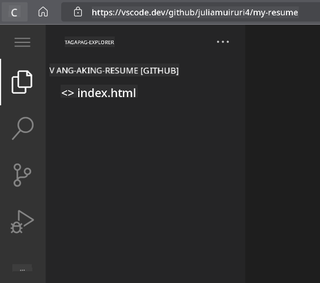
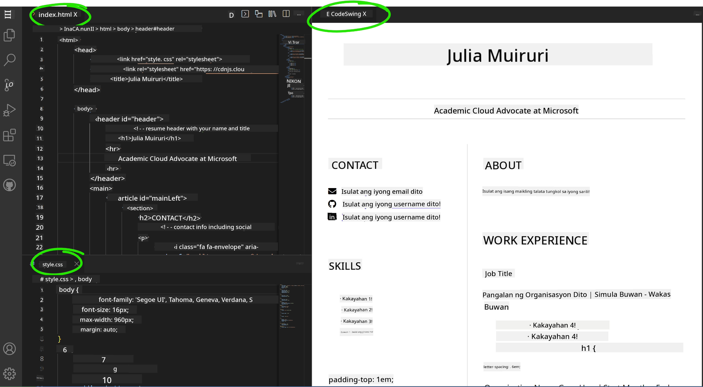

<!--
CO_OP_TRANSLATOR_METADATA:
{
  "original_hash": "bd3aa6d2b879c30ea496c43aec1c49ed",
  "translation_date": "2025-08-28T15:51:51+00:00",
  "source_file": "8-code-editor/1-using-a-code-editor/assignment.md",
  "language_code": "tl"
}
-->
# Gumawa ng Resume-Website gamit ang vscode.dev

_Gaano kaya kaganda kung hihingin ng isang recruiter ang iyong resume at ang ibibigay mo ay isang url?_ 😎

## Mga Layunin

Pagkatapos ng gawaing ito, matututuhan mo kung paano:

- Gumawa ng website para ipakita ang iyong resume

### Mga Kinakailangan

1. Isang GitHub account. Pumunta sa [GitHub](https://github.com/) at gumawa ng account kung wala ka pa.

## Mga Hakbang

**Hakbang 1:** Gumawa ng bagong GitHub Repository at pangalanan itong `my-resume`

**Hakbang 2:** Gumawa ng `index.html` na file sa iyong repository. Magdaragdag tayo ng kahit isang file habang nasa github.com pa dahil hindi mo mabubuksan ang isang walang laman na repository sa vscode.dev.

I-click ang link na `creating a new file`, i-type ang pangalan na `index.html` at piliin ang `Commit new file` na button.


**Hakbang 3:** Buksan ang [VSCode.dev](https://vscode.dev) at piliin ang `Open Remote Repository` na button.

Kopyahin ang url ng repository na kakagawa mo lang para sa iyong resume site at i-paste ito sa input box:

_Palitan ang `your-username` ng iyong GitHub username._

```
https://github.com/your-username/my-resume
```

✅ Kung matagumpay, makikita mo ang iyong proyekto at ang `index.html` na file na nakabukas sa text editor sa browser.



**Hakbang 4:** Buksan ang `index.html` na file, i-paste ang code sa ibaba sa iyong code area at i-save.

<details>
    <summary><b>HTML code na responsable para sa nilalaman ng iyong resume website.</b></summary>
    
        <html>

            <head>
                <link href="style.css" rel="stylesheet">
                <link rel="stylesheet" href="https://cdnjs.cloudflare.com/ajax/libs/font-awesome/5.15.4/css/all.min.css">
                <title>Ilagay ang Iyong Pangalan Dito!</title>
            </head>
            <body>
                <header id="header">
                    <!-- header ng resume na may pangalan at titulo -->
                    <h1>Ilagay ang Iyong Pangalan Dito!</h1>
                    <hr>
                    Ang Iyong Role!
                    <hr>
                </header>
                <main>
                    <article id="mainLeft">
                        <section>
                            <h2>KONTAK</h2>
                            <!-- impormasyon sa kontak kabilang ang social media -->
                            <p>
                                <i class="fa fa-envelope" aria-hidden="true"></i>
                                <a href="mailto:username@domain.top-level domain">Ilagay ang iyong email dito</a>
                            </p>
                            <p>
                                <i class="fab fa-github" aria-hidden="true"></i>
                                <a href="github.com/yourGitHubUsername">Ilagay ang iyong username dito!</a>
                            </p>
                            <p>
                                <i class="fab fa-linkedin" aria-hidden="true"></i>
                                <a href="linkedin.com/yourLinkedInUsername">Ilagay ang iyong username dito!</a>
                            </p>
                        </section>
                        <section>
                            <h2>KAKAYAHAN</h2>
                            <!-- ang iyong mga kakayahan -->
                            <ul>
                                <li>Kakayahan 1!</li>
                                <li>Kakayahan 2!</li>
                                <li>Kakayahan 3!</li>
                                <li>Kakayahan 4!</li>
                            </ul>
                        </section>
                        <section>
                            <h2>EDUKASYON</h2>
                            <!-- ang iyong edukasyon -->
                            <h3>Ilagay ang iyong kurso dito!</h3>
                            <p>
                                Ilagay ang iyong institusyon dito!
                            </p>
                            <p>
                                Simula - Petsa ng Pagtatapos
                            </p>
                        </section>            
                    </article>
                    <article id="mainRight">
                        <section>
                            <h2>TUNGKOL SA AKIN</h2>
                            <!-- tungkol sa iyo -->
                            <p>Ilagay ang maikling impormasyon tungkol sa iyong sarili!</p>
                        </section>
                        <section>
                            <h2>KARANASAN SA TRABAHO</h2>
                            <!-- ang iyong karanasan sa trabaho -->
                            <h3>Posisyon</h3>
                            <p>
                                Pangalan ng Organisasyon | Simula ng Buwan – Pagtatapos ng Buwan
                            </p>
                            <ul>
                                    <li>Gawain 1 - Ilagay ang ginawa mo!</li>
                                    <li>Gawain 2 - Ilagay ang ginawa mo!</li>
                                    <li>Ilagay ang resulta/impact ng iyong kontribusyon</li>
                                    
                            </ul>
                            <h3>Posisyon 2</h3>
                            <p>
                                Pangalan ng Organisasyon | Simula ng Buwan – Pagtatapos ng Buwan
                            </p>
                            <ul>
                                    <li>Gawain 1 - Ilagay ang ginawa mo!</li>
                                    <li>Gawain 2 - Ilagay ang ginawa mo!</li>
                                    <li>Ilagay ang resulta/impact ng iyong kontribusyon</li>
                                    
                            </ul>
                        </section>
                    </article>
                </main>
            </body>
        </html>
</details>

Palitan ang mga _placeholder text_ sa HTML code ng iyong mga detalye sa resume.

**Hakbang 5:** I-hover ang My-Resume folder, i-click ang `New File ...` icon at gumawa ng 2 bagong file sa iyong proyekto: `style.css` at `codeswing.json`.

**Hakbang 6:** Buksan ang `style.css` na file, i-paste ang code sa ibaba at i-save.

<details>
        <summary><b>CSS code para sa layout ng site.</b></summary>
            
            body {
                font-family: 'Segoe UI', Tahoma, Geneva, Verdana, sans-serif;
                font-size: 16px;
                max-width: 960px;
                margin: auto;
            }
            h1 {
                font-size: 3em;
                letter-spacing: .6em;
                padding-top: 1em;
                padding-bottom: 1em;
            }

            h2 {
                font-size: 1.5em;
                padding-bottom: 1em;
            }

            h3 {
                font-size: 1em;
                padding-bottom: 1em;
            }
            main { 
                display: grid;
                grid-template-columns: 40% 60%;
                margin-top: 3em;
            }
            header {
                text-align: center;
                margin: auto 2em;
            }

            section {
                margin: auto 1em 4em 2em;
            }

            i {
                margin-right: .5em;
            }

            p {
                margin: .2em auto
            }

            hr {
                border: none;
                background-color: lightgray;
                height: 1px;
            }

            h1, h2, h3 {
                font-weight: 100;
                margin-bottom: 0;
            }
            #mainLeft {
                border-right: 1px solid lightgray;
            }
            
</details>

**Hakbang 6:** Buksan ang `codeswing.json` na file, i-paste ang code sa ibaba at i-save.

    {
    "scripts": [],
    "styles": []
    }

**Hakbang 7:** I-install ang `Codeswing extension` para makita ang resume website sa code area.

I-click ang _`Extensions`_ icon sa activity bar at i-type ang Codeswing. I-click ang _blue install button_ sa expanded activity bar o gamitin ang install button na lalabas sa code area kapag pinili ang extension. Pagkatapos ma-install, tingnan ang mga pagbabago sa iyong proyekto 😃.


Ganito ang makikita mo sa iyong screen pagkatapos ma-install ang extension.



Kung masaya ka na sa mga pagbabago, i-hover ang `Changes` folder at i-click ang `+` button para i-stage ang mga pagbabago.

Mag-type ng commit message _(Deskripsyon ng mga pagbabago sa proyekto)_ at i-commit ang iyong mga pagbabago sa pamamagitan ng pag-click sa `check`. Kapag tapos na, piliin ang hamburger menu icon sa itaas na kaliwa para bumalik sa repository sa GitHub.

Congratulations 🎉 Nagawa mo na ang iyong resume website gamit ang vscode.dev sa ilang hakbang lang.

## 🚀 Hamon

Buksan ang isang remote repository na may pahintulot kang gumawa ng mga pagbabago at i-update ang ilang file. Susunod, subukang gumawa ng bagong branch gamit ang iyong mga pagbabago at gumawa ng Pull Request.

## Review at Pag-aaral sa Sarili

Magbasa pa tungkol sa [VSCode.dev](https://code.visualstudio.com/docs/editor/vscode-web?WT.mc_id=academic-0000-alfredodeza) at iba pang mga tampok nito.

---

**Paunawa**:  
Ang dokumentong ito ay isinalin gamit ang AI translation service na [Co-op Translator](https://github.com/Azure/co-op-translator). Bagama't sinisikap naming maging tumpak, tandaan na ang mga awtomatikong pagsasalin ay maaaring maglaman ng mga pagkakamali o hindi pagkakatugma. Ang orihinal na dokumento sa kanyang katutubong wika ang dapat ituring na opisyal na sanggunian. Para sa mahalagang impormasyon, inirerekomenda ang propesyonal na pagsasalin ng tao. Hindi kami mananagot sa anumang hindi pagkakaunawaan o maling interpretasyon na maaaring magmula sa paggamit ng pagsasaling ito.