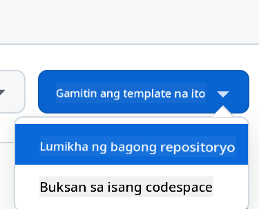
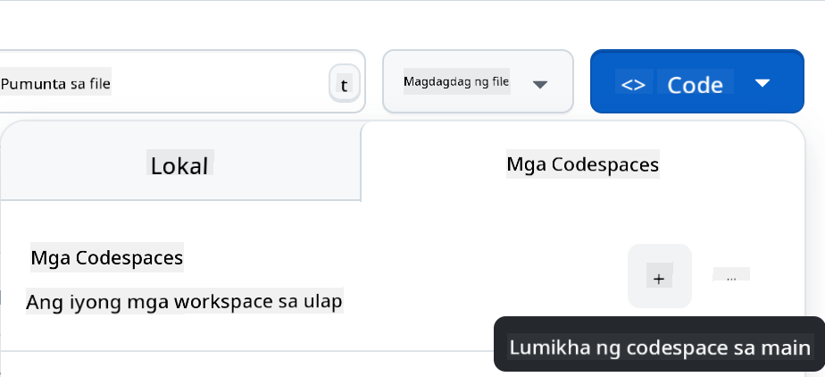

<!--
CO_OP_TRANSLATOR_METADATA:
{
  "original_hash": "002304ffe0059e55b33e2ee5283788ad",
  "translation_date": "2025-09-01T15:35:29+00:00",
  "source_file": "9-chat-project/README.md",
  "language_code": "tl"
}
-->
# Chat project

Ang proyektong ito ay nagpapakita kung paano bumuo ng isang Chat Assistant gamit ang GitHub Models.

Ganito ang magiging hitsura ng natapos na proyekto:

<div>
  
</div>

Kaunting konteksto, ang paggawa ng Chat assistants gamit ang generative AI ay isang mahusay na paraan upang magsimulang matuto tungkol sa AI. Sa araling ito, matututuhan mong isama ang generative AI sa isang web app. Simulan na natin.

## Pagkonekta sa generative AI

Para sa backend, gagamit tayo ng GitHub Models. Isa itong mahusay na serbisyo na nagbibigay-daan sa iyo na gumamit ng AI nang libre. Pumunta sa playground nito at kunin ang code na tumutugma sa napili mong backend na wika. Ganito ang itsura nito sa [GitHub Models Playground](https://github.com/marketplace/models/azure-openai/gpt-4o-mini/playground)

<div>
  
</div>

Tulad ng nabanggit, piliin ang tab na "Code" at ang runtime na gusto mo.

<div>
  
</div>

### Gamit ang Python

Sa kasong ito, pipiliin natin ang Python, kaya't ito ang code na gagamitin:

```python
"""Run this model in Python

> pip install openai
"""
import os
from openai import OpenAI

# To authenticate with the model you will need to generate a personal access token (PAT) in your GitHub settings. 
# Create your PAT token by following instructions here: https://docs.github.com/en/authentication/keeping-your-account-and-data-secure/managing-your-personal-access-tokens
client = OpenAI(
    base_url="https://models.github.ai/inference",
    api_key=os.environ["GITHUB_TOKEN"],
)

response = client.chat.completions.create(
    messages=[
        {
            "role": "system",
            "content": "",
        },
        {
            "role": "user",
            "content": "What is the capital of France?",
        }
    ],
    model="openai/gpt-4o-mini",
    temperature=1,
    max_tokens=4096,
    top_p=1
)

print(response.choices[0].message.content)
```

Linisin natin ang code na ito upang magamit muli:

```python
def call_llm(prompt: str, system_message: str):
    response = client.chat.completions.create(
        messages=[
            {
                "role": "system",
                "content": system_message,
            },
            {
                "role": "user",
                "content": prompt,
            }
        ],
        model="openai/gpt-4o-mini",
        temperature=1,
        max_tokens=4096,
        top_p=1
    )

    return response.choices[0].message.content
```

Sa pamamagitan ng function na `call_llm`, maaari na nating kunin ang isang prompt at isang system prompt, at ang function ay magbabalik ng resulta.

### I-customize ang AI Assistant

Kung nais mong i-customize ang AI assistant, maaari mong tukuyin kung paano ito dapat kumilos sa pamamagitan ng paglalagay ng system prompt tulad nito:

```python
call_llm("Tell me about you", "You're Albert Einstein, you only know of things in the time you were alive")
```

## I-expose ito sa pamamagitan ng Web API

Magaling, tapos na natin ang AI na bahagi. Tingnan natin kung paano natin ito maisasama sa isang Web API. Para sa Web API, gagamit tayo ng Flask, ngunit anumang web framework ay maaaring gamitin. Narito ang code para dito:

### Gamit ang Python

```python
# api.py
from flask import Flask, request, jsonify
from llm import call_llm
from flask_cors import CORS

app = Flask(__name__)
CORS(app)   # *   example.com

@app.route("/", methods=["GET"])
def index():
    return "Welcome to this API. Call POST /hello with 'message': 'my message' as JSON payload"


@app.route("/hello", methods=["POST"])
def hello():
    # get message from request body  { "message": "do this taks for me" }
    data = request.get_json()
    message = data.get("message", "")

    response = call_llm(message, "You are a helpful assistant.")
    return jsonify({
        "response": response
    })

if __name__ == "__main__":
    app.run(host="0.0.0.0", port=5000)
```

Dito, lumikha tayo ng isang Flask API at nagtakda ng default na ruta na "/" at "/chat". Ang huli ay gagamitin ng ating frontend upang maipasa ang mga tanong dito.

Upang maisama ang *llm.py*, narito ang mga hakbang na kailangan gawin:

- I-import ang function na `call_llm`:

   ```python
   from llm import call_llm
   from flask import Flask, request
   ```

- Tawagin ito mula sa ruta na "/chat":

   ```python
   @app.route("/hello", methods=["POST"])
   def hello():
      # get message from request body  { "message": "do this taks for me" }
      data = request.get_json()
      message = data.get("message", "")

      response = call_llm(message, "You are a helpful assistant.")
      return jsonify({
         "response": response
      })
   ```

   Dito, ini-parse natin ang papasok na request upang makuha ang property na `message` mula sa JSON body. Pagkatapos, tatawagin natin ang LLM gamit ang tawag na ito:

   ```python
   response = call_llm(message, "You are a helpful assistant")

   # return the response as JSON
   return jsonify({
      "response": response 
   })
   ```

Magaling, natapos na natin ang kailangan.

## I-configure ang Cors

Dapat nating banggitin na nag-set up tayo ng isang bagay tulad ng CORS, o cross-origin resource sharing. Nangangahulugan ito na dahil ang ating backend at frontend ay tatakbo sa magkaibang ports, kailangan nating payagan ang frontend na tumawag sa backend.

### Gamit ang Python

Narito ang isang piraso ng code sa *api.py* na nagse-set up nito:

```python
from flask_cors import CORS

app = Flask(__name__)
CORS(app)   # *   example.com
```

Sa kasalukuyan, naka-set up ito upang payagan ang "*" o lahat ng origins, ngunit hindi ito ligtas. Dapat natin itong limitahan kapag nasa production na.

## Patakbuhin ang iyong proyekto

Upang patakbuhin ang iyong proyekto, kailangan mong simulan muna ang iyong backend at pagkatapos ang iyong frontend.

### Gamit ang Python

Ok, mayroon tayong *llm.py* at *api.py*. Paano natin ito mapapagana sa backend? Narito ang dalawang hakbang:

- I-install ang mga dependencies:

   ```sh
   cd backend
   python -m venv venv
   source ./venv/bin/activate

   pip install openai flask flask-cors openai
   ```

- Simulan ang API:

   ```sh
   python api.py
   ```

   Kung nasa Codespaces ka, pumunta sa Ports sa ibabang bahagi ng editor, i-right-click ito at i-click ang "Port Visibility" at piliin ang "Public".

### Gumawa ng frontend

Ngayon na may API na tayong tumatakbo, gumawa tayo ng frontend para dito. Isang pinakasimpleng frontend na unti-unti nating pagagandahin. Sa isang *frontend* folder, gumawa ng mga sumusunod:

```text
backend/
frontend/
index.html
app.js
styles.css
```

Simulan natin sa **index.html**:

```html
<html>
    <head>
        <link rel="stylesheet" href="styles.css">
    </head>
    <body>
      <form>
        <textarea id="messages"></textarea>
        <input id="input" type="text" />
        <button type="submit" id="sendBtn">Send</button>  
      </form>  
      <script src="app.js" />
    </body>
</html>    
```

Ang nasa itaas ay ang pinakapayak na kailangan mo upang suportahan ang isang chat window. Binubuo ito ng isang textarea kung saan irerender ang mga mensahe, isang input para sa pag-type ng mensahe, at isang button para ipadala ang iyong mensahe sa backend. Tingnan natin ang JavaScript sa *app.js*.

**app.js**

```js
// app.js

(function(){
  // 1. set up elements  
  const messages = document.getElementById("messages");
  const form = document.getElementById("form");
  const input = document.getElementById("input");

  const BASE_URL = "change this";
  const API_ENDPOINT = `${BASE_URL}/hello`;

  // 2. create a function that talks to our backend
  async function callApi(text) {
    const response = await fetch(API_ENDPOINT, {
      method: "POST",
      headers: { "Content-Type": "application/json" },
      body: JSON.stringify({ message: text })
    });
    let json = await response.json();
    return json.response;
  }

  // 3. add response to our textarea
  function appendMessage(text, role) {
    const el = document.createElement("div");
    el.className = `message ${role}`;
    el.innerHTML = text;
    messages.appendChild(el);
  }

  // 4. listen to submit events
  form.addEventListener("submit", async(e) => {
    e.preventDefault();
   // someone clicked the button in the form
   
   // get input
   const text = input.value.trim();

   appendMessage(text, "user")

   // reset it
   input.value = '';

   const reply = await callApi(text);

   // add to messages
   appendMessage(reply, "assistant");

  })
})();
```

Tingnan natin ang code bawat seksyon:

- 1) Dito, kinukuha natin ang reference sa lahat ng mga elemento na gagamitin natin sa code.
- 2) Sa seksyong ito, lumikha tayo ng function na gumagamit ng built-in na `fetch` method upang tawagin ang ating backend.
- 3) Ang `appendMessage` ay tumutulong magdagdag ng mga sagot pati na rin ang mga mensaheng tina-type ng user.
- 4) Dito, nakikinig tayo sa submit event, binabasa ang input field, inilalagay ang mensahe ng user sa textarea, tinatawag ang API, at irerender ang sagot sa textarea.

Tingnan natin ang styling, narito kung saan maaari kang maging malikhain at gawing ayon sa gusto mo. Narito ang ilang mungkahi:

**styles.css**

```
.message {
    background: #222;
    box-shadow: 0 0 0 10px orange;
    padding: 10px:
    margin: 5px;
}

.message.user {
    background: blue;
}

.message.assistant {
    background: grey;
} 
```

Sa tatlong klase na ito, iba-iba ang istilo ng mga mensahe depende kung galing ito sa assistant o sa user. Kung nais mong ma-inspire, tingnan ang `solution/frontend/styles.css` folder.

### Baguhin ang Base Url

May isang bagay dito na hindi pa natin na-set, at iyon ay ang `BASE_URL`. Hindi ito malalaman hanggang sa magsimula ang iyong backend. Upang i-set ito:

- Kung ang API ay tumatakbo nang lokal, dapat itong i-set sa `http://localhost:5000`.
- Kung tumatakbo sa Codespaces, dapat itong magmukhang "[name]app.github.dev".

## Gawain

Gumawa ng sarili mong folder na *project* na may nilalaman tulad nito:

```text
project/
  frontend/
    index.html
    app.js
    styles.css
  backend/
    ...
```

Kopyahin ang nilalaman mula sa mga itinuro sa itaas ngunit malaya kang i-customize ayon sa gusto mo.

## Solusyon

[Solusyon](./solution/README.md)

## Bonus

Subukang baguhin ang personalidad ng AI assistant.

### Para sa Python

Kapag tinawag mo ang `call_llm` sa *api.py*, maaari mong baguhin ang pangalawang argumento ayon sa gusto mo, halimbawa:

```python
call_llm(message, "You are Captain Picard")
```

### Frontend

Baguhin din ang CSS at teksto ayon sa gusto mo, kaya't gumawa ng mga pagbabago sa *index.html* at *styles.css*.

## Buod

Magaling, natutunan mo mula sa simula kung paano gumawa ng personal assistant gamit ang AI. Ginawa natin ito gamit ang GitHub Models, isang backend sa Python, at isang frontend sa HTML, CSS, at JavaScript.

## I-set up gamit ang Codespaces

- Pumunta sa: [Web Dev For Beginners repo](https://github.com/microsoft/Web-Dev-For-Beginners)
- Gumawa mula sa isang template (siguraduhing naka-log in ka sa GitHub) sa kanang itaas na bahagi:

    

- Kapag nasa iyong repo na, gumawa ng Codespace:

    

    Dapat nitong simulan ang isang environment na maaari mo nang gamitin.

---

**Paunawa**:  
Ang dokumentong ito ay isinalin gamit ang AI translation service na [Co-op Translator](https://github.com/Azure/co-op-translator). Bagama't sinisikap naming maging tumpak, tandaan na ang mga awtomatikong pagsasalin ay maaaring maglaman ng mga pagkakamali o hindi pagkakatugma. Ang orihinal na dokumento sa kanyang katutubong wika ang dapat ituring na opisyal na sanggunian. Para sa mahalagang impormasyon, inirerekomenda ang propesyonal na pagsasalin ng tao. Hindi kami mananagot sa anumang hindi pagkakaunawaan o maling interpretasyon na dulot ng paggamit ng pagsasaling ito.