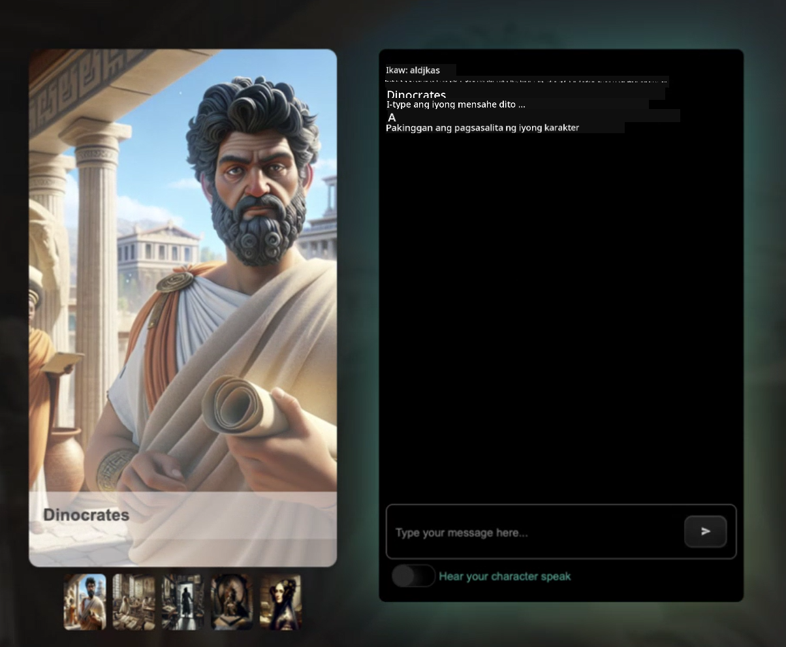

<!--
CO_OP_TRANSLATOR_METADATA:
{
  "original_hash": "efa251c5fc089367f0a81c572874afca",
  "translation_date": "2025-08-28T02:31:38+00:00",
  "source_file": "README.md",
  "language_code": "tl"
}
-->
[](https://github.com/microsoft/Web-Dev-For-Beginners/blob/master/LICENSE)  
[](https://GitHub.com/microsoft/Web-Dev-For-Beginners/graphs/contributors/)  
[](https://GitHub.com/microsoft/Web-Dev-For-Beginners/issues/)  
[](https://GitHub.com/microsoft/Web-Dev-For-Beginners/pulls/)  
[](http://makeapullrequest.com)  

[](https://GitHub.com/microsoft/Web-Dev-For-Beginners/watchers/)  
[](https://GitHub.com/microsoft/Web-Dev-For-Beginners/network/)  
[](https://GitHub.com/microsoft/Web-Dev-For-Beginners/stargazers/)  

[](https://discord.gg/zxKYvhSnVp?WT.mc_id=academic-000002-leestott)  

[](https://open.vscode.dev/microsoft/Web-Dev-For-Beginners)  

[](https://discord.com/invite/ByRwuEEgH4)  

Sundin ang mga hakbang na ito upang makapagsimula sa paggamit ng mga resources na ito:  
1. **I-Fork ang Repository**: I-click ang [](https://GitHub.com/microsoft/Web-Dev-For-Beginners/fork)  
2. **I-Clone ang Repository**:   `git clone https://github.com/microsoft/Web-Dev-For-Beginners.git`  
3. [**Sumali sa Azure AI Foundry Discord at makipagkilala sa mga eksperto at kapwa developer**](https://discord.com/invite/ByRwuEEgH4)  

# Web Development para sa mga Baguhan - Isang Kurikulum  

Matutunan ang mga pangunahing kaalaman sa web development gamit ang aming 12-linggong komprehensibong kurso mula sa Microsoft Cloud Advocates. Ang bawat isa sa 24 na aralin ay sumasaklaw sa JavaScript, CSS, at HTML sa pamamagitan ng mga hands-on na proyekto tulad ng terrariums, browser extensions, at space games. Makilahok sa mga pagsusulit, talakayan, at praktikal na gawain. Paunlarin ang iyong kakayahan at pagbutihin ang iyong kaalaman gamit ang aming epektibong project-based na pamamaraan. Simulan ang iyong coding journey ngayon!  

#### 🧑‍🎓 _Estudyante ka ba?_  

Bisitahin ang [**Student Hub page**](https://docs.microsoft.com/learn/student-hub/?WT.mc_id=academic-77807-sagibbon) kung saan makakahanap ka ng mga resources para sa mga baguhan, Student packs, at maging mga paraan upang makakuha ng libreng certificate voucher. Ito ang pahinang dapat mong i-bookmark at balikan paminsan-minsan dahil pinapalitan namin ang nilalaman buwan-buwan.  

### 📣 Anunsyo - _Bagong Kurikulum_ sa Generative AI para sa JavaScript ay inilabas na  

Huwag palampasin ang aming bagong Generative AI kurikulum!  

Bisitahin ang [https://aka.ms/genai-js-course](https://aka.ms/genai-js-course) upang makapagsimula!  

  

- Mga aralin na sumasaklaw mula sa mga pangunahing kaalaman hanggang sa RAG.  
- Makipag-ugnayan sa mga makasaysayang karakter gamit ang GenAI at ang aming companion app.  
- Masaya at nakaka-engganyong kwento, maglalakbay ka sa panahon!  

  

Ang bawat aralin ay may kasamang assignment na dapat tapusin, isang knowledge check, at isang hamon upang gabayan ka sa pag-aaral ng mga paksa tulad ng:  
- Prompting at prompt engineering  
- Paggawa ng text at image apps  
- Search apps  

Bisitahin ang [https://aka.ms/genai-js-course](../../[https:/aka.ms/genai-js-course) upang makapagsimula!  

## 🌱 Pagsisimula  

> **Mga Guro**, nagdagdag kami ng [ilang mungkahi](for-teachers.md) kung paano gamitin ang kurikulum na ito. Gusto naming marinig ang inyong feedback [sa aming discussion forum](https://github.com/microsoft/Web-Dev-For-Beginners/discussions/categories/teacher-corner)!  

**[Mga Mag-aaral](https://aka.ms/student-page/?WT.mc_id=academic-77807-sagibbon)**, para sa bawat aralin, magsimula sa pre-lecture quiz at sundan ito sa pagbabasa ng lecture material, pagsasagawa ng iba't ibang aktibidad, at suriin ang inyong kaalaman gamit ang post-lecture quiz.  

Upang mapahusay ang inyong karanasan sa pag-aaral, makipag-ugnayan sa inyong mga kapwa mag-aaral upang magtulungan sa mga proyekto! Ang mga talakayan ay hinihikayat sa aming [discussion forum](https://github.com/microsoft/Web-Dev-For-Beginners/discussions) kung saan ang aming team ng mga moderator ay handang sagutin ang inyong mga tanong.  

Upang higit pang mapalawak ang inyong kaalaman, lubos naming inirerekomenda ang pag-explore sa [Microsoft Learn](https://learn.microsoft.com/users/wirelesslife/collections/p1ddcy5jwy0jkm?WT.mc_id=academic-77807-sagibbon) para sa karagdagang mga materyales sa pag-aaral.  

### 📋 Pagsasaayos ng iyong environment  

Ang kurikulum na ito ay may handang development environment! Habang nagsisimula ka, maaari mong piliin na patakbuhin ang kurikulum sa isang [Codespace](https://github.com/features/codespaces/) (_isang browser-based, walang kailangang i-install na environment_), o lokal sa iyong computer gamit ang isang text editor tulad ng [Visual Studio Code](https://code.visualstudio.com/?WT.mc_id=academic-77807-sagibbon).  

#### Gumawa ng iyong repository  
Upang madali mong mai-save ang iyong trabaho, inirerekomenda na gumawa ka ng sariling kopya ng repository na ito. Magagawa mo ito sa pamamagitan ng pag-click sa **Use this template** na button sa itaas ng pahina. Ito ay lilikha ng bagong repository sa iyong GitHub account na may kopya ng kurikulum.  

Sundin ang mga hakbang na ito:  
1. **I-Fork ang Repository**: I-click ang "Fork" button sa kanang-itaas na bahagi ng pahinang ito.  
2. **I-Clone ang Repository**:   `git clone https://github.com/microsoft/Web-Dev-For-Beginners.git`  

#### Pagpapatakbo ng kurikulum sa isang Codespace  

Sa iyong kopya ng repository na iyong ginawa, i-click ang **Code** button at piliin ang **Open with Codespaces**. Ito ay lilikha ng bagong Codespace para sa iyo upang magtrabaho.  

[!Codespace](../..)./images/createcodespace.png)  

#### Pagpapatakbo ng kurikulum lokal sa iyong computer  

Upang patakbuhin ang kurikulum na ito lokal sa iyong computer, kakailanganin mo ng text editor, browser, at command line tool. Ang aming unang aralin, [Introduction to Programming Languages and Tools of the Trade](../../1-getting-started-lessons/1-intro-to-programming-languages), ay magpapaliwanag ng iba't ibang opsyon para sa bawat isa sa mga tool na ito upang makapili ka ng angkop para sa iyo.  

Ang aming rekomendasyon ay gamitin ang [Visual Studio Code](https://code.visualstudio.com/?WT.mc_id=academic-77807-sagibbon) bilang iyong editor, na mayroon ding built-in na [Terminal](https://code.visualstudio.com/docs/terminal/basics/?WT.mc_id=academic-77807-sagibbon). Maaari mong i-download ang Visual Studio Code [dito](https://code.visualstudio.com/?WT.mc_id=academic-77807-sagibbon).  

1. I-clone ang iyong repository sa iyong computer. Magagawa mo ito sa pamamagitan ng pag-click sa **Code** button at pagkopya ng URL:  

    [!CodeSpace](./images/createcodespace.png)  

    Pagkatapos, buksan ang [Terminal](https://code.visualstudio.com/docs/terminal/basics/?WT.mc_id=academic-77807-sagibbon) sa loob ng [Visual Studio Code](https://code.visualstudio.com/?WT.mc_id=academic-77807-sagibbon) at patakbuhin ang sumusunod na command, palitan ang `<your-repository-url>` ng URL na iyong kinopya:  

    ```bash 
    git clone <your-repository-url>
    ```  

2. Buksan ang folder sa Visual Studio Code. Magagawa mo ito sa pamamagitan ng pag-click sa **File** > **Open Folder** at piliin ang folder na iyong na-clone.  

>  Mga inirerekomendang Visual Studio Code extensions:  
>  
> * [Live Server](https://marketplace.visualstudio.com/items?itemName=ritwickdey.LiveServer&WT.mc_id=academic-77807-sagibbon) - upang ma-preview ang mga HTML pages sa loob ng Visual Studio Code  
> * [Copilot](https://marketplace.visualstudio.com/items?itemName=GitHub.copilot&WT.mc_id=academic-77807-sagibbon) - upang matulungan kang magsulat ng code nang mas mabilis  

## 📂 Ang bawat aralin ay naglalaman ng:  

- opsyonal na sketchnote  
- opsyonal na supplemental video  
- pre-lesson warmup quiz  
- nakasulat na aralin  
- para sa mga project-based na aralin, step-by-step na gabay kung paano buuin ang proyekto  
- knowledge checks  
- isang hamon  
- supplemental reading  
- assignment  
- [post-lesson quiz](https://ff-quizzes.netlify.app/)  

> **Tungkol sa mga pagsusulit**: Ang lahat ng pagsusulit ay nasa Quiz-app folder, kabuuang 48 na pagsusulit na may tig-tatlong tanong bawat isa. Available ang mga ito [dito](https://ff-quizzes.netlify.app/) at maaaring patakbuhin ang quiz app lokal o i-deploy sa Azure; sundin ang mga tagubilin sa `quiz-app` folder.  

## 🗃️ Mga Aralin  

|     |                       Pangalan ng Proyekto                       |                            Mga Konseptong Itinuturo                             | Mga Layunin sa Pagkatuto                                                                                                                 |                                                         Nakakonektang Aralin                                                          |         May-akda          |  
| :-: | :------------------------------------------------------: | :--------------------------------------------------------------------: | ----------------------------------------------------------------------------------------------------------------------------------- | :----------------------------------------------------------------------------------------------------------------------------: | :---------------------: |  
| 01  |                     Pagsisimula                      |           Panimula sa Programming at Mga Tools na Ginagamit           | Matutunan ang mga pangunahing kaalaman sa likod ng karamihan sa mga programming language at tungkol sa software na tumutulong sa mga propesyonal na developer sa kanilang trabaho | [Panimula sa Programming Languages at Tools of the Trade](./1-getting-started-lessons/1-intro-to-programming-languages/README.md) |         Jasmine         |  
| 02  |                     Pagsisimula                      |             Mga Pangunahing Kaalaman sa GitHub, kabilang ang pagtatrabaho bilang isang team             | Paano gamitin ang GitHub sa iyong proyekto, paano makipagtulungan sa iba sa isang code base                                                    |                            [Panimula sa GitHub](./1-getting-started-lessons/2-github-basics/README.md)                             |          Floor          |  
| 03  |                     Pagsisimula                      |                             Accessibility                              | Matutunan ang mga pangunahing kaalaman sa web accessibility                                                                                               |                       [Mga Pangunahing Kaalaman sa Accessibility](./1-getting-started-lessons/3-accessibility/README.md)                       |       Christopher       |  
| 04  |                        JS Basics                         |                         Mga Uri ng Data sa JavaScript                          | Ang mga pangunahing kaalaman sa mga uri ng data sa JavaScript                                                                                                 |                                       [Mga Uri ng Data](./2-js-basics/1-data-types/README.md)                                        |         Jasmine         |  
| 05  |                        JS Basics                         |                         Mga Function at Method                          | Matutunan ang tungkol sa mga function at method upang pamahalaan ang daloy ng logic ng isang application                                                             |                              [Mga Function at Method](./2-js-basics/2-functions-methods/README.md)                               | Jasmine at Christopher |  
| 06  |                        JS Basics                         |                        Paggawa ng Desisyon gamit ang JS                        | Matutunan kung paano gumawa ng mga kondisyon sa iyong code gamit ang mga paraan ng paggawa ng desisyon                                                           |                                 [Paggawa ng Desisyon](./2-js-basics/3-making-decisions/README.md)                                  |         Jasmine         |  
| 07  |                        JS Basics                         |                            Mga Array at Loop                            | Paggamit ng data gamit ang mga array at loop sa JavaScript                                                                                 |                                   [Mga Array at Loop](./2-js-basics/4-arrays-loops/README.md)                                    |         Jasmine         |  
| 08  |       [Terrarium](./3-terrarium/solution/README.md)       |                            HTML sa Praktika                            | Buuin ang HTML upang lumikha ng isang online terrarium, na nakatuon sa paggawa ng layout                                                         |                                 [Panimula sa HTML](./3-terrarium/1-intro-to-html/README.md)                                 |           Jen           |  
| 09  |       [Terrarium](./3-terrarium/solution/README.md)       |                            CSS sa Praktika                             | Buuin ang CSS upang i-style ang online terrarium, na nakatuon sa mga pangunahing kaalaman sa CSS kabilang ang paggawa ng page na responsive                     |                                  [Panimula sa CSS](./3-terrarium/2-intro-to-css/README.md)                                  |           Jen           |  
| 10  |            [Terrarium](./3-terrarium/solution/README.md)            |                 JavaScript Closures, DOM manipulation                  | Gumawa ng JavaScript upang magamit ang terrarium bilang isang drag/drop interface, na nakatuon sa closures at DOM manipulation       |                  [JavaScript Closures, DOM manipulation](./3-terrarium/3-intro-to-DOM-and-closures/README.md)                   |           Jen           |
| 11  |          [Typing Game](./4-typing-game/solution/README.md)          |                          Gumawa ng Typing Game                         | Matutunan kung paano gamitin ang keyboard events upang magmaneho ng lohika ng iyong JavaScript app                                  |                                [Event-Driven Programming](./4-typing-game/typing-game/README.md)                                |       Christopher       |
| 12  | [Green Browser Extension](./5-browser-extension/solution/README.md) |                         Paggamit ng Mga Browser                        | Matutunan kung paano gumagana ang mga browser, ang kanilang kasaysayan, at kung paano magsimula ng mga unang elemento ng browser extension |                               [About Browsers](./5-browser-extension/1-about-browsers/README.md)                                |           Jen           |
| 13  | [Green Browser Extension](./5-browser-extension/solution/README.md) | Pagbuo ng form, pagtawag sa API, at pag-iimbak ng mga variable sa local storage | Gumawa ng mga elemento ng JavaScript ng iyong browser extension upang tumawag sa API gamit ang mga variable na nakaimbak sa local storage |                [APIs, Forms, and Local Storage](./5-browser-extension/2-forms-browsers-local-storage/README.md)                 |           Jen           |
| 14  | [Green Browser Extension](./5-browser-extension/solution/README.md) |          Mga background process sa browser, web performance            | Gamitin ang mga background process ng browser upang pamahalaan ang icon ng extension; matutunan ang tungkol sa web performance at ilang mga optimization |             [Background Tasks and Performance](./5-browser-extension/3-background-tasks-and-performance/README.md)              |           Jen           |
| 15  |           [Space Game](./6-space-game/solution/README.md)           |             Mas Advanced na Game Development gamit ang JavaScript      | Matutunan ang tungkol sa Inheritance gamit ang parehong Classes at Composition at ang Pub/Sub pattern bilang paghahanda sa paggawa ng laro |                      [Introduction to Advanced Game Development](./6-space-game/1-introduction/README.md)                       |          Chris          |
| 16  |           [Space Game](./6-space-game/solution/README.md)           |                           Pag-drawing sa canvas                        | Matutunan ang Canvas API, na ginagamit upang mag-drawing ng mga elemento sa screen                                                  |                                [Drawing to Canvas](./6-space-game/2-drawing-to-canvas/README.md)                                |          Chris          |
| 17  |           [Space Game](./6-space-game/solution/README.md)           |                   Paggalaw ng mga elemento sa screen                   | Tuklasin kung paano magkakaroon ng galaw ang mga elemento gamit ang cartesian coordinates at ang Canvas API                        |                           [Moving Elements Around](./6-space-game/3-moving-elements-around/README.md)                           |          Chris          |
| 18  |           [Space Game](./6-space-game/solution/README.md)           |                          Pagtukoy ng banggaan                          | Gawing magbanggaan at mag-react ang mga elemento sa isa't isa gamit ang keypresses at magbigay ng cooldown function para sa performance ng laro |                              [Collision Detection](./6-space-game/4-collision-detection/README.md)                              |          Chris          |
| 19  |           [Space Game](./6-space-game/solution/README.md)           |                             Pagkuha ng score                           | Gumawa ng mga kalkulasyon batay sa status at performance ng laro                                                                     |                                    [Keeping Score](./6-space-game/5-keeping-score/README.md)                                    |          Chris          |
| 20  |           [Space Game](./6-space-game/solution/README.md)           |                     Pagtatapos at pag-restart ng laro                  | Matutunan kung paano tapusin at i-restart ang laro, kabilang ang paglilinis ng mga assets at pag-reset ng mga halaga ng variable     |                                [The Ending Condition](./6-space-game/6-end-condition/README.md)                                 |          Chris          |
| 21  |         [Banking App](./7-bank-project/solution/README.md)          |                 HTML Templates at Routes sa Web App                    | Matutunan kung paano gumawa ng scaffold ng multipage website architecture gamit ang routing at HTML templates                       |                            [HTML Templates and Routes](./7-bank-project/1-template-route/README.md)                             |          Yohan          |
| 22  |         [Banking App](./7-bank-project/solution/README.md)          |                  Gumawa ng Login at Registration Form                  | Matutunan ang paggawa ng mga form at paghawak ng mga validation routine                                                             |                                           [Forms](./7-bank-project/2-forms/README.md)                                           |          Yohan          |
| 23  |         [Banking App](./7-bank-project/solution/README.md)          |                   Mga Paraan ng Pagkuha at Paggamit ng Data            | Paano dumadaloy ang data papasok at palabas ng iyong app, kung paano ito kunin, iimbak, at itapon                                   |                                            [Data](./7-bank-project/3-data/README.md)                                            |          Yohan          |
| 24  |         [Banking App](./7-bank-project/solution/README.md)          |                      Mga Konsepto ng State Management                  | Matutunan kung paano pinapanatili ng iyong app ang estado at kung paano ito pamahalaan sa programatikong paraan                     |                                [State Management](./7-bank-project/4-state-management/README.md)                                |          Yohan          |


## 🏫 Pedagohiya

Ang aming kurikulum ay idinisenyo gamit ang dalawang pangunahing prinsipyo ng pedagohiya:
* project-based learning
* madalas na pagsusulit

Itinuturo ng programa ang mga pundasyon ng JavaScript, HTML, at CSS, pati na rin ang mga pinakabagong tools at teknik na ginagamit ng mga web developer ngayon. Magkakaroon ng pagkakataon ang mga mag-aaral na magkaroon ng praktikal na karanasan sa pamamagitan ng paggawa ng typing game, virtual terrarium, eco-friendly browser extension, space-invader-style na laro, at banking app para sa mga negosyo. Sa pagtatapos ng serye, magkakaroon ang mga mag-aaral ng matibay na kaalaman sa web development.

> 🎓 Maaari mong kunin ang ilang unang mga aralin sa kurikulum na ito bilang isang [Learn Path](https://docs.microsoft.com/learn/paths/web-development-101/?WT.mc_id=academic-77807-sagibbon) sa Microsoft Learn!

Sa pamamagitan ng pagtiyak na ang nilalaman ay nakaayon sa mga proyekto, nagiging mas nakakaengganyo ang proseso para sa mga mag-aaral at mas tumatatak ang mga konsepto. Nagsulat din kami ng ilang panimulang aralin sa mga batayan ng JavaScript upang ipakilala ang mga konsepto, na ipinares sa isang video mula sa "[Beginners Series to: JavaScript](https://channel9.msdn.com/Series/Beginners-Series-to-JavaScript/?WT.mc_id=academic-77807-sagibbon)" na koleksyon ng mga video tutorial, na ang ilan sa mga may-akda ay nag-ambag sa kurikulum na ito.

Bukod dito, ang isang mababang-panganib na pagsusulit bago ang klase ay nagtatakda ng intensyon ng mag-aaral patungo sa pag-aaral ng isang paksa, habang ang pangalawang pagsusulit pagkatapos ng klase ay nagtitiyak ng karagdagang pagkatuto. Ang kurikulum na ito ay idinisenyo upang maging flexible at masaya at maaaring kunin nang buo o bahagi lamang. Ang mga proyekto ay nagsisimula sa maliit at nagiging mas kumplikado sa pagtatapos ng 12-linggong cycle.

Habang sinadya naming iwasan ang pagpapakilala ng mga JavaScript framework upang magtuon sa mga pangunahing kasanayan na kinakailangan bilang isang web developer bago gumamit ng framework, isang magandang susunod na hakbang pagkatapos makumpleto ang kurikulum na ito ay ang pag-aaral tungkol sa Node.js sa pamamagitan ng isa pang koleksyon ng mga video: "[Beginner Series to: Node.js](https://channel9.msdn.com/Series/Beginners-Series-to-Nodejs/?WT.mc_id=academic-77807-sagibbon)".

> Bisitahin ang aming [Code of Conduct](CODE_OF_CONDUCT.md) at [Contributing](CONTRIBUTING.md) na mga alituntunin. Malugod naming tinatanggap ang inyong mga konstruktibong puna!


## 🧭 Offline na access

Maaari mong patakbuhin ang dokumentasyong ito offline gamit ang [Docsify](https://docsify.js.org/#/). I-fork ang repo na ito, [i-install ang Docsify](https://docsify.js.org/#/quickstart) sa iyong lokal na makina, at pagkatapos sa root folder ng repo na ito, i-type ang `docsify serve`. Ang website ay magsisilbi sa port 3000 sa iyong localhost: `localhost:3000`.

## 📘 PDF

Makikita ang PDF ng lahat ng mga aralin [dito](https://microsoft.github.io/Web-Dev-For-Beginners/pdf/readme.pdf).


## 🎒 Iba Pang Kurso

Ang aming koponan ay gumagawa ng iba pang mga kurso! Tingnan ang:

- [Generative AI for Beginners](https://aka.ms/genai-beginners)
- [Generative AI for Beginners .NET](https://github.com/microsoft/Generative-AI-for-beginners-dotnet)
- [Generative AI with JavaScript](https://github.com/microsoft/generative-ai-with-javascript)
- [Generative AI with Java](https://github.com/microsoft/Generative-AI-for-beginners-java)
- [AI for Beginners](https://aka.ms/ai-beginners)
- [Data Science for Beginners](https://aka.ms/datascience-beginners)
- [ML for Beginners](https://aka.ms/ml-beginners)
- [Cybersecurity for Beginners](https://github.com/microsoft/Security-101)
- [Web Dev for Beginners](https://aka.ms/webdev-beginners)
- [IoT for Beginners](https://aka.ms/iot-beginners)
- [XR Development for Beginners](https://github.com/microsoft/xr-development-for-beginners)
- [Mastering GitHub Copilot for Agentic use](https://github.com/microsoft/Mastering-GitHub-Copilot-for-Paired-Programming)
- [Mastering GitHub Copilot for C#/.NET Developers](https://github.com/microsoft/mastering-github-copilot-for-dotnet-csharp-developers)
- [Choose Your Own Copilot Adventure](https://github.com/microsoft/CopilotAdventures)

## Lisensya

Ang repository na ito ay lisensyado sa ilalim ng MIT license. Tingnan ang [LICENSE](../../LICENSE) file para sa karagdagang impormasyon.

---

**Paunawa**:  
Ang dokumentong ito ay isinalin gamit ang AI translation service na [Co-op Translator](https://github.com/Azure/co-op-translator). Bagama't sinisikap naming maging tumpak, tandaan na ang mga awtomatikong pagsasalin ay maaaring maglaman ng mga pagkakamali o hindi pagkakatugma. Ang orihinal na dokumento sa kanyang katutubong wika ang dapat ituring na opisyal na sanggunian. Para sa mahalagang impormasyon, inirerekomenda ang propesyonal na pagsasalin ng tao. Hindi kami mananagot sa anumang hindi pagkakaunawaan o maling interpretasyon na dulot ng paggamit ng pagsasaling ito.