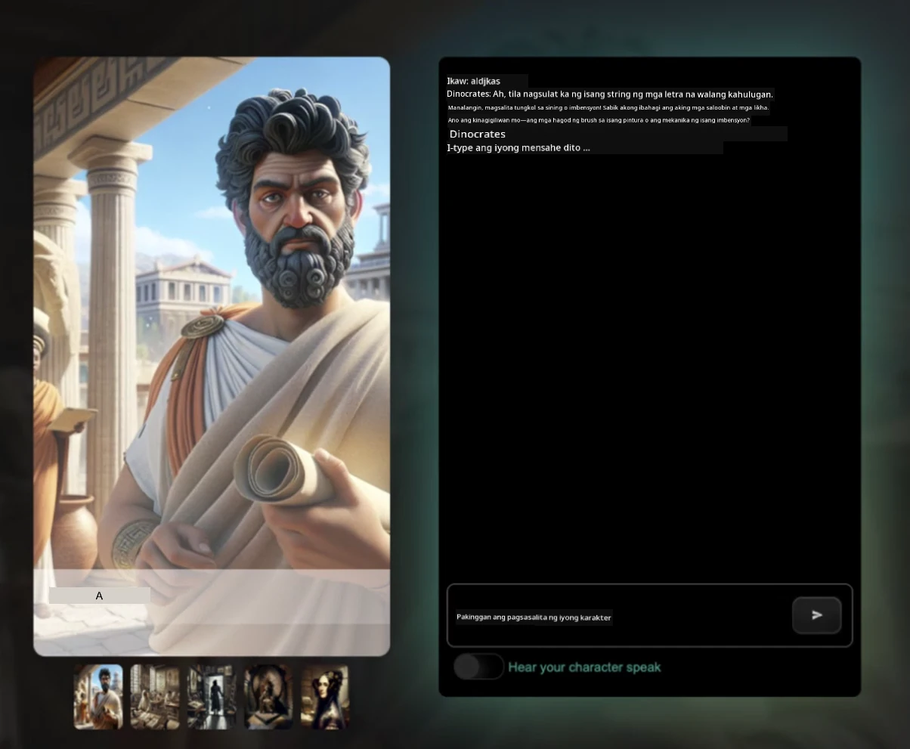
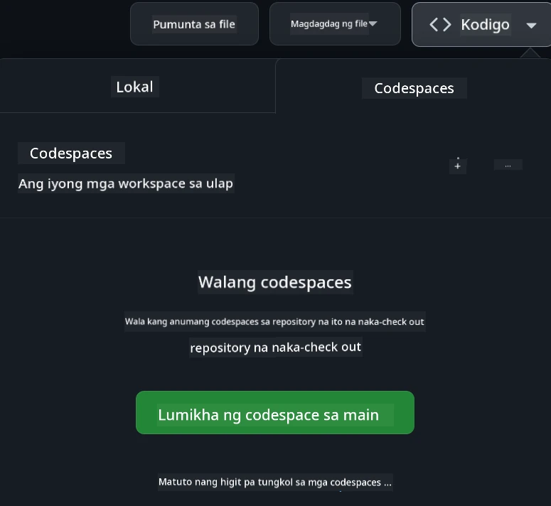

[](https://github.com/microsoft/Web-Dev-For-Beginners/blob/master/LICENSE)
[](https://GitHub.com/microsoft/Web-Dev-For-Beginners/graphs/contributors/)
[](https://GitHub.com/microsoft/Web-Dev-For-Beginners/issues/)
[](https://GitHub.com/microsoft/Web-Dev-For-Beginners/pulls/)
[](http://makeapullrequest.com)

[](https://GitHub.com/microsoft/Web-Dev-For-Beginners/watchers/)
[](https://GitHub.com/microsoft/Web-Dev-For-Beginners/network/)
[](https://GitHub.com/microsoft/Web-Dev-For-Beginners/stargazers/)

[](https://discord.gg/nTYy5BXMWG)

# Web Development para sa mga Nagsisimula - Isang Kurikulum

Alamin ang mga pangunahing kaalaman sa web development gamit ang aming 12-linggong komprehensibong kurso mula sa Microsoft Cloud Advocates. Bawat isa sa 24 na aralin ay sumisid sa JavaScript, CSS, at HTML sa pamamagitan ng mga hands-on na proyekto tulad ng mga terrarium, browser extension, at mga space game. Makilahok sa mga pagsusulit, talakayan, at praktikal na mga gawain. Palawakin ang iyong kasanayan at paghusayin ang iyong kaalaman gamit ang epektibong pedagogiya namin na batay sa proyekto. Simulan ang iyong paglalakbay sa coding ngayon!

Sumali sa Azure AI Foundry Discord Community

[](https://discord.gg/nTYy5BXMWG)

Sundin ang mga hakbang na ito para makapagsimula gamit ang mga resources na ito:
1. **I-Fork ang Repository**: I-click ang [](https://GitHub.com/microsoft/Web-Dev-For-Beginners/fork)
2. **I-Clone ang Repository**:   `git clone https://github.com/microsoft/Web-Dev-For-Beginners.git`
3. [**Sumali sa Azure AI Foundry Discord at makilala ang mga eksperto at ibang mga developer**](https://discord.com/invite/ByRwuEEgH4)

### 🌐 Suporta para sa Maramihang Wika

#### Sinusuportahan sa pamamagitan ng GitHub Action (Awtomatiko at Palaging Napapanahon)

<!-- CO-OP TRANSLATOR LANGUAGES TABLE START -->
[Arabic](../ar/README.md) | [Bengali](../bn/README.md) | [Bulgarian](../bg/README.md) | [Burmese (Myanmar)](../my/README.md) | [Chinese (Simplified)](../zh-CN/README.md) | [Chinese (Traditional, Hong Kong)](../zh-HK/README.md) | [Chinese (Traditional, Macau)](../zh-MO/README.md) | [Chinese (Traditional, Taiwan)](../zh-TW/README.md) | [Croatian](../hr/README.md) | [Czech](../cs/README.md) | [Danish](../da/README.md) | [Dutch](../nl/README.md) | [Estonian](../et/README.md) | [Finnish](../fi/README.md) | [French](../fr/README.md) | [German](../de/README.md) | [Greek](../el/README.md) | [Hebrew](../he/README.md) | [Hindi](../hi/README.md) | [Hungarian](../hu/README.md) | [Indonesian](../id/README.md) | [Italian](../it/README.md) | [Japanese](../ja/README.md) | [Kannada](../kn/README.md) | [Korean](../ko/README.md) | [Lithuanian](../lt/README.md) | [Malay](../ms/README.md) | [Malayalam](../ml/README.md) | [Marathi](../mr/README.md) | [Nepali](../ne/README.md) | [Nigerian Pidgin](../pcm/README.md) | [Norwegian](../no/README.md) | [Persian (Farsi)](../fa/README.md) | [Polish](../pl/README.md) | [Portuguese (Brazil)](../pt-BR/README.md) | [Portuguese (Portugal)](../pt-PT/README.md) | [Punjabi (Gurmukhi)](../pa/README.md) | [Romanian](../ro/README.md) | [Russian](../ru/README.md) | [Serbian (Cyrillic)](../sr/README.md) | [Slovak](../sk/README.md) | [Slovenian](../sl/README.md) | [Spanish](../es/README.md) | [Swahili](../sw/README.md) | [Swedish](../sv/README.md) | [Tagalog (Filipino)](./README.md) | [Tamil](../ta/README.md) | [Telugu](../te/README.md) | [Thai](../th/README.md) | [Turkish](../tr/README.md) | [Ukrainian](../uk/README.md) | [Urdu](../ur/README.md) | [Vietnamese](../vi/README.md)

> **Mas gusto mo bang I-clone ito nang Lokal?**

> Kasama sa repository na ito ang 50+ na mga pagsasalin sa wika na malaki ang dagdag sa laki ng pag-download. Para i-clone nang walang mga pagsasalin, gamitin ang sparse checkout:
> ```bash
> git clone --filter=blob:none --sparse https://github.com/microsoft/Web-Dev-For-Beginners.git
> cd Web-Dev-For-Beginners
> git sparse-checkout set --no-cone '/*' '!translations' '!translated_images'
> ```
> Bibigyan ka nito ng lahat ng kailangan mo para matapos ang kurso nang mas mabilis ang pag-download.
<!-- CO-OP TRANSLATOR LANGUAGES TABLE END -->

**Kung nais mo ng karagdagang suportadong mga wika ng pagsasalin ay nakalistang [dito](https://github.com/Azure/co-op-translator/blob/main/getting_started/supported-languages.md)**

[](https://open.vscode.dev/microsoft/Web-Dev-For-Beginners)

#### 🧑‍🎓 _Estudyante ka ba?_

Bisitahin ang [**Student Hub page**](https://docs.microsoft.com/learn/student-hub/?WT.mc_id=academic-77807-sagibbon) kung saan makakakita ka ng mga panimulang resources, Student packs at maging mga paraan para makakuha ng libreng voucher para sa sertipiko. Ito ang pahinang gusto mong i-bookmark at tingnan paminsan-minsan habang nagpapalit kami ng nilalaman buwan-buwan.

### 📣 Anunsyo - Mga bagong hamon sa GitHub Copilot Agent mode na kailangang tapusin!

May bagong Hamon na idinagdag, hanapin ang "GitHub Copilot Agent Challenge 🚀" sa karamihan ng mga kabanata. Isang bagong hamon para sa iyo na gamitin ang GitHub Copilot at Agent mode. Kung hindi mo pa nagagamit ang Agent mode, kaya nitong hindi lamang gumawa ng teksto kundi pati na maglikha at mag-edit ng mga file, magpatakbo ng mga utos, at marami pa.

### 📣 Anunsyo - _Bagong Proyekto na gagawin gamit ang Generative AI_ 

Bagong AI Assistant na proyekto lang ang idinagdag, tingnan ito [project](./9-chat-project/README.md)

### 📣 Anunsyo - _Bagong Kurikulum_ sa Generative AI para sa JavaScript ay inilabas na

Huwag palampasin ang aming bagong Generative AI curriculum!

Bisitahin ang [https://aka.ms/genai-js-course](https://aka.ms/genai-js-course) para makapagsimula!


- Mga aralin na sumasaklaw mula sa mga batayan hanggang RAG.
- Makipag-ugnayan sa mga historikal na karakter gamit ang GenAI at aming kasamang app.
- Masaya at nakaka-enganyong kuwento, ikaw ay maglalakbay sa panahon!




Bawat aralin ay may kasamang takdang-aralin, pagsusulit sa kaalaman at hamon upang gabayan ka sa pag-aaral ng mga paksa gaya ng:
- Prompting at prompt engineering
- Pagbuo ng text at image app
- Mga search app

Bisitahin ang [https://aka.ms/genai-js-course](../../[https:/aka.ms/genai-js-course) para makapagsimula!


## 🌱 Pagsisimula

> **Mga Guro**, nagbigay kami ng [ilang mga mungkahi](for-teachers.md) kung paano gamitin ang kurikulum na ito. Masaya kaming tanggapin ang inyong puna [sa aming discussion forum](https://github.com/microsoft/Web-Dev-For-Beginners/discussions/categories/teacher-corner)!

**[Mga Nag-aaral](https://aka.ms/student-page/?WT.mc_id=academic-77807-sagibbon)**, sa bawat aralin, magsimula sa isang pre-lecture quiz at sundan ito sa pagbasa ng materyal sa lektura, pagtapos sa iba't ibang gawain at pag-check ng iyong pagkaunawa gamit ang post-lecture quiz.

Para mapabuti ang iyong karanasan sa pag-aaral, kumonekta sa iyong mga kapwa nag-aaral upang magtulungan sa mga proyekto! Hinihikayat ang mga talakayan sa aming [discussion forum](https://github.com/microsoft/Web-Dev-For-Beginners/discussions) kung saan ang aming mga moderator ay handang sumagot sa iyong mga tanong.

Para lalong mapalawak ang iyong edukasyon, lubos naming inirerekomenda ang pag-explore sa [Microsoft Learn](https://learn.microsoft.com/users/wirelesslife/collections/p1ddcy5jwy0jkm?WT.mc_id=academic-77807-sagibbon) para sa mga karagdagang materyales sa pag-aaral.

### 📋 Pag-setup ng iyong kapaligiran

Ang kurikulum na ito ay may handang development environment! Sa pagsisimula mo, maaari mong piliin na patakbuhin ang kurikulum sa isang [Codespace](https://github.com/features/codespaces/) (_isang browser-based na kapaligiran na hindi na kailangan ng install_), o lokal sa iyong kompyuter gamit ang editor ng teksto tulad ng [Visual Studio Code](https://code.visualstudio.com/?WT.mc_id=academic-77807-sagibbon).

#### Gumawa ng iyong repositoryo
Para madali mong masave ang iyong mga gawain, inirerekomenda na gumawa ka ng sariling kopya ng repositoryong ito. Magagawa mo ito sa pamamagitan ng pag-click ng button na **Use this template** sa itaas ng pahina. Ito ay lilikha ng bagong repositoryo sa iyong GitHub account na may kopya ng kurikulum.

Sundin ang mga hakbang na ito:
1. **I-Fork ang Repository**: I-click ang button na "Fork" sa kanang-itaas na bahagi ng pahinang ito.
2. **I-Clone ang Repository**:   `git clone https://github.com/microsoft/Web-Dev-For-Beginners.git`

#### Pagpapatakbo ng kurikulum sa Codespace

Sa kopya ng repositoryong ginawa mo, i-click ang button na **Code** at piliin ang **Open with Codespaces**. Ito ay lilikha ng bagong Codespace para sa iyong trabaho.



#### Pagpapatakbo ng kurikulum lokal sa iyong kompyuter

Para patakbuhin ang kurikulum na ito nang lokal sa iyong kompyuter, kakailanganin mo ng isang text editor, browser, at command line tool. Ang unang aralin namin, [Panimula sa Programming Languages at Tools of the Trade](../../1-getting-started-lessons/1-intro-to-programming-languages), ay gagabay sa iyo sa iba't ibang pagpipilian para sa bawat tool na ito upang mapili mo ang pinakaangkop sa iyo.

Inirerekomenda namin ang paggamit ng [Visual Studio Code](https://code.visualstudio.com/?WT.mc_id=academic-77807-sagibbon) bilang iyong editor, na may kasamang built-in na [Terminal](https://code.visualstudio.com/docs/terminal/basics/?WT.mc_id=academic-77807-sagibbon). Maaari mong i-download ang Visual Studio Code [dito](https://code.visualstudio.com/?WT.mc_id=academic-77807-sagibbon).


1. I-clone ang iyong repository sa iyong kompyuter. Magagawa mo ito sa pamamagitan ng pag-click sa button na **Code** at pagkopya ng URL:

    [CodeSpace](./images/createcodespace.png)
    Pagkatapos, buksan ang [Terminal](https://code.visualstudio.com/docs/terminal/basics/?WT.mc_id=academic-77807-sagibbon) sa loob ng [Visual Studio Code](https://code.visualstudio.com/?WT.mc_id=academic-77807-sagibbon) at patakbuhin ang sumusunod na utos, palitan ang `<your-repository-url>` ng URL na iyong kinopya:

    ```bash 
    git clone <your-repository-url>
    ```

2. Buksan ang folder sa Visual Studio Code. Magagawa mo ito sa pamamagitan ng pag-click sa **File** > **Open Folder** at piliin ang folder na kaklone mo lang.


>  Inirerekomendang Mga Extension ng Visual Studio Code:
>
> * [Live Server](https://marketplace.visualstudio.com/items?itemName=ritwickdey.LiveServer&WT.mc_id=academic-77807-sagibbon) - upang makita ang preview ng mga pahina ng HTML sa loob mismo ng Visual Studio Code
> * [Copilot](https://marketplace.visualstudio.com/items?itemName=GitHub.copilot&WT.mc_id=academic-77807-sagibbon) - para tulungan kang mas mabilis magsulat ng code

## 📂 Bawat aralin ay may kasamang:

- opsyonal na sketchnote
- opsyonal na karagdagang video
- pre-lesson warmup quiz
- nakasulat na aralin
- para sa mga proyekto, sunud-sunod na gabay kung paano itatayo ang proyekto
- pagsusuri ng kaalaman
- isang hamon
- karagdagang babasahin
- takdang-aralin
- [post-lesson quiz](https://ff-quizzes.netlify.app/web/)

> **Isang tala tungkol sa mga pagsusulit**: Lahat ng pagsusulit ay nasa Quiz-app na folder, may 48 kabuuang pagsusulit na tig-3 tanong bawat isa. Available ang mga ito [dito](https://ff-quizzes.netlify.app/web/), ang quiz app ay maaaring patakbuhin nang lokal o ma-deploy sa Azure; sundin ang mga instruksyon sa `quiz-app` na folder.

## 🗃️ Mga Aralin

|     |                       Pangalan ng Proyekto                       |                            Mga Konseptong Itinuro                             | Mga Layunin sa Pagkatuto                                                                                                                 |                                                         Nakalink na Aralin                                                          |         May-akda          |
| :-: | :--------------------------------------------------------------: | :--------------------------------------------------------------------------: | ----------------------------------------------------------------------------------------------------------------------------------------- | :----------------------------------------------------------------------------------------------------------------------------: | :-----------------------: |
| 01  |                     Getting Started                              |           Panimula sa Programming at Mga Kasangkapan ng Propesyon           | Matutunan ang mga batayang pundasyon sa likod ng karamihan sa mga programming language at tungkol sa software na tumutulong sa mga propesyonal | [Intro to Programming Languages and Tools of the Trade](./1-getting-started-lessons/1-intro-to-programming-languages/README.md) |         Jasmine           |
| 02  |                     Getting Started                              |             Mga Pangunahing Kaalaman sa GitHub, kasama ang pagtatrabaho sa koponan            | Paano gamitin ang GitHub sa iyong proyekto, paano makipagtulungan sa iba sa isang code base                                                    |                            [Intro to GitHub](./1-getting-started-lessons/2-github-basics/README.md)                             |          Floor            |
| 03  |                     Getting Started                              |                             Accessibility                                  | Matutunan ang mga batayan ng web accessibility                                                                                             |                       [Accessibility Fundamentals](./1-getting-started-lessons/3-accessibility/README.md)                       |       Christopher         |
| 04  |                        JS Basics                                 |                         Mga Uri ng Data sa JavaScript                        | Mga batayan ng mga uri ng data sa JavaScript                                                                                               |                                       [Data Types](./2-js-basics/1-data-types/README.md)                                        |         Jasmine           |
| 05  |                        JS Basics                                 |                         Mga Function at Method                              | Matutunan ang tungkol sa mga function at method para pamahalaan ang daloy ng lohika ng isang aplikasyon                                     |                              [Functions and Methods](./2-js-basics/2-functions-methods/README.md)                               | Jasmine at Christopher    |
| 06  |                        JS Basics                                 |                        Paggawa ng Mga Desisyon gamit ang JS                | Matutunan kung paano gumawa ng mga kondisyon sa iyong code gamit ang mga paraan ng paggawa ng desisyon                                       |                                 [Making Decisions](./2-js-basics/3-making-decisions/README.md)                                  |         Jasmine           |
| 07  |                        JS Basics                                 |                            Arrays at Loops                                 | Gumamit ng data gamit ang arrays at loops sa JavaScript                                                                                     |                                   [Arrays and Loops](./2-js-basics/4-arrays-loops/README.md)                                    |         Jasmine           |
| 08  |       [Terrarium](./3-terrarium/solution/README.md)             |                            HTML sa Praktis                                 | Gumawa ng HTML para makagawa ng online terrarium, nakatuon sa paggawa ng layout                                                             |                                 [Introduction to HTML](./3-terrarium/1-intro-to-html/README.md)                                 |           Jen             |
| 09  |       [Terrarium](./3-terrarium/solution/README.md)             |                            CSS sa Praktis                                  | Gumawa ng CSS para istilohan ang online terrarium, nakatuon sa mga batayan ng CSS kabilang ang paggawa ng page na responsive                |                                  [Introduction to CSS](./3-terrarium/2-intro-to-css/README.md)                                  |           Jen             |
| 10  |            [Terrarium](./3-terrarium/solution/README.md)        |                 JavaScript Closures, DOM manipulation                      | Gumawa ng JavaScript upang pagandahin ang terrarium bilang isang drag/drop interface, na nakatuon sa closures at DOM manipulation            |                  [JavaScript Closures, DOM manipulation](./3-terrarium/3-intro-to-DOM-and-closures/README.md)                   |           Jen             |
| 11  |          [Typing Game](./4-typing-game/solution/README.md)       |                          Gumawa ng Typing Game                             | Matutunan kung paano gamitin ang mga keyboard events para patakbuhin ang lohika ng iyong JavaScript app                                     |                                [Event-Driven Programming](./4-typing-game/typing-game/README.md)                                |       Christopher         |
| 12  | [Green Browser Extension](./5-browser-extension/solution/README.md) |                         Paggawa gamit ang Mga Browser                      | Matutunan kung paano gumagana ang mga browser, ang kasaysayan nito, at paano magsimula sa mga unang elemento ng isang browser extension    |                               [About Browsers](./5-browser-extension/1-about-browsers/README.md)                                |           Jen             |
| 13  | [Green Browser Extension](./5-browser-extension/solution/README.md) | Paggawa ng form, pagtawag ng API at pag-iimbak ng variables sa local storage | Gumawa ng mga elemento ng JavaScript ng iyong browser extension upang tumawag ng API gamit ang mga variable na nakaimbak sa local storage   |                [APIs, Forms, and Local Storage](./5-browser-extension/2-forms-browsers-local-storage/README.md)                 |           Jen             |
| 14  | [Green Browser Extension](./5-browser-extension/solution/README.md) |          Mga background process sa browser, performance ng web            | Gamitin ang mga background process ng browser upang pamahalaan ang icon ng extension; matutunan ang web performance at ilang optimizations |             [Background Tasks and Performance](./5-browser-extension/3-background-tasks-and-performance/README.md)              |           Jen             |
| 15  |           [Space Game](./6-space-game/solution/README.md)        |             Mas Advanced na Pag-develop ng Game gamit ang JavaScript      | Matutunan ang tungkol sa Inheritance gamit ang Classes at Composition pati na ang Pub/Sub pattern, bilang paghahanda sa paggawa ng laro     |                      [Introduction to Advanced Game Development](./6-space-game/1-introduction/README.md)                       |          Chris            |
| 16  |           [Space Game](./6-space-game/solution/README.md)        |                           Pag-drawing sa canvas                            | Matutunan ang Canvas API, na ginagamit para gumuhit ng mga elemento sa screen                                                             |                                [Drawing to Canvas](./6-space-game/2-drawing-to-canvas/README.md)                                |          Chris            |
| 17  |           [Space Game](./6-space-game/solution/README.md)        |                   Paggalaw ng mga elemento sa paligid ng screen           | Alamin kung paano makakakuha ng galaw ang mga elemento gamit ang cartesian coordinates at ang Canvas API                                    |                           [Moving Elements Around](./6-space-game/3-moving-elements-around/README.md)                           |          Chris            |
| 18  |           [Space Game](./6-space-game/solution/README.md)        |                          Pagtuklas ng pagbangga                           | Pahintulutan ang mga elemento na dumagit at tumugon sa isa't isa gamit ang keypresses at magbigay ng cooldown function para sa performance ng laro |                              [Collision Detection](./6-space-game/4-collision-detection/README.md)                              |          Chris            |
| 19  |           [Space Game](./6-space-game/solution/README.md)        |                             Pagpapanatili ng score                         | Isagawa ang mga kalkulasyon ng math base sa katayuan at performance ng laro                                                                |                                    [Keeping Score](./6-space-game/5-keeping-score/README.md)                                    |          Chris            |
| 20  |           [Space Game](./6-space-game/solution/README.md)        |                     Pagtatapos at pagrere-start ng laro                   | Matutunan ang tungkol sa pagtatapos at pagrere-start ng laro, kabilang ang paglilinis ng mga asset at pagrereset ng mga variable na halaga |                                [The Ending Condition](./6-space-game/6-end-condition/README.md)                                 |          Chris            |
| 21  |         [Banking App](./7-bank-project/solution/README.md)       |                 HTML Templates at Routes sa isang Web App                 | Matutunan kung paano lumikha ng istruktura ng isang multipage website gamit ang routing at HTML templates                                  |                            [HTML Templates and Routes](./7-bank-project/1-template-route/README.md)                             |          Yohan            |
| 22  |         [Banking App](./7-bank-project/solution/README.md)       |                  Gumawa ng Login at Registration Form                     | Matutunan ang paggawa ng mga form at paghawak ng validation routines                                                                       |                                           [Forms](./7-bank-project/2-forms/README.md)                                           |          Yohan            |
| 23  |         [Banking App](./7-bank-project/solution/README.md)       |                   Mga Paraan ng Pagkuha at Paggamit ng Data               | Paano dumadaloy ang data sa iyong app, paano ito kunin, iimbak, at alisin                                                                  |                                            [Data](./7-bank-project/3-data/README.md)                                            |          Yohan            |
| 24  |         [Banking App](./7-bank-project/solution/README.md)       |                      Mga Konsepto ng Pamamahala ng Estado                 | Matutunan kung paano pinananatili ng iyong app ang estado at paano ito pamahalaan programmatically                                          |                                [State Management](./7-bank-project/4-state-management/README.md)                                |          Yohan            |
| 25 | [Browser/VScode Code](../../8-code-editor) | Paggamit ng VScode | Matutunan kung paano Gumamit ng code editor | [Use VScode Code Editor](./8-code-editor/1-using-a-code-editor/README.md) | Chris |
| 26 | [AI Assistants](./9-chat-project/README.md) | Paggamit ng AI | Matutunan kung paano gumawa ng sarili mong AI assistant | [AI Assistant project](./9-chat-project/README.md) | Chris |

## 🏫 Pedagohiya

Ang aming kurikulum ay dinisenyo gamit ang dalawang mahahalagang prinsipyo sa pagtuturo:
* pagkatuto base sa proyekto
* madalas na pagsusulit

Itinuro sa programa ang mga pundasyon ng JavaScript, HTML, at CSS, pati na rin ang mga pinakabagong kasangkapan at teknik na ginagamit ng mga web developer ngayon. Magkakaroon ang mga mag-aaral ng pagkakataon na magkaroon ng praktikal na karanasan sa paggawa ng isang typing game, virtual na terrarium, eco-friendly na browser extension, space-invader-style game, at isang banking app para sa mga negosyo. Sa pagtatapos ng serye, magkakaroon ang mga mag-aaral ng matatag na pag-unawa sa web development.

> 🎓 Maaari mong kunin ang mga unang aralin sa kurikulum na ito bilang isang [Learn Path](https://docs.microsoft.com/learn/paths/web-development-101/?WT.mc_id=academic-77807-sagibbon) sa Microsoft Learn!

Sa pagtitiyak na ang nilalaman ay naka-align sa mga proyekto, mas nagiging kawili-wili ang proseso para sa mga mag-aaral at mapapalakas ang pag-alala sa mga konsepto. Sumulat din kami ng ilang panimulang aralin sa JavaScript basics upang ipakilala ang mga konsepto, na sinamahan ng isang video mula sa koleksyon ng mga tutorial na video na "[Beginners Series to: JavaScript](https://channel9.msdn.com/Series/Beginners-Series-to-JavaScript/?WT.mc_id=academic-77807-sagibbon)", na ang ilan sa mga may-akda nito ay nag-ambag sa kurikulum na ito.

Bukod dito, ang isang low-stakes quiz bago ang klase ay nagtatakda ng intensiyon ng estudyante sa pagkatuto ng isang paksa, habang ang pangalawang pagsusulit pagkatapos ng klase ay nagtitiyak na lalo pang maalala ang materyal. Ang kurikulum na ito ay ginawa upang maging flexible at masaya at maaaring kunin nang buo o paunti-unti. Ang mga proyekto ay nagsisimula sa maliit at unti-unting lumalawak hanggang sa katapusan ng 12-linggong panahon.

Habang sinadyang iniiwasan naming ipakilala ang mga JavaScript framework upang magpokus sa mga pangunahing kasanayan na kailangan bilang web developer bago tumanggap ng framework, isang magandang susunod na hakbang matapos makumpleto ang kurikulum na ito ay ang pag-aaral tungkol sa Node.js sa pamamagitan ng isa pang koleksyon ng mga video: "[Beginner Series to: Node.js](https://channel9.msdn.com/Series/Beginners-Series-to-Nodejs/?WT.mc_id=academic-77807-sagibbon)".

> Bisitahin ang aming [Code of Conduct](CODE_OF_CONDUCT.md) at mga gabay sa [Contributing](CONTRIBUTING.md). Malugod naming tinatanggap ang iyong makabuluhang puna!


## 🧭 Offline access

Maaari mong patakbuhin ang dokumentasyong ito nang offline gamit ang [Docsify](https://docsify.js.org/#/). I-fork ang repositoryong ito, [i-install ang Docsify](https://docsify.js.org/#/quickstart) sa iyong lokal na makina, at pagkatapos ay sa root folder ng repo na ito, i-type `docsify serve`. Ang website ay magiging available sa port 3000 sa iyong localhost: `localhost:3000`.

## 📘 PDF

Ang PDF ng lahat ng mga aralin ay matatagpuan [dito](https://microsoft.github.io/Web-Dev-For-Beginners/pdf/readme.pdf).


## 🎒 Iba Pang Kurso
Ang aming koponan ay gumagawa ng iba pang mga kurso! Tingnan:

<!-- CO-OP TRANSLATOR OTHER COURSES START -->
### LangChain
[](https://aka.ms/langchain4j-for-beginners)
[](https://aka.ms/langchainjs-for-beginners?WT.mc_id=m365-94501-dwahlin)

---

### Azure / Edge / MCP / Agents
[](https://github.com/microsoft/AZD-for-beginners?WT.mc_id=academic-105485-koreyst)
[](https://github.com/microsoft/edgeai-for-beginners?WT.mc_id=academic-105485-koreyst)
[](https://github.com/microsoft/mcp-for-beginners?WT.mc_id=academic-105485-koreyst)
[](https://github.com/microsoft/ai-agents-for-beginners?WT.mc_id=academic-105485-koreyst)

---
 
### Generative AI Series
[](https://github.com/microsoft/generative-ai-for-beginners?WT.mc_id=academic-105485-koreyst)
[-9333EA?style=for-the-badge&labelColor=E5E7EB&color=9333EA)](https://github.com/microsoft/Generative-AI-for-beginners-dotnet?WT.mc_id=academic-105485-koreyst)
[-C084FC?style=for-the-badge&labelColor=E5E7EB&color=C084FC)](https://github.com/microsoft/generative-ai-for-beginners-java?WT.mc_id=academic-105485-koreyst)
[-E879F9?style=for-the-badge&labelColor=E5E7EB&color=E879F9)](https://github.com/microsoft/generative-ai-with-javascript?WT.mc_id=academic-105485-koreyst)

---
 
### Core Learning
[](https://aka.ms/ml-beginners?WT.mc_id=academic-105485-koreyst)
[](https://aka.ms/datascience-beginners?WT.mc_id=academic-105485-koreyst)
[](https://aka.ms/ai-beginners?WT.mc_id=academic-105485-koreyst)
[](https://github.com/microsoft/Security-101?WT.mc_id=academic-96948-sayoung)
[](https://aka.ms/webdev-beginners?WT.mc_id=academic-105485-koreyst)
[](https://aka.ms/iot-beginners?WT.mc_id=academic-105485-koreyst)
[](https://github.com/microsoft/xr-development-for-beginners?WT.mc_id=academic-105485-koreyst)

---
 
### Copilot Series
[](https://aka.ms/GitHubCopilotAI?WT.mc_id=academic-105485-koreyst)
[](https://github.com/microsoft/mastering-github-copilot-for-dotnet-csharp-developers?WT.mc_id=academic-105485-koreyst)
[](https://github.com/microsoft/CopilotAdventures?WT.mc_id=academic-105485-koreyst)
<!-- CO-OP TRANSLATOR OTHER COURSES END -->

## Pagkuha ng Tulong

Kung ikaw ay nahihirapan o may mga tanong tungkol sa paggawa ng mga AI app. Sumali sa kapwa mga nag-aaral at mga bihasang developer sa mga talakayan tungkol sa MCP. Isa itong sumusuportang komunidad kung saan malugod ang pagtatanong at malayang pagbabahagi ng kaalaman.

[](https://discord.gg/nTYy5BXMWG)

Kung may feedback ka sa produkto o mga error habang nagbuo, bisitahin:

[](https://aka.ms/foundry/forum)

## Lisensya

Ang repositoryong ito ay lisensiyado sa ilalim ng MIT license. Tingnan ang [LICENSE](../../LICENSE) na file para sa karagdagang impormasyon.

---

<!-- CO-OP TRANSLATOR DISCLAIMER START -->
**Paunawa**:
Ang dokumentong ito ay isinalin gamit ang serbisyo ng AI translation na [Co-op Translator](https://github.com/Azure/co-op-translator). Bagaman aming sinisikap ang pagiging tumpak, pakatandaan na ang mga awtomatikong pagsasalin ay maaaring maglaman ng mga pagkakamali o di-tumpak na impormasyon. Ang orihinal na dokumento sa katutubong wika nito ang dapat ituring na pangunahing sanggunian. Para sa mahahalagang impormasyon, inirerekomenda ang propesyonal na pagsasaling tao. Hindi kami mananagot sa anumang hindi pagkakaunawaan o maling interpretasyon na maaaring magmula sa paggamit ng salin na ito.
<!-- CO-OP TRANSLATOR DISCLAIMER END -->