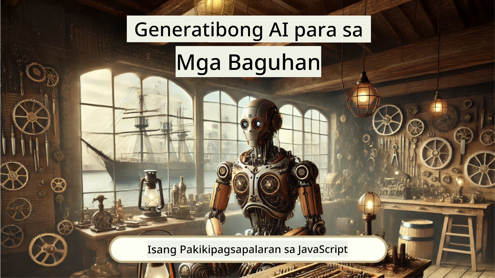
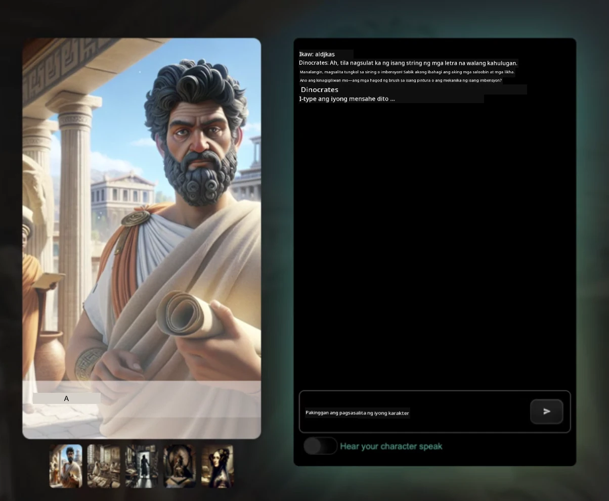
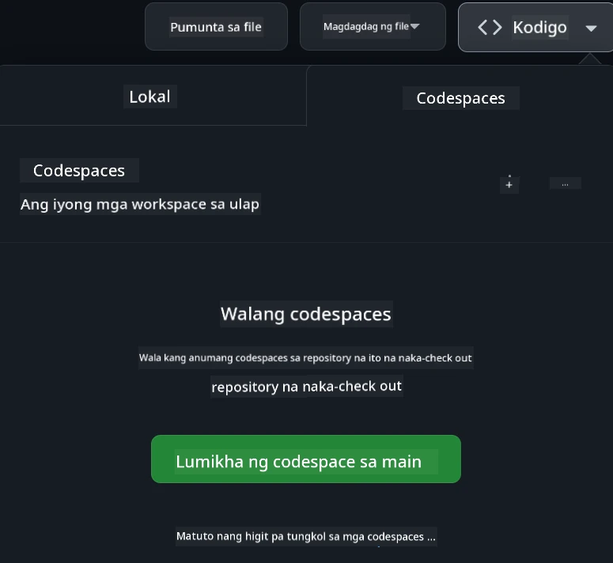

[](https://github.com/microsoft/Web-Dev-For-Beginners/blob/master/LICENSE)
[](https://GitHub.com/microsoft/Web-Dev-For-Beginners/graphs/contributors/)
[](https://GitHub.com/microsoft/Web-Dev-For-Beginners/issues/)
[](https://GitHub.com/microsoft/Web-Dev-For-Beginners/pulls/)
[](http://makeapullrequest.com) 

[](https://GitHub.com/microsoft/Web-Dev-For-Beginners/watchers/)
[](https://GitHub.com/microsoft/Web-Dev-For-Beginners/network/)
[](https://GitHub.com/microsoft/Web-Dev-For-Beginners/stargazers/)

[](https://discord.gg/nTYy5BXMWG)

# Web Development para sa mga Nagsisimula - Isang Kurikulum

Matutunan ang mga pundasyon ng web development sa aming 12-linggong masusing kurso mula sa Microsoft Cloud Advocates. Bawat isa sa 24 na aralin ay sumisid sa JavaScript, CSS, at HTML sa pamamagitan ng mga praktikal na proyekto tulad ng terrariums, browser extensions, at mga space games. Makilahok sa mga pagsusulit, diskusyon, at praktikal na mga takdang-aralin. Paunlarin ang iyong kakayahan at pagbutihin ang iyong pagkatuto gamit ang aming epektibong metodolohiyang nakabase sa proyekto. Simulan ang iyong paglalakbay sa coding ngayon!

Sumali sa Azure AI Foundry Discord Community

[](https://discord.gg/nTYy5BXMWG)

Sundan ang mga hakbang na ito upang makapagsimula gamit ang mga resource na ito:
1. **I-fork ang Repository**: I-click ang [](https://GitHub.com/microsoft/Web-Dev-For-Beginners/fork)
2. **I-clone ang Repository**:   `git clone https://github.com/microsoft/Web-Dev-For-Beginners.git`
3. [**Sumali sa Azure AI Foundry Discord at makipagkilala sa mga eksperto at kapwa developer**](https://discord.com/invite/ByRwuEEgH4)

### 🌐 Suportang Maraming Wika

#### Sinusuportahan sa pamamagitan ng GitHub Action (Automatiko at Palaging Napapanahon)

<!-- CO-OP TRANSLATOR LANGUAGES TABLE START -->
[Arabic](../ar/README.md) | [Bengali](../bn/README.md) | [Bulgarian](../bg/README.md) | [Burmese (Myanmar)](../my/README.md) | [Chinese (Simplified)](../zh-CN/README.md) | [Chinese (Traditional, Hong Kong)](../zh-HK/README.md) | [Chinese (Traditional, Macau)](../zh-MO/README.md) | [Chinese (Traditional, Taiwan)](../zh-TW/README.md) | [Croatian](../hr/README.md) | [Czech](../cs/README.md) | [Danish](../da/README.md) | [Dutch](../nl/README.md) | [Estonian](../et/README.md) | [Finnish](../fi/README.md) | [French](../fr/README.md) | [German](../de/README.md) | [Greek](../el/README.md) | [Hebrew](../he/README.md) | [Hindi](../hi/README.md) | [Hungarian](../hu/README.md) | [Indonesian](../id/README.md) | [Italian](../it/README.md) | [Japanese](../ja/README.md) | [Kannada](../kn/README.md) | [Khmer](../km/README.md) | [Korean](../ko/README.md) | [Lithuanian](../lt/README.md) | [Malay](../ms/README.md) | [Malayalam](../ml/README.md) | [Marathi](../mr/README.md) | [Nepali](../ne/README.md) | [Nigerian Pidgin](../pcm/README.md) | [Norwegian](../no/README.md) | [Persian (Farsi)](../fa/README.md) | [Polish](../pl/README.md) | [Portuguese (Brazil)](../pt-BR/README.md) | [Portuguese (Portugal)](../pt-PT/README.md) | [Punjabi (Gurmukhi)](../pa/README.md) | [Romanian](../ro/README.md) | [Russian](../ru/README.md) | [Serbian (Cyrillic)](../sr/README.md) | [Slovak](../sk/README.md) | [Slovenian](../sl/README.md) | [Spanish](../es/README.md) | [Swahili](../sw/README.md) | [Swedish](../sv/README.md) | [Tagalog (Filipino)](./README.md) | [Tamil](../ta/README.md) | [Telugu](../te/README.md) | [Thai](../th/README.md) | [Turkish](../tr/README.md) | [Ukrainian](../uk/README.md) | [Urdu](../ur/README.md) | [Vietnamese](../vi/README.md)

> **Mas gusto mo bang i-clone nang lokal?**
>
> Kasama sa repository na ito ang 50+ na salin ng mga wika na lubhang nagpapalaki ng laki ng pag-download. Upang mag-clone nang walang mga salin, gamitin ang sparse checkout:
>
> **Bash / macOS / Linux:**
> ```bash
> git clone --filter=blob:none --sparse https://github.com/microsoft/Web-Dev-For-Beginners.git
> cd Web-Dev-For-Beginners
> git sparse-checkout set --no-cone '/*' '!translations' '!translated_images'
> ```
>
> **CMD (Windows):**
> ```cmd
> git clone --filter=blob:none --sparse https://github.com/microsoft/Web-Dev-For-Beginners.git
> cd Web-Dev-For-Beginners
> git sparse-checkout set --no-cone "/*" "!translations" "!translated_images"
> ```
>
> Makukuha mo lahat ng kailangan mo upang tapusin ang kurso nang mas mabilis ang pag-download.
<!-- CO-OP TRANSLATOR LANGUAGES TABLE END -->

**Kung nais mong magkaroon ng suportang karagdagang mga wika ng pagsasalin, nakalista ito [dito](https://github.com/Azure/co-op-translator/blob/main/getting_started/supported-languages.md)**

[](https://open.vscode.dev/microsoft/Web-Dev-For-Beginners)

#### 🧑‍🎓 _Estudyante ka ba?_

Bisitahin ang [**Student Hub page**](https://docs.microsoft.com/learn/student-hub/?WT.mc_id=academic-77807-sagibbon) kung saan makakakita ka ng mga materyales para sa mga nagsisimula, mga Student packs at mga paraan para makakuha ng libreng sertipiko voucher. Ito ang pahinang dapat mong i-bookmark at tingnan paminsan-minsan dahil ang nilalaman ay ini-update buwan-buwan.

### 📣 Anunsyo - Mga bagong hamon sa GitHub Copilot Agent mode na dapat tapusin!

May bagong hamon, hanapin ang "GitHub Copilot Agent Challenge 🚀" sa karamihan ng mga kabanata. Ito ay isang bagong hamon na maaari mong tapusin gamit ang GitHub Copilot at Agent mode. Kung hindi mo pa nagagamit ang Agent mode, kaya nitong hindi lamang gumawa ng teksto kundi lumikha at mag-edit ng mga file, magpatakbo ng mga utos, at marami pa.

### 📣 Anunsyo - _Bagong Proyekto na bubuuin gamit ang Generative AI_ 

Bagong AI Assistant project ang idinagdag, silipin ito [proyekto](./9-chat-project/README.md)

### 📣 Anunsyo - _Bagong Kurikulum_ sa Generative AI para sa JavaScript ay inilabas na

Huwag palampasin ang aming bagong kurikulum sa Generative AI!

Bisitahin ang [https://aka.ms/genai-js-course](https://aka.ms/genai-js-course) upang makapagsimula!



- Mga aralin mula sa mga batayan hanggang sa RAG.
- Makipag-ugnayan sa mga makasaysayang karakter gamit ang GenAI at ang aming companion app.
- Masaya at kapana-panabik na salaysay, parang naglalakbay ka sa oras!




Bawat aralin ay may kasamang takdang-aralin, pagsusuri ng kaalaman, at hamon upang gabayan ka sa pag-aaral ng mga paksa tulad ng:
- Prompting at prompt engineering
- Pagbuo ng mga app para sa teksto at imahe
- Mga search apps

Bisitahin ang [https://aka.ms/genai-js-course](https://aka.ms/genai-js-course) upang makapagsimula!


## 🌱 Pagsisimula

> **Mga Guro**, may [ilang suhestiyon kami](for-teachers.md) kung paano gamitin ang kurikulum na ito. Nais naming marinig ang inyong feedback [sa aming discussion forum](https://github.com/microsoft/Web-Dev-For-Beginners/discussions/categories/teacher-corner)!

**[Mga Mag-aaral](https://aka.ms/student-page/?WT.mc_id=academic-77807-sagibbon)**, sa bawat aralin, simulan sa isang pre-lecture quiz at sundan ito sa pagbabasa ng mga materyales ng lektura, pagtapos ng iba't ibang aktibidad, at suriin ang inyong pag-unawa gamit ang post-lecture quiz.

Para mapabuti ang iyong karanasan sa pag-aaral, makipag-ugnayan sa iyong mga kaklase upang magtrabaho sa mga proyekto nang magkakasama! Hinihikayat ang mga diskusyon sa aming [discussion forum](https://github.com/microsoft/Web-Dev-For-Beginners/discussions) kung saan naroroon ang aming mga moderator upang sagutin ang iyong mga katanungan.

Para sa mas malalim na pag-aaral, mariin naming inirerekomenda ang [Microsoft Learn](https://learn.microsoft.com/users/wirelesslife/collections/p1ddcy5jwy0jkm?WT.mc_id=academic-77807-sagibbon) para sa karagdagang mga materyales pang-aral.

### 📋 Pagse-setup ng iyong kapaligiran

May nakahandang development environment ang kurikulum na ito! Habang nagsisimula, maaari kang pumili na patakbuhin ang kurikulum sa isang [Codespace](https://github.com/features/codespaces/) (_browser-based na kapaligiran na hindi kailangan ng install_), o lokal sa iyong computer gamit ang isang text editor tulad ng [Visual Studio Code](https://code.visualstudio.com/?WT.mc_id=academic-77807-sagibbon).

#### Gumawa ng iyong repository
Para madali mong masave ang iyong trabaho, inirerekomenda na gumawa ka ng sarili mong kopya ng repository na ito. Maaari mo itong gawin sa pamamagitan ng pag-click sa **Use this template** button sa itaas ng pahina. Lilikha ito ng bagong repository sa iyong GitHub account na may kopya ng kurikulum.

Sundan ang mga hakbang na ito:
1. **I-fork ang Repository**: I-click ang "Fork" na button sa kanang itaas na bahagi ng pahinang ito.
2. **I-clone ang Repository**:   `git clone https://github.com/microsoft/Web-Dev-For-Beginners.git`

#### Patakbuhin ang kurikulum sa Codespace

Sa kopya ng repository na iyong ginawa, i-click ang **Code** button at piliin ang **Open with Codespaces**. Lilikha ito ng bagong Codespace para sa iyo upang magtrabaho.



#### Patakbuhin ang kurikulum lokal sa iyong computer

Para patakbuhin ang kurikulum na ito lokal sa iyong computer, kakailanganin mo ang isang text editor, isang browser at isang command line tool. Ang aming unang aralin, [Introduction to Programming Languages and Tools of the Trade](../../1-getting-started-lessons/1-intro-to-programming-languages), ay gagabay sa iyo sa iba't ibang opsyon para sa bawat isa sa mga tool na ito upang piliin mo kung ano ang pinakamabisa para sa iyo.

Ang aming rekomendasyon ay gamitin ang [Visual Studio Code](https://code.visualstudio.com/?WT.mc_id=academic-77807-sagibbon) bilang editor mo, na may kasamang built-in na [Terminal](https://code.visualstudio.com/docs/terminal/basics/?WT.mc_id=academic-77807-sagibbon). Maaari mong i-download ang Visual Studio Code [dito](https://code.visualstudio.com/?WT.mc_id=academic-77807-sagibbon).
1. I-clone ang iyong repository sa iyong computer. Magagawa mo ito sa pamamagitan ng pag-click sa **Code** button at pagkopya ng URL:

    [CodeSpace](./images/createcodespace.png)

    Pagkatapos, buksan ang [Terminal](https://code.visualstudio.com/docs/terminal/basics/?WT.mc_id=academic-77807-sagibbon) sa loob ng [Visual Studio Code](https://code.visualstudio.com/?WT.mc_id=academic-77807-sagibbon) at patakbuhin ang sumusunod na command, palitan ang `<your-repository-url>` ng URL na iyong kinopya:

    ```bash 
    git clone <your-repository-url>
    ```

2. Buksan ang folder sa Visual Studio Code. Magagawa mo ito sa pamamagitan ng pag-click sa **File** > **Open Folder** at piliin ang folder na kaklone mo lang.


>  Inirerekomendang mga extension ng Visual Studio Code:
>
> * [Live Server](https://marketplace.visualstudio.com/items?itemName=ritwickdey.LiveServer&WT.mc_id=academic-77807-sagibbon) - para ma-preview ang mga pahinang HTML sa loob ng Visual Studio Code
> * [Copilot](https://marketplace.visualstudio.com/items?itemName=GitHub.copilot&WT.mc_id=academic-77807-sagibbon) - para matulungan kang magsulat ng code nang mas mabilis

## 📂 Ang bawat aralin ay nagsasama ng:

- opsyonal na sketchnote
- opsyonal na karagdagang video
- pre-lesson warmup quiz
- nakasulat na aralin
- para sa mga project-based na aralin, mga step-by-step na gabay sa paggawa ng proyekto
- mga pagsusuri ng kaalaman
- isang hamon
- karagdagang babasahin
- takdang-aralin
- [post-lesson quiz](https://ff-quizzes.netlify.app/web/)

> **Isang paalala tungkol sa mga pagsusulit**: Lahat ng pagsusulit ay nasa Quiz-app na folder, may 48 kabuuang pagsusulit na tig-3 tanong bawat isa. Available ang mga ito [dito](https://ff-quizzes.netlify.app/web/) at ang quiz app ay maaaring patakbuhin nang lokal o ideploy sa Azure; sundin ang mga tagubilin sa `quiz-app` folder.

## 🗃️ Mga Aralin

|     |                       Pangalan ng Proyekto                       |                            Mga Konseptong Itinuturo                             | Mga Layunin sa Pagkatuto                                                                                                                 |                                                         Nakalink na Aralin                                                          |         May-akda          |
| :-: | :--------------------------------------------------------------: | :--------------------------------------------------------------------: | ----------------------------------------------------------------------------------------------------------------------------------- | :----------------------------------------------------------------------------------------------------------------------------: | :---------------------: |
| 01  |                     Getting Started                              |           Panimula sa Programming at Mga Kasangkapan           | Matutunan ang mga pangunahing pundasyon ng karamihan sa mga programming language at tungkol sa software na tumutulong sa mga propesyonal na developer sa kanilang trabaho | [Intro to Programming Languages and Tools of the Trade](./1-getting-started-lessons/1-intro-to-programming-languages/README.md) |         Jasmine         |
| 02  |                     Getting Started                              |             Mga Pangunahing Kaalaman sa GitHub, kasama ang pagtatrabaho sa isang koponan             | Kung paano gamitin ang GitHub sa iyong proyekto, paano makipagtulungan sa iba sa isang code base                                                    |                            [Intro to GitHub](./1-getting-started-lessons/2-github-basics/README.md)                             |          Floor          |
| 03  |                     Getting Started                              |                             Accessibility                              | Matutunan ang mga pangunahing konsepto ng web accessibility                                                                                               |                       [Accessibility Fundamentals](./1-getting-started-lessons/3-accessibility/README.md)                       |       Christopher       |
| 04  |                        JS Basics                                 |                         Mga Uri ng Data sa JavaScript                          | Mga pangunahing kaalaman tungkol sa mga uri ng data sa JavaScript                                                                                                 |                                       [Data Types](./2-js-basics/1-data-types/README.md)                                        |         Jasmine         |
| 05  |                        JS Basics                                 |                         Mga Function at Mga Metodo                          | Matutunan ang tungkol sa mga function at mga method para pamahalaan ang daloy ng lohika ng isang aplikasyon                                                             |                              [Functions and Methods](./2-js-basics/2-functions-methods/README.md)                               | Jasmine at Christopher |
| 06  |                        JS Basics                                 |                        Paggawa ng mga Desisyon gamit ang JS                        | Matutunan kung paano gumawa ng mga kondisyon sa iyong code gamit ang mga pamamaraang pampagpapasya                                                           |                                 [Making Decisions](./2-js-basics/3-making-decisions/README.md)                                  |         Jasmine         |
| 07  |                        JS Basics                                 |                            Mga Array at Loop                            | Magtrabaho gamit ang data gamit ang mga array at loop sa JavaScript                                                                                 |                                   [Arrays and Loops](./2-js-basics/4-arrays-loops/README.md)                                    |         Jasmine         |
| 08  |       [Terrarium](./3-terrarium/solution/README.md)             |                            Praktis sa HTML                            | Gumawa ng HTML para lumikha ng online terrarium, nakatuon sa paggawa ng layout                                                         |                                 [Introduction to HTML](./3-terrarium/1-intro-to-html/README.md)                                 |           Jen           |
| 09  |       [Terrarium](./3-terrarium/solution/README.md)             |                            Praktis sa CSS                             | Gumawa ng CSS para i-style ang online terrarium, nakatuon sa mga batayan ng CSS kabilang ang paggawa ng pahina na responsive                     |                                  [Introduction to CSS](./3-terrarium/2-intro-to-css/README.md)                                  |           Jen           |
| 10  |            [Terrarium](./3-terrarium/solution/README.md)        |                 JavaScript Closures, DOM manipulation                  | Gumawa ng JavaScript para paganahin ang terrarium bilang isang drag/drop interface, nakatuon sa closures at DOM manipulation             |                  [JavaScript Closures, DOM manipulation](./3-terrarium/3-intro-to-DOM-and-closures/README.md)                   |           Jen           |
| 11  |          [Typing Game](./4-typing-game/solution/README.md)       |                          Gumawa ng Isang Typing Game                           | Matutunan kung paano gamitin ang mga keyboard events upang paandarin ang lohika ng iyong JavaScript app                                                          |                                [Event-Driven Programming](./4-typing-game/typing-game/README.md)                                |       Christopher       |
| 12  | [Green Browser Extension](./5-browser-extension/solution/README.md) |                         Paggawa sa mga Browser                          | Matutunan kung paano gumagana ang mga browser, ang kanilang kasaysayan, at paano gumawa ng mga unang elemento ng isang browser extension                               |                               [About Browsers](./5-browser-extension/1-about-browsers/README.md)                                |           Jen           |
| 13  | [Green Browser Extension](./5-browser-extension/solution/README.md) | Gumawa ng form, tumawag ng API at mag-imbak ng mga variable sa local storage | Gumawa ng mga elemento ng JavaScript ng iyong browser extension para tumawag ng API gamit ang mga variable na naka-imbak sa lokal na imbakan                      |                [APIs, Forms, and Local Storage](./5-browser-extension/2-forms-browsers-local-storage/README.md)                 |           Jen           |
| 14  | [Green Browser Extension](./5-browser-extension/solution/README.md) |          Mga background process sa browser, pagganap ng web          | Gamitin ang background processes ng browser para pamahalaan ang icon ng extension; matutunan ang tungkol sa web performance at ilang mga optimizations para mapabuti   |             [Background Tasks and Performance](./5-browser-extension/3-background-tasks-and-performance/README.md)              |           Jen           |
| 15  |           [Space Game](./6-space-game/solution/README.md)        |             Mas Advanced na Pag-develop ng Laro gamit ang JavaScript             | Matutunan ang tungkol sa Inheritance gamit ang parehong Classes at Composition at ang Pub/Sub pattern, bilang paghahanda sa paggawa ng laro              |                      [Introduction to Advanced Game Development](./6-space-game/1-introduction/README.md)                       |          Chris          |
| 16  |           [Space Game](./6-space-game/solution/README.md)        |                           Pagdodrawing sa canvas                            | Matutunan ang tungkol sa Canvas API, na ginagamit para mag-drawing ng mga elemento sa screen                                                                       |                                [Drawing to Canvas](./6-space-game/2-drawing-to-canvas/README.md)                                |          Chris          |
| 17  |           [Space Game](./6-space-game/solution/README.md)        |                   Paggalaw ng mga elemento sa paligid ng screen                    | Tuklasin kung paano magkakaroon ng galaw ang mga elemento gamit ang mga cartesian coordinates at ang Canvas API                                            |                           [Moving Elements Around](./6-space-game/3-moving-elements-around/README.md)                           |          Chris          |
| 18  |           [Space Game](./6-space-game/solution/README.md)        |                          Pagtuklas ng banggaan                           | Pahintulutan ang mga elemento na magbanggaan at tumugon sa isa't isa gamit ang mga keypress at magbigay ng cooldown function para matiyak ang performance ng laro    |                              [Collision Detection](./6-space-game/4-collision-detection/README.md)                              |          Chris          |
| 19  |           [Space Game](./6-space-game/solution/README.md)        |                             Pagpapanatili ng iskor                              | Gumawa ng mga kalkulasyon sa matematika batay sa status at performance ng laro                                                                |                                    [Keeping Score](./6-space-game/5-keeping-score/README.md)                                    |          Chris          |
| 20  |           [Space Game](./6-space-game/solution/README.md)        |                     Pagtatapos at pag-restart ng laro                     | Matutunan ang tungkol sa pagtatapos at pag-restart ng laro, kabilang ang paglilinis ng mga assets at pag-reset ng mga halaga ng variable                              |                                [The Ending Condition](./6-space-game/6-end-condition/README.md)                                 |          Chris          |
| 21  |         [Banking App](./7-bank-project/solution/README.md)       |                 HTML Templates at Routes sa isang Web App                 | Matutunan kung paano gumawa ng balangkas ng multipage website na arkitektura gamit ang routing at HTML templates                             |                            [HTML Templates and Routes](./7-bank-project/1-template-route/README.md)                             |          Yohan          |
| 22  |         [Banking App](./7-bank-project/solution/README.md)       |                  Gumawa ng Login at Registration Form                   | Matutunan ang tungkol sa paggawa ng mga form at pamamahala ng mga validation routine                                                                          |                                           [Forms](./7-bank-project/2-forms/README.md)                                           |          Yohan          |
| 23  |         [Banking App](./7-bank-project/solution/README.md)       |                   Mga Metodo ng Pagkuha at Paggamit ng Data                   | Paano dumadaloy ang data papasok at palabas ng iyong app, paano ito kunin, iimbak, at alisin                                                 |                                            [Data](./7-bank-project/3-data/README.md)                                            |          Yohan          |
| 24  |         [Banking App](./7-bank-project/solution/README.md)       |                      Mga Konsepto ng Pamamahala ng Estado                      | Matutunan kung paano pinananatili ng iyong app ang estado at paano ito pamahalaan programmatically                                                              |                                [State Management](./7-bank-project/4-state-management/README.md)                                |          Yohan          |
| 25 | [Browser/VScode Code](../../8-code-editor) | Paggamit ng VScode | Matutunan kung paano gumamit ng isang code editor| [Use VScode Code Editor](./8-code-editor/1-using-a-code-editor/README.md) | Chris |
| 26 | [AI Assistants](./9-chat-project/README.md) | Paggamit ng AI | Matutunan kung paano gumawa ng sarili mong AI assistant | [AI Assistant project](./9-chat-project/README.md) | Chris |

## 🏫 Pedagohiya

Ang aming kurikulum ay dinisenyo gamit ang dalawang pangunahing prinsipyo sa pagtuturo:
* pagkatuto na nakabatay sa proyekto
* madalas na pagsusulit

Itinuturo ng programa ang mga pundamental ng JavaScript, HTML, at CSS, pati na rin ang pinakabagong mga kasangkapan at teknik na ginagamit ng mga web developer ngayon. Magkakaroon ng pagkakataon ang mga estudyante na magkaroon ng praktikal na karanasan sa pamamagitan ng paggawa ng isang typing game, virtual terrarium, eco-friendly browser extension, space-invader-style na laro, at isang banking app para sa mga negosyo. Sa pagtatapos ng serye, magkakaroon ang mga estudyante ng matibay na pag-unawa sa web development.

> 🎓 Maaari mong kunin ang unang ilang mga aralin sa kurikulum na ito bilang isang [Learn Path](https://docs.microsoft.com/learn/paths/web-development-101/?WT.mc_id=academic-77807-sagibbon) sa Microsoft Learn!

Sa pagtitiyak na ang nilalaman ay naka-align sa mga proyekto, nagiging mas kapana-panabik ang proseso para sa mga estudyante at napapalakas ang pag-alala sa mga konsepto. Nagsulat din kami ng ilang mga panimulang aralin sa basics ng JavaScript para ipakilala ang mga konsepto, na ipinares sa isang video mula sa koleksyon ng video tutorial na "[Beginners Series to: JavaScript](https://channel9.msdn.com/Series/Beginners-Series-to-JavaScript/?WT.mc_id=academic-77807-sagibbon)", na ilan sa mga may-akda nito ay nag-ambag sa kurikulum na ito.

Dagdag pa, ang isang low-stakes quiz bago ang klase ay nagtatakda ng intensyon ng estudyante sa pag-aaral ng isang paksa, habang ang pangalawang quiz pagkatapos ng klase ay nagsisiguro ng karagdagang pag-alala. Ang kurikulum na ito ay dinisenyo upang maging flexible at masaya at maaaring kunin nang buo o bahagya lamang. Ang mga proyekto ay nagsisimula sa maliit at nagiging mas kumplikado sa pagtatapos ng 12-linggong siklo.

Bagaman sinadya naming iwasan ang pagpapakilala ng mga JavaScript framework upang magpokus sa mga pangunahing kasanayan na kailangan bilang isang web developer bago mag-adopt ng framework, isang magandang susunod na hakbang sa pagtapos ng kurikulum na ito ay ang pag-aaral tungkol sa Node.js gamit ang isa pang koleksyon ng mga video: "[Beginner Series to: Node.js](https://channel9.msdn.com/Series/Beginners-Series-to-Nodejs/?WT.mc_id=academic-77807-sagibbon)".

> Bisitahin ang aming [Code of Conduct](CODE_OF_CONDUCT.md) at [Contributing](CONTRIBUTING.md) na mga gabay. Tinatanggap namin ang iyong makabuluhang puna!


## 🧭 Offline access

Maaari mong patakbuhin ang dokumentasyong ito offline gamit ang [Docsify](https://docsify.js.org/#/). I-fork ang repo na ito, [i-install ang Docsify](https://docsify.js.org/#/quickstart) sa iyong lokal na makina, at pagkatapos sa root folder ng repo na ito, i-type ang `docsify serve`. Ang website ay irerender sa port 3000 sa iyong localhost: `localhost:3000`.

## 📘 PDF
Isang PDF ng lahat ng mga aralin ay matatagpuan [dito](https://microsoft.github.io/Web-Dev-For-Beginners/pdf/readme.pdf).


## 🎒 Iba Pang Mga Kurso

Ang aming koponan ay gumagawa ng iba pang mga kurso! Tingnan ang:

<!-- CO-OP TRANSLATOR OTHER COURSES START -->
### LangChain
[](https://aka.ms/langchain4j-for-beginners)
[](https://aka.ms/langchainjs-for-beginners?WT.mc_id=m365-94501-dwahlin)
[](https://github.com/microsoft/langchain-for-beginners?WT.mc_id=m365-94501-dwahlin)
---

### Azure / Edge / MCP / Agents
[](https://github.com/microsoft/AZD-for-beginners?WT.mc_id=academic-105485-koreyst)
[](https://github.com/microsoft/edgeai-for-beginners?WT.mc_id=academic-105485-koreyst)
[](https://github.com/microsoft/mcp-for-beginners?WT.mc_id=academic-105485-koreyst)
[](https://github.com/microsoft/ai-agents-for-beginners?WT.mc_id=academic-105485-koreyst)

---
 
### Generative AI Series
[](https://github.com/microsoft/generative-ai-for-beginners?WT.mc_id=academic-105485-koreyst)
[-9333EA?style=for-the-badge&labelColor=E5E7EB&color=9333EA)](https://github.com/microsoft/Generative-AI-for-beginners-dotnet?WT.mc_id=academic-105485-koreyst)
[-C084FC?style=for-the-badge&labelColor=E5E7EB&color=C084FC)](https://github.com/microsoft/generative-ai-for-beginners-java?WT.mc_id=academic-105485-koreyst)
[-E879F9?style=for-the-badge&labelColor=E5E7EB&color=E879F9)](https://github.com/microsoft/generative-ai-with-javascript?WT.mc_id=academic-105485-koreyst)

---
 
### Core Learning
[](https://aka.ms/ml-beginners?WT.mc_id=academic-105485-koreyst)
[](https://aka.ms/datascience-beginners?WT.mc_id=academic-105485-koreyst)
[](https://aka.ms/ai-beginners?WT.mc_id=academic-105485-koreyst)
[](https://github.com/microsoft/Security-101?WT.mc_id=academic-96948-sayoung)
[](https://aka.ms/webdev-beginners?WT.mc_id=academic-105485-koreyst)
[](https://aka.ms/iot-beginners?WT.mc_id=academic-105485-koreyst)
[](https://github.com/microsoft/xr-development-for-beginners?WT.mc_id=academic-105485-koreyst)

---
 
### Copilot Series
[](https://aka.ms/GitHubCopilotAI?WT.mc_id=academic-105485-koreyst)
[](https://github.com/microsoft/mastering-github-copilot-for-dotnet-csharp-developers?WT.mc_id=academic-105485-koreyst)
[](https://github.com/microsoft/CopilotAdventures?WT.mc_id=academic-105485-koreyst)
<!-- CO-OP TRANSLATOR OTHER COURSES END -->

## Pagkuha ng Tulong

Kung ikaw ay na-stuck o may mga tanong tungkol sa paggawa ng AI apps. Sumali sa kapwa mga nag-aaral at mga batikang developer sa mga talakayan tungkol sa MCP. Isa itong suportadong komunidad kung saan malugod na tinatanggap ang mga tanong at malayang ibinabahagi ang kaalaman.

[](https://discord.gg/nTYy5BXMWG)

Kung mayroon kang feedback sa produkto o mga error habang nagtatayo, bisitahin:

[](https://aka.ms/foundry/forum)

## Lisensya

Ang repositoryong ito ay lisensyado sa ilalim ng MIT license. Tingnan ang file na [LICENSE](../../LICENSE) para sa karagdagang impormasyon.

---

<!-- CO-OP TRANSLATOR DISCLAIMER START -->
**Paunawa**:
Ang dokumentong ito ay isinalin gamit ang serbisyong AI na pagsasalin na [Co-op Translator](https://github.com/Azure/co-op-translator). Habang nagsusumikap kami para sa katumpakan, pakitandaan na ang mga awtomatikong pagsasalin ay maaaring maglaman ng mga mali o pagkakamali. Ang orihinal na dokumento sa orihinal nitong wika ang dapat ituring na pangunahing sanggunian. Para sa mga mahalagang impormasyon, inirerekomenda ang propesyonal na pagsasalin ng tao. Hindi kami mananagot sa anumang hindi pagkakaintindihan o maling interpretasyon na nagmumula sa paggamit ng pagsasaling ito.
<!-- CO-OP TRANSLATOR DISCLAIMER END -->