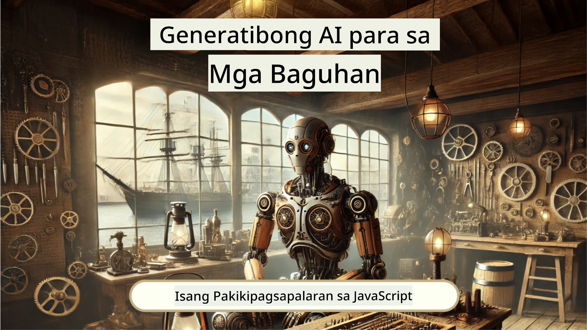
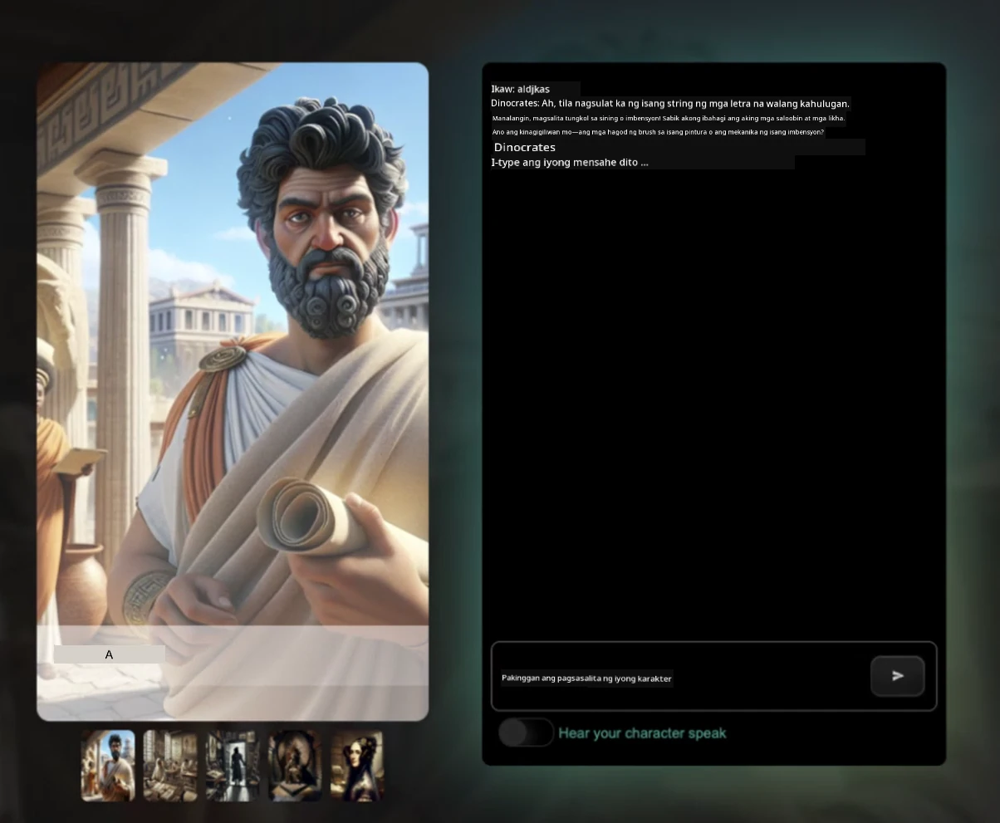
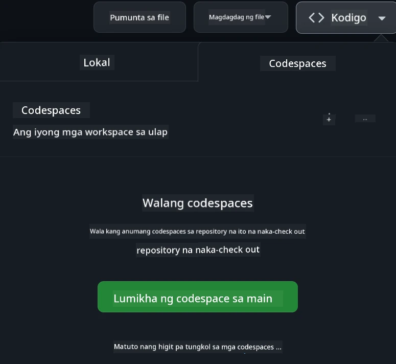

# Web Development para sa mga Baguhan - Isang Kurikulum

Matutunan ang mga pundasyon ng web development sa aming 12-linggong komprehensibong kurso mula sa Microsoft Cloud Advocates. Bawat isa sa 24 na aralin ay sumisid sa JavaScript, CSS, at HTML sa pamamagitan ng mga hands-on na proyekto tulad ng terrariums, browser extensions, at mga laro sa kalawakan. Makibahagi sa mga pagsusulit, talakayan, at praktikal na mga gawain. Pahusayin ang iyong mga kasanayan at pagbutihin ang pagtipid ng kaalaman gamit ang aming epektibong proyekto-base na pamamaraan ng pagtuturo. Simulan ang iyong paglalakbay sa coding ngayon!

Sumali sa Azure AI Foundry Discord at makipagkilala sa mga eksperto at kapwa mga developer.

Sundan ang mga hakbang na ito upang makapagsimula gamit ang mga ito:
1. **I-fork ang Repository**: I-click ang [](https://GitHub.com/microsoft/Web-Dev-For-Beginners/fork)
2. **I-clone ang Repository**:   `git clone https://github.com/microsoft/Web-Dev-For-Beginners.git`
3. [**Sumali sa Azure AI Foundry Discord at makipagkilala sa mga eksperto at kapwa mga developer**](https://discord.com/invite/ByRwuEEgH4)

### 🌐 Suporta para sa Maramihang Wika

#### Sinusuportahan sa pamamagitan ng GitHub Action (Awtomatiko at Laging Napapanahon)

[Arabic](../ar/README.md) | [Bengali](../bn/README.md) | [Bulgarian](../bg/README.md) | [Burmese (Myanmar)](../my/README.md) | [Chinese (Simplified)](../zh-CN/README.md) | [Chinese (Traditional, Hong Kong)](../zh-HK/README.md) | [Chinese (Traditional, Macau)](../zh-MO/README.md) | [Chinese (Traditional, Taiwan)](../zh-TW/README.md) | [Croatian](../hr/README.md) | [Czech](../cs/README.md) | [Danish](../da/README.md) | [Dutch](../nl/README.md) | [Estonian](../et/README.md) | [Finnish](../fi/README.md) | [French](../fr/README.md) | [German](../de/README.md) | [Greek](../el/README.md) | [Hebrew](../he/README.md) | [Hindi](../hi/README.md) | [Hungarian](../hu/README.md) | [Indonesian](../id/README.md) | [Italian](../it/README.md) | [Japanese](../ja/README.md) | [Kannada](../kn/README.md) | [Khmer](../km/README.md) | [Korean](../ko/README.md) | [Lithuanian](../lt/README.md) | [Malay](../ms/README.md) | [Malayalam](../ml/README.md) | [Marathi](../mr/README.md) | [Nepali](../ne/README.md) | [Nigerian Pidgin](../pcm/README.md) | [Norwegian](../no/README.md) | [Persian (Farsi)](../fa/README.md) | [Polish](../pl/README.md) | [Portuguese (Brazil)](../pt-BR/README.md) | [Portuguese (Portugal)](../pt-PT/README.md) | [Punjabi (Gurmukhi)](../pa/README.md) | [Romanian](../ro/README.md) | [Russian](../ru/README.md) | [Serbian (Cyrillic)](../sr/README.md) | [Slovak](../sk/README.md) | [Slovenian](../sl/README.md) | [Spanish](../es/README.md) | [Swahili](../sw/README.md) | [Swedish](../sv/README.md) | [Tagalog (Filipino)](./README.md) | [Tamil](../ta/README.md) | [Telugu](../te/README.md) | [Thai](../th/README.md) | [Turkish](../tr/README.md) | [Ukrainian](../uk/README.md) | [Urdu](../ur/README.md) | [Vietnamese](../vi/README.md)

> **Mas gusto mo bang I-clone nang Lokal?**
>
> Kasama sa repositoryong ito ang mahigit 50 na pagsasalin ng wika na nagpapalaki nang malaki sa laki ng pag-download. Upang i-clone nang walang mga pagsasalin, gamitin ang sparse checkout:
>
> **Bash / macOS / Linux:**
> ```bash
> git clone --filter=blob:none --sparse https://github.com/microsoft/Web-Dev-For-Beginners.git
> cd Web-Dev-For-Beginners
> git sparse-checkout set --no-cone '/*' '!translations' '!translated_images'
> ```
>
> **CMD (Windows):**
> ```cmd
> git clone --filter=blob:none --sparse https://github.com/microsoft/Web-Dev-For-Beginners.git
> cd Web-Dev-For-Beginners
> git sparse-checkout set --no-cone "/*" "!translations" "!translated_images"
> ```
>
> Bibigyan ka nito ng lahat ng kailangan mo upang tapusin ang kurso nang mas mabilis ang pag-download.

**Kung nais mong magkaroon ng karagdagang pagsasalin, ang mga sinusuportahang wika ay nakalista dito. [dito](https://github.com/Azure/co-op-translator/blob/main/getting_started/supported-languages.md)**

#### 🧑‍🎓 _Estudyante ka ba?_

Bisitahin ang [**Student Hub page**](https://docs.microsoft.com/learn/student-hub/?WT.mc_id=academic-77807-sagibbon) kung saan makikita mo ang mga panimulang materyales, mga Student pack at maging mga paraan upang makakuha ng libreng voucher para sa sertipiko. Ito ang pahinang nais mong i-bookmark at tingnan paminsan-minsan dahil regular naming pinapalitan ang nilalaman buwan-buwan.

### 📣 Anunsyo - Mga bagong hamon sa GitHub Copilot Agent mode na tapusin!

May bagong hamon na idinagdag, hanapin ang "GitHub Copilot Agent Challenge 🚀" sa karamihan ng mga kabanata. Ito ay isang bagong hamon na kailangan mong tapusin gamit ang GitHub Copilot at Agent mode. Kung hindi mo pa nagamit ang Agent mode dati, kaya nitong hindi lang gumawa ng teksto kundi makalikha at makapag-edit ng mga file, magpatakbo ng mga utos, at marami pa.

### 📣 Anunsyo - _Bagong Proyekto para gawin gamit ang Generative AI_

May bagong AI Assistant project na idinagdag, tingnan ito sa [proyekto](./9-chat-project/README.md)

### 📣 Anunsyo - _Bagong Kurikulum_ sa Generative AI para sa JavaScript ay inilabas lang

Huwag palampasin ang aming bagong Generative AI na kurikulum!

Bisitahin ang [https://aka.ms/genai-js-course](https://aka.ms/genai-js-course) upang makapagsimula!



- Mga aralin mula sa mga pangunahing kaalaman hanggang RAG.
- Makipag-ugnayan sa mga makasaysayang tauhan gamit ang GenAI at ang aming kasamang app.
- Masaya at kapana-panabik na salaysay, para kang naglalakbay sa panahon!




Bawat aralin ay may kasamang takdang-aralin na kailangang matapos, pagsusuri ng kaalaman, at hamon upang gabayan ka sa pag-aaral ng mga paksang tulad ng:
- Prompting at prompt engineering
- Pagbuo ng text at image app
- Mga search app

Bisitahin ang [https://aka.ms/genai-js-course](https://aka.ms/genai-js-course) upang makapagsimula!


## 🌱 Pagsisimula

> **Mga Guro**, may [nilikha kaming ilang mungkahi](for-teachers.md) kung paano gamitin ang kurikulum na ito. Malugod naming tatanggapin ang inyong puna [sa aming talakayan forum](https://github.com/microsoft/Web-Dev-For-Beginners/discussions/categories/teacher-corner)!

**[Mga Mag-aaral](https://aka.ms/student-page/?WT.mc_id=academic-77807-sagibbon)**, para sa bawat aralin, magsimula sa isang pre-lecture quiz at sundan ito sa pamamagitan ng pagbabasa ng mga materyales sa lektura, pagtapos ng iba't ibang gawain, at pagsuri sa iyong pagkaunawa gamit ang post-lecture quiz.

Upang mapabuti ang iyong karanasan sa pag-aaral, makipag-ugnayan sa iyong mga kaklase at magtulungan sa mga proyekto! Hinihikayat ang mga talakayan sa aming [discussion forum](https://github.com/microsoft/Web-Dev-For-Beginners/discussions) kung saan ang aming mga moderator ay handang sagutin ang iyong mga tanong.

Para lalong mapalawak ang iyong edukasyon, lubos naming inirerekomenda ang paggalugad sa [Microsoft Learn](https://learn.microsoft.com/users/wirelesslife/collections/p1ddcy5jwy0jkm?WT.mc_id=academic-77807-sagibbon) para sa karagdagang mga materyales sa pag-aaral.

### 📋 Pagsasaayos ng iyong kapaligiran

May nakaayos nang development environment ang kurikulum na ito! Sa pagsisimula mo, maaari kang pumili na patakbuhin ang kurikulum sa isang [Codespace](https://github.com/features/codespaces/) (_isang browser-based, environment na hindi nangangailangan ng pag-install_), o lokal sa iyong computer gamit ang isang text editor tulad ng [Visual Studio Code](https://code.visualstudio.com/?WT.mc_id=academic-77807-sagibbon).

#### Gumawa ng sariling repository

Para madali mong maisave ang iyong trabaho, inirerekomenda na gumawa ka ng sariling kopya ng repositoryong ito. Magagawa mo ito sa pamamagitan ng pag-click sa **Use this template** na button sa itaas ng pahina. Ito ay gagawa ng bagong repository sa iyong GitHub account na may kopya ng kurikulum.

Sundin ang mga hakbang na ito:
1. **I-fork ang Repository**: I-click ang button na "Fork" sa kanang-itaas na sulok ng pahinang ito.
2. **I-clone ang Repository**:   `git clone https://github.com/microsoft/Web-Dev-For-Beginners.git`

#### Pagpapatakbo ng kurikulum sa isang Codespace

Sa kopya ng repositoryong ginawa mo, i-click ang **Code** na button at piliin ang **Open with Codespaces**. Ito ay gagawa ng bagong Codespace para sa iyong gawain.



#### Pagpapatakbo ng kurikulum nang lokal sa iyong computer

Para patakbuhin ang kurikulum na ito nang lokal sa iyong computer, kailangan mo ng isang text editor, isang browser, at isang command line tool. Ang unang aralin namin, [Introduction to Programming Languages and Tools of the Trade](../../1-getting-started-lessons/1-intro-to-programming-languages), ay gagabay sa iyo sa pagpili ng mga opsyon para sa bawat isa sa mga tool na ito upang mapili mo ang pinakaangkop para sa iyo.

Ang aming rekomendasyon ay gamitin ang [Visual Studio Code](https://code.visualstudio.com/?WT.mc_id=academic-77807-sagibbon) bilang iyong editor, na may kasamang [Terminal](https://code.visualstudio.com/docs/terminal/basics/?WT.mc_id=academic-77807-sagibbon). Maaari mong i-download ang Visual Studio Code [dito](https://code.visualstudio.com/?WT.mc_id=academic-77807-sagibbon).
1. I-clone ang iyong repository sa iyong computer. Maaari mo itong gawin sa pamamagitan ng pag-click sa **Code** na button at pagkopya ng URL:

    [CodeSpace](./images/createcodespace.png)

    Pagkatapos, buksan ang [Terminal](https://code.visualstudio.com/docs/terminal/basics/?WT.mc_id=academic-77807-sagibbon) sa loob ng [Visual Studio Code](https://code.visualstudio.com/?WT.mc_id=academic-77807-sagibbon) at patakbuhin ang sumusunod na utos, palitan ang `<your-repository-url>` ng URL na kinopya mo:

    ```bash 
    git clone <your-repository-url>
    ```

2. Buksan ang folder sa Visual Studio Code. Maaari mo itong gawin sa pamamagitan ng pag-click sa **File** > **Open Folder** at piliin ang folder na kaklone mo lang.


>  Inirerekomendang mga extension para sa Visual Studio Code:
>
> * [Live Server](https://marketplace.visualstudio.com/items?itemName=ritwickdey.LiveServer&WT.mc_id=academic-77807-sagibbon) - para makita ang preview ng mga HTML page sa loob ng Visual Studio Code
> * [Copilot](https://marketplace.visualstudio.com/items?itemName=GitHub.copilot&WT.mc_id=academic-77807-sagibbon) - para matulungan kang mas mabilis magsulat ng code

## 📂 Kasama sa bawat leksyon:

- opsyonal na sketchnote
- opsyonal na supplemental na video
- pre-lesson warmup quiz
- nakasulat na leksyon
- para sa mga project-based na leksyon, step-by-step na gabay kung paano gumawa ng proyekto
- knowledge checks
- isang hamon
- supplemental na babasahin
- takdang-aralin
- [post-lesson quiz](https://ff-quizzes.netlify.app/web/)

> **Isang paalala tungkol sa mga quiz**: Lahat ng quiz ay nasa Quiz-app folder, 48 na kabuuang quiz na may tatlong tanong bawat isa. Available ang mga ito [dito](https://ff-quizzes.netlify.app/web/) ang quiz app ay maaaring patakbuhin nang lokal o i-deploy sa Azure; sundin ang mga instruksyon sa `quiz-app` folder.

## 🗃️ Mga Leksiyon

|     |                       Pangalan ng Proyekto                        |                            Mga Konseptong Itinuro                            | Mga Layunin sa Pagkatuto                                                                                                             |                                                        Nakalink na Leksiyon                                                        |        May-akda         |
| :-: | :------------------------------------------------------: | :--------------------------------------------------------------------: | ---------------------------------------------------------------------------------------------------------------------------------- | :----------------------------------------------------------------------------------------------------------------------------: | :---------------------: |
| 01  |                     Getting Started                      |           Panimula sa Programming at mga Kagamitan ng Gawain           | Alamin ang mga pangunahing kaalaman sa likod ng karamihan sa mga programming language at software na tumutulong sa mga propesyonal na developer para sa kanilang trabaho | [Intro to Programming Languages and Tools of the Trade](./1-getting-started-lessons/1-intro-to-programming-languages/README.md) |         Jasmine         |
| 02  |                     Getting Started                      |             Mga Batayan ng GitHub, kasama ang pagtatrabaho kasama ang koponan             | Paano gamitin ang GitHub sa iyong proyekto, paano makipag-collaborate sa iba sa isang code base                                       |                            [Intro to GitHub](./1-getting-started-lessons/2-github-basics/README.md)                             |          Floor          |
| 03  |                     Getting Started                      |                             Accessibility                              | Alamin ang mga batayan ng web accessibility                                                                                       |                       [Accessibility Fundamentals](./1-getting-started-lessons/3-accessibility/README.md)                       |       Christopher       |
| 04  |                        JS Basics                         |                         Mga Uri ng Datos sa JavaScript                          | Mga batayan ng mga uri ng datos sa JavaScript                                                                                      |                                       [Data Types](./2-js-basics/1-data-types/README.md)                                        |         Jasmine         |
| 05  |                        JS Basics                         |                         Mga Function at Metodo                           | Alamin ang tungkol sa mga function at metodong ginagamit para pamahalaan ang daloy ng lohika ng aplikasyon                            |                              [Functions and Methods](./2-js-basics/2-functions-methods/README.md)                               | Jasmine at Christopher  |
| 06  |                        JS Basics                         |                        Paggawa ng mga Desisyon gamit ang JS                      | Alamin kung paano gumawa ng mga kondisyon sa iyong code gamit ang mga pamamaraan ng paggawa ng desisyon                              |                                 [Making Decisions](./2-js-basics/3-making-decisions/README.md)                                  |         Jasmine         |
| 07  |                        JS Basics                         |                            Mga Array at Loops                            | Gumamit ng datos gamit ang arrays at loops sa JavaScript                                                                          |                                   [Arrays and Loops](./2-js-basics/4-arrays-loops/README.md)                                    |         Jasmine         |
| 08  |       [Terrarium](./3-terrarium/solution/README.md)       |                            HTML sa Praktis                            | Gumawa ng HTML para gumawa ng online terrarium, nakatuon sa pagbuo ng layout                                                        |                                 [Introduction to HTML](./3-terrarium/1-intro-to-html/README.md)                                 |           Jen           |
| 09  |       [Terrarium](./3-terrarium/solution/README.md)       |                            CSS sa Praktis                             | Gumawa ng CSS para istilohan ang online terrarium, na nakatuon sa mga batayan ng CSS kabilang ang paggawa ng halaman na responsive    |                                  [Introduction to CSS](./3-terrarium/2-intro-to-css/README.md)                                  |           Jen           |
| 10  |            [Terrarium](./3-terrarium/solution/README.md)            |                 JavaScript Closures, DOM manipulation                  | Gumawa ng JavaScript para gawing drag/drop interface ang terrarium, nakatuon sa closures at DOM manipulation                         |                  [JavaScript Closures, DOM manipulation](./3-terrarium/3-intro-to-DOM-and-closures/README.md)                   |           Jen           |
| 11  |          [Typing Game](./4-typing-game/solution/README.md)          |                          Gumawa ng Typing Game                           | Alamin kung paano gamitin ang keyboard events para patakbuhin ang lohika ng iyong JavaScript app                                     |                                [Event-Driven Programming](./4-typing-game/typing-game/README.md)                                |       Christopher       |
| 12  | [Green Browser Extension](./5-browser-extension/solution/README.md) |                         Paggawa gamit ang Mga Browser                          | Alamin kung paano gumagana ang mga browser, ang kasaysayan nito, at paano gawin ang unang mga elemento ng browser extension          |                               [About Browsers](./5-browser-extension/1-about-browsers/README.md)                                |           Jen           |
| 13  | [Green Browser Extension](./5-browser-extension/solution/README.md) | Paggawa ng form, pagtawag sa API at pag-iimbak ng variables sa local storage | Gumawa ng mga elemento ng JavaScript ng iyong browser extension para tumawag sa API gamit ang mga variable na iniimbak sa local storage |                [APIs, Forms, and Local Storage](./5-browser-extension/2-forms-browsers-local-storage/README.md)                 |           Jen           |
| 14  | [Green Browser Extension](./5-browser-extension/solution/README.md) |          Mga Background Process sa browser, web performance          | Gamitin ang mga background process ng browser para pamahalaan ang icon ng extension; alamin ang tungkol sa web performance at ilang optimizations para mapabuti ito |             [Background Tasks and Performance](./5-browser-extension/3-background-tasks-and-performance/README.md)              |           Jen           |
| 15  |           [Space Game](./6-space-game/solution/README.md)           |             Mas Advanced na Pagbuo ng Laro gamit ang JavaScript             | Alamin ang tungkol sa Inheritance gamit parehong Classes at Composition at ang Pub/Sub pattern, bilang paghahanda para sa paggawa ng laro |                      [Introduction to Advanced Game Development](./6-space-game/1-introduction/README.md)                       |          Chris          |
| 16  |           [Space Game](./6-space-game/solution/README.md)           |                           Pag-drawing sa canvas                            | Alamin ang tungkol sa Canvas API, ginagamit para mag-drawing ng mga elemento sa screen                                              |                                [Drawing to Canvas](./6-space-game/2-drawing-to-canvas/README.md)                                |          Chris          |
| 17  |           [Space Game](./6-space-game/solution/README.md)           |                   Paggalaw ng mga elemento sa screen                    | Tuklasin kung paano makakagawa ng galaw ang mga elemento gamit ang cartesian coordinates at Canvas API                              |                           [Moving Elements Around](./6-space-game/3-moving-elements-around/README.md)                           |          Chris          |
| 18  |           [Space Game](./6-space-game/solution/README.md)           |                          Pagtukoy sa Collision                           | Gawing magbanggaan at mag-react ang mga elemento sa isa't isa gamit ang keypresses at magbigay ng cooldown function para matiyak ang performance ng laro |                              [Collision Detection](./6-space-game/4-collision-detection/README.md)                              |          Chris          |
| 19  |           [Space Game](./6-space-game/solution/README.md)           |                             Pagtatala ng score                              | Magsagawa ng mga kalkulasyon batay sa status at performance ng laro                                                                |                                    [Keeping Score](./6-space-game/5-keeping-score/README.md)                                    |          Chris          |
| 20  |           [Space Game](./6-space-game/solution/README.md)           |                     Pagtatapos at pag-restart ng laro                     | Alamin ang tungkol sa pagtatapos at pag-restart ng laro, kabilang ang paglilinis ng mga assets at pag-reset ng mga value ng variable |                                [The Ending Condition](./6-space-game/6-end-condition/README.md)                                 |          Chris          |
| 21  |         [Banking App](./7-bank-project/solution/README.md)          |                 HTML Templates at Ruta sa isang Web App                 | Alamin kung paano bumuo ng scaffolding ng arkitektura ng multipage na website gamit ang routing at HTML templates                   |                            [HTML Templates and Routes](./7-bank-project/1-template-route/README.md)                             |          Yohan          |
| 22  |         [Banking App](./7-bank-project/solution/README.md)          |                  Gumawa ng Login at Registration Form                   | Alamin ang tungkol sa paggawa ng mga form at paghawak ng validation routines                                                        |                                           [Forms](./7-bank-project/2-forms/README.md)                                           |          Yohan          |
| 23  |         [Banking App](./7-bank-project/solution/README.md)          |                   Mga Paraan ng Pagkuha at Paggamit ng Data                   | Paano dumadaloy ang data papasok at palabas ng iyong app, paano ito kunin, iimbak, at itapon                                        |                                            [Data](./7-bank-project/3-data/README.md)                                            |          Yohan          |
| 24  |         [Banking App](./7-bank-project/solution/README.md)          |                      Mga Konsepto ng State Management                      | Alamin kung paano pinananatili ng iyong app ang estado at paano ito pamahalaan programmatically                                       |                                [State Management](./7-bank-project/4-state-management/README.md)                                |          Yohan          |
| 25 | [Browser/VScode Code](../../8-code-editor) | Paggamit ng VScode | Alamin kung paano gumamit ng code editor| [Use VScode Code Editor](./8-code-editor/1-using-a-code-editor/README.md) | Chris |
| 26 | [AI Assistants](./9-chat-project/README.md) | Paggamit ng AI | Alamin kung paano gumawa ng sarili mong AI assistant | [AI Assistant project](./9-chat-project/README.md) | Chris |

## 🏫 Pedagohiya

Ang aming kurikulum ay dinisenyo gamit ang dalawang pangunahing prinsipyong pedagogical:
* pagkatuto batay sa proyekto
* madalas na quizzes

Itinuturo ng programa ang mga pangunahing kaalaman ng JavaScript, HTML, at CSS, pati na rin ang mga pinakabagong kasangkapan at tekniko na ginagamit ng mga web developer ngayon. Magkakaroon ang mga estudyante ng pagkakataong magkaroon ng hands-on na karanasan sa pamamagitan ng paggawa ng typing game, virtual terrarium, eco-friendly browser extension, space-invader-style game, at isang banking app para sa mga negosyo. Sa pagtatapos ng serye, magkakaroon ang mga estudyante ng matibay na pag-unawa sa pagbuo ng web.

> 🎓 Maaari mong kunin ang unang ilang leksyon sa kurikulum na ito bilang isang [Learn Path](https://docs.microsoft.com/learn/paths/web-development-101/?WT.mc_id=academic-77807-sagibbon) sa Microsoft Learn!

Sa pamamagitan ng pagsiguro na ang nilalaman ay tumutugma sa mga proyekto, ang proseso ay ginagawa mas kawili-wili para sa mga estudyante at ang retention ng mga konsepto ay mapapalakas. Sumulat din kami ng ilang panimulang leksyon sa mga batayan ng JavaScript para ipakilala ang mga konsepto, kasabay ng isang video mula sa koleksyon ng video tutorial na "[Beginners Series to: JavaScript](https://channel9.msdn.com/Series/Beginners-Series-to-JavaScript/?WT.mc_id=academic-77807-sagibbon)", kung saan ang ilan sa mga may-akda ay nag-ambag sa kurikulum na ito.

Bukod pa rito, ang isang mababang-stakes na quiz bago ang klase ay nagtatakda ng layunin ng estudyante patungo sa pag-aaral ng isang paksa, habang ang pangalawang quiz pagkatapos ng klase ay tinitiyak ang karagdagang retention. Ang kurikulum na ito ay dinisenyo upang maging flexible at masaya at maaaring kunin nang buo o bahagi. Ang mga proyekto ay nagsisimula sa maliit at unti-unting lumalaki ang kumplikasyon sa pagtatapos ng 12-linggong yugto.

Habang sinasadyang iniiwasan naming ipakilala ang mga framework ng JavaScript upang magpokus sa mga pangunahing kasanayan na kailangan bilang isang web developer bago gamitin ang isang framework, isang magandang susunod na hakbang sa pagtatapos ng kurikulum na ito ay ang pag-aaral tungkol sa Node.js sa pamamagitan ng isa pang koleksyon ng mga video: "[Beginner Series to: Node.js](https://channel9.msdn.com/Series/Beginners-Series-to-Nodejs/?WT.mc_id=academic-77807-sagibbon)".

> Bisitahin ang aming [Code of Conduct](CODE_OF_CONDUCT.md) at [Contributing](CONTRIBUTING.md) na mga alituntunin. Malugod naming tinatanggap ang iyong konstruktibong feedback!


## 🧭 Offline access

Maaari mong patakbuhin ang dokumentasyong ito offline gamit ang [Docsify](https://docsify.js.org/#/). I-fork ang repo na ito, [i-install ang Docsify](https://docsify.js.org/#/quickstart) sa iyong lokal na makina, at pagkatapos sa root folder ng repo na ito, i-type ang `docsify serve`. Ang website ay ipapakita sa port 3000 sa iyong localhost: `localhost:3000`.

## 📘 PDF
Ang isang PDF ng lahat ng mga aralin ay makikita [dito](https://microsoft.github.io/Web-Dev-For-Beginners/pdf/readme.pdf).


## 🎒 Iba Pang Mga Kurso

Ang aming koponan ay gumagawa ng iba pang mga kurso! Tingnan ang:

<!-- CO-OP TRANSLATOR OTHER COURSES START -->
### LangChain
[](https://aka.ms/langchain4j-for-beginners)
[](https://aka.ms/langchainjs-for-beginners?WT.mc_id=m365-94501-dwahlin)
[](https://github.com/microsoft/langchain-for-beginners?WT.mc_id=m365-94501-dwahlin)
---

### Azure / Edge / MCP / Agents
[](https://github.com/microsoft/AZD-for-beginners?WT.mc_id=academic-105485-koreyst)
[](https://github.com/microsoft/edgeai-for-beginners?WT.mc_id=academic-105485-koreyst)
[](https://github.com/microsoft/mcp-for-beginners?WT.mc_id=academic-105485-koreyst)
[](https://github.com/microsoft/ai-agents-for-beginners?WT.mc_id=academic-105485-koreyst)

---
 
### Generative AI Series
[](https://github.com/microsoft/generative-ai-for-beginners?WT.mc_id=academic-105485-koreyst)
[-9333EA?style=for-the-badge&labelColor=E5E7EB&color=9333EA)](https://github.com/microsoft/Generative-AI-for-beginners-dotnet?WT.mc_id=academic-105485-koreyst)
[-C084FC?style=for-the-badge&labelColor=E5E7EB&color=C084FC)](https://github.com/microsoft/generative-ai-for-beginners-java?WT.mc_id=academic-105485-koreyst)
[-E879F9?style=for-the-badge&labelColor=E5E7EB&color=E879F9)](https://github.com/microsoft/generative-ai-with-javascript?WT.mc_id=academic-105485-koreyst)

---
 
### Core Learning
[](https://aka.ms/ml-beginners?WT.mc_id=academic-105485-koreyst)
[](https://aka.ms/datascience-beginners?WT.mc_id=academic-105485-koreyst)
[](https://aka.ms/ai-beginners?WT.mc_id=academic-105485-koreyst)
[](https://github.com/microsoft/Security-101?WT.mc_id=academic-96948-sayoung)
[](https://aka.ms/webdev-beginners?WT.mc_id=academic-105485-koreyst)
[](https://aka.ms/iot-beginners?WT.mc_id=academic-105485-koreyst)
[](https://github.com/microsoft/xr-development-for-beginners?WT.mc_id=academic-105485-koreyst)

---
 
### Copilot Series
[](https://aka.ms/GitHubCopilotAI?WT.mc_id=academic-105485-koreyst)
[](https://github.com/microsoft/mastering-github-copilot-for-dotnet-csharp-developers?WT.mc_id=academic-105485-koreyst)
[](https://github.com/microsoft/CopilotAdventures?WT.mc_id=academic-105485-koreyst)
<!-- CO-OP TRANSLATOR OTHER COURSES END -->

## Pagkuha ng Tulong

Kung ikaw ay na-stuck o may mga katanungan tungkol sa paggawa ng AI apps. Sumali sa mga kapwa nag-aaral at mga bihasang developer sa mga talakayan tungkol sa MCP. Ito ay isang suportadong komunidad kung saan malugod ang mga tanong at malayang ibinabahagi ang kaalaman.

[](https://discord.gg/nTYy5BXMWG)

Kung mayroon kang feedback sa produkto o mga error habang bumubuo pumunta sa:

[](https://aka.ms/foundry/forum)

## Lisensya

Ang repositoryong ito ay lisensyado sa ilalim ng MIT license. Tingnan ang [LICENSE](../../LICENSE) na file para sa karagdagang impormasyon.

---

<!-- CO-OP TRANSLATOR DISCLAIMER START -->
**Pagtatanging Pahayag**:  
Ang dokumentong ito ay isinalin gamit ang serbisyong AI na pagsasalin [Co-op Translator](https://github.com/Azure/co-op-translator). Bagaman aming pinagsisikapan ang katumpakan, mangyaring tandaan na ang mga automated na pagsasalin ay maaaring maglaman ng mga pagkakamali o hindi pagkakatugma. Ang orihinal na dokumento sa orihinal nitong wika ang dapat ituring na pangunahing sanggunian. Para sa mahahalagang impormasyon, inirerekomenda ang propesyonal na pagsasalin ng tao. Hindi kami mananagot sa anumang hindi pagkakaunawaan o maling interpretasyon na nagmula sa paggamit ng pagsasaling ito.
<!-- CO-OP TRANSLATOR DISCLAIMER END -->