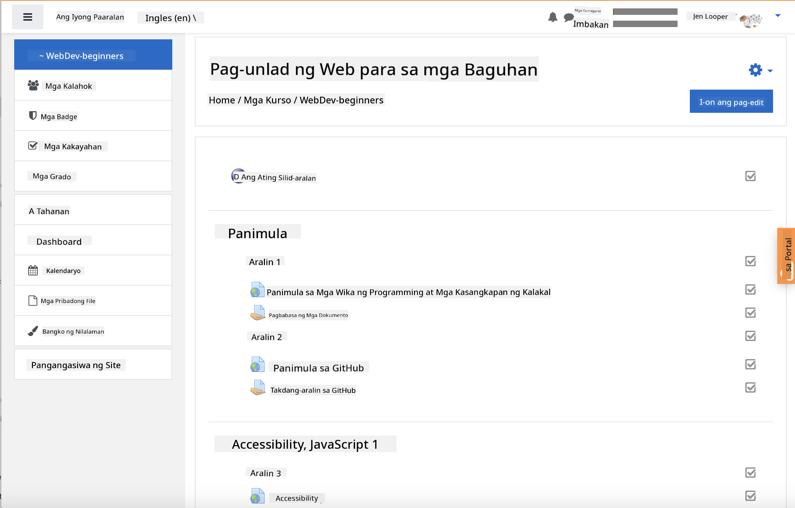
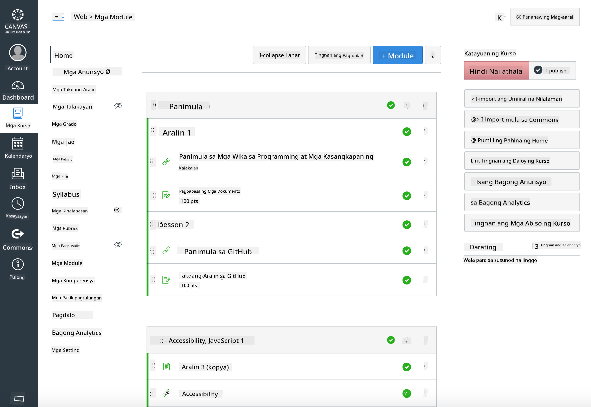

<!--
CO_OP_TRANSLATOR_METADATA:
{
  "original_hash": "71009af209f81cc01a1f2d324200375f",
  "translation_date": "2025-10-03T10:22:09+00:00",
  "source_file": "for-teachers.md",
  "language_code": "tl"
}
-->
### Para sa mga Guro

Malugod kayong inaanyayahan na gamitin ang kurikulum na ito sa inyong klase. Madali itong gamitin kasama ang GitHub Classroom at mga nangungunang LMS platform, at maaari rin itong gamitin bilang isang standalone na repositoryo para sa inyong mga estudyante.

### Paggamit kasama ang GitHub Classroom

Upang pamahalaan ang mga aralin at takdang-aralin bawat batch, gumawa ng isang repositoryo para sa bawat aralin upang maikabit ng GitHub Classroom ang bawat takdang-aralin nang hiwalay.

- I-fork ang repositoryo na ito sa inyong organisasyon.
- Gumawa ng hiwalay na repositoryo para sa bawat aralin sa pamamagitan ng pagkuha ng bawat folder ng aralin at ilipat ito sa sariling repositoryo.
  - Opsyon A: Gumawa ng mga walang laman na repositoryo (isa bawat aralin) at kopyahin ang nilalaman ng folder ng aralin sa bawat isa.
  - Opsyon B: Gumamit ng paraan na nagpe-preserve ng Git history (hal., hatiin ang isang folder sa bagong repositoryo) kung kailangan ninyo ng provenance.
- Sa GitHub Classroom, gumawa ng takdang-aralin bawat aralin at ituro ito sa kaukulang repositoryo ng aralin.
- Mga inirerekomendang setting:
  - Visibility ng repositoryo: pribado para sa mga gawa ng estudyante.
  - Gumamit ng starter code mula sa default branch ng repositoryo ng aralin.
  - Magdagdag ng mga template para sa issue at pull request para sa mga pagsusulit at pagsusumite.
  - Opsyonal na i-configure ang autograding at mga pagsusulit kung kasama ito sa inyong mga aralin.
- Mga convention na makakatulong:
  - Mga pangalan ng repositoryo tulad ng lesson-01-intro, lesson-02-html, atbp.
  - Mga label: quiz, assignment, needs-review, late, resubmission.
  - Mga tag/releases bawat batch (hal., v2025-term1).

Tip: Iwasan ang pag-iimbak ng mga repositoryo sa loob ng mga synced folder (hal., OneDrive/Google Drive) upang maiwasan ang mga Git conflict sa Windows.

### Paggamit kasama ang Moodle, Canvas, o Blackboard

Kasama sa kurikulum na ito ang mga importable na package para sa karaniwang mga workflow ng LMS.

- Moodle: Gamitin ang Moodle upload file [Moodle upload file](../../../../../../../teaching-files/webdev-moodle.mbz) upang i-load ang buong kurso.
- Common Cartridge: Gamitin ang Common Cartridge file [Common Cartridge file](../../../../../../../teaching-files/webdev-common-cartridge.imscc) para sa mas malawak na compatibility ng LMS.
- Mga Tala:
  - Limitado ang suporta ng Moodle Cloud para sa Common Cartridge. Mas mainam gamitin ang Moodle file sa itaas, na maaari ring i-upload sa Canvas.
  - Pagkatapos ng import, suriin ang mga module, petsa ng due, at mga setting ng pagsusulit upang tumugma sa iskedyul ng inyong term.

> Ang kurikulum sa isang Moodle classroom

> Ang kurikulum sa Canvas

### Direktang paggamit ng repositoryo (walang Classroom)

Kung mas gusto ninyong hindi gamitin ang GitHub Classroom, maaari ninyong patakbuhin ang kurso nang direkta mula sa repositoryo na ito.

- Synchronous/online na format (Zoom/Teams):
  - Magpatakbo ng maikling warmup na pinangungunahan ng mentor; gamitin ang breakout rooms para sa mga pagsusulit.
  - Mag-anunsyo ng oras para sa pagsusulit; magsumite ang mga estudyante ng sagot bilang GitHub Issues.
  - Para sa mga collaborative na takdang-aralin, magtrabaho ang mga estudyante sa mga pampublikong repositoryo ng aralin at magbukas ng pull requests.
- Pribado/asynchronous na format:
  - I-fork ng mga estudyante ang bawat aralin sa kanilang sariling **pribado** na repositoryo at idagdag kayo bilang collaborator.
  - Magsumite sila sa pamamagitan ng Issues (pagsusulit) at Pull Requests (takdang-aralin) sa inyong classroom repositoryo o sa kanilang pribadong forks.

### Mga pinakamahusay na kasanayan

- Magbigay ng orientation lesson tungkol sa mga pangunahing kaalaman sa Git/GitHub, Issues, at PRs.
- Gumamit ng mga checklist sa Issues para sa mga multi-step na pagsusulit/takdang-aralin.
- Magdagdag ng CONTRIBUTING.md at CODE_OF_CONDUCT.md upang magtakda ng mga classroom norms.
- Magdagdag ng mga tala tungkol sa accessibility (alt text, captions) at mag-alok ng mga printable na PDF.
- I-version ang inyong nilalaman bawat term at i-freeze ang mga repositoryo ng aralin pagkatapos ng pag-publish.

### Feedback at suporta

Nais naming gumana ang kurikulum na ito para sa inyo at sa inyong mga estudyante. Mangyaring magbukas ng bagong Issue sa repositoryo na ito para sa mga bug, kahilingan, o mga pagpapabuti, o magsimula ng talakayan sa Teacher Corner.

---

**Paunawa**:  
Ang dokumentong ito ay isinalin gamit ang AI translation service na [Co-op Translator](https://github.com/Azure/co-op-translator). Bagamat sinisikap naming maging tumpak, pakitandaan na ang mga awtomatikong pagsasalin ay maaaring maglaman ng mga pagkakamali o hindi pagkakatugma. Ang orihinal na dokumento sa orihinal nitong wika ang dapat ituring na opisyal na sanggunian. Para sa mahalagang impormasyon, inirerekomenda ang propesyonal na pagsasalin ng tao. Hindi kami mananagot sa anumang hindi pagkakaunawaan o maling interpretasyon na dulot ng paggamit ng pagsasaling ito.