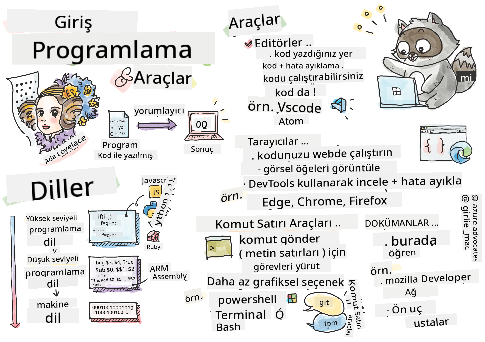

<!--
CO_OP_TRANSLATOR_METADATA:
{
  "original_hash": "3e0da5eb9b275fe3cb431033c1413ec2",
  "translation_date": "2025-10-22T23:47:45+00:00",
  "source_file": "1-getting-started-lessons/1-intro-to-programming-languages/README.md",
  "language_code": "tr"
}
-->
# Programlama Dillerine ve Modern Geliştirici Araçlarına Giriş

Merhaba, geleceğin geliştiricisi! 👋 Sana her gün beni heyecanlandıran bir şey söyleyebilir miyim? Programlamanın sadece bilgisayarlarla ilgili olmadığını, en çılgın fikirlerini hayata geçirebilmek için gerçek süper güçlere sahip olmakla ilgili olduğunu keşfetmek üzeresin!

Hani en sevdiğin uygulamayı kullanırken her şeyin mükemmel bir şekilde çalıştığı o an var ya? Bir düğmeye dokunduğunda ve seni "vay, bunu nasıl yaptılar?" dedirten büyülü bir şey olduğunda. İşte, o büyüyü yaratan kodu yazan kişi, muhtemelen senin gibi biri – belki gece 2'de favori kahve dükkanında üçüncü espressoyu içerken. Ve işte seni şaşırtacak şey: Bu dersin sonunda, sadece onların bunu nasıl yaptığını anlamakla kalmayacak, aynı zamanda bunu kendin denemek için sabırsızlanacaksın!

Bak, şu anda programlama gözünü korkutuyorsa seni tamamen anlıyorum. İlk başladığımda, dürüst olmak gerekirse, matematik dahisi olman gerektiğini ya da beş yaşından beri kod yazıyor olman gerektiğini düşünmüştüm. Ama işte benim bakış açımı tamamen değiştiren şey: Programlama, yeni bir dilde konuşmayı öğrenmekle tamamen aynı. Önce "merhaba" ve "teşekkür ederim" ile başlıyorsun, sonra kahve siparişi vermeye kadar ilerliyorsun ve bir bakmışsın derin felsefi tartışmalar yapıyorsun! Ama bu durumda, bilgisayarlarla konuşuyorsun ve dürüst olmak gerekirse, onlar en sabırlı konuşma partnerleri – hatalarını asla yargılamazlar ve her zaman tekrar denemeye hazırdırlar!

Bugün, modern web geliştirmeyi sadece mümkün kılmakla kalmayıp, aynı zamanda ciddi anlamda bağımlılık yapan inanılmaz araçları keşfedeceğiz. Netflix, Spotify ve en sevdiğin bağımsız uygulama stüdyosundaki geliştiricilerin her gün kullandığı aynı editörler, tarayıcılar ve iş akışlarından bahsediyorum. Ve işte seni mutlu dans ettirecek kısım: Bu profesyonel düzeydeki, endüstri standardı araçların çoğu tamamen ücretsiz!


> Sketchnote: [Tomomi Imura](https://twitter.com/girlie_mac)

## Neler Bildiğini Görelim!

Eğlenceli kısımlara geçmeden önce, merak ediyorum – bu programlama dünyası hakkında zaten neler biliyorsun? Ve eğer bu sorulara bakıp "Bunların hiçbirini bilmiyorum" diye düşünüyorsan, bu sadece sorun değil, harika! Bu, tam olarak doğru yerde olduğun anlamına geliyor. Bu testi bir egzersiz öncesi ısınma gibi düşün – sadece beyin kaslarını ısıtıyoruz!

[Ön ders testini yap](https://forms.office.com/r/dru4TE0U9n?origin=lprLink)

## Birlikte Çıkacağımız Macera

Tamam, bugün keşfedeceğimiz şeyler hakkında gerçekten çok heyecanlıyım! Cidden, bazı kavramlar kafanda oturduğunda yüzündeki ifadeyi görmeyi çok isterdim. İşte birlikte çıkacağımız inanılmaz yolculuk:

- **Programlama aslında nedir (ve neden en havalı şeydir!)** – Kodun, etrafındaki her şeyi güçlendiren görünmez bir sihir olduğunu keşfedeceğiz; pazartesi sabahı olduğunu bir şekilde bilen alarmdan, Netflix önerilerini mükemmel bir şekilde düzenleyen algoritmaya kadar.
- **Programlama dilleri ve onların harika kişilikleri** – Farklı süper güçlere ve sorunları çözme yollarına sahip insanların olduğu bir partiye girdiğini hayal et. Programlama dili dünyası tam olarak böyle ve onları tanımayı çok seveceksin!
- **Dijital sihri mümkün kılan temel yapı taşları** – Bunları nihai yaratıcı LEGO seti olarak düşün. Bu parçaların nasıl bir araya geldiğini anladığında, hayal gücünün tasarladığı her şeyi gerçekten inşa edebileceğini fark edeceksin.
- **Profesyonel araçlar, kendini bir büyücünün asasını almış gibi hissettirecek** – Abartmıyorum – bu araçlar gerçekten sana süper güçlere sahipmişsin gibi hissettirecek ve en iyi kısmı? Profesyonellerin kullandığı aynı araçlar!

> 💡 **Şunu unutma**: Bugün her şeyi ezberlemeye çalışmayı aklından bile geçirme! Şu anda sadece mümkün olan şeyler hakkında heyecan duymanı istiyorum. Detaylar, birlikte pratik yaptıkça doğal olarak aklında kalacak – gerçek öğrenme böyle gerçekleşir!

> Bu dersi [Microsoft Learn](https://docs.microsoft.com/learn/modules/web-development-101/introduction-programming/?WT.mc_id=academic-77807-sagibbon) üzerinden alabilirsin!

## Peki Programlama Tam Olarak Nedir?

Tamam, şimdi milyon dolarlık soruyu ele alalım: Programlama gerçekten nedir?

Sana düşüncemi tamamen değiştiren bir hikaye anlatacağım. Geçen hafta, anneme yeni akıllı TV kumandamızı nasıl kullanacağını açıklamaya çalışıyordum. Kendimi "Kırmızı düğmeye bas, ama büyük kırmızı düğmeye değil, sol taraftaki küçük kırmızı düğmeye... hayır, diğer sol... tamam, şimdi iki saniye basılı tut, bir değil, üç değil..." gibi şeyler söylerken buldum. Tanıdık geldi mi? 😅

İşte bu programlama! Güçlü bir şeye, her şeyi mükemmel bir şekilde açıklamanız gereken inanılmaz derecede ayrıntılı, adım adım talimatlar vermenin sanatıdır. Ama bu sefer, annenize açıklamak yerine (ki "hangi kırmızı düğme?!" diye sorabilir), bir bilgisayara açıklıyorsunuz (ki o sadece tam olarak söylediğinizi yapar, söyledikleriniz tam olarak ne demek istediğiniz olmasa bile).

İlk öğrendiğimde beni şaşırtan şey şu oldu: Bilgisayarlar aslında temelde oldukça basit. Sadece iki şeyi anlıyorlar – 1 ve 0, bu da temelde "evet" ve "hayır" ya da "açık" ve "kapalı" demek. Hepsi bu! Ama işte burada sihir devreye giriyor – 1'ler ve 0'lar konuşmak zorunda değiliz, sanki Matrix'teymişiz gibi. İşte **programlama dilleri** burada devreye giriyor. Bunlar, normal insan düşüncelerinizi alıp bilgisayar diline çeviren dünyanın en iyi çevirmeni gibi.

Ve işte beni her sabah uyandığımda hala heyecanlandıran şey: Hayatınızdaki dijital her şey, muhtemelen pijamalarıyla bir fincan kahve içen ve dizüstü bilgisayarında kod yazan biriyle başladı. Sizi kusursuz gösteren o Instagram filtresi mi? Biri onu kodladı. Sizi yeni favori şarkınıza yönlendiren öneri mi? Bir geliştirici o algoritmayı oluşturdu. Arkadaşlarınızla yemek hesaplarını bölmenize yardımcı olan uygulama mı? Evet, biri "bu çok sinir bozucu, bunu düzeltebilirim" diye düşündü ve sonra... düzeltti!

Programlama öğrenirken sadece yeni bir beceri edinmiyorsunuz – aynı zamanda "Birinin gününü biraz daha iyi hale getirecek bir şey inşa edebilir miyim?" diye düşünen bu inanılmaz problem çözücüler topluluğunun bir parçası oluyorsunuz. Dürüst olmak gerekirse, bundan daha havalı bir şey olabilir mi?

✅ **Eğlenceli Bilgi Avı**: Boş bir anınız olduğunda araştırabileceğiniz süper ilginç bir şey – dünyanın ilk bilgisayar programcısının kim olduğunu düşünüyorsunuz? Size bir ipucu vereyim: Beklediğiniz kişi olmayabilir! Bu kişinin hikayesi gerçekten büyüleyici ve programlamanın her zaman yaratıcı problem çözme ve kutunun dışında düşünme ile ilgili olduğunu gösteriyor.

## Programlama Dilleri Farklı Büyü Türleri Gibidir

Tamam, bu biraz garip gelebilir ama benimle kalın – programlama dilleri, farklı müzik türlerine çok benzer. Şöyle düşünün: Caz var, yumuşak ve doğaçlamalı, rock güçlü ve doğrudan, klasik zarif ve yapılandırılmış, hip-hop yaratıcı ve ifade dolu. Her stilin kendi havası, tutkulu hayran topluluğu var ve her biri farklı ruh halleri ve durumlar için mükemmel.

Programlama dilleri de aynı şekilde çalışır! Eğlenceli bir mobil oyun yapmak için kullandığınız dili, büyük miktarda iklim verisini işlemek için kullanmazsınız, tıpkı bir yoga dersinde death metal çalmayacağınız gibi (yani, çoğu yoga dersinde! 😄).

Ama her düşündüğümde beni gerçekten şaşırtan şey şu: Bu diller, yanınızda oturan dünyanın en sabırlı, en zeki tercümanı gibi. Fikirlerinizi insan beyninize doğal gelen bir şekilde ifade edebilirsiniz ve onlar, bunu bilgisayarların gerçekten konuştuğu 1'ler ve 0'lara çevirmek için inanılmaz karmaşık bir iş yaparlar. Bu, "insan yaratıcılığı" ve "bilgisayar mantığı" konusunda mükemmel derecede akıcı bir arkadaşınızın olması gibi – ve asla yorulmazlar, asla kahve molasına ihtiyaç duymazlar ve aynı soruyu iki kez sorduğunuz için sizi asla yargılamazlar!

### Popüler Programlama Dilleri ve Kullanım Alanları

| Dil | En İyi Kullanım Alanı | Neden Popüler? |
|-----|------------------------|----------------|
| **JavaScript** | Web geliştirme, kullanıcı arayüzleri | Tarayıcılarda çalışır ve etkileşimli web sitelerini güçlendirir |
| **Python** | Veri bilimi, otomasyon, yapay zeka | Okuması ve öğrenmesi kolay, güçlü kütüphaneler |
| **Java** | Kurumsal uygulamalar, Android uygulamaları | Platformdan bağımsız, büyük sistemler için sağlam |
| **C#** | Windows uygulamaları, oyun geliştirme | Güçlü Microsoft ekosistemi desteği |
| **Go** | Bulut hizmetleri, arka uç sistemleri | Hızlı, basit, modern bilgi işlem için tasarlanmış |

### Yüksek Seviye vs. Düşük Seviye Diller

Tamam, bu benim öğrenmeye başladığımda beynimi gerçekten zorlayan bir kavramdı, bu yüzden sonunda kafamda oturmasını sağlayan benzetmeyi paylaşacağım – ve umarım size de yardımcı olur!

Bir ülkede dilini bilmediğiniz bir yere gittiğinizi ve çaresizce en yakın tuvaleti bulmanız gerektiğini hayal edin (hepimiz orada bulunduk, değil mi? 😅):

- **Düşük seviyeli programlama**, yerel lehçeyi o kadar iyi öğrenmek gibidir ki, köşedeki meyve satan büyükanneyle kültürel referanslar, yerel argo ve sadece orada büyüyen birinin anlayabileceği şakalarla sohbet edebilirsiniz. Süper etkileyici ve inanılmaz derecede verimli... eğer akıcıysanız! Ama sadece bir tuvalet bulmaya çalışıyorsanız oldukça bunaltıcı olabilir.

- **Yüksek seviyeli programlama**, sizi gerçekten anlayan harika bir yerel arkadaşınızın olması gibidir. "Gerçekten bir tuvalet bulmam gerekiyor" diyebilirsiniz ve o tüm kültürel çeviriyi halleder ve size mantıklı bir şekilde yol tarif eder.

Programlama terimleriyle:
- **Düşük seviyeli diller** (Assembly veya C gibi) bilgisayarın gerçek donanımıyla inanılmaz derecede ayrıntılı konuşmalar yapmanıza olanak tanır, ancak bir makine gibi düşünmeniz gerekir, bu da... şey, oldukça büyük bir zihinsel değişimdir!
- **Yüksek seviyeli diller** (JavaScript, Python veya C# gibi) insan gibi düşünmenize olanak tanır ve tüm makine dilini arka planda halleder. Ayrıca, yeni olmanın nasıl bir şey olduğunu hatırlayan ve gerçekten size yardımcı olmak isteyen insanlarla dolu inanılmaz derecede sıcak topluluklara sahiptir!

Hangisini önerdiğimi tahmin edebiliyor musunuz? 😉 Yüksek seviyeli diller, asla çıkarmak istemeyeceğiniz eğitim tekerlekleri gibidir çünkü tüm deneyimi çok daha keyifli hale getirir!

### Neden Yüksek Seviyeli Diller Daha Dostça?

Tamam, şimdi yüksek seviyeli dillerin neden bu kadar dostça olduğunu mükemmel bir şekilde gösteren bir şey göstereceğim, ama önce – bana bir şey için söz vermenizi istiyorum. İlk kod örneğini gördüğünüzde panik yapmayın! Korkutucu görünmesi gerekiyor. Tam olarak anlatmak istediğim şey bu!

Aynı görevi iki tamamen farklı tarzda yazılmış şekilde göreceğiz. İkisi de Fibonacci dizisini oluşturuyor – bu, her sayının kendisinden önceki iki sayının toplamı olduğu güzel bir matematiksel desen: 0, 1, 1, 2, 3, 5, 8, 13... (Eğlenceli gerçek: Bu deseni doğada her yerde bulabilirsiniz – ayçiçeği tohumu spiralleri, çam kozalağı desenleri, hatta galaksilerin oluşum şekilleri!)

Farkı görmeye hazır mısınız? Hadi başlayalım!

**Yüksek seviyeli dil (JavaScript) – İnsan dostu:**

```javascript
// Step 1: Basic Fibonacci setup
const fibonacciCount = 10;
let current = 0;
let next = 1;

console.log('Fibonacci sequence:');
```

**Bu kod ne yapıyor:**
- Fibonacci sayılarının kaç tanesini oluşturmak istediğimizi belirtmek için bir sabit **tanımlıyor**
- Dizideki mevcut ve sonraki sayıları takip etmek için iki değişken **başlatıyor**
- Fibonacci desenini tanımlayan başlangıç değerlerini **ayarlıyor** (0 ve 1)
- Çıktımızı tanımlamak için bir başlık mesajı **gösteriyor**

```javascript
// Step 2: Generate the sequence with a loop
for (let i = 0; i < fibonacciCount; i++) {
  console.log(`Position ${i + 1}: ${current}`);
  
  // Calculate next number in sequence
  const sum = current + next;
  current = next;
  next = sum;
}
```

**Burada olanları açıklamak:**
- Bir `for` döngüsü kullanarak dizideki her pozisyonda **döngü yapıyor**
- Şablon dizesi biçimlendirmesi kullanarak her sayıyı pozisyonuyla birlikte **gösteriyor**
- Mevcut ve sonraki değerleri toplayarak bir sonraki Fibonacci sayısını **hesaplıyor**
- Bir sonraki yinelemeye geçmek için izleme değişkenlerimizi **güncelliyor**

```javascript
// Step 3: Modern functional approach
const generateFibonacci = (count) => {
  const sequence = [0, 1];
  
  for (let i = 2; i < count; i++) {
    sequence[i] = sequence[i - 1] + sequence[i - 2];
  }
  
  return sequence;
};

// Usage example
const fibSequence = generateFibonacci(10);
console.log(fibSequence);
```

**Yukarıda şunları yaptık:**
- Modern ok fonksiyonu sözdizimini kullanarak yeniden kullanılabilir bir fonksiyon **oluşturduk**
- Tek tek göstermek yerine tüm diziyi saklamak için bir dizi **oluşturduk**
- Önceki değerlerden her yeni sayıyı hesaplamak için dizi indekslemesi **kullandık**
- Programımızın diğer bölümlerinde esnek kullanım için tam diziyi **döndürdük**

**Düşük seviyeli dil (ARM Assembly) – Bilgisayar dostu:**

```assembly
 area ascen,code,readonly
 entry
 code32
 adr r0,thumb+1
 bx r0
 code16
thumb
 mov r0,#00
 sub r0,r0,#01
 mov r1,#01
 mov r4,#10
 ldr r2,=0x40000000
back add r0,r1
 str r0,[r2]
 add r2,#04
 mov r3,r0
 mov r0,r1
 mov r1,r3
 sub r4,#01
 cmp r4,#00
 bne back
 end
```

JavaScript versiyonunun neredeyse İngilizce talimatlar gibi okunduğunu, Assembly versiyonunun ise bilgisayarın işlemcisini doğrudan kontrol eden şifreli komutlar kullandığını fark edeceksiniz. İkisi de aynı görevi yerine getiriyor, ancak yüksek seviyeli dil, insanların anlaması, yazması ve sürdürmesi açısından çok daha kolay.

**Dikkat çekecek temel farklar:**
- **Okunabilirlik**: JavaScript, `fibonacciCount` gibi açıklayıcı isimler kullanırken, Assembly `r0`, `r1` gibi şifreli etiketler kullanır.
- **Yorumlar**: Yüksek seviyeli diller, kodu kendi kendine açıklayıcı hale getiren açıklayıcı yorumları teşvik eder.
- **Yapı**: JavaScript'in mantıksal akışı, insanların adım adım problemleri düşünme şekline daha çok uyar.
- **Bakım**: JavaScript versiyonunu farklı gereksinimlere göre güncellemek daha kolay ve anlaşılırdır.
✅ **Fibonacci Dizisi Hakkında**: Bu muhteşem sayı dizisi (her bir sayı kendisinden önceki iki sayının toplamına eşittir: 0, 1, 1, 2, 3, 5, 8...) doğada kelimenin tam anlamıyla *her yerde* karşımıza çıkar! Ayçiçeği spirallerinde, çam kozalağı desenlerinde, nautilus kabuklarının kıvrımlarında ve hatta ağaç dallarının büyüme şeklinde bile bulabilirsiniz. Matematik ve kodun, doğanın güzellik yaratmak için kullandığı desenleri anlamamıza ve yeniden yaratmamıza nasıl yardımcı olabileceği gerçekten akıl almaz!

## Sihri Gerçekleştiren Temel Taşlar

Tamam, artık programlama dillerinin nasıl çalıştığını gördüğünüze göre, şimdiye kadar yazılmış her programı oluşturan temel parçaları inceleyelim. Bunları favori tarifinizdeki temel malzemeler gibi düşünün – her birinin ne yaptığını anladığınızda, neredeyse her dilde kod okuyup yazabileceksiniz!

Bu, programlamanın dilbilgisini öğrenmek gibi bir şey. Okulda isimler, fiiller ve cümleleri nasıl bir araya getireceğinizi öğrendiğiniz zamanı hatırlıyor musunuz? Programlamanın kendi dilbilgisi versiyonu var ve dürüst olmak gerekirse, İngilizce dilbilgisinden çok daha mantıklı ve affedici! 😄

### İfadeler: Adım Adım Talimatlar

Hadi **ifadeler** ile başlayalım – bunlar bilgisayarınızla yaptığınız bir konuşmadaki bireysel cümleler gibidir. Her ifade, bilgisayara belirli bir şey yapmasını söyler, tıpkı talimat vermek gibi: "Buradan sola dön," "Kırmızı ışıkta dur," "Şu noktaya park et."

İfadelerle ilgili sevdiğim şey, genellikle ne kadar okunabilir olduklarıdır. Şuna bir göz atın:

```javascript
// Basic statements that perform single actions
const userName = "Alex";                    
console.log("Hello, world!");              
const sum = 5 + 3;                         
```

**Bu kodun yaptığı şey:**
- Kullanıcının adını saklamak için bir sabit değişken **tanımla**
- Konsol çıktısına bir karşılama mesajı **göster**
- Matematiksel bir işlemin sonucunu **hesapla** ve sakla

```javascript
// Statements that interact with web pages
document.title = "My Awesome Website";      
document.body.style.backgroundColor = "lightblue";
```

**Adım adım neler oluyor:**
- Tarayıcı sekmesinde görünen web sayfasının başlığını **değiştir**
- Tüm sayfa gövdesinin arka plan rengini **değiştir**

### Değişkenler: Programınızın Hafıza Sistemi

Tamam, **değişkenler** öğretmeyi en sevdiğim kavramlardan biri çünkü zaten her gün kullandığınız şeylere çok benziyorlar!

Bir an için telefonunuzdaki kişi listesini düşünün. Herkesin telefon numarasını ezberlemezsiniz – bunun yerine "Anne," "En İyi Arkadaş" veya "Gece 2'ye kadar pizza getiren yer" gibi isimler kaydedersiniz ve telefonunuz gerçek numaraları hatırlar. Değişkenler tam olarak aynı şekilde çalışır! Programınızın bilgiyi saklayabileceği ve daha sonra mantıklı bir isim kullanarak geri alabileceği etiketli kaplar gibidirler.

İşte gerçekten harika olan şey: programınız çalışırken değişkenler değişebilir (bu yüzden "değişken" adı verilmiş – bunu nasıl bulmuşlar?). Tıpkı daha iyi bir pizza yeri bulduğunuzda kişi listenizi güncelleyebileceğiniz gibi, programınız yeni bilgiler öğrendikçe veya durumlar değiştikçe değişkenler güncellenebilir!

Size bunun ne kadar basit olabileceğini göstereyim:

```javascript
// Step 1: Creating basic variables
const siteName = "Weather Dashboard";        
let currentWeather = "sunny";               
let temperature = 75;                       
let isRaining = false;                      
```

**Bu kavramları anlamak:**
- Değişmeyen değerleri `const` değişkenlerinde **sakla** (örneğin site adı)
- Programınız boyunca değişebilecek değerler için `let` **kullan**
- Farklı veri türlerini **ata**: metin (string), sayılar ve mantıksal değerler (doğru/yanlış)
- Her bir değişkenin ne içerdiğini açıklayan açıklayıcı isimler **seç**

```javascript
// Step 2: Working with objects to group related data
const weatherData = {                       
  location: "San Francisco",
  humidity: 65,
  windSpeed: 12
};
```

**Yukarıda şunları yaptık:**
- İlgili hava durumu bilgilerini bir araya getirmek için bir nesne **oluşturduk**
- Birden fazla veri parçasını tek bir değişken adı altında **düzenledik**
- Her bir bilgi parçasını açıkça etiketlemek için anahtar-değer çiftlerini **kullandık**

```javascript
// Step 3: Using and updating variables
console.log(`${siteName}: Today is ${currentWeather} and ${temperature}°F`);
console.log(`Wind speed: ${weatherData.windSpeed} mph`);

// Updating changeable variables
currentWeather = "cloudy";                  
temperature = 68;                          
```

**Her bir kısmı anlayalım:**
- `${}` sözdizimi ile şablon dizeleri kullanarak bilgi **göster**
- Nokta notasyonu (`weatherData.windSpeed`) kullanarak nesne özelliklerine **eriş**
- Değişen koşulları yansıtmak için `let` ile tanımlanan değişkenleri **güncelle**
- Anlamlı mesajlar oluşturmak için birden fazla değişkeni **birleştir**

```javascript
// Step 4: Modern destructuring for cleaner code
const { location, humidity } = weatherData; 
console.log(`${location} humidity: ${humidity}%`);
```

**Bilmeniz gerekenler:**
- Nesnelerden belirli özellikleri ayıklamak için yapı çözümleme atamasını **kullan**
- Nesne anahtarlarıyla aynı adlara sahip yeni değişkenler otomatik olarak **oluştur**
- Tekrarlayan nokta notasyonundan kaçınarak kodu **basitleştir**

### Kontrol Akışı: Programınıza Düşünmeyi Öğretmek

Tamam, işte programlamanın gerçekten akıl alıcı olduğu yer! **Kontrol akışı**, programınıza akıllı kararlar almayı öğretmek demektir, tıpkı sizin her gün farkında bile olmadan yaptığınız gibi.

Şunu hayal edin: Bu sabah muhtemelen "Eğer yağmur yağıyorsa, şemsiye alırım. Eğer hava soğuksa, ceket giyerim. Eğer geç kalıyorsam, kahvaltıyı atlar ve yolda kahve alırım." gibi bir şeyler düşündünüz. Beyniniz her gün onlarca kez bu tür bir mantığı doğal olarak takip eder!

Bu, programları sıkıcı, tahmin edilebilir bir senaryoyu takip etmek yerine zeki ve canlı hissettiren şeydir. Gerçekten bir durumu inceleyebilir, neler olduğunu değerlendirebilir ve uygun şekilde yanıt verebilirler. Bu, programınıza adapte olabilen ve seçim yapabilen bir beyin vermek gibidir!

Bunun nasıl harika bir şekilde çalıştığını görmek ister misiniz? Size göstereyim:

```javascript
// Step 1: Basic conditional logic
const userAge = 17;

if (userAge >= 18) {
  console.log("You can vote!");
} else {
  const yearsToWait = 18 - userAge;
  console.log(`You'll be able to vote in ${yearsToWait} year(s).`);
}
```

**Bu kodun yaptığı şey:**
- Kullanıcının yaşının oy kullanma gerekliliklerini karşılayıp karşılamadığını **kontrol et**
- Koşul sonucuna bağlı olarak farklı kod bloklarını **çalıştır**
- 18 yaşın altındaysa oy kullanma uygunluğuna ne kadar süre kaldığını **hesapla** ve göster
- Her senaryo için özel, yardımcı geri bildirim **sağla**

```javascript
// Step 2: Multiple conditions with logical operators
const userAge = 17;
const hasPermission = true;

if (userAge >= 18 && hasPermission) {
  console.log("Access granted: You can enter the venue.");
} else if (userAge >= 16) {
  console.log("You need parent permission to enter.");
} else {
  console.log("Sorry, you must be at least 16 years old.");
}
```

**Burada olanları parçalayalım:**
- `&&` (ve) operatörünü kullanarak birden fazla koşulu **birleştir**
- Birden fazla senaryo için `else if` kullanarak bir koşul hiyerarşisi **oluştur**
- Son bir `else` ifadesiyle tüm olası durumları **ele al**
- Her farklı durum için açık, uygulanabilir geri bildirim **sağla**

```javascript
// Step 3: Concise conditional with ternary operator
const votingStatus = userAge >= 18 ? "Can vote" : "Cannot vote yet";
console.log(`Status: ${votingStatus}`);
```

**Hatırlamanız gerekenler:**
- Basit iki seçenekli koşullar için üçlü operatörü (`? :`) **kullan**
- Önce koşulu **yaz**, ardından `?`, sonra doğru sonuç, ardından `:`, sonra yanlış sonuç
- Koşullara dayalı değerler atamanız gerektiğinde bu deseni **uygula**

```javascript
// Step 4: Handling multiple specific cases
const dayOfWeek = "Tuesday";

switch (dayOfWeek) {
  case "Monday":
  case "Tuesday":
  case "Wednesday":
  case "Thursday":
  case "Friday":
    console.log("It's a weekday - time to work!");
    break;
  case "Saturday":
  case "Sunday":
    console.log("It's the weekend - time to relax!");
    break;
  default:
    console.log("Invalid day of the week");
}
```

**Bu kod şunları gerçekleştirir:**
- Değişken değerini birden fazla belirli durumla **eşleştir**
- Benzer durumları (hafta içi vs. hafta sonu) bir araya **getir**
- Bir eşleşme bulunduğunda uygun kod bloğunu **çalıştır**
- Beklenmedik değerleri ele almak için bir `default` durumu **ekle**
- Kodun bir sonraki duruma geçmesini önlemek için `break` ifadelerini **kullan**

> 💡 **Gerçek dünya benzetmesi**: Kontrol akışını, dünyanın en sabırlı GPS'inin size yol tarifi vermesi gibi düşünün. "Eğer Ana Cadde'de trafik varsa, bunun yerine otoyolu kullan. Eğer otoyol inşaat nedeniyle kapalıysa, manzaralı yolu dene." Programlar, farklı durumlara akıllıca yanıt vermek ve her zaman kullanıcılara mümkün olan en iyi deneyimi sunmak için tam olarak bu tür koşullu mantığı kullanır.

✅ **Sırada ne var**: Bu konseptleri daha derinlemesine inceleyeceğimiz bu inanılmaz yolculuğa devam ederken çok eğleneceğiz! Şu anda, önümüzdeki tüm harika olasılıklar hakkında heyecanlanmaya odaklanın. Belirli beceriler ve teknikler, birlikte pratik yaptıkça doğal olarak aklınızda kalacak – bunun beklediğinizden çok daha eğlenceli olacağına söz veriyorum!

## İşin Araçları

Tamam, bu noktada o kadar heyecanlıyım ki kendimi zor tutuyorum! 🚀 Şimdi size dijital bir uzay gemisinin anahtarlarını teslim almış gibi hissettirecek inanılmaz araçlardan bahsedeceğiz.

Bir şefin ellerinin bir uzantısı gibi hissettiren mükemmel dengeli bıçakları olduğunu biliyor musunuz? Ya da bir müzisyenin dokunduğu anda şarkı söyleyen o özel gitarı? Eh, geliştiricilerin de kendi büyülü araçları var ve işte sizi kesinlikle şaşırtacak bir şey – bunların çoğu tamamen ücretsiz!

Bunları sizinle paylaşmayı düşündükçe yerimde duramıyorum çünkü bunlar yazılım geliştirme şeklimizi tamamen değiştirdi. Kodunuzu yazmanıza yardımcı olabilecek yapay zeka destekli kodlama asistanlarından (şaka yapmıyorum!), Wi-Fi olan her yerden uygulamalar oluşturabileceğiniz bulut ortamlarına ve programlarınız için X-ray görüşü gibi olan son derece sofistike hata ayıklama araçlarına kadar konuşuyoruz.

Ve hala beni heyecanlandıran kısım şu: bunlar "başlangıç araçları" değil, büyüyüp geçeceğiniz şeyler değil. Bunlar, şu anda Google, Netflix ve sevdiğiniz o bağımsız uygulama stüdyosundaki geliştiricilerin kullandığı tam profesyonel araçlar. Bunları kullanırken kendinizi tam bir profesyonel gibi hissedeceksiniz!

### Kod Editörleri ve IDE'ler: Yeni Dijital En İyi Arkadaşlarınız

Hadi kod editörlerinden bahsedelim – bunlar gerçekten en sevdiğiniz yerler haline gelecek! Bunları, dijital kreasyonlarınızı oluşturup mükemmelleştireceğiniz kişisel kodlama sığınağınız olarak düşünün.

Ama modern editörleri gerçekten büyüleyici yapan şey şu: sadece süslü metin editörleri değiller. Sanki en parlak, destekleyici kodlama mentoru 7/24 yanınızda oturuyormuş gibi. Hatalarınızı fark etmeden önce yakalar, sizi bir dahi gibi gösteren iyileştirmeler önerir, her bir kod parçasının ne yaptığını anlamanıza yardımcı olur ve bazıları ne yazmak üzere olduğunuzu tahmin edip düşüncelerinizi tamamlamayı bile teklif eder!

Otomatik tamamlama özelliğini ilk keşfettiğimde, kelimenin tam anlamıyla gelecekte yaşıyormuşum gibi hissettim. Bir şeyler yazmaya başlıyorsunuz ve editörünüz "Hey, tam da ihtiyacınız olan bu işlevi mi düşünüyordunuz?" diyor. Sanki bir zihin okuyucu kodlama arkadaşınız varmış gibi!

**Bu editörleri bu kadar inanılmaz yapan nedir?**

Modern kod editörleri, üretkenliğinizi artırmak için etkileyici bir özellik yelpazesi sunar:

| Özellik | Ne Yapar | Nasıl Yardımcı Olur |
|---------|----------|---------------------|
| **Sözdizimi Vurgulama** | Kodunuzun farklı bölümlerini renklendirir | Kodun okunmasını kolaylaştırır ve hataları fark etmeyi sağlar |
| **Otomatik Tamamlama** | Yazarken kod önerir | Kodlamayı hızlandırır ve yazım hatalarını azaltır |
| **Hata Ayıklama Araçları** | Hataları bulmanıza ve düzeltmenize yardımcı olur | Sorun giderme süresinden tasarruf sağlar |
| **Eklentiler** | Özel özellikler ekler | Editörünüzü herhangi bir teknolojiye göre özelleştirmenizi sağlar |
| **AI Asistanları** | Kod ve açıklamalar önerir | Öğrenmeyi ve üretkenliği hızlandırır |

> 🎥 **Video Kaynağı**: Bu araçları iş başında görmek ister misiniz? [Tools of the Trade video](https://youtube.com/watch?v=69WJeXGBdxg) bağlantısını inceleyerek kapsamlı bir genel bakış edinin.

#### Web Geliştirme için Önerilen Editörler

**[Visual Studio Code](https://code.visualstudio.com/?WT.mc_id=academic-77807-sagibbon)** (Ücretsiz)
- Web geliştiriciler arasında en popüler olanı
- Mükemmel eklenti ekosistemi
- Dahili terminal ve Git entegrasyonu
- **Olmazsa olmaz eklentiler**:
  - [GitHub Copilot](https://marketplace.visualstudio.com/items?itemName=GitHub.copilot) - Yapay zeka destekli kod önerileri
  - [Live Share](https://marketplace.visualstudio.com/items?itemName=MS-vsliveshare.vsliveshare) - Gerçek zamanlı işbirliği
  - [Prettier](https://marketplace.visualstudio.com/items?itemName=esbenp.prettier-vscode) - Otomatik kod formatlama
  - [Code Spell Checker](https://marketplace.visualstudio.com/items?itemName=streetsidesoftware.code-spell-checker) - Kodunuzdaki yazım hatalarını yakalar

**[JetBrains WebStorm](https://www.jetbrains.com/webstorm/)** (Ücretli, öğrenciler için ücretsiz)
- Gelişmiş hata ayıklama ve test araçları
- Akıllı kod tamamlama
- Dahili sürüm kontrolü

**Bulut Tabanlı IDE'ler** (Farklı fiyatlandırma)
- [GitHub Codespaces](https://github.com/features/codespaces) - Tarayıcınızda tam VS Code deneyimi
- [Replit](https://replit.com/) - Öğrenme ve kod paylaşımı için harika
- [StackBlitz](https://stackblitz.com/) - Anında, tam yığın web geliştirme

> 💡 **Başlangıç İpucu**: Visual Studio Code ile başlayın – ücretsizdir, sektörde yaygın olarak kullanılır ve birçok yardımcı eğitim ve eklentiye sahip büyük bir topluluğa sahiptir.


### Web Tarayıcılar: Gizli Geliştirme Laboratuvarınız

Tamam, zihniniz tamamen uçmaya hazır olsun! Sosyal medyada gezinmek ve video izlemek için tarayıcıları nasıl kullandığınızı biliyorsunuz, değil mi? Peki ya bu sıradan tarayıcıların, keşfetmenizi bekleyen inanılmaz bir gizli geliştirici laboratuvarını sakladığını söylesem?

Bir web sayfasına sağ tıklayıp "Elementi İncele" seçeneğini her seçtiğinizde, yüzlerce dolar ödediğim pahalı yazılımlardan daha güçlü olan bir geliştirici araçları dünyasını açıyorsunuz. Bu, sıradan mutfağınızın gizli bir panelin arkasında profesyonel bir şef laboratuvarı sakladığını keşfetmek gibi bir şey!

Birisi bana tarayıcı DevTools'u ilk gösterdiğinde, üç saat boyunca etrafta tıklayıp "BEKLE, BUNU DA MI YAPABİLİYOR?!" diye hayret ettim. Kelimenin tam anlamıyla herhangi bir web sitesini gerçek zamanlı olarak düzenleyebilir, her şeyin ne kadar hızlı yüklendiğini görebilir, sitenizin farklı cihazlarda nasıl göründüğünü test edebilir ve hatta bir profesyonel gibi JavaScript'i hata ayıklayabilirsiniz. Bu gerçekten akıl alıcı!

**İşte tarayıcıların gizli silahınız olmasının nedeni:**

Bir web sitesi veya web uygulaması oluşturduğunuzda, gerçek dünyada nasıl göründüğünü ve davrandığını görmeniz gerekir. Tarayıcılar sadece çalışmalarınızı göstermekle kalmaz, aynı zamanda performans, erişilebilirlik ve olası sorunlar hakkında ayrıntılı geri bildirim sağlar.

#### Tarayıcı Geliştirici Araçları (DevTools)

Modern tarayıcılar kapsamlı geliştirme araçları içerir:

| Araç Kategorisi | Ne Yapar | Örnek Kullanım Durumu |
|-----------------|----------|-----------------------|
| **Element İnceleyici** | HTML/CSS'i gerçek zamanlı olarak görüntüler ve düzenler | Stil ayarlarını yaparak anında sonuçları görme |
| **Konsol** | Hata mesajlarını görüntüle ve JavaScript'i test et | Sorunları gider ve kodla denemeler yap |
| **Ağ İzleyici** | Kaynakların nasıl yüklendiğini takip et | Performansı ve yükleme sürelerini optimize et |
| **Erişilebilirlik Denetleyicisi** | Kapsayıcı tasarımı test et | Sitenizin tüm kullanıcılar için çalıştığından emin olun |
| **Cihaz Simülatörü** | Farklı ekran boyutlarında önizleme yap | Birden fazla cihaz olmadan duyarlı tasarımı test et |

#### Geliştirme için Önerilen Tarayıcılar

- **[Chrome](https://developers.google.com/web/tools/chrome-devtools/)** - Endüstri standardı DevTools ve kapsamlı dokümantasyon
- **[Firefox](https://developer.mozilla.org/docs/Tools)** - Harika CSS Grid ve erişilebilirlik araçları
- **[Edge](https://docs.microsoft.com/microsoft-edge/devtools-guide-chromium/?WT.mc_id=academic-77807-sagibbon)** - Chromium tabanlı ve Microsoft'un geliştirici kaynaklarıyla birlikte

> ⚠️ **Önemli Test İpucu**: Web sitelerinizi her zaman birden fazla tarayıcıda test edin! Chrome'da mükemmel çalışan bir şey Safari veya Firefox'ta farklı görünebilir. Profesyonel geliştiriciler, tutarlı kullanıcı deneyimleri sağlamak için tüm büyük tarayıcılarda test yapar.

### Komut Satırı Araçları: Geliştirici Süper Güçlerine Açılan Kapı

Tamam, şimdi komut satırı hakkında tamamen dürüst bir an yaşayalım, çünkü bunu gerçekten anlayan birinden duymanızı istiyorum. İlk gördüğümde – sadece bu korkutucu siyah ekran ve yanıp sönen metin – kelimenin tam anlamıyla "Hayır, kesinlikle hayır! Bu, 1980'lerin bir hacker filminden bir şey gibi görünüyor ve kesinlikle bunun için yeterince zeki değilim!" diye düşündüm. 😅

Ama işte o zaman biri bana söylemiş olmasını dilediğim şey ve şimdi size söylüyorum: komut satırı korkutucu değil – aslında bilgisayarınızla doğrudan bir konuşma yapmak gibi. Bunu, yemek siparişi vermek için resimler ve menülerle dolu şık bir uygulama kullanmak (ki bu hoş ve kolaydır) ile en sevdiğiniz yerel restorana girip şefin tam olarak ne istediğinizi bilip "bana harika bir şeyle sürpriz yap" demeniz arasındaki fark gibi düşünün.

Komut satırı, geliştiricilerin kendilerini tam bir büyücü gibi hissetmek için gittikleri yerdir. Birkaç sihirli kelime (tamam, bunlar sadece komutlar ama sihirli gibi hissettiriyorlar!) yazarsınız, enter tuşuna basarsınız ve BAM – tüm proje yapıları oluşturulur, dünyanın dört bir yanından güçlü araçlar yüklenir veya uygulamanız milyonlarca insanın görmesi için internete yüklenir. Bu gücün tadını bir kez aldığınızda, gerçekten bağımlılık yapıcıdır!

**Komut satırını neden seveceksiniz:**

Grafik arayüzler birçok görev için harika olsa da, komut satırı otomasyon, hassasiyet ve hızda üstünlük sağlar. Birçok geliştirme aracı esas olarak komut satırı arayüzleri aracılığıyla çalışır ve bunları verimli bir şekilde kullanmayı öğrenmek üretkenliğinizi önemli ölçüde artırabilir.

```bash
# Step 1: Create and navigate to project directory
mkdir my-awesome-website
cd my-awesome-website
```

**Bu kod ne yapar:**
- Projeniz için "my-awesome-website" adlı yeni bir dizin **oluşturur**
- Çalışmaya başlamak için yeni oluşturulan dizine **geçiş yapar**

```bash
# Step 2: Initialize project with package.json
npm init -y

# Install modern development tools
npm install --save-dev vite prettier eslint
npm install --save-dev @eslint/js
```

**Adım adım, burada olanlar:**
- `npm init -y` kullanarak varsayılan ayarlarla yeni bir Node.js projesi **başlatır**
- Hızlı geliştirme ve üretim yapıları için modern bir yapı aracı olarak Vite'i **yükler**
- Otomatik kod formatlama için Prettier ve kod kalitesi kontrolleri için ESLint'i **ekler**
- `--save-dev` bayrağını kullanarak bunları yalnızca geliştirme bağımlılıkları olarak işaretler

```bash
# Step 3: Create project structure and files
mkdir src assets
echo '<!DOCTYPE html><html><head><title>My Site</title></head><body><h1>Hello World</h1></body></html>' > index.html

# Start development server
npx vite
```

**Yukarıda şunları yaptık:**
- Kaynak kod ve varlıklar için ayrı klasörler oluşturarak projemizi **düzenledik**
- Uygun belge yapısına sahip temel bir HTML dosyası **oluşturduk**
- Canlı yenileme ve sıcak modül değiştirme için Vite geliştirme sunucusunu **başlattık**

#### Web Geliştirme için Temel Komut Satırı Araçları

| Araç | Amaç | Neden İhtiyacınız Var? |
|------|---------|-----------------|
| **[Git](https://git-scm.com/)** | Sürüm kontrolü | Değişiklikleri takip et, başkalarıyla iş birliği yap, çalışmalarını yedekle |
| **[Node.js & npm](https://nodejs.org/)** | JavaScript çalışma zamanı ve paket yönetimi | Tarayıcılar dışında JavaScript çalıştır, modern geliştirme araçlarını yükle |
| **[Vite](https://vitejs.dev/)** | Yapı aracı ve geliştirme sunucusu | Sıcak modül değiştirme ile yıldırım hızında geliştirme |
| **[ESLint](https://eslint.org/)** | Kod kalitesi | JavaScript'teki sorunları otomatik olarak bul ve düzelt |
| **[Prettier](https://prettier.io/)** | Kod formatlama | Kodunuzu tutarlı bir şekilde formatlayın ve okunabilir hale getirin |

#### Platforma Özgü Seçenekler

**Windows:**
- **[Windows Terminal](https://docs.microsoft.com/windows/terminal/?WT.mc_id=academic-77807-sagibbon)** - Modern, özellik açısından zengin terminal
- **[PowerShell](https://docs.microsoft.com/powershell/?WT.mc_id=academic-77807-sagibbon)** 💻 - Güçlü bir betik ortamı
- **[Komut İstemi](https://docs.microsoft.com/windows-server/administration/windows-commands/?WT.mc_id=academic-77807-sagibbon)** 💻 - Geleneksel Windows komut satırı

**macOS:**
- **[Terminal](https://support.apple.com/guide/terminal/)** 💻 - Dahili terminal uygulaması
- **[iTerm2](https://iterm2.com/)** - Gelişmiş özelliklere sahip terminal

**Linux:**
- **[Bash](https://www.gnu.org/software/bash/)** 💻 - Standart Linux kabuğu
- **[KDE Konsole](https://docs.kde.org/trunk5/en/konsole/konsole/index.html)** - Gelişmiş terminal emülatörü

> 💻 = İşletim sistemine önceden yüklenmiş

> 🎯 **Öğrenme Yolu**: `cd` (dizin değiştirme), `ls` veya `dir` (dosyaları listeleme) ve `mkdir` (klasör oluşturma) gibi temel komutlarla başlayın. `npm install`, `git status` ve `code .` (VS Code'da mevcut dizini açar) gibi modern iş akışı komutlarıyla pratik yapın. Daha rahat hale geldikçe, daha gelişmiş komutlar ve otomasyon tekniklerini doğal olarak öğrenirsiniz.

### Dokümantasyon: Her Zaman Ulaşılabilir Öğrenme Mentoru

Tamam, size bir sır vereyim, bu başlangıç aşamasında kendinizi çok daha iyi hissettirecek: en deneyimli geliştiriciler bile zamanlarının büyük bir kısmını dokümantasyon okuyarak geçirir. Ve bu, ne yaptıklarını bilmedikleri için değil – aslında bilgelik göstergesidir!

Dokümantasyonu, dünyanın en sabırlı, bilgili öğretmenlerine 7/24 erişim olarak düşünün. Gece 2'de bir sorunla mı karşılaştınız? Dokümantasyon, sıcak bir sanal kucaklama ve tam olarak ihtiyacınız olan cevapla orada. Herkesin konuştuğu havalı yeni bir özellik hakkında bilgi mi edinmek istiyorsunuz? Dokümantasyon, adım adım örneklerle yanınızda. Bir şeyin neden bu şekilde çalıştığını anlamaya mı çalışıyorsunuz? Tahmin edin – dokümantasyon bunu nihayet anlamanızı sağlayacak şekilde açıklamaya hazır!

**Gerçek sihir burada gerçekleşiyor:**

Profesyonel geliştiriciler, zamanlarının önemli bir kısmını dokümantasyon okuyarak geçirir – bu, ne yaptıklarını bilmedikleri için değil, web geliştirme dünyası o kadar hızlı ilerliyor ki güncel kalmak sürekli öğrenmeyi gerektirir. Harika bir dokümantasyon, bir şeyi nasıl kullanacağınızı değil, aynı zamanda *neden* ve *ne zaman* kullanacağınızı anlamanıza yardımcı olur.

#### Temel Dokümantasyon Kaynakları

**[Mozilla Developer Network (MDN)](https://developer.mozilla.org/docs/Web)**
- Web teknolojisi dokümantasyonu için altın standart
- HTML, CSS ve JavaScript için kapsamlı rehberler
- Tarayıcı uyumluluk bilgileri içerir
- Pratik örnekler ve etkileşimli demolar sunar

**[Web.dev](https://web.dev)** (Google tarafından)
- Modern web geliştirme en iyi uygulamaları
- Performans optimizasyon rehberleri
- Erişilebilirlik ve kapsayıcı tasarım ilkeleri
- Gerçek dünya projelerinden vaka çalışmaları

**[Microsoft Developer Documentation](https://docs.microsoft.com/microsoft-edge/#microsoft-edge-for-developers)**
- Edge tarayıcı geliştirme kaynakları
- İleri Web Uygulaması rehberleri
- Platformlar arası geliştirme içgörüleri

**[Frontend Masters Learning Paths](https://frontendmasters.com/learn/)**
- Yapılandırılmış öğrenme müfredatları
- Endüstri uzmanlarından video kurslar
- Uygulamalı kodlama egzersizleri

> 📚 **Çalışma Stratejisi**: Dokümantasyonu ezberlemeye çalışmayın – bunun yerine, içinde nasıl gezinileceğini öğrenin. Sık kullanılan referansları yer imlerine ekleyin ve belirli bilgileri hızlı bir şekilde bulmak için arama işlevlerini kullanmayı pratik yapın.

✅ **Düşünceye dalın**: İşte ilginç bir şey – web siteleri oluşturmak için kullanılan araçlar (geliştirme) ile nasıl göründüklerini tasarlamak için kullanılan araçlar (tasarım) arasında ne gibi farklar olduğunu düşünün? Bu, güzel bir ev tasarlayan bir mimar ile aslında onu inşa eden müteahhit arasındaki fark gibidir. Her ikisi de çok önemlidir, ancak farklı araç kutularına ihtiyaç duyarlar! Bu tür bir düşünce, web sitelerinin nasıl hayata geçtiğini daha büyük bir perspektiften görmenize gerçekten yardımcı olacaktır.

## GitHub Copilot Agent Challenge 🚀

Agent modunu kullanarak aşağıdaki meydan okumayı tamamlayın:

**Açıklama:** Modern bir kod editörü veya IDE'nin özelliklerini keşfedin ve bir web geliştirici olarak iş akışınızı nasıl geliştirebileceğini gösterin.

**Talimat:** Visual Studio Code, WebStorm veya bulut tabanlı bir IDE gibi bir kod editörü veya IDE seçin. Kod yazma, hata ayıklama veya kodu daha verimli bir şekilde sürdürmenize yardımcı olan üç özellik veya uzantıyı listeleyin. Her biri için iş akışınıza nasıl fayda sağladığını kısaca açıklayın.

---

## 🚀 Meydan Okuma

**Tamam, dedektif, ilk davan için hazır mısın?**

Şimdi bu harika temeli edindiğinize göre, programlama dünyasının ne kadar inanılmaz derecede çeşitli ve büyüleyici olduğunu görmenize yardımcı olacak bir maceram var. Ve dinleyin – bu henüz kod yazmakla ilgili değil, bu yüzden endişelenmeyin! Kendinizi ilk heyecan verici davasında bir programlama dili dedektifi olarak düşünün!

**Kabul ederseniz göreviniz:**
1. **Dil kaşifi olun**: Tamamen farklı evrenlerden üç programlama dili seçin – belki web siteleri oluşturan bir dil, mobil uygulamalar yaratan bir dil ve bilim insanları için veri işleyen bir dil. Her dilde aynı basit görevin yazılmış örneklerini bulun. Söz veriyorum, aynı şeyi yaparken ne kadar farklı görünebileceklerine şaşıracaksınız!

2. **Köken hikayelerini keşfedin**: Her dili özel yapan nedir? İşte havalı bir gerçek – her bir programlama dili, birisi "Biliyor musun? Bu belirli sorunu çözmek için daha iyi bir yol olmalı." diye düşündüğü için yaratıldı. Bu sorunların ne olduğunu bulabilir misiniz? Bu hikayeler gerçekten büyüleyici!

3. **Topluluklarla tanışın**: Her dilin topluluğunun ne kadar sıcak ve tutkulu olduğunu kontrol edin. Bazılarında milyonlarca geliştirici bilgi paylaşır ve birbirine yardım eder, diğerleri daha küçük ama inanılmaz derecede sıkı ve destekleyicidir. Bu toplulukların farklı kişiliklerini görmekten keyif alacaksınız!

4. **İçgüdülerinizi takip edin**: Şu anda size en yakın gelen dil hangisi? "Mükemmel" seçimi yapma konusunda strese girmeyin – sadece içgüdülerinizi dinleyin! Burada yanlış bir cevap yok ve daha sonra diğerlerini keşfedebilirsiniz.

**Bonus dedektiflik çalışması**: Her dilde hangi büyük web sitelerinin veya uygulamaların oluşturulduğunu keşfetmeye çalışın. Instagram, Netflix veya durmadan oynadığınız o mobil oyunun neyle çalıştığını öğrenince şaşıracağınıza garanti veriyorum!

> 💡 **Unutmayın**: Bugün bu dillerde uzman olmaya çalışmıyorsunuz. Sadece mahalleyi tanımaya çalışıyorsunuz, sonra nerede dükkan kurmak istediğinize karar vereceksiniz. Zaman ayırın, bununla eğlenin ve merakınızın sizi yönlendirmesine izin verin!

## Keşfettiklerinizi Kutlayalım!

Vay canına, bugün çok fazla inanılmaz bilgi öğrendiniz! Bu harika yolculuktan ne kadarının sizinle kaldığını görmek için gerçekten heyecanlıyım. Ve unutmayın – bu, her şeyi mükemmel yapmanız gereken bir test değil. Bu, öğrendiğiniz tüm harika şeyleri kutlamak gibi bir şey!

[Post-ders sınavını yapın](https://ff-quizzes.netlify.app/web/)

## Gözden Geçirme ve Kendi Kendine Çalışma

**Keşfetmek ve bununla eğlenmek için zaman ayırın!**

Bugün çok şey öğrendiniz ve bununla gurur duymalısınız! Şimdi eğlenceli kısım geliyor – merakınızı uyandıran konuları keşfetmek. Unutmayın, bu ödev değil – bu bir macera!

**Sizi heyecanlandıran şeylere daha fazla dalın:**

**Programlama dilleriyle pratik yapın:**
- İlginizi çeken 2-3 dilin resmi web sitelerini ziyaret edin. Her birinin kendine özgü bir kişiliği ve hikayesi var!
- [CodePen](https://codepen.io/), [JSFiddle](https://jsfiddle.net/) veya [Replit](https://replit.com/) gibi çevrimiçi kodlama platformlarını deneyin. Denemekten korkmayın – hiçbir şeyi bozmazsınız!
- Sevdiğiniz dilin nasıl ortaya çıktığını okuyun. Cidden, bu köken hikayeleri büyüleyici ve dillerin neden bu şekilde çalıştığını anlamanıza yardımcı olacak.

**Yeni araçlarınızla rahatlayın:**
- Henüz yapmadıysanız Visual Studio Code'u indirin – ücretsiz ve bayılacaksınız!
- Uzantılar pazarında birkaç dakika geçirin. Kod editörünüz için bir uygulama mağazası gibi!
- Tarayıcınızın Geliştirici Araçlarını açın ve etrafta biraz tıklayın. Her şeyi anlamak konusunda endişelenmeyin – sadece orada neler olduğunu tanımaya çalışın.

**Topluluğa katılın:**
- [Dev.to](https://dev.to/), [Stack Overflow](https://stackoverflow.com/) veya [GitHub](https://github.com/) gibi geliştirici topluluklarını takip edin. Programlama topluluğu yeni başlayanlara karşı inanılmaz derecede sıcak ve misafirperver!
- YouTube'da yeni başlayanlar için uygun kodlama videoları izleyin. Başlangıç aşamasında olmanın nasıl bir his olduğunu hatırlayan harika içerik üreticileri var.
- Yerel buluşmalara veya çevrimiçi topluluklara katılmayı düşünün. Bana güvenin, geliştiriciler yeni başlayanlara yardım etmeyi çok sever!

> 🎯 **Dinle, hatırlamanı istediğim şey şu**: Bir gecede kodlama ustası olman beklenmiyor! Şu anda, dahil olmak üzere olduğun bu harika yeni dünyayı tanımaya başlıyorsun. Acele etme, yolculuğun tadını çıkar ve unutma – hayranlık duyduğun her bir geliştirici bir zamanlar tam olarak senin şu anda oturduğun yerde oturuyordu, heyecanlı ve belki biraz da bunalmış hissediyordu. Bu tamamen normal ve doğru yolda olduğun anlamına geliyor!


## Ödev

[Belgeleri Okuma](assignment.md)

> 💡 **Ödevin için küçük bir teşvik**: Henüz ele almadığımız bazı araçları keşfetmeni görmek beni çok mutlu ederdi! Daha önce konuştuğumuz editörler, tarayıcılar ve komut satırı araçlarını geç – keşfedilmeyi bekleyen harika bir geliştirme araçları evreni var. Aktif olarak geliştirilen ve canlı, destekleyici topluluklara sahip olan araçları arayın (bunlar genellikle en iyi eğitimlere ve kaçınılmaz olarak takıldığınızda size yardım edecek en destekleyici insanlara sahiptir).

---

**Feragatname**:  
Bu belge, AI çeviri hizmeti [Co-op Translator](https://github.com/Azure/co-op-translator) kullanılarak çevrilmiştir. Doğruluk için çaba göstersek de, otomatik çevirilerin hata veya yanlışlıklar içerebileceğini lütfen unutmayın. Belgenin orijinal dili, yetkili kaynak olarak kabul edilmelidir. Kritik bilgiler için profesyonel insan çevirisi önerilir. Bu çevirinin kullanımından kaynaklanan yanlış anlamalar veya yanlış yorumlamalar için sorumluluk kabul etmiyoruz.