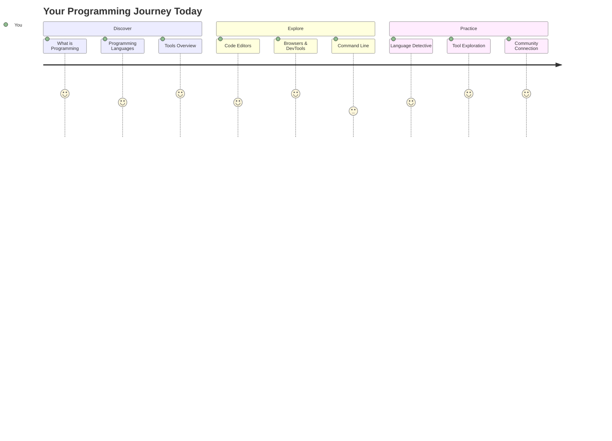
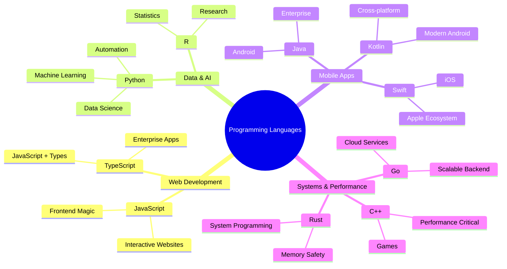
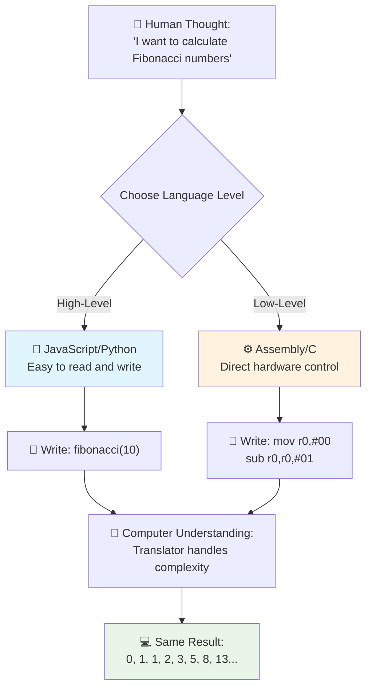
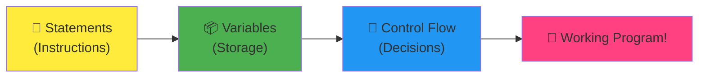
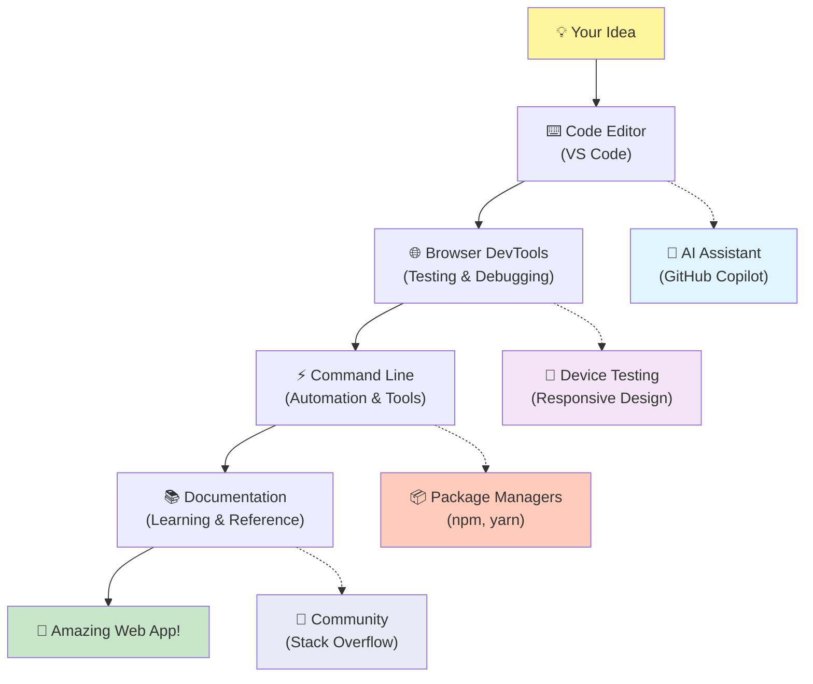
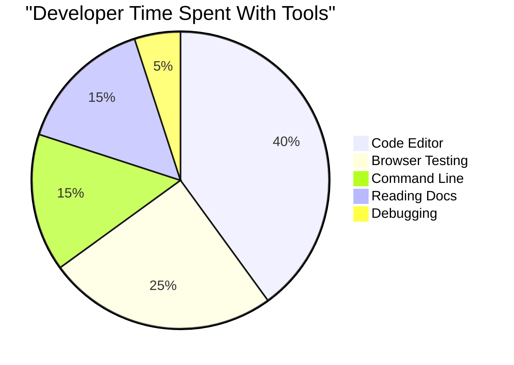
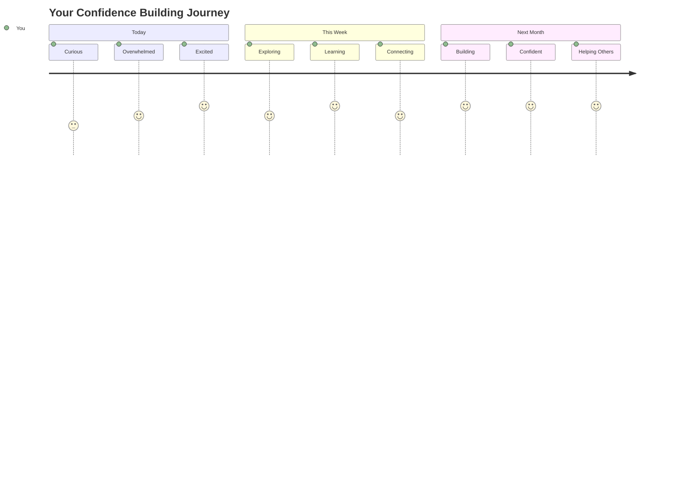

<!--
CO_OP_TRANSLATOR_METADATA:
{
  "original_hash": "d45ddcc54eb9232a76d08328b09d792e",
  "translation_date": "2025-11-04T00:46:36+00:00",
  "source_file": "1-getting-started-lessons/1-intro-to-programming-languages/README.md",
  "language_code": "tr"
}
-->
# Programlama Dillerine ve Modern Geliştirici Araçlarına Giriş

Merhaba, geleceğin geliştiricisi! 👋 Sana her gün beni heyecanlandıran bir şey söyleyebilir miyim? Programlamanın sadece bilgisayarlarla ilgili olmadığını, aynı zamanda en çılgın fikirlerini hayata geçirebilmek için gerçek süper güçlere sahip olmakla ilgili olduğunu keşfetmek üzeresin!

Hani en sevdiğin uygulamayı kullanırken her şeyin mükemmel bir şekilde çalıştığı o an var ya? Bir düğmeye dokunduğunda ve seni "vay, bunu nasıl yaptılar?" dedirten büyülü bir şey olduğunda? İşte, muhtemelen senin gibi biri – büyük ihtimalle gece 2'de favori kahve dükkanında üçüncü espressoyu içerken – o büyüyü yaratan kodu yazdı. Ve işte seni şaşırtacak şey: Bu dersin sonunda, sadece onların bunu nasıl yaptığını anlamakla kalmayacak, aynı zamanda bunu kendin denemek için sabırsızlanacaksın!

Bak, şu anda programlama gözünü korkutuyorsa seni tamamen anlıyorum. Ben ilk başladığımda, dürüst olmak gerekirse, matematik dahisi olman gerektiğini ya da beş yaşından beri kod yazıyor olman gerektiğini düşünmüştüm. Ama işte benim bakış açımı tamamen değiştiren şey: Programlama, yeni bir dilde konuşmayı öğrenmekle tamamen aynı. Önce "merhaba" ve "teşekkür ederim" ile başlıyorsun, sonra kahve sipariş etmeye kadar ilerliyorsun ve bir bakmışsın derin felsefi tartışmalar yapıyorsun! Ama bu durumda, bilgisayarlarla konuşuyorsun ve dürüst olmak gerekirse, onlar en sabırlı konuşma partnerleri – hatalarını asla yargılamazlar ve her zaman tekrar denemeye hazırdırlar!

Bugün, modern web geliştirmeyi sadece mümkün kılmakla kalmayıp, aynı zamanda ciddi anlamda bağımlılık yapan inanılmaz araçları keşfedeceğiz. Netflix, Spotify ve en sevdiğin bağımsız uygulama stüdyosundaki geliştiricilerin her gün kullandığı tam olarak aynı editörler, tarayıcılar ve iş akışlarından bahsediyorum. Ve işte seni mutlu dans ettirecek kısım: Bu profesyonel düzeydeki, endüstri standardı araçların çoğu tamamen ücretsiz!


> Sketchnote: [Tomomi Imura](https://twitter.com/girlie_mac)



## Neler Bildiğini Görelim!

Eğlenceli kısımlara geçmeden önce, merak ediyorum – bu programlama dünyası hakkında zaten neler biliyorsun? Ve eğer bu sorulara bakıp "Bunların hiçbirini bilmiyorum" diye düşünüyorsan, bu sadece normal değil, aynı zamanda harika! Bu, tam olarak doğru yerde olduğun anlamına geliyor. Bu testi bir egzersiz öncesi ısınma gibi düşün – sadece beyin kaslarını ısıtıyoruz!

[Ön ders sınavını yap](https://forms.office.com/r/dru4TE0U9n?origin=lprLink)

## Birlikte Çıkacağımız Macera

Tamam, bugün keşfedeceğimiz şeyler hakkında gerçekten çok heyecanlıyım! Cidden, bazı kavramlar kafanda oturduğunda yüzündeki ifadeyi görmeyi çok isterdim. İşte birlikte çıkacağımız inanılmaz yolculuk:

- **Programlama aslında nedir (ve neden en havalı şeydir!)** – Kodun, etrafındaki her şeyi, pazartesi sabahı olduğunu bir şekilde bilen alarmdan, Netflix önerilerini mükemmel bir şekilde düzenleyen algoritmaya kadar nasıl görünmez bir sihirle güçlendirdiğini keşfedeceğiz.
- **Programlama dilleri ve onların harika kişilikleri** – Farklı süper güçlere ve sorunları çözme yollarına sahip insanların olduğu bir partiye girdiğini hayal et. Programlama dili dünyası tam olarak böyle ve onları tanımayı çok seveceksin!
- **Dijital sihri mümkün kılan temel yapı taşları** – Bunları nihai yaratıcı LEGO seti olarak düşün. Bu parçaların nasıl bir araya geldiğini anladığında, hayal gücünün tasarladığı her şeyi gerçekten inşa edebileceğini fark edeceksin.
- **Profesyonel araçlar seni bir büyücünün asasını almış gibi hissettirecek** – Abartmıyorum – bu araçlar gerçekten sana süper güçlere sahipmişsin gibi hissettirecek ve en iyi kısmı? Profesyonellerin kullandığı araçların aynısı!

> 💡 **Şunu unutma**: Bugün her şeyi ezberlemeye çalışmayı aklından bile geçirme! Şu anda sadece mümkün olan şeyler hakkında heyecan duymanı istiyorum. Detaylar, birlikte pratik yaptıkça doğal olarak aklında kalacak – gerçek öğrenme böyle gerçekleşir!

> Bu dersi [Microsoft Learn](https://docs.microsoft.com/learn/modules/web-development-101/introduction-programming/?WT.mc_id=academic-77807-sagibbon) üzerinden alabilirsin!

## Peki Programlama Tam Olarak Nedir?

Tamam, şimdi milyon dolarlık soruyu ele alalım: Programlama gerçekten nedir?

Sana düşüncemi tamamen değiştiren bir hikaye anlatacağım. Geçen hafta, anneme yeni akıllı TV kumandamızı nasıl kullanacağını anlatmaya çalışıyordum. Kendimi "Kırmızı düğmeye bas, ama büyük kırmızı düğmeye değil, sol taraftaki küçük kırmızı düğmeye... hayır, diğer sol... tamam, şimdi iki saniye basılı tut, bir değil, üç değil..." derken buldum. Tanıdık geldi mi? 😅

İşte bu programlama! Güçlü bir şeye inanılmaz derecede ayrıntılı, adım adım talimatlar vermenin sanatıdır, ancak her şeyin mükemmel bir şekilde açıklanması gerekir. Ama bu sefer annene açıklamak yerine (ki "hangi kırmızı düğme?!" diye sorabilir), bir bilgisayara açıklıyorsun (ki o sadece tam olarak söylediğini yapar, söylediklerin tam olarak kastettiğin şey olmasa bile).

İlk öğrendiğimde beni şaşırtan şey şu oldu: Bilgisayarlar aslında temelde oldukça basit. Sadece iki şeyi anlıyorlar – 1 ve 0, bu da temelde "evet" ve "hayır" ya da "açık" ve "kapalı" demek. Hepsi bu! Ama işte burası büyülü hale geliyor – 1'ler ve 0'lar ile konuşmak zorunda değiliz, sanki Matrix'teymişiz gibi. İşte burada **programlama dilleri** imdada yetişiyor. Bunlar, normal insan düşüncelerini bilgisayar diline çeviren dünyanın en iyi çevirmeni gibi.

Ve işte her sabah uyandığımda beni hala heyecanlandıran şey: hayatındaki dijital her şey, muhtemelen pijamalarıyla bir fincan kahve içen ve dizüstü bilgisayarında kod yazan biriyle başladı. Seni kusursuz gösteren o Instagram filtresi? Biri onu kodladı. Seni yeni favori şarkına yönlendiren öneri? Bir geliştirici o algoritmayı oluşturdu. Arkadaşlarınla akşam yemeği hesabını bölüşmene yardımcı olan uygulama? Evet, biri "bu çok sinir bozucu, bunu düzeltebilirim" diye düşündü ve sonra... düzeltti!

Programlama öğrenirken sadece yeni bir beceri edinmiyorsun – aynı zamanda "Birinin gününü biraz daha iyi hale getirecek bir şey inşa edebilir miyim?" diye düşünen bu inanılmaz problem çözücüler topluluğunun bir parçası oluyorsun. Dürüst olmak gerekirse, bundan daha havalı bir şey olabilir mi?

✅ **Eğlenceli Bilgi Avı**: Boş bir anında araştırabileceğin süper havalı bir şey var – sence dünyanın ilk bilgisayar programcısı kimdi? Sana bir ipucu vereyim: beklediğin kişi olmayabilir! Bu kişinin hikayesi gerçekten büyüleyici ve programlamanın her zaman yaratıcı problem çözme ve kutunun dışında düşünme ile ilgili olduğunu gösteriyor.

### 🧠 **Durum Kontrolü: Kendini Nasıl Hissediyorsun?**

**Bir an dur ve düşün:**
- "Bilgisayarlara talimat vermek" fikri artık senin için anlamlı mı?
- Programlama ile otomatikleştirmek istediğin günlük bir görev düşünebiliyor musun?
- Bu programlama işi hakkında aklında hangi sorular belirmeye başladı?

> **Unutma**: Şu anda bazı kavramlar sana biraz karışık gelebilir, bu tamamen normal. Programlama öğrenmek, yeni bir dil öğrenmek gibidir – beyninin bu sinir yollarını oluşturması zaman alır. Harika gidiyorsun!

## Programlama Dilleri Farklı Büyü Türleri Gibidir

Tamam, bu biraz garip gelebilir ama benimle kal – programlama dilleri farklı müzik türleri gibidir. Şöyle düşün: caz var, yumuşak ve doğaçlamalı; rock güçlü ve doğrudan; klasik müzik zarif ve yapılandırılmış; hip-hop yaratıcı ve ifade dolu. Her stilin kendi havası, tutkulu hayran topluluğu var ve her biri farklı ruh halleri ve durumlar için mükemmel.

Programlama dilleri tam olarak aynı şekilde çalışır! Eğlenceli bir mobil oyun yapmak için kullandığın dili, büyük miktarda iklim verisini işlemek için kullanmazsın, tıpkı yoga dersinde death metal çalmayacağın gibi (şey, çoğu yoga dersinde en azından! 😄).

Ama her düşündüğümde beni gerçekten şaşırtan şey şu: Bu diller, yanınızda oturan dünyanın en sabırlı, en zeki tercümanı gibi. Fikirlerinizi insan beyninize doğal gelen bir şekilde ifade edebilirsiniz ve onlar, bunu bilgisayarların gerçekten konuştuğu 1'ler ve 0'lara çevirmek için tüm karmaşık işleri halleder. Bu, "insan yaratıcılığı" ve "bilgisayar mantığı" konusunda mükemmel derecede akıcı bir arkadaşınızın olması gibi – ve asla yorulmaz, asla kahve molasına ihtiyaç duymaz ve aynı soruyu iki kez sorduğunuz için sizi asla yargılamaz!

### Popüler Programlama Dilleri ve Kullanım Alanları



| Dil | En İyi Kullanım Alanı | Neden Popüler? |
|-----|-----------------------|----------------|
| **JavaScript** | Web geliştirme, kullanıcı arayüzleri | Tarayıcılarda çalışır ve etkileşimli web sitelerini güçlendirir |
| **Python** | Veri bilimi, otomasyon, yapay zeka | Okuması ve öğrenmesi kolay, güçlü kütüphaneler sunar |
| **Java** | Kurumsal uygulamalar, Android uygulamaları | Platformdan bağımsız, büyük sistemler için sağlam |
| **C#** | Windows uygulamaları, oyun geliştirme | Güçlü Microsoft ekosistemi desteği |
| **Go** | Bulut hizmetleri, arka uç sistemleri | Hızlı, basit, modern bilgi işlem için tasarlanmış |

### Yüksek Seviye vs. Düşük Seviye Diller

Tamam, bu kavramı ilk öğrendiğimde kafam karışmıştı, bu yüzden sonunda anlamamı sağlayan benzetmeyi paylaşacağım – umarım sana da yardımcı olur!

Bir dilini bilmediğin bir ülkeyi ziyaret ettiğini ve acilen en yakın tuvaleti bulman gerektiğini hayal et (hepimiz orada bulunduk, değil mi? 😅):

- **Düşük seviyeli programlama**, yerel lehçeyi o kadar iyi öğrenmek gibi ki, köşedeki meyve satan büyükanneyle kültürel referanslar, yerel argo ve sadece orada büyüyen birinin anlayabileceği esprilerle sohbet edebiliyorsun. Süper etkileyici ve inanılmaz derecede verimli... eğer akıcıysan! Ama sadece bir tuvalet bulmaya çalışıyorsan oldukça bunaltıcı olabilir.

- **Yüksek seviyeli programlama**, seni gerçekten anlayan harika bir yerel arkadaşın olması gibi. "Gerçekten bir tuvalet bulmam gerekiyor" diyebilirsin ve o tüm kültürel çeviriyi halleder ve sana mantıklı bir şekilde yol tarif eder.

Programlama terimleriyle:
- **Düşük seviyeli diller** (Assembly veya C gibi), bilgisayarın gerçek donanımıyla inanılmaz derecede ayrıntılı konuşmalar yapmanı sağlar, ancak bir makine gibi düşünmen gerekir, ki bu... şey, oldukça büyük bir zihinsel değişim!
- **Yüksek seviyeli diller** (JavaScript, Python veya C# gibi), insan gibi düşünmeni sağlar ve tüm makine konuşmasını sahne arkasında halleder. Ayrıca, yeni olmanın nasıl bir şey olduğunu hatırlayan ve gerçekten yardım etmek isteyen insanlarla dolu inanılmaz derecede sıcak topluluklara sahiptir!

Tahmin et bakalım, hangileriyle başlamanı önereceğim? 😉 Yüksek seviyeli diller, deneyimi çok daha keyifli hale getirdiği için asla çıkarmak istemeyeceğin destek tekerlekleri gibidir!



### Neden Yüksek Seviye Dillerin Daha Dostça Olduğunu Gösterelim

Tamam, şimdi yüksek seviyeli dilleri neden sevdiğimi mükemmel bir şekilde gösteren bir şey göstereceğim, ama önce – bana bir şey için söz vermelisin. İlk kod örneğini gördüğünde panik yapma! Korkutucu görünmesi gerekiyor. Tam olarak anlatmak istediğim şey bu!

Aynı görevi iki tamamen farklı tarzda yazılmış şekilde göreceğiz. İkisi de Fibonacci dizisini oluşturuyor – bu, her sayının kendisinden önceki iki sayının toplamı olduğu güzel bir matematiksel desen: 0, 1, 1, 2, 3, 5, 8, 13... (Eğlenceli bilgi: Bu deseni doğada her yerde bulabilirsiniz – ayçiçeği tohumlarının spiralleri, çam kozalağı desenleri, hatta galaksilerin oluşum şekilleri!)

Hazır mısın? Hadi başlayalım!

**Yüksek seviyeli dil (JavaScript) – İnsan dostu:**

```javascript
// Step 1: Basic Fibonacci setup
const fibonacciCount = 10;
let current = 0;
let next = 1;

console.log('Fibonacci sequence:');
```

**Bu kod ne yapıyor:**
- Fibonacci sayılarını oluşturmak için bir sabit **tanımlıyor**
- Dizideki mevcut ve sonraki sayıları takip etmek için iki değişken **başlatıyor**
- Fibonacci desenini tanımlayan başlangıç değerlerini (0 ve 1) **ayarlıyor**
- Çıktımızı tanımlayan bir başlık mesajı **gösteriyor**

```javascript
// Step 2: Generate the sequence with a loop
for (let i = 0; i < fibonacciCount; i++) {
  console.log(`Position ${i + 1}: ${current}`);
  
  // Calculate next number in sequence
  const sum = current + next;
  current = next;
  next = sum;
}
```

**Burada olanlar:**
- Bir `for` döngüsü kullanarak dizideki her pozisyonda **döngü yapıyor**
- Şablon dizesi biçimlendirmesi kullanarak her sayıyı pozisyonuyla birlikte **gösteriyor**
- Mevcut ve sonraki değerleri toplayarak bir sonraki Fibonacci sayısını **hesaplıyor**
- Bir sonraki yinelemeye geçmek için izleme değişkenlerini **güncelliyor**

```javascript
// Step 3: Modern functional approach
const generateFibonacci = (count) => {
  const sequence = [0, 1];
  
  for (let i = 2; i < count; i++) {
    sequence[i] = sequence[i - 1] + sequence[i - 2];
  }
  
  return sequence;
};

// Usage example
const fibSequence = generateFibonacci(10);
console.log(fibSequence);
```

**Yukarıda şunları yaptık:**
- Modern ok fonksiyonu sözdizimini kullanarak yeniden kullanılabilir bir fonksiyon **oluşturduk**
- Tek tek göstermek yerine tüm diziyi saklamak için bir dizi **oluşturduk**
- Önceki değerlerden her yeni sayıyı hesaplamak için dizi indekslemesini **kullandık**
- Programımızın diğer bölümlerinde esnek kullanım için tam diziyi **döndürdük**

**Düşük seviyeli dil (ARM Assembly) – Bilgisayar dostu:**

```assembly
 area ascen,code,readonly
 entry
 code32
 adr r0,thumb+1
 bx r0
 code16
thumb
 mov r0,#00
 sub r0,r0,#01
 mov r1,#01
 mov r4,#10
 ldr r2,=0x40000000
back add r0,r1
 str r0,[r2]
 add r2,#04
 mov r3,r0
 mov r0,r1
 mov r1,r3
 sub r4,#01
 cmp r4,#00
 bne back
 end
```

JavaScript versiyonunun neredeyse İngilizce talimatlar gibi okunduğunu, Assembly versiyonunun ise bilgisayarın işlemcisini doğrudan kontrol eden şifreli komutlar kullandığını fark edeceksiniz. İkisi de aynı görevi yerine getiriyor, ancak yüksek seviyeli dil, insanların anlaması, yazması ve sürdürmesi açısından çok daha kolay.

**Dikkat çeken temel farklar:**
- **Okunabilirlik**: JavaScript, `fibonacciCount` gibi açıklayıcı isimler kullanırken Assembly, `r0`, `r1` gibi şifreli etiketler kullanır.
- **Yorumlar**: Yüksek seviyeli diller, kodu kendi kendini belgeleyen hale getiren açıklayıcı yorumları teşvik eder.
- **Yapı**: JavaScript'in mantıksal akışı, insanların problemleri adım adım düşünme şekline uygundur.
- **Bakım**: JavaScript sürümünü farklı gereksinimlere göre güncellemek oldukça kolay ve anlaşılırdır.

✅ **Fibonacci dizisi hakkında**: Bu muhteşem sayı dizisi (her bir sayı kendisinden önceki iki sayının toplamına eşittir: 0, 1, 1, 2, 3, 5, 8...) doğada *her yerde* karşımıza çıkar! Ayçiçeği spirallerinde, çam kozalağı desenlerinde, nautilus kabuklarının kıvrımlarında ve hatta ağaç dallarının büyüme şeklinde bile görebilirsiniz. Matematik ve kodun, doğanın güzellik yaratmak için kullandığı desenleri anlamamıza ve yeniden yaratmamıza nasıl yardımcı olabileceği gerçekten akıl almaz!

## Sihri Gerçekleştiren Yapı Taşları

Tamam, programlama dillerinin nasıl göründüğünü gördüğünüze göre, şimdiye kadar yazılmış her programı oluşturan temel parçaları inceleyelim. Bunları favori tarifinizdeki temel malzemeler olarak düşünün – her birinin ne yaptığını anladığınızda, hemen hemen her dilde kod okuyup yazabileceksiniz!

Bu, programlamanın dilbilgisini öğrenmek gibi bir şey. Okulda isimler, fiiller ve cümleleri nasıl bir araya getireceğinizi öğrendiğiniz zamanı hatırlıyor musunuz? Programlamanın kendi dilbilgisi versiyonu var ve dürüst olmak gerekirse, İngilizce dilbilgisinden çok daha mantıklı ve affedici! 😄

### İfadeler: Adım Adım Talimatlar

**İfadeler** ile başlayalım – bunlar bilgisayarınızla yaptığınız bir konuşmadaki bireysel cümleler gibidir. Her ifade, bilgisayara belirli bir şey yapmasını söyler, tıpkı yönlendirme vermek gibi: "Buradan sola dön," "Kırmızı ışıkta dur," "Şu yere park et."

İfadelerle ilgili sevdiğim şey, genellikle ne kadar okunabilir olduklarıdır. Şuna bir göz atın:

```javascript
// Basic statements that perform single actions
const userName = "Alex";                    
console.log("Hello, world!");              
const sum = 5 + 3;                         
```

**Bu kodun yaptığı şey:**
- Kullanıcının adını saklamak için bir sabit değişken **tanımlayın**
- Konsol çıktısına bir karşılama mesajı **gösterin**
- Matematiksel bir işlemin sonucunu **hesaplayın** ve saklayın

```javascript
// Statements that interact with web pages
document.title = "My Awesome Website";      
document.body.style.backgroundColor = "lightblue";
```

**Adım adım neler oluyor:**
- Tarayıcı sekmesinde görünen web sayfasının başlığını **değiştirin**
- Tüm sayfa gövdesinin arka plan rengini **değiştirin**

### Değişkenler: Programınızın Hafıza Sistemi

Tamam, **değişkenler** öğretmeyi en sevdiğim kavramlardan biri çünkü zaten her gün kullandığınız şeylere çok benziyorlar!

Bir an için telefonunuzun kişi listesini düşünün. Herkesin telefon numarasını ezberlemezsiniz – bunun yerine "Anne," "En İyi Arkadaş" veya "Gece 2'ye kadar pizza getiren yer" gibi isimler kaydedersiniz ve telefonunuz gerçek numaraları hatırlar. Değişkenler tam olarak aynı şekilde çalışır! Programınızın bilgi saklayabileceği ve daha sonra mantıklı bir isim kullanarak bu bilgiyi alabileceği etiketli kaplar gibidir.

İşte gerçekten harika olan şey: değişkenler programınız çalışırken değişebilir (bu yüzden "değişken" adı verilmiş – ne kadar zekice değil mi?). Tıpkı daha iyi bir pizza yeri bulduğunuzda o kişi kaydını güncelleyebileceğiniz gibi, programınız yeni bilgiler öğrendikçe veya durumlar değiştikçe değişkenler güncellenebilir!

Bunun ne kadar basit olabileceğini göstereyim:

```javascript
// Step 1: Creating basic variables
const siteName = "Weather Dashboard";        
let currentWeather = "sunny";               
let temperature = 75;                       
let isRaining = false;                      
```

**Bu kavramları anlamak:**
- Değişmeyen değerleri `const` değişkenlerinde **saklayın** (örneğin site adı)
- Programınız boyunca değişebilecek değerler için `let` kullanın
- Farklı veri türleri atayın: metin (string), sayılar ve mantıksal değerler (true/false)
- Her değişkenin ne içerdiğini açıklayan açıklayıcı isimler **seçin**

```javascript
// Step 2: Working with objects to group related data
const weatherData = {                       
  location: "San Francisco",
  humidity: 65,
  windSpeed: 12
};
```

**Yukarıda şunları yaptık:**
- İlgili hava durumu bilgilerini bir arada gruplamak için bir nesne **oluşturduk**
- Birden fazla veri parçasını tek bir değişken adı altında **düzenledik**
- Her bir bilgi parçasını açıkça etiketlemek için anahtar-değer çiftlerini **kullandık**

```javascript
// Step 3: Using and updating variables
console.log(`${siteName}: Today is ${currentWeather} and ${temperature}°F`);
console.log(`Wind speed: ${weatherData.windSpeed} mph`);

// Updating changeable variables
currentWeather = "cloudy";                  
temperature = 68;                          
```

**Her bir kısmı anlamak:**
- `${}` sözdizimi ile şablon dizeleri kullanarak bilgi **gösterin**
- Nesne özelliklerine nokta notasyonu (`weatherData.windSpeed`) ile **erişin**
- Değişen koşulları yansıtmak için `let` ile tanımlanan değişkenleri **güncelleyin**
- Anlamlı mesajlar oluşturmak için birden fazla değişkeni **birleştirin**

```javascript
// Step 4: Modern destructuring for cleaner code
const { location, humidity } = weatherData; 
console.log(`${location} humidity: ${humidity}%`);
```

**Bilmeniz gerekenler:**
- Nesnelerden belirli özellikleri yapılandırma ataması kullanarak **çıkarın**
- Nesne anahtarlarıyla aynı isimlere sahip yeni değişkenler otomatik olarak **oluşturun**
- Tekrarlayan nokta notasyonundan kaçınarak kodu **basitleştirin**

### Kontrol Akışı: Programınıza Düşünmeyi Öğretmek

Tamam, işte programlamanın gerçekten akıl alıcı olduğu yer! **Kontrol akışı**, programınıza akıllı kararlar almayı öğretmek gibidir, tıpkı sizin her gün farkında bile olmadan yaptığınız gibi.

Şunu hayal edin: bu sabah muhtemelen "Eğer yağmur yağıyorsa, şemsiye alırım. Eğer hava soğuksa, ceket giyerim. Eğer geç kalıyorsam, kahvaltıyı atlar ve yolda kahve alırım." gibi bir şey yaşadınız. Beyniniz bu if-then mantığını her gün onlarca kez doğal olarak takip eder!

Bu, programların sıkıcı, tahmin edilebilir bir senaryoyu takip etmek yerine zeki ve canlı hissettirmesini sağlar. Gerçekten bir durumu inceleyebilir, neler olduğunu değerlendirebilir ve uygun şekilde tepki verebilirler. Bu, programınıza adapte olabilen ve seçim yapabilen bir beyin vermek gibidir!

Bunun ne kadar güzel çalıştığını görmek ister misiniz? Size göstereyim:

```javascript
// Step 1: Basic conditional logic
const userAge = 17;

if (userAge >= 18) {
  console.log("You can vote!");
} else {
  const yearsToWait = 18 - userAge;
  console.log(`You'll be able to vote in ${yearsToWait} year(s).`);
}
```

**Bu kodun yaptığı şey:**
- Kullanıcının yaşının oy verme gereksinimini karşılayıp karşılamadığını **kontrol edin**
- Koşul sonucuna göre farklı kod bloklarını **çalıştırın**
- Oy verme uygunluğu için kaç yıl kaldığını **hesaplayın** ve gösterin (18 yaş altındaysa)
- Her senaryo için özel, yardımcı geri bildirim **sağlayın**

```javascript
// Step 2: Multiple conditions with logical operators
const userAge = 17;
const hasPermission = true;

if (userAge >= 18 && hasPermission) {
  console.log("Access granted: You can enter the venue.");
} else if (userAge >= 16) {
  console.log("You need parent permission to enter.");
} else {
  console.log("Sorry, you must be at least 16 years old.");
}
```

**Burada neler oluyor:**
- `&&` (ve) operatörünü kullanarak birden fazla koşulu **birleştirin**
- Birden fazla senaryo için `else if` kullanarak bir koşul hiyerarşisi **oluşturun**
- Tüm olası durumları son bir `else` ifadesiyle **ele alın**
- Her farklı durum için açık, uygulanabilir geri bildirim **sağlayın**

```javascript
// Step 3: Concise conditional with ternary operator
const votingStatus = userAge >= 18 ? "Can vote" : "Cannot vote yet";
console.log(`Status: ${votingStatus}`);
```

**Hatırlamanız gerekenler:**
- Basit iki seçenekli koşullar için üçlü operatörü (`? :`) **kullanın**
- Koşulu önce yazın, ardından `?`, sonra doğru sonuç, ardından `:`, sonra yanlış sonuç
- Koşullara dayalı değerler atamanız gerektiğinde bu deseni **uygulayın**

```javascript
// Step 4: Handling multiple specific cases
const dayOfWeek = "Tuesday";

switch (dayOfWeek) {
  case "Monday":
  case "Tuesday":
  case "Wednesday":
  case "Thursday":
  case "Friday":
    console.log("It's a weekday - time to work!");
    break;
  case "Saturday":
  case "Sunday":
    console.log("It's the weekend - time to relax!");
    break;
  default:
    console.log("Invalid day of the week");
}
```

**Bu kod şunları gerçekleştirir:**
- Değişken değerini birden fazla belirli durumla **eşleştirin**
- Benzer durumları bir arada **gruplandırın** (hafta içi vs. hafta sonu)
- Eşleşme bulunduğunda uygun kod bloğunu **çalıştırın**
- Beklenmeyen değerleri ele almak için bir `default` durumu **ekleyin**
- Kodun bir sonraki duruma geçmesini önlemek için `break` ifadelerini **kullanın**

> 💡 **Gerçek dünya benzetmesi**: Kontrol akışını dünyanın en sabırlı GPS'ine sahip olmak gibi düşünün. "Eğer Main Street'te trafik varsa, otoyolu kullan. Eğer otoyol inşaat nedeniyle kapalıysa, manzaralı yolu dene." Programlar, farklı durumlara akıllıca tepki vermek ve her zaman kullanıcılara en iyi deneyimi sunmak için tam olarak bu tür koşullu mantığı kullanır.

### 🎯 **Kavram Kontrolü: Yapı Taşları Ustalığı**

**Temellerle nasıl ilerlediğinizi görelim:**
- Bir değişken ile bir ifade arasındaki farkı kendi kelimelerinizle açıklayabilir misiniz?
- Oy verme örneğimiz gibi bir if-then kararını kullanacağınız gerçek bir senaryo düşünün.
- Programlama mantığı hakkında sizi şaşırtan bir şey nedir?

**Hızlı güven artırıcı:**


✅ **Sırada ne var**: Bu inanılmaz yolculuğa devam ederken bu kavramları daha derinlemesine incelemek için harika bir zaman geçireceğiz! Şu anda, önünüzdeki tüm harika olasılıklar hakkında heyecan duymaya odaklanın. Belirli beceriler ve teknikler, birlikte pratik yaptıkça doğal olarak yerleşecek – bunun beklediğinizden çok daha eğlenceli olacağına söz veriyorum!

## İşin Araçları

Tamam, bu gerçekten beni o kadar heyecanlandırıyor ki kendimi zor tutuyorum! 🚀 Şimdi size dijital bir uzay gemisinin anahtarlarını teslim almış gibi hissettirecek inanılmaz araçlardan bahsedeceğiz.

Bir şefin ellerinin bir uzantısı gibi hissettiren mükemmel dengeli bıçakları olduğunu biliyor musunuz? Ya da bir müzisyenin dokunduğu anda şarkı söyleyen o bir gitarı? Geliştiricilerin kendi büyülü araçları var ve işte sizi tamamen şaşırtacak olan şey – bunların çoğu tamamen ücretsiz!

Bu araçları sizinle paylaşmayı düşündüğümde neredeyse sandalyemde zıplıyorum çünkü bunlar yazılım geliştirme şeklimizi tamamen değiştirdi. Kodunuzu yazmanıza yardımcı olabilecek yapay zeka destekli kodlama asistanlarından (şaka yapmıyorum!), Wi-Fi olan her yerden uygulamalar oluşturabileceğiniz bulut ortamlarına ve programlarınız için X-ray görüşü gibi olan son derece sofistike hata ayıklama araçlarına kadar konuşuyoruz.

Ve hala beni ürperten kısım: bunlar "başlangıç araçları" değil, zamanla vazgeçeceğiniz şeyler değil. Bunlar, şu anda Google, Netflix ve sevdiğiniz o bağımsız uygulama stüdyosundaki geliştiricilerin kullandığı tam profesyonel araçlar. Bunları kullanırken kendinizi tam bir profesyonel gibi hissedeceksiniz!



### Kod Editörleri ve IDE'ler: Yeni Dijital En İyi Arkadaşlarınız

Kod editörlerinden bahsedelim – bunlar gerçekten en sevdiğiniz yerler haline gelecek! Bunları dijital kreasyonlarınızı oluşturup mükemmelleştireceğiniz kişisel kodlama sığınağınız olarak düşünün.

Ama işte modern editörleri gerçekten büyülü yapan şey: sadece süslü metin editörleri değiller. Sanki en parlak, destekleyici kodlama mentoru 7/24 yanınızda oturuyormuş gibi. Hatalarınızı fark etmeden önce yakalar, sizi bir dahi gibi gösteren iyileştirmeler önerir, her bir kod parçasının ne yaptığını anlamanıza yardımcı olur ve bazıları ne yazmak üzere olduğunuzu tahmin edip düşüncelerinizi tamamlamayı bile teklif eder!

Otomatik tamamlama özelliğini ilk keşfettiğimde, kelimenin tam anlamıyla gelecekte yaşıyormuşum gibi hissettim. Bir şeyler yazmaya başlıyorsunuz ve editörünüz "Hey, tam olarak ihtiyacınız olan bu işlevi mi düşünüyordunuz?" diyor. Sanki bir zihin okuyucu kodlama arkadaşınız varmış gibi!

**Bu editörleri bu kadar inanılmaz yapan nedir?**

Modern kod editörleri, üretkenliğinizi artırmak için tasarlanmış etkileyici bir dizi özellik sunar:

| Özellik | Ne Yapar | Neden Yardımcı Olur |
|---------|----------|---------------------|
| **Sözdizimi Vurgulama** | Kodunuzun farklı bölümlerini renklendirir | Kodu okumayı ve hataları fark etmeyi kolaylaştırır |
| **Otomatik Tamamlama** | Yazarken kod önerir | Kodlamayı hızlandırır ve yazım hatalarını azaltır |
| **Hata Ayıklama Araçları** | Hataları bulmanıza ve düzeltmenize yardımcı olur | Sorun giderme süresinden tasarruf sağlar |
| **Eklentiler** | Özel özellikler ekler | Editörünüzü herhangi bir teknolojiye göre özelleştirir |
| **AI Asistanları** | Kod ve açıklamalar önerir | Öğrenmeyi ve üretkenliği hızlandırır |

> 🎥 **Video Kaynağı**: Bu araçları iş başında görmek ister misiniz? [İşin Araçları videosunu](https://youtube.com/watch?v=69WJeXGBdxg) inceleyerek kapsamlı bir genel bakış edinin.

#### Web Geliştirme için Önerilen Editörler

**[Visual Studio Code](https://code.visualstudio.com/?WT.mc_id=academic-77807-sagibbon)** (Ücretsiz)
- Web geliştiriciler arasında en popüler olanı
- Mükemmel eklenti ekosistemi
- Dahili terminal ve Git entegrasyonu
- **Mutlaka sahip olunması gereken eklentiler**:
  - [GitHub Copilot](https://marketplace.visualstudio.com/items?itemName=GitHub.copilot) - Yapay zeka destekli kod önerileri
  - [Live Share](https://marketplace.visualstudio.com/items?itemName=MS-vsliveshare.vsliveshare) - Gerçek zamanlı iş birliği
  - [Prettier](https://marketplace.visualstudio.com/items?itemName=esbenp.prettier-vscode) - Otomatik kod formatlama
  - [Code Spell Checker](https://marketplace.visualstudio.com/items?itemName=streetsidesoftware.code-spell-checker) - Kodunuzdaki yazım hatalarını yakalar

**[JetBrains WebStorm](https://www.jetbrains.com/webstorm/)** (Ücretli, öğrenciler için ücretsiz)
- Gelişmiş hata ayıklama ve test araçları
- Akıllı kod tamamlama
- Dahili sürüm kontrolü

**Bulut Tabanlı IDE'ler** (Farklı fiyatlandırma)
- [GitHub Codespaces](https://github.com/features/codespaces) - Tarayıcınızda tam VS Code
- [Replit](https://replit.com/) - Kod öğrenmek ve paylaşmak için harika
- [StackBlitz](https://stackblitz.com/) - Anında, tam yığın web geliştirme

> 💡 **Başlangıç İpucu**: Visual Studio Code ile başlayın – ücretsizdir, endüstride yaygın olarak kullanılır ve yardımcı eğitimler ve eklentiler oluşturan büyük bir topluluğa sahiptir.

### Web Tarayıcıları: Gizli Geliştirici Laboratuvarınız

Tamam, zihniniz tamamen uçmaya hazır olsun! Sosyal medyada gezinmek ve video izlemek için tarayıcıları nasıl kullandığınızı biliyorsunuz, değil mi? Peki, aslında bu inanılmaz gizli geliştirici laboratuvarını her zaman sakladıklarını ve keşfetmenizi beklediklerini biliyor muydunuz?

Bir web sayfasına sağ tıklayıp "Öğeyi İncele" seçeneğini her seçtiğinizde, yüzlerce dolar ödediğim pahalı yazılımlardan daha güçlü olan bu gizli geliştirici araçları dünyasını açıyorsunuz. Sanki sıradan mutfağınızın gizli bir panelin arkasında profesyonel bir şefin laboratuvarını sakladığını keşfetmek gibi!
Biri bana ilk kez tarayıcı geliştirici araçlarını gösterdiğinde, üç saat boyunca sadece tıklayıp "BEKLE, BUNU DA MI YAPABİLİYOR?!" diye şaşırarak vakit geçirdim. Gerçek zamanlı olarak herhangi bir web sitesini düzenleyebilir, her şeyin ne kadar hızlı yüklendiğini görebilir, sitenizin farklı cihazlarda nasıl göründüğünü test edebilir ve hatta JavaScript'i tam bir profesyonel gibi hata ayıklayabilirsiniz. Bu gerçekten akıl almaz bir şey!

**İşte tarayıcıların neden gizli silahınız olduğu:**

Bir web sitesi veya web uygulaması oluşturduğunuzda, gerçek dünyada nasıl göründüğünü ve davrandığını görmeniz gerekir. Tarayıcılar sadece çalışmalarınızı görüntülemekle kalmaz, aynı zamanda performans, erişilebilirlik ve olası sorunlar hakkında ayrıntılı geri bildirim sağlar.

#### Tarayıcı Geliştirici Araçları (DevTools)

Modern tarayıcılar kapsamlı geliştirme araçları içerir:

| Araç Kategorisi | Ne Yapar | Örnek Kullanım Durumu |
|-----------------|----------|-----------------------|
| **Element Inspector** | HTML/CSS'i gerçek zamanlı görüntüleyin ve düzenleyin | Stil ayarlarını hemen görmek için düzenleme yapın |
| **Console** | Hata mesajlarını görüntüleyin ve JavaScript'i test edin | Sorunları giderin ve kodla deney yapın |
| **Network Monitor** | Kaynakların nasıl yüklendiğini takip edin | Performansı ve yükleme sürelerini optimize edin |
| **Accessibility Checker** | Kapsayıcı tasarımı test edin | Sitenizin tüm kullanıcılar için çalıştığından emin olun |
| **Device Simulator** | Farklı ekran boyutlarında önizleme yapın | Birden fazla cihaz olmadan duyarlı tasarımı test edin |

#### Geliştirme İçin Önerilen Tarayıcılar

- **[Chrome](https://developers.google.com/web/tools/chrome-devtools/)** - Geniş dokümantasyona sahip endüstri standardı DevTools
- **[Firefox](https://developer.mozilla.org/docs/Tools)** - Mükemmel CSS Grid ve erişilebilirlik araçları
- **[Edge](https://docs.microsoft.com/microsoft-edge/devtools-guide-chromium/?WT.mc_id=academic-77807-sagibbon)** - Chromium tabanlı ve Microsoft'un geliştirici kaynaklarıyla birlikte

> ⚠️ **Önemli Test İpucu**: Web sitelerinizi her zaman birden fazla tarayıcıda test edin! Chrome'da mükemmel çalışan bir şey Safari veya Firefox'ta farklı görünebilir. Profesyonel geliştiriciler, tutarlı kullanıcı deneyimleri sağlamak için tüm büyük tarayıcılarda test yapar.

### Komut Satırı Araçları: Geliştirici Süper Güçlerine Açılan Kapı

Tamamen dürüst bir an paylaşalım, çünkü bunu gerçekten anlayan birinden duymanızı istiyorum. İlk gördüğümde – sadece korkutucu bir siyah ekran ve yanıp sönen metin – kelimenin tam anlamıyla "Hayır, kesinlikle hayır! Bu 1980'lerin hacker filmlerinden bir şey gibi görünüyor ve kesinlikle bunun için yeterince zeki değilim!" diye düşündüm. 😅

Ama keşke o zaman biri bana şunu söyleseydi ve şimdi size söylüyorum: komut satırı korkutucu değil – aslında bilgisayarınızla doğrudan bir konuşma yapmak gibi. Bunu, yemek siparişi verdiğiniz bir uygulama ile (güzel ve kolay) favori yerel restoranınıza gidip şefinize "bana harika bir şeyle sürpriz yap" dediğiniz arasındaki fark gibi düşünün.

Komut satırı, geliştiricilerin kendilerini tam bir büyücü gibi hissetmek için gittikleri yerdir. Birkaç sihirli kelime (tamam, sadece komutlar ama sihirli gibi hissediliyor!) yazarsınız, enter tuşuna basarsınız ve BAM – tüm proje yapıları oluşturmuş, dünyanın dört bir yanından güçlü araçlar yüklemiş veya uygulamanızı milyonlarca kişinin görebileceği şekilde internete yüklemiş olursunuz. Bu gücü bir kez tattığınızda, gerçekten bağımlılık yapıcı!

**Komut satırını neden seveceksiniz:**

Grafik arayüzler birçok görev için harika olsa da, komut satırı otomasyon, hassasiyet ve hızda üstünlük sağlar. Birçok geliştirme aracı esas olarak komut satırı arayüzleri aracılığıyla çalışır ve bunları verimli bir şekilde kullanmayı öğrenmek üretkenliğinizi önemli ölçüde artırabilir.

```bash
# Step 1: Create and navigate to project directory
mkdir my-awesome-website
cd my-awesome-website
```

**Bu kod ne yapar:**
- Projeniz için "my-awesome-website" adlı yeni bir dizin oluşturur
- Çalışmaya başlamak için yeni oluşturulan dizine geçiş yapar

```bash
# Step 2: Initialize project with package.json
npm init -y

# Install modern development tools
npm install --save-dev vite prettier eslint
npm install --save-dev @eslint/js
```

**Adım adım, burada olanlar:**
- `npm init -y` kullanarak varsayılan ayarlarla yeni bir Node.js projesi başlatır
- Hızlı geliştirme ve üretim yapıları için modern bir yapı aracı olan Vite'ı yükler
- Otomatik kod biçimlendirme için Prettier ve kod kalitesi kontrolleri için ESLint ekler
- `--save-dev` bayrağını kullanarak bunları yalnızca geliştirme bağımlılıkları olarak işaretler

```bash
# Step 3: Create project structure and files
mkdir src assets
echo '<!DOCTYPE html><html><head><title>My Site</title></head><body><h1>Hello World</h1></body></html>' > index.html

# Start development server
npx vite
```

**Yukarıda, şunları yaptık:**
- Kaynak kodu ve varlıklar için ayrı klasörler oluşturarak projemizi düzenledik
- Uygun belge yapısına sahip temel bir HTML dosyası oluşturduk
- Canlı yeniden yükleme ve sıcak modül değiştirme için Vite geliştirme sunucusunu başlattık

#### Web Geliştirme İçin Temel Komut Satırı Araçları

| Araç | Amaç | Neden İhtiyacınız Var? |
|------|------|------------------------|
| **[Git](https://git-scm.com/)** | Sürüm kontrolü | Değişiklikleri takip edin, başkalarıyla iş birliği yapın, çalışmalarınızı yedekleyin |
| **[Node.js & npm](https://nodejs.org/)** | JavaScript çalışma zamanı ve paket yönetimi | Tarayıcılar dışında JavaScript çalıştırın, modern geliştirme araçlarını yükleyin |
| **[Vite](https://vitejs.dev/)** | Yapı aracı ve geliştirme sunucusu | Sıcak modül değiştirme ile hızlı geliştirme |
| **[ESLint](https://eslint.org/)** | Kod kalitesi | JavaScript'teki sorunları otomatik olarak bulun ve düzeltin |
| **[Prettier](https://prettier.io/)** | Kod biçimlendirme | Kodunuzu tutarlı bir şekilde biçimlendirin ve okunabilirliğini artırın |

#### Platforma Özgü Seçenekler

**Windows:**
- **[Windows Terminal](https://docs.microsoft.com/windows/terminal/?WT.mc_id=academic-77807-sagibbon)** - Modern, özellik açısından zengin terminal
- **[PowerShell](https://docs.microsoft.com/powershell/?WT.mc_id=academic-77807-sagibbon)** 💻 - Güçlü bir betik ortamı
- **[Command Prompt](https://docs.microsoft.com/windows-server/administration/windows-commands/?WT.mc_id=academic-77807-sagibbon)** 💻 - Geleneksel Windows komut satırı

**macOS:**
- **[Terminal](https://support.apple.com/guide/terminal/)** 💻 - Dahili terminal uygulaması
- **[iTerm2](https://iterm2.com/)** - Gelişmiş özelliklere sahip terminal

**Linux:**
- **[Bash](https://www.gnu.org/software/bash/)** 💻 - Standart Linux kabuğu
- **[KDE Konsole](https://docs.kde.org/trunk5/en/konsole/konsole/index.html)** - Gelişmiş terminal emülatörü

> 💻 = İşletim sistemine önceden yüklenmiş

> 🎯 **Öğrenme Yolu**: `cd` (dizin değiştirme), `ls` veya `dir` (dosyaları listeleme) ve `mkdir` (klasör oluşturma) gibi temel komutlarla başlayın. `npm install`, `git status` ve `code .` (VS Code'da geçerli dizini açar) gibi modern iş akışı komutlarıyla pratik yapın. Daha rahat hale geldikçe, doğal olarak daha gelişmiş komutlar ve otomasyon tekniklerini öğrenirsiniz.

### Dokümantasyon: Her Zaman Ulaşılabilir Öğrenme Rehberiniz

Tamam, size bir sır vereyim, bu başlangıçta olmanızı çok daha iyi hissettirecek: en deneyimli geliştiriciler bile zamanlarının büyük bir kısmını dokümantasyon okuyarak geçirir. Ve bu, ne yaptıklarını bilmedikleri için değil – aslında bu bir bilgelik işaretidir!

Dokümantasyonu, dünyanın en sabırlı, bilgili öğretmenlerine 7/24 erişim sağlamak gibi düşünün. Gece 2'de bir sorunla mı karşılaştınız? Dokümantasyon, sıcak bir sanal kucaklama ve tam olarak ihtiyacınız olan cevapla orada. Herkesin konuştuğu yeni bir özellik hakkında bilgi mi edinmek istiyorsunuz? Dokümantasyon size adım adım örneklerle yardımcı olur. Bir şeyin neden bu şekilde çalıştığını anlamaya mı çalışıyorsunuz? Tahmin edin – dokümantasyon bunu nihayet anlamanızı sağlayacak şekilde açıklamaya hazır!

Bakış açımı tamamen değiştiren bir şey: web geliştirme dünyası inanılmaz hızlı hareket ediyor ve kimse (kesinlikle kimse!) her şeyi ezbere tutmuyor. 15+ yıllık deneyime sahip kıdemli geliştiricilerin temel sözdizimini aradığını gördüm ve biliyor musunuz? Bu utanç verici değil – bu akıllıca! Mesele mükemmel bir hafızaya sahip olmak değil; güvenilir cevapları hızlı bir şekilde bulmayı ve bunları nasıl uygulayacağınızı anlamayı bilmek.

**Gerçek sihir burada gerçekleşiyor:**

Profesyonel geliştiriciler zamanlarının önemli bir kısmını dokümantasyon okuyarak geçirir – bu, ne yaptıklarını bilmedikleri için değil, web geliştirme ortamı o kadar hızlı evrim geçiriyor ki güncel kalmak sürekli öğrenmeyi gerektiriyor. Harika dokümantasyon, bir şeyi nasıl kullanacağınızı değil, aynı zamanda neden ve ne zaman kullanacağınızı anlamanıza yardımcı olur.

#### Temel Dokümantasyon Kaynakları

**[Mozilla Developer Network (MDN)](https://developer.mozilla.org/docs/Web)**
- Web teknolojisi dokümantasyonu için altın standart
- HTML, CSS ve JavaScript için kapsamlı rehberler
- Tarayıcı uyumluluk bilgileri içerir
- Pratik örnekler ve etkileşimli demolar sunar

**[Web.dev](https://web.dev)** (Google tarafından)
- Modern web geliştirme en iyi uygulamaları
- Performans optimizasyon rehberleri
- Erişilebilirlik ve kapsayıcı tasarım ilkeleri
- Gerçek dünya projelerinden vaka çalışmaları

**[Microsoft Developer Documentation](https://docs.microsoft.com/microsoft-edge/#microsoft-edge-for-developers)**
- Edge tarayıcı geliştirme kaynakları
- İleri Web Uygulaması rehberleri
- Çapraz platform geliştirme içgörüleri

**[Frontend Masters Learning Paths](https://frontendmasters.com/learn/)**
- Yapılandırılmış öğrenme müfredatları
- Endüstri uzmanlarından video kursları
- Uygulamalı kodlama egzersizleri

> 📚 **Çalışma Stratejisi**: Dokümantasyonu ezberlemeye çalışmayın – bunun yerine, içinde nasıl gezinileceğini öğrenin. Sık kullanılan referansları yer imlerine ekleyin ve belirli bilgileri hızlı bir şekilde bulmak için arama işlevlerini kullanma pratiği yapın.

### 🔧 **Araç Ustalığı Kontrolü: Sizi En Çok Heyecanlandıran Nedir?**

**Bir an durup düşünün:**
- İlk olarak denemek için en çok hangi aracı merak ediyorsunuz? (Yanlış cevap yok!)
- Komut satırı hala korkutucu mu geliyor, yoksa merak mı uyandırıyor?
- Tarayıcı DevTools'u kullanarak favori web sitelerinizin perde arkasına bakmayı hayal edebiliyor musunuz?



> **Eğlenceli bilgi**: Çoğu geliştirici zamanlarının yaklaşık %40'ını kod editörlerinde geçirir, ancak test, öğrenme ve sorun çözme için ne kadar zaman harcadıklarına dikkat edin. Programlama sadece kod yazmakla ilgili değil – deneyimler yaratmakla ilgilidir!

✅ **Düşünce için yiyecek**: İşte ilginç bir şey – web siteleri oluşturmak için kullanılan araçlar (geliştirme) ile nasıl göründüklerini tasarlamak için kullanılan araçlar (tasarım) arasındaki farklar hakkında ne düşünüyorsunuz? Bu, güzel bir ev tasarlayan bir mimar ile onu gerçekten inşa eden müteahhit arasındaki fark gibidir. Her ikisi de çok önemlidir, ancak farklı alet çantalarına ihtiyaç duyarlar! Bu tür bir düşünce, web sitelerinin nasıl hayata geçtiğini daha büyük bir perspektifle görmenize gerçekten yardımcı olacaktır.

## GitHub Copilot Agent Challenge 🚀

Agent modunu kullanarak aşağıdaki meydan okumayı tamamlayın:

**Açıklama:** Modern bir kod editörü veya IDE'nin özelliklerini keşfedin ve bir web geliştirici olarak iş akışınızı nasıl geliştirebileceğini gösterin.

**Talimat:** Visual Studio Code, WebStorm veya bulut tabanlı bir IDE gibi bir kod editörü veya IDE seçin. Kod yazmayı, hata ayıklamayı veya kodu daha verimli bir şekilde sürdürmeyi kolaylaştıran üç özellik veya uzantıyı listeleyin. Her biri için, iş akışınıza nasıl fayda sağladığını kısaca açıklayın.

---

## 🚀 Meydan Okuma

**Tamam, dedektif, ilk davanı çözmeye hazır mısın?**

Şimdi bu harika temeli aldığınıza göre, programlama dünyasının ne kadar çeşitli ve büyüleyici olduğunu görmenize yardımcı olacak bir maceram var. Ve dinleyin – bu henüz kod yazmakla ilgili değil, bu yüzden endişelenmeyin! Kendinizi ilk heyecan verici davasında bir programlama dili dedektifi olarak düşünün!

**Göreviniz, kabul ederseniz:**
1. **Bir dil kaşifi olun**: Tamamen farklı evrenlerden üç programlama dili seçin – belki biri web siteleri oluşturuyor, biri mobil uygulamalar yapıyor ve biri bilim insanları için veri işliyor. Her dilde aynı basit görevin nasıl yazıldığını gösteren örnekler bulun. Aynı şeyi yaparken ne kadar farklı görünebileceklerine kesinlikle hayran kalacaksınız!

2. **Köken hikayelerini ortaya çıkarın**: Her dilin özel kılan nedir? İşte havalı bir gerçek – her bir programlama dili, birisi "Biliyor musunuz? Bu belirli sorunu çözmek için daha iyi bir yol olmalı." diye düşündüğü için yaratıldı. Bu sorunların ne olduğunu bulabilir misiniz? Bu hikayeler gerçekten büyüleyici!

3. **Topluluklarla tanışın**: Her dilin topluluğunun ne kadar misafirperver ve tutkulu olduğunu kontrol edin. Bazılarında milyonlarca geliştirici bilgi paylaşır ve birbirine yardım eder, diğerleri daha küçük ama inanılmaz derecede sıkı ve destekleyicidir. Bu toplulukların farklı kişiliklerini görmekten keyif alacaksınız!

4. **İçgüdülerinizi takip edin**: Şu anda size en yakın gelen dil hangisi? "Mükemmel" seçimi yapma konusunda endişelenmeyin – sadece içgüdülerinizi dinleyin! Burada kesinlikle yanlış bir cevap yok ve daha sonra diğerlerini keşfedebilirsiniz.

**Bonus dedektiflik çalışması**: Her dilde hangi büyük web sitelerinin veya uygulamaların oluşturulduğunu keşfedebilir misiniz? Instagram, Netflix veya durmadan oynadığınız o mobil oyunun neyle çalıştığını öğrenince kesinlikle şaşıracaksınız!

> 💡 **Unutmayın**: Bugün bu dillerden herhangi birinde uzman olmaya çalışmıyorsunuz. Sadece mahalleyi tanımaya çalışıyorsunuz, sonra nerede dükkan açmak istediğinize karar vereceksiniz. Zaman ayırın, bununla eğlenin ve merakınızın sizi yönlendirmesine izin verin!

## Keşfettiklerinizi Kutlayalım!

Aman Tanrım, bugün ne kadar inanılmaz bilgi öğrendiniz! Bu harika yolculuğun ne kadarının sizinle kaldığını görmek için gerçekten heyecanlıyım. Ve unutmayın – bu, her şeyi mükemmel yapmanız gereken bir test değil. Bu, öğrendiğiniz tüm harika şeyleri kutlamak gibi bir şey!

[Post-lesson quiz'i çözmek için tıklayın](https://ff-quizzes.netlify.app/web/)
## İnceleme ve Kendi Kendine Çalışma

**Zaman ayırın, keşfedin ve eğlenin!**

Bugün çok şey öğrendiniz ve bununla gurur duymalısınız! Şimdi eğlenceli kısım başlıyor – ilginizi çeken konuları keşfetmek. Unutmayın, bu bir ödev değil – bu bir macera!

**Sizi heyecanlandıran konulara daha derinlemesine dalın:**

**Programlama dilleriyle pratik yapın:**
- İlginizi çeken 2-3 dilin resmi web sitelerini ziyaret edin. Her birinin kendine özgü bir kişiliği ve hikayesi var!
- [CodePen](https://codepen.io/), [JSFiddle](https://jsfiddle.net/) veya [Replit](https://replit.com/) gibi çevrimiçi kodlama platformlarını deneyin. Denemekten çekinmeyin – hiçbir şeyi bozmazsınız!
- Sevdiğiniz programlama dilinin nasıl ortaya çıktığını okuyun. Gerçekten, bu köken hikayeleri büyüleyici ve dillerin neden bu şekilde çalıştığını anlamanıza yardımcı olacak.

**Yeni araçlarınızla rahat olun:**
- Henüz indirmediyseniz Visual Studio Code'u indirin – ücretsiz ve kesinlikle seveceksiniz!
- Uzantılar pazarında birkaç dakika geçirin. Kod editörünüz için bir uygulama mağazası gibi!
- Tarayıcınızın Geliştirici Araçlarını açın ve etrafta tıklayın. Her şeyi anlamaya çalışmayın – sadece orada neler olduğunu öğrenin.

**Topluluğa katılın:**
- [Dev.to](https://dev.to/), [Stack Overflow](https://stackoverflow.com/) veya [GitHub](https://github.com/) gibi geliştirici topluluklarını takip edin. Programlama topluluğu yeni başlayanlara inanılmaz derecede sıcak davranır!
- YouTube'da yeni başlayanlar için dostça kodlama videoları izleyin. Başlangıçta olmanın nasıl bir şey olduğunu hatırlayan harika içerik üreticiler var.
- Yerel buluşmalara veya çevrimiçi topluluklara katılmayı düşünün. Emin olun, geliştiriciler yeni başlayanlara yardım etmeyi çok sever!

> 🎯 **Dinleyin, hatırlamanızı istediğim şey şu**: Bir gecede kodlama uzmanı olmanız beklenmiyor! Şu anda, parçası olacağınız bu harika yeni dünyayı tanıyorsunuz. Zaman ayırın, yolculuğun tadını çıkarın ve unutmayın – hayranlık duyduğunuz her bir geliştirici bir zamanlar tam olarak sizin şu an oturduğunuz yerde oturuyordu, heyecanlı ve belki biraz bunalmış hissediyordu. Bu tamamen normal ve doğru yolda olduğunuz anlamına geliyor.


## Ödev

[Belgeleri Okuma](assignment.md)

> 💡 **Ödeviniz için küçük bir teşvik**: Henüz ele almadığımız bazı araçları keşfetmenizi çok isterim! Daha önce konuştuğumuz editörleri, tarayıcıları ve komut satırı araçlarını atlayın – keşfedilmeyi bekleyen harika bir geliştirme araçları evreni var. Aktif olarak sürdürülen ve canlı, yardımcı topluluklara sahip olanları arayın (bunlar genellikle en iyi eğitimlere ve takıldığınızda size yardım edecek en destekleyici insanlara sahiptir).

---

## 🚀 Programlama Yolculuğunuzun Zaman Çizelgesi

### ⚡ **Önümüzdeki 5 Dakikada Yapabilecekleriniz**
- [ ] İlginizi çeken 2-3 programlama dilinin web sitesini yer imlerine ekleyin
- [ ] Henüz yapmadıysanız Visual Studio Code'u indirin
- [ ] Tarayıcınızın Geliştirici Araçlarını (F12) açın ve herhangi bir web sitesinde etrafta tıklayın
- [ ] Bir programlama topluluğuna katılın (Dev.to, Reddit r/webdev veya Stack Overflow)

### ⏰ **Bu Saat İçinde Başarabilecekleriniz**
- [ ] Ders sonrası testi tamamlayın ve cevaplarınızı değerlendirin
- [ ] VS Code'u GitHub Copilot uzantısıyla kurun
- [ ] Çevrimiçi olarak 2 farklı programlama dilinde bir "Hello World" örneği deneyin
- [ ] YouTube'da "Bir Geliştiricinin Günlük Hayatı" videosu izleyin
- [ ] Programlama dili dedektiflik çalışmanıza başlayın (zorluktan)

### 📅 **Bir Haftalık Maceranız**
- [ ] Ödevi tamamlayın ve 3 yeni geliştirme aracını keşfedin
- [ ] Sosyal medyada 5 geliştiriciyi veya programlama hesabını takip edin
- [ ] CodePen veya Replit'te küçük bir şey oluşturmayı deneyin (hatta sadece "Merhaba, [Adınız]!" yazabilirsiniz!)
- [ ] Bir geliştiricinin kodlama yolculuğu hakkında bir blog yazısı okuyun
- [ ] Sanal bir buluşmaya katılın veya bir programlama konuşması izleyin
- [ ] Seçtiğiniz dili çevrimiçi eğitimlerle öğrenmeye başlayın

### 🗓️ **Bir Aylık Dönüşümünüz**
- [ ] İlk küçük projenizi oluşturun (basit bir web sayfası bile sayılır!)
- [ ] Açık kaynaklı bir projeye katkıda bulunun (belge düzeltmeleriyle başlayabilirsiniz)
- [ ] Programlama yolculuğuna yeni başlayan birine mentorluk yapın
- [ ] Geliştirici portföy web sitenizi oluşturun
- [ ] Yerel geliştirici toplulukları veya çalışma gruplarıyla bağlantı kurun
- [ ] Bir sonraki öğrenme hedefinizi planlamaya başlayın

### 🎯 **Son Düşünce Kontrolü**

**Devam etmeden önce kutlama yapın:**
- Bugün programlama hakkında sizi heyecanlandıran bir şey neydi?
- İlk olarak hangi aracı veya konsepti keşfetmek istiyorsunuz?
- Bu programlama yolculuğuna başlamak hakkında nasıl hissediyorsunuz?
- Şu anda bir geliştiriciye sormak istediğiniz bir soru nedir?



> 🌟 **Unutmayın**: Her uzman bir zamanlar bir acemiydi. Her kıdemli geliştirici bir zamanlar tam olarak sizin şu an hissettiğiniz gibi hissediyordu – heyecanlı, belki biraz bunalmış ve kesinlikle nelerin mümkün olduğunu merak ediyordu. Harika bir topluluktasınız ve bu yolculuk inanılmaz olacak. Programlamanın harika dünyasına hoş geldiniz! 🎉

---

**Feragatname**:  
Bu belge, AI çeviri hizmeti [Co-op Translator](https://github.com/Azure/co-op-translator) kullanılarak çevrilmiştir. Doğruluk için çaba göstersek de, otomatik çeviriler hata veya yanlışlıklar içerebilir. Belgenin orijinal dili, yetkili kaynak olarak kabul edilmelidir. Kritik bilgiler için profesyonel insan çevirisi önerilir. Bu çevirinin kullanımından kaynaklanan herhangi bir yanlış anlama veya yanlış yorumlama durumunda sorumluluk kabul edilmez.