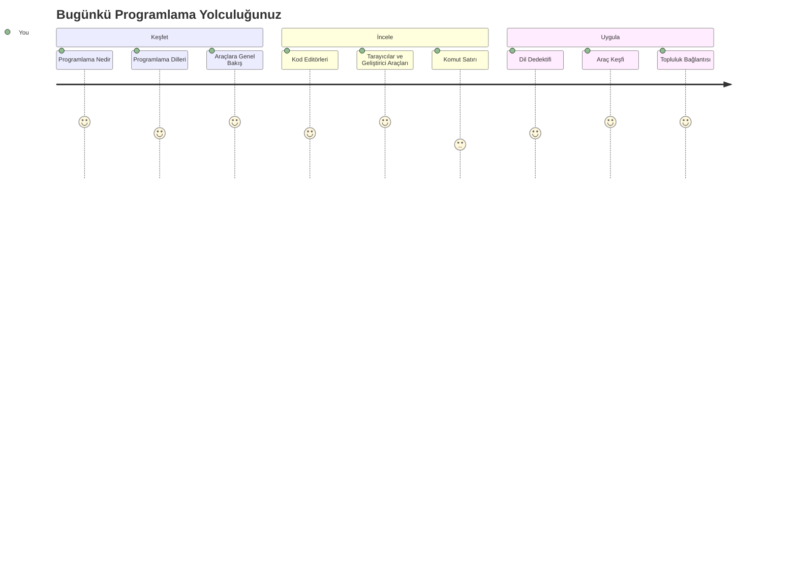
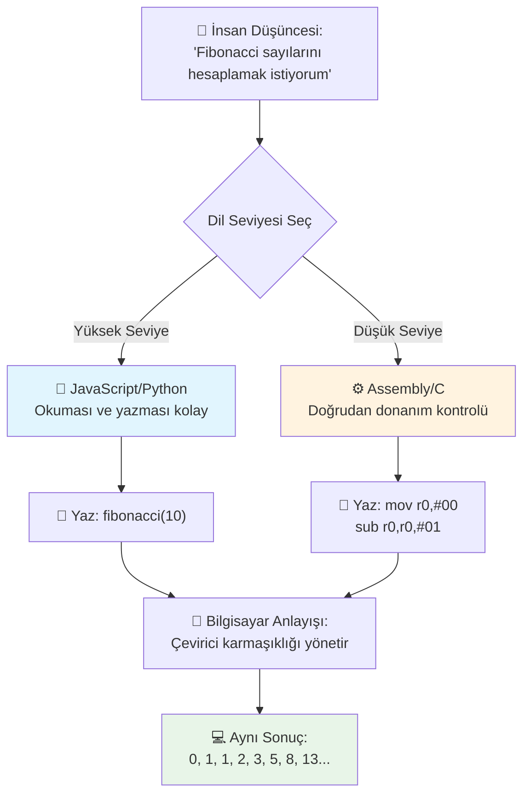
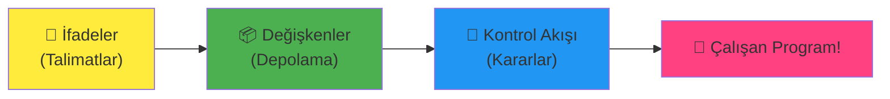
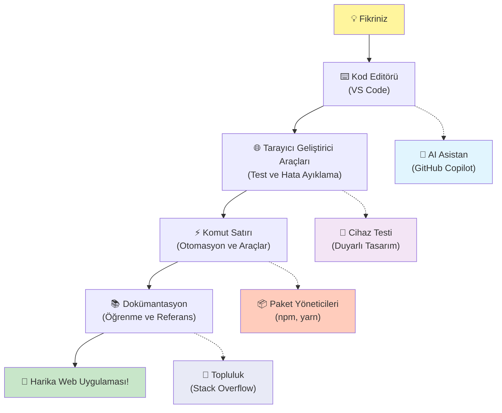
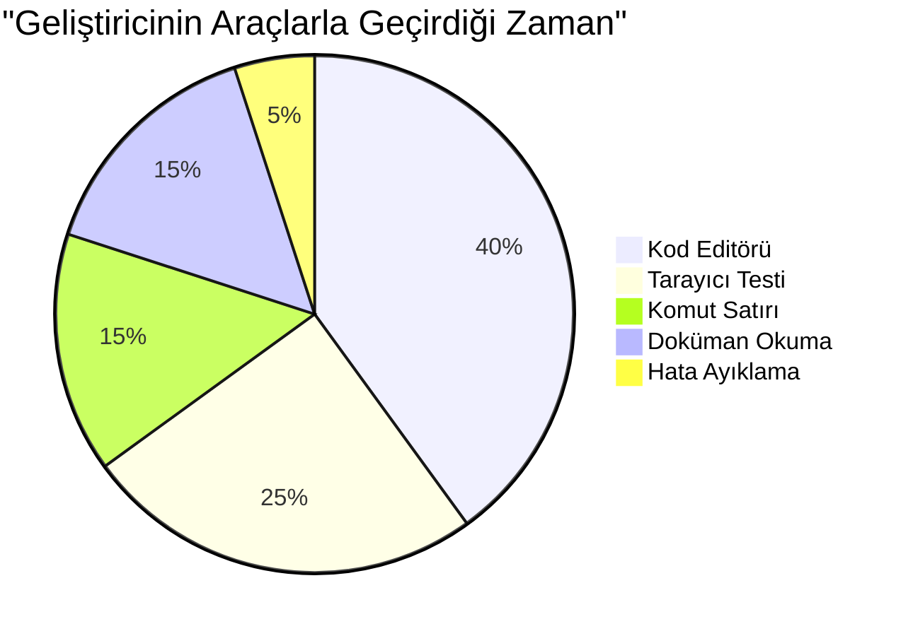
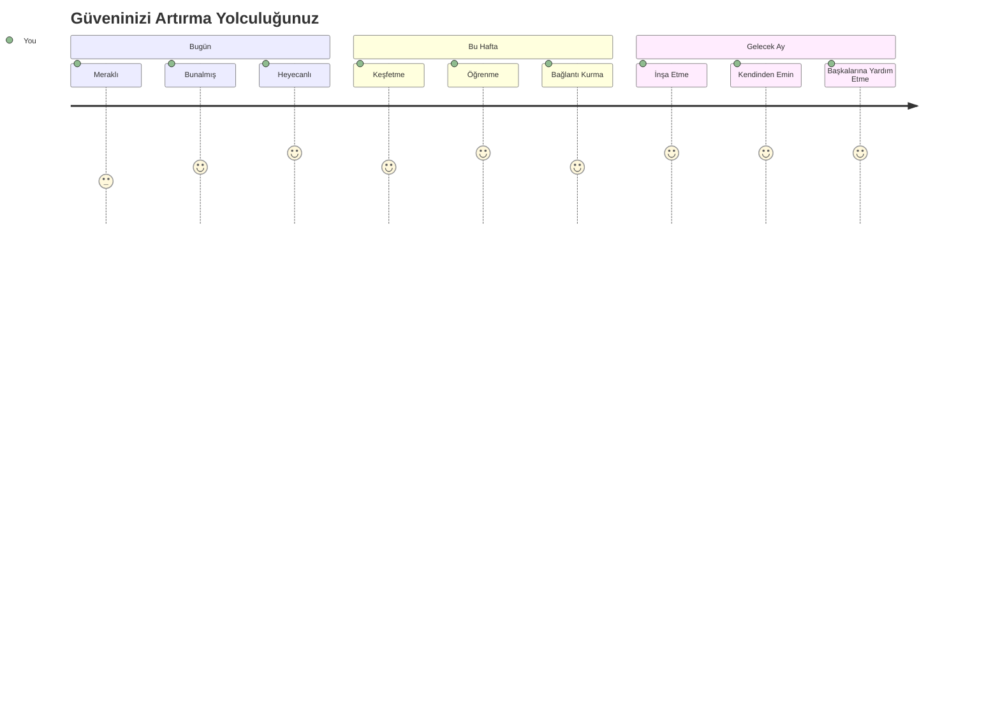

# Programlama Dillerine ve Modern Geliştirici Araçlarına Giriş

Merhaba, geleceğin geliştiricisi! 👋 Sana her gün tüylerimi diken diken eden bir şey söyleyebilir miyim? Programlama sadece bilgisayarlarla ilgili değil – hayallerindeki en çılgın fikirleri gerçeğe dönüştürme süper güçlerine sahip olmakla ilgili!

Favori uygulamanı kullanırken her şeyin mükemmel şekilde oturduğu o anı biliyor musun? Bir butona dokunduğunda öyle sihirli bir şey oluyor ki “vay, bunu NASIL yaptılar?” diye düşünüyorsun? İşte aynen senin gibi biri – muhtemelen en sevdiği kahve dükkanında sabah 2’de, üçüncü espressosunu içerken – o sihri yaratan kodu yazdı. Ve işte aklını başından alacak şey: bu dersin sonunda sadece onların nasıl yaptığını anlamakla kalmayacak, kendin de denemek için sabırsızlanacaksın!

Bak, programlama şu an gözünü korkutuyorsa bunu tamamen anlıyorum. Ben başladığımda, dürüst olmak gerekirse, bunun için biraz matematik dahisi olman ya da daha beş yaşındayken kodlama yapıyor olman gerektiğini düşünüyordum. Ama bakış açımı tamamen değiştiren şey şu oldu: programlama, yeni bir dilde konuşmayı öğrenmek gibidir. “Merhaba” ve “teşekkür ederim” ile başlarsın, sonra kahve siparişi vermeye geçersin ve farkına varmadan derin felsefi sohbetler yapıyor olursun! Ama burada, bilgisayarlarla konuşuyorsun ve gerçekten mi? Onlar hiç sabırsızlanmayan en sabırlı sohbet ortaklarıdır – hatalarını asla yargılamazlar ve tekrar denemek için her zaman heyecanlıdırlar!

Bugün, modern web geliştirmeyi sadece mümkün kılmakla kalmayan, aynı zamanda gerçekten bağımlılık yapan inanılmaz araçları keşfedeceğiz. Netflix, Spotify ve favori bağımsız uygulama stüdyolarındaki geliştiricilerin her gün kullandığı aynı metin editörleri, tarayıcılar ve iş akışları hakkında konuşacağız. Ve işte seni mutlu edecek kısım: çoğu bu profesyonel kalitedeki, endüstri standardı araçların tamamı tamamen ücretsiz!


> Sketchnote: [Tomomi Imura](https://twitter.com/girlie_mac)


```mermaid
journey
    title Bugünkü Programlama Yolculuğunuz
    section Keşfet
      Programlama Nedir: 5: You
      Programlama Dilleri: 4: You
      Araçlara Genel Bakış: 5: You
    section İncele
      Kod Editörleri: 4: You
      Tarayıcılar ve Geliştirici Araçları: 5: You
      Komut Satırı: 3: You
    section Uygula
      Dil Dedektifi: 4: You
      Araç Keşfi: 5: You
      Topluluk Bağlantısı: 5: You
```
## Zaten Neler Biliyorsun Bir Bakalım!

Eğlenceli kısma geçmeden önce merak ediyorum – programlama dünyası hakkında şimdiden neler biliyorsun? Ve bak, bu sorulara bakıp “Bunların hiçbirinden anlamıyorum” diye düşünüyorsan, bu sadece tamam değil, mükemmel! Bu demektir ki tam da doğru yerdesin. Bu sınavı egzersiz öncesi ısınma gibi düşün – beyin kaslarımızı ısıtıyoruz sadece!

[Derse başlamadan önce testi çöz](https://ff-quizzes.netlify.app/web/)


## Birlikte Çıkacağımız Macera

Tamam, bugün keşfedeceklerimize gerçekten çok heyecanlanıyorum! Cidden, bazı kavramlar yerine oturduğunda yüzünün ifadesini görmek isterdim. İşte birlikte çıkacağımız inanılmaz yolculuk:

- **Programlama nedir (ve neden en havalı şeydir!)** – Kodun, etrafındaki her şeyin görünmez sihirli gücü olduğunu keşfedeceğiz; Pazartesi sabahını bilen alarmdan, Netflix öneri algoritmasına kadar
- **Programlama dilleri ve onların harika kişilikleri** – Her kişinin farklı süper güçleri ve problem çözme yöntemleri olan bir partiye girdiğini hayal et. Programlama dili dünyası tam olarak böyle ve tanışmanı çok seveceksin!
- **Dijital sihrin temel yapı taşları** – Bunu mükemmel bir yaratıcı LEGO seti olarak düşün. Bu parçaların nasıl birleştiğini anladığında, hayal gücünün hayalini kurduğu her şeyi gerçekten inşa edebileceğini fark edeceksin
- **Sihirbazın asasını eline vermiş gibi hissettirecek profesyonel araçlar** – Abartmıyorum – bu araçlar gerçek anlamda süper güçlerin varmış gibi hissettirecek ve en güzel kısmı? Aynı araçları profesyoneller kullanıyor!

> 💡 **Şu önemli:** Bugün her şeyi ezberlemeye çalışma! Şu an sadece mümkün olan şeyler hakkında o heyecan kıvılcımını hissetmeni istiyorum. Detaylar birlikte pratik yaptıkça doğal olarak oturacak – gerçek öğrenme böyle olur!

> Bu dersi ayrıca [Microsoft Learn](https://learn.microsoft.com/en-us/learn/modules/web-development-101/introduction-programming/?WT.mc_id=academic-77807-sagibbon)’de de alabilirsin!

## Peki Programlama Tam Olarak *Nedir*?

Tamam, milyon dolarlık soruya geçelim: programlama gerçekten nedir?

Bu konuda düşüncemi tamamen değiştiren bir hikaye anlatayım. Geçen hafta anneme yeni akıllı televizyon kumandamızı nasıl kullanacağını anlatmaya çalışıyordum. Kendi kendime “Kırmızı tuşa bas, ama büyük kırmızı tuş değil, soldaki küçük kırmızı tuş... hayır, diğer solun... tamam, şimdi iki saniye basılı tut, bir değil, üç değil...” gibi şeyler söylüyordum. Tanıdık geliyor mu? 😅

İşte programlama bu! Çok güçlü ama her şeyi tam olarak adım adım anlatman gereken bir şeye inanılmaz detaylı talimatlar vermek sanatı. Ama annenin aksine (ki “hangi kırmızı tuş?!” diye sorabilir), bilgisayara anlatıyorsun (bilgisayar tam olarak söylediğin şeyi yapar, hatta söylediklerin tam olarak ne demek istediğin değilse bile).

İlk öğrendiğimde aklımı başımdan alan şu oldu: bilgisayarlar aslında temelde çok basit varlıklar. Aslında sadece iki şeyi anlarlar – 1 ve 0, yani temel olarak “evet” ve “hayır” ya da “açık” ve “kapalı.” Hepsi bu! Ama işte sihir tam burada başlıyor – biz 1 ve 0’larla “Matrix”teymişiz gibi konuşmak zorunda değiliz. İşte burada **programlama dilleri** devreye giriyor. Onlar senin tamamen normal, insan düşüncelerini bilgisayar diline çeviren dünyanın en iyi tercümanı gibi düşünülebilir.

Ve bu beni her sabah hala tüylerim diken diken eden şey: hayatındaki *her şey* dijital, muhtemelen pijamalı bir halde, elinde kahveyle oturan sıradan biri tarafından yazılan kodla başladı. Mükemmel görünmeni sağlayan Instagram filtresi? Biri o kodu yazdı. Yeni favori şarkını bulmana yol açan öneri? Geliştirici o algoritmayı oluşturdu. Arkadaşlarla hesabı bölmene yardım eden uygulama? Evet, biri “bu sinir bozucu, bunu kesinlikle düzeltebilirim” diye düşündü ve sonra... yaptı!

Programlamayı öğrendiğinde sadece yeni bir beceri edinmiyorsun – aynı zamanda her gün “Birinin gününü biraz daha iyi yapacak bir şey inşa etsem?” diye düşünen inanılmaz bir problem çözücü topluluğunun parçası oluyorsun. Dürüst olmak gerekirse, bundan daha havalı bir şey olabilir mi?

✅ **Eğlenceli Gerçek Avı:** Boş bir anında mutlaka bakmanı önerdiğim harika bir şey var – dünyadaki ilk bilgisayar programcısı kimdir? Sana ipucu vereyim: beklediğin kişi olmayabilir! Bu kişinin hikayesi tamamen büyüleyici ve programlamanın her zaman yaratıcı problem çözme ve kalıpların dışına çıkmakla ilgili olduğunu gösteriyor.

### 🧠 **İyi misin? Ne hissediyorsun?**

**Bir an durup düşün:**
- “Bilgisayarlara talimat vermek” fikri şimdi senin için mantıklı mı?
- Günlük bir işi programlama ile otomatikleştirmek istediğin bir şey var mı?
- Bu programlama meselesiyle ilgili kafanda kaynayan sorular neler?

> **Unutma:** Bazı kavramları şu an bulanık hissetmen tamamen normal. Programlama öğrenmek yeni bir dil öğrenmek gibidir – beyninin sinirsel bağlantılar oluşturması zaman alır. Çok iyi gidiyorsun!

## Programlama Dilleri, Farklı Sihir Tatları Gibidir

Tamam, bu biraz garip gelecek ama beni dinle – programlama dilleri farklı müzik türlerine çok benzer. Düşün: caz, akıcı ve doğaçlama, rock güçlü ve direkt, klasik zarif ve yapılandırılmış, hip-hop yaratıcı ve ifadeli. Her tarzın kendi atmosferi, tutkulu takipçileri ve farklı ruh halleri ile durumlar için uygun olan kendine has bir yapısı vardır.

Programlama dilleri de tam olarak böyle çalışır! Aynı dili, devasa iklim verilerini analiz etmek için kullanmazsın, aynı şekilde eğlenceli bir mobil oyun geliştirmek için de kullanmazsın; tıpkı yoga sınıfında death metal çalmazsın (çoğu yoga sınıfında en azından! 😄).

Ama yazmayı her düşündüğümde beni şaşkına çeviren şey şu: bu diller, dünyanın en sabırlı, parlak tercümanının tam yanındaki yerde oturması gibi. Sen fikirlerini insan beynine doğal gelen şekilde ifade edebilirsin ve onlar bunu bilgisayarların anladığı 1 ve 0’a çevirmek için inanılmaz karmaşık işleri üstlenir. “İnsan yaratıcılığı” ve “bilgisayar mantığı”na tamamen hakim bir arkadaşın varmış gibi – hiç yorulmazlar, kahve molası vermezler ve aynı soruyu iki kez sormanı asla yargılamazlar!

### Popüler Programlama Dilleri ve Kullanım Alanları


```mermaid
mindmap
  root((Programlama Dilleri))
    Web Geliştirme
      JavaScript
        Ön Yüz Büyüsü
        Etkileşimli Web Siteleri
      TypeScript
        JavaScript + Türler
        Kurumsal Uygulamalar
    Veri & AI
      Python
        Veri Bilimi
        Makine Öğrenimi
        Otomasyon
      R
        İstatistik
        Araştırma
    Mobil Uygulamalar
      Java
        Android
        Kurumsal
      Swift
        iOS
        Apple Ekosistemi
      Kotlin
        Modern Android
        Çoklu Platform
    Sistemler & Performans
      C++
        Oyunlar
        Performans Kritik
      Rust
        Bellek Güvenliği
        Sistem Programlama
      Go
        Bulut Servisleri
        Ölçeklenebilir Arka Uç
```
| Dil | En İyi Olduğu Alan | Popüler Olma Nedeni |
|----------|----------|------------------|
| **JavaScript** | Web geliştirme, kullanıcı arayüzleri | Tarayıcılarda çalışır ve interaktif web sitelerini güçlendirir |
| **Python** | Veri bilimi, otomasyon, yapay zeka | Okuması ve öğrenmesi kolay, güçlü kütüphaneler |
| **Java** | Kurumsal uygulamalar, Android uygulamaları | Platform bağımsız, büyük sistemler için sağlam |
| **C#** | Windows uygulamaları, oyun geliştirme | Güçlü Microsoft ekosistemi desteği |
| **Go** | Bulut servisleri, arka uç sistemleri | Hızlı, basit, modern bilişim için tasarlanmış |

### Yüksek Seviyeli ve Düşük Seviyeli Diller

Tamam, açıkçası bu ilk öğrendiğimde beynimi yakan konseptti, bu yüzden sonunda benim için tık diye oturan benzetmeyi paylaşacağım – ve umarım senin için de faydalı olur!

Bir ülkede bulunduğunu düşün, o ülkenin dilini bilmiyorsun ve çaresizce en yakın tuvaleti bulman gerekiyor (hepimiz bu durumda kaldık değil mi? 😅):

- **Düşük seviyeli programlama**, semtte meyve satan büyükannenle kültürel referanslar, yerel argo ve sadece orada yetişen birinin anlayacağı iç şakalarla sohbet edecek kadar yerel dili öğrenmek gibidir. Çok etkileyici ve inanılmaz verimli... eğer akıcıysan! Ama sadece tuvaleti bulmaya çalışıyorsan oldukça karmaşık.

- **Yüksek seviyeli programlama** ise harika, seni anlayan bir yerel arkadaşın olması gibidir. Düz İngilizceyle “Gerçekten tuvaleti bulmam lazım” diyorsun ve o bütün kültürel çeviriyi yapıp, senin dışarıdan gelen beynine son derece mantıklı olacak şekilde yol gösteriyor.

Programlama terimleriyle:
- **Düşük seviyeli diller** (Assembly ya da C gibi) bilgisayarın gerçek donanımıyla çok detaylı konuşmanı sağlar ama makine gibi düşünmen gerekir ki... bu büyük bir zihinsel değişim demektir!
- **Yüksek seviyeli diller** (JavaScript, Python veya C# gibi) senin insan gibi düşünmene izin verir, arkada tüm makine dilini onlar halleder. Üstelik, bu dillere ait inanılmaz sıcak topluluklar vardır – bunlar yeni başlayanların halini hatırlar ve gerçekten yardımcı olmak ister!

Tahmin et, başlangıçta hangilerini öneriyorum? 😉 Yüksek seviyeli diller, daha keyifli bir deneyim yaşaman için aslında asla bırakmak istemeyeceğin küçük destek tekerlekleri gibidir!


```mermaid
flowchart TB
    A["👤 İnsan Düşüncesi:<br/>'Fibonacci sayılarını hesaplamak istiyorum'"] --> B{Dil Seviyesi Seç}
    
    B -->|Yüksek Seviye| C["🌟 JavaScript/Python<br/>Okuması ve yazması kolay"]
    B -->|Düşük Seviye| D["⚙️ Assembly/C<br/>Doğrudan donanım kontrolü"]
    
    C --> E["📝 Yaz: fibonacci(10)"]
    D --> F["📝 Yaz: mov r0,#00<br/>sub r0,r0,#01"]
    
    E --> G["🤖 Bilgisayar Anlayışı:<br/>Çevirici karmaşıklığı yönetir"]
    F --> G
    
    G --> H["💻 Aynı Sonuç:<br/>0, 1, 1, 2, 3, 5, 8, 13..."]
    
    style C fill:#e1f5fe
    style D fill:#fff3e0
    style H fill:#e8f5e8
```
### Neden Yüksek Seviyeli Diller Daha Dostane Gösteriyorum?

Tamam, şimdi yüksek seviyeli dilleri neden sevdiğimi mükemmel gösteren bir şey göstereceğim ama önce bir söz vermeni istiyorum. İlk kod örneğini gördüğünde panik yapma! Gözünü korkutması lazım, tam da bunun için orada!

İki tamamen farklı stil ile yazılmış aynı göreve bakacağız. İkisi de Fibonacci dizisini oluşturuyor – bu, her sayının kendisinden önceki iki sayının toplamı olduğu güzel bir matematiksel örüntü: 0, 1, 1, 2, 3, 5, 8, 13... (Eğlenceli gerçek: Bu örüntüyü doğada her yerde görürsün – ayçiçeği tohum spiralleri, kozalak desenleri, hatta galaksilerin oluşumunda bile!)

Farkı görmek ister misin? Hadi bakalım!

**Yüksek seviyeli dil (JavaScript) – İnsan dostu:**

```javascript
// Adım 1: Temel Fibonacci ayarı
const fibonacciCount = 10;
let current = 0;
let next = 1;

console.log('Fibonacci sequence:');
```

**Bu kod ne yapar:**
- İstediğimiz Fibonacci sayısı miktarını belirtmek için bir sabit **tanımlar**
- Dizideki mevcut ve sonraki sayıları takip etmek için iki değişkeni **başlatır**
- Fibonacci modelini tanımlayan başlangıç değerlerini (0 ve 1) **ayarlar**
- Çıktıyı tanımlamak için bir başlık mesajı **gösterir**

```javascript
// Adım 2: Döngü ile diziyi oluştur
for (let i = 0; i < fibonacciCount; i++) {
  console.log(`Position ${i + 1}: ${current}`);
  
  // Dizideki sonraki sayıyı hesapla
  const sum = current + next;
  current = next;
  next = sum;
}
```

**Burada olanları parçalayalım:**
- `for` döngüsü kullanarak dizideki her pozisyonda **döner**
- Her sayıyı yer numarasıyla birlikte şablon dizisi biçiminde **gösterir**
- Mevcut ve sonraki değerleri toplayarak bir sonraki Fibonacci sayısını **hesaplar**
- Bir sonraki yinelemeye geçmek için takip değişkenlerini **günceller**

```javascript
// Adım 3: Modern fonksiyonel yaklaşım
const generateFibonacci = (count) => {
  const sequence = [0, 1];
  
  for (let i = 2; i < count; i++) {
    sequence[i] = sequence[i - 1] + sequence[i - 2];
  }
  
  return sequence;
};

// Kullanım örneği
const fibSequence = generateFibonacci(10);
console.log(fibSequence);
```

**Yukarıda şunları yaptık:**
- Modern ok fonksiyonu söz dizimiyle tekrar kullanılabilir bir fonksiyon **oluşturduk**
- Sıralamayı teker teker göstermek yerine tamamını tutacak bir dizi **inşa ettik**
- Önceki değerlerden her yeni sayıyı hesaplamak için dizi indekslemeyi **kullandık**
- Programımızın başka bölümlerinde esnek kullanım için tam diziyi **döndürdük**

**Düşük seviyeli dil (ARM Assembly) – Bilgisayar dostu:**

```assembly
 area ascen,code,readonly
 entry
 code32
 adr r0,thumb+1
 bx r0
 code16
thumb
 mov r0,#00
 sub r0,r0,#01
 mov r1,#01
 mov r4,#10
 ldr r2,=0x40000000
back add r0,r1
 str r0,[r2]
 add r2,#04
 mov r3,r0
 mov r0,r1
 mov r1,r3
 sub r4,#01
 cmp r4,#00
 bne back
 end
```

JavaScript sürümü neredeyse İngilizce talimatlar gibi okunurken, Assembly sürümü bilgisayarın işlemcisini doğrudan kontrol eden şifreli komutlar kullanır. İkisi de aynı görevi yapar ama yüksek seviyeli dil insanın anlaması, yazması ve sürdürmesi çok daha kolaydır.

**Dikkat edeceğin temel farklar:**
- **Okunabilirlik**: JavaScript, `fibonacciCount` gibi açıklayıcı isimler kullanırken Assembly, `r0`, `r1` gibi gizemli etiketler kullanır  
- **Yorumlar**: Üst düzey diller, kodu kendini belgeleyen hâle getiren açıklayıcı yorumları teşvik eder  
- **Yapı**: JavaScript'in mantıksal akışı, insanların problemleri adım adım düşünme şekline uyar  
- **Bakım**: JavaScript sürümünü farklı gereksinimler için güncellemek açık ve basittir  

✅ **Fibonacci dizisi hakkında**: Bu kesinlikle muhteşem sayı dizisi (her sayı kendisinden önceki iki sayının toplamına eşittir: 0, 1, 1, 2, 3, 5, 8...) doğada kelimenin tam anlamıyla *her yerde* ortaya çıkar! Ayçiçeği spirallerinde, çam kozalağı desenlerinde, nautilus kabuklarının kıvrımında ve hatta ağaç dallarının büyüme şeklinde bulabilirsiniz. Matematik ve kodun doğanın güzelliği yaratmak için kullandığı desenleri anlamamıza ve yeniden üretmemize nasıl yardımcı olabileceği gerçekten büyüleyici!  

## Büyünün Gerçekleşmesini Sağlayan Yapı Taşları  

Tamam, şimdi programlama dillerinin nasıl göründüğünü gördüğünüze göre, yazılmış olan her programı oluşturan temel parçaları parçalayalım. Bunları favori tarifinizdeki temel malzemeler gibi düşünün – her birinin ne işe yaradığını anladığınızda, hemen hemen her dilde kod okuyup yazabilirsiniz!  

Bu, programlamanın dilbilgisini öğrenmek gibi bir şey. Okulda isimleri, fiilleri ve cümlelerin nasıl birleştirildiğini öğrendiğinizi hatırlıyor musunuz? Programlamanın kendi dilbilgisi var ve dürüst olmak gerekirse, İngilizce dilbilgisinden çok daha mantıklı ve affedicidir! 😄  

### İfadeler: Adım Adım Talimatlar  

**İfadeler** ile başlayalım – bunlar bilgisayarınızla yapılan konuşmadaki bireysel cümleler gibidir. Her ifade bilgisayara belli bir işi yapmasını söyler, bir anlamda "Burada sola dön," "Kırmızı ışıkta dur," "Şu park yerine park et" gibi talimatlar vermek gibidir.  

İfadelerin okunabilir olmasını seviyorum. Şuna bakın:  

```javascript
// Tek bir işlem gerçekleştiren temel ifadeler
const userName = "Alex";                    
console.log("Hello, world!");              
const sum = 5 + 3;                         
```
  
**Bu kodun yaptığı şeyler:**  
- Bir kullanıcının adını saklamak için sabit değişken **tanımla**  
- Konsol çıkışında bir selamlama mesajı **göster**  
- Bir matematiksel işlemin sonucunu **hesapla** ve sakla  

```javascript
// Web sayfalarıyla etkileşimde bulunan ifadeler
document.title = "My Awesome Website";      
document.body.style.backgroundColor = "lightblue";
```
  
**Adım adım olanlar:**  
- Tarayıcı sekmesinde görünen web sayfasının başlığını **değiştir**  
- Sayfa gövdesinin arka plan rengini **değiştir**  

### Değişkenler: Programınızın Hafıza Sistemi  

Tamam, **değişkenler** doğrusu öğretebileceğim en sevdiğim kavramlardan çünkü her gün zaten kullandığınız şeylere çok benziyorlar!  

Telefonunuzun rehberini düşünün bir saniye. Herkesin telefon numarasını ezberlemezsiniz – bunun yerine "Anne," "En İyi Arkadaş," ya da "Sabaha Kadar Paket Servisi Yapan Pizza" gibi isimler kaydedersiniz ve telefon numaraları sizin için hatırlar. Değişkenler de aynı şekilde çalışır! Programınızın bilgi saklayıp daha sonra anlamlı bir isimle geri çağırabileceği etiketlenmiş kaplar gibidir.  

Asıl güzel olan şu ki: değişkenler programınız çalışırken değişebilir (buna değişken denmesinin sebebi budur – fark ettiniz mi?). Nasıl ki daha iyi bir pizza yeri keşfedince telefon rehberinizi güncelliyorsanız, değişkenler de programınız yeni bilgi öğrendikçe ya da durumlar değiştikçe güncellenebilir!  

Ne kadar kolay olduğunu göstereyim:  

```javascript
// Adım 1: Temel değişkenlerin oluşturulması
const siteName = "Weather Dashboard";        
let currentWeather = "sunny";               
let temperature = 75;                       
let isRaining = false;                      
```
  
**Bu kavramlar şunlar demektir:**  
- Sabit değerleri `const` değişkenlerde **sakla** (site adı gibi)  
- Program boyunca değişebilecek değerler için `let` **kullan**  
- Farklı veri tiplerini ata: stringler (metin), sayılar ve booleanlar (doğru/yanlış)  
- Her değişkenin ne içerdiğini anlatan açıklayıcı isimler **seç**  

```javascript
// Adım 2: İlgili verileri gruplamak için nesnelerle çalışmak
const weatherData = {                       
  location: "San Francisco",
  humidity: 65,
  windSpeed: 12
};
```
  
**Yukarıda şunları yaptık:**  
- İlgili hava durumu bilgilerini gruplamak için bir nesne **oluşturduk**  
- Birden fazla veriyi tek bir değişken adı altında **düzenledik**  
- Her bilgi parçasını açıkça etiketlemek için anahtar-değer çiftleri **kullandık**  

```javascript
// Adım 3: Değişkenleri kullanma ve güncelleme
console.log(`${siteName}: Today is ${currentWeather} and ${temperature}°F`);
console.log(`Wind speed: ${weatherData.windSpeed} mph`);

// Değiştirilebilir değişkenleri güncelleme
currentWeather = "cloudy";                  
temperature = 68;                          
```
  
**Her parçayı anlama:**  
- `${}` sözdizimiyle şablon dizeleri kullanarak bilgi **görüntüle**  
- Nokta gösterimi (`weatherData.windSpeed`) ile nesne özelliklerine **eriş**  
- Değişen koşulları yansıtmak için `let` ile tanımlanan değişkenleri **güncelle**  
- Anlamlı mesajlar oluşturmak için birden fazla değişkeni **birleştir**  

```javascript
// Adım 4: Daha temiz kod için modern parçalama
const { location, humidity } = weatherData; 
console.log(`${location} humidity: ${humidity}%`);
```
  
**Bilmeniz gerekenler:**  
- Nesnelerden belirli özellikleri ayıklamak için yapı bozunumu ataması **kullan**  
- Nesne anahtarlarıyla aynı isimde yeni değişkenler otomatik olarak **oluştur**  
- Tekrarlayan nokta gösterimini önleyerek kodu **basitleştir**  

### Kontrol Akışı: Programınıza Düşünmeyi Öğretmek  

Tamam, burası programlamanın gerçekten akıl almaz olduğu kısım! **Kontrol akışı**, temelde programınıza sizin her gün farkında bile olmadan yaptığınız gibi akıllıca kararlar vermeyi öğretmektir.  

Şunu hayal edin: bugün sabah muhtemelen şöyle bir şey yaptınız; "Eğer yağmur yağıyorsa şemsiye alırım. Eğer hava soğuksa ceket giyerim. Eğer geç kalıyorsam kahvaltıyı atlar ve yolda kahve alırım." Beyniniz bu if-o halde mantığını onlarca kez doğal olarak takip ediyor!  

Programların zeki ve canlı hissettiren tarafı burasıdır; yani sadece sıkıcı, önceden belli bir senaryoyu takip eden scriptler değiller. Durumu görüp değerlendirebilir ve uygun şekilde tepki verebilirler. Programınıza uygun şekilde uyum sağlayıp seçim yapabilen bir beyin vermek gibi!  

Bunun ne kadar güzel çalıştığını görmek ister misiniz? Gösteriyorum:  

```javascript
// Adım 1: Temel koşullu mantık
const userAge = 17;

if (userAge >= 18) {
  console.log("You can vote!");
} else {
  const yearsToWait = 18 - userAge;
  console.log(`You'll be able to vote in ${yearsToWait} year(s).`);
}
```
  
**Bu kodun yaptığı şeyler:**  
- Kullanıcının yaşının oy kullanma şartlarını karşılayıp karşılamadığını **kontrol et**  
- Koşul sonucuna göre farklı kod blokları **çalıştır**  
- 18 yaş altındaysa oy kullanmaya ne kadar zaman kaldığını **hesapla** ve göster  
- Her senaryo için spesifik ve faydalı geri bildirim **ver**  

```javascript
// Adım 2: Mantıksal operatörlerle birden fazla koşul
const userAge = 17;
const hasPermission = true;

if (userAge >= 18 && hasPermission) {
  console.log("Access granted: You can enter the venue.");
} else if (userAge >= 16) {
  console.log("You need parent permission to enter.");
} else {
  console.log("Sorry, you must be at least 16 years old.");
}
```
  
**Burada olanların çözümlemesi:**  
- `&&` (ve) operatörü ile birden çok koşulu **birleştir**  
- Çoklu durumlar için `else if` kullanarak koşulların hiyerarşisini **oluştur**  
- Tüm olası durumları son `else` ifadesiyle **ele al**  
- Her farklı durum için net ve uygulanabilir geri bildirim sağla  

```javascript
// Adım 3: Üçlü operatör ile özlü koşul
const votingStatus = userAge >= 18 ? "Can vote" : "Cannot vote yet";
console.log(`Status: ${votingStatus}`);
```
  
**Unutulmaması gerekenler:**  
- Basit iki seçenekli koşullar için Ternary operatörü (`? :`) **kullan**  
- Önce koşulu yaz, ardından `?`, sonra doğru sonucu, sonra `:`, sonra yanlış sonucu yaz  
- Değer ataması gereken durumlarda bu kalıbı **uygula**  

```javascript
// Adım 4: Birden fazla belirli durumu ele alma
const dayOfWeek = "Tuesday";

switch (dayOfWeek) {
  case "Monday":
  case "Tuesday":
  case "Wednesday":
  case "Thursday":
  case "Friday":
    console.log("It's a weekday - time to work!");
    break;
  case "Saturday":
  case "Sunday":
    console.log("It's the weekend - time to relax!");
    break;
  default:
    console.log("Invalid day of the week");
}
```
  
**Bu kod şu işleri yapıyor:**  
- Değişken değerini birden çok özel durumla **eşleştir**  
- Benzer durumları (hafta içi vs. hafta sonu) **gruplandır**  
- Eşleşme bulununca ilgili kod bloğunu **çalıştır**  
- Beklenmedik değerleri ele almak için `default` durumunu **dahil et**  
- Sonraki duruma geçmemesi için `break` ifadelerini **kullan**  

> 💡 **Gerçek dünya benzetmesi**: Kontrol akışını, size dünyanın en sabırlı GPS cihazının yol göstermesi gibi düşünün. "Ana cadde üzerinde trafik varsa otoyolu kullan," "Otoyolda yol çalışması varsa manzaralı yoldan git" diyebilir. Programlar farklı durumlara akıllıca yanıt vermek ve kullanıcıya en iyi deneyimi sağlamak için aynı tür koşullu mantığı kullanır.  

### 🎯 **Kavram Sınama: Yapı Taşlarında Ustalık**  

**Temeller konusunda durum nasıl bakıyoruz:**  
- Kendi kelimelerinizle bir değişken ile bir ifade arasındaki farkı açıklayabilir misiniz?  
- Bir if-o halde kararını gerçek hayatta nerede kullanabileceğinizi düşünün (oy verme örneğimiz gibi)  
- Programlama mantığı hakkında sizi şaşırtan bir şey neydi?  

**Hızlı güven artırıcı:**  

```mermaid
flowchart LR
    A["📝 İfadeler<br/>(Talimatlar)"] --> B["📦 Değişkenler<br/>(Depolama)"] --> C["🔀 Kontrol Akışı<br/>(Kararlar)"] --> D["🎉 Çalışan Program!"]
    
    style A fill:#ffeb3b
    style B fill:#4caf50
    style C fill:#2196f3
    style D fill:#ff4081
```  
✅ **Sırada ne var:** Bu inanılmaz yolculuğa birlikte devam ederken bu kavramların derinlerine dalmak çok eğlenceli olacak! Şu anda, önünüzdeki tüm harika olasılıklar için heyecanınızı hissetmeye odaklanın. Özelleşmiş beceriler ve teknikler, birlikte pratik yaparken doğal şekilde yerleşecek – bu, düşündüğünüzden çok daha eğlenceli olacak, söz veriyorum!  

## Ticaretin Araçları  

Tamam, burası gerçekten heyecanımı gizleyemediğim yer! 🚀 Size dijital bir uzay gemisinin anahtarlarını yeni almışsınız gibi hissettirecek inanılmaz araçlardan bahsedeceğiz.  

Bir şefin elinin uzantısı gibi hissettiren mükemmel dengedeki bıçakları olduğunu bilirsiniz ya da bir müzisyenin ona dokunduğu anda sanki şarkı söyleyen gitarı gibi? İşte geliştiricilerin de kendi sihirli araçlarının versiyonu var ve sizi kesinlikle çok şaşırtacak bir şey – bunların çoğu tamamen ücretsiz!  

Bunları sizle paylaşacak olmaktan neredeyse yerimde duramıyorum çünkü yazılım geliştirme şeklimizi tamamen devrim yarattılar. Kodunuzu yazmanıza yardım eden yapay zeka destekli asistanlardan (şaka yapmıyorum!), Wi-Fi ile her yerden tüm uygulamalar inşa edebileceğiniz bulut ortamlarına ve programlarınıza röntgen vizyonu gibi detaylarla hata ayıklama araçlarına kadar bahsediyoruz.  

Ve hâlâ tüylerimi diken diken eden kısım: bunlar "yeni başlayan araçları" değil. Google, Netflix ve sevdiğiniz o bağımsız uygulama stüdyosunda geliştiricilerin tam şu anda kullandığı tam profesyonel seviyedeki araçlar. Onları kullanırken kendinizi tam bir profesyonel gibi hissedeceksiniz!  


```mermaid
graph TD
    A["💡 Fikriniz"] --> B["⌨️ Kod Editörü<br/>(VS Code)"] 
    B --> C["🌐 Tarayıcı Geliştirici Araçları<br/>(Test ve Hata Ayıklama)"]
    C --> D["⚡ Komut Satırı<br/>(Otomasyon ve Araçlar)"]
    D --> E["📚 Dokümantasyon<br/>(Öğrenme ve Referans)"]
    E --> F["🚀 Harika Web Uygulaması!"]
    
    B -.-> G["🤖 AI Asistan<br/>(GitHub Copilot)"]
    C -.-> H["📱 Cihaz Testi<br/>(Duyarlı Tasarım)"]
    D -.-> I["📦 Paket Yöneticileri<br/>(npm, yarn)"]
    E -.-> J["👥 Topluluk<br/>(Stack Overflow)"]
    
    style A fill:#fff59d
    style F fill:#c8e6c9
    style G fill:#e1f5fe
    style H fill:#f3e5f5
    style I fill:#ffccbc
    style J fill:#e8eaf6
```  
### Kod Editörleri ve IDE'ler: Yeni Dijital En İyi Arkadaşlarınız  

Kod editörlerinden bahsedelim – bunlar ciddi anlamda yeni favori takılma yeriniz olmaya çok yakın! Onları, dijital yaratıcılığınızı şekillendirip mükemmelleştirmek için en çok zaman geçireceğiniz kişisel kodlama sığınağınız gibi düşünün.  

Ama modern editörlerin en büyüleyici yanı şu: sadece gösterişli metin editörleri değiller. Onlar, 7/24 yanınızda oturan en parlak ve destekleyici kodlama eğitmeni gibiler. Hatalarınızı fark etmeden önce yakalarlar, sizi dahi gibi gösterecek geliştirme önerileri sunarlar, her satırın ne yaptığını anlamanıza yardım ederler ve hatta bazılarınız yazmakta olduğunuz şeyi tahmin edip düşüncelerinizi bitirmeyi teklif ederler!  

İlk otomatik tamamlama özelliğini keşfettiğim günü hatırlıyorum – gelecekte yaşıyormuşum gibi hissediyordum. Bir şey yazmaya başlıyorsun, editörün "Hey, tam ihtiyacın olan fonksiyon bu muydu?" diye soruyor. Resmen kodlama yoldaşı olarak bir zihin okuyucunuz var!  

**Bu editörleri bu kadar muhteşem yapan nedir?**  

Modern kod editörleri üretkenliğinizi artırmak için etkileyici özellikler sunar:  

| Özellik | Yaptığı Şey | Neden Yardımcıdır |  
|---------|-------------|-------------------|  
| **Sözdizimi Vurgulama** | Kodunuzun farklı kısımlarını renklendirir | Kodu okumayı ve hata bulmayı kolaylaştırır |  
| **Otomatik Tamamlama** | Yazarken kod önerir | Kodlamayı hızlandırır ve yazım hatalarını azaltır |  
| **Hata Ayıklama Araçları** | Hataları bulup düzeltmenize yardımcı olur | Sorun giderme süresinden saatler kazandırır |  
| **Eklentiler** | Özel özellikler ekler | Editörünüzü her teknolojiye göre özelleştirir |  
| **Yapay Zeka Asistanları** | Kod ve açıklama önerir | Öğrenmeyi ve üretkenliği hızlandırır |  

> 🎥 **Video Kaynağı**: Bu araçları canlı görmeyi ister misiniz? Kapsamlı bir genel bakış için şu [Tools of the Trade video](https://youtube.com/watch?v=69WJeXGBdxg) bağlantısını inceleyin.  

#### Web Geliştirme için Önerilen Editörler  

**[Visual Studio Code](https://code.visualstudio.com/?WT.mc_id=academic-77807-sagibbon)** (Ücretsiz)  
- Web geliştiricileri arasında en popüler  
- Mükemmel eklenti ekosistemi  
- Yerleşik terminal ve Git entegrasyonu  
- **Olmazsa olmaz eklentiler**:  
  - [GitHub Copilot](https://marketplace.visualstudio.com/items?itemName=GitHub.copilot) - Yapay zeka destekli kod önerileri  
  - [Live Share](https://marketplace.visualstudio.com/items?itemName=MS-vsliveshare.vsliveshare) - Gerçek zamanlı iş birliği  
  - [Prettier](https://marketplace.visualstudio.com/items?itemName=esbenp.prettier-vscode) - Otomatik kod formatlama  
  - [Code Spell Checker](https://marketplace.visualstudio.com/items?itemName=streetsidesoftware.code-spell-checker) - Kodunuzdaki yazım hatalarını yakalar  

**[JetBrains WebStorm](https://www.jetbrains.com/webstorm/)** (Ücretli, öğrenciler için ücretsiz)  
- Gelişmiş hata ayıklama ve test araçları  
- Akıllı kod tamamlama  
- Yerleşik sürüm kontrolü  

**Bulut Tabanlı IDE'ler** (Farklı fiyatlandırmalar)  
- [GitHub Codespaces](https://github.com/features/codespaces) - Tarayıcınızda tam VS Code  
- [Replit](https://replit.com/) - Kod öğrenme ve paylaşma için harika  
- [StackBlitz](https://stackblitz.com/) - Anında tam yığın web geliştirme  

> 💡 **Başlarken İpucu**: Visual Studio Code ile başlayın – ücretsiz, sektörde yaygın kullanılıyor ve devasa bir topluluk faydalı eğitimler ve eklentiler oluşturuyor.  

### Web Tarayıcıları: Gizli Geliştirme Laboratuvarınız  

Tamam, aklınız tamamen karışmaya hazır olun! Sosyal medyada gezinmek veya video izlemek için tarayıcılar kullandığınızı biliyorsunuz değil mi? Aslında bu araçlar, sizin keşfetmenizi bekleyen inanılmaz bir gizli geliştirici laboratuvarını tüm bu zaman boyunca saklıyormuş!  

Her defasında bir web sayfasına sağ tıklayıp "Öğeyi İncele" seçeneğini tıklıyorsunuz; işte bu, gerçekten pahalı bazı yazılımlardan çok daha güçlü olan gizli geliştirici araçlarının kapısını açıyor. Sıradan mutfağınızın gizli bir panelin ardında profesyonel bir şefin laboratuvarı olduğunu keşfetmek gibi!
Birisi bana ilk kez tarayıcı Geliştirici Araçlarını gösterdiğinde, üç saat boyunca etrafta tıklayıp "BEKLE, ONU DA MI YAPABİLİYOR?!" diye hayret ettim. Gerçek zamanlı olarak herhangi bir web sitesini düzenleyebilir, her şeyin ne kadar hızlı yüklendiğini tam olarak görebilir, sitenizin farklı cihazlarda nasıl göründüğünü test edebilir ve hatta JavaScript’i tam bir profesyonel gibi hata ayıklayabilirsiniz. Bu kesinlikle akıl almaz!

**İşte tarayıcıların senin gizli silahın olmasının nedeni:**

Bir web sitesi veya web uygulaması oluşturduğunda, gerçek dünyada nasıl göründüğünü ve davrandığını görmen gerekir. Tarayıcılar yalnızca eserini göstermez, aynı zamanda performans, erişilebilirlik ve olası problemler hakkında ayrıntılı geri bildirim sunar.

#### Tarayıcı Geliştirici Araçları (DevTools)

Modern tarayıcılar kapsamlı geliştirme paketleri içerir:

| Araç Kategorisi | Ne Yapar | Örnek Kullanım Durumu |
|-----------------|----------|----------------------|
| **Element Denetleyicisi** | HTML/CSS’i gerçek zamanlı görüntüle ve düzenle | Hemen sonuç görmek için stil ayarlarını değiştir |
| **Konsol** | Hata mesajlarını gör ve JavaScript test et | Problemleri hata ayıkla ve kodla denemeler yap |
| **Ağ İzleyicisi** | Kaynakların nasıl yüklendiğini takip et | Performansı ve yükleme sürelerini optimize et |
| **Erişebilirlik Denetleyicisi** | Kapsayıcı tasarımı test et | Sitenin tüm kullanıcılar için çalışmasını sağla |
| **Cihaz Simülatörü** | Farklı ekran boyutlarında önizleme yap | Çoklu cihaz kullanmadan duyarlı tasarımı test et |

#### Geliştirme için Önerilen Tarayıcılar

- **[Chrome](https://developers.google.com/web/tools/chrome-devtools/)** – Kapsamlı dokümantasyona sahip endüstri standardı DevTools
- **[Firefox](https://developer.mozilla.org/docs/Tools)** – Mükemmel CSS Grid ve erişilebilirlik araçları
- **[Edge](https://docs.microsoft.com/microsoft-edge/devtools-guide-chromium/?WT.mc_id=academic-77807-sagibbon)** – Microsoft’un geliştirici kaynaklarıyla Chromium tabanlı

> ⚠️ **Önemli Test İpucu**: Web sitelerinizi mutlaka birden fazla tarayıcıda test edin! Chrome’da mükemmel çalışan şey Safari veya Firefox’ta farklı görünebilir. Profesyonel geliştiriciler, tutarlı kullanıcı deneyimleri sağlamak için tüm büyük tarayıcılarda test yapar.


### Komut Satırı Araçları: Geliştirici Süper Güçlerine Giriş Kapınız

Tamamen dürüst bir an yaşayalım; komut satırını gerçekten anlayan birinden bunu duymanı istiyorum. İlk gördüğümde – sadece karanlık, kırpışan metinli korkutucu bir ekran – gerçek anlamda düşündüm ki, "Hayır, kesinlikle hayır! Bu 1980’lerin hacker filmi gibi görünüyor ve kesinlikle buna yeterince akıllı değilim!" 😅

Ama şimdi sana söylemek istediğim ve o zaman biri bana söyleseydi keşke dediğim şey şu: komut satırı korkutucu değil – aslında bilgisayarınla doğrudan konuşmak gibi. Bunu, resimli ve menülü şık bir uygulama üzerinden yemek siparişi vermen (ki bu kolay ve hoş) ile en sevdiğin yerel restorana gidip şefi tam ne sevdiğini bilen ve sadece "bana harika bir şey sürpriz yap" de diyerek mükemmel bir şey hazırlatan kişi olarak düşün.

Komut satırı geliştiricilerin kendilerini sihirbaz gibi hissettikleri yerdir. Birkaç büyülü kelime (tamam, sadece komut ama büyülüymüş gibi hissettirir!) yazarsın, enter’a basarsın ve BAM – tüm proje yapılarını oluşturdun, dünyadan güçlü araçlar yükledin ya da uygulamanı milyonlarca kişinin görmesi için internete dağıttın. O gücün tadına bir kez varınca, açıkçası bağımlılık yapıyor!

**Neden komut satırı favori aracın olacak:**

Grafik arayüzler birçok görev için iyidir, ancak komut satırı otomasyon, hassasiyet ve hızda üstündür. Birçok geliştirme aracı öncelikle komut satırı arayüzü ile çalışır ve bunları verimli kullanmayı öğrenmek üretkenliğini dramatik şekilde artırabilir.

```bash
# Adım 1: Proje dizini oluşturun ve içine gidin
mkdir my-awesome-website
cd my-awesome-website
```

**Bu kodun yaptığı şey:**
- Projen için "my-awesome-website" adında yeni bir dizin oluşturur
- Çalışmaya başlamak için yeni oluşturulan dizine girer

```bash
# Adım 2: package.json ile projeyi başlat
npm init -y

# Modern geliştirme araçlarını kur
npm install --save-dev vite prettier eslint
npm install --save-dev @eslint/js
```

**Adım adım, olanlar:**
- `npm init -y` ile varsayılan ayarlarla yeni bir Node.js projesi başlatır
- Hızlı geliştirme ve üretim yapıları için modern bir derleme aracı olan Vite’i yükler
- Otomatik kod biçimlendirme için Prettier ve kod kalitesi kontrolleri için ESLint ekler
- Bunları sadece geliştirme bağımlılığı olarak işaretlemek için `--save-dev` bayrağı kullanılır

```bash
# Adım 3: Proje yapısını ve dosyaları oluşturun
mkdir src assets
echo '<!DOCTYPE html><html><head><title>My Site</title></head><body><h1>Hello World</h1></body></html>' > index.html

# Geliştirme sunucusunu başlatın
npx vite
```

**Yukarıdakilerde:**
- Projemizi kaynak kodu ve varlıklar için ayrı klasörler oluşturarak organize ettik
- Doğru belge yapısına sahip temel bir HTML dosyası oluşturduk
- Canlı yeniden yükleme ve sıcak modül değişimi için Vite geliştirme sunucusunu başlattık

#### Web Geliştirme için Temel Komut Satırı Araçları

| Araç | Amacı | Neden İhtiyacın Var |
|------|-------|---------------------|
| **[Git](https://git-scm.com/)** | Versiyon kontrolü | Değişiklikleri takip et, başkalarıyla iş birliği yap, yedekle |
| **[Node.js & npm](https://nodejs.org/)** | JavaScript çalışma zamanı & paket yönetimi | JavaScript’i tarayıcı dışı çalıştır, modern geliştirme araçları yükle |
| **[Vite](https://vitejs.dev/)** | Derleme aracı & geliştirme sunucusu | Yıldırım hızında geliştirme ve sıcak modül değişimi |
| **[ESLint](https://eslint.org/)** | Kod kalitesi | JavaScript’ndeki problemleri otomatik bul ve düzelt |
| **[Prettier](https://prettier.io/)** | Kod biçimlendirme | Kodun tutarlı biçimlendirilmiş ve okunabilir kalsın |

#### Platforma Özel Seçenekler

**Windows:**
- **[Windows Terminal](https://docs.microsoft.com/windows/terminal/?WT.mc_id=academic-77807-sagibbon)** – Modern, özellik zengini terminal
- **[PowerShell](https://docs.microsoft.com/powershell/?WT.mc_id=academic-77807-sagibbon)** 💻 – Güçlü betik ortamı
- **[Komut İstemi](https://learn.microsoft.com/windows-server/administration/windows-commands/windows-commands)** 💻 – Geleneksel Windows komut satırı

**macOS:**
- **[Terminal](https://support.apple.com/guide/terminal/)** 💻 – Dahili terminal uygulaması
- **[iTerm2](https://iterm2.com/)** – Gelişmiş özelliklere sahip yükseltilmiş terminal

**Linux:**
- **[Bash](https://www.gnu.org/software/bash/)** 💻 – Standart Linux kabuğu
- **[KDE Konsole](https://docs.kde.org/trunk5/en/konsole/konsole/index.html)** – Gelişmiş terminal emülatörü

> 💻 = İşletim sistemine önceden kurulmuş

> 🎯 **Öğrenme Yolu**: Öncelikle `cd` (dizin değiştir), `ls` veya `dir` (dosya listele), ve `mkdir` (klasör oluştur) gibi temel komutlarla başla. `npm install`, `git status` ve `code .` (şu anki dizini VS Code’da aç) gibi modern iş akışı komutlarıyla pratik yap. Rahatlaştıkça daha karmaşık komutları ve otomasyon tekniklerini doğal olarak öğrenirsin.


### Dokümantasyon: Her Zaman Erişilebilir Öğrenme Mentörün

Tamam, sana acemi olmaktan kendini çok daha iyi hissettirecek küçük bir sır vereyim: en deneyimli geliştiriciler bile zamanlarının büyük bölümünü dokümantasyon okuyarak geçirirler. Bunu ne yaptıklarını bilmedikleri için yapmazlar – aslında bu bilgelik işaretidir!

Dokümantasyonu, dünyanın en sabırlı, en bilgili öğretmenlerine 7/24 erişim gibi düşün. Saat gece 2’de bir problemle takıldın mı? Dokümantasyon sana sıcak, sanal bir kucaklama ve tam istediğin cevabı sunar. Herkesin bahsettiği harika yeni bir özellik mi öğrenmek istiyorsun? Adım adım örneklerle dokümantasyon arkanızda. Bir şeyin neden böyle çalıştığını anlamaya mı çalışıyorsun? Tahmin ettin – dokümantasyon bunu nihayet anlayacağın şekilde açıklar!

Bana perspektifimi tamamen değiştiren bir şey var: web geliştirme dünyası inanılmaz hızlı hareket ediyor ve hiç kimse (kesinlikle hiç kimse!) her şeyi ezberlemez. 15+ yıllık deneyime sahip kıdemli geliştiricilerin temel sözdizimini aradığını gördüm ve biliyor musun? Bu utanılacak değil, akıllıcadır! Bu mükemmel hafıza meselesi değil; hızlıca güvenilir cevapları nerede bulacağını bilmek ve bunları nasıl uygulayacağını anlamaktır.

**Gerçek sihrin olduğu yer:**

Profesyonel geliştiriciler zamanlarının önemli bir kısmını dokümantasyon okuyarak geçirir – ne yaptıklarını bilmedikleri için değil, web geliştirme alanı çok hızla evrildiği için sürekli öğrenmek gerekir. Harika dokümantasyon sadece *nasıl* kullanılacağını değil, *neden* ve *ne zaman* kullanılacağını anlamana yardımcı olur.

#### Temel Dokümantasyon Kaynakları

**[Mozilla Developer Network (MDN)](https://developer.mozilla.org/docs/Web)**
- Web teknolojisi dokümantasyonu için altın standart
- HTML, CSS ve JavaScript için kapsamlı rehberler
- Tarayıcı uyumluluk bilgisi içerir
- Pratik örnekler ve etkileşimli demolar sunar

**[Web.dev](https://web.dev)** (Google tarafından)
- Modern web geliştirme en iyi uygulamaları
- Performans optimizasyon rehberleri
- Erişilebilirlik ve kapsayıcı tasarım ilkeleri
- Gerçek dünya projelerinden vaka çalışmaları

**[Microsoft Developer Documentation](https://docs.microsoft.com/microsoft-edge/#microsoft-edge-for-developers)**
- Edge tarayıcı geliştirme kaynakları
- İlerici Web Uygulaması rehberleri
- Platformlar arası geliştirme bilgileri

**[Frontend Masters Learning Paths](https://frontendmasters.com/learn/)**
- Yapılandırılmış öğrenme müfredatları
- Sektör uzmanlarından video kursları
- Uygulamalı kodlama alıştırmaları

> 📚 **Çalışma Stratejisi**: Dokümantasyonu ezberlemeye çalışma – bunun yerine verimli gezinmeyi öğren. Sık kullanılan başvuruları yer imlerine ekle ve arama fonksiyonlarıyla hızlıca belirli bilgi bulma pratiği yap.

### 🔧 **Araç Ustalığı Kontrolü: Hangi Araç Sana Hitap Ediyor?**

**Bir an durup düşün:**
- Öncelikle hangi aracı denemek istersin? (Yanlış cevap yok!)
- Komut satırı hala seni korkutuyor mu, yoksa merak ediyor musun?
- Favori web sitelerinin perde arkasını görmek için tarayıcı DevTools kullanmayı hayal edebiliyor musun?


```mermaid
pie title "Geliştiricinin Araçlarla Geçirdiği Zaman"
    "Kod Editörü" : 40
    "Tarayıcı Testi" : 25
    "Komut Satırı" : 15
    "Doküman Okuma" : 15
    "Hata Ayıklama" : 5
```
> **Eğlenceli bir bilgi**: Çoğu geliştirici kod editöründe zamanının yaklaşık %40’ını geçirir, ama test, öğrenme ve problem çözmeye ne kadar zaman ayrıldığına dikkat et. Programlama sadece kod yazmak değil – deneyimler yaratmaktır!

✅ **Düşünmeye değer bir konu**: İnşa etme araçlarının (geliştirme) ve görünüm tasarlama araçlarının (tasarım) nasıl farklı olabileceğini düşün. Bu, güzel bir evi tasarlayan bir mimar ile evi aslında inşa eden müteahhit arasındaki fark gibidir. İkisi de çok önemli ama farklı alet kutularına ihtiyaçları var! Bu tür düşünceler, web sitelerinin nasıl hayata geçtiğini daha iyi görmene gerçekten yardımcı olur.

## GitHub Copilot Agent Challenge 🚀

Agent modunu kullanarak aşağıdaki meydan okumayı tamamla:

**Açıklama:** Modern bir kod editörü veya IDE’nin özelliklerini keşfet ve bir web geliştiricisi olarak iş akışını nasıl geliştirebileceğini göster.

**İstek:** Bir kod editörü veya IDE seç (örneğin Visual Studio Code, WebStorm veya bulut tabanlı bir IDE). Kodu daha verimli yazmana, hata ayıklamana veya sürdürmene yardımcı olan üç özellik veya uzantı listele. Her biri için iş akışına nasıl fayda sağladığını kısaca açıkla.

---

## 🚀 Meydan Okuma

**Tamam, dedektif, ilk vakana hazır mısın?**

Artık bu harika temele sahip olduğuna göre, programlama dünyasının ne kadar çeşitli ve büyüleyici olduğunu görmeni sağlayacak bir maceram var. Ve dinle – bu henüz kod yazmakla ilgili değil, yani baskı yok! Kendini ilk heyecan verici vakan olan bir programlama dili dedektifi gibi düşün!

**Görevini kabul edersen:**
1. **Dil kaşifi ol**: Tamamen farklı evrenlerden üç programlama dili seç – belki biri web siteleri yapıyor, diğeri mobil uygulamalar geliştiriyor, diğeri bilim insanları için veri işliyor. Aynı basit görevin her dilde yazılmış örneklerini bul. Sana söz veriyorum, aynı işi yaparken ne kadar farklı gözüktüklerine kesinlikle şaşıracaksın!

2. **Köken hikayelerini keşfet**: Her dili özel kılan nedir? İşte harika bir gerçek – her programlama dili, biri "Biliyor musun? Bu özel sorunu çözmek için daha iyi bir yol var" diye düşündüğü için yaratıldı. Bu sorunların ne olduğunu bulabilir misin? Bazı hikayeler gerçekten büyüleyici!

3. **Topluluklarla tanış**: Her dilin topluluğunun ne kadar misafirperver ve tutkulu olduğunu kontrol et. Bazılarının milyonlarca geliştirici bilgiyi paylaşıyor ve birbirine destek oluyor, diğerleri daha küçük ama inanılmaz samimi ve destekleyici. Bu toplulukların farklı kişiliklerini görmek çok hoşuna gidecek!

4. **İçgüdülerini dinle**: Şu anda sana en yakın gelen dil hangisi? “Mükemmel” kararı vermek için stres yapma – sadece içgüdülerini dinle! Burada yanlış cevap yok ve her zaman diğerlerini sonra keşfedebilirsin.

**Bonus dedektif işi**: Her dil ile hangi büyük web siteleri ya da uygulamaların yapıldığını bulabilir misin? Instagram, Netflix veya bırakamadığın o mobil oyunun hangi dille yapıldığını öğrendiğinde şok olacağına garanti veriyorum!

> 💡 **Unutma**: Bugün bu dillerde uzman olmaya çalışmıyorsun. Sadece hangi mahallede yaşamak istediğine karar vermeden önce çevreyi tanıyorsun. Zamanını al, keyif al ve merakını rehber edin!

## Keşfettiklerini Kutlayalım!

Vay canına, bugün inanılmaz çok bilgi edindin! Bu muhteşem yolculuktan ne kadarının aklına kazındığını samimiyetle görmek için sabırsızlanıyorum. Ve unutma – bu her şeyi mükemmel yapman gereken bir sınav değil. Bu, dalmaya hazırlandığın bu büyüleyici dünyayla ilgili öğrendiğin tüm harika şeylerin kutlaması!

[Ders sonrası sınavı çöz](https://ff-quizzes.netlify.app/web/)

## Gözden Geçirme & Kendi Kendine Çalışma

**Kendi hızında keşfet ve keyfini çıkar!**
Bugün çok yol kat ettiniz ve bu gurur duyulacak bir şey! Şimdi eğlenceli kısmı geliyor – merakınızı tetikleyen konuları keşfetmek. Unutmayın, bu ödev değil – bu bir macera!

**Sizi heyecanlandıran konulara daha derin dalın:**

**Programlama dilleriyle pratik yapın:**
- Dikkatinizi çeken 2-3 dilin resmi web sitelerini ziyaret edin. Her birinin kendine özgü kişiliği ve hikayesi vardır!
- [CodePen](https://codepen.io/), [JSFiddle](https://jsfiddle.net/) veya [Replit](https://replit.com/) gibi çevrimiçi kod oyun alanlarında deney yapın. Denemekten çekinmeyin – hiçbir şeyi bozamazsınız!
- Favori dilinizin nasıl ortaya çıktığını okuyun. Cidden, bazı başlangıç hikayeleri çok ilgi çekici ve dillerin nasıl çalıştığını anlamanıza yardımcı olacak.

**Yeni araçlarınıza alışın:**
- Henüz indirmediyseniz Visual Studio Code’u indirin – ücretsizdir ve bayılacaksınız!
- Uzantılar pazarını birkaç dakika gözden geçirin. Kendi kod editörünüz için bir uygulama mağazası gibi!
- Tarayıcınızın Geliştirici Araçlarını açın ve sadece tıklayın. Her şeyi anlamaya çalışmayın – orada neler olduğunu tanımaya başlayın.

**Topluluğa katılın:**
- [Dev.to](https://dev.to/), [Stack Overflow](https://stackoverflow.com/) veya [GitHub](https://github.com/) gibi geliştirici topluluklarını takip edin. Programlama topluluğu yeni başlayanlara inanılmaz derecede hoşgörülüdür!
- YouTube’da yeni başlayanlara yönelik kodlama videoları izleyin. Orada başlangıçta olmanın nasıl bir şey olduğunuzu bilen harika içerik üreticileri var.
- Yerel buluşmalara veya çevrimiçi topluluklara katılmayı düşünün. Güvenin bana, geliştiriciler yeni başlayanlara yardım etmeyi çok sever!

> 🎯 **Dinleyin, işte hatırlamanızı istediğim şey:** Bir gecede kodlama sihirbazı olmanızı beklemiyoruz! Şu an burada, dahil olacağınız bu muhteşem yeni dünyayı tanımaya başlıyorsunuz. Acele etmeyin, yolculuğun tadını çıkarın ve unutmayın – hayran olduğunuz her bir geliştirici bir zamanlar tam olarak sizin oturduğunuz yerdeydi, heyecanlı ve belki biraz da bunalmış hissediyordu. Bu tamamen normal ve doğru yolda olduğunuzun işaretidir!


## Ödev

[Belgelere Bakmak](assignment.md)

> 💡 **Ödeviniz için küçük bir teşvik:** Henüz keşfetmediğimiz bazı araçları keşfetmenizi çok isterim! Zaten konuştuğumuz editörleri, tarayıcıları ve komut satırı araçlarını atlayın – keşfedilmeyi bekleyen muazzam bir gelişim araçları evreni var. Aktif olarak güncellenen ve canlı, yardımcı topluluklara sahip olanları arayın (bu araçların en iyi öğreticilere ve takıldığınızda yardım edecek en destekleyici insanlara sahip olma eğilimi vardır).

---

## 🚀 Programlama Yolculuğunuzun Zaman Çizelgesi

### ⚡ **Önümüzdeki 5 Dakikada Yapabilecekleriniz**
- [ ] Dikkatinizi çeken 2-3 programlama dili web sitesini işaretleyin
- [ ] Henüz yapmadıysanız Visual Studio Code’u indirin
- [ ] Tarayıcınızın Geliştirici Araçlarını (F12) açın ve herhangi bir sitede tıklayın
- [ ] Bir programlama topluluğuna katılın (Dev.to, Reddit r/webdev veya Stack Overflow)

### ⏰ **Bu Saatte Başarabilecekleriniz**
- [ ] Ders sonrası quizini tamamlayın ve cevaplarınızı değerlendirin
- [ ] GitHub Copilot uzantısı ile VS Code’u kurun
- [ ] Çevrimiçi olarak 2 farklı programlama dilinde "Hello World" örneği deneyin
- [ ] YouTube’da "Bir Geliştiricinin Günü" videosu izleyin
- [ ] Programlama dili dedektiflik çalışmalarınıza başlayın (zorluktan)

### 📅 **Haftalık Maceranız**
- [ ] Ödevinizi tamamlayın ve 3 yeni geliştirme aracını keşfedin
- [ ] Sosyal medyada 5 geliştiriciyi veya programlama hesabını takip edin
- [ ] CodePen veya Replit’te küçük bir şey inşa etmeyi deneyin (hatta sadece "Merhaba, [Adınız]!")
- [ ] Bir geliştiricinin kodlama yolculuğu hakkında bir blog yazısı okuyun
- [ ] Sanal bir buluşmaya katılın veya bir programlama konuşması izleyin
- [ ] Seçtiğiniz dili çevrimiçi eğitimlerle öğrenmeye başlayın

### 🗓️ **Aylık Dönüşümünüz**
- [ ] İlk küçük projenizi oluşturun (basit bir web sayfası bile sayılır!)
- [ ] Açık kaynak bir projeye katkıda bulunun (önce belge düzeltmeleriyle başlayın)
- [ ] Programlama yolculuğuna yeni başlayan birine rehberlik edin
- [ ] Kendi geliştirici portföy web sitenizi oluşturun
- [ ] Yerel geliştirici toplulukları veya çalışma gruplarıyla bağlantı kurun
- [ ] Bir sonraki öğrenme hedefinizi planlamaya başlayın

### 🎯 **Son Yansıma Kontrolü**

**İlerlemeden önce bir an durup kutlayın:**
- Bugün programlamayla ilgili sizi heyecanlandıran bir şey neydi?
- Önce hangi araç ya da kavramı keşfetmek istiyorsunuz?
- Bu programlama yolculuğuna başlamak hakkında nasıl hissediyorsunuz?
- Şu anda bir geliştiriciye sormak istediğiniz bir soru nedir?


```mermaid
journey
    title Güveninizi Artırma Yolculuğunuz
    section Bugün
      Meraklı: 3: You
      Bunalmış: 4: You
      Heyecanlı: 5: You
    section Bu Hafta
      Keşfetme: 4: You
      Öğrenme: 5: You
      Bağlantı Kurma: 4: You
    section Gelecek Ay
      İnşa Etme: 5: You
      Kendinden Emin: 5: You
      Başkalarına Yardım Etme: 5: You
```
> 🌟 **Unutmayın**: Her uzman bir zamanlar acemiydi. Her kıdemli geliştirici tam şu anda olduğunuz gibi heyecanlı, belki biraz bunalmış ve kesinlikle mümkün olanlar hakkında meraklı hissediyordu. Harika bir topluluktasınız ve bu yolculuk inanılmaz olacak. Programlamanın harika dünyasına hoş geldiniz! 🎉

---

<!-- CO-OP TRANSLATOR DISCLAIMER START -->
**Feragatname**:  
Bu belge, AI çeviri servisi [Co-op Translator](https://github.com/Azure/co-op-translator) kullanılarak çevrilmiştir. Doğruluk için çaba göstersek de, otomatik çevirilerin hatalar veya yanlışlıklar içerebileceğini lütfen unutmayın. Orijinal belge, kendi diliyle yetkili kaynak olarak kabul edilmelidir. Kritik bilgiler için profesyonel insan çevirisi önerilir. Bu çevirinin kullanımı sonucu oluşabilecek herhangi bir yanlış anlama veya yanlış yorumdan dolayı sorumluluk kabul edilmemektedir.
<!-- CO-OP TRANSLATOR DISCLAIMER END -->