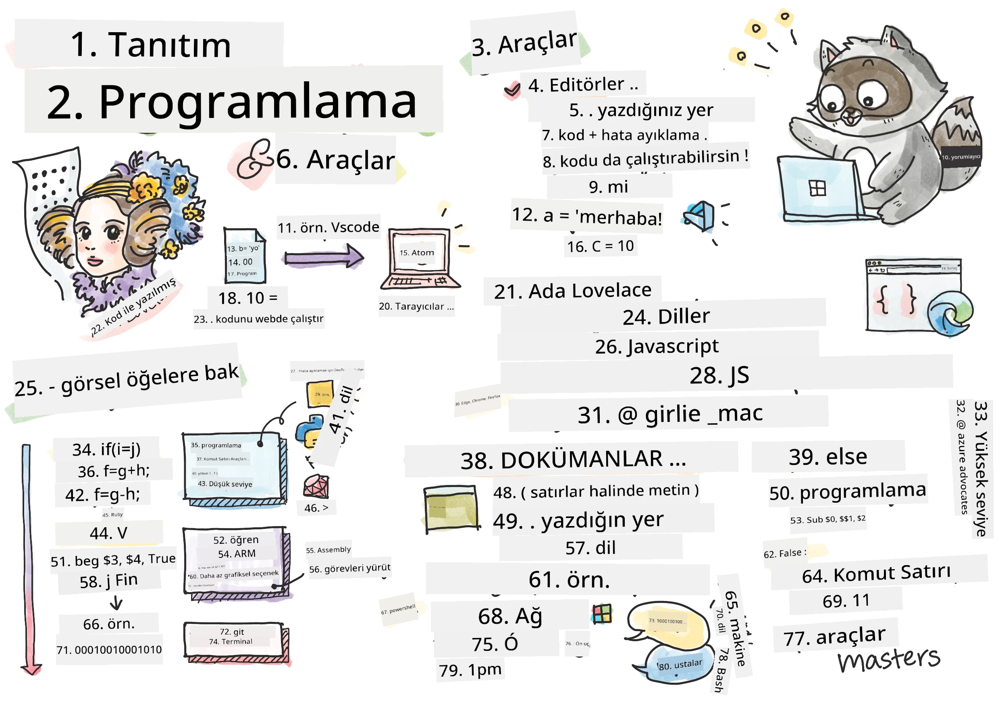
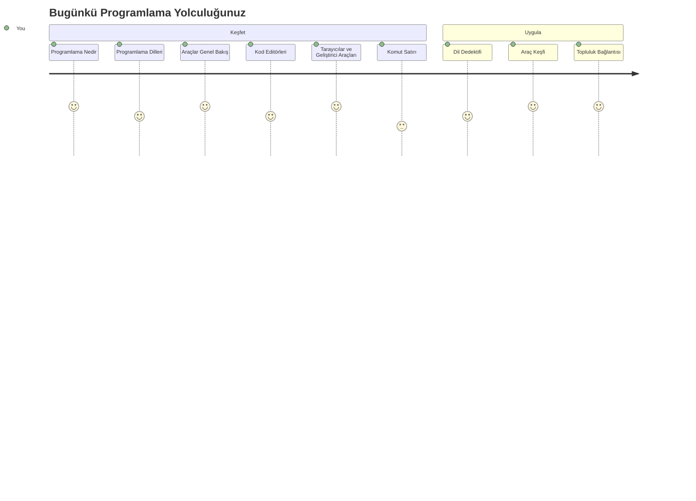
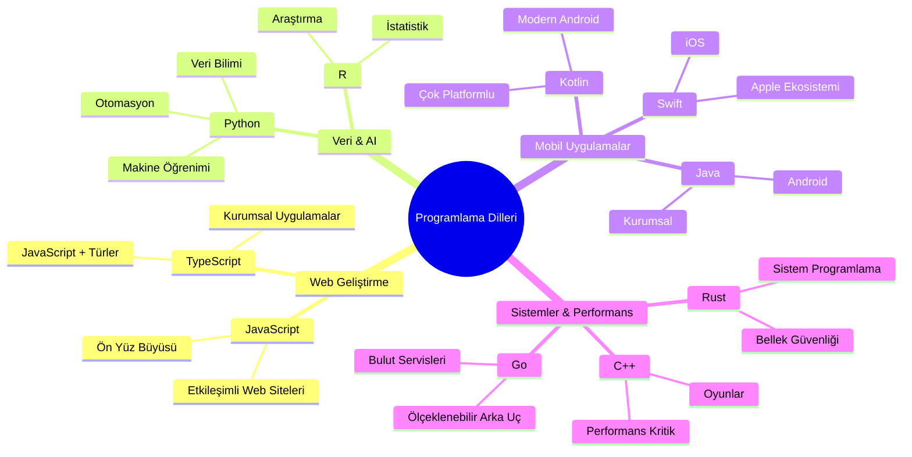
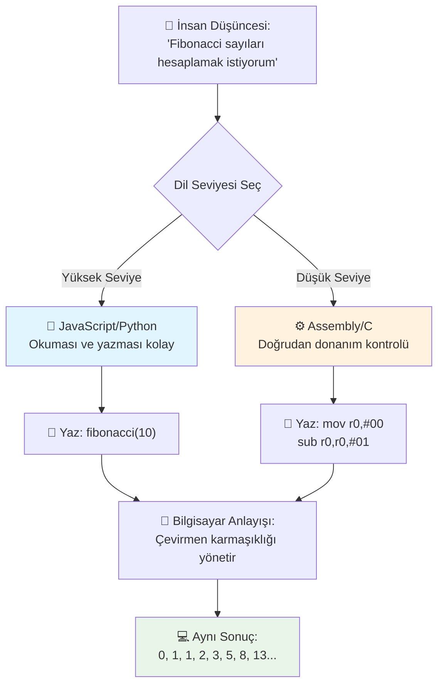
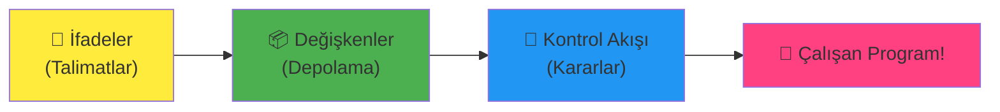
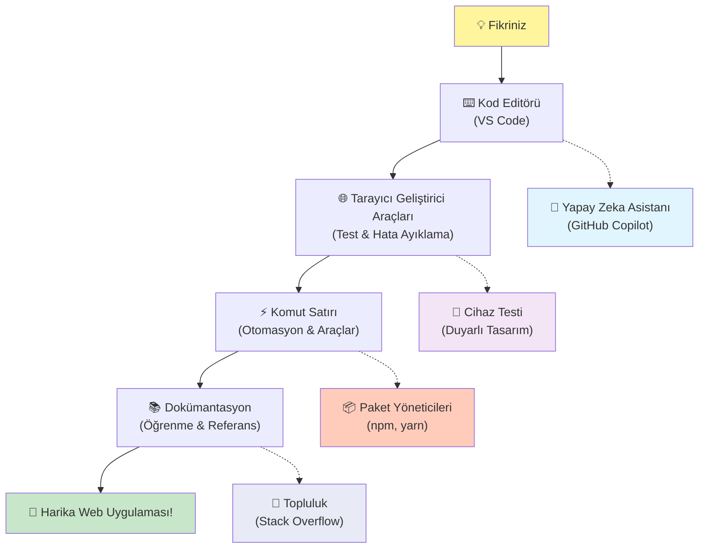
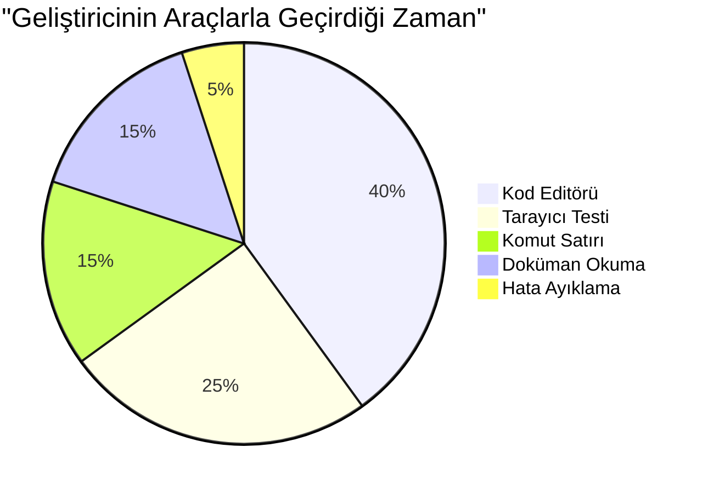
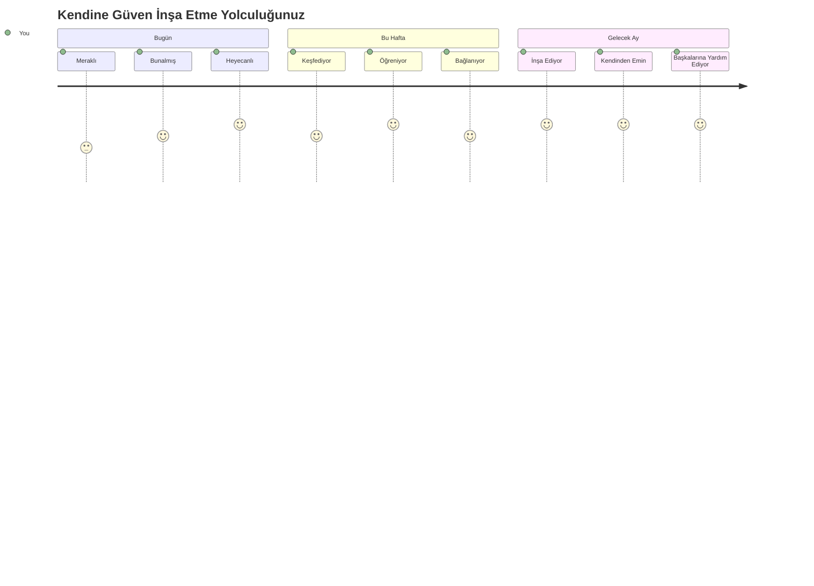

# Programlama Dillerine ve Modern Geliştirici Araçlarına Giriş

Merhaba, geleceğin geliştiricisi! 👋 Sana her gün hala tüylerimi ürperten bir şeyi söyleyebilir miyim? Programlamanın sadece bilgisayarlarla ilgili olmadığını keşfetmek üzeresin – gerçekten en çılgın fikirlerini gerçeğe dönüştürmek için süper güçlere sahip olmakla ilgili!

Favori uygulamanı kullanırken her şeyin mükemmel şekilde oturduğu o anı biliyor musun? Bir düğmeye dokunduğunda, "vay canına, bunu nasıl yaptılar?" dedirten sihirli bir şey oluyor ya işte, o sihri yaratan kodu yazan biri senin gibi biri – muhtemelen gece 2’de en sevdiği kahve dükkanında üçüncü espressosunu içerken. Ve işte seni şaşırtacak şey: bu dersin sonunda sadece nasıl yaptıklarını anlamakla kalmayacak, kendin denemek için sabırsızlanacaksın!

Bak, programlama şu an gözünde korkutucu geliyorsa bunu tamamen anlıyorum. Ben başladığımda, dürüst olmak gerekirse, ya beş yaşından beri kodlama yapan biri olmam gerektiğini ya da bir matematik dâhisi olmam gerektiğini düşünüyordum. Ama perspektifimi kökten değiştiren şey şuydu: programlama, yeni bir dilde konuşmayı öğrenmek gibidir. Önce "merhaba" ve "teşekkür ederim" ile başlarsın, sonra kahve siparişi vermeye geçersin ve bir süre sonra derin felsefi tartışmalar yaparsın! Buradaki fark, bilgisayarlarla konuşuyor olman ve dürüst olmak gerekirse onlar en sabırlı sohbet arkadaşlarıdır – hatalarını asla yargılamazlar ve tekrar denemek için her zaman heyecan duyarlar!

Bugün, modern web geliştirmeyi sadece mümkün kılmakla kalmayan, aynı zamanda ciddi şekilde bağımlılık yapan inanılmaz araçları keşfedeceğiz. Netflix, Spotify ve sevdiğin bağımsız uygulama stüdyosundaki geliştiricilerin her gün kullandığı tam da aynı editörlerden, tarayıcılardan ve iş akışlarından bahsediyorum. Ve işte seni mutlu dansa kaldıracak kısmı: bu profesyonel seviyedeki, endüstri standardı araçların çoğu tamamen ücretsiz!


> Sketchnote by [Tomomi Imura](https://twitter.com/girlie_mac)


```mermaid
journey
    title Bugünkü Programlama Yolculuğunuz
    section Keşfet
      Programlama Nedir: 5: You
      Programlama Dilleri: 4: You
      Araçlar Genel Bakış: 5: You
    section Keşfet
      Kod Editörleri: 4: You
      Tarayıcılar ve Geliştirici Araçları: 5: You
      Komut Satırı: 3: You
    section Uygula
      Dil Dedektifi: 4: You
      Araç Keşfi: 5: You
      Topluluk Bağlantısı: 5: You
```
## Zaten Neler Bildiğine Bir Bakalım!

Eğlenceli kısmına atlamadan önce merak ediyorum – bu programlama dünyası hakkında neler biliyorsun? Ve bak, bu sorulara "bunun hakkında hiç fikrim yok" diye düşünüyorsan, bu sadece sorun değil, tam tersine mükemmel! Bu demektir ki tam doğru yerdesin. Bu sınavı bir antrenmandan önce esneme gibi düşün – sadece beynini ısıtıyoruz!

[Ön ders sınavını çöz](https://ff-quizzes.netlify.app/web/)


## Birlikte Çıkacağımız Macera

Tamam, bugün keşfedeceklerimiz konusunda gerçekten heyecanlıyım! Cidden, bu kavramlardan bazıları sana oturduğunda yüzünü görebilmeyi isterdim. İşte birlikte yapacağımız inanılmaz yolculuk:

- **Programlama nedir gerçekten (ve neden en havalı şeydir!)** – Algoritmanın, o Pazartesi sabahı alarmından tut Netflix önerilerini kusursuzca hazırlayan algoritmaya kadar her şeyi nasıl görünmez bir sihir gibi güçlendirdiğini keşfedeceğiz
- **Programlama dilleri ve onların muhteşem kişilikleri** – Her birinin tamamen farklı süper güçleri ve problem çözme yolları olan bir partiye girdiğini hayal et. İşte programlama dili dünyası böyle ve onları tanımaya bayılacaksın!
- **Dijital sihri oluşturan temel yapı taşları** – Bunları en yaratıcı LEGO setin gibi düşün. Bu parçaların nasıl uyduğunu anladığında, hayal gücünün hayal ettiği her şeyi gerçek anlamda inşa edebileceğini fark edeceksin
- **Sana bir büyücünün asasını vermiş gibi hissettirecek profesyonel araçlar** – Abartmıyorum – bu araçlar gerçekten sana süper güçler vermiş gibi hissettirecek ve en güzel tarafı? Profesyonellerin kullandığı aynı araçlar!

> 💡 **Şöyle diyeyim**: Bugün her şeyi ezberlemeye çalışma! Şu an sadece olasılıklara dair o heyecan kıvılcımını hissetmeni istiyorum. Detaylar birlikte pratik yaparken doğal şekilde yerleşecek – gerçek öğrenme böyle olur!

> Bu dersi [Microsoft Learn](https://learn.microsoft.com/en-us/learn/modules/web-development-101/introduction-programming/?WT.mc_id=academic-77807-sagibbon) sitesinde de alabilirsin!

## Peki Programlama Tam Olarak *Nedir*?

Tamam, o milyon dolarlık soruyu ele alalım: programlama gerçekten nedir?

Bakış açımı tamamen değiştiren bir hikaye vereceğim sana. Geçen hafta anneme yeni akıllı TV kumandamızı nasıl kullanacağını açıklamaya çalışıyordum. "Kırmızı düğmeye bas, ama büyük kırmızı değil, sol taraftaki küçük kırmızı düğmeye... hayır, diğer solun... tamam, şimdi iki saniye basılı tut, bir değil, üç değil..." diye söylerken yakaladım kendimi. Tanıdık geldi mi? 😅

İşte programlama budur! Bir şeye, çok güçlü ama her şeyin mükemmel şekilde açıklanması gereken bir şeye, inanılmaz ayrıntılı, adım adım talimatlar verme sanatıdır. Ama anneni açıklamak yerine (ki "hangi kırmızı düğme?!" sorusunu sorabilir), bilgisayara anlatıyorsun (bilgisayar tam olarak sen ne söylersen onu yapar, hatta sen demek istediğin şeyi tam söylememiş olsan bile).

Ben ilk öğrendiğimde aklımı başımdan alan şey şuydu: bilgisayarlar aslında çekirdeğinde oldukça basittir. Aslında sadece iki şeyi anlarlar – 1 ve 0, ki bu temelde "evet" ve "hayır" veya "açık" ve "kapalı" demektir. Hepsi bu! Ama işte işin sihirli kısmı – matris filmindeymişiz gibi 1’ler ve 0’lar ile konuşmak zorunda değiliz. Bunu sağlayan şey **programlama dilleri**. Onlar, mükemmel normal insan düşüncelerini bilgisayar diline çeviren dünyanın en iyi tercümanı gibidir.

Ve hala her sabah uyandığımda tüylerimi ürperten şey şu: hayatındaki dijital *her şey* senin gibi biri tarafından, muhtemelen pijamalarla, elinde bir fincan kahve laptop’unun başında kod yazarken başlamış. Mükemmel görünmeni sağlayan o Instagram filtresi? Birileri onu kodladı. Yeni favori şarkını bulmana sebep olan öneri? O algoritmayı bir geliştirici yarattı. Akşam yemek faturalarını arkadaşlarla bölmene yardımcı olan uygulama? Evet, biri "bu sinir bozucu, bunu ben çözerim" diye düşündü ve sonra... çözdü!

Programlamayı öğrendiğinde, sadece yeni bir beceri edinmekle kalmazsın – günlerini "Ya birinin gününü biraz daha iyi yapacak bir şey inşa etsem?" diye düşünen inanılmaz problem çözücü topluluğunun bir parçası olursun. Açıkçası, bundan daha havalı bir şey var mı?

✅ **Eğlenceli Gerçek Avı**: Boş bir zamanın olduğunda çok havalı bir şeyi araştır – dünyadaki ilk bilgisayar programcısı kimdi sence? Sana bir ipucu vereyim: beklentilerin dışında olabilir! Bu kişinin hikayesi kesinlikle büyüleyici ve programlamanın her zaman yaratıcı problem çözme ve sınırların dışını düşünmekle ilgili olduğunu gösteriyor.

### 🧠 **Kontrol Zamanı: Kendini Nasıl Hissediyorsun?**

**Bir an durup düşün:**
- "Bilgisayarlara talimat vermek" fikri şimdi mantıklı geliyor mu?
- Günlük bir görevi programlama ile otomatikleştirmek istediğin bir şey var mı?
- Programlama hakkında kafanı kurcalayan hangi sorular çıkıyor?

> **Unutma**: Bazı kavramlar şu an bulanık geliyorsa bu tamamen normal. Programlama öğrenmek yeni bir dil öğrenmek gibidir – beyninin sinir yollarını kurması zaman alır. İyi gidiyorsun!

## Programlama Dilleri Birer Farklı Sihir Türü Gibidir

Tamam, kulağa garip gelecek ama sakın bırakma beni – programlama dilleri farklı müzik türleri gibidir. Düşünsene: ışıl ışıl doğaçlama caz, güçlü ve doğrudan rock, zarif ve yapılandırılmış klasik müzik, yaratıcı ve ifadesi güçlü hiphop. Her türün kendine has bir havası, tutkulu bir hayran kitlesi vardır ve her biri farklı ruh hallerine ve durumlara çok uygundur.

Programlama dilleri de aynen böyle çalışır! Devasa iklim verilerini analiz etmek için aynı dili kullanmazsın, eğlenceli bir mobil oyun yapmak için kullanacağın dil aynı olmaz, tıpkı yoga derslerinde death metal dinlememen gerektiği gibi (en azından çoğu yoga dersinde! 😄).

Ama her düşündüğümde aklımı başımdan alan şey şu: bu diller, dünyanın en sabırlı, akıllı tercümanını yanınızda oturtmak gibi. İnsan beynine doğal gelen biçimde fikirlerini ifade edebilirsin ve onlar o fikirleri bilgisayarların gerçekten konuştuğu 1 ve 0’lara çevirir. Hem "insan yaratıcılığına" hem de "bilgisayar mantığına" kusursuz hakim dostun var ve bu dost asla yorulmaz, kahve molası vermez, aynı soruyu iki kez sorduğun için seni yargılamaz!

### Popüler Programlama Dilleri ve Kullanım Alanları


```mermaid
mindmap
  root((Programlama Dilleri))
    Web Geliştirme
      JavaScript
        Ön Yüz Büyüsü
        Etkileşimli Web Siteleri
      TypeScript
        JavaScript + Türler
        Kurumsal Uygulamalar
    Veri & AI
      Python
        Veri Bilimi
        Makine Öğrenimi
        Otomasyon
      R
        İstatistik
        Araştırma
    Mobil Uygulamalar
      Java
        Android
        Kurumsal
      Swift
        iOS
        Apple Ekosistemi
      Kotlin
        Modern Android
        Çok Platformlu
    Sistemler & Performans
      C++
        Oyunlar
        Performans Kritik
      Rust
        Bellek Güvenliği
        Sistem Programlama
      Go
        Bulut Servisleri
        Ölçeklenebilir Arka Uç
```
| Dil | En İyi Olduğu Alanlar | Neden Popüler |
|----------|----------|------------------|
| **JavaScript** | Web geliştirme, kullanıcı arayüzleri | Tarayıcılarda çalışır ve etkileşimli web sitelerine güç verir |
| **Python** | Veri bilimi, otomasyon, yapay zeka | Okuması ve öğrenmesi kolay, güçlü kütüphaneler |
| **Java** | Kurumsal uygulamalar, Android uygulamaları | Platform bağımsız, büyük sistemler için sağlam |
| **C#** | Windows uygulamaları, oyun geliştirme | Güçlü Microsoft ekosistemi desteği |
| **Go** | Bulut servisleri, arka uç sistemler | Hızlı, basit, modern hesaplamaya yönelik tasarlanmış |

### Yüksek Seviye vs. Düşük Seviye Diller

Tamam, bu açıkçası ben öğrenmeye başladığımda beynimi yakan kavramdı, o yüzden sonunda benim için netleşen benzetmeyi paylaşacağım – umarım sana da yardımcı olur!

Dilini bilmediğin bir ülkeyi ziyaret ettiğini ve acilen en yakın banyoyu bulman gerektiğini hayal et (hepimiz yaşadık, değil mi? 😅):

- **Düşük seviyeli programlama**, meyve satan büyükannenle yerel lehçede kültürel göndermeler, yerel argolar ve sadece orada yaşayanların anlayabileceği esprilerle sohbet edebilecek kadar iyi konuşmak gibidir. Süper etkileyici ve inanılmaz verimlidir... eğer akıcıysan! Ama sadece bir banyo bulmaya çalışırken biraz bunaltıcıdır.

- **Yüksek seviyeli programlama**, seni hemen anlayan harika yerel arkadaş gibidir. İngilizce olarak "Gerçekten bir tuvalet bulmam lazım" dersen, onlar tüm kültürel çeviriyi yapar ve beyninin kolayca anladığı şekilde yol tarif eder.

Programlama terimleriyle:
- **Düşük seviyeli diller** (Assembly veya C gibi) bilgisayarın gerçek donanımıyla çok ayrıntılı konuşmana izin verir, ama bir makine gibi düşünmen gerekir ki… söyleyelim, büyük bir zihinsel geçiş!
- **Yüksek seviyeli diller** (JavaScript, Python veya C# gibi) insan gibi düşünmene izin verirken, makine diliyle arka planda onlar ilgilenir. Ayrıca, içinde yeni olanların ne hissettiğini unutmayan ve gerçekten yardım etmek isteyen inanılmaz misafirperver toplulukları vardır!

Tahmin et hangileriyle başlamanı öneriyorum? 😉 Yüksek seviyeli diller, deneyimi çok daha keyifli hale getirdikleri için aslında asla bırakmak istemediğin böyle eğitim tekerlekleri gibidir!


```mermaid
flowchart TB
    A["👤 İnsan Düşüncesi:<br/>'Fibonacci sayıları hesaplamak istiyorum'"] --> B{Dil Seviyesi Seç}
    
    B -->|Yüksek Seviye| C["🌟 JavaScript/Python<br/>Okuması ve yazması kolay"]
    B -->|Düşük Seviye| D["⚙️ Assembly/C<br/>Doğrudan donanım kontrolü"]
    
    C --> E["📝 Yaz: fibonacci(10)"]
    D --> F["📝 Yaz: mov r0,#00<br/>sub r0,r0,#01"]
    
    E --> G["🤖 Bilgisayar Anlayışı:<br/>Çevirmen karmaşıklığı yönetir"]
    F --> G
    
    G --> H["💻 Aynı Sonuç:<br/>0, 1, 1, 2, 3, 5, 8, 13..."]
    
    style C fill:#e1f5fe
    style D fill:#fff3e0
    style H fill:#e8f5e8
```
### Yüksek Seviyeli Dillerin Neden Bu Kadar Dostça Olduğunu Sana Gösteriyim

Tamam, yüksek seviyeli dillere neden aşık olduğumu mükemmel gösteren bir şeyi göstermek üzereyim, ama önce benden bir şey istemen lazım. İlk kod örneğini görünce panik yapma! Korkutucu görünmesi gerekiyor. Tam da vurgulamak istediğim şey bu!

Aynı görevin tamamen iki farklı tarzda yazılmış haline bakacağız. İkisi de Fibonacci dizisi denen bir matematiksel deseni yaratır – her sayı kendinden önce gelen iki sayının toplamıdır: 0, 1, 1, 2, 3, 5, 8, 13... (Eğlenceli gerçek: bu desen doğada her yerde bulunur – ayçiçeği tohum spiralleri, çam kozalağı desenleri, hatta galaksilerin oluşumu!)

Farkı görmeye hazır mısın? Hadi başlayalım!

**Yüksek seviyeli dil (JavaScript) – İnsan dostu:**

```javascript
// Adım 1: Temel Fibonacci kurulumu
const fibonacciCount = 10;
let current = 0;
let next = 1;

console.log('Fibonacci sequence:');
```

**Bu kod şunları yapar:**
- Fibonacci sayılarının kaç tane üretileceğini belirtmek için bir sabit **tanımlar**
- Dizideki geçerli ve sonraki sayıları takip etmek için iki değişkeni **başlatır**
- Fibonacci desenini tanımlayan başlangıç değerlerini (0 ve 1) **ayarlar**
- Çıktımızı tanımlayan bir başlık mesajı **gösterir**

```javascript
// Adım 2: Döngü ile diziyi oluştur
for (let i = 0; i < fibonacciCount; i++) {
  console.log(`Position ${i + 1}: ${current}`);
  
  // Dizideki sonraki sayıyı hesapla
  const sum = current + next;
  current = next;
  next = sum;
}
```

**Burada neler oluyor, detaylandırmak gerekirse:**
- `for` döngüsü kullanarak dizideki her pozisyonda **dolaşır**
- Her sayıyı ve pozisyonunu şablon metin biçimlendirmesiyle **gösterir**
- Mevcut ve sonraki değerleri toplayarak bir sonraki Fibonacci sayısını **hesaplar**
- Takip değişkenlerini bir sonraki iterasyona geçecek şekilde **günceller**

```javascript
// Adım 3: Modern fonksiyonel yaklaşım
const generateFibonacci = (count) => {
  const sequence = [0, 1];
  
  for (let i = 2; i < count; i++) {
    sequence[i] = sequence[i - 1] + sequence[i - 2];
  }
  
  return sequence;
};

// Kullanım örneği
const fibSequence = generateFibonacci(10);
console.log(fibSequence);
```

**Yukarıdaki kodda biz:**
- Modern ok fonksiyonu sözdizimi kullanarak yeniden kullanılabilir bir fonksiyon **yarattık**
- Tüm diziyi depolamak için bir dizi oluşturduk, tek tek göstermek yerine
- Önceki değerlerden her yeni sayıyı **hesaplamak için dizi indekslemesi kullandık**
- Diziyi esnek kullanım için programımızın diğer bölümlerine **döndürdük**

**Düşük seviyeli dil (ARM Assembly) – Bilgisayar dostu:**

```assembly
 area ascen,code,readonly
 entry
 code32
 adr r0,thumb+1
 bx r0
 code16
thumb
 mov r0,#00
 sub r0,r0,#01
 mov r1,#01
 mov r4,#10
 ldr r2,=0x40000000
back add r0,r1
 str r0,[r2]
 add r2,#04
 mov r3,r0
 mov r0,r1
 mov r1,r3
 sub r4,#01
 cmp r4,#00
 bne back
 end
```

JavaScript versiyonu neredeyse İngilizce talimatlar gibi okunurken, Assembly versiyonu bilgisayarın işlemcisini doğrudan kontrol eden gizemli komutlar kullanır. İkisi de aynı görevi yapar, ama yüksek seviyeli dil insanların anlaması, yazması ve sürdürmesi çok daha kolaydır.

**Fark edeceğin ana farklar:**
- **Okunabilirlik**: JavaScript `fibonacciCount` gibi açıklayıcı isimler kullanırken, Assembly `r0`, `r1` gibi gizemli etiketler kullanır
- **Yorumlar**: Yüksek seviyeli diller, kodun kendi kendini belgeleyen açıklayıcı yorumları teşvik eder
- **Yapı**: JavaScript'in mantıksal akışı, insanların problemleri adım adım düşünme şekline uyum sağlar
- **Bakım**: Farklı gereksinimler için JavaScript sürümünü güncellemek basit ve nettir

✅ **Fibonacci dizisi hakkında**: Bu kesinlikle harika sayı deseni (her sayının kendinden önceki iki sayının toplamı olduğu: 0, 1, 1, 2, 3, 5, 8...) doğada hemen hemen *her yerde* ortaya çıkar! Günebakan spirallerinde, çam kozalağı desenlerinde, nautilus kabuklarının kıvrımında ve hatta ağaç dallarının büyüme şeklinde bulabilirsiniz. Matematik ve kodun doğanın güzelliği yaratmak için kullandığı desenleri anlamamıza ve yeniden yaratmamıza nasıl yardımcı olabileceği gerçekten şaşırtıcı!


## Büyünün Gerçekleşmesini Sağlayan Temel Parçalar

Tamam, programlama dillerinin gerçek hayatta nasıl göründüğünü gördüğünüze göre, şimdi yazılmış her programın temel parçalarını parçalayalım. Bunları en sevdiğiniz tarifin temel bileşenleri olarak düşünün – her birinin ne işe yaradığını anladığınızda, hemen hemen her dilde kod okuyup yazabileceksiniz!

Bu, programlamanın dilbilgisini öğrenmek gibidir. Okulda isimler, fiiller ve cümle kurmayı öğrendiğiniz zamanı hatırlayın. Programlamanın kendi dilbilgisi versiyonu var ve dürüst olmak gerekirse, İngilizce dilbilgisinden çok daha mantıklı ve bağışlayıcı! 😄

### İfadeler: Adım Adım Talimatlar

Hadi **ifadeler** ile başlayalım – bunlar bilgisayarınızla kurduğunuz bir konuşmadaki bireysel cümleler gibidir. Her ifade bilgisayara spesifik bir işi yapmasını söyler, tıpkı yön tarifleri vermek gibi: "Buradan sola dön," "Kırmızı ışıkta dur," "Şu park yerine park et."

İfadelerde sevdiğim şey onların genellikle ne kadar okunabilir olması. Şuna bak:

```javascript
// Tek eylem gerçekleştiren temel ifadeler
const userName = "Alex";                    
console.log("Hello, world!");              
const sum = 5 + 3;                         
```

**Bu kodun yaptığı şeyler:**
- Bir kullanıcının adını saklamak için sabit değişken **bildir**  
- Konsol çıktısına bir selamlama mesajı **göster**  
- Matematiksel bir işlemin sonucunu **hesapla** ve sakla

```javascript
// Web sayfalarıyla etkileşime geçen ifadeler
document.title = "My Awesome Website";      
document.body.style.backgroundColor = "lightblue";
```

**Adım adım olanlar:**
- Tarayıcı sekmesinde görünen sayfa başlığını **değiştir**  
- Sayfa gövdesinin arka plan rengini **ayarla**

### Değişkenler: Programınızın Bellek Sistemi

Tamam, **değişkenler** gerçekten öğretmekten en çok zevk aldığım kavramlardan biri çünkü zaten her gün kullandığınız şeylere çok benziyorlar!

Telefonunuzdaki kişi listesini düşünün bir saniye. Herkesin telefon numarasını ezberlemezsiniz – onun yerine "Anne", "En İyi Arkadaş" veya "Gece 2'ye Kadar Servis Yapan Pizza Yeri" gibi isimleri kaydedersiniz ve telefon gerçek numaraları hatırlar. Değişkenler tam olarak aynı şekilde işlev görür! Programınızın bilgi saklayabileceği ve onu akıllı bir isimle daha sonra çağırabileceği etiketli kaplar gibidir.

Asıl harika olan şu: değişkenler program çalışırken değişebilir (bu yüzden isimleri "değişken" – fark ettiniz mi?). Nasıl ki daha iyi bir pizzacı keşfedip kaydınızı güncelliyorsanız, değişkenler de programınız yeni bilgiler öğrenip koşullar değiştikçe güncellenebilir!

Size bunun ne kadar güzel ve basit olduğunu göstereyim:

```javascript
// Adım 1: Temel değişkenlerin oluşturulması
const siteName = "Weather Dashboard";        
let currentWeather = "sunny";               
let temperature = 75;                       
let isRaining = false;                      
```

**Bu kavramları anlamak için:**  
- Değişmeyen değerleri `const` ile sakla (örneğin site adı)  
- Programa göre değişebilecek değerler için `let` kullan  
- Farklı veri türleri ata: string (metin), sayılar, boolean (true/false)  
- Her değişkenin içeriğini açıklayan açıklayıcı isimler seç

```javascript
// Adım 2: İlgili verileri gruplamak için nesnelerle çalışma
const weatherData = {                       
  location: "San Francisco",
  humidity: 65,
  windSpeed: 12
};
```

**Yukarıda:**
- İlgili hava durumu bilgilerini bir nesnede **grupladık**  
- Birden fazla bilgiyi tek bir değişken adı altında **organize ettik**  
- Anahtar-değer çiftleri kullanarak her bilginin başlığını netleştirdik

```javascript
// Adım 3: Değişkenleri kullanma ve güncelleme
console.log(`${siteName}: Today is ${currentWeather} and ${temperature}°F`);
console.log(`Wind speed: ${weatherData.windSpeed} mph`);

// Değiştirilebilir değişkenleri güncelleme
currentWeather = "cloudy";                  
temperature = 68;                          
```

**Her parçayı anlayalım:**
- `${}` sözdizimi ile şablon metin kullanarak bilgi **göster**  
- Nesne özelliklerine dot notasyonu ile eriş (`weatherData.windSpeed`)  
- `let` ile tanımlanan değişkenleri güncelleyerek koşullara göre **değiştir**  
- Anlamlı mesajlar oluşturmak için birden fazla değişkeni **birleştir**

```javascript
// Adım 4: Daha temiz kod için modern yapı bozma
const { location, humidity } = weatherData; 
console.log(`${location} humidity: ${humidity}%`);
```

**Bilmen gerekenler:**
- Nesnelerden spesifik özellikleri yıkıcı atama ile **çıkar**  
- Nesne anahtarları ile aynı isimlerde yeni değişkenler **oluştur**  
- Tekrarlayan dot notasyonunu kullanmaktan kaçınarak kodu **sadeleştir**

### Kontrol Akışı: Programınıza Nasıl Düşüneceğini Öğretmek

Tamam, şimdi programlamanın gerçekten akıl almaz kısmına geldik! **Kontrol akışı**, programınıza akıllı kararlar nasıl alacağını öğretmektir, tıpkı sizin her gün farkında olmadan yaptığınız gibi.

Diyelim ki bugün sabah şöyle düşündünüz: "Eğer yağmur varsa şemsiye alırım. Eğer soğuksa ceket giyerim. Eğer geç kalıyorsam kahvaltıyı atlar yolda kahve alırım." Beyniniz bu if-then mantığını gün içinde onlarca kez otomatik olarak gerçekleştirir!

İşte programları sıkıcı, öngörülebilir komutlardan alıp canlı ve zeki yapan şey budur. Durumu görebilir, ne olduğunu değerlendirebilir ve uygun şekilde tepki verebilirler. Programınıza düşünebilen ve seçim yapabilen bir zihin vermek gibidir!

Bunun nasıl harika çalıştığını göstereyim:

```javascript
// Adım 1: Temel koşullu mantık
const userAge = 17;

if (userAge >= 18) {
  console.log("You can vote!");
} else {
  const yearsToWait = 18 - userAge;
  console.log(`You'll be able to vote in ${yearsToWait} year(s).`);
}
```

**Bu kodun yaptığı şeyler:**
- Kullanıcının yaşının oy kullanma şartını karşılayıp karşılamadığını **kontrol et**  
- Koşul sonucuna göre farklı kod blokları **çalıştır**  
- 18 yaşından küçükse oy kullanmaya ne kadar süre kaldığını **hesapla** ve göster  
- Her durum için spesifik, faydalı geri bildirim **ver**

```javascript
// Adım 2: Mantıksal operatörlerle çoklu koşullar
const userAge = 17;
const hasPermission = true;

if (userAge >= 18 && hasPermission) {
  console.log("Access granted: You can enter the venue.");
} else if (userAge >= 16) {
  console.log("You need parent permission to enter.");
} else {
  console.log("Sorry, you must be at least 16 years old.");
}
```

**Burada olanları parçalara ayıralım:**
- `&&` (ve) operatörü ile birden fazla koşulu **birleştir**  
- Birden fazla senaryo için `else if` ile koşul hiyerarşisi **oluştur**  
- Tüm olası durumları son `else` ifadesi ile **ele al**  
- Her farklı durum için net, uygulanabilir geri bildirim **ver**

```javascript
// Adım 3: Üçlü operatör ile kısa koşul ifadeleri
const votingStatus = userAge >= 18 ? "Can vote" : "Cannot vote yet";
console.log(`Status: ${votingStatus}`);
```

**Unutma:**
- Basit iki seçenekli koşullar için ternary operatörünü (`? :`) **kullan**  
- Koşulu önce yaz, ardından `?`, sonra doğru sonuç, sonra `:`, sonra yanlış sonucu yaz  
- Koşullara bağlı değer atama gerektiğinde bu kalıbı **uygula**

```javascript
// Adım 4: Birden çok belirli durumların işlenmesi
const dayOfWeek = "Tuesday";

switch (dayOfWeek) {
  case "Monday":
  case "Tuesday":
  case "Wednesday":
  case "Thursday":
  case "Friday":
    console.log("It's a weekday - time to work!");
    break;
  case "Saturday":
  case "Sunday":
    console.log("It's the weekend - time to relax!");
    break;
  default:
    console.log("Invalid day of the week");
}
```

**Bu kod şunları yapar:**
- Değişkenin değerini birden fazla özel durumla **eşleştir**  
- Benzer durumları (haftaiçi ve hafta sonu gibi) **gruplandır**  
- Eşleşme bulununca uygun kod bloğunu **çalıştır**  
- Beklenmeyen değerler için `default` durumunu **inclue et**  
- Diğer duruma geçişi engellemek için `break` ifadelerini **kullan**

> 💡 **Gerçek dünya benzetmesi**: Kontrol akışını, size sabırla yön veren dünyanın en sabırlı GPS'i gibi düşünün. "Eğer ana yolda trafik varsa otobana git. Eğer otoban kapalıysa manzaralı yoldan git" diyebilir. Programlar tam olarak bu tür koşullu mantığı kullanarak farklı durumlara akıllıca yanıt verir ve kullanıcıya her zaman en iyi deneyimi sunar.

### 🎯 **Kavram Kontrolü: Temel Parçalar Ustası**

**Temellerde ne durumda olduğuna bakalım:**  
- Kendi kelimelerinle bir değişken ile ifade arasındaki farkı açıklayabilir misin?  
- Gerçek hayattan bir if-then kararı örneği düşün (örneğin oy kullanma örneğimiz gibi)  
- Programlama mantığı hakkında seni şaşırtan bir şey nedir?

**Hızlı özgüven artırıcı:**

```mermaid
flowchart LR
    A["📝 İfadeler<br/>(Talimatlar)"] --> B["📦 Değişkenler<br/>(Depolama)"] --> C["🔀 Kontrol Akışı<br/>(Kararlar)"] --> D["🎉 Çalışan Program!"]
    
    style A fill:#ffeb3b
    style B fill:#4caf50
    style C fill:#2196f3
    style D fill:#ff4081
```
✅ **Sırada ne var**: Bu inanılmaz yolculuğa birlikte dalmaya devam ederken bu kavramları çok daha derinlemesine keşfedeceğiz! Şu anda sadece önünüzdeki harika olanaklar için heyecanlanmaya odaklan. Spesifik beceri ve teknikler pratik yaptıkça doğal olarak oturacak – sana söz veriyorum bu düşündüğünden çok daha eğlenceli olacak!

## İşi Kolaylaştıran Araçlar

Tamam, burası gerçekten heyecandan yerimde duramadığım yer! 🚀 Dijital bir uzay gemisinin anahtarları elinize verilmiş gibi hissettirecek inanılmaz araçlardan bahsedeceğiz.

Bir şefin elinin uzantısı gibi mükemmel dengelenmiş bıçakları olduğunu ya da bir müzisyenin dokunduğu anda şarkı söyleyen o gitarı olduğunu biliyorsunuzdur. İşte geliştiricilerin de buna benzer sihirli araçları var ve burada sizi gerçekten çok şaşırtacak olan – çoğu tamamen ücretsiz!

Bu araçları sizinle paylaşmayı düşünürken sandalyemde zıplıyorum çünkü yazılım geliştirme şeklimizi kökten değiştirdiler. Kod yazmanıza yardımcı olan yapay zeka destekli asistanlar (şaka yapmıyorum!), Wi-Fi olan her yerden tam uygulamalar oluşturabileceğiniz bulut ortamları ve programlarınız için röntgen görüşü gibi gelişmiş hata ayıklama araçlarından bahsediyoruz.

Ve hala beni ürperten kısmı: Bunlar sizin büyüyüp bırakacağınız "başlangıç araçları" değil. Google, Netflix gibi firmalarda ve sevdiğiniz o bağımsız uygulama stüdyosunda şu anda kullanılan profesyonel seviyedeki aynı araçlar. Onları kullanırken kendinizi tam bir profesyonel gibi hissedeceksiniz!


```mermaid
graph TD
    A["💡 Fikriniz"] --> B["⌨️ Kod Editörü<br/>(VS Code)"] 
    B --> C["🌐 Tarayıcı Geliştirici Araçları<br/>(Test & Hata Ayıklama)"]
    C --> D["⚡ Komut Satırı<br/>(Otomasyon & Araçlar)"]
    D --> E["📚 Dokümantasyon<br/>(Öğrenme & Referans)"]
    E --> F["🚀 Harika Web Uygulaması!"]
    
    B -.-> G["🤖 Yapay Zeka Asistanı<br/>(GitHub Copilot)"]
    C -.-> H["📱 Cihaz Testi<br/>(Duyarlı Tasarım)"]
    D -.-> I["📦 Paket Yöneticileri<br/>(npm, yarn)"]
    E -.-> J["👥 Topluluk<br/>(Stack Overflow)"]
    
    style A fill:#fff59d
    style F fill:#c8e6c9
    style G fill:#e1f5fe
    style H fill:#f3e5f5
    style I fill:#ffccbc
    style J fill:#e8eaf6
```
### Kod Editörleri ve IDE’ler: Yeni Dijital En İyi Dostlarınız

Kod editörlerinden bahsedelim – bunlar yakında en sevdiğiniz yeni mekanlar olacak! Onları kişisel kodlama sığınağınız olarak düşünün, zamanınızın çoğunu dijital eserlerinizi oluşturup mükemmelleştirerek burada geçireceksiniz.

Ama modern editörleri özel yapan şey şu: sadece şık metin editörleri değiller. 7/24 yanınızda oturan en zeki, destekleyici kodlama akıl hocanız gibiler. Hatalarınızı fark etmeden önce yakalar, sizi dahi gösteren önerilerde bulunur, her satır kodun ne yaptığını anlamanıza yardım eder ve bazen yazacaklarınızı tahmin edip cümlenizi tamamlarlar!

Otomatik tamamlama ilk keşfettiğimde kendimi gelecekteymişim gibi hissetmiştim. Bir şeyler yazmaya başlarsınız ve editör der ki: "Hey, tam ihtiyacın olan şeyi düşünüyordun değil mi?" Kod yazarken zihin okuyucu bir arkadaşınız gibi!

**Bu editörleri bu kadar inanılmaz yapan ne?**

Modern kod editörleri üretkenliğinizi artırmaya yönelik etkileyici özellikler sunar:

| Özellik | Ne Yapar | Neden İşe Yarar |
|---------|----------|-----------------|
| **Sözdizimi Vurgulama** | Kodun farklı parçalarını renklendirir | Kodun okunmasını ve hata tespiti kolay olur |
| **Otomatik Tamamlama** | Yazarken kod önerir | Kodlamayı hızlandırır ve yazım hatalarını azaltır |
| **Hata Ayıklama Araçları** | Hataları bulup düzeltmeye yardım eder | Sorun giderme süresini saatlerce kısaltır |
| **Eklentiler** | Uzmanlaşmış özellikler ekler | Her teknolojiye göre editörü özelleştirir |
| **Yapay Zeka Asistanları** | Kod ve açıklamalar önerir | Öğrenme ve üretkenliği hızlandırır |

> 🎥 **Video Kaynağı**: Bu araçları eylemde görmek ister misiniz? Bu kapsamlı bakış için [Tools of the Trade videosuna](https://youtube.com/watch?v=69WJeXGBdxg) göz atın.

#### Web Geliştirme İçin Önerilen Editörler

**[Visual Studio Code](https://code.visualstudio.com/?WT.mc_id=academic-77807-sagibbon)** (Ücretsiz)  
- Web geliştiriciler arasında en popüler  
- Mükemmel eklenti ekosistemi  
- Yerleşik terminal ve Git entegrasyonu  
- **Olmazsa olmaz eklentiler**:  
  - [GitHub Copilot](https://marketplace.visualstudio.com/items?itemName=GitHub.copilot) - Yapay zeka destekli kod önerileri  
  - [Live Share](https://marketplace.visualstudio.com/items?itemName=MS-vsliveshare.vsliveshare) - Gerçek zamanlı iş birliği  
  - [Prettier](https://marketplace.visualstudio.com/items?itemName=esbenp.prettier-vscode) - Otomatik kod biçimlendirme  
  - [Code Spell Checker](https://marketplace.visualstudio.com/items?itemName=streetsidesoftware.code-spell-checker) - Kodunuzdaki yazım hatalarını yakalar

**[JetBrains WebStorm](https://www.jetbrains.com/webstorm/)** (Ücretli, öğrenciler için ücretsiz)  
- Gelişmiş hata ayıklama ve test araçları  
- Akıllı kod tamamlama  
- Yerleşik versiyon kontrol

**Bulut Tabanlı IDE’ler** (Farklı fiyatlandırmalar)  
- [GitHub Codespaces](https://github.com/features/codespaces) - Tarayıcınızda tam VS Code  
- [Replit](https://replit.com/) - Kod öğrenmek ve paylaşmak için harika  
- [StackBlitz](https://stackblitz.com/) - Anında tam yığın web geliştirme

> 💡 **Başlangıç İpucu**: Visual Studio Code ile başlayın – ücretsiz, sektörde yaygın kullanılır ve büyük bir topluluk tarafından desteklenen sayısız faydalı rehber ve eklenti bulunuyor.


### Web Tarayıcıları: Gizli Geliştirme Laboratuvarınız

Tamam, aklınız başınızdan gidecek! Sosyal medyada gezinmek ve video izlemek için kullandığınız tarayıcılar aslında sizi bekleyen muazzam gizli bir geliştirici laboratuvarı saklıyormuş!

Herhangi bir sayfada sağ tıklayıp "Öğeyi incele"yi seçtiğinizde aslında yüzlerce dolar harcadığım bazı pahalı yazılımlardan daha güçlü geliştirici araçlarının olduğu gizli bir dünyayı açıyorsunuz. Bu, sıradan eski mutfağınızın arkasındaki gizli panelin profesyonel bir şefin laboratuvarına açılması gibi!
İlk kez biri bana tarayıcı DevTools’u gösterdiğinde, yaklaşık üç saat sadece tıklayıp durdum ve "BEKLE, BU DA MI YAPIYOR?!" diye bağırıyordum. Gerçek zamanlı olarak herhangi bir web sitesini düzenleyebilir, her şeyin ne kadar hızlı yüklendiğini tam olarak görebilir, sitenizin farklı cihazlarda nasıl göründüğünü test edebilir ve hatta JavaScript’i tam bir profesyonel gibi hata ayıklayabilirsiniz. Bu tamamen akıl almaz bir şey!

**İşte tarayıcıların sizin gizli silahınız olmasının nedeni:**

Bir web sitesi ya da web uygulaması oluşturduğunuzda, onun gerçek hayatta nasıl göründüğünü ve davrandığını görmeniz gerekir. Tarayıcılar sadece işinizi göstermekle kalmaz, aynı zamanda performans, erişilebilirlik ve olası sorunlar hakkında detaylı geri bildirim sağlar.

#### Tarayıcı Geliştirici Araçları (DevTools)

Modern tarayıcılar kapsamlı geliştirme paketleri içerir:

| Araç Kategorisi | Ne Yapar | Örnek Kullanım Durumu |
|-----------------|----------|----------------------|
| **Element Denetleyicisi** | HTML/CSS’i gerçek zamanlı görüntüleyip düzenleme | Stil düzenleyerek anında sonuçları görme |
| **Konsol** | Hata mesajlarını görüntüleme ve JavaScript testi | Sorunları hata ayıklama ve kod ile deneme yapma |
| **Ağ İzleyici** | Kaynakların nasıl yüklendiğini takip etme | Performans ve yükleme sürelerini optimize etme |
| **Erişilebilirlik Denetleyicisi** | Kapsayıcı tasarımı test etme | Sitenizin herkes için çalıştığından emin olma |
| **Cihaz Simülatörü** | Farklı ekran boyutlarında önizleme | Çoklu cihaz olmadan duyarlı tasarımı test etme |

#### Geliştirme İçin Önerilen Tarayıcılar

- **[Chrome](https://developers.google.com/web/tools/chrome-devtools/)** - Kapsamlı dökümantasyonlu endüstri standardı DevTools
- **[Firefox](https://developer.mozilla.org/docs/Tools)** - Mükemmel CSS Grid ve erişilebilirlik araçları
- **[Edge](https://docs.microsoft.com/microsoft-edge/devtools-guide-chromium/?WT.mc_id=academic-77807-sagibbon)** - Microsoft’un geliştirme kaynaklarıyla Chromium tabanlı

> ⚠️ **Önemli Test İpucu**: Web sitelerinizi her zaman birden fazla tarayıcıda test edin! Chrome’da mükemmel çalışan bir şey Safari veya Firefox’ta farklı görünebilir. Profesyonel geliştiriciler tutarlı kullanıcı deneyimleri için tüm büyük tarayıcılarda test yapar.

### Komut Satırı Araçları: Geliştirici Süper Güçlerine Açılan Kapınız

Tamam, burada komut satırıyla ilgili tamamen dürüst bir an geçirelim çünkü bunu gerçekten anlayan birinden duymanızı istiyorum. İlk kez gördüğümde – sadece bu korkutucu, siyah ekran ve yanıp sönen metin – kelimenin tam anlamıyla düşündüm ki: "Hayır, kesinlikle hayır! Bu sanki 1980’ler hacker filmi gibi ve ben kesinlikle bunun için yeterince zeki değilim!" 😅

Ama keşke biri bana o zamanlar şunu söyleseydi ve şimdi size söylüyorum: komut satırı korkutucu değildir – aslında bilgisayarınızla doğrudan konuşmak gibidir. Bunu, resimlerin ve menülerin olduğu şık bir uygulama aracılığıyla yemek sipariş etmekle (ki bu kolaydır) vs. favori yerel restoranınıza gidip, aşçının tam olarak ne sevdiğinizi bilip sadece "beni harika bir şeyle şaşırt" demenizle kıyaslayın.

Komut satırı, geliştiricilerin kendilerini tam anlamıyla büyücü gibi hissettikleri yerdir. Birkaç sihirli kelime (tamam, bunlar sadece komut ama sihirliymiş gibi hissediliyor!), enter tuşuna basarsınız ve BOOM – tam projeler oluşturur, dünyadan güçlü araçlar indirir veya uygulamanızı milyonlarca kişinin görebilmesi için internete yüklersiniz. Bu gücün tadına varınca, gerçekten bağımlılık yapıyor!

**Komut satırının favori aracınız olmasının nedenleri:**

Grafiksel arayüzler birçok görev için iyidir, ancak komut satırı otomasyon, hassasiyet ve hızda ustadır. Birçok geliştirme aracı öncelikle komut satırı arayüzüyle çalışır ve onları verimli öğrenmek üretkenliğinizi dramatik şekilde artırabilir.

```bash
# Adım 1: Proje dizinini oluşturun ve içine gidin
mkdir my-awesome-website
cd my-awesome-website
```

**Bu kod ne yapıyor:**
- Projeniz için "my-awesome-website" adlı yeni bir dizin oluşturur
- Yeni oluşturulan dizine geçip çalışmaya başlar

```bash
# Adım 2: package.json ile projeyi başlat
npm init -y

# Modern geliştirme araçlarını yükle
npm install --save-dev vite prettier eslint
npm install --save-dev @eslint/js
```

**Adım adım olanlar:**
- `npm init -y` ile varsayılan ayarlarla yeni bir Node.js projesi başlatılır
- Hızlı geliştirme ve üretim yapıları için modern yapım aracı Vite kurulur
- Otomatik kod biçimlendirme için Prettier ve kod kalitesi için ESLint eklenir
- Bu araçlar sadece geliştirme bağımlılıkları olarak `--save-dev` bayrağı ile işaretlenir

```bash
# Adım 3: Proje yapısını ve dosyaları oluşturun
mkdir src assets
echo '<!DOCTYPE html><html><head><title>My Site</title></head><body><h1>Hello World</h1></body></html>' > index.html

# Geliştirme sunucusunu başlatın
npx vite
```

**Yukarıdaki işlemlerde:**
- Projemizi kaynak kod ve varlıklar için ayrı klasörlerle organize ettik
- Uygun belge yapısına sahip temel bir HTML dosyası oluşturduk
- Canlı yenileme ve sıcak modül değişimi için Vite geliştirme sunucusunu başlattık

#### Web Geliştirme İçin Temel Komut Satırı Araçları

| Araç | Amaç | Neden Gerekiyor |
|------|-------|-----------------|
| **[Git](https://git-scm.com/)** | Sürüm kontrolü | Değişiklikleri takip etme, işbirliği yapma, yedeğini alma |
| **[Node.js & npm](https://nodejs.org/)** | JavaScript çalışma zamanı ve paket yönetimi | JavaScript’i tarayıcı dışında çalıştırma, modern araçlar yükleme |
| **[Vite](https://vitejs.dev/)** | Yapım aracı ve geliştirme sunucusu | Çok hızlı geliştirme ve sıcak modül değişimi |
| **[ESLint](https://eslint.org/)** | Kod kalitesi | JavaScript’teki sorunları otomatik bulup düzeltme |
| **[Prettier](https://prettier.io/)** | Kod biçimlendirme | Kodunuzu tutarlı ve okunabilir hale getirme |

#### Platforma Özel Seçenekler

**Windows:**
- **[Windows Terminal](https://docs.microsoft.com/windows/terminal/?WT.mc_id=academic-77807-sagibbon)** - Modern ve zengin özellikli terminal
- **[PowerShell](https://docs.microsoft.com/powershell/?WT.mc_id=academic-77807-sagibbon)** 💻 - Güçlü betik yazma ortamı
- **[Komut İstemi](https://docs.microsoft.com/windows-server/administration/windows-commands/?WT.mc_id=academic-77807-sagibbon)** 💻 - Geleneksel Windows komut satırı

**macOS:**
- **[Terminal](https://support.apple.com/guide/terminal/)** 💻 - Yerleşik terminal uygulaması
- **[iTerm2](https://iterm2.com/)** - Gelişmiş özelliklerle zenginleştirilmiş terminal

**Linux:**
- **[Bash](https://www.gnu.org/software/bash/)** 💻 - Standart Linux kabuğu
- **[KDE Konsole](https://docs.kde.org/trunk5/en/konsole/konsole/index.html)** - İleri seviye terminal emülatörü

> 💻 = İşletim sistemine ön yüklü

> 🎯 **Öğrenme Yolu**: Öncelikle `cd` (dizin değiştir), `ls` veya `dir` (dosyaları listele), `mkdir` (klasör oluştur) gibi temel komutlarla başlayın. `npm install`, `git status` ve `code .` (şu anki dizini VS Code’da açar) gibi modern iş akışı komutları üzerinde pratik yapın. Rahat geldikçe daha gelişmiş komutları ve otomasyon tekniklerini doğal olarak öğreneceksiniz.

### Dokümantasyon: Her Zaman Yanınızda Olan Öğrenme Mentorunuz

Tamam, size başlangıçta olduğunuzu hissetmenizi çok daha iyi hale getirecek küçük bir sır vereyim: En deneyimli geliştiriciler bile zamanlarının büyük bir kısmını dokümantasyon okuyarak geçirir. Ve bu, ne yaptıklarını bilmedikleri için değil – aslında bu bir bilgelik işaretidir!

Dokümantasyonu, dünyanın en sabırlı, bilgili öğretmenlerine 7/24 erişiminiz olarak düşünebilirsiniz. Saat 2’de bir problemle mi takıldınız? Dokümantasyon size sıcak bir sanal kucaklama ile tam gereken cevabı verir. Herkesin konuştuğu yeni bir özellik hakkında mı öğrenmek istiyorsunuz? Dokümantasyon adım adım örneklerle yanınızdadır. Bir şeyin neden böyle çalıştığını anlamaya mı çalışıyorsunuz? Tahmin edin – dokümantasyon bunu size nihayet anlar hale getirir!

Perspektifimi tamamen değiştiren bir şey: Web geliştirme dünyası inanılmaz hızlı hareket ediyor ve hiç kimse (kesinlikle kimse!) her şeyi ezberliyor değil. 15+ yıllık kıdemli geliştiricilerin bile temel sözdizimini aradığını gördüm ve biliyor musunuz? Bu utanılacak bir şey değil – bu zekice! Mükemmel hafıza olmak değil, güvenilir cevapları hızlıca nereden bulacağını bilmek ve onları nasıl uygulayacağını anlamak önemli.

**Asıl sihir burada oluyor:**

Profesyonel geliştiriciler zamanlarının büyük bölümünü dokümantasyon okuyarak geçirirler – çünkü web geliştirme ortamı o kadar hızlı değişir ki güncel kalmak sürekli öğrenmeyi gerektirir. Harika dokümantasyon, sadece *nasıl* kullanılır değil, *neden* ve *ne zaman* kullanılacağını da anlamanıza yardımcı olur.

#### Temel Dokümantasyon Kaynakları

**[Mozilla Developer Network (MDN)](https://developer.mozilla.org/docs/Web)**
- Web teknolojileri dokümantasyonunun altın standardı
- HTML, CSS ve JavaScript için kapsamlı kılavuzlar
- Tarayıcı uyumluluk bilgileri içerir
- Pratik örnekler ve etkileşimli demolar sunar

**[Web.dev](https://web.dev)** (Google tarafından)
- Modern web geliştirme en iyi uygulamaları
- Performans optimizasyon rehberleri
- Erişilebilirlik ve kapsayıcı tasarım prensipleri
- Gerçek dünya projelerinden vaka çalışmaları

**[Microsoft Developer Documentation](https://docs.microsoft.com/microsoft-edge/#microsoft-edge-for-developers)**
- Edge tarayıcı geliştirme kaynakları
- Progresif Web Uygulama rehberleri
- Platformlar arası geliştirme içgörüleri

**[Frontend Masters Öğrenme Yolları](https://frontendmasters.com/learn/)**
- Yapılandırılmış öğrenme müfredatları
- Sektör uzmanlarından video kurslar
- Uygulamalı kodlama egzersizleri

> 📚 **Çalışma Stratejisi**: Dokümantasyonu ezberlemeye çalışmayın – bunun yerine verimli gezmeyi öğrenin. Sık kullandığınız referansları yer imlerine ekleyin ve belirli bilgileri hızlı bulmak için arama fonksiyonlarını kullanarak pratik yapın.

### 🔧 **Araç Ustalığı Kontrolü: Size Ne Çarpıyor?**

**Bir an düşünün:**
- İlk olarak hangi aracı denemek için en çok heyecanlanıyorsunuz? (Yanlış cevap yok!)
- Komut satırı hâlâ korkutucu mu geliyor yoksa merak mı ettiriyor?
- Tarayıcı DevTools’u kullanarak favori web sitelerinizin perde arkasına bakmayı hayal edebiliyor musunuz?


```mermaid
pie title "Geliştiricinin Araçlarla Geçirdiği Zaman"
    "Kod Editörü" : 40
    "Tarayıcı Testi" : 25
    "Komut Satırı" : 15
    "Doküman Okuma" : 15
    "Hata Ayıklama" : 5
```
> **Eğlenceli bir bilgi**: Çoğu geliştirici zamanlarının yaklaşık %40’ını kod editöründe geçirir, ama test etme, öğrenme ve problem çözmeye ne kadar zaman harcandığını fark edin. Programlama sadece kod yazmak değil – deneyimler yaratmaktır!

✅ **Düşünmek için yiyecek**: Düşünmeniz için ilginç bir şey – web siteleri oluşturmanın araçları (geliştirme) ile onların nasıl göründüğünü tasarlamanın araçları (tasarım) nasıl farklı olabilir? Bu, güzel bir ev tasarlayan bir mimar ile onu gerçekten inşa eden müteahhit arasındaki fark gibidir. İkisi de kritik, ama farklı alet kutularına ihtiyaç duyar! Bu tarz düşünme, web sitelerinin nasıl hayat bulduğunu anlamanızda büyük resmi görmenizi sağlayacak.

## GitHub Copilot Agent Meydan Okuması 🚀

Agent modunu kullanarak aşağıdaki meydan okumayı tamamlayın:

**Açıklama:** Modern bir kod editörü veya IDE’nin özelliklerini keşfedin ve bir web geliştiricisi olarak iş akışınızı nasıl geliştirebileceğini gösterin.

**İstek:** Bir kod editörü veya IDE seçin (örneğin Visual Studio Code, WebStorm veya bulut tabanlı IDE). Kod yazmayı, hata ayıklamayı veya kod bakımı yapmayı daha verimli hale getiren üç özellik veya eklenti listeleyin. Her biri için iş akışınıza sağladığı faydayı kısa açıklayın.

---

## 🚀 Meydan Okuma

**Tamam, dedektif, ilk davan için hazır mısın?**

Artık bu harika temele sahipsin, sana programlama dünyasının ne kadar çeşitli ve heyecan verici olduğunu gösterecek bir macera hazırladım. Ve dinle – bu henüz kod yazmakla ilgili değil, yani baskı yok! Kendini çok heyecanlı ilk davanda programlama dili dedektifi gibi düşün!

**İşi, kabul edersen:**
1. **Bir dil gezgini ol:** Tamamen farklı üç programlama dili seç – belki biri web sitesi yapar, biri mobil uygulama oluşturur, biri bilim insanları için veri işler. Aynı basit görevin her dille yazılmış örneklerini bulun. Sizi kesinlikle şaşırtacak, çünkü aynı şeyi yaparken ne kadar farklı görünebileceklerini göreceksiniz!

2. **Köken hikayelerini ortaya çıkar:** Her dili özel yapan ne? Şöyle güzel bir gerçek – her programlama dili birileri, “Biliyor musunuz? Bu belirli sorunu çözmenin daha iyi bir yolu olmalı” diye düşündüğü için yaratıldı. Bu sorunların neler olduğunu çözebilir misiniz? Bazıları gerçekten büyüleyici hikayeler!

3. **Topluluklarla tanış:** Her dilin topluluğu ne kadar samimi ve tutkulu? Bazılarının milyonlarca geliştirici bilgi paylaşıyor ve yardım ediyor, bazıları küçük ama çok sıkı ve destekleyici. Bu farklı kişilikleri görmek çok keyifli olacak!

4. **İçgüdülerinize güven:** Şu anda hangi dil size en erişilebilir görünüyor? “Mükemmel” seçimi yapmaya çalışmayın – sadece sezgilerinizi dinleyin! Burada yanlış cevap yok, istediğiniz zaman başka dilleri de keşfedebilirsiniz.

**Bonus dedektif çalışması:** Her dil ile hangi büyük web sitelerinin veya uygulamaların yapıldığını keşfedebilir misiniz? Instagram, Netflix veya hiç durmadan oynadığınız o mobil oyunun hangi dil(ler)le yapıldığını öğrenince kesinlikle şaşıracaksınız!

> 💡 **Unutmayın**: Bugün bu dillerin uzmanı olmaya çalışmıyorsunuz. Sadece mahalleyi tanıyorsunuz, nerede yerleşeceğinize karar vermeden önce. Acele etmeyin, eğlenin ve merakınıza izin verin!

## Keşfettiklerinizi Kutlayalım!

Vay be, bugün inanılmaz çok bilgi absorbe ettiniz! Gerçekten bu muhteşem yolculuktan ne kadar şey öğrenmiş olduğunuzu görmek için heyecanlıyım. Ve unutmayın – bu her şeyi tamamen doğru yapmak zorunda olduğunuz bir test değil. Bu, dalmaya hazır olduğunuz bu büyüleyici dünya hakkında öğrendiğiniz tüm harika şeyleri kutlamak gibi!

[Ders sonrası sınava katılın](https://ff-quizzes.netlify.app/web/)

## Gözden Geçirme ve Kendi Kendine Çalışma

**Keşfetmek için zaman ayırın ve eğlenin!**
Bugün çok şey öğrendiniz ve bu gurur duyulacak bir şey! Şimdi eğlenceli kısım geliyor – merakınızı tetikleyen konuları keşfetmek. Unutmayın, bu ödev değil – bu bir macera!

**İlginizi çeken konulara derinlemesine dalın:**

**Programlama dilleriyle pratiğe başlayın:**
- Dikkatinizi çeken 2-3 dilin resmi web sitelerini ziyaret edin. Her birinin kendine özgü bir kişiliği ve hikayesi var!
- [CodePen](https://codepen.io/), [JSFiddle](https://jsfiddle.net/) veya [Replit](https://replit.com/) gibi çevrimiçi kod yazma ortamlarını deneyin. Denemekten çekinmeyin – hiçbir şeyi bozamazsınız!
- Sevdiğiniz dilin nasıl ortaya çıktığını okuyun. Cidden, bazı başlangıç hikayeleri çok ilginç ve dillerin neden böyle çalıştığını anlamanıza yardımcı olacak.

**Yeni araçlarınıza alışın:**
- Eğer indirip kurmadıysanız Visual Studio Code'u indirin – ücretsizdir ve çok seveceksiniz!
- Uzantılar pazaryerinde birkaç dakika gezin. Burası kod editörünüz için bir uygulama mağazası gibi!
- Tarayıcınızın Geliştirici Araçlarını açın ve etrafa tıklayın. Her şeyi anlamaya çalışmayın – orada neler olduğunu keşfedin.

**Topluluğa katılın:**
- [Dev.to](https://dev.to/), [Stack Overflow](https://stackoverflow.com/) veya [GitHub](https://github.com/) gibi geliştirici topluluklarını takip edin. Programlama topluluğu yeni başlayanlara inanılmaz derecede dostça yaklaşır!
- YouTube’da yeni başlayanlara yönelik kodlama videoları izleyin. Başlayanların nasıl hissettiğini bilen çok harika yaratıcılar var.
- Yerel buluşmalara veya çevrimiçi topluluklara katılmayı düşünün. İnanın bana, geliştiriciler yeni başlayanlara yardım etmeyi çok sever!

> 🎯 **Dinle, aklında tutman gereken şudur**: Bir anda kodlama büyücüsü olman beklenmiyor! Şu anda sadece bu harika yeni dünyayı tanımaya başlıyorsun. Acele etme, yolculuğun tadını çıkar, ve unutma – hayran olduğun her geliştirici bir zamanlar tam senin şu an bulunduğun yerde oturuyor, heyecanlı ve belki biraz da şaşkın hissediyordu. Bu tamamen normal ve doğru bir yoldasın!

## Ödev

[Reading the Docs](assignment.md)

> 💡 **Ödevin için küçük bir teşvik**: Henüz keşfetmediğimiz bazı araçları senin araştırmanı çok isterim! Daha önce konuştuğumuz editörler, tarayıcılar ve komut satırı araçlarını atla – dışarıda keşfedilmeyi bekleyen inanılmaz bir geliştirme aracı evreni var. Aktif geliştirilen ve canlı, yardımsever topluluklara sahip olanları ara (bu tür araçlar genellikle en iyi öğreticilere ve takıldığında destek olabilecek en dost canlısı insanlara sahiptir).

---

## 🚀 Programlama Yolculuğun Zaman Çizelgesi

### ⚡ **Önümüzdeki 5 Dakikada Yapabileceklerin**
- [ ] İlginizi çeken 2-3 programlama dili web sitesini yer işareti olarak kaydedin
- [ ] Henüz indirmediysen Visual Studio Code'u indirin
- [ ] Tarayıcınızın Geliştirici Araçlarını (F12) açıp herhangi bir web sitesinde tıklayın
- [ ] Bir programlama topluluğuna katılın (Dev.to, Reddit r/webdev veya Stack Overflow)

### ⏰ **Bu Saatte Başarabileceklerin**
- [ ] Dersten sonra ki quiz’i tamamlayın ve cevaplarınızı değerlendirin
- [ ] VS Code'u GitHub Copilot uzantısıyla kurun
- [ ] Çevrimiçi olarak 2 farklı programlama dilinde "Hello World" örneği yapın
- [ ] YouTube’da "Bir Geliştiricinin Günü" videosu izleyin
- [ ] Programlama dili dedektifliğine başlayın (zorluktan)

### 📅 **Haftalık Maceranız**
- [ ] Ödevi tamamlayın ve 3 yeni geliştirme aracını keşfedin
- [ ] Sosyal medyada 5 geliştirici veya programlama hesabını takip edin
- [ ] CodePen veya Replit’te küçük bir şey inşa etmeyi deneyin (hatta sadece "Merhaba, [Adınız]!" bile olabilir!)
- [ ] Bir geliştiricinin kodlama yolculuğu hakkında bir blog yazısı okuyun
- [ ] Sanal bir buluşmaya katılın veya bir programlama konuşması izleyin
- [ ] Seçtiğiniz dili çevrimiçi eğitimlerle öğrenmeye başlayın

### 🗓️ **Aylık Dönüşümünüz**
- [ ] İlk küçük projenizi oluşturun (basit bir web sayfası bile geçerli!)
- [ ] Açık kaynak bir projeye katkıda bulunun (önce dokümantasyon düzeltmeleriyle başlayın)
- [ ] Programlamaya yeni başlayan birine mentorluk yapın
- [ ] Geliştirici portföy web sitenizi oluşturun
- [ ] Yerel geliştirici toplulukları veya çalışma gruplarıyla bağlantı kurun
- [ ] Sonraki öğrenme aşamanızı planlamaya başlayın

### 🎯 **Son Yansıma Kontrolü**

**İlerlemeden önce bir an durup kutlayın:**
- Bugün programlama hakkında sizi heyecanlandıran neydi?
- Hangi araç ya da kavramı önce keşfetmek istiyorsunuz?
- Bu programlama yolculuğuna başlamayı nasıl hissediyorsunuz?
- Şu anda bir geliştiriciye sormak istediğiniz bir soru var mı?


```mermaid
journey
    title Kendine Güven İnşa Etme Yolculuğunuz
    section Bugün
      Meraklı: 3: You
      Bunalmış: 4: You
      Heyecanlı: 5: You
    section Bu Hafta
      Keşfediyor: 4: You
      Öğreniyor: 5: You
      Bağlanıyor: 4: You
    section Gelecek Ay
      İnşa Ediyor: 5: You
      Kendinden Emin: 5: You
      Başkalarına Yardım Ediyor: 5: You
```
> 🌟 **Unutmayın**: Her uzman bir zamanlar acemiydi. Her kıdemli geliştirici tam sizin şu an hissettiğiniz gibi – heyecanlı, belki biraz şaşkın ve kesinlikle mümkün olanlara meraklıydı. Harika bir topluluğun içindesiniz ve bu yolculuk inanılmaz olacak. Programlama dünyasına hoş geldiniz! 🎉

---

<!-- CO-OP TRANSLATOR DISCLAIMER START -->
**Feragatname**:  
Bu belge, AI çeviri hizmeti [Co-op Translator](https://github.com/Azure/co-op-translator) kullanılarak çevrilmiştir. Doğruluğa özen göstersek de, otomatik çevirilerin hatalar veya yanlışlıklar içerebileceğini lütfen unutmayın. Orijinal belge, kendi dilinde yetkili kaynak olarak kabul edilmelidir. Önemli bilgiler için profesyonel insan çevirisi önerilmektedir. Bu çevirinin kullanımı sonucu ortaya çıkabilecek yanlış anlamalar veya yorum hatalarından sorumlu değiliz.
<!-- CO-OP TRANSLATOR DISCLAIMER END -->