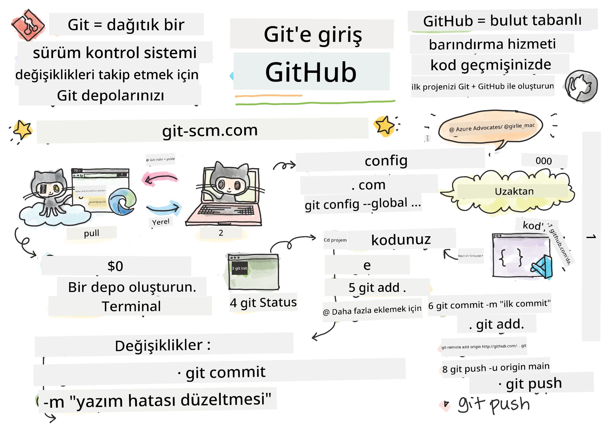
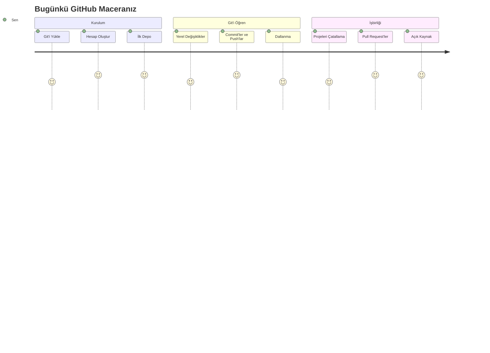
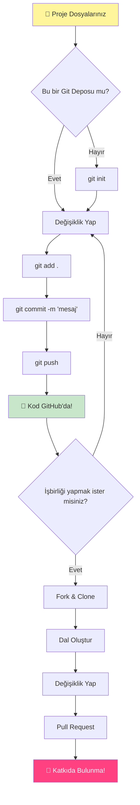
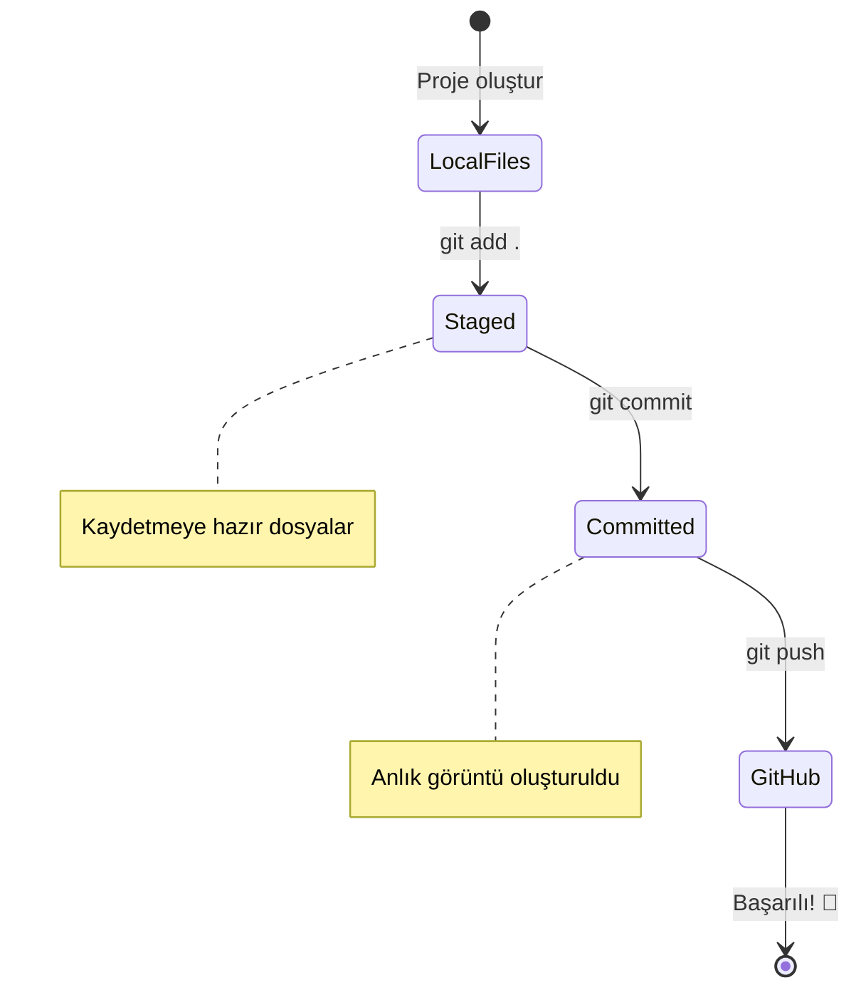
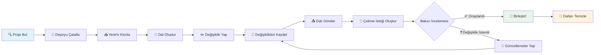
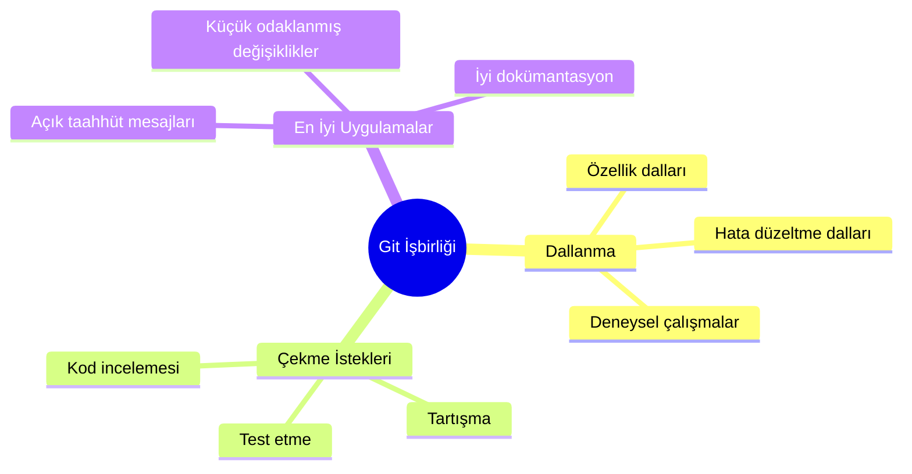
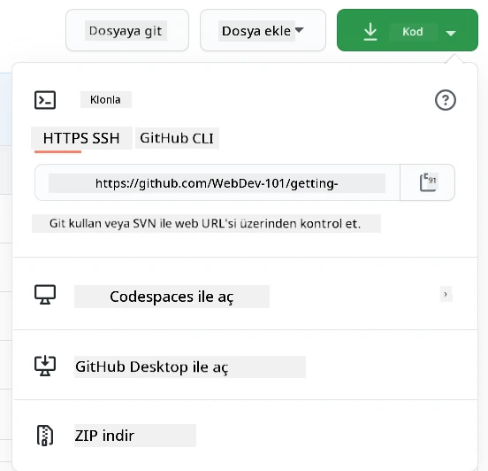
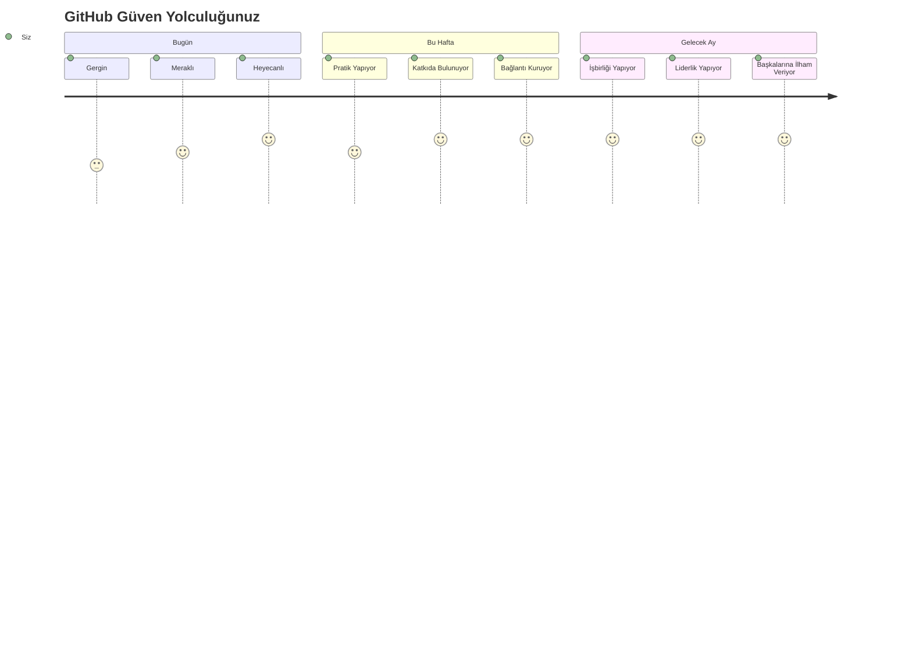

# GitHub'a Giriş

Merhaba, geleceğin geliştiricisi! 👋 Dünyanın dört bir yanındaki milyonlarca kodlayıcıya katılmaya hazır mısın? Seni GitHub ile tanıştırmak için gerçekten çok heyecanlıyım – bunu programcılar için bir sosyal medya platformu gibi düşün, ama öğle yemeği fotoğraflarını paylaşmak yerine kod paylaşıyoruz ve birlikte inanılmaz şeyler inşa ediyoruz!

Beni gerçekten hayrete düşüren şey şu: telefonundaki her uygulama, ziyaret ettiğin her web sitesi ve kullanmayı öğreneceğin çoğu araç, GitHub gibi platformlarda işbirliği yapan geliştirici ekipler tarafından oluşturuldu. Sevdiğin o müzik uygulaması mı? Senin gibi biri ona katkıda bulundu. Elinden bırakamadığın o oyun? Evet, muhtemelen GitHub işbirliğiyle yapıldı. Ve şimdi SEN bu harika topluluğun bir parçası olmayı öğreneceksin!

Başta bu biraz fazla gibi gelebilir – açıkçası, ilk GitHub sayfama bakarken "Bu ne anlama geliyor ki?" diye düşündüğümü hatırlıyorum. Ama işin güzel yanı şu: her bir geliştirici tam olarak şu anda senin olduğun yerde başladı. Bu dersin sonunda, kendi GitHub deposuna (bulutta kişisel proje vitrinini düşün) sahip olacaksın ve çalışmalarını nasıl kaydedeceğini, başkalarıyla nasıl paylaşacağını ve milyonlarca insanın kullandığı projelere nasıl katkıda bulunacağını öğreneceksin.

Bu yolculuğu birlikte, adım adım gerçekleştireceğiz. Acele yok, baskı yok – sadece sen, ben ve birazdan en iyi arkadaşların olacak gerçekten harika araçlar!


> Sketchnote: [Tomomi Imura](https://twitter.com/girlie_mac)


## Ders Öncesi Quiz
[Ders öncesi quiz](https://ff-quizzes.netlify.app)

## Giriş

Heyecan verici şeylere dalmadan önce, bilgisayarını biraz GitHub büyüsü için hazırlayalım! Bunu bir şaheser yaratmadan önce sanat malzemelerini düzenlemek gibi düşün – doğru araçlara sahip olmak her şeyi çok daha kolay ve eğlenceli hale getirir.

Her bir kurulum adımını bizzat seninle birlikte geçeceğim ve ilk bakışta göründüğü kadar korkutucu olmadığını garanti ederim. Bir şey hemen anlam ifade etmiyorsa, bu tamamen normal! İlk geliştirme ortamımı kurarken kendimi antik hiyeroglifleri okumaya çalışıyormuş gibi hissettiğimi hatırlıyorum. Her bir geliştirici tam olarak şu anda senin olduğun yerde oldu, doğru yapıp yapmadığını merak ederek. Spoiler: Eğer burada öğreniyorsan, zaten doğru yapıyorsun! 🌟

Bu derste şunları ele alacağız:

- bilgisayarında yaptığın çalışmaları takip etmek
- başkalarıyla projeler üzerinde çalışmak
- açık kaynak yazılıma nasıl katkıda bulunulacağı

### Ön Koşullar

Bilgisayarını biraz GitHub büyüsü için hazırlayalım! Endişelenme – bu kurulum yalnızca bir kez yapman gereken bir şey ve ardından tüm kodlama yolculuğun için hazır olacaksın.

Tamam, temelden başlayalım! Öncelikle Git'in bilgisayarında zaten takılıyor olup olmadığını kontrol etmemiz gerekiyor. Git, kodunda yaptığın her değişikliği hatırlayan süper zeki bir asistan gibi – her iki saniyede bir Ctrl+S'ye panikle basmaktan çok daha iyi (hepimiz orada bulunduk!).

Git'in zaten yüklü olup olmadığını görmek için terminaline şu sihirli komutu yaz:
`git --version`

Eğer Git henüz orada değilse, endişelenme! Sadece [Git'i indir](https://git-scm.com/downloads) ve al. Yükledikten sonra, Git'i düzgün bir şekilde tanıtmalıyız:

> 💡 **İlk Kurulum**: Bu komutlar Git'e kim olduğunu söyler. Bu bilgi yaptığın her bir commit'e eklenir, bu yüzden kamuya açık paylaşmaktan rahat olduğun bir isim ve e-posta seç.

```bash
git config --global user.name "your-name"
git config --global user.email "your-email"
```

Git'in zaten yapılandırılmış olup olmadığını kontrol etmek için şunu yazabilirsin:
```bash
git config --list
```

Ayrıca bir GitHub hesabına, bir kod düzenleyiciye (örneğin Visual Studio Code) ve terminalini (veya: komut istemini) açman gerekecek.

[github.com](https://github.com/) adresine gidip bir hesap oluşturabilir veya giriş yapıp profilini doldurabilirsin.

💡 **Modern ipucu**: Daha kolay kimlik doğrulama için [SSH anahtarları](https://docs.github.com/en/authentication/connecting-to-github-with-ssh) ayarlamayı veya [GitHub CLI](https://cli.github.com/) kullanmayı düşün.

✅ GitHub dünyadaki tek kod deposu değil; başka seçenekler de var, ancak GitHub en bilinenidir.

### Hazırlık

Yerel bilgisayarında (laptop veya PC) bir kod projesi içeren bir klasöre ve başkalarının projelerine nasıl katkıda bulunulacağını göstermek için bir örnek olarak hizmet edecek bir GitHub'da halka açık bir depoya ihtiyacın olacak.

### Kodunu Güvende Tutmak

Bir an için güvenlikten bahsedelim – ama endişelenme, seni korkutucu şeylerle bunaltmayacağız! Bu güvenlik uygulamalarını arabayı veya evi kilitlemek gibi düşün. Bunlar basit alışkanlıklar haline gelir ve çalışmalarını korur.

GitHub ile çalışırken, baştan itibaren modern ve güvenli yolları göstereceğiz. Bu şekilde, kodlama kariyerin boyunca sana iyi hizmet edecek iyi alışkanlıklar geliştireceksin.

GitHub ile çalışırken güvenlik en iyi uygulamalarını takip etmek önemlidir:

| Güvenlik Alanı | En İyi Uygulama | Neden Önemlidir |
|----------------|----------------|-----------------|
| **Kimlik Doğrulama** | SSH anahtarları veya Kişisel Erişim Tokenları kullan | Şifreler daha az güvenlidir ve aşamalı olarak kaldırılıyor |
| **İki Faktörlü Kimlik Doğrulama** | GitHub hesabında 2FA'yı etkinleştir | Hesap korumasına ekstra bir katman ekler |
| **Depo Güvenliği** | Hassas bilgileri asla commit etme | API anahtarları ve şifreler asla halka açık depolarda olmamalıdır |
| **Bağımlılık Yönetimi** | Dependabot'u güncellemeler için etkinleştir | Bağımlılıklarını güvenli ve güncel tutar |

> ⚠️ **Kritik Güvenlik Hatırlatması**: API anahtarlarını, şifreleri veya diğer hassas bilgileri hiçbir depoya commit etme. Hassas verileri korumak için ortam değişkenlerini ve `.gitignore` dosyalarını kullan.

**Modern Kimlik Doğrulama Ayarı:**

```bash
# SSH anahtarı oluştur (modern ed25519 algoritması)
ssh-keygen -t ed25519 -C "your_email@example.com"

# Git'i SSH kullanacak şekilde ayarla
git remote set-url origin git@github.com:username/repository.git
```

> 💡 **Profesyonel İpucu**: SSH anahtarları, şifreleri tekrar tekrar girme ihtiyacını ortadan kaldırır ve geleneksel kimlik doğrulama yöntemlerinden daha güvenlidir.

---

## Kodunu Profesyonelce Yönetmek

Tamam, İŞTE burası gerçekten heyecan verici oluyor! 🎉 Kodunu profesyoneller gibi nasıl takip edip yöneteceğini öğrenmek üzereyiz ve dürüst olmak gerekirse, bu öğretmeyi en sevdiğim şeylerden biri çünkü gerçekten oyunun kurallarını değiştiriyor.

Şunu hayal et: harika bir hikaye yazıyorsun ve her taslağı, her parlak düzenlemeyi ve her "bekle, bu dahice!" anını takip etmek istiyorsun. Git tam olarak bunu kodun için yapar! Her şeyi hatırlayan inanılmaz bir zaman yolculuğu defteri gibi – her tuş vuruşu, her değişiklik, her "aman, her şeyi bozdu" anı ki anında geri alabilirsin.

Dürüst olacağım – bu başta biraz bunaltıcı gelebilir. Başladığımda "Neden dosyalarımı normal şekilde kaydedemiyorum ki?" diye düşündüm. Ama bana güven: Git senin için anlam kazandığında (ve kazanacak!), "Bunu nasıl yapmadan kod yazdım ki?" diyeceğin o ampul anlarından birini yaşayacaksın. Sanki her zaman yürüyerek gittiğin yerde uçabileceğini keşfetmek gibi!

Diyelim ki yerel olarak bir kod projesi içeren bir klasörün var ve ilerlemeni git – versiyon kontrol sistemi – kullanarak takip etmek istiyorsun. Bazı insanlar git kullanmayı gelecekteki kendine bir aşk mektubu yazmaya benzetir. Commit mesajlarını günler, haftalar veya aylar sonra okuduğunda neden bir karar verdiğini hatırlayabilir veya bir değişikliği "geri alabilirsin" – yani, iyi "commit mesajları" yazdığında.


### Görev: İlk Deponu Oluştur!

> 🎯 **Görev (ve senin için çok heyecanlıyım!)**: İlk GitHub deponu birlikte oluşturacağız! Burada işimiz bittiğinde, kodunun yaşadığı internetin kendi küçük köşesine sahip olacaksın ve ilk "commit"ini yapmış olacaksın (bu, geliştirici dilinde çalışmalarını gerçekten akıllı bir şekilde kaydetmek anlamına gelir).
>
> Bu gerçekten özel bir an – küresel geliştiriciler topluluğuna resmi olarak katılmak üzeresin! İlk depomu oluşturmanın heyecanını ve "Vay, gerçekten bunu yapıyorum!" diye düşünmeyi hala hatırlıyorum.

Bu macerayı birlikte, adım adım geçelim. Her bir bölümü acele etmeden tamamla – acele etmenin ödülü yok ve her bir adımın anlamlı olacağına söz veriyorum. Unutma, hayranlık duyduğun her kodlama yıldızı bir zamanlar tam olarak senin olduğun yerdeydi, ilk deposunu oluşturmak üzereydi. Ne kadar havalı, değil mi?

> Videoyu izle
> 
> [](https://www.youtube.com/watch?v=9R31OUPpxU4)

**Bunu Birlikte Yapalım:**

1. **GitHub'da deponu oluştur**. GitHub.com'a git ve o parlak yeşil **Yeni** düğmesini (veya sağ üst köşedeki **+** işaretini) ara. Tıklayın ve **Yeni depo** seçeneğini seçin.

   İşte yapman gerekenler:
   1. Depoya bir isim ver – senin için anlamlı bir şey olsun!
   1. İstersen bir açıklama ekle (bu, başkalarının projenin ne hakkında olduğunu anlamasına yardımcı olur)
   1. Herkesin görebileceği bir depo (halka açık) mı yoksa sadece senin için (özel) mi istediğine karar ver
   1. README dosyası eklemek için kutuyu işaretlemeni öneririm – bu, projenin ön sayfası gibidir
   1. **Depo oluştur** düğmesine tıkla ve kutla – ilk deponu oluşturdun! 🎉

2. **Proje klasörüne git**. Şimdi terminalini açalım (endişelenme, göründüğü kadar korkutucu değil!). Bilgisayarımıza proje dosyalarının nerede olduğunu söylememiz gerekiyor. Şu komutu yaz:

   ```bash
   cd [name of your folder]
   ```

   **Burada ne yapıyoruz:**
   - Temelde "Hey bilgisayar, beni proje klasörüme götür" diyoruz
   - Bu, masaüstünde belirli bir klasörü açmak gibi, ama bunu metin komutlarıyla yapıyoruz
   - `[klasörünün adı]` kısmını proje klasörünün gerçek adıyla değiştir

3. **Klasörünü bir Git deposuna dönüştür**. İşte sihir burada başlıyor! Şunu yaz:

   ```bash
   git init
   ```

   **İşte olanlar (çok havalı şeyler!):**
   - Git, projenin içinde gizli bir `.git` klasörü oluşturdu – bunu görmeyeceksin, ama orada!
   - Normal klasörün artık yaptığın her değişikliği takip edebilen bir "depo" oldu
   - Bunu, klasörüne her şeyi hatırlama süper gücü vermek gibi düşün

4. **Neler olduğunu kontrol et**. Git'in şu anda projen hakkında ne düşündüğünü görelim:

   ```bash
   git status
   ```

   **Git'in sana söylediklerini anlama:**
   
   Şuna benzer bir şey görebilirsin:

   ```output
   Changes not staged for commit:
   (use "git add <file>..." to update what will be committed)
   (use "git restore <file>..." to discard changes in working directory)

        modified:   file.txt
        modified:   file2.txt
   ```

   **Panik yapma! İşte bunun anlamı:**
   - **Kırmızı** dosyalar, değişiklikleri olan ama henüz kaydetmeye hazır olmayan dosyalardır
   - **Yeşil** dosyalar (gördüğünde) kaydetmeye hazırdır
   - Git, bir sonraki adımda tam olarak ne yapabileceğini söyleyerek yardımcı oluyor

   > 💡 **Profesyonel ipucu**: `git status` komutu en iyi arkadaşın! Ne olup bittiğinden emin olmadığında kullan. Git'e "Hey, şu anda durum nedir?" diye sormak gibi.

5. **Dosyalarını kaydetmeye hazır hale getir** (buna "sahneleme" denir):

   ```bash
   git add .
   ```

   **Az önce ne yaptık:**
   - Git'e "Hey, bir sonraki kayıtta TÜM dosyalarımı dahil etmek istiyorum" dedik
   - `.` bu klasördeki "her şey" demek gibi
   - Şimdi dosyaların "sahnelendi" ve bir sonraki adıma hazır

   **Daha seçici mi olmak istiyorsun?** Sadece belirli dosyaları ekleyebilirsin:

   ```bash
   git add [file or folder name]
   ```

   **Bunu neden yapmak isteyebilirsin?**
   - Bazen ilgili değişiklikleri birlikte kaydetmek istersin
   - Çalışmanı mantıklı parçalara ayırmana yardımcı olur
   - Ne zaman ve neyin değiştiğini anlamayı kolaylaştırır

   **Fikrini mi değiştirdin?** Endişelenme! Dosyaları sahneleme dışına şu şekilde çıkarabilirsin:

   ```bash
   # Her şeyi sahneden kaldır
   git reset
   
   # Sadece bir dosyayı sahneden kaldır
   git reset [file name]
   ```

   Endişelenme – bu çalışmanı silmez, sadece dosyaları "kaydetmeye hazır" yığından çıkarır.

6. **Çalışmanı kalıcı olarak kaydet** (ilk commit'ini yap!):

   ```bash
   git commit -m "first commit"
   ```

   **🎉 Tebrikler! İlk commit'ini yaptın!**
   
   **İşte olanlar:**
   - Git, tam bu anda sahnelenmiş tüm dosyalarının bir "anlık görüntüsünü" aldı
   - Commit mesajın "ilk commit" bu kaydetme noktasının ne hakkında olduğunu açıklar
   - Git bu anlık görüntüye benzersiz bir kimlik verdi, böylece her zaman bulabilirsin
   - Projenin geçmişini takip etmeye resmi olarak başladın!

   > 💡 **Gelecekteki commit mesajları**: Bir sonraki commit'lerin için daha açıklayıcı ol! "Güncellenmiş şeyler" yerine "Ana sayfaya iletişim formu ekle" veya "Navigasyon menüsü hatasını düzelt" gibi bir şeyler yaz. Gelecekteki kendin sana teşekkür edecek!

7. **Yerel projenizi GitHub'a bağlayın**. Şu anda projeniz yalnızca bilgisayarınızda var. Onu GitHub deponuza bağlayalım, böylece dünyayla paylaşabilirsiniz!

   Öncelikle GitHub depo sayfanıza gidin ve URL'yi kopyalayın. Sonra buraya geri dönün ve şunu yazın:

   ```bash
   git remote add origin https://github.com/username/repository_name.git
   ```
   
   (O URL'yi gerçek depo URL'nizle değiştirin!)

   **Az önce ne yaptık:**
   - Yerel projeniz ile GitHub deposu arasında bir bağlantı oluşturduk.
   - "Origin" sadece GitHub deponuz için bir takma ad – telefonunuza bir kişi eklemek gibi düşünün.
   - Artık yerel Git'iniz, kodunuzu paylaşmaya hazır olduğunuzda nereye göndereceğini biliyor.

   💡 **Daha kolay bir yol**: Eğer GitHub CLI yüklüyse, bunu tek bir komutla yapabilirsiniz:
   ```bash
   gh repo create my-repo --public --push --source=.
   ```

8. **Kodunuzu GitHub'a gönderin** (büyük an!):

   ```bash
   git push -u origin main
   ```

   **🚀 İşte bu! Kodunuzu GitHub'a yüklüyorsunuz!**
   
   **Neler oluyor:**
   - Commit'leriniz bilgisayarınızdan GitHub'a taşınıyor.
   - `-u` bayrağı, gelecekteki gönderimler için kalıcı bir bağlantı kurar, böylece daha kolay olur.
   - "main" birincil dalınızın adı (ana klasör gibi).
   - Bundan sonra, gelecekteki yüklemeler için sadece `git push` yazabilirsiniz!

   💡 **Hızlı not**: Eğer dalınızın adı "master" gibi başka bir şeyse, o adı kullanın. `git branch --show-current` ile kontrol edebilirsiniz.

9. **Yeni günlük kodlama ritminiz** (işte bağımlılık yapmaya başladığı yer!):

   Bundan sonra, projenizde değişiklik yaptığınızda, bu basit üç adımlı dansı yapacaksınız:

   ```bash
   git add .
   git commit -m "describe what you changed"
   git push
   ```

   **Bu sizin kodlama ritminiz olacak:**
   - Kodunuza harika değişiklikler yapın ✨
   - `git add` ile sahneleyin ("Hey Git, bu değişikliklere dikkat et!")
   - `git commit` ile kaydedin ve açıklayıcı bir mesaj ekleyin (gelecekteki siz size teşekkür edecek!)
   - `git push` ile dünyayla paylaşın 🚀
   - Tekrar edin – cidden, bu nefes almak kadar doğal hale gelir!

   Bu iş akışını seviyorum çünkü bir video oyununda birden fazla kayıt noktası olması gibi. Sevdiğiniz bir değişiklik mi yaptınız? Commit yapın! Riskli bir şey denemek mi istiyorsunuz? Sorun değil – işler ters giderse her zaman son commit'inize geri dönebilirsiniz!

   > 💡 **İpucu**: `.gitignore` dosyasını benimsemek isteyebilirsiniz, böylece GitHub'da takip etmek istemediğiniz dosyalar görünmez – örneğin, aynı klasörde sakladığınız ama halka açık bir depoda yeri olmayan not dosyası. `.gitignore` dosyaları için şablonları [.gitignore templates](https://github.com/github/gitignore) adresinde bulabilir veya [gitignore.io](https://www.toptal.com/developers/gitignore) kullanarak bir tane oluşturabilirsiniz.

### 🧠 **İlk Depo Kontrolü: Nasıl Hissettiniz?**

**Bir an durup kutlayın ve düşünün:**
- Kodunuzun ilk kez GitHub'da görünmesini görmek nasıl hissettirdi?
- Hangi adım en kafa karıştırıcı geldi ve hangisi şaşırtıcı derecede kolaydı?
- `git add`, `git commit` ve `git push` arasındaki farkı kendi kelimelerinizle açıklayabilir misiniz?


> **Unutmayın**: Deneyimli geliştiriciler bile bazen tam komutları unutabilir. Bu iş akışının kas hafızasına dönüşmesi pratik gerektirir – harika gidiyorsunuz!

#### Modern Git iş akışları

Bu modern uygulamaları benimsemeyi düşünün:

- **Conventional Commits**: `feat:`, `fix:`, `docs:` gibi standart bir commit mesaj formatı kullanın. Daha fazla bilgi için [conventionalcommits.org](https://www.conventionalcommits.org/) adresini ziyaret edin.
- **Atomic commits**: Her bir commit'in tek bir mantıksal değişikliği temsil etmesini sağlayın.
- **Sık commit'ler**: Büyük ve seyrek commit'ler yerine sık sık açıklayıcı mesajlarla commit yapın.

#### Commit mesajları

Harika bir Git commit başlık satırı şu cümleyi tamamlar:
Eğer uygulanırsa, bu commit <buraya başlık satırınızı yazın> yapacaktır.

Başlıkta emir kipini ve şimdiki zamanı kullanın: "değiştir" değil "değiştirildi" veya "değiştiriyor". 
Başlıkta olduğu gibi, gövdede (isteğe bağlı) de emir kipini ve şimdiki zamanı kullanın. Gövde, değişikliğin motivasyonunu içermeli ve bunu önceki davranışla karşılaştırmalıdır. `neden`i açıklıyorsunuz, `nasıl`ı değil.

✅ GitHub'da biraz gezinmek için birkaç dakika ayırın. Gerçekten harika bir commit mesajı bulabilir misiniz? Çok minimal bir tane bulabilir misiniz? Commit mesajında iletilmesi gereken en önemli ve faydalı bilgilerin neler olduğunu düşünüyorsunuz?

## Başkalarıyla Çalışmak (Eğlenceli Kısım!)

Şapkanızı tutun çünkü GitHub burada tam anlamıyla büyüleyici hale geliyor! 🪄 Kendi kodunuzu yönetmeyi öğrendiniz, ama şimdi en sevdiğim kısma dalıyoruz – dünyanın dört bir yanından harika insanlarla iş birliği yapmak.

Şöyle hayal edin: yarın uyanıyorsunuz ve Tokyo'daki biri kodunuzu geliştiriyor. Sonra Berlin'deki biri takıldığınız bir hatayı düzeltiyor. Öğleden sonra, São Paulo'daki bir geliştirici sizin hiç düşünmediğiniz bir özellik ekliyor. Bu bilim kurgu değil – bu sadece GitHub evreninde sıradan bir salı!

Beni gerçekten heyecanlandıran şey, öğrenmek üzere olduğunuz iş birliği becerileri mi? Google, Microsoft ve en sevdiğiniz girişimlerdeki ekiplerin her gün kullandığı TAM olarak aynı iş akışları. Sadece havalı bir araç öğrenmiyorsunuz – tüm yazılım dünyasının birlikte çalışmasını sağlayan gizli dili öğreniyorsunuz.

Cidden, birinin ilk pull request'inizi birleştirdiği anın heyecanını yaşadığınızda, geliştiricilerin açık kaynak konusunda neden bu kadar tutkulu olduğunu anlayacaksınız. Dünyanın en büyük, en yaratıcı ekip projesinin bir parçası olmak gibi bir şey!

> Video'ya göz atın
>
> [](https://www.youtube.com/watch?v=bFCM-PC3cu8)

GitHub'a bir şeyler koymanın ana nedeni, diğer geliştiricilerle iş birliği yapmayı mümkün kılmaktı.


Depo içinde `Insights > Community` bölümüne giderek projenizin önerilen topluluk standartlarına nasıl uyduğunu görebilirsiniz.

Depo'nuzu profesyonel ve davetkar göstermek mi istiyorsunuz? Depo'nuzun içine gidin ve `Insights > Community`'ye tıklayın. Bu harika özellik, projenizin GitHub topluluğunun "iyi depo uygulamaları" olarak gördüğü şeylere nasıl uyduğunu gösterir.

> 🎯 **Projenizi Parlatmak**: İyi organize edilmiş bir depo ve iyi bir dokümantasyon, temiz ve davetkar bir mağaza vitrini gibi. İnsanlara işinize önem verdiğinizi gösterir ve başkalarının katkıda bulunmasını sağlar!

**Bir depoyu harika yapan şeyler:**

| Eklenmesi Gereken | Neden Önemli | Size Ne Sağlar |
|-------------------|--------------|----------------|
| **Açıklama** | İlk izlenim önemlidir! | İnsanlar projenizin ne yaptığını hemen anlar |
| **README** | Projenizin ön sayfası | Yeni ziyaretçiler için dostça bir rehber gibi |
| **Katkı Kuralları** | Yardımı memnuniyetle karşıladığınızı gösterir | İnsanlar size nasıl yardımcı olabileceklerini tam olarak bilir |
| **Davranış Kuralları** | Dostça bir alan yaratır | Herkes katılmak için kendini hoş karşılanmış hisseder |
| **Lisans** | Hukuki netlik sağlar | Başkaları kodunuzu nasıl kullanabileceklerini bilir |
| **Güvenlik Politikası** | Sorumlu olduğunuzu gösterir | Profesyonel uygulamaları gösterir |

> 💡 **Pro İpucu**: GitHub bu dosyalar için şablonlar sağlar. Yeni bir depo oluştururken, bu dosyaları otomatik olarak oluşturmak için kutuları işaretleyin.

**Keşfedilecek Modern GitHub Özellikleri:**

🤖 **Otomasyon & CI/CD:**
- **GitHub Actions** ile otomatik test ve dağıtım
- **Dependabot** ile otomatik bağımlılık güncellemeleri

💬 **Topluluk & Proje Yönetimi:**
- **GitHub Discussions** ile sorunların ötesinde topluluk sohbetleri
- **GitHub Projects** ile kanban tarzı proje yönetimi
- **Dal koruma kuralları** ile kod kalitesi standartlarını uygulama

Tüm bu kaynaklar yeni ekip üyelerinin işe alım sürecine fayda sağlayacaktır. Ve bunlar genellikle yeni katkıda bulunanların kodunuza bakmadan önce projenizin doğru yer olup olmadığını anlamak için baktığı şeylerdir.

✅ README dosyaları, hazırlanması zaman alsa da, genellikle meşgul bakımcılar tarafından ihmal edilir. Özellikle açıklayıcı bir örnek bulabilir misiniz? Not: [README dosyaları oluşturmak için araçlar](https://www.makeareadme.com/) var, denemek isteyebilirsiniz.

### Görev: Kod birleştirme

Katkı belgeleri, insanların projeye katkıda bulunmasına yardımcı olur. Hangi tür katkıları aradığınızı ve sürecin nasıl işlediğini açıklar. Katkıda bulunanlar, GitHub'daki deponuza katkıda bulunabilmek için bir dizi adımı takip etmek zorunda kalacaklar:

1. **Depoyu çatallama** Muhtemelen insanların projenizi _fork_ etmesini isteyeceksiniz. Fork etmek, deponuzun GitHub profillerinde bir kopyasını oluşturmak anlamına gelir.
1. **Klonlama**. Buradan projeyi yerel makinelerine klonlayacaklar.
1. **Dal oluşturma**. Çalışmaları için bir _dal_ oluşturmalarını isteyeceksiniz.
1. **Değişikliklerini bir alana odaklama**. Katkıda bulunanlardan katkılarını bir seferde bir şeye odaklamalarını isteyin – böylece çalışmalarını _birleştirme_ şansınız daha yüksek olur. Diyelim ki bir hata düzeltmesi yazıyorlar, yeni bir özellik ekliyorlar ve birkaç testi güncelliyorlar – ya 3 değişiklikten sadece 2'sini veya 1'ini uygulamak istiyorsanız?

✅ Dalların iyi kod yazma ve gönderme açısından özellikle kritik olduğu bir durumu hayal edin. Hangi kullanım durumlarını düşünebilirsiniz?

> Not, dünyada görmek istediğiniz değişim olun ve kendi çalışmalarınız için de dallar oluşturun. Yaptığınız her commit, şu anda "checkout" yaptığınız dalda yapılacaktır. Hangi dalda olduğunuzu görmek için `git status` kullanın.

Bir katkıda bulunan iş akışını inceleyelim. Katkıda bulunanın zaten depoyu _fork_ ettiğini ve _klonladığını_ varsayalım, böylece yerel makinelerinde çalışmaya hazır bir Git deposu var:

1. **Dal oluşturma**. `git branch` komutunu kullanarak katkıda bulunmayı düşündükleri değişiklikleri içerecek bir dal oluşturun:

   ```bash
   git branch [branch-name]
   ```

   > 💡 **Modern Yaklaşım**: Yeni bir dal oluşturup ona geçiş yapmak için tek bir komut kullanabilirsiniz:
   ```bash
   git switch -c [branch-name]
   ```

1. **Çalışma dalına geçiş yapma**. Belirtilen dala geçin ve `git switch` ile çalışma dizinini güncelleyin:

   ```bash
   git switch [branch-name]
   ```

   > 💡 **Modern Not**: `git switch`, dallar arasında geçiş yaparken `git checkout` yerine kullanılan modern bir alternatiftir. Daha net ve yeni başlayanlar için daha güvenlidir.

1. **Çalışma yapma**. Bu noktada değişikliklerinizi eklemek istiyorsunuz. Git'e bunu aşağıdaki komutlarla bildirmeyi unutmayın:

   ```bash
   git add .
   git commit -m "my changes"
   ```

   > ⚠️ **Commit Mesaj Kalitesi**: Commit'inize hem sizin hem de yardım ettiğiniz depo bakımcısı için iyi bir isim verin. Ne değiştirdiğiniz konusunda spesifik olun!

1. **Çalışmanızı `main` dalıyla birleştirme**. Bir noktada çalışmanızı `main` dalıyla birleştirmek isteyeceksiniz. Bu arada `main` dalı değişmiş olabilir, bu yüzden önce aşağıdaki komutlarla en son haline güncellediğinizden emin olun:

   ```bash
   git switch main
   git pull
   ```

   Bu noktada, herhangi bir _çatışmanın_, Git'in değişiklikleri kolayca _birleştiremediği_ durumların çalışma dalınızda gerçekleştiğinden emin olun. Bu nedenle aşağıdaki komutları çalıştırın:

   ```bash
   git switch [branch_name]
   git merge main
   ```

   `git merge main` komutu, `main` dalından tüm değişiklikleri dalınıza getirir. Umarız devam edebilirsiniz. Eğer edemezseniz, VS Code Git'in _kafasının karıştığı_ yerleri size gösterecek ve etkilenen dosyaları değiştirerek hangi içeriğin en doğru olduğunu belirteceksiniz.

   💡 **Modern alternatif**: Daha temiz bir geçmiş için `git rebase` kullanmayı düşünün:
   ```bash
   git rebase main
   ```
   Bu, commit'lerinizi en son `main` dalının üzerine yeniden oynatır ve doğrusal bir geçmiş oluşturur.

1. **Çalışmanızı GitHub'a gönderin**. Çalışmanızı GitHub'a göndermek iki şey anlamına gelir. Dalınızı deponuza itmek ve ardından bir PR, Pull Request açmak.

   ```bash
   git push --set-upstream origin [branch-name]
   ```

   Yukarıdaki komut, dalı çatallanan deponuzda oluşturur.

### 🤝 **İş Birliği Becerileri Kontrolü: Başkalarıyla Çalışmaya Hazır mısınız?**

**İş birliği hakkında nasıl hissettiğinizi görelim:**
- Fork ve pull request fikri artık size mantıklı geliyor mu?
- Dallarla çalışmak hakkında daha fazla pratik yapmak istediğiniz bir şey nedir?
- Başkasının projesine katkıda bulunma konusunda ne kadar rahat hissediyorsunuz?


> **Güven artırıcı**: Hayranlık duyduğunuz her geliştirici bir zamanlar ilk pull request'leri konusunda gergindi. GitHub topluluğu yeni başlayanlara inanılmaz derecede sıcak davranır!

1. **Bir PR açın**. Son olarak, bir PR açmak istiyorsunuz. Bunu GitHub'daki çatallanan depoya giderek yapabilirsiniz. GitHub'da yeni bir PR oluşturmak isteyip istemediğinizi soran bir gösterge göreceksiniz, buna tıklayın ve commit mesajı başlığını değiştirebileceğiniz, daha uygun bir açıklama ekleyebileceğiniz bir arayüze yönlendirilirsiniz. Şimdi çatalladığınız deponun bakımcısı bu PR'ı görecek ve _parmaklar çapraz_ PR'ınızı takdir edip _birleştirecek_. Artık bir katkıda bulunan oldunuz, yaşasın :)

   💡 **Modern ipucu**: PR'ları GitHub CLI kullanarak da oluşturabilirsiniz:
   ```bash
   gh pr create --title "Your PR title" --body "Description of changes"
   ```

   🔧 **PR'lar için en iyi uygulamalar**:
   - "Fixes #123" gibi anahtar kelimelerle ilgili sorunlara bağlantı verin.
   - UI değişiklikleri için ekran görüntüleri ekleyin.
   - Belirli inceleyiciler isteyin.
   - Çalışma aşamasındaki işler için taslak PR'lar kullanın.
   - İnceleme talep etmeden önce tüm CI kontrollerinin geçtiğinden emin olun.
1. **Temizlik yap**. Bir PR'yi başarıyla birleştirdikten sonra _temizlik yapmak_ iyi bir uygulama olarak kabul edilir. Hem yerel dalınızı hem de GitHub'a gönderdiğiniz dalı temizlemek istersiniz. Öncelikle aşağıdaki komutla yerel olarak silelim:

   ```bash
   git branch -d [branch-name]
   ```

   Ardından, fork edilmiş repo için GitHub sayfasına gidin ve az önce gönderdiğiniz uzak dalı kaldırın.

`Pull request` terimi biraz garip görünebilir çünkü aslında değişikliklerinizi projeye göndermek istiyorsunuz. Ancak, proje sahibi (maintainer) veya çekirdek ekip, değişikliklerinizi projenin "ana" dalıyla birleştirmeden önce değerlendirmelidir, bu yüzden aslında bir maintainer'dan değişiklik kararı talep ediyorsunuz.

Bir pull request, bir dalda yapılan değişiklikleri karşılaştırmak ve tartışmak için bir yerdir; incelemeler, yorumlar, entegre testler ve daha fazlasını içerir. İyi bir pull request, kabaca bir commit mesajının kurallarını takip eder. Örneğin, çalışmanız bir sorunu çözüyor ise, issue tracker'daki bir soruya referans ekleyebilirsiniz. Bu, `#` işareti ve ardından issue numarası ile yapılır. Örneğin `#97`.

🤞Parmaklarınızı çaprazlayın ki tüm kontroller geçsin ve proje sahibi(leri) değişikliklerinizi projeye birleştirsin🤞

GitHub'daki ilgili uzak dalda yapılan tüm yeni commit'lerle mevcut yerel çalışma dalınızı güncelleyin:

`git pull`

## Açık Kaynağa Katkı Sağlamak (Etkili Olma Şansınız!)

Hazır mısınız? Sizi tamamen şaşırtacak bir şeyden bahsedelim 🤯 Açık kaynak projelere katkı sağlamak – bunu sizinle paylaşmayı düşündükçe tüylerim diken diken oluyor!

Bu, gerçekten olağanüstü bir şeyin parçası olma şansınız. Milyonlarca geliştiricinin her gün kullandığı araçları geliştirdiğinizi veya arkadaşlarınızın sevdiği bir uygulamadaki bir hatayı düzelttiğinizi hayal edin. Bu sadece bir hayal değil – açık kaynak katkısı tam olarak bu!

Her düşündüğümde beni heyecanlandıran şey şu: Öğrendiğiniz her bir araç – kod editörünüz, keşfedeceğimiz framework'ler, hatta şu anda bu yazıyı okuduğunuz tarayıcı – bir zamanlar sizin gibi biri tarafından yapılan ilk katkıyla başladı. En sevdiğiniz VS Code eklentisini geliştiren o parlak geliştirici? Bir zamanlar titreyen ellerle "pull request oluştur" düğmesine tıklayan bir acemiydi, tıpkı sizin yapacağınız gibi.

Ve işte en güzel kısmı: Açık kaynak topluluğu, internetin en büyük grup sarılması gibidir. Çoğu proje yeni başlayanları aktif olarak arar ve "good first issue" etiketiyle işaretlenmiş sorunlar tam da sizin gibi insanlar için! Maintainer'lar yeni katkı sağlayıcıları gördüklerinde gerçekten heyecanlanır çünkü kendi ilk adımlarını hatırlarlar.

```mermaid
flowchart TD
    A[🔍 GitHub'u Keşfet] --> B[🏷️ "İlk iyi sorun" bul]
    B --> C[📖 Katkı Sağlama Kılavuzlarını Oku]
    C --> D[🍴 Depoyu Çatalla]
    D --> E[💻 Yerel Ortamı Kur]
    E --> F[🌿 Özellik Dalı Oluştur]
    F --> G[✨ Katkını Yap]
    G --> H[🧪 Değişikliklerini Test Et]
    H --> I[📝 Açık Bir Commit Yaz]
    I --> J[📤 Gönder & PR Oluştur]
    J --> K[💬 Geri Bildirimle Etkileşim Kur]
    K --> L[🎉 Birleştirildi! Artık Bir Katkıcısın!]
    L --> M[🌟 Bir Sonraki Sorunu Bul]
    
    style A fill:#e1f5fe
    style L fill:#c8e6c9
    style M fill:#fff59d
```
Burada sadece kod yazmayı öğrenmiyorsunuz – dijital dünyayı biraz daha iyi hale getirmek için her gün uyanan küresel bir inşaatçılar ailesine katılmaya hazırlanıyorsunuz! Kulübe hoş geldiniz! 🌟

Öncelikle, GitHub'da ilginizi çeken ve değişiklik yapmak istediğiniz bir depo (veya **repo**) bulalım. İçeriğini makinenize kopyalamak isteyeceksiniz.

✅ 'Yeni başlayanlar için uygun' depoları bulmanın iyi bir yolu [‘good-first-issue’ etiketiyle arama yapmak](https://github.blog/2020-01-22-browse-good-first-issues-to-start-contributing-to-open-source/)dır.



Kod kopyalamanın birkaç yolu vardır. Bir yol, HTTPS, SSH veya GitHub CLI (Komut Satırı Arayüzü) kullanarak depo içeriğini "klonlamaktır".

Terminalinizi açın ve depoyu şu şekilde klonlayın:
```bash
# HTTPS kullanılıyor
git clone https://github.com/ProjectURL

# SSH kullanılıyor (SSH anahtar kurulumu gerektirir)
git clone git@github.com:username/repository.git

# GitHub CLI kullanılıyor
gh repo clone username/repository
```

Projede çalışmak için doğru klasöre geçin:
`cd ProjectURL`

Ayrıca tüm projeyi şu araçlarla açabilirsiniz:
- **[GitHub Codespaces](https://github.com/features/codespaces)** - Tarayıcıda VS Code ile GitHub'ın bulut geliştirme ortamı
- **[GitHub Desktop](https://desktop.github.com/)** - Git işlemleri için bir GUI uygulaması  
- **[GitHub.dev](https://github.dev)** - Herhangi bir GitHub deposunda `.` tuşuna basarak tarayıcıda VS Code'u açın
- **VS Code** GitHub Pull Requests eklentisi ile

Son olarak, kodu sıkıştırılmış bir klasör olarak indirebilirsiniz.

### GitHub hakkında birkaç ilginç şey

GitHub'daki herhangi bir genel depoyu yıldızlayabilir, izleyebilir ve/veya "fork" edebilirsiniz. Yıldızladığınız depoları sağ üst açılır menüde bulabilirsiniz. Bu, kod için yer imi oluşturmak gibidir.

Projelerde genellikle GitHub'da "Issues" sekmesinde (aksi belirtilmedikçe) bir issue tracker bulunur, burada projeyle ilgili sorunlar tartışılır. Ve Pull Requests sekmesi, devam eden değişikliklerin tartışıldığı ve incelendiği yerdir.

Projelerde ayrıca forumlar, e-posta listeleri veya Slack, Discord veya IRC gibi sohbet kanallarında tartışmalar olabilir.

🔧 **Modern GitHub özellikleri**:
- **GitHub Discussions** - Topluluk sohbetleri için yerleşik forum
- **GitHub Sponsors** - Maintainer'ları finansal olarak destekleyin  
- **Security tab** - Güvenlik açıkları raporları ve güvenlik tavsiyeleri
- **Actions tab** - Otomatik iş akışlarını ve CI/CD boru hatlarını görün
- **Insights tab** - Katkı sağlayıcılar, commit'ler ve proje sağlığı hakkında analizler
- **Projects tab** - GitHub'ın yerleşik proje yönetim araçları

✅ Yeni GitHub deponuzda etrafa bir göz atın ve ayarları düzenlemek, deponuza bilgi eklemek, bir proje oluşturmak (örneğin bir Kanban tahtası gibi) ve otomasyon için GitHub Actions'ı ayarlamak gibi birkaç şey deneyin. Yapabileceğiniz çok şey var!

---

## 🚀 Meydan Okuma 

Tamam, şimdi yeni GitHub süper güçlerinizi test etme zamanı! 🚀 İşte her şeyi en tatmin edici şekilde anlamanızı sağlayacak bir meydan okuma:

Bir arkadaşınızı (veya sürekli "bu bilgisayar işleriyle ne yapıyorsun?" diye soran bir aile üyenizi) alın ve birlikte bir kodlama macerasına çıkın! İşte gerçek sihir burada başlıyor – bir proje oluşturun, onların fork yapmasına izin verin, birkaç dal oluşturun ve değişiklikleri birleştirin, tıpkı profesyoneller gibi.

Dürüst olacağım – muhtemelen bir noktada güleceksiniz (özellikle ikiniz aynı satırı değiştirmeye çalıştığınızda), belki kafanız karışacak, ama kesinlikle tüm öğrenmeyi değerli kılan o harika "aha!" anlarını yaşayacaksınız. Ayrıca, ilk başarılı birleştirmeyi başkasıyla paylaşmanın özel bir yanı var – ne kadar ilerlediğinizi kutlayan küçük bir kutlama gibi!

Henüz bir kodlama arkadaşınız yok mu? Hiç sorun değil! GitHub topluluğu, yeni olmanın nasıl bir şey olduğunu hatırlayan inanılmaz derecede sıcak insanlarla dolu. "good first issue" etiketli depoları arayın – temelde "Hey yeni başlayanlar, bizimle öğrenin!" diyorlar. Ne kadar harika, değil mi?

## Ders Sonrası Quiz
[Ders sonrası quiz](https://ff-quizzes.netlify.app/web/en/)

## Gözden Geçirme ve Öğrenmeye Devam Etme

Vay! 🎉 Bakın size – GitHub temellerini bir şampiyon gibi fethettiniz! Şu anda beyniniz biraz dolu hissediyorsa, bu tamamen normal ve dürüst olmak gerekirse iyi bir işaret. Başladığımda haftalarca rahat hissetmek için uğraştığım araçları yeni öğrendiniz.

Git ve GitHub inanılmaz derecede güçlüdür (cidden güçlü), ve tanıdığım her geliştirici – şu anda sihirbaz gibi görünenler dahil – her şeyin yerine oturması için biraz pratik yapıp tökezlemek zorunda kaldı. Bu dersi tamamlamış olmanız, bir geliştiricinin araç setindeki en önemli araçlardan bazılarını öğrenme yolunda olduğunuz anlamına gelir.

İşte pratik yapmanıza ve daha da harika olmanıza yardımcı olacak bazı harika kaynaklar:

- [Açık kaynak yazılıma katkı sağlama rehberi](https://opensource.guide/how-to-contribute/#how-to-submit-a-contribution) – Fark yaratmak için yol haritanız
- [Git hile sayfası](https://training.github.com/downloads/github-git-cheat-sheet/) – Hızlı referans için elinizin altında bulundurun!

Ve unutmayın: pratik mükemmellik değil, ilerleme sağlar! Git ve GitHub'ı ne kadar çok kullanırsanız, o kadar doğal hale gelir. GitHub, güvenli bir ortamda pratik yapmanıza olanak tanıyan bazı harika interaktif kurslar oluşturdu:

- [GitHub'a Giriş](https://github.com/skills/introduction-to-github)
- [Markdown ile İletişim Kurma](https://github.com/skills/communicate-using-markdown)  
- [GitHub Pages](https://github.com/skills/github-pages)
- [Birleştirme Çatışmalarını Yönetme](https://github.com/skills/resolve-merge-conflicts)

**Macera mı arıyorsunuz? İşte modern araçlar:**
- [GitHub CLI belgeleri](https://cli.github.com/manual/) – Komut satırı sihirbazı gibi hissetmek için
- [GitHub Codespaces belgeleri](https://docs.github.com/en/codespaces) – Bulutta kod yazın!
- [GitHub Actions belgeleri](https://docs.github.com/en/actions) – Her şeyi otomatikleştirin
- [Git en iyi uygulamaları](https://www.atlassian.com/git/tutorials/comparing-workflows) – İş akışı oyununu geliştirin 

## GitHub Copilot Agent Meydan Okuması 🚀

Agent modunu kullanarak aşağıdaki meydan okumayı tamamlayın:

**Açıklama:** Bu derste öğrendiğiniz GitHub iş akışını tamamen gösteren işbirlikçi bir web geliştirme projesi oluşturun. Bu meydan okuma, depo oluşturma, işbirliği özellikleri ve modern Git iş akışlarını gerçek dünya senaryosunda uygulamanıza yardımcı olacaktır.

**Talimat:** Basit bir "Web Geliştirme Kaynakları" projesi için yeni bir genel GitHub deposu oluşturun. Depo, kategorilere göre düzenlenmiş (HTML, CSS, JavaScript, vb.) yararlı web geliştirme araçları ve kaynaklarını listeleyen iyi yapılandırılmış bir README.md dosyası içermelidir. Depoyu lisans, katkı sağlama yönergeleri ve bir davranış kuralları gibi uygun topluluk standartlarıyla ayarlayın. CSS kaynaklarını eklemek için bir dal ve JavaScript kaynaklarını eklemek için başka bir dal oluşturun. Her dala açıklayıcı commit mesajlarıyla commit yapın, ardından değişiklikleri ana dala birleştirmek için pull request'ler oluşturun. Issues, Discussions gibi GitHub özelliklerini etkinleştirin ve otomatik kontroller için temel bir GitHub Actions iş akışı ayarlayın.

## Ödev 

Göreviniz, kabul etmeyi seçerseniz: GitHub Skills'deki [GitHub'a Giriş](https://github.com/skills/introduction-to-github) kursunu tamamlayın. Bu interaktif kurs, öğrendiklerinizi güvenli, rehberli bir ortamda uygulamanıza olanak tanır. Ayrıca bitirdiğinizde harika bir rozet kazanacaksınız! 🏅

**Daha fazla meydan okumaya hazır mısınız?**
- GitHub hesabınız için SSH kimlik doğrulamasını ayarlayın (artık şifre yok!)
- Günlük Git işlemleriniz için GitHub CLI kullanmayı deneyin
- GitHub Actions iş akışı olan bir depo oluşturun
- Bu depoyu bulut tabanlı bir editörde açarak GitHub Codespaces'ı keşfedin

---

## 🚀 GitHub Ustalık Zaman Çizelgeniz

### ⚡ **Sonraki 5 Dakikada Yapabilecekleriniz**
- [ ] Bu depoyu ve ilginizi çeken 3 diğer projeyi yıldızlayın
- [ ] GitHub hesabınızda iki faktörlü kimlik doğrulama ayarlayın
- [ ] İlk deponuz için basit bir README oluşturun
- [ ] Çalışmaları sizi etkileyen 5 geliştiriciyi takip edin

### 🎯 **Bu Saatte Başarabilecekleriniz**
- [ ] Ders sonrası quiz'i tamamlayın ve GitHub yolculuğunuzu düşünün
- [ ] GitHub kimlik doğrulaması için SSH anahtarlarını ayarlayın
- [ ] Harika bir commit mesajıyla ilk anlamlı commit'inizi oluşturun
- [ ] GitHub'ın "Keşfet" sekmesini keşfederek trend olan projeleri bulun
- [ ] Bir depoyu fork etmeyi ve küçük bir değişiklik yapmayı pratik edin

### 📅 **Haftalık GitHub Maceranız**
- [ ] GitHub Skills kurslarını tamamlayın (GitHub'a Giriş, Markdown)
- [ ] Açık kaynak bir projeye ilk pull request'inizi yapın
- [ ] Çalışmanızı sergilemek için bir GitHub Pages sitesi kurun
- [ ] İlginizi çeken projelerde GitHub Discussions'a katılın
- [ ] Uygun topluluk standartlarına sahip bir depo oluşturun (README, Lisans, vb.)
- [ ] Bulut tabanlı geliştirme için GitHub Codespaces'ı deneyin

### 🌟 **Aylık Dönüşümünüz**
- [ ] 3 farklı açık kaynak projeye katkıda bulunun
- [ ] GitHub'da yeni birine mentorluk yapın (yardımcı olun!)
- [ ] GitHub Actions ile otomatik iş akışları ayarlayın
- [ ] GitHub katkılarınızı sergileyen bir portföy oluşturun
- [ ] Hacktoberfest veya benzeri topluluk etkinliklerine katılın
- [ ] Başkalarının katkıda bulunduğu kendi projenizin maintainer'ı olun

### 🎓 **Son GitHub Ustalık Kontrolü**

**Ne kadar ilerlediğinizi kutlayın:**
- GitHub kullanımıyla ilgili en sevdiğiniz şey nedir?
- Sizi en çok heyecanlandıran işbirliği özelliği hangisi?
- Açık kaynağa katkı sağlama konusunda ne kadar kendinize güveniyorsunuz?
- Katkıda bulunmak istediğiniz ilk proje hangisi?


> 🌍 **Küresel geliştirici topluluğuna hoş geldiniz!** Artık dünya çapında milyonlarca geliştiriciyle işbirliği yapma araçlarına sahipsiniz. İlk katkınız küçük görünebilir, ancak unutmayın - her büyük açık kaynak projesi, birinin ilk commit'ini yapmasıyla başladı. Soru, etkili olup olmayacağınız değil, hangi harika projenin benzersiz bakış açınızdan faydalanacağıdır! 🚀

Unutmayın: her uzman bir zamanlar acemiydi. Bunu başarabilirsiniz! 💪

---

<!-- CO-OP TRANSLATOR DISCLAIMER START -->
**Feragatname**:  
Bu belge, AI çeviri hizmeti [Co-op Translator](https://github.com/Azure/co-op-translator) kullanılarak çevrilmiştir. Doğruluk için çaba göstersek de, otomatik çeviriler hata veya yanlışlıklar içerebilir. Belgenin orijinal dili, yetkili kaynak olarak kabul edilmelidir. Kritik bilgiler için profesyonel insan çevirisi önerilir. Bu çevirinin kullanımından kaynaklanan yanlış anlamalar veya yanlış yorumlamalardan sorumlu değiliz.
<!-- CO-OP TRANSLATOR DISCLAIMER END -->