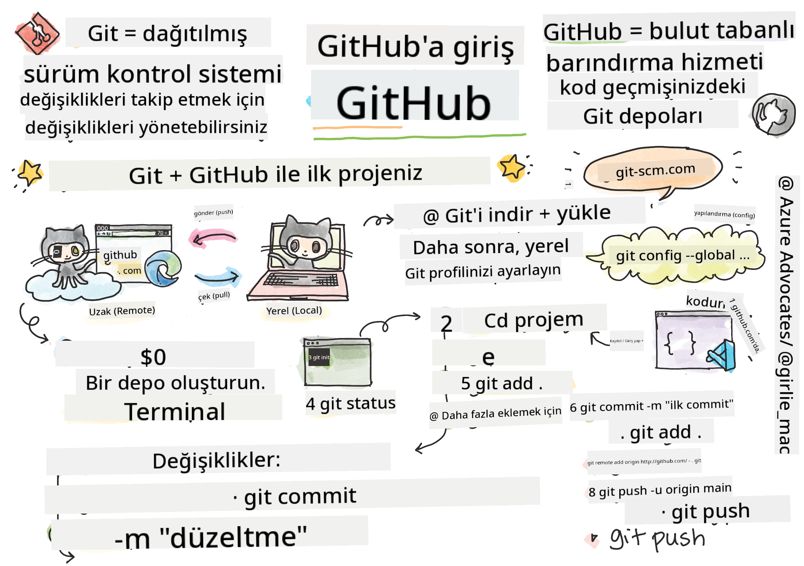
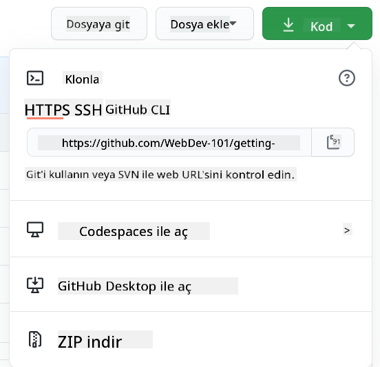

<!--
CO_OP_TRANSLATOR_METADATA:
{
  "original_hash": "361249da70432ddfd4741c917d1a6f50",
  "translation_date": "2025-08-29T00:32:37+00:00",
  "source_file": "1-getting-started-lessons/2-github-basics/README.md",
  "language_code": "tr"
}
-->
# GitHub'a Giriş

Bu ders, kodunuzu barındırmak ve değişiklikleri yönetmek için kullanılan GitHub'ın temel bilgilerini kapsar.


> Sketchnote: [Tomomi Imura](https://twitter.com/girlie_mac)

## Ders Öncesi Test
[Ders öncesi testi](https://ff-quizzes.netlify.app)

## Giriş

Bu derste şunları ele alacağız:

- Makinenizde yaptığınız çalışmaları takip etmek
- Başkalarıyla projeler üzerinde çalışmak
- Açık kaynak yazılıma nasıl katkıda bulunulacağı

### Ön Koşullar

Başlamadan önce, Git'in yüklü olup olmadığını kontrol etmeniz gerekir. Terminale şu komutu yazın:  
`git --version`

Eğer Git yüklü değilse, [Git'i indirin](https://git-scm.com/downloads). Ardından, terminalde yerel Git profilinizi ayarlayın:
* `git config --global user.name "adınız"`
* `git config --global user.email "e-posta adresiniz"`

Git'in zaten yapılandırılmış olup olmadığını kontrol etmek için şu komutu yazabilirsiniz:  
`git config --list`

Ayrıca bir GitHub hesabına, bir kod düzenleyiciye (örneğin Visual Studio Code) ve terminalinizi (veya komut istemcisini) açmanız gerekecek.

[github.com](https://github.com/) adresine gidin ve henüz bir hesabınız yoksa bir hesap oluşturun ya da giriş yaparak profilinizi doldurun.

✅ GitHub, dünyadaki tek kod deposu değildir; başka seçenekler de vardır, ancak GitHub en bilinenidir.

### Hazırlık

Yerel makinenizde (dizüstü bilgisayar veya PC) bir kod projesi içeren bir klasöre ve başkalarının projelerine nasıl katkıda bulunacağınızı göstermek için bir örnek olarak kullanılacak bir GitHub'da halka açık bir depoya ihtiyacınız olacak.

---

## Kod Yönetimi

Diyelim ki yerel olarak bir kod projesi içeren bir klasörünüz var ve ilerlemenizi Git - sürüm kontrol sistemi - kullanarak takip etmeye başlamak istiyorsunuz. Bazı insanlar Git kullanmayı, gelecekteki kendinize bir aşk mektubu yazmaya benzetir. Günler, haftalar veya aylar sonra commit mesajlarınızı okuduğunuzda, neden bir karar verdiğinizi hatırlayabilir veya bir değişikliği "geri alabilirsiniz" - tabii ki iyi "commit mesajları" yazdığınızda.

### Görev: Bir Depo Oluşturun ve Kodu Commit Edin  

> Videoyu izleyin  
> 
> [](https://www.youtube.com/watch?v=9R31OUPpxU4)

1. **GitHub'da bir depo oluşturun**. GitHub.com'da, depolar sekmesinde veya sağ üstteki gezinme çubuğundan **yeni depo** düğmesini bulun.

   1. Depoya bir ad verin.
   1. **Depo oluştur** seçeneğini seçin.

1. **Çalışma klasörünüze gidin**. Terminalinizde, takip etmek istediğiniz klasöre (dizin olarak da bilinir) geçin. Şunu yazın:

   ```bash
   cd [name of your folder]
   ```

1. **Bir git deposu başlatın**. Projenizde şunu yazın:

   ```bash
   git init
   ```

1. **Durumu kontrol edin**. Depo durumunu kontrol etmek için şunu yazın:

   ```bash
   git status
   ```

   Çıktı şu şekilde görünebilir:

   ```output
   Changes not staged for commit:
   (use "git add <file>..." to update what will be committed)
   (use "git checkout -- <file>..." to discard changes in working directory)

        modified:   file.txt
        modified:   file2.txt
   ```

   Genellikle `git status` komutu, depoya _kaydedilmeye_ hazır olan veya üzerinde değişiklik yapılan dosyalar gibi bilgileri size söyler.

1. **Tüm dosyaları takibe ekleyin**  
   Bu işlem, dosyaları sahneleme alanına eklemek olarak da adlandırılır.

   ```bash
   git add .
   ```

   `git add` ve `.` argümanı, tüm dosyalarınızı ve değişikliklerinizi takibe ekler.

1. **Seçili dosyaları takibe ekleyin**

   ```bash
   git add [file or folder name]
   ```

   Bu, tüm dosyaları bir kerede commit etmek istemediğinizde yalnızca seçili dosyaları sahneleme alanına eklemenize yardımcı olur.

1. **Tüm dosyaları sahneleme alanından çıkarın**

   ```bash
   git reset
   ```

   Bu komut, tüm dosyaları bir kerede sahneleme alanından çıkarmanıza yardımcı olur.

1. **Belirli bir dosyayı sahneleme alanından çıkarın**

   ```bash
   git reset [file or folder name]
   ```

   Bu komut, yalnızca belirli bir dosyayı sahneleme alanından çıkarmanıza yardımcı olur.

1. **Çalışmanızı kalıcı hale getirin**. Bu noktada dosyaları _sahneleme alanına_ eklediniz. Git'in dosyalarınızı takip ettiği bir yer. Değişikliği kalıcı hale getirmek için dosyaları _commit_ etmeniz gerekir. Bunu yapmak için `git commit` komutunu kullanarak bir _commit_ oluşturun. Bir _commit_, deponuzun geçmişinde bir kayıt noktasıdır. Bir _commit_ oluşturmak için şunu yazın:

   ```bash
   git commit -m "first commit"
   ```

   Bu, tüm dosyalarınızı "ilk commit" mesajıyla commit eder. Gelecekteki commit mesajlarınızda, yaptığınız değişiklik türünü açıklamak için daha açıklayıcı bir açıklama kullanmak isteyeceksiniz.

1. **Yerel Git deponuzu GitHub ile bağlayın**. Bir Git deposu makinenizde iyidir, ancak bir noktada dosyalarınızın bir yedeğini bir yerde almak ve ayrıca diğer insanları deponuzda sizinle çalışmaya davet etmek istersiniz. Bunu yapabileceğiniz harika bir yer GitHub'dır. Daha önce GitHub'da bir depo oluşturduğumuzu hatırlayın, bu yüzden yapmamız gereken tek şey yerel Git depomuzu GitHub ile bağlamaktır. `git remote add` komutu bunu yapacaktır. Şu komutu yazın:

   > Not: Komutu yazmadan önce GitHub depo sayfanıza gidin ve depo URL'sini bulun. Aşağıdaki komutta ```https://github.com/username/repository_name.git``` yerine GitHub URL'nizi kullanın.

   ```bash
   git remote add origin https://github.com/username/repository_name.git
   ```

   Bu, daha önce oluşturduğunuz GitHub deposunu işaret eden "origin" adlı bir _uzaktan bağlantı_ oluşturur.

1. **Yerel dosyaları GitHub'a gönderin**. Şimdiye kadar yerel depo ile GitHub deposu arasında bir _bağlantı_ oluşturduk. Bu dosyaları GitHub'a göndermek için şu komutu kullanın: 

   > Not: Varsayılan olarak dal adınız ```main```'den farklı olabilir.

   ```bash
   git push -u origin main
   ```

   Bu, "main" dalınızdaki commit'lerinizi GitHub'a gönderir.

2. **Daha fazla değişiklik eklemek için**. Değişiklik yapmaya ve bunları GitHub'a göndermeye devam etmek istiyorsanız, şu üç komutu kullanmanız yeterlidir:

   ```bash
   git add .
   git commit -m "type your commit message here"
   git push
   ```

   > İpucu: `.gitignore` dosyasını benimsemek isteyebilirsiniz. Bu, GitHub'da takip etmek istemediğiniz dosyaların görünmesini engeller - örneğin, aynı klasörde sakladığınız ancak bir genel depoda yeri olmayan not dosyası gibi. `.gitignore` dosyaları için şablonları [.gitignore templates](https://github.com/github/gitignore) adresinde bulabilirsiniz.

#### Commit Mesajları

Harika bir Git commit başlık satırı şu cümleyi tamamlar:  
Eğer uygulanırsa, bu commit <buraya başlık satırınız> yapacaktır.

Başlık için emir kipinde, şimdiki zamanı kullanın: "değiştir" (changed veya changes değil).  
Başlıkta olduğu gibi, gövdede (isteğe bağlı) de emir kipinde, şimdiki zamanı kullanın. Gövde, değişikliğin motivasyonunu ve bunu önceki davranışla karşılaştırmayı içermelidir. `Neden`i açıklıyorsunuz, `nasıl`ı değil.

✅ GitHub'da biraz dolaşmak için birkaç dakikanızı ayırın. Gerçekten harika bir commit mesajı bulabilir misiniz? Çok minimal bir tane bulabilir misiniz? Commit mesajında iletilmesi gereken en önemli ve faydalı bilgilerin neler olduğunu düşünüyorsunuz?

### Görev: İşbirliği Yapın

GitHub'a bir şeyler koymanın ana nedeni, diğer geliştiricilerle işbirliği yapmayı mümkün kılmaktır.

## Başkalarıyla Projeler Üzerinde Çalışmak

> Videoyu izleyin  
>
> [](https://www.youtube.com/watch?v=bFCM-PC3cu8)

Depo sayfanızda, `Insights > Community` sekmesine giderek projenizin önerilen topluluk standartlarına nasıl uyduğunu görebilirsiniz.

   GitHub deponuzu geliştirebilecek bazı şeyler şunlardır:
   - **Açıklama**. Projeniz için bir açıklama eklediniz mi?
   - **README**. Bir README eklediniz mi? GitHub, bir [README yazma](https://docs.github.com/articles/about-readmes/?WT.mc_id=academic-77807-sagibbon) konusunda rehberlik sağlar.
   - **Katkı Kılavuzu**. Projenizin bir [katkı kılavuzu](https://docs.github.com/articles/setting-guidelines-for-repository-contributors/?WT.mc_id=academic-77807-sagibbon) var mı?
   - **Davranış Kuralları**. Bir [Davranış Kuralları](https://docs.github.com/articles/adding-a-code-of-conduct-to-your-project/) eklediniz mi?
   - **Lisans**. Belki de en önemlisi, bir [lisans](https://docs.github.com/articles/adding-a-license-to-a-repository/) eklediniz mi?

Tüm bu kaynaklar, yeni ekip üyelerinin projeye dahil olmasına fayda sağlar. Ve bunlar genellikle yeni katkıda bulunanların, zamanlarını harcamak için doğru yerin sizin projeniz olup olmadığını öğrenmek için kodunuza bakmadan önce incelediği şeylerdir.

✅ README dosyaları, hazırlanması zaman alsa da, genellikle meşgul bakımcılar tarafından ihmal edilir. Özellikle açıklayıcı bir README örneği bulabilir misiniz? Not: [İyi README'ler oluşturmanıza yardımcı olacak araçlar](https://www.makeareadme.com/) vardır, bunları denemek isteyebilirsiniz.

### Görev: Kod Birleştirin

Katkı belgeleri, insanların projeye katkıda bulunmasına yardımcı olur. Hangi tür katkılara ihtiyaç duyduğunuzu ve sürecin nasıl işlediğini açıklar. Katkıda bulunanlar, GitHub'daki deponuza katkıda bulunabilmek için bir dizi adımı takip etmek zorunda kalacaklar:

1. **Depoyu çatallama**. İnsanların projenizi _çatallamasını_ isteyeceksiniz. Çatallama, deponuzun GitHub profillerinde bir kopyasını oluşturmak anlamına gelir.
1. **Klonlama**. Daha sonra projeyi yerel makinelerine klonlayacaklar.
1. **Dal oluşturma**. Çalışmaları için bir _dal_ oluşturmalarını isteyeceksiniz.
1. **Değişikliklerini bir alana odaklama**. Katkıda bulunanlardan katkılarını bir seferde bir şeye odaklamalarını isteyin - bu şekilde çalışmalarını _birleştirme_ şansınız daha yüksek olur. Örneğin, bir hata düzeltmesi yazdıklarını, yeni bir özellik eklediklerini ve birkaç testi güncellediklerini hayal edin - ya 3'ten 2'sini veya 1'ini uygulamak istiyorsanız?

✅ Dalların iyi kod yazma ve gönderme açısından özellikle kritik olduğu bir durumu hayal edin. Hangi kullanım durumlarını düşünebilirsiniz?

> Not: Dünyada görmek istediğiniz değişim olun ve kendi çalışmalarınız için de dallar oluşturun. Yaptığınız commit'ler, şu anda "checkout" yaptığınız dalda yapılacaktır. Hangi dalda olduğunuzu görmek için `git status` kullanın.

Bir katkıda bulunan iş akışını inceleyelim. Katkıda bulunanın zaten depoyu _çatalladığını_ ve _klonladığını_ ve yerel makinesinde çalışmaya hazır bir Git deposuna sahip olduğunu varsayalım:

1. **Dal oluşturma**. Katkıda bulunmayı düşündükleri değişiklikleri içerecek bir dal oluşturmak için `git branch` komutunu kullanın:

   ```bash
   git branch [branch-name]
   ```

1. **Çalışma dalına geçiş yapın**. Belirtilen dala geçin ve çalışma dizinini `git switch` ile güncelleyin:

   ```bash
   git switch [branch-name]
   ```

1. **Çalışma yapın**. Bu noktada değişikliklerinizi eklemek istersiniz. Git'e bunu şu komutlarla bildirmeyi unutmayın:

   ```bash
   git add .
   git commit -m "my changes"
   ```

   Commit'inize iyi bir ad verdiğinizden emin olun, hem sizin hem de yardım ettiğiniz depo bakımcısı için.

1. **Çalışmanızı `main` dalıyla birleştirin**. Bir noktada çalışmanızı tamamladınız ve bunu `main` dalındaki çalışmalarla birleştirmek istiyorsunuz. Bu arada `main` dalı değişmiş olabilir, bu yüzden önce aşağıdaki komutlarla en son sürüme güncellediğinizden emin olun:

   ```bash
   git switch main
   git pull
   ```

   Bu noktada, herhangi bir _çatışmanın_, yani Git'in değişiklikleri kolayca _birleştiremediği_ durumların çalışma dalınızda gerçekleştiğinden emin olmak istersiniz. Bu nedenle şu komutları çalıştırın:

   ```bash
   git switch [branch_name]
   git merge main
   ```

   Bu, `main` dalındaki tüm değişiklikleri dalınıza getirir ve umarım sadece devam edebilirsiniz. Eğer edemezseniz, VS Code, Git'in _kafasının karıştığı_ yerleri size gösterecek ve etkilenen dosyaları değiştirerek hangi içeriğin en doğru olduğunu belirteceksiniz.

1. **Çalışmanızı GitHub'a gönderin**. Çalışmanızı GitHub'a göndermek iki şey anlamına gelir. Dalınızı deponuza göndermek ve ardından bir PR (Pull Request) açmak.

   ```bash
   git push --set-upstream origin [branch-name]
   ```

   Yukarıdaki komut, çatalladığınız depoda dalı oluşturur.

1. **Bir PR açın**. Ardından, bir PR açmak istersiniz. Bunu, GitHub'daki çatalladığınız depo sayfasına giderek yapabilirsiniz. GitHub'da yeni bir PR oluşturmak isteyip istemediğinizi soran bir gösterge göreceksiniz, buna tıklayın ve commit mesajı başlığını değiştirebileceğiniz, daha uygun bir açıklama ekleyebileceğiniz bir arayüze yönlendirilirsiniz. Şimdi, çatalladığınız deponun bakımcısı bu PR'ı görecek ve _parmaklar çapraz_ PR'ınızı takdir edip _birleştirecek_. Artık bir katkıda bulunan oldunuz, yaşasın :)

1. **Temizlik yapın**. Bir PR'ı başarıyla birleştirdikten sonra _temizlik yapmak_ iyi bir uygulama olarak kabul edilir. Yerel dalınızı ve GitHub'a gönderdiğiniz dalı temizlemek istersiniz. Öncelikle, yerel olarak şu komutla silin:

   ```bash
   git branch -d [branch-name]
   ```

   Ardından, GitHub'daki çatalladığınız depo sayfasına gidin ve az önce gönderdiğiniz uzak dalı kaldırın.
`Pull request` terimi biraz garip gelebilir çünkü aslında değişikliklerinizi projeye "push" etmek istersiniz. Ancak, proje sahibi (maintainer) veya çekirdek ekip, değişikliklerinizi projenin "main" dalıyla birleştirmeden önce değerlendirmelidir. Yani aslında bir maintainer'dan değişiklik kararı talep ediyorsunuz.  

Bir pull request, bir dalda yapılan değişiklikleri karşılaştırmak ve tartışmak için incelemeler, yorumlar, entegre testler ve daha fazlasını içeren bir yerdir. İyi bir pull request, kabaca bir commit mesajı ile aynı kuralları takip eder. Örneğin, çalışmanız bir sorunu çözdüğünde, issue tracker'daki bir soruya referans ekleyebilirsiniz. Bu, `#` işareti ve ardından sorunun numarası kullanılarak yapılır. Örneğin `#97`.

🤞Umarız tüm kontroller başarıyla geçer ve proje sahibi(leri) değişikliklerinizi projeye birleştirir🤞

GitHub'daki ilgili uzak dalda yapılan tüm yeni commit'leri mevcut yerel çalışma dalınıza güncelleyin:

`git pull`

## Açık Kaynağa Nasıl Katkıda Bulunulur?

Öncelikle, GitHub'da ilginizi çeken ve değişiklik yapmak istediğiniz bir depo (**repo**) bulalım. İçeriğini bilgisayarınıza kopyalamak isteyeceksiniz.

✅ 'Yeni başlayanlar için uygun' depoları bulmanın iyi bir yolu, [‘good-first-issue’ etiketiyle arama yapmaktır](https://github.blog/2020-01-22-browse-good-first-issues-to-start-contributing-to-open-source/).



Kod kopyalamanın birkaç yolu vardır. Bir yol, HTTPS, SSH veya GitHub CLI (Komut Satırı Arayüzü) kullanarak depoyu "klonlamaktır". 

Terminalinizi açın ve depoyu şu şekilde klonlayın:
`git clone https://github.com/ProjectURL`

Projede çalışmak için doğru klasöre geçin:
`cd ProjectURL`

Ayrıca projeyi [Codespaces](https://github.com/features/codespaces), GitHub'ın entegre kod editörü / bulut geliştirme ortamı veya [GitHub Desktop](https://desktop.github.com/) kullanarak açabilirsiniz.

Son olarak, kodu sıkıştırılmış bir klasör olarak indirebilirsiniz. 

### GitHub Hakkında Birkaç İlginç Bilgi

GitHub'daki herhangi bir genel depoyu yıldızlayabilir, izleyebilir ve/veya "fork" edebilirsiniz. Yıldızladığınız depoları sağ üstteki açılır menüde bulabilirsiniz. Bu, kod için bir tür yer imi gibidir. 

Projelerde genellikle GitHub'daki "Issues" sekmesinde (aksi belirtilmedikçe) bir issue tracker bulunur. Burada insanlar projeyle ilgili sorunları tartışır. Pull Requests sekmesi ise devam eden değişikliklerin tartışıldığı ve incelendiği yerdir.

Projeler ayrıca forumlarda, e-posta listelerinde veya Slack, Discord veya IRC gibi sohbet kanallarında tartışmalara sahip olabilir.

✅ Yeni GitHub deponuzda biraz dolaşın ve ayarları düzenlemek, deponuza bilgi eklemek ve bir proje (örneğin bir Kanban panosu) oluşturmak gibi birkaç şey deneyin. Yapabileceğiniz çok şey var!

---

## 🚀 Meydan Okuma 

Bir arkadaşınızla eşleşerek birbirinizin kodu üzerinde çalışın. Ortak bir proje oluşturun, kodu fork edin, dallar oluşturun ve değişiklikleri birleştirin.

## Ders Sonrası Quiz
[Ders sonrası quiz](https://ff-quizzes.netlify.app/web/en/)

## Gözden Geçirme ve Kendi Kendine Çalışma

[Açık kaynak yazılıma katkıda bulunma](https://opensource.guide/how-to-contribute/#how-to-submit-a-contribution) hakkında daha fazla okuyun. 

[Git cheatsheet](https://training.github.com/downloads/github-git-cheat-sheet/).

Pratik yapın, pratik yapın, pratik yapın. GitHub, [skills.github.com](https://skills.github.com) üzerinden harika öğrenme yolları sunuyor:

- [GitHub'da İlk Hafta](https://skills.github.com/#first-week-on-github)

Ayrıca daha ileri düzey kurslar da bulabilirsiniz. 

## Ödev 

[GitHub'da İlk Hafta kursunu](https://skills.github.com/#first-week-on-github) tamamlayın.

---

**Feragatname**:  
Bu belge, [Co-op Translator](https://github.com/Azure/co-op-translator) adlı yapay zeka çeviri hizmeti kullanılarak çevrilmiştir. Doğruluk için çaba göstersek de, otomatik çevirilerin hata veya yanlışlıklar içerebileceğini lütfen unutmayın. Belgenin orijinal dili, yetkili kaynak olarak kabul edilmelidir. Kritik bilgiler için profesyonel insan çevirisi önerilir. Bu çevirinin kullanımından kaynaklanan herhangi bir yanlış anlama veya yanlış yorumlama durumunda sorumluluk kabul edilmez.