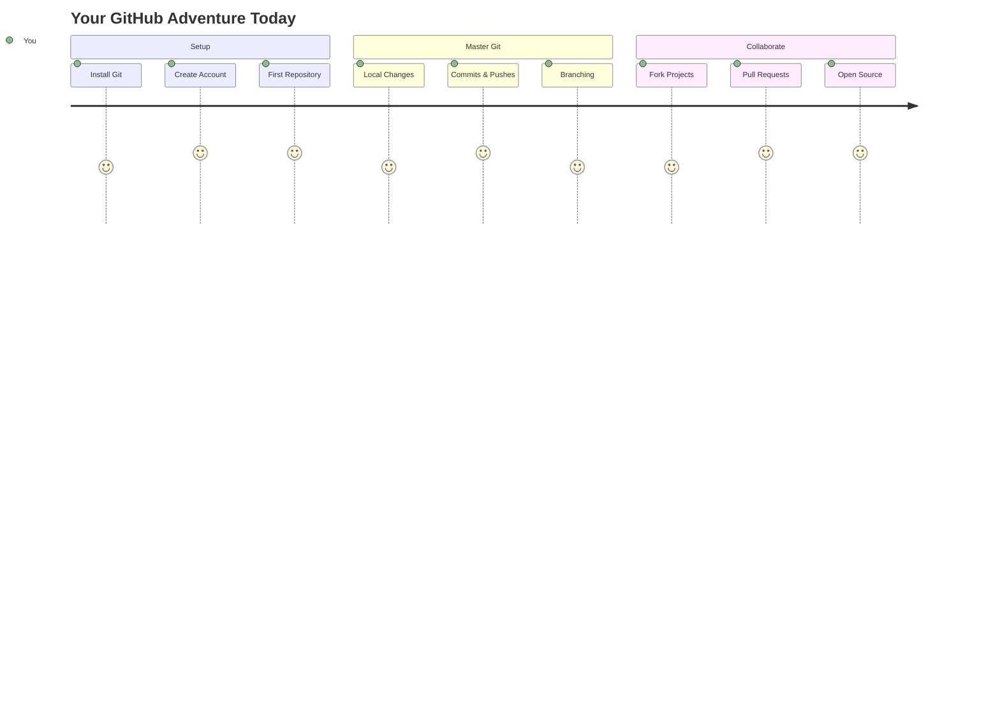
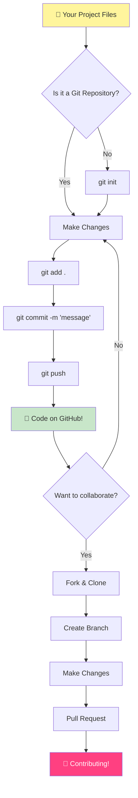
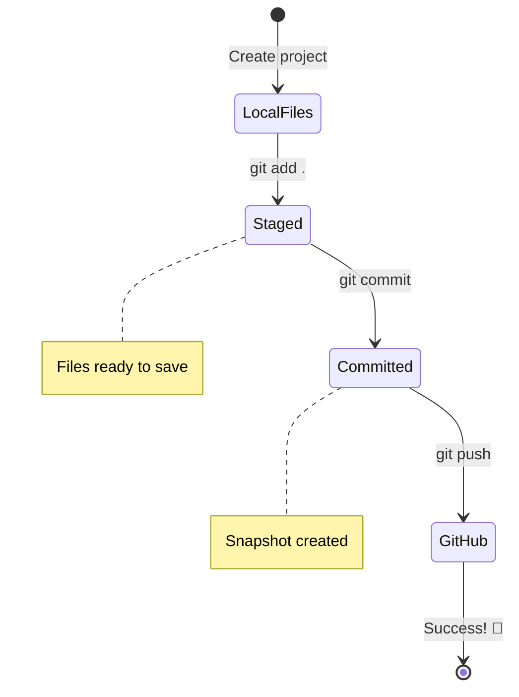
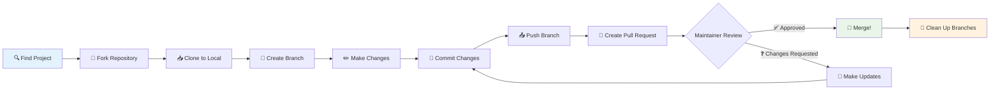
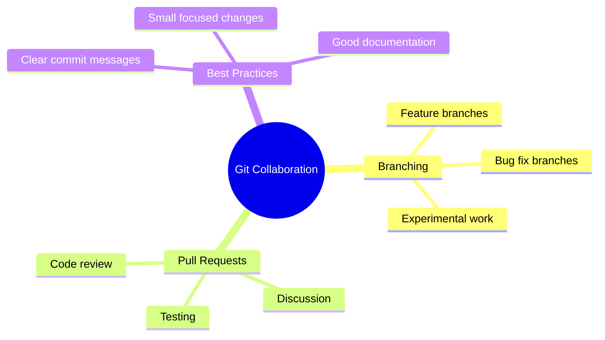
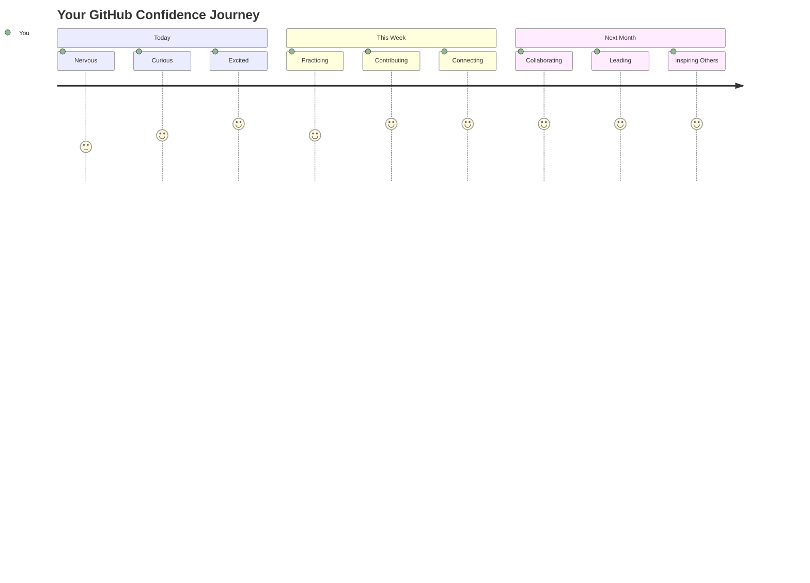

<!--
CO_OP_TRANSLATOR_METADATA:
{
  "original_hash": "0fe3ff66299b447f1c8cb34dcbf0c5ef",
  "translation_date": "2025-11-04T00:49:43+00:00",
  "source_file": "1-getting-started-lessons/2-github-basics/README.md",
  "language_code": "tr"
}
-->
# GitHub'a Giriş

Merhaba, geleceğin geliştiricisi! 👋 Dünyanın dört bir yanındaki milyonlarca kodlayıcıya katılmaya hazır mısın? Seni GitHub ile tanıştırmak için gerçekten çok heyecanlıyım – bunu programcılar için bir sosyal medya platformu gibi düşün, ama öğle yemeği fotoğraflarını paylaşmak yerine kodlarımızı paylaşıyor ve birlikte inanılmaz şeyler inşa ediyoruz!

Beni gerçekten hayrete düşüren şey şu: telefonundaki her uygulama, ziyaret ettiğin her web sitesi ve kullanmayı öğreneceğin çoğu araç, GitHub gibi platformlarda iş birliği yapan geliştirici ekipler tarafından oluşturuldu. Sevdiğin o müzik uygulaması mı? Senin gibi biri ona katkıda bulundu. Elinden bırakamadığın o oyun mu? Evet, muhtemelen GitHub iş birliğiyle yapıldı. Ve şimdi SEN bu harika topluluğun bir parçası olmayı öğreneceksin!

Bunun başlangıçta biraz karmaşık görünebileceğini biliyorum – ilk GitHub sayfama bakıp "Bu ne anlama geliyor?" diye düşündüğümü hatırlıyorum. Ama işin güzel yanı şu: her bir geliştirici tam olarak senin şu anda bulunduğun noktadan başladı. Bu dersin sonunda, kendi GitHub deposuna (bulutta kişisel proje vitrinine) sahip olacaksın ve çalışmalarını nasıl kaydedeceğini, başkalarıyla nasıl paylaşacağını ve milyonlarca insanın kullandığı projelere nasıl katkıda bulunacağını öğreneceksin.

Bu yolculuğu birlikte, adım adım gerçekleştireceğiz. Acele yok, baskı yok – sadece sen, ben ve birazdan en iyi arkadaşların olacak gerçekten harika araçlar!


> Sketchnote: [Tomomi Imura](https://twitter.com/girlie_mac)



## Ders Öncesi Test
[Ders öncesi test](https://ff-quizzes.netlify.app)

## Giriş

Heyecan verici şeylere dalmadan önce, bilgisayarını biraz GitHub büyüsü için hazırlayalım! Bunu bir şaheser yaratmadan önce sanat malzemelerini düzenlemek gibi düşün – doğru araçlara sahip olmak her şeyi çok daha kolay ve eğlenceli hale getirir.

Her bir kurulum adımını seninle birlikte tek tek geçeceğim ve ilk bakışta göründüğü kadar korkutucu olmadığını garanti ediyorum. Bir şey hemen anlam ifade etmiyorsa, bu tamamen normal! İlk geliştirme ortamımı kurduğumu ve eski hiyeroglifleri okumaya çalışıyormuş gibi hissettiğimi hatırlıyorum. Her bir geliştirici tam olarak senin şu anda bulunduğun noktada oldu, doğru yapıp yapmadığını merak etti. Spoiler: Eğer burada öğreniyorsan, zaten doğru yapıyorsun! 🌟

Bu derste şunları ele alacağız:

- bilgisayarında yaptığın çalışmaları takip etmek
- başkalarıyla projeler üzerinde çalışmak
- açık kaynak yazılıma nasıl katkıda bulunulacağı

### Ön Koşullar

Bilgisayarını biraz GitHub büyüsü için hazırlayalım! Endişelenme – bu kurulum sadece bir kez yapman gereken bir şey ve ardından tüm kodlama yolculuğun için hazır olacaksın.

Tamam, temelden başlayalım! Öncelikle Git'in bilgisayarında zaten mevcut olup olmadığını kontrol etmemiz gerekiyor. Git, kodunda yaptığın her değişikliği hatırlayan süper zeki bir asistan gibi – her iki saniyede bir Ctrl+S tuşuna basmaktan çok daha iyi (hepimiz oradaydık!).

Git'in zaten kurulu olup olmadığını görmek için terminaline şu sihirli komutu yaz:
`git --version`

Eğer Git henüz orada değilse, endişelenme! Sadece [Git'i indir](https://git-scm.com/downloads) ve al. Kurulum tamamlandıktan sonra, Git'i sana düzgün bir şekilde tanıtmamız gerekiyor:

> 💡 **İlk Kurulum**: Bu komutlar Git'e kim olduğunu söyler. Bu bilgi yaptığın her bir commit'e eklenir, bu yüzden paylaşmaktan rahat olduğun bir isim ve e-posta seç.

```bash
git config --global user.name "your-name"
git config --global user.email "your-email"
```

Git'in zaten yapılandırılmış olup olmadığını kontrol etmek için şunu yazabilirsin:
```bash
git config --list
```

Ayrıca bir GitHub hesabına, bir kod düzenleyiciye (örneğin Visual Studio Code) ve terminalini (veya: komut istemini) açman gerekecek.

[github.com](https://github.com/) adresine gidip henüz yapmadıysan bir hesap oluştur veya giriş yap ve profilini doldur.

💡 **Modern ipucu**: [SSH anahtarları](https://docs.github.com/en/authentication/connecting-to-github-with-ssh) kurmayı veya [GitHub CLI](https://cli.github.com/) kullanmayı düşün, böylece şifreler olmadan daha kolay kimlik doğrulama yapabilirsin.

✅ GitHub dünyadaki tek kod deposu değil; başka seçenekler de var, ancak GitHub en bilinenidir.

### Hazırlık

Bilgisayarında (laptop veya PC) bir kod projesi içeren bir klasöre ve başkalarının projelerine nasıl katkıda bulunulacağını göstermek için bir örnek olarak hizmet edecek bir GitHub'da halka açık bir depoya ihtiyacın olacak.

### Kodunu Güvende Tutmak

Bir an için güvenlikten bahsedelim – ama endişelenme, seni korkutacak şeylerle bunaltmayacağız! Bu güvenlik uygulamalarını arabayı veya evi kilitlemek gibi düşün. Basit alışkanlıklar haline gelir ve çalışmalarını korur.

GitHub ile çalışırken, baştan itibaren modern ve güvenli yolları göstereceğiz. Bu şekilde, kodlama kariyerin boyunca sana iyi hizmet edecek iyi alışkanlıklar geliştireceksin.

GitHub ile çalışırken güvenlik en iyi uygulamalarını takip etmek önemlidir:

| Güvenlik Alanı | En İyi Uygulama | Neden Önemlidir |
|----------------|----------------|-----------------|
| **Kimlik Doğrulama** | SSH anahtarları veya Kişisel Erişim Jetonları kullan | Şifreler daha az güvenlidir ve aşamalı olarak kaldırılıyor |
| **İki Faktörlü Kimlik Doğrulama** | GitHub hesabında 2FA'yı etkinleştir | Hesap korumasına ekstra bir katman ekler |
| **Depo Güvenliği** | Hassas bilgileri asla commit etme | API anahtarları ve şifreler asla halka açık depolarda olmamalıdır |
| **Bağımlılık Yönetimi** | Güncellemeler için Dependabot'u etkinleştir | Bağımlılıklarını güvenli ve güncel tutar |

> ⚠️ **Kritik Güvenlik Hatırlatması**: API anahtarlarını, şifreleri veya diğer hassas bilgileri hiçbir depoya commit etme. Hassas verileri korumak için ortam değişkenlerini ve `.gitignore` dosyalarını kullan.

**Modern Kimlik Doğrulama Ayarı:**

```bash
# Generate SSH key (modern ed25519 algorithm)
ssh-keygen -t ed25519 -C "your_email@example.com"

# Set up Git to use SSH
git remote set-url origin git@github.com:username/repository.git
```

> 💡 **Profesyonel İpucu**: SSH anahtarları, şifreleri tekrar tekrar girme ihtiyacını ortadan kaldırır ve geleneksel kimlik doğrulama yöntemlerinden daha güvenlidir.

---

## Kodunu Profesyonel Gibi Yönetmek

Tamam, İŞTE işler gerçekten heyecan verici hale geliyor! 🎉 Kodunu profesyoneller gibi nasıl takip edip yöneteceğini öğrenmek üzereyiz ve dürüst olmak gerekirse, öğretmeyi en sevdiğim şeylerden biri bu çünkü gerçekten oyunun kurallarını değiştiriyor.

Şöyle düşün: harika bir hikaye yazıyorsun ve her taslağı, her parlak düzenlemeyi ve her "bekle, bu dahice!" anını takip etmek istiyorsun. Git tam olarak bunu kodun için yapar! Her şeyi hatırlayan inanılmaz bir zaman yolculuğu not defteri gibi – her tuş vuruşu, her değişiklik, her "aman, her şeyi bozdu" anı ki bunu anında geri alabilirsin.

Dürüst olacağım – bu başlangıçta biraz bunaltıcı gelebilir. Başladığımda "Neden dosyalarımı normal şekilde kaydedemiyorum ki?" diye düşünmüştüm. Ama bana güven: Git senin için anlam kazandığında (ve kazanacak!), "Bunu nasıl yapmadan kod yazdım?" diye düşüneceğin o ampul anlarından birini yaşayacaksın. Bu, her zaman yürüyerek gittiğin bir dünyada uçabileceğini keşfetmek gibi!

Diyelim ki yerel olarak bir kod projesi içeren bir klasörün var ve ilerlemeni git – versiyon kontrol sistemi – kullanarak takip etmek istiyorsun. Bazı insanlar git kullanmayı gelecekteki kendine aşk mektubu yazmakla karşılaştırır. Commit mesajlarını günler, haftalar veya aylar sonra okuduğunda neden bir karar verdiğini hatırlayabilir veya bir değişikliği "geri alabilirsin" – yani, iyi "commit mesajları" yazdığında.



### Görev: İlk Deponu Oluştur!

> 🎯 **Görev (ve senin için çok heyecanlıyım!)**: İlk GitHub deponu birlikte oluşturacağız! Burada işimiz bittiğinde, kodunun yaşadığı internetin kendi küçük köşesine sahip olacaksın ve ilk "commit"ini yapmış olacaksın (bu, geliştirici dilinde çalışmalarını gerçekten akıllı bir şekilde kaydetmek anlamına gelir).
>
> Bu gerçekten özel bir an – küresel geliştiriciler topluluğuna resmi olarak katılmak üzeresin! İlk depomu oluşturmanın heyecanını ve "Vay, gerçekten bunu yapıyorum!" diye düşünmeyi hâlâ hatırlıyorum.

Bu macerayı birlikte, adım adım inceleyelim. Her bir bölümü sindirerek ilerle – acele etmenin bir ödülü yok ve her bir adımın anlamlı olacağına söz veriyorum. Unutma, hayranlık duyduğun her kodlama yıldızı bir zamanlar tam olarak senin şu anda bulunduğun yerdeydi, ilk deposunu oluşturmak üzereydi. Bu ne kadar havalı, değil mi?

> Videoyu izle
> 
> [](https://www.youtube.com/watch?v=9R31OUPpxU4)

**Bunu Birlikte Yapalım:**

1. **GitHub'da deponu oluştur**. GitHub.com'a git ve o parlak yeşil **Yeni** düğmesini (veya sağ üst köşedeki **+** işaretini) ara. Tıklayıp **Yeni depo** seçeneğini seç.

   İşte yapman gerekenler:
   1. Depoya bir isim ver – senin için anlamlı bir şey olsun!
   1. İstersen bir açıklama ekle (bu, başkalarının projenin ne hakkında olduğunu anlamasına yardımcı olur)
   1. Herkesin görebileceği bir depo (halka açık) mı yoksa sadece senin için (özel) mi istediğine karar ver
   1. README dosyası ekleme kutusunu işaretlemeni öneririm – bu, projenin ön sayfası gibidir
   1. **Depo oluştur** düğmesine tıkla ve kutla – ilk deponu oluşturdun! 🎉

2. **Proje klasörüne git**. Şimdi terminalini açalım (endişelenme, göründüğü kadar korkutucu değil!). Bilgisayarımıza proje dosyalarının nerede olduğunu söylememiz gerekiyor. Şu komutu yaz:

   ```bash
   cd [name of your folder]
   ```

   **Burada ne yapıyoruz:**
   - Temelde "Hey bilgisayar, beni proje klasörüme götür" diyoruz
   - Bu, masaüstünde belirli bir klasörü açmak gibi, ama bunu metin komutlarıyla yapıyoruz
   - `[klasörünün adı]` kısmını proje klasörünün gerçek adıyla değiştir

3. **Klasörünü bir Git deposuna dönüştür**. İşte sihir burada başlıyor! Şunu yaz:

   ```bash
   git init
   ```

   **İşte olanlar (oldukça havalı şeyler!):**
   - Git, projenizde gizli bir `.git` klasörü oluşturdu – bunu göremeyeceksiniz ama orada!
   - Normal klasörünüz artık yaptığınız her değişikliği takip edebilen bir "depo" oldu
   - Bunu, klasörünüze her şeyi hatırlama süper gücü vermek gibi düşünün

4. **Neler olduğunu kontrol et**. Şimdi Git'in projeniz hakkında ne düşündüğünü görelim:

   ```bash
   git status
   ```

   **Git'in size söylediklerini anlamak:**
   
   Şuna benzer bir şey görebilirsiniz:

   ```output
   Changes not staged for commit:
   (use "git add <file>..." to update what will be committed)
   (use "git restore <file>..." to discard changes in working directory)

        modified:   file.txt
        modified:   file2.txt
   ```

   **Panik yapmayın! İşte bunun anlamı:**
   - **Kırmızı** renkli dosyalar, değişiklikleri olan ancak henüz kaydetmeye hazır olmayan dosyalardır
   - **Yeşil** renkli dosyalar (gördüğünüzde) kaydetmeye hazırdır
   - Git, bir sonraki adımda tam olarak ne yapabileceğinizi söyleyerek yardımcı oluyor

   > 💡 **Profesyonel ipucu**: `git status` komutu en iyi arkadaşınız! Ne olup bittiği konusunda kafanız karıştığında kullanın. Git'e "Hey, şu anda durum nedir?" diye sormak gibi.

5. **Dosyalarınızı kaydetmeye hazır hale getirin** (bu "sahneleme" olarak adlandırılır):

   ```bash
   git add .
   ```

   **Az önce yaptığımız şey:**
   - Git'e "Hey, bir sonraki kayıtta TÜM dosyalarımı dahil etmek istiyorum" dedik
   - `.` bu klasördeki "her şey" demek gibi
   - Şimdi dosyalarınız "sahnelendi" ve bir sonraki adım için hazır

   **Daha seçici olmak ister misiniz?** Sadece belirli dosyaları ekleyebilirsiniz:

   ```bash
   git add [file or folder name]
   ```

   **Bunu neden yapmak isteyebilirsiniz?**
   - Bazen ilgili değişiklikleri birlikte kaydetmek istersiniz
   - Çalışmanızı mantıksal parçalara ayırmanıza yardımcı olur
   - Ne zaman ve neyin değiştiğini anlamayı kolaylaştırır

   **Fikriniz mi değişti?** Endişelenmeyin! Dosyaları şu şekilde sahne dışı bırakabilirsiniz:

   ```bash
   # Unstage everything
   git reset
   
   # Unstage just one file
   git reset [file name]
   ```

   Endişelenmeyin – bu, çalışmanızı silmez, sadece dosyaları "kaydetmeye hazır" yığından çıkarır.

6. **Çalışmanızı kalıcı olarak kaydedin** (ilk commit'inizi yapın!):

   ```bash
   git commit -m "first commit"
   ```

   **🎉 Tebrikler! İlk commit'inizi yaptınız!**
   
   **Az önce olan şey:**
   - Git, bu tam anda sahnelenmiş tüm dosyaların bir "anlık görüntüsünü" aldı
   - "ilk commit" mesajınız bu kayıt noktasının ne hakkında olduğunu açıklıyor
   - Git bu anlık görüntüye her zaman bulabileceğiniz benzersiz bir kimlik verdi
   - Projenizin geçmişini takip etmeye resmi olarak başladınız!

   > 💡 **Gelecekteki commit mesajları**: Bir sonraki commit'leriniz için daha açıklayıcı olun! "şeyleri güncelledim" yerine "Ana sayfaya iletişim formu ekle" veya "Gezinme menüsü hatasını düzelt" gibi bir şey deneyin. Gelecekteki kendinize teşekkür edeceksiniz!

7. **Yerel projenizi GitHub'a bağlayın**. Şu anda projeniz yalnızca bilgisayarınızda var. Onu GitHub deponuza bağlayalım, böylece dünyayla paylaşabilirsiniz!

   Öncelikle, GitHub depo sayfanıza gidin ve URL'yi kopyalayın. Sonra buraya geri dönüp şunu yazın:

   ```bash
   git remote add origin https://github.com/username/repository_name.git
   ```
   
   (Bu URL'yi gerçek depo URL'nizle değiştirin!)
**Ne Yaptık:**
- Yerel projeniz ile GitHub deposu arasında bir bağlantı oluşturduk
- "Origin" sadece GitHub deponuz için bir takma ad – tıpkı telefonunuza bir kişi eklemek gibi
- Artık yerel Git'iniz, kodunuzu paylaşmaya hazır olduğunuzda nereye göndereceğini biliyor

💡 **Daha Kolay Yol**: GitHub CLI yüklüyse, bunu tek bir komutla yapabilirsiniz:
   ```bash
   gh repo create my-repo --public --push --source=.
   ```

8. **Kodunuzu GitHub'a Gönderin** (Büyük an!):

   ```bash
   git push -u origin main
   ```

**🚀 İşte bu! Kodunuzu GitHub'a yüklüyorsunuz!**

**Neler Oluyor:**
- Commit'leriniz bilgisayarınızdan GitHub'a doğru yol alıyor
- `-u` bayrağı, gelecekteki yüklemeleri kolaylaştırmak için kalıcı bir bağlantı kurar
- "main", birincil dalınızın adıdır (ana klasör gibi)
- Bundan sonra, gelecekteki yüklemeler için sadece `git push` yazabilirsiniz!

💡 **Hızlı Not**: Eğer dalınızın adı farklıysa (örneğin "master"), o ismi kullanın. `git branch --show-current` komutuyla kontrol edebilirsiniz.

9. **Yeni Günlük Kodlama Ritminiz** (Bağımlılık yapacak!):

Bundan sonra, projenizde değişiklik yaptığınızda, bu basit üç adımlı dansı yapacaksınız:

   ```bash
   git add .
   git commit -m "describe what you changed"
   git push
   ```

**Bu sizin kodlama ritminiz olacak:**
- Kodunuzda harika değişiklikler yapın ✨
- `git add` ile sahneye alın ("Hey Git, bu değişikliklere dikkat et!")
- `git commit` ve açıklayıcı bir mesajla kaydedin (gelecekteki siz size teşekkür edecek!)
- Kodunuzu dünyayla paylaşmak için `git push` kullanın 🚀
- Tekrar edin – cidden, bu nefes almak kadar doğal hale gelecek!

Bu iş akışını seviyorum çünkü bir video oyununda birden fazla kayıt noktası olması gibi. Sevdiğiniz bir değişiklik mi yaptınız? Commit yapın! Riskli bir şey denemek mi istiyorsunuz? Sorun değil – işler ters giderse her zaman son commit'inize geri dönebilirsiniz!

> 💡 **İpucu**: `.gitignore` dosyasını benimsemek isteyebilirsiniz. Bu dosya, GitHub'da takip etmek istemediğiniz dosyaların görünmesini engeller – örneğin, aynı klasörde sakladığınız ancak herkese açık bir depoda yeri olmayan not dosyası gibi. `.gitignore` dosyaları için şablonları [.gitignore templates](https://github.com/github/gitignore) adresinde bulabilir veya [gitignore.io](https://www.toptal.com/developers/gitignore) kullanarak bir tane oluşturabilirsiniz.

### 🧠 **İlk Depo Kontrolü: Nasıl Hissettiniz?**

**Bir an durup kutlayın ve düşünün:**
- Kodunuzun ilk kez GitHub'da göründüğünü görmek nasıl bir histi?
- Hangi adım en kafa karıştırıcıydı ve hangisi şaşırtıcı derecede kolaydı?
- `git add`, `git commit` ve `git push` arasındaki farkı kendi kelimelerinizle açıklayabilir misiniz?



> **Unutmayın**: Deneyimli geliştiriciler bile bazen tam komutları unutabilir. Bu iş akışını alışkanlık haline getirmek pratik gerektirir – harika gidiyorsunuz!

#### Modern Git İş Akışları

Bu modern uygulamaları benimsemeyi düşünün:

- **Conventional Commits**: `feat:`, `fix:`, `docs:` gibi standart bir commit mesaj formatı kullanın. Daha fazla bilgi için [conventionalcommits.org](https://www.conventionalcommits.org/) adresini ziyaret edin.
- **Atomik Commit'ler**: Her bir commit'in tek bir mantıksal değişikliği temsil etmesini sağlayın.
- **Sık Commit'ler**: Büyük ve seyrek commit'ler yerine, sık sık açıklayıcı mesajlarla commit yapın.

#### Commit Mesajları

Harika bir Git commit başlık satırı şu cümleyi tamamlar:
Eğer uygulanırsa, bu commit <buraya başlık satırınızı yazın> yapacaktır.

Başlıkta emir kipini ve geniş zaman kullanın: "değiştir" değil "değiştirildi" veya "değişiklikler". 
Başlıkta olduğu gibi, gövdede (isteğe bağlı) de emir kipini ve geniş zaman kullanın. Gövde, değişikliğin nedenini ve önceki davranışla olan farkını içermelidir. Burada `nasıl` değil, `neden` açıklıyorsunuz.

✅ GitHub'da biraz dolaşmak için birkaç dakika ayırın. Gerçekten harika bir commit mesajı bulabilir misiniz? Peki ya çok basit bir tane? Sizce bir commit mesajında iletilmesi gereken en önemli ve faydalı bilgi nedir?

## Diğerleriyle Çalışmak (Eğlenceli Kısım!)

Şapkanızı sıkıca tutun çünkü GİT ve GitHub burada tam anlamıyla büyüleyici hale geliyor! 🪄 Kendi kodunuzu yönetmeyi öğrendiniz, ama şimdi en sevdiğim kısma dalıyoruz – dünyanın dört bir yanından harika insanlarla iş birliği yapmaya.

Şunu hayal edin: Yarın uyanıyorsunuz ve Tokyo'dan biri kodunuzu geliştiriyor. Sonra Berlin'den biri takıldığınız bir hatayı düzeltiyor. Öğleden sonra, São Paulo'dan bir geliştirici, hiç düşünmediğiniz bir özellik ekliyor. Bu bilim kurgu değil – bu sadece GitHub evreninde sıradan bir salı günü!

Beni gerçekten heyecanlandıran şey, öğrenmek üzere olduğunuz iş birliği becerileri mi? Google, Microsoft ve en sevdiğiniz girişimlerdeki ekiplerin her gün kullandığı TAM olarak aynı iş akışları. Sadece havalı bir araç öğrenmiyorsunuz – tüm yazılım dünyasının birlikte çalışmasını sağlayan gizli dili öğreniyorsunuz.

Cidden, birinin ilk pull request'inizi birleştirdiği anın heyecanını yaşadığınızda, geliştiricilerin açık kaynak konusunda neden bu kadar tutkulu olduğunu anlayacaksınız. Bu, dünyanın en büyük, en yaratıcı ekip projesinin bir parçası olmak gibi bir şey!

> Video'yu İzle
>
> [](https://www.youtube.com/watch?v=bFCM-PC3cu8)

GitHub'a bir şeyler koymanın ana nedeni, diğer geliştiricilerle iş birliği yapmayı mümkün kılmaktı.



Depo sayfanızda `Insights > Community` sekmesine giderek projenizin önerilen topluluk standartlarına nasıl uyduğunu görebilirsiniz.

Depo sayfanızın profesyonel ve davetkar görünmesini mi istiyorsunuz? Depo sayfanıza gidin ve `Insights > Community` sekmesine tıklayın. Bu harika özellik, projenizin GitHub topluluğunun "iyi depo uygulamaları" olarak kabul ettiği şeylere nasıl uyduğunu gösterir.

> 🎯 **Projenizi Parlatın**: İyi organize edilmiş bir depo ve iyi belgeler, temiz ve davetkar bir mağaza vitrini gibi. İnsanlara işinize önem verdiğinizi gösterir ve başkalarının katkıda bulunmasını sağlar!

**Bir Depoyu Harika Yapan Şeyler:**

| Eklenmesi Gereken | Neden Önemli | Size Ne Sağlar |
|-------------------|--------------|----------------|
| **Açıklama** | İlk izlenim önemlidir! | İnsanlar projenizin ne yaptığını hemen anlar |
| **README** | Projenizin ön sayfası | Yeni ziyaretçiler için dostça bir rehber gibi |
| **Katkı Yönergeleri** | Yardımı memnuniyetle karşıladığınızı gösterir | İnsanlar size nasıl yardımcı olabileceklerini tam olarak bilir |
| **Davranış Kuralları** | Dostça bir ortam yaratır | Herkesin katılımını hoş karşılar |
| **Lisans** | Hukuki netlik sağlar | Başkaları kodunuzu nasıl kullanabileceklerini bilir |
| **Güvenlik Politikası** | Sorumlu olduğunuzu gösterir | Profesyonel uygulamaları sergiler |

> 💡 **Profesyonel İpucu**: GitHub, bu dosyaların tümü için şablonlar sağlar. Yeni bir depo oluştururken, bu dosyaları otomatik olarak oluşturmak için kutuları işaretleyin.

**Keşfedilecek Modern GitHub Özellikleri:**

🤖 **Otomasyon & CI/CD:**
- **GitHub Actions** ile otomatik test ve dağıtım
- **Dependabot** ile otomatik bağımlılık güncellemeleri

💬 **Topluluk & Proje Yönetimi:**
- **GitHub Discussions** ile sorunların ötesinde topluluk sohbetleri
- **GitHub Projects** ile kanban tarzı proje yönetimi
- **Dal koruma kuralları** ile kod kalitesi standartlarını sağlama

Tüm bu kaynaklar, yeni ekip üyelerinin işe alım sürecine fayda sağlayacaktır. Ve bunlar genellikle yeni katkıda bulunanların kodunuza bakmadan önce projenizin zamanlarını harcamaya değer olup olmadığını anlamak için baktıkları şeylerdir.

✅ README dosyaları, hazırlanması zaman alsa da, genellikle meşgul bakımcılar tarafından ihmal edilir. Özellikle açıklayıcı bir örnek bulabilir misiniz? Not: [README dosyaları oluşturmanıza yardımcı olacak bazı araçlar](https://www.makeareadme.com/) var, bunları denemek isteyebilirsiniz.

### Görev: Kod Birleştirme

Katkı belgeleri, insanların projeye katkıda bulunmasına yardımcı olur. Hangi tür katkıları aradığınızı ve sürecin nasıl işlediğini açıklar. Katkıda bulunanların GitHub'daki deponuza katkıda bulunabilmeleri için bir dizi adımı takip etmeleri gerekecek:

1. **Depoyu Fork Etmek**. İnsanların projenizi _fork_ etmelerini isteyebilirsiniz. Fork etmek, GitHub profillerinde deponuzun bir kopyasını oluşturmak anlamına gelir.
1. **Clone**. Buradan projeyi yerel makinelerine _clone_ yapacaklar.
1. **Bir Dal Oluşturun**. Çalışmaları için bir _dal_ oluşturmalarını isteyeceksiniz.
1. **Değişikliklerini bir alana odaklayın**. Katkıda bulunanlardan katkılarını bir seferde bir şeye odaklamalarını isteyin – böylece çalışmalarını _birleştirme_ şansınız daha yüksek olur. Diyelim ki bir hata düzeltmesi yazıyorlar, yeni bir özellik ekliyorlar ve birkaç testi güncelliyorlar – ya 3'ünden sadece 2'sini veya 1'ini uygulamak istiyorsanız ne olur?

✅ Dalların iyi kod yazma ve gönderme konusunda özellikle kritik olduğu bir durumu hayal edin. Hangi kullanım durumlarını düşünebilirsiniz?

> Not, dünyada görmek istediğiniz değişim olun ve kendi çalışmalarınız için de dallar oluşturun. Yaptığınız tüm commit'ler, şu anda "checkout" yaptığınız dalda yapılacaktır. Hangi dalda olduğunuzu görmek için `git status` kullanın.

Bir katkıda bulunan iş akışını inceleyelim. Katkıda bulunanın zaten depoyu _fork_ ettiğini ve _clone_ yaptığını varsayalım, böylece yerel makinelerinde çalışmaya hazır bir Git deposuna sahipler:

1. **Bir Dal Oluşturun**. Katkıda bulunmayı düşündükleri değişiklikleri içerecek bir dal oluşturmak için `git branch` komutunu kullanın:

   ```bash
   git branch [branch-name]
   ```

   > 💡 **Modern Yaklaşım**: Yeni bir dal oluşturup aynı anda ona geçiş yapabilirsiniz:
   ```bash
   git switch -c [branch-name]
   ```

1. **Çalışma Dalına Geçin**. Belirtilen dala geçin ve çalışma dizinini `git switch` ile güncelleyin:

   ```bash
   git switch [branch-name]
   ```

   > 💡 **Modern Not**: `git switch`, dallar arasında geçiş yaparken `git checkout` yerine kullanılan modern bir alternatiftir. Daha net ve yeni başlayanlar için daha güvenlidir.

1. **Çalışma Yapın**. Bu noktada değişikliklerinizi eklemek istiyorsunuz. Git'e bunu aşağıdaki komutlarla bildirmeyi unutmayın:

   ```bash
   git add .
   git commit -m "my changes"
   ```

   > ⚠️ **Commit Mesajı Kalitesi**: Commit'inize hem kendi adınıza hem de yardım ettiğiniz depo bakımcısı adına iyi bir isim verdiğinizden emin olun. Yaptığınız değişiklikler hakkında spesifik olun!

1. **Çalışmanızı `main` dalıyla birleştirin**. Bir noktada çalışmanızı tamamladınız ve bunu `main` dalının çalışmasıyla birleştirmek istiyorsunuz. Bu arada `main` dalı değişmiş olabilir, bu yüzden önce aşağıdaki komutlarla en son haline güncellediğinizden emin olun:

   ```bash
   git switch main
   git pull
   ```

   Bu noktada, herhangi bir _çakışma_, yani Git'in değişiklikleri kolayca _birleştiremediği_ durumların çalışma dalınızda gerçekleştiğinden emin olmak istersiniz. Bu nedenle aşağıdaki komutları çalıştırın:

   ```bash
   git switch [branch_name]
   git merge main
   ```

   `git merge main` komutu, `main` dalından tüm değişiklikleri dalınıza getirir. Umarız sorunsuz bir şekilde devam edebilirsiniz. Eğer olmazsa, VS Code size Git'in _kafasının karıştığı_ yerleri gösterecek ve etkilenen dosyaları değiştirerek en doğru içeriği belirteceksiniz.

   💡 **Modern Alternatif**: Daha temiz bir geçmiş için `git rebase` kullanmayı düşünün:
   ```bash
   git rebase main
   ```
   Bu, commit'lerinizi en son main dalının üzerine yeniden oynatarak doğrusal bir geçmiş oluşturur.

1. **Çalışmanızı GitHub'a Gönderin**. Çalışmanızı GitHub'a göndermek iki şey anlamına gelir. Dalınızı deponuza itmek ve ardından bir PR, Pull Request açmak.

   ```bash
   git push --set-upstream origin [branch-name]
   ```

   Yukarıdaki komut, dalı fork edilmiş deponuzda oluşturur.

### 🤝 **İş Birliği Becerileri Kontrolü: Başkalarıyla Çalışmaya Hazır mısınız?**

**İş birliği hakkında nasıl hissediyorsunuz:**
- Fork ve pull request kavramı artık size mantıklı geliyor mu?
- Dallarla çalışmak hakkında daha fazla pratik yapmak istediğiniz bir şey nedir?
- Başkasının projesine katkıda bulunma konusunda ne kadar rahat hissediyorsunuz?



> **Güven Artırıcı**: Hayran olduğunuz her bir geliştirici, bir zamanlar ilk pull request'leri konusunda gergindi. GitHub topluluğu yeni başlayanlara karşı son derece misafirperverdir!

1. **Bir PR Açın**. Son olarak, bir PR açmak istiyorsunuz. Bunu yapmak için GitHub'daki fork edilmiş depoya gidin. GitHub'da yeni bir PR oluşturmak isteyip istemediğinizi soran bir gösterge göreceksiniz, buna tıklayın ve commit mesajı başlığını değiştirebileceğiniz, daha uygun bir açıklama ekleyebileceğiniz bir arayüze yönlendirilirsiniz. Şimdi fork ettiğiniz deponun bakımcısı bu PR'yi görecek ve _parmaklar çapraz_ umarız takdir eder ve PR'nizi _birleştirir_. Artık bir katkıda bulunan oldunuz, yaşasın :)

   💡 **Modern İpucu**: PR'leri GitHub CLI kullanarak da oluşturabilirsiniz:
   ```bash
   gh pr create --title "Your PR title" --body "Description of changes"
   ```

   🔧 **PR'ler için En İyi Uygulamalar**:
   - "Fixes #123" gibi anahtar kelimeler kullanarak ilgili sorunlara bağlantı verin
   - UI değişiklikleri için ekran görüntüleri ekleyin
   - Belirli inceleyiciler isteyin
   - Devam eden işler için taslak PR'ler kullanın
   - İnceleme talep etmeden önce tüm CI kontrollerinin geçtiğinden emin olun
1. **Temizlik yap**. Bir PR'yi başarıyla birleştirdikten sonra _temizlik yapmak_ iyi bir uygulama olarak kabul edilir. Hem yerel dalınızı hem de GitHub'a gönderdiğiniz dalı temizlemek istersiniz. Öncelikle aşağıdaki komutla yerel olarak silelim:

   ```bash
   git branch -d [branch-name]
   ```

   Ardından, GitHub'daki çatallanmış depo sayfasına gidin ve az önce gönderdiğiniz uzak dalı kaldırın.

`Pull request` (Çekme isteği) biraz garip bir terim gibi görünüyor çünkü aslında değişikliklerinizi projeye göndermek istiyorsunuz. Ancak, proje sahibi (maintainer) veya çekirdek ekip, değişikliklerinizi projenin "ana" dalıyla birleştirmeden önce değerlendirmelidir, bu yüzden aslında bir maintainer'dan değişiklik kararı talep ediyorsunuz.

Bir çekme isteği, bir dalda yapılan değişiklikleri incelemek ve tartışmak için yorumlar, entegre testler ve daha fazlasıyla bir yerdir. İyi bir çekme isteği, kabaca bir commit mesajıyla aynı kuralları takip eder. Örneğin, çalışmanız bir sorunu çözüyor ise, sorun izleyicideki bir soruya referans ekleyebilirsiniz. Bu, `#` ve ardından sorun numarası kullanılarak yapılır. Örneğin `#97`.

🤞Parmaklarınızı çaprazlayın ki tüm kontroller geçsin ve proje sahibi(leri) değişikliklerinizi projeye birleştirsin🤞

GitHub'daki ilgili uzak dalda yapılan tüm yeni commit'lerle mevcut yerel çalışma dalınızı güncelleyin:

`git pull`

## Açık Kaynağa Katkıda Bulunmak (Etkili Olma Şansınız!)

Hazır mısınız? Sizi tamamen şaşırtacak bir şeyden bahsedelim 🤯 Açık kaynak projelere katkıda bulunmaktan bahsediyoruz – ve bunu sizinle paylaşmayı düşündükçe tüylerim diken diken oluyor!

Bu, gerçekten olağanüstü bir şeyin parçası olma şansınız. Milyonlarca geliştiricinin her gün kullandığı araçları geliştirdiğinizi veya arkadaşlarınızın sevdiği bir uygulamadaki bir hatayı düzelttiğinizi hayal edin. Bu sadece bir hayal değil – açık kaynak katkısının tam olarak ne olduğu bu!

Her düşündüğümde beni heyecanlandıran şey şu: Öğrendiğiniz her bir araç – kod editörünüz, keşfedeceğimiz framework'ler, hatta şu anda bu yazıyı okuduğunuz tarayıcı – bir zamanlar sizin gibi biri tarafından yapılan ilk katkıyla başladı. En sevdiğiniz VS Code uzantısını geliştiren o parlak geliştirici? Bir zamanlar titreyen ellerle "pull request oluştur" düğmesine tıklayan bir acemiydi, tıpkı sizin yapacağınız gibi.

Ve işte en güzel kısmı: açık kaynak topluluğu internetin en büyük grup kucaklaması gibi. Çoğu proje yeni başlayanları aktif olarak arar ve "good first issue" (iyi ilk sorun) etiketiyle işaretlenmiş sorunlara sahiptir, özellikle sizin gibi insanlar için! Proje sahipleri yeni katkıda bulunanları gördüklerinde gerçekten heyecanlanır çünkü kendi ilk adımlarını hatırlarlar.

```mermaid
flowchart TD
    A[🔍 Explore GitHub] --> B[🏷️ Find "good first issue"]
    B --> C[📖 Read Contributing Guidelines]
    C --> D[🍴 Fork Repository]
    D --> E[💻 Set Up Local Environment]
    E --> F[🌿 Create Feature Branch]
    F --> G[✨ Make Your Contribution]
    G --> H[🧪 Test Your Changes]
    H --> I[📝 Write Clear Commit]
    I --> J[📤 Push & Create PR]
    J --> K[💬 Engage with Feedback]
    K --> L[🎉 Merged! You're a Contributor!]
    L --> M[🌟 Find Next Issue]
    
    style A fill:#e1f5fe
    style L fill:#c8e6c9
    style M fill:#fff59d
```

Burada sadece kod yazmayı öğrenmiyorsunuz – dijital dünyayı biraz daha iyi hale getirmek için her gün uyanan küresel bir yapıcılar ailesine katılmaya hazırlanıyorsunuz! Kulübe hoş geldiniz! 🌟

Öncelikle, GitHub'da ilginizi çeken ve bir değişiklik yapmak istediğiniz bir depo (veya **repo**) bulalım. İçeriğini makinenize kopyalamak isteyeceksiniz.

✅ 'Yeni başlayanlar için uygun' depoları bulmanın iyi bir yolu [‘good-first-issue’ etiketiyle arama yapmak](https://github.blog/2020-01-22-browse-good-first-issues-to-start-contributing-to-open-source/)dır.


Kodları kopyalamanın birkaç yolu vardır. Bir yol, HTTPS, SSH veya GitHub CLI (Komut Satırı Arayüzü) kullanarak depoyu "klonlamak"tır.

Terminalinizi açın ve depoyu şu şekilde klonlayın:
```bash
# Using HTTPS
git clone https://github.com/ProjectURL

# Using SSH (requires SSH key setup)
git clone git@github.com:username/repository.git

# Using GitHub CLI
gh repo clone username/repository
```

Projede çalışmak için doğru klasöre geçin:
`cd ProjectURL`

Ayrıca tüm projeyi şu araçlarla açabilirsiniz:
- **[GitHub Codespaces](https://github.com/features/codespaces)** - Tarayıcıda VS Code ile GitHub'ın bulut geliştirme ortamı
- **[GitHub Desktop](https://desktop.github.com/)** - Git işlemleri için bir GUI uygulaması  
- **[GitHub.dev](https://github.dev)** - Herhangi bir GitHub deposunda `.` tuşuna basarak tarayıcıda VS Code'u açın
- **VS Code** ve GitHub Pull Requests uzantısı

Son olarak, kodu sıkıştırılmış bir klasör olarak indirebilirsiniz.

### GitHub Hakkında Birkaç İlginç Bilgi

GitHub'daki herhangi bir genel depoyu yıldızlayabilir, izleyebilir ve/veya "fork" yapabilirsiniz. Yıldızladığınız depoları sağ üst açılır menüde bulabilirsiniz. Bu, kod için bir tür yer imi gibidir.

Projelerin genellikle GitHub'da "Issues" sekmesinde (aksi belirtilmedikçe) bir sorun izleyicisi vardır, burada insanlar projeyle ilgili sorunları tartışır. Ve Pull Requests sekmesi, üzerinde çalışılan değişikliklerin tartışıldığı ve gözden geçirildiği yerdir.

Projeler ayrıca forumlarda, e-posta listelerinde veya Slack, Discord veya IRC gibi sohbet kanallarında tartışmalara sahip olabilir.

🔧 **Modern GitHub özellikleri**:
- **GitHub Discussions** - Topluluk sohbetleri için yerleşik forum
- **GitHub Sponsors** - Proje sahiplerini finansal olarak destekleyin  
- **Security tab** - Güvenlik açıkları raporları ve güvenlik tavsiyeleri
- **Actions tab** - Otomatik iş akışlarını ve CI/CD süreçlerini görün
- **Insights tab** - Katkıda bulunanlar, commit'ler ve proje sağlığı hakkında analizler
- **Projects tab** - GitHub'ın yerleşik proje yönetim araçları

✅ Yeni GitHub deponuzda etrafınıza bakın ve ayarları düzenlemek, deponuza bilgi eklemek, bir proje oluşturmak (örneğin bir Kanban tahtası gibi) ve otomasyon için GitHub Actions'ı ayarlamak gibi birkaç şey deneyin. Yapabileceğiniz çok şey var!

---

## 🚀 Meydan Okuma 

Tamam, yeni GitHub süper güçlerinizi test etme zamanı! 🚀 İşte her şeyi en tatmin edici şekilde anlamanızı sağlayacak bir meydan okuma:

Bir arkadaşınızı (veya sürekli "bu bilgisayar işleriyle ne yapıyorsun?" diye soran bir aile üyenizi) alın ve birlikte bir kodlama macerasına çıkın! İşte gerçek sihir burada başlıyor – bir proje oluşturun, onların çatallamasına izin verin, birkaç dal oluşturun ve profesyonel gibi değişiklikleri birleştirin.

Dürüst olacağım – muhtemelen bir noktada güleceksiniz (özellikle ikiniz aynı satırı değiştirmeye çalıştığınızda), belki kafanız karışacak, ama kesinlikle tüm öğrenmeyi değerli kılan o harika "aha!" anlarını yaşayacaksınız. Ayrıca, bir başkasıyla ilk başarılı birleştirmeyi paylaşmanın özel bir yanı var – ne kadar ilerlediğinizi kutlayan küçük bir kutlama gibi!

Henüz bir kodlama arkadaşınız yok mu? Hiç sorun değil! GitHub topluluğu, yeni olmanın nasıl bir şey olduğunu hatırlayan inanılmaz derecede misafirperver insanlarla dolu. "good first issue" etiketli depoları arayın – bunlar temelde "Hey yeni başlayanlar, bizimle öğrenin!" diyor. Ne kadar harika, değil mi?

## Ders Sonrası Quiz
[Ders sonrası quiz](https://ff-quizzes.netlify.app/web/en/)

## Gözden Geçirme ve Öğrenmeye Devam Etme

Vay! 🎉 Bakın size – GitHub temellerini bir şampiyon gibi fethettiniz! Şu anda beyniniz biraz dolu hissediyorsa, bu tamamen normal ve dürüst olmak gerekirse iyi bir işaret. Başladığımda haftalarımı alan araçları öğrendiniz.

Git ve GitHub inanılmaz derecede güçlüdür (cidden güçlüdür) ve tanıdığım her geliştirici – şu anda sihirbaz gibi görünenler dahil – her şeyin yerine oturması için pratik yapmalı ve biraz tökezlemeliydi. Bu dersi tamamlamış olmanız, bir geliştiricinin araç setindeki en önemli araçlardan bazılarını öğrenme yolunda olduğunuz anlamına geliyor.

İşte pratik yapmanıza ve daha da harika olmanıza yardımcı olacak bazı harika kaynaklar:

- [Açık kaynak yazılıma katkıda bulunma rehberi](https://opensource.guide/how-to-contribute/#how-to-submit-a-contribution) – Fark yaratmanız için yol haritanız
- [Git kopya kağıdı](https://training.github.com/downloads/github-git-cheat-sheet/) – Hızlı başvuru için elinizin altında bulundurun!

Ve unutmayın: pratik mükemmellik değil, ilerleme sağlar! Git ve GitHub'ı ne kadar çok kullanırsanız, o kadar doğal hale gelir. GitHub, güvenli bir ortamda pratik yapmanıza olanak tanıyan bazı harika etkileşimli kurslar oluşturdu:

- [GitHub'a Giriş](https://github.com/skills/introduction-to-github)
- [Markdown ile İletişim Kurma](https://github.com/skills/communicate-using-markdown)  
- [GitHub Pages](https://github.com/skills/github-pages)
- [Birleştirme Çakışmalarını Yönetme](https://github.com/skills/resolve-merge-conflicts)

**Macera mı arıyorsunuz? İşte modern araçlar:**
- [GitHub CLI belgeleri](https://cli.github.com/manual/) – Komut satırı sihirbazı gibi hissetmek için
- [GitHub Codespaces belgeleri](https://docs.github.com/en/codespaces) – Bulutta kod yazın!
- [GitHub Actions belgeleri](https://docs.github.com/en/actions) – Her şeyi otomatikleştirin
- [Git en iyi uygulamaları](https://www.atlassian.com/git/tutorials/comparing-workflows) – İş akışı becerilerinizi geliştirin 

## GitHub Copilot Agent Meydan Okuması 🚀

Agent modunu kullanarak aşağıdaki meydan okumayı tamamlayın:

**Açıklama:** Bu derste öğrendiğiniz GitHub iş akışını tamamen gösteren işbirlikçi bir web geliştirme projesi oluşturun. Bu meydan okuma, depo oluşturma, işbirliği özellikleri ve modern Git iş akışlarını gerçek dünya senaryosunda uygulamanıza yardımcı olacaktır.

**Talimat:** Basit bir "Web Geliştirme Kaynakları" projesi için yeni bir genel GitHub deposu oluşturun. Depo, kategorilere (HTML, CSS, JavaScript, vb.) göre düzenlenmiş yararlı web geliştirme araçları ve kaynaklarını listeleyen iyi yapılandırılmış bir README.md dosyası içermelidir. Depoyu uygun topluluk standartlarıyla (lisans, katkı yönergeleri ve davranış kuralları dahil) ayarlayın. En az iki özellik dalı oluşturun: biri CSS kaynaklarını eklemek için, diğeri JavaScript kaynaklarını eklemek için. Her bir dala açıklayıcı commit mesajlarıyla commit'ler yapın, ardından değişiklikleri ana dala birleştirmek için çekme istekleri oluşturun. Sorunlar, Tartışmalar gibi GitHub özelliklerini etkinleştirin ve otomatik kontroller için temel bir GitHub Actions iş akışı ayarlayın.

## Ödev 

Göreviniz, kabul etmeyi seçerseniz: GitHub Skills'deki [GitHub'a Giriş](https://github.com/skills/introduction-to-github) kursunu tamamlayın. Bu etkileşimli kurs, öğrendiklerinizi güvenli, rehberli bir ortamda uygulamanıza olanak tanır. Ayrıca, bitirdiğinizde harika bir rozet kazanacaksınız! 🏅

**Daha fazla meydan okumaya hazır mısınız?**
- GitHub hesabınız için SSH kimlik doğrulamasını ayarlayın (artık şifre yok!)
- Günlük Git işlemleriniz için GitHub CLI kullanmayı deneyin
- GitHub Actions iş akışı ile bir depo oluşturun
- Bu depoyu bulut tabanlı bir editörde açarak GitHub Codespaces'ı keşfedin

---

## 🚀 GitHub Ustalık Zaman Çizelgeniz

### ⚡ **Sonraki 5 Dakikada Yapabilecekleriniz**
- [ ] Bu depoyu ve ilginizi çeken 3 diğer projeyi yıldızlayın
- [ ] GitHub hesabınızda iki faktörlü kimlik doğrulama ayarlayın
- [ ] İlk deponuz için basit bir README oluşturun
- [ ] Çalışmaları sizi etkileyen 5 geliştiriciyi takip edin

### 🎯 **Bu Saatte Başarabilecekleriniz**
- [ ] Ders sonrası testi tamamlayın ve GitHub yolculuğunuzu değerlendirin
- [ ] GitHub kimlik doğrulaması için SSH anahtarlarını ayarlayın
- [ ] Harika bir commit mesajıyla ilk anlamlı commit'inizi oluşturun
- [ ] GitHub'ın "Keşfet" sekmesini keşfederek trend olan projeleri bulun
- [ ] Bir depoyu çatallayıp küçük bir değişiklik yapmayı deneyin

### 📅 **Haftalık GitHub Maceranız**
- [ ] GitHub Skills kurslarını tamamlayın (GitHub'a Giriş, Markdown)
- [ ] Açık kaynak bir projeye ilk çekme isteğinizi yapın
- [ ] Çalışmalarınızı sergilemek için bir GitHub Pages sitesi kurun
- [ ] İlginizi çeken projelerde GitHub Tartışmalarına katılın
- [ ] Uygun topluluk standartlarına sahip bir depo oluşturun (README, Lisans, vb.)
- [ ] Bulut tabanlı geliştirme için GitHub Codespaces'ı deneyin

### 🌟 **Aylık Dönüşümünüz**
- [ ] 3 farklı açık kaynak projesine katkıda bulunun
- [ ] GitHub'da yeni birine mentorluk yapın (iyiliği paylaşın!)
- [ ] GitHub Actions ile otomatik iş akışları ayarlayın
- [ ] GitHub katkılarınızı sergileyen bir portföy oluşturun
- [ ] Hacktoberfest veya benzeri topluluk etkinliklerine katılın
- [ ] Başkalarının katkıda bulunduğu kendi projenizin sahibi olun

### 🎓 **Son GitHub Ustalık Kontrolü**

**Ne kadar ilerlediğinizi kutlayın:**
- GitHub kullanımı hakkında en sevdiğiniz şey nedir?
- Sizi en çok heyecanlandıran işbirliği özelliği hangisi?
- Açık kaynağa katkıda bulunma konusunda kendinizi ne kadar güvende hissediyorsunuz?
- İlk katkıda bulunmak istediğiniz proje hangisi?



> 🌍 **Küresel geliştirici topluluğuna hoş geldiniz!** Artık dünya çapında milyonlarca geliştiriciyle işbirliği yapma araçlarına sahipsiniz. İlk katkınız küçük görünebilir, ancak unutmayın - her büyük açık kaynak projesi birinin ilk commit'ini yapmasıyla başladı. Soru, etkili olup olmayacağınız değil, hangi harika projenin benzersiz bakış açınızdan ilk olarak faydalanacağıdır! 🚀

Unutmayın: her uzman bir zamanlar acemiydi. Bunu başarabilirsiniz! 💪

---

**Feragatname**:  
Bu belge, AI çeviri hizmeti [Co-op Translator](https://github.com/Azure/co-op-translator) kullanılarak çevrilmiştir. Doğruluk için çaba göstersek de, otomatik çevirilerin hata veya yanlışlık içerebileceğini lütfen unutmayın. Belgenin orijinal dili, yetkili kaynak olarak kabul edilmelidir. Kritik bilgiler için profesyonel insan çevirisi önerilir. Bu çevirinin kullanımından kaynaklanan yanlış anlamalar veya yanlış yorumlamalar için sorumluluk kabul etmiyoruz.