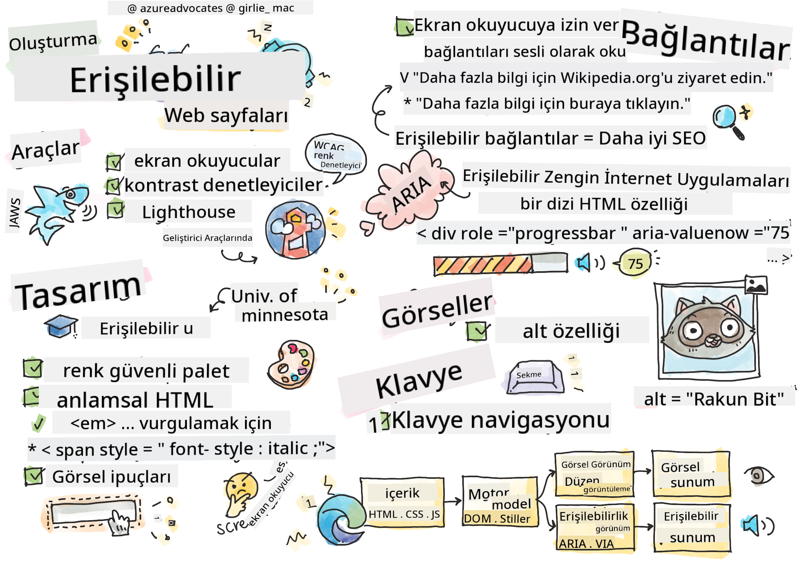
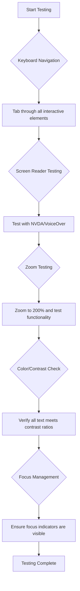
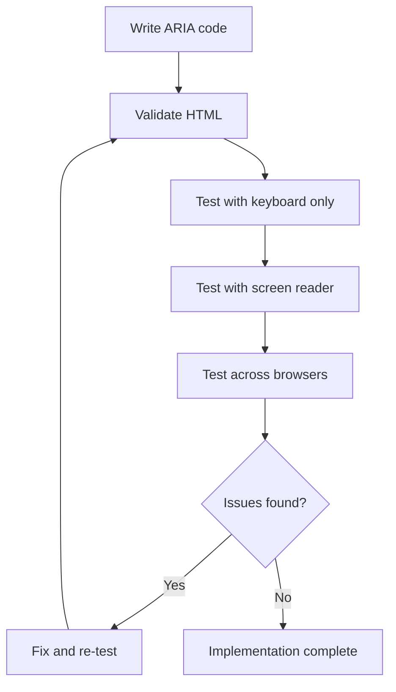

<!--
CO_OP_TRANSLATOR_METADATA:
{
  "original_hash": "90b19cde5b79b29e91babd3138cd8035",
  "translation_date": "2025-10-22T23:49:26+00:00",
  "source_file": "1-getting-started-lessons/3-accessibility/README.md",
  "language_code": "tr"
}
-->
# Erişilebilir Web Sayfaları Oluşturma


> Sketchnote: [Tomomi Imura](https://twitter.com/girlie_mac)

## Ders Öncesi Quiz
[Ders öncesi quiz](https://ff-quizzes.netlify.app/web/)

> Web'in gücü evrenselliğinde yatar. Engellilik durumuna bakılmaksızın herkesin erişimi temel bir unsurdur.
>
> \- Sir Timothy Berners-Lee, W3C Direktörü ve World Wide Web'in mucidi

Sizi şaşırtabilecek bir şey: Erişilebilir web siteleri oluşturduğunuzda, sadece engelli bireylere yardımcı olmakla kalmaz, aynı zamanda web'i herkes için daha iyi hale getirirsiniz!

Hiç sokak köşelerindeki kaldırım rampalarını fark ettiniz mi? Başlangıçta tekerlekli sandalyeler için tasarlandılar, ancak şimdi bebek arabası kullananlar, el arabası taşıyan kuryeler, tekerlekli bavul kullanan gezginler ve bisikletçiler için de faydalı oluyorlar. Erişilebilir web tasarımı tam olarak böyle çalışır—bir gruba yardımcı olan çözümler genellikle herkes için faydalı olur. Harika, değil mi?

Bu derste, web'i nasıl herkes için çalışabilir hale getirebileceğimizi keşfedeceğiz. Web standartlarına zaten dahil edilmiş pratik teknikleri öğrenecek, test araçlarını kullanarak pratik yapacak ve erişilebilirliğin sitelerinizi tüm kullanıcılar için nasıl daha kullanışlı hale getirdiğini göreceksiniz.

Bu dersin sonunda, erişilebilirliği geliştirme sürecinizin doğal bir parçası haline getirme konusunda kendinize güveniniz olacak. Düşünceli tasarım seçimlerinin web'i milyarlarca kullanıcıya nasıl açabileceğini keşfetmeye hazır mısınız? Haydi başlayalım!

> Bu dersi [Microsoft Learn](https://docs.microsoft.com/learn/modules/web-development-101/accessibility/?WT.mc_id=academic-77807-sagibbon) üzerinden alabilirsiniz!

## Yardımcı Teknolojileri Anlamak

Kodlamaya başlamadan önce, farklı yeteneklere sahip kişilerin web'i nasıl deneyimlediğini anlamak için bir an durup düşünelim. Bu sadece bir teori değil—bu gerçek dünya gezinme modellerini anlamak, sizi çok daha iyi bir geliştirici yapacak!

Yardımcı teknolojiler, engelli bireylerin web siteleriyle etkileşim kurmasına yardımcı olan oldukça etkileyici araçlardır. Bu teknolojilerin nasıl çalıştığını kavradığınızda, erişilebilir web deneyimleri oluşturmak çok daha sezgisel hale gelir. Kodunuzu başkasının gözünden görmeyi öğrenmek gibi bir şey.

### Ekran okuyucular

[Ekran okuyucular](https://en.wikipedia.org/wiki/Screen_reader), dijital metni konuşma veya Braille çıktısına dönüştüren oldukça sofistike teknolojilerdir. Genellikle görme engelli bireyler tarafından kullanılsa da, disleksi gibi öğrenme güçlüğü çeken kullanıcılar için de oldukça faydalıdır.

Ekran okuyucuyu, size bir kitabı okuyan çok akıllı bir anlatıcı olarak düşünebilirsiniz. İçeriği mantıklı bir sırayla sesli olarak okur, "düğme" veya "bağlantı" gibi etkileşimli öğeleri duyurur ve bir sayfa içinde gezinmek için klavye kısayolları sağlar. Ancak işin püf noktası şu ki—ekran okuyucuların sihirlerini gerçekleştirebilmesi için web sitelerini doğru yapı ve anlamlı içerikle oluşturmamız gerekiyor. İşte burada devreye siz, geliştirici olarak giriyorsunuz!

**Platformlar arası popüler ekran okuyucular:**
- **Windows**: [NVDA](https://www.nvaccess.org/about-nvda/) (ücretsiz ve en popüler), [JAWS](https://webaim.org/articles/jaws/), [Narrator](https://support.microsoft.com/windows/complete-guide-to-narrator-e4397a0d-ef4f-b386-d8ae-c172f109bdb1/?WT.mc_id=academic-77807-sagibbon) (yerleşik)
- **macOS/iOS**: [VoiceOver](https://support.apple.com/guide/voiceover/welcome/10) (yerleşik ve oldukça yetenekli)
- **Android**: [TalkBack](https://support.google.com/accessibility/android/answer/6283677) (yerleşik)
- **Linux**: [Orca](https://wiki.gnome.org/Projects/Orca) (ücretsiz ve açık kaynak)

**Ekran okuyucuların web içeriğinde gezinme yöntemleri:**

Ekran okuyucular, deneyimli kullanıcılar için gezinmeyi verimli hale getiren çeşitli gezinme yöntemleri sunar:
- **Sıralı okuma**: İçeriği yukarıdan aşağıya doğru, bir kitap okur gibi okur
- **Dönüm noktası navigasyonu**: Sayfa bölümleri arasında geçiş yapar (başlık, navigasyon, ana içerik, alt bilgi)
- **Başlık navigasyonu**: Sayfa yapısını anlamak için başlıklar arasında atlama yapar
- **Bağlantı listeleri**: Hızlı erişim için tüm bağlantıların bir listesini oluşturur
- **Form kontrolleri**: Giriş alanları ve düğmeler arasında doğrudan gezinir

> 💡 **Beni çok şaşırtan bir şey**: Ekran okuyucu kullanıcılarının %68'i öncelikle başlıklar aracılığıyla gezinir ([WebAIM Anketi](https://webaim.org/projects/screenreadersurvey9/#finding)). Bu, başlık yapınızın kullanıcılar için bir yol haritası gibi olduğu anlamına gelir—doğru yaptığınızda, insanların içeriğinizde daha hızlı yol bulmasına gerçekten yardımcı oluyorsunuz!

### Test İş Akışınızı Oluşturma

İyi bir erişilebilirlik testi yapmak göz korkutucu olmak zorunda değil! Otomatik araçları (açık sorunları yakalamada harikalar) biraz manuel testle birleştirmek isteyeceksiniz. İşte, tüm gününüzü harcamadan en fazla sorunu yakalayabileceğiniz sistematik bir yaklaşım:

**Temel manuel test iş akışı:**



**Adım adım test kontrol listesi:**
1. **Klavyeyle gezinme**: Sadece Tab, Shift+Tab, Enter, Space ve ok tuşlarını kullanın
2. **Ekran okuyucu testi**: NVDA, VoiceOver veya Narrator'ı etkinleştirin ve gözleriniz kapalı gezin
3. **Yakınlaştırma testi**: %200 ve %400 yakınlaştırma seviyelerinde test yapın
4. **Renk kontrastı doğrulama**: Tüm metin ve kullanıcı arayüzü bileşenlerini kontrol edin
5. **Odak göstergesi testi**: Tüm etkileşimli öğelerin görünür odak durumlarına sahip olduğundan emin olun

✅ **Lighthouse ile başlayın**: Tarayıcınızın Geliştirici Araçlarını açın, bir Lighthouse erişilebilirlik denetimi çalıştırın ve ardından sonuçları manuel test odak alanlarınızı yönlendirmek için kullanın.

### Yakınlaştırma ve büyütme araçları

Telefonunuzda metin çok küçük olduğunda yakınlaştırma hareketi yapıyor veya parlak güneş ışığında dizüstü bilgisayar ekranınıza gözlerinizi kısıyor musunuz? Birçok kullanıcı, içeriği her gün okunabilir hale getirmek için büyütme araçlarına güveniyor. Bu, düşük görme yetisine sahip kişiler, yaşlılar ve dışarıda bir web sitesini okumaya çalışan herkes için geçerlidir.

Modern yakınlaştırma teknolojileri, sadece şeyleri büyütmekten çok daha fazlasını yapıyor. Bu araçların nasıl çalıştığını anlamak, her büyütme seviyesinde işlevsel ve çekici kalan duyarlı tasarımlar oluşturmanıza yardımcı olacaktır.

**Modern tarayıcı yakınlaştırma özellikleri:**
- **Sayfa yakınlaştırma**: Tüm içeriği orantılı olarak ölçeklendirir (metin, resimler, düzen) - tercih edilen yöntem budur
- **Sadece metin yakınlaştırma**: Yazı tipi boyutunu artırır, ancak orijinal düzeni korur
- **Yakınlaştırma hareketi**: Geçici büyütme için mobil hareket desteği
- **Tarayıcı desteği**: Tüm modern tarayıcılar, işlevselliği bozmadan %500'e kadar yakınlaştırmayı destekler

**Özel büyütme yazılımları:**
- **Windows**: [Magnifier](https://support.microsoft.com/windows/use-magnifier-to-make-things-on-the-screen-easier-to-see-414948ba-8b1c-d3bd-8615-0e5e32204198) (yerleşik), [ZoomText](https://www.freedomscientific.com/training/zoomtext/getting-started/)
- **macOS/iOS**: [Zoom](https://www.apple.com/accessibility/mac/vision/) (yerleşik ve gelişmiş özelliklere sahip)

> ⚠️ **Tasarım Düşüncesi**: WCAG, içeriğin %200'e kadar yakınlaştırıldığında işlevsel kalmasını gerektirir. Bu seviyede yatay kaydırma minimum olmalı ve tüm etkileşimli öğeler erişilebilir kalmalıdır.

✅ **Duyarlı tasarımınızı test edin**: Tarayıcınızı %200 ve %400'e yakınlaştırın. Düzeniniz zarif bir şekilde uyum sağlıyor mu? Aşırı kaydırma olmadan tüm işlevselliğe hala erişebiliyor musunuz?

## Modern Erişilebilirlik Test Araçları

Artık insanların yardımcı teknolojilerle web'de nasıl gezindiğini anladığınıza göre, erişilebilir web siteleri oluşturmanıza ve test etmenize yardımcı olacak araçları keşfedelim.

Bunu şöyle düşünebilirsiniz: Otomatik araçlar açık sorunları yakalamada harikadır (örneğin eksik alt metin), manuel test ise sitenizin gerçek dünyada kullanımı iyi hissettirdiğinden emin olmanıza yardımcı olur. Birlikte, sitelerinizin herkes için çalıştığından emin olmanızı sağlar.

### Renk kontrastı testi

İyi haber: Renk kontrastı en yaygın erişilebilirlik sorunlarından biridir, ancak düzeltmesi en kolay olanlardan biridir. İyi kontrast, görme engelli kullanıcılardan plajda telefonlarını okumaya çalışan insanlara kadar herkes için faydalıdır.

**WCAG kontrast gereksinimleri:**

| Metin Türü | WCAG AA (Minimum) | WCAG AAA (Gelişmiş) |
|------------|-------------------|---------------------|
| **Normal metin** (18pt altı) | 4.5:1 kontrast oranı | 7:1 kontrast oranı |
| **Büyük metin** (18pt+ veya 14pt+ kalın) | 3:1 kontrast oranı | 4.5:1 kontrast oranı |
| **UI bileşenleri** (düğmeler, form kenarları) | 3:1 kontrast oranı | 3:1 kontrast oranı |

**Temel test araçları:**
- [Colour Contrast Analyser](https://www.tpgi.com/color-contrast-checker/) - Renk seçici ile masaüstü uygulaması
- [WebAIM Contrast Checker](https://webaim.org/resources/contrastchecker/) - Anında geri bildirim sağlayan web tabanlı araç
- [Stark](https://www.getstark.co/) - Figma, Sketch, Adobe XD için tasarım aracı eklentisi
- [Accessible Colors](https://accessible-colors.com/) - Erişilebilir renk paletleri bulun

✅ **Daha iyi renk paletleri oluşturun**: Marka renklerinizle başlayın ve erişilebilir varyasyonlar oluşturmak için kontrast kontrol araçlarını kullanın. Bunları tasarım sisteminizin erişilebilir renk belirteçleri olarak belgeleyin.

### Kapsamlı erişilebilirlik denetimi

En etkili erişilebilirlik testi, birden fazla yaklaşımı birleştirir. Tek bir araç her şeyi yakalayamaz, bu nedenle çeşitli yöntemlerle bir test rutini oluşturmak kapsamlı bir kapsama sağlar.

**Tarayıcı tabanlı test (Geliştirici Araçlarına entegre):**
- **Chrome/Edge**: Lighthouse erişilebilirlik denetimi + Erişilebilirlik paneli
- **Firefox**: Ayrıntılı ağaç görünümü ile Erişilebilirlik Denetleyicisi
- **Safari**: Web Denetleyicisi'ndeki Denetim sekmesi ile VoiceOver simülasyonu

**Profesyonel test eklentileri:**
- [axe DevTools](https://www.deque.com/axe/devtools/) - Endüstri standardı otomatik test
- [WAVE](https://wave.webaim.org/extension/) - Hata vurgulama ile görsel geri bildirim
- [Accessibility Insights](https://accessibilityinsights.io/) - Microsoft'un kapsamlı test paketi

**Komut satırı ve CI/CD entegrasyonu:**
- [axe-core](https://github.com/dequelabs/axe-core) - Otomatik test için JavaScript kütüphanesi
- [Pa11y](https://pa11y.org/) - Komut satırı erişilebilirlik test aracı
- [Lighthouse CI](https://github.com/GoogleChrome/lighthouse-ci) - Otomatik erişilebilirlik puanlama

> 🎯 **Test Hedefi**: Lighthouse erişilebilirlik puanınızı 95+ olarak belirleyin. Unutmayın, otomatik araçlar erişilebilirlik sorunlarının yalnızca %30-40'ını yakalar—manuel test hala gereklidir!

## Erişilebilirliği Baştan İnşa Etmek

Erişilebilirlik başarısının anahtarı, bunu en baştan temelinize dahil etmektir. "Erişilebilirliği sonra eklerim" diye düşünmek cazip gelebilir, ancak bu, bir ev inşa edildikten sonra bir rampa eklemeye çalışmak gibidir. Mümkün mü? Evet. Kolay mı? Pek değil.

Erişilebilirliği bir ev planlamak gibi düşünün—tekerlekli sandalye erişimini ilk mimari planlarınıza dahil etmek, her şeyi sonradan uyarlamaktan çok daha kolaydır.

### POUR prensipleri: Erişilebilirlik temeliniz

Web İçeriği Erişilebilirlik Yönergeleri (WCAG), POUR olarak adlandırılan dört temel ilke etrafında şekillenmiştir. Endişelenmeyin—bunlar sıkıcı akademik kavramlar değil! Aslında herkes için çalışan içerikler oluşturmak için pratik rehberlerdir.

POUR'u kavradığınızda, erişilebilirlik kararları almak çok daha sezgisel hale gelir. Tasarım seçimlerinizi yönlendiren zihinsel bir kontrol listesi gibi. Hadi bunu parçalayalım:

**🔍 Algılanabilir**: Bilgi, kullanıcıların mevcut duyuları aracılığıyla algılayabileceği şekilde sunulmalıdır

- Metin olmayan içerik için metin alternatifleri sağlayın (resimler, videolar, ses)
- Tüm metin ve kullanıcı arayüzü bileşenleri için yeterli renk kontrastı sağlayın
- Multimedya içerik için altyazılar ve transkriptler sunun
- İçeriğin %200'e kadar yeniden boyutlandırıldığında işlevsel kalmasını sağlayın
- Bilgi iletmek için yalnızca renk değil, birden fazla duyusal özellik kullanın

**🎮 İşlenebilir**: Tüm arayüz bileşenleri mevcut giriş yöntemleriyle işlenebilir olmalıdır

- Tüm işlevselliği klavye navigasyonu ile erişilebilir hale getirin
- Kullanıcılara içeriği okumak ve etkileşimde bulunmak için yeterli zaman sağlayın
- Nöbet veya vestibüler bozukluklara neden olan içerikten kaçının
- Kullanıcılara açık yapı ve dönüm noktaları ile verimli bir şekilde gezinmelerine yardımcı olun
- Etkileşimli öğelerin yeterli hedef boyutlarına sahip olduğundan emin olun (minimum 44px)

**📖 Anlaşılabilir**: Bilgi ve kullanıcı arayüzü işlemi açık ve anlaşılır olmalıdır

- Hedef kitlenize uygun açık, basit bir dil kullanın
- İçeriğin öngörülebilir, tutarlı şekillerde görünmesini ve çalışmasını sağlayın
- Kullanıcı girdisi için açık talimatlar ve hata mesajları sağlayın
- Kullanıcıların formlarda hataları anlamalarına ve düzeltmelerine yardımcı olun
- İçeriği mantıklı bir okuma sırası ve bilgi hiyerarşisi ile düzenleyin

**💪 Sağlam**: İçerik, farklı teknolojiler ve yardımcı cihazlar arasında güvenilir bir şekilde çalışmalıdır

- Temeliniz olarak geçerli, anlamsal HTML kullanın
- Mevcut ve gelecekteki yardımcı teknolojilerle uyumluluğu sağlayın
- İşaretleme için web standartlarını ve en iyi uygulamaları takip edin
- Farklı tarayıcılar, cihazlar ve yardımcı araçlar arasında test yapın
- Gelişmiş özellikler desteklenmediğinde içeriğin zarif bir şekilde bozulmasını sağlayın

## Erişilebilir Görsel Tasarım Oluşturma

İyi görsel tasarım ve erişilebilirlik el ele gider. Erişilebilirliği göz önünde bulundurarak tasarım yaptığınızda, genellikle bu kısıtlamaların herkes için faydalı olan daha temiz, daha zarif çözümler sunduğunu keşfedersiniz.

Hadi görsel yeteneklerinden bağımsız olarak herkes için çalışan görsel olarak çekici tasarımlar oluşturmayı keşfedelim.

### Renk ve görsel erişilebilirlik stratejileri
Renk iletişimde güçlüdür, ancak önemli bilgileri iletmenin tek yolu olmamalıdır. Renk dışında tasarım yapmak, daha sağlam ve kapsayıcı deneyimler yaratır ve daha fazla durumda işe yarar.

**Renk görme farklılıkları için tasarım yapın:**

Yaklaşık %8 erkek ve %0.5 kadın, bir tür renk görme farklılığına (genellikle "renk körlüğü" olarak adlandırılır) sahiptir. En yaygın türler şunlardır:
- **Deuteranopi**: Kırmızı ve yeşili ayırt etmede zorluk
- **Protanopi**: Kırmızı daha soluk görünür
- **Tritanopi**: Mavi ve sarı ile ilgili zorluk (nadir)

**Kapsayıcı renk stratejileri:**

```css
/* ❌ Bad: Using only color to indicate status */
.error { color: red; }
.success { color: green; }

/* ✅ Good: Color plus icons and context */
.error {
  color: #d32f2f;
  border-left: 4px solid #d32f2f;
}
.error::before {
  content: "⚠️";
  margin-right: 8px;
}

.success {
  color: #2e7d32;
  border-left: 4px solid #2e7d32;
}
.success::before {
  content: "✅";
  margin-right: 8px;
}
```

**Temel kontrast gereksinimlerinin ötesinde:**
- Renk seçimlerinizi renk körlüğü simülatörleriyle test edin
- Renk kodlamasının yanında desenler, dokular veya şekiller kullanın
- Etkileşimli durumların renk olmadan da ayırt edilebilir olmasını sağlayın
- Tasarımınızın yüksek kontrast modunda nasıl göründüğünü düşünün

✅ **Renk erişilebilirliğinizi test edin**: Sitenizin farklı renk görme türlerine sahip kullanıcılar için nasıl göründüğünü görmek için [Coblis](https://www.color-blindness.com/coblis-color-blindness-simulator/) gibi araçlar kullanın.

### Odak göstergeleri ve etkileşim tasarımı

Odak göstergeleri, dijital dünyada bir imlecin eşdeğeridir—klavye kullanıcılarına sayfada nerede olduklarını gösterir. İyi tasarlanmış odak göstergeleri, etkileşimleri net ve tahmin edilebilir hale getirerek herkes için deneyimi geliştirir.

**Modern odak göstergesi en iyi uygulamaları:**

```css
/* Enhanced focus styles that work across browsers */
button:focus-visible {
  outline: 2px solid #0066cc;
  outline-offset: 2px;
  box-shadow: 0 0 0 4px rgba(0, 102, 204, 0.25);
}

/* Remove focus outline for mouse users, preserve for keyboard users */
button:focus:not(:focus-visible) {
  outline: none;
}

/* Focus-within for complex components */
.card:focus-within {
  box-shadow: 0 0 0 3px rgba(74, 144, 164, 0.5);
  border-color: #4A90A4;
}

/* Ensure focus indicators meet contrast requirements */
.custom-focus:focus-visible {
  outline: 3px solid #ffffff;
  outline-offset: 2px;
  box-shadow: 0 0 0 6px #000000;
}
```

**Odak göstergesi gereksinimleri:**
- **Görünürlük**: Çevresindeki öğelerle en az 3:1 kontrast oranına sahip olmalıdır
- **Genişlik**: Tüm öğe etrafında minimum 2px kalınlık
- **Süreklilik**: Odak başka bir yere kayana kadar görünür kalmalıdır
- **Ayırt edilebilirlik**: Diğer kullanıcı arayüzü durumlarından görsel olarak farklı olmalıdır

> 💡 **Tasarım İpucu**: Harika odak göstergeleri genellikle görünürlüğü farklı arka planlar ve bağlamlar arasında sağlamak için kontur, kutu gölgesi ve renk değişikliklerinin bir kombinasyonunu kullanır.

✅ **Odak göstergelerini denetleyin**: Web sitenizde sekme tuşuyla gezinin ve hangi öğelerin net odak göstergelerine sahip olduğunu not edin. Görülmesi zor veya tamamen eksik olan var mı?

### Semantik HTML: Erişilebilirliğin temeli

Semantik HTML, web siteniz için yardımcı teknolojilere bir GPS sistemi vermek gibidir. HTML öğelerini amaçlarına uygun şekilde kullandığınızda, ekran okuyucular, klavyeler ve diğer araçlara kullanıcıların etkili bir şekilde gezinmesine yardımcı olacak ayrıntılı bir yol haritası sağlamış olursunuz.

Bunu gerçekten anlamamı sağlayan bir benzetme: Semantik HTML, net kategoriler ve yardımcı işaretlerle düzenlenmiş bir kütüphane ile kitapların rastgele dağınık olduğu bir depo arasındaki fark gibidir. Her iki yerde de aynı kitaplar var, ancak hangisinde bir şey bulmayı tercih edersiniz? Aynen öyle!

**Erişilebilir sayfa yapısının yapı taşları:**

```html
<!-- Landmark elements provide page navigation structure -->
<header>
  <h1>Your Site Name</h1>
  <nav aria-label="Main navigation">
    <ul>
      <li><a href="/home">Home</a></li>
      <li><a href="/about">About</a></li>
      <li><a href="/services">Services</a></li>
    </ul>
  </nav>
</header>

<main>
  <article>
    <header>
      <h1>Article Title</h1>
      <p>Published on <time datetime="2024-10-14">October 14, 2024</time></p>
    </header>
    
    <section>
      <h2>First Section</h2>
      <p>Content that relates to this section...</p>
    </section>
    
    <section>
      <h2>Second Section</h2>
      <p>More related content...</p>
    </section>
  </article>
  
  <aside>
    <h2>Related Links</h2>
    <nav aria-label="Related articles">
      <ul>
        <li><a href="/related-1">First related article</a></li>
        <li><a href="/related-2">Second related article</a></li>
      </ul>
    </nav>
  </aside>
</main>

<footer>
  <p>&copy; 2024 Your Site Name. All rights reserved.</p>
  <nav aria-label="Footer links">
    <ul>
      <li><a href="/privacy">Privacy Policy</a></li>
      <li><a href="/contact">Contact Us</a></li>
    </ul>
  </nav>
</footer>
```

**Semantik HTML'nin erişilebilirliği nasıl dönüştürdüğü:**

| Semantik Eleman | Amaç | Ekran Okuyucu Faydası |
|------------------|---------|----------------------|
| `<header>` | Sayfa veya bölüm başlığı | "Banner landmark" - hızlı bir şekilde en üste gitme |
| `<nav>` | Navigasyon bağlantıları | "Navigasyon landmark" - navigasyon bölümlerinin listesi |
| `<main>` | Ana sayfa içeriği | "Ana landmark" - doğrudan içeriğe geçiş |
| `<article>` | Bağımsız içerik | Makale sınırlarını belirtir |
| `<section>` | Temalı içerik grupları | İçerik yapısı sağlar |
| `<aside>` | İlgili yan içerik | "Tamamlayıcı landmark" |
| `<footer>` | Sayfa veya bölüm altbilgisi | "Contentinfo landmark" |

**Semantik HTML ile ekran okuyucu süper güçleri:**
- **Landmark navigasyonu**: Büyük sayfa bölümleri arasında anında geçiş yapma
- **Başlık özetleri**: Başlık yapınızdan bir içerik tablosu oluşturma
- **Eleman listeleri**: Tüm bağlantılar, düğmeler veya form kontrollerinin listelerini oluşturma
- **Bağlam farkındalığı**: İçerik bölümleri arasındaki ilişkileri anlama

> 🎯 **Hızlı Test**: NVDA/JAWS'da landmark kısayollarını (D için landmark, H için başlık, K için bağlantı) kullanarak sitenizde gezinmeyi deneyin. Navigasyon mantıklı mı?

✅ **Semantik yapınızı denetleyin**: Tarayıcınızın Geliştirici Araçları'ndaki Erişilebilirlik panelini kullanarak erişilebilirlik ağacını görüntüleyin ve işaretlemenizin mantıklı bir yapı oluşturduğundan emin olun.

### Başlık hiyerarşisi: Mantıklı bir içerik taslağı oluşturma

Başlıklar, erişilebilir içerik için kesinlikle çok önemlidir—her şeyi bir arada tutan omurga gibidir. Ekran okuyucu kullanıcıları, içeriğinizi anlamak ve gezinmek için büyük ölçüde başlıklara güvenir. Bunu, sayfanız için bir içerik tablosu sağlamak olarak düşünün.

**Başlıklar için altın kural:**
Seviyeleri atlamayın. Her zaman mantıklı bir şekilde `<h1>`'den `<h2>`'ye, ardından `<h3>`'e doğru ilerleyin. Okulda taslaklar hazırlamayı hatırlıyor musunuz? Aynı prensip—"I. Ana Nokta"dan doğrudan "C. Alt-alt nokta"ya geçmezsiniz, değil mi?

**Mükemmel başlık yapısı örneği:**

```html
<!-- ✅ Excellent: Logical, hierarchical progression -->
<main>
  <h1>Complete Guide to Web Accessibility</h1>
  
  <section>
    <h2>Understanding Screen Readers</h2>
    <p>Introduction to screen reader technology...</p>
    
    <h3>Popular Screen Reader Software</h3>
    <p>NVDA, JAWS, and VoiceOver comparison...</p>
    
    <h3>Testing with Screen Readers</h3>
    <p>Step-by-step testing instructions...</p>
  </section>
  
  <section>
    <h2>Color and Contrast Guidelines</h2>
    <p>Designing with sufficient contrast...</p>
    
    <h3>WCAG Contrast Requirements</h3>
    <p>Understanding the different contrast levels...</p>
    
    <h3>Testing Tools and Techniques</h3>
    <p>Tools for verifying contrast ratios...</p>
  </section>
</main>
```

```html
<!-- ❌ Problematic: Skipping levels, inconsistent structure -->
<h1>Page Title</h1>
<h3>Subsection</h3> <!-- Skipped h2 -->
<h2>This should come before h3</h2>
<h1>Another main heading?</h1> <!-- Multiple h1s -->
```

**Başlık en iyi uygulamaları:**
- **Sayfa başına bir `<h1>`**: Genellikle ana sayfa başlığı veya birincil içerik başlığı
- **Mantıklı ilerleme**: Seviyeleri atlamayın (h1 → h2 → h3, h1 → h3 değil)
- **Açıklayıcı içerik**: Başlıkları bağlam dışında okunduğunda anlamlı hale getirin
- **CSS ile görsel stil**: Görünüm için CSS kullanın, yapı için HTML seviyeleri kullanın

**Ekran okuyucu navigasyon istatistikleri:**
- Ekran okuyucu kullanıcılarının %68'i başlıklarla gezinir ([WebAIM Anketi](https://webaim.org/projects/screenreadersurvey9/#finding))
- Kullanıcılar mantıklı bir başlık taslağı bulmayı bekler
- Başlıklar, sayfa yapısını anlamanın en hızlı yolunu sağlar

> 💡 **Profesyonel İpucu**: "HeadingsMap" gibi tarayıcı eklentilerini kullanarak başlık yapınızı görselleştirin. İyi organize edilmiş bir içerik tablosu gibi okunmalıdır.

✅ **Başlık yapınızı test edin**: NVDA'da başlık navigasyonunu (H tuşu) kullanarak başlıklarınız arasında geçiş yapın. İlerleme, içeriğinizin hikayesini mantıklı bir şekilde anlatıyor mu?

### Gelişmiş görsel erişilebilirlik teknikleri

Kontrast ve renk temelinin ötesinde, gerçekten kapsayıcı görsel deneyimler yaratmaya yardımcı olan sofistike teknikler vardır. Bu yöntemler, içeriğinizin farklı görüntüleme koşulları ve yardımcı teknolojilerle çalışmasını sağlar.

**Temel görsel iletişim stratejileri:**

- **Çok modlu geri bildirim**: Görsel, metinsel ve bazen sesli ipuçlarını birleştirin
- **Aşamalı açıklama**: Bilgiyi sindirilebilir parçalara ayırarak sunun
- **Tutarlı etkileşim desenleri**: Tanıdık kullanıcı arayüzü kurallarını kullanın
- **Duyarlı tipografi**: Metni cihazlar arasında uygun şekilde ölçeklendirin
- **Yükleme ve hata durumları**: Tüm kullanıcı eylemleri için net geri bildirim sağlayın

**Gelişmiş erişilebilirlik için CSS araçları:**

```css
/* Screen reader only text - visually hidden but accessible */
.sr-only {
  position: absolute;
  width: 1px;
  height: 1px;
  padding: 0;
  margin: -1px;
  overflow: hidden;
  clip: rect(0, 0, 0, 0);
  white-space: nowrap;
  border: 0;
}

/* Skip link for keyboard navigation */
.skip-link {
  position: absolute;
  top: -40px;
  left: 6px;
  background: #000000;
  color: #ffffff;
  padding: 8px 16px;
  text-decoration: none;
  border-radius: 4px;
  font-weight: bold;
  transition: top 0.3s ease;
  z-index: 1000;
}

.skip-link:focus {
  top: 6px;
}

/* Reduced motion respect */
@media (prefers-reduced-motion: reduce) {
  .skip-link {
    transition: none;
  }
  
  * {
    animation-duration: 0.01ms !important;
    animation-iteration-count: 1 !important;
    transition-duration: 0.01ms !important;
  }
}

/* High contrast mode support */
@media (prefers-contrast: high) {
  .button {
    border: 2px solid;
  }
}
```

> 🎯 **Erişilebilirlik Deseni**: "Atla bağlantısı" klavye kullanıcıları için çok önemlidir. Sayfanızdaki ilk odaklanabilir öğe olmalı ve doğrudan ana içerik alanına geçmelidir.

✅ **Atlama navigasyonunu uygulayın**: Sayfalarınıza atlama bağlantıları ekleyin ve sayfa yüklendiğinde hemen Tab tuşuna basarak test edin. Görünmeli ve sizi ana içeriğe yönlendirmelidir.

## Anlamlı Bağlantı Metni Oluşturma

Bağlantılar, webin otoyolları gibidir, ancak kötü yazılmış bağlantı metni, "Yer" yazan bir yol tabelasına sahip olmak gibidir, "Chicago Şehir Merkezi" yerine. Pek yardımcı olmaz, değil mi?

İlk öğrendiğimde beni gerçekten etkileyen bir şey: Ekran okuyucular, bir sayfadaki tüm bağlantıları çıkarabilir ve bunları büyük bir liste olarak gösterebilir. Birisi size sayfanızdaki her bağlantının bir dizinini verseydi, her biri kendi başına anlamlı olur muydu? Bağlantı metninizin geçmesi gereken test tam olarak budur!

### Bağlantı navigasyon desenlerini anlama

Ekran okuyucular, iyi yazılmış bağlantı metnine dayanan güçlü bağlantı navigasyon özellikleri sunar:

**Bağlantı navigasyon yöntemleri:**
- **Sıralı okuma**: Bağlantılar içerik akışının bir parçası olarak bağlam içinde okunur
- **Bağlantı listesi oluşturma**: Tüm sayfa bağlantıları aranabilir bir dizine derlenir
- **Hızlı navigasyon**: Klavye kısayollarını kullanarak bağlantılar arasında geçiş yapma (NVDA'da K tuşu)
- **Arama işlevi**: Kısmi metin yazarak belirli bağlantıları bulma

**Bağlam neden önemlidir:**
Ekran okuyucu kullanıcıları bir bağlantı listesi oluşturduğunda, şu gibi bir şey görürler:
- "Raporu indir"
- "Daha fazla bilgi edinin"
- "Buraya tıklayın"
- "Gizlilik politikası"
- "Buraya tıklayın"

Bu bağlantılardan yalnızca ikisi bağlam dışında okunduğunda faydalı bilgi sağlar!

> 📊 **Kullanıcı Etkisi**: Ekran okuyucu kullanıcıları, sayfa içeriğini hızlı bir şekilde anlamak için bağlantı listelerini tarar. Genel bağlantı metni, her bağlantının bağlamına geri dönmelerini zorunlu kılarak gezinme deneyimlerini önemli ölçüde yavaşlatır.

### Kaçınılması gereken yaygın bağlantı metni hataları

Ne işe yaramadığını anlamak, mevcut içerikteki erişilebilirlik sorunlarını tanımanıza ve düzeltmenize yardımcı olur.

**❌ Bağlam sağlamayan genel bağlantı metni:**

```html
<!-- Meaningless when read from a link list -->
<p>Our sustainability efforts are detailed in our recent report. 
   <a href="/sustainability-2024.pdf">Click here</a> to view it.</p>

<!-- Repeated generic text throughout the page -->
<div class="article-card">
  <h3>Web Accessibility Guide</h3>
  <p>Learn the fundamentals...</p>
  <a href="/accessibility-guide">Read more</a>
</div>
<div class="article-card">
  <h3>Color Contrast Tips</h3>
  <p>Improve your design...</p>
  <a href="/color-contrast">Read more</a>
</div>

<!-- URLs as link text (difficult for screen readers to announce) -->
<p>Visit https://www.w3.org/WAI/WCAG21/quickref/ for WCAG guidelines.</p>

<!-- Vague action words -->
<a href="/contact">Go</a> | <a href="/about">See</a> | <a href="/help">View</a>
```

**Bu desenler neden başarısız olur:**
- **"Buraya tıklayın"** kullanıcıya hedef hakkında hiçbir şey söylemez
- **"Daha fazla bilgi edinin"** birden fazla kez tekrarlandığında kafa karışıklığı yaratır
- **Ham URL'ler** ekran okuyucular tarafından net bir şekilde telaffuz edilmesi zordur
- **Tek kelimeler** "Git" veya "Gör" gibi açıklayıcı bağlamdan yoksundur

### Mükemmel bağlantı metni yazma

Açıklayıcı bağlantı metni herkes için faydalıdır—görsel kullanıcılar bağlantıları hızlıca tarayabilir ve ekran okuyucu kullanıcıları hedefleri hemen anlayabilir.

**✅ Açık, açıklayıcı bağlantı metni örnekleri:**

```html
<!-- Descriptive text that explains the destination -->
<p>Our comprehensive <a href="/sustainability-2024.pdf">2024 sustainability report (PDF, 2.1MB)</a> details our environmental initiatives.</p>

<!-- Specific, unique link text for each card -->
<div class="article-card">
  <h3>Web Accessibility Guide</h3>
  <p>Learn the fundamentals of inclusive design...</p>
  <a href="/accessibility-guide">Read our complete web accessibility guide</a>
</div>
<div class="article-card">
  <h3>Color Contrast Tips</h3>
  <p>Improve your design with better color choices...</p>
  <a href="/color-contrast">Explore color contrast best practices</a>
</div>

<!-- Meaningful text instead of raw URLs -->
<p>The <a href="https://www.w3.org/WAI/WCAG21/quickref/">WCAG 2.1 Quick Reference guide</a> provides comprehensive accessibility guidelines.</p>

<!-- Descriptive action links -->
<a href="/contact">Contact our support team</a> | 
<a href="/about">About our company</a> | 
<a href="/help">Get help with your account</a>
```

**Bağlantı metni en iyi uygulamaları:**
- **Spesifik olun**: "Üç aylık finansal raporu indir" yerine "İndir"
- **Dosya türü ve boyutunu belirtin**: "(PDF, 1.2MB)" indirilebilir dosyalar için
- **Bağlantıların harici olarak açıldığını belirtin**: "(yeni pencerede açılır)" gerektiğinde
- **Aktif dil kullanın**: "Bize ulaşın" yerine "İletişim sayfası"
- **Kısa tutun**: Mümkünse 2-8 kelime hedefleyin

### Gelişmiş bağlantı erişilebilirlik desenleri

Bazen görsel tasarım kısıtlamaları veya teknik gereksinimler özel çözümler gerektirir. İşte yaygın zorlu senaryolar için sofistike teknikler:

**Gelişmiş bağlam için ARIA kullanımı:**

```html
<!-- When button text must be short but needs more context -->
<a href="/report.pdf" 
   aria-label="Download 2024 annual financial report, PDF format, 2.3MB">
  Download Report
</a>

<!-- When the full context comes from surrounding content -->
<h3 id="sustainability-heading">Sustainability Initiative</h3>
<p>Our efforts to reduce environmental impact...</p>
<a href="/sustainability-details" 
   aria-labelledby="sustainability-heading"
   aria-describedby="sustainability-summary">
  Learn more
</a>
<p id="sustainability-summary">Detailed breakdown of our 2024 environmental goals and achievements</p>
```

**Dosya türlerini ve harici hedefleri belirtme:**

```html
<!-- Method 1: Include information in visible link text -->
<a href="/annual-report.pdf">
  Download our 2024 annual report (PDF, 2.3MB)
</a>

<!-- Method 2: Use screen reader-only text for file details -->
<a href="/annual-report.pdf">
  Download our 2024 annual report
  <span class="sr-only">(PDF format, 2.3MB)</span>
</a>

<!-- Method 3: External link indication -->
<a href="https://example.com" 
   target="_blank" 
   aria-describedby="external-link-warning">
  Visit external resource
</a>
<span id="external-link-warning" class="sr-only">
  (opens in new window)
</span>

<!-- Method 4: Using CSS for visual indicators -->
<a href="https://example.com" class="external-link">
  External resource
</a>
```

```css
/* Visual indicator for external links */
.external-link::after {
  content: " ↗";
  font-size: 0.8em;
  color: #666;
}

/* Screen reader announcement for external links */
.external-link::before {
  content: "External link: ";
  position: absolute;
  left: -10000px;
  width: 1px;
  height: 1px;
  overflow: hidden;
}
```

> ⚠️ **Önemli**: `target="_blank"` kullanırken, bağlantının yeni bir pencerede veya sekmede açıldığını her zaman kullanıcılara bildirin. Beklenmedik navigasyon değişiklikleri kafa karıştırıcı olabilir.

✅ **Bağlantı bağlamınızı test edin**: Tarayıcınızın geliştirici araçlarını kullanarak sayfanızdaki tüm bağlantıların bir listesini oluşturun. Her bağlantının amacını çevresel bağlam olmadan anlayabiliyor musunuz?

## ARIA: HTML Erişilebilirliğini Güçlendirme

[Accessible Rich Internet Applications (ARIA)](https://developer.mozilla.org/docs/Web/Accessibility/ARIA), karmaşık web uygulamalarınız ile yardımcı teknolojiler arasında evrensel bir çevirmen gibidir. HTML tek başına etkileşimli bileşenlerinizin tüm işlevlerini ifade edemediğinde, ARIA bu boşlukları doldurmak için devreye girer.

ARIA'yı HTML'nize yardımcı açıklamalar eklemek gibi düşünmeyi seviyorum—oyun senaryosundaki aktörlerin rollerini ve ilişkilerini anlamalarına yardımcı olan sahne yönlendirmeleri gibi.

**ARIA hakkında en önemli kural şudur**: Her zaman önce semantik HTML kullanın, ardından ARIA'yı geliştirmek için ekleyin. ARIA'yı ana yemek değil, baharat olarak düşünün. HTML yapınızı asla değiştirmemeli, yalnızca açıklamalı ve geliştirmelidir. Önce temeli doğru yapın!

### Stratejik ARIA uygulaması

ARIA güçlüdür, ancak güçle birlikte sorumluluk gelir. Yanlış ARIA, erişilebilirliği hiç olmamasından daha kötü hale getirebilir. İşte ne zaman ve nasıl etkili bir şekilde kullanılacağı:

**✅ ARIA'yı şu durumlarda kullanın:**
- Özel etkileşimli widget'lar oluştururken (akordeonlar, sekmeler, karuseller)
- Sayfa yenilenmeden değişen dinamik içerik oluştururken
- Karmaşık kullanıcı arayüzü ilişkileri için ek bağlam sağlarken
- Yükleme durumlarını veya canlı içerik güncellemelerini belirtirken
- Özel kontrollerle uygulama benzeri arayüzler oluştururken

**❌ ARIA'yı şu durumlarda kullanmaktan kaçının:**
- Standart HTML öğeleri zaten gereken semantiği sağlıyorsa
- Nasıl doğru bir şekilde uygulanacağını bilmiyorsanız
- Semantik HTML tarafından zaten sağlanan bilgileri yineliyorsa
- Gerçek yardımcı teknoloji ile test edilmediyse

> 🎯 **ARIA Altın Kuralı**: "Semantiği kesinlikle gerekli olmadıkça değiştirmeyin, her zaman klavye erişilebilirliğini sağlayın ve gerçek yardımcı teknoloji ile test edin."

**ARIA'nın beş kategorisi:**

1. **Roller**: Bu eleman nedir? (`button`, `tab`, `dialog`)
2. **Özellikler**: Özellikleri nelerdir? (`aria-required`, `aria-haspopup`)
3. **Durumlar**: Mevcut durumu nedir? (`aria-expanded`, `aria-checked`)
4. **Landmarklar**: Sayfa yapısında nerede? (`banner`, `navigation`, `main`)
5. **Canlı bölgeler**: Değişiklikler nasıl duyurulmalı? (`aria-live`, `aria-atomic`)

### Modern web uygulamaları için temel ARIA desenleri

Bu desenler, etkileşimli web uygulamalarındaki en yaygın erişilebilirlik zorluklarını çözer:

**Elemanları adlandırma ve açıklama:**

```html
<!-- aria-label: Provides accessible name when visible text isn't sufficient -->
<button aria-label="Close newsletter subscription dialog">×</button>

<!-- aria-labelledby: References existing text as the accessible name -->
<section aria-labelledby="news-heading">
  <h2 id="news-heading">Latest News</h2>
  <!-- news content -->
</section>

<!-- aria-describedby: Links to additional descriptive text -->
<input type="password" 
       aria-describedby="pwd-requirements pwd-strength"
       required>
<div id="pwd-requirements">
  Password must contain at least 8 characters, including uppercase, lowercase, and numbers.
</div>
<div id="pwd-strength" aria-live="polite">
  <!-- Dynamic password strength indicator -->
</div>
```

**Dinamik içerik için canlı bölgeler:**

```html
<!-- Polite announcements (don't interrupt current speech) -->
<div aria-live="polite" id="status-updates">
  <!-- Status messages appear here -->
</div>

<!-- Assertive announcements (interrupt and announce immediately) -->
<div aria-live="assertive" id="urgent-alerts">
  <!-- Error messages and critical alerts -->
</div>

<!-- Loading states with live regions -->
<button id="submit-btn" aria-describedby="loading-status">
  Submit Application
</button>
<div id="loading-status" aria-live="polite" aria-atomic="true">
  <!-- "Processing your application..." appears here -->
</div>
```

**Etkileşimli widget örneği (akordeon):**

```html
<div class="accordion">
  <h3>
    <button aria-expanded="false" 
            aria-controls="panel-1" 
            id="accordion-trigger-1"
            class="accordion-trigger">
      Accessibility Guidelines
    </button>
  </h3>
  <div id="panel-1" 
       role="region"
       aria-labelledby="accordion-trigger-1" 
       hidden>
    <p>WCAG 2.1 provides comprehensive guidelines...</p>
  </div>
</div>
```

```javascript
// JavaScript to manage accordion state
function toggleAccordion(trigger) {
  const panel = document.getElementById(trigger.getAttribute('aria-controls'));
  const isExpanded = trigger.getAttribute('aria-expanded') === 'true';
  
  // Toggle states
  trigger.setAttribute('aria-expanded', !isExpanded);
  panel.hidden = isExpanded;
  
  // Announce change to screen readers
  const status = document.getElementById('status-updates');
  status.textContent = isExpanded ? 'Section collapsed' : 'Section expanded';
}
```

### ARIA uygulama en iyi uygulamaları

ARIA güçlüdür ancak dikkatli bir şekilde uygulanması gerekir. Bu yönergeleri takip etmek, ARIA'nın erişilebilirliği artırmasını ve engellememesini sağlar:

**🛡️ Temel prensipler:**

1. **Önce semantik HTML**: Her zaman `<button>` yerine `<div role="button">` tercih edin
2. **Semantiği bozmayın**: Mevcut HTML anlamını asla geçersiz kılmayın (örneğin `<
5. **Basit başlayın**: Karmaşık ARIA uygulamaları hata yapma olasılığını artırır.

**🔍 Test iş akışı:**



**🚫 Kaçınılması gereken yaygın ARIA hataları:**

- **Çelişkili bilgiler**: HTML semantiğiyle çelişmeyin.
- **Aşırı etiketleme**: Çok fazla ARIA bilgisi kullanıcıları bunaltabilir.
- **Statik ARIA**: İçerik değiştiğinde ARIA durumlarını güncellemeyi unutmak.
- **Test edilmemiş uygulamalar**: Teoride çalışan ancak pratikte başarısız olan ARIA.
- **Eksik klavye desteği**: Klavye etkileşimleri olmadan kullanılan ARIA rolleri.

> 💡 **Test Kaynakları**: [accessibility-checker](https://www.npmjs.com/package/accessibility-checker) gibi araçları kullanarak ARIA doğrulaması yapabilirsiniz, ancak tam deneyim için her zaman gerçek ekran okuyucularla test yapmayı unutmayın.

✅ **Uzmanlardan öğrenin**: [ARIA Authoring Practices Guide](https://w3c.github.io/aria-practices/) ile karmaşık etkileşimli bileşenlerin test edilmiş modellerini ve uygulamalarını inceleyin.

## Görselleri ve Medyayı Erişilebilir Hale Getirme

Görsel ve sesli içerikler modern web deneyimlerinin önemli bir parçasıdır, ancak düşünceli bir şekilde uygulanmazsa engeller oluşturabilir. Amaç, medyanızın bilgi ve duygusal etkisinin her kullanıcıya ulaşmasını sağlamaktır. Bir kez alıştığınızda, bu doğal bir hale gelir.

Farklı medya türleri, farklı erişilebilirlik yaklaşımları gerektirir. Bu, yemek yapmaya benzer—narin bir balığı, doyurucu bir biftekle aynı şekilde ele almazsınız. Bu farklılıkları anlamak, her durum için doğru çözümü seçmenize yardımcı olur.

### Stratejik görsel erişilebilirlik

Web sitenizdeki her görselin bir amacı vardır. Bu amacı anlamak, daha iyi alternatif metin yazmanıza ve daha kapsayıcı deneyimler oluşturmanıza yardımcı olur.

**Görsellerin dört türü ve alternatif metin stratejileri:**

**Bilgilendirici görseller** - Önemli bilgileri iletir:
```html

```

**Dekoratif görseller** - Sadece görsel, bilgi değeri yok:
```html

```

**Fonksiyonel görseller** - Düğme veya kontrol işlevi görür:
```html
<button>
  
</button>
```

**Karmaşık görseller** - Grafikler, diyagramlar, infografikler:
```html

<div id="chart-description">
  <p>Detailed description: Sales data shows a steady increase across all quarters...</p>
</div>
```

### Video ve ses erişilebilirliği

**Video gereksinimleri:**
- **Altyazılar**: Konuşma içeriğinin ve ses efektlerinin metin versiyonu.
- **Sesli açıklamalar**: Görme engelli kullanıcılar için görsel öğelerin anlatımı.
- **Transkriptler**: Tüm sesli ve görsel içeriğin tam metin versiyonu.

```html
<video controls>
  <source src="video.mp4" type="video/mp4">
  <track kind="captions" src="captions.vtt" srclang="en" label="English">
  <track kind="descriptions" src="descriptions.vtt" srclang="en" label="Audio descriptions">
</video>
```

**Ses gereksinimleri:**
- **Transkriptler**: Tüm konuşma içeriğinin metin versiyonu.
- **Görsel göstergeler**: Sadece ses içeriği için görsel ipuçları sağlayın.

### Modern görsel teknikler

**Dekoratif görseller için CSS kullanımı:**
```css
.hero-section {
  background-image: url('decorative-hero.jpg');
  /* Decorative images in CSS don't need alt text */
}
```

**Erişilebilirlik ile uyumlu duyarlı görseller:**
```html
<picture>
  <source media="(min-width: 800px)" srcset="large-chart.png">
  <source media="(min-width: 400px)" srcset="medium-chart.png">
  
</picture>
```

✅ **Görsel erişilebilirliği test edin**: Bir ekran okuyucu kullanarak görseller içeren bir sayfada gezinin. İçeriği anlamak için yeterli bilgi alabiliyor musunuz?

## Klavye navigasyonu ve odak yönetimi

Birçok kullanıcı webde tamamen klavyeleriyle gezinir. Buna motor engelli kişiler, fare yerine klavyeyi daha hızlı bulan ileri düzey kullanıcılar ve fareleri çalışmayan herkes dahildir. Sitenizin klavye girişiyle iyi çalıştığından emin olmak, herkes için daha verimli bir deneyim sağlar.

### Temel klavye navigasyon desenleri

**Standart klavye etkileşimleri:**
- **Tab**: Etkileşimli öğeler arasında ileriye doğru odaklanma.
- **Shift + Tab**: Geriye doğru odaklanma.
- **Enter**: Düğmeleri ve bağlantıları etkinleştirme.
- **Boşluk**: Düğmeleri etkinleştirme, onay kutularını işaretleme.
- **Ok tuşları**: Bileşen grupları içinde gezinme (radyo düğmeleri, menüler).
- **Escape**: Modalları, açılır menüleri kapatma veya işlemleri iptal etme.

### Odak yönetimi en iyi uygulamaları

**Görünür odak göstergeleri:**
```css
/* Ensure focus is always visible */
button:focus-visible {
  outline: 2px solid #4A90A4;
  outline-offset: 2px;
}

/* Custom focus styles for different components */
.card:focus-within {
  box-shadow: 0 0 0 3px rgba(74, 144, 164, 0.5);
}
```

**Verimli navigasyon için atlama bağlantıları:**
```html
<a href="#main-content" class="skip-link">Skip to main content</a>
<a href="#navigation" class="skip-link">Skip to navigation</a>

<nav id="navigation">
  <!-- navigation content -->
</nav>
<main id="main-content">
  <!-- main content -->
</main>
```

**Doğru sekme sırası:**
```html
<!-- Use semantic HTML for natural tab order -->
<form>
  <label for="name">Name:</label>
  <input type="text" id="name" tabindex="0">
  
  <label for="email">Email:</label>
  <input type="email" id="email" tabindex="0">
  
  <button type="submit" tabindex="0">Submit</button>
</form>
```

### Modallarda odak tuzağı

Modal diyalog kutuları açıldığında, odak modal içinde tuzağa düşürülmelidir:

```javascript
// Modern focus trap implementation
function trapFocus(element) {
  const focusableElements = element.querySelectorAll(
    'button, [href], input, select, textarea, [tabindex]:not([tabindex="-1"])'
  );
  
  const firstElement = focusableElements[0];
  const lastElement = focusableElements[focusableElements.length - 1];

  element.addEventListener('keydown', (e) => {
    if (e.key === 'Tab') {
      if (e.shiftKey && document.activeElement === firstElement) {
        e.preventDefault();
        lastElement.focus();
      } else if (!e.shiftKey && document.activeElement === lastElement) {
        e.preventDefault();
        firstElement.focus();
      }
    }
    
    if (e.key === 'Escape') {
      closeModal();
    }
  });
  
  // Focus first element when modal opens
  firstElement.focus();
}
```

✅ **Klavye navigasyonunu test edin**: Sitenizde yalnızca Tab tuşunu kullanarak gezinmeyi deneyin. Tüm etkileşimli öğelere ulaşabiliyor musunuz? Odak sırası mantıklı mı? Odak göstergeleri net bir şekilde görülebiliyor mu?

## Form erişilebilirliği

Formlar, kullanıcı etkileşimi için kritik öneme sahiptir ve erişilebilirlik açısından özel dikkat gerektirir.

### Etiket ve form kontrolü ilişkisi

**Her form kontrolünün bir etiketi olmalı:**
```html
<!-- Explicit labeling (preferred) -->
<label for="username">Username:</label>
<input type="text" id="username" name="username" required>

<!-- Implicit labeling -->
<label>
  Password:
  <input type="password" name="password" required>
</label>

<!-- Using aria-label when visual label isn't desired -->
<input type="search" aria-label="Search products" placeholder="Search...">
```

### Hata yönetimi ve doğrulama

**Erişilebilir hata mesajları:**
```html
<label for="email">Email Address:</label>
<input type="email" id="email" name="email" 
       aria-describedby="email-error" 
       aria-invalid="true" required>
<div id="email-error" role="alert">
  Please enter a valid email address
</div>
```

**Form doğrulama en iyi uygulamaları:**
- Geçersiz alanları belirtmek için `aria-invalid` kullanın.
- Açık, spesifik hata mesajları sağlayın.
- Önemli hata duyuruları için `role="alert"` kullanın.
- Hataları hem hemen hem de form gönderiminde gösterin.

### Alan grupları ve gruplama

**İlgili form kontrollerini gruplayın:**
```html
<fieldset>
  <legend>Shipping Address</legend>
  <label for="street">Street Address:</label>
  <input type="text" id="street" name="street">
  
  <label for="city">City:</label>
  <input type="text" id="city" name="city">
</fieldset>

<fieldset>
  <legend>Preferred Contact Method</legend>
  <input type="radio" id="contact-email" name="contact" value="email">
  <label for="contact-email">Email</label>
  
  <input type="radio" id="contact-phone" name="contact" value="phone">
  <label for="contact-phone">Phone</label>
</fieldset>
```

## Erişilebilirlik Yolculuğunuz: Temel Çıkarımlar

Tebrikler! Gerçekten kapsayıcı web deneyimleri oluşturmak için temel bilgileri öğrendiniz. Bu oldukça heyecan verici bir şey! Web erişilebilirliği sadece uyumluluk kutularını işaretlemekle ilgili değil—insanların dijital içerikle etkileşim kurma biçimlerini anlamak ve bu harika karmaşıklık için tasarım yapmakla ilgilidir.

Artık harika tasarımın herkes için çalıştığını anlayan büyüyen bir geliştirici topluluğunun bir parçasısınız. Kulübe hoş geldiniz!

**🎯 Erişilebilirlik araç setiniz artık şunları içeriyor:**

| Temel İlke | Uygulama | Etki |
|------------|----------|------|
| **Semantik HTML Temeli** | HTML öğelerini amaçlarına uygun şekilde kullanın | Ekran okuyucular verimli bir şekilde gezinebilir, klavyeler otomatik olarak çalışır |
| **Kapsayıcı Görsel Tasarım** | Yeterli kontrast, anlamlı renk kullanımı, görünür odak göstergeleri | Herkes için her türlü ışık koşulunda netlik |
| **Açıklayıcı İçerik** | Anlamlı bağlantı metni, alternatif metin, başlıklar | Kullanıcılar görsel bağlam olmadan içeriği anlayabilir |
| **Klavye Erişilebilirliği** | Sekme sırası, klavye kısayolları, odak yönetimi | Motor erişilebilirliği ve ileri düzey kullanıcı verimliliği |
| **ARIA Geliştirmesi** | Semantik boşlukları doldurmak için stratejik kullanım | Karmaşık uygulamalar yardımcı teknolojilerle çalışır |
| **Kapsamlı Test** | Otomatik araçlar + manuel doğrulama + gerçek kullanıcı testleri | Sorunları kullanıcıları etkilemeden önce yakalayın |

**🚀 Sonraki adımlarınız:**

1. **Erişilebilirliği iş akışınıza dahil edin**: Testi geliştirme sürecinizin doğal bir parçası haline getirin.
2. **Gerçek kullanıcılardan öğrenin**: Yardımcı teknolojileri kullanan kişilerden geri bildirim alın.
3. **Güncel kalın**: Erişilebilirlik teknikleri yeni teknolojiler ve standartlarla birlikte gelişir.
4. **Kapsayıcılığı savunun**: Bilginizi paylaşın ve erişilebilirliği ekip önceliği haline getirin.

> 💡 **Unutmayın**: Erişilebilirlik kısıtlamaları genellikle herkes için faydalı olan yenilikçi, zarif çözümlere yol açar. Rampalar, altyazılar ve sesli kontroller, başlangıçta erişilebilirlik özellikleri olarak başladı ve ana akım iyileştirmelere dönüştü.

**İş açısından faydalar çok açık**: Erişilebilir web siteleri daha fazla kullanıcıya ulaşır, arama motorlarında daha iyi sıralanır, daha düşük bakım maliyetlerine sahiptir ve yasal risklerden kaçınır. Ama dürüst olmak gerekirse, erişilebilirliğe önem vermenin gerçek nedeni çok daha derindir. Erişilebilir web siteleri, webin en iyi değerlerini—açıklık, kapsayıcılık ve herkesin bilgiye eşit erişim hakkı olduğu fikrini—somutlaştırır.

Artık geleceğin kapsayıcı webini oluşturmak için donanımlısınız. Oluşturduğunuz her erişilebilir site, interneti herkes için daha misafirperver bir yer haline getirir. Bunu düşündüğünüzde oldukça etkileyici, değil mi?

## Ek Kaynaklar

Erişilebilirlik öğrenme yolculuğunuza bu temel kaynaklarla devam edin:

**📚 Resmi Standartlar ve Kılavuzlar:**
- [WCAG 2.1 Guidelines](https://www.w3.org/WAI/WCAG21/quickref/) - Hızlı referans ile resmi erişilebilirlik standardı
- [ARIA Authoring Practices Guide](https://w3c.github.io/aria-practices/) - Etkileşimli bileşenler için kapsamlı modeller
- [WebAIM Guidelines](https://webaim.org/) - Pratik, başlangıç dostu erişilebilirlik rehberi

**🛠️ Araçlar ve Test Kaynakları:**
- [axe DevTools](https://www.deque.com/axe/devtools/) - Endüstri standardı erişilebilirlik testi
- [A11y Project Checklist](https://www.a11yproject.com/checklist/) - Adım adım erişilebilirlik doğrulaması
- [Accessibility Insights](https://accessibilityinsights.io/) - Microsoft'un kapsamlı test paketi
- [Color Oracle](https://colororacle.org/) - Tasarım testi için renk körlüğü simülatörü

**🎓 Öğrenme ve Topluluk:**
- [WebAIM Screen Reader Survey](https://webaim.org/projects/screenreadersurvey9/) - Gerçek kullanıcı tercihleri ve davranışları
- [Inclusive Components](https://inclusive-components.design/) - Modern erişilebilir bileşen modelleri
- [A11y Coffee](https://a11y.coffee/) - Hızlı erişilebilirlik ipuçları ve içgörüler
- [Web Accessibility Initiative (WAI)](https://www.w3.org/WAI/) - W3C'nin kapsamlı erişilebilirlik kaynakları

**🎥 Uygulamalı Öğrenme:**
- [Accessibility Developer Guide](https://www.accessibility-developer-guide.com/) - Pratik uygulama rehberi
- [Deque University](https://dequeuniversity.com/) - Profesyonel erişilebilirlik eğitim kursları

## GitHub Copilot Agent Challenge 🚀

Agent modunu kullanarak aşağıdaki meydan okumayı tamamlayın:

**Açıklama:** Doğru odak yönetimi, ARIA özellikleri ve klavye navigasyon desenlerini gösteren erişilebilir bir modal diyalog bileşeni oluşturun.

**İstek:** HTML, CSS ve JavaScript ile tam bir modal diyalog bileşeni oluşturun. Bu bileşen, doğru odak tuzağı, ESC tuşuyla kapatma, dışarıya tıklayarak kapatma, ekran okuyucular için ARIA özellikleri ve görünür odak göstergeleri içermelidir. Modal, doğru etiketler ve hata yönetimi içeren bir form içermelidir. Bileşenin WCAG 2.1 AA standartlarına uygun olduğundan emin olun.

## 🚀 Meydan Okuma

Bu HTML'yi alın ve öğrendiğiniz stratejilere göre mümkün olduğunca erişilebilir hale getirin.

```html
<!DOCTYPE html>
<html lang="en">
  <head>
    <meta charset="UTF-8">
    <meta name="viewport" content="width=device-width, initial-scale=1.0">
    <title>Turtle Ipsum - The World's Premier Turtle Fan Club</title>
    <link href='../assets/style.css' rel='stylesheet' type='text/css'>
  </head>
  <body>
    <header class="site-header">
      <h1 class="site-title">Turtle Ipsum</h1>
      <p class="site-subtitle">The World's Premier Turtle Fan Club</p>
    </header>
    
    <nav class="main-nav" aria-label="Main navigation">
      <h2 class="nav-header">Resources</h2>
      <ul class="nav-list">
        <li><a href="https://www.youtube.com/watch?v=CMNry4PE93Y">"I like turtles" video</a></li>
        <li><a href="https://en.wikipedia.org/wiki/Turtle">Basic turtle information</a></li>
        <li><a href="https://en.wikipedia.org/wiki/Turtles_(chocolate)">Chocolate turtles candy</a></li>
      </ul>
    </nav>
    
    <main class="main-content">
      <article>
        <h1>Welcome to Turtle Ipsum</h1>
        <p class="intro">
          <a href="/about">Learn more about our turtle community</a> and discover fascinating facts about these amazing creatures.
        </p>
        <p class="article-text">
          Turtle ipsum dolor sit amet, consectetur adipiscing elit, sed do eiusmod tempor incididunt ut labore et dolore magna aliqua. Ut enim ad minim veniam, quis nostrud exercitation ullamco laboris nisi ut aliquip ex ea commodo consequat. Duis aute irure dolor in reprehenderit in voluptate velit esse cillum dolore eu fugiat nulla pariatur. Excepteur sint occaecat cupidatat non proident, sunt in culpa qui officia deserunt mollit anim id est laborum.
        </p>
      </article>
    </main>
    
    <footer class="footer">
      <section class="newsletter-signup">
        <h2>Stay Updated</h2>
        <button type="button" onclick="showNewsletterForm()">Sign up for turtle news</button>
      </section>
      
      <nav class="footer-nav" aria-label="Footer navigation">
        <h2>Site Pages</h2>
        <ul>
          <li><a href="../">Home</a></li>
          <li><a href="../semantic">Semantic HTML example</a></li>
        </ul>
      </nav>
      
      <p class="footer-copyright">&copy; 2024 Instrument. All rights reserved.</p>
    </footer>
  </body>
</html>
```

**Yapılan temel iyileştirmeler:**
- Doğru semantik HTML yapısı eklendi.
- Başlık hiyerarşisi düzeltildi (tek bir h1, mantıklı bir ilerleme).
- "Buraya tıklayın" yerine anlamlı bağlantı metni eklendi.
- Navigasyon için uygun ARIA etiketleri eklendi.
- Lang özelliği ve uygun meta etiketler eklendi.
- Etkileşimli öğeler için button öğesi kullanıldı.
- Footer içeriği uygun işaretlerle yapılandırıldı.

## Ders Sonrası Test
[Ders sonrası test](https://ff-quizzes.netlify.app/web/en/)

## Gözden Geçirme ve Kendi Kendine Çalışma

Birçok ülkenin erişilebilirlik gereksinimleriyle ilgili yasaları vardır. Kendi ülkenizin erişilebilirlik yasalarını araştırın. Neler kapsanıyor, neler kapsanmıyor? Örnek olarak [bu hükümet web sitesi](https://accessibility.blog.gov.uk/) verilebilir.

## Ödev

[Erişilebilir olmayan bir web sitesini analiz edin](assignment.md)

Kaynaklar: [Turtle Ipsum](https://github.com/Instrument/semantic-html-sample) by Instrument

---

**Feragatname**:  
Bu belge, AI çeviri hizmeti [Co-op Translator](https://github.com/Azure/co-op-translator) kullanılarak çevrilmiştir. Doğruluk için çaba göstersek de, otomatik çeviriler hata veya yanlışlıklar içerebilir. Belgenin orijinal dili, yetkili kaynak olarak kabul edilmelidir. Kritik bilgiler için profesyonel insan çevirisi önerilir. Bu çevirinin kullanımından kaynaklanan yanlış anlamalar veya yanlış yorumlamalardan sorumlu değiliz.