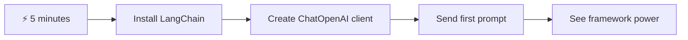
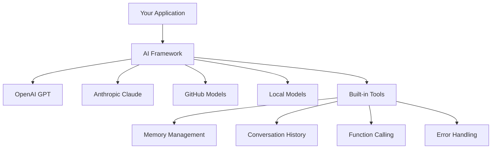
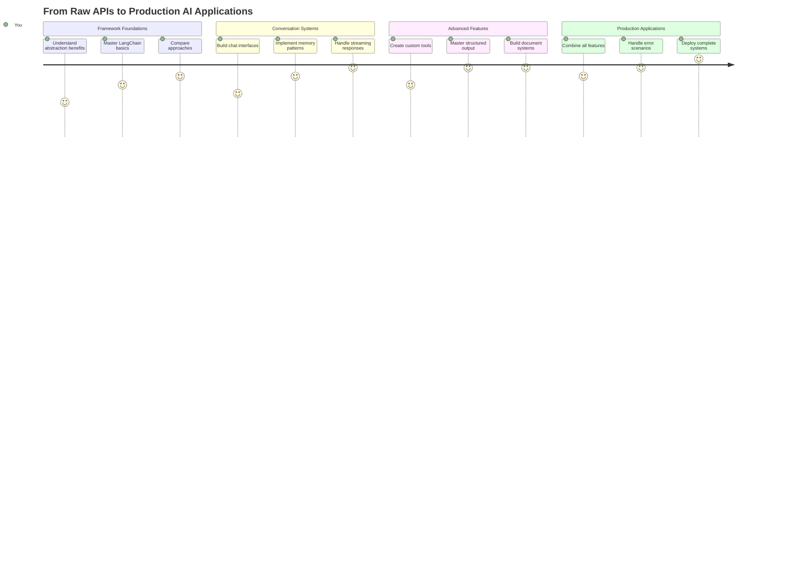
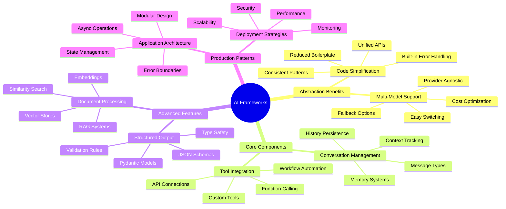
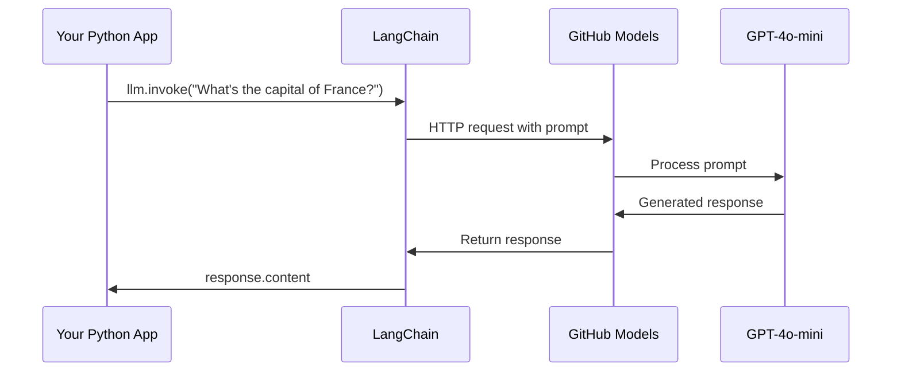
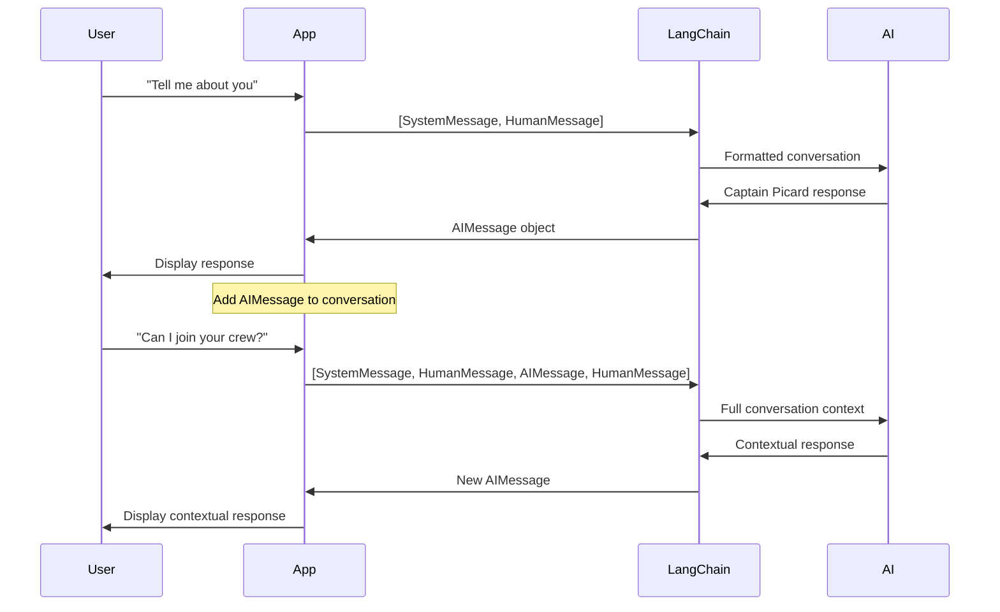
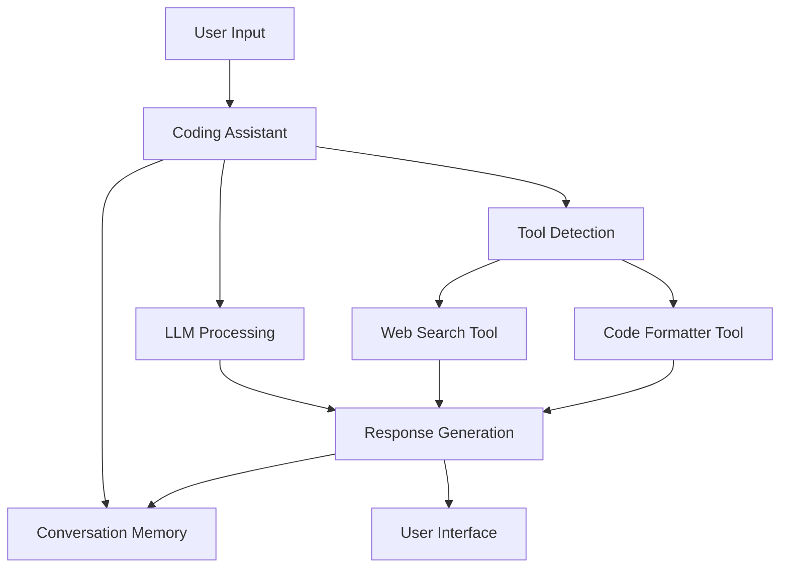
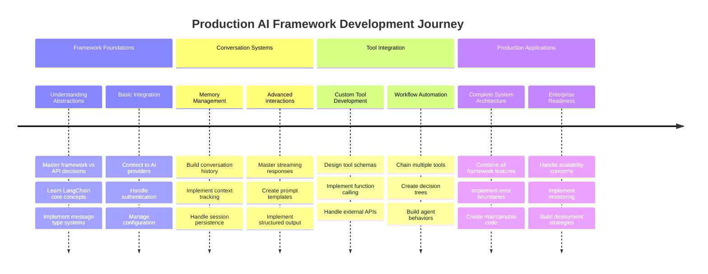
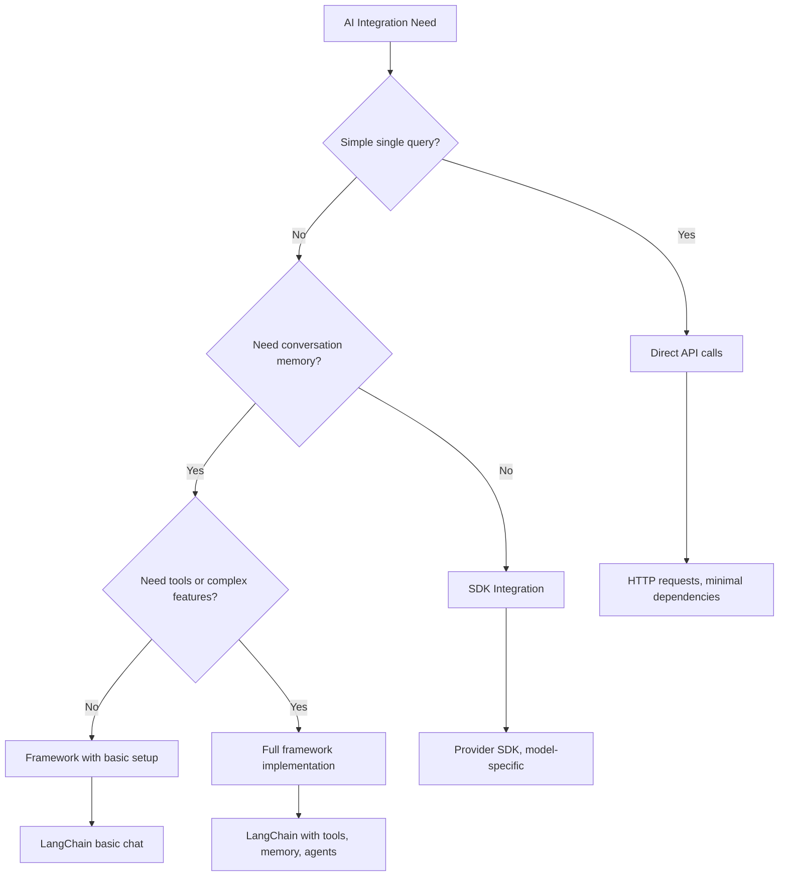

<!--
CO_OP_TRANSLATOR_METADATA:
{
  "original_hash": "3925b6a1c31c60755eaae4d578232c25",
  "translation_date": "2025-11-04T00:51:12+00:00",
  "source_file": "10-ai-framework-project/README.md",
  "language_code": "tr"
}
-->
# AI Çerçevesi

Hiç sıfırdan yapay zeka uygulamaları oluşturmakta zorlandınız mı? Yalnız değilsiniz! Yapay zeka çerçeveleri, yapay zeka geliştirme için bir İsviçre çakısı gibidir - akıllı uygulamalar oluştururken zaman ve sıkıntıdan tasarruf etmenizi sağlayan güçlü araçlardır. Bir yapay zeka çerçevesini iyi organize edilmiş bir kütüphane gibi düşünün: önceden oluşturulmuş bileşenler, standartlaştırılmış API'ler ve akıllı soyutlamalar sunar, böylece uygulama detaylarıyla uğraşmak yerine sorunları çözmeye odaklanabilirsiniz.

Bu derste, LangChain gibi çerçevelerin eskiden karmaşık olan yapay zeka entegrasyon görevlerini nasıl temiz ve okunabilir kodlara dönüştürebileceğini keşfedeceğiz. Gerçek dünya zorluklarıyla başa çıkmayı, konuşmaları takip etmeyi, araç çağırmayı uygulamayı ve farklı yapay zeka modellerini tek bir birleşik arayüzle yönetmeyi öğreneceksiniz.

Dersin sonunda, ham API çağrıları yerine ne zaman çerçeveleri kullanmanız gerektiğini, soyutlamaları nasıl etkili bir şekilde kullanacağınızı ve gerçek dünya kullanımı için hazır yapay zeka uygulamaları nasıl oluşturacağınızı öğreneceksiniz. Hadi, yapay zeka çerçevelerinin projeleriniz için neler yapabileceğini keşfedelim.

## ⚡ Sonraki 5 Dakikada Yapabilecekleriniz

**Yoğun Geliştiriciler için Hızlı Başlangıç Yolu**



- **1. Dakika**: LangChain'i yükleyin: `pip install langchain langchain-openai`
- **2. Dakika**: GitHub tokeninizi ayarlayın ve ChatOpenAI istemcisini içe aktarın
- **3. Dakika**: Sistem ve insan mesajlarıyla basit bir konuşma oluşturun
- **4. Dakika**: Temel bir araç ekleyin (örneğin, toplama fonksiyonu) ve yapay zeka araç çağırmayı deneyimleyin
- **5. Dakika**: Ham API çağrıları ile çerçeve soyutlaması arasındaki farkı deneyimleyin

**Hızlı Test Kodu**:
```python
from langchain_openai import ChatOpenAI
from langchain_core.messages import SystemMessage, HumanMessage

llm = ChatOpenAI(
    api_key=os.environ["GITHUB_TOKEN"],
    base_url="https://models.github.ai/inference",
    model="openai/gpt-4o-mini"
)

response = llm.invoke([
    SystemMessage(content="You are a helpful coding assistant"),
    HumanMessage(content="Explain Python functions briefly")
])
print(response.content)
```

**Neden Önemli**: 5 dakika içinde, yapay zeka çerçevelerinin karmaşık yapay zeka entegrasyonunu basit yöntem çağrılarına nasıl dönüştürdüğünü deneyimleyeceksiniz. Bu, üretim yapay zeka uygulamalarını güçlendiren temel bir adımdır.

## Neden bir çerçeve seçmelisiniz?

Yapay zeka uygulaması oluşturmaya hazırsınız - harika! Ama işte mesele: birkaç farklı yol seçebilirsiniz ve her birinin kendi avantajları ve dezavantajları vardır. Bu, bir yere gitmek için yürümek, bisiklete binmek veya araba kullanmak arasında seçim yapmak gibidir - hepsi sizi oraya götürür, ancak deneyim (ve çaba) tamamen farklı olacaktır.

Yapay zekayı projelerinize entegre etmenin üç ana yolunu inceleyelim:

| Yaklaşım | Avantajlar | En İyi Kullanım Alanı | Dikkat Edilmesi Gerekenler |
|----------|------------|-----------------------|---------------------------|
| **Doğrudan HTTP İstekleri** | Tam kontrol, bağımlılık yok | Basit sorgular, temel öğrenme | Daha fazla kod, manuel hata yönetimi |
| **SDK Entegrasyonu** | Daha az kod tekrarı, modele özgü optimizasyon | Tek model uygulamaları | Belirli sağlayıcılarla sınırlı |
| **Yapay Zeka Çerçeveleri** | Birleşik API, yerleşik soyutlamalar | Çoklu model uygulamaları, karmaşık iş akışları | Öğrenme eğrisi, potansiyel aşırı soyutlama |

### Çerçeve Faydaları Pratikte



**Çerçeveler neden önemlidir:**
- **Birleştirir** birden fazla yapay zeka sağlayıcısını tek bir arayüz altında
- **Otomatik olarak yönetir** konuşma hafızasını
- **Hazır araçlar sağlar** gömme ve fonksiyon çağırma gibi yaygın görevler için
- **Hata yönetimi ve yeniden deneme mantığını** düzenler
- **Karmaşık iş akışlarını** okunabilir yöntem çağrılarına dönüştürür

> 💡 **Profesyonel İpucu**: Farklı yapay zeka modelleri arasında geçiş yaparken veya ajanlar, hafıza veya araç çağırma gibi karmaşık özellikler oluştururken çerçeveleri kullanın. Temel bilgileri öğrenirken veya basit, odaklanmış uygulamalar oluştururken doğrudan API'lerle çalışın.

**Sonuç**: Bir zanaatkarın özel araçları ile tam bir atölye arasında seçim yapmak gibi, araçları göreve uygun şekilde eşleştirmekle ilgilidir. Çerçeveler karmaşık, özellik açısından zengin uygulamalar için mükemmeldir, doğrudan API'ler ise basit kullanım durumları için iyi çalışır.

## 🗺️ Yapay Zeka Çerçeve Ustalığı Yolculuğunuz



**Yolculuğunuzun Hedefi**: Bu dersin sonunda, yapay zeka çerçeve geliştirme konusunda ustalaşmış olacak ve ticari yapay zeka asistanlarıyla yarışabilecek sofistike, üretime hazır yapay zeka uygulamaları oluşturabileceksiniz.

## Giriş

Bu derste şunları öğreneceğiz:

- Yaygın bir yapay zeka çerçevesi kullanmak.
- Sohbet konuşmaları, araç kullanımı, hafıza ve bağlam gibi yaygın sorunları ele almak.
- Bunları yapay zeka uygulamaları oluşturmak için kullanmak.

## 🧠 Yapay Zeka Çerçeve Geliştirme Ekosistemi



**Temel İlke**: Yapay zeka çerçeveleri, konuşma yönetimi, araç entegrasyonu ve belge işleme için güçlü soyutlamalar sağlayarak karmaşıklığı soyutlar ve geliştiricilerin temiz, sürdürülebilir kodlarla sofistike yapay zeka uygulamaları oluşturmasını sağlar.

## İlk yapay zeka isteminiz

Bir soru gönderip yanıt alacağınız ilk yapay zeka uygulamanızı oluşturarak temellerle başlayalım. Arşimet'in banyosunda yer değiştirme prensibini keşfetmesi gibi, bazen en basit gözlemler en güçlü içgörülere yol açar - ve çerçeveler bu içgörüleri erişilebilir hale getirir.

### GitHub Modelleri ile LangChain Kurulumu

LangChain'i GitHub Modellerine bağlamak için kullanacağız, bu oldukça harika çünkü çeşitli yapay zeka modellerine ücretsiz erişim sağlıyor. En iyi kısmı? Başlamak için sadece birkaç basit yapılandırma parametresine ihtiyacınız var:

```python
from langchain_openai import ChatOpenAI
import os

llm = ChatOpenAI(
    api_key=os.environ["GITHUB_TOKEN"],
    base_url="https://models.github.ai/inference",
    model="openai/gpt-4o-mini",
)

# Send a simple prompt
response = llm.invoke("What's the capital of France?")
print(response.content)
```

**Burada neler oluyor:**
- **LangChain istemcisi oluşturur** `ChatOpenAI` sınıfını kullanarak - bu sizin yapay zekaya açılan kapınız!
- **GitHub Modellerine bağlantıyı yapılandırır** kimlik doğrulama tokeninizle
- **Hangi yapay zeka modelini kullanacağınızı belirtir** (`gpt-4o-mini`) - bunu yapay zeka asistanınızı seçmek gibi düşünün
- **Sorunuzu gönderir** `invoke()` yöntemiyle - işte sihir burada gerçekleşiyor
- **Yanıtı çıkarır ve görüntüler** - ve voilà, yapay zeka ile sohbet ediyorsunuz!

> 🔧 **Kurulum Notu**: GitHub Codespaces kullanıyorsanız şanslısınız - `GITHUB_TOKEN` zaten ayarlanmış! Yerel olarak çalışıyorsanız endişelenmeyin, sadece doğru izinlere sahip bir kişisel erişim tokeni oluşturmanız gerekecek.

**Beklenen çıktı:**
```text
The capital of France is Paris.
```



## Konuşma yapay zekası oluşturma

İlk örnek temel bilgileri gösteriyor, ancak bu sadece tek bir alışveriş - bir soru soruyorsunuz, bir yanıt alıyorsunuz ve hepsi bu. Gerçek uygulamalarda, yapay zekanızın ne hakkında konuştuğunuzu hatırlamasını istersiniz, tıpkı Watson ve Holmes'un zamanla araştırma konuşmalarını inşa ettiği gibi.

İşte LangChain'in özellikle kullanışlı olduğu yer. Farklı mesaj türleri sağlar, bu da konuşmaları yapılandırmaya ve yapay zekanıza bir kişilik vermenize yardımcı olur. Bağlamı ve karakteri koruyan sohbet deneyimleri oluşturacaksınız.

### Mesaj türlerini anlama

Bu mesaj türlerini bir konuşmada katılımcıların taktığı farklı "şapkalar" olarak düşünün. LangChain, kimin ne söylediğini takip etmek için farklı mesaj sınıfları kullanır:

| Mesaj Türü | Amaç | Örnek Kullanım Durumu |
|------------|------|-----------------------|
| `SystemMessage` | Yapay zekanın kişiliğini ve davranışını tanımlar | "Sen yardımcı bir kodlama asistanısın" |
| `HumanMessage` | Kullanıcı girdisini temsil eder | "Fonksiyonların nasıl çalıştığını açıkla" |
| `AIMessage` | Yapay zekanın yanıtlarını saklar | Konuşmadaki önceki yapay zeka yanıtları |

### İlk konuşmanızı oluşturma

Yapay zekamızın belirli bir rol üstlendiği bir konuşma oluşturalım. Onu diplomatik bilgelik ve liderlik ile tanınan bir karakter olan Kaptan Picard olarak canlandıracağız:

```python
messages = [
    SystemMessage(content="You are Captain Picard of the Starship Enterprise"),
    HumanMessage(content="Tell me about you"),
]
```

**Bu konuşma kurulumunu açıklama:**
- **Yapay zekanın rolünü ve kişiliğini oluşturur** `SystemMessage` aracılığıyla
- **İlk kullanıcı sorgusunu sağlar** `HumanMessage` ile
- **Çoklu dönüşlü konuşma için bir temel oluşturur**

Bu örneğin tam kodu şu şekilde görünür:

```python
from langchain_core.messages import HumanMessage, SystemMessage
from langchain_openai import ChatOpenAI
import os

llm = ChatOpenAI(
    api_key=os.environ["GITHUB_TOKEN"],
    base_url="https://models.github.ai/inference",
    model="openai/gpt-4o-mini",
)

messages = [
    SystemMessage(content="You are Captain Picard of the Starship Enterprise"),
    HumanMessage(content="Tell me about you"),
]


# works
response  = llm.invoke(messages)
print(response.content)
```

Şuna benzer bir sonuç görmelisiniz:

```text
I am Captain Jean-Luc Picard, the commanding officer of the USS Enterprise (NCC-1701-D), a starship in the United Federation of Planets. My primary mission is to explore new worlds, seek out new life and new civilizations, and boldly go where no one has gone before. 

I believe in the importance of diplomacy, reason, and the pursuit of knowledge. My crew is diverse and skilled, and we often face challenges that test our resolve, ethics, and ingenuity. Throughout my career, I have encountered numerous species, grappled with complex moral dilemmas, and have consistently sought peaceful solutions to conflicts.

I hold the ideals of the Federation close to my heart, believing in the importance of cooperation, understanding, and respect for all sentient beings. My experiences have shaped my leadership style, and I strive to be a thoughtful and just captain. How may I assist you further?
```

Konuşma sürekliliğini korumak için (her seferinde bağlamı sıfırlamak yerine), yanıtları mesaj listenize eklemeye devam etmeniz gerekir. Nesiller boyunca hikayeleri koruyan sözlü gelenekler gibi, bu yaklaşım kalıcı bir hafıza oluşturur:

```python
from langchain_core.messages import HumanMessage, SystemMessage
from langchain_openai import ChatOpenAI
import os

llm = ChatOpenAI(
    api_key=os.environ["GITHUB_TOKEN"],
    base_url="https://models.github.ai/inference",
    model="openai/gpt-4o-mini",
)

messages = [
    SystemMessage(content="You are Captain Picard of the Starship Enterprise"),
    HumanMessage(content="Tell me about you"),
]


# works
response  = llm.invoke(messages)

print(response.content)

print("---- Next ----")

messages.append(response)
messages.append(HumanMessage(content="Now that I know about you, I'm Chris, can I be in your crew?"))

response  = llm.invoke(messages)

print(response.content)

```

Oldukça güzel, değil mi? Burada olan şey, LLM'yi iki kez çağırmamız - önce sadece ilk iki mesajımızla, sonra tam konuşma geçmişiyle. Bu, yapay zekanın aslında sohbetimizi takip ediyormuş gibi davranmasını sağlıyor!

Bu kodu çalıştırdığınızda, şuna benzer bir ikinci yanıt alırsınız:

```text
Welcome aboard, Chris! It's always a pleasure to meet those who share a passion for exploration and discovery. While I cannot formally offer you a position on the Enterprise right now, I encourage you to pursue your aspirations. We are always in need of talented individuals with diverse skills and backgrounds. 

If you are interested in space exploration, consider education and training in the sciences, engineering, or diplomacy. The values of curiosity, resilience, and teamwork are crucial in Starfleet. Should you ever find yourself on a starship, remember to uphold the principles of the Federation: peace, understanding, and respect for all beings. Your journey can lead you to remarkable adventures, whether in the stars or on the ground. Engage!
```



Bunu bir "belki" olarak alıyorum ;)

## Akış yanıtları

Hiç ChatGPT'nin yanıtlarını gerçek zamanlı olarak "yazdığını" fark ettiniz mi? İşte bu, akışın iş başında olduğu an. Bir yetenekli hattatın çalışmasını izlemek gibi - karakterlerin bir anda ortaya çıkması yerine vuruş vuruş belirmesi - akış, etkileşimi daha doğal hissettirir ve anında geri bildirim sağlar.

### LangChain ile akışı uygulama

```python
from langchain_openai import ChatOpenAI
import os

llm = ChatOpenAI(
    api_key=os.environ["GITHUB_TOKEN"],
    base_url="https://models.github.ai/inference",
    model="openai/gpt-4o-mini",
    streaming=True
)

# Stream the response
for chunk in llm.stream("Write a short story about a robot learning to code"):
    print(chunk.content, end="", flush=True)
```

**Akış neden harika:**
- **İçeriği** oluşturulurken gösterir - artık garip beklemeler yok!
- **Kullanıcıların** bir şeylerin gerçekten olduğunu hissetmesini sağlar
- **Daha hızlı hissedilir**, teknik olarak öyle olmasa bile
- **Kullanıcıların** yapay zeka hala "düşünürken" okumaya başlamasına izin verir

> 💡 **Kullanıcı Deneyimi İpucu**: Akış, kod açıklamaları, yaratıcı yazılar veya ayrıntılı eğitimler gibi daha uzun yanıtlarla uğraşırken gerçekten parlıyor. Kullanıcılarınız boş bir ekrana bakmak yerine ilerlemeyi görmeyi sevecek!

### 🎯 Pedagojik Kontrol: Çerçeve Soyutlama Faydaları

**Dur ve Düşün**: Yapay zeka çerçeve soyutlamalarının gücünü yeni deneyimlediniz. Öğrendiklerinizi önceki derslerden ham API çağrılarıyla karşılaştırın.

**Hızlı Öz Değerlendirme**:
- LangChain'in manuel mesaj takibine kıyasla konuşma yönetimini nasıl basitleştirdiğini açıklayabilir misiniz?
- `invoke()` ve `stream()` yöntemleri arasındaki fark nedir ve her birini ne zaman kullanırsınız?
- Çerçevenin mesaj türü sistemi kod organizasyonunu nasıl geliştirir?

**Gerçek Dünya Bağlantısı**: Öğrendiğiniz soyutlama modelleri (mesaj türleri, akış arayüzleri, konuşma hafızası) her büyük yapay zeka uygulamasında kullanılır - ChatGPT'nin arayüzünden GitHub Copilot'un kod yardımlarına kadar. Profesyonel yapay zeka geliştirme ekipleri tarafından kullanılan aynı mimari modellerde ustalaşıyorsunuz.

**Zorluk Sorusu**: Farklı yapay zeka model sağlayıcılarını (OpenAI, Anthropic, Google) tek bir arayüzle yönetmek için bir çerçeve soyutlamasını nasıl tasarlardınız? Faydaları ve dezavantajlarını düşünün.

## İstem şablonları

İstem şablonları, klasik hitabet sanatında kullanılan retorik yapılar gibi çalışır - Cicero'nun farklı dinleyicilere hitap ederken aynı ikna edici çerçeveyi koruyarak konuşma kalıplarını nasıl uyarladığını düşünün. Yeniden yazmadan farklı bilgi parçalarını değiştirebileceğiniz yeniden kullanılabilir istemler oluşturmanıza olanak tanır. Şablonu bir kez ayarladıktan sonra, sadece değişkenleri ihtiyacınız olan değerlerle doldurursunuz.

### Yeniden kullanılabilir istemler oluşturma

```python
from langchain_core.prompts import ChatPromptTemplate

# Define a template for code explanations
template = ChatPromptTemplate.from_messages([
    ("system", "You are an expert programming instructor. Explain concepts clearly with examples."),
    ("human", "Explain {concept} in {language} with a practical example for {skill_level} developers")
])

# Use the template with different values
questions = [
    {"concept": "functions", "language": "JavaScript", "skill_level": "beginner"},
    {"concept": "classes", "language": "Python", "skill_level": "intermediate"},
    {"concept": "async/await", "language": "JavaScript", "skill_level": "advanced"}
]

for question in questions:
    prompt = template.format_messages(**question)
    response = llm.invoke(prompt)
    print(f"Topic: {question['concept']}\n{response.content}\n---\n")
```

**Şablonları kullanmayı neden seveceksiniz:**
- **İstemlerinizi** uygulamanızın tamamında tutarlı tutar
- **Artık** karmaşık dize birleştirme yok - sadece temiz, basit değişkenler
- **Yapay zekanız** öngörülebilir davranır çünkü yapı aynı kalır
- **Güncellemeler** çok kolay - şablonu bir kez değiştirin ve her yerde düzelir

## Yapılandırılmış çıktı

Yapay zeka yanıtlarının yapılandırılmamış metin olarak gelmesiyle uğraşmaktan hiç bıktınız mı? Yapılandırılmış çıktı, yapay zekanıza Linnaeus'un biyolojik sınıflandırma için kullandığı sistematik yaklaşımı öğretmek gibidir - organize, öngörülebilir ve çalışması kolay. JSON, belirli veri yapıları veya ihtiyacınız olan herhangi bir formatı talep edebilirsiniz.

### Çıktı şemalarını tanımlama

```python
from langchain_core.prompts import ChatPromptTemplate
from langchain_core.output_parsers import JsonOutputParser
from pydantic import BaseModel, Field

class CodeReview(BaseModel):
    score: int = Field(description="Code quality score from 1-10")
    strengths: list[str] = Field(description="List of code strengths")
    improvements: list[str] = Field(description="List of suggested improvements")
    overall_feedback: str = Field(description="Summary feedback")

# Set up the parser
parser = JsonOutputParser(pydantic_object=CodeReview)

# Create prompt with format instructions
prompt = ChatPromptTemplate.from_messages([
    ("system", "You are a code reviewer. {format_instructions}"),
    ("human", "Review this code: {code}")
])

# Format the prompt with instructions
chain = prompt | llm | parser

# Get structured response
code_sample = """
def calculate_average(numbers):
    return sum(numbers) / len(numbers)
"""

result = chain.invoke({
    "code": code_sample,
    "format_instructions": parser.get_format_instructions()
})

print(f"Score: {result['score']}")
print(f"Strengths: {', '.join(result['strengths'])}")
```

**Yapılandırılmış çıktı neden oyunun kurallarını değiştirir:**
- **Artık** hangi formatı alacağınızı tahmin etmek yok - her zaman tutarlı
- **Veritabanlarınıza ve API'lerinize** ekstra iş olmadan doğrudan bağlanır
- **Garip yapay zeka yanıtlarını** uygulamanızı bozmadan önce yakalar
- **Kodunuzu** daha temiz hale getirir çünkü tam olarak neyle çalıştığınızı bilirsiniz

## Araç çağırma

Şimdi en güçlü özelliklerden birine ulaşıyoruz: araçlar. Bu, yapay zekanıza konuşmanın ötesinde pratik yetenekler kazandırmanın yoludur. Ortaçağ loncalarının belirli zanaatlar için özel araçlar geliştirdiği gibi, yapay zekanızı odaklanmış enstrümanlarla donatabilirsiniz. Hangi araçların mevcut olduğunu açıklarsınız ve biri buna uygun bir şey talep ettiğinde, yapay zekanız harekete geçebilir.

### Python Kullanımı

Şöyle araçlar ekleyelim:

```python
from typing_extensions import Annotated, TypedDict

class add(TypedDict):
    """Add two integers."""

    # Annotations must have the type and can optionally include a default value and description (in that order).
    a: Annotated[int, ..., "First integer"]
    b: Annotated[int, ..., "Second integer"]

tools = [add]

functions = {
    "add": lambda a, b: a + b
}
```

Burada neler oluyor? `add` adlı bir araç için bir taslak oluşturuyoruz. `TypedDict`'ten türeyerek ve `a` ve `b` için bu şık `Annotated` türlerini kullanarak, LLM'ye bu aracın ne yaptığını ve neye ihtiyacı olduğunu net bir şekilde gösteriyoruz. `functions` sözlüğü, araç kutumuz gibi - yapay zeka belirli bir aracı kullanmaya karar verdiğinde kodumuza tam olarak ne yapması gerektiğini söylüyor.

Şimdi bu aracı nasıl çağıracağımıza bakalım:

```python
llm = ChatOpenAI(
    api_key=os.environ["GITHUB_TOKEN"],
    base_url="https://models.github.ai/inference",
    model="openai/gpt-4o-mini",
)

llm_with_tools = llm.bind_tools(tools)
```

Burada `bind_tools`'u `tools` dizimizle çağırıyoruz ve böylece LLM `llm_with_tools` artık bu aracı biliyor.

Bu yeni LLM'yi kullanmak için şu kodu yazabiliriz:

```python
query = "What is 3 + 12?"

res = llm_with_tools.invoke(query)
if(res.tool_calls):
    for tool in res.tool_calls:
        print("TOOL CALL: ", functions[tool["name"]](../../../10-ai-framework-project/**tool["args"]))
print("CONTENT: ",res.content)
```

Artık araçlara sahip olan bu yeni LLM'de `invoke` çağrısı yaptığımızda, `tool_calls` özelliği dolu olabilir. Eğer öyleyse, tanımlanan araçların bir `name` ve `args` özelliği vardır, bu da hangi aracın çağrılması gerektiğini ve hangi argümanlarla çağrılacağını belirtir. Tam kod şu şekilde görünür:

```python
from langchain_core.messages import HumanMessage, SystemMessage
from langchain_openai import ChatOpenAI
import os
from typing_extensions import Annotated, TypedDict

class add(TypedDict):
    """Add two integers."""

    # Annotations must have the type and can optionally include a default value and description (in that order).
    a: Annotated[int, ..., "First integer"]
    b: Annotated[int, ..., "Second integer"]

tools = [add]

functions = {
    "add": lambda a, b: a + b
}

llm = ChatOpenAI(
    api_key=os.environ["GITHUB_TOKEN"],
    base_url="https://models.github.ai/inference",
    model="openai/gpt-4o-mini",
)

llm_with_tools = llm.bind_tools(tools)

query = "What is 3 + 12?"

res = llm_with_tools.invoke(query)
if(res.tool_calls):
    for tool in res.tool_calls:
        print("TOOL CALL: ", functions[tool["name"]](../../../10-ai-framework-project/**tool["args"]))
print("CONTENT: ",res.content)
```

Bu kodu çalıştırdığınızda, şuna benzer bir çıktı görmelisiniz:

```text
TOOL CALL:  15
CONTENT: 
```

Yapay zeka "3 + 12 nedir" sorusunu inceledi ve bunu `add` aracı için bir görev olarak tanımladı. Tıpkı yetenekli bir kütüphanecinin sorulan sorunun türüne göre hangi referansı kullanacağını bilmesi gibi, bu kararı aracın adı, açıklaması
Sayıları toplamak kavramı gösterir, ancak gerçek araçlar genellikle web API'lerini çağırmak gibi daha karmaşık işlemler gerçekleştirir. Örneğimizi genişletelim ve AI'nın internetten içerik almasını sağlayalım - tıpkı telgraf operatörlerinin bir zamanlar uzak yerleri birbirine bağlaması gibi:

```python
class joke(TypedDict):
    """Tell a joke."""

    # Annotations must have the type and can optionally include a default value and description (in that order).
    category: Annotated[str, ..., "The joke category"]

def get_joke(category: str) -> str:
    response = requests.get(f"https://api.chucknorris.io/jokes/random?category={category}", headers={"Accept": "application/json"})
    if response.status_code == 200:
        return response.json().get("value", f"Here's a {category} joke!")
    return f"Here's a {category} joke!"

functions = {
    "add": lambda a, b: a + b,
    "joke": lambda category: get_joke(category)
}

query = "Tell me a joke about animals"

# the rest of the code is the same
```

Şimdi bu kodu çalıştırırsanız, aşağıdaki gibi bir yanıt alırsınız:

```text
TOOL CALL:  Chuck Norris once rode a nine foot grizzly bear through an automatic car wash, instead of taking a shower.
CONTENT:  
```

```mermaid
flowchart TD
    A[User Query: "Tell me a joke about animals"] --> B[LangChain Analysis]
    B --> C{Tool Available?}
    C -->|Yes| D[Select joke tool]
    C -->|No| E[Generate direct response]
    
    D --> F[Extract Parameters]
    F --> G[Call joke(category="animals")]
    G --> H[API Request to chucknorris.io]
    H --> I[Return joke content]
    I --> J[Display to user]
    
    E --> K[AI-generated response]
    K --> J
    
    subgraph "Tool Definition Layer"
        L[TypedDict Schema]
        M[Function Implementation]
        N[Parameter Validation]
    end
    
    D --> L
    F --> N
    G --> M
```

İşte kodun tamamı:

```python
from langchain_openai import ChatOpenAI
import requests
import os
from typing_extensions import Annotated, TypedDict

class add(TypedDict):
    """Add two integers."""

    # Annotations must have the type and can optionally include a default value and description (in that order).
    a: Annotated[int, ..., "First integer"]
    b: Annotated[int, ..., "Second integer"]

class joke(TypedDict):
    """Tell a joke."""

    # Annotations must have the type and can optionally include a default value and description (in that order).
    category: Annotated[str, ..., "The joke category"]

tools = [add, joke]

def get_joke(category: str) -> str:
    response = requests.get(f"https://api.chucknorris.io/jokes/random?category={category}", headers={"Accept": "application/json"})
    if response.status_code == 200:
        return response.json().get("value", f"Here's a {category} joke!")
    return f"Here's a {category} joke!"

functions = {
    "add": lambda a, b: a + b,
    "joke": lambda category: get_joke(category)
}

llm = ChatOpenAI(
    api_key=os.environ["GITHUB_TOKEN"],
    base_url="https://models.github.ai/inference",
    model="openai/gpt-4o-mini",
)

llm_with_tools = llm.bind_tools(tools)

query = "Tell me a joke about animals"

res = llm_with_tools.invoke(query)
if(res.tool_calls):
    for tool in res.tool_calls:
        # print("TOOL CALL: ", tool)
        print("TOOL CALL: ", functions[tool["name"]](../../../10-ai-framework-project/**tool["args"]))
print("CONTENT: ",res.content)
```

## Gömülü Temsiller ve Belge İşleme

Gömülü temsiller, modern AI'deki en zarif çözümlerden birini temsil eder. Herhangi bir metni alıp anlamını yakalayan sayısal koordinatlara dönüştürebileceğinizi hayal edin. İşte gömülü temsiller tam olarak bunu yapar - metni çok boyutlu bir uzayda benzer kavramların bir araya toplandığı noktalara dönüştürür. Bu, fikirler için bir koordinat sistemi oluşturmak gibidir; tıpkı Mendeleev'in periyodik tabloyu atomik özelliklere göre düzenlemesi gibi.

### Gömülü Temsiller Oluşturma ve Kullanma

```python
from langchain_openai import OpenAIEmbeddings
from langchain_community.vectorstores import FAISS
from langchain_community.document_loaders import TextLoader
from langchain.text_splitter import CharacterTextSplitter

# Initialize embeddings
embeddings = OpenAIEmbeddings(
    api_key=os.environ["GITHUB_TOKEN"],
    base_url="https://models.github.ai/inference",
    model="text-embedding-3-small"
)

# Load and split documents
loader = TextLoader("documentation.txt")
documents = loader.load()

text_splitter = CharacterTextSplitter(chunk_size=1000, chunk_overlap=0)
texts = text_splitter.split_documents(documents)

# Create vector store
vectorstore = FAISS.from_documents(texts, embeddings)

# Perform similarity search
query = "How do I handle user authentication?"
similar_docs = vectorstore.similarity_search(query, k=3)

for doc in similar_docs:
    print(f"Relevant content: {doc.page_content[:200]}...")
```

### Çeşitli Formatlar için Belge Yükleyiciler

```python
from langchain_community.document_loaders import (
    PyPDFLoader,
    CSVLoader,
    JSONLoader,
    WebBaseLoader
)

# Load different document types
pdf_loader = PyPDFLoader("manual.pdf")
csv_loader = CSVLoader("data.csv")
json_loader = JSONLoader("config.json")
web_loader = WebBaseLoader("https://example.com/docs")

# Process all documents
all_documents = []
for loader in [pdf_loader, csv_loader, json_loader, web_loader]:
    docs = loader.load()
    all_documents.extend(docs)
```

**Gömülü temsillerle yapabilecekleriniz:**
- **Arama** oluşturun: Sadece anahtar kelime eşleştirme değil, gerçekten ne demek istediğinizi anlayan bir arama
- **AI oluşturun**: Belgeleriniz hakkında soruları yanıtlayabilen bir yapay zeka
- **Öneri sistemleri yapın**: Gerçekten alakalı içerik öneren sistemler
- **Otomatik olarak** içeriğinizi düzenleyin ve kategorilere ayırın

```mermaid
flowchart LR
    A[Documents] --> B[Text Splitter]
    B --> C[Create Embeddings]
    C --> D[Vector Store]
    
    E[User Query] --> F[Query Embedding]
    F --> G[Similarity Search]
    G --> D
    D --> H[Relevant Documents]
    H --> I[AI Response]
    
    subgraph "Vector Space"
        J[Document A: [0.1, 0.8, 0.3...]]
        K[Document B: [0.2, 0.7, 0.4...]]
        L[Query: [0.15, 0.75, 0.35...]]
    end
    
    C --> J
    C --> K
    F --> L
    G --> J
    G --> K
```

## Tam Bir AI Uygulaması Oluşturma

Şimdi öğrendiklerinizi kapsamlı bir uygulamaya entegre edeceğiz - soruları yanıtlayabilen, araçları kullanabilen ve konuşma hafızasını koruyabilen bir kodlama asistanı. Tıpkı matbaanın mevcut teknolojileri (hareketli harfler, mürekkep, kağıt ve baskı) birleştirerek dönüştürücü bir şey yaratması gibi, AI bileşenlerimizi pratik ve kullanışlı bir şeye dönüştüreceğiz.

### Tam Uygulama Örneği

```python
from langchain_openai import ChatOpenAI, OpenAIEmbeddings
from langchain_core.prompts import ChatPromptTemplate
from langchain_core.messages import HumanMessage, SystemMessage, AIMessage
from langchain_community.vectorstores import FAISS
from typing_extensions import Annotated, TypedDict
import os
import requests

class CodingAssistant:
    def __init__(self):
        self.llm = ChatOpenAI(
            api_key=os.environ["GITHUB_TOKEN"],
            base_url="https://models.github.ai/inference",
            model="openai/gpt-4o-mini"
        )
        
        self.conversation_history = [
            SystemMessage(content="""You are an expert coding assistant. 
            Help users learn programming concepts, debug code, and write better software.
            Use tools when needed and maintain a helpful, encouraging tone.""")
        ]
        
        # Define tools
        self.setup_tools()
    
    def setup_tools(self):
        class web_search(TypedDict):
            """Search for programming documentation or examples."""
            query: Annotated[str, "Search query for programming help"]
        
        class code_formatter(TypedDict):
            """Format and validate code snippets."""
            code: Annotated[str, "Code to format"]
            language: Annotated[str, "Programming language"]
        
        self.tools = [web_search, code_formatter]
        self.llm_with_tools = self.llm.bind_tools(self.tools)
    
    def chat(self, user_input: str):
        # Add user message to conversation
        self.conversation_history.append(HumanMessage(content=user_input))
        
        # Get AI response
        response = self.llm_with_tools.invoke(self.conversation_history)
        
        # Handle tool calls if any
        if response.tool_calls:
            for tool_call in response.tool_calls:
                tool_result = self.execute_tool(tool_call)
                print(f"🔧 Tool used: {tool_call['name']}")
                print(f"📊 Result: {tool_result}")
        
        # Add AI response to conversation
        self.conversation_history.append(response)
        
        return response.content
    
    def execute_tool(self, tool_call):
        tool_name = tool_call['name']
        args = tool_call['args']
        
        if tool_name == 'web_search':
            return f"Found documentation for: {args['query']}"
        elif tool_name == 'code_formatter':
            return f"Formatted {args['language']} code: {args['code'][:50]}..."
        
        return "Tool execution completed"

# Usage example
assistant = CodingAssistant()

print("🤖 Coding Assistant Ready! Type 'quit' to exit.\n")

while True:
    user_input = input("You: ")
    if user_input.lower() == 'quit':
        break
    
    response = assistant.chat(user_input)
    print(f"🤖 Assistant: {response}\n")
```

**Uygulama Mimarisi:**



**Uyguladığımız Temel Özellikler:**
- **Tüm konuşmanızı hatırlar**: Bağlam sürekliliği sağlar
- **Eylemleri gerçekleştirir**: Sadece konuşma değil, araç çağırma yoluyla
- **Tahmin edilebilir etkileşim kalıplarını takip eder**
- **Hata yönetimi ve karmaşık iş akışlarını otomatik olarak yönetir**

### 🎯 Pedagojik Kontrol Noktası: Üretim AI Mimarisi

**Mimari Anlayış**: Konuşma yönetimi, araç çağırma ve yapılandırılmış iş akışlarını birleştiren tam bir AI uygulaması oluşturdunuz. Bu, üretim seviyesinde AI uygulama geliştirmeyi temsil eder.

**Ustalaşılan Temel Kavramlar**:
- **Sınıf Tabanlı Mimari**: Düzenli, sürdürülebilir AI uygulama yapısı
- **Araç Entegrasyonu**: Konuşmanın ötesinde özel işlevsellik
- **Hafıza Yönetimi**: Kalıcı konuşma bağlamı
- **Hata Yönetimi**: Sağlam uygulama davranışı

**Endüstri Bağlantısı**: Uyguladığınız mimari kalıplar (konuşma sınıfları, araç sistemleri, hafıza yönetimi), Slack'in AI asistanı, GitHub Copilot ve Microsoft Copilot gibi kurumsal AI uygulamalarında kullanılan aynı kalıplardır. Profesyonel düzeyde mimari düşünceyle inşa ediyorsunuz.

**Düşünme Sorusu**: Bu uygulamayı birden fazla kullanıcıyı, kalıcı depolamayı veya harici veritabanlarıyla entegrasyonu nasıl ele alacak şekilde genişletirsiniz? Ölçeklenebilirlik ve durum yönetimi zorluklarını düşünün.

## Ödev: Kendi AI Destekli Çalışma Asistanınızı Oluşturun

**Amaç**: Öğrencilere programlama kavramlarını öğrenmelerine yardımcı olan, açıklamalar, kod örnekleri ve etkileşimli testler sağlayan bir AI uygulaması oluşturun.

### Gereksinimler

**Temel Özellikler (Zorunlu):**
1. **Konuşma Arayüzü**: Birden fazla soru boyunca bağlamı koruyan bir sohbet sistemi uygulayın
2. **Eğitim Araçları**: Öğrenmeye yardımcı olacak en az iki araç oluşturun:
   - Kod açıklama aracı
   - Kavram test oluşturucu
3. **Kişiselleştirilmiş Öğrenme**: Farklı beceri seviyelerine uyum sağlamak için sistem mesajlarını kullanın
4. **Yanıt Formatlama**: Test soruları için yapılandırılmış çıktı uygulayın

### Uygulama Adımları

**Adım 1: Ortamınızı Kurun**
```bash
pip install langchain langchain-openai
```

**Adım 2: Temel Sohbet İşlevselliği**
- `StudyAssistant` sınıfını oluşturun
- Konuşma hafızasını uygulayın
- Eğitim desteği için kişilik yapılandırması ekleyin

**Adım 3: Eğitim Araçları Ekleyin**
- **Kod Açıklayıcı**: Kodu anlaşılır parçalara ayırır
- **Test Oluşturucu**: Programlama kavramları hakkında sorular oluşturur
- **İlerleme Takipçisi**: Kapsanan konuları takip eder

**Adım 4: Gelişmiş Özellikler (Opsiyonel)**
- Daha iyi kullanıcı deneyimi için akış yanıtları uygulayın
- Ders materyallerini dahil etmek için belge yükleme ekleyin
- Benzerlik tabanlı içerik alımı için gömülü temsiller oluşturun

### Değerlendirme Kriterleri

| Özellik | Mükemmel (4) | İyi (3) | Tatmin Edici (2) | Geliştirme Gerekli (1) |
|---------|--------------|---------|------------------|------------------------|
| **Konuşma Akışı** | Doğal, bağlam farkında yanıtlar | İyi bağlam tutma | Temel konuşma | Değişimler arasında hafıza yok |
| **Araç Entegrasyonu** | Birden fazla faydalı araç sorunsuz çalışıyor | 2+ araç doğru şekilde uygulanmış | 1-2 temel araç | Araçlar işlevsel değil |
| **Kod Kalitesi** | Temiz, iyi belgelenmiş, hata yönetimi | İyi yapı, biraz belgeleme | Temel işlevsellik çalışıyor | Kötü yapı, hata yönetimi yok |
| **Eğitim Değeri** | Öğrenme için gerçekten yardımcı, uyarlanabilir | İyi öğrenme desteği | Temel açıklamalar | Sınırlı eğitim faydası |

### Örnek Kod Yapısı

```python
class StudyAssistant:
    def __init__(self, skill_level="beginner"):
        # Initialize LLM, tools, and conversation memory
        pass
    
    def explain_code(self, code, language):
        # Tool: Explain how code works
        pass
    
    def generate_quiz(self, topic, difficulty):
        # Tool: Create practice questions
        pass
    
    def chat(self, user_input):
        # Main conversation interface
        pass

# Example usage
assistant = StudyAssistant(skill_level="intermediate")
response = assistant.chat("Explain how Python functions work")
```

**Bonus Zorluklar:**
- Ses giriş/çıkış yetenekleri ekleyin
- Streamlit veya Flask kullanarak bir web arayüzü oluşturun
- Ders materyallerinden bir bilgi tabanı oluşturmak için gömülü temsiller ekleyin
- İlerleme takibi ve kişiselleştirilmiş öğrenme yolları ekleyin

## 📈 AI Çerçeve Geliştirme Ustalık Zaman Çizelgeniz



**🎓 Mezuniyet Dönüm Noktası**: LangChain kullanarak modern AI uygulamalarını güçlendiren aynı araçlar ve kalıplarla AI çerçeve geliştirmeyi başarıyla öğrendiniz. Bu beceriler, AI uygulama geliştirmede en son teknolojiyi temsil eder ve kurumsal düzeyde akıllı sistemler oluşturmak için sizi hazırlar.

**🔄 Bir Sonraki Seviye Yetkinlikler**:
- Gelişmiş AI mimarilerini (ajanlar, çoklu ajan sistemleri) keşfetmeye hazır
- Vektör veritabanlarıyla RAG sistemleri oluşturmaya hazır
- Çok modlu AI uygulamaları oluşturmaya hazır
- AI uygulama ölçeklendirme ve optimizasyon için temel oluşturuldu

## Özet

🎉 Artık AI çerçeve geliştirme temellerini öğrendiniz ve LangChain kullanarak sofistike AI uygulamaları oluşturmayı başardınız. Kapsamlı bir çıraklık tamamlamak gibi, önemli bir beceri seti kazandınız. Hadi başardıklarınızı gözden geçirelim.

### Neler Öğrendiniz

**Temel Çerçeve Kavramları:**
- **Çerçeve Faydaları**: Doğrudan API çağrıları yerine çerçeveleri ne zaman seçmeniz gerektiğini anlamak
- **LangChain Temelleri**: AI model bağlantılarını kurma ve yapılandırma
- **Mesaj Türleri**: Yapılandırılmış konuşmalar için `SystemMessage`, `HumanMessage` ve `AIMessage` kullanımı

**Gelişmiş Özellikler:**
- **Araç Çağırma**: Gelişmiş AI yetenekleri için özel araçlar oluşturma ve entegre etme
- **Konuşma Hafızası**: Birden fazla konuşma dönüşü boyunca bağlamı koruma
- **Akış Yanıtları**: Gerçek zamanlı yanıt teslimi uygulama
- **İpucu Şablonları**: Yeniden kullanılabilir, dinamik ipuçları oluşturma
- **Yapılandırılmış Çıktı**: Tutarlı, ayrıştırılabilir AI yanıtları sağlama
- **Gömülü Temsiller**: Anlamsal arama ve belge işleme yetenekleri oluşturma

**Pratik Uygulamalar:**
- **Tam Uygulamalar Oluşturma**: Birden fazla özelliği üretime hazır uygulamalara birleştirme
- **Hata Yönetimi**: Sağlam hata yönetimi ve doğrulama uygulama
- **Araç Entegrasyonu**: AI yeteneklerini genişleten özel araçlar oluşturma

### Önemli Çıkarımlar

> 🎯 **Unutmayın**: LangChain gibi AI çerçeveleri, karmaşıklığı gizleyen, özelliklerle dolu en iyi arkadaşlarınızdır. Konuşma hafızasına, araç çağırmaya veya birden fazla AI modeliyle çalışmaya ihtiyacınız olduğunda mükemmeldir.

**AI Entegrasyonu için Karar Çerçevesi:**



### Buradan Nereye Gidilir?

**Hemen inşa etmeye başlayın:**
- Bu kavramları alın ve sizi heyecanlandıran bir şey inşa edin!
- LangChain aracılığıyla farklı AI modelleriyle oynayın - bu, AI modellerinin bir oyun alanı gibi
- İşinizde veya projelerinizde karşılaştığınız gerçek sorunları çözen araçlar oluşturun

**Bir sonraki seviyeye hazır mısınız?**
- **AI Ajanları**: Kendi başına karmaşık görevleri planlayıp gerçekleştirebilen AI sistemleri oluşturun
- **RAG (Retrieval-Augmented Generation)**: AI'yı kendi bilgi tabanlarınızla birleştirerek süper güçlü uygulamalar oluşturun
- **Çok Modlu AI**: Metin, görüntü ve sesi bir arada kullanın - olasılıklar sınırsız!
- **Üretim Dağıtımı**: AI uygulamalarınızı ölçeklendirmeyi ve gerçek dünyada izlemeyi öğrenin

**Topluluğa katılın:**
- LangChain topluluğu, güncel kalmak ve en iyi uygulamaları öğrenmek için harikadır
- GitHub Modelleri, deney yapmak için mükemmel olan en son AI yeteneklerine erişim sağlar
- Farklı kullanım durumlarıyla pratik yapmaya devam edin - her proje size yeni bir şey öğretecek

Artık insanlara gerçek sorunları çözmede yardımcı olabilecek akıllı, konuşma odaklı uygulamalar oluşturma bilgisine sahipsiniz. Tıpkı sanatsal vizyonu teknik beceriyle birleştiren Rönesans zanaatkarları gibi, AI yeteneklerini pratik uygulamalarla birleştirebilirsiniz. Soru şu: ne yaratacaksınız? 🚀

## GitHub Copilot Ajanı Zorluğu 🚀

Ajan modunu kullanarak aşağıdaki zorluğu tamamlayın:

**Açıklama:** Araç çağırma, yapılandırılmış çıktı ve konuşma hafızası gibi birden fazla LangChain özelliğini birleştirerek kod gönderimleri hakkında kapsamlı geri bildirim sağlayan gelişmiş bir AI destekli kod inceleme asistanı oluşturun.

**İpucu:** Şunları uygulayan bir CodeReviewAssistant sınıfı oluşturun:
1. Kod karmaşıklığını analiz eden ve iyileştirme önerileri sunan bir araç
2. Kodu en iyi uygulamalara karşı kontrol eden bir araç
3. Tutarlı inceleme formatı için Pydantic modelleri kullanarak yapılandırılmış çıktı
4. İnceleme oturumlarını takip etmek için konuşma hafızası
5. Kod gönderimlerini işleyebilen ve ayrıntılı, uygulanabilir geri bildirim sağlayan bir ana sohbet arayüzü

Asistan, birden fazla programlama dilinde kodu inceleyebilmeli, bir oturumda birden fazla kod gönderimi arasında bağlamı koruyabilmeli ve hem özet puanlar hem de ayrıntılı iyileştirme önerileri sunabilmelidir.

Daha fazla bilgi için [ajan modu](https://code.visualstudio.com/blogs/2025/02/24/introducing-copilot-agent-mode) bağlantısını ziyaret edin.

---

**Feragatname**:  
Bu belge, AI çeviri hizmeti [Co-op Translator](https://github.com/Azure/co-op-translator) kullanılarak çevrilmiştir. Doğruluk için çaba göstersek de, otomatik çeviriler hata veya yanlışlıklar içerebilir. Belgenin orijinal dili, yetkili kaynak olarak kabul edilmelidir. Kritik bilgiler için profesyonel insan çevirisi önerilir. Bu çevirinin kullanımından kaynaklanan yanlış anlamalar veya yanlış yorumlamalardan sorumlu değiliz.