<!--
CO_OP_TRANSLATOR_METADATA:
{
  "original_hash": "672b0bb6e8b431075f3bdb7130590d2d",
  "translation_date": "2025-11-04T00:41:18+00:00",
  "source_file": "2-js-basics/1-data-types/README.md",
  "language_code": "tr"
}
-->
# JavaScript Temelleri: Veri Türleri

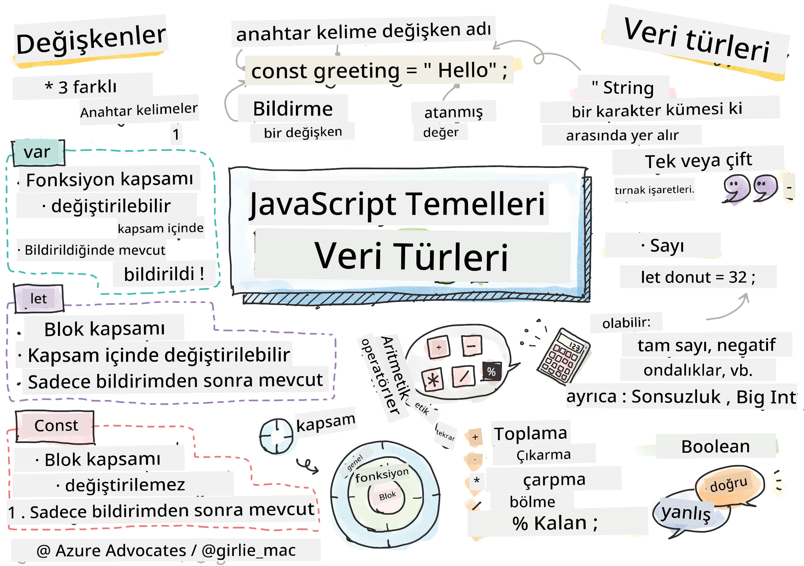
> Sketchnote: [Tomomi Imura](https://twitter.com/girlie_mac)

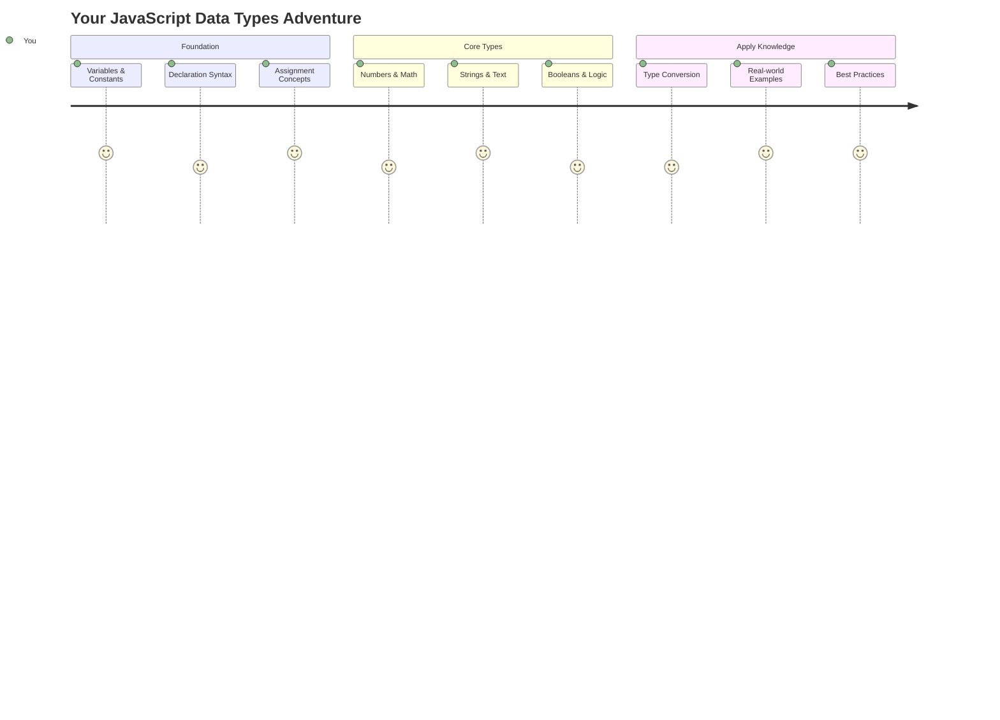

Veri türleri, JavaScript'te yazacağınız her programda karşılaşacağınız temel kavramlardan biridir. Veri türlerini, antik İskenderiye kütüphanecilerinin kullandığı dosyalama sistemi gibi düşünebilirsiniz – şiir, matematik ve tarih kayıtlarını içeren parşömenler için belirli yerler vardı. JavaScript, bilgiyi benzer şekilde farklı veri türleriyle organize eder.

Bu derste, JavaScript'in çalışmasını sağlayan temel veri türlerini keşfedeceğiz. Sayılar, metinler, doğru/yanlış değerleriyle nasıl çalışacağınızı öğrenecek ve doğru türü seçmenin programlarınız için neden önemli olduğunu anlayacaksınız. Bu kavramlar başlangıçta soyut görünebilir, ancak pratik yaptıkça doğal hale gelecek.

Veri türlerini anlamak, JavaScript'teki diğer her şeyi çok daha net hale getirecek. Tıpkı bir katedral inşa etmeden önce farklı yapı malzemelerini anlaması gereken bir mimar gibi, bu temeller ileride inşa edeceğiniz her şeyi destekleyecek.

## Ders Öncesi Test
[Ders öncesi test](https://ff-quizzes.netlify.app/web/)

Bu ders, webde etkileşim sağlayan dil olan JavaScript'in temellerini kapsar.

> Bu dersi [Microsoft Learn](https://docs.microsoft.com/learn/modules/web-development-101-variables/?WT.mc_id=academic-77807-sagibbon) üzerinden alabilirsiniz!

[](https://youtube.com/watch?v=JNIXfGiDWM8 "JavaScript'te Değişkenler")

[](https://youtube.com/watch?v=AWfA95eLdq8 "JavaScript'te Veri Türleri")

> 🎥 Yukarıdaki görsellere tıklayarak değişkenler ve veri türleri hakkında videolar izleyebilirsiniz.

Haydi değişkenler ve onları dolduran veri türleriyle başlayalım!

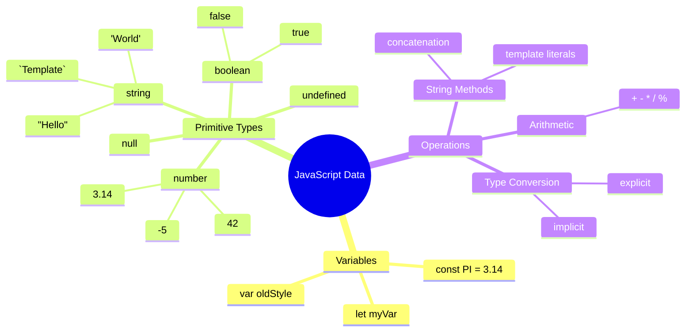

## Değişkenler

Değişkenler, programlamanın temel yapı taşlarıdır. Ortaçağ simyacılarının farklı maddeleri saklamak için kullandıkları etiketli kavanozlar gibi, değişkenler bilgiyi saklamanıza ve daha sonra başvurabilmeniz için ona açıklayıcı bir isim vermenize olanak tanır. Birinin yaşını hatırlamanız mı gerekiyor? `age` adlı bir değişkende saklayın. Bir kullanıcının adını mı takip etmek istiyorsunuz? `userName` adlı bir değişkende tutun.

Burada JavaScript'te değişkenler oluşturmanın modern yaklaşımına odaklanacağız. Burada öğreneceğiniz teknikler, yıllar süren dil evriminin ve programlama topluluğu tarafından geliştirilen en iyi uygulamaların bir sonucudur.

Bir değişken oluşturmak ve **tanımlamak** şu sözdizimini takip eder: **[anahtar kelime] [isim]**. İki bölümden oluşur:

- **Anahtar kelime**. Değişebilen değişkenler için `let`, sabit kalan değerler için `const` kullanın.
- **Değişken adı**, bu sizin seçtiğiniz açıklayıcı bir isimdir.

✅ ES6'da tanıtılan `let` anahtar kelimesi, değişkeninize bir tür _blok kapsamı_ sağlar. `let` veya `const` kullanmanız, eski `var` anahtar kelimesi yerine önerilir. Blok kapsamlarını daha ayrıntılı olarak ilerleyen bölümlerde ele alacağız.

### Görev - Değişkenlerle Çalışmak

1. **Bir değişken tanımlayın**. İlk değişkenimizi oluşturarak başlayalım:

    ```javascript
    let myVariable;
    ```

   **Bu ne işe yarar:**
   - JavaScript'e `myVariable` adlı bir depolama yeri oluşturmasını söyler
   - JavaScript bu değişken için bellekte yer ayırır
   - Değişken şu anda bir değere sahip değil (undefined)

2. **Ona bir değer verin**. Şimdi değişkenimize bir şey koyalım:

    ```javascript
    myVariable = 123;
    ```

   **Atama nasıl çalışır:**
   - `=` operatörü, değişkenimize 123 değerini atar
   - Değişken artık bu değeri içerir ve undefined değildir
   - Kodunuzda bu değeri `myVariable` kullanarak referans alabilirsiniz

   > Not: Bu derste `=` kullanımı, bir değişkene değer atamak için kullanılan bir "atama operatörü" anlamına gelir. Eşitlik anlamına gelmez.

3. **Akıllıca yapın**. Aslında, bu iki adımı birleştirelim:

    ```javascript
    let myVariable = 123;
    ```

    **Bu yaklaşım daha verimlidir:**
    - Değişkeni tanımlıyor ve bir değeri tek bir ifadede atıyorsunuz
    - Bu, geliştiriciler arasında standart bir uygulamadır
    - Kod uzunluğunu azaltırken açıklığı korur

4. **Fikrini değiştir**. Peki ya farklı bir sayı saklamak istersek?

   ```javascript
   myVariable = 321;
   ```

   **Yeniden atamayı anlamak:**
   - Değişken artık 321 yerine 123 içeriyor
   - Önceki değer değiştirildi – değişkenler aynı anda yalnızca bir değer saklar
   - Bu değişebilirlik, `let` ile tanımlanan değişkenlerin temel özelliğidir

   ✅ Deneyin! JavaScript'i doğrudan tarayıcınızda yazabilirsiniz. Bir tarayıcı penceresi açın ve Geliştirici Araçları'na gidin. Konsolda bir istem bulacaksınız; `let myVariable = 123` yazın, enter tuşuna basın, ardından `myVariable` yazın. Ne oluyor? Bu kavramlar hakkında daha fazla bilgiyi sonraki derslerde öğreneceksiniz.

### 🧠 **Değişkenlerde Ustalık Testi: Rahat Hissetmek**

**Değişkenler hakkında ne kadar bilgi sahibisiniz?**
- Bir değişkeni tanımlamak ile ona değer atamak arasındaki farkı açıklayabilir misiniz?
- Bir değişkeni tanımlamadan önce kullanmaya çalışırsanız ne olur?
- Bir değişken için `let` yerine `const` kullanmayı ne zaman tercih edersiniz?

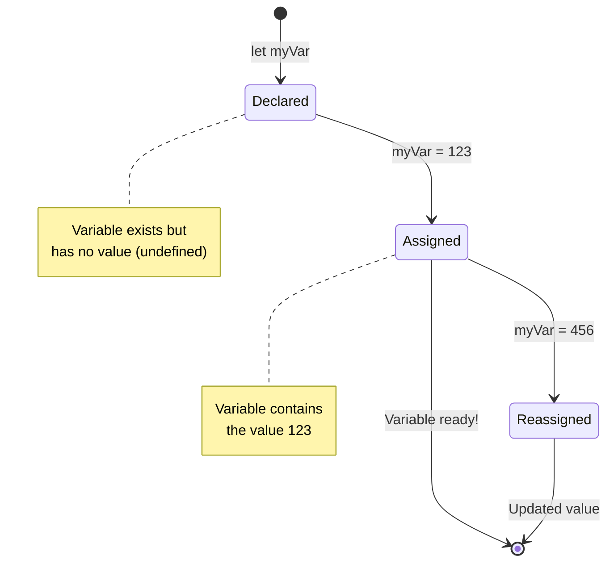

> **Hızlı ipucu**: Değişkenleri etiketli depolama kutuları olarak düşünün. Kutuyu oluşturursunuz (`let`), içine bir şey koyarsınız (`=`) ve gerekirse içeriği daha sonra değiştirebilirsiniz!

## Sabitler

Bazen program çalışırken asla değişmemesi gereken bilgileri saklamanız gerekir. Sabitleri, antik Yunan'da Euclid'in kurduğu matematiksel prensipler gibi düşünebilirsiniz – bir kez kanıtlanıp belgelenince, gelecekteki tüm referanslar için sabit kalırlar.

Sabitler, değişkenlere benzer şekilde çalışır, ancak önemli bir kısıtlama ile: bir kez değer atandıktan sonra değiştirilemezler. Bu değişmezlik, programınızdaki kritik değerlerin yanlışlıkla değiştirilmesini önlemeye yardımcı olur.

Bir sabitin tanımlanması ve başlatılması, bir değişkenle aynı kavramları takip eder, ancak `const` anahtar kelimesi kullanılır. Sabitler genellikle büyük harflerle tanımlanır.

```javascript
const MY_VARIABLE = 123;
```

**Bu kodun yaptığı şey:**
- **Bir sabit** olan `MY_VARIABLE` adında bir değişken oluşturur ve ona 123 değerini atar
- **Büyük harf** adlandırma kuralını sabitler için kullanır
- **Gelecekteki değişiklikleri** bu değere karşı engeller

Sabitlerin iki ana kuralı vardır:

- **Hemen bir değer vermelisiniz** – boş sabitlere izin verilmez!
- **Bu değeri asla değiştiremezsiniz** – JavaScript bunu denerseniz bir hata verir. Ne demek istediğimi görelim:

   **Basit değer** - Aşağıdaki işlem İZİN VERİLMEZ:
   
      ```javascript
      const PI = 3;
      PI = 4; // izin verilmez
      ```

   **Hatırlamanız gerekenler:**
   - **Sabitin yeniden atanması** hata oluşturur
   - **Önemli değerleri** yanlışlıkla değişikliklerden korur
   - **Değerin** program boyunca tutarlı kalmasını sağlar
 
   **Nesne referansı korunur** - Aşağıdaki işlem İZİN VERİLMEZ:
   
      ```javascript
      const obj = { a: 3 };
      obj = { b: 5 } // izin verilmez
      ```

   **Bu kavramları anlamak:**
   - **Tüm nesnenin** yenisiyle değiştirilmesini engeller
   - **Orijinal nesneye** olan referansı korur
   - **Nesnenin kimliğini** bellekte tutar

    **Nesne değeri korunmaz** - Aşağıdaki işlem İZİN VERİLİR:
    
      ```javascript
      const obj = { a: 3 };
      obj.a = 5;  // izin verilir
      ```

      **Burada olanlar:**
      - **Nesne içindeki özellik değerini** değiştirir
      - **Aynı nesne referansını** korur
      - **Gösterir** ki nesne içeriği değişebilir, ancak referans sabit kalır

   > Not, bir `const` referansın yeniden atanmasını engeller. Ancak değer tamamen _değişmez_ değildir ve özellikle bir nesne gibi karmaşık yapılar söz konusu olduğunda değişebilir.

## Veri Türleri

JavaScript, bilgiyi veri türleri adı verilen farklı kategorilere ayırır. Bu kavram, antik bilginlerin bilgiyi kategorilere ayırma yöntemine benzer – Aristoteles, mantıksal ilkelerin şiir, matematik ve doğal felsefeye eşit şekilde uygulanamayacağını bilerek farklı türde akıl yürütme biçimlerini ayırmıştır.

Veri türleri önemlidir çünkü farklı işlemler farklı türde bilgilerle çalışır. Tıpkı bir kişinin adıyla aritmetik yapamayacağınız veya bir matematiksel denklemi alfabetik sıraya koyamayacağınız gibi, JavaScript her işlem için uygun veri türünü gerektirir. Bunu anlamak hataları önler ve kodunuzu daha güvenilir hale getirir.

Değişkenler, sayılar ve metinler gibi birçok farklı türde değer saklayabilir. Bu çeşitli değer türleri **veri türü** olarak bilinir. Veri türleri, yazılım geliştirmede önemli bir rol oynar çünkü geliştiricilerin kodun nasıl yazılması gerektiği ve yazılımın nasıl çalışması gerektiği konusunda kararlar almasına yardımcı olur. Ayrıca, bazı veri türleri bir değerde ek bilgi dönüştürme veya çıkarma gibi benzersiz özelliklere sahiptir.

✅ Veri Türleri, JavaScript veri primitifleri olarak da adlandırılır, çünkü dil tarafından sağlanan en düşük seviyeli veri türleridir. 7 temel veri türü vardır: string, number, bigint, boolean, undefined, null ve symbol. Her bir primitifin neyi temsil edebileceğini hayal etmek için bir dakika ayırın. Bir `zebra` nedir? Peki ya `0`? `true`?

### Sayılar

Sayılar, JavaScript'teki en basit veri türüdür. İster 42 gibi tam sayılar, ister 3.14 gibi ondalık sayılar, ister -5 gibi negatif sayılar olsun, JavaScript bunları aynı şekilde işler.

Daha önceki değişkenimizi hatırlıyor musunuz? Sakladığımız 123 aslında bir sayı veri türüydü:

```javascript
let myVariable = 123;
```

**Temel özellikler:**
- JavaScript sayısal değerleri otomatik olarak tanır
- Bu değişkenlerle matematiksel işlemler yapabilirsiniz
- Açık bir tür bildirimi gerekmez

Değişkenler, ondalık veya negatif sayılar dahil tüm türdeki sayıları saklayabilir. Sayılar ayrıca [bir sonraki bölümde](../../../../2-js-basics/1-data-types) ele alınacak aritmetik operatörlerle kullanılabilir.

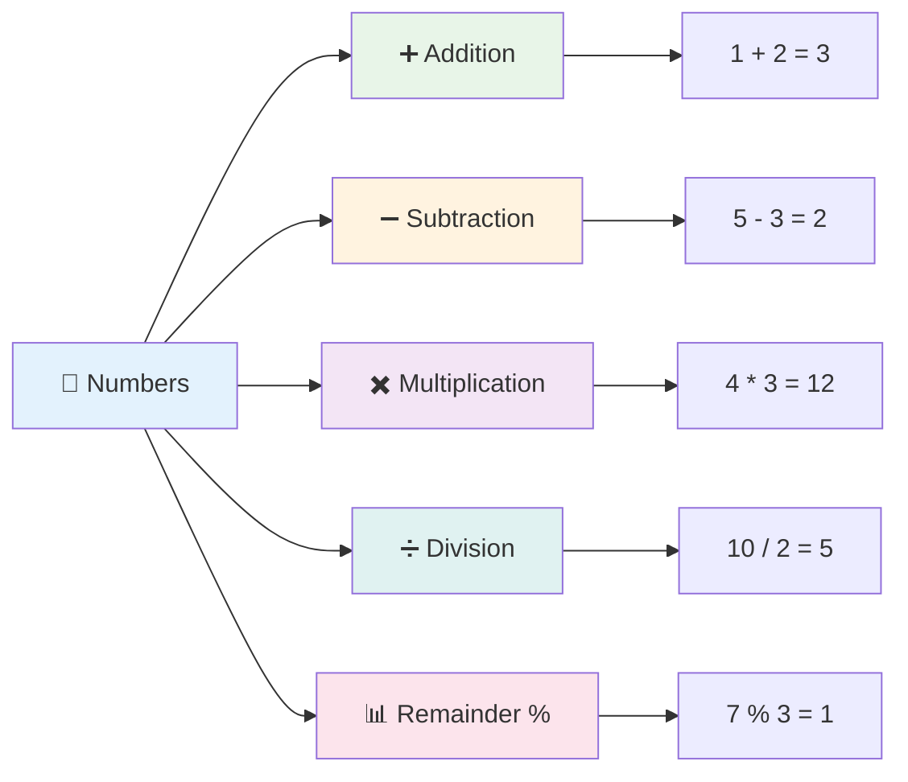

### Aritmetik Operatörler

Aritmetik operatörler, JavaScript'te matematiksel hesaplamalar yapmanıza olanak tanır. Bu operatörler, yüzyıllardır matematikçilerin kullandığı prensipleri takip eder – cebirsel notasyonu geliştiren Al-Khwarizmi gibi bilginlerin eserlerinde görülen aynı semboller.

Operatörler, geleneksel matematikten beklediğiniz gibi çalışır: toplama için artı, çıkarma için eksi ve benzeri.

Aritmetik işlevler gerçekleştirirken kullanabileceğiniz birkaç operatör türü vardır ve bazıları aşağıda listelenmiştir:

| Sembol | Açıklama                                                                 | Örnek                           |
| ------ | ------------------------------------------------------------------------ | -------------------------------- |
| `+`    | **Toplama**: İki sayının toplamını hesaplar                              | `1 + 2 //beklenen cevap 3`       |
| `-`    | **Çıkarma**: İki sayının farkını hesaplar                                | `1 - 2 //beklenen cevap -1`      |
| `*`    | **Çarpma**: İki sayının çarpımını hesaplar                               | `1 * 2 //beklenen cevap 2`       |
| `/`    | **Bölme**: İki sayının bölümünü hesaplar                                 | `1 / 2 //beklenen cevap 0.5`     |
| `%`    | **Kalan**: İki sayının bölünmesinden kalan değeri hesaplar               | `1 % 2 //beklenen cevap 1`       |

✅ Deneyin! Tarayıcınızın konsolunda bir aritmetik işlem deneyin. Sonuçlar sizi şaşırtıyor mu?

### 🧮 **Matematik Becerileri Testi: Güvenle Hesaplama**

**Aritmetik anlayışınızı test edin:**
- `/` (bölme) ile `%` (kalan) arasındaki fark nedir?
- `10 % 3`'ün ne olduğunu tahmin edebilir misiniz? (İpucu: 3.33 değil...)
- Kalan operatörü programlamada neden faydalı olabilir?

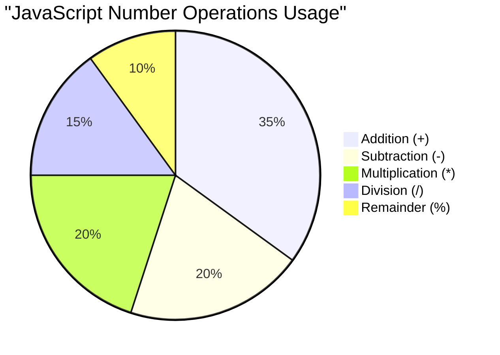

> **Gerçek dünya içgörüsü**: Kalan operatörü (%) sayıları çift/tek kontrol etmek, desenler oluşturmak veya diziler arasında döngü yapmak için oldukça kullanışlıdır!

### Strings

JavaScript'te metinsel veriler, string olarak temsil edilir. "String" terimi, karakterlerin bir dizi halinde bir araya getirilmesi fikrinden gelir; tıpkı ortaçağ manastırlarında yazıcıların harfleri birleştirerek kelimeler ve cümleler oluşturması gibi.

Stringler, web geliştirme için temel bir unsurdur. Bir web sitesinde görüntülenen her metin parçası – kullanıcı adları, düğme etiketleri, hata mesajları, içerik – string veri olarak işlenir. Stringleri anlamak, işlevsel kullanıcı arayüzleri oluşturmak için gereklidir.

Stringler, tek veya çift tırnak arasında yer alan karakter dizileridir.

```javascript
'This is a string'
"This is also a string"
let myString = 'This is a string value stored in a variable';
```

**Bu kavramları anlamak:**
- **Tek tırnak `'` veya çift tırnak `"` kullanarak** stringleri tanımlar
- **Harfler, sayılar ve semboller içeren** metin verilerini saklar
- **String değerlerini değişkenlere atar** ve daha sonra kullanır
- **Metni değişken adlarından ayırmak için** tırnak işaretleri gerektirir

String yazarken tırnak işaretlerini kullanmayı unutmayın, aksi takdirde JavaScript bunun bir değişken adı olduğunu varsayar.

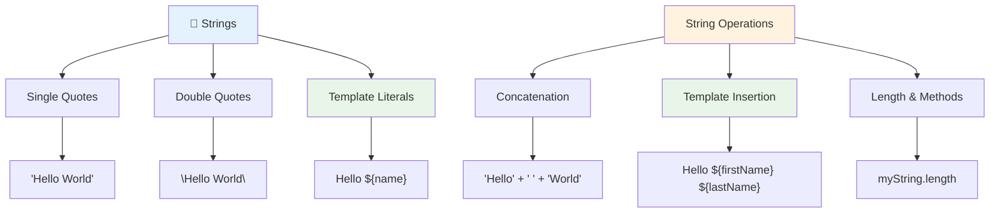

### String Formatlama

String manipülasyonu, metin öğelerini birleştirmenize, değişkenleri dahil etmenize ve program durumuna yanıt veren dinamik içerik oluşturmanıza olanak tanır. Bu teknik, metni programlı olarak oluşturmanıza olanak tanır.

Çoğu zaman birden fazla stringi birleştirmeniz gerekir – bu işleme birleştirme (concatenation) denir.
İki veya daha fazla stringi **birleştirmek** veya bir araya getirmek için `+` operatörünü kullanabilirsiniz.

```javascript
let myString1 = "Hello";
let myString2 = "World";

myString1 + myString2 + "!"; //HelloWorld!
myString1 + " " + myString2 + "!"; //Hello World!
myString1 + ", " + myString2 + "!"; //Hello, World!
```

**Adım adım neler oluyor:**
- **Birleştirir** birden fazla stringi `+` operatörü ile
- İlk örnekte boşluk olmadan stringleri doğrudan **birleştirir**
- Okunabilirlik için stringler arasına boşluk karakterleri `" "` **ekler**
- Doğru formatlama için virgül gibi noktalama işaretlerini **ekler**

✅ Neden JavaScript'te `1 + 1 = 2`, ama `'1' + '1' = 11`? Bir düşünün. Peki ya `'1' + 1`?

**Şablon stringler** (template literals), stringleri biçimlendirmenin başka bir yoludur. Ancak, tırnak işaretleri yerine ters tırnak işareti kullanılır. Düz metin olmayan her şey `${ }` içindeki yer tutuculara yerleştirilmelidir. Bu, string olabilecek değişkenleri de içerir.

```javascript
let myString1 = "Hello";
let myString2 = "World";

`${myString1} ${myString2}!` //Hello World!
`${myString1}, ${myString2}!` //Hello, World!
```

**Her bir kısmı anlayalım:**
- Şablon stringler oluşturmak için normal tırnak işaretleri yerine ters tırnak `` ` `` kullanır
- `${}` yer tutucu sözdizimi ile değişkenleri doğrudan **gömme** imkanı sağlar
- Yazıldığı gibi boşlukları ve formatlamayı **korur**
- Değişkenlerle karmaşık stringler oluşturmak için daha temiz bir yol **sunuyor**

Formatlama hedeflerinize her iki yöntemle de ulaşabilirsiniz, ancak şablon stringler boşlukları ve satır sonlarını daha iyi korur.

✅ Şablon stringi ne zaman, düz bir string yerine kullanırsınız?

### 🔤 **String Ustalık Kontrolü: Metin Manipülasyonu Güveni**

**String becerilerinizi değerlendirin:**
- `'1' + '1'` neden `'11'` eder, `2` değil? Açıklayabilir misiniz?
- Hangi string yöntemi daha okunabilir buluyorsunuz: birleştirme mi yoksa şablon stringler mi?
- Bir stringin etrafındaki tırnak işaretlerini unutursanız ne olur?

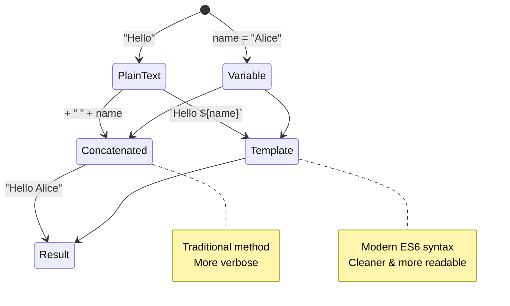

> **İpucu**: Şablon stringler genellikle karmaşık string oluşturma işlemleri için tercih edilir çünkü daha okunabilir ve çok satırlı stringleri mükemmel bir şekilde işler!

### Booleans

Booleanlar en basit veri biçimini temsil eder: yalnızca iki değer tutabilirler – `true` veya `false`. Bu ikili mantık sistemi, 19. yüzyıl matematikçisi George Boole'un geliştirdiği Boolean cebirine dayanır.

Basitliklerine rağmen, booleanlar program mantığı için çok önemlidir. Kodunuzun koşullara göre karar vermesini sağlar – bir kullanıcının oturum açıp açmadığı, bir düğmeye tıklanıp tıklanmadığı veya belirli kriterlerin karşılanıp karşılanmadığı gibi.

Booleanlar yalnızca iki değer olabilir: `true` veya `false`. Booleanlar, belirli koşullar karşılandığında hangi kod satırlarının çalışması gerektiğine karar vermeye yardımcı olur. Çoğu durumda, [operatörler](../../../../2-js-basics/1-data-types) bir Boolean değerini ayarlamada yardımcı olur ve genellikle değişkenlerin bir operatörle başlatıldığını veya değerlerinin güncellendiğini fark edersiniz.

```javascript
let myTrueBool = true;
let myFalseBool = false;
```

**Yukarıda şunları yaptık:**
- Boolean değeri `true` saklayan bir değişken **oluşturduk**
- Boolean değeri `false` saklamayı **gösterdik**
- Tam olarak `true` ve `false` anahtar kelimelerini (tırnak işareti olmadan) **kullandık**
- Bu değişkenleri koşullu ifadelerde kullanmak için **hazırladık**

✅ Bir değişken, boolean `true` olarak değerlendiriliyorsa 'doğru' (truthy) olarak kabul edilebilir. İlginç bir şekilde, JavaScript'te [tüm değerler, falsy olarak tanımlanmadıkça doğruluk taşır](https://developer.mozilla.org/docs/Glossary/Truthy).

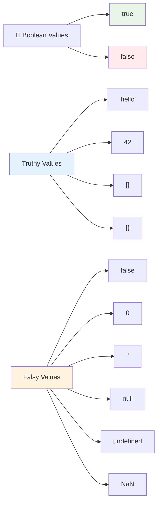

### 🎯 **Boolean Mantık Kontrolü: Karar Verme Becerileri**

**Boolean anlayışınızı test edin:**
- Neden JavaScript'te `true` ve `false` dışında "doğru" ve "yanlış" değerler olduğunu düşünüyorsunuz?
- Hangisinin falsy olduğunu tahmin edebilirsiniz: `0`, `"0"`, `[]`, `"false"`?
- Booleanlar program akışını kontrol etmekte nasıl faydalı olabilir?

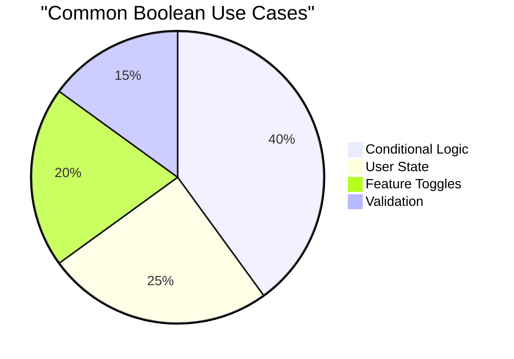

> **Unutmayın**: JavaScript'te yalnızca 6 değer falsy'dir: `false`, `0`, `""`, `null`, `undefined` ve `NaN`. Geri kalan her şey doğruluk taşır!

---

## 📊 **Veri Türleri Araç Seti Özeti**

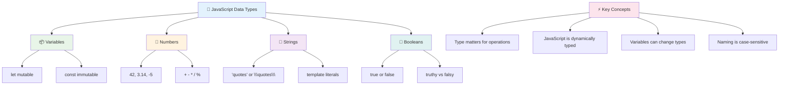

## GitHub Copilot Agent Challenge 🚀

Agent modunu kullanarak aşağıdaki meydan okumayı tamamlayın:

**Açıklama:** Bu derste öğrendiğiniz tüm JavaScript veri türlerini gerçek dünya veri senaryolarını işlerken gösteren bir kişisel bilgi yöneticisi oluşturun.

**Talimat:** Bir kişinin adını (string), yaşını (number), öğrenci olup olmadığını (boolean), favori renklerini bir dizi olarak ve sokak, şehir ve posta kodu özelliklerine sahip bir adres nesnesini içeren bir kullanıcı profili nesnesi oluşturacak bir JavaScript programı yazın. Profil bilgilerini görüntülemek ve bireysel alanları güncellemek için işlevler ekleyin. String birleştirme, şablon stringler, yaş ile aritmetik işlemler ve öğrenci durumu için boolean mantığını gösterdiğinizden emin olun.

[Agent modu](https://code.visualstudio.com/blogs/2025/02/24/introducing-copilot-agent-mode) hakkında daha fazla bilgi edinin.

## 🚀 Meydan Okuma

JavaScript'in geliştiricileri şaşırtabilecek bazı davranışları vardır. İşte keşfetmek için klasik bir örnek: tarayıcı konsolunuza şunu yazmayı deneyin: `let age = 1; let Age = 2; age == Age` ve sonucu gözlemleyin. Sonuç `false` döner – nedenini belirleyebilir misiniz?

Bu, JavaScript'in anlaşılması gereken birçok davranışından biridir. Bu tuhaflıkları tanımak, daha güvenilir kod yazmanıza ve sorunları daha etkili bir şekilde çözmenize yardımcı olacaktır.

## Ders Sonrası Test
[Ders sonrası test](https://ff-quizzes.netlify.app)

## Gözden Geçirme ve Kendi Kendine Çalışma

[Bu JavaScript alıştırmaları listesini](https://css-tricks.com/snippets/javascript/) inceleyin ve birini deneyin. Ne öğrendiniz?

## Ödev

[Veri Türleri Alıştırması](assignment.md)

## 🚀 JavaScript Veri Türleri Ustalık Zaman Çizelgeniz

### ⚡ **Sonraki 5 Dakikada Yapabilecekleriniz**
- [ ] Tarayıcı konsolunuzu açın ve farklı veri türlerine sahip 3 değişken oluşturun
- [ ] Meydan okumayı deneyin: `let age = 1; let Age = 2; age == Age` ve neden yanlış olduğunu öğrenin
- [ ] Adınız ve favori numaranızla string birleştirme pratiği yapın
- [ ] Bir stringe bir sayı eklediğinizde ne olduğunu test edin

### 🎯 **Bu Saatte Başarabilecekleriniz**
- [ ] Ders sonrası testi tamamlayın ve kafa karıştırıcı kavramları gözden geçirin
- [ ] İki sayıyı toplama, çıkarma, çarpma ve bölme işlemi yapan mini bir hesap makinesi oluşturun
- [ ] Şablon stringler kullanarak basit bir isim biçimlendirici oluşturun
- [ ] `==` ve `===` karşılaştırma operatörleri arasındaki farkları keşfedin
- [ ] Farklı veri türleri arasında dönüştürme pratiği yapın

### 📅 **Bir Haftalık JavaScript Temelleri**
- [ ] Ödevi güvenle ve yaratıcılıkla tamamlayın
- [ ] Öğrenilen tüm veri türlerini kullanarak kişisel bir profil nesnesi oluşturun
- [ ] [CSS-Tricks'ten JavaScript alıştırmaları](https://css-tricks.com/snippets/javascript/) ile pratik yapın
- [ ] Boolean mantığı kullanarak basit bir form doğrulayıcı oluşturun
- [ ] Dizi ve nesne veri türlerini deneyin (gelecek derslerin önizlemesi)
- [ ] Bir JavaScript topluluğuna katılın ve veri türleri hakkında sorular sorun

### 🌟 **Bir Aylık Dönüşüm**
- [ ] Veri türü bilgilerini daha büyük programlama projelerine entegre edin
- [ ] Gerçek uygulamalarda her veri türünü ne zaman ve neden kullanacağınızı anlayın
- [ ] Diğer yeni başlayanlara JavaScript temellerini anlamaları için yardımcı olun
- [ ] Farklı türde kullanıcı verilerini yöneten küçük bir uygulama oluşturun
- [ ] Tür zorlama ve kesin eşitlik gibi gelişmiş veri türü kavramlarını keşfedin
- [ ] Açık kaynak JavaScript projelerine belgeleri iyileştirerek katkıda bulunun

### 🧠 **Son Veri Türleri Ustalık Kontrolü**

**JavaScript temelinizi kutlayın:**
- Davranışı açısından sizi en çok şaşırtan veri türü hangisiydi?
- Bir arkadaşınıza değişkenler ve sabitler arasındaki farkı açıklamakta ne kadar rahatsınız?
- JavaScript'in tür sistemi hakkında keşfettiğiniz en ilginç şey nedir?
- Bu temellerle hangi gerçek dünya uygulamasını hayal edebilirsiniz?

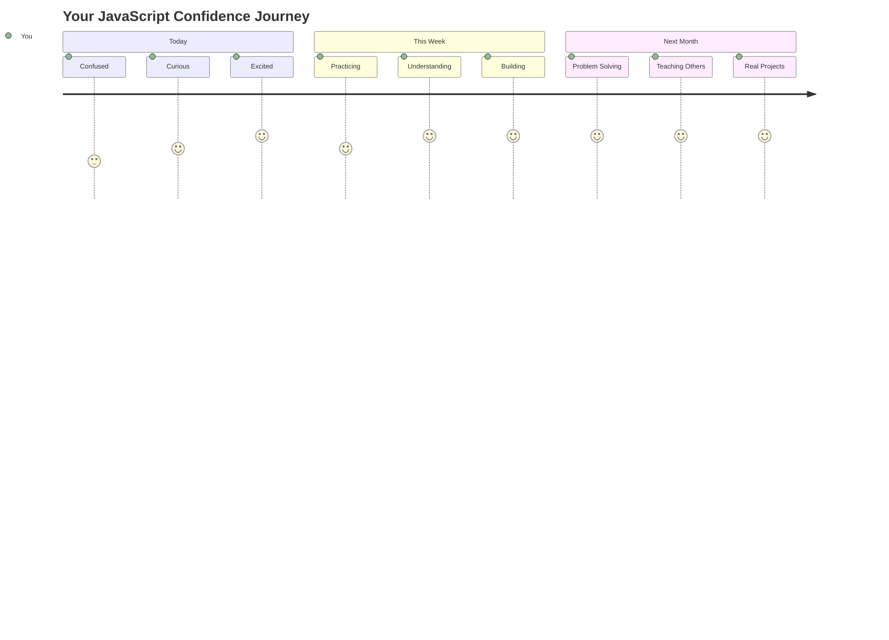

> 💡 **Temeli oluşturdunuz!** Veri türlerini anlamak, hikaye yazmadan önce alfabeyi öğrenmek gibidir. Yazacağınız her JavaScript programı bu temel kavramları kullanacaktır. Artık etkileşimli web siteleri, dinamik uygulamalar oluşturmak ve kodla gerçek dünya problemlerini çözmek için yapı taşlarına sahipsiniz. JavaScript'in harika dünyasına hoş geldiniz! 🎉

---

**Feragatname**:  
Bu belge, AI çeviri hizmeti [Co-op Translator](https://github.com/Azure/co-op-translator) kullanılarak çevrilmiştir. Doğruluk için çaba göstersek de, otomatik çevirilerin hata veya yanlışlıklar içerebileceğini lütfen unutmayın. Belgenin orijinal dili, yetkili kaynak olarak kabul edilmelidir. Kritik bilgiler için profesyonel insan çevirisi önerilir. Bu çevirinin kullanımından kaynaklanan yanlış anlamalar veya yanlış yorumlamalar için sorumluluk kabul etmiyoruz.