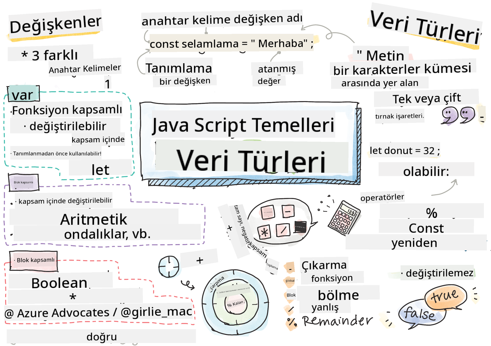

<!--
CO_OP_TRANSLATOR_METADATA:
{
  "original_hash": "b95fdd8310ef467305015ece1b0f9411",
  "translation_date": "2025-08-29T00:26:54+00:00",
  "source_file": "2-js-basics/1-data-types/README.md",
  "language_code": "tr"
}
-->
# JavaScript Temelleri: Veri Türleri


> Sketchnote: [Tomomi Imura](https://twitter.com/girlie_mac)

## Ders Öncesi Quiz
[Ders öncesi quiz](https://ff-quizzes.netlify.app/web/)

Bu ders, webde etkileşim sağlayan dil olan JavaScript'in temellerini kapsar.

> Bu dersi [Microsoft Learn](https://docs.microsoft.com/learn/modules/web-development-101-variables/?WT.mc_id=academic-77807-sagibbon) üzerinden alabilirsiniz!

[](https://youtube.com/watch?v=JNIXfGiDWM8 "JavaScript'te Değişkenler")

[](https://youtube.com/watch?v=AWfA95eLdq8 "JavaScript'te Veri Türleri")

> 🎥 Yukarıdaki görsellere tıklayarak değişkenler ve veri türleri hakkında videolar izleyebilirsiniz.

Hadi değişkenler ve onları dolduran veri türleriyle başlayalım!

## Değişkenler

Değişkenler, kodunuz boyunca kullanılabilecek ve değiştirilebilecek değerleri saklar.

Bir değişken oluşturmak ve **tanımlamak** şu sözdizimine sahiptir: **[anahtar kelime] [isim]**. Bu iki bölümden oluşur:

- **Anahtar kelime**. Anahtar kelimeler `let` veya `var` olabilir.  

✅ `let` anahtar kelimesi ES6 ile tanıtılmıştır ve değişkeninize bir _blok kapsamı_ sağlar. `let` kullanmanız `var` kullanmaktan daha çok önerilir. Blok kapsamlarını ilerleyen bölümlerde daha ayrıntılı ele alacağız.
- **Değişken adı**, bu sizin seçtiğiniz bir isimdir.

### Görev - Değişkenlerle Çalışmak

1. **Bir değişken tanımlayın**. `let` anahtar kelimesini kullanarak bir değişken tanımlayalım:

    ```javascript
    let myVariable;
    ```

   `myVariable` artık `let` anahtar kelimesiyle tanımlandı. Şu anda bir değeri yok.

1. **Bir değer atayın**. `=` operatörünü ve ardından beklenen değeri kullanarak bir değişkene değer atayın.

    ```javascript
    myVariable = 123;
    ```

   > Not: Bu derste `=` kullanımı, bir değişkene değer atamak için kullanılan bir "atama operatörü" anlamına gelir. Eşitlik anlamına gelmez.

   `myVariable` artık 123 değeriyle *başlatılmıştır*.

1. **Refaktör yapın**. Kodunuzu aşağıdaki ifadeyle değiştirin.

    ```javascript
    let myVariable = 123;
    ```

    Yukarıdaki işlem, bir değişkenin tanımlandığı ve aynı anda bir değer atandığı bir _açık başlatma_ olarak adlandırılır.

1. **Değişken değerini değiştirin**. Değişken değerini şu şekilde değiştirin:

   ```javascript
   myVariable = 321;
   ```

   Bir değişken tanımlandıktan sonra, kodunuzun herhangi bir noktasında `=` operatörü ve yeni değerle değiştirilebilir.

   ✅ Deneyin! Tarayıcınızda JavaScript yazabilirsiniz. Bir tarayıcı penceresi açın ve Geliştirici Araçları'na gidin. Konsolda bir istem bulacaksınız; `let myVariable = 123` yazın, enter tuşuna basın, ardından `myVariable` yazın. Ne oluyor? Bu kavramları sonraki derslerde daha fazla öğreneceksiniz.

## Sabitler

Bir sabitin tanımlanması ve başlatılması, bir değişkenle aynı kavramları takip eder, ancak `const` anahtar kelimesi kullanılır. Sabitler genellikle tamamen büyük harflerle tanımlanır.

```javascript
const MY_VARIABLE = 123;
```

Sabitler, değişkenlere benzer, ancak iki istisna vardır:

- **Bir değeri olmalı**. Sabitler başlatılmalıdır, aksi takdirde kod çalıştırıldığında bir hata oluşur.
- **Referans değiştirilemez**. Bir sabitin referansı başlatıldıktan sonra değiştirilemez, aksi takdirde kod çalıştırıldığında bir hata oluşur. İki örneğe bakalım:
   - **Basit değer**. Aşağıdaki işlem İZİN VERİLMEZ:
   
      ```javascript
      const PI = 3;
      PI = 4; // not allowed
      ```
 
   - **Nesne referansı korunur**. Aşağıdaki işlem İZİN VERİLMEZ:
   
      ```javascript
      const obj = { a: 3 };
      obj = { b: 5 } // not allowed
      ```

    - **Nesne değeri korunmaz**. Aşağıdaki işlem İZİN VERİLİR:
    
      ```javascript
      const obj = { a: 3 };
      obj.a = 5;  // allowed
      ```

      Yukarıda, nesnenin değerini değiştiriyorsunuz ancak referansını değil, bu nedenle izin verilir.

   > Not: Bir `const`, referansın yeniden atanmasını korur. Ancak değer _değişmez_ değildir ve özellikle bir nesne gibi karmaşık bir yapıysa değişebilir.

## Veri Türleri

Değişkenler, sayılar ve metinler gibi birçok farklı türde değer saklayabilir. Bu çeşitli değer türlerine **veri türü** denir. Veri türleri, yazılım geliştirmede önemli bir rol oynar çünkü geliştiricilere kodun nasıl yazılması ve yazılımın nasıl çalışması gerektiği konusunda kararlar aldırır. Ayrıca, bazı veri türleri, bir değerde ek bilgi dönüştürmeye veya çıkarmaya yardımcı olan benzersiz özelliklere sahiptir.

✅ Veri Türleri, JavaScript veri ilkeleri olarak da adlandırılır, çünkü bunlar dil tarafından sağlanan en düşük seviyeli veri türleridir. 7 temel veri türü vardır: string, number, bigint, boolean, undefined, null ve symbol. Bu ilkel türlerin her birinin neyi temsil edebileceğini bir dakikalığına hayal edin. Bir `zebra` nedir? Peki ya `0`? `true`?

### Sayılar

Önceki bölümde, `myVariable` değişkeninin değeri bir sayı veri türüydü.

`let myVariable = 123;`

Değişkenler, ondalık sayılar veya negatif sayılar dahil her tür sayıyı saklayabilir. Sayılar ayrıca [bir sonraki bölümde](../../../../2-js-basics/1-data-types) ele alınan aritmetik operatörlerle kullanılabilir.

### Aritmetik Operatörler

Aritmetik işlevler gerçekleştirirken kullanılabilecek birkaç tür operatör vardır ve bazıları burada listelenmiştir:

| Sembol | Açıklama                                                                 | Örnek                             |
| ------ | ------------------------------------------------------------------------ | --------------------------------- |
| `+`    | **Toplama**: İki sayının toplamını hesaplar                              | `1 + 2 //beklenen cevap 3`        |
| `-`    | **Çıkarma**: İki sayının farkını hesaplar                                | `1 - 2 //beklenen cevap -1`       |
| `*`    | **Çarpma**: İki sayının çarpımını hesaplar                               | `1 * 2 //beklenen cevap 2`        |
| `/`    | **Bölme**: İki sayının bölümünü hesaplar                                 | `1 / 2 //beklenen cevap 0.5`      |
| `%`    | **Kalan**: İki sayının bölümünden kalanını hesaplar                      | `1 % 2 //beklenen cevap 1`        |

✅ Deneyin! Tarayıcınızın konsolunda bir aritmetik işlem deneyin. Sonuçlar sizi şaşırtıyor mu?

### Stringler

Stringler, tek veya çift tırnak arasında yer alan karakter dizileridir.

- `'Bu bir stringdir'`
- `"Bu da bir stringdir"`
- `let myString = 'Bu bir değişkende saklanan string değerdir';`

Bir string yazarken tırnak kullanmayı unutmayın, aksi takdirde JavaScript bunun bir değişken adı olduğunu varsayar.

### Stringleri Biçimlendirme

Stringler metinseldir ve zaman zaman biçimlendirme gerektirir.

İki veya daha fazla stringi **birleştirmek** ya da bir araya getirmek için `+` operatörünü kullanın.

```javascript
let myString1 = "Hello";
let myString2 = "World";

myString1 + myString2 + "!"; //HelloWorld!
myString1 + " " + myString2 + "!"; //Hello World!
myString1 + ", " + myString2 + "!"; //Hello, World!

```

✅ Neden JavaScript'te `1 + 1 = 2`, ancak `'1' + '1' = 11`? Bir düşünün. Peki ya `'1' + 1`?

**Şablon dizileri**, stringleri biçimlendirmenin başka bir yoludur, ancak tırnak yerine ters tırnak kullanılır. Düz metin olmayan her şey `${ }` yer tutucularının içine yerleştirilmelidir. Buna string olabilecek değişkenler de dahildir.

```javascript
let myString1 = "Hello";
let myString2 = "World";

`${myString1} ${myString2}!` //Hello World!
`${myString1}, ${myString2}!` //Hello, World!
```

Hedeflerinize her iki yöntemle de ulaşabilirsiniz, ancak şablon dizileri boşlukları ve satır sonlarını koruyacaktır.

✅ Şablon dizisini ne zaman, düz bir stringi ne zaman kullanırsınız?

### Booleans

Booleans yalnızca iki değere sahip olabilir: `true` veya `false`. Booleans, belirli koşullar sağlandığında hangi kod satırlarının çalıştırılacağına karar vermeye yardımcı olabilir. Çoğu durumda, [operatörler](../../../../2-js-basics/1-data-types) bir Boolean değerini ayarlamada yardımcı olur ve genellikle değişkenlerin başlatıldığını veya değerlerinin bir operatörle güncellendiğini fark edersiniz ve yazarsınız.

- `let myTrueBool = true`
- `let myFalseBool = false`

✅ Bir değişken, bir boolean `true` olarak değerlendiriliyorsa 'doğru' olarak kabul edilebilir. İlginç bir şekilde, JavaScript'te [tüm değerler, tanımlanmadıkça doğru kabul edilir](https://developer.mozilla.org/docs/Glossary/Truthy).

---

## 🚀 Meydan Okuma

JavaScript, zaman zaman veri türlerini ele alış biçimiyle şaşırtıcıdır. Bu 'tuzaklar' hakkında biraz araştırma yapın. Örneğin: büyük/küçük harf duyarlılığı sizi yanıltabilir! Konsolda şunu deneyin: `let age = 1; let Age = 2; age == Age` (sonuç `false` -- neden?). Başka hangi tuzakları bulabilirsiniz?

## Ders Sonrası Quiz
[Ders sonrası quiz](https://ff-quizzes.netlify.app)

## Gözden Geçirme ve Kendi Kendine Çalışma

[Bu JavaScript alıştırmaları listesine](https://css-tricks.com/snippets/javascript/) bir göz atın ve birini deneyin. Ne öğrendiniz?

## Ödev

[Veri Türleri Alıştırması](assignment.md)

---

**Feragatname**:  
Bu belge, AI çeviri hizmeti [Co-op Translator](https://github.com/Azure/co-op-translator) kullanılarak çevrilmiştir. Doğruluk için çaba göstersek de, otomatik çevirilerin hata veya yanlışlıklar içerebileceğini lütfen unutmayın. Belgenin orijinal dili, yetkili kaynak olarak kabul edilmelidir. Kritik bilgiler için profesyonel insan çevirisi önerilir. Bu çevirinin kullanımından kaynaklanan yanlış anlamalar veya yanlış yorumlamalar için sorumluluk kabul etmiyoruz.