<!--
CO_OP_TRANSLATOR_METADATA:
{
  "original_hash": "71f7d7dafa1c7194d79ddac87f669ff9",
  "translation_date": "2025-11-04T00:42:03+00:00",
  "source_file": "2-js-basics/2-functions-methods/README.md",
  "language_code": "tr"
}
-->
# JavaScript Temelleri: Metotlar ve Fonksiyonlar


> Sketchnote: [Tomomi Imura](https://twitter.com/girlie_mac)

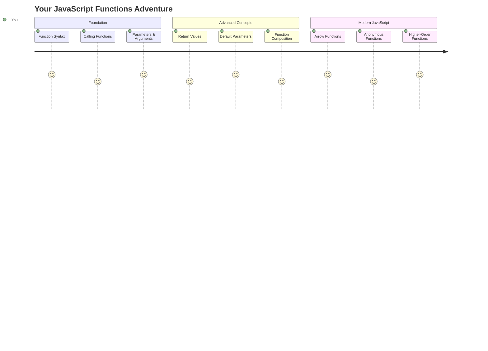

## Ders Öncesi Quiz
[Ders öncesi quiz](https://ff-quizzes.netlify.app)

Aynı kodu tekrar tekrar yazmak, programlamanın en yaygın sıkıntılarından biridir. Fonksiyonlar, kodu yeniden kullanılabilir bloklar halinde paketleyerek bu sorunu çözer. Fonksiyonları, Henry Ford'un montaj hattını devrim niteliğinde yapan standart parçalar gibi düşünebilirsiniz – güvenilir bir bileşen oluşturduktan sonra, ihtiyacınız olan her yerde sıfırdan yeniden inşa etmeden kullanabilirsiniz.

Fonksiyonlar, kod parçalarını paketlemenize ve programınız boyunca yeniden kullanmanıza olanak tanır. Aynı mantığı her yerde kopyalayıp yapıştırmak yerine, bir kez bir fonksiyon oluşturabilir ve ihtiyaç duyduğunuzda çağırabilirsiniz. Bu yaklaşım kodunuzu düzenli tutar ve güncellemeleri çok daha kolay hale getirir.

Bu derste, kendi fonksiyonlarınızı nasıl oluşturacağınızı, onlara nasıl bilgi aktaracağınızı ve faydalı sonuçlar alacağınızı öğreneceksiniz. Fonksiyonlar ile metotlar arasındaki farkı keşfedecek, modern sözdizimi yaklaşımlarını öğrenecek ve fonksiyonların diğer fonksiyonlarla nasıl çalışabileceğini göreceksiniz. Bu kavramları adım adım inşa edeceğiz.

[](https://youtube.com/watch?v=XgKsD6Zwvlc "Metotlar ve Fonksiyonlar")

> 🎥 Yukarıdaki görsele tıklayarak metotlar ve fonksiyonlar hakkında bir video izleyebilirsiniz.

> Bu dersi [Microsoft Learn](https://docs.microsoft.com/learn/modules/web-development-101-functions/?WT.mc_id=academic-77807-sagibbon) üzerinde alabilirsiniz!

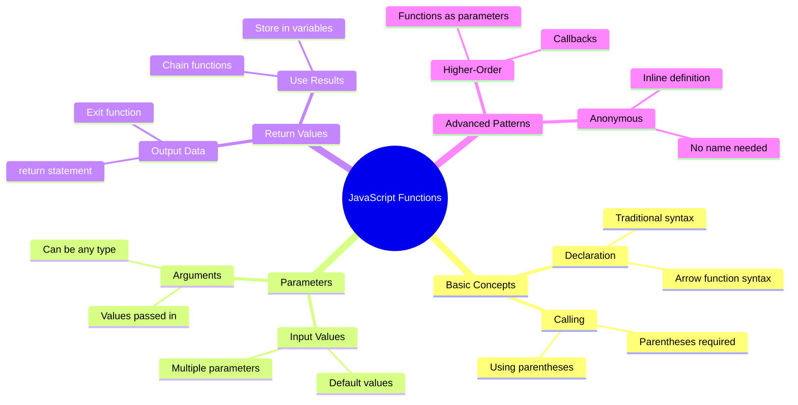

## Fonksiyonlar

Bir fonksiyon, belirli bir görevi yerine getiren bağımsız bir kod bloğudur. İhtiyaç duyduğunuzda çalıştırabileceğiniz mantığı kapsüller.

Programınız boyunca aynı kodu birden fazla kez yazmak yerine, bunu bir fonksiyonda paketleyebilir ve ihtiyacınız olduğunda o fonksiyonu çağırabilirsiniz. Bu yaklaşım kodunuzu temiz tutar ve güncellemeleri çok daha kolay hale getirir. Mantığın kod tabanınızda 20 farklı yerde dağınık olduğunu düşünürsek, bakım zorluğunu hayal edin.

Fonksiyonlarınıza açıklayıcı isimler vermek çok önemlidir. İyi adlandırılmış bir fonksiyon amacını açıkça iletir – `cancelTimer()` gördüğünüzde, ne yaptığını hemen anlarsınız, tıpkı açıkça etiketlenmiş bir düğmenin tıklayınca ne olacağını size söylemesi gibi.

## Bir fonksiyon oluşturma ve çağırma

Bir fonksiyonun nasıl oluşturulacağını inceleyelim. Sözdizimi tutarlı bir deseni takip eder:

```javascript
function nameOfFunction() { // function definition
 // function definition/body
}
```

Bunu parçalayalım:
- `function` anahtar kelimesi JavaScript'e "Hey, bir fonksiyon oluşturuyorum!" der.
- `nameOfFunction` fonksiyonunuza açıklayıcı bir isim verdiğiniz yerdir.
- Parantezler `()` parametreler ekleyebileceğiniz yerdir (buna birazdan geleceğiz).
- Süslü parantezler `{}` fonksiyonu çağırdığınızda çalışacak olan gerçek kodu içerir.

Bunu uygulamada görmek için basit bir selamlama fonksiyonu oluşturalım:

```javascript
function displayGreeting() {
  console.log('Hello, world!');
}
```

Bu fonksiyon konsola "Merhaba, dünya!" yazdırır. Bir kez tanımladıktan sonra, ihtiyacınız olduğu kadar kullanabilirsiniz.

Fonksiyonunuzu çalıştırmak (veya "çağırmak") için adını yazıp ardından parantez ekleyin. JavaScript, fonksiyonunuzu çağırmadan önce veya sonra tanımlamanıza izin verir – JavaScript motoru yürütme sırasını halleder.

```javascript
// calling our function
displayGreeting();
```

Bu satırı çalıştırdığınızda, `displayGreeting` fonksiyonunuzun içindeki tüm kodu çalıştırır ve tarayıcınızın konsolunda "Merhaba, dünya!" görüntüler. Bu fonksiyonu tekrar tekrar çağırabilirsiniz.

### 🧠 **Fonksiyon Temelleri Kontrolü: İlk Fonksiyonlarınızı Oluşturma**

**Temel fonksiyonlar hakkında nasıl hissettiğinizi görelim:**
- Fonksiyon tanımlarında neden süslü parantez `{}` kullandığımızı açıklayabilir misiniz?
- `displayGreeting` yazarsanız ama parantez eklemezseniz ne olur?
- Aynı fonksiyonu neden birden fazla kez çağırmak isteyebilirsiniz?

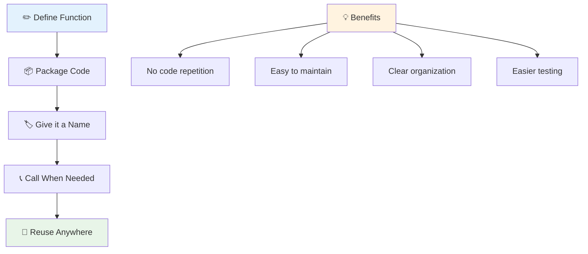

> **Not:** Bu derslerde **metotlar** kullanıyordunuz. `console.log()` bir metottur – esasen `console` nesnesine ait bir fonksiyondur. Temel fark, metotların nesnelere bağlı olması, fonksiyonların ise bağımsız olmasıdır. Birçok geliştirici bu terimleri günlük konuşmalarda birbirinin yerine kullanır.

### Fonksiyon yazma en iyi uygulamaları

İşte harika fonksiyonlar yazmanıza yardımcı olacak birkaç ipucu:

- Fonksiyonlarınıza açık, açıklayıcı isimler verin – gelecekteki haliniz size teşekkür edecek!
- Çok kelimeli isimler için **camelCasing** kullanın (örneğin, `calculateTotal` yerine `calculate_total`).
- Her bir fonksiyonu tek bir şeyi iyi yapmaya odaklanmış tutun.

## Bir fonksiyona bilgi aktarma

`displayGreeting` fonksiyonumuz sınırlı – herkes için sadece "Merhaba, dünya!" yazdırabilir. Parametreler, fonksiyonları daha esnek ve kullanışlı hale getirmemizi sağlar.

**Parametreler**, fonksiyonu her kullandığınızda farklı değerler ekleyebileceğiniz yerlerdir. Bu şekilde, aynı fonksiyon her çağrıda farklı bilgilerle çalışabilir.

Fonksiyonunuzu tanımlarken parametreleri parantez içine listeleyin ve birden fazla parametreyi virgülle ayırın:

```javascript
function name(param, param2, param3) {

}
```

Her parametre bir yer tutucu gibi davranır – birisi fonksiyonunuzu çağırdığında, bu yerlere gerçek değerler sağlar.

Selamlama fonksiyonumuzu birinin adını kabul edecek şekilde güncelleyelim:

```javascript
function displayGreeting(name) {
  const message = `Hello, ${name}!`;
  console.log(message);
}
```

Adı doğrudan mesajımıza eklemek için ters tırnak işaretleri (`` ` ``) ve `${}` kullandığımıza dikkat edin – buna şablon literal denir ve değişkenlerle karışık dizeler oluşturmanın gerçekten kullanışlı bir yoludur.

Şimdi fonksiyonumuzu çağırdığımızda herhangi bir isim geçirebiliriz:

```javascript
displayGreeting('Christopher');
// displays "Hello, Christopher!" when run
```

JavaScript, `'Christopher'` dizgesini alır, `name` parametresine atar ve kişiselleştirilmiş mesaj "Merhaba, Christopher!" oluşturur.

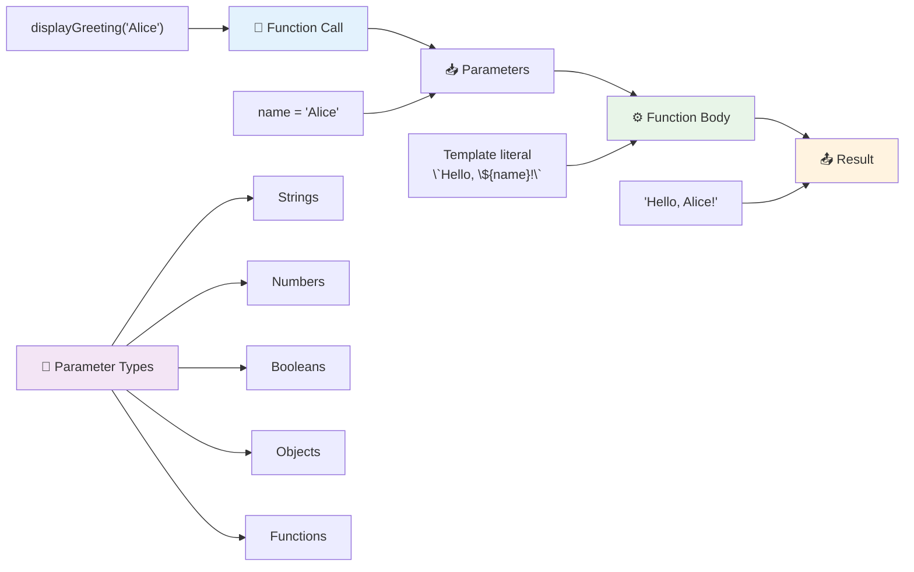

## Varsayılan değerler

Bazı parametreleri isteğe bağlı yapmak istersek ne olur? İşte burada varsayılan değerler devreye girer!

Diyelim ki insanlar selamlama kelimesini özelleştirebilsin istiyoruz, ancak biri belirtmezse, yedek olarak "Merhaba" kullanacağız. Varsayılan değerleri, bir değişken ayarlamak gibi eşittir işareti kullanarak ayarlayabilirsiniz:

```javascript
function displayGreeting(name, salutation='Hello') {
  console.log(`${salutation}, ${name}`);
}
```

Burada `name` hala gereklidir, ancak `salutation` kimse farklı bir selamlama sağlamazsa `'Merhaba'` yedek değerine sahiptir.

Artık bu fonksiyonu iki farklı şekilde çağırabiliriz:

```javascript
displayGreeting('Christopher');
// displays "Hello, Christopher"

displayGreeting('Christopher', 'Hi');
// displays "Hi, Christopher"
```

İlk çağrıda, selamlama belirtmediğimiz için JavaScript varsayılan "Merhaba"yı kullanır. İkinci çağrıda ise özel "Selam"ımızı kullanır. Bu esneklik, fonksiyonları farklı senaryolara uyarlanabilir hale getirir.

### 🎛️ **Parametreler Ustalık Kontrolü: Fonksiyonları Esnek Hale Getirme**

**Parametre anlayışınızı test edin:**
- Parametre ile argüman arasındaki fark nedir?
- Varsayılan değerler gerçek dünyada programlamada neden kullanışlıdır?
- Parametrelerden daha fazla argüman geçerseniz ne olacağını tahmin edebilir misiniz?

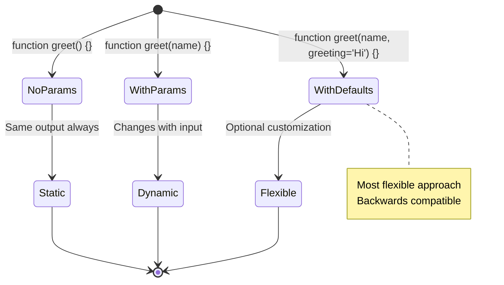

> **İpucu**: Varsayılan parametreler, fonksiyonlarınızı daha kullanıcı dostu hale getirir. Kullanıcılar, mantıklı varsayılanlarla hızlı bir şekilde başlayabilir, ancak gerektiğinde özelleştirebilir!

## Geri dönüş değerleri

Şimdiye kadar fonksiyonlarımız sadece konsola mesajlar yazdırıyordu, ancak bir fonksiyonun bir şeyler hesaplamasını ve sonucu size geri vermesini istiyorsanız ne olur?

İşte burada **geri dönüş değerleri** devreye girer. Bir şey görüntülemek yerine, bir fonksiyon size geri döndürebileceğiniz bir değer verebilir ve bu değeri bir değişkende saklayabilir veya kodunuzun diğer bölümlerinde kullanabilirsiniz.

Bir değeri geri göndermek için `return` anahtar kelimesini ve ardından geri döndürmek istediğiniz şeyi kullanırsınız:

```javascript
return myVariable;
```

Önemli bir nokta: Bir fonksiyon bir `return` ifadesine ulaştığında, hemen çalışmayı durdurur ve bu değeri çağırana geri gönderir.

Selamlama fonksiyonumuzu mesajı yazdırmak yerine geri döndürecek şekilde değiştirelim:

```javascript
function createGreetingMessage(name) {
  const message = `Hello, ${name}`;
  return message;
}
```

Artık bu fonksiyon selamlamayı yazdırmak yerine mesajı oluşturur ve bize geri verir.

Geri döndürülen değeri kullanmak için, diğer herhangi bir değer gibi bir değişkende saklayabiliriz:

```javascript
const greetingMessage = createGreetingMessage('Christopher');
```

Artık `greetingMessage` "Merhaba, Christopher" içerir ve bunu kodunuzun herhangi bir yerinde kullanabilirsiniz – bir web sayfasında görüntülemek, bir e-postaya eklemek veya başka bir fonksiyona iletmek için.

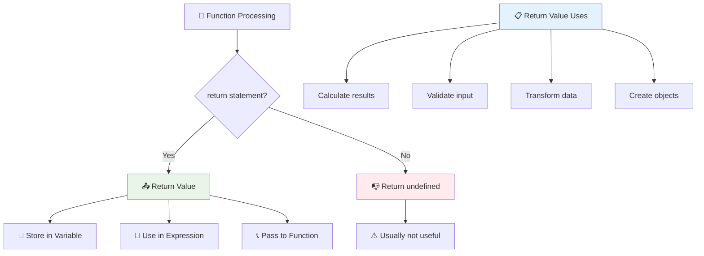

### 🔄 **Geri Dönüş Değerleri Kontrolü: Sonuçları Geri Alma**

**Geri dönüş değeri anlayışınızı değerlendirin:**
- Bir fonksiyondaki `return` ifadesinden sonra kodda ne olur?
- Değerleri geri döndürmek neden sadece konsola yazdırmaktan daha iyidir?
- Bir fonksiyon farklı türde değerler (dize, sayı, boolean) döndürebilir mi?

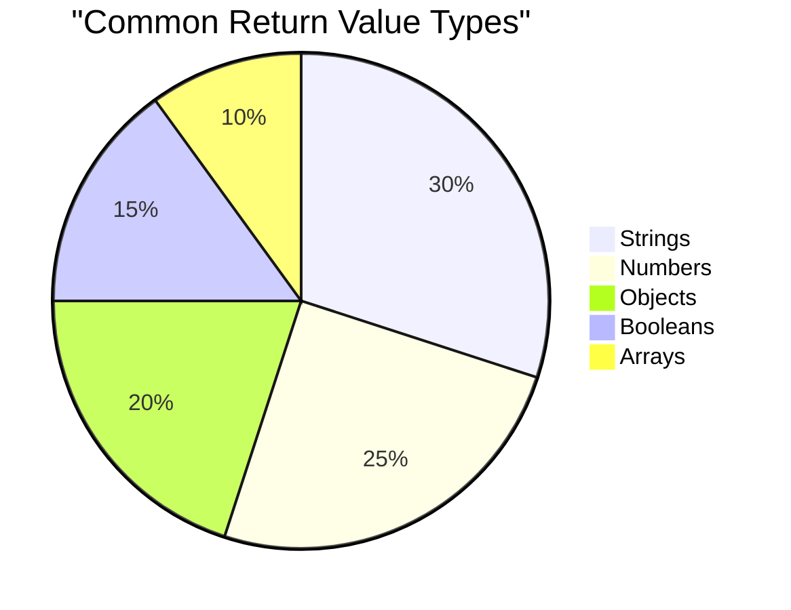

> **Önemli bilgi**: Değer döndüren fonksiyonlar daha çok yönlüdür çünkü çağıran kişi sonucu ne yapacağına karar verir. Bu, kodunuzu daha modüler ve yeniden kullanılabilir hale getirir!

## Fonksiyonları diğer fonksiyonlara parametre olarak geçirme

Fonksiyonlar, diğer fonksiyonlara parametre olarak geçirilebilir. Bu kavram başlangıçta karmaşık görünebilir, ancak esnek programlama desenlerini mümkün kılan güçlü bir özelliktir.

Bu desen, "bir şey olduğunda, şu diğer şeyi yap" demek istediğinizde çok yaygındır. Örneğin, "zamanlayıcı bittiğinde, bu kodu çalıştır" veya "kullanıcı düğmeye tıkladığında, bu fonksiyonu çağır."

`setTimeout`'a bakalım, bu yerleşik bir fonksiyondur ve belirli bir süre bekler, ardından bazı kodları çalıştırır. Hangi kodu çalıştıracağını söylememiz gerekir – fonksiyon geçirme için mükemmel bir kullanım durumu!

Bu kodu deneyin – 3 saniye sonra bir mesaj göreceksiniz:

```javascript
function displayDone() {
  console.log('3 seconds has elapsed');
}
// timer value is in milliseconds
setTimeout(displayDone, 3000);
```

`setTimeout`'a `displayDone` fonksiyonunu (parantez olmadan) geçirdiğimize dikkat edin. Fonksiyonu kendimiz çağırmıyoruz – onu `setTimeout`'a teslim ediyoruz ve "bunu 3 saniye içinde çağır" diyoruz.

### İsimsiz fonksiyonlar

Bazen sadece bir şey için bir fonksiyona ihtiyacınız olur ve ona bir isim vermek istemezsiniz. Düşünün – bir fonksiyonu sadece bir kez kullanıyorsanız, kodunuzu fazladan bir isimle neden karmaşıklaştırasınız?

JavaScript, **isimsiz fonksiyonlar** oluşturmanıza olanak tanır – yalnızca ihtiyacınız olan yerde tanımlayabileceğiniz isimsiz fonksiyonlar.

Zamanlayıcı örneğimizi bir isimsiz fonksiyon kullanarak yeniden yazabiliriz:

```javascript
setTimeout(function() {
  console.log('3 seconds has elapsed');
}, 3000);
```

Bu aynı sonucu elde eder, ancak fonksiyon doğrudan `setTimeout` çağrısı içinde tanımlanır, ayrı bir fonksiyon bildirimi ihtiyacını ortadan kaldırır.

### Ok fonksiyonları

Modern JavaScript, **ok fonksiyonları** adı verilen daha kısa bir fonksiyon yazma yöntemi sunar. `=>` (ok gibi görünüyor – anladınız mı?) kullanır ve geliştiriciler arasında oldukça popülerdir.

Ok fonksiyonları, `function` anahtar kelimesini atlamanıza ve daha özlü kod yazmanıza olanak tanır.

Zamanlayıcı örneğimizi bir ok fonksiyonu kullanarak yazalım:

```javascript
setTimeout(() => {
  console.log('3 seconds has elapsed');
}, 3000);
```

`()` parametrelerin gideceği yerdir (bu durumda boş), ardından ok `=>` gelir ve son olarak süslü parantezler içinde fonksiyon gövdesi. Bu, daha özlü bir sözdizimiyle aynı işlevselliği sağlar.

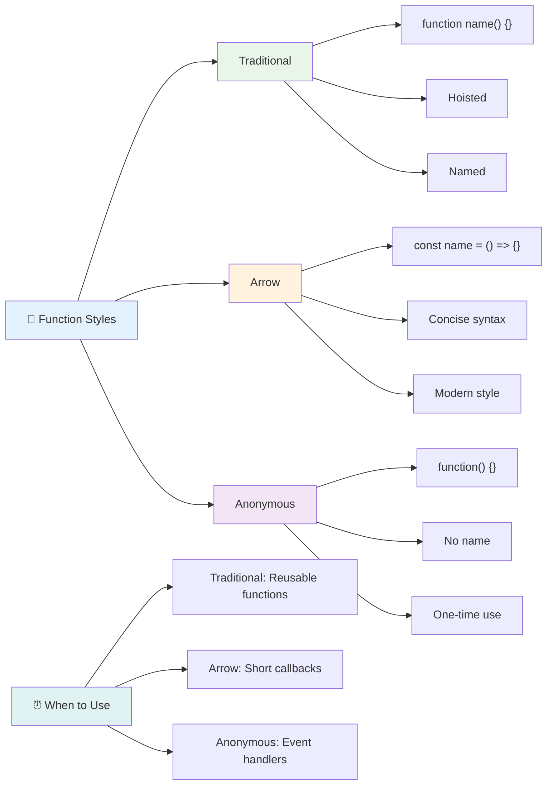

### Hangi stratejiyi ne zaman kullanmalı

Her yaklaşımı ne zaman kullanmalısınız? Pratik bir kılavuz: Fonksiyonu birden fazla kez kullanacaksanız, ona bir isim verin ve ayrı olarak tanımlayın. Sadece belirli bir kullanım içinse, bir isimsiz fonksiyon düşünün. Hem ok fonksiyonları hem de geleneksel sözdizimi geçerli seçeneklerdir, ancak ok fonksiyonları modern JavaScript kod tabanlarında yaygındır.

### 🎨 **Fonksiyon Stilleri Ustalık Kontrolü: Doğru Sözdizimini Seçmek**

**Sözdizimi anlayışınızı test edin:**
- Ok fonksiyonlarını geleneksel fonksiyon sözdizimine tercih etmenizin nedeni ne olabilir?
- İsimsiz fonksiyonların ana avantajı nedir?
- İsimsiz bir fonksiyon yerine isimli bir fonksiyonun daha iyi olduğu bir durumu düşünebilir misiniz?

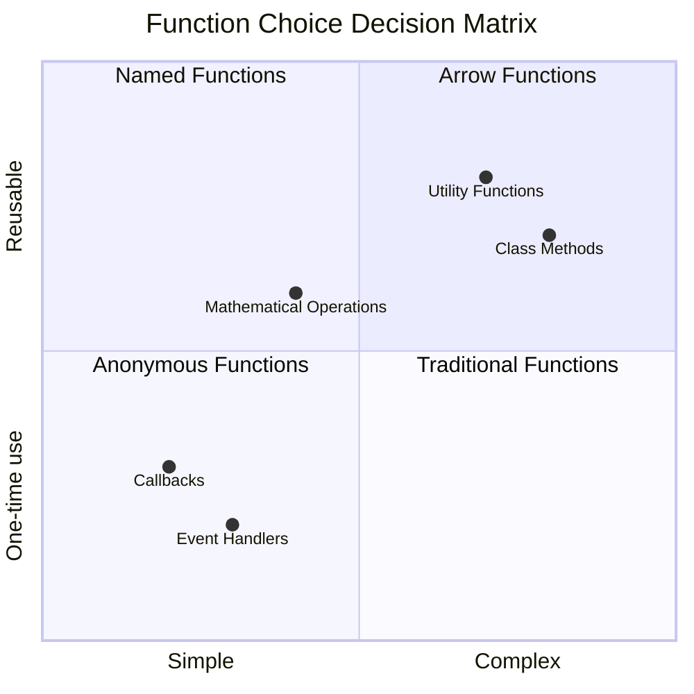

> **Modern trend**: Ok fonksiyonları, geliştiriciler arasında daha özlü sözdizimi nedeniyle varsayılan tercih haline geliyor, ancak geleneksel fonksiyonların hala yeri var!

---

## 🚀 Zorluk

Fonksiyonlar ile metotlar arasındaki farkı bir cümleyle açıklayabilir misiniz? Deneyin!

## GitHub Copilot Agent Zorluğu 🚀

Agent modunu kullanarak aşağıdaki zorluğu tamamlayın:

**Açıklama:** Bu derste ele alınan farklı fonksiyon kavramlarını içeren matematiksel fonksiyonlardan oluşan bir yardımcı kütüphane oluşturun. Parametreler, varsayılan değerler, geri dönüş değerleri ve ok fonksiyonları dahil.

**İstek:** `mathUtils.js` adlı bir JavaScript dosyası oluşturun ve şu fonksiyonları içersin:
1. İki parametre alan ve toplamlarını döndüren bir `add` fonksiyonu
2. Varsayılan parametre değerlerine sahip bir `multiply` fonksiyonu (ikinci parametre varsayılan olarak 1)
3. Bir sayı alıp karesini döndüren bir ok fonksiyonu `square`
4. Başka bir fonksiyonu parametre olarak kabul eden ve iki sayıya uygulayan bir `calculate` fonksiyonu
5. Her fonksiyonu uygun test durumlarıyla çağırmayı gösterin

Agent modu hakkında daha fazla bilgi edinin: [burada](https://code.visualstudio.com/blogs/2025/02/24/introducing-copilot-agent-mode).

## Ders Sonrası Quiz
[Ders sonrası quiz](https://ff-quizzes.netlify.app)

## Gözden Geçirme ve Kendi Kendine Çalışma

Ok fonksiyonları hakkında [biraz daha okumaya](https://developer.mozilla.org/docs/Web/JavaScript/Reference/Functions/Arrow_functions) değer, çünkü kod tabanlarında giderek daha fazla kullanılıyor. Bir fonksiyon yazmayı ve ardından bu sözdizimiyle yeniden yazmayı deneyin.

## Ödev

[Fonksiyonlarla Eğlence](assignment.md)

---

## 🧰 **JavaScript Fonksiyonları Araç Seti Özeti**

```mermaid
graph TD
    A["🎯 JavaScript Functions"] --> B["📋 Function Declaration"]
    A --> C["📥 Parameters"]
    A --> D["📤 Return Values"]
    A --> E["🎨 Modern Syntax"]
    
    B --> B1["function name() {}"]
    B --> B2["Descriptive naming"]
    B --> B3["Reusable code blocks"]
    
    C --> C1["Input data"]
    C --> C2["Default values"]
    C --> C3["Multiple parameters"]
    
    D --> D1["return statement"]
    D --> D2["Exit function"]
    D --> D3["Pass data back"]
    
    E --> E1["Arrow functions: () =>"]
    E --> E2["Anonymous functions"]
    E --> E3["Higher-order functions"]
    
    F["⚡ Key Benefits"] --> F1["Code reusability"]
    F --> F2["Better organization"]
    F --> F3["Easier testing"]
    F --> F4["Modular design"]
    
    style A fill:#e3f2fd
    style B fill:#e8f5e8
    style C fill:#fff3e0
    style D fill:#f3e5f5
    style E fill:#e0f2f1
    style F fill:#fce4ec
```

---

## 🚀 JavaScript Fonksiyonları Ustalık Zaman Çizelgesi

### ⚡ **Sonraki 5 Dakikada Yapabilecekleriniz**
- [ ] Favori numaranızı döndüren basit bir fonksiyon yazın
- [ ] İki parametreye sahip ve bunları toplayan bir fonksiyon oluşturun
- [ ] Geleneksel bir fonksiyonu ok işareti (arrow function) sözdizimine dönüştürmeyi deneyin  
- [ ] Meydan okumayı uygulayın: fonksiyonlar ile metotlar arasındaki farkı açıklayın  

### 🎯 **Bu Saatte Neler Başarabilirsiniz**  
- [ ] Ders sonrası testi tamamlayın ve kafa karıştırıcı kavramları gözden geçirin  
- [ ] GitHub Copilot meydan okumasından matematik yardımcı kütüphanesini oluşturun  
- [ ] Parametre olarak başka bir fonksiyon kullanan bir fonksiyon oluşturun  
- [ ] Varsayılan parametrelerle fonksiyon yazmayı uygulayın  
- [ ] Fonksiyon dönüş değerlerinde şablon dizgileriyle (template literals) denemeler yapın  

### 📅 **Hafta Boyunca Fonksiyon Ustalığı**  
- [ ] "Fonksiyonlarla Eğlence" ödevini yaratıcılıkla tamamlayın  
- [ ] Yazdığınız tekrarlayan kodları yeniden kullanılabilir fonksiyonlara dönüştürün  
- [ ] Sadece fonksiyonlar kullanarak küçük bir hesap makinesi oluşturun (global değişkenler olmadan)  
- [ ] `map()` ve `filter()` gibi dizi metotlarıyla ok işareti (arrow function) fonksiyonlarını uygulayın  
- [ ] Yaygın görevler için bir yardımcı fonksiyon koleksiyonu oluşturun  
- [ ] Üst düzey fonksiyonlar ve fonksiyonel programlama kavramlarını inceleyin  

### 🌟 **Ay Boyunca Dönüşüm**  
- [ ] Closure ve kapsam (scope) gibi ileri düzey fonksiyon kavramlarını öğrenin  
- [ ] Fonksiyon bileşimini yoğun bir şekilde kullanan bir proje oluşturun  
- [ ] Açık kaynak projelere katkıda bulunarak fonksiyon dokümantasyonunu geliştirin  
- [ ] Bir başkasına fonksiyonlar ve farklı sözdizimi stilleri hakkında öğretin  
- [ ] JavaScript'te fonksiyonel programlama paradigmalarını keşfedin  
- [ ] Gelecekteki projeler için yeniden kullanılabilir fonksiyonlardan oluşan kişisel bir kütüphane oluşturun  

### 🏆 **Son Fonksiyon Şampiyonu Kontrol Noktası**  

**Fonksiyon ustalığınızı kutlayın:**  
- Şimdiye kadar oluşturduğunuz en faydalı fonksiyon hangisi?  
- Fonksiyonlar hakkında öğrenmek kod organizasyonu hakkındaki düşüncelerinizi nasıl değiştirdi?  
- Hangi fonksiyon sözdizimini tercih ediyorsunuz ve neden?  
- Hangi gerçek dünya problemini bir fonksiyon yazarak çözerdiniz?  

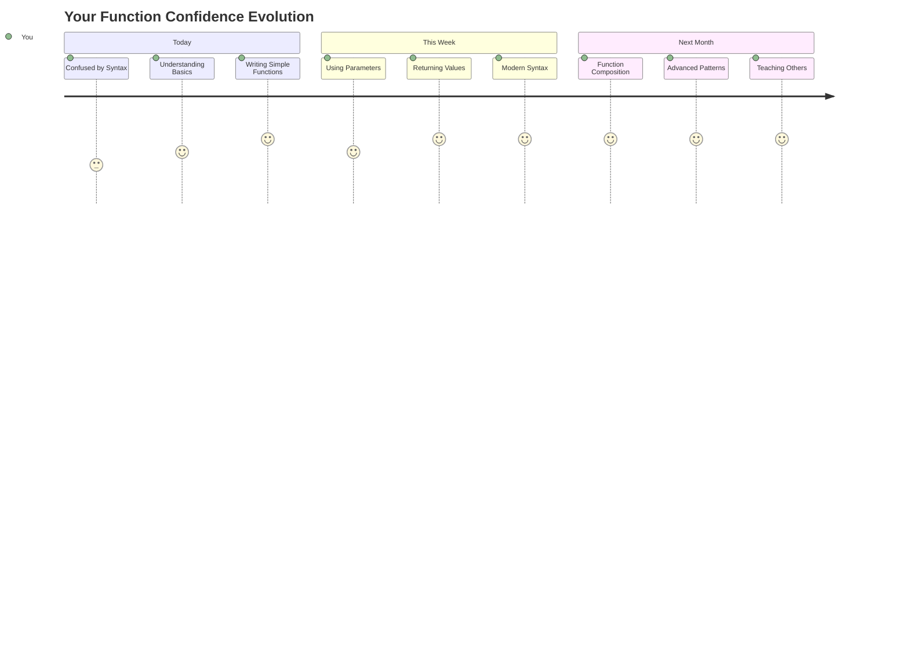
  
> 🎉 **Programlamanın en güçlü kavramlarından birini ustalıkla öğrendiniz!** Fonksiyonlar, daha büyük programların yapı taşlarıdır. Yazacağınız her uygulama, kodu organize etmek, yeniden kullanmak ve yapılandırmak için fonksiyonları kullanacaktır. Artık mantığı yeniden kullanılabilir bileşenlere nasıl paketleyeceğinizi biliyorsunuz, bu da sizi daha verimli ve etkili bir programcı yapıyor. Modüler programlama dünyasına hoş geldiniz! 🚀  

---

**Feragatname**:  
Bu belge, AI çeviri hizmeti [Co-op Translator](https://github.com/Azure/co-op-translator) kullanılarak çevrilmiştir. Doğruluk için çaba göstersek de, otomatik çevirilerin hata veya yanlışlıklar içerebileceğini lütfen unutmayın. Belgenin orijinal dili, yetkili kaynak olarak kabul edilmelidir. Kritik bilgiler için profesyonel insan çevirisi önerilir. Bu çevirinin kullanımından kaynaklanan yanlış anlamalar veya yanlış yorumlamalar için sorumluluk kabul etmiyoruz.