<!--
CO_OP_TRANSLATOR_METADATA:
{
  "original_hash": "c688385d15dd3645e924ea0ffee8967f",
  "translation_date": "2025-11-04T00:43:22+00:00",
  "source_file": "2-js-basics/3-making-decisions/README.md",
  "language_code": "tr"
}
-->
# JavaScript Temelleri: Karar Verme

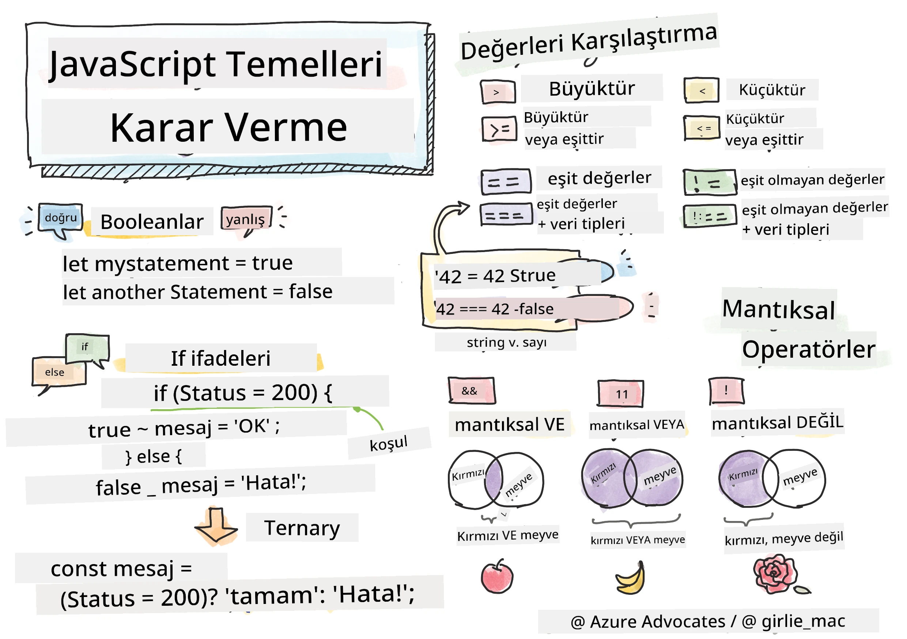

> Sketchnote: [Tomomi Imura](https://twitter.com/girlie_mac)

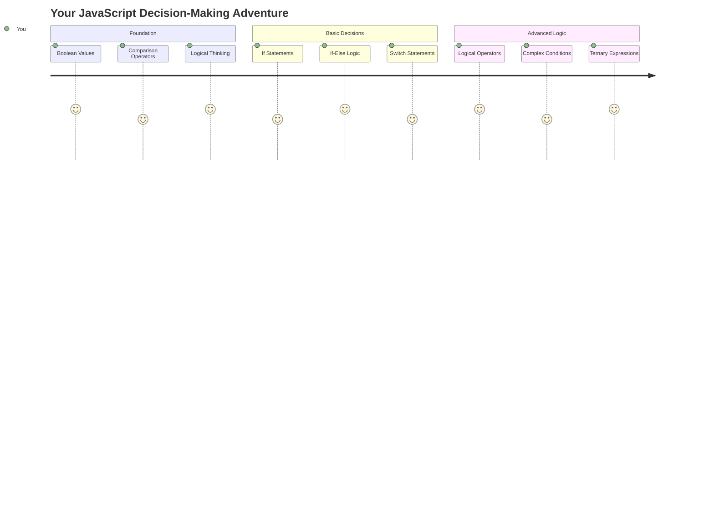

Hiç uygulamaların nasıl akıllıca kararlar verdiğini merak ettiniz mi? Örneğin, bir navigasyon sisteminin en hızlı rotayı nasıl seçtiği ya da bir termostatın ısıtmayı ne zaman açacağına nasıl karar verdiği? İşte programlamada karar verme kavramının temeli budur.

Charles Babbage'in Analitik Motoru'nun koşullara bağlı olarak farklı işlem dizilerini takip etmek üzere tasarlandığı gibi, modern JavaScript programlarının da değişen koşullara göre seçim yapması gerekir. Bu dallanma ve karar verme yeteneği, statik kodu duyarlı ve akıllı uygulamalara dönüştürür.

Bu derste, programlarınızda koşullu mantığı nasıl uygulayacağınızı öğreneceksiniz. Koşullu ifadeleri, karşılaştırma operatörlerini ve kodunuzun durumları değerlendirmesine ve uygun şekilde yanıt vermesine olanak tanıyan mantıksal ifadeleri keşfedeceğiz.

## Ders Öncesi Test

[Ders öncesi test](https://ff-quizzes.netlify.app/web/quiz/11)

Karar verme ve program akışını kontrol etme yeteneği, programlamanın temel bir yönüdür. Bu bölüm, JavaScript programlarınızın yürütme yolunu Boolean değerler ve koşullu mantık kullanarak nasıl kontrol edeceğinizi kapsar.

[](https://youtube.com/watch?v=SxTp8j-fMMY "Karar Verme")

> 🎥 Karar verme hakkında bir video için yukarıdaki görsele tıklayın.

> Bu dersi [Microsoft Learn](https://docs.microsoft.com/learn/modules/web-development-101-if-else/?WT.mc_id=academic-77807-sagibbon) üzerinde alabilirsiniz!

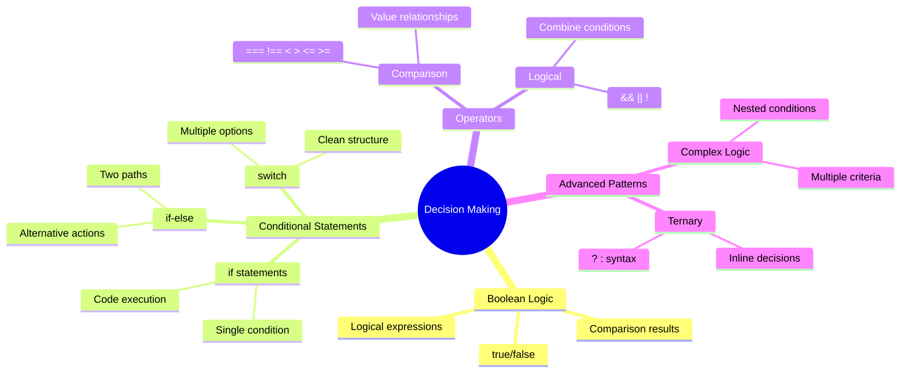

## Boolean'lar Üzerine Kısa Bir Hatırlatma

Karar vermeyi keşfetmeden önce, önceki dersimizden Boolean değerlerini tekrar gözden geçirelim. Matematikçi George Boole'un adını taşıyan bu değerler, ikili durumları temsil eder – ya `true` ya da `false`. Hiçbir belirsizlik, hiçbir ara durum yoktur.

Bu ikili değerler, tüm hesaplama mantığının temelini oluşturur. Programınızın verdiği her karar nihayetinde bir Boolean değerlendirmesine indirgenir.

Boolean değişkenleri oluşturmak oldukça basittir:

```javascript
let myTrueBool = true;
let myFalseBool = false;
```

Bu, açık Boolean değerlerine sahip iki değişken oluşturur.

✅ Boolean'lar, İngiliz matematikçi, filozof ve mantıkçı George Boole (1815–1864) adına adlandırılmıştır.

## Karşılaştırma Operatörleri ve Boolean'lar

Pratikte, Boolean değerlerini manuel olarak ayarlamanız nadirdir. Bunun yerine, koşulları değerlendirerek onları oluşturursunuz: "Bu sayı diğerinden büyük mü?" veya "Bu değerler eşit mi?"

Karşılaştırma operatörleri bu değerlendirmeleri mümkün kılar. Değerleri karşılaştırır ve operatörler arasındaki ilişkiye bağlı olarak Boolean sonuçları döndürür.

| Sembol | Açıklama                                                                                                                                                   | Örnek              |
| ------ | ---------------------------------------------------------------------------------------------------------------------------------------------------------- | ------------------ |
| `<`    | **Küçüktür**: İki değeri karşılaştırır ve sol taraftaki değer sağdan küçükse `true` Boolean veri türünü döndürür                                            | `5 < 6 // true`    |
| `<=`   | **Küçük veya eşittir**: İki değeri karşılaştırır ve sol taraftaki değer sağdan küçük veya eşitse `true` Boolean veri türünü döndürür                        | `5 <= 6 // true`   |
| `>`    | **Büyüktür**: İki değeri karşılaştırır ve sol taraftaki değer sağdan büyükse `true` Boolean veri türünü döndürür                                            | `5 > 6 // false`   |
| `>=`   | **Büyük veya eşittir**: İki değeri karşılaştırır ve sol taraftaki değer sağdan büyük veya eşitse `true` Boolean veri türünü döndürür                        | `5 >= 6 // false`  |
| `===`  | **Sıkı eşitlik**: İki değeri karşılaştırır ve sağdaki ve soldaki değerler eşit VE aynı veri türündeyse `true` Boolean veri türünü döndürür                  | `5 === 6 // false` |
| `!==`  | **Eşitsizlik**: İki değeri karşılaştırır ve sıkı eşitlik operatörünün döndüreceği Boolean değerinin tersini döndürür                                        | `5 !== 6 // true`  |

✅ Bilginizi test etmek için tarayıcınızın konsolunda bazı karşılaştırmalar yazın. Döndürülen veriler sizi şaşırtıyor mu?

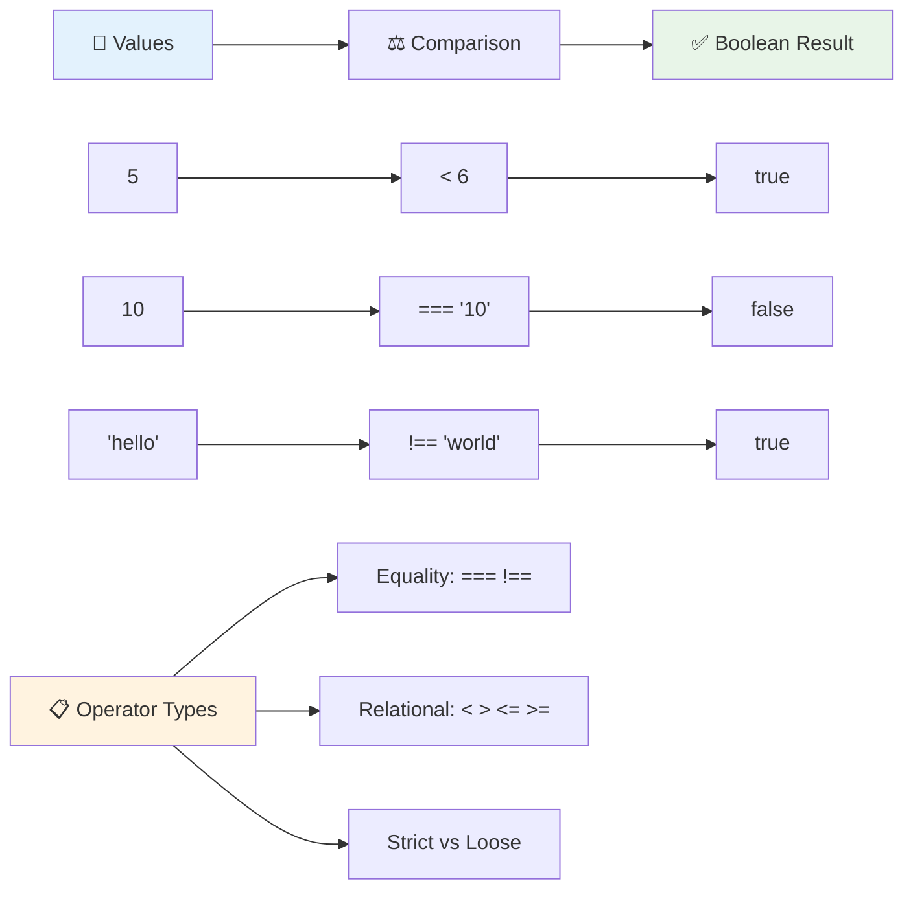

### 🧠 **Karşılaştırma Ustalık Testi: Boolean Mantığını Anlama**

**Karşılaştırma bilginizi test edin:**
- Neden `===` (sıkı eşitlik) genellikle `==` (gevşek eşitlik) yerine tercih edilir?
- `5 === '5'` ne döndürür? Peki ya `5 == '5'`?
- `!==` ile `!=` arasındaki fark nedir?

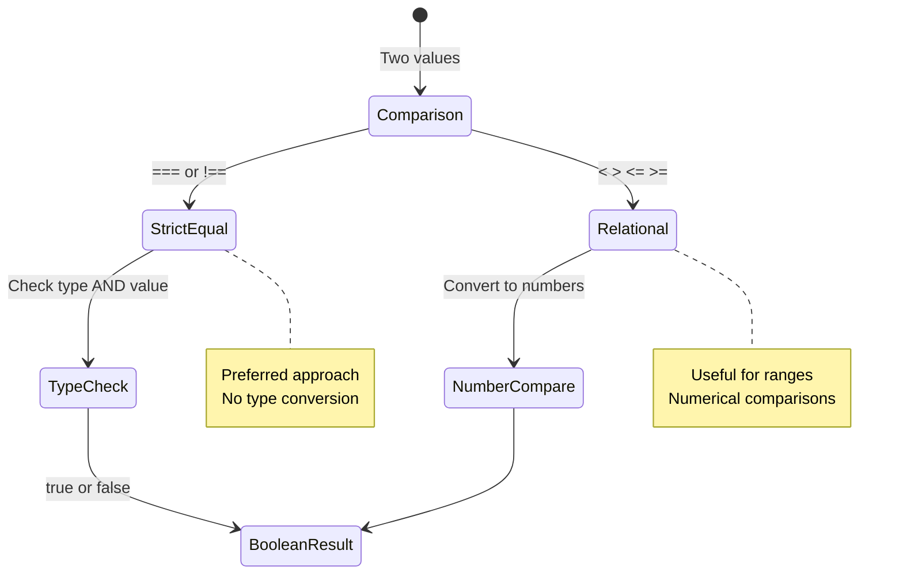

> **İpucu**: Eşitlik kontrolleri için her zaman `===` ve `!==` kullanın, aksi takdirde özellikle tür dönüşümüne ihtiyacınız varsa beklenmeyen davranışları önler!

## If İfadesi

`if` ifadesi, kodunuzda bir soru sormak gibidir. "Eğer bu koşul doğruysa, o zaman bu şeyi yap." JavaScript'te karar vermek için kullanacağınız en önemli araçlardan biridir.

İşte nasıl çalıştığı:

```javascript
if (condition) {
  // Condition is true. Code in this block will run.
}
```

Koşul parantezlerin içine gider ve eğer `true` ise, JavaScript süslü parantezlerin içindeki kodu çalıştırır. Eğer `false` ise, JavaScript o bloğu tamamen atlar.

Bu koşulları oluşturmak için genellikle karşılaştırma operatörlerini kullanırsınız. İşte pratik bir örnek:

```javascript
let currentMoney = 1000;
let laptopPrice = 800;

if (currentMoney >= laptopPrice) {
  // Condition is true. Code in this block will run.
  console.log("Getting a new laptop!");
}
```

`1000 >= 800` `true` olarak değerlendirildiği için, blok içindeki kod çalışır ve konsolda "Yeni bir dizüstü bilgisayar alınıyor!" görüntülenir.

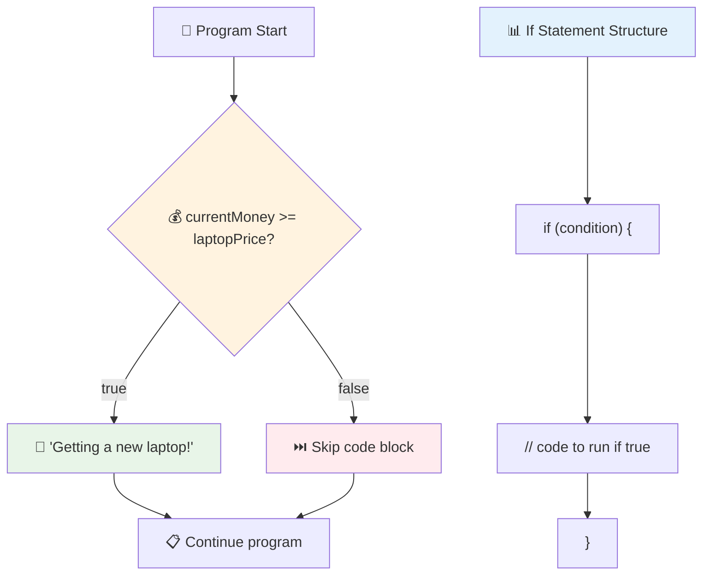

## If..Else İfadesi

Peki ya koşul yanlış olduğunda programınızın farklı bir şey yapmasını istiyorsanız? İşte burada `else` devreye girer – yedek bir planınız varmış gibi.

`else` ifadesi, "eğer bu koşul doğru değilse, bunun yerine başka bir şey yap" demenizi sağlar.

```javascript
let currentMoney = 500;
let laptopPrice = 800;

if (currentMoney >= laptopPrice) {
  // Condition is true. Code in this block will run.
  console.log("Getting a new laptop!");
} else {
  // Condition is false. Code in this block will run.
  console.log("Can't afford a new laptop, yet!");
}
```

Şimdi `500 >= 800` `false` olduğu için, JavaScript ilk bloğu atlar ve bunun yerine `else` bloğunu çalıştırır. Konsolda "Henüz yeni bir dizüstü bilgisayar alamıyorum!" görüntülenir.

✅ Bu kodu ve aşağıdaki kodu tarayıcı konsolunda çalıştırarak anlayışınızı test edin. Döndürülen `console.log()` değerini değiştirmek için currentMoney ve laptopPrice değişkenlerinin değerlerini değiştirin.

### 🎯 **If-Else Mantık Kontrolü: Dallanma Yolları**

**Koşullu mantık bilginizi değerlendirin:**
- `currentMoney` tam olarak `laptopPrice`'a eşit olursa ne olur?
- If-else mantığının gerçek dünyada faydalı olabileceği bir senaryo düşünebilir misiniz?
- Bunu birden fazla fiyat aralığını ele alacak şekilde nasıl genişletebilirsiniz?

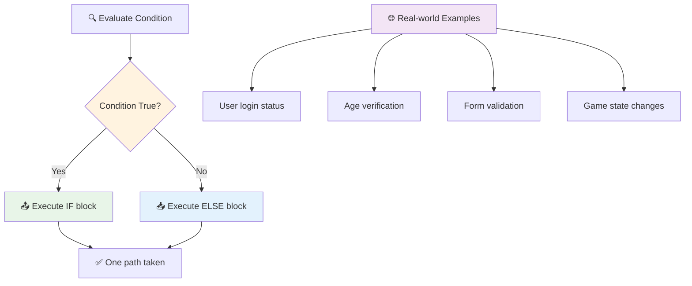

> **Önemli bilgi**: If-else, tam olarak bir yolun seçilmesini sağlar. Bu, programınızın herhangi bir koşula her zaman bir yanıt vermesini garanti eder!

## Switch İfadesi

Bazen bir değeri birden fazla seçeneğe karşı karşılaştırmanız gerekir. Birkaç `if..else` ifadesini zincirleyebilirsiniz, ancak bu yaklaşım hantal hale gelir. `switch` ifadesi, birden fazla ayrık değeri ele almak için daha temiz bir yapı sağlar.

Bu kavram, erken dönem telefon santrallerinde kullanılan mekanik anahtarlama sistemlerine benzer – bir giriş değeri, yürütmenin hangi özel yolu izleyeceğini belirler.

```javascript
switch (expression) {
  case x:
    // code block
    break;
  case y:
    // code block
    break;
  default:
    // code block
}
```

İşte yapısı:
- JavaScript ifadeyi bir kez değerlendirir
- Her `case`'i bir eşleşme bulmak için kontrol eder
- Eşleşme bulduğunda, o kod bloğunu çalıştırır
- `break`, JavaScript'e durmasını ve switch'ten çıkmasını söyler
- Hiçbir case eşleşmezse, varsa `default` bloğunu çalıştırır

```javascript
// Program using switch statement for day of week
let dayNumber = 2;
let dayName;

switch (dayNumber) {
  case 1:
    dayName = "Monday";
    break;
  case 2:
    dayName = "Tuesday";
    break;
  case 3:
    dayName = "Wednesday";
    break;
  default:
    dayName = "Unknown day";
    break;
}
console.log(`Today is ${dayName}`);
```

Bu örnekte, JavaScript `dayNumber`'ın `2` olduğunu görür, eşleşen `case 2`'yi bulur, `dayName`'i "Salı" olarak ayarlar ve ardından switch'ten çıkar. Sonuç? Konsolda "Bugün Salı" görüntülenir.

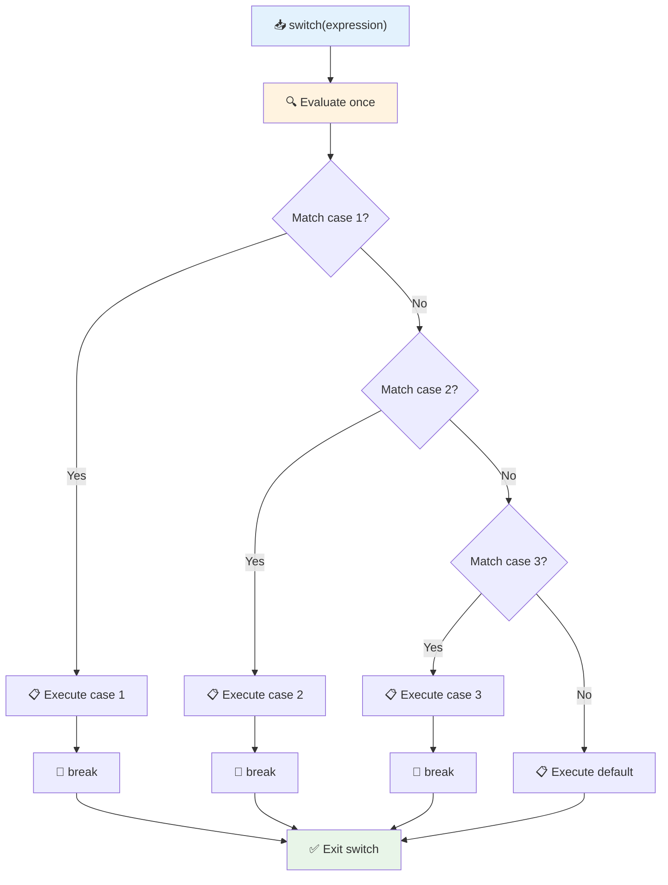

✅ Bu kodu ve aşağıdaki kodu tarayıcı konsolunda çalıştırarak anlayışınızı test edin. Değişken a'nın değerlerini değiştirerek döndürülen `console.log()` değerini değiştirin.

### 🔄 **Switch İfadesi Ustalık Testi: Birden Fazla Seçenek**

**Switch bilginizi test edin:**
- Bir `break` ifadesini unutursanız ne olur?
- Birden fazla `if-else` ifadesi yerine ne zaman `switch` kullanırsınız?
- Tüm olasılıkları kapsadığınızı düşünseniz bile `default` case neden faydalıdır?

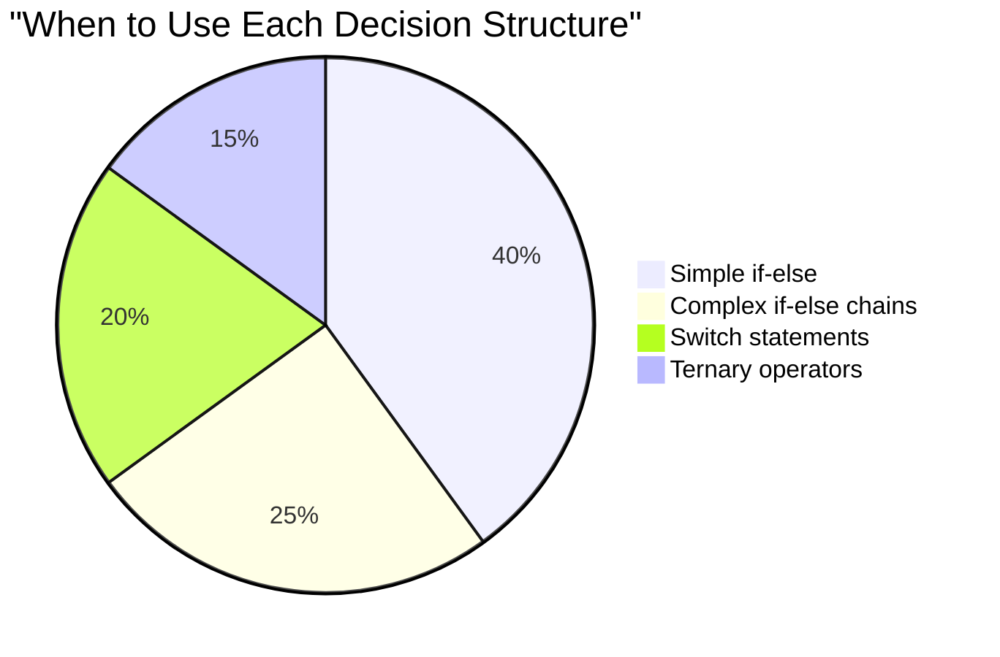

> **En iyi uygulama**: Bir değişkeni birden fazla belirli değere karşı karşılaştırırken `switch` kullanın. Aralık kontrolleri veya karmaşık koşullar için `if-else` kullanın!

## Mantıksal Operatörler ve Boolean'lar

Karmaşık kararlar genellikle aynı anda birden fazla koşulu değerlendirmeyi gerektirir. Boolean cebiri matematikçilerin mantıksal ifadeleri birleştirmesine olanak tanıdığı gibi, programlama da birden fazla Boolean koşulunu bağlamak için mantıksal operatörler sağlar.

Bu operatörler, basit doğru/yanlış değerlendirmeleri birleştirerek sofistike koşullu mantık sağlar.

| Sembol | Açıklama                                                                                     | Örnek                                                                 |
| ------ | -------------------------------------------------------------------------------------------- | --------------------------------------------------------------------- |
| `&&`   | **Mantıksal VE**: İki Boolean ifadeyi karşılaştırır. Her iki taraf da doğruysa `true` döner   | `(5 > 3) && (5 < 10) // Her iki taraf doğru. true döner` |
| `\|\|` | **Mantıksal VEYA**: İki Boolean ifadeyi karşılaştırır. En az bir taraf doğruysa `true` döner | `(5 > 10) \|\| (5 < 10) // Bir taraf yanlış, diğer doğru. true döner` |
| `!`    | **Mantıksal DEĞİL**: Bir Boolean ifadenin ters değerini döndürür                             | `!(5 > 10) // 5, 10'dan büyük değil, bu yüzden "!" bunu doğru yapar` |

Bu operatörler koşulları faydalı şekillerde birleştirmenizi sağlar:
- VE (`&&`) her iki koşulun da doğru olması gerektiği anlamına gelir
- VEYA (`||`) en az bir koşulun doğru olması gerektiği anlamına gelir  
- DEĞİL (`!`) doğruyu yanlışa (ve tam tersine) çevirir

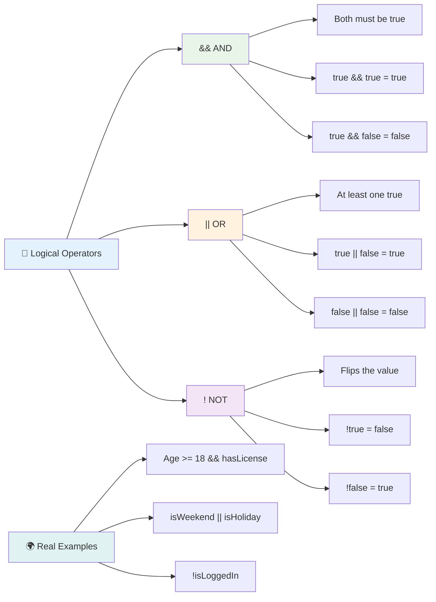

## Mantıksal Operatörlerle Koşullar ve Kararlar

Bu mantıksal operatörleri daha gerçekçi bir örnekle görelim:

```javascript
let currentMoney = 600;
let laptopPrice = 800;
let laptopDiscountPrice = laptopPrice - (laptopPrice * 0.2); // Laptop price at 20 percent off

if (currentMoney >= laptopPrice || currentMoney >= laptopDiscountPrice) {
  // Condition is true. Code in this block will run.
  console.log("Getting a new laptop!");
} else {
  // Condition is false. Code in this block will run.
  console.log("Can't afford a new laptop, yet!");
}
```

Bu örnekte: %20 indirimli fiyatı (640) hesaplıyoruz, ardından mevcut paramızın tam fiyatı VEYA indirimli fiyatı karşılayıp karşılamadığını değerlendiriyoruz. 600, indirimli fiyat eşiği olan 640'ı karşıladığı için koşul doğru olarak değerlendirilir.

### 🧮 **Mantıksal Operatörler Kontrolü: Koşulları Birleştirme**

**Mantıksal operatör bilginizi test edin:**
- `A && B` ifadesinde, A yanlışsa ne olur? B değerlendirilir mi?
- Üç operatöre (&&, ||, !) birden ihtiyaç duyacağınız bir durum düşünebilir misiniz?
- `!user.isActive` ile `user.isActive !== true` arasındaki fark nedir?

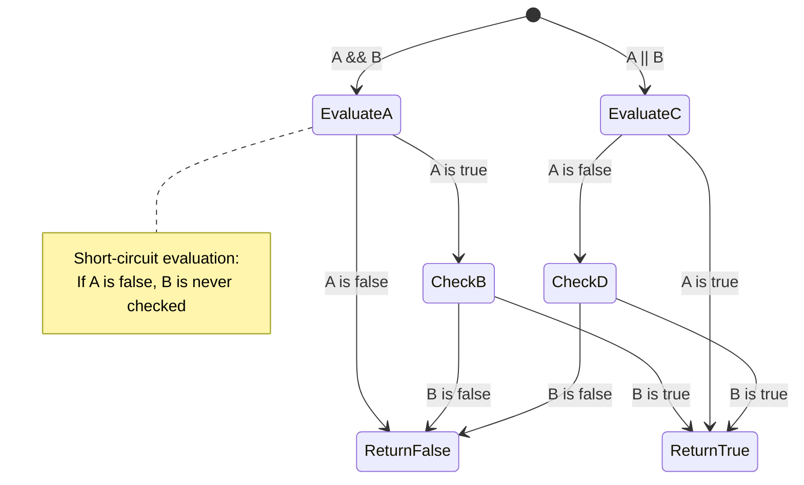

> **Performans ipucu**: JavaScript "kısa devre değerlendirmesi" kullanır - `A && B`'de, A yanlışsa, B değerlendirilmez bile. Bunu avantajınıza kullanın!

### Negasyon Operatörü

Bazen bir şeyin doğru olmadığı durumları düşünmek daha kolaydır. Örneğin, "Kullanıcı giriş yaptı mı?" diye sormak yerine "Kullanıcı giriş yapmadı mı?" diye sormak isteyebilirsiniz. Ünlem işareti (`!`) operatörü mantığı sizin için ters çevirir.

```javascript
if (!condition) {
  // runs if condition is false
} else {
  // runs if condition is true
}
```

`!` operatörü "tam tersi..." demek gibidir – bir şey `true` ise, `!` bunu `false` yapar ve tam tersini.

### Ternary İfadeler

Basit koşullu atamalar için JavaScript, **ternary operatörünü** sağlar. Bu kısa sözdizimi, bir koşullu ifadeyi tek bir satırda yazmanıza olanak tanır ve bir koşula bağlı olarak iki değerden birini atamanız gerektiğinde kullanışlıdır.

```javascript
let variable = condition ? returnThisIfTrue : returnThisIfFalse;
```

Bu bir soru gibi okunur: "Bu koşul doğru mu? Eğer evet, bu değeri kullan. Eğer hayır, şu değeri kullan."

Aşağıda daha somut bir örnek var:

```javascript
let firstNumber = 20;
let secondNumber = 10;
let biggestNumber = firstNumber > secondNumber ? firstNumber : secondNumber;
```

✅ Bu kodu birkaç kez okuyarak bir dakika ayırın. Bu operatörlerin nasıl çalıştığını anlıyor musunuz?

Bu satır şunu söylüyor: "`firstNumber` `secondNumber`'dan büyük mü? Eğer evet, `firstNumber`'ı `biggestNumber`'a koy. Eğer hayır, `secondNumber`'ı `biggestNumber`'a koy."

Ternary operatörü, bu geleneksel `if..else` ifadesini yazmanın sadece daha kısa bir yoludur:

```javascript
let biggestNumber;
if (firstNumber > secondNumber) {
  biggestNumber = firstNumber;
} else {
  biggestNumber = secondNumber;
}
```

Her iki yaklaşım da aynı sonuçları üretir. Ternary operatörü kısalık sunarken, geleneksel if-else yapısı karmaşık koşullar için daha okunabilir olabilir.

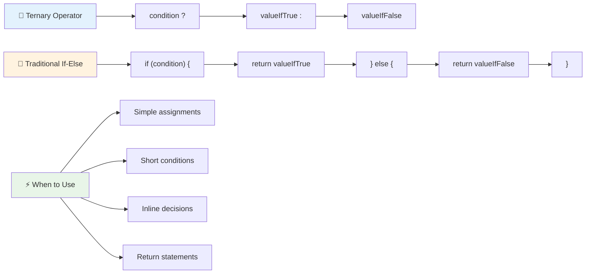

---


## 🚀 Meydan Okuma

Önce mantıksal operatörlerle yazılmış, ardından bir ternary ifade kullanılarak yeniden yazılmış bir program oluşturun. Tercih ettiğiniz sözdizimi hangisi?

---

## GitHub Copilot Agent Meydan Okuması 🚀

Agent modunu kullanarak aşağıdaki meydan okumayı tamamlayın:

**Açıklama:** Bu dersteki birden fazla karar verme kavramını, if-else ifadeleri, switch ifadeleri, mantıksal operatörler ve ternary ifadeler dahil olmak üzere gösteren kapsamlı bir not hesaplayıcı oluşturun.

**İstek:** Bir öğrencinin sayısal puanını (0-100) alan ve aşağıdaki kriterlere göre harf notunu belirleyen bir JavaScript programı yazın:
- A: 90-100
- B: 80-89  
- C: 70-79
- D: 60-69
- F: 60'ın altında

Gereksinimler:
1. Harf notunu belirlemek için bir if-else ifadesi kullanın
2. Mantıksal operatörleri kullanarak öğrencinin geçip geçmediğini (not >= 60) VE onur belgesi alıp almadığını (not >= 90) kontrol edin.  
3. Her harf notu için özel geri bildirim sağlamak amacıyla bir switch ifadesi kullanın.  
4. Öğrencinin bir sonraki kursa uygun olup olmadığını belirlemek için bir üçlü operatör kullanın (not >= 70).  
5. Puanın 0 ile 100 arasında olduğundan emin olmak için giriş doğrulaması ekleyin.  

Programınızı 59, 60, 89, 90 gibi sınır durumlar ve geçersiz girişler dahil olmak üzere çeşitli puanlarla test edin.  

[agent mode](https://code.visualstudio.com/blogs/2025/02/24/introducing-copilot-agent-mode) hakkında daha fazla bilgi edinin.  

## Ders Sonrası Test  

[Ders sonrası test](https://ff-quizzes.netlify.app/web/quiz/12)  

## Gözden Geçirme ve Kendi Kendine Çalışma  

Kullanıcıya sunulan birçok operatör hakkında daha fazla bilgi edinin [MDN'de](https://developer.mozilla.org/docs/Web/JavaScript/Reference/Operators).  

Josh Comeau'nun harika [operatör rehberine](https://joshwcomeau.com/operator-lookup/) göz atın!  

## Ödev  

[Operatörler](assignment.md)  

---

## 🧠 **Karar Verme Araçlarınızın Özeti**  

```mermaid
graph TD
    A["🎯 JavaScript Decisions"] --> B["🔍 Boolean Logic"]
    A --> C["📊 Conditional Statements"]
    A --> D["🔗 Logical Operators"]
    A --> E["⚡ Advanced Patterns"]
    
    B --> B1["true/false values"]
    B --> B2["Comparison operators"]
    B --> B3["Truthiness concepts"]
    
    C --> C1["if statements"]
    C --> C2["if-else chains"]
    C --> C3["switch statements"]
    
    D --> D1["&& (AND)"]
    D --> D2["|| (OR)"]
    D --> D3["! (NOT)"]
    
    E --> E1["Ternary operator"]
    E --> E2["Short-circuit evaluation"]
    E --> E3["Complex conditions"]
    
    F["💡 Key Principles"] --> F1["Clear readable conditions"]
    F --> F2["Consistent comparison style"]
    F --> F3["Proper operator precedence"]
    F --> F4["Efficient evaluation order"]
    
    style A fill:#e3f2fd
    style B fill:#e8f5e8
    style C fill:#fff3e0
    style D fill:#f3e5f5
    style E fill:#e0f2f1
    style F fill:#fce4ec
```
  
---

## 🚀 JavaScript Karar Verme Uzmanlığı Zaman Çizelgeniz  

### ⚡ **Sonraki 5 Dakikada Yapabilecekleriniz**  
- [ ] Tarayıcı konsolunuzda karşılaştırma operatörlerini pratik yapın  
- [ ] Yaşınızı kontrol eden basit bir if-else ifadesi yazın  
- [ ] Meydan okuma: bir if-else ifadesini üçlü operatör kullanarak yeniden yazmayı deneyin  
- [ ] Farklı "doğru" ve "yanlış" değerlerle ne olduğunu test edin  

### 🎯 **Bu Saatte Başarabilecekleriniz**  
- [ ] Ders sonrası testi tamamlayın ve kafa karıştırıcı kavramları gözden geçirin  
- [ ] GitHub Copilot meydan okumasından kapsamlı bir not hesaplayıcı oluşturun  
- [ ] Gerçek bir senaryo için basit bir karar ağacı oluşturun (örneğin, ne giyeceğinizi seçmek gibi)  
- [ ] Mantıksal operatörlerle birden fazla koşulu birleştirme pratiği yapın  
- [ ] Farklı kullanım durumları için switch ifadelerini deneyin  

### 📅 **Haftalık Mantık Uzmanlığı**  
- [ ] Yaratıcı örneklerle operatörler ödevini tamamlayın  
- [ ] Çeşitli koşullu yapılar kullanarak mini bir test uygulaması oluşturun  
- [ ] Birden fazla giriş koşulunu kontrol eden bir form doğrulayıcı oluşturun  
- [ ] Josh Comeau'nun [operatör rehberi](https://joshwcomeau.com/operator-lookup/) alıştırmalarını pratik yapın  
- [ ] Mevcut kodu daha uygun koşullu yapılar kullanarak yeniden düzenleyin  
- [ ] Kısa devre değerlendirmesini ve performans etkilerini inceleyin  

### 🌟 **Aylık Dönüşümünüz**  
- [ ] Karmaşık iç içe geçmiş koşulları ustalıkla kullanın ve kod okunabilirliğini koruyun  
- [ ] Gelişmiş karar verme mantığına sahip bir uygulama oluşturun  
- [ ] Mevcut projelerde koşullu mantığı iyileştirerek açık kaynak katkısında bulunun  
- [ ] Farklı koşullu yapılar hakkında bir başkasına öğretin ve her birinin ne zaman kullanılacağını açıklayın  
- [ ] Koşullu mantık için fonksiyonel programlama yaklaşımlarını keşfedin  
- [ ] Koşullu en iyi uygulamalar için kişisel bir referans rehberi oluşturun  

### 🏆 **Son Karar Verme Şampiyonu Kontrol Noktası**  

**Mantıksal düşünme ustalığınızı kutlayın:**  
- Başarıyla uyguladığınız en karmaşık karar mantığı nedir?  
- Hangi koşullu yapı size en doğal geliyor ve neden?  
- Mantıksal operatörler hakkında öğrenmek problem çözme yaklaşımınızı nasıl değiştirdi?  
- Hangi gerçek dünya uygulaması gelişmiş karar verme mantığından faydalanabilir?  

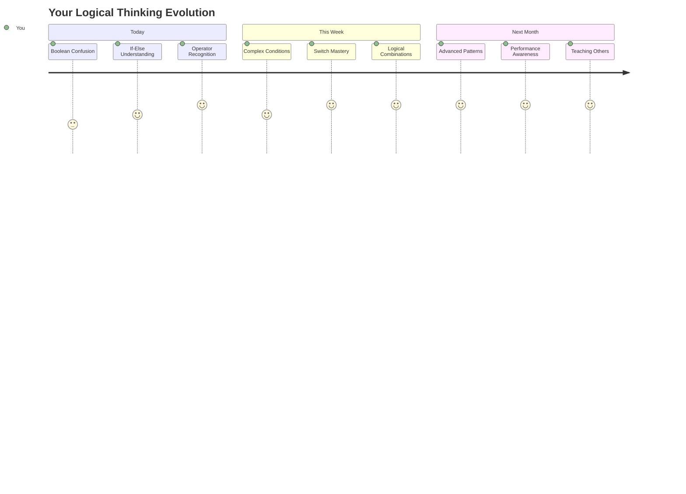
  
> 🧠 **Dijital karar verme sanatında ustalaştınız!** Her etkileşimli uygulama, kullanıcı eylemlerine ve değişen koşullara akıllıca yanıt vermek için koşullu mantığa dayanır. Artık programlarınızın düşünmesini, değerlendirmesini ve uygun yanıtlar seçmesini nasıl sağlayacağınızı biliyorsunuz. Bu mantıksal temel, oluşturduğunuz her dinamik uygulamayı güçlendirecek! 🎉  

---

**Feragatname**:  
Bu belge, AI çeviri hizmeti [Co-op Translator](https://github.com/Azure/co-op-translator) kullanılarak çevrilmiştir. Doğruluk için çaba göstersek de, otomatik çevirilerin hata veya yanlışlıklar içerebileceğini lütfen unutmayın. Belgenin orijinal dili, yetkili kaynak olarak kabul edilmelidir. Kritik bilgiler için profesyonel insan çevirisi önerilir. Bu çevirinin kullanımından kaynaklanan yanlış anlamalar veya yanlış yorumlamalardan sorumlu değiliz.