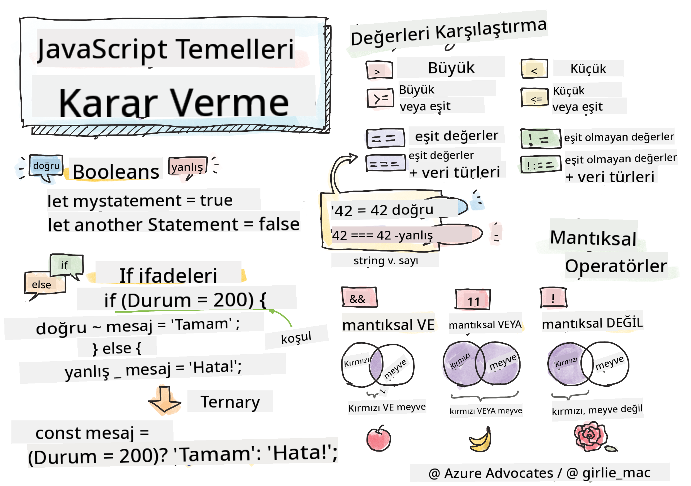

<!--
CO_OP_TRANSLATOR_METADATA:
{
  "original_hash": "888609c48329c280ca2477d2df40f2e5",
  "translation_date": "2025-08-25T21:37:09+00:00",
  "source_file": "2-js-basics/3-making-decisions/README.md",
  "language_code": "tr"
}
-->
# JavaScript Temelleri: Karar Verme



> Sketchnote: [Tomomi Imura](https://twitter.com/girlie_mac)

## Ders Öncesi Test

[Ders öncesi testi](https://ashy-river-0debb7803.1.azurestaticapps.net/quiz/11)

Karar verme ve kodunuzun hangi sırayla çalışacağını kontrol etme, kodunuzu yeniden kullanılabilir ve sağlam hale getirir. Bu bölüm, JavaScript'te veri akışını kontrol etme sözdizimini ve bunun Boolean veri türleriyle kullanıldığında önemini kapsar.

[](https://youtube.com/watch?v=SxTp8j-fMMY "Karar Verme")

> 🎥 Karar verme hakkında bir video için yukarıdaki görsele tıklayın.

> Bu dersi [Microsoft Learn](https://docs.microsoft.com/learn/modules/web-development-101-if-else/?WT.mc_id=academic-77807-sagibbon) üzerinden alabilirsiniz!

## Boolean'lar Üzerine Kısa Bir Hatırlatma

Boolean'lar yalnızca iki değere sahip olabilir: `true` veya `false`. Boolean'lar, belirli koşullar sağlandığında hangi kod satırlarının çalışacağını belirlemeye yardımcı olur.

Boolean'ınızı şu şekilde true veya false olarak ayarlayabilirsiniz:

`let myTrueBool = true`  
`let myFalseBool = false`

✅ Boolean'lar, İngiliz matematikçi, filozof ve mantıkçı George Boole'un (1815–1864) adını almıştır.

## Karşılaştırma Operatörleri ve Boolean'lar

Operatörler, koşulları değerlendirerek bir Boolean değeri oluşturan karşılaştırmalar yapmak için kullanılır. Aşağıda sıkça kullanılan operatörlerin bir listesi bulunmaktadır.

| Sembol | Açıklama                                                                                                                                                     | Örnek              |
| ------ | ------------------------------------------------------------------------------------------------------------------------------------------------------------ | ------------------ |
| `<`    | **Küçüktür**: İki değeri karşılaştırır ve sol taraftaki değer sağdakinden küçükse `true` Boolean veri türünü döndürür                                        | `5 < 6 // true`    |
| `<=`   | **Küçük veya eşittir**: İki değeri karşılaştırır ve sol taraftaki değer sağdakinden küçük veya eşitse `true` Boolean veri türünü döndürür                    | `5 <= 6 // true`   |
| `>`    | **Büyüktür**: İki değeri karşılaştırır ve sol taraftaki değer sağdakinden büyükse `true` Boolean veri türünü döndürür                                       | `5 > 6 // false`   |
| `>=`   | **Büyük veya eşittir**: İki değeri karşılaştırır ve sol taraftaki değer sağdakinden büyük veya eşitse `true` Boolean veri türünü döndürür                   | `5 >= 6 // false`  |
| `===`  | **Sıkı eşitlik**: İki değeri karşılaştırır ve sağdaki ve soldaki değerler eşit ve aynı veri türündeyse `true` Boolean veri türünü döndürür                  | `5 === 6 // false` |
| `!==`  | **Eşit değil**: İki değeri karşılaştırır ve sıkı eşitlik operatörünün döndüreceğinin tersini döndürür                                                       | `5 !== 6 // true`  |

✅ Tarayıcınızın konsolunda bazı karşılaştırmalar yazarak bilginizi test edin. Döndürülen veriler sizi şaşırtıyor mu?

## If Deyimi

If deyimi, koşul doğru olduğunda bloklar arasındaki kodu çalıştırır.

```javascript
if (condition) {
  //Condition is true. Code in this block will run.
}
```

Mantıksal operatörler genellikle koşul oluşturmak için kullanılır.

```javascript
let currentMoney;
let laptopPrice;

if (currentMoney >= laptopPrice) {
  //Condition is true. Code in this block will run.
  console.log("Getting a new laptop!");
}
```

## If..Else Deyimi

`else` deyimi, koşul yanlış olduğunda bloklar arasındaki kodu çalıştırır. `if` deyimiyle kullanımı isteğe bağlıdır.

```javascript
let currentMoney;
let laptopPrice;

if (currentMoney >= laptopPrice) {
  //Condition is true. Code in this block will run.
  console.log("Getting a new laptop!");
} else {
  //Condition is false. Code in this block will run.
  console.log("Can't afford a new laptop, yet!");
}
```

✅ Bu kodu ve aşağıdaki kodu tarayıcı konsolunda çalıştırarak anlayışınızı test edin. Döndürülen `console.log()` çıktısını değiştirmek için currentMoney ve laptopPrice değişkenlerinin değerlerini değiştirin.

## Switch Deyimi

`switch` deyimi, farklı koşullara dayalı olarak farklı işlemler gerçekleştirmek için kullanılır. `switch` deyimini, yürütülecek birçok kod bloğundan birini seçmek için kullanabilirsiniz.

```javascript
switch (expression) {
  case x:
    // code block
    break;
  case y:
    // code block
    break;
  default:
  // code block
}
```

```javascript
// program using switch statement
let a = 2;

switch (a) {
  case 1:
    a = "one";
    break;
  case 2:
    a = "two";
    break;
  default:
    a = "not found";
    break;
}
console.log(`The value is ${a}`);
```

✅ Bu kodu ve aşağıdaki kodu tarayıcı konsolunda çalıştırarak anlayışınızı test edin. Döndürülen `console.log()` çıktısını değiştirmek için a değişkeninin değerlerini değiştirin.

## Mantıksal Operatörler ve Boolean'lar

Kararlar birden fazla karşılaştırma gerektirebilir ve mantıksal operatörlerle birleştirilerek bir Boolean değeri oluşturulabilir.

| Sembol | Açıklama                                                                                     | Örnek                                                                 |
| ------ | ------------------------------------------------------------------------------------------- | --------------------------------------------------------------------- |
| `&&`   | **Mantıksal VE**: İki Boolean ifadesini karşılaştırır. Her iki taraf da doğruysa true döner  | `(5 > 6) && (5 < 6 ) //Bir taraf yanlış, diğer taraf doğru. false döner` |
| `\|\|` | **Mantıksal VEYA**: İki Boolean ifadesini karşılaştırır. En az bir taraf doğruysa true döner | `(5 > 6) \|\| (5 < 6) //Bir taraf yanlış, diğer taraf doğru. true döner` |
| `!`    | **Mantıksal DEĞİL**: Bir Boolean ifadesinin ters değerini döndürür                          | `!(5 > 6) // 5, 6'dan büyük değil, ancak "!" true döndürecek`         |

## Mantıksal Operatörlerle Koşullar ve Kararlar

Mantıksal operatörler, if..else deyimlerinde koşullar oluşturmak için kullanılabilir.

```javascript
let currentMoney;
let laptopPrice;
let laptopDiscountPrice = laptopPrice - laptopPrice * 0.2; //Laptop price at 20 percent off

if (currentMoney >= laptopPrice || currentMoney >= laptopDiscountPrice) {
  //Condition is true. Code in this block will run.
  console.log("Getting a new laptop!");
} else {
  //Condition is true. Code in this block will run.
  console.log("Can't afford a new laptop, yet!");
}
```

### Negasyon Operatörü

Şimdiye kadar, koşullu mantık oluşturmak için bir `if...else` deyimini nasıl kullanabileceğinizi gördünüz. `if` içine giren her şey true/false olarak değerlendirilmelidir. `!` operatörünü kullanarak ifadeyi _tersine çevirebilirsiniz_. Şöyle görünecektir:

```javascript
if (!condition) {
  // runs if condition is false
} else {
  // runs if condition is true
}
```

### Üçlü İfadeler

`if...else`, karar mantığını ifade etmenin tek yolu değildir. Ayrıca üçlü operatör adı verilen bir şey de kullanabilirsiniz. Sözdizimi şu şekilde görünür:

```javascript
let variable = condition ? <return this if true> : <return this if false>
```

Aşağıda daha somut bir örnek verilmiştir:

```javascript
let firstNumber = 20;
let secondNumber = 10;
let biggestNumber = firstNumber > secondNumber ? firstNumber : secondNumber;
```

✅ Bu kodu birkaç kez okuyarak bir dakikanızı ayırın. Bu operatörlerin nasıl çalıştığını anlıyor musunuz?

Yukarıdaki ifade şunu belirtir:

- Eğer `firstNumber`, `secondNumber`'dan büyükse  
- `firstNumber`'ı `biggestNumber`'a atayın  
- aksi takdirde `secondNumber`'ı atayın.

Üçlü ifade, aşağıdaki kodu yazmanın yalnızca daha kompakt bir yoludur:

```javascript
let biggestNumber;
if (firstNumber > secondNumber) {
  biggestNumber = firstNumber;
} else {
  biggestNumber = secondNumber;
}
```

---

## 🚀 Zorluk

Önce mantıksal operatörlerle yazılmış, ardından üçlü bir ifadeyle yeniden yazılmış bir program oluşturun. Tercih ettiğiniz sözdizimi hangisi?

---

## Ders Sonrası Test

[Ders sonrası testi](https://ashy-river-0debb7803.1.azurestaticapps.net/quiz/12)

## Gözden Geçirme ve Kendi Kendine Çalışma

Kullanıcıya sunulan birçok operatör hakkında daha fazla bilgi edinmek için [MDN'de](https://developer.mozilla.org/docs/Web/JavaScript/Reference/Operators) okuyun.

Josh Comeau'nun harika [operatör rehberine](https://joshwcomeau.com/operator-lookup/) göz atın!

## Ödev

[Operatörler](assignment.md)

**Feragatname**:  
Bu belge, AI çeviri hizmeti [Co-op Translator](https://github.com/Azure/co-op-translator) kullanılarak çevrilmiştir. Doğruluk için çaba göstersek de, otomatik çevirilerin hata veya yanlışlık içerebileceğini lütfen unutmayın. Belgenin orijinal dili, yetkili kaynak olarak kabul edilmelidir. Kritik bilgiler için profesyonel insan çevirisi önerilir. Bu çevirinin kullanımından kaynaklanan yanlış anlamalar veya yanlış yorumlamalar için sorumluluk kabul etmiyoruz.