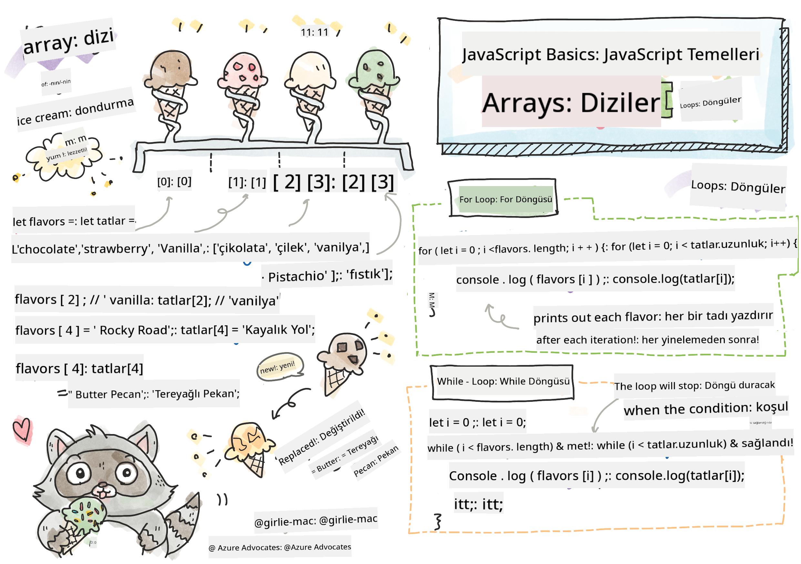

<!--
CO_OP_TRANSLATOR_METADATA:
{
  "original_hash": "3f7f87871312cf6cc12662da7d973182",
  "translation_date": "2025-08-25T21:49:54+00:00",
  "source_file": "2-js-basics/4-arrays-loops/README.md",
  "language_code": "tr"
}
-->
# JavaScript Temelleri: Diziler ve Döngüler


> Sketchnote: [Tomomi Imura](https://twitter.com/girlie_mac)

## Ders Öncesi Test
[Ders öncesi test](https://ff-quizzes.netlify.app/web/quiz/13)

Bu ders, webde etkileşim sağlayan JavaScript dilinin temellerini kapsar. Bu derste, verileri manipüle etmek için kullanılan diziler ve döngüler hakkında bilgi edineceksiniz.

[](https://youtube.com/watch?v=1U4qTyq02Xw "Diziler")

[](https://www.youtube.com/watch?v=Eeh7pxtTZ3k "Döngüler")

> 🎥 Diziler ve döngüler hakkında videolar için yukarıdaki görsellere tıklayın.

> Bu dersi [Microsoft Learn](https://docs.microsoft.com/learn/modules/web-development-101-arrays/?WT.mc_id=academic-77807-sagibbon) üzerinden alabilirsiniz!

## Diziler

Verilerle çalışmak, herhangi bir programlama dili için yaygın bir görevdir ve veriler bir liste gibi yapısal bir formatta düzenlendiğinde bu görev çok daha kolay hale gelir. Dizilerle, veriler bir listeye benzer bir yapıda saklanır. Dizilerin en büyük avantajlarından biri, bir dizide farklı türde veriler saklayabilmenizdir.

✅ Diziler hayatımızın her yerinde! Güneş paneli dizisi gibi gerçek hayattan bir dizi örneği düşünebilir misiniz?

Bir dizinin sözdizimi, bir çift köşeli parantezden oluşur.

```javascript
let myArray = [];
```

Bu boş bir dizidir, ancak diziler veriyle önceden doldurulmuş olarak da tanımlanabilir. Bir dizideki birden fazla değer, virgülle ayrılır.

```javascript
let iceCreamFlavors = ["Chocolate", "Strawberry", "Vanilla", "Pistachio", "Rocky Road"];
```

Dizi değerlerine, **indeks** adı verilen benzersiz bir değer atanır. Bu indeks, dizinin başlangıcından olan uzaklığına göre atanır ve bir tam sayıdır. Yukarıdaki örnekte, "Chocolate" string değeri 0 indeksine sahiptir ve "Rocky Road" 4 indeksine sahiptir. Dizi değerlerini almak, değiştirmek veya eklemek için indeksi köşeli parantezlerle kullanabilirsiniz.

✅ Dizilerin sıfır indeksinden başlaması sizi şaşırtıyor mu? Bazı programlama dillerinde indeksler 1'den başlar. Bununla ilgili ilginç bir geçmişi [Wikipedia'da okuyabilirsiniz](https://en.wikipedia.org/wiki/Zero-based_numbering).

```javascript
let iceCreamFlavors = ["Chocolate", "Strawberry", "Vanilla", "Pistachio", "Rocky Road"];
iceCreamFlavors[2]; //"Vanilla"
```

Bir değeri değiştirmek için indeksi şu şekilde kullanabilirsiniz:

```javascript
iceCreamFlavors[4] = "Butter Pecan"; //Changed "Rocky Road" to "Butter Pecan"
```

Ve belirli bir indekste yeni bir değer eklemek için şu şekilde yapabilirsiniz:

```javascript
iceCreamFlavors[5] = "Cookie Dough"; //Added "Cookie Dough"
```

✅ Dizilere değer eklemek için daha yaygın bir yöntem, array.push() gibi dizi operatörlerini kullanmaktır.

Bir dizide kaç öğe olduğunu öğrenmek için `length` özelliğini kullanabilirsiniz.

```javascript
let iceCreamFlavors = ["Chocolate", "Strawberry", "Vanilla", "Pistachio", "Rocky Road"];
iceCreamFlavors.length; //5
```

✅ Kendiniz deneyin! Tarayıcınızın konsolunu kullanarak kendi oluşturduğunuz bir diziyi yaratın ve manipüle edin.

## Döngüler

Döngüler, tekrarlayan veya **iteratif** görevleri gerçekleştirmemizi sağlar ve çok fazla zaman ve kod tasarrufu sağlar. Her iterasyon, değişkenler, değerler ve koşullar açısından farklılık gösterebilir. JavaScript'te farklı türde döngüler vardır ve hepsi küçük farklılıklara sahip olsa da temelde aynı şeyi yapar: veriler üzerinde döngü oluşturur.

### For Döngüsü

`for` döngüsü, iterasyon yapmak için 3 parçaya ihtiyaç duyar:
- `counter` Genellikle bir sayıyla başlatılan ve iterasyon sayısını sayan bir değişken
- `condition` Karşılaştırma operatörlerini kullanarak döngünün `false` olduğunda durmasını sağlayan ifade
- `iteration-expression` Her iterasyonun sonunda çalışır, genellikle sayaç değerini değiştirmek için kullanılır
  
```javascript
// Counting up to 10
for (let i = 0; i < 10; i++) {
  console.log(i);
}
```

✅ Bu kodu bir tarayıcı konsolunda çalıştırın. Sayaç, koşul veya iterasyon ifadesinde küçük değişiklikler yaptığınızda ne olur? Geriye doğru çalıştırarak bir geri sayım oluşturabilir misiniz?

### While Döngüsü

`for` döngüsünün sözdiziminden farklı olarak, `while` döngüleri yalnızca `false` olduğunda döngüyü durduracak bir koşula ihtiyaç duyar. Döngülerdeki koşullar genellikle sayaç gibi diğer değerlere dayanır ve döngü sırasında yönetilmelidir. Sayaç için başlangıç değerleri döngü dışında oluşturulmalı ve bir koşulu karşılamak için gereken ifadeler, sayaç değişikliği dahil, döngü içinde sürdürülmelidir.

```javascript
//Counting up to 10
let i = 0;
while (i < 10) {
 console.log(i);
 i++;
}
```

✅ Neden bir for döngüsünü bir while döngüsüne tercih edersiniz? StackOverflow'da 17 bin izleyici aynı soruyu sordu ve bazı görüşler [ilginizi çekebilir](https://stackoverflow.com/questions/39969145/while-loops-vs-for-loops-in-javascript).

## Döngüler ve Diziler

Diziler genellikle döngülerle birlikte kullanılır çünkü çoğu koşul, döngüyü durdurmak için dizinin uzunluğunu gerektirir ve indeks aynı zamanda sayaç değeri olabilir.

```javascript
let iceCreamFlavors = ["Chocolate", "Strawberry", "Vanilla", "Pistachio", "Rocky Road"];

for (let i = 0; i < iceCreamFlavors.length; i++) {
  console.log(iceCreamFlavors[i]);
} //Ends when all flavors are printed
```

✅ Kendi oluşturduğunuz bir dizi üzerinde döngü yapmayı tarayıcınızın konsolunda deneyin.

---

## 🚀 Meydan Okuma

Diziler üzerinde döngü yapmanın for ve while döngülerinden başka yolları da vardır. [forEach](https://developer.mozilla.org/docs/Web/JavaScript/Reference/Global_Objects/Array/forEach), [for-of](https://developer.mozilla.org/docs/Web/JavaScript/Reference/Statements/for...of) ve [map](https://developer.mozilla.org/docs/Web/JavaScript/Reference/Global_Objects/Array/map) gibi yöntemler vardır. Dizi döngünüzü bu tekniklerden biriyle yeniden yazın.

## Ders Sonrası Test
[Ders sonrası test](https://ff-quizzes.netlify.app/web/quiz/14)

## Gözden Geçirme ve Kendi Kendine Çalışma

JavaScript'teki diziler, veri manipülasyonu için son derece kullanışlı olan birçok metoda sahiptir. [Bu metodlar hakkında bilgi edinin](https://developer.mozilla.org/docs/Web/JavaScript/Reference/Global_Objects/Array) ve kendi oluşturduğunuz bir dizide bazılarını (örneğin push, pop, slice ve splice) deneyin.

## Ödev

[Dizi Döngüsü](assignment.md)

**Feragatname**:  
Bu belge, [Co-op Translator](https://github.com/Azure/co-op-translator) adlı bir yapay zeka çeviri hizmeti kullanılarak çevrilmiştir. Doğruluk için çaba göstersek de, otomatik çevirilerin hata veya yanlışlıklar içerebileceğini lütfen unutmayın. Orijinal belgenin kendi dilindeki hali, yetkili kaynak olarak kabul edilmelidir. Kritik bilgiler için profesyonel bir insan çevirisi önerilir. Bu çevirinin kullanımından kaynaklanan yanlış anlamalar veya yanlış yorumlamalar için sorumluluk kabul edilmez.