<!--
CO_OP_TRANSLATOR_METADATA:
{
  "original_hash": "1710a50a519a6e4a1b40a5638783018d",
  "translation_date": "2025-11-04T00:42:41+00:00",
  "source_file": "2-js-basics/4-arrays-loops/README.md",
  "language_code": "tr"
}
-->
# JavaScript Temelleri: Diziler ve Döngüler


> Sketchnote: [Tomomi Imura](https://twitter.com/girlie_mac)

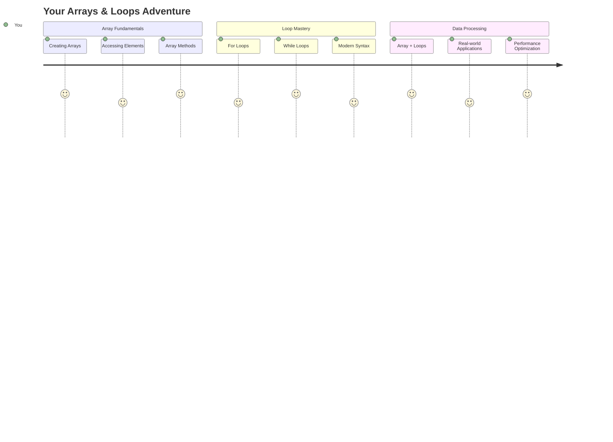

## Ders Öncesi Test
[Ders öncesi test](https://ff-quizzes.netlify.app/web/quiz/13)

Hiç web sitelerinin alışveriş sepeti öğelerini nasıl takip ettiğini veya arkadaş listenizi nasıl görüntülediğini merak ettiniz mi? İşte burada diziler ve döngüler devreye giriyor. Diziler, birden fazla bilgiyi tutan dijital kaplar gibidir, döngüler ise tüm bu verilerle verimli bir şekilde çalışmanıza olanak tanır.

Bu iki kavram bir araya geldiğinde, programlarınızda bilgi işleme temellerini oluşturur. Her adımı manuel olarak yazmaktan, yüzlerce hatta binlerce öğeyi hızlı bir şekilde işleyebilen akıllı ve verimli kodlar oluşturmaya geçiş yapmayı öğreneceksiniz.

Bu dersin sonunda, sadece birkaç satır kodla karmaşık veri görevlerini nasıl gerçekleştireceğinizi anlayacaksınız. Haydi bu temel programlama kavramlarını keşfedelim.

[](https://youtube.com/watch?v=1U4qTyq02Xw "Diziler")

[](https://www.youtube.com/watch?v=Eeh7pxtTZ3k "Döngüler")

> 🎥 Yukarıdaki videolar için görsellere tıklayın: diziler ve döngüler hakkında bilgi edinin.

> Bu dersi [Microsoft Learn](https://docs.microsoft.com/learn/modules/web-development-101-arrays/?WT.mc_id=academic-77807-sagibbon) üzerinden alabilirsiniz!

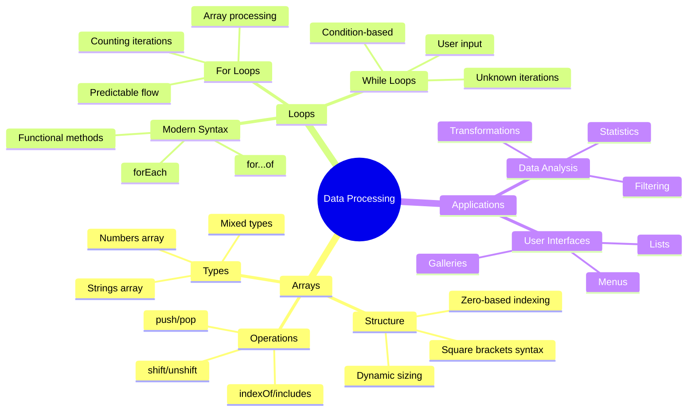

## Diziler

Dizileri dijital bir dosya dolabı gibi düşünün - her çekmecede bir belge saklamak yerine, birden fazla ilgili öğeyi tek bir yapılandırılmış kapta organize edebilirsiniz. Programlama açısından, diziler birden fazla bilgiyi tek bir düzenli pakette saklamanıza olanak tanır.

Bir fotoğraf galerisi oluşturuyor, yapılacaklar listesini yönetiyor veya bir oyunda yüksek puanları takip ediyor olun, diziler veri organizasyonu için temel sağlar. Haydi nasıl çalıştıklarına bakalım.

✅ Diziler her yerde! Güneş paneli dizisi gibi gerçek hayattan bir dizi örneği düşünebilir misiniz?

### Dizi Oluşturma

Bir dizi oluşturmak çok basit - sadece köşeli parantezler kullanın!

```javascript
// Empty array - like an empty shopping cart waiting for items
const myArray = [];
```

**Burada ne oluyor?**
Köşeli parantezler `[]` kullanarak boş bir kap oluşturdunuz. Bunu boş bir kütüphane rafı gibi düşünün - orada organize etmek istediğiniz kitapları tutmaya hazır.

Diziyi başlangıç değerleriyle doldurabilirsiniz:

```javascript
// Your ice cream shop's flavor menu
const iceCreamFlavors = ["Chocolate", "Strawberry", "Vanilla", "Pistachio", "Rocky Road"];

// A user's profile info (mixing different types of data)
const userData = ["John", 25, true, "developer"];

// Test scores for your favorite class
const scores = [95, 87, 92, 78, 85];
```

**Dikkat edilmesi gereken harika şeyler:**
- Aynı dizide metin, sayı veya doğru/yanlış değerleri saklayabilirsiniz
- Her öğeyi bir virgülle ayırmanız yeterli - çok kolay!
- Diziler, ilgili bilgileri bir arada tutmak için mükemmeldir

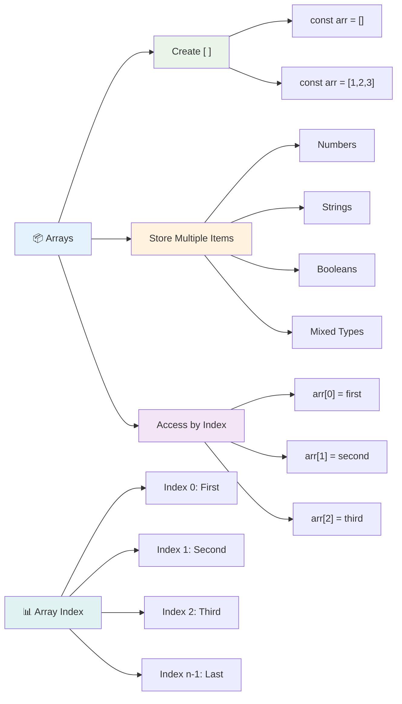

### Dizi İndeksleme

Başlangıçta biraz garip gelebilecek bir şey: diziler öğelerini 1'den değil, 0'dan numaralandırır. Bu sıfır tabanlı indeksleme, bilgisayar belleğinin çalışma şekline dayanır - C gibi eski programlama dillerinden beri bir programlama geleneği olmuştur. Dizideki her bir nokta, **indeks** adı verilen kendi adres numarasını alır.

| İndeks | Değer | Açıklama |
|-------|-------|-------------|
| 0 | "Çikolata" | İlk öğe |
| 1 | "Çilek" | İkinci öğe |
| 2 | "Vanilya" | Üçüncü öğe |
| 3 | "Antep Fıstığı" | Dördüncü öğe |
| 4 | "Rocky Road" | Beşinci öğe |

✅ Dizilerin sıfır indeksinden başlaması sizi şaşırtıyor mu? Bazı programlama dillerinde indeksler 1'den başlar. Bununla ilgili ilginç bir geçmişi [Wikipedia'da okuyabilirsiniz](https://en.wikipedia.org/wiki/Zero-based_numbering).

**Dizi Öğelerine Erişim:**

```javascript
const iceCreamFlavors = ["Chocolate", "Strawberry", "Vanilla", "Pistachio", "Rocky Road"];

// Access individual elements using bracket notation
console.log(iceCreamFlavors[0]); // "Chocolate" - first element
console.log(iceCreamFlavors[2]); // "Vanilla" - third element
console.log(iceCreamFlavors[4]); // "Rocky Road" - last element
```

**Burada olanları açıklayalım:**
- **Kullanır**: İndeks numarasıyla köşeli parantez notasyonu
- **Döndürür**: Dizideki belirli pozisyonda saklanan değeri
- **Başlar**: 0'dan saymaya, ilk öğe indeks 0 olur

**Dizi Öğelerini Değiştirme:**

```javascript
// Change an existing value
iceCreamFlavors[4] = "Butter Pecan";
console.log(iceCreamFlavors[4]); // "Butter Pecan"

// Add a new element at the end
iceCreamFlavors[5] = "Cookie Dough";
console.log(iceCreamFlavors[5]); // "Cookie Dough"
```

**Yukarıda şunları yaptık:**
- **Değiştirdik**: İndeks 4'teki öğeyi "Rocky Road"dan "Butter Pecan"a
- **Ekledik**: İndeks 5'e yeni bir öğe "Cookie Dough"
- **Otomatik olarak genişlettik**: Mevcut sınırların ötesine ekleme yapıldığında dizi uzunluğu

### Dizi Uzunluğu ve Yaygın Metotlar

Diziler, veriyle çalışmayı çok daha kolaylaştıran yerleşik özellikler ve metotlarla birlikte gelir.

**Dizi Uzunluğunu Bulma:**

```javascript
const iceCreamFlavors = ["Chocolate", "Strawberry", "Vanilla", "Pistachio", "Rocky Road"];
console.log(iceCreamFlavors.length); // 5

// Length updates automatically as array changes
iceCreamFlavors.push("Mint Chip");
console.log(iceCreamFlavors.length); // 6
```

**Hatırlanması gereken önemli noktalar:**
- **Döndürür**: Dizideki toplam öğe sayısını
- **Otomatik olarak güncellenir**: Öğeler eklendiğinde veya kaldırıldığında
- **Dinamik bir sayaç sağlar**: Döngüler ve doğrulama için kullanışlıdır

**Temel Dizi Metotları:**

```javascript
const fruits = ["apple", "banana", "orange"];

// Add elements
fruits.push("grape");           // Adds to end: ["apple", "banana", "orange", "grape"]
fruits.unshift("strawberry");   // Adds to beginning: ["strawberry", "apple", "banana", "orange", "grape"]

// Remove elements
const lastFruit = fruits.pop();        // Removes and returns "grape"
const firstFruit = fruits.shift();     // Removes and returns "strawberry"

// Find elements
const index = fruits.indexOf("banana"); // Returns 1 (position of "banana")
const hasApple = fruits.includes("apple"); // Returns true
```

**Bu metotları anlamak:**
- **Ekler**: `push()` (son) ve `unshift()` (başlangıç) ile öğeler
- **Kaldırır**: `pop()` (son) ve `shift()` (başlangıç) ile öğeler
- **Bulur**: `indexOf()` ile öğeleri ve `includes()` ile varlığını kontrol eder
- **Döndürür**: Kaldırılan öğeler veya pozisyon indeksleri gibi faydalı değerler

✅ Kendiniz deneyin! Tarayıcınızın konsolunda kendi oluşturduğunuz bir diziyi oluşturun ve üzerinde değişiklikler yapın.

### 🧠 **Dizi Temelleri Kontrolü: Verilerinizi Düzenleme**

**Dizi anlayışınızı test edin:**
- Sizce diziler neden 0'dan saymaya başlıyor, 1'den değil?
- Var olmayan bir indekse erişmeye çalışırsanız ne olur (örneğin, 5 öğeli bir dizide `arr[100]`)?
- Dizilerin kullanışlı olduğu üç gerçek dünya senaryosu düşünebilir misiniz?

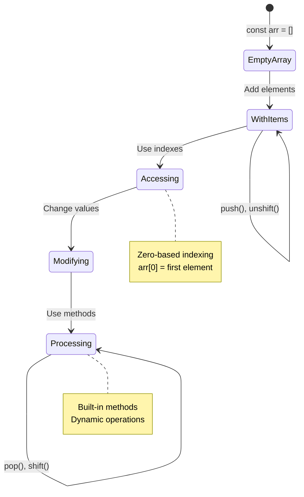

> **Gerçek dünya içgörüsü**: Diziler programlamada her yerde! Sosyal medya akışları, alışveriş sepetleri, fotoğraf galerileri, çalma listesi şarkıları - hepsi arka planda diziler!

## Döngüler

Charles Dickens'ın romanlarındaki ünlü ceza sahnesini düşünün; öğrenciler bir cümleyi defalarca yazmak zorunda kalırdı. Birine "bu cümleyi 100 kez yaz" demeyi ve bunun otomatik olarak yapılmasını hayal edin. Döngüler tam olarak bunu kodunuz için yapar.

Döngüler, görevleri hatasız bir şekilde tekrarlayabilen yorulmaz bir asistan gibidir. Alışveriş sepetindeki her öğeyi kontrol etmek veya bir albümdeki tüm fotoğrafları görüntülemek istiyorsanız, döngüler tekrarı verimli bir şekilde halleder.

JavaScript, seçebileceğiniz birkaç döngü türü sunar. Her birini inceleyelim ve ne zaman kullanmanız gerektiğini anlayalım.

```mermaid
flowchart TD
    A["🔄 Loop Types"] --> B["For Loop"]
    A --> C["While Loop"]
    A --> D["For...of Loop"]
    A --> E["forEach Method"]
    
    B --> B1["Known iterations"]
    B --> B2["Counter-based"]
    B --> B3["for(init; condition; increment)"]
    
    C --> C1["Unknown iterations"]
    C --> C2["Condition-based"]
    C --> C3["while(condition)"]
    
    D --> D1["Modern ES6+"]
    D --> D2["Array iteration"]
    D --> D3["for(item of array)"]
    
    E --> E1["Functional style"]
    E --> E2["Array method"]
    E --> E3["array.forEach(callback)"]
    
    F["⏰ When to Use"] --> F1["For: Counting, indexes"]
    F --> F2["While: User input, searching"]
    F --> F3["For...of: Simple iteration"]
    F --> F4["forEach: Functional programming"]
    
    style A fill:#e3f2fd
    style B fill:#e8f5e8
    style C fill:#fff3e0
    style D fill:#f3e5f5
    style E fill:#e0f2f1
    style F fill:#fce4ec
```

### For Döngüsü

`for` döngüsü, bir zamanlayıcı ayarlamak gibidir - bir şeyin kaç kez gerçekleşmesini istediğinizi tam olarak bilirsiniz. Çok düzenli ve öngörülebilirdir, bu da dizilerle çalışırken veya bir şeyleri saymanız gerektiğinde mükemmel bir seçimdir.

**For Döngüsü Yapısı:**

| Bileşen | Amacı | Örnek |
|-----------|---------|----------|
| **Başlatma** | Başlangıç noktasını ayarlar | `let i = 0` |
| **Koşul** | Ne zaman devam edileceği | `i < 10` |
| **Artış** | Nasıl güncelleneceği | `i++` |

```javascript
// Counting from 0 to 9
for (let i = 0; i < 10; i++) {
  console.log(`Count: ${i}`);
}

// More practical example: processing scores
const testScores = [85, 92, 78, 96, 88];
for (let i = 0; i < testScores.length; i++) {
  console.log(`Student ${i + 1}: ${testScores[i]}%`);
}
```

**Adım adım, burada olanlar:**
- **Başlatır**: Sayaç değişkeni `i`yi başlangıçta 0 olarak ayarlar
- **Kontrol eder**: Her yinelemeden önce `i < 10` koşulunu
- **Çalıştırır**: Koşul doğru olduğunda kod bloğunu
- **Artırır**: Her yinelemeden sonra `i`yi 1 artırır (`i++`)
- **Durur**: Koşul yanlış olduğunda (örneğin, `i` 10'a ulaştığında)

✅ Bu kodu tarayıcı konsolunda çalıştırın. Sayaç, koşul veya yineleme ifadesinde küçük değişiklikler yaptığınızda ne olur? Geriye doğru çalıştırabilir misiniz, bir geri sayım oluşturabilir misiniz?

### 🗓️ **For Döngüsü Ustalık Kontrolü: Kontrollü Tekrar**

**For döngüsü anlayışınızı değerlendirin:**
- Bir for döngüsünün üç parçası nedir ve her biri ne yapar?
- Bir diziyi geriye doğru nasıl döngüye alırsınız?
- Artış kısmını (`i++`) unutursanız ne olur?

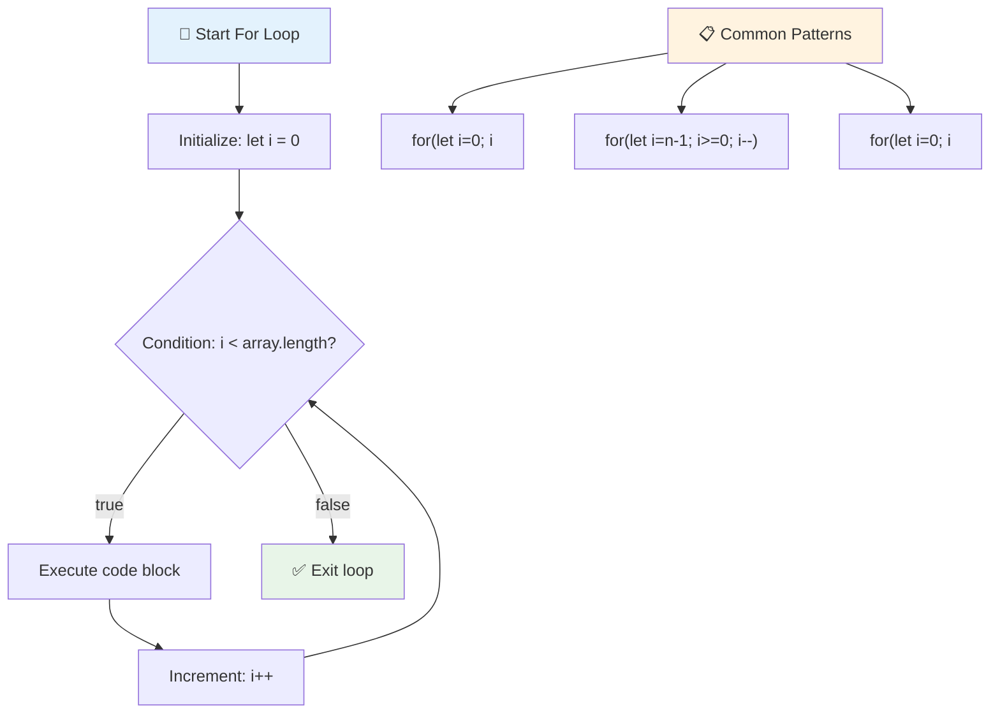

> **Döngü bilgeliği**: For döngüleri, bir şeyi kaç kez tekrarlamanız gerektiğini tam olarak bildiğinizde mükemmeldir. Dizi işlemede en yaygın seçimdir!

### While Döngüsü

`while` döngüsü, "bunu yapmaya devam et, ta ki..." demek gibidir - kaç kez çalışacağını tam olarak bilmeyebilirsiniz, ancak ne zaman duracağınızı bilirsiniz. Kullanıcıdan istediğiniz girdiyi alana kadar sormak veya aradığınız veriyi bulana kadar veri aramak gibi durumlar için mükemmeldir.

**While Döngüsü Özellikleri:**
- **Devam eder**: Koşul doğru olduğu sürece çalışır
- **Gerektirir**: Sayaç değişkenlerinin manuel yönetimini
- **Kontrol eder**: Her yinelemeden önce koşulu
- **Risk taşır**: Koşul asla yanlış olmazsa sonsuz döngü riski

```javascript
// Basic counting example
let i = 0;
while (i < 10) {
  console.log(`While count: ${i}`);
  i++; // Don't forget to increment!
}

// More practical example: processing user input
let userInput = "";
let attempts = 0;
const maxAttempts = 3;

while (userInput !== "quit" && attempts < maxAttempts) {
  userInput = prompt(`Enter 'quit' to exit (attempt ${attempts + 1}):`);
  attempts++;
}

if (attempts >= maxAttempts) {
  console.log("Maximum attempts reached!");
}
```

**Bu örnekleri anlamak:**
- **Yönetir**: Sayaç değişkeni `i`yi döngü gövdesinde manuel olarak
- **Artırır**: Sonsuz döngüleri önlemek için sayaç
- **Pratik kullanım örneği gösterir**: Kullanıcı girdisi ve deneme sınırlandırması ile
- **Güvenlik mekanizmaları içerir**: Sonsuz çalışmayı önlemek için

### ♾️ **While Döngüsü Bilgeliği Kontrolü: Koşula Dayalı Tekrar**

**While döngüsü anlayışınızı test edin:**
- While döngüleri kullanırken en büyük tehlike nedir?
- Bir for döngüsü yerine ne zaman bir while döngüsü seçersiniz?
- Sonsuz döngüleri nasıl önleyebilirsiniz?

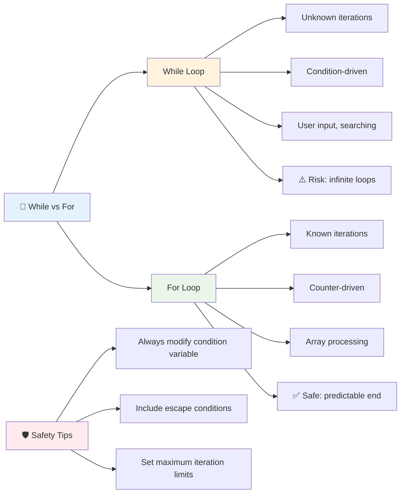

> **Önce güvenlik**: While döngüleri güçlüdür ancak dikkatli koşul yönetimi gerektirir. Döngü koşulunun sonunda yanlış olacağından emin olun!

### Modern Döngü Alternatifleri

JavaScript, kodunuzu daha okunabilir ve daha az hata yapmaya yatkın hale getirebilecek modern döngü sözdizimi sunar.

**For...of Döngüsü (ES6+):**

```javascript
const colors = ["red", "green", "blue", "yellow"];

// Modern approach - cleaner and safer
for (const color of colors) {
  console.log(`Color: ${color}`);
}

// Compare with traditional for loop
for (let i = 0; i < colors.length; i++) {
  console.log(`Color: ${colors[i]}`);
}
```

**For...of'un temel avantajları:**
- **Ortadan kaldırır**: İndeks yönetimi ve olası bir hata
- **Sağlar**: Dizi öğelerine doğrudan erişim
- **Geliştirir**: Kod okunabilirliğini ve sözdizimi karmaşıklığını azaltır

**forEach Metodu:**

```javascript
const prices = [9.99, 15.50, 22.75, 8.25];

// Using forEach for functional programming style
prices.forEach((price, index) => {
  console.log(`Item ${index + 1}: $${price.toFixed(2)}`);
});

// forEach with arrow functions for simple operations
prices.forEach(price => console.log(`Price: $${price}`));
```

**forEach hakkında bilmeniz gerekenler:**
- **Çalıştırır**: Her dizi öğesi için bir fonksiyon
- **Sağlar**: Hem öğe değeri hem de indeks parametre olarak
- **Durdurulamaz**: Geleneksel döngüler gibi erken durdurulamaz
- **Döndürür**: Undefined (yeni bir dizi oluşturmaz)

✅ Neden bir for döngüsü yerine bir while döngüsü seçersiniz? StackOverflow'da 17K izleyici aynı soruyu sordu ve bazı görüşler [ilginç olabilir](https://stackoverflow.com/questions/39969145/while-loops-vs-for-loops-in-javascript).

### 🎨 **Modern Döngü Sözdizimi Kontrolü: ES6+'yı Benimsemek**

**Modern JavaScript anlayışınızı değerlendirin:**
- `For...of`un geleneksel for döngülerine göre avantajları nelerdir?
- Geleneksel for döngülerini ne zaman tercih edersiniz?
- `forEach` ile `map` arasındaki fark nedir?

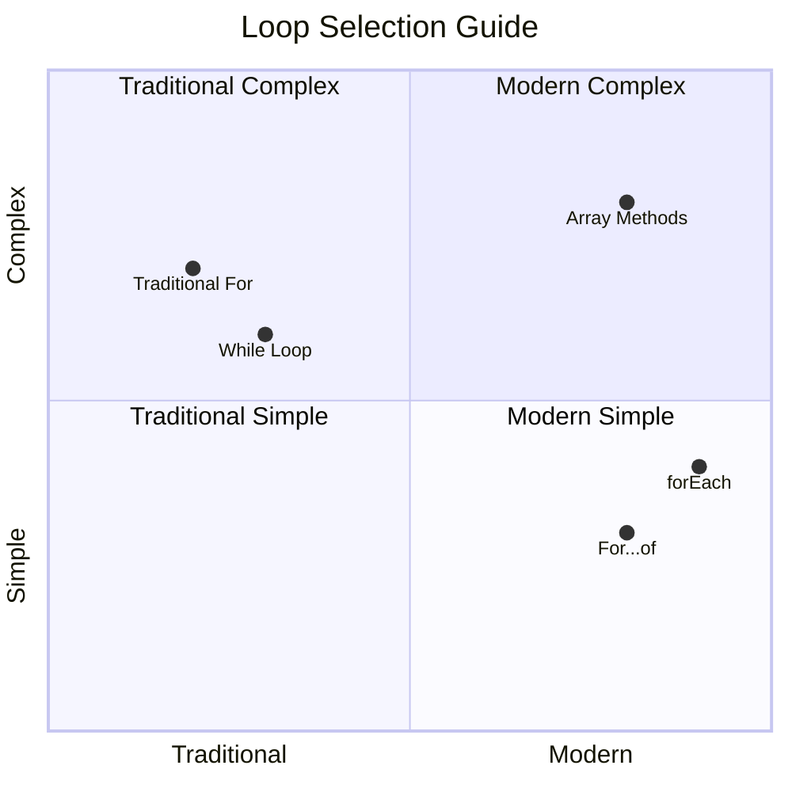

> **Modern trend**: ES6+ sözdizimi, `for...of` ve `forEach` gibi, dizi yinelemesi için tercih edilen yaklaşım haline geliyor çünkü daha temiz ve daha az hata yapmaya yatkın!

## Döngüler ve Diziler

Dizileri döngülerle birleştirmek, güçlü veri işleme yetenekleri oluşturur. Bu eşleşme, listeleri görüntülemekten istatistikleri hesaplamaya kadar birçok programlama görevi için temel oluşturur.

**Geleneksel Dizi İşleme:**

```javascript
const iceCreamFlavors = ["Chocolate", "Strawberry", "Vanilla", "Pistachio", "Rocky Road"];

// Classic for loop approach
for (let i = 0; i < iceCreamFlavors.length; i++) {
  console.log(`Flavor ${i + 1}: ${iceCreamFlavors[i]}`);
}

// Modern for...of approach
for (const flavor of iceCreamFlavors) {
  console.log(`Available flavor: ${flavor}`);
}
```

**Her yaklaşımı anlayalım:**
- **Kullanır**: Döngü sınırını belirlemek için dizi uzunluğu özelliği
- **Erişir**: Geleneksel for döngülerde indeksle öğelere
- **Sağlar**: For...of döngülerde doğrudan öğe erişimi
- **İşler**: Her dizi öğesini tam olarak bir kez

**Pratik Veri İşleme Örneği:**

```javascript
const studentGrades = [85, 92, 78, 96, 88, 73, 89];
let total = 0;
let highestGrade = studentGrades[0];
let lowestGrade = studentGrades[0];

// Process all grades with a single loop
for (let i = 0; i < studentGrades.length; i++) {
  const grade = studentGrades[i];
  total += grade;
  
  if (grade > highestGrade) {
    highestGrade = grade;
  }
  
  if (grade < lowestGrade) {
    lowestGrade = grade;
  }
}

const average = total / studentGrades.length;
console.log(`Average: ${average.toFixed(1)}`);
console.log(`Highest: ${highestGrade}`);
console.log(`Lowest: ${lowestGrade}`);
```

**Bu kodun nasıl çalıştığı:**
- **Başlatır**: Toplam ve uç değerler için izleme değişkenleri
- **İşler**: Tek bir verimli döngüyle her bir notu
- **Biriktirir**: Ortalama hesaplama için toplamı
- **Takip eder**: Yineleme sırasında en yüksek ve en düşük değerleri
- **Hesaplar**: Döngü tamamlandıktan sonra nihai istatistikleri

✅ Kendi oluşturduğunuz bir dizi üzerinde tarayıcı konsolunda döngü deneyleri yapın.

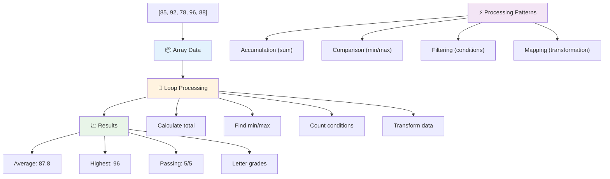

---

## GitHub Copilot Agent Challenge 🚀

Agent modunu kullanarak aşağıdaki meydan okumayı tamamlayın:

**Açıklama:** Diziler ve döngüleri birleştirerek bir veri setini analiz eden ve anlamlı içgörüler üreten kapsamlı bir veri işleme fonksiyonu oluşturun.

**İstek:** `analyzeGrades` adlı bir fonksiyon oluşturun. Bu fonksiyon, öğrenci notu nesnelerinden oluşan bir dizi alır (her biri ad ve puan özelliklerini içerir) ve en yüksek puan, en düşük puan, ortalama puan, geçen öğrenci sayısı (puan >= 70) ve ortalamanın üzerinde puan alan öğrenci isimlerini içeren bir istatistik nesnesi döndürür. Çözümünüzde en az iki farklı döngü türü kullanın.

Agent modu hakkında daha fazla bilgi edinin: [burada](https://code.visualstudio.com/blogs/2025/02/24/introducing-copilot-agent-mode).

## 🚀 Meydan Okuma
JavaScript, belirli görevler için geleneksel döngülerin yerini alabilecek birkaç modern dizi yöntemi sunar. [forEach](https://developer.mozilla.org/docs/Web/JavaScript/Reference/Global_Objects/Array/forEach), [for-of](https://developer.mozilla.org/docs/Web/JavaScript/Reference/Statements/for...of), [map](https://developer.mozilla.org/docs/Web/JavaScript/Reference/Global_Objects/Array/map), [filter](https://developer.mozilla.org/docs/Web/JavaScript/Reference/Global_Objects/Array/filter) ve [reduce](https://developer.mozilla.org/docs/Web/JavaScript/Reference/Global_Objects/Array/reduce) yöntemlerini keşfedin.

**Sizin göreviniz:** Öğrenci notları örneğini en az üç farklı dizi yöntemi kullanarak yeniden düzenleyin. Modern JavaScript sözdizimi ile kodun ne kadar daha temiz ve okunabilir hale geldiğini fark edin.

## Ders Sonrası Test
[Ders sonrası test](https://ff-quizzes.netlify.app/web/quiz/14)

## Gözden Geçirme ve Kendi Kendine Çalışma

JavaScript'teki diziler, veri manipülasyonu için son derece kullanışlı birçok yönteme sahiptir. [Bu yöntemler hakkında bilgi edinin](https://developer.mozilla.org/docs/Web/JavaScript/Reference/Global_Objects/Array) ve kendi oluşturduğunuz bir dizi üzerinde bazılarını (örneğin push, pop, slice ve splice) deneyin.

## Ödev

[Diziyi Döngüye Al](assignment.md)

---

## 📊 **Diziler ve Döngüler Araç Seti Özeti**

```mermaid
graph TD
    A["🎯 Arrays & Loops Mastery"] --> B["📦 Array Fundamentals"]
    A --> C["🔄 Loop Types"]
    A --> D["🔗 Data Processing"]
    A --> E["🎨 Modern Techniques"]
    
    B --> B1["Creation: [ ]"]
    B --> B2["Indexing: arr[0]"]
    B --> B3["Methods: push, pop"]
    B --> B4["Properties: length"]
    
    C --> C1["For: Known iterations"]
    C --> C2["While: Condition-based"]
    C --> C3["For...of: Direct access"]
    C --> C4["forEach: Functional"]
    
    D --> D1["Statistics calculation"]
    D --> D2["Data transformation"]
    D --> D3["Filtering & searching"]
    D --> D4["Real-time processing"]
    
    E --> E1["Arrow functions"]
    E --> E2["Method chaining"]
    E --> E3["Destructuring"]
    E --> E4["Template literals"]
    
    F["💡 Key Benefits"] --> F1["Efficient data handling"]
    F --> F2["Reduced code repetition"]
    F --> F3["Scalable solutions"]
    F --> F4["Cleaner syntax"]
    
    style A fill:#e3f2fd
    style B fill:#e8f5e8
    style C fill:#fff3e0
    style D fill:#f3e5f5
    style E fill:#e0f2f1
    style F fill:#fce4ec
```

---

## 🚀 Diziler ve Döngüler Uzmanlık Zaman Çizelgesi

### ⚡ **Sonraki 5 Dakikada Yapabilecekleriniz**
- [ ] Favori filmlerinizden oluşan bir dizi oluşturun ve belirli öğelere erişin
- [ ] 1'den 10'a kadar sayan bir for döngüsü yazın
- [ ] Dersteki modern dizi yöntemleri meydan okumasını deneyin
- [ ] Tarayıcı konsolunuzda dizi indekslemeyi pratik yapın

### 🎯 **Bu Saatte Başarabilecekleriniz**
- [ ] Ders sonrası testi tamamlayın ve zorlayıcı kavramları gözden geçirin
- [ ] GitHub Copilot meydan okumasından kapsamlı not analizörü oluşturun
- [ ] Basit bir alışveriş sepeti oluşturun ve öğeler ekleyip çıkarın
- [ ] Farklı döngü türleri arasında dönüştürmeyi pratik yapın
- [ ] `push`, `pop`, `slice` ve `splice` gibi dizi yöntemlerini deneyin

### 📅 **Haftalık Veri İşleme Yolculuğunuz**
- [ ] "Diziyi Döngüye Al" ödevini yaratıcı geliştirmelerle tamamlayın
- [ ] Diziler ve döngüler kullanarak bir yapılacaklar listesi uygulaması oluşturun
- [ ] Sayısal veriler için basit bir istatistik hesaplayıcı oluşturun
- [ ] [MDN dizi yöntemleri](https://developer.mozilla.org/docs/Web/JavaScript/Reference/Global_Objects/Array) ile pratik yapın
- [ ] Fotoğraf galerisi veya müzik çalma listesi arayüzü oluşturun
- [ ] `map`, `filter` ve `reduce` ile fonksiyonel programlamayı keşfedin

### 🌟 **Aylık Dönüşümünüz**
- [ ] Gelişmiş dizi işlemleri ve performans optimizasyonunda ustalaşın
- [ ] Tam bir veri görselleştirme panosu oluşturun
- [ ] Veri işleme ile ilgili açık kaynak projelerine katkıda bulunun
- [ ] Pratik örneklerle bir başkasına diziler ve döngüler hakkında öğretin
- [ ] Yeniden kullanılabilir veri işleme fonksiyonlarından oluşan kişisel bir kütüphane oluşturun
- [ ] Dizilere dayalı algoritmalar ve veri yapıları keşfedin

### 🏆 **Son Veri İşleme Şampiyonu Kontrol Noktası**

**Diziler ve döngülerdeki ustalığınızı kutlayın:**
- Gerçek dünya uygulamaları için öğrendiğiniz en faydalı dizi işlemi nedir?
- Hangi döngü türü size en doğal geliyor ve neden?
- Diziler ve döngüleri anlamak, verileri organize etme yaklaşımınızı nasıl değiştirdi?
- Bir sonraki ele almak istediğiniz karmaşık veri işleme görevi nedir?

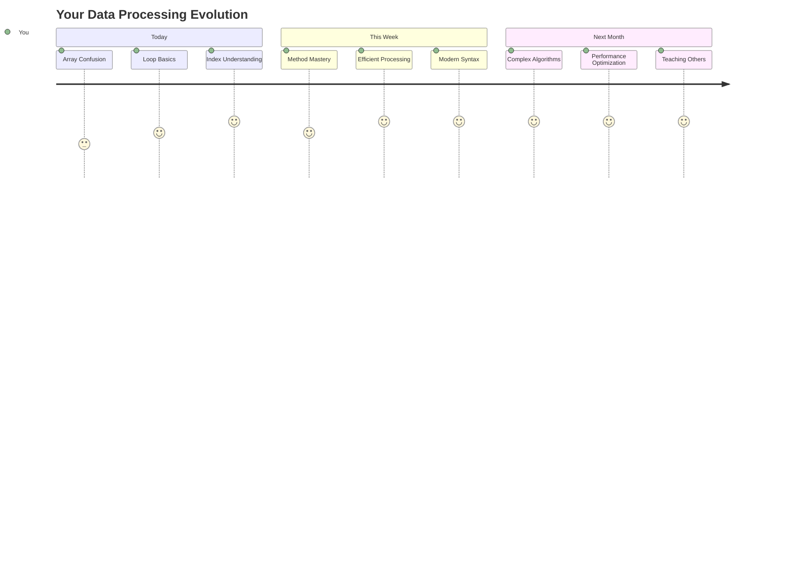

> 📦 **Veri organizasyonu ve işleme gücünü açığa çıkardınız!** Diziler ve döngüler, oluşturacağınız hemen hemen her uygulamanın temelini oluşturur. Basit listelerden karmaşık veri analizine kadar, bilgiyi verimli ve zarif bir şekilde işlemek için artık araçlara sahipsiniz. Her dinamik web sitesi, mobil uygulama ve veri odaklı uygulama bu temel kavramlara dayanır. Ölçeklenebilir veri işleme dünyasına hoş geldiniz! 🎉

---

**Feragatname**:  
Bu belge, AI çeviri hizmeti [Co-op Translator](https://github.com/Azure/co-op-translator) kullanılarak çevrilmiştir. Doğruluk için çaba göstersek de, otomatik çevirilerin hata veya yanlışlıklar içerebileceğini lütfen unutmayın. Belgenin orijinal dili, yetkili kaynak olarak kabul edilmelidir. Kritik bilgiler için profesyonel insan çevirisi önerilir. Bu çevirinin kullanımından kaynaklanan yanlış anlamalar veya yanlış yorumlamalar için sorumluluk kabul etmiyoruz.