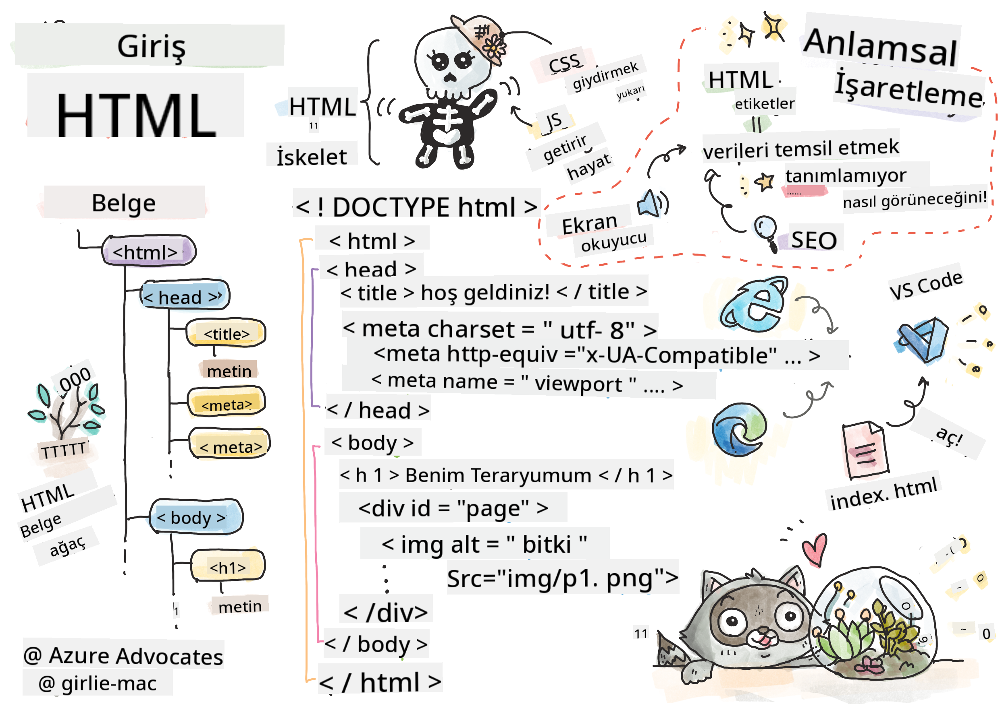
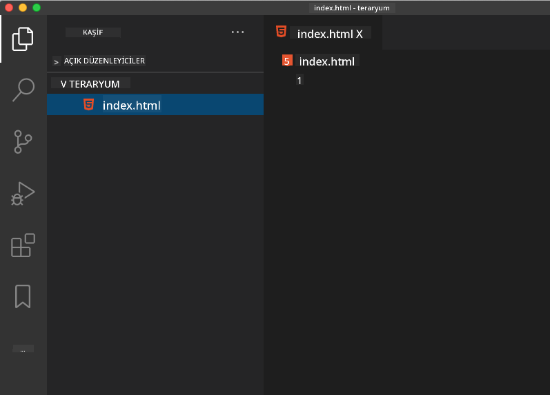

<!--
CO_OP_TRANSLATOR_METADATA:
{
  "original_hash": "20c72cf2e5b0050d38ca3cb14a75a9df",
  "translation_date": "2025-10-22T23:59:02+00:00",
  "source_file": "3-terrarium/1-intro-to-html/README.md",
  "language_code": "tr"
}
-->
# Teraryum Projesi Bölüm 1: HTML'e Giriş


> Sketchnote: [Tomomi Imura](https://twitter.com/girlie_mac)

HTML, yani HyperText Markup Language, ziyaret ettiğiniz her web sitesinin temelini oluşturur. HTML'i, web sayfalarına yapı kazandıran bir iskelet olarak düşünebilirsiniz – içeriklerin nereye yerleştirileceğini, nasıl organize edileceğini ve her bir parçanın neyi temsil ettiğini tanımlar. CSS daha sonra HTML'inizi renkler ve düzenlerle "süsleyecek" ve JavaScript interaktivite ile "canlandıracak", ancak HTML her şeyin mümkün olmasını sağlayan temel yapıyı sağlar.

Bu derste, sanal bir teraryum arayüzü için HTML yapısını oluşturacaksınız. Bu uygulamalı proje, temel HTML kavramlarını öğretirken görsel olarak ilgi çekici bir şey oluşturmanıza yardımcı olacak. İçeriği semantik öğelerle nasıl organize edeceğinizi, resimlerle nasıl çalışacağınızı ve etkileşimli bir web uygulaması için temel oluşturmayı öğreneceksiniz.

Dersin sonunda, bitki resimlerini düzenli sütunlar halinde gösteren çalışan bir HTML sayfasına sahip olacaksınız ve bir sonraki derste stil eklemeye hazır olacaksınız. İlk başta basit görünüyorsa endişelenmeyin – CSS görsel düzenlemeyi eklemeden önce HTML tam olarak böyle olmalıdır.

## Ders Öncesi Test

[Ders öncesi test](https://ff-quizzes.netlify.app/web/quiz/15)

> 📺 **İzle ve Öğren**: Bu faydalı video özetine göz atın
> 
> [](https://www.youtube.com/watch?v=1TvxJKBzhyQ)

## Projenizi Kurma

HTML koduna dalmadan önce, teraryum projeniz için uygun bir çalışma alanı oluşturalım. Başlangıçtan itibaren düzenli bir dosya yapısı oluşturmak, web geliştirme yolculuğunuz boyunca size iyi bir alışkanlık kazandıracaktır.

### Görev: Proje Yapınızı Oluşturun

Teraryum projeniz için özel bir klasör oluşturacak ve ilk HTML dosyanızı ekleyeceksiniz. İşte kullanabileceğiniz iki yaklaşım:

**Seçenek 1: Visual Studio Code Kullanarak**
1. Visual Studio Code'u açın
2. "File" → "Open Folder" seçeneğine tıklayın veya `Ctrl+K, Ctrl+O` (Windows/Linux) ya da `Cmd+K, Cmd+O` (Mac) kısayolunu kullanın
3. `terrarium` adında yeni bir klasör oluşturun ve seçin
4. Explorer panelinde "Yeni Dosya" simgesine tıklayın
5. Dosyanızı `index.html` olarak adlandırın



**Seçenek 2: Terminal Komutlarını Kullanarak**
```bash
mkdir terrarium
cd terrarium
touch index.html
code index.html
```

**Bu komutların yaptığı şeyler:**
- Projeniz için `terrarium` adında yeni bir dizin **oluşturur**
- Teraryum dizinine **geçiş yapar**
- Boş bir `index.html` dosyası **oluşturur**
- Dosyayı düzenleme için Visual Studio Code'da **açar**

> 💡 **İpucu**: `index.html` dosya adı web geliştirmede özeldir. Birisi bir web sitesini ziyaret ettiğinde, tarayıcılar otomatik olarak `index.html` dosyasını varsayılan sayfa olarak görüntülemek için arar. Bu, `https://mysite.com/projects/` gibi bir URL'nin, dosya adını URL'de belirtmeye gerek kalmadan `projects` klasöründeki `index.html` dosyasını otomatik olarak sunacağı anlamına gelir.

## HTML Belge Yapısını Anlama

Her HTML belgesi, tarayıcıların doğru bir şekilde anlaması ve görüntülemesi için belirli bir yapıyı takip eder. Bu yapıyı, alıcının (bu durumda tarayıcı) içeriği düzgün bir şekilde işlemesine yardımcı olan belirli bir sırada gerekli öğelere sahip resmi bir mektup gibi düşünebilirsiniz.

HTML belgesinin ihtiyaç duyduğu temel yapıyı ekleyerek başlayalım.

### DOCTYPE Bildirimi ve Kök Eleman

Her HTML dosyasının ilk iki satırı, belgenin tarayıcıya "tanıtımı" olarak hizmet eder:

```html
<!DOCTYPE html>
<html></html>
```

**Bu kodun yaptığı şeyler:**
- Belge türünü `<!DOCTYPE html>` kullanarak HTML5 olarak **bildirir**
- Tüm sayfa içeriğini içerecek olan kök `<html>` öğesini **oluşturur**
- Modern web standartlarını **kurar** ve tarayıcıların doğru şekilde görüntülemesini sağlar
- Farklı tarayıcılar ve cihazlar arasında tutarlı bir görüntüleme **sağlar**

> 💡 **VS Code İpucu**: VS Code'da herhangi bir HTML etiketinin üzerine geldiğinizde, MDN Web Docs'tan kullanım örnekleri ve tarayıcı uyumluluk detayları gibi faydalı bilgiler görebilirsiniz.

> 📚 **Daha Fazla Bilgi Edinin**: DOCTYPE bildirimi, tarayıcıların çok eski web sitelerini desteklemek için kullanılan "quirks mode"a girmesini engeller. Modern web geliştirme, [standartlara uygun görüntüleme](https://developer.mozilla.org/docs/Web/HTML/Quirks_Mode_and_Standards_Mode) sağlamak için basit `<!DOCTYPE html>` bildirimini kullanır.

## Temel Belge Meta Verilerini Eklemek

Bir HTML belgesinin `<head>` bölümü, tarayıcıların ve arama motorlarının ihtiyaç duyduğu, ancak ziyaretçilerin doğrudan sayfada görmediği önemli bilgileri içerir. Bunu, web sayfanızın düzgün çalışmasına ve farklı cihazlar ve platformlar arasında doğru şekilde görünmesine yardımcı olan "sahne arkası" bilgileri olarak düşünebilirsiniz.

Bu meta veriler, tarayıcılara sayfanızı nasıl görüntüleyeceğini, hangi karakter kodlamasını kullanacağını ve farklı ekran boyutlarını nasıl işleyeceğini söyler – profesyonel, erişilebilir web sayfaları oluşturmak için gerekli olan her şey.

### Görev: Belge Başlığını Ekleyin

Açılış ve kapanış `<html>` etiketlerinizin arasına bu `<head>` bölümünü ekleyin:

```html
<head>
	<title>Welcome to my Virtual Terrarium</title>
	<meta charset="utf-8" />
	<meta http-equiv="X-UA-Compatible" content="IE=edge" />
	<meta name="viewport" content="width=device-width, initial-scale=1" />
</head>
```

**Her bir öğenin yaptığı şeyler:**
- Tarayıcı sekmelerinde ve arama sonuçlarında görünen sayfa başlığını **ayarlar**
- Dünya çapında doğru metin görüntüleme için UTF-8 karakter kodlamasını **belirler**
- Modern Internet Explorer sürümleriyle uyumluluğu **sağlar**
- Görüntüleme alanını cihaz genişliğiyle eşleştirerek duyarlı tasarımı **konfigüre eder**
- İçeriği doğal boyutta görüntülemek için başlangıç yakınlaştırma seviyesini **kontrol eder**

> 🤔 **Bunu Düşünün**: Eğer görüntüleme alanı meta etiketini şu şekilde ayarlarsanız: `<meta name="viewport" content="width=600">`, bu sayfanın her zaman 600 piksel genişliğinde olmasına neden olur ve duyarlı tasarımı bozar! [Doğru görüntüleme alanı konfigürasyonu](https://developer.mozilla.org/docs/Web/HTML/Viewport_meta_tag) hakkında daha fazla bilgi edinin.

## Belge Gövdesini Oluşturmak

`<body>` öğesi, web sayfanızın tüm görünen içeriğini içerir – kullanıcıların göreceği ve etkileşimde bulunacağı her şey. `<head>` bölümü tarayıcıya talimatlar verirken, `<body>` bölümü gerçek içeriği içerir: metin, resimler, düğmeler ve kullanıcı arayüzünüzü oluşturan diğer öğeler.

Gövde yapısını ekleyelim ve HTML etiketlerinin anlamlı içerik oluşturmak için nasıl birlikte çalıştığını anlayalım.

### HTML Etiket Yapısını Anlama

HTML, öğeleri tanımlamak için eşleştirilmiş etiketler kullanır. Çoğu etiket, `<p>` gibi bir açılış etiketi ve `</p>` gibi bir kapanış etiketi ile birlikte gelir ve arasında içerik bulunur: `<p>Merhaba, dünya!</p>`. Bu, "Merhaba, dünya!" metnini içeren bir paragraf öğesi oluşturur.

### Görev: Gövde Öğesini Ekleyin

HTML dosyanızı `<body>` öğesini içerecek şekilde güncelleyin:

```html
<!DOCTYPE html>
<html>
	<head>
		<title>Welcome to my Virtual Terrarium</title>
		<meta charset="utf-8" />
		<meta http-equiv="X-UA-Compatible" content="IE=edge" />
		<meta name="viewport" content="width=device-width, initial-scale=1" />
	</head>
	<body></body>
</html>
```

**Bu tam yapı şunları sağlar:**
- Temel HTML5 belge çerçevesini **kurar**
- Tarayıcıların doğru şekilde görüntülemesi için gerekli meta verileri **içerir**
- Görünen içerik için boş bir gövde **oluşturur**
- Modern web geliştirme en iyi uygulamalarını **takip eder**

Artık teraryumunuzun görünen öğelerini eklemeye hazırsınız. Farklı içerik bölümlerini organize etmek için `<div>` öğelerini konteyner olarak ve bitki resimlerini göstermek için `` öğelerini kullanacağız.

### Resimler ve Düzen Konteynerleri ile Çalışmak

Resimler HTML'de özeldir çünkü "kendi kendine kapanan" etiketler kullanırlar. `<p></p>` gibi içerik etrafında sarılan öğelerin aksine, `` etiketi, `src` gibi dosya yolu ve `alt` gibi erişilebilirlik için kullanılan özelliklerle birlikte tüm bilgileri kendi içinde barındırır.

Resimleri HTML'ye eklemeden önce, proje dosyalarınızı düzgün bir şekilde organize etmeniz ve bir resimler klasörü oluşturmanız gerekir.

**Öncelikle, resimlerinizi ayarlayın:**
1. Teraryum proje klasörünüzün içinde `images` adında bir klasör oluşturun
2. [çözüm klasöründen](../../../../3-terrarium/solution/images) bitki resimlerini indirin (toplamda 14 bitki resmi)
3. Tüm bitki resimlerini yeni `images` klasörünüze kopyalayın

### Görev: Bitki Görüntüleme Düzeni Oluşturun

Şimdi `<body></body>` etiketlerinizin arasına iki sütunda düzenlenmiş bitki resimlerini ekleyin:

```html
<div id="page">
	<div id="left-container" class="container">
		<div class="plant-holder">
			
		</div>
		<div class="plant-holder">
			
		</div>
		<div class="plant-holder">
			
		</div>
		<div class="plant-holder">
			
		</div>
		<div class="plant-holder">
			
		</div>
		<div class="plant-holder">
			
		</div>
		<div class="plant-holder">
			
		</div>
	</div>
	<div id="right-container" class="container">
		<div class="plant-holder">
			
		</div>
		<div class="plant-holder">
			
		</div>
		<div class="plant-holder">
			
		</div>
		<div class="plant-holder">
			
		</div>
		<div class="plant-holder">
			
		</div>
		<div class="plant-holder">
			
		</div>
		<div class="plant-holder">
			
		</div>
	</div>
</div>
```

**Adım adım, bu kodda neler oluyor:**
- Tüm içeriği tutmak için `id="page"` ile bir ana sayfa konteyneri **oluşturur**
- İki sütun konteyneri **oluşturur**: `left-container` ve `right-container`
- Sol sütunda 7 bitki ve sağ sütunda 7 bitki **organize eder**
- Her bir bitki resmini bireysel konumlandırma için bir `plant-holder` div içine **sararak** düzenler
- Bir sonraki derste CSS ile stil vermek için tutarlı sınıf adları **uygular**
- Her bir bitki resmine JavaScript ile etkileşim için benzersiz kimlikler **atanır**
- Resim klasörüne işaret eden doğru dosya yollarını **içerir**

> 🤔 **Bunu Düşünün**: Dikkat edin, şu anda tüm resimlerin alt metni "bitki" olarak aynı. Bu erişilebilirlik için ideal değil. Ekran okuyucu kullanıcıları, her bir resmin hangi bitkiyi gösterdiğini bilmeden 14 kez "bitki" kelimesini duyacaktır. Her bir resim için daha iyi, daha açıklayıcı alt metinler düşünebilir misiniz?

> 📝 **HTML Eleman Türleri**: `<div>` öğeleri "blok seviyesi"dir ve tam genişlik kaplar, `<span>` öğeleri ise "satır içi"dir ve yalnızca gerekli genişliği kaplar. Tüm bu `<div>` etiketlerini `<span>` etiketlerine değiştirirseniz ne olacağını düşünün.

Bu işaretleme eklendiğinde, bitkiler ekranda görünecek, ancak henüz düzgün görünmeyecek – bunun için CSS bir sonraki derste devreye girecek! Şimdilik, içeriğinizi düzgün bir şekilde organize eden ve erişilebilirlik en iyi uygulamalarını takip eden sağlam bir HTML temeline sahipsiniz.

## Erişilebilirlik için Semantik HTML Kullanımı

Semantik HTML, HTML öğelerini yalnızca görünümlerine göre değil, anlamlarına ve amaçlarına göre seçmek anlamına gelir. Semantik işaretleme kullandığınızda, içeriğinizin yapısını ve anlamını tarayıcılara, arama motorlarına ve ekran okuyucular gibi yardımcı teknolojilere iletiyorsunuz.

Bu yaklaşım, engelli kullanıcılar için web sitelerinizi daha erişilebilir hale getirir ve arama motorlarının içeriğinizi daha iyi anlamasına yardımcı olur. Modern web geliştirme için temel bir prensiptir ve herkes için daha iyi deneyimler yaratır.

### Semantik Bir Sayfa Başlığı Eklemek

Teraryum sayfanıza uygun bir başlık ekleyelim. Açılış `<body>` etiketinizin hemen ardından bu satırı ekleyin:

```html
<h1>My Terrarium</h1>
```

**Semantik işaretlemenin önemi:**
- Ekran okuyucuların sayfa yapısını anlamasına ve gezinmesine **yardımcı olur**
- İçerik hiyerarşisini netleştirerek arama motoru optimizasyonunu (SEO) **iyileştirir**
- Görme engelli veya bilişsel farklılıkları olan kullanıcılar için erişilebilirliği **artırır**
- Tüm cihazlar ve platformlar arasında daha iyi kullanıcı deneyimleri **yaratır**
- Profesyonel geliştirme için web standartlarını ve en iyi uygulamaları **takip eder**

**Semantik ve semantik olmayan seçim örnekleri:**

| Amaç | ✅ Semantik Seçim | ❌ Semantik Olmayan Seçim |
|------|-------------------|--------------------------|
| Ana başlık | `<h1>Başlık</h1>` | `<div class="big-text">Başlık</div>` |
| Navigasyon | `<nav><ul><li></li></ul></nav>` | `<div class="menu"><div></div></div>` |
| Düğme | `<button>Tıkla</button>` | `<span onclick="...">Tıkla</span>` |
| Makale içeriği | `<article><p></p></article>` | `<div class="content"><div></div></div>` |

> 🎥 **Eylemde Görün**: [Ekran okuyucuların web sayfalarıyla nasıl etkileşimde bulunduğunu](https://www.youtube.com/watch?v=OUDV1gqs9GA) izleyerek semantik işaretlemenin erişilebilirlik için neden önemli olduğunu anlayın. Doğru HTML yapısının kullanıcıların verimli bir şekilde gezinmesine nasıl yardımcı olduğunu fark edin.

## Teraryum Konteynerini Oluşturmak

Şimdi teraryumun kendisi için HTML yapısını ekleyelim – bitkilerin sonunda yerleştirileceği cam konteyner. Bu bölüm önemli bir kavramı gösteriyor: HTML yapı sağlar, ancak CSS stil olmadan bu öğeler henüz görünür olmayacaktır.

Teraryum işaretlemesi, bir sonraki derste CSS stilini sezgisel ve sürdürülebilir hale getirecek açıklayıcı sınıf adları kullanır.

### Görev: Teraryum Yapısını Ekleyin

Son `</div>` etiketinin üzerine (sayfa konteynerinin kapanış etiketinden önce) bu işaretlemeyi ekleyin:

```html
<div id="terrarium">
	<div class="jar-top"></div>
	<div class="jar-walls">
		<div class="jar-glossy-long"></div>
		<div class="jar-glossy-short"></div>
	</div>
	<div class="dirt"></div>
	<div class="jar-bottom"></div>
</div>
```

**Bu teraryum yapısını anlamak:**
- Stil için benzersiz bir kimliğe sahip ana teraryum konteyneri **oluşturur**
- Her bir görsel bileşen için ayrı öğeler **tanımlar** (üst, duvarlar, toprak, alt)
- Cam yansıma efektleri için iç içe öğeler **ekler** (parlak öğeler)
- Her bir öğenin amacını açıkça belirten açıklayıcı sınıf adları **kullanır**
- Cam teraryum görünümünü oluşturacak CSS stiline **hazırlık yapar**

> 🤔 **Bir Şey Fark Ettiniz mi?**: Bu işaretlemeyi eklemiş olsanız bile, sayfada yeni bir şey görmüyorsunuz! Bu, HTML'in yapı sağlarken CSS'in görünüm sağladığını mükemmel bir şekilde gösteriyor. Bu `<div>` öğeleri var, ancak henüz görsel bir stil yok – bu bir sonraki derste geliyor!

---

## GitHub Copilot Agent Challenge

Agent modunu kullanarak aşağıdaki meydan okumayı tamamlayın:

**Açıklama:** Teraryum projesine eklenebilecek bir bitki bakım rehberi bölümü için semantik bir HTML yapısı oluşturun.
**İstek:** Ana başlık "Bitki Bakım Rehberi", üç alt bölüm başlığı "Sulama", "Işık Gereksinimleri" ve "Toprak Bakımı" olan, her biri bitki bakımı hakkında bir paragraf içeren semantik bir HTML bölümü oluşturun. İçeriği uygun şekilde yapılandırmak için `<section>`, `<h2>`, `<h3>` ve `<p>` gibi doğru semantik HTML etiketlerini kullanın.

Daha fazla bilgi için [agent mode](https://code.visualstudio.com/blogs/2025/02/24/introducing-copilot-agent-mode) hakkında buradan bilgi edinin.

## HTML Tarihi Keşfetme Mücadelesi

**Web Gelişimi Hakkında Öğrenme**

HTML, Tim Berners-Lee'nin 1990 yılında CERN'de ilk web tarayıcısını oluşturmasından bu yana önemli ölçüde gelişti. `<marquee>` gibi eski etiketler artık modern erişilebilirlik standartları ve duyarlı tasarım ilkeleriyle uyumlu olmadıkları için kullanımdan kaldırıldı.

**Bu Deneyi Deneyin:**
1. `<h1>` başlığınızı geçici olarak bir `<marquee>` etiketiyle sarın: `<marquee><h1>Benim Teraryumum</h1></marquee>`
2. Sayfanızı bir tarayıcıda açın ve kaydırma efektini gözlemleyin
3. Bu etiketin neden kullanımdan kaldırıldığını düşünün (ipucu: kullanıcı deneyimi ve erişilebilirlik hakkında düşünün)
4. `<marquee>` etiketini kaldırın ve semantik işaretlemeye geri dönün

**Düşünme Soruları:**
- Kaydırmalı bir başlık görme engelli veya hareket hassasiyeti olan kullanıcıları nasıl etkileyebilir?
- Benzer görsel efektleri daha erişilebilir bir şekilde elde etmek için hangi modern CSS teknikleri kullanılabilir?
- Neden güncel web standartlarını kullanmak, kullanımdan kaldırılmış öğeler yerine daha önemlidir?

Web standartlarının kullanıcı deneyimini geliştirmek için nasıl evrildiğini anlamak için [kullanımdan kaldırılmış ve eski HTML öğeleri](https://developer.mozilla.org/docs/Web/HTML/Element#Obsolete_and_deprecated_elements) hakkında daha fazla bilgi edinin.


## Ders Sonrası Test

[Ders sonrası test](https://ff-quizzes.netlify.app/web/quiz/16)

## Gözden Geçirme ve Kendi Kendine Çalışma

**HTML Bilginizi Derinleştirin**

HTML, 30 yılı aşkın süredir webin temelini oluşturuyor ve basit bir belge işaretleme dilinden etkileşimli uygulamalar oluşturmak için sofistike bir platforma dönüştü. Bu evrimi anlamak, modern web standartlarını takdir etmenize ve daha iyi geliştirme kararları almanıza yardımcı olur.

**Önerilen Öğrenme Yolları:**

1. **HTML Tarihi ve Evrimi**
   - HTML 1.0'dan HTML5'e kadar olan zaman çizelgesini araştırın
   - Belirli etiketlerin neden kullanımdan kaldırıldığını keşfedin (erişilebilirlik, mobil uyumluluk, sürdürülebilirlik)
   - Yeni HTML özelliklerini ve önerilerini inceleyin

2. **Semantik HTML Derinlemesine İnceleme**
   - [HTML5 semantik öğelerinin](https://developer.mozilla.org/docs/Web/HTML/Element) tam listesini inceleyin
   - `<article>`, `<section>`, `<aside>` ve `<main>` etiketlerini ne zaman kullanacağınızı belirleme pratiği yapın
   - Gelişmiş erişilebilirlik için ARIA özelliklerini öğrenin

3. **Modern Web Geliştirme**
   - Microsoft Learn'de [duyarlı web siteleri oluşturmayı](https://docs.microsoft.com/learn/modules/build-simple-website/?WT.mc_id=academic-77807-sagibbon) keşfedin
   - HTML'nin CSS ve JavaScript ile nasıl entegre olduğunu anlayın
   - Web performansı ve SEO en iyi uygulamaları hakkında bilgi edinin

**Düşünme Soruları:**
- Hangi kullanımdan kaldırılmış HTML etiketlerini keşfettiniz ve neden kaldırıldılar?
- Gelecek sürümler için önerilen yeni HTML özellikleri nelerdir?
- Semantik HTML, web erişilebilirliği ve SEO'ya nasıl katkıda bulunur?


## Ödev

[HTML pratiği yapın: Blog taslağı oluşturun](assignment.md)

---

**Feragatname**:  
Bu belge, AI çeviri hizmeti [Co-op Translator](https://github.com/Azure/co-op-translator) kullanılarak çevrilmiştir. Doğruluk için çaba göstersek de, otomatik çevirilerin hata veya yanlışlıklar içerebileceğini lütfen unutmayın. Belgenin orijinal dili, yetkili kaynak olarak kabul edilmelidir. Kritik bilgiler için profesyonel insan çevirisi önerilir. Bu çevirinin kullanımından kaynaklanan yanlış anlamalar veya yanlış yorumlamalar için sorumluluk kabul etmiyoruz.