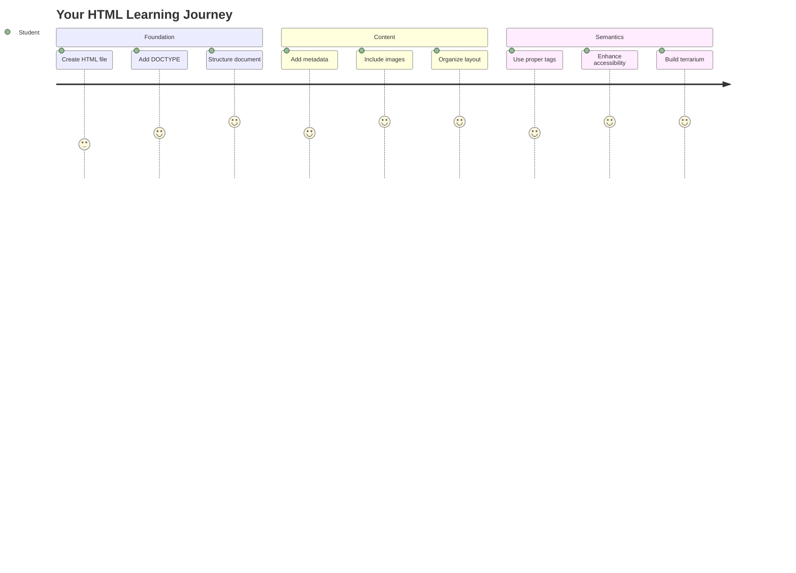
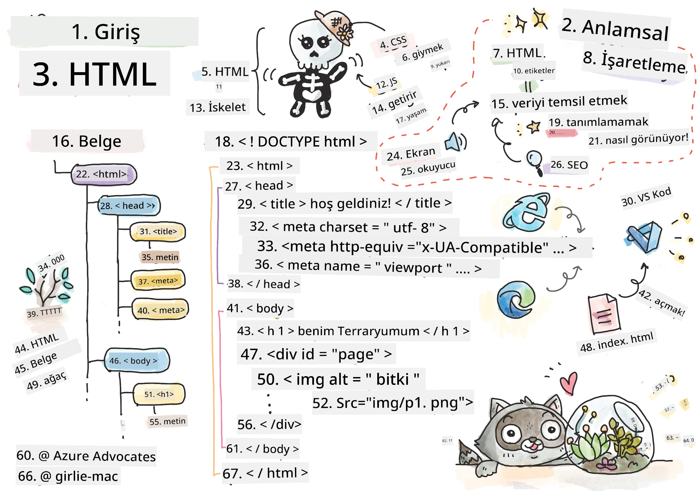
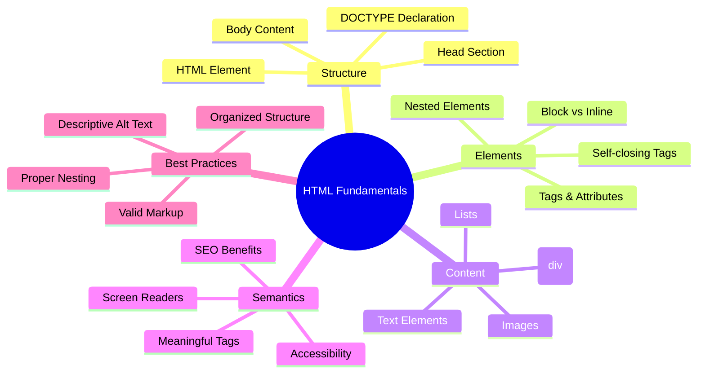
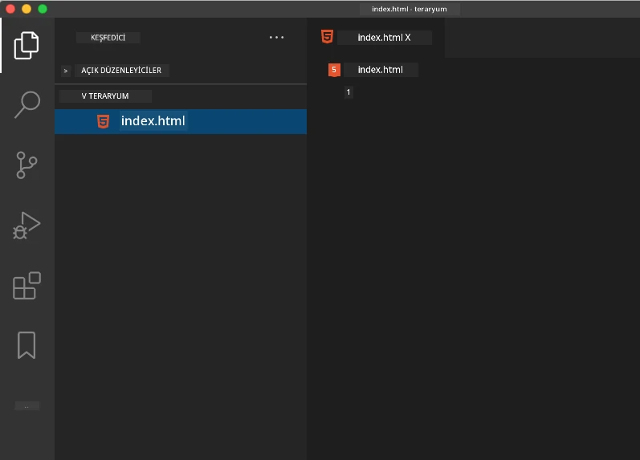
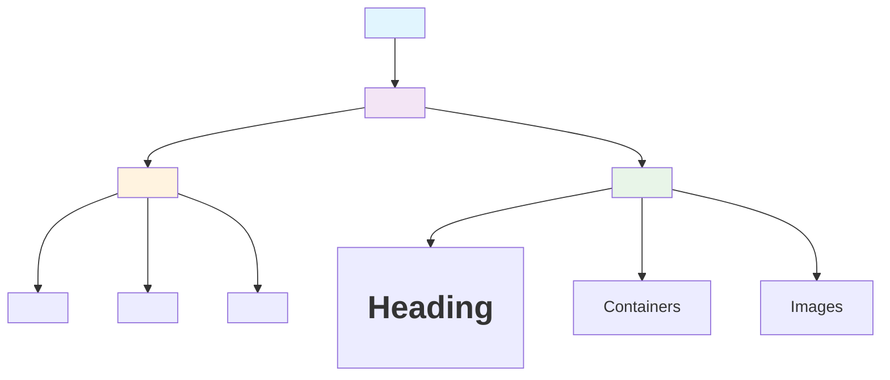
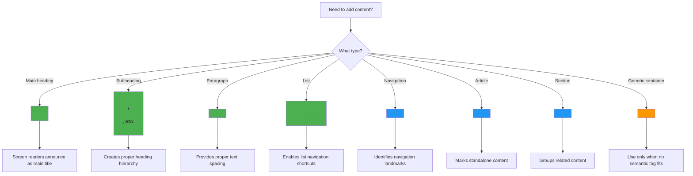
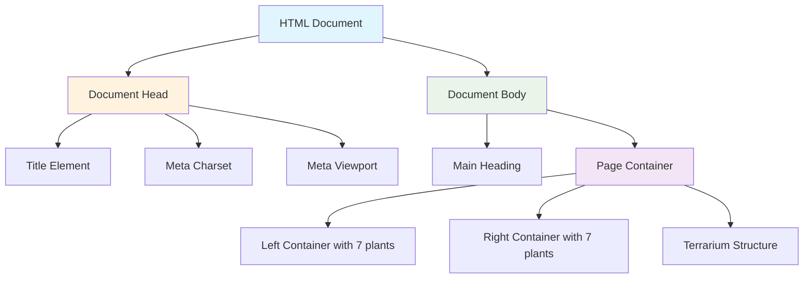
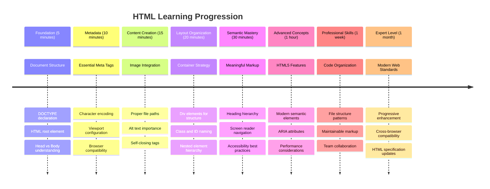

<!--
CO_OP_TRANSLATOR_METADATA:
{
  "original_hash": "3fcfa99c4897e051b558b5eaf1e8cc74",
  "translation_date": "2025-11-04T00:55:59+00:00",
  "source_file": "3-terrarium/1-intro-to-html/README.md",
  "language_code": "tr"
}
-->
# Terrarium Projesi Bölüm 1: HTML'e Giriş




> Sketchnote: [Tomomi Imura](https://twitter.com/girlie_mac)

HTML, yani HyperText Markup Language, ziyaret ettiğiniz her web sitesinin temelini oluşturur. HTML'i web sayfalarına yapı kazandıran bir iskelet olarak düşünebilirsiniz – içeriklerin nereye gideceğini, nasıl organize edileceğini ve her bir parçanın neyi temsil ettiğini tanımlar. CSS daha sonra HTML'inizi renkler ve düzenlerle "süsler" ve JavaScript interaktivite ile "canlandırır", ancak HTML her şeyin mümkün olmasını sağlayan temel yapıyı sunar.

Bu derste, sanal bir teraryum arayüzü için HTML yapısını oluşturacaksınız. Bu uygulamalı proje, temel HTML kavramlarını öğretirken görsel olarak ilgi çekici bir şey inşa etmenizi sağlayacak. İçeriği semantik öğelerle nasıl organize edeceğinizi, resimlerle nasıl çalışacağınızı ve interaktif bir web uygulaması için temel oluşturmayı öğreneceksiniz.

Dersin sonunda, bitki resimlerini düzenli sütunlar halinde gösteren çalışan bir HTML sayfasına sahip olacaksınız ve bir sonraki derste stil eklemeye hazır olacaksınız. İlk başta basit görünüyorsa endişelenmeyin – CSS görsel cilayı eklemeden önce HTML tam olarak böyle görünmelidir.



## Ders Öncesi Test

[Ders öncesi test](https://ff-quizzes.netlify.app/web/quiz/15)

> 📺 **İzle ve Öğren**: Bu faydalı video özetine göz atın
> 
> [](https://www.youtube.com/watch?v=1TvxJKBzhyQ)

## Projenizi Kurma

HTML koduna dalmadan önce, teraryum projeniz için uygun bir çalışma alanı oluşturalım. Başlangıçtan itibaren düzenli bir dosya yapısı oluşturmak, web geliştirme yolculuğunuz boyunca size iyi bir alışkanlık kazandıracaktır.

### Görev: Proje Yapınızı Oluşturun

Teraryum projeniz için özel bir klasör oluşturacak ve ilk HTML dosyanızı ekleyeceksiniz. İşte kullanabileceğiniz iki yaklaşım:

**Seçenek 1: Visual Studio Code Kullanarak**
1. Visual Studio Code'u açın
2. "File" → "Open Folder" seçeneğine tıklayın veya `Ctrl+K, Ctrl+O` (Windows/Linux) ya da `Cmd+K, Cmd+O` (Mac) kısayolunu kullanın
3. `terrarium` adında yeni bir klasör oluşturun ve seçin
4. Explorer panelinde "New File" simgesine tıklayın
5. Dosyanıza `index.html` adını verin



**Seçenek 2: Terminal Komutlarını Kullanarak**
```bash
mkdir terrarium
cd terrarium
touch index.html
code index.html
```

**Bu komutların yaptığı şeyler:**
- Projeniz için `terrarium` adında yeni bir dizin oluşturur
- Teraryum dizinine geçiş yapar
- Boş bir `index.html` dosyası oluşturur
- Düzenleme için dosyayı Visual Studio Code'da açar

> 💡 **İpucu**: Web geliştirmede `index.html` dosya adı özeldir. Birisi bir web sitesini ziyaret ettiğinde, tarayıcılar otomatik olarak `index.html` dosyasını varsayılan sayfa olarak görüntülemek için arar. Bu, `https://mysite.com/projects/` gibi bir URL'nin, dosya adını URL'de belirtmeye gerek kalmadan `projects` klasöründeki `index.html` dosyasını otomatik olarak sunacağı anlamına gelir.

## HTML Belge Yapısını Anlama

Her HTML belgesi, tarayıcıların doğru bir şekilde anlaması ve görüntülemesi için belirli bir yapıyı takip eder. Bu yapıyı resmi bir mektup gibi düşünün – belirli bir sırada gerekli öğeler vardır ve bu öğeler alıcının (bu durumda tarayıcı) içeriği düzgün bir şekilde işlemesine yardımcı olur.



Her HTML belgesinin ihtiyaç duyduğu temel yapıyı ekleyerek başlayalım.

### DOCTYPE Bildirimi ve Kök Eleman

Her HTML dosyasının ilk iki satırı, belgenin tarayıcıya "tanıtımı" olarak hizmet eder:

```html
<!DOCTYPE html>
<html></html>
```

**Bu kodun ne yaptığını anlamak:**
- Belge türünü `<!DOCTYPE html>` kullanarak HTML5 olarak ilan eder
- Tüm sayfa içeriğini barındıracak kök `<html>` öğesini oluşturur
- Modern web standartlarını doğru tarayıcı işleme için belirler
- Farklı tarayıcılar ve cihazlar arasında tutarlı bir görüntüleme sağlar

> 💡 **VS Code İpucu**: VS Code'da herhangi bir HTML etiketinin üzerine geldiğinizde, MDN Web Docs'tan kullanım örnekleri ve tarayıcı uyumluluk detayları gibi faydalı bilgiler görebilirsiniz.

> 📚 **Daha Fazla Bilgi Edinin**: DOCTYPE bildirimi, tarayıcıların çok eski web sitelerini desteklemek için kullanılan "quirks mode"a girmesini engeller. Modern web geliştirme, [standartlara uygun işleme](https://developer.mozilla.org/docs/Web/HTML/Quirks_Mode_and_Standards_Mode) sağlamak için basit `<!DOCTYPE html>` bildirimini kullanır.

### 🔄 **Pedagojik Kontrol**
**Dur ve Düşün**: Devam etmeden önce şunları anladığınızdan emin olun:
- ✅ Her HTML belgesinin neden bir DOCTYPE bildirimine ihtiyaç duyduğu
- ✅ `<html>` kök öğesinin ne içerdiği
- ✅ Bu yapının tarayıcıların sayfaları doğru bir şekilde işlemesine nasıl yardımcı olduğu

**Hızlı Kendini Test Et**: "Standartlara uygun işleme"nin ne anlama geldiğini kendi kelimelerinizle açıklayabilir misiniz?

## Temel Belge Meta Verilerini Eklemek

Bir HTML belgesinin `<head>` bölümü, tarayıcıların ve arama motorlarının ihtiyaç duyduğu ancak ziyaretçilerin doğrudan sayfada görmediği önemli bilgileri içerir. Bunu, web sayfanızın düzgün çalışmasını ve farklı cihazlar ve platformlar arasında doğru şekilde görünmesini sağlayan "sahne arkası" bilgileri olarak düşünün.

Bu meta veriler, tarayıcılara sayfanızı nasıl görüntüleyeceğini, hangi karakter kodlamasını kullanacağını ve farklı ekran boyutlarını nasıl işleyeceğini söyler – profesyonel, erişilebilir web sayfaları oluşturmak için gerekli olan her şey.

### Görev: Belge Başlığını Ekleyin

Açılış ve kapanış `<html>` etiketlerinizin arasına bu `<head>` bölümünü ekleyin:

```html
<head>
	<title>Welcome to my Virtual Terrarium</title>
	<meta charset="utf-8" />
	<meta http-equiv="X-UA-Compatible" content="IE=edge" />
	<meta name="viewport" content="width=device-width, initial-scale=1" />
</head>
```

**Her öğenin ne yaptığını açıklamak:**
- Tarayıcı sekmelerinde ve arama sonuçlarında görünen sayfa başlığını ayarlar
- Dünya çapında doğru metin görüntüleme için UTF-8 karakter kodlamasını belirtir
- Modern Internet Explorer sürümleriyle uyumluluğu sağlar
- Görüntüleme içeriğini doğal boyutta göstermek için başlangıç yakınlaştırma seviyesini ayarlar

> 🤔 **Bunu Düşünün**: Eğer şu şekilde bir viewport meta etiketi ayarlarsanız: `<meta name="viewport" content="width=600">` ne olurdu? Bu, sayfanın her zaman 600 piksel genişliğinde olmasını zorlar ve duyarlı tasarımı bozar! [Doğru viewport yapılandırması](https://developer.mozilla.org/docs/Web/HTML/Viewport_meta_tag) hakkında daha fazla bilgi edinin.

## Belge Gövdesini Oluşturmak

Bir HTML belgesinin `<body>` öğesi, web sayfanızın tüm görünen içeriğini – kullanıcıların göreceği ve etkileşimde bulunacağı her şeyi – içerir. `<head>` bölümü tarayıcıya talimatlar verirken, `<body>` bölümü gerçek içeriği içerir: metin, resimler, düğmeler ve kullanıcı arayüzünüzü oluşturan diğer öğeler.

Haydi gövde yapısını ekleyelim ve HTML etiketlerinin anlamlı içerik oluşturmak için nasıl birlikte çalıştığını anlayalım.

### HTML Etiket Yapısını Anlama

HTML, öğeleri tanımlamak için eşleştirilmiş etiketler kullanır. Çoğu etiket, `<p>` gibi bir açılış etiketi ve `</p>` gibi bir kapanış etiketi içerir ve arasında içerik bulunur: `<p>Merhaba, dünya!</p>`. Bu, "Merhaba, dünya!" metnini içeren bir paragraf öğesi oluşturur.

### Görev: Gövde Elemanını Ekleyin

HTML dosyanızı `<body>` öğesini içerecek şekilde güncelleyin:

```html
<!DOCTYPE html>
<html>
	<head>
		<title>Welcome to my Virtual Terrarium</title>
		<meta charset="utf-8" />
		<meta http-equiv="X-UA-Compatible" content="IE=edge" />
		<meta name="viewport" content="width=device-width, initial-scale=1" />
	</head>
	<body></body>
</html>
```

**Bu tam yapı ne sağlar:**
- Temel HTML5 belge çerçevesini oluşturur
- Doğru tarayıcı işleme için gerekli meta verileri içerir
- Görünen içeriğiniz için boş bir gövde oluşturur
- Modern web geliştirme en iyi uygulamalarını takip eder

Artık teraryumunuzun görünen öğelerini eklemeye hazırsınız. Farklı içerik bölümlerini organize etmek için `<div>` öğelerini konteyner olarak kullanacağız ve bitki resimlerini göstermek için `` öğelerini ekleyeceğiz.

### Resimlerle ve Düzen Konteynerleriyle Çalışmak

Resimler HTML'de özeldir çünkü "kendini kapatan" etiketler kullanırlar. `<p></p>` gibi içerik etrafında sarılan öğelerden farklı olarak, `` etiketi, `src` gibi dosya yolu ve `alt` gibi erişilebilirlik bilgilerini içeren tüm bilgileri kendi içinde barındırır.

Resimleri HTML'ye eklemeden önce, proje dosyalarınızı düzgün bir şekilde organize etmeniz gerekir. Bunun için bir `images` klasörü oluşturup bitki grafiklerini ekleyeceksiniz.

**Önce resimlerinizi ayarlayın:**
1. Teraryum proje klasörünüzün içinde `images` adında bir klasör oluşturun
2. [çözüm klasöründen](../../../../3-terrarium/solution/images) bitki resimlerini indirin (toplamda 14 bitki resmi)
3. Tüm bitki resimlerini yeni `images` klasörünüze kopyalayın

### Görev: Bitki Görüntüleme Düzeni Oluşturun

Şimdi `<body></body>` etiketlerinizin arasına iki sütunda düzenlenmiş bitki resimlerini ekleyin:

```html
<div id="page">
	<div id="left-container" class="container">
		<div class="plant-holder">
			
		</div>
		<div class="plant-holder">
			
		</div>
		<div class="plant-holder">
			
		</div>
		<div class="plant-holder">
			
		</div>
		<div class="plant-holder">
			
		</div>
		<div class="plant-holder">
			
		</div>
		<div class="plant-holder">
			
		</div>
	</div>
	<div id="right-container" class="container">
		<div class="plant-holder">
			
		</div>
		<div class="plant-holder">
			
		</div>
		<div class="plant-holder">
			
		</div>
		<div class="plant-holder">
			
		</div>
		<div class="plant-holder">
			
		</div>
		<div class="plant-holder">
			
		</div>
		<div class="plant-holder">
			
		</div>
	</div>
</div>
```

**Adım adım bu kodda neler oluyor:**
- Tüm içeriği barındıracak `id="page"` ile bir ana sayfa konteyneri oluşturur
- İki sütun konteyneri oluşturur: `left-container` ve `right-container`
- Sol sütunda 7 bitki ve sağ sütunda 7 bitki düzenler
- Her bitki resmini bireysel konumlandırma için bir `plant-holder` div içine sarar
- Bir sonraki derste CSS stil uygulaması için tutarlı sınıf adları kullanır
- Her bitki resmine JavaScript etkileşimi için benzersiz kimlikler atar
- Resim klasörüne işaret eden doğru dosya yollarını içerir

> 🤔 **Bunu Düşünün**: Tüm resimlerin şu anda "plant" şeklinde aynı alt metni olduğunu fark ettiniz mi? Bu erişilebilirlik için ideal değil. Ekran okuyucu kullanıcıları "bitki" kelimesini 14 kez tekrar tekrar duyacak ve her bir resmin hangi bitkiyi gösterdiğini bilemeyecek. Her resim için daha iyi, daha açıklayıcı alt metinler düşünebilir misiniz?

> 📝 **HTML Eleman Türleri**: `<div>` öğeleri "blok düzeyinde"dir ve tam genişlik kaplar, `<span>` öğeleri ise "satır içi"dir ve yalnızca gerekli genişliği kaplar. Tüm bu `<div>` etiketlerini `<span>` etiketlerine değiştirirseniz ne olacağını düşünüyorsunuz?

### 🔄 **Pedagojik Kontrol**
**Yapı Anlayışı**: HTML yapınızı gözden geçirmek için bir an durun:
- ✅ Düzeninizdeki ana konteynerleri tanımlayabilir misiniz?
- ✅ Her resmin neden benzersiz bir kimliğe sahip olduğunu anlıyor musunuz?
- ✅ `plant-holder` divlerinin amacını nasıl tanımlarsınız?

**Görsel İnceleme**: HTML dosyanızı bir tarayıcıda açın. Şunları görmelisiniz:
- Basit bir bitki resimleri listesi
- İki sütunda düzenlenmiş resimler
- Basit, stil verilmemiş bir düzen

**Unutmayın**: Bu sade görünüm, CSS stil eklenmeden önce HTML'in tam olarak nasıl görünmesi gerektiğidir!

Bu işaretleme eklendiğinde, bitkiler ekranda görünecek, ancak henüz cilalı görünmeyecek – bunun için bir sonraki derste CSS kullanılacak! Şimdilik, içeriğinizi düzgün bir şekilde organize eden ve erişilebilirlik en iyi uygulamalarını takip eden sağlam bir HTML temeline sahipsiniz.

## Erişilebilirlik için Semantik HTML Kullanımı

Semantik HTML, HTML öğelerini yalnızca görünümlerine göre değil, anlamlarına ve amaçlarına göre seçmek anlamına gelir. Semantik işaretleme kullandığınızda, içeriğinizin yapısını ve anlamını tarayıcılara, arama motorlarına ve ekran okuyucular gibi yardımcı teknolojilere iletiyorsunuz.



Bu yaklaşım, engelli kullanıcılar için web sitelerinizi daha erişilebilir hale getirir ve arama motorlarının içeriğinizi daha iyi anlamasına yardımcı olur. Modern web geliştirme için temel bir prensiptir ve herkes için daha iyi deneyimler yaratır.

### Semantik Bir Sayfa Başlığı Eklemek

Teraryum sayfanıza uygun bir başlık ekleyelim. Açılış `<body>` etiketinizin hemen ardından şu satırı ekleyin:

```html
<h1>My Terrarium</h1>
```

**Semantik işaretlemenin önemi:**
- **Ekran okuyucuların** sayfa yapısını gezinmesine ve anlamasına yardımcı olur
- **Arama motoru optimizasyonunu (SEO)** içerik hiyerarşisini netleştirerek geliştirir
- **Görme engelli veya bilişsel farklılıkları olan kullanıcılar** için erişilebilirliği artırır
- **Tüm cihazlar ve platformlar** için daha iyi kullanıcı deneyimleri oluşturur
- **Profesyonel geliştirme** için web standartlarını ve en iyi uygulamaları takip eder

**Semantik ve semantik olmayan seçim örnekleri:**

| Amaç | ✅ Semantik Seçim | ❌ Semantik Olmayan Seçim |
|------|-------------------|--------------------------|
| Ana başlık | `<h1>Başlık</h1>` | `<div class="big-text">Başlık</div>` |
| Navigasyon | `<nav><ul><li></li></ul></nav>` | `<div class="menu"><div></div></div>` |
| Düğme | `<button>Tıkla</button>` | `<span onclick="...">Tıkla</span>` |
| Makale içeriği | `<article><p></p></article>` | `<div class="content"><div></div></div>` |

> 🎥 **Eylemde Görün**: [Ekran okuyucuların web sayfalarıyla nasıl etkileşimde bulunduğunu](https://www.youtube.com/watch?v=OUDV1gqs9GA) izleyerek semantik işaretlemenin erişilebilirlik için neden önemli olduğunu anlayın. Doğru HTML yapısının kullanıcıların verimli bir şekilde gezinmesine nasıl yardımcı olduğuna dikkat edin.

## Teraryum Konteynerini Oluşturmak

Şimdi teraryumun kendisi için HTML yapısını ekleyelim – bitkilerin sonunda yerleştirileceği cam konteyner. Bu bölüm önemli bir kavramı gösteriyor: HTML yapı sağlar, ancak CSS stili olmadan bu öğeler henüz görünür olmayabilir.

Teraryum işaretlemesi, bir sonraki derste CSS stilini sezgisel ve sürdürülebilir hale getirecek açıklayıcı sınıf adları kullanır.

### Görev: Teraryum Yapısını Ekleyin

Son `</div>` etiketinin üzerine (sayfa konteynerinin kapanış etiketinden önce) şu işaretlemeyi ekleyin:

```html
<div id="terrarium">
	<div class="jar-top"></div>
	<div class="jar-walls">
		<div class="jar-glossy-long"></div>
		<div class="jar-glossy-short"></div>
	</div>
	<div class="dirt"></div>
	<div class="jar-bottom"></div>
</div>
```

**Bu teraryum yapısını anlamak:**
- **Ana teraryum konteynerini** benzersiz bir kimlikle stil vermek için oluşturur
- **Tanımlar** her görsel bileşen için ayrı öğeler (üst, duvarlar, toprak, alt)
- **İçerir** cam yansıma efektleri için iç içe öğeler (parlak öğeler)
- **Kullanır** her öğenin amacını açıkça belirten açıklayıcı sınıf adları
- **Hazırlar** cam teraryum görünümünü oluşturacak CSS stilleri için yapıyı

> 🤔 **Bir Şey Fark Ettiniz mi?**: Bu işaretlemeyi eklemiş olmanıza rağmen sayfada yeni bir şey görmüyorsunuz! Bu, HTML'nin yapıyı sağlarken CSS'nin görünümü sağladığını mükemmel bir şekilde gösteriyor. Bu `<div>` öğeleri var ama henüz görsel bir stil yok – bu, bir sonraki derste geliyor!



### 🔄 **Pedagojik Kontrol Noktası**
**HTML Yapısı Uzmanlığı**: İlerlemeye geçmeden önce şunları yapabildiğinizden emin olun:
- ✅ HTML yapısı ile görsel görünüm arasındaki farkı açıklayın
- ✅ Anlamsal ve anlamsal olmayan HTML öğelerini ayırt edin
- ✅ Doğru işaretlemenin erişilebilirliğe nasıl fayda sağladığını açıklayın
- ✅ Tam belge ağacı yapısını tanıyın

**Anlamanızı Test Edin**: HTML dosyanızı bir tarayıcıda JavaScript devre dışı bırakılmış ve CSS kaldırılmış şekilde açmayı deneyin. Bu, oluşturduğunuz saf anlamsal yapıyı gösterir!

---

## GitHub Copilot Agent Challenge

Agent modunu kullanarak aşağıdaki meydan okumayı tamamlayın:

**Açıklama:** Teraryum projesine eklenebilecek bir bitki bakım rehberi bölümü için anlamsal bir HTML yapısı oluşturun.

**İstek:** "Bitki Bakım Rehberi" ana başlığını, "Sulama", "Işık Gereksinimleri" ve "Toprak Bakımı" başlıklı üç alt bölümü içeren, her birinde bitki bakım bilgilerini içeren bir paragraf bulunan anlamsal bir HTML bölümü oluşturun. İçeriği uygun şekilde yapılandırmak için `<section>`, `<h2>`, `<h3>` ve `<p>` gibi doğru anlamsal HTML etiketlerini kullanın.

Agent moduyla ilgili daha fazla bilgi edinin [buradan](https://code.visualstudio.com/blogs/2025/02/24/introducing-copilot-agent-mode).

## HTML Tarihi Meydan Okuması

**Web Evrimi Hakkında Öğrenme**

HTML, Tim Berners-Lee'nin 1990 yılında CERN'de ilk web tarayıcısını oluşturmasından bu yana önemli ölçüde gelişti. `<marquee>` gibi bazı eski etiketler artık modern erişilebilirlik standartları ve duyarlı tasarım ilkeleriyle uyumlu olmadıkları için kullanımdan kaldırıldı.

**Bu Deneyi Deneyin:**
1. `<h1>` başlığınızı geçici olarak bir `<marquee>` etiketiyle sarın: `<marquee><h1>Benim Teraryumum</h1></marquee>`
2. Sayfanızı bir tarayıcıda açın ve kaydırma efektini gözlemleyin
3. Bu etiketin neden kullanımdan kaldırıldığını düşünün (ipucu: kullanıcı deneyimi ve erişilebilirlik hakkında düşünün)
4. `<marquee>` etiketini kaldırın ve anlamsal işaretlemeye geri dönün

**Düşünme Soruları:**
- Kaydırma başlığı görme engelli veya hareket hassasiyeti olan kullanıcıları nasıl etkileyebilir?
- Benzer görsel efektleri daha erişilebilir bir şekilde elde etmek için hangi modern CSS teknikleri kullanılabilir?
- Kullanımdan kaldırılmış öğeler yerine güncel web standartlarını kullanmak neden önemlidir?

[Eski ve kullanımdan kaldırılmış HTML öğeleri](https://developer.mozilla.org/docs/Web/HTML/Element#Obsolete_and_deprecated_elements) hakkında daha fazla bilgi edinin ve web standartlarının kullanıcı deneyimini geliştirmek için nasıl evrildiğini anlayın.

## Ders Sonrası Test

[Ders sonrası test](https://ff-quizzes.netlify.app/web/quiz/16)

## Gözden Geçirme ve Kendi Kendine Çalışma

**HTML Bilginizi Derinleştirin**

HTML, 30 yılı aşkın süredir webin temelini oluşturuyor ve basit bir belge işaretleme dilinden etkileşimli uygulamalar oluşturmak için gelişmiş bir platforma dönüştü. Bu evrimi anlamak, modern web standartlarını takdir etmenize ve daha iyi geliştirme kararları almanıza yardımcı olur.

**Önerilen Öğrenme Yolları:**

1. **HTML Tarihi ve Evrimi**
   - HTML 1.0'dan HTML5'e kadar olan zaman çizelgesini araştırın
   - Belirli etiketlerin neden kullanımdan kaldırıldığını keşfedin (erişilebilirlik, mobil uyumluluk, sürdürülebilirlik)
   - Yeni HTML özelliklerini ve önerilerini inceleyin

2. **Anlamsal HTML Derinlemesine İnceleme**
   - [HTML5 anlamsal öğeler](https://developer.mozilla.org/docs/Web/HTML/Element) listesini inceleyin
   - `<article>`, `<section>`, `<aside>` ve `<main>` ne zaman kullanılacağını belirleme pratiği yapın
   - Erişilebilirliği artırmak için ARIA özelliklerini öğrenin

3. **Modern Web Geliştirme**
   - [Duyarlı web siteleri oluşturma](https://docs.microsoft.com/learn/modules/build-simple-website/?WT.mc_id=academic-77807-sagibbon) konusunda Microsoft Learn'de bilgi edinin
   - HTML'nin CSS ve JavaScript ile nasıl entegre olduğunu anlayın
   - Web performansı ve SEO en iyi uygulamaları hakkında bilgi edinin

**Düşünme Soruları:**
- Hangi kullanımdan kaldırılmış HTML etiketlerini keşfettiniz ve neden kaldırıldılar?
- Gelecekteki sürümler için hangi yeni HTML özellikleri öneriliyor?
- Anlamsal HTML, web erişilebilirliğine ve SEO'ya nasıl katkıda bulunur?

### ⚡ **Sonraki 5 Dakikada Yapabilecekleriniz**
- [ ] DevTools'u (F12) açın ve favori web sitenizin HTML yapısını inceleyin
- [ ] Temel etiketlerle basit bir HTML dosyası oluşturun: `<h1>`, `<p>` ve ``
- [ ] HTML'nizi çevrimiçi W3C HTML Doğrulayıcı ile doğrulayın
- [ ] HTML'nize `<!-- yorum -->` kullanarak bir yorum eklemeyi deneyin

### 🎯 **Bu Saatte Başarabilecekleriniz**
- [ ] Ders sonrası testi tamamlayın ve anlamsal HTML kavramlarını gözden geçirin
- [ ] Doğru HTML yapısını kullanarak kendiniz hakkında basit bir web sayfası oluşturun
- [ ] Farklı başlık seviyeleri ve metin biçimlendirme etiketleriyle deney yapın
- [ ] Multimedya entegrasyonunu pratik yapmak için resimler ve bağlantılar ekleyin
- [ ] Henüz denemediğiniz HTML5 özelliklerini araştırın

### 📅 **Haftalık HTML Yolculuğunuz**
- [ ] Anlamsal işaretlemeyle teraryum proje ödevini tamamlayın
- [ ] ARIA etiketleri ve rolleri kullanarak erişilebilir bir web sayfası oluşturun
- [ ] Çeşitli giriş türleriyle form oluşturma pratiği yapın
- [ ] localStorage veya coğrafi konum gibi HTML5 API'lerini keşfedin
- [ ] Duyarlı HTML desenlerini ve mobil öncelikli tasarımı inceleyin
- [ ] Diğer geliştiricilerin HTML kodlarını en iyi uygulamalar için gözden geçirin

### 🌟 **Aylık Web Temeli**
- [ ] HTML ustalığınızı sergileyen bir portföy web sitesi oluşturun
- [ ] Handlebars gibi bir çerçeve ile HTML şablonlamayı öğrenin
- [ ] HTML belgelerini iyileştirerek açık kaynak projelerine katkıda bulunun
- [ ] Özel öğeler gibi gelişmiş HTML kavramlarını öğrenin
- [ ] HTML'yi CSS çerçeveleri ve JavaScript kütüphaneleriyle entegre edin
- [ ] HTML temellerini öğrenen diğerlerine rehberlik edin

## 🎯 HTML Ustalık Zaman Çizelgeniz



### 🛠️ HTML Araç Seti Özeti

Bu dersi tamamladıktan sonra artık şunlara sahipsiniz:
- **Belge Yapısı**: Doğru DOCTYPE ile eksiksiz HTML5 temeli
- **Anlamsal İşaretleme**: Erişilebilirliği ve SEO'yu artıran anlamlı etiketler
- **Resim Entegrasyonu**: Doğru dosya organizasyonu ve alt metin uygulamaları
- **Yerleşim Konteynerleri**: Açıklayıcı sınıf adlarıyla stratejik div kullanımı
- **Erişilebilirlik Bilinci**: Ekran okuyucu navigasyonunun anlaşılması
- **Modern Standartlar**: Güncel HTML5 uygulamaları ve kullanımdan kaldırılmış etiket bilgisi
- **Proje Temeli**: CSS stilleri ve JavaScript etkileşimleri için sağlam bir temel

**Sonraki Adımlar**: HTML yapınız CSS stilleri için hazır! Oluşturduğunuz anlamsal temel, bir sonraki dersi anlamayı çok daha kolaylaştıracak.

## Ödev

[HTML pratiği yapın: Blog taslağı oluşturun](assignment.md)

---

**Feragatname**:  
Bu belge, AI çeviri hizmeti [Co-op Translator](https://github.com/Azure/co-op-translator) kullanılarak çevrilmiştir. Doğruluk için çaba göstersek de, otomatik çevirilerin hata veya yanlışlıklar içerebileceğini lütfen unutmayın. Belgenin orijinal dili, yetkili kaynak olarak kabul edilmelidir. Kritik bilgiler için profesyonel insan çevirisi önerilir. Bu çevirinin kullanımından kaynaklanan yanlış anlamalar veya yanlış yorumlamalar için sorumluluk kabul etmiyoruz.