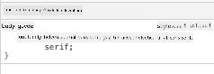

<!--
CO_OP_TRANSLATOR_METADATA:
{
  "original_hash": "92c4431eac70670b0450b02c1d11279a",
  "translation_date": "2025-10-22T23:58:06+00:00",
  "source_file": "3-terrarium/2-intro-to-css/README.md",
  "language_code": "tr"
}
-->
# Teraryum Projesi Bölüm 2: CSS'e Giriş


> Sketchnote: [Tomomi Imura](https://twitter.com/girlie_mac)

HTML teraryumunuzun oldukça basit göründüğünü hatırlıyor musunuz? CSS, bu sade yapıyı görsel olarak çekici bir şeye dönüştürdüğümüz yerdir.

Eğer HTML bir evin iskeleti gibiyse, CSS o evi ev gibi hissettiren her şeydir - boya renkleri, mobilya düzeni, aydınlatma ve odaların birbirine uyumu. Versailles Sarayı'nın basit bir av köşkü olarak başladığını, ancak dekorasyon ve düzenlemeye gösterilen özenle dünyanın en görkemli binalarından birine dönüştüğünü düşünün.

Bugün, teraryumunuzu işlevsel bir yapıdan şık bir tasarıma dönüştüreceğiz. Öğreneceğiniz şeyler arasında öğeleri tam olarak konumlandırmak, düzenleri farklı ekran boyutlarına uyumlu hale getirmek ve web sitelerini çekici kılan görsel cazibeyi yaratmak var.

Bu dersin sonunda, stratejik CSS stillendirmesinin projenizi nasıl dramatik bir şekilde geliştirebileceğini göreceksiniz. Haydi teraryumunuza biraz stil ekleyelim.

## Ders Öncesi Test

[Ders öncesi testi](https://ff-quizzes.netlify.app/web/quiz/17)

## CSS ile Başlangıç

CSS genellikle sadece "şeyleri güzel yapmak" olarak düşünülür, ancak çok daha geniş bir amaca hizmet eder. CSS, bir filmin yönetmeni olmak gibidir - sadece her şeyin nasıl göründüğünü değil, aynı zamanda nasıl hareket ettiğini, etkileşimlere nasıl tepki verdiğini ve farklı durumlara nasıl uyum sağladığını kontrol edersiniz.

Modern CSS oldukça yeteneklidir. Telefonlar, tabletler ve masaüstü bilgisayarlar için düzenleri otomatik olarak ayarlayan kodlar yazabilirsiniz. Kullanıcıların dikkatini gerektiği yere yönlendiren akıcı animasyonlar oluşturabilirsiniz. Her şey bir araya geldiğinde sonuçlar oldukça etkileyici olabilir.

> 💡 **Profesyonel İpucu**: CSS sürekli olarak yeni özellikler ve yeteneklerle gelişiyor. Üretim projelerinde daha yeni CSS özelliklerini kullanmadan önce her zaman [CanIUse.com](https://caniuse.com) adresinden tarayıcı desteğini kontrol edin.

**Bu derste neler başaracağız:**
- Modern CSS tekniklerini kullanarak teraryumunuz için eksiksiz bir görsel tasarım **oluşturacağız**
- Cascade, kalıtım ve CSS seçicileri gibi temel kavramları **keşfedeceğiz**
- Duyarlı konumlandırma ve düzen stratejilerini **uygulayacağız**
- CSS şekilleri ve stillendirme kullanarak teraryum kabını **inşa edeceğiz**

### Ön Koşul

Bir önceki dersten teraryumunuz için HTML yapısını tamamlamış olmalı ve stillendirmeye hazır olmalısınız.

> 📺 **Video Kaynağı**: Bu faydalı video rehberine göz atın
>
> [](https://www.youtube.com/watch?v=6yIdOIV9p1I)

### CSS Dosyanızı Ayarlama

Stil vermeye başlamadan önce CSS'i HTML'e bağlamamız gerekiyor. Bu bağlantı, tarayıcıya teraryumumuz için stil talimatlarını nerede bulacağını söyler.

Teraryum klasörünüzde `style.css` adında yeni bir dosya oluşturun ve ardından HTML belgenizin `<head>` bölümüne bağlayın:

```html
<link rel="stylesheet" href="./style.css" />
```

**Bu kodun yaptığı şeyler:**
- HTML ve CSS dosyalarınız arasında bir bağlantı **oluşturur**
- Tarayıcıya `style.css` dosyasından stilleri yüklemesini ve uygulamasını **söyler**
- Bu dosyanın bir CSS dosyası olduğunu belirtmek için `rel="stylesheet"` özelliğini **kullanır**
- Dosya yolunu `href="./style.css"` ile **referans alır**

## CSS Cascade'i Anlamak

CSS'in neden "Cascading" Style Sheets olarak adlandırıldığını hiç merak ettiniz mi? Stiller bir şelale gibi aşağı doğru akar ve bazen birbirleriyle çakışabilir.

Askeri komuta yapılarının nasıl çalıştığını düşünün - bir generalin emri "tüm askerler yeşil giyinsin" diyebilir, ancak biriminize özel bir emir "tören için mavi elbise giyin" diyebilir. Daha spesifik talimat öncelik kazanır. CSS benzer bir mantığı takip eder ve bu hiyerarşiyi anlamak hata ayıklamayı çok daha yönetilebilir hale getirir.

### Cascade Önceliğini Deneyimlemek

Bir stil çatışması yaratarak cascade'i görelim. Öncelikle `<h1>` etiketinize bir inline stil ekleyin:

```html
<h1 style="color: red">My Terrarium</h1>
```

**Bu kodun yaptığı şeyler:**
- Inline stil kullanarak `<h1>` öğesine doğrudan kırmızı bir renk **uygular**
- CSS'i doğrudan HTML'e gömmek için `style` özelliğini **kullanır**
- Bu belirli öğe için en yüksek öncelikli stil kuralını **oluşturur**

Sonra, `style.css` dosyanıza şu kuralı ekleyin:

```css
h1 {
  color: blue;
}
```

**Yukarıdaki kodda:**
- Tüm `<h1>` öğelerini hedefleyen bir CSS kuralı **tanımladık**
- Metin rengini mavi olarak ayarladık ve bunu harici bir stil dosyasıyla **yaptık**
- Inline stillere kıyasla daha düşük öncelikli bir kural **oluşturduk**

✅ **Bilgi Kontrolü**: Web uygulamanızda hangi renk görüntüleniyor? Neden o renk kazandı? Stilleri geçersiz kılmak isteyebileceğiniz senaryolar düşünebilir misiniz?

> 💡 **CSS Öncelik Sırası (yüksekten düşüğe):**
> 1. **Inline stiller** (style özelliği)
> 2. **ID'ler** (#myId)
> 3. **Sınıflar** (.myClass) ve özellikler
> 4. **Element seçiciler** (h1, div, p)
> 5. **Tarayıcı varsayılanları**

## CSS Kalıtımını Anlamak

CSS kalıtımı genetik gibi çalışır - öğeler, ebeveyn öğelerinden belirli özellikleri miras alır. Eğer body öğesinde yazı tipi ailesini ayarlarsanız, içindeki tüm metinler otomatik olarak aynı yazı tipini kullanır. Bu, Habsburg ailesinin belirgin çene yapısının nesiller boyunca her birey için özel olarak belirtilmeden ortaya çıkmasına benzer.

Ancak her şey miras alınmaz. Yazı tipleri ve renkler gibi metin stilleri miras alınır, ancak kenar boşlukları ve çerçeveler gibi düzen özellikleri miras alınmaz. Tıpkı çocukların fiziksel özellikleri miras alması ama ebeveynlerinin moda seçimlerini miras almaması gibi.

### Yazı Tipi Kalıtımını Gözlemlemek

`<body>` öğesinde bir yazı tipi ailesi ayarlayarak kalıtımı görelim:

```css
body {
  font-family: 'Segoe UI', Tahoma, Geneva, Verdana, sans-serif;
}
```

**Burada olanları açıklayalım:**
- `<body>` öğesini hedef alarak tüm sayfa için yazı tipi ailesini **ayarlar**
- Daha iyi tarayıcı uyumluluğu için yedek seçeneklerle bir yazı tipi yığını **kullanır**
- Farklı işletim sistemlerinde harika görünen modern sistem yazı tiplerini **uygular**
- Tüm alt öğelerin bu yazı tipini, özellikle geçersiz kılınmadıkça, **miras almasını sağlar**

Tarayıcınızın geliştirici araçlarını (F12) açın, Elemanlar sekmesine gidin ve `<h1>` öğenizi inceleyin. `<body>` öğesinden yazı tipi ailesini miras aldığını göreceksiniz:



✅ **Deney Zamanı**: `<body>` öğesinde `color`, `line-height` veya `text-align` gibi diğer miras alınabilir özellikleri ayarlamayı deneyin. Başlığınıza ve diğer öğelere ne olur?

> 📝 **Miras Alınabilir Özellikler**: `color`, `font-family`, `font-size`, `line-height`, `text-align`, `visibility`
>
> **Miras Alınamayan Özellikler**: `margin`, `padding`, `border`, `width`, `height`, `position`

## CSS Seçicilerini Anlamak

CSS seçicileri, belirli öğeleri stil vermek için hedeflemenin yoludur. Bu, kesin talimatlar vermek gibidir - "ev" demek yerine "Maple Caddesi'ndeki kırmızı kapılı mavi ev" diyebilirsiniz.

CSS, spesifik olmanın farklı yollarını sunar ve doğru seçiciyi seçmek, görev için uygun aracı seçmek gibidir. Bazen mahalledeki her kapıyı stil vermeniz gerekir, bazen de sadece belirli bir kapıyı.

### Element Seçiciler (Etiketler)

Element seçiciler, HTML öğelerini etiket adlarına göre hedefler. Sayfanızda genel olarak uygulanacak temel stiller ayarlamak için mükemmeldir:

```css
body {
  font-family: 'Segoe UI', Tahoma, Geneva, Verdana, sans-serif;
  margin: 0;
  padding: 0;
}

h1 {
  color: #3a241d;
  text-align: center;
  font-size: 2.5rem;
  margin-bottom: 1rem;
}
```

**Bu stilleri anlamak:**
- `body` seçici ile tüm sayfa boyunca tutarlı tipografi **ayarlar**
- Daha iyi kontrol için varsayılan tarayıcı kenar boşluklarını ve dolgusunu **kaldırır**
- Tüm başlık öğelerini renk, hizalama ve boşluklarla **stilize eder**
- Ölçeklenebilir, erişilebilir yazı tipi boyutları için `rem` birimlerini **kullanır**

Element seçiciler genel stil vermek için iyi çalışsa da, teraryumunuzdaki bitkiler gibi bireysel bileşenleri stilize etmek için daha spesifik seçicilere ihtiyacınız olacak.

### Benzersiz Öğeler için ID Seçiciler

ID seçiciler `#` sembolünü kullanır ve belirli `id` özelliklerine sahip öğeleri hedefler. ID'ler bir sayfada benzersiz olmalıdır, bu nedenle teraryumunuzun sol ve sağ bitki kapları gibi özel öğeleri stilize etmek için mükemmeldir.

Teraryumunuzdaki bitkilerin yer alacağı yan kaplar için stil oluşturmayı deneyelim:

```css
#left-container {
  background-color: #f5f5f5;
  width: 15%;
  left: 0;
  top: 0;
  position: absolute;
  height: 100vh;
  padding: 1rem;
  box-sizing: border-box;
}

#right-container {
  background-color: #f5f5f5;
  width: 15%;
  right: 0;
  top: 0;
  position: absolute;
  height: 100vh;
  padding: 1rem;
  box-sizing: border-box;
}
```

**Bu kodun yaptığı şeyler:**
- `absolute` konumlandırmayı kullanarak kapları ekranın sol ve sağ kenarlarına **yerleştirir**
- Ekran boyutuna uyum sağlayan duyarlı yükseklik için `vh` birimlerini **kullanır**
- `box-sizing: border-box` özelliğini **uygular**, böylece dolgu toplam genişliğe dahil edilir
- Sıfır değerlerinden gereksiz `px` birimlerini **kaldırır** ve kodu daha temiz hale getirir
- Gözleri yormayan hafif bir arka plan rengi **ayarlar**

✅ **Kod Kalitesi Meydan Okuması**: Bu CSS'in DRY (Kendini Tekrarlama) ilkesini ihlal ettiğini fark ettiniz mi? Bunu hem bir ID hem de bir sınıf kullanarak nasıl yeniden düzenleyebilirsiniz?

**Geliştirilmiş yaklaşım:**
```html
<div id="left-container" class="container"></div>
<div id="right-container" class="container"></div>
```

```css
.container {
  background-color: #f5f5f5;
  width: 15%;
  top: 0;
  position: absolute;
  height: 100vh;
  padding: 1rem;
  box-sizing: border-box;
}

#left-container {
  left: 0;
}

#right-container {
  right: 0;
}
```

### Yeniden Kullanılabilir Stiller için Sınıf Seçiciler

Sınıf seçiciler `.` sembolünü kullanır ve birden fazla öğeye aynı stilleri uygulamak istediğinizde mükemmeldir. ID'lerin aksine, sınıflar HTML boyunca tekrar kullanılabilir, bu da onları tutarlı stil kalıpları için ideal kılar.

Teraryumumuzda, her bitkinin benzer bir stil alması gerekiyor, ancak aynı zamanda bireysel konumlandırmaya da ihtiyaç duyuyor. Paylaşılan stiller için sınıfların ve benzersiz konumlandırma için ID'lerin bir kombinasyonunu kullanacağız.

**Her bitki için HTML yapısı:**
```html
<div class="plant-holder">
  
</div>
```

**Anahtar öğeler açıklandı:**
- Tüm bitkiler için tutarlı kaplama stilleri sağlamak için `class="plant-holder"` **kullanır**
- Paylaşılan görüntü stilleri ve davranışı için `class="plant"` **uygular**
- Bireysel konumlandırma ve JavaScript etkileşimi için benzersiz `id="plant1"` **içerir**
- Ekran okuyucu erişilebilirliği için açıklayıcı alt metin **sağlar**

Şimdi bu stilleri `style.css` dosyanıza ekleyin:

```css
.plant-holder {
  position: relative;
  height: 13%;
  left: -0.6rem;
}

.plant {
  position: absolute;
  max-width: 150%;
  max-height: 150%;
  z-index: 2;
  transition: transform 0.3s ease;
}

.plant:hover {
  transform: scale(1.05);
}
```

**Bu stilleri açıklamak:**
- Konumlandırma bağlamı oluşturmak için bitki tutucusuna göreli konumlandırma **uygular**
- Tüm bitki tutucularını dikey olarak kaydırmadan sığacak şekilde %13 yükseklik **ayarlar**
- Tutucuları hafifçe sola kaydırarak bitkileri kaplar içinde daha iyi **merkezler**
- Bitkilerin `max-width` ve `max-height` özellikleriyle duyarlı bir şekilde ölçeklenmesine **izin verir**
- Bitkileri teraryumdaki diğer öğelerin üzerine yerleştirmek için `z-index` **kullanır**
- Daha iyi kullanıcı etkileşimi için CSS geçişleriyle hafif bir hover efekti **ekler**

✅ **Eleştirel Düşünme**: Neden hem `.plant-holder` hem de `.plant` seçicilerine ihtiyacımız var? Sadece birini kullanmaya çalışsaydık ne olurdu?

> 💡 **Tasarım Deseni**: Kaplama (`.plant-holder`) düzen ve konumlandırmayı kontrol ederken, içerik (`.plant`) görünüm ve ölçeklemeyi kontrol eder. Bu ayrım kodu daha sürdürülebilir ve esnek hale getirir.

## CSS Konumlandırmayı Anlamak

CSS konumlandırma, bir oyunun sahne yönetmeni olmak gibidir - her aktörün nerede duracağını ve sahnede nasıl hareket edeceğini yönetirsiniz. Bazı aktörler standart düzene uyar, bazıları ise dramatik etki için özel bir konumlandırmaya ihtiyaç duyar.

Konumlandırmayı anladığınızda, birçok düzen zorluğu yönetilebilir hale gelir. Kullanıcılar kaydırırken üstte kalan bir navigasyon çubuğuna mı ihtiyacınız var? Konumlandırma bunu halleder. Belirli bir konumda görünen bir araç ipucu mu istiyorsunuz? Bu da konumlandırma ile yapılır.

### Beş Konum Değeri

| Konum Değeri | Davranış | Kullanım Durumu |
|--------------|----------|-----------------|
| `static` | Varsayılan akış, top/left/right/bottom'u yok sayar | Normal belge düzeni |
| `relative` | Normal konumuna göre konumlandırılır | Küçük ayarlamalar, konumlandırma bağlamı oluşturma |
| `absolute` | En yakın konumlandırılmış ata öğeye göre konumlandırılır | Hassas yerleştirme, üst üste bindirmeler |
| `fixed` | Görüntüleme alanına göre konumlandırılır | Navigasyon çubukları, yüzer öğeler |
| `sticky` | Kaydırmaya göre relative ve fixed arasında geçiş yapar | Kaydırma sırasında yapışan başlıklar |

### Teraryumumuzda Konumlandırma

Teraryumumuz, istenen düzeni oluşturmak için konumlandırma türlerinin stratejik bir kombinasyonunu kullanır:

```css
/* Container positioning */
.container {
  position: absolute; /* Removes from normal flow */
  /* ... other styles ... */
}

/* Plant holder positioning */
.plant-holder {
  position: relative; /* Creates positioning context */
  /* ... other styles ... */
}

/* Plant positioning */
.plant {
  position: absolute; /* Allows precise placement within holder */
  /* ... other styles ... */
}
```

**Konumlandırma stratejisini anlamak:**
- **Mutlak kaplar**, normal belge akışından çıkarılır ve ekran kenarlarına sabitlenir
- **Göreli bitki tutucular**, belge akışında kalırken bir konumlandırma bağlamı oluşturur
- **Mutlak bitkiler**, göreli kaplar içinde hassas bir şekilde konumlandırılabilir
- **Bu kombinasyon**, bitkilerin dikey olarak istiflenmesine ve bireysel olarak konumlandırılabilir olmasına olanak tanır

> 🎯 **Neden Önemli**: `plant` öğelerinin bir sonraki derste sürüklenebilir hale gelmesi için mutlak konumlandırmaya ihtiyacı var. Mutlak konumlandırma, onları normal düzen akışından çıkarır ve sürükle-bırak etkileşimlerini mümkün kılar.

✅ **Deney Zamanı**: Konumlandırma değerlerini değiştirmeyi deneyin ve sonuçları gözlemleyin:
- `.container`'ı `absolute` yerine `relative` olarak değiştirirseniz ne olur?
- `.plant-holder`'ı `relative` yerine `absolute` olarak ayarlarsanız düzen nasıl değişir?
- `.plant`'ı `relative` konumlandırmaya geçirirseniz ne olur?

## CSS ile Teraryum İnşa Etmek

Şimdi sadece CSS kullanarak bir cam kavanoz yapacağız - hiçbir resim veya grafik yazılımı gerekmiyor.

Konumlandırma ve şeffaflık kullanarak gerçekçi görünümlü cam, gölgeler ve derinlik efektleri oluşturmak, CSS'in görsel yeteneklerini gösterir. Bu teknik, Bauhaus hareketindeki mimarların basit geometrik formları kullanarak karmaşık, güzel yapılar yaratma yöntemlerini yansıtır. Bu prensipleri anladığınızda, birçok web tasarımının arkasındaki CSS tekniklerini tanıyabilirsiniz.

### Cam Kavanoz Bileşenlerini Oluşturma
Hadi, teraryum kavanozunu parça parça oluşturalım. Her bir parça, duyarlı tasarım için yüzde tabanlı boyutlandırma ve mutlak konumlandırma kullanır:

```css
.jar-walls {
  height: 80%;
  width: 60%;
  background: #d1e1df;
  border-radius: 1rem;
  position: absolute;
  bottom: 0.5%;
  left: 20%;
  opacity: 0.5;
  z-index: 1;
  box-shadow: inset 0 0 2rem rgba(0, 0, 0, 0.1);
}

.jar-top {
  width: 50%;
  height: 5%;
  background: #d1e1df;
  position: absolute;
  bottom: 80.5%;
  left: 25%;
  opacity: 0.7;
  z-index: 1;
  border-radius: 0.5rem 0.5rem 0 0;
}

.jar-bottom {
  width: 50%;
  height: 1%;
  background: #d1e1df;
  position: absolute;
  bottom: 0;
  left: 25%;
  opacity: 0.7;
  border-radius: 0 0 0.5rem 0.5rem;
}

.dirt {
  width: 60%;
  height: 5%;
  background: #3a241d;
  position: absolute;
  border-radius: 0 0 1rem 1rem;
  bottom: 1%;
  left: 20%;
  opacity: 0.7;
  z-index: -1;
}
```

**Teraryum yapısını anlama:**
- **Kullanır** yüzde tabanlı boyutlar, tüm ekran boyutlarında duyarlı ölçekleme için
- **Konumlandırır** öğeleri mutlak olarak, onları tam olarak üst üste ve hizalamak için
- **Uygular** farklı opaklık değerleri, cam şeffaflık efekti oluşturmak için
- **Kullanır** `z-index` katmanlaması, bitkilerin kavanozun içinde görünmesini sağlamak için
- **Ekler** ince kutu gölgesi ve rafine edilmiş kenar yuvarlama, daha gerçekçi bir görünüm için

### Yüzde ile Duyarlı Tasarım

Tüm boyutların sabit piksel değerleri yerine yüzde kullanmasına dikkat edin:

**Neden önemli:**
- **Sağlar** teraryumun herhangi bir ekran boyutunda orantılı olarak ölçeklenmesini
- **Korur** kavanoz bileşenleri arasındaki görsel ilişkileri
- **Sunar** mobil telefonlardan büyük masaüstü monitörlere kadar tutarlı bir deneyim
- **İzin verir** tasarımın görsel düzeni bozmadan uyum sağlamasına

### CSS Birimlerinin Kullanımı

Kenarlık yuvarlama için `rem` birimlerini kullanıyoruz, bu birimler kök yazı tipi boyutuna göre ölçeklenir. Bu, kullanıcı yazı tipi tercihlerini dikkate alan daha erişilebilir tasarımlar oluşturur. [CSS göreceli birimler](https://www.w3.org/TR/css-values-3/#font-relative-lengths) hakkında daha fazla bilgi edinin.

✅ **Görsel Deneyim**: Bu değerleri değiştirin ve etkilerini gözlemleyin:
- Kavanoz opaklığını 0.5'ten 0.8'e değiştirin – cam görünümünü nasıl etkiliyor?
- Toprağın rengini `#3a241d`'den `#8B4513`'e ayarlayın – görsel etkisi nedir?
- Toprağın `z-index` değerini 2 olarak değiştirin – katmanlama üzerinde ne oluyor?

---

## GitHub Copilot Agent Challenge 🚀

Agent modunu kullanarak aşağıdaki meydan okumayı tamamlayın:

**Açıklama:** Teraryum bitkilerinin doğal bir rüzgar etkisi simüle ederek hafifçe sallanmasını sağlayan bir CSS animasyonu oluşturun. Bu, CSS animasyonları, dönüşümler ve keyframe'leri pratik yaparken teraryumun görsel çekiciliğini artırmanıza yardımcı olacak.

**İpucu:** Bitkilerin teraryumda hafifçe sağa sola sallanmasını sağlayan CSS keyframe animasyonları ekleyin. Her bitkiyi hafifçe (2-3 derece) sola ve sağa döndüren bir sallanma animasyonu oluşturun, 3-4 saniye süresince ve `.plant` sınıfına uygulayın. Animasyonun sonsuz döngüye sahip olduğundan ve doğal bir hareket için bir easing fonksiyonuna sahip olduğundan emin olun.

[agent mode](https://code.visualstudio.com/blogs/2025/02/24/introducing-copilot-agent-mode) hakkında daha fazla bilgi edinin.

## 🚀 Meydan Okuma: Cam Yansımaları Ekleme

Teraryumunuzu gerçekçi cam yansımalarıyla geliştirmeye hazır mısınız? Bu teknik tasarıma derinlik ve gerçekçilik katacak.

Cam yüzeylerinden ışığın nasıl yansıdığını simüle eden ince vurgular oluşturacaksınız. Bu yaklaşım, Jan van Eyck gibi Rönesans ressamlarının boyalı camı üç boyutlu göstermek için ışık ve yansımayı nasıl kullandığına benzer. İşte hedefiniz:


**Meydan okumanız:**
- **Oluşturun** cam yansımaları için ince beyaz veya açık renkli oval şekiller
- **Konumlandırın** bunları kavanozun sol tarafında stratejik olarak
- **Uygulayın** gerçekçi ışık yansıması için uygun opaklık ve bulanıklık efektleri
- **Kullanın** `border-radius` organik, baloncuk benzeri şekiller oluşturmak için
- **Deneyin** daha fazla gerçekçilik için gradyanlar veya kutu gölgeleri

## Ders Sonrası Test

[Ders sonrası test](https://ff-quizzes.netlify.app/web/quiz/18)

## CSS Bilginizi Genişletin

CSS başlangıçta karmaşık gelebilir, ancak bu temel kavramları anlamak daha ileri teknikler için sağlam bir temel sağlar.

**Bir sonraki CSS öğrenme alanlarınız:**
- **Flexbox** - öğelerin hizalanmasını ve dağıtımını basitleştirir
- **CSS Grid** - karmaşık düzenler oluşturmak için güçlü araçlar sunar
- **CSS Değişkenleri** - tekrarı azaltır ve sürdürülebilirliği artırır
- **Duyarlı tasarım** - sitelerin farklı ekran boyutlarında iyi çalışmasını sağlar

### Etkileşimli Öğrenme Kaynakları

Bu eğlenceli, uygulamalı oyunlarla bu kavramları pratik yapın:
- 🐸 [Flexbox Froggy](https://flexboxfroggy.com/) - Eğlenceli meydan okumalarla Flexbox'ı öğrenin
- 🌱 [Grid Garden](https://codepip.com/games/grid-garden/) - Sanal havuçlar yetiştirerek CSS Grid'i öğrenin
- 🎯 [CSS Battle](https://cssbattle.dev/) - CSS becerilerinizi kodlama meydan okumalarıyla test edin

### Ek Öğrenme

Kapsamlı CSS temelleri için bu Microsoft Learn modülünü tamamlayın: [HTML uygulamanızı CSS ile stilize edin](https://docs.microsoft.com/learn/modules/build-simple-website/4-css-basics/?WT.mc_id=academic-77807-sagibbon)

## Ödev

[CSS Refactoring](assignment.md)

---

**Feragatname**:  
Bu belge, AI çeviri hizmeti [Co-op Translator](https://github.com/Azure/co-op-translator) kullanılarak çevrilmiştir. Doğruluk için çaba göstersek de, otomatik çeviriler hata veya yanlışlıklar içerebilir. Belgenin orijinal dili, yetkili kaynak olarak kabul edilmelidir. Kritik bilgiler için profesyonel insan çevirisi önerilir. Bu çevirinin kullanımından kaynaklanan yanlış anlamalar veya yanlış yorumlamalardan sorumlu değiliz.