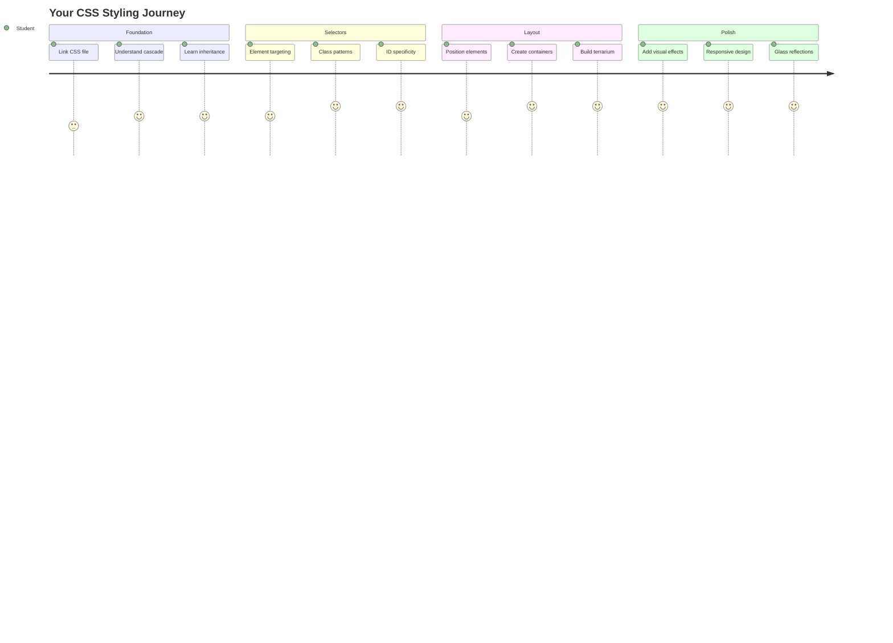
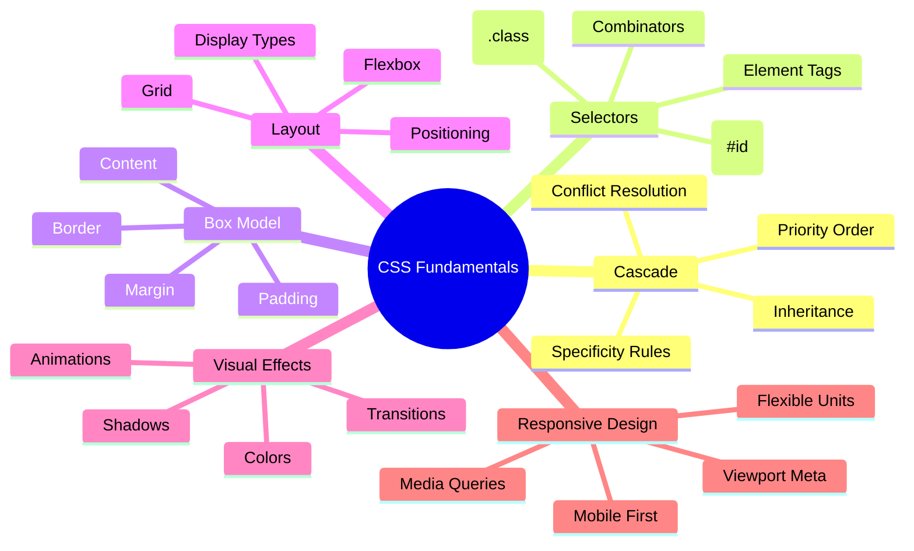
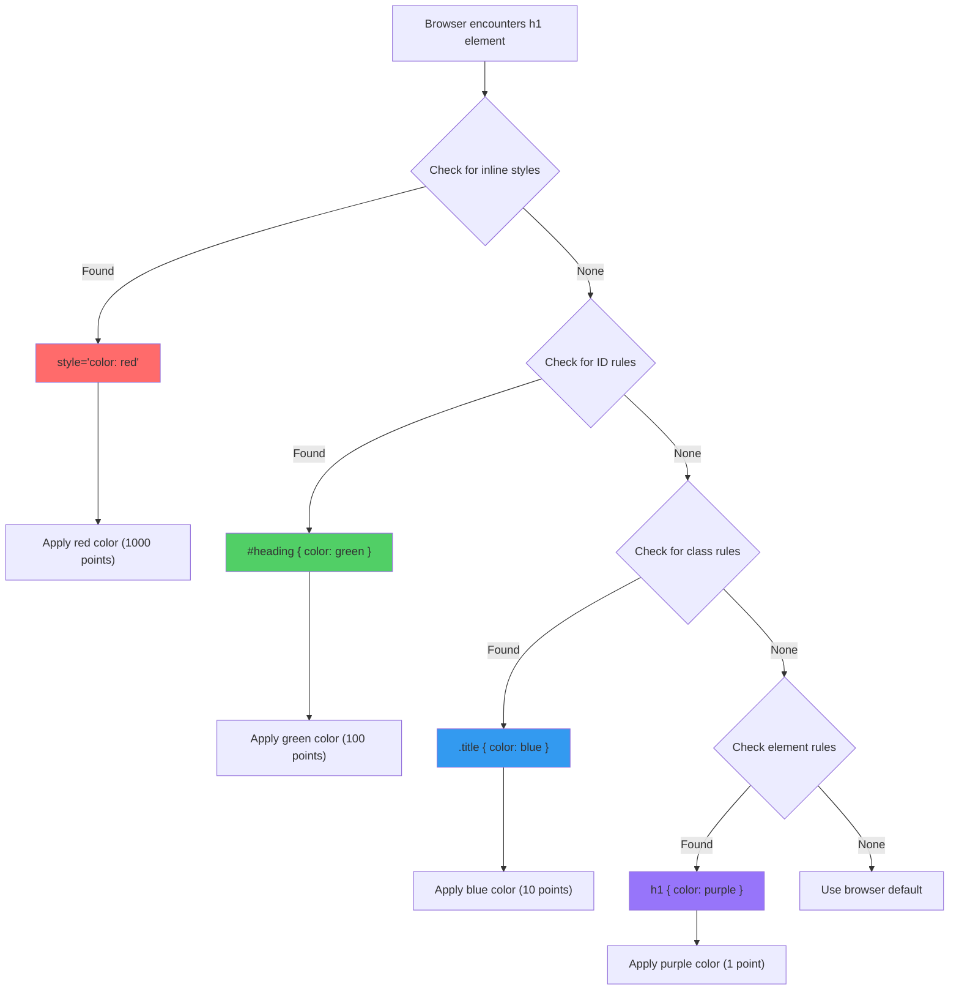
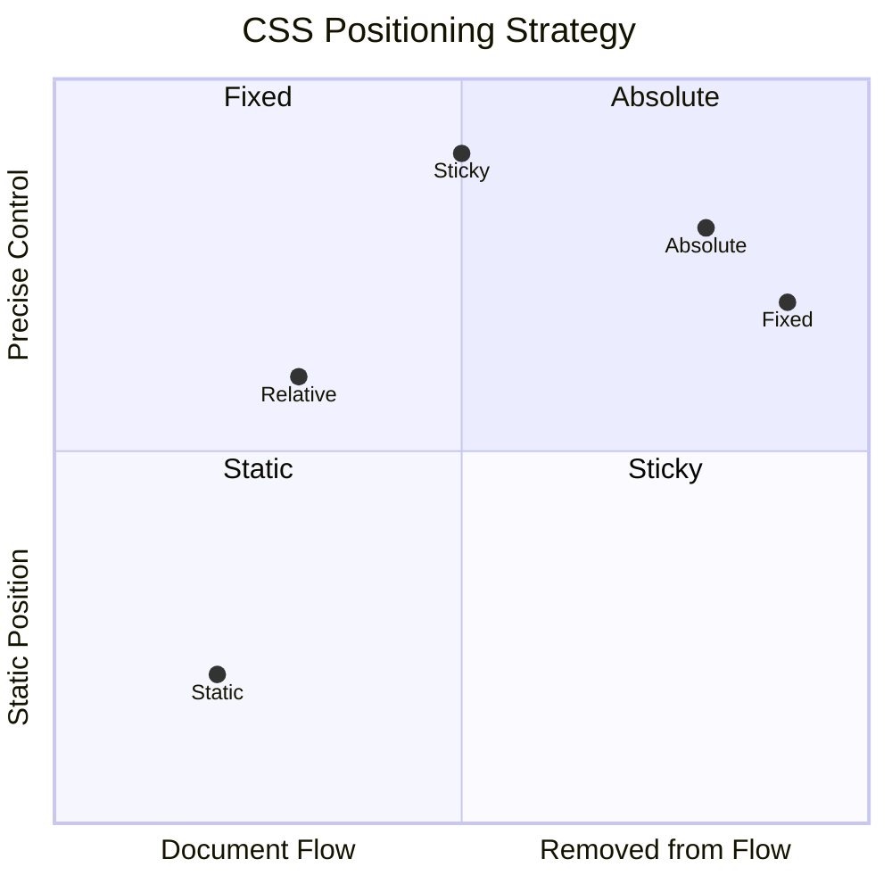
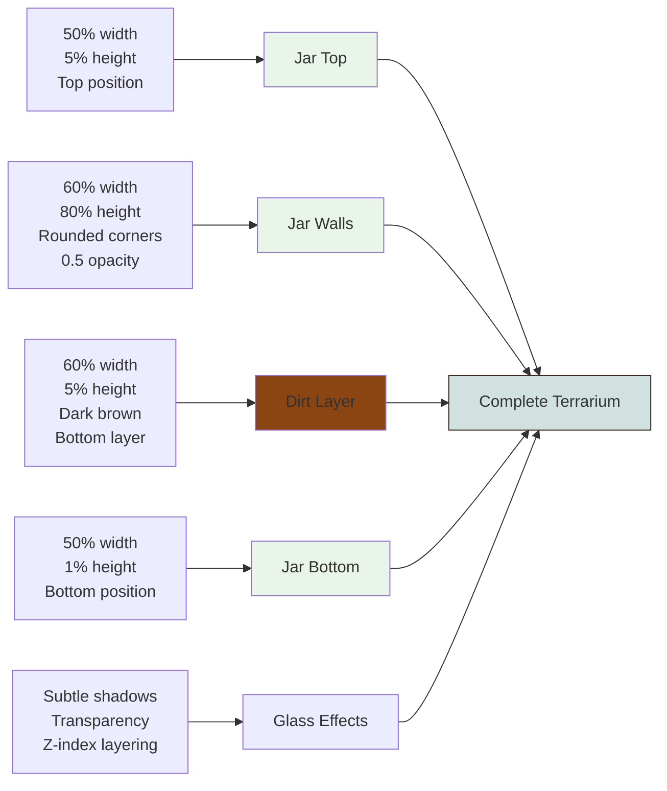
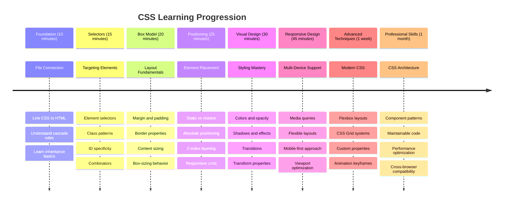

<!--
CO_OP_TRANSLATOR_METADATA:
{
  "original_hash": "e39f3a4e3bcccf94639e3af1248f8a4d",
  "translation_date": "2025-11-04T00:55:10+00:00",
  "source_file": "3-terrarium/2-intro-to-css/README.md",
  "language_code": "tr"
}
-->
# Teraryum Projesi Bölüm 2: CSS'e Giriş




> Sketchnote: [Tomomi Imura](https://twitter.com/girlie_mac)

HTML teraryumunuzun oldukça basit göründüğünü hatırlıyor musunuz? CSS, bu sade yapıyı görsel olarak çekici bir şeye dönüştürdüğümüz yerdir.

HTML bir evin çerçevesini inşa etmek gibiyse, CSS onu ev gibi hissettiren her şeydir - boya renkleri, mobilya düzeni, aydınlatma ve odaların birbirine akışı. Versailles Sarayı'nın basit bir av köşkü olarak başladığını, ancak dekorasyon ve düzenlemeye dikkat edilerek dünyanın en görkemli binalarından birine dönüştüğünü düşünün.

Bugün, teraryumunuzu işlevsel olmaktan çıkarıp cilalı bir hale getireceğiz. Öğreneceğiniz şeyler arasında öğeleri tam olarak konumlandırmak, düzenleri farklı ekran boyutlarına uyumlu hale getirmek ve web sitelerini etkileyici kılan görsel çekiciliği yaratmak var.

Bu dersin sonunda, stratejik CSS stillerinin projenizi nasıl dramatik bir şekilde geliştirebileceğini göreceksiniz. Haydi teraryumunuza biraz stil ekleyelim.



## Ders Öncesi Test

[Ders öncesi testi](https://ff-quizzes.netlify.app/web/quiz/17)

## CSS'e Başlangıç

CSS genellikle sadece "şeyleri güzel yapmak" olarak düşünülür, ancak çok daha geniş bir amaca hizmet eder. CSS, bir filmin yönetmeni olmak gibidir - sadece her şeyin nasıl göründüğünü değil, nasıl hareket ettiğini, etkileşimlere nasıl tepki verdiğini ve farklı durumlara nasıl uyum sağladığını kontrol edersiniz.

Modern CSS oldukça yeteneklidir. Telefonlar, tabletler ve masaüstü bilgisayarlar için düzenleri otomatik olarak ayarlayan kodlar yazabilirsiniz. Kullanıcıların dikkatini gerektiği yere yönlendiren akıcı animasyonlar oluşturabilirsiniz. Her şey bir araya geldiğinde sonuçlar oldukça etkileyici olabilir.

> 💡 **Profesyonel İpucu**: CSS sürekli olarak yeni özellikler ve yeteneklerle gelişiyor. Üretim projelerinde daha yeni CSS özelliklerini kullanmadan önce her zaman [CanIUse.com](https://caniuse.com) adresinden tarayıcı desteğini kontrol edin.

**Bu derste başaracaklarımız:**
- **Modern CSS teknikleri kullanarak** teraryumunuz için eksiksiz bir görsel tasarım oluşturmak
- **Temel kavramları keşfetmek**, örneğin kaskad, kalıtım ve CSS seçiciler
- **Duyarlı konumlandırma ve düzen stratejilerini uygulamak**
- **CSS şekilleri ve stilleri kullanarak** teraryum kabını oluşturmak

### Ön Koşul

Bir önceki dersten teraryumunuz için HTML yapısını tamamlamış olmalı ve stil vermeye hazır olmalısınız.

> 📺 **Video Kaynağı**: Bu faydalı video rehberine göz atın
>
> [](https://www.youtube.com/watch?v=6yIdOIV9p1I)

### CSS Dosyanızı Ayarlama

Stil vermeye başlamadan önce CSS'i HTML'e bağlamamız gerekiyor. Bu bağlantı, tarayıcıya teraryumumuz için stil talimatlarını nerede bulacağını söyler.

Teraryum klasörünüzde `style.css` adında yeni bir dosya oluşturun ve ardından HTML belgenizin `<head>` bölümüne bağlayın:

```html
<link rel="stylesheet" href="./style.css" />
```

**Bu kodun yaptığı şey:**
- **HTML ve CSS dosyalarınız arasında bir bağlantı oluşturur**
- **Tarayıcıya `style.css` dosyasından stilleri yükleyip uygulamasını söyler**
- **Bu dosyanın bir CSS dosyası olduğunu belirtmek için `rel="stylesheet"` özelliğini kullanır**
- **Dosya yolunu `href="./style.css"` ile referans alır**

## CSS Kaskadını Anlamak

CSS'in neden "Cascading" (Kaskad) Stil Sayfaları olarak adlandırıldığını hiç merak ettiniz mi? Stiller bir şelale gibi aşağı doğru akar ve bazen birbirleriyle çelişir.

Askeri komuta yapılarının nasıl çalıştığını düşünün - bir genel emir "tüm birlikler yeşil giyinsin" diyebilir, ancak biriminize özel bir emir "tören için mavi elbise giyin" diyebilir. Daha spesifik talimat öncelikli olur. CSS benzer bir mantık izler ve bu hiyerarşiyi anlamak hata ayıklamayı çok daha yönetilebilir hale getirir.

### Kaskad Önceliğini Deneyimlemek

Bir stil çatışması oluşturarak kaskadı iş başında görelim. Öncelikle `<h1>` etiketinize bir satır içi stil ekleyin:

```html
<h1 style="color: red">My Terrarium</h1>
```

**Bu kodun yaptığı şey:**
- **Satır içi stil kullanarak** `<h1>` öğesine doğrudan kırmızı bir renk uygular
- **CSS'i doğrudan HTML'e gömmek için** `style` özelliğini kullanır
- **Bu belirli öğe için en yüksek öncelikli stil kuralını oluşturur**

Sonra, `style.css` dosyanıza şu kuralı ekleyin:

```css
h1 {
  color: blue;
}
```

**Yukarıdaki kodda:**
- **Tüm `<h1>` öğelerini hedefleyen bir CSS kuralı tanımladık**
- **Dış stil dosyasını kullanarak metin rengini mavi olarak ayarladık**
- **Satır içi stillere göre daha düşük öncelikli bir kural oluşturduk**

✅ **Bilgi Kontrolü**: Web uygulamanızda hangi renk görüntüleniyor? Neden o renk kazandı? Stilleri geçersiz kılmak istediğiniz senaryolar düşünebilir misiniz?



> 💡 **CSS Öncelik Sırası (yüksekten düşüğe):**
> 1. **Satır içi stiller** (style özelliği)
> 2. **ID'ler** (#myId)
> 3. **Sınıflar** (.myClass) ve özellikler
> 4. **Element seçiciler** (h1, div, p)
> 5. **Tarayıcı varsayılanları**

## CSS Kalıtımını İş Başında Görmek

CSS kalıtımı genetik gibidir - öğeler, ebeveyn öğelerinden belirli özellikleri miras alır. Eğer body öğesinde yazı tipi ailesini ayarlarsanız, içindeki tüm metin otomatik olarak aynı yazı tipini kullanır. Bu, Habsburg ailesinin belirgin çene yapısının nesiller boyunca her birey için özel olarak belirtilmeden ortaya çıkmasına benzer.

Ancak her şey miras alınmaz. Yazı tipleri ve renkler gibi metin stilleri miras alınır, ancak kenar boşlukları ve çerçeveler gibi düzen özellikleri miras alınmaz. Tıpkı çocukların fiziksel özellikleri miras alması ama ebeveynlerinin moda seçimlerini miras almaması gibi.

### Yazı Tipi Kalıtımını Gözlemlemek

Body öğesinde bir yazı tipi ailesi ayarlayarak kalıtımı iş başında görelim:

```css
body {
  font-family: 'Segoe UI', Tahoma, Geneva, Verdana, sans-serif;
}
```

**Burada olanları açıklamak:**
- **Body öğesini hedefleyerek** tüm sayfa için yazı tipi ailesini ayarlar
- **Daha iyi tarayıcı uyumluluğu için** yedek seçeneklerle bir yazı tipi yığını kullanır
- **Farklı işletim sistemlerinde harika görünen modern sistem yazı tiplerini uygular**
- **Tüm alt öğelerin bu yazı tipini miras almasını sağlar, aksi belirtilmedikçe**

Tarayıcınızın geliştirici araçlarını (F12) açın, Elementler sekmesine gidin ve `<h1>` öğenizi inceleyin. Body'den yazı tipi ailesini miras aldığını göreceksiniz:


✅ **Deney Zamanı**: Body öğesinde `color`, `line-height` veya `text-align` gibi diğer miras alınabilir özellikleri ayarlamayı deneyin. Başlığınız ve diğer öğeler üzerinde ne olur?

> 📝 **Miras Alınabilir Özellikler Şunları İçerir**: `color`, `font-family`, `font-size`, `line-height`, `text-align`, `visibility`
>
> **Miras Alınamayan Özellikler Şunları İçerir**: `margin`, `padding`, `border`, `width`, `height`, `position`

### 🔄 **Pedagojik Kontrol**
**CSS Temellerini Anlama**: Seçicilere geçmeden önce şunları yapabildiğinizden emin olun:
- ✅ Kaskad ve kalıtım arasındaki farkı açıklayın
- ✅ Bir özgüllük çatışmasında hangi stilin kazanacağını tahmin edin
- ✅ Hangi özelliklerin ebeveyn öğelerden miras alındığını belirleyin
- ✅ CSS dosyalarını HTML'e doğru şekilde bağlayın

**Hızlı Test**: Eğer bu stillere sahipseniz, `<div class="special">` içindeki bir `<h1>` ne renk olur?
```css
div { color: blue; }
.special { color: green; }
h1 { color: red; }
```
*Cevap: Kırmızı (element seçici doğrudan h1'i hedefliyor)*

## CSS Seçicilerini Öğrenmek

CSS seçicileri, belirli öğeleri stil vermek için hedeflemenin yoludur. Bu, kesin talimatlar vermek gibi çalışır - "ev" demek yerine "Maple Sokağı'ndaki kırmızı kapılı mavi ev" diyebilirsiniz.

CSS, spesifik olmanın farklı yollarını sunar ve doğru seçiciyi seçmek, görev için uygun aracı seçmek gibidir. Bazen mahalledeki her kapıyı stil vermeniz gerekir, bazen de sadece belirli bir kapıyı.

### Element Seçiciler (Etiketler)

Element seçiciler, HTML öğelerini etiket adlarına göre hedefler. Sayfanızda geniş çapta uygulanacak temel stiller ayarlamak için mükemmeldir:

```css
body {
  font-family: 'Segoe UI', Tahoma, Geneva, Verdana, sans-serif;
  margin: 0;
  padding: 0;
}

h1 {
  color: #3a241d;
  text-align: center;
  font-size: 2.5rem;
  margin-bottom: 1rem;
}
```

**Bu stilleri anlamak:**
- **Body seçici ile** tüm sayfada tutarlı tipografi ayarlar
- **Daha iyi kontrol için** tarayıcı varsayılan kenar boşluklarını ve dolgusunu kaldırır
- **Tüm başlık öğelerini** renk, hizalama ve boşluklarla stil verir
- **Erişilebilir, ölçeklenebilir yazı tipi boyutları için** `rem` birimlerini kullanır

Element seçiciler genel stil vermek için iyi çalışır, ancak teraryumunuzdaki bitkiler gibi bireysel bileşenleri stil vermek için daha spesifik seçicilere ihtiyacınız olacak.

### Benzersiz Öğeler için ID Seçiciler

ID seçiciler `#` sembolünü kullanır ve belirli `id` özelliklerine sahip öğeleri hedefler. ID'ler bir sayfada benzersiz olmalıdır, bu yüzden teraryumumuzun sol ve sağ bitki kapları gibi bireysel, özel öğeleri stil vermek için mükemmeldir.

Teraryumumuzun bitkilerin yer alacağı yan kaplar için stil oluşturmayı deneyelim:

```css
#left-container {
  background-color: #f5f5f5;
  width: 15%;
  left: 0;
  top: 0;
  position: absolute;
  height: 100vh;
  padding: 1rem;
  box-sizing: border-box;
}

#right-container {
  background-color: #f5f5f5;
  width: 15%;
  right: 0;
  top: 0;
  position: absolute;
  height: 100vh;
  padding: 1rem;
  box-sizing: border-box;
}
```

**Bu kodun yaptığı şey:**
- **Kapları** `absolute` konumlandırma kullanarak ekranın en sol ve sağ kenarlarına yerleştirir
- **Ekran boyutuna uyum sağlayan** `vh` (viewport height) birimlerini kullanarak duyarlı yükseklik uygular
- **Toplam genişliğe dahil edilmesi için** `box-sizing: border-box` uygular
- **Gereksiz `px` birimlerini sıfır değerlerinden kaldırarak** daha temiz kod sağlar
- **Göz yormayan hafif bir arka plan rengi ayarlar**

✅ **Kod Kalitesi Meydan Okuması**: Bu CSS'in DRY (Kendini Tekrarlama) ilkesini ihlal ettiğini fark ettiniz mi? Bunu hem ID hem de sınıf kullanarak nasıl yeniden düzenleyebilirsiniz?

**Geliştirilmiş yaklaşım:**
```html
<div id="left-container" class="container"></div>
<div id="right-container" class="container"></div>
```

```css
.container {
  background-color: #f5f5f5;
  width: 15%;
  top: 0;
  position: absolute;
  height: 100vh;
  padding: 1rem;
  box-sizing: border-box;
}

#left-container {
  left: 0;
}

#right-container {
  right: 0;
}
```

### Yeniden Kullanılabilir Stiller için Sınıf Seçiciler

Sınıf seçiciler `.` sembolünü kullanır ve birden fazla öğeye aynı stilleri uygulamak istediğinizde mükemmeldir. ID'lerin aksine, sınıflar HTML boyunca tekrar kullanılabilir, bu da tutarlı stil düzenleri için idealdir.

Teraryumumuzda, her bitkinin benzer bir stile ihtiyacı var ancak aynı zamanda bireysel konumlandırmaya da ihtiyacı var. Paylaşılan stiller için sınıflar ve benzersiz konumlandırma için ID'ler kombinasyonunu kullanacağız.

**Her bitki için HTML yapısı:**
```html
<div class="plant-holder">
  
</div>
```

**Anahtar öğeler açıklaması:**
- **Tüm bitki kapları için tutarlı kaplama stilleri sağlamak için** `class="plant-holder"` kullanır
- **Paylaşılan resim stilleri ve davranışı için** `class="plant"` uygular
- **Bireysel konumlandırma ve JavaScript etkileşimi için** benzersiz `id="plant1"` içerir
- **Ekran okuyucu erişilebilirliği için** açıklayıcı alt metin sağlar

Şimdi bu stilleri `style.css` dosyanıza ekleyin:

```css
.plant-holder {
  position: relative;
  height: 13%;
  left: -0.6rem;
}

.plant {
  position: absolute;
  max-width: 150%;
  max-height: 150%;
  z-index: 2;
  transition: transform 0.3s ease;
}

.plant:hover {
  transform: scale(1.05);
}
```

**Bu stilleri açıklamak:**
- **Bitki kapları için** göreceli konumlandırma oluşturarak bir konumlandırma bağlamı oluşturur
- **Tüm bitki kaplarını** %13 yükseklikte ayarlayarak tüm bitkilerin dikey olarak sığmasını sağlar
- **Kapları biraz sola kaydırarak** bitkileri kaplar içinde daha iyi merkezler
- **Bitkilerin duyarlı bir şekilde ölçeklenmesine izin verir** `max-width` ve `max-height` özellikleriyle
- **Bitkileri teraryumdaki diğer öğelerin üzerine katmanlamak için** `z-index` kullanır
- **Daha iyi kullanıcı etkileşimi için** CSS geçişleriyle hafif bir hover efekti ekler

✅ **Eleştirel Düşünme**: Neden hem `.plant-holder` hem de `.plant` seçicilere ihtiyacımız var? Sadece birini kullanmaya çalışırsak ne olurdu?

> 💡 **Tasarım Deseni**: Kap (`.plant-holder`) düzen ve konumlandırmayı kontrol ederken, içerik (`.plant`) görünüm ve ölçeklemeyi kontrol eder. Bu ayrım kodu daha sürdürülebilir ve esnek hale getirir.

## CSS Konumlandırmayı Anlamak

CSS konumlandırma, bir oyunun sahne yönetmeni olmak gibidir - her aktörün nerede duracağını ve sahnede nasıl hareket edeceğini yönlendirirsiniz. Bazı aktörler standart formasyona uyar, diğerleri ise dramatik etki için özel bir konumlandırmaya ihtiyaç duyar.

Konumlandırmayı anladığınızda, birçok düzen zorluğu yönetilebilir hale gelir. Kullanıcılar kaydırırken üstte kalan bir navigasyon çubuğuna mı ihtiyacınız var? Konumlandırma bunu halleder. Belirli bir konumda görünen bir araç ipucu mu istiyorsunuz? Bu da konumlandırma ile mümkün.

### Beş Konum Değeri



| Konum Değeri | Davranış | Kullanım Durumu |
|--------------|----------|----------------|
| `static` | Varsayılan akış, top/left/right/bottom'u yok sayar | Normal belge düzeni |
| `relative` | Normal konumuna göre konumlandırılır | Küçük ayarlamalar, konumlandırma bağlamı oluşturma |
| `absolute` | En yakın konumlandırılmış ata öğeye göre konumlandırılır | Hassas yerleştirme, kaplamalar |
| `fixed` | Görüntüleme alanına göre konumlandırılır | Navigasyon çubukları, kayan öğeler |
| `sticky` | Kaydırmaya bağlı olarak relative ve fixed arasında geçiş yapar | Kaydırma sırasında yapışan başlıklar |

### Teraryumumuzda Konumlandırma

Teraryumumuz, istenen düzeni oluşturmak için konumlandırma türlerinin stratejik bir kombinasyonunu kullanır:

```css
/* Container positioning */
.container {
  position: absolute; /* Removes from normal flow */
  /* ... other styles ... */
}

/* Plant holder positioning */
.plant-holder {
  position: relative; /* Creates positioning context */
  /* ... other styles ... */
}

/* Plant positioning */
.plant {
  position: absolute; /* Allows precise placement within holder */
  /* ... other styles ... */
}
```

**Konumlandırma stratejisini anlamak:**
- **Mutlak kaplar**, normal belge akışından çıkarılır ve ekran kenarlarına sabitlenir
- **Göreceli bitki kapları**, belge akışında kalırken bir konumlandırma bağlamı oluşturur
- **Mutlak bitkiler**, göreceli kaplar içinde hassas bir şekilde konumlandırılabilir
- **Bu kombinasyon**, bitkilerin dikey olarak sıralanmasına ve bireysel olarak konumlandırılabilir olmasına olanak tanır

> 🎯 **Neden Önemli**: `plant` öğelerinin bir sonraki derste sürüklenebilir hale gelmesi için mutlak konumlandırmaya ihtiyacı var. Mutlak konumlandırma, onları normal düzen akışından çıkarır ve sürükle-bırak etkileşimlerini mümkün kılar.

✅ **Deney Zamanı**: Konumlandırma değerlerini değiştirmeyi deneyin ve sonuçları gözlemleyin:
- `.container` öğesini `absolute` yerine `relative` olarak değiştirirseniz ne olur?
- `.plant-holder` öğesi `relative` yerine `absolute` kullanırsa, düzen nasıl değişir?
- `.plant` öğesini `relative` konumlandırmaya geçirdiğinizde ne olur?

### 🔄 **Pedagojik Kontrol Noktası**
**CSS Konumlandırma Uzmanlığı**: Anlamanızı doğrulamak için duraklayın:
- ✅ Bitkilerin sürükle ve bırak işlemi için neden mutlak konumlandırmaya ihtiyaç duyduğunu açıklayabilir misiniz?
- ✅ Göreceli konteynerlerin konumlandırma bağlamı oluşturduğunu anlıyor musunuz?
- ✅ Yan konteynerlerin neden mutlak konumlandırma kullandığını biliyor musunuz?
- ✅ Konumlandırma deklarasyonlarını tamamen kaldırırsanız ne olur?

**Gerçek Dünya Bağlantısı**: CSS konumlandırmanın gerçek dünya düzenini nasıl yansıttığını düşünün:
- **Statik**: Raflardaki kitaplar (doğal düzen)
- **Göreceli**: Bir kitabı hafifçe hareket ettirmek ama yerini korumak
- **Mutlak**: Bir sayfa numarasına tam olarak bir ayraç yerleştirmek
- **Sabit**: Sayfaları çevirirken görünür kalan bir yapışkan not

## CSS ile Teraryum Yapımı

Şimdi yalnızca CSS kullanarak bir cam kavanoz yapacağız - resim veya grafik yazılımı kullanmadan.

Konumlandırma ve şeffaflık kullanarak gerçekçi görünümlü cam, gölgeler ve derinlik efektleri oluşturmak, CSS'nin görsel yeteneklerini gösterir. Bu teknik, Bauhaus hareketindeki mimarların basit geometrik formları kullanarak karmaşık, güzel yapılar oluşturma yöntemini yansıtır. Bu prensipleri anladığınızda, birçok web tasarımının arkasındaki CSS tekniklerini tanıyacaksınız.



### Cam Kavanoz Bileşenlerini Oluşturma

Teraryum kavanozunu parça parça oluşturalım. Her parça, mutlak konumlandırma ve yüzdeye dayalı boyutlandırma kullanır, böylece tasarım duyarlı olur:

```css
.jar-walls {
  height: 80%;
  width: 60%;
  background: #d1e1df;
  border-radius: 1rem;
  position: absolute;
  bottom: 0.5%;
  left: 20%;
  opacity: 0.5;
  z-index: 1;
  box-shadow: inset 0 0 2rem rgba(0, 0, 0, 0.1);
}

.jar-top {
  width: 50%;
  height: 5%;
  background: #d1e1df;
  position: absolute;
  bottom: 80.5%;
  left: 25%;
  opacity: 0.7;
  z-index: 1;
  border-radius: 0.5rem 0.5rem 0 0;
}

.jar-bottom {
  width: 50%;
  height: 1%;
  background: #d1e1df;
  position: absolute;
  bottom: 0;
  left: 25%;
  opacity: 0.7;
  border-radius: 0 0 0.5rem 0.5rem;
}

.dirt {
  width: 60%;
  height: 5%;
  background: #3a241d;
  position: absolute;
  border-radius: 0 0 1rem 1rem;
  bottom: 1%;
  left: 20%;
  opacity: 0.7;
  z-index: -1;
}
```

**Teraryum yapımını anlama:**
- **Kullanır** tüm ekran boyutlarında duyarlı ölçekleme için yüzdeye dayalı boyutlar
- **Konumlandırır** öğeleri tam olarak yığmak ve hizalamak için mutlak olarak
- **Uygular** cam şeffaflık efekti oluşturmak için farklı opaklık değerleri
- **Uygular** `z-index` katmanlaması, böylece bitkiler kavanozun içinde görünür
- **Ekler** daha gerçekçi bir görünüm için ince kutu gölgesi ve rafine kenar yuvarlama

### Yüzde ile Duyarlı Tasarım

Tüm boyutların sabit piksel değerleri yerine yüzde kullanmasına dikkat edin:

**Neden önemli:**
- **Sağlar** teraryumun herhangi bir ekran boyutunda orantılı olarak ölçeklenmesini
- **Korur** kavanoz bileşenleri arasındaki görsel ilişkileri
- **Sunar** mobil telefonlardan büyük masaüstü monitörlere kadar tutarlı bir deneyim
- **İzin verir** tasarımın görsel düzeni bozmadan uyum sağlamasına

### CSS Birimleri Kullanımı

Kenarlık yuvarlama için `rem` birimlerini kullanıyoruz, bu birimler kök yazı tipi boyutuna göre ölçeklenir. Bu, kullanıcı yazı tipi tercihlerini dikkate alan daha erişilebilir tasarımlar oluşturur. Resmi spesifikasyonda [CSS göreceli birimleri](https://www.w3.org/TR/css-values-3/#font-relative-lengths) hakkında daha fazla bilgi edinin.

✅ **Görsel Deneyim**: Bu değerleri değiştirmeyi deneyin ve etkilerini gözlemleyin:
- Kavanoz opaklığını 0.5'ten 0.8'e değiştirin – bu cam görünümünü nasıl etkiler?
- Toprak rengini `#3a241d`'den `#8B4513`'e değiştirin – bu görsel olarak ne etkiler yaratır?
- Toprağın `z-index` değerini 2 olarak değiştirin – katmanlama üzerinde ne olur?

### 🔄 **Pedagojik Kontrol Noktası**
**CSS Görsel Tasarım Anlayışı**: Görsel CSS'yi kavradığınızı doğrulayın:
- ✅ Yüzdeye dayalı boyutların duyarlı tasarımı nasıl oluşturduğunu biliyor musunuz?
- ✅ Opaklığın cam şeffaflık efektini nasıl oluşturduğunu anlıyor musunuz?
- ✅ `z-index`'in öğeleri katmanlamada oynadığı rolü biliyor musunuz?
- ✅ Kenarlık yuvarlama değerlerinin kavanoz şeklini nasıl oluşturduğunu anlıyor musunuz?

**Tasarım Prensibi**: Basit şekillerden karmaşık görseller oluşturduğumuzu fark edin:
1. **Dikdörtgenler** → **Yuvarlatılmış dikdörtgenler** → **Kavanoz bileşenleri**
2. **Düz renkler** → **Opaklık** → **Cam efekti**
3. **Bireysel öğeler** → **Katmanlı kompozisyon** → **3D görünüm**

---

## GitHub Copilot Agent Challenge 🚀

Agent modunu kullanarak aşağıdaki meydan okumayı tamamlayın:

**Açıklama:** Teraryum bitkilerinin doğal bir rüzgar etkisi simüle ederek nazikçe sallanmasını sağlayan bir CSS animasyonu oluşturun. Bu, CSS animasyonları, dönüşümler ve anahtar kareler üzerinde pratik yapmanıza ve teraryumunuzun görsel çekiciliğini artırmanıza yardımcı olacaktır.

**İpucu:** Teraryumdaki bitkilerin yanlara doğru nazikçe sallanmasını sağlamak için CSS anahtar kare animasyonları ekleyin. Her bir bitkiyi hafifçe (2-3 derece) sola ve sağa döndüren bir sallanma animasyonu oluşturun, 3-4 saniye süresinde ve doğal bir hareket için bir yumuşatma fonksiyonu ekleyin. Animasyonun sonsuz döngüye sahip olduğundan emin olun ve `.plant` sınıfına uygulayın.

[agent mode hakkında daha fazla bilgi edinin](https://code.visualstudio.com/blogs/2025/02/24/introducing-copilot-agent-mode).

## 🚀 Meydan Okuma: Cam Yansımaları Ekleme

Teraryumunuzu gerçekçi cam yansımalarıyla geliştirmeye hazır mısınız? Bu teknik tasarıma derinlik ve gerçekçilik katacaktır.

Cam yüzeylerden ışığın nasıl yansıdığını simüle eden ince vurgular oluşturacaksınız. Bu yaklaşım, Jan van Eyck gibi Rönesans ressamlarının boyalı camı üç boyutlu göstermek için ışık ve yansımayı nasıl kullandıklarına benzer. İşte hedefiniz:


**Meydan okumanız:**
- **Oluşturun** cam yansımaları için ince beyaz veya açık renkli oval şekiller
- **Konumlandırın** bunları kavanozun sol tarafında stratejik olarak
- **Uygulayın** gerçekçi ışık yansıması için uygun opaklık ve bulanıklık efektleri
- **Kullanın** `border-radius` organik, baloncuk benzeri şekiller oluşturmak için
- **Deneyin** geliştirilmiş gerçekçilik için gradyanlar veya kutu gölgeleri

## Ders Sonrası Test

[Ders sonrası test](https://ff-quizzes.netlify.app/web/quiz/18)

## CSS Bilginizi Genişletin

CSS başlangıçta karmaşık gelebilir, ancak bu temel kavramları anlamak daha ileri teknikler için sağlam bir temel sağlar.

**Bir sonraki CSS öğrenme alanlarınız:**
- **Flexbox** - öğelerin hizalanmasını ve dağıtımını basitleştirir
- **CSS Grid** - karmaşık düzenler oluşturmak için güçlü araçlar sağlar
- **CSS Değişkenleri** - tekrarı azaltır ve sürdürülebilirliği artırır
- **Duyarlı tasarım** - sitelerin farklı ekran boyutlarında iyi çalışmasını sağlar

### Etkileşimli Öğrenme Kaynakları

Bu kavramları aşağıdaki eğlenceli, uygulamalı oyunlarla pratik yapın:
- 🐸 [Flexbox Froggy](https://flexboxfroggy.com/) - Flexbox'ı eğlenceli zorluklarla öğrenin
- 🌱 [Grid Garden](https://codepip.com/games/grid-garden/) - Sanal havuçlar yetiştirerek CSS Grid öğrenin
- 🎯 [CSS Battle](https://cssbattle.dev/) - CSS becerilerinizi kodlama zorluklarıyla test edin

### Ek Öğrenme

Kapsamlı CSS temelleri için bu Microsoft Learn modülünü tamamlayın: [HTML uygulamanızı CSS ile stilize edin](https://docs.microsoft.com/learn/modules/build-simple-website/4-css-basics/?WT.mc_id=academic-77807-sagibbon)

### ⚡ **Sonraki 5 Dakikada Yapabilecekleriniz**
- [ ] DevTools'u açın ve Elemanlar panelini kullanarak herhangi bir web sitesindeki CSS stillerini inceleyin
- [ ] Basit bir CSS dosyası oluşturun ve bir HTML sayfasına bağlayın
- [ ] Renkleri farklı yöntemlerle değiştirmeyi deneyin: hex, RGB ve adlandırılmış renkler
- [ ] Bir div'e dolgu ve kenar boşluğu ekleyerek kutu modelini pratik yapın

### 🎯 **Bu Saatte Başarabilecekleriniz**
- [ ] Ders sonrası testi tamamlayın ve CSS temellerini gözden geçirin
- [ ] HTML sayfanızı yazı tipleri, renkler ve boşluklarla stilize edin
- [ ] Flexbox veya grid kullanarak basit bir düzen oluşturun
- [ ] Yumuşak efektler için CSS geçişlerini deneyin
- [ ] Medya sorguları ile duyarlı tasarımı pratik yapın

### 📅 **Haftalık CSS Maceranız**
- [ ] Yaratıcı bir dokunuşla teraryum stilini tamamlama ödevi
- [ ] Bir fotoğraf galerisi düzeni oluşturarak CSS Grid'i öğrenin
- [ ] Tasarımlarınızı canlandırmak için CSS animasyonlarını öğrenin
- [ ] Sass veya Less gibi CSS ön işlemcilerini keşfedin
- [ ] Tasarım prensiplerini inceleyin ve CSS'nize uygulayın
- [ ] Çevrimiçi bulduğunuz ilginç tasarımları analiz edin ve yeniden oluşturun

### 🌟 **Aylık Tasarım Uzmanlığı**
- [ ] Tam bir duyarlı web sitesi tasarım sistemi oluşturun
- [ ] CSS-in-JS veya Tailwind gibi yardımcı ilk çerçeveleri öğrenin
- [ ] Açık kaynak projelerine CSS iyileştirmeleriyle katkıda bulunun
- [ ] CSS özel özellikleri ve kapsama gibi ileri düzey CSS kavramlarını öğrenin
- [ ] Modüler CSS ile yeniden kullanılabilir bileşen kütüphaneleri oluşturun
- [ ] CSS öğrenenlere mentorluk yapın ve tasarım bilginizi paylaşın

## 🎯 CSS Uzmanlık Zaman Çizelgeniz



### 🛠️ CSS Araç Seti Özeti

Bu dersi tamamladıktan sonra artık şunlara sahipsiniz:
- **Katman Anlayışı**: Stillerin nasıl miras alındığını ve birbirini geçersiz kıldığını anlama
- **Seçici Uzmanlığı**: Öğeleri, sınıfları ve kimlikleri hassas bir şekilde hedefleme
- **Konumlandırma Becerileri**: Stratejik öğe yerleştirme ve katmanlama
- **Görsel Tasarım**: Cam efektleri, gölgeler ve şeffaflık oluşturma
- **Duyarlı Teknikler**: Her ekrana uyum sağlayan yüzdeye dayalı düzenler
- **Kod Organizasyonu**: Temiz, sürdürülebilir CSS yapısı
- **Modern Uygulamalar**: Göreceli birimler ve erişilebilir tasarım kalıpları kullanma

**Sonraki Adımlar**: Teraryumunuz artık hem yapı (HTML) hem de stil (CSS) içeriyor. Son ders, JavaScript ile etkileşim ekleyecek!

## Ödev

[CSS Refactoring](assignment.md)

---

**Feragatname**:  
Bu belge, AI çeviri hizmeti [Co-op Translator](https://github.com/Azure/co-op-translator) kullanılarak çevrilmiştir. Doğruluk için çaba göstersek de, otomatik çeviriler hata veya yanlışlıklar içerebilir. Belgenin orijinal dili, yetkili kaynak olarak kabul edilmelidir. Kritik bilgiler için profesyonel insan çevirisi önerilir. Bu çevirinin kullanımından kaynaklanan yanlış anlamalar veya yanlış yorumlamalardan sorumlu değiliz.