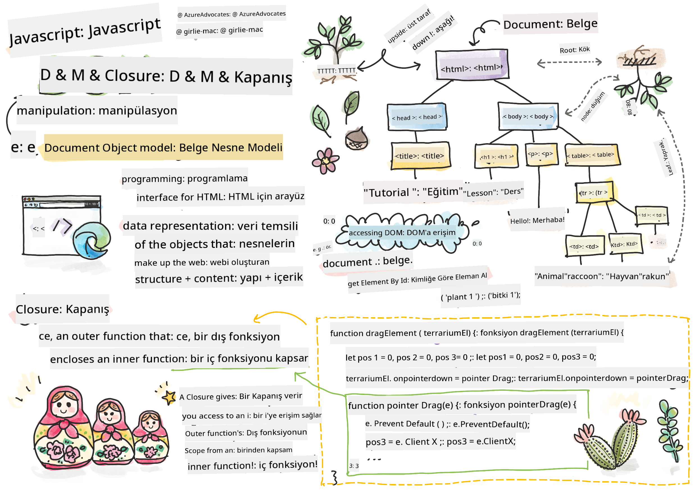

<!--
CO_OP_TRANSLATOR_METADATA:
{
  "original_hash": "61c14b27044861e5e69db35dd52c4403",
  "translation_date": "2025-08-29T00:28:59+00:00",
  "source_file": "3-terrarium/3-intro-to-DOM-and-closures/README.md",
  "language_code": "tr"
}
-->
# Teraryum Projesi Bölüm 3: DOM Manipülasyonu ve Closure


> Sketchnote: [Tomomi Imura](https://twitter.com/girlie_mac)

## Ders Öncesi Test

[Ders öncesi test](https://ff-quizzes.netlify.app/web/quiz/19)

### Giriş

DOM, yani "Document Object Model" manipülasyonu, web geliştirme için önemli bir unsurdur. [MDN](https://developer.mozilla.org/docs/Web/API/Document_Object_Model/Introduction)'ye göre, "Document Object Model (DOM), web üzerindeki bir belgenin yapısını ve içeriğini oluşturan nesnelerin veri temsili modelidir." DOM manipülasyonu ile ilgili zorluklar, genellikle JavaScript çerçevelerinin kullanılmasının nedenlerinden biri olmuştur. Ancak biz bu projede saf JavaScript ile çalışacağız!

Ayrıca, bu derste bir [JavaScript closure](https://developer.mozilla.org/docs/Web/JavaScript/Closures) fikrini tanıtacağız. Closure, bir fonksiyonun başka bir fonksiyon tarafından çevrelendiği ve iç fonksiyonun dış fonksiyonun kapsamına erişebildiği bir yapıdır.

> JavaScript closure'ları geniş ve karmaşık bir konudur. Bu ders, teraryum kodunda bir closure bulacağınız temel fikre odaklanır: bir iç fonksiyon ve bir dış fonksiyon, iç fonksiyonun dış fonksiyonun kapsamına erişmesine olanak tanıyacak şekilde yapılandırılmıştır. Bu konunun nasıl çalıştığı hakkında daha fazla bilgi için [detaylı dokümantasyonu](https://developer.mozilla.org/docs/Web/JavaScript/Closures) ziyaret edebilirsiniz.

DOM'u manipüle etmek için bir closure kullanacağız.

DOM'u, bir web sayfası belgesinin manipüle edilebileceği tüm yolları temsil eden bir ağaç olarak düşünebilirsiniz. Programcıların, tercih ettikleri programlama dilini kullanarak DOM'a erişip düzenleyebilmeleri, değiştirebilmeleri, yeniden düzenleyebilmeleri ve yönetebilmeleri için çeşitli API'ler (Uygulama Programlama Arayüzleri) yazılmıştır.


> DOM ve onu referans alan HTML işaretlemesinin bir temsili. Kaynak: [Olfa Nasraoui](https://www.researchgate.net/publication/221417012_Profile-Based_Focused_Crawler_for_Social_Media-Sharing_Websites)

Bu derste, teraryum projemizi tamamlayarak kullanıcıların sayfadaki bitkileri manipüle etmesine olanak tanıyan JavaScript'i oluşturacağız.

### Ön Koşul

Teraryumunuz için HTML ve CSS'in hazır olması gerekiyor. Bu dersin sonunda, bitkileri sürükleyerek teraryuma ekleyip çıkarabileceksiniz.

### Görev

Teraryum klasörünüzde `script.js` adında yeni bir dosya oluşturun. Bu dosyayı `<head>` bölümüne dahil edin:

```html
	<script src="./script.js" defer></script>
```

> Not: Bir harici JavaScript dosyasını HTML dosyasına dahil ederken `defer` kullanın, böylece JavaScript yalnızca HTML dosyası tamamen yüklendikten sonra çalışır. Alternatif olarak `async` özelliğini kullanabilirsiniz, bu da script'in HTML dosyası ayrıştırılırken çalışmasına olanak tanır. Ancak bizim durumumuzda, sürükleme script'inin çalıştırılmadan önce HTML öğelerinin tamamen hazır olması önemlidir.
---

## DOM Öğeleri

İlk olarak, DOM'da manipüle etmek istediğiniz öğelere referanslar oluşturmanız gerekiyor. Bizim durumumuzda, bunlar yan çubuklarda bekleyen 14 bitkidir.

### Görev

```html
dragElement(document.getElementById('plant1'));
dragElement(document.getElementById('plant2'));
dragElement(document.getElementById('plant3'));
dragElement(document.getElementById('plant4'));
dragElement(document.getElementById('plant5'));
dragElement(document.getElementById('plant6'));
dragElement(document.getElementById('plant7'));
dragElement(document.getElementById('plant8'));
dragElement(document.getElementById('plant9'));
dragElement(document.getElementById('plant10'));
dragElement(document.getElementById('plant11'));
dragElement(document.getElementById('plant12'));
dragElement(document.getElementById('plant13'));
dragElement(document.getElementById('plant14'));
```

Burada ne oluyor? Belgeyi referans alıyor ve DOM'un içinde belirli bir Id'ye sahip bir öğeyi buluyorsunuz. HTML dersinin ilk bölümünde her bitki görseline bireysel Id'ler verdiğinizi hatırlıyor musunuz (`id="plant1"`)? Şimdi bu çabayı kullanacaksınız. Her öğeyi tanımladıktan sonra, bu öğeyi birazdan oluşturacağınız `dragElement` adlı bir fonksiyona geçiriyorsunuz. Böylece HTML'deki öğe artık sürüklenebilir hale geliyor veya birazdan olacak.

✅ Neden öğelere Id ile referans veriyoruz? Neden CSS sınıfıyla değil? Bu sorunun cevabını CSS ile ilgili önceki derse bakarak bulabilirsiniz.

---

## Closure

Artık `dragElement` closure'ını oluşturabilirsiniz. Bu closure, bir veya daha fazla iç fonksiyonun dış fonksiyonun kapsamına erişmesi gerektiğinde kullanılır. İşte bir örnek:

```javascript
function displayCandy(){
	let candy = ['jellybeans'];
	function addCandy(candyType) {
		candy.push(candyType)
	}
	addCandy('gumdrops');
}
displayCandy();
console.log(candy)
```

Bu örnekte, `displayCandy` fonksiyonu, zaten fonksiyon içinde var olan bir diziye yeni bir şeker türü ekleyen bir fonksiyonu çevreler. Bu kodu çalıştırırsanız, `candy` dizisi tanımsız olur çünkü bu dizi closure'a özel bir yerel değişkendir.

✅ `candy` dizisini nasıl erişilebilir hale getirebilirsiniz? Diziyi closure'ın dışına taşıyarak deneyin. Bu şekilde, dizi global hale gelir ve closure'ın yerel kapsamıyla sınırlı kalmaz.

### Görev

`script.js` dosyasındaki öğe tanımlamalarının altına bir fonksiyon oluşturun:

```javascript
function dragElement(terrariumElement) {
	//set 4 positions for positioning on the screen
	let pos1 = 0,
		pos2 = 0,
		pos3 = 0,
		pos4 = 0;
	terrariumElement.onpointerdown = pointerDrag;
}
```

`dragElement`, `terrariumElement` nesnesini script'in üst kısmındaki tanımlamalardan alır. Ardından, fonksiyona geçirilen nesne için bazı yerel pozisyonları `0` olarak ayarlarsınız. Bunlar, closure içinde her öğe için sürükleme ve bırakma işlevselliği eklerken manipüle edilecek yerel değişkenlerdir. Teraryum, bu sürüklenen öğelerle doldurulacak, bu nedenle uygulamanın öğelerin yerleştirildiği yerleri takip etmesi gerekir.

Ayrıca, bu fonksiyona geçirilen `terrariumElement`, bir `pointerdown` olayı atanır. Bu olay, [web API'lerinin](https://developer.mozilla.org/docs/Web/API) DOM yönetimine yardımcı olmak için tasarlanmış bir parçasıdır. `onpointerdown`, bir düğmeye basıldığında veya bizim durumumuzda sürüklenebilir bir öğeye dokunulduğunda tetiklenir. Bu olay işleyici, birkaç istisna dışında hem [web hem de mobil tarayıcılarda](https://caniuse.com/?search=onpointerdown) çalışır.

✅ [Olay işleyici `onclick`](https://developer.mozilla.org/docs/Web/API/GlobalEventHandlers/onclick) çok daha fazla tarayıcı desteğine sahiptir; neden burada kullanılmıyor? Burada oluşturmak istediğiniz ekran etkileşiminin tam türünü düşünün.

---

## Pointerdrag Fonksiyonu

`terrariumElement` artık sürüklenmeye hazır; `onpointerdown` olayı tetiklendiğinde, `pointerDrag` fonksiyonu çağrılır. Bu satırın hemen altına bu fonksiyonu ekleyin: `terrariumElement.onpointerdown = pointerDrag;`:

### Görev 

```javascript
function pointerDrag(e) {
	e.preventDefault();
	console.log(e);
	pos3 = e.clientX;
	pos4 = e.clientY;
}
```

Birçok şey olur. İlk olarak, `e.preventDefault();` kullanarak pointerdown olayında normalde meydana gelen varsayılan olayları engellersiniz. Bu şekilde arayüzün davranışı üzerinde daha fazla kontrol sahibi olursunuz.

> Script dosyasını tamamen oluşturduktan sonra bu satıra geri dönün ve `e.preventDefault()` olmadan deneyin - ne olur?

İkinci olarak, `index.html` dosyasını bir tarayıcı penceresinde açın ve arayüzü inceleyin. Bir bitkiye tıkladığınızda, 'e' olayının nasıl yakalandığını görebilirsiniz. Olayı inceleyerek bir pointerdown olayında ne kadar bilgi toplandığını görebilirsiniz!

Son olarak, yerel değişkenler `pos3` ve `pos4` değerlerini `e.clientX` olarak ayarlayın. Bu değerler, bitkiye tıkladığınız veya dokunduğunuz anda bitkinin x ve y koordinatlarını yakalar. Bitkilerin tıklanıp sürüklenmesi sırasında ince ayar yapmak için koordinatlarını takip etmeniz gerekir.

✅ Bu uygulamanın neden bir büyük closure ile oluşturulduğu daha net hale geliyor mu? Eğer closure olmasaydı, 14 sürüklenebilir bitkinin kapsamını nasıl koruyabilirdiniz?

İlk fonksiyonu tamamlamak için `pos4 = e.clientY` satırının altına iki pointer olay manipülasyonu daha ekleyin:

```html
document.onpointermove = elementDrag;
document.onpointerup = stopElementDrag;
```
Burada, bitkinin pointer ile birlikte sürüklenmesini ve bitkiyi seçmeyi bıraktığınızda sürükleme hareketinin durmasını istiyorsunuz. `onpointermove` ve `onpointerup`, `onpointerdown` ile aynı API'nin parçalarıdır. Arayüz şu anda hata verebilir çünkü `elementDrag` ve `stopElementDrag` fonksiyonlarını henüz tanımlamadınız. Şimdi bu fonksiyonları oluşturun.

## ElementDrag ve StopElementDrag Fonksiyonları

Closure'ınızı tamamlamak için, bir bitkiyi sürüklediğinizde ve sürüklemeyi durdurduğunuzda ne olacağını yöneten iki iç fonksiyon ekleyeceksiniz. İstediğiniz davranış, herhangi bir bitkiyi istediğiniz zaman sürükleyebilmeniz ve ekranın herhangi bir yerine yerleştirebilmenizdir. Bu arayüz oldukça esnektir (örneğin bir bırakma alanı yoktur), böylece teraryumunuzu istediğiniz gibi tasarlayabilirsiniz.

### Görev

`pointerDrag` fonksiyonunun kapanış süslü parantezinden hemen sonra `elementDrag` fonksiyonunu ekleyin:

```javascript
function elementDrag(e) {
	pos1 = pos3 - e.clientX;
	pos2 = pos4 - e.clientY;
	pos3 = e.clientX;
	pos4 = e.clientY;
	console.log(pos1, pos2, pos3, pos4);
	terrariumElement.style.top = terrariumElement.offsetTop - pos2 + 'px';
	terrariumElement.style.left = terrariumElement.offsetLeft - pos1 + 'px';
}
```
Bu fonksiyonda, dış fonksiyonda yerel değişkenler olarak ayarladığınız pozisyonları 1-4 düzenliyorsunuz. Burada ne oluyor?

Sürükleme sırasında, `pos1` değerini `pos3` (daha önce `e.clientX` olarak ayarladığınız) eksi mevcut `e.clientX` değerine eşit yaparak yeniden atıyorsunuz. Benzer bir işlemi `pos2` için yapıyorsunuz. Ardından, `pos3` ve `pos4` değerlerini öğenin yeni X ve Y koordinatlarına yeniden ayarlıyorsunuz. Bu değişiklikleri sürükleme sırasında konsolda izleyebilirsiniz. Ardından, bitkinin css stilini manipüle ederek, öğenin üst ve sol X ve Y koordinatlarını bu yeni pozisyonlara göre ayarlıyorsunuz.

> `offsetTop` ve `offsetLeft`, bir öğenin konumunu, ebeveyninin konumuna göre ayarlayan CSS özellikleridir; ebeveyn öğesi `static` olarak konumlandırılmamış herhangi bir öğe olabilir.

Bu pozisyonların yeniden hesaplanması, teraryum ve bitkilerinin davranışını ince ayar yapmanıza olanak tanır.

### Görev 

Arayüzü tamamlamak için, `elementDrag` fonksiyonunun kapanış süslü parantezinden sonra `stopElementDrag` fonksiyonunu ekleyin:

```javascript
function stopElementDrag() {
	document.onpointerup = null;
	document.onpointermove = null;
}
```

Bu küçük fonksiyon, `onpointerup` ve `onpointermove` olaylarını sıfırlar, böylece bitkinin hareketini yeniden başlatabilir veya yeni bir bitkiyi sürüklemeye başlayabilirsiniz.

✅ Bu olayları null olarak ayarlamazsanız ne olur?

Artık projenizi tamamladınız!

🥇Tebrikler! Güzel teraryumunuzu tamamladınız. 

---

## 🚀Meydan Okuma

Closure'ınıza bitkilerle ilgili başka bir şey yapmak için yeni bir olay işleyici ekleyin; örneğin, bir bitkiye çift tıklayarak onu öne getirin. Yaratıcı olun!

## Ders Sonrası Test

[Ders sonrası test](https://ff-quizzes.netlify.app/web/quiz/20)

## İnceleme ve Kendi Kendine Çalışma

Ekranda öğeleri sürüklemek basit görünebilir, ancak bunu yapmanın birçok yolu ve istediğiniz etkiye bağlı olarak birçok tuzak vardır. Aslında, üzerinde çalışabileceğiniz bir [sürükle ve bırak API'si](https://developer.mozilla.org/docs/Web/API/HTML_Drag_and_Drop_API) vardır. Bu modülde bu API'yi kullanmadık çünkü istediğimiz etki biraz farklıydı, ancak kendi projenizde bu API'yi deneyin ve neler başarabileceğinizi görün.

Pointer olayları hakkında daha fazla bilgi için [W3C belgeleri](https://www.w3.org/TR/pointerevents1/) ve [MDN web belgeleri](https://developer.mozilla.org/docs/Web/API/Pointer_events)'ni inceleyin.

Tarayıcı yeteneklerini her zaman [CanIUse.com](https://caniuse.com/) ile kontrol edin.

## Ödev

[DOM ile biraz daha çalışın](assignment.md)

---

**Feragatname**:  
Bu belge, [Co-op Translator](https://github.com/Azure/co-op-translator) adlı yapay zeka çeviri hizmeti kullanılarak çevrilmiştir. Doğruluk için çaba göstersek de, otomatik çevirilerin hata veya yanlışlıklar içerebileceğini lütfen unutmayın. Belgenin orijinal dili, yetkili kaynak olarak kabul edilmelidir. Kritik bilgiler için profesyonel insan çevirisi önerilir. Bu çevirinin kullanımından kaynaklanan yanlış anlama veya yanlış yorumlamalardan sorumlu değiliz.