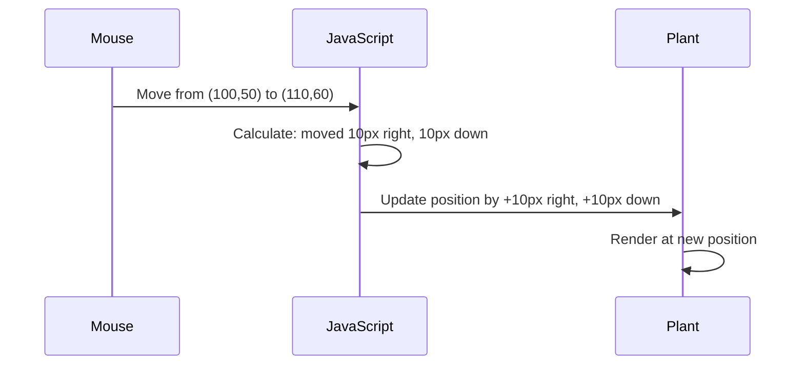

<!--
CO_OP_TRANSLATOR_METADATA:
{
  "original_hash": "bc93f6285423033ebf5b8abeb5282888",
  "translation_date": "2025-10-22T23:57:04+00:00",
  "source_file": "3-terrarium/3-intro-to-DOM-and-closures/README.md",
  "language_code": "tr"
}
-->
# Teraryum Projesi Bölüm 3: DOM Manipülasyonu ve JavaScript Kapanışları


> Sketchnote: [Tomomi Imura](https://twitter.com/girlie_mac)

Web geliştirme dünyasının en eğlenceli yönlerinden birine hoş geldiniz - şeyleri interaktif hale getirmek! Document Object Model (DOM), HTML ve JavaScript arasında bir köprü gibidir ve bugün teraryumunuzu hayata geçirmek için onu kullanacağız. Tim Berners-Lee ilk web tarayıcısını oluşturduğunda, belgelerin dinamik ve etkileşimli olabileceği bir web hayal etmişti - DOM bu vizyonu mümkün kılıyor.

Ayrıca JavaScript kapanışlarını keşfedeceğiz, ki bu başlangıçta biraz karmaşık gelebilir. Kapanışları, işlevlerinizin önemli bilgileri hatırlayabileceği "hafıza cepleri" oluşturmak gibi düşünebilirsiniz. Bu, teraryumunuzdaki her bitkinin kendi konumunu takip etmek için bir veri kaydına sahip olması gibidir. Bu dersin sonunda, ne kadar doğal ve kullanışlı olduklarını anlayacaksınız.

İşte yapacağımız şey: kullanıcıların bitkileri istedikleri yere sürükleyip bırakabileceği bir teraryum. Dosya yüklemelerinden interaktif oyunlara kadar her şeyi çalıştıran DOM manipülasyon tekniklerini öğreneceksiniz. Teraryumunuzu hayata geçirelim.

## Ders Öncesi Test

[Ders öncesi test](https://ff-quizzes.netlify.app/web/quiz/19)

## DOM'u Anlamak: Etkileşimli Web Sayfalarına Geçiş Kapınız

Document Object Model (DOM), JavaScript'in HTML öğelerinizle iletişim kurma şeklidir. Tarayıcınız bir HTML sayfasını yüklediğinde, bellekte o sayfanın yapılandırılmış bir temsilini oluşturur - işte bu DOM'dur. Her HTML öğesinin bir aile üyesi olduğu ve JavaScript'in erişebileceği, değiştirebileceği veya yeniden düzenleyebileceği bir aile ağacı gibi düşünün.

DOM manipülasyonu, statik sayfaları interaktif web sitelerine dönüştürür. Bir düğmenin üzerine geldiğinizde renginin değiştiğini, içeriğin sayfa yenilenmeden güncellendiğini veya sürükleyebileceğiniz öğeleri gördüğünüz her an, bu DOM manipülasyonunun iş başında olduğu anlamına gelir.


> DOM'un ve onu referans alan HTML işaretlemesinin bir temsili. Kaynak: [Olfa Nasraoui](https://www.researchgate.net/publication/221417012_Profile-Based_Focused_Crawler_for_Social_Media-Sharing_Websites)

**DOM'u güçlü kılan şeyler:**
- **Sağlar**: Sayfanızdaki herhangi bir öğeye erişmek için yapılandırılmış bir yol
- **Olanak tanır**: Sayfa yenilemeden dinamik içerik güncellemeleri
- **İzin verir**: Tıklamalar ve sürüklemeler gibi kullanıcı etkileşimlerine gerçek zamanlı yanıt
- **Oluşturur**: Modern interaktif web uygulamaları için temel

## JavaScript Kapanışları: Düzenli ve Güçlü Kodlar Oluşturmak

Bir [JavaScript kapanışı](https://developer.mozilla.org/docs/Web/JavaScript/Closures), bir işlevin kendi özel çalışma alanına sahip olması ve kalıcı bir hafıza ile donatılması gibidir. Darwin'in Galápagos Adaları'ndaki ispinozlarının, çevrelerine göre özel gagalar geliştirdiğini düşünün - kapanışlar benzer şekilde çalışır, belirli bir bağlamı "hatırlayan" özel işlevler oluşturur.

Teraryumumuzda, kapanışlar her bitkinin kendi konumunu bağımsız olarak hatırlamasına yardımcı olur. Bu desen, profesyonel JavaScript geliştirme sürecinde sıkça görülür ve anlaması değerli bir kavramdır.

> 💡 **Kapanışları Anlamak**: Kapanışlar JavaScript'te önemli bir konudur ve birçok geliştirici teorik yönlerini tam olarak anlamadan yıllarca kullanır. Bugün pratik uygulamaya odaklanıyoruz - interaktif özelliklerimizi oluştururken kapanışların doğal olarak ortaya çıktığını göreceksiniz. Anlama süreci, onların gerçek sorunları nasıl çözdüğünü gördükçe gelişecektir.


> DOM'un ve onu referans alan HTML işaretlemesinin bir temsili. Kaynak: [Olfa Nasraoui](https://www.researchgate.net/publication/221417012_Profile-Based_Focused_Crawler_for_Social_Media-Sharing_Websites)

Bu derste, kullanıcıların sayfadaki bitkileri manipüle etmesine olanak tanıyan JavaScript'i oluşturarak interaktif teraryum projemizi tamamlayacağız.

## Başlamadan Önce: Başarı İçin Hazırlık

Önceki teraryum derslerinden HTML ve CSS dosyalarınıza ihtiyacınız olacak - şimdi o statik tasarımı interaktif hale getireceğiz. İlk kez katılıyorsanız, önce bu dersleri tamamlamak önemli bir bağlam sağlayacaktır.

İşte yapacağımız şey:
- **Pürüzsüz sürükle ve bırak** tüm teraryum bitkileri için
- **Koordinat takibi** bitkilerin konumlarını hatırlaması için
- **Tam bir interaktif arayüz** vanilla JavaScript kullanarak
- **Temiz ve düzenli kod** kapanış desenleri kullanarak

## JavaScript Dosyanızı Ayarlama

Teraryumunuzu interaktif hale getirecek JavaScript dosyasını oluşturalım.

**Adım 1: Script dosyanızı oluşturun**

Teraryum klasörünüzde `script.js` adında yeni bir dosya oluşturun.

**Adım 2: JavaScript'i HTML'ye bağlayın**

`index.html` dosyanızın `<head>` bölümüne şu script etiketini ekleyin:

```html
<script src="./script.js" defer></script>
```

**`defer` özelliğinin neden önemli olduğu:**
- **Garantiler** JavaScript'in tüm HTML yüklendikten sonra çalışmasını
- **Önler** JavaScript'in henüz hazır olmayan öğeleri aramasından kaynaklanan hataları
- **Sağlar** tüm bitki öğelerinin etkileşim için hazır olmasını
- **Daha iyi performans sağlar** script'leri sayfanın altına yerleştirmekten daha iyi

> ⚠️ **Önemli Not**: `defer` özelliği yaygın zamanlama sorunlarını önler. Olmadan, JavaScript HTML öğelerine erişmeye çalışabilir ve bu öğeler henüz yüklenmemişse hatalara neden olabilir.

---

## JavaScript'i HTML Öğelerinize Bağlama

Öğeleri sürüklenebilir hale getirmeden önce, JavaScript'in onları DOM'da bulması gerekir. Bunu bir kütüphane kataloglama sistemi gibi düşünün - katalog numarasını aldığınızda, tam olarak ihtiyacınız olan kitabı bulabilir ve tüm içeriğine erişebilirsiniz.

Bu bağlantıları yapmak için `document.getElementById()` yöntemini kullanacağız. Bu, tam olarak ihtiyacınız olan öğeyi bulmak için bir dosyalama sistemi gibi - bir ID sağlıyorsunuz ve HTML'deki tam öğeyi buluyor.

### Tüm Bitkiler İçin Sürükleme İşlevini Etkinleştirme

`script.js` dosyanıza şu kodu ekleyin:

```javascript
// Enable drag functionality for all 14 plants
dragElement(document.getElementById('plant1'));
dragElement(document.getElementById('plant2'));
dragElement(document.getElementById('plant3'));
dragElement(document.getElementById('plant4'));
dragElement(document.getElementById('plant5'));
dragElement(document.getElementById('plant6'));
dragElement(document.getElementById('plant7'));
dragElement(document.getElementById('plant8'));
dragElement(document.getElementById('plant9'));
dragElement(document.getElementById('plant10'));
dragElement(document.getElementById('plant11'));
dragElement(document.getElementById('plant12'));
dragElement(document.getElementById('plant13'));
dragElement(document.getElementById('plant14'));
```

**Bu kodun başardığı şeyler:**
- **Bulur**: Her bitki öğesini benzersiz ID'siyle DOM'da
- **Alır**: Her HTML öğesine JavaScript referansı
- **Gönderir**: Her öğeyi `dragElement` işlevine (bir sonraki adımda oluşturacağız)
- **Hazırlar**: Her bitkiyi sürükle ve bırak etkileşimi için
- **Bağlar**: HTML yapınızı JavaScript işlevselliğine

> 🎯 **Neden ID'ler yerine Sınıflar Kullanılmıyor?** ID'ler belirli öğeler için benzersiz tanımlayıcılar sağlar, CSS sınıfları ise öğe gruplarını stilize etmek için tasarlanmıştır. JavaScript'in bireysel öğeleri manipüle etmesi gerektiğinde, ID'ler ihtiyacımız olan hassasiyet ve performansı sunar.

> 💡 **Profesyonel İpucu**: Her bitki için ayrı ayrı `dragElement()` çağırdığımıza dikkat edin. Bu yaklaşım, her bitkinin kendi bağımsız sürükleme davranışını almasını sağlar, bu da pürüzsüz kullanıcı etkileşimi için önemlidir.

---

## Sürükleme Öğesi Kapanışını Oluşturma

Şimdi her bitki için sürükleme davranışını yöneten bir kapanış oluşturacağız. Bu kapanış, fare hareketlerini izlemek ve öğe konumlarını güncellemek için birlikte çalışan birden fazla iç işlev içerecek.

Kapanışlar bu görev için mükemmeldir çünkü işlev çağrıları arasında kalıcı olan "özel" değişkenler oluşturmamıza olanak tanır ve her bitki için kendi bağımsız koordinat izleme sistemini sağlar.

### Basit Bir Örnekle Kapanışları Anlamak

Kapanış kavramını açıklayan basit bir örnekle başlayalım:

```javascript
function createCounter() {
    let count = 0; // This is like a private variable
    
    function increment() {
        count++; // The inner function remembers the outer variable
        return count;
    }
    
    return increment; // We're giving back the inner function
}

const myCounter = createCounter();
console.log(myCounter()); // 1
console.log(myCounter()); // 2
```

**Bu kapanış deseninde olanlar:**
- **Oluşturur**: Sadece bu kapanış içinde var olan özel bir `count` değişkeni
- **İç işlev**: Bu dış değişkene erişebilir ve onu değiştirebilir (kapanış mekanizması)
- **Döndüğümüzde**: İç işlev, bu özel veriyle bağlantısını korur
- **`createCounter()` tamamlandıktan sonra bile**: `count` değerini hatırlar

### Sürükleme İşlevselliği İçin Kapanışların Mükemmel Olması

Teraryumumuzda, her bitkinin mevcut konum koordinatlarını hatırlaması gerekir. Kapanışlar mükemmel bir çözüm sunar:

**Projemiz için temel faydalar:**
- **Korur**: Her bitki için bağımsız özel konum değişkenlerini
- **Sürdürür**: Sürükleme olayları arasında koordinat verilerini
- **Önler**: Farklı sürüklenebilir öğeler arasında değişken çatışmalarını
- **Oluşturur**: Temiz ve düzenli bir kod yapısı

> 🎯 **Öğrenme Hedefi**: Kapanışların her yönünü şu anda tamamen anlamanıza gerek yok. Kodumuzu nasıl düzenlememize ve sürükleme işlevselliği için durumu nasıl koruduğumuza odaklanın.

### dragElement İşlevini Oluşturma

Şimdi tüm sürükleme mantığını yönetecek ana işlevi oluşturacağız. Bu işlevi bitki öğesi tanımlarınızın altına ekleyin:

```javascript
function dragElement(terrariumElement) {
    // Initialize position tracking variables
    let pos1 = 0,  // Previous mouse X position
        pos2 = 0,  // Previous mouse Y position  
        pos3 = 0,  // Current mouse X position
        pos4 = 0;  // Current mouse Y position
    
    // Set up the initial drag event listener
    terrariumElement.onpointerdown = pointerDrag;
}
```

**Pozisyon izleme sistemini anlama:**
- **`pos1` ve `pos2`**: Eski ve yeni fare pozisyonları arasındaki farkı saklar
- **`pos3` ve `pos4`**: Mevcut fare koordinatlarını izler
- **`terrariumElement`**: Sürüklenebilir hale getirdiğimiz belirli bitki öğesi
- **`onpointerdown`**: Kullanıcı sürüklemeye başladığında tetiklenen olay

**Kapanış deseninin çalışma şekli:**
- **Oluşturur**: Her bitki öğesi için özel pozisyon değişkenleri
- **Sürdürür**: Bu değişkenleri sürükleme yaşam döngüsü boyunca
- **Garantiler**: Her bitki kendi koordinatlarını bağımsız olarak izler
- **Sağlar**: `dragElement` işlevi aracılığıyla temiz bir arayüz

### Neden Pointer Olayları Kullanıyoruz?

`onclick` yerine neden `onpointerdown` kullandığımızı merak edebilirsiniz. İşte sebebi:

| Olay Türü | En İyi Kullanım Alanı | Dezavantajı |
|-----------|------------------------|-------------|
| `onclick` | Basit düğme tıklamaları | Sürüklemeyi yönetemez (sadece tıklama ve bırakma) |
| `onpointerdown` | Hem fare hem dokunma | Daha yeni, ancak günümüzde iyi destekleniyor |
| `onmousedown` | Sadece masaüstü fare | Mobil kullanıcıları dışarıda bırakır |

**Pointer olaylarının inşa ettiğimiz şey için mükemmel olmasının nedenleri:**
- **Harika çalışır**: Birisi fare, parmak veya hatta kalem kullanıyor olsun
- **Aynı hissi verir**: Dizüstü bilgisayar, tablet veya telefonda
- **Yönetir**: Gerçek sürükleme hareketini (sadece tıklama ve bırakma değil)
- **Yaratır**: Modern web uygulamalarından beklenen pürüzsüz bir deneyim

> 💡 **Geleceğe Hazırlık**: Pointer olayları kullanıcı etkileşimlerini yönetmenin modern yoludur. Fare ve dokunma için ayrı kod yazmak yerine, ikisini birden ücretsiz olarak alırsınız. Oldukça güzel, değil mi?

---

## pointerDrag İşlevi: Sürüklemenin Başlangıcını Yakalamak

Bir kullanıcı bir bitkiye bastığında (fare tıklaması veya parmak dokunuşuyla), `pointerDrag` işlevi devreye girer. Bu işlev başlangıç koordinatlarını yakalar ve sürükleme sistemini kurar.

Bu işlevi `dragElement` kapanışınızın içine, `terrariumElement.onpointerdown = pointerDrag;` satırının hemen ardından ekleyin:

```javascript
function pointerDrag(e) {
    // Prevent default browser behavior (like text selection)
    e.preventDefault();
    
    // Capture the initial mouse/touch position
    pos3 = e.clientX;  // X coordinate where drag started
    pos4 = e.clientY;  // Y coordinate where drag started
    
    // Set up event listeners for the dragging process
    document.onpointermove = elementDrag;
    document.onpointerup = stopElementDrag;
}
```

**Adım adım, burada olanlar:**
- **Önler**: Sürüklemeyi engelleyebilecek varsayılan tarayıcı davranışlarını
- **Kaydeder**: Kullanıcının sürükleme hareketine başladığı tam koordinatları
- **Kurur**: Sürekli sürükleme hareketi için olay dinleyicileri
- **Hazırlar**: Fare/parmak hareketini tüm belge boyunca izlemek için sistemi

### Olay Önleme Mekanizmasını Anlama

`e.preventDefault()` satırı, pürüzsüz bir sürükleme için çok önemlidir:

**Önleme olmadan, tarayıcılar şunları yapabilir:**
- **Seçebilir**: Sayfa boyunca sürüklerken metni
- **Tetikleyebilir**: Sağ tıklama sürüklemede bağlam menüleri
- **Müdahale edebilir**: Özel sürükleme davranışımıza
- **Görsel artefaktlar oluşturabilir**: Sürükleme işlemi sırasında

> 🔍 **Deneyin**: Bu dersi tamamladıktan sonra `e.preventDefault()` satırını kaldırmayı deneyin ve sürükleme deneyimini nasıl etkilediğini görün. Bu satırın neden gerekli olduğunu hızla anlayacaksınız!

### Koordinat Takip Sistemi

`e.clientX` ve `e.clientY` özellikleri bize kesin fare/dokunma koordinatlarını verir:

| Özellik | Ölçtüğü Şey | Kullanım Alanı |
|---------|-------------|----------------|
| `clientX` | Görüntüleme alanına göre yatay pozisyon | Sol-sağ hareketi izleme |
| `clientY` | Görüntüleme alanına göre dikey pozisyon | Yukarı-aşağı hareketi izleme |

**Bu koordinatları anlamak:**
- **Sağlar**: Piksel hassasiyetinde konum bilgisi
- **Günceller**: Kullanıcı işaretçisini hareket ettirdikçe gerçek zamanlı olarak
- **Tutarlı kalır**: Farklı ekran boyutları ve yakınlaştırma seviyelerinde
- **Olanak tanır**: Pürüzsüz, duyarlı sürükleme etkileşimleri

### Belge Düzeyinde Olay Dinleyicileri Ayarlama

Hareket ve durdurma olaylarını yalnızca bitki öğesine değil, tüm `document`e eklediğimize dikkat edin:

```javascript
document.onpointermove = elementDrag;
document.onpointerup = stopElementDrag;
```

**Neden belgeye ekleniyor:**
- **İzlemeye devam eder**: Fare bitki öğesinden çıktığında bile
- **Önler**: Kullanıcı hızlı hareket ederse sürüklemenin kesilmesini
- **Sağlar**: Tüm ekran boyunca pürüzsüz sürükleme
- **Yönetir**: İşaretçi tarayıcı penceresinin dışına çıktığında oluşabilecek durumları

> ⚡ **Performans Notu**: Sürükleme durduğunda bu belge düzeyindeki dinleyicileri temizleyeceğiz, böylece bellek sızıntıları ve performans sorunları önlenir.

## Sürükleme Sistemini Tamamlama: Hareket ve Temizlik

Şimdi, bitki hareketini ve sürükleme durduğunda temizliği yöneten iki işlevi ekleyeceğiz. Bu işlevler, teraryumunuzdaki bitkilerin pürüzsüz ve duyarlı bir şekilde hareket etmesini sağlar.

### elementDrag İşlevi: Hareketi İzleme

`elementDrag` işlevini `pointerDrag` işlevinin kapanışındaki kapanışın hemen altına ekleyin:

```javascript
function elementDrag(e) {
    // Calculate the distance moved since the last event
    pos1 = pos3 - e.clientX;  // Horizontal distance moved
    pos2 = pos4 - e.clientY;  // Vertical distance moved
    
    // Update the current position tracking
    pos3 = e.clientX;  // New current X position
    pos4 = e.clientY;  // New current Y position
    
    // Apply the movement to the element's position
    terrariumElement.style.top = (terrariumElement.offsetTop - pos2) + 'px';
    terrariumElement.style.left = (terrariumElement.offsetLeft - pos1) + 'px';
}
```

**Koordinat matematiğini anlama:**
- **`pos1` ve `pos2`**: Fare son güncellemeden bu yana ne kadar hareket ettiğini hesaplar
- **`pos3` ve `pos4`**: Bir sonraki hesaplama için mevcut fare pozisyonunu saklar
- **`offsetTop` ve `offsetLeft`**: Elemanın sayfadaki mevcut pozisyonunu alır
- **Çıkarma mantığı**: Elemanı, farenin hareket ettiği miktar kadar hareket ettirir

**İşte hareket hesaplamasının ayrıntıları:**
1. Eski ve yeni fare pozisyonları arasındaki farkı **ölçer**
2. Farenin hareketine göre elemanın ne kadar hareket edeceğini **hesaplar**
3. Elemanın CSS pozisyon özelliklerini gerçek zamanlı olarak **günceller**
4. Bir sonraki hareket hesaplaması için yeni pozisyonu **saklar**

### Matematiğin Görsel Temsili



### stopElementDrag Fonksiyonu: Temizlik

`elementDrag` fonksiyonunun kapanış süslü parantezinden sonra temizlik fonksiyonunu ekleyin:

```javascript
function stopElementDrag() {
    // Remove the document-level event listeners
    document.onpointerup = null;
    document.onpointermove = null;
}
```

**Temizliğin neden önemli olduğu:**
- **Bellek sızıntılarını önler**: Kalan olay dinleyicilerinden kaynaklanan
- **Sürükleme davranışını durdurur**: Kullanıcı bitkiyi bıraktığında
- **Diğer öğelerin bağımsız olarak sürüklenmesine izin verir**
- **Bir sonraki sürükleme işlemi için sistemi sıfırlar**

**Temizlik yapılmazsa ne olur:**
- Olay dinleyiciler, sürükleme durduktan sonra bile çalışmaya devam eder
- Kullanılmayan dinleyiciler biriktikçe performans düşer
- Diğer öğelerle etkileşimde beklenmedik davranışlar oluşur
- Tarayıcı kaynakları gereksiz olay işleme nedeniyle boşa harcanır

### CSS Pozisyon Özelliklerini Anlama

Sürükleme sistemimiz iki temel CSS özelliğini manipüle eder:

| Özellik | Kontrol Ettiği Şey | Nasıl Kullanıyoruz |
|---------|--------------------|--------------------|
| `top` | Üst kenardan mesafe | Sürükleme sırasında dikey konumlandırma |
| `left` | Sol kenardan mesafe | Sürükleme sırasında yatay konumlandırma |

**Offset özellikleri hakkında önemli bilgiler:**
- **`offsetTop`**: Konumlandırılmış üst öğeden mevcut mesafe
- **`offsetLeft`**: Konumlandırılmış üst öğeden mevcut mesafe
- **Konumlandırma bağlamı**: Bu değerler en yakın konumlandırılmış üst öğeye göre hesaplanır
- **Gerçek zamanlı güncellemeler**: CSS özelliklerini değiştirdiğimizde hemen güncellenir

> 🎯 **Tasarım Felsefesi**: Bu sürükleme sistemi kasıtlı olarak esnektir – "bırakma bölgeleri" veya kısıtlamalar yoktur. Kullanıcılar bitkileri istedikleri yere yerleştirerek teraryum tasarımlarında tam yaratıcı kontrol elde ederler.

## Hepsini Bir Araya Getirmek: Tam Sürükleme Sistemi

Tebrikler! Vanilla JavaScript kullanarak sofistike bir sürükle ve bırak sistemi oluşturdunuz. Tam `dragElement` fonksiyonunuz artık güçlü bir closure içeriyor ve şunları yönetiyor:

**Closure'ın başardıkları:**
- **Her bitki için** bağımsız özel pozisyon değişkenlerini korur
- **Tam sürükleme yaşam döngüsünü** baştan sona ele alır
- **Ekranın tamamında** pürüzsüz, duyarlı hareket sağlar
- **Kaynakları düzgün bir şekilde temizler** ve bellek sızıntılarını önler
- **Teraryum tasarımı için sezgisel, yaratıcı bir arayüz oluşturur**

### Etkileşimli Teraryumunuzu Test Etme

Şimdi etkileşimli teraryumunuzu test edin! `index.html` dosyanızı bir web tarayıcısında açın ve işlevselliği deneyin:

1. **Herhangi bir bitkiye tıklayın ve basılı tutun**: Sürüklemeyi başlatmak için
2. **Farenizi veya parmağınızı hareket ettirin**: Bitkinin pürüzsüz bir şekilde takip ettiğini izleyin
3. **Bırakın**: Bitkiyi yeni pozisyonuna bırakmak için
4. **Farklı düzenlemelerle deney yapın**: Arayüzü keşfetmek için

🥇 **Başarı**: Çekirdek konseptleri kullanarak profesyonel geliştiricilerin günlük olarak kullandığı bir tam etkileşimli web uygulaması oluşturdunuz. Bu sürükle ve bırak işlevi, dosya yüklemeleri, kanban panoları ve diğer birçok etkileşimli arayüzün arkasındaki aynı prensipleri kullanır.


---

## GitHub Copilot Agent Challenge 🚀

Agent modunu kullanarak aşağıdaki meydan okumayı tamamlayın:

**Açıklama:** Teraryum projesine, tüm bitkileri orijinal pozisyonlarına pürüzsüz animasyonlarla döndüren bir sıfırlama işlevi ekleyin.

**Talimat:** Sayfa yüklendiğinde orijinal pozisyonları saklayan ve sıfırlama düğmesine basıldığında bitkileri 1 saniye boyunca pürüzsüz geçişlerle orijinal yan çubuk pozisyonlarına döndüren bir sıfırlama düğmesi oluşturun.

Daha fazla bilgi için [agent mode](https://code.visualstudio.com/blogs/2025/02/24/introducing-copilot-agent-mode) bağlantısını ziyaret edin.

## 🚀 Ek Meydan Okuma: Becerilerinizi Geliştirin

Teraryumunuzu bir üst seviyeye taşımaya hazır mısınız? Bu geliştirmeleri uygulamayı deneyin:

**Yaratıcı Genişletmeler:**
- Bir bitkiye **çift tıklayın**: Öne getirmek için (z-index manipülasyonu)
- **Görsel geri bildirim ekleyin**: Bitkilerin üzerine gelindiğinde hafif bir parlama gibi
- **Sınırlar uygulayın**: Bitkilerin teraryumun dışına sürüklenmesini önlemek için
- **Kaydetme işlevi oluşturun**: Bitki pozisyonlarını localStorage ile hatırlamak için
- **Ses efektleri ekleyin**: Bitkileri alıp bırakırken

> 💡 **Öğrenme Fırsatı**: Bu meydan okumaların her biri, DOM manipülasyonu, olay işleme ve kullanıcı deneyimi tasarımı hakkında yeni şeyler öğrenmenizi sağlayacaktır.

## Ders Sonrası Test

[Ders sonrası test](https://ff-quizzes.netlify.app/web/quiz/20)

## Gözden Geçirme ve Kendi Kendine Çalışma: Bilginizi Derinleştirin

DOM manipülasyonu ve closure'ların temellerini öğrendiniz, ancak her zaman daha fazla keşfedilecek şeyler vardır! İşte bilginizi ve becerilerinizi genişletmek için bazı yollar.

### Alternatif Sürükle ve Bırak Yaklaşımları

Maksimum esneklik için işaretçi olaylarını kullandık, ancak web geliştirme birden fazla yaklaşım sunar:

| Yaklaşım | En İyi Kullanım Alanı | Öğrenme Değeri |
|----------|-----------------------|----------------|
| [HTML Drag and Drop API](https://developer.mozilla.org/docs/Web/API/HTML_Drag_and_Drop_API) | Dosya yüklemeleri, resmi sürükleme alanları | Yerel tarayıcı yeteneklerini anlama |
| [Touch Events](https://developer.mozilla.org/docs/Web/API/Touch_events) | Mobil odaklı etkileşimler | Mobil öncelikli geliştirme desenleri |
| CSS `transform` özellikleri | Pürüzsüz animasyonlar | Performans optimizasyon teknikleri |

### İleri Düzey DOM Manipülasyonu Konuları

**Öğrenme yolculuğunuzdaki sonraki adımlar:**
- **Olay delegasyonu**: Birden fazla öğe için olayları verimli bir şekilde yönetme
- **Intersection Observer**: Öğelerin görünüm alanına girip çıkmasını algılama
- **Mutation Observer**: DOM yapısındaki değişiklikleri izleme
- **Web Bileşenleri**: Yeniden kullanılabilir, kapsüllenmiş UI öğeleri oluşturma
- **Sanal DOM kavramları**: Çerçevelerin DOM güncellemelerini nasıl optimize ettiğini anlama

### Sürekli Öğrenme için Temel Kaynaklar

**Teknik Dokümantasyon:**
- [MDN Pointer Events Guide](https://developer.mozilla.org/docs/Web/API/Pointer_events) - Kapsamlı işaretçi olayları referansı
- [W3C Pointer Events Specification](https://www.w3.org/TR/pointerevents1/) - Resmi standartlar dokümantasyonu
- [JavaScript Closures Deep Dive](https://developer.mozilla.org/docs/Web/JavaScript/Closures) - İleri düzey closure desenleri

**Tarayıcı Uyumluluğu:**
- [CanIUse.com](https://caniuse.com/) - Özellik desteğini tarayıcılar arasında kontrol edin
- [MDN Browser Compatibility Data](https://github.com/mdn/browser-compat-data) - Detaylı uyumluluk bilgisi

**Pratik Fırsatlar:**
- **Bir bulmaca oyunu oluşturun**: Benzer sürükleme mekaniklerini kullanarak
- **Bir kanban panosu oluşturun**: Sürükle ve bırak görev yönetimi ile
- **Bir resim galerisi tasarlayın**: Sürüklenebilir fotoğraf düzenlemeleri ile
- **Mobil arayüzler için dokunmatik hareketlerle deney yapın**

> 🎯 **Öğrenme Stratejisi**: Bu konseptleri pekiştirmenin en iyi yolu pratik yapmaktır. Sürüklenebilir arayüzlerin farklı varyasyonlarını oluşturmaya çalışın – her proje size kullanıcı etkileşimi ve DOM manipülasyonu hakkında yeni bir şey öğretecektir.

## Ödev

[DOM ile biraz daha çalışın](assignment.md)

---

**Feragatname**:  
Bu belge, AI çeviri hizmeti [Co-op Translator](https://github.com/Azure/co-op-translator) kullanılarak çevrilmiştir. Doğruluk için çaba göstersek de, otomatik çevirilerin hata veya yanlışlıklar içerebileceğini lütfen unutmayın. Belgenin orijinal dili, yetkili kaynak olarak kabul edilmelidir. Kritik bilgiler için profesyonel insan çevirisi önerilir. Bu çevirinin kullanımından kaynaklanan yanlış anlamalar veya yanlış yorumlamalar için sorumluluk kabul etmiyoruz.