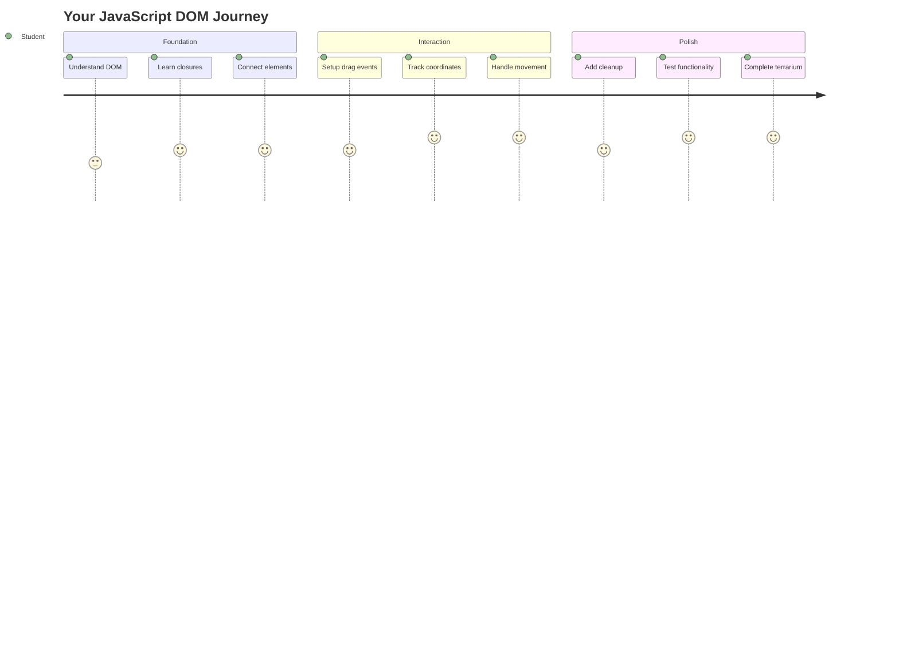
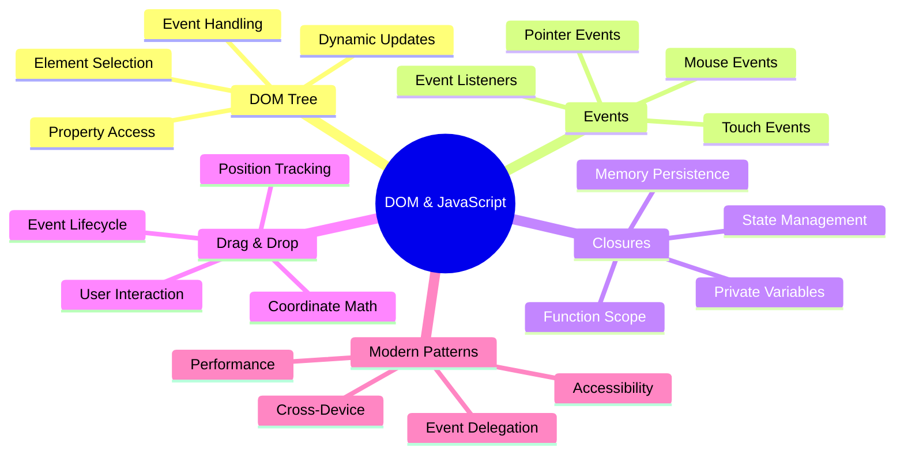
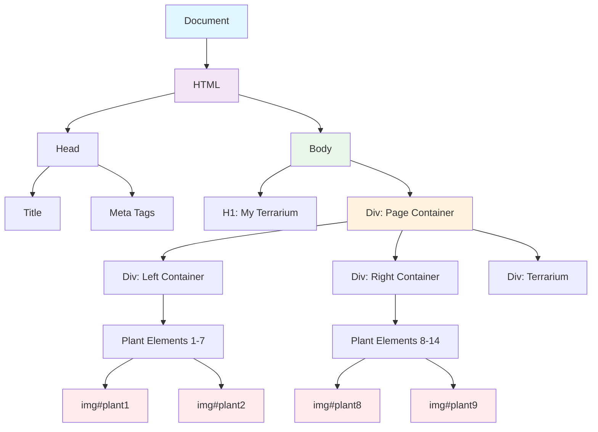
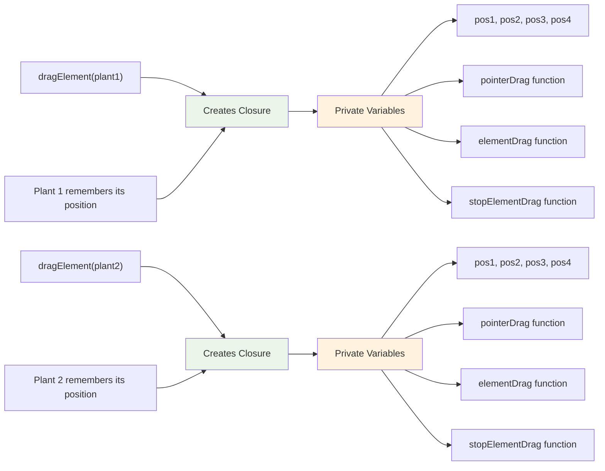
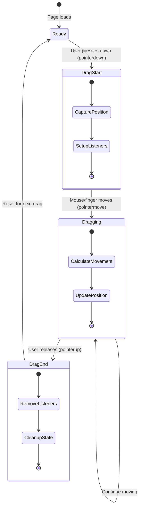
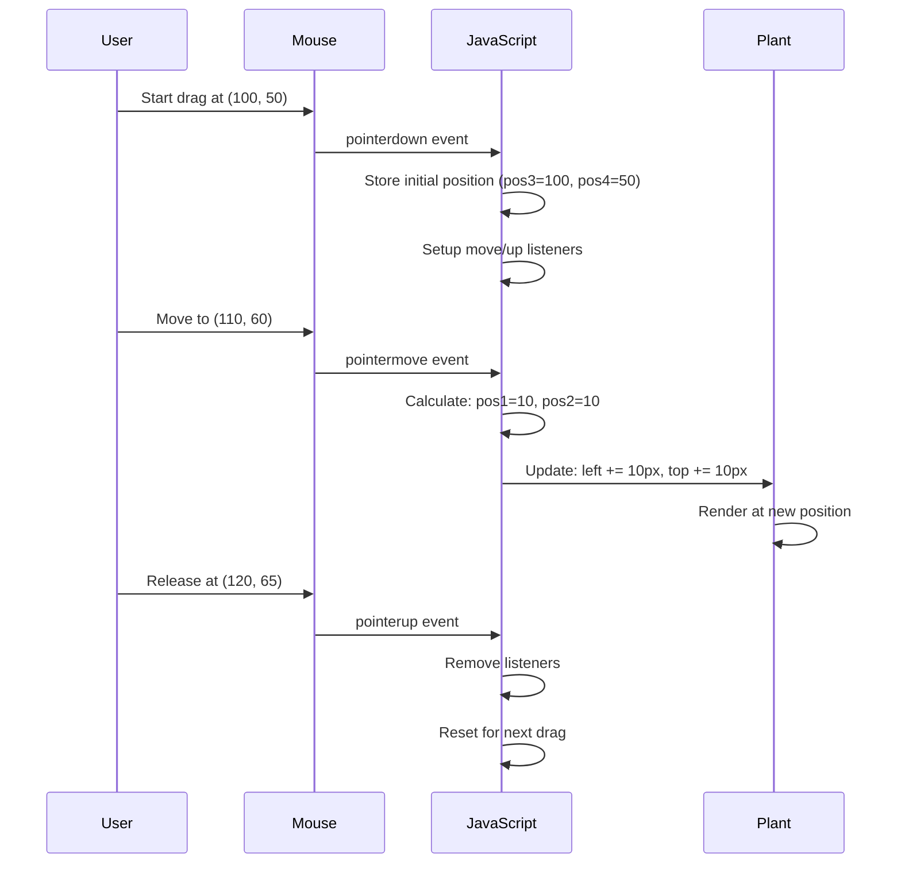
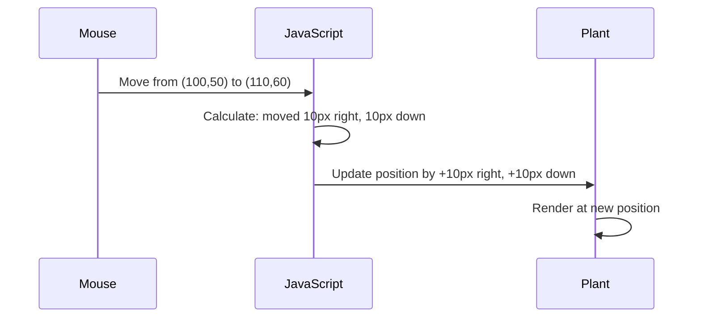
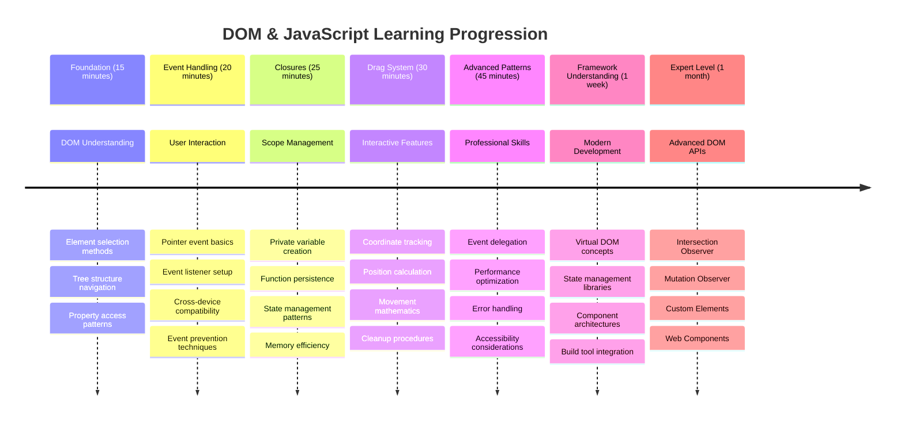

<!--
CO_OP_TRANSLATOR_METADATA:
{
  "original_hash": "973e48ad87d67bf5bb819746c9f8e302",
  "translation_date": "2025-11-04T00:54:10+00:00",
  "source_file": "3-terrarium/3-intro-to-DOM-and-closures/README.md",
  "language_code": "tr"
}
-->
# Teraryum Projesi Bölüm 3: DOM Manipülasyonu ve JavaScript Kapanışları




> Sketchnote: [Tomomi Imura](https://twitter.com/girlie_mac)

Web geliştirme dünyasının en eğlenceli yönlerinden birine hoş geldiniz - şeyleri interaktif hale getirmek! Belge Nesne Modeli (DOM), HTML ve JavaScript arasında bir köprü gibidir ve bugün teraryumunuzu hayata geçirmek için onu kullanacağız. Tim Berners-Lee ilk web tarayıcısını oluşturduğunda, belgelerin dinamik ve etkileşimli olabileceği bir web hayal etmişti - DOM bu vizyonu mümkün kılıyor.

Ayrıca başlangıçta biraz karmaşık gelebilecek JavaScript kapanışlarını da keşfedeceğiz. Kapanışları, fonksiyonlarınızın önemli bilgileri hatırlayabileceği "hafıza cepleri" oluşturmak gibi düşünebilirsiniz. Bu, teraryumunuzdaki her bitkinin kendi konumunu takip etmek için bir veri kaydına sahip olması gibidir. Bu dersin sonunda, kapanışların ne kadar doğal ve kullanışlı olduğunu anlayacaksınız.

İşte yapacağımız şey: kullanıcıların bitkileri istedikleri yere sürükleyip bırakabilecekleri bir teraryum. Dosya yüklemelerinden interaktif oyunlara kadar her şeyi çalıştıran DOM manipülasyon tekniklerini öğreneceksiniz. Teraryumunuzu hayata geçirelim.



## Ders Öncesi Test

[Ders öncesi test](https://ff-quizzes.netlify.app/web/quiz/19)

## DOM'u Anlamak: Etkileşimli Web Sayfalarına Açılan Kapı

Belge Nesne Modeli (DOM), JavaScript'in HTML öğelerinizle iletişim kurma şeklidir. Tarayıcınız bir HTML sayfasını yüklediğinde, bellekte o sayfanın yapılandırılmış bir temsilini oluşturur - işte bu DOM'dur. Bunu, her HTML öğesinin JavaScript'in erişebileceği, değiştirebileceği veya yeniden düzenleyebileceği bir aile üyesi olduğu bir aile ağacı gibi düşünün.

DOM manipülasyonu, statik sayfaları interaktif web sitelerine dönüştürür. Bir düğmenin üzerine geldiğinizde renginin değiştiğini, içeriğin sayfa yenilenmeden güncellendiğini veya sürükleyebileceğiniz öğeleri gördüğünüzde, işte bu DOM manipülasyonunun iş başında olduğu anlamına gelir.




> DOM'un ve onu referans alan HTML işaretlemesinin bir temsili. Kaynak: [Olfa Nasraoui](https://www.researchgate.net/publication/221417012_Profile-Based_Focused_Crawler_for_Social_Media-Sharing_Websites)

**DOM'u güçlü kılan şeyler:**
- **Sayfanızdaki** herhangi bir öğeye erişmek için yapılandırılmış bir yol sağlar
- **Dinamik içerik güncellemelerine** sayfa yenileme olmadan olanak tanır
- **Kullanıcı etkileşimlerine** gerçek zamanlı yanıt verir, örneğin tıklamalar ve sürüklemeler
- **Modern interaktif web uygulamaları** için temel oluşturur

## JavaScript Kapanışları: Düzenli ve Güçlü Kodlar Oluşturmak

Bir [JavaScript kapanışı](https://developer.mozilla.org/docs/Web/JavaScript/Closures), bir fonksiyona kendi özel çalışma alanını ve kalıcı hafızasını vermek gibidir. Darwin'in Galápagos Adaları'ndaki ispinozlarının, belirli çevrelerine göre özelleşmiş gagalar geliştirdiğini düşünün - kapanışlar benzer şekilde çalışır, belirli bağlamlarını "hatırlayan" özel fonksiyonlar oluşturur.

Teraryumumuzda, kapanışlar her bitkinin kendi konumunu bağımsız olarak hatırlamasına yardımcı olur. Bu desen, profesyonel JavaScript geliştirme sürecinde sıkça karşımıza çıkar ve anlaması değerli bir kavramdır.



> 💡 **Kapanışları Anlamak**: Kapanışlar JavaScript'te önemli bir konudur ve birçok geliştirici yıllarca teorik yönlerini tam olarak kavramadan kullanır. Bugün pratik uygulamaya odaklanıyoruz - interaktif özelliklerimizi oluştururken kapanışların doğal olarak nasıl ortaya çıktığını göreceksiniz. Anlayışınız, onların gerçek sorunları nasıl çözdüğünü gördükçe gelişecektir.


> DOM'un ve onu referans alan HTML işaretlemesinin bir temsili. Kaynak: [Olfa Nasraoui](https://www.researchgate.net/publication/221417012_Profile-Based_Focused_Crawler_for_Social_Media-Sharing_Websites)

Bu derste, kullanıcıların sayfadaki bitkileri manipüle etmesine olanak tanıyan JavaScript'i oluşturarak interaktif teraryum projemizi tamamlayacağız.

## Başlamadan Önce: Başarı İçin Hazırlık

Önceki teraryum derslerinden HTML ve CSS dosyalarınıza ihtiyacınız olacak - şimdi o statik tasarımı interaktif hale getireceğiz. İlk kez katılıyorsanız, önce bu dersleri tamamlamak önemli bir bağlam sağlayacaktır.

İşte yapacağımız şey:
- **Tüm teraryum bitkileri için sorunsuz sürükle-bırak**
- **Koordinat takibi**, böylece bitkiler konumlarını hatırlar
- **Vanilla JavaScript kullanarak eksiksiz bir interaktif arayüz**
- **Kapanış desenlerini kullanarak temiz ve düzenli kod**

## JavaScript Dosyanızı Ayarlama

Teraryumunuzu interaktif hale getirecek JavaScript dosyasını oluşturalım.

**Adım 1: Script dosyanızı oluşturun**

Teraryum klasörünüzde `script.js` adlı yeni bir dosya oluşturun.

**Adım 2: JavaScript'i HTML'ye bağlayın**

`index.html` dosyanızın `<head>` bölümüne şu script etiketini ekleyin:

```html
<script src="./script.js" defer></script>
```

**Neden `defer` özelliği önemlidir:**
- **JavaScript'in** tüm HTML yüklendikten sonra beklemesini sağlar
- **JavaScript'in**, henüz hazır olmayan öğeleri aramasını engeller
- **Tüm bitki öğelerinizin** etkileşim için hazır olmasını garanti eder
- **Performansı artırır**, script'leri sayfanın altına yerleştirmekten daha iyi

> ⚠️ **Önemli Not**: `defer` özelliği yaygın zamanlama sorunlarını önler. Olmadan, JavaScript HTML öğelerine erişmeye çalışabilir ve bu da hatalara neden olabilir.

---

## JavaScript'i HTML Öğelerinize Bağlama

Öğeleri sürüklenebilir hale getirmeden önce, JavaScript'in onları DOM'da bulması gerekir. Bunu bir kütüphane kataloglama sistemi gibi düşünün - bir katalog numarası aldığınızda, tam olarak ihtiyacınız olan kitabı bulabilir ve tüm içeriğine erişebilirsiniz.

Bu bağlantıları yapmak için `document.getElementById()` yöntemini kullanacağız. Bu, tam olarak ihtiyacınız olan HTML öğesini bulmanızı sağlayan hassas bir dosyalama sistemi gibidir.

### Tüm Bitkiler İçin Sürükleme İşlevselliğini Etkinleştirme

Bu kodu `script.js` dosyanıza ekleyin:

```javascript
// Enable drag functionality for all 14 plants
dragElement(document.getElementById('plant1'));
dragElement(document.getElementById('plant2'));
dragElement(document.getElementById('plant3'));
dragElement(document.getElementById('plant4'));
dragElement(document.getElementById('plant5'));
dragElement(document.getElementById('plant6'));
dragElement(document.getElementById('plant7'));
dragElement(document.getElementById('plant8'));
dragElement(document.getElementById('plant9'));
dragElement(document.getElementById('plant10'));
dragElement(document.getElementById('plant11'));
dragElement(document.getElementById('plant12'));
dragElement(document.getElementById('plant13'));
dragElement(document.getElementById('plant14'));
```

**Bu kodun başardığı şeyler:**
- **Her bir bitki öğesini** benzersiz ID'siyle DOM'da bulur
- **Her HTML öğesi için** bir JavaScript referansı alır
- **Her öğeyi** bir `dragElement` fonksiyonuna (bir sonraki adımda oluşturacağız) geçirir
- **Her bitkiyi** sürükle-bırak etkileşimi için hazırlar
- **HTML yapınızı** JavaScript işlevselliğine bağlar

> 🎯 **Neden ID'ler Sınıflar Yerine Kullanılır?** ID'ler belirli öğeler için benzersiz tanımlayıcılar sağlar, CSS sınıfları ise öğe gruplarını stilize etmek için tasarlanmıştır. JavaScript'in bireysel öğeleri manipüle etmesi gerektiğinde, ID'ler ihtiyacımız olan hassasiyet ve performansı sunar.

> 💡 **İpucu**: Her bitki için ayrı ayrı `dragElement()` çağırdığımıza dikkat edin. Bu yaklaşım, her bitkinin kendi bağımsız sürükleme davranışını almasını sağlar, bu da sorunsuz kullanıcı etkileşimi için gereklidir.

### 🔄 **Pedagojik Kontrol**
**DOM Bağlantısı Anlayışı**: Sürükleme işlevselliğine geçmeden önce şunları doğrulayın:
- ✅ `document.getElementById()`'in HTML öğelerini nasıl bulduğunu açıklayabiliyor musunuz?
- ✅ Her bitki için neden benzersiz ID'ler kullandığımızı anlıyor musunuz?
- ✅ Script etiketlerindeki `defer` özelliğinin amacını açıklayabiliyor musunuz?
- ✅ JavaScript ve HTML'in DOM aracılığıyla nasıl bağlandığını tanıyabiliyor musunuz?

**Hızlı Kendini Test Et**: İki öğenin aynı ID'ye sahip olması durumunda ne olur? Neden `getElementById()` yalnızca bir öğeyi döndürür?
*Cevap: ID'ler benzersiz olmalıdır; eğer tekrarlanırsa, yalnızca ilk öğe döndürülür.*

---

## Drag Element Kapanışını Oluşturma

Şimdi her bitki için sürükleme davranışını yönetecek kapanışın kalbini oluşturacağız. Bu kapanış, fare hareketlerini izlemek ve öğe konumlarını güncellemek için birlikte çalışan birden fazla iç fonksiyon içerecek.

Kapanışlar bu görev için mükemmeldir çünkü her bitkiye kendi bağımsız koordinat izleme sistemini veren "özel" değişkenler oluşturmamıza olanak tanır.

### Basit Bir Örnekle Kapanışları Anlamak

Kapanışların mantığını açıklayan basit bir örnekle başlayalım:

```javascript
function createCounter() {
    let count = 0; // This is like a private variable
    
    function increment() {
        count++; // The inner function remembers the outer variable
        return count;
    }
    
    return increment; // We're giving back the inner function
}

const myCounter = createCounter();
console.log(myCounter()); // 1
console.log(myCounter()); // 2
```

**Bu kapanış deseninde olanlar:**
- **Özel bir `count` değişkeni oluşturur**, yalnızca bu kapanış içinde var olan
- **İç fonksiyon**, bu dış değişkene erişebilir ve onu değiştirebilir (kapanış mekanizması)
- **İç fonksiyon döndürüldüğünde**, bu özel veriyle bağlantısını korur
- **`createCounter()` tamamlandıktan sonra bile**, `count` değerini hatırlar ve korur

### Neden Kapanışlar Sürükleme İşlevselliği İçin Mükemmel?

Teraryumumuzda, her bitkinin mevcut konum koordinatlarını hatırlaması gerekir. Kapanışlar mükemmel bir çözüm sunar:

**Projemiz için ana avantajlar:**
- **Her bitki için** bağımsız özel konum değişkenlerini korur
- **Sürükleme olayları arasında** koordinat verilerini saklar
- **Farklı sürüklenebilir öğeler arasında** değişken çatışmalarını önler
- **Temiz ve düzenli** bir kod yapısı oluşturur

> 🎯 **Öğrenme Hedefi**: Kapanışların her yönünü şu anda tamamen anlamanıza gerek yok. Kodumuzu nasıl düzenlemeye ve sürükleme işlevselliği için durumu korumaya yardımcı olduklarını görmeye odaklanın.



### dragElement Fonksiyonunu Oluşturma

Şimdi tüm sürükleme mantığını yönetecek ana fonksiyonu oluşturacağız. Bu fonksiyonu bitki öğesi deklarasyonlarınızın altına ekleyin:

```javascript
function dragElement(terrariumElement) {
    // Initialize position tracking variables
    let pos1 = 0,  // Previous mouse X position
        pos2 = 0,  // Previous mouse Y position  
        pos3 = 0,  // Current mouse X position
        pos4 = 0;  // Current mouse Y position
    
    // Set up the initial drag event listener
    terrariumElement.onpointerdown = pointerDrag;
}
```

**Pozisyon izleme sistemini anlama:**
- **`pos1` ve `pos2`**: Eski ve yeni fare pozisyonları arasındaki farkı saklar
- **`pos3` ve `pos4`**: Mevcut fare koordinatlarını izler
- **`terrariumElement`**: Sürüklenebilir hale getirdiğimiz belirli bitki öğesi
- **`onpointerdown`**: Kullanıcı sürüklemeye başladığında tetiklenen olay

**Kapanış deseninin nasıl çalıştığı:**
- **Her bitki öğesi için** özel pozisyon değişkenleri oluşturur
- **Bu değişkenleri** sürükleme yaşam döngüsü boyunca korur
- **Her bitkinin** kendi koordinatlarını bağımsız olarak izlemesini sağlar
- **dragElement** fonksiyonu aracılığıyla temiz bir arayüz sağlar

### Neden Pointer Olayları Kullanıyoruz?

`onclick` yerine neden `onpointerdown` kullandığımızı merak edebilirsiniz. İşte sebebi:

| Olay Türü | En İyi Kullanım Alanı | Dezavantajı |
|------------|------------------|-------------|
| `onclick` | Basit düğme tıklamaları | Sürüklemeyi yönetemez (sadece tıklama ve bırakma) |
| `onpointerdown` | Hem fare hem de dokunma | Daha yeni, ancak günümüzde iyi destekleniyor |
| `onmousedown` | Sadece masaüstü fare | Mobil kullanıcıları dışarıda bırakır |

**Pointer olaylarının inşa ettiğimiz şey için mükemmel olmasının nedenleri:**
- **Fare, parmak veya kalemle** harika çalışır
- **Dizüstü bilgisayar, tablet veya telefonda** aynı hissi verir
- **Gerçek sürükleme hareketini** yönetir (sadece tıklama ve bırakma değil)
- **Modern web uygulamalarından beklenen** sorunsuz bir deneyim oluşturur

> 💡 **Geleceğe Hazırlık**: Pointer olayları, kullanıcı etkileşimlerini yönetmenin modern yoludur. Fare ve dokunma için ayrı kod yazmak yerine, ikisini birden ücretsiz olarak elde edersiniz. Oldukça güzel, değil mi?

### 🔄 **Pedagojik Kontrol**
**Olay Yönetimi Anlayışı**: Olayları anlama becerinizi doğrulamak için duraklayın:
- ✅ Neden fare olayları yerine pointer olaylarını kullanıyoruz?
- ✅ Kapanış değişkenleri fonksiyon çağrıları arasında nasıl kalıcı olur?
- ✅ `preventDefault()`'ın sorunsuz sürükleme üzerindeki rolü nedir?
- ✅ Neden dinleyicileri bireysel öğeler yerine belgeye ekliyoruz?

**Gerçek Dünya Bağlantısı**: Günlük olarak kullandığınız sürükle-bırak arayüzlerini düşünün:
- **Dosya yüklemeleri**: Dosyaları bir tarayıcı penceresine sürüklemek
- **Kanban panoları**: Görevleri sütunlar arasında taşımak
- **Resim galerileri**: Fotoğraf sırasını yeniden düzenlemek
- **Mobil arayüzler**: Dokunmatik ekranlarda kaydırma ve sürükleme

---

## pointerDrag Fonksiyonu: Sürüklemenin Başlangıcını Yakalamak

Bir kullanıcı bir bitkiye bastığında (fare tıklaması veya parmak dokunuşuyla), `pointerDrag` fonksiyonu devreye girer. Bu fonksiyon başlangıç koordinatlarını yakalar ve sürükleme sistemini kurar.

Bu fonksiyonu `dragElement` kapanışınızın içine, `terrariumElement.onpointerdown = pointerDrag;` satırının hemen ardından ekleyin:

```javascript
function pointerDrag(e) {
    // Prevent default browser behavior (like text selection)
    e.preventDefault();
    
    // Capture the initial mouse/touch position
    pos3 = e.clientX;  // X coordinate where drag started
    pos4 = e.clientY;  // Y coordinate where drag started
    
    // Set up event listeners for the dragging process
    document.onpointermove = elementDrag;
    document.onpointerup = stopElementDrag;
}
```

**Adım adım, burada olanlar:**
- **Varsayılan tarayıcı davranışlarını** engeller, sürüklemeyi engelleyebilecek
- **Kullanıcının sürükleme hareketine başladığı** tam koordinatları kaydeder
- **Sürekli sürükleme hareketi için** olay dinleyicileri kurar
- **Fare/dokunma hareketini** tüm belge boyunca izlemek için sistemi hazırlar

### Olay Önleme Anlayışı

`e.preventDefault()` satırı sorunsuz bir sürükleme için çok önemlidir:

**Önleme olmadan, tarayıcılar şunları yapabilir:**
- **Metni seçebilir**, sayfa boyunca sürüklerken
- **Sağ tıklama sürüklemede** bağlam menülerini tetikleyebilir
- **Özel sürükleme davranışımıza** müdahale edebilir
- **Sürükleme işlemi sırasında** görsel artefaktlar oluşturabilir

> 🔍 **Deneyin**: Bu dersi tamamladıktan sonra, `e.preventDefault()` satırını kaldırmayı deneyin ve sürükleme deneyimini nasıl etkilediğini görün. Bu satırın neden gerekli olduğunu hızla anlayacaksınız!

### Koordinat İzleme Sistemi

`e.clientX` ve `e.clientY` özellikleri bize kesin fare/dokunma koordinatlarını verir:

| Özellik | Ölçtüğü Şey | Kullanım Alanı |
|----------|------------------|----------|
| `clientX` | Görüntüleme alanına göre yatay pozisyon | Sol-sağ hareketi izleme |
| `clientY` | Görüntüleme alanına göre dikey pozisyon | Yukarı-aşağı hareketi izleme |
**Bu koordinatları anlamak:**
- **Sağlar** piksel hassasiyetinde konumlandırma bilgisi
- **Gerçek zamanlı** olarak kullanıcı işaretçisini hareket ettirdikçe güncellenir
- **Ekran boyutları ve yakınlaştırma seviyeleri arasında** tutarlıdır
- **Pürüzsüz ve duyarlı** sürükleme etkileşimlerini mümkün kılar

### Belge Seviyesinde Olay Dinleyicileri Ayarlama

Dikkat edin, hareket ve durdurma olaylarını sadece bitki öğesine değil, tüm `document` öğesine bağlıyoruz:

```javascript
document.onpointermove = elementDrag;
document.onpointerup = stopElementDrag;
```

**Neden belgeye bağlanıyoruz:**
- **Takip etmeye devam eder** fare bitki öğesinden ayrılsa bile
- **Sürükleme kesintisini önler** kullanıcı hızlı hareket ederse
- **Ekran boyunca pürüzsüz sürükleme sağlar**
- **Tarayıcı penceresinin dışına çıkan işaretçi durumlarını ele alır**

> ⚡ **Performans Notu**: Bellek sızıntılarını ve performans sorunlarını önlemek için sürükleme durduğunda bu belge seviyesindeki dinleyicileri temizleyeceğiz.

## Sürükleme Sistemini Tamamlama: Hareket ve Temizlik

Şimdi, gerçek sürükleme hareketini ve sürükleme durduğunda temizliği yöneten iki kalan fonksiyonu ekleyeceğiz. Bu fonksiyonlar, teraryumunuzdaki bitkilerin pürüzsüz ve duyarlı bir şekilde hareket etmesini sağlamak için birlikte çalışır.

### elementDrag Fonksiyonu: Hareketi Takip Etme

`pointerDrag` fonksiyonunun kapanış süslü parantezinden hemen sonra `elementDrag` fonksiyonunu ekleyin:

```javascript
function elementDrag(e) {
    // Calculate the distance moved since the last event
    pos1 = pos3 - e.clientX;  // Horizontal distance moved
    pos2 = pos4 - e.clientY;  // Vertical distance moved
    
    // Update the current position tracking
    pos3 = e.clientX;  // New current X position
    pos4 = e.clientY;  // New current Y position
    
    // Apply the movement to the element's position
    terrariumElement.style.top = (terrariumElement.offsetTop - pos2) + 'px';
    terrariumElement.style.left = (terrariumElement.offsetLeft - pos1) + 'px';
}
```

**Koordinat matematiğini anlamak:**
- **`pos1` ve `pos2`**: Fare son güncellemeden bu yana ne kadar hareket ettiğini hesaplar
- **`pos3` ve `pos4`**: Bir sonraki hesaplama için mevcut fare konumunu saklar
- **`offsetTop` ve `offsetLeft`**: Sayfadaki öğenin mevcut konumunu alır
- **Çıkarma mantığı**: Fare ne kadar hareket ettiyse öğeyi o kadar hareket ettirir



**Hareket hesaplamasının ayrıntıları:**
1. **Eski ve yeni fare konumları arasındaki farkı ölçer**
2. **Fare hareketine göre öğeyi ne kadar hareket ettireceğini hesaplar**
3. **Öğenin CSS konum özelliklerini gerçek zamanlı olarak günceller**
4. **Bir sonraki hareket hesaplaması için yeni konumu temel olarak saklar**

### Matematiğin Görsel Temsili



### stopElementDrag Fonksiyonu: Temizlik

`elementDrag` fonksiyonunun kapanış süslü parantezinden sonra temizlik fonksiyonunu ekleyin:

```javascript
function stopElementDrag() {
    // Remove the document-level event listeners
    document.onpointerup = null;
    document.onpointermove = null;
}
```

**Neden temizlik önemlidir:**
- **Bellek sızıntılarını önler** kalıcı olay dinleyicilerinden
- **Bitkiyi bırakınca sürükleme davranışını durdurur**
- **Diğer öğelerin bağımsız olarak sürüklenmesine izin verir**
- **Bir sonraki sürükleme işlemi için sistemi sıfırlar**

**Temizlik yapılmazsa ne olur:**
- Olay dinleyiciler sürükleme durduktan sonra çalışmaya devam eder
- Kullanılmayan dinleyiciler biriktikçe performans düşer
- Diğer öğelerle etkileşimde beklenmedik davranışlar oluşur
- Tarayıcı kaynakları gereksiz olay işleme için harcanır

### CSS Konum Özelliklerini Anlamak

Sürükleme sistemimiz iki anahtar CSS özelliğini manipüle eder:

| Özellik | Kontrol Ettiği Şey | Nasıl Kullanıyoruz |
|---------|--------------------|--------------------|
| `top` | Üst kenardan mesafe | Sürükleme sırasında dikey konumlandırma |
| `left` | Sol kenardan mesafe | Sürükleme sırasında yatay konumlandırma |

**Offset özellikleri hakkında önemli bilgiler:**
- **`offsetTop`**: Konumlandırılmış üst öğeden mevcut mesafe
- **`offsetLeft`**: Konumlandırılmış sol öğeden mevcut mesafe
- **Konumlandırma bağlamı**: Bu değerler en yakın konumlandırılmış ata öğeye göre hesaplanır
- **Gerçek zamanlı güncellemeler**: CSS özelliklerini değiştirdiğimizde hemen değişir

> 🎯 **Tasarım Felsefesi**: Bu sürükleme sistemi kasıtlı olarak esnek – "bırakma bölgeleri" veya kısıtlamalar yok. Kullanıcılar bitkileri istedikleri yere yerleştirebilir, teraryum tasarımı üzerinde tam yaratıcı kontrol sağlar.

## Her Şeyi Bir Araya Getirmek: Tam Sürükleme Sistemi

Tebrikler! Vanilla JavaScript kullanarak sofistike bir sürükle-bırak sistemi oluşturdunuz. Tam `dragElement` fonksiyonunuz artık şunları yöneten güçlü bir closure içeriyor:

**Closure'ın başardıkları:**
- **Her bitki için bağımsız özel konum değişkenlerini korur**
- **Sürükleme yaşam döngüsünü baştan sona yönetir**
- **Ekran boyunca pürüzsüz, duyarlı hareket sağlar**
- **Kaynakları düzgün bir şekilde temizler, bellek sızıntılarını önler**
- **Teraryum tasarımı için sezgisel, yaratıcı bir arayüz oluşturur**

### Etkileşimli Teraryumunuzu Test Etme

Şimdi etkileşimli teraryumunuzu test edin! `index.html` dosyanızı bir web tarayıcısında açın ve işlevselliği deneyin:

1. **Herhangi bir bitkiye tıklayın ve basılı tutun** sürüklemeye başlamak için
2. **Farenizi veya parmağınızı hareket ettirin** ve bitkinin pürüzsüz bir şekilde takip ettiğini izleyin
3. **Bırakın** bitkiyi yeni konumuna bırakmak için
4. **Farklı düzenlemelerle deney yapın** arayüzü keşfetmek için

🥇 **Başarı**: Günlük profesyonel geliştiricilerin kullandığı temel kavramları kullanarak tamamen etkileşimli bir web uygulaması oluşturdunuz. Bu sürükle-bırak işlevselliği, dosya yüklemeleri, kanban panoları ve birçok diğer etkileşimli arayüzün arkasındaki aynı prensipleri kullanır.

### 🔄 **Pedagojik Kontrol**
**Tam Sistem Anlayışı**: Tam sürükleme sistemine hakimiyetinizi doğrulayın:
- ✅ Closure'lar her bitki için bağımsız durumu nasıl korur?
- ✅ Pürüzsüz hareket için koordinat hesaplama matematiği neden gereklidir?
- ✅ Olay dinleyicileri temizlemeyi unutursak ne olur?
- ✅ Bu desen daha karmaşık etkileşimlere nasıl ölçeklenir?

**Kod Kalitesi Yansıması**: Tam çözümünüzü gözden geçirin:
- **Modüler tasarım**: Her bitki kendi closure örneğini alır
- **Olay verimliliği**: Dinleyicilerin doğru kurulumu ve temizlenmesi
- **Cihazlar arası destek**: Masaüstü ve mobilde çalışır
- **Performans bilinci**: Bellek sızıntısı veya gereksiz hesaplama yok


---

## GitHub Copilot Agent Challenge 🚀

Agent modunu kullanarak aşağıdaki meydan okumayı tamamlayın:

**Açıklama:** Teraryum projesine tüm bitkileri orijinal konumlarına döndüren bir sıfırlama işlevi ekleyin.

**İpucu:** Sayfa yüklendiğinde orijinal konumları saklayan ve sıfırlama düğmesine basıldığında bitkileri CSS geçişleri kullanarak 1 saniye içinde bu konumlara yumuşak bir şekilde döndüren bir sıfırlama düğmesi oluşturun.

Daha fazla bilgi için [agent mode](https://code.visualstudio.com/blogs/2025/02/24/introducing-copilot-agent-mode) bağlantısını ziyaret edin.

## 🚀 Ek Meydan Okuma: Becerilerinizi Geliştirin

Teraryumunuzu bir sonraki seviyeye taşımaya hazır mısınız? Bu geliştirmeleri uygulamayı deneyin:

**Yaratıcı Uzantılar:**
- **Çift tıklama** bir bitkiyi öne getirmek için (z-index manipülasyonu)
- **Görsel geri bildirim ekleyin** bitkilerin üzerine gelindiğinde hafif bir parlama gibi
- **Sınırlar uygulayın** bitkilerin teraryumun dışına sürüklenmesini önlemek için
- **Bir kaydetme işlevi oluşturun** bitki konumlarını localStorage kullanarak hatırlamak için
- **Ses efektleri ekleyin** bitkileri alırken ve bırakırken

> 💡 **Öğrenme Fırsatı**: Bu meydan okumaların her biri size DOM manipülasyonu, olay işleme ve kullanıcı deneyimi tasarımı hakkında yeni şeyler öğretecek.

## Ders Sonrası Quiz

[Ders sonrası quiz](https://ff-quizzes.netlify.app/web/quiz/20)

## Gözden Geçirme ve Kendi Kendine Çalışma: Anlayışınızı Derinleştirme

DOM manipülasyonu ve closure'ların temellerine hakim oldunuz, ancak her zaman daha fazlasını keşfetmek mümkündür! İşte bilginizi ve becerilerinizi genişletmek için bazı yollar.

### Alternatif Sürükle ve Bırak Yaklaşımları

Maksimum esneklik için işaretçi olaylarını kullandık, ancak web geliştirme birden fazla yaklaşım sunar:

| Yaklaşım | En İyi Kullanım Alanı | Öğrenme Değeri |
|----------|-----------------------|----------------|
| [HTML Drag and Drop API](https://developer.mozilla.org/docs/Web/API/HTML_Drag_and_Drop_API) | Dosya yüklemeleri, resmi sürükleme bölgeleri | Yerel tarayıcı yeteneklerini anlamak |
| [Touch Events](https://developer.mozilla.org/docs/Web/API/Touch_events) | Mobil odaklı etkileşimler | Mobil öncelikli geliştirme desenleri |
| CSS `transform` özellikleri | Pürüzsüz animasyonlar | Performans optimizasyon teknikleri |

### İleri Düzey DOM Manipülasyonu Konuları

**Öğrenme yolculuğunuzdaki sonraki adımlar:**
- **Olay delegasyonu**: Birden fazla öğe için olayları verimli bir şekilde işleme
- **Intersection Observer**: Öğelerin görünüm alanına girip çıkmasını algılama
- **Mutation Observer**: DOM yapısındaki değişiklikleri izleme
- **Web Bileşenleri**: Yeniden kullanılabilir, kapsüllenmiş UI öğeleri oluşturma
- **Sanal DOM kavramları**: Çerçevelerin DOM güncellemelerini nasıl optimize ettiğini anlama

### Sürekli Öğrenme için Temel Kaynaklar

**Teknik Dokümantasyon:**
- [MDN Pointer Events Guide](https://developer.mozilla.org/docs/Web/API/Pointer_events) - Kapsamlı işaretçi olay referansı
- [W3C Pointer Events Specification](https://www.w3.org/TR/pointerevents1/) - Resmi standartlar dokümantasyonu
- [JavaScript Closures Deep Dive](https://developer.mozilla.org/docs/Web/JavaScript/Closures) - İleri düzey closure desenleri

**Tarayıcı Uyumluluğu:**
- [CanIUse.com](https://caniuse.com/) - Özellik desteğini tarayıcılar arasında kontrol edin
- [MDN Browser Compatibility Data](https://github.com/mdn/browser-compat-data) - Ayrıntılı uyumluluk bilgisi

**Pratik Fırsatlar:**
- **Bir bulmaca oyunu oluşturun** benzer sürükleme mekaniklerini kullanarak
- **Bir kanban panosu oluşturun** sürükle-bırak görev yönetimi ile
- **Bir resim galerisi tasarlayın** sürüklenebilir fotoğraf düzenlemeleri ile
- **Mobil arayüzler için dokunma hareketleriyle deney yapın**

> 🎯 **Öğrenme Stratejisi**: Bu kavramları pekiştirmenin en iyi yolu pratik yapmaktır. Sürüklenebilir arayüzlerin varyasyonlarını oluşturmaya çalışın – her proje size kullanıcı etkileşimi ve DOM manipülasyonu hakkında yeni bir şey öğretecek.

### ⚡ **Sonraki 5 Dakikada Yapabilecekleriniz**
- [ ] Tarayıcı DevTools'u açın ve konsola `document.querySelector('body')` yazın
- [ ] Bir web sayfasının metnini `innerHTML` veya `textContent` kullanarak değiştirmeyi deneyin
- [ ] Bir web sayfasındaki herhangi bir düğmeye veya bağlantıya tıklama olay dinleyicisi ekleyin
- [ ] Elemanlar panelini kullanarak DOM ağacını inceleyin

### 🎯 **Bu Saatte Başarabilecekleriniz**
- [ ] Ders sonrası quiz'i tamamlayın ve DOM manipülasyonu kavramlarını gözden geçirin
- [ ] Kullanıcı tıklamalarına yanıt veren etkileşimli bir web sayfası oluşturun
- [ ] Farklı olay türleriyle (tıklama, fare üzerine gelme, tuş basma) olay işleme pratiği yapın
- [ ] Basit bir yapılacaklar listesi veya sayaç oluşturun DOM manipülasyonu kullanarak
- [ ] HTML öğeleri ve JavaScript nesneleri arasındaki ilişkiyi keşfedin

### 📅 **Bir Haftalık JavaScript Yolculuğunuz**
- [ ] Sürükle-bırak işlevselliği ile etkileşimli teraryum projesini tamamlayın
- [ ] Olay delegasyonunda ustalaşın verimli olay işleme için
- [ ] Olay döngüsü ve asenkron JavaScript hakkında bilgi edinin
- [ ] Closure'lar ile özel durum yönetimi modülleri oluşturma pratiği yapın
- [ ] Intersection Observer gibi modern DOM API'lerini keşfedin
- [ ] Çerçeve kullanmadan etkileşimli bileşenler oluşturun

### 🌟 **Bir Aylık JavaScript Ustalığı**
- [ ] Vanilla JavaScript kullanarak karmaşık bir tek sayfa uygulaması oluşturun
- [ ] Modern bir çerçeve (React, Vue veya Angular) öğrenin ve bunu vanilla DOM ile karşılaştırın
- [ ] Açık kaynak JavaScript projelerine katkıda bulunun
- [ ] Web bileşenleri ve özel öğeler gibi ileri düzey kavramlarda ustalaşın
- [ ] Optimal DOM desenleriyle performanslı web uygulamaları oluşturun
- [ ] DOM manipülasyonu ve JavaScript temelleri hakkında başkalarına öğretin

## 🎯 JavaScript DOM Ustalığı Zaman Çizelgeniz



### 🛠️ JavaScript Araç Seti Özeti

Bu dersi tamamladıktan sonra artık şunlara sahipsiniz:
- **DOM Ustalığı**: Eleman seçimi, özellik manipülasyonu ve ağaç gezintisi
- **Olay Uzmanlığı**: İşaretçi olaylarıyla cihazlar arası etkileşim işleme
- **Closure Anlayışı**: Özel durum yönetimi ve fonksiyon kalıcılığı
- **Etkileşimli Sistemler**: Baştan sona tam sürükle-bırak uygulaması
- **Performans Farkındalığı**: Olay temizliği ve bellek yönetimi
- **Modern Desenler**: Profesyonel geliştirmede kullanılan kod organizasyon teknikleri
- **Kullanıcı Deneyimi**: Sezgisel, duyarlı arayüzler oluşturma

**Kazandığınız Profesyonel Beceriler**: Şu teknikleri kullanarak özellikler oluşturdunuz:
- **Trello/Kanban panoları**: Kartların sütunlar arasında sürüklenmesi
- **Dosya yükleme sistemleri**: Sürükle-bırak dosya işleme
- **Resim galerileri**: Fotoğraf düzenleme arayüzleri
- **Mobil uygulamalar**: Dokunma tabanlı etkileşim desenleri

**Bir Sonraki Seviye**: Vanilla DOM manipülasyonu kavramlarını temel alan modern çerçeveleri (React, Vue veya Angular) keşfetmeye hazırsınız!

## Ödev

[DOM ile biraz daha çalışın](assignment.md)

---

**Feragatname**:  
Bu belge, AI çeviri hizmeti [Co-op Translator](https://github.com/Azure/co-op-translator) kullanılarak çevrilmiştir. Doğruluk için çaba göstersek de, otomatik çeviriler hata veya yanlışlıklar içerebilir. Belgenin orijinal dili, yetkili kaynak olarak kabul edilmelidir. Kritik bilgiler için profesyonel insan çevirisi önerilir. Bu çevirinin kullanımından kaynaklanan herhangi bir yanlış anlama veya yanlış yorumlamadan sorumlu değiliz.