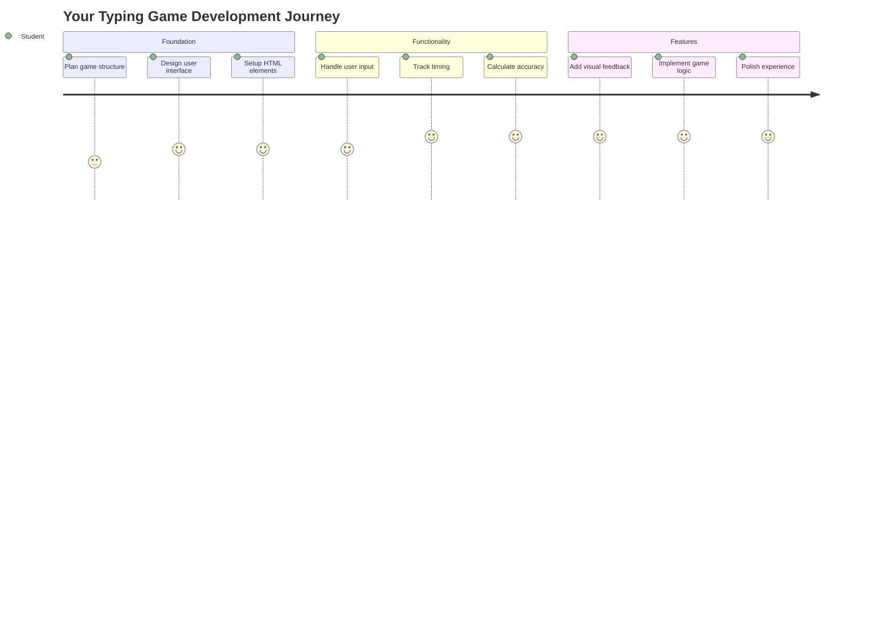
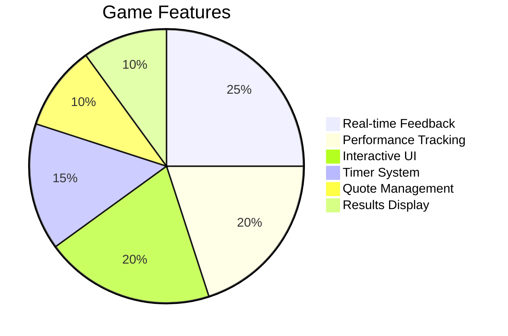
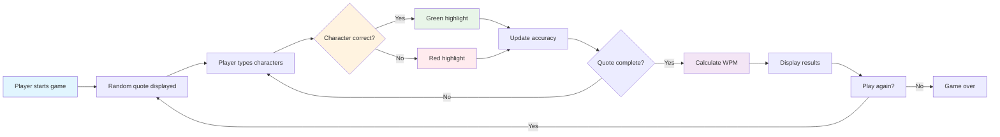
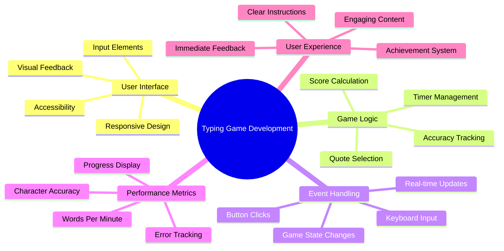
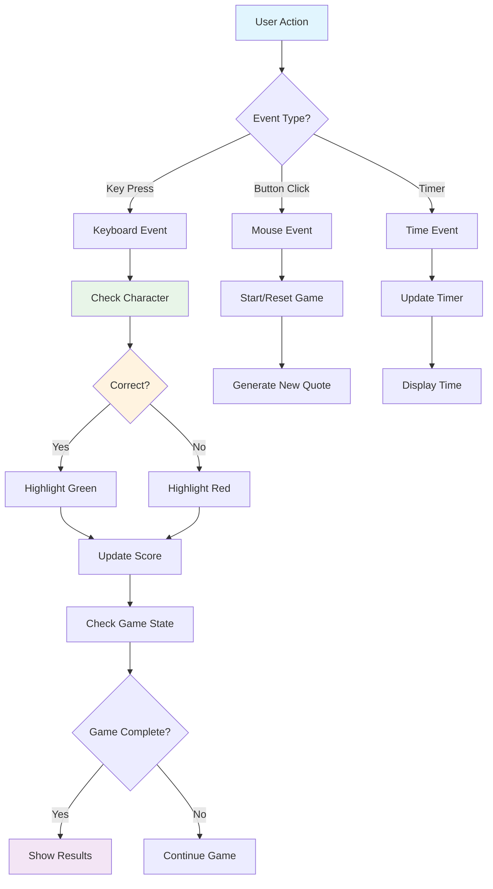
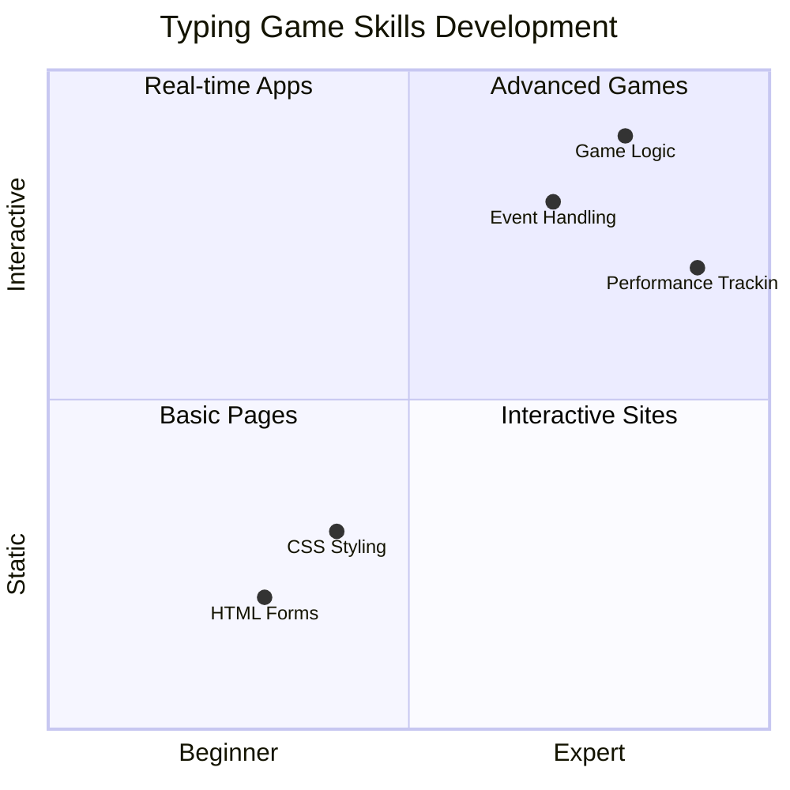
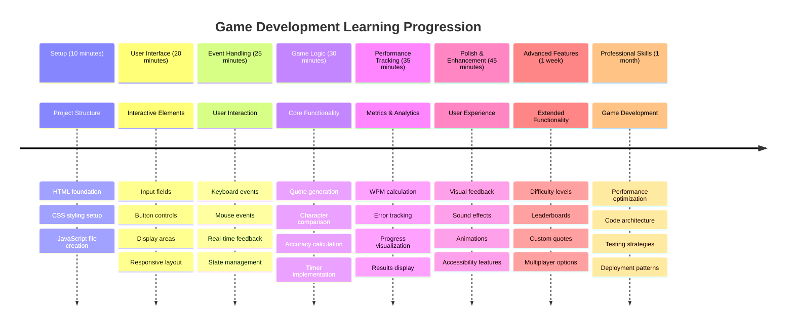

# Olay Tabanlı Programlama - Bir Yazma Oyunu Oluşturun

## Giriş

Her geliştiricinin bildiği ama nadiren dile getirdiği bir şey var: hızlı yazmak bir süper güçtür! 🚀 Bir düşünün - fikirlerinizi beyninizden kod editörüne ne kadar hızlı aktarabilirseniz, yaratıcılığınız o kadar akıcı olur. Bu, düşüncelerinizle ekran arasında doğrudan bir bağlantıya sahip olmak gibidir.

Bu beceriyi geliştirmek için en iyi yollardan birini öğrenmek ister misiniz? Tahmin ettiniz - bir oyun yapacağız!

> Haydi birlikte harika bir yazma oyunu oluşturalım!

JavaScript, HTML ve CSS becerilerinizi kullanmaya hazır mısınız? Efsanevi dedektif [Sherlock Holmes](https://en.wikipedia.org/wiki/Sherlock_Holmes)'dan rastgele alıntılarla sizi zorlayacak bir yazma oyunu yapacağız. Oyun, ne kadar hızlı ve doğru yazabildiğinizi takip edecek - ve inanın bana, düşündüğünüzden daha bağımlılık yapıcı!

## Bilmeniz Gerekenler

Başlamadan önce, bu kavramlara aşina olduğunuzdan emin olun (endişelenmeyin, hızlı bir hatırlatma gerekiyorsa - hepimiz oradaydık!):

- Metin girişi ve düğme kontrolleri oluşturma
- CSS ve sınıflar kullanarak stiller ayarlama  
- JavaScript temelleri
  - Bir dizi oluşturma
  - Rastgele bir sayı oluşturma
  - Mevcut zamanı alma

Eğer bunlar biraz paslanmış hissediyorsanız, bu tamamen normal! Bazen bilgilerinizi pekiştirmenin en iyi yolu bir projeye dalmak ve ilerledikçe öğrenmektir.

### 🔄 **Pedagojik Kontrol**
**Temel Değerlendirme**: Geliştirmeye başlamadan önce şunları anladığınızdan emin olun:
- ✅ HTML formları ve giriş öğelerinin nasıl çalıştığı
- ✅ CSS sınıfları ve dinamik stil verme
- ✅ JavaScript olay dinleyicileri ve işleyicileri
- ✅ Dizi manipülasyonu ve rastgele seçim
- ✅ Zaman ölçümü ve hesaplamalar

**Hızlı Kendini Test Et**: Bu kavramların interaktif bir oyunda nasıl birlikte çalıştığını açıklayabilir misiniz?
- **Olaylar**, kullanıcıların öğelerle etkileşimde bulunmasıyla tetiklenir
- **İşleyiciler**, bu olayları işler ve oyun durumunu günceller
- **CSS**, kullanıcı eylemleri için görsel geri bildirim sağlar
- **Zamanlama**, performans ölçümü ve oyun ilerlemesini mümkün kılar

## Haydi Bu Şeyi İnşa Edelim!

[Olay tabanlı programlama kullanarak yazma oyunu oluşturma](./typing-game/README.md)

### ⚡ **Sonraki 5 Dakikada Yapabilecekleriniz**
- [ ] Tarayıcı konsolunuzu açın ve `addEventListener` ile klavye olaylarını dinlemeyi deneyin
- [ ] Basit bir HTML sayfası oluşturun, bir giriş alanı ekleyin ve yazma algılamayı test edin
- [ ] Yazılan metni hedef metinle karşılaştırarak dize manipülasyonunu pratik yapın
- [ ] Zamanlama işlevlerini anlamak için `setTimeout` ile deney yapın

### 🎯 **Bu Saatte Başarabilecekleriniz**
- [ ] Ders sonrası testi tamamlayın ve olay tabanlı programlamayı anlayın
- [ ] Kelime doğrulaması ile yazma oyununun temel bir versiyonunu oluşturun
- [ ] Doğru ve yanlış yazma için görsel geri bildirim ekleyin
- [ ] Hız ve doğruluğa dayalı basit bir puanlama sistemi uygulayın
- [ ] Oyununuzu görsel olarak çekici hale getirmek için CSS ile stil verin

### 📅 **Haftalık Oyun Geliştirme Planınız**
- [ ] Tüm özellikleri ve cilalarıyla tam bir yazma oyunu tamamlayın
- [ ] Kelime karmaşıklığına göre değişen zorluk seviyeleri ekleyin
- [ ] Kullanıcı istatistik takibi uygulayın (WPM, zaman içinde doğruluk)
- [ ] Daha iyi bir kullanıcı deneyimi için ses efektleri ve animasyonlar ekleyin
- [ ] Oyununuzu dokunmatik cihazlar için mobil uyumlu hale getirin
- [ ] Oyununuzu çevrimiçi paylaşın ve kullanıcılardan geri bildirim alın

### 🌟 **Aylık Etkileşimli Geliştirme Planınız**
- [ ] Farklı etkileşim desenlerini keşfeden birden fazla oyun oluşturun
- [ ] Oyun döngüleri, durum yönetimi ve performans optimizasyonu hakkında bilgi edinin
- [ ] Açık kaynak oyun geliştirme projelerine katkıda bulunun
- [ ] Gelişmiş zamanlama kavramlarını ve akıcı animasyonları öğrenin
- [ ] Çeşitli etkileşimli uygulamaları sergileyen bir portföy oluşturun
- [ ] Oyun geliştirme ve kullanıcı etkileşimiyle ilgilenenlere mentorluk yapın

## 🎯 Yazma Oyunu Ustalık Zaman Çizelgeniz

### 🛠️ Oyun Geliştirme Araç Seti Özeti

Bu projeyi tamamladıktan sonra şunlarda ustalaşmış olacaksınız:
- **Olay Tabanlı Programlama**: Kullanıcı girdilerine tepki veren arayüzler
- **Gerçek Zamanlı Geri Bildirim**: Anlık görsel ve performans güncellemeleri
- **Performans Ölçümü**: Doğru zamanlama ve puanlama sistemleri
- **Oyun Durumu Yönetimi**: Uygulama akışını ve kullanıcı deneyimini kontrol etme
- **Etkileşimli Tasarım**: İlgi çekici, bağımlılık yapan kullanıcı deneyimleri oluşturma
- **Modern Web API'leri**: Zengin etkileşimler için tarayıcı yeteneklerini kullanma
- **Erişilebilirlik Desenleri**: Tüm kullanıcılar için kapsayıcı tasarım

**Gerçek Dünya Uygulamaları**: Bu beceriler doğrudan şunlara uygulanabilir:
- **Web Uygulamaları**: Herhangi bir etkileşimli arayüz veya kontrol paneli
- **Eğitim Yazılımları**: Öğrenme platformları ve beceri değerlendirme araçları
- **Verimlilik Araçları**: Metin editörleri, IDE'ler ve işbirliği yazılımları
- **Oyun Endüstrisi**: Tarayıcı oyunları ve etkileşimli eğlence
- **Mobil Geliştirme**: Dokunmatik tabanlı arayüzler ve hareket algılama

**Bir Sonraki Seviye**: Gelişmiş oyun çerçevelerini, gerçek zamanlı çok oyunculu sistemleri veya karmaşık etkileşimli uygulamaları keşfetmeye hazırsınız!

## Katkılar

[Christopher Harrison](http://www.twitter.com/geektrainer) tarafından ♥️ ile yazılmıştır

---

**Feragatname**:  
Bu belge, AI çeviri hizmeti [Co-op Translator](https://github.com/Azure/co-op-translator) kullanılarak çevrilmiştir. Doğruluk için çaba göstersek de, otomatik çevirilerin hata veya yanlışlıklar içerebileceğini lütfen unutmayın. Belgenin orijinal dili, yetkili kaynak olarak kabul edilmelidir. Kritik bilgiler için profesyonel insan çevirisi önerilir. Bu çevirinin kullanımından kaynaklanan yanlış anlamalar veya yanlış yorumlamalar için sorumluluk kabul etmiyoruz.