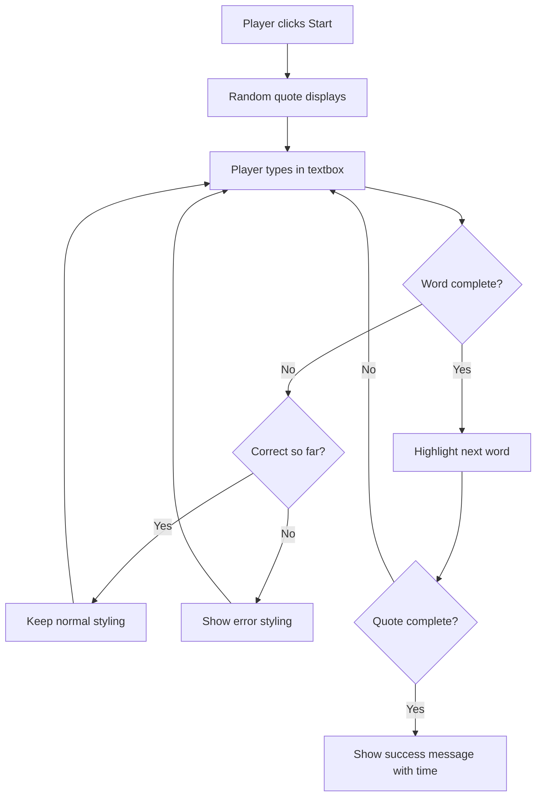
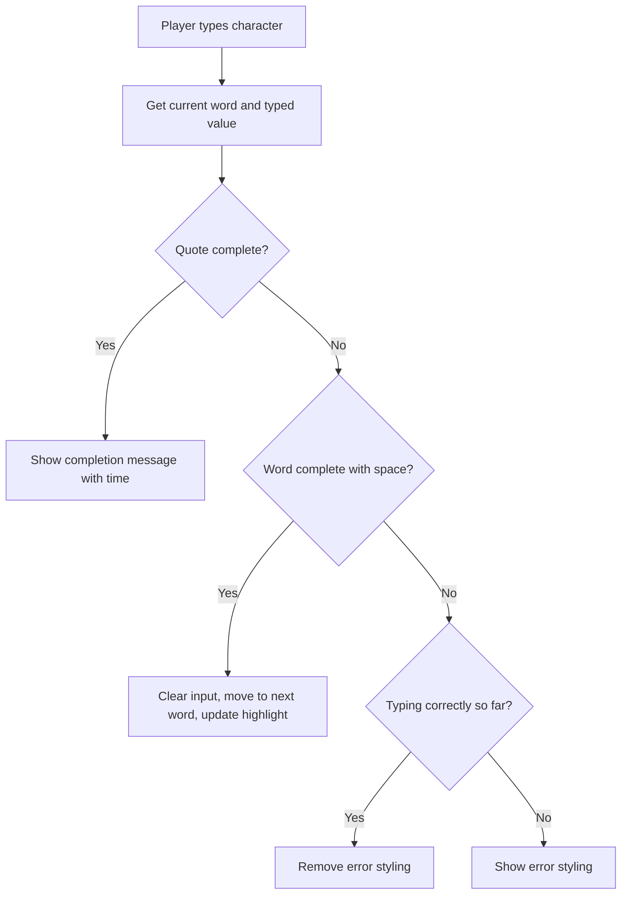
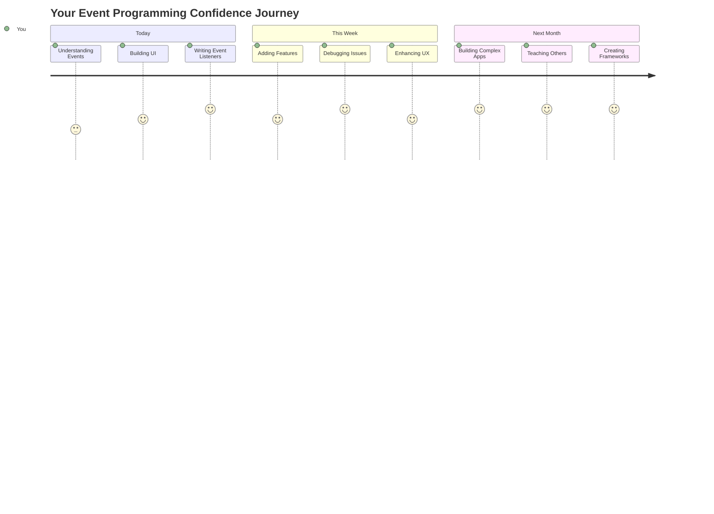

# Oyun Oluşturma: Etkinlikler Kullanarak

Hiç web sitelerinin bir düğmeye tıkladığınızda veya bir metin kutusuna yazdığınızda bunu nasıl bildiğini merak ettiniz mi? İşte bu, etkinlik odaklı programlamanın büyüsü! Bu önemli beceriyi öğrenmenin en iyi yolu, her tuş vuruşunuza tepki veren bir yazma hızı oyunu oluşturarak işe koyulmak.

Web tarayıcılarının JavaScript kodunuzla nasıl "konuştuğunu" ilk elden göreceksiniz. Her tıkladığınızda, yazdığınızda veya farenizi hareket ettirdiğinizde, tarayıcı kodunuza küçük mesajlar (bunlara etkinlik diyoruz) gönderiyor ve nasıl tepki vereceğinize siz karar veriyorsunuz!

Burada işimiz bittiğinde, hızınızı ve doğruluğunuzu takip eden gerçek bir yazma oyunu oluşturmuş olacaksınız. Daha da önemlisi, şimdiye kadar kullandığınız her etkileşimli web sitesini çalıştıran temel kavramları anlayacaksınız. Haydi başlayalım!

## Ders Öncesi Test

[Ders öncesi testi](https://ff-quizzes.netlify.app/web/quiz/21)

## Etkinlik Odaklı Programlama

En sevdiğiniz uygulama veya web sitesi hakkında düşünün - onu canlı ve duyarlı hissettiren nedir? Bu tamamen sizin yaptıklarınıza nasıl tepki verdiğiyle ilgilidir! Her dokunuş, tıklama, kaydırma veya tuş vuruşu "etkinlik" dediğimiz şeyi oluşturur ve işte web geliştirme büyüsü burada gerçekleşir.

Web için programlama yapmayı ilginç kılan şey şu: birinin o düğmeye ne zaman tıklayacağını veya bir metin kutusuna yazmaya başlayacağını asla bilemeyiz! Hemen tıklayabilir, beş dakika bekleyebilir veya belki hiç tıklamayabilir! Bu öngörülemezlik, kodumuzu yazma şeklimiz hakkında farklı düşünmemiz gerektiği anlamına gelir.

Bir tarif gibi yukarıdan aşağıya çalışan kod yazmak yerine, bir şeyin olmasını bekleyen kod yazarız. Bu, 1800'lerde telgraf operatörlerinin makinelerinin yanında oturup, bir mesaj telden geldiği anda yanıt vermeye hazır olmalarına benzer.

Peki tam olarak "etkinlik" nedir? Basitçe söylemek gerekirse, bir şeyin olmasıdır! Bir düğmeye tıkladığınızda - bu bir etkinliktir. Bir harf yazdığınızda - bu bir etkinliktir. Farenizi hareket ettirdiğinizde - bu başka bir etkinliktir.

Etkinlik odaklı programlama, kodumuzu dinlemek ve yanıt vermek için ayarlamamıza olanak tanır. Belirli şeylerin olmasını bekleyen ve gerçekleştiğinde harekete geçen özel işlevler olan **etkinlik dinleyicileri** oluştururuz.

Etkinlik dinleyicilerini kodunuz için bir kapı zili gibi düşünün. Kapı zilini ayarlarsınız (`addEventListener()`), hangi sesi dinlemesi gerektiğini söylersiniz (örneğin 'click' veya 'keypress') ve biri zili çaldığında ne olması gerektiğini belirtirsiniz (özel işleviniz).

**Etkinlik dinleyicileri nasıl çalışır:**
- Kullanıcı eylemleri (tıklamalar, tuş vuruşları veya fare hareketleri gibi) için **dinler**
- Belirtilen etkinlik gerçekleştiğinde özel kodunuzu **çalıştırır**
- Kullanıcı etkileşimlerine anında **yanıt verir**, sorunsuz bir deneyim yaratır
- Farklı dinleyiciler kullanarak aynı öğedeki birden fazla etkinliği **yönetir**

> **NOT:** Etkinlik dinleyicileri oluşturmanın birçok yolu olduğunu vurgulamakta fayda var. Anonim işlevler kullanabilir veya adlandırılmış olanlar oluşturabilirsiniz. `click` özelliğini ayarlamak gibi çeşitli kısayollar kullanabilir veya `addEventListener()` kullanabilirsiniz. Egzersizimizde `addEventListener()` ve anonim işlevlere odaklanacağız çünkü web geliştiricilerinin en sık kullandığı teknik budur. Ayrıca en esnek olanıdır, çünkü `addEventListener()` tüm etkinlikler için çalışır ve etkinlik adı bir parametre olarak sağlanabilir.

### Yaygın Etkinlikler

Web tarayıcıları, dinleyebileceğiniz düzinelerce farklı etkinlik sunar, ancak çoğu etkileşimli uygulama yalnızca bir avuç temel etkinliğe dayanır. Bu temel etkinlikleri anlamak, karmaşık kullanıcı etkileşimleri oluşturmanız için size temel sağlayacaktır.

Bir uygulama oluştururken dinleyebileceğiniz [düzinelerce etkinlik](https://developer.mozilla.org/docs/Web/Events) vardır. Temelde bir kullanıcının bir sayfada yaptığı her şey bir etkinlik oluşturur ve bu, onların istediğiniz deneyimi yaşamasını sağlamak için size büyük bir güç verir. Neyse ki, genellikle yalnızca birkaç temel etkinliğe ihtiyacınız olur. İşte yaygın olanlardan bazıları (oyunumuzu oluştururken kullanacağımız iki tanesi dahil):

| Etkinlik | Açıklama | Yaygın Kullanım Alanları |
|----------|----------|--------------------------|
| `click` | Kullanıcı bir şeye tıkladı | Düğmeler, bağlantılar, etkileşimli öğeler |
| `contextmenu` | Kullanıcı sağ fare tuşuna tıkladı | Özel sağ tıklama menüleri |
| `select` | Kullanıcı bir metni vurguladı | Metin düzenleme, kopyalama işlemleri |
| `input` | Kullanıcı bir metin girdi | Form doğrulama, gerçek zamanlı arama |

**Bu etkinlik türlerini anlamak:**
- Kullanıcıların sayfanızdaki belirli öğelerle etkileşimde bulunduğunda **tetiklenir**
- Kullanıcının eylemi hakkında ayrıntılı bilgileri etkinlik nesneleri aracılığıyla **sağlar**
- Duyarlı, etkileşimli web uygulamaları oluşturmanıza olanak **tanır**
- Farklı tarayıcılar ve cihazlar arasında tutarlı bir şekilde **çalışır**

## Oyunu Oluşturma

Artık etkinliklerin nasıl çalıştığını anladığınıza göre, bu bilgiyi pratikte kullanarak faydalı bir şeyler yapalım. Etkinlik işleme işlemini gösteren ve önemli bir geliştirici becerisi geliştirmenize yardımcı olan bir yazma hızı oyunu oluşturacağız.

JavaScript'te etkinliklerin nasıl çalıştığını keşfetmek için bir oyun oluşturacağız. Oyunumuz bir oyuncunun yazma becerisini test edecek, bu da tüm geliştiricilerin sahip olması gereken en az değer verilen becerilerden biridir. İlginç bir bilgi: Bugün kullandığımız QWERTY klavye düzeni aslında 1870'lerde daktilolar için tasarlandı - ve iyi yazma becerileri bugün programcılar için hala çok değerli! Oyunun genel akışı şöyle görünecek:



**Oyunumuz şöyle çalışacak:**
- Oyuncu başlat düğmesine tıkladığında başlar ve rastgele bir alıntı görüntüler
- Oyuncunun yazma ilerlemesini kelime kelime gerçek zamanlı olarak takip eder
- Oyuncunun odaklanmasını yönlendirmek için mevcut kelimeyi vurgular
- Yazım hataları için anında görsel geri bildirim sağlar
- Alıntı tamamlandığında toplam süreyi hesaplar ve görüntüler

Haydi oyunumuzu oluşturalım ve etkinlikler hakkında bilgi edinelim!

### Dosya Yapısı

Kodlamaya başlamadan önce, organize olalım! Başlangıçtan itibaren temiz bir dosya yapısına sahip olmak, ileride baş ağrılarından kurtulmanızı sağlar ve projenizi daha profesyonel hale getirir. 😊

Sadece üç dosyayla işleri basit tutacağız: `index.html` sayfa yapımız için, `script.js` tüm oyun mantığımız için ve `style.css` her şeyi harika göstermek için. Bu, webin çoğunu çalıştıran klasik üçlüdür!

**Bir konsol veya terminal penceresi açarak aşağıdaki komutu girerek yeni bir klasör oluşturun:**

```bash
# Linux or macOS
mkdir typing-game && cd typing-game

# Windows
md typing-game && cd typing-game
```

**Bu komutlar şunları yapar:**
- Proje dosyalarınız için `typing-game` adlı yeni bir dizin **oluşturur**
- Yeni oluşturulan dizine otomatik olarak **geçiş yapar**
- Oyun geliştirme için temiz bir çalışma alanı **ayarlar**

**Visual Studio Code'u açın:**

```bash
code .
```

**Bu komut:**
- Visual Studio Code'u mevcut dizinde **başlatır**
- Proje klasörünüzü editörde **açar**
- İhtiyacınız olan tüm geliştirme araçlarına erişim **sağlar**

**Visual Studio Code'da klasöre şu adlarla üç dosya ekleyin:**
- `index.html` - Oyununuzun yapısını ve içeriğini içerir
- `script.js` - Tüm oyun mantığını ve etkinlik dinleyicilerini yönetir
- `style.css` - Görsel görünümü ve stil tanımlarını belirler

## Kullanıcı Arayüzünü Oluşturma

Şimdi tüm oyun aksiyonunun gerçekleşeceği sahneyi oluşturalım! Bunu bir uzay gemisi kontrol panelini tasarlamak gibi düşünün - oyuncularımızın ihtiyaç duyduğu her şeyin tam olarak bekledikleri yerde olduğundan emin olmalıyız.

Oyunumuzun aslında neye ihtiyacı olduğunu anlayalım. Bir yazma oyunu oynuyor olsaydınız, ekranda ne görmek isterdiniz? İşte ihtiyacımız olanlar:

| UI Öğesi | Amacı | HTML Öğesi |
|----------|-------|-----------|
| Alıntı Gösterimi | Yazılacak metni gösterir | `<p>` ile `id="quote"` |
| Mesaj Alanı | Durum ve başarı mesajlarını görüntüler | `<p>` ile `id="message"` |
| Metin Girişi | Oyuncuların alıntıyı yazdığı yer | `<input>` ile `id="typed-value"` |
| Başlat Düğmesi | Oyunu başlatır | `<button>` ile `id="start"` |

**UI yapısını anlamak:**
- İçeriği yukarıdan aşağıya mantıksal olarak **düzenler**
- JavaScript hedeflemesi için öğelere benzersiz kimlikler **atanır**
- Daha iyi kullanıcı deneyimi için net görsel hiyerarşi **sağlar**
- Erişilebilirlik için semantik HTML öğeleri **içerir**

Her biri JavaScript'te çalışabilmemiz için kimliklere ihtiyaç duyacak. Ayrıca oluşturacağımız CSS ve JavaScript dosyalarına referanslar ekleyeceğiz.

`index.html` adlı yeni bir dosya oluşturun. Aşağıdaki HTML'yi ekleyin:

```html
<!-- inside index.html -->
<html>
<head>
  <title>Typing game</title>
  <link rel="stylesheet" href="style.css">
</head>
<body>
  <h1>Typing game!</h1>
  <p>Practice your typing skills with a quote from Sherlock Holmes. Click **start** to begin!</p>
  <p id="quote"></p> <!-- This will display our quote -->
  <p id="message"></p> <!-- This will display any status messages -->
  <div>
    <input type="text" aria-label="current word" id="typed-value" /> <!-- The textbox for typing -->
    <button type="button" id="start">Start</button> <!-- To start the game -->
  </div>
  <script src="script.js"></script>
</body>
</html>
```

**Bu HTML yapısının ne sağladığını açıklamak:**
- Stil için `<head>` içinde CSS stil dosyasını **bağlar**
- Kullanıcılar için net bir başlık ve talimatlar **oluşturur**
- Dinamik içerik için belirli kimliklere sahip yer tutucu paragraflar **oluşturur**
- Erişilebilirlik özelliklerine sahip bir giriş alanı **içerir**
- Oyunu başlatmak için bir başlat düğmesi **sağlar**
- Optimum performans için JavaScript dosyasını sonunda **yükler**

### Uygulamayı Başlatma

Geliştirme sırasında uygulamanızı sık sık test etmek, sorunları erken yakalamanıza ve ilerlemenizi gerçek zamanlı olarak görmenize yardımcı olur. Live Server, dosyaları kaydettiğinizde tarayıcınızı otomatik olarak yenileyen ve geliştirmeyi çok daha verimli hale getiren paha biçilmez bir araçtır.

Her zaman iteratif olarak geliştirmek en iyisidir, böylece her şeyin nasıl göründüğünü görebilirsiniz. Haydi uygulamamızı başlatalım. Visual Studio Code için harika bir uzantı olan [Live Server](https://marketplace.visualstudio.com/items?itemName=ritwickdey.LiveServer&WT.mc_id=academic-77807-sagibbon), hem uygulamanızı yerel olarak barındırır hem de dosyaları kaydettiğinizde tarayıcıyı yeniler.

**[Live Server](https://marketplace.visualstudio.com/items?itemName=ritwickdey.LiveServer&WT.mc_id=academic-77807-sagibbon) uzantısını yüklemek için bağlantıyı takip edin ve Yükle'ye tıklayın:**

**Yükleme sırasında neler olur:**
- Tarayıcınız Visual Studio Code'u açmaya **yönlendirilir**
- Uzantı yükleme sürecinde size rehberlik **eder**
- Kurulumu tamamlamak için Visual Studio Code'u yeniden başlatmanız **gerekebilir**

**Yüklendikten sonra, Visual Studio Code'da Ctrl-Shift-P (veya Cmd-Shift-P) tuşlarına basarak komut paletini açın:**

**Komut paletini anlamak:**
- Tüm VS Code komutlarına hızlı erişim **sağlar**
- Yazarken komutları **arama** yapar
- Daha hızlı geliştirme için klavye kısayolları **sunuyor**

**"Live Server: Open with Live Server" yazın:**

**Live Server'ın yaptığı şey:**
- Projeniz için yerel bir geliştirme sunucusu **başlatır**
- Dosyaları kaydettiğinizde tarayıcıyı otomatik olarak **yeniler**
- Dosyalarınızı yerel bir URL'den (genellikle `localhost:5500`) **sunuyor**

**Bir tarayıcı açın ve `https://localhost:5500` adresine gidin:**

Artık oluşturduğunuz sayfayı görmelisiniz! Haydi biraz işlevsellik ekleyelim.

## CSS Ekleme

Şimdi her şeyi güzel hale getirelim! Görsel geri bildirim, bilgisayar arayüzleri için ilk günlerden beri çok önemli olmuştur. 1980'lerde araştırmacılar, anında görsel geri bildirimin kullanıcı performansını önemli ölçüde artırdığını ve hataları azalttığını keşfettiler. İşte tam olarak bunu oluşturacağız.

Oyunumuzda olan biten her şeyin net olması gerekiyor. Oyuncular hangi kelimeyi yazmaları gerektiğini hemen anlamalı ve hata yaptıklarında bunu hemen görmeliler. Basit ama etkili bir stil oluşturalım:

`style.css` adlı yeni bir dosya oluşturun ve aşağıdaki söz dizimini ekleyin.

```css
/* inside style.css */
.highlight {
  background-color: yellow;
}

.error {
  background-color: lightcoral;
  border: red;
}
```

**Bu CSS sınıflarını anlamak:**
- Mevcut kelimeyi sarı bir arka planla vurgulayarak net görsel rehberlik **sağlar**
- Yazım hatalarını açık mercan rengi bir arka planla **işaretler**
- Kullanıcının yazma akışını bozmadan anında geri bildirim **sağlar**
- Erişilebilirlik ve net görsel iletişim için kontrast renkler **kullanır**

✅ CSS ile sayfanızı istediğiniz gibi düzenleyebilirsiniz. Biraz zaman ayırın ve sayfayı daha çekici hale getirin:

- Farklı bir yazı tipi seçin
- Başlıkları renklendirin
- Öğeleri yeniden boyutlandırın

## JavaScript

İşte işler ilginçleşiyor! 🎉 HTML yapımız ve CSS stilimiz var, ancak şu anda oyunumuz motoru olmayan güzel bir araba gibi. JavaScript, o motor olacak - her şeyin gerçekten çalışmasını ve oyuncuların yaptıklarına tepki vermesini sağlayacak.

Burada yarattığınız şeyin hayata geçtiğini göreceksiniz. Bunu adım adım ele alacağız, böylece hiçbir şey bunaltıcı hissettirmez:

| Adım | Amaç | Öğreneceğiniz Şey |
|------|------|-------------------|
| [Sabitleri oluşturma](../../../../4-typing-game/typing-game) | Alıntılar ve DOM referanslarını ayarlama | Değişken yönetimi ve DOM seçimi |
| [Oyunu başlatmak için etkinlik dinleyici](../../../../4-typing-game/typing-game) | Oyun başlatma işlemini yönetme | Etkinlik işleme ve UI güncellemeleri |
| [Yazma için etkinlik dinleyici](../../../../4-typing-game/typing-game) | Kullanıcı girişini gerçek zamanlı olarak işleme | Giriş doğrulama ve dinamik geri bildirim |

**Bu yapılandırılmış yaklaşım size şunları sağlar:**
- Kodunuzu mantıksal, yönetilebilir bölümlere **organize eder**
- Daha kolay hata ayıklama için işlevselliği kademeli olarak **oluşturur**
- Uygulamanızın farklı bölümlerinin nasıl birlikte çalıştığını **anlama**
- Gelecekteki projeler için yeniden kullanılabilir desenler **oluşturma**

Ama önce, `script.js` adlı yeni bir dosya oluşturun.

### Sabitleri Ekleme

Harekete geçmeden önce, tüm kaynaklarımızı toplayalım! NASA görev kontrolünün fırlatma öncesi tüm izleme sistemlerini kurması gibi, her şeyin hazırlanmış ve hazır olması çok daha kolaydır. Bu, daha sonra bir şeyler aramaktan bizi kurtarır ve yazım hatalarını önlemeye yardımcı olur.

İlk olarak şunları ayarlamamız gerekiyor:

| Veri Türü | Amaç | Örnek |
|-----------|------|-------|
| Alıntılar Dizisi | Oyundaki tüm olası alıntıları saklar | `['Alıntı 1', 'Alıntı 2', ...]` |
| Kelime Dizisi | Mevcut alıntıyı tek tek kelimelere ayırır | `['Ne', 'zaman', 'sen', ...]` |
| Kelime İndeksi | Oyuncunun hangi kelimeyi yazdığını takip eder | `0, 1, 2, 3...` |
| Başlangıç Zamanı | Puanlama için geçen süreyi hesaplar | `Date.now()` |

**Ayrıca, kullanıcı arayüzü öğelerine referanslara ihtiyacımız olacak:**
| Öğeler | ID | Amaç |
|--------|----|------|
| Metin girişi | `typed-value` | Oyuncuların yazdığı yer |
| Alıntı gösterimi | `quote` | Yazılacak alıntıyı gösterir |
| Mesaj alanı | `message` | Durum güncellemelerini gösterir |

```javascript
// inside script.js
// all of our quotes
const quotes = [
    'When you have eliminated the impossible, whatever remains, however improbable, must be the truth.',
    'There is nothing more deceptive than an obvious fact.',
    'I ought to know by this time that when a fact appears to be opposed to a long train of deductions it invariably proves to be capable of bearing some other interpretation.',
    'I never make exceptions. An exception disproves the rule.',
    'What one man can invent another can discover.',
    'Nothing clears up a case so much as stating it to another person.',
    'Education never ends, Watson. It is a series of lessons, with the greatest for the last.',
];
// store the list of words and the index of the word the player is currently typing
let words = [];
let wordIndex = 0;
// the starting time
let startTime = Date.now();
// page elements
const quoteElement = document.getElementById('quote');
const messageElement = document.getElementById('message');
const typedValueElement = document.getElementById('typed-value');
```

**Bu kurulum kodunun ne yaptığını açıklayalım:**
- **Saklar** Sherlock Holmes alıntılarından oluşan bir diziyi, alıntılar değişmeyeceği için `const` kullanarak
- **Başlatır** izleme değişkenlerini, oyun sırasında güncellenecekleri için `let` kullanarak
- **Yakalar** DOM öğelerine referansları, `document.getElementById()` ile verimli erişim için
- **Kurulum yapar** tüm oyun işlevselliği için açık ve açıklayıcı değişken adlarıyla temel oluşturur
- **Organize eder** ilgili veri ve öğeleri, kod bakımını kolaylaştırmak için mantıklı bir şekilde

✅ Oyununuz için daha fazla alıntı eklemeye devam edin

> 💡 **İpucu**: Kodda istediğimiz zaman öğeleri `document.getElementById()` kullanarak alabiliriz. Bu öğelere sık sık başvuracağımız için, sabitler kullanarak string literal hatalarından kaçınacağız. [Vue.js](https://vuejs.org/) veya [React](https://reactjs.org/) gibi frameworkler, kodunuzu merkezileştirmeyi daha iyi yönetmenize yardımcı olabilir.
>
**Bu yaklaşım neden bu kadar iyi çalışıyor:**
- **Önler** öğelere birden fazla kez başvururken yazım hatalarını
- **Geliştirir** kod okunabilirliğini açıklayıcı sabit adlarıyla
- **Sağlar** daha iyi IDE desteği, otomatik tamamlama ve hata kontrolü ile
- **Kolaylaştırır** öğe ID'leri daha sonra değişirse yeniden düzenlemeyi

`const`, `let` ve `var` kullanımı hakkında bir video izlemek için bir dakikanızı ayırın

[](https://youtube.com/watch?v=JNIXfGiDWM8 "Değişken türleri")

> 🎥 Yukarıdaki resme tıklayarak değişkenler hakkında bir video izleyin.

### Başlangıç mantığını ekleyin

Her şeyin yerine oturduğu yer burası! 🚀 İlk gerçek olay dinleyicinizi yazmak üzeresiniz ve bir düğmeye tıklamaya yanıt veren kodunuzu görmek oldukça tatmin edici bir şey.

Bir düşünün: bir yerlerde bir oyuncu "Başlat" düğmesine tıklayacak ve kodunuz buna hazır olmalı. Ne zaman tıklayacaklarını bilmiyoruz - hemen olabilir, kahve almaya gittikten sonra olabilir - ama tıkladıklarında oyununuz harekete geçecek.

Kullanıcı `start` düğmesine tıkladığında, bir alıntı seçmemiz, kullanıcı arayüzünü ayarlamamız ve mevcut kelime ve zamanlama için izleme ayarlarını yapmamız gerekiyor. Aşağıda eklemeniz gereken JavaScript kodu var; kod bloğunun hemen ardından bunu tartışıyoruz.

```javascript
// at the end of script.js
document.getElementById('start').addEventListener('click', () => {
  // get a quote
  const quoteIndex = Math.floor(Math.random() * quotes.length);
  const quote = quotes[quoteIndex];
  // Put the quote into an array of words
  words = quote.split(' ');
  // reset the word index for tracking
  wordIndex = 0;

  // UI updates
  // Create an array of span elements so we can set a class
  const spanWords = words.map(function(word) { return `<span>${word} </span>`});
  // Convert into string and set as innerHTML on quote display
  quoteElement.innerHTML = spanWords.join('');
  // Highlight the first word
  quoteElement.childNodes[0].className = 'highlight';
  // Clear any prior messages
  messageElement.innerText = '';

  // Setup the textbox
  // Clear the textbox
  typedValueElement.value = '';
  // set focus
  typedValueElement.focus();
  // set the event handler

  // Start the timer
  startTime = new Date().getTime();
});
```

**Kodun mantıksal bölümlere ayrılması:**

**📊 Kelime İzleme Ayarı:**
- **Seçer** çeşitlilik için `Math.floor()` ve `Math.random()` kullanarak rastgele bir alıntı
- **Dönüştürür** alıntıyı `split(' ')` kullanarak tek tek kelimelerden oluşan bir diziye
- **Sıfırlar** `wordIndex` değerini, oyuncular ilk kelimeyle başladığı için
- **Hazırlar** oyun durumunu yeni bir tur için

**🎨 Kullanıcı Arayüzü Ayarı ve Gösterimi:**
- **Oluşturur** her kelimeyi bireysel stil için saran `<span>` öğelerinden oluşan bir dizi
- **Birleştirir** span öğelerini verimli DOM güncellemesi için tek bir string haline
- **Vurgular** ilk kelimeyi `highlight` CSS sınıfını ekleyerek
- **Temizler** önceki oyun mesajlarını, temiz bir başlangıç sağlamak için

**⌨️ Metin Kutusu Hazırlığı:**
- **Temizler** giriş alanındaki mevcut metni
- **Odaklar** metin kutusunu, oyuncuların hemen yazmaya başlaması için
- **Hazırlar** giriş alanını yeni oyun oturumu için

**⏱️ Zamanlayıcı Başlatma:**
- **Yakalar** mevcut zaman damgasını `new Date().getTime()` kullanarak
- **Sağlar** yazma hızı ve tamamlama süresinin doğru hesaplanmasını
- **Başlatır** oyun oturumu için performans takibini

### Yazma mantığını ekleyin

İşte oyunumuzun kalbine ulaşıyoruz! İlk başta çok gibi görünse de endişelenmeyin - her parçayı adım adım inceleyeceğiz ve sonunda ne kadar mantıklı olduğunu göreceksiniz.

Burada oldukça sofistike bir şey inşa ediyoruz: biri her harf yazdığında, kodumuz ne yazıldığını kontrol edecek, geri bildirim verecek ve bir sonraki adımda ne yapılması gerektiğine karar verecek. Bu, 1970'lerdeki WordStar gibi erken dönem kelime işlemcilerin daktilolara gerçek zamanlı geri bildirim sağlama şekline benziyor.

```javascript
// at the end of script.js
typedValueElement.addEventListener('input', () => {
  // Get the current word
  const currentWord = words[wordIndex];
  // get the current value
  const typedValue = typedValueElement.value;

  if (typedValue === currentWord && wordIndex === words.length - 1) {
    // end of sentence
    // Display success
    const elapsedTime = new Date().getTime() - startTime;
    const message = `CONGRATULATIONS! You finished in ${elapsedTime / 1000} seconds.`;
    messageElement.innerText = message;
  } else if (typedValue.endsWith(' ') && typedValue.trim() === currentWord) {
    // end of word
    // clear the typedValueElement for the new word
    typedValueElement.value = '';
    // move to the next word
    wordIndex++;
    // reset the class name for all elements in quote
    for (const wordElement of quoteElement.childNodes) {
      wordElement.className = '';
    }
    // highlight the new word
    quoteElement.childNodes[wordIndex].className = 'highlight';
  } else if (currentWord.startsWith(typedValue)) {
    // currently correct
    // highlight the next word
    typedValueElement.className = '';
  } else {
    // error state
    typedValueElement.className = 'error';
  }
});
```

**Yazma mantığı akışını anlamak:**

Bu fonksiyon, en spesifikten en genel duruma kadar koşulları kontrol eden bir şelale yaklaşımı kullanır. Her senaryoyu inceleyelim:



**🏁 Alıntı Tamamlandı (Senaryo 1):**
- **Kontrol eder** yazılan değer mevcut kelimeyle eşleşiyor mu ve son kelimede miyiz
- **Hesaplar** geçen süreyi, başlangıç zamanından mevcut zamanı çıkararak
- **Dönüştürür** milisaniyeleri saniyeye, 1.000'e bölerek
- **Gösterir** tamamlanma süresiyle tebrik mesajı

**✅ Kelime Tamamlandı (Senaryo 2):**
- **Tespit eder** kelime tamamlandığında girişin boşlukla bitmesini
- **Doğrular** kırpılmış girişin mevcut kelimeyle tam olarak eşleştiğini
- **Temizler** giriş alanını bir sonraki kelime için
- **İlerler** bir sonraki kelimeye, `wordIndex` değerini artırarak
- **Günceller** görsel vurgulamayı, tüm sınıfları kaldırarak ve yeni kelimeyi vurgulayarak

**📝 Yazma Devam Ediyor (Senaryo 3):**
- **Doğrular** mevcut kelimenin şimdiye kadar yazılanlarla başladığını
- **Kaldırır** hata stilini, girişin doğru olduğunu göstermek için
- **İzin verir** kesintisiz yazmaya devam edilmesine

**❌ Hata Durumu (Senaryo 4):**
- **Tetikler** yazılan metin beklenen kelime başlangıcıyla eşleşmediğinde
- **Uygular** hata CSS sınıfını, anında görsel geri bildirim sağlamak için
- **Yardımcı olur** oyuncuların hataları hızlıca tanımlayıp düzeltmesine

## Uygulamanızı Test Edin

Başardıklarınıza bir bakın! 🎉 Etkinlik odaklı programlama kullanarak sıfırdan gerçek bir yazma oyunu oluşturdunuz. Bunun küçük bir başarı olmadığını kabul edin!

Şimdi test aşamasına geldik! Beklendiği gibi çalışacak mı? Bir şeyleri kaçırdık mı? Şunu unutmayın: Bir şey hemen mükemmel çalışmazsa, bu tamamen normaldir. Deneyimli geliştiriciler bile düzenli olarak kodlarında hatalar bulurlar. Bu, geliştirme sürecinin bir parçasıdır!

`start` düğmesine tıklayın ve yazmaya başlayın! Daha önce gördüğümüz animasyona benzer bir şey gibi görünmeli.


**Uygulamanızda test edilecekler:**
- **Doğrular** Başlat'a tıklamanın rastgele bir alıntı gösterdiğini
- **Onaylar** yazmanın mevcut kelimeyi doğru şekilde vurguladığını
- **Kontrol eder** yanlış yazım için hata stilinin göründüğünü
- **Emin olur** kelimeleri tamamlamanın vurguyu doğru şekilde ilerlettiğini
- **Test eder** alıntıyı bitirmenin tamamlanma mesajını zamanla birlikte gösterdiğini

**Yaygın hata ayıklama ipuçları:**
- **Kontrol edin** tarayıcı konsolunu (F12) JavaScript hataları için
- **Doğrulayın** tüm dosya adlarının tam olarak eşleştiğini (büyük/küçük harf duyarlı)
- **Emin olun** Live Server'ın çalıştığından ve düzgün şekilde yenilendiğinden
- **Farklı alıntıları test edin** rastgele seçim işlevinin çalıştığını doğrulamak için

---

## GitHub Copilot Agent Challenge 🎮

Agent modunu kullanarak aşağıdaki meydan okumayı tamamlayın:

**Açıklama:** Oyunu, oyuncu performansına göre ayarlanan bir zorluk sistemi ekleyerek genişletin. Bu meydan okuma, gelişmiş olay işleme, veri analizi ve dinamik UI güncellemeleri pratiği yapmanıza yardımcı olacak.

**İstek:** Yazma oyununa bir zorluk ayarlama sistemi ekleyin:
1. Oyuncunun yazma hızını (dakikadaki kelime) ve doğruluk yüzdesini takip edin
2. Otomatik olarak üç zorluk seviyesine ayarlayın: Kolay (basit alıntılar), Orta (mevcut alıntılar), Zor (noktalama işaretleri içeren karmaşık alıntılar)
3. Mevcut zorluk seviyesini ve oyuncu istatistiklerini UI'da gösterin
4. 3 ardışık iyi performanstan sonra zorluğu artıran bir seri sayacı ekleyin
5. Zorluk değişikliklerini göstermek için görsel geri bildirim (renkler, animasyonlar) ekleyin

Bu özelliği uygulamak için gerekli HTML öğelerini, CSS stillerini ve JavaScript fonksiyonlarını ekleyin. Uygun hata işleme ekleyin ve oyun erişilebilirliğini koruyun.

[Agent modu hakkında daha fazla bilgi edinin](https://code.visualstudio.com/blogs/2025/02/24/introducing-copilot-agent-mode).

## 🚀 Meydan Okuma

Yazma oyununuzu bir üst seviyeye taşımaya hazır mısınız? Olay işleme ve DOM manipülasyonu konusundaki anlayışınızı derinleştirmek için bu gelişmiş özellikleri uygulamayı deneyin:

**Daha fazla işlevsellik ekleyin:**

| Özellik | Açıklama | Pratik Yapacağınız Beceriler |
|---------|----------|-----------------------------|
| **Giriş Kontrolü** | Tamamlandığında `input` olay dinleyicisini devre dışı bırakın ve düğmeye tıklandığında yeniden etkinleştirin | Olay yönetimi ve durum kontrolü |
| **UI Durum Yönetimi** | Oyuncu alıntıyı tamamladığında metin kutusunu devre dışı bırakın | DOM özelliği manipülasyonu |
| **Modal Dialog** | Başarı mesajını içeren bir modal dialog kutusu gösterin | Gelişmiş UI desenleri ve erişilebilirlik |
| **Yüksek Skor Sistemi** | Yüksek skorları `localStorage` kullanarak saklayın | Tarayıcı depolama API'leri ve veri kalıcılığı |

**Uygulama ipuçları:**
- **Araştırın** `localStorage.setItem()` ve `localStorage.getItem()` kalıcı depolama için
- **Pratik yapın** olay dinleyicilerini dinamik olarak ekleyip kaldırmayı
- **Keşfedin** HTML dialog öğelerini veya CSS modal desenlerini
- **Düşünün** form kontrollerini devre dışı bırakıp etkinleştirirken erişilebilirliği

## Ders Sonrası Quiz

[Ders sonrası quiz](https://ff-quizzes.netlify.app/web/quiz/22)

---

## 🚀 Yazma Oyunu Ustalık Zaman Çizelgeniz

### ⚡ **Sonraki 5 Dakikada Yapabilecekleriniz**
- [ ] Yazma oyununuzu farklı alıntılarla test edin, sorunsuz çalıştığından emin olun
- [ ] CSS stilini deneyin - vurgulama ve hata renklerini değiştirmeyi deneyin
- [ ] Tarayıcınızın Geliştirici Araçlarını (F12) açın ve oynarken Konsolu izleyin
- [ ] Kendinize meydan okuyarak bir alıntıyı olabildiğince hızlı tamamlamayı deneyin

### ⏰ **Bu Saatte Başarabilecekleriniz**
- [ ] Diziye daha fazla alıntı ekleyin (belki en sevdiğiniz kitaplardan veya filmlerden)
- [ ] Meydan okuma bölümünden localStorage yüksek skor sistemini uygulayın
- [ ] Her oyundan sonra gösterilecek bir dakikadaki kelime hesaplayıcı oluşturun
- [ ] Doğru yazma, hatalar ve tamamlama için ses efektleri ekleyin

### 📅 **Bir Haftalık Maceranız**
- [ ] Arkadaşların yan yana rekabet edebileceği çok oyunculu bir versiyon oluşturun
- [ ] Farklı alıntı karmaşıklıklarıyla zorluk seviyeleri oluşturun
- [ ] Alıntının ne kadarının tamamlandığını gösteren bir ilerleme çubuğu ekleyin
- [ ] Kişisel istatistik takibi ile kullanıcı hesapları oluşturun
- [ ] Özel temalar tasarlayın ve kullanıcıların tercih ettikleri stili seçmelerine izin verin

### 🗓️ **Bir Aylık Dönüşümünüz**
- [ ] Doğru parmak yerleşimini aşamalı olarak öğreten bir yazma kursu oluşturun
- [ ] Hangi harflerin veya kelimelerin en fazla hataya neden olduğunu gösteren analizler oluşturun
- [ ] Farklı diller ve klavye düzenleri için destek ekleyin
- [ ] Edebiyat veritabanlarından alıntılar çekmek için eğitim API'leriyle entegre edin
- [ ] Geliştirilmiş yazma oyununuzu başkalarının kullanması ve keyif alması için yayınlayın

### 🎯 **Son Düşünce Kontrolü**

**Devam etmeden önce kutlama yapın:**
- Bu oyunu oluştururken en tatmin edici an neydi?
- Etkinlik odaklı programlama hakkında başlangıçta hissettiğinizle şimdi hissettiğiniz arasında nasıl bir fark var?
- Bu oyunu benzersiz kılmak için eklemek istediğiniz bir özellik nedir?
- Olay işleme kavramlarını diğer projelere nasıl uygulayabilirsiniz?



> 🌟 **Unutmayın**: Etkileşimli her web sitesi ve uygulamayı çalıştıran temel kavramlardan birini yeni öğrendiniz. Etkinlik odaklı programlama, web'i canlı ve duyarlı hissettiren şeydir. Her açılır menü, yazarken doğrulama yapan bir form veya tıklamalarınıza yanıt veren bir oyun gördüğünüzde, artık bunun arkasındaki sihri anlıyorsunuz. Sadece kod yazmayı öğrenmiyorsunuz - sezgisel ve ilgi çekici deneyimler yaratmayı öğreniyorsunuz! 🎉

---

## Gözden Geçirme ve Kendi Kendine Çalışma

Web tarayıcısı aracılığıyla geliştiriciye sunulan [tüm olaylar](https://developer.mozilla.org/docs/Web/Events) hakkında bilgi edinin ve her birini hangi senaryolarda kullanacağınızı düşünün.

## Ödev

[Yeni bir klavye oyunu oluşturun](assignment.md)

---

**Feragatname**:  
Bu belge, AI çeviri hizmeti [Co-op Translator](https://github.com/Azure/co-op-translator) kullanılarak çevrilmiştir. Doğruluk için çaba göstersek de, otomatik çeviriler hata veya yanlışlıklar içerebilir. Belgenin orijinal dili, yetkili kaynak olarak kabul edilmelidir. Kritik bilgiler için profesyonel insan çevirisi önerilir. Bu çevirinin kullanımından kaynaklanan herhangi bir yanlış anlama veya yanlış yorumlamadan sorumlu değiliz.