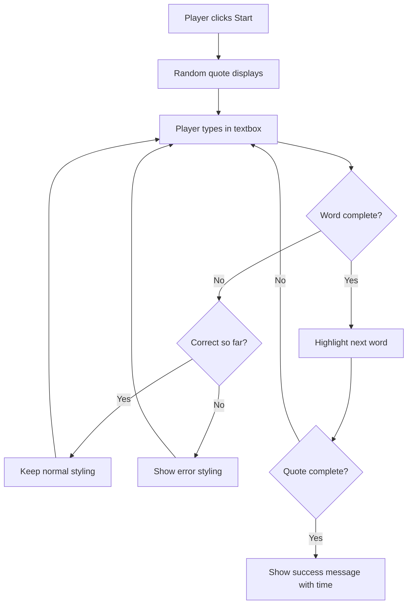
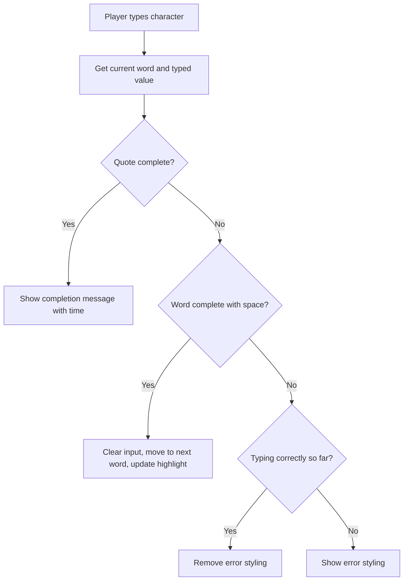

<!--
CO_OP_TRANSLATOR_METADATA:
{
  "original_hash": "e6b75e5b8caae906473a8a09d77b7121",
  "translation_date": "2025-10-23T00:04:27+00:00",
  "source_file": "4-typing-game/typing-game/README.md",
  "language_code": "tr"
}
-->
# Oyun Oluşturma: Etkinlikler Kullanarak

Hiç web sitelerinin bir düğmeye tıkladığınızda veya bir metin kutusuna yazı yazdığınızda bunu nasıl bildiğini merak ettiniz mi? İşte bu, etkinlik odaklı programlamanın büyüsü! Bu önemli beceriyi öğrenmenin en iyi yolu, her tuş vuruşunuza tepki veren bir yazma hızı oyunu oluşturarak bir şeyler inşa etmektir.

Web tarayıcılarının JavaScript kodunuzla nasıl "konuştuğunu" ilk elden göreceksiniz. Her tıkladığınızda, yazdığınızda veya farenizi hareket ettirdiğinizde, tarayıcı kodunuza küçük mesajlar (bunlara etkinlik diyoruz) gönderiyor ve nasıl tepki vereceğinize siz karar veriyorsunuz!

Burada işimiz bittiğinde, hızınızı ve doğruluğunuzu takip eden gerçek bir yazma oyunu oluşturmuş olacaksınız. Daha da önemlisi, şimdiye kadar kullandığınız her etkileşimli web sitesini güçlendiren temel kavramları anlayacaksınız. Haydi başlayalım!

## Ders Öncesi Test

[Ders öncesi test](https://ff-quizzes.netlify.app/web/quiz/21)

## Etkinlik Odaklı Programlama

En sevdiğiniz uygulama veya web sitesi hakkında düşünün - onu canlı ve duyarlı hissettiren nedir? Bu tamamen sizin yaptıklarınıza nasıl tepki verdiğiyle ilgilidir! Her dokunuş, tıklama, kaydırma veya tuş vuruşu "etkinlik" dediğimiz şeyi oluşturur ve işte web geliştirme büyüsü burada gerçekleşir.

Web için programlama yapmayı bu kadar ilginç kılan şey şudur: birinin o düğmeye ne zaman tıklayacağını veya bir metin kutusuna yazmaya başlayacağını asla bilemeyiz! Hemen tıklayabilirler, beş dakika bekleyebilirler veya belki hiç tıklamazlar! Bu belirsizlik, kodumuzu yazma şeklimiz hakkında farklı düşünmemiz gerektiği anlamına gelir.

Bir tarif gibi yukarıdan aşağıya doğru çalışan kod yazmak yerine, bir şeyin olmasını sabırla bekleyen kod yazarız. Bu, 1800'lerde telgraf operatörlerinin makinelerinin yanında oturup, telden bir mesaj geldiği anda yanıt vermeye hazır olmalarına benzer.

Peki tam olarak "etkinlik" nedir? Basitçe söylemek gerekirse, bir şeyin olmasıdır! Bir düğmeye tıkladığınızda - bu bir etkinliktir. Bir harf yazdığınızda - bu bir etkinliktir. Farenizi hareket ettirdiğinizde - bu başka bir etkinliktir.

Etkinlik odaklı programlama, kodumuzu dinlemek ve yanıt vermek için ayarlamamıza olanak tanır. Belirli şeylerin olmasını sabırla bekleyen ve gerçekleştiğinde harekete geçen **etkinlik dinleyicileri** adı verilen özel işlevler oluştururuz.

Etkinlik dinleyicilerini kodunuz için bir kapı zili gibi düşünün. Kapı zilini kurarsınız (`addEventListener()`), hangi sesi dinleyeceğini söylersiniz (örneğin 'click' veya 'keypress') ve biri zili çaldığında ne olması gerektiğini belirtirsiniz (özel işleviniz).

**Etkinlik dinleyicileri nasıl çalışır:**
- Kullanıcı eylemlerini (tıklamalar, tuş vuruşları, fare hareketleri gibi) dinler
- Belirtilen etkinlik gerçekleştiğinde özel kodunuzu çalıştırır
- Kullanıcı etkileşimlerine anında yanıt verir, sorunsuz bir deneyim yaratır
- Farklı dinleyiciler kullanarak aynı öğede birden fazla etkinliği işler

> **NOT:** Etkinlik dinleyicileri oluşturmanın birçok yolu olduğunu vurgulamakta fayda var. Anonim işlevler kullanabilir veya adlandırılmış olanlar oluşturabilirsiniz. `click` özelliğini ayarlamak gibi çeşitli kısayollar kullanabilir veya `addEventListener()` kullanabilirsiniz. Egzersizimizde `addEventListener()` ve anonim işlevlere odaklanacağız çünkü bu, web geliştiricilerinin en sık kullandığı tekniktir. Ayrıca en esnek olanıdır çünkü `addEventListener()` tüm etkinlikler için çalışır ve etkinlik adı bir parametre olarak sağlanabilir.

### Yaygın Etkinlikler

Web tarayıcıları, dinleyebileceğiniz düzinelerce farklı etkinlik sunar, ancak çoğu etkileşimli uygulama yalnızca bir avuç temel etkinliğe dayanır. Bu temel etkinlikleri anlamak, karmaşık kullanıcı etkileşimleri oluşturmanız için size temel sağlayacaktır.

Bir uygulama oluştururken dinleyebileceğiniz [düzinelerce etkinlik](https://developer.mozilla.org/docs/Web/Events) vardır. Temelde bir kullanıcının bir sayfada yaptığı her şey bir etkinlik oluşturur, bu da onlara istediğiniz deneyimi sunmak için size büyük bir güç verir. Neyse ki, genellikle yalnızca birkaç temel etkinliğe ihtiyacınız olur. İşte birkaç yaygın olanı (oyunumuzu oluştururken kullanacağımız iki tanesi dahil):

| Etkinlik | Açıklama | Yaygın Kullanım Alanları |
|----------|----------|--------------------------|
| `click` | Kullanıcı bir şeye tıkladı | Düğmeler, bağlantılar, etkileşimli öğeler |
| `contextmenu` | Kullanıcı sağ fare tuşuna tıkladı | Özel sağ tıklama menüleri |
| `select` | Kullanıcı bir metni vurguladı | Metin düzenleme, kopyalama işlemleri |
| `input` | Kullanıcı bir metin girdi | Form doğrulama, gerçek zamanlı arama |

**Bu etkinlik türlerini anlamak:**
- Kullanıcıların sayfanızdaki belirli öğelerle etkileşimde bulunması durumunda tetiklenir
- Etkinlik nesneleri aracılığıyla kullanıcının eylemi hakkında ayrıntılı bilgi sağlar
- Duyarlı, etkileşimli web uygulamaları oluşturmanıza olanak tanır
- Farklı tarayıcılar ve cihazlar arasında tutarlı bir şekilde çalışır

## Oyunu Oluşturma

Artık etkinliklerin nasıl çalıştığını anladığınıza göre, bu bilgiyi pratikte kullanarak faydalı bir şeyler yapalım. Etkinlik işleme işlemini gösteren ve önemli bir geliştirici becerisi geliştirmenize yardımcı olan bir yazma hızı oyunu oluşturacağız.

JavaScript'te etkinliklerin nasıl çalıştığını keşfetmek için bir oyun oluşturacağız. Oyunumuz, bir oyuncunun yazma becerisini test edecek ve bu, tüm geliştiricilerin sahip olması gereken en az değer verilen becerilerden biridir. İlginç bir bilgi: Bugün kullandığımız QWERTY klavye düzeni aslında 1870'lerde daktilolar için tasarlandı - ve iyi yazma becerileri bugün programcılar için hala çok değerli! Oyunun genel akışı şu şekilde görünecek:



**Oyunumuz şu şekilde çalışacak:**
- Oyuncu başlat düğmesine tıkladığında başlar ve rastgele bir alıntı görüntüler
- Oyuncunun yazma ilerlemesini kelime kelime gerçek zamanlı olarak takip eder
- Oyuncunun odaklanmasını sağlamak için mevcut kelimeyi vurgular
- Yazım hataları için anında görsel geri bildirim sağlar
- Alıntı tamamlandığında toplam süreyi hesaplar ve görüntüler

Haydi oyunumuzu oluşturalım ve etkinlikler hakkında bilgi edinelim!

### Dosya Yapısı

Kodlamaya başlamadan önce, organize olalım! Başlangıçtan itibaren temiz bir dosya yapısına sahip olmak, ileride baş ağrılarından kurtulmanızı sağlar ve projenizi daha profesyonel hale getirir. 😊

Sadece üç dosya ile işleri basit tutacağız: `index.html` sayfa yapımız için, `script.js` tüm oyun mantığımız için ve `style.css` her şeyi harika göstermek için. Bu, webin çoğunu güçlendiren klasik üçlüdür!

**Bir konsol veya terminal penceresi açarak ve aşağıdaki komutu girerek çalışmanız için yeni bir klasör oluşturun:**

```bash
# Linux or macOS
mkdir typing-game && cd typing-game

# Windows
md typing-game && cd typing-game
```

**Bu komutlar şunları yapar:**
- Proje dosyalarınız için `typing-game` adlı yeni bir dizin oluşturur
- Otomatik olarak yeni oluşturulan dizine geçiş yapar
- Oyun geliştirme için temiz bir çalışma alanı oluşturur

**Visual Studio Code'u açın:**

```bash
code .
```

**Bu komut:**
- Visual Studio Code'u mevcut dizinde başlatır
- Proje klasörünüzü editörde açar
- Geliştirme için ihtiyacınız olan tüm araçlara erişim sağlar

**Visual Studio Code'da klasöre şu adlarla üç dosya ekleyin:**
- `index.html` - Oyununuzun yapısını ve içeriğini içerir
- `script.js` - Tüm oyun mantığını ve etkinlik dinleyicilerini yönetir
- `style.css` - Görsel görünümü ve stil tanımlarını belirler

## Kullanıcı Arayüzünü Oluşturma

Şimdi tüm oyun aksiyonunun gerçekleşeceği sahneyi oluşturalım! Bunu bir uzay gemisinin kontrol panelini tasarlamak gibi düşünün - oyuncularımızın ihtiyaç duyduğu her şeyin bekledikleri yerde olduğundan emin olmalıyız.

Oyunumuzun gerçekten neye ihtiyacı olduğunu anlayalım. Bir yazma oyunu oynuyor olsaydınız, ekranda ne görmek isterdiniz? İşte ihtiyacımız olanlar:

| UI Öğesi | Amacı | HTML Öğesi |
|----------|-------|-----------|
| Alıntı Gösterimi | Yazılacak metni gösterir | `<p>` ile `id="quote"` |
| Mesaj Alanı | Durum ve başarı mesajlarını gösterir | `<p>` ile `id="message"` |
| Metin Girişi | Oyuncuların alıntıyı yazdığı yer | `<input>` ile `id="typed-value"` |
| Başlat Düğmesi | Oyunu başlatır | `<button>` ile `id="start"` |

**UI yapısını anlamak:**
- İçeriği yukarıdan aşağıya doğru mantıklı bir şekilde düzenler
- JavaScript hedeflemesi için öğelere benzersiz kimlikler atar
- Daha iyi kullanıcı deneyimi için net bir görsel hiyerarşi sağlar
- Erişilebilirlik için semantik HTML öğeleri içerir

Bu öğelerin her biri, JavaScript'te çalışabilmemiz için kimliklere ihtiyaç duyacaktır. Ayrıca oluşturacağımız CSS ve JavaScript dosyalarına referanslar ekleyeceğiz.

`index.html` adlı yeni bir dosya oluşturun. Aşağıdaki HTML'yi ekleyin:

```html
<!-- inside index.html -->
<html>
<head>
  <title>Typing game</title>
  <link rel="stylesheet" href="style.css">
</head>
<body>
  <h1>Typing game!</h1>
  <p>Practice your typing skills with a quote from Sherlock Holmes. Click **start** to begin!</p>
  <p id="quote"></p> <!-- This will display our quote -->
  <p id="message"></p> <!-- This will display any status messages -->
  <div>
    <input type="text" aria-label="current word" id="typed-value" /> <!-- The textbox for typing -->
    <button type="button" id="start">Start</button> <!-- To start the game -->
  </div>
  <script src="script.js"></script>
</body>
</html>
```

**Bu HTML yapısının başardıklarını açıklamak:**
- Stil için `<head>` bölümünde CSS stil dosyasını bağlar
- Kullanıcılar için net bir başlık ve talimatlar oluşturur
- Dinamik içerik için belirli kimliklere sahip yer tutucu paragraflar oluşturur
- Erişilebilirlik özelliklerine sahip bir giriş alanı içerir
- Oyunu başlatmak için bir başlat düğmesi sağlar
- Optimum performans için JavaScript dosyasını en sona yükler

### Uygulamayı Başlatma

Geliştirme sırasında uygulamanızı sık sık test etmek, sorunları erken yakalamanıza ve ilerlemenizi gerçek zamanlı olarak görmenize yardımcı olur. Live Server, dosyaları kaydettiğinizde tarayıcınızı otomatik olarak yenileyen ve geliştirmeyi çok daha verimli hale getiren paha biçilmez bir araçtır.

Her zaman iteratif olarak geliştirmek en iyisidir, böylece her şeyin nasıl göründüğünü görebilirsiniz. Haydi uygulamamızı başlatalım. Visual Studio Code için harika bir uzantı olan [Live Server](https://marketplace.visualstudio.com/items?itemName=ritwickdey.LiveServer&WT.mc_id=academic-77807-sagibbon), hem uygulamanızı yerel olarak barındırır hem de dosyaları kaydettiğinizde tarayıcıyı yeniler.

**[Live Server](https://marketplace.visualstudio.com/items?itemName=ritwickdey.LiveServer&WT.mc_id=academic-77807-sagibbon) uzantısını yüklemek için bağlantıyı takip edin ve Yükle'ye tıklayın:**

**Yükleme sırasında olanlar:**
- Tarayıcınızı Visual Studio Code'u açmaya yönlendirir
- Uzantı yükleme sürecinde size rehberlik eder
- Kurulumu tamamlamak için Visual Studio Code'u yeniden başlatmanız gerekebilir

**Yükleme tamamlandıktan sonra, Visual Studio Code'da Ctrl-Shift-P (veya Cmd-Shift-P) tuşlarına basarak komut paletini açın:**

**Komut paletini anlamak:**
- Tüm VS Code komutlarına hızlı erişim sağlar
- Yazdıkça komutları arar
- Daha hızlı geliştirme için klavye kısayolları sunar

**"Live Server: Open with Live Server" yazın:**

**Live Server'ın yaptığı şey:**
- Projeniz için yerel bir geliştirme sunucusu başlatır
- Dosyaları kaydettiğinizde tarayıcıyı otomatik olarak yeniler
- Dosyalarınızı yerel bir URL'den (genellikle `localhost:5500`) sunar

**Bir tarayıcı açın ve `https://localhost:5500` adresine gidin:**

Artık oluşturduğunuz sayfayı görmelisiniz! Haydi biraz işlevsellik ekleyelim.

## CSS Ekleme

Şimdi her şeyi güzel hale getirelim! Görsel geri bildirim, bilgisayar arayüzleri için ilk günlerden beri çok önemlidir. 1980'lerde araştırmacılar, anında görsel geri bildirimin kullanıcı performansını önemli ölçüde artırdığını ve hataları azalttığını keşfettiler. İşte tam olarak bunu yaratacağız.

Oyunumuzda olan biten her şeyin net olması gerekiyor. Oyuncular hangi kelimeyi yazmaları gerektiğini hemen anlamalı ve bir hata yaptıklarında bunu hemen görmeliler. Basit ama etkili bir stil oluşturacağız:

`style.css` adlı yeni bir dosya oluşturun ve aşağıdaki söz dizimini ekleyin.

```css
/* inside style.css */
.highlight {
  background-color: yellow;
}

.error {
  background-color: lightcoral;
  border: red;
}
```

**Bu CSS sınıflarını anlamak:**
- Mevcut kelimeyi net görsel rehberlik için sarı bir arka planla vurgular
- Yazım hatalarını açık mercan rengi bir arka plan rengiyle işaretler
- Kullanıcının yazma akışını kesmeden anında geri bildirim sağlar
- Erişilebilirlik ve net görsel iletişim için zıt renkler kullanır

✅ CSS ile sayfanızı istediğiniz gibi düzenleyebilirsiniz. Sayfayı daha çekici hale getirmek için biraz zaman ayırın:

- Farklı bir yazı tipi seçin
- Başlıkları renklendirin
- Öğeleri yeniden boyutlandırın

## JavaScript

İşte işler ilginçleşiyor! 🎉 HTML yapımız ve CSS stilimiz var, ancak şu anda oyunumuz güzel bir motoru olmayan bir araba gibi. JavaScript, o motor olacak - her şeyin gerçekten çalışmasını ve oyuncuların yaptıklarına tepki vermesini sağlayacak.

Burada yarattığınız şeyin hayata geçtiğini göreceksiniz. Bunu adım adım ele alacağız, böylece hiçbir şey bunaltıcı hissettirmeyecek:

| Adım | Amaç | Öğreneceğiniz Şeyler |
|------|------|-----------------------|
| [Sabitleri oluşturma](../../../../4-typing-game/typing-game) | Alıntıları ve DOM referanslarını ayarlama | Değişken yönetimi ve DOM seçimi |
| [Oyunu başlatmak için etkinlik dinleyici](../../../../4-typing-game/typing-game) | Oyun başlatma işlemini yönetme | Etkinlik işleme ve UI güncellemeleri |
| [Yazma için etkinlik dinleyici](../../../../4-typing-game/typing-game) | Kullanıcı girdisini gerçek zamanlı işleme | Girdi doğrulama ve dinamik geri bildirim |

**Bu yapılandırılmış yaklaşım size şunları sağlar:**
- Kodunuzu mantıklı, yönetilebilir bölümlere organize etme
- Daha kolay hata ayıklama için işlevselliği kademeli olarak oluşturma
- Uygulamanızın farklı bölümlerinin nasıl birlikte çalıştığını anlama
- Gelecekteki projeler için yeniden kullanılabilir desenler oluşturma

Ama önce, `script.js` adlı yeni bir dosya oluşturun.

### Sabitleri Ekleme

Aksiyona dalmadan önce, tüm kaynaklarımızı toplayalım! NASA'nın görev kontrolü, fırlatma öncesinde tüm izleme sistemlerini nasıl kuruyorsa, her şeyin hazır ve düzenli olması çok daha kolaydır. Bu, daha sonra bir şeyler aramaktan kurtarır ve yazım hatalarını önlemeye yardımcı olur.

İlk olarak ayarlamamız gerekenler şunlar: 

| Veri Türü | Amaç | Örnek |
|-----------|------|-------|
| Alıntılar Dizisi | Oyundaki tüm olası alıntıları depola | `['Alıntı 1', 'Alıntı 2', ...]` |
| Kelime Dizisi | Mevcut alıntıyı tek tek kelimelere ayır | `['Ne zaman', 'sen', 'sahip', ...]` |
| Kelime İndeksi | Oyuncunun hangi kelimeyi yazdığını takip et | `0, 1, 2, 3...` |
| Başlangıç Zamanı | Puanlama için geçen süreyi hesapla | `Date.now()` |

**Ayrıca, kullanıcı arayüzü öğelerine referanslara ihtiyacımız olacak:**
| Öğeler | ID | Amaç |
|--------|----|------|
| Metin girişi | `typed-value` | Oyuncuların yazdığı yer |
| Alıntı gösterimi | `quote` | Yazılacak alıntıyı gösterir |
| Mesaj alanı | `message` | Durum güncellemelerini gösterir |

```javascript
// inside script.js
// all of our quotes
const quotes = [
    'When you have eliminated the impossible, whatever remains, however improbable, must be the truth.',
    'There is nothing more deceptive than an obvious fact.',
    'I ought to know by this time that when a fact appears to be opposed to a long train of deductions it invariably proves to be capable of bearing some other interpretation.',
    'I never make exceptions. An exception disproves the rule.',
    'What one man can invent another can discover.',
    'Nothing clears up a case so much as stating it to another person.',
    'Education never ends, Watson. It is a series of lessons, with the greatest for the last.',
];
// store the list of words and the index of the word the player is currently typing
let words = [];
let wordIndex = 0;
// the starting time
let startTime = Date.now();
// page elements
const quoteElement = document.getElementById('quote');
const messageElement = document.getElementById('message');
const typedValueElement = document.getElementById('typed-value');
```

**Bu kurulum kodunun ne yaptığını açıklayalım:**
- Alıntılar değişmeyeceği için `const` kullanarak Sherlock Holmes alıntılarından oluşan bir dizi **depolar**
- Oyun sırasında bu değerler güncelleneceği için `let` ile izleme değişkenlerini **başlatır**
- DOM öğelerine verimli erişim için `document.getElementById()` kullanarak referansları **yakalar**
- Açık ve açıklayıcı değişken adlarıyla tüm oyun işlevselliği için temel **oluşturur**
- İlgili veri ve öğeleri daha kolay kod bakımı için mantıklı bir şekilde **organize eder**

✅ Oyununuz için daha fazla alıntı eklemeye devam edin

> 💡 **Profesyonel İpucu**: Kodda istediğimiz zaman öğeleri `document.getElementById()` kullanarak alabiliriz. Bu öğelere düzenli olarak başvuracağımız için, sabitler kullanarak string ifadelerde yazım hatalarından kaçınacağız. [Vue.js](https://vuejs.org/) veya [React](https://reactjs.org/) gibi frameworkler kodunuzu merkezileştirmeyi daha iyi yönetmenize yardımcı olabilir.
>
**Bu yaklaşımın neden bu kadar iyi çalıştığını açıklayalım:**
- Öğeleri birden fazla kez referans alırken yazım hatalarını **önler**
- Açıklayıcı sabit adlarıyla kod okunabilirliğini **artırır**
- Otomatik tamamlama ve hata kontrolü ile daha iyi IDE desteği **sağlar**
- Öğelerin ID'leri daha sonra değişirse yeniden düzenlemeyi **kolaylaştırır**

`const`, `let` ve `var` kullanımı hakkında bir video izlemek için bir dakikanızı ayırın.

[](https://youtube.com/watch?v=JNIXfGiDWM8 "Değişken türleri")

> 🎥 Değişkenler hakkında bir video için yukarıdaki görsele tıklayın.

### Başlangıç mantığını ekleyin

Her şeyin yerine oturduğu yer burası! 🚀 İlk gerçek olay dinleyicinizi yazmak üzeresiniz ve kodunuzun bir düğmeye tıklamaya yanıt verdiğini görmek oldukça tatmin edici.

Şöyle düşünün: bir yerlerde bir oyuncu "Başlat" düğmesine tıklayacak ve kodunuz buna hazır olmalı. Ne zaman tıklayacaklarını bilmiyoruz - hemen olabilir, kahve almaya gittikten sonra olabilir - ama tıkladıklarında oyununuz harekete geçecek.

Kullanıcı `start`a tıkladığında, bir alıntı seçmemiz, kullanıcı arayüzünü ayarlamamız ve mevcut kelime ve zamanlama için izleme ayarlarını yapmamız gerekiyor. Aşağıda eklemeniz gereken JavaScript kodu var; kod bloğunun hemen ardından tartışıyoruz.

```javascript
// at the end of script.js
document.getElementById('start').addEventListener('click', () => {
  // get a quote
  const quoteIndex = Math.floor(Math.random() * quotes.length);
  const quote = quotes[quoteIndex];
  // Put the quote into an array of words
  words = quote.split(' ');
  // reset the word index for tracking
  wordIndex = 0;

  // UI updates
  // Create an array of span elements so we can set a class
  const spanWords = words.map(function(word) { return `<span>${word} </span>`});
  // Convert into string and set as innerHTML on quote display
  quoteElement.innerHTML = spanWords.join('');
  // Highlight the first word
  quoteElement.childNodes[0].className = 'highlight';
  // Clear any prior messages
  messageElement.innerText = '';

  // Setup the textbox
  // Clear the textbox
  typedValueElement.value = '';
  // set focus
  typedValueElement.focus();
  // set the event handler

  // Start the timer
  startTime = new Date().getTime();
});
```

**Kodun mantıksal bölümlere ayrılması:**

**📊 Kelime Takibi Ayarı:**
- Çeşitlilik için `Math.floor()` ve `Math.random()` kullanarak rastgele bir alıntı **seçer**
- Alıntıyı `split(' ')` kullanarak tek tek kelimelerden oluşan bir diziye **dönüştürür**
- Oyuncular ilk kelimeyle başladığı için `wordIndex`i 0'a **sıfırlar**
- Yeni bir oyun turu için oyun durumunu **hazırlar**

**🎨 Kullanıcı Arayüzü Ayarı ve Gösterimi:**
- Her kelimeyi bireysel stil için saran `<span>` öğelerinden oluşan bir dizi **oluşturur**
- DOM güncellemesi için verimli bir şekilde span öğelerini tek bir string olarak **birleştirir**
- İlk kelimeyi `highlight` CSS sınıfını ekleyerek **vurgular**
- Temiz bir başlangıç sağlamak için önceki oyun mesajlarını **temizler**

**⌨️ Metin Kutusu Hazırlığı:**
- Giriş alanındaki mevcut metni **temizler**
- Oyuncuların hemen yazmaya başlaması için metin kutusuna **odaklanır**
- Yeni oyun oturumu için giriş alanını **hazırlar**

**⏱️ Zamanlayıcı Başlatma:**
- `new Date().getTime()` kullanarak mevcut zaman damgasını **yakalar**
- Yazma hızı ve tamamlama süresinin doğru hesaplanmasını **sağlar**
- Oyun oturumu için performans takibini **başlatır**

### Yazma mantığını ekleyin

İşte oyunumuzun kalbine geliyoruz! İlk başta biraz fazla gibi görünse de endişelenmeyin - her parçayı adım adım inceleyeceğiz ve sonunda her şeyin ne kadar mantıklı olduğunu göreceksiniz.

Burada inşa ettiğimiz şey oldukça sofistike: biri her harf yazdığında, kodumuz ne yazdığını kontrol edecek, ona geri bildirim verecek ve bir sonraki adımda ne olması gerektiğine karar verecek. Bu, 1970'lerdeki WordStar gibi erken dönem kelime işlemcilerin daktiloculara gerçek zamanlı geri bildirim sağlamasına benzer.

```javascript
// at the end of script.js
typedValueElement.addEventListener('input', () => {
  // Get the current word
  const currentWord = words[wordIndex];
  // get the current value
  const typedValue = typedValueElement.value;

  if (typedValue === currentWord && wordIndex === words.length - 1) {
    // end of sentence
    // Display success
    const elapsedTime = new Date().getTime() - startTime;
    const message = `CONGRATULATIONS! You finished in ${elapsedTime / 1000} seconds.`;
    messageElement.innerText = message;
  } else if (typedValue.endsWith(' ') && typedValue.trim() === currentWord) {
    // end of word
    // clear the typedValueElement for the new word
    typedValueElement.value = '';
    // move to the next word
    wordIndex++;
    // reset the class name for all elements in quote
    for (const wordElement of quoteElement.childNodes) {
      wordElement.className = '';
    }
    // highlight the new word
    quoteElement.childNodes[wordIndex].className = 'highlight';
  } else if (currentWord.startsWith(typedValue)) {
    // currently correct
    // highlight the next word
    typedValueElement.className = '';
  } else {
    // error state
    typedValueElement.className = 'error';
  }
});
```

**Yazma mantığı akışını anlamak:**

Bu işlev, en spesifikten en geneline kadar koşulları kontrol eden bir şelale yaklaşımı kullanır. Her senaryoyu inceleyelim:



**🏁 Alıntı Tamamlandı (Senaryo 1):**
- Yazılan değerin mevcut kelimeyle eşleşip eşleşmediğini VE son kelimede olup olmadığımızı **kontrol eder**
- Geçen süreyi başlangıç zamanından mevcut zamanı çıkararak **hesaplar**
- Milisaniyeleri saniyeye dönüştürmek için 1.000'e **böler**
- Tamamlama süresiyle birlikte tebrik mesajı **gösterir**

**✅ Kelime Tamamlandı (Senaryo 2):**
- Girişin bir boşlukla bittiğini **tespit eder**
- Kırpılmış girişin mevcut kelimeyle tam olarak eşleştiğini **doğrular**
- Bir sonraki kelime için giriş alanını **temizler**
- `wordIndex`i artırarak bir sonraki kelimeye **geçer**
- Tüm sınıfları kaldırarak ve yeni kelimeyi vurgulayarak görsel vurgulamayı **günceller**

**📝 Yazma Devam Ediyor (Senaryo 3):**
- Mevcut kelimenin şimdiye kadar yazılanlarla başladığını **doğrular**
- Girişin doğru olduğunu göstermek için herhangi bir hata stilini **kaldırır**
- Kesintisiz yazmaya devam etmeye **izin verir**

**❌ Hata Durumu (Senaryo 4):**
- Yazılan metin beklenen kelime başlangıcıyla eşleşmediğinde **tetiklenir**
- Hata CSS sınıfını uygulayarak anında görsel geri bildirim **sağlar**
- Oyuncuların hataları hızlı bir şekilde tanımlayıp düzeltmesine **yardımcı olur**

## Uygulamanızı Test Edin

Başardıklarınıza bir bakın! 🎉 Sıfırdan gerçek bir çalışan yazma oyunu oluşturdunuz. Olay odaklı programlama kullanarak bunu başardınız. Bir an durup bunu takdir edin - bu küçük bir başarı değil!

Şimdi test aşamasına geldik! Beklendiği gibi çalışacak mı? Bir şey kaçırdık mı? Şunu unutmayın: bir şey hemen mükemmel çalışmazsa, bu tamamen normaldir. Deneyimli geliştiriciler bile düzenli olarak kodlarında hatalar bulur. Bu, geliştirme sürecinin bir parçasıdır!

`start`a tıklayın ve yazmaya başlayın! Önceki animasyona benzer bir şey gibi görünmeli.


**Uygulamanızda test edilecekler:**
- `Start`a tıklamanın rastgele bir alıntı gösterdiğini **doğrular**
- Yazmanın mevcut kelimeyi doğru şekilde vurguladığını **onaylar**
- Yanlış yazım için hata stilinin göründüğünü **kontrol eder**
- Kelimeleri tamamlamanın vurguyu doğru şekilde ilerlettiğini **sağlar**
- Alıntıyı bitirmenin zamanlama ile birlikte tamamlama mesajını gösterdiğini **test eder**

**Yaygın hata ayıklama ipuçları:**
- JavaScript hataları için tarayıcı konsolunu (F12) **kontrol edin**
- Tüm dosya adlarının tam olarak eşleştiğinden emin olun (büyük/küçük harf duyarlı)
- Live Server'ın düzgün çalıştığından ve yenilendiğinden emin olun
- Rastgele seçim çalışmasını doğrulamak için farklı alıntıları **test edin**

---

## GitHub Copilot Agent Challenge 🎮

Agent modunu kullanarak aşağıdaki meydan okumayı tamamlayın:

**Açıklama:** Oyunun zorluk sistemini oyuncu performansına göre ayarlayarak yazma oyununu genişletin. Bu meydan okuma, gelişmiş olay işleme, veri analizi ve dinamik UI güncellemeleri pratiği yapmanıza yardımcı olacak.

**İstek:** Yazma oyunu için bir zorluk ayarlama sistemi oluşturun:
1. Oyuncunun yazma hızını (dakikadaki kelime) ve doğruluk yüzdesini takip edin
2. Otomatik olarak üç zorluk seviyesine ayarlayın: Kolay (basit alıntılar), Orta (mevcut alıntılar), Zor (noktalama işaretleri içeren karmaşık alıntılar)
3. Mevcut zorluk seviyesini ve oyuncu istatistiklerini kullanıcı arayüzünde gösterin
4. 3 ardışık iyi performanstan sonra zorluğu artıran bir seri sayacı uygulayın
5. Zorluk değişikliklerini göstermek için görsel geri bildirim (renkler, animasyonlar) ekleyin

Bu özelliği uygulamak için gerekli HTML öğelerini, CSS stillerini ve JavaScript işlevlerini ekleyin. Uygun hata işleme ekleyin ve oyun erişilebilirliğini ARIA etiketleriyle sağlayın.

[Agent modu](https://code.visualstudio.com/blogs/2025/02/24/introducing-copilot-agent-mode) hakkında daha fazla bilgi edinin.

## 🚀 Meydan Okuma

Yazma oyununuzu bir üst seviyeye taşımaya hazır mısınız? Olay işleme ve DOM manipülasyonu anlayışınızı derinleştirmek için bu gelişmiş özellikleri uygulamayı deneyin:

**Daha fazla işlevsellik ekleyin:**

| Özellik | Açıklama | Pratik Yapacağınız Beceriler |
|---------|----------|-----------------------------|
| **Giriş Kontrolü** | Tamamlandığında `input` olay dinleyicisini devre dışı bırakın ve düğme tıklandığında yeniden etkinleştirin | Olay yönetimi ve durum kontrolü |
| **UI Durum Yönetimi** | Oyuncu alıntıyı tamamladığında metin kutusunu devre dışı bırakın | DOM özelliği manipülasyonu |
| **Modal Dialog** | Başarı mesajıyla bir modal diyalog kutusu görüntüleyin | Gelişmiş UI desenleri ve erişilebilirlik |
| **Yüksek Skor Sistemi** | `localStorage` kullanarak yüksek skorları saklayın | Tarayıcı depolama API'leri ve veri kalıcılığı |

**Uygulama ipuçları:**
- Kalıcı depolama için `localStorage.setItem()` ve `localStorage.getItem()` araştırın
- Dinamik olarak olay dinleyicileri ekleme ve kaldırma pratiği yapın
- HTML dialog öğelerini veya CSS modal desenlerini keşfedin
- Form kontrollerini devre dışı bırakıp etkinleştirirken erişilebilirliği göz önünde bulundurun

## Ders Sonrası Test

[Ders sonrası test](https://ff-quizzes.netlify.app/web/quiz/22)

## Gözden Geçirme ve Kendi Kendine Çalışma

Web tarayıcısı aracılığıyla geliştiriciye sunulan [tüm olaylar](https://developer.mozilla.org/docs/Web/Events) hakkında bilgi edinin ve her birini hangi senaryolarda kullanacağınızı düşünün.

## Ödev

[Yeni bir klavye oyunu oluşturun](assignment.md)

---

**Feragatname**:  
Bu belge, AI çeviri hizmeti [Co-op Translator](https://github.com/Azure/co-op-translator) kullanılarak çevrilmiştir. Doğruluk için çaba göstersek de, otomatik çevirilerin hata veya yanlışlık içerebileceğini lütfen unutmayın. Belgenin orijinal dili, yetkili kaynak olarak kabul edilmelidir. Kritik bilgiler için profesyonel insan çevirisi önerilir. Bu çevirinin kullanımından kaynaklanan yanlış anlamalar veya yanlış yorumlamalar için sorumluluk kabul etmiyoruz.