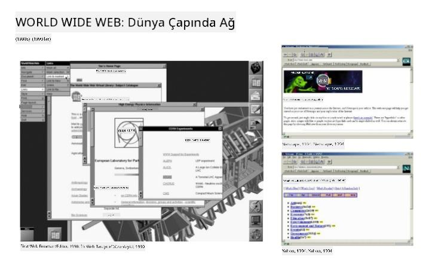
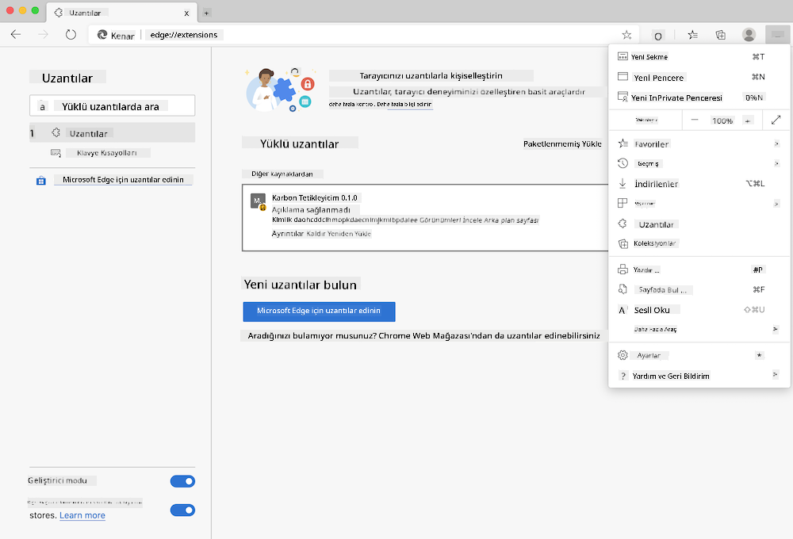
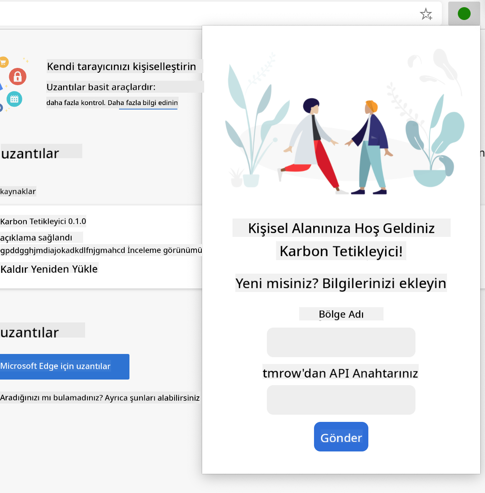
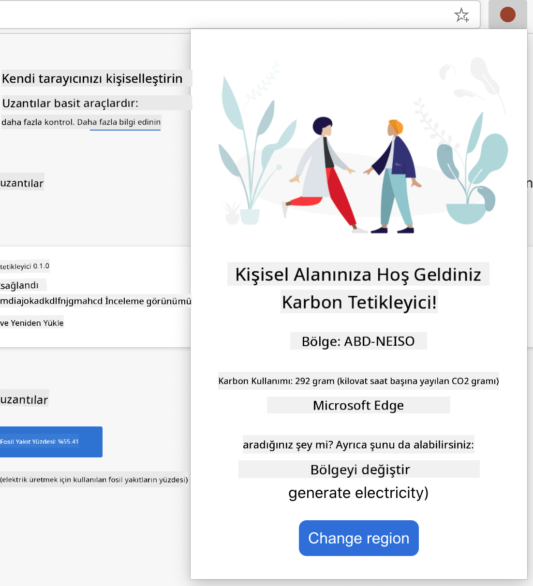

<!--
CO_OP_TRANSLATOR_METADATA:
{
  "original_hash": "0bb55e0b98600afab801eea115228873",
  "translation_date": "2025-08-25T23:41:44+00:00",
  "source_file": "5-browser-extension/1-about-browsers/README.md",
  "language_code": "tr"
}
-->
# Tarayıcı Eklentisi Projesi Bölüm 1: Tarayıcılar Hakkında Her Şey


> Sketchnote: [Wassim Chegham](https://dev.to/wassimchegham/ever-wondered-what-happens-when-you-type-in-a-url-in-an-address-bar-in-a-browser-3dob)

## Ders Öncesi Quiz

[Ders öncesi quiz](https://ff-quizzes.netlify.app/web/quiz/23)

### Giriş

Tarayıcı eklentileri, bir tarayıcıya ek işlevsellik kazandırır. Ancak bir eklenti oluşturmadan önce, tarayıcıların nasıl çalıştığını biraz öğrenmelisiniz.

### Tarayıcı Hakkında

Bu ders serisinde, Chrome, Firefox ve Edge tarayıcılarında çalışacak bir tarayıcı eklentisi oluşturmayı öğreneceksiniz. Bu bölümde, tarayıcıların nasıl çalıştığını keşfedecek ve tarayıcı eklentisinin temel unsurlarını oluşturacaksınız.

Peki, tarayıcı tam olarak nedir? Tarayıcı, bir son kullanıcının bir sunucudan içerik almasını ve bunu web sayfalarında görüntülemesini sağlayan bir yazılım uygulamasıdır.

✅ Küçük bir tarih bilgisi: İlk tarayıcı, 1990 yılında Sir Timothy Berners-Lee tarafından oluşturulan 'WorldWideWeb' idi.


> Bazı erken tarayıcılar, [Karen McGrane](https://www.slideshare.net/KMcGrane/week-4-ixd-history-personal-computing) aracılığıyla

Bir kullanıcı, genellikle `http` veya `https` adresi üzerinden Hypertext Transfer Protocol kullanarak bir URL (Uniform Resource Locator) adresiyle internete bağlandığında, tarayıcı bir web sunucusuyla iletişim kurar ve bir web sayfasını alır.

Bu noktada, tarayıcının render motoru, sayfayı kullanıcının cihazında (örneğin bir cep telefonu, masaüstü veya dizüstü bilgisayar) görüntüler.

Tarayıcılar ayrıca içeriği önbelleğe alabilir, böylece her seferinde sunucudan alınması gerekmez. Kullanıcının gezinme geçmişini kaydedebilir, 'çerezler' adı verilen ve kullanıcının etkinliklerini saklamak için kullanılan küçük veri parçalarını depolayabilir ve daha fazlasını yapabilir.

Tarayıcılar hakkında hatırlanması gereken çok önemli bir şey, hepsinin aynı olmadığıdır! Her tarayıcının güçlü ve zayıf yönleri vardır ve profesyonel bir web geliştiricisi, web sayfalarının farklı tarayıcılarda iyi performans göstermesini sağlamayı anlamalıdır. Bu, bir cep telefonunun küçük ekranları gibi küçük görüntüleme alanlarını ve çevrimdışı bir kullanıcıyı da içerebilir.

Kullanmanız gereken tarayıcıya bağlı olarak işinize yarayabilecek bir web sitesi [caniuse.com](https://www.caniuse.com). Web sayfaları oluştururken, caniuse'un desteklenen teknolojiler listesini kullanmak, kullanıcılarınızı en iyi şekilde desteklemenize yardımcı olabilir.

✅ Web sitenizin kullanıcı tabanında hangi tarayıcıların en popüler olduğunu nasıl anlayabilirsiniz? Analitiklerinizi kontrol edin - web geliştirme sürecinizin bir parçası olarak çeşitli analitik paketleri yükleyebilir ve hangi tarayıcıların en çok kullanıldığını öğrenebilirsiniz.

## Tarayıcı Eklentileri

Neden bir tarayıcı eklentisi oluşturmak isteyesiniz? Sık sık tekrarladığınız görevlere hızlı erişim sağlamak için tarayıcınıza ekleyebileceğiniz kullanışlı bir araçtır. Örneğin, etkileşimde bulunduğunuz çeşitli web sayfalarındaki renkleri kontrol etmeniz gerekiyorsa, bir renk seçici tarayıcı eklentisi yükleyebilirsiniz. Şifreleri hatırlamakta zorlanıyorsanız, bir şifre yönetim eklentisi kullanabilirsiniz.

Tarayıcı eklentileri geliştirmek de eğlencelidir. Genellikle belirli bir dizi görevi iyi bir şekilde yerine getirirler.

✅ En sevdiğiniz tarayıcı eklentileri nelerdir? Hangi görevleri yerine getiriyorlar?

### Eklentileri Yükleme

Oluşturmaya başlamadan önce, bir tarayıcı eklentisi oluşturma ve dağıtma sürecine bir göz atın. Her tarayıcı bu görevi biraz farklı şekilde yönetirken, süreç Chrome ve Firefox'ta Edge'deki şu örneğe benzer:



> Not: Geliştirici modunu açtığınızdan ve diğer mağazalardan eklentilere izin verdiğinizden emin olun.

Özetle, süreç şu şekilde olacaktır:

- `npm run build` kullanarak eklentinizi oluşturun 
- tarayıcıda sağ üstteki "Ayarlar ve daha fazlası" düğmesini (`...` simgesi) kullanarak uzantılar paneline gidin
- yeni bir yükleme ise, `load unpacked` seçeneğini seçerek yeni bir eklentiyi oluşturma klasöründen yükleyin (bizim durumumuzda `/dist`) 
- veya, zaten yüklü olan eklentiyi yeniden yüklemek için `reload` seçeneğine tıklayın

✅ Bu talimatlar, kendi oluşturduğunuz eklentiler için geçerlidir; her tarayıcıya bağlı tarayıcı eklenti mağazasında yayınlanmış eklentileri yüklemek için, bu [mağazalara](https://microsoftedge.microsoft.com/addons/Microsoft-Edge-Extensions-Home) gidip istediğiniz eklentiyi yüklemelisiniz.

### Başlayın

Bölgenizin karbon ayak izini gösteren, enerji kullanımını ve enerji kaynağını görüntüleyen bir tarayıcı eklentisi oluşturacaksınız. Eklenti, CO2 Signal'in API'sine erişebilmeniz için bir API anahtarı toplayan bir form içerecek.

**İhtiyacınız olanlar:**

- [bir API anahtarı](https://www.co2signal.com/); bu sayfadaki kutuya e-posta adresinizi girin ve bir anahtar gönderilecektir
- [bölgenizin kodu](http://api.electricitymap.org/v3/zones), [Electricity Map](https://www.electricitymap.org/map) ile eşleşen (örneğin, Boston'da 'US-NEISO' kullanıyorum)
- [başlangıç kodu](../../../../5-browser-extension/start). `start` klasörünü indirin; bu klasördeki kodu tamamlayacaksınız.
- [NPM](https://www.npmjs.com) - NPM bir paket yönetim aracıdır; yerel olarak yükleyin ve `package.json` dosyanızda listelenen paketler web varlıklarınız için yüklenecektir

✅ Paket yönetimi hakkında daha fazla bilgi edinmek için bu [harika Learn modülüne](https://docs.microsoft.com/learn/modules/create-nodejs-project-dependencies/?WT.mc_id=academic-77807-sagibbon) göz atın.

Kod tabanını incelemek için bir dakikanızı ayırın:

dist
    -|manifest.json (varsayılan ayarlar burada)
    -|index.html (ön uç HTML işaretlemesi burada)
    -|background.js (arka plan JS burada)
    -|main.js (oluşturulmuş JS)
src
    -|index.js (JS kodunuz buraya gider)

✅ API anahtarınızı ve Bölge kodunuzu hazır bulundurduğunuzdan emin olun, bunları gelecekte kullanmak üzere bir notta saklayın.

### Eklenti için HTML Oluşturma

Bu eklentinin iki görünümü vardır. Biri API anahtarını ve bölge kodunu toplamak için:



Ve diğeri bölgenin karbon kullanımını görüntülemek için:



Formu oluşturup CSS ile stil vererek başlayalım.

`/dist` klasöründe, bir form ve bir sonuç alanı oluşturacaksınız. `index.html` dosyasında, belirtilen form alanını doldurun:

```HTML
<form class="form-data" autocomplete="on">
	<div>
		<h2>New? Add your Information</h2>
	</div>
	<div>
		<label for="region">Region Name</label>
		<input type="text" id="region" required class="region-name" />
	</div>
	<div>
		<label for="api">Your API Key from tmrow</label>
		<input type="text" id="api" required class="api-key" />
	</div>
	<button class="search-btn">Submit</button>
</form>	
```
Bu, kaydedilen bilgilerin girileceği ve yerel depolamaya kaydedileceği formdur.

Son olarak, sonuç alanını oluşturun; son form etiketinin altına birkaç div ekleyin:

```HTML
<div class="result">
	<div class="loading">loading...</div>
	<div class="errors"></div>
	<div class="data"></div>
	<div class="result-container">
		<p><strong>Region: </strong><span class="my-region"></span></p>
		<p><strong>Carbon Usage: </strong><span class="carbon-usage"></span></p>
		<p><strong>Fossil Fuel Percentage: </strong><span class="fossil-fuel"></span></p>
	</div>
	<button class="clear-btn">Change region</button>
</div>
```
Bu noktada, bir oluşturma işlemi deneyebilirsiniz. Bu eklentinin paket bağımlılıklarını yüklediğinizden emin olun:

```
npm install
```

Bu komut, npm'yi (Node Package Manager) kullanarak eklentinizin oluşturma süreci için webpack'i yükleyecektir. Bu işlemin çıktısını `/dist/main.js` dosyasında görebilirsiniz - kodun paketlendiğini göreceksiniz.

Şimdilik, eklenti oluşturulmalı ve Edge'e bir eklenti olarak dağıtırsanız, düzgün bir şekilde görüntülenen bir form göreceksiniz.

Tebrikler, bir tarayıcı eklentisi oluşturmaya yönelik ilk adımları attınız. Sonraki derslerde, eklentiyi daha işlevsel ve kullanışlı hale getireceksiniz.

---

## 🚀 Zorluk

Bir tarayıcı eklenti mağazasına göz atın ve tarayıcınıza bir eklenti yükleyin. Dosyalarını ilginç şekillerde inceleyebilirsiniz. Neler keşfediyorsunuz?

## Ders Sonrası Quiz

[Ders sonrası quiz](https://ff-quizzes.netlify.app/web/quiz/24)

## Gözden Geçirme ve Kendi Kendine Çalışma

Bu derste web tarayıcısının tarihçesi hakkında biraz bilgi edindiniz; World Wide Web'in mucitlerinin kullanımını nasıl hayal ettiklerini öğrenmek için bu fırsatı değerlendirin ve tarihçesi hakkında daha fazla okuyun. Faydalı siteler şunlardır:

[Web Tarayıcılarının Tarihi](https://www.mozilla.org/firefox/browsers/browser-history/)

[Web'in Tarihi](https://webfoundation.org/about/vision/history-of-the-web/)

[Tim Berners-Lee ile bir röportaj](https://www.theguardian.com/technology/2019/mar/12/tim-berners-lee-on-30-years-of-the-web-if-we-dream-a-little-we-can-get-the-web-we-want)

## Ödev 

[Eklentinizi yeniden tasarlayın](assignment.md)

**Feragatname**:  
Bu belge, AI çeviri hizmeti [Co-op Translator](https://github.com/Azure/co-op-translator) kullanılarak çevrilmiştir. Doğruluk için çaba göstersek de, otomatik çevirilerin hata veya yanlışlık içerebileceğini lütfen unutmayın. Belgenin orijinal dili, yetkili kaynak olarak kabul edilmelidir. Kritik bilgiler için profesyonel insan çevirisi önerilir. Bu çevirinin kullanımından kaynaklanan yanlış anlamalar veya yanlış yorumlamalar için sorumluluk kabul etmiyoruz.