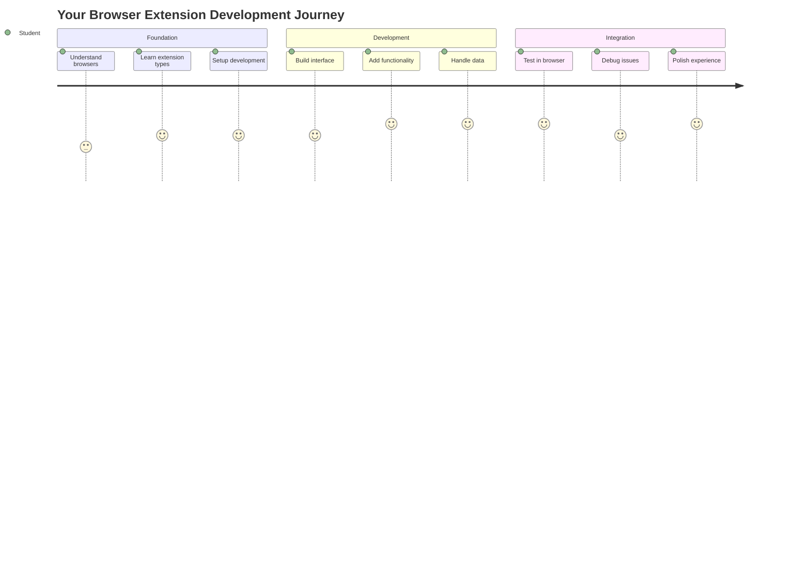
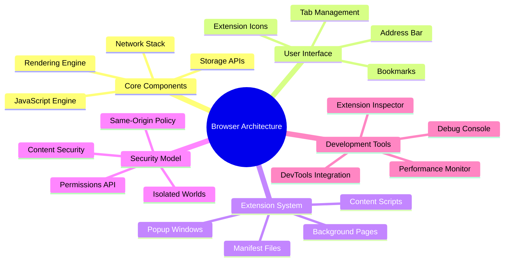
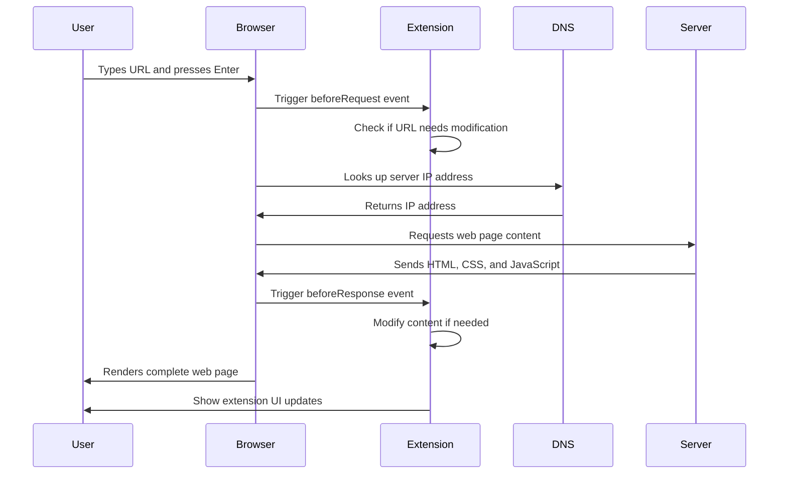
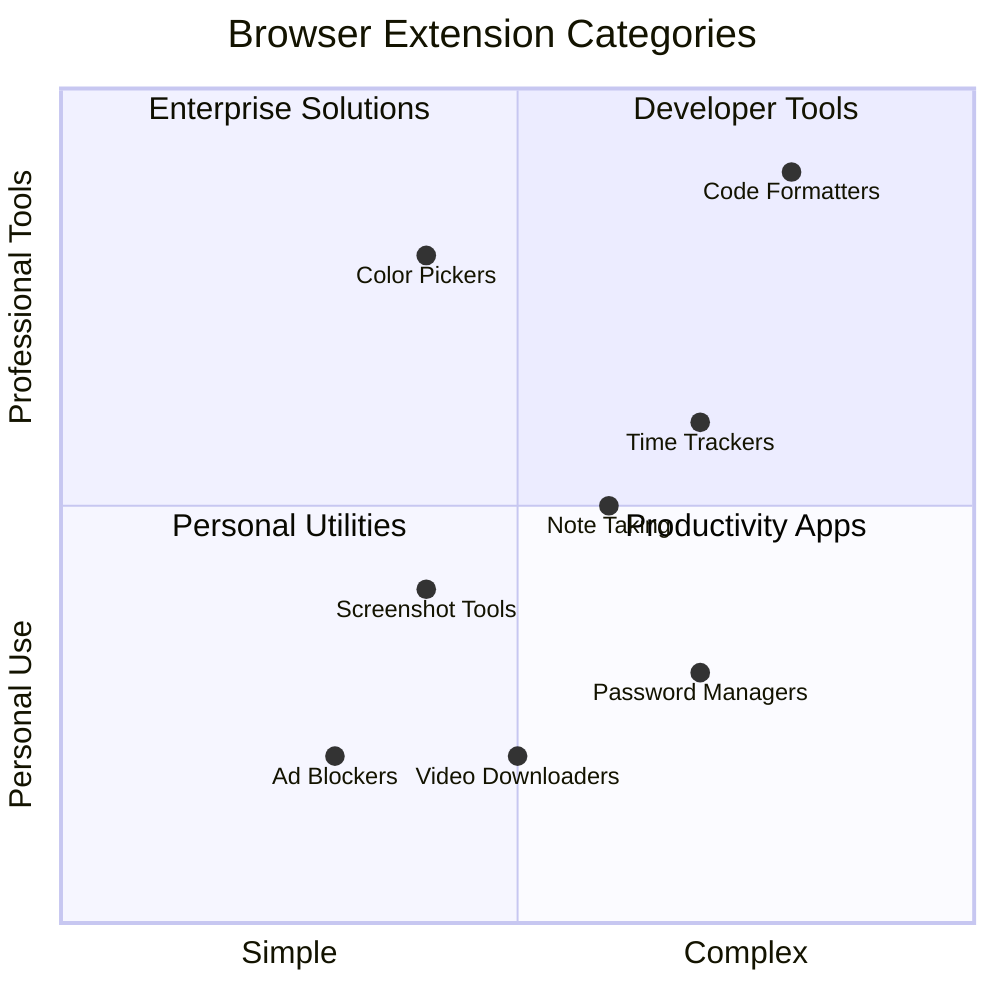
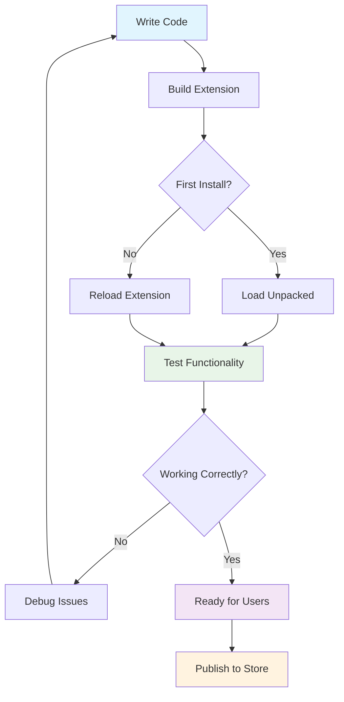
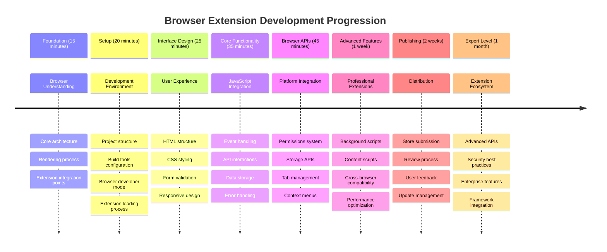

<!--
CO_OP_TRANSLATOR_METADATA:
{
  "original_hash": "00aa85715e1efd4930c17a23e3012e69",
  "translation_date": "2025-11-04T01:08:12+00:00",
  "source_file": "5-browser-extension/1-about-browsers/README.md",
  "language_code": "tr"
}
-->
# Tarayıcı Uzantısı Projesi Bölüm 1: Tarayıcılar Hakkında Her Şey




> Sketchnote: [Wassim Chegham](https://dev.to/wassimchegham/ever-wondered-what-happens-when-you-type-in-a-url-in-an-address-bar-in-a-browser-3dob)

## Ders Öncesi Test

[Ders öncesi test](https://ff-quizzes.netlify.app/web/quiz/23)

### Giriş

Tarayıcı uzantıları, web tarama deneyiminizi geliştiren mini uygulamalardır. Tim Berners-Lee'nin etkileşimli bir web vizyonu gibi, uzantılar tarayıcının yeteneklerini basit belge görüntülemenin ötesine taşır. Hesaplarınızı güvende tutan şifre yöneticilerinden, tasarımcıların mükemmel renk tonlarını yakalamasına yardımcı olan renk seçicilere kadar uzantılar günlük tarama zorluklarını çözer.

İlk uzantınızı oluşturmadan önce, tarayıcıların nasıl çalıştığını anlamamız gerekiyor. Alexander Graham Bell'in telefonu icat etmeden önce ses iletimini anlaması gerektiği gibi, tarayıcı temellerini bilmek, mevcut tarayıcı sistemleriyle sorunsuz bir şekilde entegre olan uzantılar oluşturmanıza yardımcı olacaktır.

Bu dersin sonunda, tarayıcı mimarisini anlayacak ve ilk uzantınızı oluşturmaya başlamış olacaksınız.



## Web Tarayıcılarını Anlamak

Bir web tarayıcı, esasen sofistike bir belge yorumlayıcıdır. Adres çubuğuna "google.com" yazdığınızda, tarayıcı dünya çapındaki sunuculardan içerik talep etmek, ardından bu kodu gördüğünüz etkileşimli web sayfalarına dönüştürmek için karmaşık bir dizi işlem gerçekleştirir.

Bu süreç, Tim Berners-Lee'nin 1990 yılında herkesin hiper bağlantılı belgelere erişebilmesi için tasarladığı ilk web tarayıcısı WorldWideWeb'in tasarımını yansıtır.

✅ **Biraz tarih**: İlk tarayıcı 'WorldWideWeb' olarak adlandırıldı ve 1990 yılında Sir Timothy Berners-Lee tarafından oluşturuldu.


> Bazı erken tarayıcılar, [Karen McGrane](https://www.slideshare.net/KMcGrane/week-4-ixd-history-personal-computing) aracılığıyla

### Tarayıcılar Web İçeriğini Nasıl İşler?

Bir URL girip bir web sayfası görmeniz arasındaki süreç, saniyeler içinde gerçekleşen birkaç koordineli adımı içerir:



**Bu süreç şunları başarır:**
- **Çevirir**: İnsan tarafından okunabilir URL'yi DNS araması yoluyla bir sunucu IP adresine
- **Kurulur**: HTTP veya HTTPS protokolleri kullanarak web sunucusuyla güvenli bir bağlantı
- **Talep eder**: Sunucudan belirli web sayfası içeriğini
- **Alır**: Sunucudan HTML işaretlemesi, CSS stilleri ve JavaScript kodu
- **İşler**: Tüm içeriği gördüğünüz etkileşimli web sayfasına dönüştürür

### Tarayıcı Temel Özellikleri

Modern tarayıcılar, uzantı geliştiricilerinin kullanabileceği birçok özellik sunar:

| Özellik | Amaç | Uzantı Fırsatları |
|---------|---------|------------------------|
| **İşleme Motoru** | HTML, CSS ve JavaScript'i görüntüler | İçerik değişikliği, stil enjeksiyonu |
| **JavaScript Motoru** | JavaScript kodunu çalıştırır | Özel scriptler, API etkileşimleri |
| **Yerel Depolama** | Verileri yerel olarak kaydeder | Kullanıcı tercihleri, önbellek verileri |
| **Ağ Yığını** | Web isteklerini işler | İstek izleme, veri analizi |
| **Güvenlik Modeli** | Kullanıcıları kötü niyetli içerikten korur | İçerik filtreleme, güvenlik geliştirmeleri |

**Bu özellikleri anlamak size şunları sağlar:**
- **Belirleme**: Uzantınızın en fazla değer katabileceği yerleri bulma
- **Seçim**: Uzantınızın işlevselliği için doğru tarayıcı API'lerini seçme
- **Tasarım**: Tarayıcı sistemleriyle verimli çalışan uzantılar oluşturma
- **Güvence**: Uzantınızın tarayıcı güvenlik en iyi uygulamalarına uygun olmasını sağlama

### Tarayıcılar Arası Geliştirme Düşünceleri

Farklı tarayıcılar standartları hafif farklılıklarla uygular, tıpkı farklı programlama dillerinin aynı algoritmayı farklı şekilde ele alması gibi. Chrome, Firefox ve Safari'nin her biri, uzantı geliştirme sırasında geliştiricilerin dikkate alması gereken benzersiz özelliklere sahiptir.

> 💡 **İpucu**: [caniuse.com](https://www.caniuse.com) kullanarak farklı tarayıcılarda hangi web teknolojilerinin desteklendiğini kontrol edin. Bu, uzantınızın özelliklerini planlarken çok değerlidir!

**Uzantı geliştirme için önemli düşünceler:**
- **Test edin**: Uzantınızı Chrome, Firefox ve Edge tarayıcılarında test edin
- **Uyarlayın**: Farklı tarayıcı uzantı API'lerine ve manifest formatlarına uyum sağlayın
- **Ele alın**: Farklı performans özelliklerini ve sınırlamaları yönetin
- **Sağlayın**: Tarayıcıya özgü özellikler için alternatifler sunun

✅ **Analitik İçgörü**: Web geliştirme projelerinize analitik paketler kurarak kullanıcılarınızın hangi tarayıcıları tercih ettiğini belirleyebilirsiniz. Bu veriler, öncelikli olarak hangi tarayıcıları desteklemeniz gerektiğini belirlemenize yardımcı olur.

## Tarayıcı Uzantılarını Anlamak

Tarayıcı uzantıları, doğrudan tarayıcı arayüzüne işlevsellik ekleyerek yaygın web tarama zorluklarını çözer. Ayrı uygulamalar veya karmaşık iş akışları gerektirmek yerine, uzantılar araçlara ve özelliklere anında erişim sağlar.

Bu konsept, erken bilgisayar öncüleri gibi Douglas Engelbart'ın teknolojiyi kullanarak insan yeteneklerini artırmayı hayal ettiği şekilde, tarayıcınızın temel işlevselliğini artırır.



**Popüler uzantı kategorileri ve faydaları:**
- **Verimlilik Araçları**: Görev yöneticileri, not alma uygulamaları ve zaman takipçileri, düzenli kalmanıza yardımcı olur
- **Güvenlik Geliştirmeleri**: Şifre yöneticileri, reklam engelleyiciler ve gizlilik araçları, verilerinizi korur
- **Geliştirici Araçları**: Kod biçimlendiriciler, renk seçiciler ve hata ayıklama araçları, geliştirmeyi kolaylaştırır
- **İçerik Geliştirme**: Okuma modları, video indiriciler ve ekran görüntüsü araçları, web deneyiminizi iyileştirir

✅ **Düşünme Sorusu**: En sevdiğiniz tarayıcı uzantıları nelerdir? Hangi özel görevleri yerine getiriyorlar ve tarama deneyiminizi nasıl iyileştiriyorlar?

### 🔄 **Pedagojik Kontrol Noktası**
**Tarayıcı Mimarisini Anlama**: Uzantı geliştirmeye geçmeden önce şunları yapabildiğinizden emin olun:
- ✅ Tarayıcıların web isteklerini nasıl işlediğini ve içerik oluşturduğunu açıklayın
- ✅ Tarayıcı mimarisinin ana bileşenlerini belirleyin
- ✅ Uzantıların tarayıcı işlevselliğiyle nasıl entegre olduğunu anlayın
- ✅ Kullanıcıları koruyan güvenlik modelini tanıyın

**Hızlı Kendini Test Etme**: Bir URL yazmaktan bir web sayfası görmeye kadar olan yolu izleyebilir misiniz?
1. **DNS araması** URL'yi IP adresine çevirir
2. **HTTP isteği** sunucudan içerik alır
3. **Ayrıştırma** HTML, CSS ve JavaScript'i işler
4. **İşleme** nihai web sayfasını görüntüler
5. **Uzantılar** içeriği birden fazla adımda değiştirebilir

## Uzantıları Yükleme ve Yönetme

Uzantı yükleme sürecini anlamak, insanların uzantınızı yüklediğinde yaşayacakları kullanıcı deneyimini tahmin etmenize yardımcı olur. Yükleme süreci modern tarayıcılar arasında standartlaştırılmıştır, arayüz tasarımında küçük farklılıklar vardır.


> **Önemli**: Kendi uzantılarınızı test ederken geliştirici modunu açmayı ve diğer mağazalardan uzantılara izin vermeyi unutmayın.

### Geliştirme Uzantısı Yükleme Süreci

Kendi uzantılarınızı geliştirirken ve test ederken şu iş akışını izleyin:



```bash
# Step 1: Build your extension
npm run build
```

**Bu komutun başardıkları:**
- **Kaynak kodunuzu** tarayıcıya hazır dosyalara derler
- **JavaScript modüllerini** optimize edilmiş paketlere dönüştürür
- **Son uzantı dosyalarını** `/dist` klasöründe oluşturur
- **Uzantınızı** yükleme ve test için hazırlar

**Adım 2: Tarayıcı Uzantılarına Git**
1. **Tarayıcınızın** uzantı yönetim sayfasını açın
2. **Sağ üstteki** "Ayarlar ve daha fazlası" düğmesine (`...` simgesi) tıklayın
3. **Açılır menüden** "Uzantılar" seçeneğini seçin

**Adım 3: Uzantınızı Yükleyin**
- **Yeni yüklemeler için**: `load unpacked` seçeneğini seçin ve `/dist` klasörünüzü seçin
- **Güncellemeler için**: Zaten yüklenmiş uzantınızın yanındaki `reload` düğmesine tıklayın
- **Test için**: Ek hata ayıklama özelliklerine erişmek için "Geliştirici modu"nu etkinleştirin

### Üretim Uzantısı Yükleme

> ✅ **Not**: Bu geliştirme talimatları, yalnızca kendiniz oluşturduğunuz uzantılar içindir. Yayınlanmış uzantıları yüklemek için [Microsoft Edge Eklentiler mağazası](https://microsoftedge.microsoft.com/addons/Microsoft-Edge-Extensions-Home) gibi resmi tarayıcı uzantı mağazalarını ziyaret edin.

**Farkı anlamak:**
- **Geliştirme yüklemeleri**, geliştirme sırasında yayınlanmamış uzantıları test etmenizi sağlar
- **Mağaza yüklemeleri**, otomatik güncellemelerle birlikte onaylanmış, yayınlanmış uzantılar sağlar
- **Sideloading**, resmi mağazaların dışından uzantı yüklemesine izin verir (geliştirici modu gerektirir)

## Karbon Ayak İzi Uzantınızı Oluşturma

Bölgenizin enerji kullanımının karbon ayak izini gösteren bir tarayıcı uzantısı oluşturacağız. Bu proje, temel uzantı geliştirme kavramlarını gösterirken çevresel farkındalık için pratik bir araç oluşturur.

Bu yaklaşım, John Dewey'nin eğitim teorilerinden bu yana etkili olduğu kanıtlanmış "yaparak öğrenme" ilkesini takip eder - teknik becerileri anlamlı gerçek dünya uygulamalarıyla birleştirir.

### Proje Gereksinimleri

Geliştirmeye başlamadan önce, gerekli kaynakları ve bağımlılıkları toplayalım:

**Gerekli API Erişimi:**
- **[CO2 Signal API anahtarı](https://www.co2signal.com/)**: Ücretsiz API anahtarınızı almak için e-posta adresinizi girin
- **[Bölge kodu](http://api.electricitymap.org/v3/zones)**: [Electricity Map](https://www.electricitymap.org/map) kullanarak bölge kodunuzu bulun (örneğin, Boston 'US-NEISO' kullanır)

**Geliştirme Araçları:**
- **[Node.js ve NPM](https://www.npmjs.com)**: Proje bağımlılıklarını yüklemek için paket yönetim aracı
- **[Başlangıç kodu](../../../../5-browser-extension/start)**: Geliştirmeye başlamak için `start` klasörünü indirin

✅ **Daha Fazla Bilgi Edinin**: Paket yönetimi becerilerinizi bu [kapsamlı öğrenme modülü](https://docs.microsoft.com/learn/modules/create-nodejs-project-dependencies/?WT.mc_id=academic-77807-sagibbon) ile geliştirin

### Proje Yapısını Anlamak

Proje yapısını anlamak, geliştirme çalışmalarını verimli bir şekilde organize etmeye yardımcı olur. İskenderiye Kütüphanesi'nin kolay bilgi erişimi için organize edilmesi gibi, iyi yapılandırılmış bir kod tabanı geliştirmeyi daha verimli hale getirir:

```
project-root/
├── dist/                    # Built extension files
│   ├── manifest.json        # Extension configuration
│   ├── index.html           # User interface markup
│   ├── background.js        # Background script functionality
│   └── main.js              # Compiled JavaScript bundle
├── src/                     # Source development files
│   └── index.js             # Your main JavaScript code
├── package.json             # Project dependencies and scripts
└── webpack.config.js        # Build configuration
```

**Her dosyanın başardıklarını açıklamak:**
- **`manifest.json`**: Uzantı meta verilerini, izinleri ve giriş noktalarını **tanımlar**
- **`index.html`**: Kullanıcıların uzantınıza tıkladığında gördüğü kullanıcı arayüzünü **oluşturur**
- **`background.js`**: Arka plan görevlerini ve tarayıcı olay dinleyicilerini **yönetir**
- **`main.js`**: Derleme işleminden sonra son paketlenmiş JavaScript'i **içerir**
- **`src/index.js`**: Derlenip `main.js` haline gelen ana geliştirme kodunuzu **barındırır**

> 💡 **Organizasyon İpucu**: API anahtarınızı ve bölge kodunuzu güvenli bir notta saklayın, böylece geliştirme sırasında kolayca erişebilirsiniz. Bu değerleri uzantınızın işlevselliğini test etmek için kullanmanız gerekecek.

✅ **Güvenlik Notu**: API anahtarlarını veya hassas kimlik bilgilerini kod deposuna asla yüklemeyin. Bunları güvenli bir şekilde nasıl yöneteceğinizi sonraki adımlarda göstereceğiz.

## Uzantı Arayüzünü Oluşturma

Şimdi kullanıcı arayüzü bileşenlerini oluşturacağız. Uzantı, ilk kurulum için bir yapılandırma ekranı ve veri görüntüleme için bir sonuç ekranı olmak üzere iki ekranlı bir yaklaşım kullanır.

Bu, bilgi ve seçenekleri mantıklı bir sırayla ortaya çıkararak kullanıcıları bunaltmaktan kaçınmak için bilgisayarın ilk günlerinden beri kullanılan ilerleyici açıklama ilkesini takip eder.

### Uzantı Görünümleri Genel Bakış

**Kurulum Görünümü** - İlk kez kullanıcı yapılandırması:


**Sonuç Görünümü** - Karbon ayak izi veri görüntüleme:


### Yapılandırma Formunu Oluşturma

Kurulum formu, ilk kullanım sırasında kullanıcı yapılandırma verilerini toplar. Bir kez yapılandırıldığında, bu bilgi gelecekteki oturumlar için tarayıcı depolamasında kalır.

`/dist/index.html` dosyasına şu form yapısını ekleyin:

```html
<form class="form-data" autocomplete="on">
    <div>
        <h2>New? Add your Information</h2>
    </div>
    <div>
        <label for="region">Region Name</label>
        <input type="text" id="region" required class="region-name" />
    </div>
    <div>
        <label for="api">Your API Key from tmrow</label>
        <input type="text" id="api" required class="api-key" />
    </div>
    <button class="search-btn">Submit</button>
</form>
```

**Bu formun başardıkları:**
- **Anlamlı** bir form yapısı oluşturur, doğru etiketler ve giriş ilişkileri sağlar
- **Tarayıcı otomatik tamamlama** işlevselliğini kullanıcı deneyimini iyileştirmek için etkinleştirir
- **Her iki alanın** doldurulmasını `required` özelliği ile zorunlu kılar
- **Girdileri** kolay stil ve JavaScript hedefleme için açıklayıcı sınıf adlarıyla düzenler
- **İlk kez uzantıyı kuran kullanıcılar için** net talimatlar sağlar

### Sonuç Görüntüsünü Oluşturma

Son olarak, karbon ayak izi verilerini gösterecek sonuç alanını oluşturun. Bu HTML'yi formun altına ekleyin:

```html
<div class="result">
    <div class="loading">loading...</div>
    <div class="errors"></div>
    <div class="data"></div>
    <div class="result-container">
        <p><strong>Region: </strong><span class="my-region"></span></p>
        <p><strong>Carbon Usage: </strong><span class="carbon-usage"></span></p>
        <p><strong>Fossil Fuel Percentage: </strong><span class="fossil-fuel"></span></p>
    </div>
    <button class="clear-btn">Change region</button>
</div>
```

**Bu yapının sağladıkları:**
- **`loading`**: API verileri alınırken bir yükleme mesajı **gösterir**
- **`errors`**: API çağrıları başarısız olduğunda veya veriler geçersiz olduğunda hata mesajlarını **gösterir**
- **`data`**: Geliştirme sırasında hata ayıklama için ham verileri **tutar**
- **`result-container`**: Kullanıcılara biçimlendirilmiş karbon ayak izi bilgilerini **sunar**
- **`clear-btn`**: Kullanıcıların bölgelerini değiştirmesine ve uzantıyı yeniden yapılandırmasına **izin verir**

### Derleme Sürecini Ayarlama

Şimdi proje bağımlılıklarını yükleyelim ve derleme sürecini test edelim:

```bash
npm install
```

**Bu yükleme sürecinin başardıkları:**
- **Webpack ve diğer geliştirme bağımlılıklarını** `package.json` dosyasında belirtilen şekilde indirir
- **Modern JavaScript'i derlemek için** yapı araç zincirini yapılandırır
- **Uzantı oluşturma ve test için** geliştirme ortamını hazırlar

1. **Çalıştır** kodunuzu derlemek için derleme komutunu çalıştırın  
2. **Yükle** uzantıyı geliştirici modunu kullanarak tarayıcınıza yükleyin  
3. **Doğrula** formun doğru şekilde görüntülendiğini ve profesyonel göründüğünü  
4. **Kontrol et** tüm form öğelerinin düzgün hizalandığını ve işlevsel olduğunu  

**Başardıklarınız:**  
- Uzantınız için temel HTML yapısını **oluşturdunuz**  
- Hem yapılandırma hem de sonuç arayüzlerini doğru semantik işaretlemeyle **oluşturdunuz**  
- Endüstri standart araçları kullanarak modern bir geliştirme iş akışı **kurdunuz**  
- Etkileşimli JavaScript işlevselliği eklemek için temel **hazırladınız**  

### 🔄 **Pedagojik Kontrol Noktası**  
**Uzantı Geliştirme İlerlemesi**: Devam etmeden önce anlayışınızı doğrulayın:  
- ✅ Proje yapısındaki her dosyanın amacını açıklayabilir misiniz?  
- ✅ Derleme sürecinin kaynak kodunuzu nasıl dönüştürdüğünü anlıyor musunuz?  
- ✅ Neden yapılandırma ve sonuçları farklı arayüz bölümlerine ayırıyoruz?  
- ✅ Form yapısı hem kullanılabilirlik hem de erişilebilirlik açısından nasıl destek sağlıyor?  

**Geliştirme İş Akışı Anlayışı**: Artık şunları yapabiliyor olmalısınız:  
1. Uzantı arayüzünüz için HTML ve CSS'yi **değiştirin**  
2. Değişikliklerinizi derlemek için derleme komutunu **çalıştırın**  
3. Güncellemeleri test etmek için uzantıyı tarayıcınızda **yeniden yükleyin**  
4. Tarayıcı geliştirici araçlarını kullanarak sorunları **hata ayıklayın**  

Tarayıcı uzantısı geliştirme sürecinin ilk aşamasını tamamladınız. Wright kardeşlerin uçuşu başarmadan önce aerodinamiği anlamaları gerektiği gibi, bu temel kavramları anlamak, bir sonraki derste daha karmaşık etkileşimli özellikler oluşturmanıza hazırlık sağlar.  

## GitHub Copilot Agent Challenge 🚀  

Agent modunu kullanarak aşağıdaki meydan okumayı tamamlayın:  

**Açıklama:** Tarayıcı uzantısını, API anahtarları ve bölge kodları girerken kullanıcı deneyimini iyileştirmek için form doğrulama ve kullanıcı geri bildirimi özellikleri ekleyerek geliştirin.  

**İstek:** API anahtarı alanının en az 20 karakter içerip içermediğini ve bölge kodunun doğru formatı (örneğin 'US-NEISO') takip edip etmediğini kontrol eden JavaScript doğrulama işlevleri oluşturun. Geçerli girişler için giriş kenar renklerini yeşil, geçersiz olanlar için kırmızıya değiştirerek görsel geri bildirim ekleyin. Ayrıca güvenlik amacıyla API anahtarını göster/gizle özelliği ekleyin.  

[Agent modunu](https://code.visualstudio.com/blogs/2025/02/24/introducing-copilot-agent-mode) burada daha fazla öğrenin.  

## 🚀 Meydan Okuma  

Bir tarayıcı uzantısı mağazasına göz atın ve tarayıcınıza bir uzantı yükleyin. Dosyalarını ilginç şekillerde inceleyebilirsiniz. Neler keşfediyorsunuz?  

## Ders Sonrası Quiz  

[Ders sonrası quiz](https://ff-quizzes.netlify.app/web/quiz/24)  

## Gözden Geçirme ve Kendi Kendine Çalışma  

Bu derste web tarayıcısının tarihi hakkında biraz bilgi edindiniz; bu fırsatı değerlendirerek Dünya Çapında Ağ'ın mucitlerinin kullanımını nasıl hayal ettiklerini öğrenmek için tarihini daha fazla okuyun. Faydalı siteler:  

[Web Tarayıcılarının Tarihi](https://www.mozilla.org/firefox/browsers/browser-history/)  

[Web'in Tarihi](https://webfoundation.org/about/vision/history-of-the-web/)  

[Tim Berners-Lee ile bir röportaj](https://www.theguardian.com/technology/2019/mar/12/tim-berners-lee-on-30-years-of-the-web-if-we-dream-a-little-we-can-get-the-web-we-want)  

### ⚡ **Sonraki 5 Dakikada Yapabilecekleriniz**  
- [ ] Chrome/Edge uzantıları sayfasını açın (chrome://extensions) ve yüklediğiniz uzantıları keşfedin  
- [ ] Bir web sayfası yüklerken tarayıcınızın Geliştirici Araçları Ağ sekmesine bakın  
- [ ] Sayfa kaynağını görüntülemeyi deneyin (Ctrl+U) ve HTML yapısını inceleyin  
- [ ] Herhangi bir web sayfası öğesini inceleyin ve CSS'sini Geliştirici Araçları'nda değiştirin  

### 🎯 **Bu Saatte Başarabilecekleriniz**  
- [ ] Ders sonrası quiz'i tamamlayın ve tarayıcı temellerini anlayın  
- [ ] Bir tarayıcı uzantısı için temel bir manifest.json dosyası oluşturun  
- [ ] Bir açılır pencere gösteren basit bir "Merhaba Dünya" uzantısı oluşturun  
- [ ] Uzantınızı geliştirici modunda yüklemeyi test edin  
- [ ] Hedef tarayıcınızın uzantı belgelerini keşfedin  

### 📅 **Haftalık Uzantı Geliştirme Yolculuğunuz**  
- [ ] Gerçek bir fayda sağlayan işlevsel bir tarayıcı uzantısı tamamlayın  
- [ ] İçerik betikleri, arka plan betikleri ve açılır pencere etkileşimleri hakkında bilgi edinin  
- [ ] Depolama, sekmeler ve mesajlaşma gibi tarayıcı API'lerini öğrenin  
- [ ] Uzantınız için kullanıcı dostu arayüzler tasarlayın  
- [ ] Uzantınızı farklı web siteleri ve senaryolar üzerinde test edin  
- [ ] Uzantınızı tarayıcının uzantı mağazasına yayınlayın  

### 🌟 **Aylık Tarayıcı Geliştirme**  
- [ ] Farklı kullanıcı sorunlarını çözen birden fazla uzantı oluşturun  
- [ ] Gelişmiş tarayıcı API'leri ve güvenlik en iyi uygulamalarını öğrenin  
- [ ] Açık kaynak tarayıcı uzantısı projelerine katkıda bulunun  
- [ ] Tarayıcılar arası uyumluluk ve aşamalı geliştirme konusunda uzmanlaşın  
- [ ] Başkaları için uzantı geliştirme araçları ve şablonlar oluşturun  
- [ ] Diğer geliştiricilere yardımcı olan bir tarayıcı uzantısı uzmanı olun  

## 🎯 Tarayıcı Uzantısı Uzmanlık Zaman Çizelgeniz  


  
### 🛠️ Uzantı Geliştirme Araç Seti Özeti  

Bu dersi tamamladıktan sonra artık şunlara sahipsiniz:  
- **Tarayıcı Mimarisi Bilgisi**: İşleme motorları, güvenlik modelleri ve uzantı entegrasyonu hakkında bilgi  
- **Geliştirme Ortamı**: Webpack, NPM ve hata ayıklama yetenekleriyle modern araç zinciri  
- **UI/UX Temeli**: Aşamalı açıklama desenleriyle semantik HTML yapısı  
- **Güvenlik Bilinci**: Tarayıcı izinleri ve güvenli geliştirme uygulamaları hakkında bilgi  
- **Tarayıcılar Arası Kavramlar**: Uyumluluk hususları ve test yaklaşımları bilgisi  
- **API Entegrasyonu**: Harici veri kaynaklarıyla çalışma temeli  
- **Profesyonel İş Akışı**: Endüstri standartlarında geliştirme ve test prosedürleri  

**Gerçek Dünya Uygulamaları**: Bu beceriler doğrudan şunlara uygulanabilir:  
- **Web Geliştirme**: Tek sayfa uygulamaları ve aşamalı web uygulamaları  
- **Masaüstü Uygulamaları**: Electron ve web tabanlı masaüstü yazılımları  
- **Mobil Geliştirme**: Hibrit uygulamalar ve web tabanlı mobil çözümler  
- **Kurumsal Araçlar**: İç verimlilik uygulamaları ve iş akışı otomasyonu  
- **Açık Kaynak**: Tarayıcı uzantısı projelerine ve web standartlarına katkıda bulunma  

**Bir Sonraki Seviye**: Artık etkileşimli işlevsellik eklemeye, tarayıcı API'leriyle çalışmaya ve gerçek kullanıcı sorunlarını çözen uzantılar oluşturmaya hazırsınız!  

## Ödev  

[Uzantınızı yeniden tasarlayın](assignment.md)  

---

**Feragatname**:  
Bu belge, AI çeviri hizmeti [Co-op Translator](https://github.com/Azure/co-op-translator) kullanılarak çevrilmiştir. Doğruluk için çaba göstersek de, otomatik çeviriler hata veya yanlışlıklar içerebilir. Belgenin orijinal dili, yetkili kaynak olarak kabul edilmelidir. Kritik bilgiler için profesyonel insan çevirisi önerilir. Bu çevirinin kullanımından kaynaklanan yanlış anlamalar veya yanlış yorumlamalardan sorumlu değiliz.