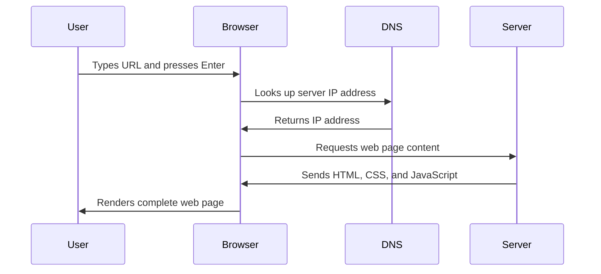

<!--
CO_OP_TRANSLATOR_METADATA:
{
  "original_hash": "33a875c522f237a2026e4653240dfc07",
  "translation_date": "2025-10-23T00:10:52+00:00",
  "source_file": "5-browser-extension/1-about-browsers/README.md",
  "language_code": "tr"
}
-->
# Tarayıcı Uzantısı Projesi Bölüm 1: Tarayıcılar Hakkında Her Şey


> Çizim notu: [Wassim Chegham](https://dev.to/wassimchegham/ever-wondered-what-happens-when-you-type-in-a-url-in-an-address-bar-in-a-browser-3dob)

## Ders Öncesi Test

[Ders öncesi testi](https://ff-quizzes.netlify.app/web/quiz/23)

### Giriş

Tarayıcı uzantıları, web tarama deneyiminizi geliştiren mini uygulamalardır. Tim Berners-Lee'nin etkileşimli bir web vizyonu gibi, uzantılar tarayıcının basit belge görüntüleme yeteneklerinin ötesine geçmesini sağlar. Hesaplarınızı güvenli tutan şifre yöneticilerinden, tasarımcıların mükemmel renk tonlarını yakalamasına yardımcı olan renk seçicilere kadar, uzantılar günlük tarama zorluklarını çözer.

İlk uzantınızı oluşturmadan önce, tarayıcıların nasıl çalıştığını anlamamız gerekiyor. Alexander Graham Bell'in telefonu icat etmeden önce ses iletimini anlaması gerektiği gibi, tarayıcı temellerini bilmek, mevcut tarayıcı sistemleriyle sorunsuz bir şekilde entegre olan uzantılar oluşturmanıza yardımcı olacaktır.

Bu dersin sonunda, tarayıcı mimarisini anlayacak ve ilk uzantınızı oluşturmaya başlamış olacaksınız.

## Web Tarayıcılarını Anlamak

Bir web tarayıcı, esasen sofistike bir belge yorumlayıcıdır. Adres çubuğuna "google.com" yazdığınızda, tarayıcı dünya çapındaki sunuculardan içerik talep etmek, ardından bu kodu gördüğünüz etkileşimli web sayfalarına ayrıştırmak ve işlemek gibi karmaşık bir dizi işlem gerçekleştirir.

Bu süreç, Tim Berners-Lee'nin 1990 yılında herkesin hiper bağlantılı belgelere erişebilmesi için tasarladığı ilk web tarayıcısı WorldWideWeb'in nasıl tasarlandığını yansıtır.

✅ **Biraz tarih**: İlk tarayıcı 'WorldWideWeb' olarak adlandırıldı ve 1990 yılında Sir Timothy Berners-Lee tarafından oluşturuldu.


> Bazı erken dönem tarayıcılar, [Karen McGrane](https://www.slideshare.net/KMcGrane/week-4-ixd-history-personal-computing) tarafından

### Tarayıcılar Web İçeriğini Nasıl İşler?

Bir URL girip bir web sayfası görmeniz arasında geçen süreç, saniyeler içinde gerçekleşen bir dizi koordineli adımı içerir:



**Bu süreçte neler gerçekleşir:**
- **Çevirir**: İnsan tarafından okunabilir URL'yi DNS araması yoluyla bir sunucu IP adresine
- **Kurulur**: HTTP veya HTTPS protokollerini kullanarak web sunucusuyla güvenli bir bağlantı
- **Talep eder**: Sunucudan belirli web sayfası içeriğini
- **Alır**: Sunucudan HTML işaretleme, CSS stilleri ve JavaScript kodu
- **İşler**: Tüm içeriği gördüğünüz etkileşimli web sayfasına dönüştürür

### Tarayıcı Temel Özellikleri

Modern tarayıcılar, uzantı geliştiricilerinin kullanabileceği birçok özellik sunar:

| Özellik | Amaç | Uzantı Fırsatları |
|---------|---------|------------------------|
| **İşleme Motoru** | HTML, CSS ve JavaScript'i görüntüler | İçerik değişikliği, stil ekleme |
| **JavaScript Motoru** | JavaScript kodunu çalıştırır | Özel scriptler, API etkileşimleri |
| **Yerel Depolama** | Veriyi yerel olarak kaydeder | Kullanıcı tercihleri, önbellek verileri |
| **Ağ Yığını** | Web isteklerini işler | İstek izleme, veri analizi |
| **Güvenlik Modeli** | Kullanıcıları zararlı içerikten korur | İçerik filtreleme, güvenlik geliştirmeleri |

**Bu özellikleri anlamak size şunları sağlar:**
- **Belirleme**: Uzantınızın en fazla değer katabileceği yerleri
- **Seçim**: Uzantınızın işlevselliği için doğru tarayıcı API'lerini seçme
- **Tasarım**: Tarayıcı sistemleriyle verimli çalışan uzantılar tasarlama
- **Güvence**: Uzantınızın tarayıcı güvenlik en iyi uygulamalarına uygun olmasını sağlama

### Tarayıcılar Arası Geliştirme Düşünceleri

Farklı tarayıcılar, standartları küçük farklılıklarla uygular, tıpkı farklı programlama dillerinin aynı algoritmayı farklı şekilde ele alması gibi. Chrome, Firefox ve Safari'nin her biri, uzantı geliştirme sırasında geliştiricilerin dikkate alması gereken benzersiz özelliklere sahiptir.

> 💡 **İpucu**: Uzantınızın özelliklerini planlarken farklı tarayıcılarda hangi web teknolojilerinin desteklendiğini kontrol etmek için [caniuse.com](https://www.caniuse.com) kullanın!

**Uzantı geliştirme için önemli hususlar:**
- Uzantınızı Chrome, Firefox ve Edge tarayıcılarında **test edin**
- Farklı tarayıcı uzantı API'lerine ve manifest formatlarına **uyum sağlayın**
- Farklı performans özelliklerini ve sınırlamaları **ele alın**
- Tarayıcıya özgü özellikler için **yedek çözümler sağlayın**

✅ **Analitik İçgörü**: Web geliştirme projelerinize analitik paketler kurarak kullanıcılarınızın hangi tarayıcıları tercih ettiğini belirleyebilirsiniz. Bu veri, hangi tarayıcıları öncelikli olarak desteklemeniz gerektiğini belirlemenize yardımcı olur.

## Tarayıcı Uzantılarını Anlamak

Tarayıcı uzantıları, doğrudan tarayıcı arayüzüne işlevsellik ekleyerek yaygın web tarama zorluklarını çözer. Ayrı uygulamalar veya karmaşık iş akışları gerektirmek yerine, uzantılar araçlara ve özelliklere anında erişim sağlar.

Bu konsept, erken dönem bilgisayar öncüleri gibi Douglas Engelbart'ın teknolojiyi kullanarak insan yeteneklerini artırmayı hayal ettiği şekilde, tarayıcının temel işlevselliğini artırır.

**Popüler uzantı kategorileri ve faydaları:**
- **Verimlilik Araçları**: Görev yöneticileri, not alma uygulamaları ve zaman takipçileri, düzenli kalmanıza yardımcı olur
- **Güvenlik Geliştirmeleri**: Şifre yöneticileri, reklam engelleyiciler ve gizlilik araçları, verilerinizi korur
- **Geliştirici Araçları**: Kod düzenleyiciler, renk seçiciler ve hata ayıklama araçları, geliştirmeyi kolaylaştırır
- **İçerik Geliştirme**: Okuma modları, video indiriciler ve ekran görüntüsü araçları, web deneyiminizi iyileştirir

✅ **Düşünme Sorusu**: En sevdiğiniz tarayıcı uzantıları nelerdir? Hangi özel görevleri yerine getiriyorlar ve tarama deneyiminizi nasıl iyileştiriyorlar?

## Uzantıları Yükleme ve Yönetme

Uzantı yükleme sürecini anlamak, insanların uzantınızı yüklerken yaşayacakları kullanıcı deneyimini tahmin etmenize yardımcı olur. Yükleme süreci, modern tarayıcılar arasında standartlaştırılmıştır, ancak arayüz tasarımında küçük farklılıklar vardır.


> **Önemli**: Kendi uzantılarınızı test ederken geliştirici modunu açtığınızdan ve diğer mağazalardan uzantılara izin verdiğinizden emin olun.

### Geliştirme Uzantısı Yükleme Süreci

Kendi uzantılarınızı geliştirirken ve test ederken şu iş akışını izleyin:

```bash
# Step 1: Build your extension
npm run build
```

**Bu komutun gerçekleştirdikleri:**
- Kaynak kodunuzu tarayıcıya hazır dosyalara **derler**
- JavaScript modüllerini optimize edilmiş paketlere **toplar**
- Nihai uzantı dosyalarını `/dist` klasöründe **oluşturur**
- Uzantınızı yükleme ve test için **hazırlar**

**Adım 2: Tarayıcı Uzantılarına Git**
1. Tarayıcınızın uzantı yönetim sayfasını **açın**
2. Sağ üstteki "Ayarlar ve daha fazlası" düğmesine (`...` simgesi) **tıklayın**
3. Açılır menüden "Uzantılar"ı **seçin**

**Adım 3: Uzantınızı Yükleyin**
- **Yeni yüklemeler için**: `load unpacked` seçeneğini seçin ve `/dist` klasörünüzü seçin
- **Güncellemeler için**: Zaten yüklenmiş uzantınızın yanındaki `reload` düğmesine tıklayın
- **Test için**: Ek hata ayıklama özelliklerine erişmek için "Geliştirici modu"nu etkinleştirin

### Üretim Uzantısı Yükleme

> ✅ **Not**: Bu geliştirme talimatları, yalnızca kendi oluşturduğunuz uzantılar için geçerlidir. Yayınlanmış uzantıları yüklemek için [Microsoft Edge Eklentileri mağazası](https://microsoftedge.microsoft.com/addons/Microsoft-Edge-Extensions-Home) gibi resmi tarayıcı uzantı mağazalarını ziyaret edin.

**Farkı anlamak:**
- **Geliştirme yüklemeleri**, geliştirme sırasında yayınlanmamış uzantıları test etmenize olanak tanır
- **Mağaza yüklemeleri**, otomatik güncellemelerle birlikte doğrulanmış, yayınlanmış uzantılar sağlar
- **Sideloading**, resmi mağazalar dışındaki uzantıların yüklenmesine olanak tanır (geliştirici modu gerektirir)

## Karbon Ayak İzi Uzantınızı Oluşturma

Bölgenizin enerji kullanımının karbon ayak izini gösteren bir tarayıcı uzantısı oluşturacağız. Bu proje, çevresel farkındalık için pratik bir araç oluştururken temel uzantı geliştirme kavramlarını gösterir.

Bu yaklaşım, John Dewey'nin eğitim teorilerinden bu yana etkili olduğu kanıtlanmış "yaparak öğrenme" ilkesini takip eder - teknik becerileri anlamlı gerçek dünya uygulamalarıyla birleştirir.

### Proje Gereksinimleri

Geliştirmeye başlamadan önce, gerekli kaynakları ve bağımlılıkları toplayalım:

**Gerekli API Erişimi:**
- **[CO2 Signal API anahtarı](https://www.co2signal.com/)**: Ücretsiz API anahtarınızı almak için e-posta adresinizi girin
- **[Bölge kodu](http://api.electricitymap.org/v3/zones)**: [Electricity Map](https://www.electricitymap.org/map) kullanarak bölge kodunuzu bulun (örneğin, Boston 'US-NEISO' kullanır)

**Geliştirme Araçları:**
- **[Node.js ve NPM](https://www.npmjs.com)**: Proje bağımlılıklarını yüklemek için paket yönetim aracı
- **[Başlangıç kodu](../../../../5-browser-extension/start)**: Geliştirmeye başlamak için `start` klasörünü indirin

✅ **Daha Fazla Bilgi Edinin**: Paket yönetimi becerilerinizi bu [kapsamlı öğrenme modülü](https://docs.microsoft.com/learn/modules/create-nodejs-project-dependencies/?WT.mc_id=academic-77807-sagibbon) ile geliştirin

### Proje Yapısını Anlamak

Proje yapısını anlamak, geliştirme çalışmalarını verimli bir şekilde organize etmeye yardımcı olur. İskenderiye Kütüphanesi'nin kolay bilgi erişimi için organize edildiği gibi, iyi yapılandırılmış bir kod tabanı geliştirmeyi daha verimli hale getirir:

```
project-root/
├── dist/                    # Built extension files
│   ├── manifest.json        # Extension configuration
│   ├── index.html           # User interface markup
│   ├── background.js        # Background script functionality
│   └── main.js              # Compiled JavaScript bundle
└── src/                     # Source development files
    └── index.js             # Your main JavaScript code
```

**Her dosyanın gerçekleştirdiklerini açıklamak:**
- **`manifest.json`**: Uzantı meta verilerini, izinleri ve giriş noktalarını **tanımlar**
- **`index.html`**: Kullanıcıların uzantınıza tıkladığında gördüğü kullanıcı arayüzünü **oluşturur**
- **`background.js`**: Arka plan görevlerini ve tarayıcı olay dinleyicilerini **yönetir**
- **`main.js`**: Derleme işleminden sonra nihai JavaScript'i **içerir**
- **`src/index.js`**: Geliştirme kodunuzu barındırır ve `main.js` dosyasına **derlenir**

> 💡 **Organizasyon İpucu**: API anahtarınızı ve bölge kodunuzu geliştirme sırasında kolay referans için güvenli bir notta saklayın. Uzantınızın işlevselliğini test etmek için bu değerlere ihtiyacınız olacak.

✅ **Güvenlik Notu**: API anahtarlarını veya hassas kimlik bilgilerini kod deposunuza asla yüklemeyin. Bunları güvenli bir şekilde nasıl yöneteceğinizi sonraki adımlarda göstereceğiz.

## Uzantı Arayüzünü Oluşturma

Şimdi kullanıcı arayüzü bileşenlerini oluşturacağız. Uzantı, ilk kurulum için bir yapılandırma ekranı ve veri görüntüleme için bir sonuç ekranı olmak üzere iki ekranlı bir yaklaşım kullanır.

Bu, bilgi ve seçenekleri mantıklı bir sırayla ortaya çıkararak kullanıcıları bunaltmaktan kaçınmak için bilgisayar arayüz tasarımında kullanılan aşamalı açıklama ilkesini takip eder.

### Uzantı Görünümleri Genel Bakış

**Kurulum Görünümü** - İlk kez kullanıcı yapılandırması:


**Sonuçlar Görünümü** - Karbon ayak izi veri görüntüleme:


### Yapılandırma Formunu Oluşturma

Kurulum formu, ilk kullanım sırasında kullanıcı yapılandırma verilerini toplar. Bir kez yapılandırıldığında, bu bilgi tarayıcı depolamasında gelecekteki oturumlar için kalıcı hale gelir.

`/dist/index.html` dosyasına şu form yapısını ekleyin:

```html
<form class="form-data" autocomplete="on">
    <div>
        <h2>New? Add your Information</h2>
    </div>
    <div>
        <label for="region">Region Name</label>
        <input type="text" id="region" required class="region-name" />
    </div>
    <div>
        <label for="api">Your API Key from tmrow</label>
        <input type="text" id="api" required class="api-key" />
    </div>
    <button class="search-btn">Submit</button>
</form>
```

**Bu formun gerçekleştirdikleri:**
- **Semantik** bir form yapısı oluşturur ve doğru etiketler ve giriş ilişkileri sağlar
- **Tarayıcı otomatik tamamlama** işlevselliğini kullanıcı deneyimini iyileştirmek için etkinleştirir
- **Her iki alanın** doldurulmasını `required` özelliği ile zorunlu kılar
- **Girdileri** kolay stil ve JavaScript hedefleme için açıklayıcı sınıf adlarıyla düzenler
- **İlk kez** uzantıyı kuran kullanıcılar için net talimatlar sağlar

### Sonuçları Görüntüleme Alanını Oluşturma

Son olarak, karbon ayak izi verilerini gösterecek sonuç alanını oluşturun. Bu HTML'yi formun altına ekleyin:

```html
<div class="result">
    <div class="loading">loading...</div>
    <div class="errors"></div>
    <div class="data"></div>
    <div class="result-container">
        <p><strong>Region: </strong><span class="my-region"></span></p>
        <p><strong>Carbon Usage: </strong><span class="carbon-usage"></span></p>
        <p><strong>Fossil Fuel Percentage: </strong><span class="fossil-fuel"></span></p>
    </div>
    <button class="clear-btn">Change region</button>
</div>
```

**Bu yapının sağladıkları:**
- **`loading`**: API verileri alınırken bir yükleme mesajı **gösterir**
- **`errors`**: API çağrıları başarısız olduğunda veya veriler geçersiz olduğunda hata mesajları **gösterir**
- **`data`**: Geliştirme sırasında hata ayıklama için ham verileri **tutar**
- **`result-container`**: Kullanıcılara biçimlendirilmiş karbon ayak izi bilgilerini **sunuyor**
- **`clear-btn`**: Kullanıcıların bölgelerini değiştirmelerine ve uzantıyı yeniden yapılandırmalarına **izin verir**

### Derleme Sürecini Ayarlama

Şimdi proje bağımlılıklarını yükleyelim ve derleme sürecini test edelim:

```bash
npm install
```

**Bu yükleme sürecinin gerçekleştirdikleri:**
- `package.json`'da belirtilen Webpack ve diğer geliştirme bağımlılıklarını **indirir**
- Modern JavaScript'i derlemek için derleme araç zincirini **yapılandırır**
- Uzantı oluşturma ve test için geliştirme ortamını **hazırlar**
- Kod paketleme, optimizasyon ve tarayıcı uyumluluğu özelliklerini **etkinleştirir**

> 💡 **Derleme Süreci Bilgisi**: Webpack, `/src/index.js` kaynak kodunuzu `/dist/main.js` içine paketler. Bu süreç, kodunuzu üretim için optimize eder ve tarayıcı uyumluluğunu sağlar.

### İlerlemenizi Test Etme

Bu noktada uzantınızı test edebilirsiniz:

1. Kodunuzu derlemek için **derleme komutunu çalıştırın**
2. Geliştirici modunu kullanarak uzantıyı tarayıcınıza **yükleyin**
3. Formun doğru şekilde görüntülendiğini ve profesyonel göründüğünü **doğrulayın**
4. Tüm form öğelerinin düzgün hizalandığını ve işlevsel olduğunu **kontrol edin**

**Başardıklarınız:**
- Uzantınız için temel HTML yapısını **oluşturdunuz**
- Hem yapılandırma hem de sonuç arayüzlerini doğru semantik işaretlemeyle **oluşturdunuz**
- Endüstri standart araçları kullanarak modern bir geliştirme iş akışı **kurdunuz**
- Etkileşimli JavaScript işlevselliği eklemek için temel hazırlık yaptınız

Tarayıcı uzantısı geliştirme sürecinin ilk aş
**Açıklama:** Tarayıcı uzantısını geliştirmek için API anahtarları ve bölge kodları girildiğinde kullanıcı deneyimini iyileştirmek amacıyla form doğrulama ve kullanıcı geri bildirim özellikleri ekleyin.

**Görev:** API anahtarı alanının en az 20 karakter içerip içermediğini ve bölge kodunun doğru formatta olup olmadığını (örneğin 'US-NEISO') kontrol eden JavaScript doğrulama fonksiyonları oluşturun. Geçerli girişler için giriş kenarlık renklerini yeşil, geçersiz girişler için kırmızı olarak değiştirerek görsel geri bildirim sağlayın. Ayrıca güvenlik amacıyla API anahtarını göster/gizle özelliği ekleyin.

[agent mode](https://code.visualstudio.com/blogs/2025/02/24/introducing-copilot-agent-mode) hakkında daha fazla bilgi edinin.

## 🚀 Zorluk

Bir tarayıcı uzantı mağazasına göz atın ve tarayıcınıza bir uzantı yükleyin. Dosyalarını ilginç şekillerde inceleyebilirsiniz. Neler keşfediyorsunuz?

## Ders Sonrası Test

[Ders sonrası test](https://ff-quizzes.netlify.app/web/quiz/24)

## İnceleme ve Kendi Kendine Çalışma

Bu derste web tarayıcısının tarihi hakkında biraz bilgi edindiniz; bu fırsatı değerlendirerek Dünya Çapında Ağ'ın mucitlerinin kullanımını nasıl hayal ettiklerini öğrenmek için tarihini daha fazla okuyabilirsiniz. Faydalı siteler şunları içerir:

[Web Tarayıcılarının Tarihi](https://www.mozilla.org/firefox/browsers/browser-history/)

[Web'in Tarihi](https://webfoundation.org/about/vision/history-of-the-web/)

[Tim Berners-Lee ile Röportaj](https://www.theguardian.com/technology/2019/mar/12/tim-berners-lee-on-30-years-of-the-web-if-we-dream-a-little-we-can-get-the-web-we-want)

## Ödev 

[Uzantınızı Yeniden Tasarlayın](assignment.md)

---

**Feragatname**:  
Bu belge, AI çeviri hizmeti [Co-op Translator](https://github.com/Azure/co-op-translator) kullanılarak çevrilmiştir. Doğruluk için çaba göstersek de, otomatik çeviriler hata veya yanlışlıklar içerebilir. Belgenin orijinal dili, yetkili kaynak olarak kabul edilmelidir. Kritik bilgiler için profesyonel insan çevirisi önerilir. Bu çevirinin kullanımından kaynaklanan yanlış anlamalar veya yanlış yorumlamalar için sorumluluk kabul etmiyoruz.